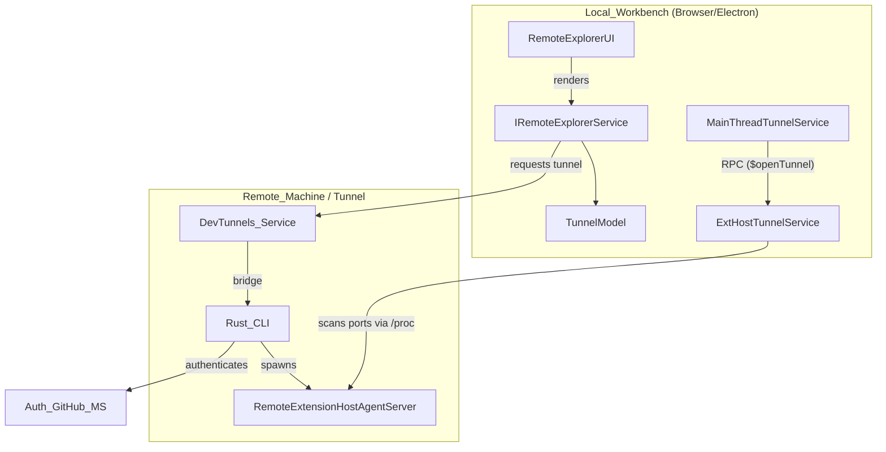
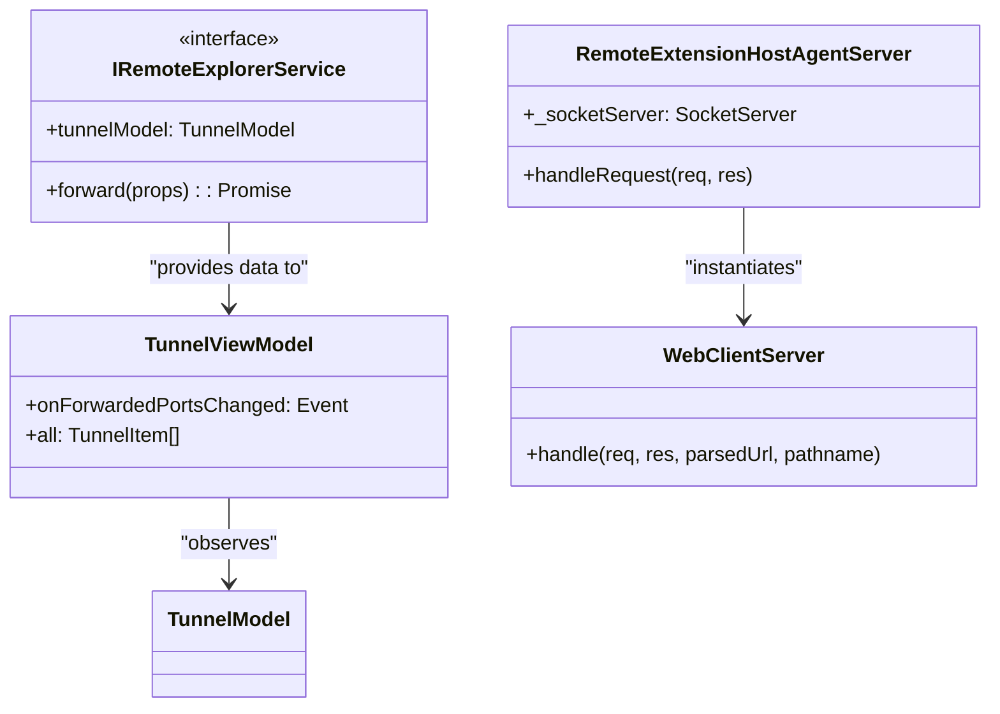

# Remote Development and Tunnels

Relevant source files

The following files were used as context for generating this wiki page:

- [cli/Cargo.lock](https://github.com/microsoft/vscode/blob/HEAD/cli/Cargo.lock)
- [cli/Cargo.toml](https://github.com/microsoft/vscode/blob/HEAD/cli/Cargo.toml)
- [cli/src/async_pipe.rs](https://github.com/microsoft/vscode/blob/HEAD/cli/src/async_pipe.rs)
- [cli/src/auth.rs](https://github.com/microsoft/vscode/blob/HEAD/cli/src/auth.rs)
- [cli/src/bin/code/main.rs](https://github.com/microsoft/vscode/blob/HEAD/cli/src/bin/code/main.rs)
- [cli/src/commands.rs](https://github.com/microsoft/vscode/blob/HEAD/cli/src/commands.rs)
- [cli/src/commands/agent.rs](https://github.com/microsoft/vscode/blob/HEAD/cli/src/commands/agent.rs)
- [cli/src/commands/agent_discovery.rs](https://github.com/microsoft/vscode/blob/HEAD/cli/src/commands/agent_discovery.rs)
- [cli/src/commands/agent_host.rs](https://github.com/microsoft/vscode/blob/HEAD/cli/src/commands/agent_host.rs)
- [cli/src/commands/agent_kill.rs](https://github.com/microsoft/vscode/blob/HEAD/cli/src/commands/agent_kill.rs)
- [cli/src/commands/agent_logs.rs](https://github.com/microsoft/vscode/blob/HEAD/cli/src/commands/agent_logs.rs)
- [cli/src/commands/agent_ps.rs](https://github.com/microsoft/vscode/blob/HEAD/cli/src/commands/agent_ps.rs)
- [cli/src/commands/agent_stop.rs](https://github.com/microsoft/vscode/blob/HEAD/cli/src/commands/agent_stop.rs)
- [cli/src/commands/args.rs](https://github.com/microsoft/vscode/blob/HEAD/cli/src/commands/args.rs)
- [cli/src/commands/serve_web.rs](https://github.com/microsoft/vscode/blob/HEAD/cli/src/commands/serve_web.rs)
- [cli/src/commands/tunnels.rs](https://github.com/microsoft/vscode/blob/HEAD/cli/src/commands/tunnels.rs)
- [cli/src/constants.rs](https://github.com/microsoft/vscode/blob/HEAD/cli/src/constants.rs)
- [cli/src/desktop/version_manager.rs](https://github.com/microsoft/vscode/blob/HEAD/cli/src/desktop/version_manager.rs)
- [cli/src/download_cache.rs](https://github.com/microsoft/vscode/blob/HEAD/cli/src/download_cache.rs)
- [cli/src/lib.rs](https://github.com/microsoft/vscode/blob/HEAD/cli/src/lib.rs)
- [cli/src/log.rs](https://github.com/microsoft/vscode/blob/HEAD/cli/src/log.rs)
- [cli/src/msgpack_rpc.rs](https://github.com/microsoft/vscode/blob/HEAD/cli/src/msgpack_rpc.rs)
- [cli/src/options.rs](https://github.com/microsoft/vscode/blob/HEAD/cli/src/options.rs)
- [cli/src/self_update.rs](https://github.com/microsoft/vscode/blob/HEAD/cli/src/self_update.rs)
- [cli/src/state.rs](https://github.com/microsoft/vscode/blob/HEAD/cli/src/state.rs)
- [cli/src/tunnels.rs](https://github.com/microsoft/vscode/blob/HEAD/cli/src/tunnels.rs)
- [cli/src/tunnels/agent_host.rs](https://github.com/microsoft/vscode/blob/HEAD/cli/src/tunnels/agent_host.rs)
- [cli/src/tunnels/challenge.rs](https://github.com/microsoft/vscode/blob/HEAD/cli/src/tunnels/challenge.rs)
- [cli/src/tunnels/code_server.rs](https://github.com/microsoft/vscode/blob/HEAD/cli/src/tunnels/code_server.rs)
- [cli/src/tunnels/control_server.rs](https://github.com/microsoft/vscode/blob/HEAD/cli/src/tunnels/control_server.rs)
- [cli/src/tunnels/dev_tunnels.rs](https://github.com/microsoft/vscode/blob/HEAD/cli/src/tunnels/dev_tunnels.rs)
- [cli/src/tunnels/local_forwarding.rs](https://github.com/microsoft/vscode/blob/HEAD/cli/src/tunnels/local_forwarding.rs)
- [cli/src/tunnels/port_forwarder.rs](https://github.com/microsoft/vscode/blob/HEAD/cli/src/tunnels/port_forwarder.rs)
- [cli/src/tunnels/protocol.rs](https://github.com/microsoft/vscode/blob/HEAD/cli/src/tunnels/protocol.rs)
- [cli/src/tunnels/server_bridge.rs](https://github.com/microsoft/vscode/blob/HEAD/cli/src/tunnels/server_bridge.rs)
- [cli/src/tunnels/service.rs](https://github.com/microsoft/vscode/blob/HEAD/cli/src/tunnels/service.rs)
- [cli/src/tunnels/service_linux.rs](https://github.com/microsoft/vscode/blob/HEAD/cli/src/tunnels/service_linux.rs)
- [cli/src/tunnels/service_macos.rs](https://github.com/microsoft/vscode/blob/HEAD/cli/src/tunnels/service_macos.rs)
- [cli/src/tunnels/service_windows.rs](https://github.com/microsoft/vscode/blob/HEAD/cli/src/tunnels/service_windows.rs)
- [cli/src/tunnels/singleton_client.rs](https://github.com/microsoft/vscode/blob/HEAD/cli/src/tunnels/singleton_client.rs)
- [cli/src/tunnels/singleton_server.rs](https://github.com/microsoft/vscode/blob/HEAD/cli/src/tunnels/singleton_server.rs)
- [cli/src/tunnels/socket_signal.rs](https://github.com/microsoft/vscode/blob/HEAD/cli/src/tunnels/socket_signal.rs)
- [cli/src/util/command.rs](https://github.com/microsoft/vscode/blob/HEAD/cli/src/util/command.rs)
- [cli/src/util/errors.rs](https://github.com/microsoft/vscode/blob/HEAD/cli/src/util/errors.rs)
- [cli/src/util/io.rs](https://github.com/microsoft/vscode/blob/HEAD/cli/src/util/io.rs)
- [cli/src/util/sync.rs](https://github.com/microsoft/vscode/blob/HEAD/cli/src/util/sync.rs)
- [extensions/configuration-editing/schemas/attachContainer.schema.json](https://github.com/microsoft/vscode/blob/HEAD/extensions/configuration-editing/schemas/attachContainer.schema.json)
- [extensions/tunnel-forwarding/.vscode/launch.json](https://github.com/microsoft/vscode/blob/HEAD/extensions/tunnel-forwarding/.vscode/launch.json)
- [extensions/tunnel-forwarding/.vscodeignore](https://github.com/microsoft/vscode/blob/HEAD/extensions/tunnel-forwarding/.vscodeignore)
- [extensions/tunnel-forwarding/src/extension.ts](https://github.com/microsoft/vscode/blob/HEAD/extensions/tunnel-forwarding/src/extension.ts)
- [src/vs/base/common/network.ts](https://github.com/microsoft/vscode/blob/HEAD/src/vs/base/common/network.ts)
- [src/vs/base/parts/ipc/common/ipc.net.ts](https://github.com/microsoft/vscode/blob/HEAD/src/vs/base/parts/ipc/common/ipc.net.ts)
- [src/vs/base/parts/ipc/node/ipc.net.ts](https://github.com/microsoft/vscode/blob/HEAD/src/vs/base/parts/ipc/node/ipc.net.ts)
- [src/vs/base/parts/ipc/test/node/ipc.net.test.ts](https://github.com/microsoft/vscode/blob/HEAD/src/vs/base/parts/ipc/test/node/ipc.net.test.ts)
- [src/vs/platform/remote/browser/browserSocketFactory.ts](https://github.com/microsoft/vscode/blob/HEAD/src/vs/platform/remote/browser/browserSocketFactory.ts)
- [src/vs/platform/remote/browser/remoteAuthorityResolverService.ts](https://github.com/microsoft/vscode/blob/HEAD/src/vs/platform/remote/browser/remoteAuthorityResolverService.ts)
- [src/vs/platform/remote/common/remote.ts](https://github.com/microsoft/vscode/blob/HEAD/src/vs/platform/remote/common/remote.ts)
- [src/vs/platform/remote/common/remoteAgentConnection.ts](https://github.com/microsoft/vscode/blob/HEAD/src/vs/platform/remote/common/remoteAgentConnection.ts)
- [src/vs/platform/remote/common/remoteAgentEnvironment.ts](https://github.com/microsoft/vscode/blob/HEAD/src/vs/platform/remote/common/remoteAgentEnvironment.ts)
- [src/vs/platform/remote/common/remoteAuthorityResolver.ts](https://github.com/microsoft/vscode/blob/HEAD/src/vs/platform/remote/common/remoteAuthorityResolver.ts)
- [src/vs/platform/remote/common/remoteExtensionsScanner.ts](https://github.com/microsoft/vscode/blob/HEAD/src/vs/platform/remote/common/remoteExtensionsScanner.ts)
- [src/vs/platform/remote/common/remoteSocketFactoryService.ts](https://github.com/microsoft/vscode/blob/HEAD/src/vs/platform/remote/common/remoteSocketFactoryService.ts)
- [src/vs/platform/remote/node/nodeSocketFactory.ts](https://github.com/microsoft/vscode/blob/HEAD/src/vs/platform/remote/node/nodeSocketFactory.ts)
- [src/vs/platform/tunnel/common/tunnel.ts](https://github.com/microsoft/vscode/blob/HEAD/src/vs/platform/tunnel/common/tunnel.ts)
- [src/vs/platform/tunnel/node/sharedProcessTunnelService.ts](https://github.com/microsoft/vscode/blob/HEAD/src/vs/platform/tunnel/node/sharedProcessTunnelService.ts)
- [src/vs/platform/tunnel/node/tunnelService.ts](https://github.com/microsoft/vscode/blob/HEAD/src/vs/platform/tunnel/node/tunnelService.ts)
- [src/vs/platform/tunnel/test/common/tunnel.test.ts](https://github.com/microsoft/vscode/blob/HEAD/src/vs/platform/tunnel/test/common/tunnel.test.ts)
- [src/vs/platform/webview/common/webviewPortMapping.ts](https://github.com/microsoft/vscode/blob/HEAD/src/vs/platform/webview/common/webviewPortMapping.ts)
- [src/vs/server/node/extensionHostConnection.ts](https://github.com/microsoft/vscode/blob/HEAD/src/vs/server/node/extensionHostConnection.ts)
- [src/vs/server/node/remoteAgentEnvironmentImpl.ts](https://github.com/microsoft/vscode/blob/HEAD/src/vs/server/node/remoteAgentEnvironmentImpl.ts)
- [src/vs/server/node/remoteExtensionHostAgentServer.ts](https://github.com/microsoft/vscode/blob/HEAD/src/vs/server/node/remoteExtensionHostAgentServer.ts)
- [src/vs/server/node/remoteExtensionsScanner.ts](https://github.com/microsoft/vscode/blob/HEAD/src/vs/server/node/remoteExtensionsScanner.ts)
- [src/vs/server/node/serverConnectionToken.ts](https://github.com/microsoft/vscode/blob/HEAD/src/vs/server/node/serverConnectionToken.ts)
- [src/vs/server/node/serverEnvironmentService.ts](https://github.com/microsoft/vscode/blob/HEAD/src/vs/server/node/serverEnvironmentService.ts)
- [src/vs/server/node/webClientServer.ts](https://github.com/microsoft/vscode/blob/HEAD/src/vs/server/node/webClientServer.ts)
- [src/vs/server/test/node/serverConnectionToken.test.ts](https://github.com/microsoft/vscode/blob/HEAD/src/vs/server/test/node/serverConnectionToken.test.ts)
- [src/vs/workbench/api/browser/mainThreadTunnelService.ts](https://github.com/microsoft/vscode/blob/HEAD/src/vs/workbench/api/browser/mainThreadTunnelService.ts)
- [src/vs/workbench/api/common/extHostTunnelService.ts](https://github.com/microsoft/vscode/blob/HEAD/src/vs/workbench/api/common/extHostTunnelService.ts)
- [src/vs/workbench/api/node/extHostTunnelService.ts](https://github.com/microsoft/vscode/blob/HEAD/src/vs/workbench/api/node/extHostTunnelService.ts)
- [src/vs/workbench/api/node/extensionHostProcess.ts](https://github.com/microsoft/vscode/blob/HEAD/src/vs/workbench/api/node/extensionHostProcess.ts)
- [src/vs/workbench/api/worker/extensionHostWorker.ts](https://github.com/microsoft/vscode/blob/HEAD/src/vs/workbench/api/worker/extensionHostWorker.ts)
- [src/vs/workbench/browser/parts/views/viewsViewlet.ts](https://github.com/microsoft/vscode/blob/HEAD/src/vs/workbench/browser/parts/views/viewsViewlet.ts)
- [src/vs/workbench/contrib/remote/browser/explorerViewItems.ts](https://github.com/microsoft/vscode/blob/HEAD/src/vs/workbench/contrib/remote/browser/explorerViewItems.ts)
- [src/vs/workbench/contrib/remote/browser/media/remoteViewlet.css](https://github.com/microsoft/vscode/blob/HEAD/src/vs/workbench/contrib/remote/browser/media/remoteViewlet.css)
- [src/vs/workbench/contrib/remote/browser/media/tunnelView.css](https://github.com/microsoft/vscode/blob/HEAD/src/vs/workbench/contrib/remote/browser/media/tunnelView.css)
- [src/vs/workbench/contrib/remote/browser/remote.contribution.ts](https://github.com/microsoft/vscode/blob/HEAD/src/vs/workbench/contrib/remote/browser/remote.contribution.ts)
- [src/vs/workbench/contrib/remote/browser/remote.ts](https://github.com/microsoft/vscode/blob/HEAD/src/vs/workbench/contrib/remote/browser/remote.ts)
- [src/vs/workbench/contrib/remote/browser/remoteExplorer.ts](https://github.com/microsoft/vscode/blob/HEAD/src/vs/workbench/contrib/remote/browser/remoteExplorer.ts)
- [src/vs/workbench/contrib/remote/browser/remoteIcons.ts](https://github.com/microsoft/vscode/blob/HEAD/src/vs/workbench/contrib/remote/browser/remoteIcons.ts)
- [src/vs/workbench/contrib/remote/browser/remoteStartEntry.contribution.ts](https://github.com/microsoft/vscode/blob/HEAD/src/vs/workbench/contrib/remote/browser/remoteStartEntry.contribution.ts)
- [src/vs/workbench/contrib/remote/browser/remoteStartEntry.ts](https://github.com/microsoft/vscode/blob/HEAD/src/vs/workbench/contrib/remote/browser/remoteStartEntry.ts)
- [src/vs/workbench/contrib/remote/browser/showCandidate.ts](https://github.com/microsoft/vscode/blob/HEAD/src/vs/workbench/contrib/remote/browser/showCandidate.ts)
- [src/vs/workbench/contrib/remote/browser/tunnelFactory.ts](https://github.com/microsoft/vscode/blob/HEAD/src/vs/workbench/contrib/remote/browser/tunnelFactory.ts)
- [src/vs/workbench/contrib/remote/browser/tunnelView.ts](https://github.com/microsoft/vscode/blob/HEAD/src/vs/workbench/contrib/remote/browser/tunnelView.ts)
- [src/vs/workbench/contrib/remote/browser/urlFinder.ts](https://github.com/microsoft/vscode/blob/HEAD/src/vs/workbench/contrib/remote/browser/urlFinder.ts)
- [src/vs/workbench/contrib/remote/common/remote.contribution.ts](https://github.com/microsoft/vscode/blob/HEAD/src/vs/workbench/contrib/remote/common/remote.contribution.ts)
- [src/vs/workbench/contrib/remote/test/browser/urlFinder.test.ts](https://github.com/microsoft/vscode/blob/HEAD/src/vs/workbench/contrib/remote/test/browser/urlFinder.test.ts)
- [src/vs/workbench/services/extensions/worker/webWorkerExtensionHostIframe.html](https://github.com/microsoft/vscode/blob/HEAD/src/vs/workbench/services/extensions/worker/webWorkerExtensionHostIframe.html)
- [src/vs/workbench/services/remote/common/abstractRemoteAgentService.ts](https://github.com/microsoft/vscode/blob/HEAD/src/vs/workbench/services/remote/common/abstractRemoteAgentService.ts)
- [src/vs/workbench/services/remote/common/remoteAgentEnvironmentChannel.ts](https://github.com/microsoft/vscode/blob/HEAD/src/vs/workbench/services/remote/common/remoteAgentEnvironmentChannel.ts)
- [src/vs/workbench/services/remote/common/remoteAgentService.ts](https://github.com/microsoft/vscode/blob/HEAD/src/vs/workbench/services/remote/common/remoteAgentService.ts)
- [src/vs/workbench/services/remote/common/remoteExplorerService.ts](https://github.com/microsoft/vscode/blob/HEAD/src/vs/workbench/services/remote/common/remoteExplorerService.ts)
- [src/vs/workbench/services/remote/common/remoteExtensionsScanner.ts](https://github.com/microsoft/vscode/blob/HEAD/src/vs/workbench/services/remote/common/remoteExtensionsScanner.ts)
- [src/vs/workbench/services/remote/common/tunnelModel.ts](https://github.com/microsoft/vscode/blob/HEAD/src/vs/workbench/services/remote/common/tunnelModel.ts)
- [src/vs/workbench/services/tunnel/browser/tunnelService.ts](https://github.com/microsoft/vscode/blob/HEAD/src/vs/workbench/services/tunnel/browser/tunnelService.ts)
- [src/vscode-dts/vscode.proposed.resolvers.d.ts](https://github.com/microsoft/vscode/blob/HEAD/src/vscode-dts/vscode.proposed.resolvers.d.ts)
- [src/vscode-dts/vscode.proposed.tunnels.d.ts](https://github.com/microsoft/vscode/blob/HEAD/src/vscode-dts/vscode.proposed.tunnels.d.ts)

Remote development in VS Code allows users to use a local installation of VS Code to develop on remote machines, such as virtual machines, containers, or via the web. This is achieved through a client-server architecture where the VS Code "Frontend" (UI) connects to a "Remote Extension Host" (REH) server.

## Overview of Remote Architecture

The remote development system consists of several moving parts that synchronize the local workbench with a remote environment. The primary components are:

1.  **Remote Extension Host (REH) Server**: A Node.js server running on the remote machine that hosts the extensions, terminal processes, and file system access.
2.  **CLI Tunnel Client**: A Rust-based executable that facilitates secure connections between the local machine and the remote server, often bypassing firewalls via "tunnels".
3.  **Tunneling Subsystem**: Logic within the workbench and the extension host to detect, forward, and manage network ports (e.g., a web server running on the remote machine).
4.  **Remote Explorer UI**: The workbench interface for managing remote connections, forwarded ports, and help resources.

### System Connectivity Diagram

This diagram shows how the local workbench interacts with the remote components using the `IRemoteAgentService` and the tunnel infrastructure.

Sources: `IRemoteExplorerService` [src/vs/workbench/services/remote/common/remoteExplorerService.ts:126-146](https://github.com/microsoft/vscode/blob/HEAD/src/vs/workbench/services/remote/common/remoteExplorerService.ts#L126-L146), `MainThreadTunnelService` [src/vs/workbench/api/browser/mainThreadTunnelService.ts:103-113](https://github.com/microsoft/vscode/blob/HEAD/src/vs/workbench/api/browser/mainThreadTunnelService.ts#L103-L113), `TunnelModel` [src/vs/workbench/services/remote/common/tunnelModel.ts:57-57](https://github.com/microsoft/vscode/blob/HEAD/src/vs/workbench/services/remote/common/tunnelModel.ts#L57)

## Remote Extension Host Server

The **Remote Extension Host Server** (REH) is the backbone of the remote experience. It is responsible for managing the lifecycle of the extension host process on the remote machine and providing the workbench with access to remote resources.

*   **Connection Management**: It handles incoming connections via the `RemoteAgentConnection` protocol, supporting different connection types like `Management`, `ExtensionHost`, and `Tunnel` [src/vs/platform/remote/common/remoteAgentConnection.ts:32-32](https://github.com/microsoft/vscode/blob/HEAD/src/vs/platform/remote/common/remoteAgentConnection.ts#L32). It uses `PersistentProtocol` to handle socket-level communication [src/vs/server/node/remoteExtensionHostAgentServer.ts:26-27](https://github.com/microsoft/vscode/blob/HEAD/src/vs/server/node/remoteExtensionHostAgentServer.ts#L26-L27).
*   **Web Client Hosting**: The server can host a web-based version of the workbench using `WebClientServer`, which serves static assets (via `/static`) and handles the workbench HTML [src/vs/server/node/webClientServer.ts:117-157](https://github.com/microsoft/vscode/blob/HEAD/src/vs/server/node/webClientServer.ts#L117-L157).
*   **Authentication**: Connections are secured using a `ServerConnectionToken`, which can be passed via cookies (`vscode-tkn`) or query parameters (`tkn`) [src/vs/base/common/network.ts:187-188](https://github.com/microsoft/vscode/blob/HEAD/src/vs/base/common/network.ts#L187-L188).

For details, see [Remote Extension Host Server](#13.1).

## CLI Tunnel Client (Rust)

The Rust-based CLI (located in `cli/`) provides the `code tunnel` command. It allows users to expose a machine to the internet securely using Microsoft Dev Tunnels, enabling connection from `vscode.dev` or a local VS Code desktop without requiring SSH.

*   **Tunnel Orchestration**: Creates and maintains secure tunnels to the VS Code relay service using the `DevTunnels` integration [cli/src/commands/tunnels.rs:43-43](https://github.com/microsoft/vscode/blob/HEAD/cli/src/commands/tunnels.rs#L43).
*   **Control Server**: Implements an RPC control server to manage server lifecycles, file system operations, and port forwarding [cli/src/commands/tunnels.rs:49-51](https://github.com/microsoft/vscode/blob/HEAD/cli/src/commands/tunnels.rs#L49-L51).
*   **Process Management**: Manages the downloading and execution of the `RemoteExtensionHostAgentServer` on the remote machine via `code-server` arguments [cli/src/commands/args.rs:126-149](https://github.com/microsoft/vscode/blob/HEAD/cli/src/commands/args.rs#L126-L149).
*   **Subcommands**: Includes commands for `tunnel`, `serve-web`, and `agent` host management [cli/src/commands/args.rs:166-192](https://github.com/microsoft/vscode/blob/HEAD/cli/src/commands/args.rs#L166-L192).

For details, see [CLI Tunnel Client (Rust)](#13.2).

## Port Forwarding and Tunneling

Port forwarding allows a developer to access a web application running on the remote machine (e.g., on port 3000) as if it were running on `localhost:3000`.

### Port Discovery and Lifecycle

The system automatically detects listening ports on the remote machine and synchronizes them with the local `TunnelModel` [src/vs/workbench/services/remote/common/tunnelModel.ts:57-57](https://github.com/microsoft/vscode/blob/HEAD/src/vs/workbench/services/remote/common/tunnelModel.ts#L57).

| Component | Role | Key Code Entities |
| :--- | :--- | :--- |
| **Discovery** | Scans for active network listeners on the remote. | `CandidatePort` [src/vs/workbench/services/remote/common/tunnelModel.ts:57-57](https://github.com/microsoft/vscode/blob/HEAD/src/vs/workbench/services/remote/common/tunnelModel.ts#L57) |
| **Attributes** | Determines if a port should be auto-forwarded. | `PortAttributesProvider` [src/vs/workbench/api/browser/mainThreadTunnelService.ts:25-25](https://github.com/microsoft/vscode/blob/HEAD/src/vs/workbench/api/browser/mainThreadTunnelService.ts#L25) |
| **Model** | Maintains the state of all forwarded and candidate ports. | `TunnelModel` [src/vs/workbench/services/remote/common/tunnelModel.ts:57-57](https://github.com/microsoft/vscode/blob/HEAD/src/vs/workbench/services/remote/common/tunnelModel.ts#L57) |
| **Provider** | The implementation that creates the tunnel. | `ITunnelProvider`, `ITunnelService` [src/vs/platform/tunnel/common/tunnel.ts:11-11](https://github.com/microsoft/vscode/blob/HEAD/src/vs/platform/tunnel/common/tunnel.ts#L11) |

Sources: [src/vs/workbench/api/browser/mainThreadTunnelService.ts:103-113](https://github.com/microsoft/vscode/blob/HEAD/src/vs/workbench/api/browser/mainThreadTunnelService.ts#L103-L113), [src/vs/workbench/services/remote/common/remoteExplorerService.ts:132-132](https://github.com/microsoft/vscode/blob/HEAD/src/vs/workbench/services/remote/common/remoteExplorerService.ts#L132)

## Remote Explorer UI

The **Remote Explorer** provides the user interface for interacting with remote targets and managing forwarded ports.

*   **Forwarded Ports View**: Displays active tunnels and allows manual port forwarding via `ForwardedPortsView` [src/vs/workbench/contrib/remote/browser/remoteExplorer.ts:59-59](https://github.com/microsoft/vscode/blob/HEAD/src/vs/workbench/contrib/remote/browser/remoteExplorer.ts#L59).
*   **Remote Help**: A contributed view (`remoteHelp` extension point) that provides documentation and issue reporting specific to the remote authority [src/vs/workbench/services/remote/common/remoteExplorerService.ts:86-118](https://github.com/microsoft/vscode/blob/HEAD/src/vs/workbench/services/remote/common/remoteExplorerService.ts#L86-L118).
*   **Status Bar**: Shows the current remote connection status and provides quick access to remote commands [src/vs/workbench/contrib/remote/browser/remoteExplorer.ts:15-15](https://github.com/microsoft/vscode/blob/HEAD/src/vs/workbench/contrib/remote/browser/remoteExplorer.ts#L15).

### UI Component Association

Sources: `IRemoteExplorerService` [src/vs/workbench/services/remote/common/remoteExplorerService.ts:126-146](https://github.com/microsoft/vscode/blob/HEAD/src/vs/workbench/services/remote/common/remoteExplorerService.ts#L126-L146), `RemoteExtensionHostAgentServer` [src/vs/server/node/remoteExtensionHostAgentServer.ts:68-112](https://github.com/microsoft/vscode/blob/HEAD/src/vs/server/node/remoteExtensionHostAgentServer.ts#L68-L112), `WebClientServer` [src/vs/server/node/webClientServer.ts:117-133](https://github.com/microsoft/vscode/blob/HEAD/src/vs/server/node/webClientServer.ts#L117-L133)

## Child Pages

- [Remote Extension Host Server](#13.1) — Detailed look at the Node.js server (`remoteExtensionHostAgentServer.ts`), connection protocol, and `WebClientServer`.
- [CLI Tunnel Client (Rust)](#13.2) — Deep dive into the Rust CLI, authentication, and DevTunnels integration.4d:T