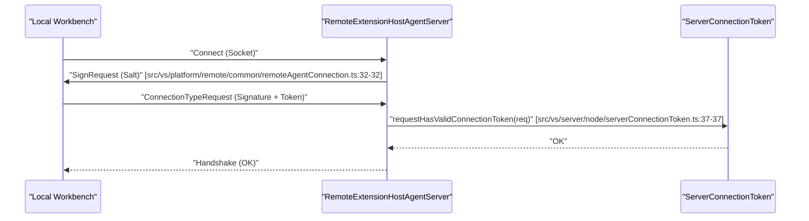
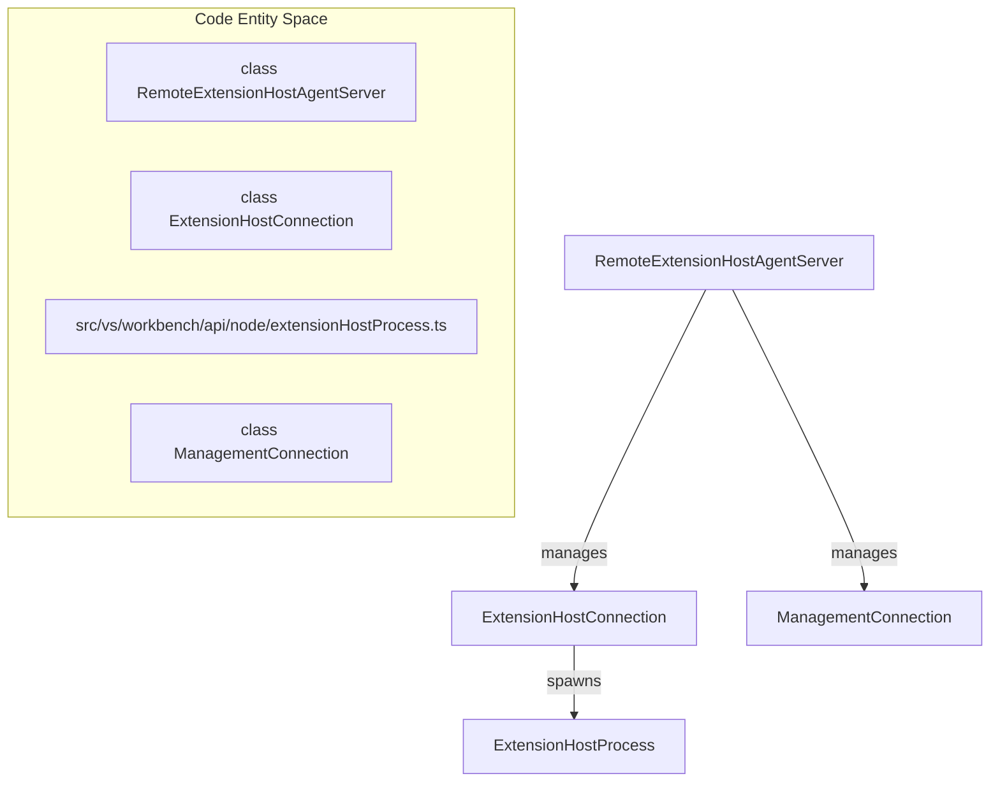
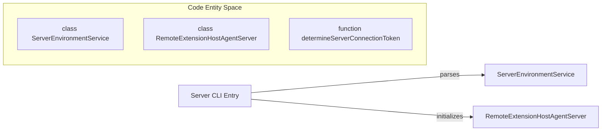

# Remote Extension Host Server

Relevant source files

The following files were used as context for generating this wiki page:

- [product.json](product.json)
- [src/vs/base/common/network.ts](src/vs/base/common/network.ts)
- [src/vs/base/common/product.ts](src/vs/base/common/product.ts)
- [src/vs/base/parts/ipc/common/ipc.net.ts](src/vs/base/parts/ipc/common/ipc.net.ts)
- [src/vs/base/parts/ipc/node/ipc.net.ts](src/vs/base/parts/ipc/node/ipc.net.ts)
- [src/vs/base/parts/ipc/test/node/ipc.net.test.ts](src/vs/base/parts/ipc/test/node/ipc.net.test.ts)
- [src/vs/code/node/cli.ts](src/vs/code/node/cli.ts)
- [src/vs/platform/environment/common/argv.ts](src/vs/platform/environment/common/argv.ts)
- [src/vs/platform/environment/common/environment.ts](src/vs/platform/environment/common/environment.ts)
- [src/vs/platform/environment/common/environmentService.ts](src/vs/platform/environment/common/environmentService.ts)
- [src/vs/platform/environment/electron-main/environmentMainService.ts](src/vs/platform/environment/electron-main/environmentMainService.ts)
- [src/vs/platform/environment/node/argv.ts](src/vs/platform/environment/node/argv.ts)
- [src/vs/platform/environment/node/environmentService.ts](src/vs/platform/environment/node/environmentService.ts)
- [src/vs/platform/environment/node/stdin.ts](src/vs/platform/environment/node/stdin.ts)
- [src/vs/platform/log/browser/log.ts](src/vs/platform/log/browser/log.ts)
- [src/vs/platform/product/common/product.ts](src/vs/platform/product/common/product.ts)
- [src/vs/platform/remote/browser/browserSocketFactory.ts](src/vs/platform/remote/browser/browserSocketFactory.ts)
- [src/vs/platform/remote/browser/remoteAuthorityResolverService.ts](src/vs/platform/remote/browser/remoteAuthorityResolverService.ts)
- [src/vs/platform/remote/common/remoteAgentConnection.ts](src/vs/platform/remote/common/remoteAgentConnection.ts)
- [src/vs/platform/remote/common/remoteAgentEnvironment.ts](src/vs/platform/remote/common/remoteAgentEnvironment.ts)
- [src/vs/platform/remote/common/remoteAuthorityResolver.ts](src/vs/platform/remote/common/remoteAuthorityResolver.ts)
- [src/vs/platform/remote/common/remoteExtensionsScanner.ts](src/vs/platform/remote/common/remoteExtensionsScanner.ts)
- [src/vs/platform/remote/common/remoteSocketFactoryService.ts](src/vs/platform/remote/common/remoteSocketFactoryService.ts)
- [src/vs/platform/remote/node/nodeSocketFactory.ts](src/vs/platform/remote/node/nodeSocketFactory.ts)
- [src/vs/server/node/extensionHostConnection.ts](src/vs/server/node/extensionHostConnection.ts)
- [src/vs/server/node/remoteAgentEnvironmentImpl.ts](src/vs/server/node/remoteAgentEnvironmentImpl.ts)
- [src/vs/server/node/remoteExtensionHostAgentServer.ts](src/vs/server/node/remoteExtensionHostAgentServer.ts)
- [src/vs/server/node/remoteExtensionsScanner.ts](src/vs/server/node/remoteExtensionsScanner.ts)
- [src/vs/server/node/server.cli.ts](src/vs/server/node/server.cli.ts)
- [src/vs/server/node/serverConnectionToken.ts](src/vs/server/node/serverConnectionToken.ts)
- [src/vs/server/node/serverEnvironmentService.ts](src/vs/server/node/serverEnvironmentService.ts)
- [src/vs/server/node/webClientServer.ts](src/vs/server/node/webClientServer.ts)
- [src/vs/server/test/node/serverConnectionToken.test.ts](src/vs/server/test/node/serverConnectionToken.test.ts)
- [src/vs/workbench/api/node/extensionHostProcess.ts](src/vs/workbench/api/node/extensionHostProcess.ts)
- [src/vs/workbench/api/worker/extensionHostWorker.ts](src/vs/workbench/api/worker/extensionHostWorker.ts)
- [src/vs/workbench/services/environment/browser/environmentService.ts](src/vs/workbench/services/environment/browser/environmentService.ts)
- [src/vs/workbench/services/environment/common/environmentService.ts](src/vs/workbench/services/environment/common/environmentService.ts)
- [src/vs/workbench/services/environment/electron-browser/environmentService.ts](src/vs/workbench/services/environment/electron-browser/environmentService.ts)
- [src/vs/workbench/services/extensions/worker/webWorkerExtensionHostIframe.html](src/vs/workbench/services/extensions/worker/webWorkerExtensionHostIframe.html)
- [src/vs/workbench/services/remote/common/abstractRemoteAgentService.ts](src/vs/workbench/services/remote/common/abstractRemoteAgentService.ts)
- [src/vs/workbench/services/remote/common/remoteAgentEnvironmentChannel.ts](src/vs/workbench/services/remote/common/remoteAgentEnvironmentChannel.ts)
- [src/vs/workbench/services/remote/common/remoteAgentService.ts](src/vs/workbench/services/remote/common/remoteAgentService.ts)
- [src/vs/workbench/services/remote/common/remoteExtensionsScanner.ts](src/vs/workbench/services/remote/common/remoteExtensionsScanner.ts)
- [src/vscode-dts/vscode.proposed.resolvers.d.ts](src/vscode-dts/vscode.proposed.resolvers.d.ts)
- [src/vscode-dts/vscode.proposed.tunnels.d.ts](src/vscode-dts/vscode.proposed.tunnels.d.ts)
- [test/integration/browser/src/index.ts](test/integration/browser/src/index.ts)

The **Remote Extension Host Server** (implemented as `RemoteExtensionHostAgentServer`) is the central entry point for VS Code's remote development capabilities. It runs on a remote machine (or in a container) and manages the lifecycle of remote extension hosts, file system access, and terminal processes. It acts as a bridge between the local workbench (Desktop or Web) and the remote environment.

## Server Architecture and Lifecycle

The server is built on a modular architecture using dependency injection, similar to the VS Code workbench. It initializes core services such as logging, environment management, and telemetry before starting the socket server to listen for incoming client connections.

### Key Server Components

| Component | Class/Entity | Responsibility |
| :--- | :--- | :--- |
| **Agent Server** | `RemoteExtensionHostAgentServer` | Orchestrates connections, handles HTTP requests, and manages reconnection tokens [src/vs/server/node/remoteExtensionHostAgentServer.ts:68-112](). |
| **Socket Server** | `SocketServer` | Manages the underlying TCP or WebSocket connections [src/vs/server/node/serverServices.ts:40-40](). |
| **Environment** | `IServerEnvironmentService` | Provides paths for data, extensions, and logs [src/vs/server/node/serverEnvironmentService.ts:14-14](). |
| **Connection Token** | `ServerConnectionToken` | Manages authentication tokens required for client-server communication [src/vs/server/node/serverConnectionToken.ts:37-37](). |
| **Web Server** | `WebClientServer` | Serves the workbench HTML and static assets for VS Code Web [src/vs/server/node/webClientServer.ts:117-132](). |

### Connection Handshake
When a client connects, it performs a handshake to determine the `ConnectionType`. The server supports management connections for internal tasks and extension host connections for running extension code. The handshake involves a `SignRequest` and a `HandshakeMessage` [src/vs/platform/remote/common/remoteAgentConnection.ts:32-32](). The server uses a native module `vsda` for cryptographic signing and validation of messages during this process [src/vs/server/node/remoteExtensionHostAgentServer.ts:54-66]().

**Sources:**
- [src/vs/server/node/remoteExtensionHostAgentServer.ts:68-112]()
- [src/vs/server/node/serverConnectionToken.ts:37-37]()
- [src/vs/platform/remote/common/remoteAgentConnection.ts:32-32]()
- [src/vs/server/node/serverServices.ts:40-40]()
- [src/vs/server/node/remoteExtensionHostAgentServer.ts:54-66]()

---

## Remote Agent Connection Protocol

The protocol relies on a `PersistentProtocol` wrapper over an `ISocket` (Node or WebSocket). This layer handles reconnection, buffer management, and authentication via connection tokens.

### Protocol Data Flow

**Sources:**
- [src/vs/server/node/remoteExtensionHostAgentServer.ts:54-66]()
- [src/vs/server/node/serverConnectionToken.ts:37-37]()
- [src/vs/base/parts/ipc/common/ipc.net.ts:26-26]()
- [src/vs/platform/remote/common/remoteAgentConnection.ts:32-32]()

---

## Web Client Server

The `WebClientServer` is responsible for serving the browser-based version of VS Code. It handles the mapping of static resources and provides the workbench HTML.

- **Static Resource Serving**: Serves files from the `/static` path, using ETag caching for performance [src/vs/server/node/webClientServer.ts:143-145](). It maps extensions to mime types like `text/javascript` or `application/json` [src/vs/server/node/webClientServer.ts:31-37]().
- **Workbench Injection**: Dynamically generates the HTML for the web workbench, injecting configuration like the `remoteAuthority` and `connectionToken` [src/vs/server/node/webClientServer.ts:146-148]().
- **Web Extension Resources**: Provides a gateway for extensions to load resources via the `/web-extension-resource` endpoint [src/vs/server/node/webClientServer.ts:153-156]().
- **Callback Handling**: Manages the `/callback` path for authentication flows [src/vs/server/node/webClientServer.ts:149-152]().

**Sources:**
- [src/vs/server/node/webClientServer.ts:117-132]()
- [src/vs/server/node/webClientServer.ts:54-109]()
- [src/vs/server/node/webClientServer.ts:141-161]()
- [src/vs/server/node/webClientServer.ts:31-37]()

---

## Extension Host Connections

Each remote window has a corresponding `ExtensionHostConnection`. This process manages the lifecycle of the `ExtensionHost` on the remote machine.

### Entity Mapping: Connection Management

**Sources:**
- [src/vs/server/node/remoteExtensionHostAgentServer.ts:70-71]()
- [src/vs/server/node/extensionHostConnection.ts:1-1]()
- [src/vs/workbench/api/node/extensionHostProcess.ts:1-1]()
- [src/vs/server/node/remoteExtensionHostAgentServer.ts:102-103]()

---

## Socket Infrastructure

The underlying communication uses a custom IPC layer optimized for Node.js and WebSockets. The `ChunkStream` handles efficient buffering of incoming socket data [src/vs/base/parts/ipc/common/ipc.net.ts:170-170]().

| Class | File Path | Role |
| :--- | :--- | :--- |
| `NodeSocket` | [src/vs/base/parts/ipc/node/ipc.net.ts:27-27]() | Wrapper for `net.Socket` with diagnostics and timeout handling. |
| `WebSocketNodeSocket` | [src/vs/base/parts/ipc/node/ipc.net.ts:27-27]() | Implementation of WebSockets over Node.js sockets for browser clients. |
| `PersistentProtocol` | [src/vs/base/parts/ipc/common/ipc.net.ts:26-26]() | Manages message sequencing and reconnection buffers. |

**Sources:**
- [src/vs/base/parts/ipc/node/ipc.net.ts:27-27]()
- [src/vs/base/parts/ipc/common/ipc.net.ts:26-26]()
- [src/vs/base/parts/ipc/common/ipc.net.ts:170-170]()

---

## Server CLI and Environment

The server includes a Command Line Interface (CLI) handled by the server entry point. This allows configuring the server's behavior:

- **Network**: Configuration for the host and port the server listens on via `ServerParsedArgs` [src/vs/server/node/serverEnvironmentService.ts:38-38]().
- **Security**: `--connection-token` or `--connection-token-file` to secure the server, parsed via `determineServerConnectionToken` [src/vs/server/node/serverConnectionToken.ts:37-37]().
- **Environment**: Paths for user data, logs, and extension directories defined in `IServerEnvironmentService` [src/vs/server/node/serverEnvironmentService.ts:14-14]().
- **Reconnection**: The `reconnectionGraceTime` determines how long the server keeps a connection alive after a disconnect to allow for reconnection [src/vs/server/node/remoteExtensionHostAgentServer.ts:111-111]().

### Entity Mapping: CLI Execution

**Sources:**
- [src/vs/server/node/serverEnvironmentService.ts:14-14]()
- [src/vs/server/node/serverConnectionToken.ts:37-37]()
- [src/vs/server/node/remoteExtensionHostAgentServer.ts:111-111]()
- [src/vs/server/node/remoteExtensionHostAgentServer.ts:81-92]()
- [src/vs/platform/environment/node/argv.ts:74-82]()