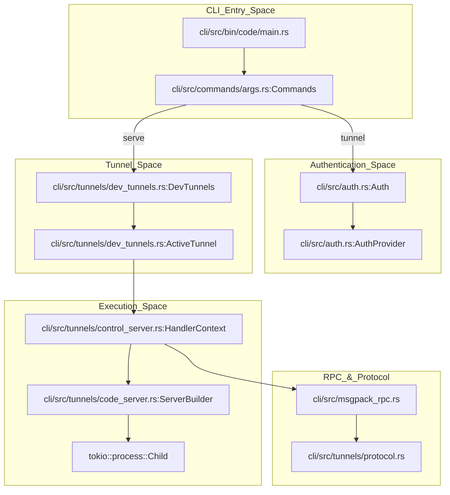
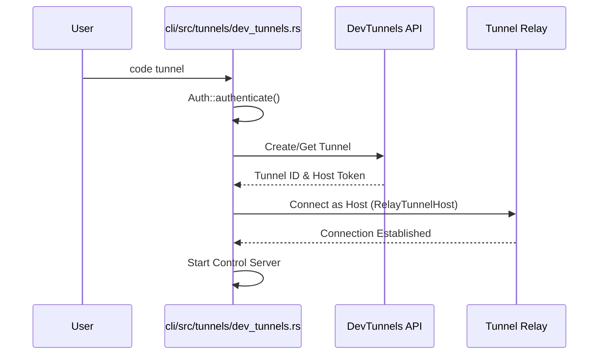
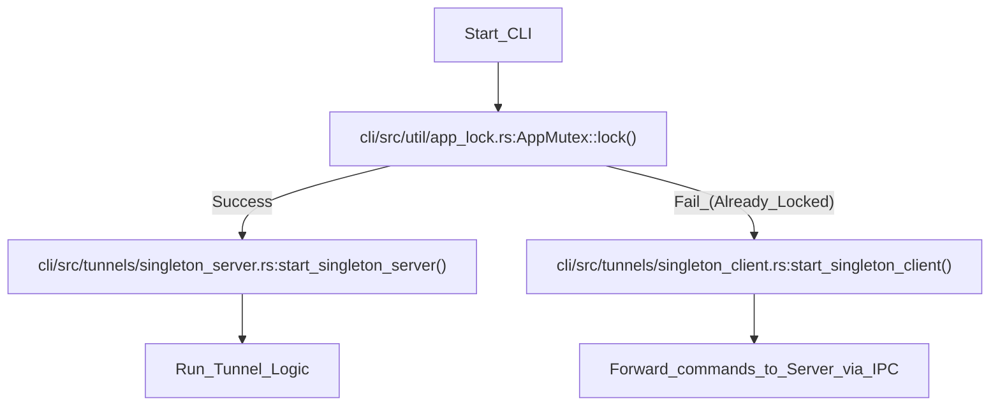
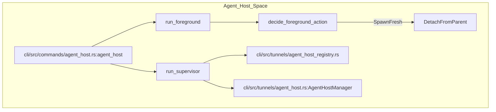

# CLI Tunnel Client (Rust)

Relevant source files

The following files were used as context for generating this wiki page:

- [cli/Cargo.lock](cli/Cargo.lock)
- [cli/Cargo.toml](cli/Cargo.toml)
- [cli/src/async_pipe.rs](cli/src/async_pipe.rs)
- [cli/src/auth.rs](cli/src/auth.rs)
- [cli/src/bin/code/main.rs](cli/src/bin/code/main.rs)
- [cli/src/commands.rs](cli/src/commands.rs)
- [cli/src/commands/agent.rs](cli/src/commands/agent.rs)
- [cli/src/commands/agent_discovery.rs](cli/src/commands/agent_discovery.rs)
- [cli/src/commands/agent_host.rs](cli/src/commands/agent_host.rs)
- [cli/src/commands/agent_kill.rs](cli/src/commands/agent_kill.rs)
- [cli/src/commands/agent_logs.rs](cli/src/commands/agent_logs.rs)
- [cli/src/commands/agent_ps.rs](cli/src/commands/agent_ps.rs)
- [cli/src/commands/agent_stop.rs](cli/src/commands/agent_stop.rs)
- [cli/src/commands/args.rs](cli/src/commands/args.rs)
- [cli/src/commands/serve_web.rs](cli/src/commands/serve_web.rs)
- [cli/src/commands/tunnels.rs](cli/src/commands/tunnels.rs)
- [cli/src/constants.rs](cli/src/constants.rs)
- [cli/src/desktop/version_manager.rs](cli/src/desktop/version_manager.rs)
- [cli/src/download_cache.rs](cli/src/download_cache.rs)
- [cli/src/lib.rs](cli/src/lib.rs)
- [cli/src/log.rs](cli/src/log.rs)
- [cli/src/msgpack_rpc.rs](cli/src/msgpack_rpc.rs)
- [cli/src/options.rs](cli/src/options.rs)
- [cli/src/self_update.rs](cli/src/self_update.rs)
- [cli/src/state.rs](cli/src/state.rs)
- [cli/src/tunnels.rs](cli/src/tunnels.rs)
- [cli/src/tunnels/agent_host.rs](cli/src/tunnels/agent_host.rs)
- [cli/src/tunnels/challenge.rs](cli/src/tunnels/challenge.rs)
- [cli/src/tunnels/code_server.rs](cli/src/tunnels/code_server.rs)
- [cli/src/tunnels/control_server.rs](cli/src/tunnels/control_server.rs)
- [cli/src/tunnels/dev_tunnels.rs](cli/src/tunnels/dev_tunnels.rs)
- [cli/src/tunnels/local_forwarding.rs](cli/src/tunnels/local_forwarding.rs)
- [cli/src/tunnels/port_forwarder.rs](cli/src/tunnels/port_forwarder.rs)
- [cli/src/tunnels/protocol.rs](cli/src/tunnels/protocol.rs)
- [cli/src/tunnels/server_bridge.rs](cli/src/tunnels/server_bridge.rs)
- [cli/src/tunnels/service.rs](cli/src/tunnels/service.rs)
- [cli/src/tunnels/service_linux.rs](cli/src/tunnels/service_linux.rs)
- [cli/src/tunnels/service_macos.rs](cli/src/tunnels/service_macos.rs)
- [cli/src/tunnels/service_windows.rs](cli/src/tunnels/service_windows.rs)
- [cli/src/tunnels/singleton_client.rs](cli/src/tunnels/singleton_client.rs)
- [cli/src/tunnels/singleton_server.rs](cli/src/tunnels/singleton_server.rs)
- [cli/src/tunnels/socket_signal.rs](cli/src/tunnels/socket_signal.rs)
- [cli/src/util/command.rs](cli/src/util/command.rs)
- [cli/src/util/errors.rs](cli/src/util/errors.rs)
- [cli/src/util/io.rs](cli/src/util/io.rs)
- [cli/src/util/sync.rs](cli/src/util/sync.rs)
- [extensions/tunnel-forwarding/.vscode/launch.json](extensions/tunnel-forwarding/.vscode/launch.json)
- [extensions/tunnel-forwarding/.vscodeignore](extensions/tunnel-forwarding/.vscodeignore)
- [extensions/tunnel-forwarding/src/extension.ts](extensions/tunnel-forwarding/src/extension.ts)

The VS Code CLI (located in `cli/src/`) is a Rust-based tool that provides the core logic for remote connectivity via "Dev Tunnels." It allows users to expose a local machine or a remote server to the internet so it can be accessed via `vscode.dev` or the VS Code desktop client. Unlike the legacy Node.js server CLI, this Rust implementation handles authentication, secure tunnel establishment, and management of the VS Code Server lifecycle in a high-performance, single-binary package.

## System Architecture

The CLI acts as a bridge between the local machine and the Microsoft Dev Tunnels service. It utilizes a multi-layered approach to manage connections, RPC communication, and server processes.

### Core Components and Data Flow

The data flow starts from a user command (e.g., `code tunnel`) and moves through authentication to tunnel establishment.

1.  **Argument Parsing**: Handled by `clap` in `cli/src/commands/args.rs`, defining structures like `IntegratedCli` [cli/src/commands/args.rs:62-65]() and `StandaloneCli` [cli/src/commands/args.rs:94-100](). Subcommands like `Tunnel`, `ServeWeb`, and `CommandShell` are defined in the `Commands` enum [cli/src/commands/args.rs:166-192]().
2.  **Authentication**: Managed by `Auth` in `cli/src/auth.rs`, supporting GitHub and Microsoft providers [cli/src/auth.rs:51-54]().
3.  **Tunnel Management**: The `DevTunnels` struct [cli/src/tunnels/dev_tunnels.rs:188-194]() interacts with the Microsoft Dev Tunnels API to create or host tunnels.
4.  **Control Server**: A MessagePack RPC server implemented in `cli/src/tunnels/control_server.rs` [cli/src/tunnels/control_server.rs:97-127]() that manages the lifecycle of the VS Code Server.
5.  **Code Server Management**: Downloads, extracts, and spawns the VS Code Server binary using `ServerBuilder` [cli/src/tunnels/code_server.rs:48-51]().

### Component Interaction Diagram

This diagram maps the natural language components to the specific Rust entities and modules.

**Sources:** [cli/src/commands/args.rs:166-192](), [cli/src/tunnels/dev_tunnels.rs:188-204](), [cli/src/tunnels/control_server.rs:97-127](), [cli/src/bin/code/main.rs:1-10]().

---

## Authentication (GitHub/Microsoft)

The CLI supports OAuth2 device flows for both GitHub and Microsoft accounts. The `Auth` struct manages the storage and refreshing of credentials.

*   **Providers**: Defined in `AuthProvider` [cli/src/auth.rs:51-54](). Each provider has specific client IDs and URIs for the device code flow [cli/src/auth.rs:66-89]().
*   **Storage**: Credentials are encrypted via `seal` [cli/src/auth.rs:202-211]() and stored in the system keychain (using the `keyring` crate) or a local file fallback [cli/src/auth.rs:186-187]().
*   **Device Flow**: The CLI initiates a device code request via `AuthProvider::code_uri` [cli/src/auth.rs:73-80](), prompts the user, and then polls for the access token which is returned in a `DeviceCodeResponse` [cli/src/auth.rs:29-35]().
*   **Token Refresh**: The `StoredCredential` struct tracks expiration [cli/src/auth.rs:101-111]() and performs checks, such as querying the GitHub user endpoint to verify token validity [cli/src/auth.rs:143-160]().

**Sources:** [cli/src/auth.rs:51-99](), [cli/src/auth.rs:202-225](), [cli/src/auth.rs:133-162]().

---

## DevTunnels Integration

The integration with Microsoft Dev Tunnels is the core of the `tunnel` command. It uses the `tunnels` Rust crate [cli/Cargo.toml:36]() to interact with the management service.

*   **Tunnel Creation**: `DevTunnels` manages persisted state of tunnels [cli/src/tunnels/dev_tunnels.rs:188-194]().
*   **Hosting**: The `ActiveTunnel` represents a live connection [cli/src/tunnels/dev_tunnels.rs:197-203](). It uses `RelayTunnelHost` from the `tunnels` crate to accept incoming connections [cli/src/tunnels/dev_tunnels.rs:25-27]().
*   **Port Forwarding**: Supports both direct port forwarding and TCP-based forwarding via `add_port_tcp` [cli/src/tunnels/dev_tunnels.rs:222-232]().
*   **Existing Tunnels**: The CLI can also host existing tunnels if provided with a `tunnel_id`, `cluster`, and `host_token` [cli/src/commands/tunnels.rs:87-103]().

### Tunnel Connection Sequence

**Sources:** [cli/src/tunnels/dev_tunnels.rs:188-250](), [cli/src/commands/tunnels.rs:146-186](), [cli/src/commands/tunnels.rs:81-107]().

---

## Control Server and Code Server Management

Once a tunnel is established, the CLI runs a `Control Server` using `HandlerContext` [cli/src/tunnels/control_server.rs:97-127](). This server uses MessagePack RPC to communicate with the VS Code client.

### Key Responsibilities:
1.  **Server Provisioning**: `ServerBuilder` resolves the correct VS Code Server version [cli/src/tunnels/code_server.rs:48-51](), downloads it, and handles extraction via `unzip_downloaded_release` [cli/src/tunnels/code_server.rs:15-17]().
2.  **Process Management**: Spawns the `node` process for the VS Code Server using `tokio::process::Command` [cli/src/tunnels/code_server.rs:38](). It parses server output to detect when the extension host agent is listening [cli/src/tunnels/code_server.rs:42-43]().
3.  **RPC Dispatching**: Handles requests for file system operations (`fs_read`, `fs_write`, `fs_stat`), process spawning, and port forwarding as defined in `ClientRequestMethod` [cli/src/tunnels/protocol.rs:17-23]() and the `protocol.rs` structures [cli/src/tunnels/protocol.rs:149-219]().
4.  **Agent Host Integration**: The `active_agent_host` future [cli/src/tunnels/control_server.rs:79-80]() ensures the supervisor is running to allow the renderer to reach the agent host via `agentHostProxy` [cli/src/commands/tunnels.rs:162-173]().

**Sources:** [cli/src/tunnels/control_server.rs:97-127](), [cli/src/tunnels/code_server.rs:195-208](), [cli/src/tunnels/protocol.rs:149-161](), [cli/src/tunnels/code_server.rs:42-45]().

---

## Serve-Web Subcommand

The `serve-web` command [cli/src/commands/serve_web.rs:75]() allows running a local version of VS Code for the Web.

*   **Connection Manager**: The `ConnectionManager` [cli/src/commands/serve_web.rs:95-106]() tracks active server versions and handles updates.
*   **Security**: Implements a security mechanism where it "mints" a secret key shared between the server and client using `SECRET_KEY_MINT_PATH` [cli/src/commands/serve_web.rs:61-69]().
*   **Server Logic**: Uses `hyper` to serve the workbench and static assets [cli/src/commands/serve_web.rs:18-21](). It supports both TCP listeners [cli/src/commands/serve_web.rs:143-150]() and Unix/Named Pipe sockets [cli/src/commands/serve_web.rs:111-113]().

**Sources:** [cli/src/commands/serve_web.rs:75-93](), [cli/src/commands/serve_web.rs:188-200](), [cli/src/commands/serve_web.rs:137-182]().

---

## Singleton Pattern (Single-Instance Enforcement)

To prevent multiple tunnel processes from conflicting, the CLI implements a singleton pattern using a platform-specific lock.

*   **Acquisition**: `acquire_singleton` [cli/src/commands/tunnels.rs:64-70]() attempts to grab a lock.
*   **RPC Forwarding**: If a singleton is already active, the new process becomes a `SingletonClient` and forwards its RPC calls to the existing `SingletonServer` via `do_single_rpc_call` [cli/src/commands/tunnels.rs:48-51]().
*   **Implementation**: The server is started via `start_singleton_server` [cli/src/tunnels/singleton_server.rs:50-51](). It uses platform-specific lock names like `TUNNEL_SERVICE_LOCK_NAME` [cli/src/constants.rs:36-37]().

### Singleton Enforcement Flow

**Sources:** [cli/src/commands/tunnels.rs:48-54](), [cli/src/tunnels/singleton_server.rs:50-51](), [cli/src/tunnels/singleton_client.rs:67-69](), [cli/src/constants.rs:34-37]().

---

## Command Shell and Agent Host

The `command-shell` subcommand [cli/src/commands/tunnels.rs:146]() is used by remote connections to establish a control channel.

*   **Supervisor Lifecycle**: It ensures the `agent_host` supervisor is running [cli/src/commands/tunnels.rs:162-173]() via `ensure_supervisor_running` [cli/src/commands/agent_host.rs:23]().
*   **Stream Handling**: It can listen on a port, a socket, or use standard I/O [cli/src/commands/tunnels.rs:191-235]() to receive `ServeStreamParams`.
*   **Protocol**: It uses `serve_stream` to bridge the client to a spawned VS Code Server [cli/src/commands/tunnels.rs:232]().

### Agent Host Logic Space

The `agent host` command manages the lifecycle of the agent host process and its registry.

**Sources:** [cli/src/commands/agent_host.rs:70-75](), [cli/src/commands/agent_host.rs:107-162](), [cli/src/commands/agent_host.rs:167-175](), [cli/src/tunnels/control_server.rs:74-81]().