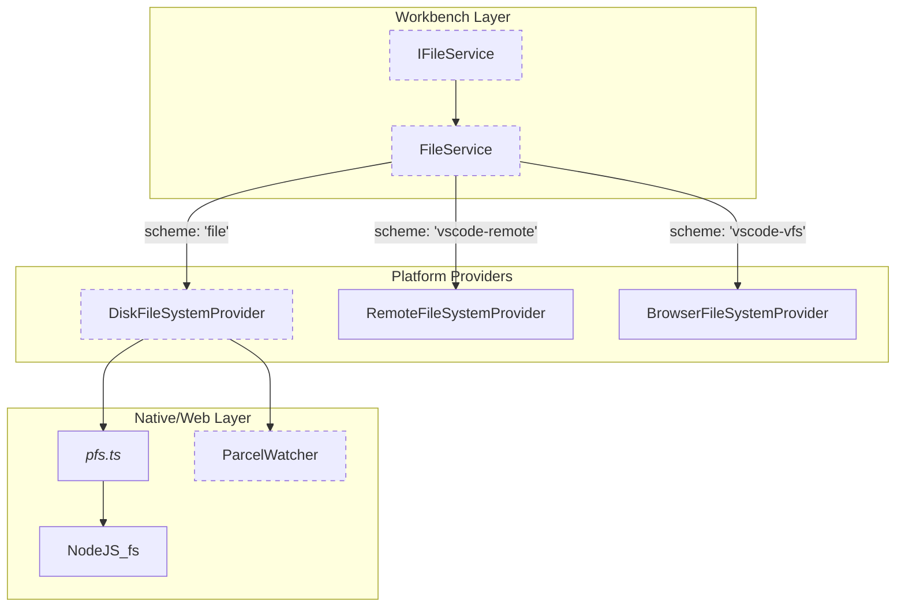

# Platform Services

<details>
<summary>Relevant source files</summary>

The following files were used as context for generating this wiki page:

- [extensions/github-authentication/media/auth.css](extensions/github-authentication/media/auth.css)
- [extensions/github-authentication/media/code-icon.svg](extensions/github-authentication/media/code-icon.svg)
- [extensions/github-authentication/media/favicon.ico](extensions/github-authentication/media/favicon.ico)
- [extensions/github-authentication/media/icon.png](extensions/github-authentication/media/icon.png)
- [extensions/github-authentication/media/index.html](extensions/github-authentication/media/index.html)
- [extensions/github-authentication/package.nls.json](extensions/github-authentication/package.nls.json)
- [extensions/github-authentication/src/browser/buffer.ts](extensions/github-authentication/src/browser/buffer.ts)
- [extensions/github-authentication/src/common/env.ts](extensions/github-authentication/src/common/env.ts)
- [extensions/github-authentication/src/common/errors.ts](extensions/github-authentication/src/common/errors.ts)
- [extensions/github-authentication/src/common/keychain.ts](extensions/github-authentication/src/common/keychain.ts)
- [extensions/github-authentication/src/common/logger.ts](extensions/github-authentication/src/common/logger.ts)
- [extensions/github-authentication/src/config.ts](extensions/github-authentication/src/config.ts)
- [extensions/github-authentication/src/extension.ts](extensions/github-authentication/src/extension.ts)
- [extensions/github-authentication/src/flows.ts](extensions/github-authentication/src/flows.ts)
- [extensions/github-authentication/src/github.ts](extensions/github-authentication/src/github.ts)
- [extensions/github-authentication/src/githubServer.ts](extensions/github-authentication/src/githubServer.ts)
- [extensions/github-authentication/src/node/authServer.ts](extensions/github-authentication/src/node/authServer.ts)
- [extensions/github-authentication/src/node/buffer.ts](extensions/github-authentication/src/node/buffer.ts)
- [extensions/github-authentication/src/node/fetch.ts](extensions/github-authentication/src/node/fetch.ts)
- [extensions/github-authentication/src/test/flows.test.ts](extensions/github-authentication/src/test/flows.test.ts)
- [extensions/github-authentication/src/test/node/authServer.test.ts](extensions/github-authentication/src/test/node/authServer.test.ts)
- [extensions/github-authentication/src/test/node/fetch.test.ts](extensions/github-authentication/src/test/node/fetch.test.ts)
- [extensions/microsoft-authentication/media/index.html](extensions/microsoft-authentication/media/index.html)
- [extensions/microsoft-authentication/package.nls.json](extensions/microsoft-authentication/package.nls.json)
- [extensions/microsoft-authentication/src/extension.ts](extensions/microsoft-authentication/src/extension.ts)
- [src/vs/base/node/crypto.ts](src/vs/base/node/crypto.ts)
- [src/vs/base/node/pfs.ts](src/vs/base/node/pfs.ts)
- [src/vs/base/node/zip.ts](src/vs/base/node/zip.ts)
- [src/vs/base/test/node/crypto.test.ts](src/vs/base/test/node/crypto.test.ts)
- [src/vs/base/test/node/pfs/pfs.test.ts](src/vs/base/test/node/pfs/pfs.test.ts)
- [src/vs/base/test/node/testUtils.ts](src/vs/base/test/node/testUtils.ts)
- [src/vs/base/test/node/zip/zip.test.ts](src/vs/base/test/node/zip/zip.test.ts)
- [src/vs/platform/diagnostics/common/diagnostics.ts](src/vs/platform/diagnostics/common/diagnostics.ts)
- [src/vs/platform/diagnostics/electron-main/diagnosticsMainService.ts](src/vs/platform/diagnostics/electron-main/diagnosticsMainService.ts)
- [src/vs/platform/diagnostics/node/diagnosticsService.ts](src/vs/platform/diagnostics/node/diagnosticsService.ts)
- [src/vs/platform/extensionManagement/node/extensionsWatcher.ts](src/vs/platform/extensionManagement/node/extensionsWatcher.ts)
- [src/vs/platform/files/common/diskFileSystemProvider.ts](src/vs/platform/files/common/diskFileSystemProvider.ts)
- [src/vs/platform/files/common/diskFileSystemProviderClient.ts](src/vs/platform/files/common/diskFileSystemProviderClient.ts)
- [src/vs/platform/files/common/fileService.ts](src/vs/platform/files/common/fileService.ts)
- [src/vs/platform/files/common/files.ts](src/vs/platform/files/common/files.ts)
- [src/vs/platform/files/common/inMemoryFilesystemProvider.ts](src/vs/platform/files/common/inMemoryFilesystemProvider.ts)
- [src/vs/platform/files/common/watcher.ts](src/vs/platform/files/common/watcher.ts)
- [src/vs/platform/files/electron-main/diskFileSystemProviderServer.ts](src/vs/platform/files/electron-main/diskFileSystemProviderServer.ts)
- [src/vs/platform/files/node/diskFileSystemProvider.ts](src/vs/platform/files/node/diskFileSystemProvider.ts)
- [src/vs/platform/files/node/diskFileSystemProviderServer.ts](src/vs/platform/files/node/diskFileSystemProviderServer.ts)
- [src/vs/platform/files/node/watcher/baseWatcher.ts](src/vs/platform/files/node/watcher/baseWatcher.ts)
- [src/vs/platform/files/node/watcher/nodejs/nodejsWatcher.ts](src/vs/platform/files/node/watcher/nodejs/nodejsWatcher.ts)
- [src/vs/platform/files/node/watcher/nodejs/nodejsWatcherLib.ts](src/vs/platform/files/node/watcher/nodejs/nodejsWatcherLib.ts)
- [src/vs/platform/files/node/watcher/parcel/parcelWatcher.ts](src/vs/platform/files/node/watcher/parcel/parcelWatcher.ts)
- [src/vs/platform/files/node/watcher/watcher.ts](src/vs/platform/files/node/watcher/watcher.ts)
- [src/vs/platform/files/node/watcher/watcherStats.ts](src/vs/platform/files/node/watcher/watcherStats.ts)
- [src/vs/platform/files/test/browser/fileService.test.ts](src/vs/platform/files/test/browser/fileService.test.ts)
- [src/vs/platform/files/test/browser/indexedDBFileService.integrationTest.ts](src/vs/platform/files/test/browser/indexedDBFileService.integrationTest.ts)
- [src/vs/platform/files/test/common/files.test.ts](src/vs/platform/files/test/common/files.test.ts)
- [src/vs/platform/files/test/common/nullFileSystemProvider.ts](src/vs/platform/files/test/common/nullFileSystemProvider.ts)
- [src/vs/platform/files/test/common/watcher.test.ts](src/vs/platform/files/test/common/watcher.test.ts)
- [src/vs/platform/files/test/node/diskFileService.integrationTest.ts](src/vs/platform/files/test/node/diskFileService.integrationTest.ts)
- [src/vs/platform/files/test/node/fixtures/executable/executable](src/vs/platform/files/test/node/fixtures/executable/executable)
- [src/vs/platform/files/test/node/fixtures/executable/non_executable](src/vs/platform/files/test/node/fixtures/executable/non_executable)
- [src/vs/platform/files/test/node/nodejsWatcher.test.ts](src/vs/platform/files/test/node/nodejsWatcher.test.ts)
- [src/vs/platform/files/test/node/parcelWatcher.test.ts](src/vs/platform/files/test/node/parcelWatcher.test.ts)
- [src/vs/platform/localTranscription/node/foundryLocalModelImport.ts](src/vs/platform/localTranscription/node/foundryLocalModelImport.ts)
- [src/vs/platform/localTranscription/test/node/foundryLocalModelImport.test.ts](src/vs/platform/localTranscription/test/node/foundryLocalModelImport.test.ts)
- [src/vs/platform/request/common/requestIpc.ts](src/vs/platform/request/common/requestIpc.ts)
- [src/vs/platform/state/test/node/state.test.ts](src/vs/platform/state/test/node/state.test.ts)
- [src/vs/platform/userDataProfile/browser/userDataProfile.ts](src/vs/platform/userDataProfile/browser/userDataProfile.ts)
- [src/vs/platform/userDataSync/common/abstractSynchronizer.ts](src/vs/platform/userDataSync/common/abstractSynchronizer.ts)
- [src/vs/platform/userDataSync/common/extensionsSync.ts](src/vs/platform/userDataSync/common/extensionsSync.ts)
- [src/vs/platform/userDataSync/common/globalStateSync.ts](src/vs/platform/userDataSync/common/globalStateSync.ts)
- [src/vs/platform/userDataSync/common/keybindingsSync.ts](src/vs/platform/userDataSync/common/keybindingsSync.ts)
- [src/vs/platform/userDataSync/common/settingsSync.ts](src/vs/platform/userDataSync/common/settingsSync.ts)
- [src/vs/platform/userDataSync/common/snippetsSync.ts](src/vs/platform/userDataSync/common/snippetsSync.ts)
- [src/vs/platform/userDataSync/common/tasksSync.ts](src/vs/platform/userDataSync/common/tasksSync.ts)
- [src/vs/platform/userDataSync/common/userDataAutoSyncService.ts](src/vs/platform/userDataSync/common/userDataAutoSyncService.ts)
- [src/vs/platform/userDataSync/common/userDataProfilesManifestMerge.ts](src/vs/platform/userDataSync/common/userDataProfilesManifestMerge.ts)
- [src/vs/platform/userDataSync/common/userDataProfilesManifestSync.ts](src/vs/platform/userDataSync/common/userDataProfilesManifestSync.ts)
- [src/vs/platform/userDataSync/common/userDataSync.ts](src/vs/platform/userDataSync/common/userDataSync.ts)
- [src/vs/platform/userDataSync/common/userDataSyncIpc.ts](src/vs/platform/userDataSync/common/userDataSyncIpc.ts)
- [src/vs/platform/userDataSync/common/userDataSyncMachines.ts](src/vs/platform/userDataSync/common/userDataSyncMachines.ts)
- [src/vs/platform/userDataSync/common/userDataSyncService.ts](src/vs/platform/userDataSync/common/userDataSyncService.ts)
- [src/vs/platform/userDataSync/common/userDataSyncStoreService.ts](src/vs/platform/userDataSync/common/userDataSyncStoreService.ts)
- [src/vs/platform/userDataSync/test/common/globalStateSync.test.ts](src/vs/platform/userDataSync/test/common/globalStateSync.test.ts)
- [src/vs/platform/userDataSync/test/common/keybindingsSync.test.ts](src/vs/platform/userDataSync/test/common/keybindingsSync.test.ts)
- [src/vs/platform/userDataSync/test/common/settingsSync.test.ts](src/vs/platform/userDataSync/test/common/settingsSync.test.ts)
- [src/vs/platform/userDataSync/test/common/snippetsSync.test.ts](src/vs/platform/userDataSync/test/common/snippetsSync.test.ts)
- [src/vs/platform/userDataSync/test/common/synchronizer.test.ts](src/vs/platform/userDataSync/test/common/synchronizer.test.ts)
- [src/vs/platform/userDataSync/test/common/tasksSync.test.ts](src/vs/platform/userDataSync/test/common/tasksSync.test.ts)
- [src/vs/platform/userDataSync/test/common/userDataAutoSyncService.test.ts](src/vs/platform/userDataSync/test/common/userDataAutoSyncService.test.ts)
- [src/vs/platform/userDataSync/test/common/userDataProfilesManifestMerge.test.ts](src/vs/platform/userDataSync/test/common/userDataProfilesManifestMerge.test.ts)
- [src/vs/platform/userDataSync/test/common/userDataProfilesManifestSync.test.ts](src/vs/platform/userDataSync/test/common/userDataProfilesManifestSync.test.ts)
- [src/vs/platform/userDataSync/test/common/userDataSyncClient.ts](src/vs/platform/userDataSync/test/common/userDataSyncClient.ts)
- [src/vs/platform/userDataSync/test/common/userDataSyncService.test.ts](src/vs/platform/userDataSync/test/common/userDataSyncService.test.ts)
- [src/vs/platform/userDataSync/test/common/userDataSyncStoreService.test.ts](src/vs/platform/userDataSync/test/common/userDataSyncStoreService.test.ts)
- [src/vs/workbench/api/browser/mainThreadAuthentication.ts](src/vs/workbench/api/browser/mainThreadAuthentication.ts)
- [src/vs/workbench/api/common/extHostAuthentication.ts](src/vs/workbench/api/common/extHostAuthentication.ts)
- [src/vs/workbench/api/test/browser/extHostAuthentication.test.ts](src/vs/workbench/api/test/browser/extHostAuthentication.test.ts)
- [src/vs/workbench/browser/parts/globalCompositeBar.ts](src/vs/workbench/browser/parts/globalCompositeBar.ts)
- [src/vs/workbench/contrib/chat/electron-browser/actions/installDictationModelAction.ts](src/vs/workbench/contrib/chat/electron-browser/actions/installDictationModelAction.ts)
- [src/vs/workbench/contrib/mcp/common/mcpDevMode.ts](src/vs/workbench/contrib/mcp/common/mcpDevMode.ts)
- [src/vs/workbench/contrib/userDataSync/browser/userDataSync.ts](src/vs/workbench/contrib/userDataSync/browser/userDataSync.ts)
- [src/vs/workbench/contrib/userDataSync/browser/userDataSyncViews.ts](src/vs/workbench/contrib/userDataSync/browser/userDataSyncViews.ts)
- [src/vs/workbench/services/authentication/browser/authenticationService.ts](src/vs/workbench/services/authentication/browser/authenticationService.ts)
- [src/vs/workbench/services/authentication/common/authentication.ts](src/vs/workbench/services/authentication/common/authentication.ts)
- [src/vs/workbench/services/localTranscription/browser/localTranscriptionService.ts](src/vs/workbench/services/localTranscription/browser/localTranscriptionService.ts)
- [src/vs/workbench/services/search/test/node/fileSearch.integrationTest.ts](src/vs/workbench/services/search/test/node/fileSearch.integrationTest.ts)
- [src/vs/workbench/services/textfile/electron-browser/nativeTextFileService.ts](src/vs/workbench/services/textfile/electron-browser/nativeTextFileService.ts)
- [src/vs/workbench/services/textfile/test/browser/browserTextFileService.io.test.ts](src/vs/workbench/services/textfile/test/browser/browserTextFileService.io.test.ts)
- [src/vs/workbench/services/textfile/test/electron-browser/nativeTextFileService.io.test.ts](src/vs/workbench/services/textfile/test/electron-browser/nativeTextFileService.io.test.ts)
- [src/vs/workbench/services/userDataSync/browser/userDataSyncWorkbenchService.ts](src/vs/workbench/services/userDataSync/browser/userDataSyncWorkbenchService.ts)
- [src/vs/workbench/services/userDataSync/common/userDataSync.ts](src/vs/workbench/services/userDataSync/common/userDataSync.ts)
- [src/vs/workbench/services/userDataSync/electron-browser/userDataSyncService.ts](src/vs/workbench/services/userDataSync/electron-browser/userDataSyncService.ts)

</details>


Platform Services represent the foundational cross-cutting concerns of the VS Code architecture. These services provide the essential infrastructure required for the workbench to interact with the host environment, manage user identity, and synchronize state across different instances.

## File System Service

The File System Service is the primary abstraction for all file IO operations in VS Code. It provides a unified interface, `IFileService`, which allows the workbench to interact with various storage backends (local disk, remote servers, or browser-based storage) using a URI-based scheme system [src/vs/platform/files/common/files.ts:21-21]().

*   **Provider Model**: Developers can register new file system schemes by implementing `IFileSystemProvider` and using `registerProvider(scheme, provider)` [src/vs/platform/files/common/fileService.ts:52-88]().
*   **Disk Access**: On desktop, the `DiskFileSystemProvider` handles native Node.js `fs` operations [src/vs/platform/files/node/diskFileSystemProvider.ts:28-37](). It leverages a specialized `pfs` (Promisified File System) module to handle OS-specific quirks like macOS NFD/NFC normalization [src/vs/base/node/pfs.ts:104-126]().
*   **Capabilities**: Providers declare their supported features (e.g., `FileReadWrite`, `FileReadStream`, `FileAtomicWrite`) via the `FileSystemProviderCapabilities` bitmask [src/vs/platform/files/common/files.ts:21-21]().
*   **Watching**: File changes are monitored via `IFileSystemWatcher`. The `FileService` emits `FileChangesEvent` whenever a registered provider detects modifications [src/vs/platform/files/common/fileService.ts:66-76]().

For details, see [File System Service](#14.1).

### File Service Architecture
The following diagram illustrates how the `FileService` coordinates between the high-level workbench requests and low-level platform-specific providers.


Sources: [src/vs/platform/files/common/fileService.ts:26-26](), [src/vs/platform/files/node/diskFileSystemProvider.ts:28-37](), [src/vs/base/node/pfs.ts:6-6](), [src/vs/platform/files/node/watcher/parcel/parcelWatcher.ts:141-141]()

## Authentication and User Accounts

The Authentication system manages user identities and OAuth sessions. It allows extensions to contribute `AuthenticationProvider` implementations via the extension API.

*   **Core Service**: `AuthenticationService` (implementing `IAuthenticationService`) manages the lifecycle of providers and sessions, firing events like `onDidRegisterAuthenticationProvider` [src/vs/workbench/services/authentication/browser/authenticationService.ts:93-108]().
*   **Built-in Providers**: VS Code includes dedicated extensions for GitHub and Microsoft accounts. The `GitHubAuthenticationProvider` uses a `Keychain` for secure storage [extensions/github-authentication/src/github.ts:153-158]() and manages OAuth flows via `GitHubServer` [extensions/github-authentication/src/githubServer.ts:30-46]().
*   **IPC Bridge**: `MainThreadAuthentication` handles the proxying of authentication requests across the RPC boundary between the `ExtHostAuthentication` and the renderer process [src/vs/workbench/api/browser/mainThreadAuthentication.ts:113-132]().

For details, see [Authentication and User Accounts](#14.2).

## User Data Sync and Profiles

User Data Sync allows users to synchronize their configuration across different machines. This is built on top of the authentication service for identity and the file service for state persistence.

*   **Sync Logic**: The `IUserDataSyncService` coordinates various "Synchronizers" like `SettingsSynchroniser`, `ExtensionsSynchroniser`, and `KeybindingsSynchroniser` to merge local and remote state [src/vs/platform/userDataSync/common/userDataSyncService.ts:23-31]().
*   **Conflict Resolution**: When local and remote data diverge, the service generates `IUserDataSyncResourceConflicts` [src/vs/platform/userDataSync/common/userDataSync.ts:28-29](), which are presented to the user via the `UserDataSyncWorkbenchContribution` [src/vs/workbench/contrib/userDataSync/browser/userDataSync.ts:87-98]().
*   **Profiles**: User Data Profiles allow users to create isolated sets of configurations. The `IUserDataProfilesService` manages these profiles, while `UserDataProfilesManifestSynchroniser` ensures profile metadata is synced [src/vs/platform/userDataSync/common/userDataSyncService.ts:31-31]().
*   **Account Management**: `UserDataSyncWorkbenchService` bridges the sync engine with the `AuthenticationService` to manage the logged-in account status [src/vs/workbench/services/userDataSync/browser/userDataSyncWorkbenchService.ts:65-81]().

For details, see [User Data Sync and Profiles](#14.3).

### Authentication and Sync Entity Mapping
This diagram bridges the high-level authentication and sync concepts to the specific classes and actors used in the code.

```mermaid
graph LR
    subgraph Extension_Host ["Extension Host"]
        ExtHostAuthentication["ExtHostAuthentication"] -- "RPC Protocol" --> MainThreadAuthentication["MainThreadAuthentication"]
    end

    subgraph Renderer_Process ["Renderer Process"]
        MainThreadAuthentication["MainThreadAuthentication"] -- "calls" --> AuthenticationService["AuthenticationService"]
        UserDataSyncWorkbenchService["UserDataSyncWorkbenchService"] -- "requests token" --> AuthenticationService["AuthenticationService"]
        UserDataSyncWorkbenchService["UserDataSyncWorkbenchService"] -- "triggers" --> IUserDataSyncService["IUserDataSyncService"]
    end

    subgraph Platform_Core ["Platform Core"]
        IUserDataSyncService["IUserDataSyncService"] -- "orchestrates" --> AbstractSynchroniser["AbstractSynchroniser"]
        AbstractSynchroniser["AbstractSynchroniser"] <|-- SettingsSynchroniser["SettingsSynchroniser"]
        AbstractSynchroniser["AbstractSynchroniser"] <|-- ExtensionsSynchroniser["ExtensionsSynchroniser"]
        AbstractSynchroniser["AbstractSynchroniser"] <|-- KeybindingsSynchroniser["KeybindingsSynchroniser"]
    end

    ExtHostAuthentication["ExtHostAuthentication"]:::codeClass
    MainThreadAuthentication["MainThreadAuthentication"]:::codeClass
    AuthenticationService["AuthenticationService"]:::codeClass
    UserDataSyncWorkbenchService["UserDataSyncWorkbenchService"]:::codeClass
    IUserDataSyncService["IUserDataSyncService"]:::codeClass
    AbstractSynchroniser["AbstractSynchroniser"]:::codeClass
    SettingsSynchroniser["SettingsSynchroniser"]:::codeClass
    ExtensionsSynchroniser["ExtensionsSynchroniser"]:::codeClass
    KeybindingsSynchroniser["KeybindingsSynchroniser"]:::codeClass

    classDef codeClass stroke-dasharray: 5 5
```
Sources: [src/vs/workbench/api/common/extHostAuthentication.ts:42-42](), [src/vs/workbench/api/browser/mainThreadAuthentication.ts:114-114](), [src/vs/workbench/services/authentication/browser/authenticationService.ts:93-93](), [src/vs/workbench/services/userDataSync/browser/userDataSyncWorkbenchService.ts:65-65](), [src/vs/platform/userDataSync/common/userDataSyncService.ts:64-64](), [src/vs/platform/userDataSync/common/abstractSynchronizer.ts:125-125](), [src/vs/platform/userDataSync/common/extensionsSync.ts:97-97]()

## Workspace Trust and Comments

These services manage security boundaries and collaborative features within the editor.

*   **Workspace Trust**: The `IWorkspaceTrustManagementService` determines if a folder is "trusted". This gates sensitive features like task execution or debugging to prevent malicious code execution in unknown repositories.
*   **Comments**: The comments system provides the infrastructure for review flows, allowing extensions to provide thread-based discussions directly in the editor margin and a dedicated view.

For details, see [Workspace Trust and Comments](#14.4).

## Summary of Core Platform Interfaces

| Service | Primary Interface | Key Responsibility |
| :--- | :--- | :--- |
| **File Service** | `IFileService` | URI-based file system abstraction and watching [src/vs/platform/files/common/files.ts:21-21](). |
| **Authentication** | `IAuthenticationService` | Management of authentication providers and user sessions [src/vs/workbench/services/authentication/browser/authenticationService.ts:93-93](). |
| **User Data Sync** | `IUserDataSyncService` | Orchestration of cross-device configuration synchronization [src/vs/platform/userDataSync/common/userDataSyncService.ts:64-64](). |
| **Diagnostics** | `IDiagnosticsService` | Collection of system and workspace performance/statistical data [src/vs/platform/diagnostics/node/diagnosticsService.ts:19-19](). |

Sources: [src/vs/platform/files/common/files.ts:21-21](), [src/vs/workbench/services/authentication/browser/authenticationService.ts:93-93](), [src/vs/platform/userDataSync/common/userDataSyncService.ts:64-64](), [src/vs/platform/diagnostics/node/diagnosticsService.ts:19-19]()