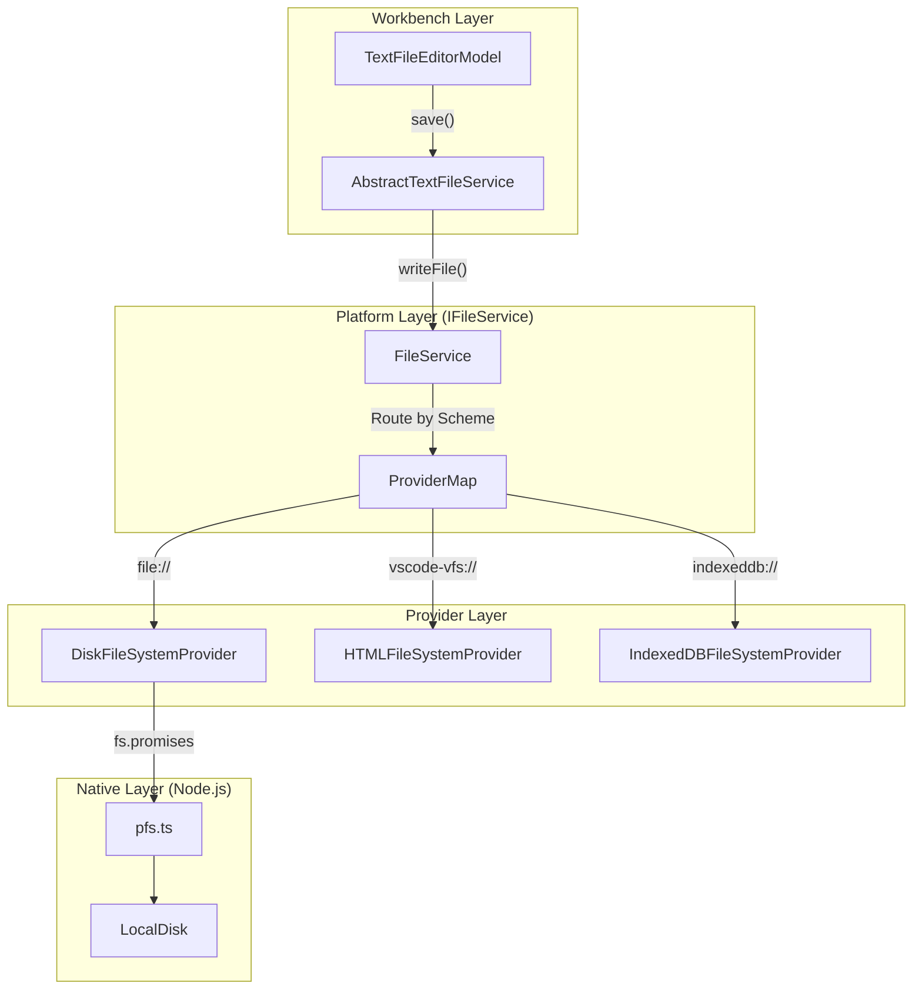
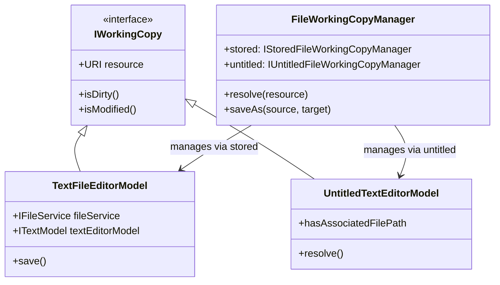

# File System Service

Relevant source files

The following files were used as context for generating this wiki page:

- [src/vs/base/node/crypto.ts](src/vs/base/node/crypto.ts)
- [src/vs/base/node/pfs.ts](src/vs/base/node/pfs.ts)
- [src/vs/base/node/zip.ts](src/vs/base/node/zip.ts)
- [src/vs/base/test/node/crypto.test.ts](src/vs/base/test/node/crypto.test.ts)
- [src/vs/base/test/node/pfs/pfs.test.ts](src/vs/base/test/node/pfs/pfs.test.ts)
- [src/vs/base/test/node/testUtils.ts](src/vs/base/test/node/testUtils.ts)
- [src/vs/base/test/node/zip/zip.test.ts](src/vs/base/test/node/zip/zip.test.ts)
- [src/vs/platform/diagnostics/common/diagnostics.ts](src/vs/platform/diagnostics/common/diagnostics.ts)
- [src/vs/platform/diagnostics/electron-main/diagnosticsMainService.ts](src/vs/platform/diagnostics/electron-main/diagnosticsMainService.ts)
- [src/vs/platform/diagnostics/node/diagnosticsService.ts](src/vs/platform/diagnostics/node/diagnosticsService.ts)
- [src/vs/platform/extensionManagement/node/extensionsWatcher.ts](src/vs/platform/extensionManagement/node/extensionsWatcher.ts)
- [src/vs/platform/files/common/diskFileSystemProvider.ts](src/vs/platform/files/common/diskFileSystemProvider.ts)
- [src/vs/platform/files/common/diskFileSystemProviderClient.ts](src/vs/platform/files/common/diskFileSystemProviderClient.ts)
- [src/vs/platform/files/common/fileService.ts](src/vs/platform/files/common/fileService.ts)
- [src/vs/platform/files/common/files.ts](src/vs/platform/files/common/files.ts)
- [src/vs/platform/files/common/inMemoryFilesystemProvider.ts](src/vs/platform/files/common/inMemoryFilesystemProvider.ts)
- [src/vs/platform/files/common/watcher.ts](src/vs/platform/files/common/watcher.ts)
- [src/vs/platform/files/electron-main/diskFileSystemProviderServer.ts](src/vs/platform/files/electron-main/diskFileSystemProviderServer.ts)
- [src/vs/platform/files/node/diskFileSystemProvider.ts](src/vs/platform/files/node/diskFileSystemProvider.ts)
- [src/vs/platform/files/node/diskFileSystemProviderServer.ts](src/vs/platform/files/node/diskFileSystemProviderServer.ts)
- [src/vs/platform/files/node/watcher/baseWatcher.ts](src/vs/platform/files/node/watcher/baseWatcher.ts)
- [src/vs/platform/files/node/watcher/nodejs/nodejsWatcher.ts](src/vs/platform/files/node/watcher/nodejs/nodejsWatcher.ts)
- [src/vs/platform/files/node/watcher/nodejs/nodejsWatcherLib.ts](src/vs/platform/files/node/watcher/nodejs/nodejsWatcherLib.ts)
- [src/vs/platform/files/node/watcher/parcel/parcelWatcher.ts](src/vs/platform/files/node/watcher/parcel/parcelWatcher.ts)
- [src/vs/platform/files/node/watcher/watcher.ts](src/vs/platform/files/node/watcher/watcher.ts)
- [src/vs/platform/files/node/watcher/watcherStats.ts](src/vs/platform/files/node/watcher/watcherStats.ts)
- [src/vs/platform/files/test/browser/fileService.test.ts](src/vs/platform/files/test/browser/fileService.test.ts)
- [src/vs/platform/files/test/browser/indexedDBFileService.integrationTest.ts](src/vs/platform/files/test/browser/indexedDBFileService.integrationTest.ts)
- [src/vs/platform/files/test/common/files.test.ts](src/vs/platform/files/test/common/files.test.ts)
- [src/vs/platform/files/test/common/nullFileSystemProvider.ts](src/vs/platform/files/test/common/nullFileSystemProvider.ts)
- [src/vs/platform/files/test/common/watcher.test.ts](src/vs/platform/files/test/common/watcher.test.ts)
- [src/vs/platform/files/test/node/diskFileService.integrationTest.ts](src/vs/platform/files/test/node/diskFileService.integrationTest.ts)
- [src/vs/platform/files/test/node/fixtures/executable/executable](src/vs/platform/files/test/node/fixtures/executable/executable)
- [src/vs/platform/files/test/node/fixtures/executable/non_executable](src/vs/platform/files/test/node/fixtures/executable/non_executable)
- [src/vs/platform/files/test/node/nodejsWatcher.test.ts](src/vs/platform/files/test/node/nodejsWatcher.test.ts)
- [src/vs/platform/files/test/node/parcelWatcher.test.ts](src/vs/platform/files/test/node/parcelWatcher.test.ts)
- [src/vs/platform/localTranscription/node/foundryLocalModelImport.ts](src/vs/platform/localTranscription/node/foundryLocalModelImport.ts)
- [src/vs/platform/localTranscription/test/node/foundryLocalModelImport.test.ts](src/vs/platform/localTranscription/test/node/foundryLocalModelImport.test.ts)
- [src/vs/platform/state/test/node/state.test.ts](src/vs/platform/state/test/node/state.test.ts)
- [src/vs/workbench/browser/parts/editor/editorAutoSave.ts](src/vs/workbench/browser/parts/editor/editorAutoSave.ts)
- [src/vs/workbench/common/editor/textEditorModel.ts](src/vs/workbench/common/editor/textEditorModel.ts)
- [src/vs/workbench/common/editor/textResourceEditorModel.ts](src/vs/workbench/common/editor/textResourceEditorModel.ts)
- [src/vs/workbench/contrib/chat/electron-browser/actions/installDictationModelAction.ts](src/vs/workbench/contrib/chat/electron-browser/actions/installDictationModelAction.ts)
- [src/vs/workbench/contrib/files/browser/editors/fileEditorHandler.ts](src/vs/workbench/contrib/files/browser/editors/fileEditorHandler.ts)
- [src/vs/workbench/contrib/files/test/browser/fileEditorInput.test.ts](src/vs/workbench/contrib/files/test/browser/fileEditorInput.test.ts)
- [src/vs/workbench/contrib/mcp/common/mcpDevMode.ts](src/vs/workbench/contrib/mcp/common/mcpDevMode.ts)
- [src/vs/workbench/services/filesConfiguration/common/filesConfigurationService.ts](src/vs/workbench/services/filesConfiguration/common/filesConfigurationService.ts)
- [src/vs/workbench/services/localTranscription/browser/localTranscriptionService.ts](src/vs/workbench/services/localTranscription/browser/localTranscriptionService.ts)
- [src/vs/workbench/services/search/test/node/fileSearch.integrationTest.ts](src/vs/workbench/services/search/test/node/fileSearch.integrationTest.ts)
- [src/vs/workbench/services/textfile/browser/textFileService.ts](src/vs/workbench/services/textfile/browser/textFileService.ts)
- [src/vs/workbench/services/textfile/common/textFileEditorModel.ts](src/vs/workbench/services/textfile/common/textFileEditorModel.ts)
- [src/vs/workbench/services/textfile/common/textFileEditorModelManager.ts](src/vs/workbench/services/textfile/common/textFileEditorModelManager.ts)
- [src/vs/workbench/services/textfile/common/textFileSaveParticipant.ts](src/vs/workbench/services/textfile/common/textFileSaveParticipant.ts)
- [src/vs/workbench/services/textfile/common/textfiles.ts](src/vs/workbench/services/textfile/common/textfiles.ts)
- [src/vs/workbench/services/textfile/electron-browser/nativeTextFileService.ts](src/vs/workbench/services/textfile/electron-browser/nativeTextFileService.ts)
- [src/vs/workbench/services/textfile/test/browser/browserTextFileService.io.test.ts](src/vs/workbench/services/textfile/test/browser/browserTextFileService.io.test.ts)
- [src/vs/workbench/services/textfile/test/browser/textFileEditorModel.test.ts](src/vs/workbench/services/textfile/test/browser/textFileEditorModel.test.ts)
- [src/vs/workbench/services/textfile/test/browser/textFileEditorModelManager.test.ts](src/vs/workbench/services/textfile/test/browser/textFileEditorModelManager.test.ts)
- [src/vs/workbench/services/textfile/test/browser/textFileService.test.ts](src/vs/workbench/services/textfile/test/browser/textFileService.test.ts)
- [src/vs/workbench/services/textfile/test/electron-browser/nativeTextFileService.io.test.ts](src/vs/workbench/services/textfile/test/electron-browser/nativeTextFileService.io.test.ts)
- [src/vs/workbench/services/untitled/common/untitledTextEditorHandler.ts](src/vs/workbench/services/untitled/common/untitledTextEditorHandler.ts)
- [src/vs/workbench/services/untitled/common/untitledTextEditorModel.ts](src/vs/workbench/services/untitled/common/untitledTextEditorModel.ts)
- [src/vs/workbench/services/untitled/test/browser/untitledTextEditor.test.ts](src/vs/workbench/services/untitled/test/browser/untitledTextEditor.test.ts)
- [src/vs/workbench/services/workingCopy/common/abstractFileWorkingCopyManager.ts](src/vs/workbench/services/workingCopy/common/abstractFileWorkingCopyManager.ts)
- [src/vs/workbench/services/workingCopy/common/fileWorkingCopy.ts](src/vs/workbench/services/workingCopy/common/fileWorkingCopy.ts)
- [src/vs/workbench/services/workingCopy/common/fileWorkingCopyManager.ts](src/vs/workbench/services/workingCopy/common/fileWorkingCopyManager.ts)
- [src/vs/workbench/services/workingCopy/common/storedFileWorkingCopy.ts](src/vs/workbench/services/workingCopy/common/storedFileWorkingCopy.ts)
- [src/vs/workbench/services/workingCopy/common/storedFileWorkingCopyManager.ts](src/vs/workbench/services/workingCopy/common/storedFileWorkingCopyManager.ts)
- [src/vs/workbench/services/workingCopy/common/storedFileWorkingCopySaveParticipant.ts](src/vs/workbench/services/workingCopy/common/storedFileWorkingCopySaveParticipant.ts)
- [src/vs/workbench/services/workingCopy/common/untitledFileWorkingCopy.ts](src/vs/workbench/services/workingCopy/common/untitledFileWorkingCopy.ts)
- [src/vs/workbench/services/workingCopy/common/untitledFileWorkingCopyManager.ts](src/vs/workbench/services/workingCopy/common/untitledFileWorkingCopyManager.ts)
- [src/vs/workbench/services/workingCopy/common/workingCopyFileOperationParticipant.ts](src/vs/workbench/services/workingCopy/common/workingCopyFileOperationParticipant.ts)
- [src/vs/workbench/services/workingCopy/common/workingCopyFileService.ts](src/vs/workbench/services/workingCopy/common/workingCopyFileService.ts)
- [src/vs/workbench/services/workingCopy/test/browser/fileWorkingCopyManager.test.ts](src/vs/workbench/services/workingCopy/test/browser/fileWorkingCopyManager.test.ts)
- [src/vs/workbench/services/workingCopy/test/browser/storedFileWorkingCopy.test.ts](src/vs/workbench/services/workingCopy/test/browser/storedFileWorkingCopy.test.ts)
- [src/vs/workbench/services/workingCopy/test/browser/storedFileWorkingCopyManager.test.ts](src/vs/workbench/services/workingCopy/test/browser/storedFileWorkingCopyManager.test.ts)
- [src/vs/workbench/services/workingCopy/test/browser/untitledFileWorkingCopy.test.ts](src/vs/workbench/services/workingCopy/test/browser/untitledFileWorkingCopy.test.ts)
- [src/vs/workbench/services/workingCopy/test/browser/untitledFileWorkingCopyManager.test.ts](src/vs/workbench/services/workingCopy/test/browser/untitledFileWorkingCopyManager.test.ts)
- [src/vs/workbench/services/workingCopy/test/browser/workingCopyFileService.test.ts](src/vs/workbench/services/workingCopy/test/browser/workingCopyFileService.test.ts)
- [src/vs/workbench/test/browser/parts/editor/editorModel.test.ts](src/vs/workbench/test/browser/parts/editor/editorModel.test.ts)
- [src/vs/workbench/test/common/workbenchTestServices.ts](src/vs/workbench/test/common/workbenchTestServices.ts)

The File System Service is a core platform component responsible for abstracting file access across different environments (Desktop, Web, Remote). It provides a unified API for file operations, watches for changes, and integrates with the workbench's "Working Copy" system to manage dirty states, backups, and text editor models.

## Architecture Overview

The file system architecture is divided into three main layers:
1.  **Platform Layer (`IFileService`)**: A generic provider-based service that routes URI-based requests to registered `IFileSystemProvider` implementations [src/vs/platform/files/common/fileService.ts:26-50]().
2.  **Service Layer (`ITextFileService`)**: Adds text-specific logic such as encoding detection, line ending normalization, and integration with the Monaco editor's `ITextModel` [src/vs/workbench/services/textfile/browser/textFileService.ts:47-84]().
3.  **Working Copy Layer**: Manages the lifecycle of "dirty" files, handling backups, and ensuring data integrity during saves via managers like `FileWorkingCopyManager` [src/vs/workbench/services/workingCopy/common/fileWorkingCopyManager.ts:43-54]().

### Data Flow: File Read/Write

The following diagram illustrates how a file request flows from the Workbench through the service layers to the actual disk.

**File Access Pipeline**

**Sources:** [src/vs/platform/files/common/fileService.ts:26-50](), [src/vs/workbench/services/textfile/browser/textFileService.ts:47-84](), [src/vs/platform/files/node/diskFileSystemProvider.ts:28-37](), [src/vs/base/node/pfs.ts:6-18]()

---

## IFileService and FileSystemProviders

`IFileService` is the entry point for all file-based operations. It manages a registry of `IFileSystemProvider` instances keyed by URI scheme [src/vs/platform/files/common/fileService.ts:50-52]().

### Key Capabilities
Providers declare their capabilities via the `FileSystemProviderCapabilities` bitmask [src/vs/platform/files/common/files.ts:21-23]().

| Capability | Description |
| :--- | :--- |
| `FileReadWrite` | Basic read/write support using buffers [src/vs/platform/files/common/files.ts:21-23](). |
| `FileOpenReadWriteClose` | Low-level file descriptor based access [src/vs/platform/files/common/files.ts:21-23](). |
| `FileReadStream` | Provider supports `ReadableStream` for large files [src/vs/platform/files/common/files.ts:21-23](). |
| `FileAtomicWrite` | Provider handles atomic writes (writing to temp file then renaming) [src/vs/platform/files/common/files.ts:21-23](). |
| `PathCaseSensitive` | Indicates if the underlying system respects casing [src/vs/platform/files/common/files.ts:21-23](). |

**Sources:** [src/vs/platform/files/common/files.ts:21-23](), [src/vs/platform/files/common/fileService.ts:52-88]()

### DiskFileSystemProvider (Node.js)
The `DiskFileSystemProvider` is the primary provider for the desktop. It wraps Node.js `fs` modules and uses `pfs.ts` (Promisified File System) for performance [src/vs/platform/files/node/diskFileSystemProvider.ts:28-37]().
*   **Atomic Operations**: Supports `FileAtomicRead`, `FileAtomicWrite`, and `FileAtomicDelete` [src/vs/platform/files/node/diskFileSystemProvider.ts:46-59]().
*   **Resource Locking**: Uses `resourceLocks` (a `ResourceMap<Barrier>`) to prevent concurrent write operations on the same resource [src/vs/platform/files/node/diskFileSystemProvider.ts:169-171]().
*   **Stat Resolution**: Uses `SymlinkSupport.stat` to correctly handle symbolic links and file permissions (e.g., `FilePermission.Locked`, `FilePermission.Executable`) [src/vs/platform/files/node/diskFileSystemProvider.ts:73-95]().

---

## File Watching

File watching reflects external changes in the editor. VS Code uses a multi-tiered watching strategy.

### Watcher Implementations
1.  **Parcel Watcher**: Used for recursive watching on folders. The `ParcelWatcher` class provides high-performance events across platforms and handles coalescing to reduce duplicate events [src/vs/platform/files/node/watcher/parcel/parcelWatcher.ts:141-188]().
2.  **Node.js Watcher**: A non-recursive watcher using the native `fs.watch` API via `NodeJSWatcherClient`, typically used for watching individual files [src/vs/platform/files/node/diskFileSystemProvider.ts:26]().

### Event Flow
When a provider detects a change, it fires `onDidChangeFile`. `FileService` wraps these into `FileChangesEvent` and emits them globally [src/vs/platform/files/common/fileService.ts:66-76](). The `ParcelWatcher` specifically applies a delay (`FILE_CHANGES_HANDLER_DELAY = 75ms`) to aggregate events before emitting via `throttledFileChangesEmitter` [src/vs/platform/files/node/watcher/parcel/parcelWatcher.ts:177-188]().

**Sources:** [src/vs/platform/files/common/fileService.ts:66-76](), [src/vs/platform/files/node/diskFileSystemProvider.ts:23-26](), [src/vs/platform/files/node/watcher/parcel/parcelWatcher.ts:141-188]()

---

## Text File Editor Models

`ITextFileService` manages `TextFileEditorModel`, which bridges the file system and the editor's `ITextModel`.

### Model Lifecycle
*   **Resolution**: `TextFileEditorModel.resolve()` reads the file, detects encoding, and creates a text buffer factory [src/vs/workbench/services/textfile/common/textFileEditorModel.ts:51-113]().
*   **Dirty Tracking**: The model listens to content changes. If a change occurs, it marks itself as `dirty` [src/vs/workbench/services/textfile/common/textFileEditorModel.ts:108-111]().
*   **Save Sequentializer**: Uses a `TaskSequentializer` to ensure only one save operation runs at a time and handles concurrent save requests [src/vs/workbench/services/textfile/common/textFileEditorModel.ts:106]().

### Encoding and Decoding
The service handles encoding via `toDecodeStream` and `toEncodeReadable`. It supports BOM detection and various encodings like UTF-8, UTF-16le, and UTF-16be [src/vs/workbench/services/textfile/browser/textFileService.ts:36-37]().

**Sources:** [src/vs/workbench/services/textfile/common/textFileEditorModel.ts:51-113](), [src/vs/workbench/services/textfile/browser/textFileService.ts:80-84]()

---

## Working Copy and Untitled Files

The Working Copy system ensures that unsaved changes are never lost.

### Working Copy Manager
`FileWorkingCopyManager` coordinates between `StoredFileWorkingCopy` (disk files) and `UntitledFileWorkingCopy` (new files) [src/vs/workbench/services/workingCopy/common/fileWorkingCopyManager.ts:43-54](). It provides a unified `resolve()` method to handle both stored and untitled resources [src/vs/workbench/services/workingCopy/common/fileWorkingCopyManager.ts:73-98]().

### Backup System
Every time a model becomes dirty, a backup is scheduled via `IWorkingCopyBackupService`. `UntitledTextEditorModel` sets its initial dirty state based on initial values or associated paths [src/vs/workbench/services/untitled/common/untitledTextEditorModel.ts:157-160](). `UntitledFileWorkingCopy` specifically checks for backups during its resolution process [src/vs/workbench/services/workingCopy/common/untitledFileWorkingCopy.ts:184-188]().

**Code Entity Mapping: Working Copy System**

**Sources:** [src/vs/workbench/services/workingCopy/common/workingCopy.ts:23-26](), [src/vs/workbench/services/textfile/common/textFileEditorModel.ts:51-88](), [src/vs/workbench/services/untitled/common/untitledTextEditorModel.ts:80-116](), [src/vs/workbench/services/workingCopy/common/fileWorkingCopyManager.ts:43-122]()

---

## Implementation Details: Save Sequence

The save operation involves conflict detection and atomic writes.

| Step | Entity | Action |
| :--- | :--- | :--- |
| 1 | `TextFileEditorModel` | Triggers `saveSequentializer` to queue the save [src/vs/workbench/services/textfile/common/textFileEditorModel.ts:106](). |
| 2 | `TextFileService` | Resolves encoding and BOM via `toEncodeReadable` [src/vs/workbench/services/textfile/browser/textFileService.ts:36](). |
| 3 | `FileService` | Calls `writeFile`. It may check `stat()` for `ETAG` mismatches to detect out-of-sync conflicts [src/vs/platform/files/common/fileService.ts:165](). |
| 4 | `DiskFileSystemProvider` | Performs the write. If atomic, it writes to a temp file and renames it using `rimrafMove` logic or native `rename` [src/vs/platform/files/node/diskFileSystemProvider.ts:46-59](), [src/vs/base/node/pfs.ts:62-65](). |
| 5 | `FileService` | Emits `FileOperation.WRITE` event [src/vs/platform/files/common/fileService.ts:163-165](). |

**Sources:** [src/vs/workbench/services/textfile/common/textFileEditorModel.ts:106-112](), [src/vs/platform/files/common/fileService.ts:163-167](), [src/vs/platform/files/node/diskFileSystemProvider.ts:28-60](), [src/vs/base/node/pfs.ts:62-65]()