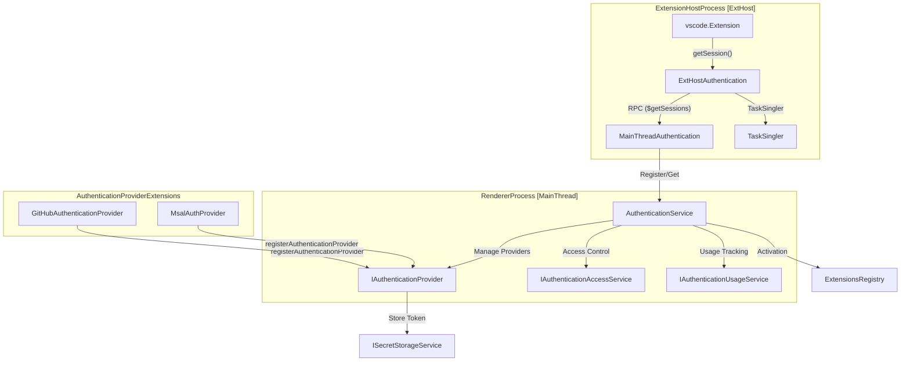
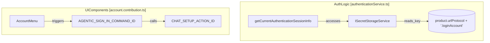

# Authentication and User Accounts

Relevant source files

The following files were used as context for generating this wiki page:

- [extensions/github-authentication/media/auth.css](extensions/github-authentication/media/auth.css)
- [extensions/github-authentication/media/code-icon.svg](extensions/github-authentication/media/code-icon.svg)
- [extensions/github-authentication/media/favicon.ico](extensions/github-authentication/media/favicon.ico)
- [extensions/github-authentication/media/icon.png](extensions/github-authentication/media/icon.png)
- [extensions/github-authentication/media/index.html](extensions/github-authentication/media/index.html)
- [extensions/github-authentication/package.nls.json](extensions/github-authentication/package.nls.json)
- [extensions/github-authentication/src/browser/buffer.ts](extensions/github-authentication/src/browser/buffer.ts)
- [extensions/github-authentication/src/common/env.ts](extensions/github-authentication/src/common/env.ts)
- [extensions/github-authentication/src/common/errors.ts](extensions/github-authentication/src/common/errors.ts)
- [extensions/github-authentication/src/common/keychain.ts](extensions/github-authentication/src/common/keychain.ts)
- [extensions/github-authentication/src/common/logger.ts](extensions/github-authentication/src/common/logger.ts)
- [extensions/github-authentication/src/config.ts](extensions/github-authentication/src/config.ts)
- [extensions/github-authentication/src/extension.ts](extensions/github-authentication/src/extension.ts)
- [extensions/github-authentication/src/flows.ts](extensions/github-authentication/src/flows.ts)
- [extensions/github-authentication/src/github.ts](extensions/github-authentication/src/github.ts)
- [extensions/github-authentication/src/githubServer.ts](extensions/github-authentication/src/githubServer.ts)
- [extensions/github-authentication/src/node/authServer.ts](extensions/github-authentication/src/node/authServer.ts)
- [extensions/github-authentication/src/node/buffer.ts](extensions/github-authentication/src/node/buffer.ts)
- [extensions/github-authentication/src/node/fetch.ts](extensions/github-authentication/src/node/fetch.ts)
- [extensions/github-authentication/src/test/flows.test.ts](extensions/github-authentication/src/test/flows.test.ts)
- [extensions/github-authentication/src/test/node/authServer.test.ts](extensions/github-authentication/src/test/node/authServer.test.ts)
- [extensions/github-authentication/src/test/node/fetch.test.ts](extensions/github-authentication/src/test/node/fetch.test.ts)
- [extensions/microsoft-authentication/media/index.html](extensions/microsoft-authentication/media/index.html)
- [extensions/microsoft-authentication/package.nls.json](extensions/microsoft-authentication/package.nls.json)
- [extensions/microsoft-authentication/src/extension.ts](extensions/microsoft-authentication/src/extension.ts)
- [src/vs/base/common/defaultAccount.ts](src/vs/base/common/defaultAccount.ts)
- [src/vs/platform/agentHost/common/agentHostCustomizationConfig.ts](src/vs/platform/agentHost/common/agentHostCustomizationConfig.ts)
- [src/vs/sessions/browser/accountTitleBarState.ts](src/vs/sessions/browser/accountTitleBarState.ts)
- [src/vs/sessions/browser/chatDashboardService.ts](src/vs/sessions/browser/chatDashboardService.ts)
- [src/vs/sessions/browser/parts/mobile/mobileTitlebarPart.ts](src/vs/sessions/browser/parts/mobile/mobileTitlebarPart.ts)
- [src/vs/sessions/browser/sessionsAuthGate.ts](src/vs/sessions/browser/sessionsAuthGate.ts)
- [src/vs/sessions/browser/sessionsSetUpService.ts](src/vs/sessions/browser/sessionsSetUpService.ts)
- [src/vs/sessions/contrib/accountMenu/browser/account.contribution.ts](src/vs/sessions/contrib/accountMenu/browser/account.contribution.ts)
- [src/vs/sessions/contrib/accountMenu/browser/media/accountTitleBarWidget.css](src/vs/sessions/contrib/accountMenu/browser/media/accountTitleBarWidget.css)
- [src/vs/sessions/contrib/accountMenu/browser/media/accountWidget.css](src/vs/sessions/contrib/accountMenu/browser/media/accountWidget.css)
- [src/vs/sessions/contrib/accountMenu/test/browser/accountTitleBarState.test.ts](src/vs/sessions/contrib/accountMenu/test/browser/accountTitleBarState.test.ts)
- [src/vs/sessions/contrib/providers/agentHost/browser/agentHostDiscoveredConfigNotification.ts](src/vs/sessions/contrib/providers/agentHost/browser/agentHostDiscoveredConfigNotification.ts)
- [src/vs/sessions/contrib/providers/agentHost/browser/localAgentHost.contribution.ts](src/vs/sessions/contrib/providers/agentHost/browser/localAgentHost.contribution.ts)
- [src/vs/sessions/contrib/providers/agentHost/test/browser/agentHostDiscoveredConfigNotification.test.ts](src/vs/sessions/contrib/providers/agentHost/test/browser/agentHostDiscoveredConfigNotification.test.ts)
- [src/vs/sessions/contrib/providers/agentHost/test/browser/sessionTypeAuthRequirement.test.ts](src/vs/sessions/contrib/providers/agentHost/test/browser/sessionTypeAuthRequirement.test.ts)
- [src/vs/sessions/test/browser/sessionsAuthGate.test.ts](src/vs/sessions/test/browser/sessionsAuthGate.test.ts)
- [src/vs/workbench/api/browser/mainThreadAuthentication.ts](src/vs/workbench/api/browser/mainThreadAuthentication.ts)
- [src/vs/workbench/api/common/extHostAuthentication.ts](src/vs/workbench/api/common/extHostAuthentication.ts)
- [src/vs/workbench/api/test/browser/extHostAuthentication.test.ts](src/vs/workbench/api/test/browser/extHostAuthentication.test.ts)
- [src/vs/workbench/browser/parts/globalCompositeBar.ts](src/vs/workbench/browser/parts/globalCompositeBar.ts)
- [src/vs/workbench/contrib/chat/browser/agentSessions/agentHost/agentHostAuth.ts](src/vs/workbench/contrib/chat/browser/agentSessions/agentHost/agentHostAuth.ts)
- [src/vs/workbench/contrib/chat/browser/agentSessions/agentHost/agentHostSignedOutModelsNotification.ts](src/vs/workbench/contrib/chat/browser/agentSessions/agentHost/agentHostSignedOutModelsNotification.ts)
- [src/vs/workbench/contrib/chat/browser/chatSetup/chatSetup.ts](src/vs/workbench/contrib/chat/browser/chatSetup/chatSetup.ts)
- [src/vs/workbench/contrib/chat/browser/chatSetup/chatSetupContributions.ts](src/vs/workbench/contrib/chat/browser/chatSetup/chatSetupContributions.ts)
- [src/vs/workbench/contrib/chat/browser/chatSetup/chatSetupController.ts](src/vs/workbench/contrib/chat/browser/chatSetup/chatSetupController.ts)
- [src/vs/workbench/contrib/chat/browser/chatSetup/chatSetupProviders.ts](src/vs/workbench/contrib/chat/browser/chatSetup/chatSetupProviders.ts)
- [src/vs/workbench/contrib/chat/browser/chatSetup/chatSetupRunner.ts](src/vs/workbench/contrib/chat/browser/chatSetup/chatSetupRunner.ts)
- [src/vs/workbench/contrib/chat/browser/chatStatus/chatStatusDashboard.ts](src/vs/workbench/contrib/chat/browser/chatStatus/chatStatusDashboard.ts)
- [src/vs/workbench/contrib/chat/browser/chatStatus/chatStatusEntry.ts](src/vs/workbench/contrib/chat/browser/chatStatus/chatStatusEntry.ts)
- [src/vs/workbench/contrib/chat/browser/chatStatus/media/chatStatus.css](src/vs/workbench/contrib/chat/browser/chatStatus/media/chatStatus.css)
- [src/vs/workbench/contrib/chat/test/browser/agentSessions/agentHostAuth.test.ts](src/vs/workbench/contrib/chat/test/browser/agentSessions/agentHostAuth.test.ts)
- [src/vs/workbench/contrib/chat/test/browser/agentSessions/agentHostSignedOutModelsNotification.test.ts](src/vs/workbench/contrib/chat/test/browser/agentSessions/agentHostSignedOutModelsNotification.test.ts)
- [src/vs/workbench/contrib/chat/test/browser/chatSetup/chatSetup.test.ts](src/vs/workbench/contrib/chat/test/browser/chatSetup/chatSetup.test.ts)
- [src/vs/workbench/contrib/chat/test/browser/chatStatusDashboard.test.ts](src/vs/workbench/contrib/chat/test/browser/chatStatusDashboard.test.ts)
- [src/vs/workbench/contrib/chat/test/browser/chatStatusEntry.test.ts](src/vs/workbench/contrib/chat/test/browser/chatStatusEntry.test.ts)
- [src/vs/workbench/contrib/chat/test/common/chatEntitlementService.test.ts](src/vs/workbench/contrib/chat/test/common/chatEntitlementService.test.ts)
- [src/vs/workbench/services/authentication/browser/authenticationService.ts](src/vs/workbench/services/authentication/browser/authenticationService.ts)
- [src/vs/workbench/services/authentication/common/authentication.ts](src/vs/workbench/services/authentication/common/authentication.ts)
- [src/vs/workbench/services/chat/common/chatEntitlementService.ts](src/vs/workbench/services/chat/common/chatEntitlementService.ts)

The authentication subsystem in VS Code provides a unified framework for extensions to request access to user accounts and for the workbench to manage credentials. It abstracts the complexities of OAuth flows, keychain storage, and session management through a centralized service architecture.

## Architecture Overview

Authentication in VS Code is split between the **Main Thread** (managing the UI, service coordination, and session persistence) and the **Extension Host** (providing the API for extensions).

### Data Flow and Service Interaction

The primary entry point for the workbench is the `IAuthenticationService`. It manages the lifecycle of `IAuthenticationProvider` instances, which are typically contributed by extensions (e.g., GitHub or Microsoft authentication).

Title: Authentication Service and Extension Host RPC Mapping

Sources: [src/vs/workbench/services/authentication/browser/authenticationService.ts:93-115](), [src/vs/workbench/api/browser/mainThreadAuthentication.ts:114-132](), [src/vs/workbench/api/common/extHostAuthentication.ts:42-68]()

## IAuthenticationService

The `AuthenticationService` is the core implementation of `IAuthenticationService`. It tracks registered providers and handles the logic for session retrieval, creation, and removal.

### Key Functions
- `getSessions(id, scopes, options)`: Retrieves existing sessions for a provider. It triggers the `onAuthenticationRequest:providerId` activation event if the provider is not yet registered [src/vs/workbench/services/authentication/browser/authenticationService.ts:316-320]().
- `createSession(id, scopes, options)`: Initiates the creation of a new session, often involving a UI prompt or an external OAuth flow [src/vs/workbench/services/authentication/browser/authenticationService.ts:430-435]().
- `removeSession(id, sessionId)`: Deletes a session from the provider and the underlying storage [src/vs/workbench/services/authentication/browser/authenticationService.ts:468-472]().

### Extension Point
Extensions contribute authentication providers via the `authentication` extension point in `package.json`.
- **Schema**: Defines `id`, `label`, and `authorizationServerGlobs` [src/vs/workbench/services/authentication/browser/authenticationService.ts:54-75]().
- **Activation**: VS Code generates activation events like `onAuthenticationRequest:${id}` via `activationEventsGenerator` to lazily load the provider extension when an authentication request occurs [src/vs/workbench/services/authentication/browser/authenticationService.ts:84-91]().

Sources: [src/vs/workbench/services/authentication/browser/authenticationService.ts:93-122](), [src/vs/workbench/services/authentication/common/authentication.ts:15-15]()

## Extension Host Authentication API

The `ExtHostAuthentication` class implements the `vscode.authentication` API namespace. It communicates with the renderer process via the `MainThreadAuthenticationShape` proxy [src/vs/workbench/api/common/extHost.protocol.ts:10-10]().

### Session Management
When an extension calls `getSession`, the request flows through `ExtHostAuthentication.getSession` [src/vs/workbench/api/common/extHostAuthentication.ts:88-112](). 
- If `createIfNone` or `forceNewSession` is specified, the system may show a modal dialog to the user to approve the login request.
- The `TaskSingler` (via `_getSessionTaskSingler`) is used to ensure that multiple simultaneous calls for the same provider/scopes are coalesced into a single request [src/vs/workbench/api/common/extHostAuthentication.ts:54-54]().

### Dynamic and Managed Authentication
The API supports dynamic registration of authentication providers, particularly useful for Enterprise-managed auth (XAA) or Model Context Protocol (MCP) scenarios.
- `DynamicAuthProvider`: Handles OIDC-like flows where client IDs may need to be generated or rotated [src/vs/workbench/api/common/extHostAuthentication.ts:46-46]().
- `XaaifyAuthProvider`: Wraps a provider to support enterprise-managed ID-JAG (Identity Assertion Authorization Grant) flows [src/vs/workbench/api/common/extHostAuthentication.ts:30-30]().

Sources: [src/vs/workbench/api/common/extHostAuthentication.ts:42-82](), [src/vs/workbench/api/browser/mainThreadAuthentication.ts:114-140]()

## Built-in Authentication Providers

VS Code includes built-in extensions for GitHub and Microsoft accounts. These extensions implement the `vscode.AuthenticationProvider` interface.

### GitHub Authentication
The GitHub provider supports both `github.com` and GitHub Enterprise Server (GHES) [extensions/github-authentication/src/github.ts:30-33]().
- **OAuth Flows**: Implements multiple flows (URL Handler, Device Code, Local Server) via `GitHubServer.login` [extensions/github-authentication/src/githubServer.ts:90-153](). It uses `getFlows` to determine available strategies based on the environment (Web Worker, Remote, or Local Extension Host) [extensions/github-authentication/src/githubServer.ts:118-126]().
- **Keychain Storage**: Uses a `Keychain` wrapper to store tokens securely in the extension's `secrets` storage [extensions/github-authentication/src/github.ts:153-158]().
- **Session Persistence**: Sessions are read from the keychain during activation and cached in `_sessionsPromise` [extensions/github-authentication/src/github.ts:168-172]().

### Microsoft Authentication
The Microsoft provider supports Azure Active Directory (AAD) and Microsoft Accounts (MSA).
- **Implementation**: Uses the MSAL (Microsoft Authentication Library) via `MsalAuthProvider` [extensions/microsoft-authentication/src/extension.ts:112-117]().
- **Sovereign Clouds**: Supports custom environments (e.g., Azure Government) via the `microsoft-sovereign-cloud` configuration [extensions/microsoft-authentication/src/extension.ts:16-53]().

Sources: [extensions/github-authentication/src/github.ts:130-165](), [extensions/github-authentication/src/githubServer.ts:30-46](), [extensions/microsoft-authentication/src/extension.ts:72-130]()

## Default Account and Accounts UI

The Accounts menu provides visibility into signed-in accounts and extension usage.

### Default Account Service
The `IDefaultAccountService` (often paired with `ChatEntitlementService`) manages the primary identity used for features like GitHub Copilot [src/vs/workbench/services/chat/common/chatEntitlementService.ts:34-35](). 

### Accounts Activity Item
The workbench retrieves primary login information to display in the UI. It uses `getCurrentAuthenticationSessionInfo` to retrieve the primary login account from `ISecretStorageService` using a protocol-specific key [src/vs/workbench/services/authentication/browser/authenticationService.ts:31-52]().

Title: Accounts UI and Session Info Flow

Sources: [src/vs/workbench/services/authentication/browser/authenticationService.ts:31-52](), [src/vs/sessions/contrib/accountMenu/browser/account.contribution.ts:81-98]()

## Security and Access Control

VS Code implements a "Consent" model for authentication tokens to prevent unauthorized extension access.

1.  **Extension Access**: The `IAuthenticationAccessService` tracks which extensions are allowed to access specific sessions [src/vs/workbench/api/browser/mainThreadAuthentication.ts:126-126]().
2.  **Usage Tracking**: The `IAuthenticationUsageService` records when an extension uses a session, visible to the user in the Accounts menu [src/vs/workbench/api/browser/mainThreadAuthentication.ts:127-127]().
3.  **Secret Storage**: Tokens are stored via `ISecretStorageService`, which maps to native OS keychains on desktop [src/vs/workbench/services/authentication/browser/authenticationService.ts:31-35]().
4.  **Internal Providers**: Providers prefixed with `__` (via `INTERNAL_AUTH_PROVIDER_PREFIX`) are treated as internal infrastructure [src/vs/workbench/api/common/extHostAuthentication.ts:12-12]().

Sources: [src/vs/workbench/services/authentication/browser/authenticationService.ts:118-120](), [src/vs/workbench/api/browser/mainThreadAuthentication.ts:126-127](), [src/vs/workbench/api/common/extHostAuthentication.ts:12-12]()