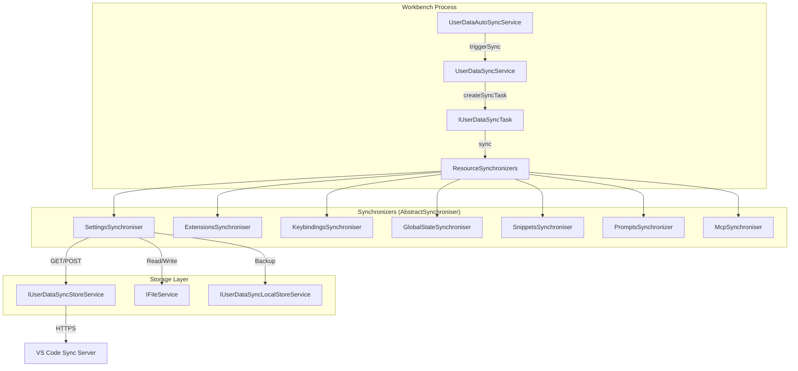
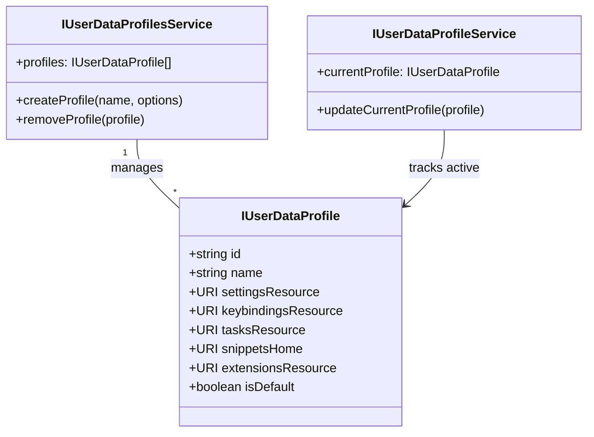

# User Data Sync and Profiles

Relevant source files

The following files were used as context for generating this wiki page:

- [src/vs/code/electron-utility/sharedProcess/contrib/extensions.ts](src/vs/code/electron-utility/sharedProcess/contrib/extensions.ts)
- [src/vs/platform/extensionManagement/common/unsupportedExtensionsMigration.ts](src/vs/platform/extensionManagement/common/unsupportedExtensionsMigration.ts)
- [src/vs/platform/request/common/requestIpc.ts](src/vs/platform/request/common/requestIpc.ts)
- [src/vs/platform/state/node/state.ts](src/vs/platform/state/node/state.ts)
- [src/vs/platform/state/node/stateService.ts](src/vs/platform/state/node/stateService.ts)
- [src/vs/platform/userDataProfile/browser/userDataProfile.ts](src/vs/platform/userDataProfile/browser/userDataProfile.ts)
- [src/vs/platform/userDataProfile/common/userDataProfile.ts](src/vs/platform/userDataProfile/common/userDataProfile.ts)
- [src/vs/platform/userDataProfile/common/userDataProfileIpc.ts](src/vs/platform/userDataProfile/common/userDataProfileIpc.ts)
- [src/vs/platform/userDataProfile/electron-main/userDataProfile.ts](src/vs/platform/userDataProfile/electron-main/userDataProfile.ts)
- [src/vs/platform/userDataProfile/node/userDataProfile.ts](src/vs/platform/userDataProfile/node/userDataProfile.ts)
- [src/vs/platform/userDataProfile/test/common/userDataProfileService.test.ts](src/vs/platform/userDataProfile/test/common/userDataProfileService.test.ts)
- [src/vs/platform/userDataProfile/test/electron-main/userDataProfileMainService.test.ts](src/vs/platform/userDataProfile/test/electron-main/userDataProfileMainService.test.ts)
- [src/vs/platform/userDataSync/common/abstractSynchronizer.ts](src/vs/platform/userDataSync/common/abstractSynchronizer.ts)
- [src/vs/platform/userDataSync/common/extensionsSync.ts](src/vs/platform/userDataSync/common/extensionsSync.ts)
- [src/vs/platform/userDataSync/common/globalStateSync.ts](src/vs/platform/userDataSync/common/globalStateSync.ts)
- [src/vs/platform/userDataSync/common/keybindingsSync.ts](src/vs/platform/userDataSync/common/keybindingsSync.ts)
- [src/vs/platform/userDataSync/common/settingsSync.ts](src/vs/platform/userDataSync/common/settingsSync.ts)
- [src/vs/platform/userDataSync/common/snippetsSync.ts](src/vs/platform/userDataSync/common/snippetsSync.ts)
- [src/vs/platform/userDataSync/common/tasksSync.ts](src/vs/platform/userDataSync/common/tasksSync.ts)
- [src/vs/platform/userDataSync/common/userDataAutoSyncService.ts](src/vs/platform/userDataSync/common/userDataAutoSyncService.ts)
- [src/vs/platform/userDataSync/common/userDataProfilesManifestMerge.ts](src/vs/platform/userDataSync/common/userDataProfilesManifestMerge.ts)
- [src/vs/platform/userDataSync/common/userDataProfilesManifestSync.ts](src/vs/platform/userDataSync/common/userDataProfilesManifestSync.ts)
- [src/vs/platform/userDataSync/common/userDataSync.ts](src/vs/platform/userDataSync/common/userDataSync.ts)
- [src/vs/platform/userDataSync/common/userDataSyncIpc.ts](src/vs/platform/userDataSync/common/userDataSyncIpc.ts)
- [src/vs/platform/userDataSync/common/userDataSyncMachines.ts](src/vs/platform/userDataSync/common/userDataSyncMachines.ts)
- [src/vs/platform/userDataSync/common/userDataSyncService.ts](src/vs/platform/userDataSync/common/userDataSyncService.ts)
- [src/vs/platform/userDataSync/common/userDataSyncStoreService.ts](src/vs/platform/userDataSync/common/userDataSyncStoreService.ts)
- [src/vs/platform/userDataSync/test/common/globalStateSync.test.ts](src/vs/platform/userDataSync/test/common/globalStateSync.test.ts)
- [src/vs/platform/userDataSync/test/common/keybindingsSync.test.ts](src/vs/platform/userDataSync/test/common/keybindingsSync.test.ts)
- [src/vs/platform/userDataSync/test/common/settingsSync.test.ts](src/vs/platform/userDataSync/test/common/settingsSync.test.ts)
- [src/vs/platform/userDataSync/test/common/snippetsSync.test.ts](src/vs/platform/userDataSync/test/common/snippetsSync.test.ts)
- [src/vs/platform/userDataSync/test/common/synchronizer.test.ts](src/vs/platform/userDataSync/test/common/synchronizer.test.ts)
- [src/vs/platform/userDataSync/test/common/tasksSync.test.ts](src/vs/platform/userDataSync/test/common/tasksSync.test.ts)
- [src/vs/platform/userDataSync/test/common/userDataAutoSyncService.test.ts](src/vs/platform/userDataSync/test/common/userDataAutoSyncService.test.ts)
- [src/vs/platform/userDataSync/test/common/userDataProfilesManifestMerge.test.ts](src/vs/platform/userDataSync/test/common/userDataProfilesManifestMerge.test.ts)
- [src/vs/platform/userDataSync/test/common/userDataProfilesManifestSync.test.ts](src/vs/platform/userDataSync/test/common/userDataProfilesManifestSync.test.ts)
- [src/vs/platform/userDataSync/test/common/userDataSyncClient.ts](src/vs/platform/userDataSync/test/common/userDataSyncClient.ts)
- [src/vs/platform/userDataSync/test/common/userDataSyncService.test.ts](src/vs/platform/userDataSync/test/common/userDataSyncService.test.ts)
- [src/vs/platform/userDataSync/test/common/userDataSyncStoreService.test.ts](src/vs/platform/userDataSync/test/common/userDataSyncStoreService.test.ts)
- [src/vs/workbench/contrib/extensions/browser/unsupportedExtensionsMigrationContribution.ts](src/vs/workbench/contrib/extensions/browser/unsupportedExtensionsMigrationContribution.ts)
- [src/vs/workbench/contrib/userDataProfile/browser/media/userDataProfilesEditor.css](src/vs/workbench/contrib/userDataProfile/browser/media/userDataProfilesEditor.css)
- [src/vs/workbench/contrib/userDataProfile/browser/userDataProfile.contribution.ts](src/vs/workbench/contrib/userDataProfile/browser/userDataProfile.contribution.ts)
- [src/vs/workbench/contrib/userDataProfile/browser/userDataProfile.ts](src/vs/workbench/contrib/userDataProfile/browser/userDataProfile.ts)
- [src/vs/workbench/contrib/userDataProfile/browser/userDataProfileActions.ts](src/vs/workbench/contrib/userDataProfile/browser/userDataProfileActions.ts)
- [src/vs/workbench/contrib/userDataProfile/browser/userDataProfilesEditor.ts](src/vs/workbench/contrib/userDataProfile/browser/userDataProfilesEditor.ts)
- [src/vs/workbench/contrib/userDataProfile/browser/userDataProfilesEditorModel.ts](src/vs/workbench/contrib/userDataProfile/browser/userDataProfilesEditorModel.ts)
- [src/vs/workbench/contrib/userDataProfile/common/userDataProfile.ts](src/vs/workbench/contrib/userDataProfile/common/userDataProfile.ts)
- [src/vs/workbench/contrib/userDataSync/browser/userDataSync.ts](src/vs/workbench/contrib/userDataSync/browser/userDataSync.ts)
- [src/vs/workbench/contrib/userDataSync/browser/userDataSyncConflictsView.ts](src/vs/workbench/contrib/userDataSync/browser/userDataSyncConflictsView.ts)
- [src/vs/workbench/contrib/userDataSync/browser/userDataSyncViews.ts](src/vs/workbench/contrib/userDataSync/browser/userDataSyncViews.ts)
- [src/vs/workbench/services/userDataProfile/browser/extensionsResource.ts](src/vs/workbench/services/userDataProfile/browser/extensionsResource.ts)
- [src/vs/workbench/services/userDataProfile/browser/globalStateResource.ts](src/vs/workbench/services/userDataProfile/browser/globalStateResource.ts)
- [src/vs/workbench/services/userDataProfile/browser/keybindingsResource.ts](src/vs/workbench/services/userDataProfile/browser/keybindingsResource.ts)
- [src/vs/workbench/services/userDataProfile/browser/media/userDataProfileView.css](src/vs/workbench/services/userDataProfile/browser/media/userDataProfileView.css)
- [src/vs/workbench/services/userDataProfile/browser/settingsResource.ts](src/vs/workbench/services/userDataProfile/browser/settingsResource.ts)
- [src/vs/workbench/services/userDataProfile/browser/snippetsResource.ts](src/vs/workbench/services/userDataProfile/browser/snippetsResource.ts)
- [src/vs/workbench/services/userDataProfile/browser/tasksResource.ts](src/vs/workbench/services/userDataProfile/browser/tasksResource.ts)
- [src/vs/workbench/services/userDataProfile/browser/userDataProfileImportExportService.ts](src/vs/workbench/services/userDataProfile/browser/userDataProfileImportExportService.ts)
- [src/vs/workbench/services/userDataProfile/browser/userDataProfileInit.ts](src/vs/workbench/services/userDataProfile/browser/userDataProfileInit.ts)
- [src/vs/workbench/services/userDataProfile/browser/userDataProfileManagement.ts](src/vs/workbench/services/userDataProfile/browser/userDataProfileManagement.ts)
- [src/vs/workbench/services/userDataProfile/common/remoteUserDataProfiles.ts](src/vs/workbench/services/userDataProfile/common/remoteUserDataProfiles.ts)
- [src/vs/workbench/services/userDataProfile/common/userDataProfile.ts](src/vs/workbench/services/userDataProfile/common/userDataProfile.ts)
- [src/vs/workbench/services/userDataProfile/common/userDataProfileService.ts](src/vs/workbench/services/userDataProfile/common/userDataProfileService.ts)
- [src/vs/workbench/services/userDataSync/browser/userDataSyncInit.ts](src/vs/workbench/services/userDataSync/browser/userDataSyncInit.ts)
- [src/vs/workbench/services/userDataSync/browser/userDataSyncWorkbenchService.ts](src/vs/workbench/services/userDataSync/browser/userDataSyncWorkbenchService.ts)
- [src/vs/workbench/services/userDataSync/common/userDataSync.ts](src/vs/workbench/services/userDataSync/common/userDataSync.ts)
- [src/vs/workbench/services/userDataSync/electron-browser/userDataSyncService.ts](src/vs/workbench/services/userDataSync/electron-browser/userDataSyncService.ts)

The User Data Sync and Profiles subsystem provides the infrastructure for synchronizing user configurations (settings, extensions, keybindings, snippets, and UI state) across multiple VS Code instances and managing distinct sets of these configurations as "Profiles".

## User Data Sync Architecture

User Data Sync is built on a multi-layered service architecture that handles local state detection, remote storage communication, and resource-specific merging logic.

### Core Service Hierarchy

*   `IUserDataSyncService`: The primary entry point for orchestrating sync operations across all resources [src/vs/platform/userDataSync/common/userDataSyncService.ts:64-65](). It manages a collection of synchronizers for different data types and maintains the global `SyncStatus` [src/vs/platform/userDataSync/common/userDataSyncService.ts:68-71]().
*   `IUserDataAutoSyncService`: Handles the scheduling of synchronization based on local changes, timers, or external triggers (e.g., window focus) [src/vs/platform/userDataSync/common/userDataAutoSyncService.ts:30-31](). It uses a `ThrottledDelayer` to batch frequent changes [src/vs/platform/userDataSync/common/userDataAutoSyncService.ts:82-82]().
*   `IUserDataSyncStoreService`: Provides the low-level REST client for communicating with the Settings Sync server, handling headers like `X-Execution-Id` for request tracking [src/vs/platform/userDataSync/common/userDataSyncStoreService.ts:26-26]().
*   `IUserDataSyncEnablementService`: Manages the global and per-resource enablement state of synchronization [src/vs/platform/userDataSync/common/userDataSync.ts:28-28]().
*   `IUserDataSyncWorkbenchService`: Orchestrates the UI-facing aspects of sync, including account management and conflict resolution workflows [src/vs/workbench/services/userDataSync/browser/userDataSyncWorkbenchService.ts:65-66]().

### Synchronization Flow

The following diagram illustrates the data flow during a synchronization cycle:

**Synchronization Data Flow**

Sources: [src/vs/platform/userDataSync/common/userDataSyncService.ts:118-120](), [src/vs/platform/userDataSync/common/userDataAutoSyncService.ts:123-130](), [src/vs/platform/userDataSync/common/abstractSynchronizer.ts:125-126](), [src/vs/platform/userDataSync/common/userDataSyncService.ts:23-31]()

## Resource Synchronizers

Each syncable resource implements `IUserDataSynchroniser` via the `AbstractSynchroniser` base class [src/vs/platform/userDataSync/common/abstractSynchronizer.ts:125-126](). Synchronizers handle the specific merging logic required for their data type.

| Synchronizer | File Path | Logic Description |
| :--- | :--- | :--- |
| `SettingsSynchroniser` | `src/vs/platform/userDataSync/common/settingsSync.ts` | Merges JSON settings, handling ignored settings and formatting [src/vs/platform/userDataSync/common/userDataSync.ts:35-40](). |
| `ExtensionsSynchroniser` | `src/vs/platform/userDataSync/common/extensionsSync.ts` | Synchronizes installed extensions, enablement state, and extension storage [src/vs/platform/userDataSync/common/extensionsSync.ts:97-98](). |
| `KeybindingsSynchroniser` | `src/vs/platform/userDataSync/common/keybindingsSync.ts` | Syncs `keybindings.json`, with optional per-platform separation [src/vs/platform/userDataSync/common/userDataSync.ts:79-80](). |
| `GlobalStateSynchroniser` | `src/vs/platform/userDataSync/common/globalStateSync.ts` | Syncs UI state stored in global storage (e.g., locale, storage keys) [src/vs/platform/userDataSync/common/globalStateSync.ts:69-70](). |
| `SnippetsSynchroniser` | `src/vs/platform/userDataSync/common/snippetsSync.ts` | Syncs user-defined code snippets [src/vs/platform/userDataSync/common/userDataSyncService.ts:28-28](). |
| `TasksSynchroniser` | `src/vs/platform/userDataSync/common/tasksSync.ts` | Syncs `tasks.json` configuration [src/vs/platform/userDataSync/common/userDataSyncService.ts:29-29](). |
| `PromptsSynchronizer` | `src/vs/platform/userDataSync/common/promptsSync/promptsSync.ts` | Syncs user-defined AI prompts [src/vs/platform/userDataSync/common/userDataSyncService.ts:26-26](). |
| `McpSynchroniser` | `src/vs/platform/userDataSync/common/mcpSync.ts` | Syncs Model Context Protocol (MCP) server configurations [src/vs/platform/userDataSync/common/userDataSyncService.ts:30-30](). |

### Merging and Conflict Resolution
Synchronizers use a three-way merge strategy comparing:
1.  **Local**: Current state on the machine.
2.  **Remote**: Current state in the Sync Store.
3.  **Base**: The state at the time of the last successful sync [src/vs/platform/userDataSync/common/abstractSynchronizer.ts:73-88]().

If a merge cannot be performed automatically (e.g., conflicting changes in the same setting), the synchronizer enters a `SyncStatus.HasConflicts` state [src/vs/platform/userDataSync/common/userDataSync.ts:28-28](). The `UserDataSyncWorkbenchService` then facilitates the Conflict Resolution UI using the Merge Editor [src/vs/workbench/services/userDataSync/browser/userDataSyncWorkbenchService.ts:65-66]().

## User Data Profiles

Profiles allow users to switch between different sets of configurations (e.g., "Work", "Personal").

### Profile Management Entities

*   `IUserDataProfile`: Represents a profile instance, containing URIs for its specific settings, storage, and snippets [src/vs/platform/userDataProfile/common/userDataProfile.ts:64-65]().
*   `IUserDataProfilesService`: Manages the lifecycle of profiles (creation, deletion, listing) [src/vs/platform/userDataProfile/common/userDataProfile.ts:125-126]().
*   `IUserDataProfileService`: Tracks the currently active profile in the workbench [src/vs/workbench/services/userDataProfile/common/userDataProfile.ts:21-22]().
*   `IUserDataProfileImportExportService`: Handles the serialization of profiles into `.code-profile` templates and handles imports from URLs [src/vs/workbench/services/userDataProfile/browser/userDataProfileImportExportService.ts:44-67]().
*   `UserDataProfilesEditor`: The UI for managing profiles, including creating, editing, and exporting them [src/vs/workbench/contrib/userDataProfile/browser/userDataProfilesEditor.ts:28-28]().

### Profile-Aware Extension Management
Extensions are profile-aware. When a profile is active, the `ExtensionsSynchroniser` ensures that only extensions associated with that profile are enabled/installed [src/vs/platform/userDataSync/common/extensionsSync.ts:117-128](). The system uses `IUserDataProfilesService` to resolve the correct profile location for extension operations [src/vs/platform/userDataProfile/common/userDataProfile.ts:125-126]().

**Profile Entity Association**

Sources: [src/vs/platform/userDataProfile/common/userDataProfile.ts:64-126](), [src/vs/workbench/services/userDataProfile/common/userDataProfile.ts:21-22]()

## Sync Store and Network

The `UserDataSyncStoreService` manages the communication with the remote server.

*   **Authentication**: Uses `IAuthenticationService` to obtain tokens (typically GitHub or Microsoft accounts) [src/vs/workbench/services/userDataSync/browser/userDataSyncWorkbenchService.ts:101-102]().
*   **Request Orchestration**: Implements back-off strategies and handles `412 Precondition Failed` errors, which indicate that the remote state has changed since the last fetch [src/vs/platform/userDataSync/common/userDataSyncStoreService.ts:23-26]().
*   **Auto-Sync Logic**: `UserDataAutoSyncService` monitors triggers like `onDidChangeLocal` from resource synchronizers to initiate a throttled sync cycle [src/vs/platform/userDataSync/common/userDataAutoSyncService.ts:116-116]().

## IPC and Multi-Process Integration

In the desktop version of VS Code, the `IUserDataSyncService` is often hosted in the Shared Process to ensure a single instance handles synchronization even if multiple windows are open.

*   **Shared Process Hosting**: The service is registered and exposed via IPC using the `UserDataSyncChannel` [src/vs/platform/userDataSync/common/userDataSyncIpc.ts:15-16]().
*   **Workbench Proxy**: Windows communicate with the shared process service via an IPC channel.
*   **Auto-Sync Triggering**: While the logic lives in the shared process, triggers (like configuration changes or window focus) are sent from the Workbench processes [src/vs/platform/userDataSync/common/userDataAutoSyncService.ts:116-118]().

Sources: [src/vs/platform/userDataSync/common/userDataSyncIpc.ts](), [src/vs/platform/userDataSync/common/userDataAutoSyncService.ts:116-118](), [src/vs/platform/userDataSync/common/userDataSyncService.ts:64-117]()