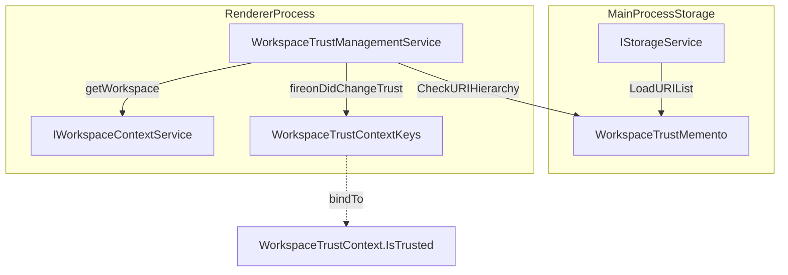
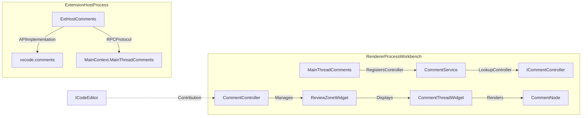

# Workspace Trust and Comments

Relevant source files

The following files were used as context for generating this wiki page:

- [src/vs/platform/extensions/common/extensions.ts](https://github.com/microsoft/vscode/blob/HEAD/src/vs/platform/extensions/common/extensions.ts)
- [src/vs/platform/workspace/common/workspaceTrust.ts](https://github.com/microsoft/vscode/blob/HEAD/src/vs/platform/workspace/common/workspaceTrust.ts)
- [src/vs/workbench/api/browser/mainThreadComments.ts](https://github.com/microsoft/vscode/blob/HEAD/src/vs/workbench/api/browser/mainThreadComments.ts)
- [src/vs/workbench/api/browser/mainThreadExtensionService.ts](https://github.com/microsoft/vscode/blob/HEAD/src/vs/workbench/api/browser/mainThreadExtensionService.ts)
- [src/vs/workbench/api/browser/mainThreadWorkspace.ts](https://github.com/microsoft/vscode/blob/HEAD/src/vs/workbench/api/browser/mainThreadWorkspace.ts)
- [src/vs/workbench/api/common/extHostComments.ts](https://github.com/microsoft/vscode/blob/HEAD/src/vs/workbench/api/common/extHostComments.ts)
- [src/vs/workbench/api/common/extHostExtensionService.ts](https://github.com/microsoft/vscode/blob/HEAD/src/vs/workbench/api/common/extHostExtensionService.ts)
- [src/vs/workbench/api/common/extHostWorkspace.ts](https://github.com/microsoft/vscode/blob/HEAD/src/vs/workbench/api/common/extHostWorkspace.ts)
- [src/vs/workbench/api/test/browser/extHostWorkspace.test.ts](https://github.com/microsoft/vscode/blob/HEAD/src/vs/workbench/api/test/browser/extHostWorkspace.test.ts)
- [src/vs/workbench/api/test/browser/mainThreadWorkspace.test.ts](https://github.com/microsoft/vscode/blob/HEAD/src/vs/workbench/api/test/browser/mainThreadWorkspace.test.ts)
- [src/vs/workbench/contrib/comments/browser/commentColors.ts](https://github.com/microsoft/vscode/blob/HEAD/src/vs/workbench/contrib/comments/browser/commentColors.ts)
- [src/vs/workbench/contrib/comments/browser/commentFormActions.ts](https://github.com/microsoft/vscode/blob/HEAD/src/vs/workbench/contrib/comments/browser/commentFormActions.ts)
- [src/vs/workbench/contrib/comments/browser/commentGlyphWidget.ts](https://github.com/microsoft/vscode/blob/HEAD/src/vs/workbench/contrib/comments/browser/commentGlyphWidget.ts)
- [src/vs/workbench/contrib/comments/browser/commentMenus.ts](https://github.com/microsoft/vscode/blob/HEAD/src/vs/workbench/contrib/comments/browser/commentMenus.ts)
- [src/vs/workbench/contrib/comments/browser/commentNode.ts](https://github.com/microsoft/vscode/blob/HEAD/src/vs/workbench/contrib/comments/browser/commentNode.ts)
- [src/vs/workbench/contrib/comments/browser/commentReply.ts](https://github.com/microsoft/vscode/blob/HEAD/src/vs/workbench/contrib/comments/browser/commentReply.ts)
- [src/vs/workbench/contrib/comments/browser/commentService.ts](https://github.com/microsoft/vscode/blob/HEAD/src/vs/workbench/contrib/comments/browser/commentService.ts)
- [src/vs/workbench/contrib/comments/browser/commentThreadAdditionalActions.ts](https://github.com/microsoft/vscode/blob/HEAD/src/vs/workbench/contrib/comments/browser/commentThreadAdditionalActions.ts)
- [src/vs/workbench/contrib/comments/browser/commentThreadBody.ts](https://github.com/microsoft/vscode/blob/HEAD/src/vs/workbench/contrib/comments/browser/commentThreadBody.ts)
- [src/vs/workbench/contrib/comments/browser/commentThreadHeader.ts](https://github.com/microsoft/vscode/blob/HEAD/src/vs/workbench/contrib/comments/browser/commentThreadHeader.ts)
- [src/vs/workbench/contrib/comments/browser/commentThreadRangeDecorator.ts](https://github.com/microsoft/vscode/blob/HEAD/src/vs/workbench/contrib/comments/browser/commentThreadRangeDecorator.ts)
- [src/vs/workbench/contrib/comments/browser/commentThreadWidget.ts](https://github.com/microsoft/vscode/blob/HEAD/src/vs/workbench/contrib/comments/browser/commentThreadWidget.ts)
- [src/vs/workbench/contrib/comments/browser/commentThreadZoneWidget.ts](https://github.com/microsoft/vscode/blob/HEAD/src/vs/workbench/contrib/comments/browser/commentThreadZoneWidget.ts)
- [src/vs/workbench/contrib/comments/browser/comments.contribution.ts](https://github.com/microsoft/vscode/blob/HEAD/src/vs/workbench/contrib/comments/browser/comments.contribution.ts)
- [src/vs/workbench/contrib/comments/browser/comments.ts](https://github.com/microsoft/vscode/blob/HEAD/src/vs/workbench/contrib/comments/browser/comments.ts)
- [src/vs/workbench/contrib/comments/browser/commentsController.ts](https://github.com/microsoft/vscode/blob/HEAD/src/vs/workbench/contrib/comments/browser/commentsController.ts)
- [src/vs/workbench/contrib/comments/browser/commentsEditorContribution.ts](https://github.com/microsoft/vscode/blob/HEAD/src/vs/workbench/contrib/comments/browser/commentsEditorContribution.ts)
- [src/vs/workbench/contrib/comments/browser/commentsModel.ts](https://github.com/microsoft/vscode/blob/HEAD/src/vs/workbench/contrib/comments/browser/commentsModel.ts)
- [src/vs/workbench/contrib/comments/browser/commentsTreeViewer.ts](https://github.com/microsoft/vscode/blob/HEAD/src/vs/workbench/contrib/comments/browser/commentsTreeViewer.ts)
- [src/vs/workbench/contrib/comments/browser/commentsView.ts](https://github.com/microsoft/vscode/blob/HEAD/src/vs/workbench/contrib/comments/browser/commentsView.ts)
- [src/vs/workbench/contrib/comments/browser/commentsViewActions.ts](https://github.com/microsoft/vscode/blob/HEAD/src/vs/workbench/contrib/comments/browser/commentsViewActions.ts)
- [src/vs/workbench/contrib/comments/browser/media/panel.css](https://github.com/microsoft/vscode/blob/HEAD/src/vs/workbench/contrib/comments/browser/media/panel.css)
- [src/vs/workbench/contrib/comments/browser/media/review.css](https://github.com/microsoft/vscode/blob/HEAD/src/vs/workbench/contrib/comments/browser/media/review.css)
- [src/vs/workbench/contrib/comments/browser/simpleCommentEditor.ts](https://github.com/microsoft/vscode/blob/HEAD/src/vs/workbench/contrib/comments/browser/simpleCommentEditor.ts)
- [src/vs/workbench/contrib/comments/browser/timestamp.ts](https://github.com/microsoft/vscode/blob/HEAD/src/vs/workbench/contrib/comments/browser/timestamp.ts)
- [src/vs/workbench/contrib/comments/common/commentModel.ts](https://github.com/microsoft/vscode/blob/HEAD/src/vs/workbench/contrib/comments/common/commentModel.ts)
- [src/vs/workbench/contrib/comments/common/commentsConfiguration.ts](https://github.com/microsoft/vscode/blob/HEAD/src/vs/workbench/contrib/comments/common/commentsConfiguration.ts)
- [src/vs/workbench/contrib/comments/test/browser/commentsView.test.ts](https://github.com/microsoft/vscode/blob/HEAD/src/vs/workbench/contrib/comments/test/browser/commentsView.test.ts)
- [src/vs/workbench/contrib/notebook/browser/view/cellParts/cellComments.ts](https://github.com/microsoft/vscode/blob/HEAD/src/vs/workbench/contrib/notebook/browser/view/cellParts/cellComments.ts)
- [src/vs/workbench/contrib/workspace/browser/workspace.contribution.ts](https://github.com/microsoft/vscode/blob/HEAD/src/vs/workbench/contrib/workspace/browser/workspace.contribution.ts)
- [src/vs/workbench/contrib/workspace/browser/workspaceTrustEditor.ts](https://github.com/microsoft/vscode/blob/HEAD/src/vs/workbench/contrib/workspace/browser/workspaceTrustEditor.ts)
- [src/vs/workbench/services/extensionManagement/browser/extensionEnablementService.ts](https://github.com/microsoft/vscode/blob/HEAD/src/vs/workbench/services/extensionManagement/browser/extensionEnablementService.ts)
- [src/vs/workbench/services/extensionManagement/test/browser/extensionEnablementService.test.ts](https://github.com/microsoft/vscode/blob/HEAD/src/vs/workbench/services/extensionManagement/test/browser/extensionEnablementService.test.ts)
- [src/vs/workbench/services/extensions/browser/extensionService.ts](https://github.com/microsoft/vscode/blob/HEAD/src/vs/workbench/services/extensions/browser/extensionService.ts)
- [src/vs/workbench/services/extensions/browser/webWorkerExtensionHost.ts](https://github.com/microsoft/vscode/blob/HEAD/src/vs/workbench/services/extensions/browser/webWorkerExtensionHost.ts)
- [src/vs/workbench/services/extensions/common/abstractExtensionService.ts](https://github.com/microsoft/vscode/blob/HEAD/src/vs/workbench/services/extensions/common/abstractExtensionService.ts)
- [src/vs/workbench/services/extensions/common/extHostCustomers.ts](https://github.com/microsoft/vscode/blob/HEAD/src/vs/workbench/services/extensions/common/extHostCustomers.ts)
- [src/vs/workbench/services/extensions/common/extensionHostManager.ts](https://github.com/microsoft/vscode/blob/HEAD/src/vs/workbench/services/extensions/common/extensionHostManager.ts)
- [src/vs/workbench/services/extensions/common/extensionHostManagers.ts](https://github.com/microsoft/vscode/blob/HEAD/src/vs/workbench/services/extensions/common/extensionHostManagers.ts)
- [src/vs/workbench/services/extensions/common/extensionHostProtocol.ts](https://github.com/microsoft/vscode/blob/HEAD/src/vs/workbench/services/extensions/common/extensionHostProtocol.ts)
- [src/vs/workbench/services/extensions/common/extensionHostProxy.ts](https://github.com/microsoft/vscode/blob/HEAD/src/vs/workbench/services/extensions/common/extensionHostProxy.ts)
- [src/vs/workbench/services/extensions/common/extensionManifestPropertiesService.ts](https://github.com/microsoft/vscode/blob/HEAD/src/vs/workbench/services/extensions/common/extensionManifestPropertiesService.ts)
- [src/vs/workbench/services/extensions/common/extensions.ts](https://github.com/microsoft/vscode/blob/HEAD/src/vs/workbench/services/extensions/common/extensions.ts)
- [src/vs/workbench/services/extensions/common/lazyCreateExtensionHostManager.ts](https://github.com/microsoft/vscode/blob/HEAD/src/vs/workbench/services/extensions/common/lazyCreateExtensionHostManager.ts)
- [src/vs/workbench/services/extensions/common/remoteExtensionHost.ts](https://github.com/microsoft/vscode/blob/HEAD/src/vs/workbench/services/extensions/common/remoteExtensionHost.ts)
- [src/vs/workbench/services/extensions/electron-browser/localProcessExtensionHost.ts](https://github.com/microsoft/vscode/blob/HEAD/src/vs/workbench/services/extensions/electron-browser/localProcessExtensionHost.ts)
- [src/vs/workbench/services/extensions/test/browser/extensionService.test.ts](https://github.com/microsoft/vscode/blob/HEAD/src/vs/workbench/services/extensions/test/browser/extensionService.test.ts)
- [src/vs/workbench/services/extensions/test/common/extensionManifestPropertiesService.test.ts](https://github.com/microsoft/vscode/blob/HEAD/src/vs/workbench/services/extensions/test/common/extensionManifestPropertiesService.test.ts)
- [src/vs/workbench/services/workspaces/common/workspaceTrust.ts](https://github.com/microsoft/vscode/blob/HEAD/src/vs/workbench/services/workspaces/common/workspaceTrust.ts)
- [src/vs/workbench/services/workspaces/test/common/workspaceTrust.test.ts](https://github.com/microsoft/vscode/blob/HEAD/src/vs/workbench/services/workspaces/test/common/workspaceTrust.test.ts)
- [src/vscode-dts/vscode.proposed.fileSearchProvider2.d.ts](https://github.com/microsoft/vscode/blob/HEAD/src/vscode-dts/vscode.proposed.fileSearchProvider2.d.ts)
- [src/vscode-dts/vscode.proposed.findFiles2.d.ts](https://github.com/microsoft/vscode/blob/HEAD/src/vscode-dts/vscode.proposed.findFiles2.d.ts)
- [src/vscode-dts/vscode.proposed.findTextInFiles2.d.ts](https://github.com/microsoft/vscode/blob/HEAD/src/vscode-dts/vscode.proposed.findTextInFiles2.d.ts)
- [src/vscode-dts/vscode.proposed.textSearchProvider2.d.ts](https://github.com/microsoft/vscode/blob/HEAD/src/vscode-dts/vscode.proposed.textSearchProvider2.d.ts)

This page details the implementation of VS Code's security model (Workspace Trust) and the integrated commenting system used for code reviews and notebook annotations.

## 1. Workspace Trust Model

Workspace Trust is a security feature that restricts code execution (like extension activation or task running) until the user explicitly trusts a folder or workspace.

### 1.1 Core Services and Management
The system is managed by two primary services:
*   `IWorkspaceTrustEnablementService`: Determines if trust is globally enabled based on settings (`security.workspace.trust.enabled`) and environment flags [src/vs/workbench/services/workspaces/common/workspaceTrust.ts:70-88](https://github.com/microsoft/vscode/blob/HEAD/src/vs/workbench/services/workspaces/common/workspaceTrust.ts#L70-L88).
*   `IWorkspaceTrustManagementService`: Manages the actual trust state of the current workspace and maintains the persistent list of trusted URIs [src/vs/workbench/services/workspaces/common/workspaceTrust.ts:90-144](https://github.com/microsoft/vscode/blob/HEAD/src/vs/workbench/services/workspaces/common/workspaceTrust.ts#L90-L144).

The trust state is persisted using a `WorkspaceTrustMemento` which stores trusted paths in the global storage under the key `content.trust.model.key` [src/vs/workbench/services/workspaces/common/workspaceTrust.ts:36,94,136](https://github.com/microsoft/vscode/blob/HEAD/src/vs/workbench/services/workspaces/common/workspaceTrust.ts#L36).

### 1.2 Data Flow: Trust Calculation
Trust is calculated by checking the current workspace folders and the workspace configuration file against the stored trusted URIs. In the "Sessions Window" (Agents Window), trusting a workspace also persists trust to the parent VS Code installation via `getSessionsWindowTrustNote` [src/vs/workbench/contrib/workspace/browser/workspace.contribution.ts:57-70](https://github.com/microsoft/vscode/blob/HEAD/src/vs/workbench/contrib/workspace/browser/workspace.contribution.ts#L57-L70).

**Title: Workspace Trust State Resolution**

Sources: [src/vs/workbench/services/workspaces/common/workspaceTrust.ts:136-144](https://github.com/microsoft/vscode/blob/HEAD/src/vs/workbench/services/workspaces/common/workspaceTrust.ts#L136-L144), [src/vs/workbench/contrib/workspace/browser/workspace.contribution.ts:72-91](https://github.com/microsoft/vscode/blob/HEAD/src/vs/workbench/contrib/workspace/browser/workspace.contribution.ts#L72-L91), [src/vs/workbench/contrib/workspace/browser/workspace.contribution.ts:57-70](https://github.com/microsoft/vscode/blob/HEAD/src/vs/workbench/contrib/workspace/browser/workspace.contribution.ts#L57-L70)

### 1.3 Workspace Trust Editor
The Trust Editor (`WorkspaceTrustEditor`) provides a UI for users to manage trusted folders and see which extensions are limited by restricted mode.

*   **Implementation**: Extends `EditorPane` and is rendered within the workbench editor area [src/vs/workbench/contrib/workspace/browser/workspaceTrustEditor.ts:41](https://github.com/microsoft/vscode/blob/HEAD/src/vs/workbench/contrib/workspace/browser/workspaceTrustEditor.ts#L41).
*   **Trusted Folders Table**: Uses `WorkspaceTrustedUrisTable` (wrapping `WorkbenchTable<ITrustedUriItem>`) to display and edit the list of trusted paths [src/vs/workbench/contrib/workspace/browser/workspaceTrustEditor.ts:76-89](https://github.com/microsoft/vscode/blob/HEAD/src/vs/workbench/contrib/workspace/browser/workspaceTrustEditor.ts#L76-L89).
*   **Integration**: Registered via `EditorPaneDescriptor` and associated with `WorkspaceTrustEditorInput` [src/vs/workbench/contrib/workspace/browser/workspace.contribution.ts:24-28](https://github.com/microsoft/vscode/blob/HEAD/src/vs/workbench/contrib/workspace/browser/workspace.contribution.ts#L24-L28).

Sources: [src/vs/workbench/contrib/workspace/browser/workspaceTrustEditor.ts:41-89](https://github.com/microsoft/vscode/blob/HEAD/src/vs/workbench/contrib/workspace/browser/workspaceTrustEditor.ts#L41-L89), [src/vs/workbench/contrib/workspace/browser/workspace.contribution.ts:24-28](https://github.com/microsoft/vscode/blob/HEAD/src/vs/workbench/contrib/workspace/browser/workspace.contribution.ts#L24-L28)

### 1.4 Extension Enablement and Trust
The `ExtensionEnablementService` monitors workspace trust changes. When a workspace is untrusted, it restricts extensions that do not support restricted mode based on their manifest properties (`capabilities.untrustedWorkspaces`) [src/vs/workbench/services/extensionManagement/browser/extensionEnablementService.ts:85-87](https://github.com/microsoft/vscode/blob/HEAD/src/vs/workbench/services/extensionManagement/browser/extensionEnablementService.ts#L85-L87).

Sources: [src/vs/workbench/services/extensionManagement/browser/extensionEnablementService.ts:85-87](https://github.com/microsoft/vscode/blob/HEAD/src/vs/workbench/services/extensionManagement/browser/extensionEnablementService.ts#L85-L87)

## 2. Comments System

The comments system provides a framework for extensions (like GitHub Pull Requests) to contribute discussion threads directly into the editor gutter and a dedicated view.

### 2.1 Comments Architecture
The system follows a provider-consumer model across the Extension Host boundary, utilizing the `MainThreadComments` and `ExtHostComments` RPC actors.

**Title: Comments System Data Flow (Natural Language to Code Entity)**

Sources: [src/vs/workbench/api/browser/mainThreadComments.ts:15-17](https://github.com/microsoft/vscode/blob/HEAD/src/vs/workbench/api/browser/mainThreadComments.ts#L15-L17), [src/vs/workbench/contrib/comments/browser/commentsController.ts:52-107](https://github.com/microsoft/vscode/blob/HEAD/src/vs/workbench/contrib/comments/browser/commentsController.ts#L52-L107), [src/vs/workbench/contrib/comments/browser/commentThreadZoneWidget.ts:115-154](https://github.com/microsoft/vscode/blob/HEAD/src/vs/workbench/contrib/comments/browser/commentThreadZoneWidget.ts#L115-L154)

### 2.2 CommentsController
`CommentController` is an editor contribution (`editor.contrib.review`) that manages the lifecycle of comment widgets for a specific editor instance [src/vs/workbench/contrib/comments/browser/commentsController.ts:52](https://github.com/microsoft/vscode/blob/HEAD/src/vs/workbench/contrib/comments/browser/commentsController.ts#L52).

*   **Gutter Decorations**: Uses `CommentingRangeDecorator` to highlight areas where comments can be added [src/vs/workbench/contrib/comments/browser/commentsController.ts:109-114](https://github.com/microsoft/vscode/blob/HEAD/src/vs/workbench/contrib/comments/browser/commentsController.ts#L109-L114).
*   **Mouse Interaction**: Detects clicks in the `GUTTER_LINE_DECORATIONS` area to trigger new comment threads via `parseMouseDownInfoFromEvent` [src/vs/workbench/contrib/comments/browser/commentThreadZoneWidget.ts:53-77](https://github.com/microsoft/vscode/blob/HEAD/src/vs/workbench/contrib/comments/browser/commentThreadZoneWidget.ts#L53-L77).
*   **Thread Navigation**: Implements `nextCommentThread` and `previousCommentThread` for keyboard navigation, registered as editor commands [src/vs/workbench/contrib/comments/browser/commentsEditorContribution.ts:37-71](https://github.com/microsoft/vscode/blob/HEAD/src/vs/workbench/contrib/comments/browser/commentsEditorContribution.ts#L37-L71).

Sources: [src/vs/workbench/contrib/comments/browser/commentsController.ts:52-114](https://github.com/microsoft/vscode/blob/HEAD/src/vs/workbench/contrib/comments/browser/commentsController.ts#L52-L114), [src/vs/workbench/contrib/comments/browser/commentThreadZoneWidget.ts:53-77](https://github.com/microsoft/vscode/blob/HEAD/src/vs/workbench/contrib/comments/browser/commentThreadZoneWidget.ts#L53-L77), [src/vs/workbench/contrib/comments/browser/commentsEditorContribution.ts:37-71](https://github.com/microsoft/vscode/blob/HEAD/src/vs/workbench/contrib/comments/browser/commentsEditorContribution.ts#L37-L71)

### 2.3 Comment UI Components
The UI is composed of several nested layers:
1.  **ReviewZoneWidget**: A `ZoneWidget` that creates space between lines in the editor to host the thread [src/vs/workbench/contrib/comments/browser/commentThreadZoneWidget.ts:115](https://github.com/microsoft/vscode/blob/HEAD/src/vs/workbench/contrib/comments/browser/commentThreadZoneWidget.ts#L115).
2.  **CommentThreadWidget**: The primary container for a thread, orchestrating the `CommentThreadHeader`, `CommentThreadBody`, and `CommentReply` [src/vs/workbench/contrib/comments/browser/commentThreadWidget.ts:38-43](https://github.com/microsoft/vscode/blob/HEAD/src/vs/workbench/contrib/comments/browser/commentThreadWidget.ts#L38-L43).
3.  **CommentNode**: Represents an individual comment. It handles Markdown rendering via `IMarkdownRendererService` and manages reaction toolbars [src/vs/workbench/contrib/comments/browser/commentNode.ts:61-92](https://github.com/microsoft/vscode/blob/HEAD/src/vs/workbench/contrib/comments/browser/commentNode.ts#L61-L92).
4.  **CommentReply**: The input area at the bottom of a thread, utilizing a `SimpleCommentEditor` which is a lightweight `ICodeEditor` instance [src/vs/workbench/contrib/comments/browser/commentReply.ts:16](https://github.com/microsoft/vscode/blob/HEAD/src/vs/workbench/contrib/comments/browser/commentReply.ts#L16), [src/vs/workbench/contrib/comments/browser/simpleCommentEditor.ts:15](https://github.com/microsoft/vscode/blob/HEAD/src/vs/workbench/contrib/comments/browser/simpleCommentEditor.ts#L15).

Sources: [src/vs/workbench/contrib/comments/browser/commentThreadZoneWidget.ts:115](https://github.com/microsoft/vscode/blob/HEAD/src/vs/workbench/contrib/comments/browser/commentThreadZoneWidget.ts#L115), [src/vs/workbench/contrib/comments/browser/commentThreadWidget.ts:38-43](https://github.com/microsoft/vscode/blob/HEAD/src/vs/workbench/contrib/comments/browser/commentThreadWidget.ts#L38-L43), [src/vs/workbench/contrib/comments/browser/commentNode.ts:61-92](https://github.com/microsoft/vscode/blob/HEAD/src/vs/workbench/contrib/comments/browser/commentNode.ts#L61-L92), [src/vs/workbench/contrib/comments/browser/simpleCommentEditor.ts:15](https://github.com/microsoft/vscode/blob/HEAD/src/vs/workbench/contrib/comments/browser/simpleCommentEditor.ts#L15)

### 2.4 Comments View
The `CommentsPanel` (Comments View) provides a global, searchable list of all comments across the workspace [src/vs/workbench/contrib/comments/browser/commentsView.ts:75](https://github.com/microsoft/vscode/blob/HEAD/src/vs/workbench/contrib/comments/browser/commentsView.ts#L75).

*   **Filtering**: Supports complex filtering via `FilterOptions`, including resolved/unresolved states and file path patterns [src/vs/workbench/contrib/comments/browser/commentsView.ts:75-86](https://github.com/microsoft/vscode/blob/HEAD/src/vs/workbench/contrib/comments/browser/commentsView.ts#L75-L86).
*   **Tree Model**: Uses `CommentsModel` to aggregate comment threads from all active comment providers [src/vs/workbench/contrib/comments/common/commentModel.ts:33](https://github.com/microsoft/vscode/blob/HEAD/src/vs/workbench/contrib/comments/common/commentModel.ts#L33).

Sources: [src/vs/workbench/contrib/comments/browser/commentsView.ts:75-86](https://github.com/microsoft/vscode/blob/HEAD/src/vs/workbench/contrib/comments/browser/commentsView.ts#L75-L86), [src/vs/workbench/contrib/comments/common/commentModel.ts:33](https://github.com/microsoft/vscode/blob/HEAD/src/vs/workbench/contrib/comments/common/commentModel.ts#L33)

## 3. Extension API Integration

### 3.1 Workspace API
The `ExtHostWorkspace` implementation provides the `vscode.workspace` API surface.
*   **Trust State**: Extensions check `vscode.workspace.isTrusted`, which is synchronized from the main thread's `IWorkspaceTrustManagementService` [src/vs/workbench/api/common/extHostWorkspace.ts:103-105](https://github.com/microsoft/vscode/blob/HEAD/src/vs/workbench/api/common/extHostWorkspace.ts#L103-L105).
*   **Canonical URIs**: Handles the resolution of canonical URIs for workspace folders via `CanonicalWorkspace`, critical for trust matching in remote scenarios [src/vs/workbench/services/workspaces/common/workspaceTrust.ts:38-68](https://github.com/microsoft/vscode/blob/HEAD/src/vs/workbench/services/workspaces/common/workspaceTrust.ts#L38-L68).

### 3.2 Comments API
Extensions create a `CommentController` via the API, which maps to a `MainThreadComments` actor in the renderer [src/vs/workbench/api/browser/mainThreadComments.ts:15](https://github.com/microsoft/vscode/blob/HEAD/src/vs/workbench/api/browser/mainThreadComments.ts#L15).

*   **Thread Lifecycle**: Extensions manage `CommentThread` objects. `MainThreadCommentThread` implements the renderer-side representation, handling updates to `comments`, `range`, and `collapsibleState` [src/vs/workbench/api/browser/mainThreadComments.ts:35-136](https://github.com/microsoft/vscode/blob/HEAD/src/vs/workbench/api/browser/mainThreadComments.ts#L35-L136).
*   **Context Keys**: The system binds context keys like `commentThreadContext` and `commentControllerContext` to allow extensions to contribute scoped menu items via `MenuId.CommentThreadTitle` or `MenuId.CommentTitle` [src/vs/workbench/contrib/comments/browser/commentThreadWidget.ts:137-145](https://github.com/microsoft/vscode/blob/HEAD/src/vs/workbench/contrib/comments/browser/commentThreadWidget.ts#L137-L145).

Sources: [src/vs/workbench/api/common/extHostWorkspace.ts:103-105](https://github.com/microsoft/vscode/blob/HEAD/src/vs/workbench/api/common/extHostWorkspace.ts#L103-L105), [src/vs/workbench/api/browser/mainThreadComments.ts:35-145](https://github.com/microsoft/vscode/blob/HEAD/src/vs/workbench/api/browser/mainThreadComments.ts#L35-L145), [src/vs/workbench/contrib/comments/browser/commentThreadWidget.ts:137-145](https://github.com/microsoft/vscode/blob/HEAD/src/vs/workbench/contrib/comments/browser/commentThreadWidget.ts#L137-L145)