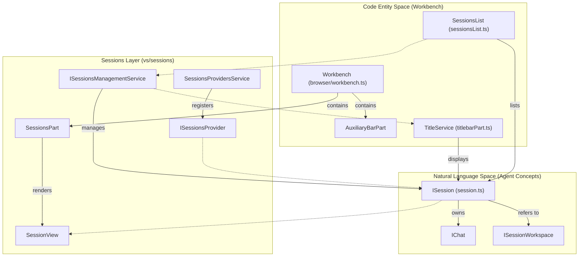
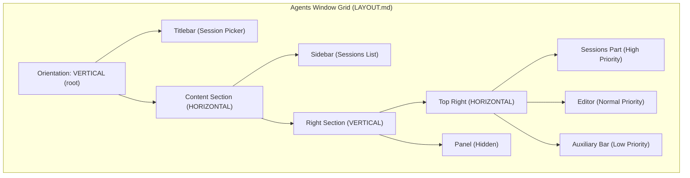

# Agents Window (Sessions Layer)

<details>
<summary>Relevant source files</summary>

The following files were used as context for generating this wiki page:

- [.github/instructions/best-practices.instructions.md](.github/instructions/best-practices.instructions.md)
- [.github/instructions/css-best-practices.instructions.md](.github/instructions/css-best-practices.instructions.md)
- [.github/skills/sessions/SKILL.md](.github/skills/sessions/SKILL.md)
- [src/vs/editor/browser/widget/multiDiffEditor/workbenchUIElementFactory.ts](src/vs/editor/browser/widget/multiDiffEditor/workbenchUIElementFactory.ts)
- [src/vs/sessions/LAYOUT.md](src/vs/sessions/LAYOUT.md)
- [src/vs/sessions/LAYOUT_CONTROLLER.md](src/vs/sessions/LAYOUT_CONTROLLER.md)
- [src/vs/sessions/SESSIONS.md](src/vs/sessions/SESSIONS.md)
- [src/vs/sessions/SESSIONS_LIST.md](src/vs/sessions/SESSIONS_LIST.md)
- [src/vs/sessions/SINGLE_PANE_SCENARIOS.md](src/vs/sessions/SINGLE_PANE_SCENARIOS.md)
- [src/vs/sessions/browser/media/workbench.css](src/vs/sessions/browser/media/workbench.css)
- [src/vs/sessions/browser/parts/editorPart.ts](src/vs/sessions/browser/parts/editorPart.ts)
- [src/vs/sessions/browser/parts/media/editorPart.css](src/vs/sessions/browser/parts/media/editorPart.css)
- [src/vs/sessions/browser/parts/singlePaneEditorPart.ts](src/vs/sessions/browser/parts/singlePaneEditorPart.ts)
- [src/vs/sessions/browser/singlePaneWorkbench.ts](src/vs/sessions/browser/singlePaneWorkbench.ts)
- [src/vs/sessions/browser/workbench.ts](src/vs/sessions/browser/workbench.ts)
- [src/vs/sessions/common/contextkeys.ts](src/vs/sessions/common/contextkeys.ts)
- [src/vs/sessions/contrib/automations/browser/automationDialog.ts](src/vs/sessions/contrib/automations/browser/automationDialog.ts)
- [src/vs/sessions/contrib/automations/browser/automationDialogService.ts](src/vs/sessions/contrib/automations/browser/automationDialogService.ts)
- [src/vs/sessions/contrib/automations/test/browser/automationDialog.test.ts](src/vs/sessions/contrib/automations/test/browser/automationDialog.test.ts)
- [src/vs/sessions/contrib/changes/browser/changes.contribution.ts](src/vs/sessions/contrib/changes/browser/changes.contribution.ts)
- [src/vs/sessions/contrib/changes/browser/changesActions.ts](src/vs/sessions/contrib/changes/browser/changesActions.ts)
- [src/vs/sessions/contrib/changes/browser/changesEditorLabels.ts](src/vs/sessions/contrib/changes/browser/changesEditorLabels.ts)
- [src/vs/sessions/contrib/changes/browser/changesMultiDiffSourceResolver.ts](src/vs/sessions/contrib/changes/browser/changesMultiDiffSourceResolver.ts)
- [src/vs/sessions/contrib/changes/browser/changesView.ts](src/vs/sessions/contrib/changes/browser/changesView.ts)
- [src/vs/sessions/contrib/changes/browser/changesViewActions.ts](src/vs/sessions/contrib/changes/browser/changesViewActions.ts)
- [src/vs/sessions/contrib/changes/browser/changesViewRenderer.ts](src/vs/sessions/contrib/changes/browser/changesViewRenderer.ts)
- [src/vs/sessions/contrib/changes/browser/changesViewService.ts](src/vs/sessions/contrib/changes/browser/changesViewService.ts)
- [src/vs/sessions/contrib/changes/browser/changesetReviewActions.ts](src/vs/sessions/contrib/changes/browser/changesetReviewActions.ts)
- [src/vs/sessions/contrib/changes/browser/media/changesView.css](src/vs/sessions/contrib/changes/browser/media/changesView.css)
- [src/vs/sessions/contrib/changes/browser/media/multiFileDiffEditor.css](src/vs/sessions/contrib/changes/browser/media/multiFileDiffEditor.css)
- [src/vs/sessions/contrib/changes/browser/media/sessionChangesEditor.css](src/vs/sessions/contrib/changes/browser/media/sessionChangesEditor.css)
- [src/vs/sessions/contrib/changes/browser/media/sessionFilesWidget.css](src/vs/sessions/contrib/changes/browser/media/sessionFilesWidget.css)
- [src/vs/sessions/contrib/changes/browser/sessionChangesEditor.ts](src/vs/sessions/contrib/changes/browser/sessionChangesEditor.ts)
- [src/vs/sessions/contrib/changes/browser/sessionFilesViewModel.ts](src/vs/sessions/contrib/changes/browser/sessionFilesViewModel.ts)
- [src/vs/sessions/contrib/changes/browser/sessionFilesWidget.ts](src/vs/sessions/contrib/changes/browser/sessionFilesWidget.ts)
- [src/vs/sessions/contrib/changes/browser/sessionsChangesAccessibilityHelp.ts](src/vs/sessions/contrib/changes/browser/sessionsChangesAccessibilityHelp.ts)
- [src/vs/sessions/contrib/changes/common/changes.ts](src/vs/sessions/contrib/changes/common/changes.ts)
- [src/vs/sessions/contrib/changes/common/changesViewService.ts](src/vs/sessions/contrib/changes/common/changesViewService.ts)
- [src/vs/sessions/contrib/changes/test/browser/changesEditorLabels.test.ts](src/vs/sessions/contrib/changes/test/browser/changesEditorLabels.test.ts)
- [src/vs/sessions/contrib/changes/test/browser/changesViewActions.test.ts](src/vs/sessions/contrib/changes/test/browser/changesViewActions.test.ts)
- [src/vs/sessions/contrib/changes/test/browser/changesViewService.test.ts](src/vs/sessions/contrib/changes/test/browser/changesViewService.test.ts)
- [src/vs/sessions/contrib/changes/test/browser/changesetReviewActions.test.ts](src/vs/sessions/contrib/changes/test/browser/changesetReviewActions.test.ts)
- [src/vs/sessions/contrib/changes/test/browser/sessionFilesWidget.fixture.ts](src/vs/sessions/contrib/changes/test/browser/sessionFilesWidget.fixture.ts)
- [src/vs/sessions/contrib/chat/browser/media/newSessionPromptOptions.css](src/vs/sessions/contrib/chat/browser/media/newSessionPromptOptions.css)
- [src/vs/sessions/contrib/chat/browser/newChatInSessionWidget.ts](src/vs/sessions/contrib/chat/browser/newChatInSessionWidget.ts)
- [src/vs/sessions/contrib/chat/browser/newChatWidget.ts](src/vs/sessions/contrib/chat/browser/newChatWidget.ts)
- [src/vs/sessions/contrib/chat/browser/newSessionComposerService.ts](src/vs/sessions/contrib/chat/browser/newSessionComposerService.ts)
- [src/vs/sessions/contrib/chat/browser/newSessionPromptOptions.ts](src/vs/sessions/contrib/chat/browser/newSessionPromptOptions.ts)
- [src/vs/sessions/contrib/chat/browser/sessionWorkspaceFallback.ts](src/vs/sessions/contrib/chat/browser/sessionWorkspaceFallback.ts)
- [src/vs/sessions/contrib/chat/browser/sessionWorkspacePicker.ts](src/vs/sessions/contrib/chat/browser/sessionWorkspacePicker.ts)
- [src/vs/sessions/contrib/chat/browser/sessionsChatAccessibilityHelp.ts](src/vs/sessions/contrib/chat/browser/sessionsChatAccessibilityHelp.ts)
- [src/vs/sessions/contrib/chat/browser/webWorkspacePicker.ts](src/vs/sessions/contrib/chat/browser/webWorkspacePicker.ts)
- [src/vs/sessions/contrib/chat/electron-browser/chat.contribution.ts](src/vs/sessions/contrib/chat/electron-browser/chat.contribution.ts)
- [src/vs/sessions/contrib/chat/test/browser/newChatWidget.fixture.ts](src/vs/sessions/contrib/chat/test/browser/newChatWidget.fixture.ts)
- [src/vs/sessions/contrib/chat/test/browser/newChatWidget.test.ts](src/vs/sessions/contrib/chat/test/browser/newChatWidget.test.ts)
- [src/vs/sessions/contrib/chat/test/browser/newSessionPromptOptions.test.ts](src/vs/sessions/contrib/chat/test/browser/newSessionPromptOptions.test.ts)
- [src/vs/sessions/contrib/chat/test/browser/sessionWorkspacePicker.test.ts](src/vs/sessions/contrib/chat/test/browser/sessionWorkspacePicker.test.ts)
- [src/vs/sessions/contrib/configuration/browser/configuration.contribution.ts](src/vs/sessions/contrib/configuration/browser/configuration.contribution.ts)
- [src/vs/sessions/contrib/editor/browser/addTabActions.ts](src/vs/sessions/contrib/editor/browser/addTabActions.ts)
- [src/vs/sessions/contrib/editor/browser/editor.contribution.ts](src/vs/sessions/contrib/editor/browser/editor.contribution.ts)
- [src/vs/sessions/contrib/editor/browser/media/editorBreadcrumbs.css](src/vs/sessions/contrib/editor/browser/media/editorBreadcrumbs.css)
- [src/vs/sessions/contrib/editor/browser/media/editorHeader.css](src/vs/sessions/contrib/editor/browser/media/editorHeader.css)
- [src/vs/sessions/contrib/editor/test/browser/editor.contribution.test.ts](src/vs/sessions/contrib/editor/test/browser/editor.contribution.test.ts)
- [src/vs/sessions/contrib/editor/test/browser/editorHeader.fixture.ts](src/vs/sessions/contrib/editor/test/browser/editorHeader.fixture.ts)
- [src/vs/sessions/contrib/files/browser/files.contribution.ts](src/vs/sessions/contrib/files/browser/files.contribution.ts)
- [src/vs/sessions/contrib/files/browser/filesView.ts](src/vs/sessions/contrib/files/browser/filesView.ts)
- [src/vs/sessions/contrib/files/browser/media/filesView.css](src/vs/sessions/contrib/files/browser/media/filesView.css)
- [src/vs/sessions/contrib/files/browser/syncChangesActionViewItem.ts](src/vs/sessions/contrib/files/browser/syncChangesActionViewItem.ts)
- [src/vs/sessions/contrib/layout/browser/baseSessionLayoutController.ts](src/vs/sessions/contrib/layout/browser/baseSessionLayoutController.ts)
- [src/vs/sessions/contrib/layout/browser/desktopSessionLayoutController.md](src/vs/sessions/contrib/layout/browser/desktopSessionLayoutController.md)
- [src/vs/sessions/contrib/layout/browser/desktopSessionLayoutController.ts](src/vs/sessions/contrib/layout/browser/desktopSessionLayoutController.ts)
- [src/vs/sessions/contrib/layout/browser/singlePane/singlePaneDetailPanelStrategy.ts](src/vs/sessions/contrib/layout/browser/singlePane/singlePaneDetailPanelStrategy.ts)
- [src/vs/sessions/contrib/layout/browser/singlePane/singlePaneDetailsStrategy.ts](src/vs/sessions/contrib/layout/browser/singlePane/singlePaneDetailsStrategy.ts)
- [src/vs/sessions/contrib/layout/browser/singlePane/singlePaneManagedTabsStrategy.ts](src/vs/sessions/contrib/layout/browser/singlePane/singlePaneManagedTabsStrategy.ts)
- [src/vs/sessions/contrib/layout/browser/singlePane/singlePaneSidePaneVisibilityStrategy.ts](src/vs/sessions/contrib/layout/browser/singlePane/singlePaneSidePaneVisibilityStrategy.ts)
- [src/vs/sessions/contrib/layout/browser/singlePaneLayoutController.ts](src/vs/sessions/contrib/layout/browser/singlePaneLayoutController.ts)
- [src/vs/sessions/contrib/layout/test/browser/desktopSessionLayoutController.test.ts](src/vs/sessions/contrib/layout/test/browser/desktopSessionLayoutController.test.ts)
- [src/vs/sessions/contrib/layout/test/browser/layoutControllerTestUtils.ts](src/vs/sessions/contrib/layout/test/browser/layoutControllerTestUtils.ts)
- [src/vs/sessions/contrib/onboardingTours/browser/newSessionViewV3Prompt.ts](src/vs/sessions/contrib/onboardingTours/browser/newSessionViewV3Prompt.ts)
- [src/vs/sessions/contrib/onboardingTours/test/browser/newSessionViewV3Prompt.test.ts](src/vs/sessions/contrib/onboardingTours/test/browser/newSessionViewV3Prompt.test.ts)
- [src/vs/sessions/contrib/providers/agentHost/AGENT_HOST_SESSIONS_PROVIDER.md](src/vs/sessions/contrib/providers/agentHost/AGENT_HOST_SESSIONS_PROVIDER.md)
- [src/vs/sessions/contrib/providers/agentHost/browser/agentHostSessionChangesets.ts](src/vs/sessions/contrib/providers/agentHost/browser/agentHostSessionChangesets.ts)
- [src/vs/sessions/contrib/providers/agentHost/browser/baseAgentHostSessionsProvider.ts](src/vs/sessions/contrib/providers/agentHost/browser/baseAgentHostSessionsProvider.ts)
- [src/vs/sessions/contrib/providers/agentHost/browser/localAgentHostSessionsProvider.ts](src/vs/sessions/contrib/providers/agentHost/browser/localAgentHostSessionsProvider.ts)
- [src/vs/sessions/contrib/providers/agentHost/test/browser/localAgentHostSessionsProvider.test.ts](src/vs/sessions/contrib/providers/agentHost/test/browser/localAgentHostSessionsProvider.test.ts)
- [src/vs/sessions/contrib/providers/copilotChatSessions/browser/copilotChatSessionsChangesets.ts](src/vs/sessions/contrib/providers/copilotChatSessions/browser/copilotChatSessionsChangesets.ts)
- [src/vs/sessions/contrib/providers/copilotChatSessions/browser/copilotChatSessionsProvider.ts](src/vs/sessions/contrib/providers/copilotChatSessions/browser/copilotChatSessionsProvider.ts)
- [src/vs/sessions/contrib/providers/copilotChatSessions/test/browser/copilotChatSessionsProvider.test.ts](src/vs/sessions/contrib/providers/copilotChatSessions/test/browser/copilotChatSessionsProvider.test.ts)
- [src/vs/sessions/contrib/providers/remoteAgentHost/browser/remoteAgentHostSessionsProvider.ts](src/vs/sessions/contrib/providers/remoteAgentHost/browser/remoteAgentHostSessionsProvider.ts)
- [src/vs/sessions/contrib/providers/remoteAgentHost/test/browser/remoteAgentHostSessionsProvider.test.ts](src/vs/sessions/contrib/providers/remoteAgentHost/test/browser/remoteAgentHostSessionsProvider.test.ts)
- [src/vs/sessions/contrib/search/browser/search.contribution.ts](src/vs/sessions/contrib/search/browser/search.contribution.ts)
- [src/vs/sessions/contrib/sessions/browser/media/sessionsList.css](src/vs/sessions/contrib/sessions/browser/media/sessionsList.css)
- [src/vs/sessions/contrib/sessions/browser/sessions.contribution.ts](src/vs/sessions/contrib/sessions/browser/sessions.contribution.ts)
- [src/vs/sessions/contrib/sessions/browser/sessionsActions.ts](src/vs/sessions/contrib/sessions/browser/sessionsActions.ts)
- [src/vs/sessions/contrib/sessions/browser/sessionsWindowOpenTelemetry.ts](src/vs/sessions/contrib/sessions/browser/sessionsWindowOpenTelemetry.ts)
- [src/vs/sessions/contrib/sessions/browser/views/sessionsList.ts](src/vs/sessions/contrib/sessions/browser/views/sessionsList.ts)
- [src/vs/sessions/contrib/sessions/browser/views/sessionsViewActions.ts](src/vs/sessions/contrib/sessions/browser/views/sessionsViewActions.ts)
- [src/vs/sessions/contrib/sessions/test/browser/sessionsList.test.ts](src/vs/sessions/contrib/sessions/test/browser/sessionsList.test.ts)
- [src/vs/sessions/contrib/sessions/test/browser/sessionsWindowOpenTelemetry.test.ts](src/vs/sessions/contrib/sessions/test/browser/sessionsWindowOpenTelemetry.test.ts)
- [src/vs/sessions/services/sessions/browser/sessionNavigation.ts](src/vs/sessions/services/sessions/browser/sessionNavigation.ts)
- [src/vs/sessions/services/sessions/browser/sessionsManagementService.ts](src/vs/sessions/services/sessions/browser/sessionsManagementService.ts)
- [src/vs/sessions/services/sessions/browser/sessionsService.ts](src/vs/sessions/services/sessions/browser/sessionsService.ts)
- [src/vs/sessions/services/sessions/browser/visibleSessions.ts](src/vs/sessions/services/sessions/browser/visibleSessions.ts)
- [src/vs/sessions/services/sessions/common/session.ts](src/vs/sessions/services/sessions/common/session.ts)
- [src/vs/sessions/services/sessions/common/sessionContextKeys.ts](src/vs/sessions/services/sessions/common/sessionContextKeys.ts)
- [src/vs/sessions/services/sessions/common/sessionsManagement.ts](src/vs/sessions/services/sessions/common/sessionsManagement.ts)
- [src/vs/sessions/services/sessions/common/sessionsProvider.ts](src/vs/sessions/services/sessions/common/sessionsProvider.ts)
- [src/vs/sessions/services/sessions/test/browser/sessionNavigation.test.ts](src/vs/sessions/services/sessions/test/browser/sessionNavigation.test.ts)
- [src/vs/sessions/services/sessions/test/browser/sessionsManagementService.test.ts](src/vs/sessions/services/sessions/test/browser/sessionsManagementService.test.ts)
- [src/vs/sessions/services/sessions/test/browser/visibleSessions.test.ts](src/vs/sessions/services/sessions/test/browser/visibleSessions.test.ts)
- [src/vs/sessions/services/sessions/test/common/sessionContextKeys.test.ts](src/vs/sessions/services/sessions/test/common/sessionContextKeys.test.ts)
- [src/vs/sessions/test/browser/layoutActions.test.ts](src/vs/sessions/test/browser/layoutActions.test.ts)
- [src/vs/sessions/test/browser/workbench.test.ts](src/vs/sessions/test/browser/workbench.test.ts)
- [src/vs/workbench/browser/parts/dialogs/dialog.ts](src/vs/workbench/browser/parts/dialogs/dialog.ts)
- [src/vs/workbench/browser/parts/editor/editorHeaderControl.ts](src/vs/workbench/browser/parts/editor/editorHeaderControl.ts)
- [src/vs/workbench/test/browser/componentFixtures/editor/editorTabBar.fixture.ts](src/vs/workbench/test/browser/componentFixtures/editor/editorTabBar.fixture.ts)
- [src/vs/workbench/test/browser/componentFixtures/sessions/changesView.fixture.ts](src/vs/workbench/test/browser/componentFixtures/sessions/changesView.fixture.ts)

</details>


The **Sessions Layer** (`vs/sessions`) provides a specialized, agent-centric workbench implementation within VS Code. Unlike the standard workbench, which is designed for general-purpose code editing, the Agents Window is optimized for long-running AI agent interactions, session-based workflows, and multi-repository management.

## Overview

The Agents Window is a distinct entry point that instantiates a customized version of the VS Code workbench (`Workbench` in `vs/sessions/browser/workbench.ts`). It introduces a fixed layout model and a session-based lifecycle, where the primary unit of work is an `ISession` rather than a workspace folder.

### Key Characteristics
*   **Fixed Layout**: The layout is rigid and does not support settings-based customization or user-driven movement of parts [src/vs/sessions/LAYOUT.md:9-13]().
*   **Session-First**: The UI is driven by the `ISessionsManagementService`, which tracks active and visible sessions across different providers [src/vs/sessions/services/sessions/browser/sessionsManagementService.ts:36-82]().
*   **Simplified Tooling**: Standard parts like the activity bar, status bar, and banner are excluded to focus on the agent interaction [src/vs/sessions/LAYOUT.md:13-13]().
*   **Modal Editing**: Code editing typically occurs in a `ModalEditorPart` or is secondary to the chat interface [src/vs/sessions/LAYOUT.md:31-31]().

**Sources:** [src/vs/sessions/LAYOUT.md:7-15](), [src/vs/sessions/browser/workbench.ts:76-85](), [src/vs/sessions/services/sessions/browser/sessionsManagementService.ts:36-82]()

---

## High-Level Architecture

The architecture bridges the gap between the platform's UI framework and AI Agent Hosts. It utilizes a pluggable provider model to allow different backends (local CLI, remote agent hosts, cloud backends) to surface sessions into a unified workbench [src/vs/sessions/SESSIONS.md:5-7]().

### System Bridge: Natural Language to Code Entity Space

The following diagrams illustrate how high-level agent concepts (Sessions, Chats) map to concrete workbench entities and how the provider registry orchestrates these sessions.

**Conceptual Mapping**

**Sources:** [src/vs/sessions/services/sessions/common/session.ts:51-51](), [src/vs/sessions/services/sessions/browser/sessionsManagementService.ts:36-82](), [src/vs/sessions/LAYOUT.md:33-45](), [src/vs/sessions/SESSIONS.md:11-35]()

**Provider Orchestration**
```mermaid
graph LR
    subgraph Registry ["Registry"]
        Registry["SessionsProvidersService"]
    end

    subgraph Providers ["Providers"]
        CP["CopilotChatSessionsProvider"]
        AHP["AgentHostSessionsProvider"]
        RAH["RemoteAgentHostSessionsProvider"]
    end

    subgraph Management ["Management"]
        SMS["SessionsManagementService"]
    end

    CP -- "register" --> Registry
    AHP -- "register" --> Registry
    RAH -- "register" --> Registry
    Registry -- "provides lookup" --> SMS
    SMS -- "aggregates" --> Sessions["ISession List"]
```
**Sources:** [src/vs/sessions/SESSIONS.md:11-35](), [src/vs/sessions/services/sessions/browser/sessionsManagementService.ts:98-102](), [src/vs/sessions/contrib/providers/copilotChatSessions/browser/copilotChatSessionsProvider.ts:1-20]()

---

## The Session Model

A **Session** (`ISession`) represents a single logical thread of work with an AI agent. It encapsulates the workspace context, the conversation history, and the resulting file changes.

| Interface | Role | Location |
| :--- | :--- | :--- |
| `ISession` | Universal session facade; self-contained observable representing global session state. | [src/vs/sessions/services/sessions/common/session.ts:51-51]() |
| `ISessionWorkspace` | Defines repositories and folders (including remote worktrees) the agent can access. | [src/vs/sessions/services/sessions/common/session.ts:51-51]() |
| `ISessionsProvider` | Contract every provider must implement for discovery, CRUD, and model management. | [src/vs/sessions/services/sessions/common/sessionsProvider.ts:26-54]() |
| `ISessionsManagementService` | Orchestration layer; aggregates all sessions and routes actions (send, archive, delete) to providers. | [src/vs/sessions/services/sessions/common/sessionsManagement.ts:25-50]() |

For details on the provider registry and lifecycle management, see **[Sessions Architecture and Provider Model](#15.1)**.

**Sources:** [src/vs/sessions/services/sessions/common/session.ts:51-51](), [src/vs/sessions/services/sessions/common/sessionsProvider.ts:26-54](), [src/vs/sessions/SESSIONS.md:37-44]()

---

## Layout and UI Components

The Agents Window uses a custom workbench implementation that enforces a specific grid structure designed for "Agents-first" workflows.

### Fixed Layout Structure
The workbench is divided into a Sidebar (sessions list), a central Sessions Part (chat), and an Auxiliary Bar (changes and tools). Resizing is handled by a `LayoutPriority` model where the Sessions Part absorbs deltas to prevent secondary views from drifting [src/vs/sessions/LAYOUT.md:65-75]().


**Sources:** [src/vs/sessions/LAYOUT.md:46-63](), [src/vs/sessions/browser/workbench.ts:18-25]()

### Core UI Parts
*   **Sessions Part**: The primary content area hosting `SessionView` instances. It uses a private internal grid to render multiple active chats side-by-side [src/vs/sessions/LAYOUT.md:29-29]().
*   **Titlebar**: Features a specialized session picker and account widget, differing significantly from the standard workbench titlebar [src/vs/sessions/LAYOUT.md:37-37]().
*   **Sessions List**: A `WorkbenchObjectTree` in the sidebar (`SessionsList`) that handles session grouping (by date or workspace) and filtering [src/vs/sessions/contrib/sessions/browser/views/sessionsList.ts:38-60]().
*   **Single Pane Layout**: An optimized view that preserves the ratio between the Sessions Part and Editor area during container resizes [src/vs/sessions/LAYOUT.md:75-79]().

For details on UI implementation and styling, see **[Agents Window UI and Layout](#15.2)**.

**Sources:** [src/vs/sessions/LAYOUT.md:35-42](), [src/vs/sessions/browser/workbench.ts:67-80](), [src/vs/sessions/contrib/sessions/browser/views/sessionsList.ts:38-60]()

---

## Specialized Contributions

The Sessions layer includes several unique contributions located in `vs/sessions/contrib`:

*   **Changes View**: A dedicated view (`ChangesView`) for inspecting agent-generated file modifications and applying them to parent repositories [src/vs/sessions/contrib/changes/browser/changesView.ts:54-70]().
*   **Workspace Picker**: A unified picker (`SessionWorkspacePicker`) that allows users to select context from all registered session providers [src/vs/sessions/contrib/chat/browser/sessionWorkspacePicker.ts:106-106]().
*   **Session Navigation**: Keyboard and mouse navigation (e.g., `Alt+1..9`) registered specifically for session switching in the Agents window [src/vs/sessions/contrib/sessions/browser/views/sessionsViewActions.ts:117-125]().
*   **Configuration Overrides**: The Agents window enforces specific default settings (e.g., overriding `chat.customizationsMenu.userStoragePath`) that are isolated from the standard editor window [src/vs/sessions/contrib/configuration/browser/configuration.contribution.ts:39-47]().

For catalogs of these features, see **[Agents Window Contributions (Changes, Automations, GitHub, Feedback)](#15.3)**.

## Child Pages
*   **[Sessions Architecture and Provider Model](#15.1)**: Deep dive into `ISessionsProvider`, the registry, and the split between `SessionsManagementService` (model) and `SessionsService` (view).
*   **[Agents Window UI and Layout](#15.2)**: Technical details on `SessionsPart`, fixed grid priorities, and mobile viewport adaptations.
*   **[Agents Window Contributions (Changes, Automations, GitHub, Feedback)](#15.3)**: Details on the Changes view, automation dispatchers, and GitHub PR integration.

**Sources:** [src/vs/sessions/SESSIONS.md:1-60](), [src/vs/sessions/LAYOUT.md:1-80](), [src/vs/sessions/contrib/changes/browser/changesView.ts:54-70](), [src/vs/sessions/contrib/sessions/browser/views/sessionsViewActions.ts:117-125]()