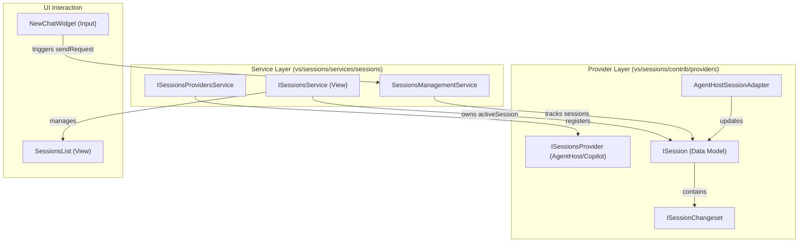
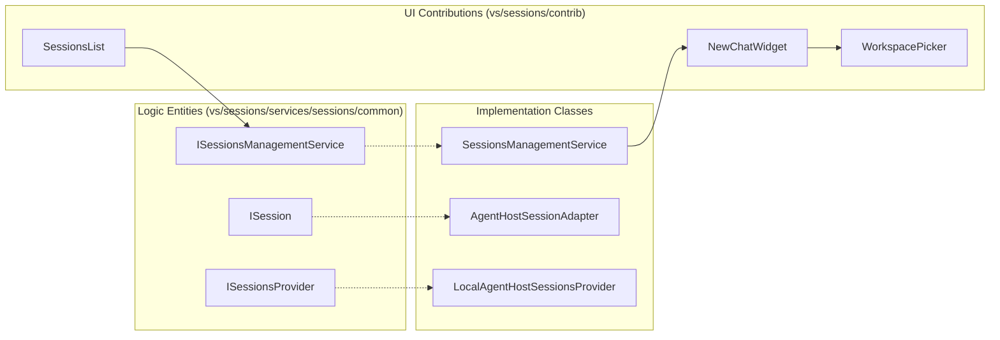

# Sessions Architecture and Provider Model

Relevant source files

The following files were used as context for generating this wiki page:

- [.github/skills/sessions/SKILL.md](.github/skills/sessions/SKILL.md)
- [src/vs/sessions/LAYOUT.md](src/vs/sessions/LAYOUT.md)
- [src/vs/sessions/LAYOUT_CONTROLLER.md](src/vs/sessions/LAYOUT_CONTROLLER.md)
- [src/vs/sessions/SESSIONS.md](src/vs/sessions/SESSIONS.md)
- [src/vs/sessions/SESSIONS_LIST.md](src/vs/sessions/SESSIONS_LIST.md)
- [src/vs/sessions/SINGLE_PANE_SCENARIOS.md](src/vs/sessions/SINGLE_PANE_SCENARIOS.md)
- [src/vs/sessions/browser/parts/editorPart.ts](src/vs/sessions/browser/parts/editorPart.ts)
- [src/vs/sessions/browser/parts/singlePaneEditorPart.ts](src/vs/sessions/browser/parts/singlePaneEditorPart.ts)
- [src/vs/sessions/browser/singlePaneWorkbench.ts](src/vs/sessions/browser/singlePaneWorkbench.ts)
- [src/vs/sessions/browser/workbench.ts](src/vs/sessions/browser/workbench.ts)
- [src/vs/sessions/common/contextkeys.ts](src/vs/sessions/common/contextkeys.ts)
- [src/vs/sessions/contrib/automations/browser/automationDialog.ts](src/vs/sessions/contrib/automations/browser/automationDialog.ts)
- [src/vs/sessions/contrib/automations/browser/automationDialogService.ts](src/vs/sessions/contrib/automations/browser/automationDialogService.ts)
- [src/vs/sessions/contrib/automations/test/browser/automationDialog.test.ts](src/vs/sessions/contrib/automations/test/browser/automationDialog.test.ts)
- [src/vs/sessions/contrib/chat/browser/media/newSessionPromptOptions.css](src/vs/sessions/contrib/chat/browser/media/newSessionPromptOptions.css)
- [src/vs/sessions/contrib/chat/browser/newChatInSessionWidget.ts](src/vs/sessions/contrib/chat/browser/newChatInSessionWidget.ts)
- [src/vs/sessions/contrib/chat/browser/newChatWidget.ts](src/vs/sessions/contrib/chat/browser/newChatWidget.ts)
- [src/vs/sessions/contrib/chat/browser/newSessionComposerService.ts](src/vs/sessions/contrib/chat/browser/newSessionComposerService.ts)
- [src/vs/sessions/contrib/chat/browser/newSessionPromptOptions.ts](src/vs/sessions/contrib/chat/browser/newSessionPromptOptions.ts)
- [src/vs/sessions/contrib/chat/browser/sessionWorkspaceFallback.ts](src/vs/sessions/contrib/chat/browser/sessionWorkspaceFallback.ts)
- [src/vs/sessions/contrib/chat/browser/sessionWorkspacePicker.ts](src/vs/sessions/contrib/chat/browser/sessionWorkspacePicker.ts)
- [src/vs/sessions/contrib/chat/browser/sessionsChatAccessibilityHelp.ts](src/vs/sessions/contrib/chat/browser/sessionsChatAccessibilityHelp.ts)
- [src/vs/sessions/contrib/chat/browser/webWorkspacePicker.ts](src/vs/sessions/contrib/chat/browser/webWorkspacePicker.ts)
- [src/vs/sessions/contrib/chat/electron-browser/chat.contribution.ts](src/vs/sessions/contrib/chat/electron-browser/chat.contribution.ts)
- [src/vs/sessions/contrib/chat/test/browser/newChatWidget.fixture.ts](src/vs/sessions/contrib/chat/test/browser/newChatWidget.fixture.ts)
- [src/vs/sessions/contrib/chat/test/browser/newChatWidget.test.ts](src/vs/sessions/contrib/chat/test/browser/newChatWidget.test.ts)
- [src/vs/sessions/contrib/chat/test/browser/newSessionPromptOptions.test.ts](src/vs/sessions/contrib/chat/test/browser/newSessionPromptOptions.test.ts)
- [src/vs/sessions/contrib/chat/test/browser/sessionWorkspacePicker.test.ts](src/vs/sessions/contrib/chat/test/browser/sessionWorkspacePicker.test.ts)
- [src/vs/sessions/contrib/configuration/browser/configuration.contribution.ts](src/vs/sessions/contrib/configuration/browser/configuration.contribution.ts)
- [src/vs/sessions/contrib/editor/browser/addTabActions.ts](src/vs/sessions/contrib/editor/browser/addTabActions.ts)
- [src/vs/sessions/contrib/editor/browser/editor.contribution.ts](src/vs/sessions/contrib/editor/browser/editor.contribution.ts)
- [src/vs/sessions/contrib/editor/browser/media/editorHeader.css](src/vs/sessions/contrib/editor/browser/media/editorHeader.css)
- [src/vs/sessions/contrib/editor/test/browser/editor.contribution.test.ts](src/vs/sessions/contrib/editor/test/browser/editor.contribution.test.ts)
- [src/vs/sessions/contrib/editor/test/browser/editorHeader.fixture.ts](src/vs/sessions/contrib/editor/test/browser/editorHeader.fixture.ts)
- [src/vs/sessions/contrib/layout/browser/baseSessionLayoutController.ts](src/vs/sessions/contrib/layout/browser/baseSessionLayoutController.ts)
- [src/vs/sessions/contrib/layout/browser/desktopSessionLayoutController.md](src/vs/sessions/contrib/layout/browser/desktopSessionLayoutController.md)
- [src/vs/sessions/contrib/layout/browser/desktopSessionLayoutController.ts](src/vs/sessions/contrib/layout/browser/desktopSessionLayoutController.ts)
- [src/vs/sessions/contrib/layout/browser/singlePane/singlePaneDetailPanelStrategy.ts](src/vs/sessions/contrib/layout/browser/singlePane/singlePaneDetailPanelStrategy.ts)
- [src/vs/sessions/contrib/layout/browser/singlePane/singlePaneDetailsStrategy.ts](src/vs/sessions/contrib/layout/browser/singlePane/singlePaneDetailsStrategy.ts)
- [src/vs/sessions/contrib/layout/browser/singlePane/singlePaneManagedTabsStrategy.ts](src/vs/sessions/contrib/layout/browser/singlePane/singlePaneManagedTabsStrategy.ts)
- [src/vs/sessions/contrib/layout/browser/singlePane/singlePaneSidePaneVisibilityStrategy.ts](src/vs/sessions/contrib/layout/browser/singlePane/singlePaneSidePaneVisibilityStrategy.ts)
- [src/vs/sessions/contrib/layout/browser/singlePaneLayoutController.ts](src/vs/sessions/contrib/layout/browser/singlePaneLayoutController.ts)
- [src/vs/sessions/contrib/layout/test/browser/desktopSessionLayoutController.test.ts](src/vs/sessions/contrib/layout/test/browser/desktopSessionLayoutController.test.ts)
- [src/vs/sessions/contrib/layout/test/browser/layoutControllerTestUtils.ts](src/vs/sessions/contrib/layout/test/browser/layoutControllerTestUtils.ts)
- [src/vs/sessions/contrib/onboardingTours/browser/newSessionViewV3Prompt.ts](src/vs/sessions/contrib/onboardingTours/browser/newSessionViewV3Prompt.ts)
- [src/vs/sessions/contrib/onboardingTours/test/browser/newSessionViewV3Prompt.test.ts](src/vs/sessions/contrib/onboardingTours/test/browser/newSessionViewV3Prompt.test.ts)
- [src/vs/sessions/contrib/providers/agentHost/AGENT_HOST_SESSIONS_PROVIDER.md](src/vs/sessions/contrib/providers/agentHost/AGENT_HOST_SESSIONS_PROVIDER.md)
- [src/vs/sessions/contrib/providers/agentHost/browser/baseAgentHostSessionsProvider.ts](src/vs/sessions/contrib/providers/agentHost/browser/baseAgentHostSessionsProvider.ts)
- [src/vs/sessions/contrib/providers/agentHost/browser/localAgentHostSessionsProvider.ts](src/vs/sessions/contrib/providers/agentHost/browser/localAgentHostSessionsProvider.ts)
- [src/vs/sessions/contrib/providers/agentHost/test/browser/localAgentHostSessionsProvider.test.ts](src/vs/sessions/contrib/providers/agentHost/test/browser/localAgentHostSessionsProvider.test.ts)
- [src/vs/sessions/contrib/providers/copilotChatSessions/browser/copilotChatSessionsProvider.ts](src/vs/sessions/contrib/providers/copilotChatSessions/browser/copilotChatSessionsProvider.ts)
- [src/vs/sessions/contrib/providers/copilotChatSessions/test/browser/copilotChatSessionsProvider.test.ts](src/vs/sessions/contrib/providers/copilotChatSessions/test/browser/copilotChatSessionsProvider.test.ts)
- [src/vs/sessions/contrib/providers/remoteAgentHost/browser/remoteAgentHostSessionsProvider.ts](src/vs/sessions/contrib/providers/remoteAgentHost/browser/remoteAgentHostSessionsProvider.ts)
- [src/vs/sessions/contrib/providers/remoteAgentHost/test/browser/remoteAgentHostSessionsProvider.test.ts](src/vs/sessions/contrib/providers/remoteAgentHost/test/browser/remoteAgentHostSessionsProvider.test.ts)
- [src/vs/sessions/contrib/sessions/browser/media/sessionsList.css](src/vs/sessions/contrib/sessions/browser/media/sessionsList.css)
- [src/vs/sessions/contrib/sessions/browser/sessions.contribution.ts](src/vs/sessions/contrib/sessions/browser/sessions.contribution.ts)
- [src/vs/sessions/contrib/sessions/browser/sessionsActions.ts](src/vs/sessions/contrib/sessions/browser/sessionsActions.ts)
- [src/vs/sessions/contrib/sessions/browser/sessionsWindowOpenTelemetry.ts](src/vs/sessions/contrib/sessions/browser/sessionsWindowOpenTelemetry.ts)
- [src/vs/sessions/contrib/sessions/browser/views/sessionsList.ts](src/vs/sessions/contrib/sessions/browser/views/sessionsList.ts)
- [src/vs/sessions/contrib/sessions/browser/views/sessionsViewActions.ts](src/vs/sessions/contrib/sessions/browser/views/sessionsViewActions.ts)
- [src/vs/sessions/contrib/sessions/test/browser/sessionsList.test.ts](src/vs/sessions/contrib/sessions/test/browser/sessionsList.test.ts)
- [src/vs/sessions/contrib/sessions/test/browser/sessionsWindowOpenTelemetry.test.ts](src/vs/sessions/contrib/sessions/test/browser/sessionsWindowOpenTelemetry.test.ts)
- [src/vs/sessions/services/sessions/browser/sessionNavigation.ts](src/vs/sessions/services/sessions/browser/sessionNavigation.ts)
- [src/vs/sessions/services/sessions/browser/sessionsManagementService.ts](src/vs/sessions/services/sessions/browser/sessionsManagementService.ts)
- [src/vs/sessions/services/sessions/browser/sessionsService.ts](src/vs/sessions/services/sessions/browser/sessionsService.ts)
- [src/vs/sessions/services/sessions/browser/visibleSessions.ts](src/vs/sessions/services/sessions/browser/visibleSessions.ts)
- [src/vs/sessions/services/sessions/common/session.ts](src/vs/sessions/services/sessions/common/session.ts)
- [src/vs/sessions/services/sessions/common/sessionContextKeys.ts](src/vs/sessions/services/sessions/common/sessionContextKeys.ts)
- [src/vs/sessions/services/sessions/common/sessionsManagement.ts](src/vs/sessions/services/sessions/common/sessionsManagement.ts)
- [src/vs/sessions/services/sessions/common/sessionsProvider.ts](src/vs/sessions/services/sessions/common/sessionsProvider.ts)
- [src/vs/sessions/services/sessions/test/browser/sessionNavigation.test.ts](src/vs/sessions/services/sessions/test/browser/sessionNavigation.test.ts)
- [src/vs/sessions/services/sessions/test/browser/sessionsManagementService.test.ts](src/vs/sessions/services/sessions/test/browser/sessionsManagementService.test.ts)
- [src/vs/sessions/services/sessions/test/browser/visibleSessions.test.ts](src/vs/sessions/services/sessions/test/browser/visibleSessions.test.ts)
- [src/vs/sessions/services/sessions/test/common/sessionContextKeys.test.ts](src/vs/sessions/services/sessions/test/common/sessionContextKeys.test.ts)
- [src/vs/sessions/test/browser/layoutActions.test.ts](src/vs/sessions/test/browser/layoutActions.test.ts)
- [src/vs/sessions/test/browser/workbench.test.ts](src/vs/sessions/test/browser/workbench.test.ts)
- [src/vs/workbench/browser/parts/dialogs/dialog.ts](src/vs/workbench/browser/parts/dialogs/dialog.ts)
- [src/vs/workbench/browser/parts/editor/editorHeaderControl.ts](src/vs/workbench/browser/parts/editor/editorHeaderControl.ts)

The Sessions architecture in VS Code provides a specialized workbench layer (located in `vs/sessions`) designed for agentic workflows. It introduces a unified model for managing AI-driven interactions, file changes, and background tasks across different AI backends. Unlike the standard workbench, the sessions layer focuses on a session-centric lifecycle where agents operate within specific workspaces or virtual environments.

## Core Interfaces and Session Model

The foundation of the sessions system is built upon a set of interfaces that define what a session is and how it behaves. The architecture provides a pluggable provider model where multiple backends register with a central registry [src/vs/sessions/SESSIONS.md:5-6]().

### ISession
The `ISession` interface is a universal session facade. It is a self-contained observable object representing a session; consumers never reach back to provider internals [src/vs/sessions/SESSIONS.md:41]().

Key properties of `ISession`:
*   **Unique ID**: A globally unique ID built via `toSessionId(providerId, resource)` [src/vs/sessions/SESSIONS.md:41]().
*   **Status**: An observable `SessionStatus` (Untitled, InProgress, NeedsInput, Completed, Error) [src/vs/sessions/services/sessions/common/session.ts:70-81]().
*   **Workspace**: An observable `ISessionWorkspace` containing folders and Git repository information the agent is acting upon [src/vs/sessions/services/sessions/common/session.ts:200]().
*   **Changesets**: A collection of `ISessionChangeset` objects representing snapshots or live views of file modifications [src/vs/sessions/services/sessions/common/session.ts:206]().
*   **Chats**: An observable array of `IChat` objects, supporting multi-chat agent sessions [src/vs/sessions/services/sessions/common/session.ts:211]().

### ISessionsProvider
Providers implement the contract for workspace discovery, session CRUD, and sending requests [src/vs/sessions/SESSIONS.md:42](). They are responsible for:
*   **Model Selection**: Enumerating and selecting language models via `getModelsSnapshot` and `setModel` [src/vs/sessions/services/sessions/common/sessionsProvider.ts:38-41]().
*   **Workspace Resolution**: Mapping URIs to `ISessionWorkspace` objects [src/vs/sessions/services/sessions/common/sessionsProvider.ts:27]().

### ISessionsManagementService
This is the **model** service for the orchestration layer. It aggregates sessions from all providers and routes user actions [src/vs/sessions/SESSIONS.md:18-21]().
*   **Draft Management**: Owns the pending new-session draft (`newSession` observable) [src/vs/sessions/services/sessions/browser/sessionsManagementService.ts:76-77]().
*   **Automation Sessions**: Manages a separate `automationSession` draft for the Automation dialog lifecycle [src/vs/sessions/services/sessions/browser/sessionsManagementService.ts:80-81]().
*   **Request Routing**: Deduplicates and mirrors chat requests to ensure telemetry and UI listeners observe all user requests [src/vs/sessions/services/sessions/browser/sessionsManagementService.ts:93-94]().
*   **CRUD Operations**: Handles archiving, deleting, and renaming sessions across providers [src/vs/sessions/services/sessions/browser/sessionsManagementService.ts:49-60]().

**Sources:** [src/vs/sessions/services/sessions/common/session.ts:16-217](), [src/vs/sessions/services/sessions/browser/sessionsManagementService.ts:35-111](), [src/vs/sessions/services/sessions/common/sessionsProvider.ts:25-50](), [src/vs/sessions/SESSIONS.md:5-45]().

---

## Registry and Provider Model

The `SessionsProvidersService` acts as a pure registry. Providers register here, and the service fires `onDidChangeProviders` and provides lookup by ID [src/vs/sessions/SESSIONS.md:51-52]().

### SessionsProvidersService
This service tracks all active session providers in the browser [src/vs/sessions/services/sessions/browser/sessionsProvidersService.ts:21](). It does **not** aggregate sessions or route actions; that is delegated to the management service [src/vs/sessions/SESSIONS.md:51-53]().

### Key Session Providers
1.  **CopilotChat Provider**: Manages standard chat-based sessions [src/vs/sessions/contrib/providers/copilotChatSessions/browser/copilotChatSessionsProvider.ts:38]().
2.  **AgentHost Provider**: Handles sessions where an agent has deep access to the local or remote file system. It uses `AgentHostSessionAdapter` to bridge the protocol-level `AgentSession` to the workbench `ISession` [src/vs/sessions/contrib/providers/agentHost/browser/baseAgentHostSessionsProvider.ts:47]().
3.  **Local vs Remote**: Concrete implementations like `LocalAgentHostSessionsProvider` [src/vs/sessions/contrib/providers/agentHost/browser/localAgentHostSessionsProvider.ts:46]() and `RemoteAgentHostSessionsProvider` [src/vs/sessions/contrib/providers/remoteAgentHost/browser/remoteAgentHostSessionsProvider.ts:35]() handle specific execution environments.

### Session ID Scheme
Session IDs are constructed using the `toSessionId(providerId, resource)` utility [src/vs/sessions/services/sessions/common/session.ts:232](). This ensures that sessions with the same resource but different providers (e.g., local vs remote) are treated as distinct entities.

**Sources:** [src/vs/sessions/services/sessions/browser/sessionsProvidersService.ts:21-50](), [src/vs/sessions/services/sessions/common/session.ts:232-234](), [src/vs/sessions/SESSIONS.md:51-52](), [src/vs/sessions/contrib/providers/agentHost/browser/baseAgentHostSessionsProvider.ts:47-57]().

---

## Data Flow: Session Changes and UI Binding

The sessions layer uses an observable-driven pattern to keep the UI in sync with asynchronous agent activities.

### Changes Architecture
When an agent modifies files, the flow is as follows:
1.  **Provider Updates**: The provider updates the `ISession.changes` observable. In Agent Host sessions, this is driven by the `Changeset` state from the agent connection [src/vs/sessions/contrib/providers/agentHost/browser/baseAgentHostSessionsProvider.ts:57]().
2.  **Management Service Events**: `SessionsManagementService` emits `onDidChangeSessions` when session metadata or state changes [src/vs/sessions/services/sessions/browser/sessionsManagementService.ts:39-40]().

### Model vs View Separation
A critical distinction exists between the model (Management Service) and the view (Sessions Service):
*   **ISessionsManagementService**: Owns providers, recently-opened history, session types, and request routing [src/vs/sessions/SESSIONS.md:61-63]().
*   **ISessionsService**: Owns the canonical `activeSession` (which is the active visible slot wrapper), visible session slots/arrangement (`VisibleSessions`), and focus mechanics [src/vs/sessions/SESSIONS.md:55-56](), [src/vs/sessions/SESSIONS.md:64-67]().

### Diagram: Session Data Flow and UI Binding
Title: "Session Data Flow and UI Binding"

**Sources:** [src/vs/sessions/services/sessions/browser/sessionsManagementService.ts:35-71](), [src/vs/sessions/contrib/providers/agentHost/browser/baseAgentHostSessionsProvider.ts:47-57](), [src/vs/sessions/SESSIONS.md:54-63]().

---

## Layering and Architectural Rules

The `vs/sessions` layer follows strict rules defined in `LAYERS.md` [src/vs/sessions/SESSIONS.md:9]():

1.  **Strict Layering**: The system is organized into three layers: Core (`services/sessions/`), Services (`services/sessions/browser/`), and UI Components (`contrib/`) [src/vs/sessions/SESSIONS.md:9-35]().
2.  **Model/View Isolation**: `SessionsManagementService` (model) performs **no** view or layout mutation and never imports the view or part service [src/vs/sessions/SESSIONS.md:43]().
3.  **Dependency Rules**: `contrib/*` must NOT import from `contrib/providers/*` [src/vs/sessions/SESSIONS.md:9](). Non-provider code must extract shared interfaces to `services/` or `common/` to avoid circular dependencies [src/vs/sessions/SESSIONS.md:5-6]().

### Diagram: Session Code Entity Mapping
Title: "Session Code Entity Mapping"

**Sources:** [src/vs/sessions/SESSIONS.md:9-54](), [src/vs/sessions/services/sessions/browser/sessionsManagementService.ts:31](), [src/vs/sessions/contrib/chat/browser/newChatWidget.ts:58](), [src/vs/sessions/contrib/chat/browser/sessionWorkspacePicker.ts:106](), [src/vs/sessions/contrib/sessions/browser/views/sessionsList.ts:56-58]().

---

## Session Navigation and Pickers

The sessions workbench provides specialized navigation and creation components:

*   **Workspace Selection**: The `WorkspacePicker` provides a unified dropdown for local and remote workspaces [src/vs/sessions/contrib/chat/browser/sessionWorkspacePicker.ts:106](). It supports late-arriving provider registrations to upgrade auto-restored selections [src/vs/sessions/contrib/chat/browser/sessionWorkspacePicker.ts:118-124]().
*   **Session Navigation**: The `SessionsNavigation` (Back/Forward) system manages history within the sessions workbench, routing browser-level navigation keys [src/vs/sessions/SESSIONS.md:57-58]().
*   **Sessions Picker**: A Quick Pick UI for switching between recently opened and other sessions, triggered via `sessions.showSessionsPicker` [src/vs/sessions/contrib/sessions/browser/sessionsActions.ts:60-75]().
*   **Sessions List**: A tree-based view (`WorkbenchObjectTree`) in the sidebar for browsing and managing sessions [src/vs/sessions/contrib/sessions/browser/views/sessionsList.ts:38](). It supports grouping by workspace or date and reflects status like `needs-input` via CSS animations [src/vs/sessions/contrib/sessions/browser/media/sessionsList.css:18-20]().

**Sources:** [src/vs/sessions/contrib/chat/browser/sessionWorkspacePicker.ts:106-134](), [src/vs/sessions/contrib/sessions/browser/sessionsActions.ts:60-109](), [src/vs/sessions/SESSIONS.md:57-58](), [src/vs/sessions/contrib/sessions/browser/views/sessionsList.ts:38-60]().