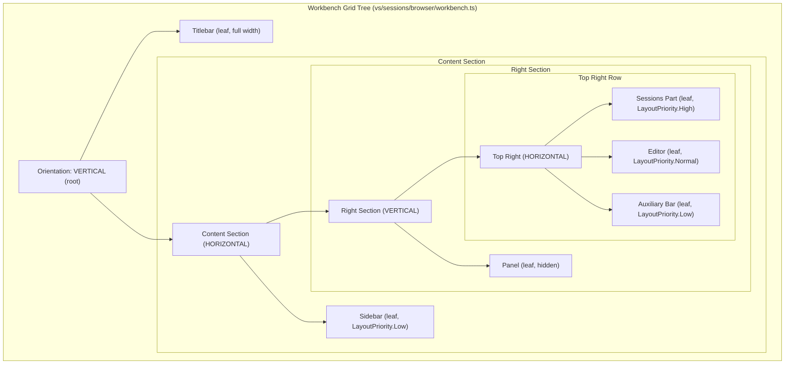
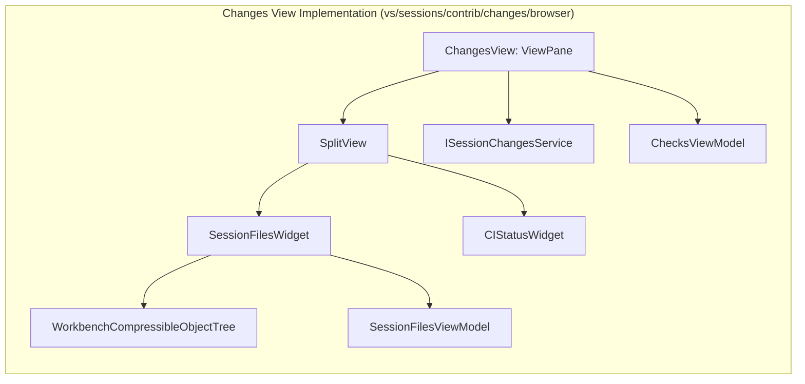

# Agents Window UI and Layout

Relevant source files

The following files were used as context for generating this wiki page:

- [.github/instructions/best-practices.instructions.md](https://github.com/microsoft/vscode/blob/HEAD/.github/instructions/best-practices.instructions.md)
- [.github/instructions/css-best-practices.instructions.md](https://github.com/microsoft/vscode/blob/HEAD/.github/instructions/css-best-practices.instructions.md)
- [.github/skills/sessions/SKILL.md](https://github.com/microsoft/vscode/blob/HEAD/.github/skills/sessions/SKILL.md)
- [src/vs/editor/browser/widget/multiDiffEditor/workbenchUIElementFactory.ts](https://github.com/microsoft/vscode/blob/HEAD/src/vs/editor/browser/widget/multiDiffEditor/workbenchUIElementFactory.ts)
- [src/vs/sessions/AI_CUSTOMIZATIONS.md](https://github.com/microsoft/vscode/blob/HEAD/src/vs/sessions/AI_CUSTOMIZATIONS.md)
- [src/vs/sessions/LAYOUT.md](https://github.com/microsoft/vscode/blob/HEAD/src/vs/sessions/LAYOUT.md)
- [src/vs/sessions/LAYOUT_CONTROLLER.md](https://github.com/microsoft/vscode/blob/HEAD/src/vs/sessions/LAYOUT_CONTROLLER.md)
- [src/vs/sessions/SINGLE_PANE_SCENARIOS.md](https://github.com/microsoft/vscode/blob/HEAD/src/vs/sessions/SINGLE_PANE_SCENARIOS.md)
- [src/vs/sessions/browser/media/workbench.css](https://github.com/microsoft/vscode/blob/HEAD/src/vs/sessions/browser/media/workbench.css)
- [src/vs/sessions/browser/parts/editorPart.ts](https://github.com/microsoft/vscode/blob/HEAD/src/vs/sessions/browser/parts/editorPart.ts)
- [src/vs/sessions/browser/parts/media/editorPart.css](https://github.com/microsoft/vscode/blob/HEAD/src/vs/sessions/browser/parts/media/editorPart.css)
- [src/vs/sessions/browser/parts/singlePaneEditorPart.ts](https://github.com/microsoft/vscode/blob/HEAD/src/vs/sessions/browser/parts/singlePaneEditorPart.ts)
- [src/vs/sessions/browser/singlePaneWorkbench.ts](https://github.com/microsoft/vscode/blob/HEAD/src/vs/sessions/browser/singlePaneWorkbench.ts)
- [src/vs/sessions/browser/workbench.ts](https://github.com/microsoft/vscode/blob/HEAD/src/vs/sessions/browser/workbench.ts)
- [src/vs/sessions/contrib/aiCustomizationTreeView/browser/aiCustomizationOverviewView.ts](https://github.com/microsoft/vscode/blob/HEAD/src/vs/sessions/contrib/aiCustomizationTreeView/browser/aiCustomizationOverviewView.ts)
- [src/vs/sessions/contrib/aiCustomizationTreeView/browser/aiCustomizationTreeViewViews.ts](https://github.com/microsoft/vscode/blob/HEAD/src/vs/sessions/contrib/aiCustomizationTreeView/browser/aiCustomizationTreeViewViews.ts)
- [src/vs/sessions/contrib/changes/browser/changes.contribution.ts](https://github.com/microsoft/vscode/blob/HEAD/src/vs/sessions/contrib/changes/browser/changes.contribution.ts)
- [src/vs/sessions/contrib/changes/browser/changesActions.ts](https://github.com/microsoft/vscode/blob/HEAD/src/vs/sessions/contrib/changes/browser/changesActions.ts)
- [src/vs/sessions/contrib/changes/browser/changesEditorLabels.ts](https://github.com/microsoft/vscode/blob/HEAD/src/vs/sessions/contrib/changes/browser/changesEditorLabels.ts)
- [src/vs/sessions/contrib/changes/browser/changesMultiDiffSourceResolver.ts](https://github.com/microsoft/vscode/blob/HEAD/src/vs/sessions/contrib/changes/browser/changesMultiDiffSourceResolver.ts)
- [src/vs/sessions/contrib/changes/browser/changesView.ts](https://github.com/microsoft/vscode/blob/HEAD/src/vs/sessions/contrib/changes/browser/changesView.ts)
- [src/vs/sessions/contrib/changes/browser/changesViewActions.ts](https://github.com/microsoft/vscode/blob/HEAD/src/vs/sessions/contrib/changes/browser/changesViewActions.ts)
- [src/vs/sessions/contrib/changes/browser/changesViewRenderer.ts](https://github.com/microsoft/vscode/blob/HEAD/src/vs/sessions/contrib/changes/browser/changesViewRenderer.ts)
- [src/vs/sessions/contrib/changes/browser/changesViewService.ts](https://github.com/microsoft/vscode/blob/HEAD/src/vs/sessions/contrib/changes/browser/changesViewService.ts)
- [src/vs/sessions/contrib/changes/browser/changesetReviewActions.ts](https://github.com/microsoft/vscode/blob/HEAD/src/vs/sessions/contrib/changes/browser/changesetReviewActions.ts)
- [src/vs/sessions/contrib/changes/browser/media/changesView.css](https://github.com/microsoft/vscode/blob/HEAD/src/vs/sessions/contrib/changes/browser/media/changesView.css)
- [src/vs/sessions/contrib/changes/browser/media/multiFileDiffEditor.css](https://github.com/microsoft/vscode/blob/HEAD/src/vs/sessions/contrib/changes/browser/media/multiFileDiffEditor.css)
- [src/vs/sessions/contrib/changes/browser/media/sessionChangesEditor.css](https://github.com/microsoft/vscode/blob/HEAD/src/vs/sessions/contrib/changes/browser/media/sessionChangesEditor.css)
- [src/vs/sessions/contrib/changes/browser/media/sessionFilesWidget.css](https://github.com/microsoft/vscode/blob/HEAD/src/vs/sessions/contrib/changes/browser/media/sessionFilesWidget.css)
- [src/vs/sessions/contrib/changes/browser/sessionChangesEditor.ts](https://github.com/microsoft/vscode/blob/HEAD/src/vs/sessions/contrib/changes/browser/sessionChangesEditor.ts)
- [src/vs/sessions/contrib/changes/browser/sessionFilesViewModel.ts](https://github.com/microsoft/vscode/blob/HEAD/src/vs/sessions/contrib/changes/browser/sessionFilesViewModel.ts)
- [src/vs/sessions/contrib/changes/browser/sessionFilesWidget.ts](https://github.com/microsoft/vscode/blob/HEAD/src/vs/sessions/contrib/changes/browser/sessionFilesWidget.ts)
- [src/vs/sessions/contrib/changes/browser/sessionsChangesAccessibilityHelp.ts](https://github.com/microsoft/vscode/blob/HEAD/src/vs/sessions/contrib/changes/browser/sessionsChangesAccessibilityHelp.ts)
- [src/vs/sessions/contrib/changes/common/changes.ts](https://github.com/microsoft/vscode/blob/HEAD/src/vs/sessions/contrib/changes/common/changes.ts)
- [src/vs/sessions/contrib/changes/common/changesViewService.ts](https://github.com/microsoft/vscode/blob/HEAD/src/vs/sessions/contrib/changes/common/changesViewService.ts)
- [src/vs/sessions/contrib/changes/test/browser/changesEditorLabels.test.ts](https://github.com/microsoft/vscode/blob/HEAD/src/vs/sessions/contrib/changes/test/browser/changesEditorLabels.test.ts)
- [src/vs/sessions/contrib/changes/test/browser/changesViewActions.test.ts](https://github.com/microsoft/vscode/blob/HEAD/src/vs/sessions/contrib/changes/test/browser/changesViewActions.test.ts)
- [src/vs/sessions/contrib/changes/test/browser/changesViewService.test.ts](https://github.com/microsoft/vscode/blob/HEAD/src/vs/sessions/contrib/changes/test/browser/changesViewService.test.ts)
- [src/vs/sessions/contrib/changes/test/browser/changesetReviewActions.test.ts](https://github.com/microsoft/vscode/blob/HEAD/src/vs/sessions/contrib/changes/test/browser/changesetReviewActions.test.ts)
- [src/vs/sessions/contrib/changes/test/browser/sessionFilesWidget.fixture.ts](https://github.com/microsoft/vscode/blob/HEAD/src/vs/sessions/contrib/changes/test/browser/sessionFilesWidget.fixture.ts)
- [src/vs/sessions/contrib/chat/browser/aiCustomizationWorkspaceService.ts](https://github.com/microsoft/vscode/blob/HEAD/src/vs/sessions/contrib/chat/browser/aiCustomizationWorkspaceService.ts)
- [src/vs/sessions/contrib/chat/browser/customizationHarnessService.ts](https://github.com/microsoft/vscode/blob/HEAD/src/vs/sessions/contrib/chat/browser/customizationHarnessService.ts)
- [src/vs/sessions/contrib/chat/browser/media/newSessionPromptOptions.css](https://github.com/microsoft/vscode/blob/HEAD/src/vs/sessions/contrib/chat/browser/media/newSessionPromptOptions.css)
- [src/vs/sessions/contrib/chat/browser/newSessionComposerService.ts](https://github.com/microsoft/vscode/blob/HEAD/src/vs/sessions/contrib/chat/browser/newSessionComposerService.ts)
- [src/vs/sessions/contrib/chat/browser/newSessionPromptOptions.ts](https://github.com/microsoft/vscode/blob/HEAD/src/vs/sessions/contrib/chat/browser/newSessionPromptOptions.ts)
- [src/vs/sessions/contrib/chat/browser/promptsService.ts](https://github.com/microsoft/vscode/blob/HEAD/src/vs/sessions/contrib/chat/browser/promptsService.ts)
- [src/vs/sessions/contrib/chat/test/browser/newChatWidget.fixture.ts](https://github.com/microsoft/vscode/blob/HEAD/src/vs/sessions/contrib/chat/test/browser/newChatWidget.fixture.ts)
- [src/vs/sessions/contrib/chat/test/browser/newSessionPromptOptions.test.ts](https://github.com/microsoft/vscode/blob/HEAD/src/vs/sessions/contrib/chat/test/browser/newSessionPromptOptions.test.ts)
- [src/vs/sessions/contrib/configuration/browser/configuration.contribution.ts](https://github.com/microsoft/vscode/blob/HEAD/src/vs/sessions/contrib/configuration/browser/configuration.contribution.ts)
- [src/vs/sessions/contrib/editor/browser/addTabActions.ts](https://github.com/microsoft/vscode/blob/HEAD/src/vs/sessions/contrib/editor/browser/addTabActions.ts)
- [src/vs/sessions/contrib/editor/browser/editor.contribution.ts](https://github.com/microsoft/vscode/blob/HEAD/src/vs/sessions/contrib/editor/browser/editor.contribution.ts)
- [src/vs/sessions/contrib/editor/browser/media/editorBreadcrumbs.css](https://github.com/microsoft/vscode/blob/HEAD/src/vs/sessions/contrib/editor/browser/media/editorBreadcrumbs.css)
- [src/vs/sessions/contrib/editor/browser/media/editorHeader.css](https://github.com/microsoft/vscode/blob/HEAD/src/vs/sessions/contrib/editor/browser/media/editorHeader.css)
- [src/vs/sessions/contrib/editor/test/browser/editor.contribution.test.ts](https://github.com/microsoft/vscode/blob/HEAD/src/vs/sessions/contrib/editor/test/browser/editor.contribution.test.ts)
- [src/vs/sessions/contrib/editor/test/browser/editorHeader.fixture.ts](https://github.com/microsoft/vscode/blob/HEAD/src/vs/sessions/contrib/editor/test/browser/editorHeader.fixture.ts)
- [src/vs/sessions/contrib/files/browser/files.contribution.ts](https://github.com/microsoft/vscode/blob/HEAD/src/vs/sessions/contrib/files/browser/files.contribution.ts)
- [src/vs/sessions/contrib/files/browser/filesView.ts](https://github.com/microsoft/vscode/blob/HEAD/src/vs/sessions/contrib/files/browser/filesView.ts)
- [src/vs/sessions/contrib/files/browser/media/filesView.css](https://github.com/microsoft/vscode/blob/HEAD/src/vs/sessions/contrib/files/browser/media/filesView.css)
- [src/vs/sessions/contrib/files/browser/syncChangesActionViewItem.ts](https://github.com/microsoft/vscode/blob/HEAD/src/vs/sessions/contrib/files/browser/syncChangesActionViewItem.ts)
- [src/vs/sessions/contrib/layout/browser/baseSessionLayoutController.ts](https://github.com/microsoft/vscode/blob/HEAD/src/vs/sessions/contrib/layout/browser/baseSessionLayoutController.ts)
- [src/vs/sessions/contrib/layout/browser/desktopSessionLayoutController.md](https://github.com/microsoft/vscode/blob/HEAD/src/vs/sessions/contrib/layout/browser/desktopSessionLayoutController.md)
- [src/vs/sessions/contrib/layout/browser/desktopSessionLayoutController.ts](https://github.com/microsoft/vscode/blob/HEAD/src/vs/sessions/contrib/layout/browser/desktopSessionLayoutController.ts)
- [src/vs/sessions/contrib/layout/browser/singlePane/singlePaneDetailPanelStrategy.ts](https://github.com/microsoft/vscode/blob/HEAD/src/vs/sessions/contrib/layout/browser/singlePane/singlePaneDetailPanelStrategy.ts)
- [src/vs/sessions/contrib/layout/browser/singlePane/singlePaneDetailsStrategy.ts](https://github.com/microsoft/vscode/blob/HEAD/src/vs/sessions/contrib/layout/browser/singlePane/singlePaneDetailsStrategy.ts)
- [src/vs/sessions/contrib/layout/browser/singlePane/singlePaneManagedTabsStrategy.ts](https://github.com/microsoft/vscode/blob/HEAD/src/vs/sessions/contrib/layout/browser/singlePane/singlePaneManagedTabsStrategy.ts)
- [src/vs/sessions/contrib/layout/browser/singlePane/singlePaneSidePaneVisibilityStrategy.ts](https://github.com/microsoft/vscode/blob/HEAD/src/vs/sessions/contrib/layout/browser/singlePane/singlePaneSidePaneVisibilityStrategy.ts)
- [src/vs/sessions/contrib/layout/browser/singlePaneLayoutController.ts](https://github.com/microsoft/vscode/blob/HEAD/src/vs/sessions/contrib/layout/browser/singlePaneLayoutController.ts)
- [src/vs/sessions/contrib/layout/test/browser/desktopSessionLayoutController.test.ts](https://github.com/microsoft/vscode/blob/HEAD/src/vs/sessions/contrib/layout/test/browser/desktopSessionLayoutController.test.ts)
- [src/vs/sessions/contrib/layout/test/browser/layoutControllerTestUtils.ts](https://github.com/microsoft/vscode/blob/HEAD/src/vs/sessions/contrib/layout/test/browser/layoutControllerTestUtils.ts)
- [src/vs/sessions/contrib/onboardingTours/browser/newSessionViewV3Prompt.ts](https://github.com/microsoft/vscode/blob/HEAD/src/vs/sessions/contrib/onboardingTours/browser/newSessionViewV3Prompt.ts)
- [src/vs/sessions/contrib/onboardingTours/test/browser/newSessionViewV3Prompt.test.ts](https://github.com/microsoft/vscode/blob/HEAD/src/vs/sessions/contrib/onboardingTours/test/browser/newSessionViewV3Prompt.test.ts)
- [src/vs/sessions/contrib/providers/agentHost/browser/agentHostSessionChangesets.ts](https://github.com/microsoft/vscode/blob/HEAD/src/vs/sessions/contrib/providers/agentHost/browser/agentHostSessionChangesets.ts)
- [src/vs/sessions/contrib/providers/copilotChatSessions/browser/copilotChatSessionsChangesets.ts](https://github.com/microsoft/vscode/blob/HEAD/src/vs/sessions/contrib/providers/copilotChatSessions/browser/copilotChatSessionsChangesets.ts)
- [src/vs/sessions/contrib/search/browser/search.contribution.ts](https://github.com/microsoft/vscode/blob/HEAD/src/vs/sessions/contrib/search/browser/search.contribution.ts)
- [src/vs/sessions/test/browser/layoutActions.test.ts](https://github.com/microsoft/vscode/blob/HEAD/src/vs/sessions/test/browser/layoutActions.test.ts)
- [src/vs/sessions/test/browser/workbench.test.ts](https://github.com/microsoft/vscode/blob/HEAD/src/vs/sessions/test/browser/workbench.test.ts)
- [src/vs/workbench/browser/parts/editor/editorHeaderControl.ts](https://github.com/microsoft/vscode/blob/HEAD/src/vs/workbench/browser/parts/editor/editorHeaderControl.ts)
- [src/vs/workbench/contrib/chat/browser/aiCustomization/aiCustomizationDebugPanel.ts](https://github.com/microsoft/vscode/blob/HEAD/src/vs/workbench/contrib/chat/browser/aiCustomization/aiCustomizationDebugPanel.ts)
- [src/vs/workbench/contrib/chat/browser/aiCustomization/aiCustomizationIcons.ts](https://github.com/microsoft/vscode/blob/HEAD/src/vs/workbench/contrib/chat/browser/aiCustomization/aiCustomizationIcons.ts)
- [src/vs/workbench/contrib/chat/browser/aiCustomization/aiCustomizationItemSource.ts](https://github.com/microsoft/vscode/blob/HEAD/src/vs/workbench/contrib/chat/browser/aiCustomization/aiCustomizationItemSource.ts)
- [src/vs/workbench/contrib/chat/browser/aiCustomization/aiCustomizationItemsModel.ts](https://github.com/microsoft/vscode/blob/HEAD/src/vs/workbench/contrib/chat/browser/aiCustomization/aiCustomizationItemsModel.ts)
- [src/vs/workbench/contrib/chat/browser/aiCustomization/aiCustomizationListWidget.ts](https://github.com/microsoft/vscode/blob/HEAD/src/vs/workbench/contrib/chat/browser/aiCustomization/aiCustomizationListWidget.ts)
- [src/vs/workbench/contrib/chat/browser/aiCustomization/aiCustomizationListWidgetUtils.ts](https://github.com/microsoft/vscode/blob/HEAD/src/vs/workbench/contrib/chat/browser/aiCustomization/aiCustomizationListWidgetUtils.ts)
- [src/vs/workbench/contrib/chat/browser/aiCustomization/aiCustomizationManagement.contribution.ts](https://github.com/microsoft/vscode/blob/HEAD/src/vs/workbench/contrib/chat/browser/aiCustomization/aiCustomizationManagement.contribution.ts)
- [src/vs/workbench/contrib/chat/browser/aiCustomization/aiCustomizationManagement.ts](https://github.com/microsoft/vscode/blob/HEAD/src/vs/workbench/contrib/chat/browser/aiCustomization/aiCustomizationManagement.ts)
- [src/vs/workbench/contrib/chat/browser/aiCustomization/aiCustomizationManagementEditor.ts](https://github.com/microsoft/vscode/blob/HEAD/src/vs/workbench/contrib/chat/browser/aiCustomization/aiCustomizationManagementEditor.ts)
- [src/vs/workbench/contrib/chat/browser/aiCustomization/aiCustomizationWelcomePage.ts](https://github.com/microsoft/vscode/blob/HEAD/src/vs/workbench/contrib/chat/browser/aiCustomization/aiCustomizationWelcomePage.ts)
- [src/vs/workbench/contrib/chat/browser/aiCustomization/aiCustomizationWelcomePagePromptLaunchers.ts](https://github.com/microsoft/vscode/blob/HEAD/src/vs/workbench/contrib/chat/browser/aiCustomization/aiCustomizationWelcomePagePromptLaunchers.ts)
- [src/vs/workbench/contrib/chat/browser/aiCustomization/aiCustomizationWorkspaceService.ts](https://github.com/microsoft/vscode/blob/HEAD/src/vs/workbench/contrib/chat/browser/aiCustomization/aiCustomizationWorkspaceService.ts)
- [src/vs/workbench/contrib/chat/browser/aiCustomization/customizationCreatorService.ts](https://github.com/microsoft/vscode/blob/HEAD/src/vs/workbench/contrib/chat/browser/aiCustomization/customizationCreatorService.ts)
- [src/vs/workbench/contrib/chat/browser/aiCustomization/customizationHarnessService.ts](https://github.com/microsoft/vscode/blob/HEAD/src/vs/workbench/contrib/chat/browser/aiCustomization/customizationHarnessService.ts)
- [src/vs/workbench/contrib/chat/browser/aiCustomization/mcpListWidget.ts](https://github.com/microsoft/vscode/blob/HEAD/src/vs/workbench/contrib/chat/browser/aiCustomization/mcpListWidget.ts)
- [src/vs/workbench/contrib/chat/browser/aiCustomization/media/aiCustomizationManagement.css](https://github.com/microsoft/vscode/blob/HEAD/src/vs/workbench/contrib/chat/browser/aiCustomization/media/aiCustomizationManagement.css)
- [src/vs/workbench/contrib/chat/browser/aiCustomization/media/aiCustomizationWelcomePromptLaunchers.css](https://github.com/microsoft/vscode/blob/HEAD/src/vs/workbench/contrib/chat/browser/aiCustomization/media/aiCustomizationWelcomePromptLaunchers.css)
- [src/vs/workbench/contrib/chat/browser/aiCustomization/pluginListWidget.ts](https://github.com/microsoft/vscode/blob/HEAD/src/vs/workbench/contrib/chat/browser/aiCustomization/pluginListWidget.ts)
- [src/vs/workbench/contrib/chat/browser/aiCustomization/promptsServiceCustomizationItemProvider.ts](https://github.com/microsoft/vscode/blob/HEAD/src/vs/workbench/contrib/chat/browser/aiCustomization/promptsServiceCustomizationItemProvider.ts)
- [src/vs/workbench/contrib/chat/common/aiCustomizationWorkspaceService.ts](https://github.com/microsoft/vscode/blob/HEAD/src/vs/workbench/contrib/chat/common/aiCustomizationWorkspaceService.ts)
- [src/vs/workbench/contrib/chat/common/customizationHarnessService.ts](https://github.com/microsoft/vscode/blob/HEAD/src/vs/workbench/contrib/chat/common/customizationHarnessService.ts)
- [src/vs/workbench/contrib/chat/test/browser/aiCustomization/aiCustomizationItemsModel.test.ts](https://github.com/microsoft/vscode/blob/HEAD/src/vs/workbench/contrib/chat/test/browser/aiCustomization/aiCustomizationItemsModel.test.ts)
- [src/vs/workbench/contrib/chat/test/browser/aiCustomization/aiCustomizationListWidget.test.ts](https://github.com/microsoft/vscode/blob/HEAD/src/vs/workbench/contrib/chat/test/browser/aiCustomization/aiCustomizationListWidget.test.ts)
- [src/vs/workbench/contrib/chat/test/browser/aiCustomization/aiCustomizationManagementEditor.test.ts](https://github.com/microsoft/vscode/blob/HEAD/src/vs/workbench/contrib/chat/test/browser/aiCustomization/aiCustomizationManagementEditor.test.ts)
- [src/vs/workbench/contrib/chat/test/common/customizationHarnessService.test.ts](https://github.com/microsoft/vscode/blob/HEAD/src/vs/workbench/contrib/chat/test/common/customizationHarnessService.test.ts)
- [src/vs/workbench/test/browser/componentFixtures/editor/editorTabBar.fixture.ts](https://github.com/microsoft/vscode/blob/HEAD/src/vs/workbench/test/browser/componentFixtures/editor/editorTabBar.fixture.ts)
- [src/vs/workbench/test/browser/componentFixtures/fixtures.css](https://github.com/microsoft/vscode/blob/HEAD/src/vs/workbench/test/browser/componentFixtures/fixtures.css)
- [src/vs/workbench/test/browser/componentFixtures/sessions/aiCustomizationListWidget.fixture.ts](https://github.com/microsoft/vscode/blob/HEAD/src/vs/workbench/test/browser/componentFixtures/sessions/aiCustomizationListWidget.fixture.ts)
- [src/vs/workbench/test/browser/componentFixtures/sessions/aiCustomizationManagementEditor.fixture.ts](https://github.com/microsoft/vscode/blob/HEAD/src/vs/workbench/test/browser/componentFixtures/sessions/aiCustomizationManagementEditor.fixture.ts)
- [src/vs/workbench/test/browser/componentFixtures/sessions/aiCustomizationWelcomePages.fixture.ts](https://github.com/microsoft/vscode/blob/HEAD/src/vs/workbench/test/browser/componentFixtures/sessions/aiCustomizationWelcomePages.fixture.ts)
- [src/vs/workbench/test/browser/componentFixtures/sessions/changesView.fixture.ts](https://github.com/microsoft/vscode/blob/HEAD/src/vs/workbench/test/browser/componentFixtures/sessions/changesView.fixture.ts)
- [test/componentFixtures/blocks-ci-screenshots.md](https://github.com/microsoft/vscode/blob/HEAD/test/componentFixtures/blocks-ci-screenshots.md)

The Agents Window workbench (defined in `vs/sessions`) provides a specialized, fixed-layout environment optimized for AI-driven agent workflows. Unlike the standard VS Code workbench, it emphasizes session management, terminal-heavy interactions, and modal editor experiences while intentionally omitting several standard components like the activity bar, status bar, and banner [src/vs/sessions/browser/workbench.ts:18-18](https://github.com/microsoft/vscode/blob/HEAD/src/vs/sessions/browser/workbench.ts#L18), [src/vs/sessions/LAYOUT.md:9-13](https://github.com/microsoft/vscode/blob/HEAD/src/vs/sessions/LAYOUT.md#L9-L13).

## Workbench Architecture

The Agents Window is implemented by the `Workbench` class in `src/vs/sessions/browser/workbench.ts`. It utilizes a custom `SessionsLayoutPolicy` to enforce a rigid UI structure that does not support settings-based customization [src/vs/sessions/browser/workbench.ts:76-76](https://github.com/microsoft/vscode/blob/HEAD/src/vs/sessions/browser/workbench.ts#L76), [src/vs/sessions/LAYOUT.md:11-11](https://github.com/microsoft/vscode/blob/HEAD/src/vs/sessions/LAYOUT.md#L11).

### Fixed-Layout Parts
The workbench is composed of several key "Parts," which occupy fixed positions in the grid. Unlike the standard workbench, these parts often feature card-like styling with margins and border-radii applied directly to the `.part` elements [src/vs/sessions/browser/media/style.css:11-21](https://github.com/microsoft/vscode/blob/HEAD/src/vs/sessions/browser/media/style.css#L11-L21), [src/vs/sessions/browser/workbench.ts:77-77](https://github.com/microsoft/vscode/blob/HEAD/src/vs/sessions/browser/workbench.ts#L77).

| Part | Class / Implementation | Role |
| :--- | :--- | :--- |
| **Titlebar** | `TitleService` [src/vs/sessions/browser/workbench.ts:67-67](https://github.com/microsoft/vscode/blob/HEAD/src/vs/sessions/browser/workbench.ts#L67) | Contains the session picker, account widget, and global actions [src/vs/sessions/LAYOUT.md:37-37](https://github.com/microsoft/vscode/blob/HEAD/src/vs/sessions/LAYOUT.md#L37). |
| **Sidebar** | `SidebarPart` [src/vs/sessions/browser/parts/sidebarPart.ts:1-1](https://github.com/microsoft/vscode/blob/HEAD/src/vs/sessions/browser/parts/sidebarPart.ts#L1) | Hosts the **Sessions List** and navigation controls [src/vs/sessions/LAYOUT.md:38-38](https://github.com/microsoft/vscode/blob/HEAD/src/vs/sessions/LAYOUT.md#L38). |
| **Sessions Part** | `SessionsPart` [src/vs/sessions/browser/workbench.ts:82-82](https://github.com/microsoft/vscode/blob/HEAD/src/vs/sessions/browser/workbench.ts#L82) | The primary workspace rendering a grid of active AI sessions [src/vs/sessions/LAYOUT.md:39-39](https://github.com/microsoft/vscode/blob/HEAD/src/vs/sessions/LAYOUT.md#L39). |
| **Editor** | `EditorPart` [src/vs/sessions/LAYOUT.md:40-40](https://github.com/microsoft/vscode/blob/HEAD/src/vs/sessions/LAYOUT.md#L40) | Hidden by default; shown for explicit editor workflows [src/vs/sessions/LAYOUT.md:41-41](https://github.com/microsoft/vscode/blob/HEAD/src/vs/sessions/LAYOUT.md#L41). |
| **Auxiliary Bar** | `AuxiliaryBarPart` [src/vs/sessions/browser/parts/auxiliaryBarPart.ts:1-1](https://github.com/microsoft/vscode/blob/HEAD/src/vs/sessions/browser/parts/auxiliaryBarPart.ts#L1) | Hosts the **Changes View** and supplementary file trees [src/vs/sessions/LAYOUT.md:42-42](https://github.com/microsoft/vscode/blob/HEAD/src/vs/sessions/LAYOUT.md#L42). |
| **Panel** | `PanelPart` [src/vs/sessions/browser/parts/panelPart.ts:1-1](https://github.com/microsoft/vscode/blob/HEAD/src/vs/sessions/browser/parts/panelPart.ts#L1) | Primarily used for terminal output and debug consoles [src/vs/sessions/LAYOUT.md:43-43](https://github.com/microsoft/vscode/blob/HEAD/src/vs/sessions/LAYOUT.md#L43). |
| **Modal Editor** | `ModalEditorPart` [src/vs/sessions/browser/workbench.ts:174-174](https://github.com/microsoft/vscode/blob/HEAD/src/vs/sessions/browser/workbench.ts#L174) | An overlay editor part for focused file editing [src/vs/sessions/LAYOUT.md:31-31](https://github.com/microsoft/vscode/blob/HEAD/src/vs/sessions/LAYOUT.md#L31). |

### Layout Priority and Grid
The workbench grid is built with `proportionalLayout: false` [src/vs/sessions/browser/workbench.ts:21-21](https://github.com/microsoft/vscode/blob/HEAD/src/vs/sessions/browser/workbench.ts#L21), [src/vs/sessions/LAYOUT.md:75-75](https://github.com/microsoft/vscode/blob/HEAD/src/vs/sessions/LAYOUT.md#L75). In this mode, split views do not distribute resize deltas proportionally; instead, deltas are absorbed by the part with the highest `LayoutPriority` [src/vs/sessions/LAYOUT.md:75-76](https://github.com/microsoft/vscode/blob/HEAD/src/vs/sessions/LAYOUT.md#L75-L76).

The **Sessions Part** (or the `CustomViewGridPart` when visible) is the only `High` priority part in the horizontal chain, ensuring it grows and shrinks to absorb horizontal deltas while the Sidebar and Auxiliary Bar maintain their user-set widths [src/vs/sessions/LAYOUT.md:83-86](https://github.com/microsoft/vscode/blob/HEAD/src/vs/sessions/LAYOUT.md#L83-L86).

**Agents Window Grid Hierarchy**

**Sources:** [src/vs/sessions/browser/workbench.ts:18-76](https://github.com/microsoft/vscode/blob/HEAD/src/vs/sessions/browser/workbench.ts#L18-L76), [src/vs/sessions/LAYOUT.md:47-63](https://github.com/microsoft/vscode/blob/HEAD/src/vs/sessions/LAYOUT.md#L47-L63), [src/vs/sessions/LAYOUT.md:73-87](https://github.com/microsoft/vscode/blob/HEAD/src/vs/sessions/LAYOUT.md#L73-L87)

---

## Titlebar and Session Picker

The Titlebar is a standalone implementation (`TitlebarPart`) that does not extend the standard `BrowserTitlebarPart` [src/vs/sessions/browser/parts/titlebarPart.ts:1-1](https://github.com/microsoft/vscode/blob/HEAD/src/vs/sessions/browser/parts/titlebarPart.ts#L1). It is divided into three menu-driven sections: Left (`Menus.TitleBarLeftLayout`), Center (`Menus.CommandCenter`), and Right (`Menus.TitleBarRightLayout`) [src/vs/sessions/LAYOUT.md:126-133](https://github.com/microsoft/vscode/blob/HEAD/src/vs/sessions/LAYOUT.md#L126-L133).

### Session Picker Widget
The center section shows a clickable session picker widget [src/vs/sessions/LAYOUT.md:136-136](https://github.com/microsoft/vscode/blob/HEAD/src/vs/sessions/LAYOUT.md#L136).
- **Active State**: Displays the provider icon, session title, workspace name, and branch/worktree info [src/vs/sessions/LAYOUT.md:138-142](https://github.com/microsoft/vscode/blob/HEAD/src/vs/sessions/LAYOUT.md#L138-L142).
- **Requires-Input State**: If a session is blocked (e.g., waiting for terminal approval or CI failure), the widget adopts an orange "N sessions require input" state using the `--vscode-charts-orange` color [src/vs/sessions/LAYOUT.md:144-146](https://github.com/microsoft/vscode/blob/HEAD/src/vs/sessions/LAYOUT.md#L144-L146).

**Sources:** [src/vs/sessions/LAYOUT.md:124-146](https://github.com/microsoft/vscode/blob/HEAD/src/vs/sessions/LAYOUT.md#L124-L146), [src/vs/sessions/browser/parts/titlebarPart.ts:67-67](https://github.com/microsoft/vscode/blob/HEAD/src/vs/sessions/browser/parts/titlebarPart.ts#L67)

---

## Sessions List View

The **Sessions List** is the primary navigation element in the Sidebar, implemented via `SessionsView` and the `SessionsListControl` [src/vs/sessions/contrib/sessions/browser/views/sessionsView.ts:28-30](https://github.com/microsoft/vscode/blob/HEAD/src/vs/sessions/contrib/sessions/browser/views/sessionsView.ts#L28-L30).

### Features and Implementation
- **Tree Structure**: Uses `WorkbenchObjectTree` to display sessions grouped by workspace or status [src/vs/sessions/contrib/sessions/browser/views/sessionsList.ts:38-38](https://github.com/microsoft/vscode/blob/HEAD/src/vs/sessions/contrib/sessions/browser/views/sessionsList.ts#L38).
- **Approval UI**: If a session has a pending tool call, an `AgentSessionApprovalModel` drives an inline approval row with "Allow" buttons directly in the list [src/vs/sessions/contrib/sessions/browser/views/sessionsList.ts:45-45](https://github.com/microsoft/vscode/blob/HEAD/src/vs/sessions/contrib/sessions/browser/views/sessionsList.ts#L45).
- **Quick Chats**: Workspace-less sessions (detected via `isQuickChat`) are rendered in a dedicated "Chats" section below Pinned [src/vs/sessions/SESSIONS_LIST.md:58-58](https://github.com/microsoft/vscode/blob/HEAD/src/vs/sessions/SESSIONS_LIST.md#L58). These rows use a more compact single-line layout (`ITEM_HEIGHT_QUICK_CHAT`) [src/vs/sessions/SESSIONS_LIST.md:40-40](https://github.com/microsoft/vscode/blob/HEAD/src/vs/sessions/SESSIONS_LIST.md#L40).

**Sources:** [src/vs/sessions/contrib/sessions/browser/views/sessionsList.ts:7-84](https://github.com/microsoft/vscode/blob/HEAD/src/vs/sessions/contrib/sessions/browser/views/sessionsList.ts#L7-L84), [src/vs/sessions/SESSIONS_LIST.md:58-62](https://github.com/microsoft/vscode/blob/HEAD/src/vs/sessions/SESSIONS_LIST.md#L58-L62)

---

## Changes View

The **Changes View** (Auxiliary Bar) provides a unified interface for reviewing modifications within a session [src/vs/sessions/contrib/changes/browser/changesView.ts:54-54](https://github.com/microsoft/vscode/blob/HEAD/src/vs/sessions/contrib/changes/browser/changesView.ts#L54).

### Implementation Details
- **Architecture**: Implemented as a `ViewPane` within a `ViewPaneContainer` [src/vs/sessions/contrib/changes/browser/changesView.ts:54-55](https://github.com/microsoft/vscode/blob/HEAD/src/vs/sessions/contrib/changes/browser/changesView.ts#L54-L55).
- **File Tree**: Uses `WorkbenchCompressibleObjectTree` to display modified resources [src/vs/sessions/contrib/changes/browser/changesView.ts:40-40](https://github.com/microsoft/vscode/blob/HEAD/src/vs/sessions/contrib/changes/browser/changesView.ts#L40).
- **CI Integration**: The `CIStatusWidget` and `ChecksViewModel` render the status of external checks (e.g., GitHub Actions) directly in the header [src/vs/sessions/contrib/changes/browser/changesView.ts:68-79](https://github.com/microsoft/vscode/blob/HEAD/src/vs/sessions/contrib/changes/browser/changesView.ts#L68-L79).
- **Session Files**: The `SessionFilesWidget` manages the specific changeset operations using the `SessionFilesViewModel` [src/vs/sessions/contrib/changes/browser/changesView.ts:69-70](https://github.com/microsoft/vscode/blob/HEAD/src/vs/sessions/contrib/changes/browser/changesView.ts#L69-L70).

**Changes View Class Association**

**Sources:** [src/vs/sessions/contrib/changes/browser/changesView.ts:48-81](https://github.com/microsoft/vscode/blob/HEAD/src/vs/sessions/contrib/changes/browser/changesView.ts#L48-L81), [src/vs/sessions/contrib/changes/browser/media/changesView.css:1-50](https://github.com/microsoft/vscode/blob/HEAD/src/vs/sessions/contrib/changes/browser/media/changesView.css#L1-L50)

---

## AI Customizations and Toolbars

The Agents Window includes specialized management for AI customizations and a dedicated toolbar for quick access to AI skills.

### Customizations Toolbar
The `AICustomizationShortcutsWidget` (located in `vs/sessions/contrib/sessions/browser`) provides a resizable sidebar shortcuts widget with overview and section links [src/vs/sessions/AI_CUSTOMIZATIONS.md:62-62](https://github.com/microsoft/vscode/blob/HEAD/src/vs/sessions/AI_CUSTOMIZATIONS.md#L62). It is accompanied by a `customizationsToolbar.contribution.ts` which provides sidebar customization links [src/vs/sessions/AI_CUSTOMIZATIONS.md:63-63](https://github.com/microsoft/vscode/blob/HEAD/src/vs/sessions/AI_CUSTOMIZATIONS.md#L63).

### Management Editor
The `AICustomizationManagementEditor` is a compact modal editor for managing agents, skills, instructions, prompts, hooks, and MCP servers [src/vs/workbench/contrib/chat/browser/aiCustomization/aiCustomizationManagementEditor.ts:28-28](https://github.com/microsoft/vscode/blob/HEAD/src/vs/workbench/contrib/chat/browser/aiCustomization/aiCustomizationManagementEditor.ts#L28), [src/vs/sessions/AI_CUSTOMIZATIONS.md:67-68](https://github.com/microsoft/vscode/blob/HEAD/src/vs/sessions/AI_CUSTOMIZATIONS.md#L67-L68).
- **Aggregated Model**: Uses `IAICustomizationItemsModel` to track counts and aggregated items across sections [src/vs/workbench/contrib/chat/browser/aiCustomization/aiCustomizationItemsModel.ts:1-1](https://github.com/microsoft/vscode/blob/HEAD/src/vs/workbench/contrib/chat/browser/aiCustomization/aiCustomizationItemsModel.ts#L1).
- **List Widget**: `AICustomizationListWidget` handles the grouped list and search functionality for customization items [src/vs/workbench/contrib/chat/browser/aiCustomization/aiCustomizationListWidget.ts:104-104](https://github.com/microsoft/vscode/blob/HEAD/src/vs/workbench/contrib/chat/browser/aiCustomization/aiCustomizationListWidget.ts#L104).
- **MCP Servers**: Dedicated `McpListWidget` renders MCP server status and management actions [src/vs/workbench/contrib/chat/browser/aiCustomization/mcpListWidget.ts:123-123](https://github.com/microsoft/vscode/blob/HEAD/src/vs/workbench/contrib/chat/browser/aiCustomization/mcpListWidget.ts#L123).

### Configuration Overrides
Default configuration values for the Agents window are registered in `configuration.contribution.ts` to ensure agent-specific behavior [src/vs/sessions/contrib/configuration/browser/configuration.contribution.ts:39-39](https://github.com/microsoft/vscode/blob/HEAD/src/vs/sessions/contrib/configuration/browser/configuration.contribution.ts#L39).
- **Storage Path**: `chat.customizationsMenu.userStoragePath` is defaulted to `~/.copilot` [src/vs/sessions/contrib/configuration/browser/configuration.contribution.ts:41-41](https://github.com/microsoft/vscode/blob/HEAD/src/vs/sessions/contrib/configuration/browser/configuration.contribution.ts#L41).
- **Claude Support**: `github.copilot.chat.claudeCode.enabled` is explicitly set to `true` [src/vs/sessions/contrib/configuration/browser/configuration.contribution.ts:42-42](https://github.com/microsoft/vscode/blob/HEAD/src/vs/sessions/contrib/configuration/browser/configuration.contribution.ts#L42).

**Sources:** [src/vs/sessions/contrib/configuration/browser/configuration.contribution.ts:9-47](https://github.com/microsoft/vscode/blob/HEAD/src/vs/sessions/contrib/configuration/browser/configuration.contribution.ts#L9-L47), [src/vs/sessions/AI_CUSTOMIZATIONS.md:1-80](https://github.com/microsoft/vscode/blob/HEAD/src/vs/sessions/AI_CUSTOMIZATIONS.md#L1-L80), [src/vs/workbench/contrib/chat/browser/aiCustomization/aiCustomizationManagementEditor.ts:1-100](https://github.com/microsoft/vscode/blob/HEAD/src/vs/workbench/contrib/chat/browser/aiCustomization/aiCustomizationManagementEditor.ts#L1-L100)