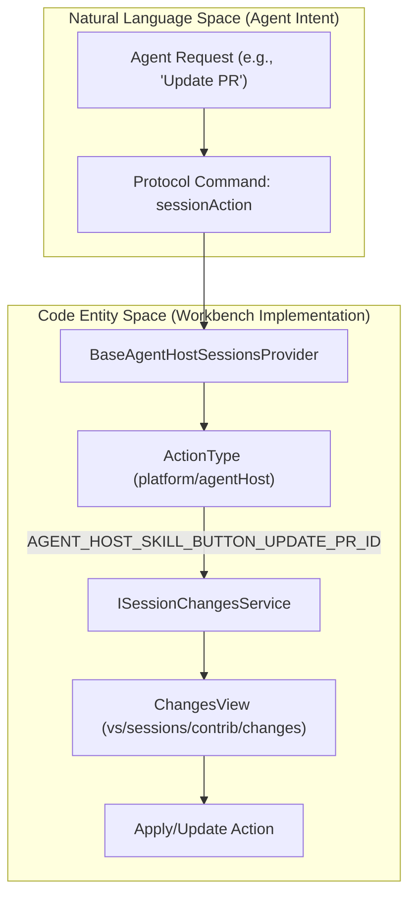
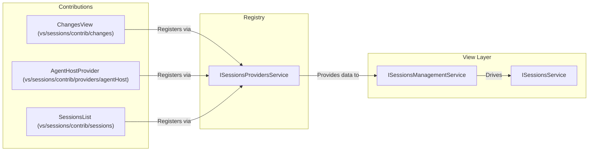

# Agents Window Contributions (Changes, Automations, GitHub, Feedback)

Relevant source files

The following files were used as context for generating this wiki page:

- [.github/instructions/best-practices.instructions.md](.github/instructions/best-practices.instructions.md)
- [.github/instructions/css-best-practices.instructions.md](.github/instructions/css-best-practices.instructions.md)
- [src/vs/editor/browser/widget/multiDiffEditor/workbenchUIElementFactory.ts](src/vs/editor/browser/widget/multiDiffEditor/workbenchUIElementFactory.ts)
- [src/vs/sessions/SESSIONS.md](src/vs/sessions/SESSIONS.md)
- [src/vs/sessions/SESSIONS_LIST.md](src/vs/sessions/SESSIONS_LIST.md)
- [src/vs/sessions/browser/media/workbench.css](src/vs/sessions/browser/media/workbench.css)
- [src/vs/sessions/browser/parts/media/editorPart.css](src/vs/sessions/browser/parts/media/editorPart.css)
- [src/vs/sessions/common/contextkeys.ts](src/vs/sessions/common/contextkeys.ts)
- [src/vs/sessions/contrib/automations/browser/automationDialog.ts](src/vs/sessions/contrib/automations/browser/automationDialog.ts)
- [src/vs/sessions/contrib/automations/browser/automationDialogService.ts](src/vs/sessions/contrib/automations/browser/automationDialogService.ts)
- [src/vs/sessions/contrib/automations/test/browser/automationDialog.test.ts](src/vs/sessions/contrib/automations/test/browser/automationDialog.test.ts)
- [src/vs/sessions/contrib/changes/browser/changes.contribution.ts](src/vs/sessions/contrib/changes/browser/changes.contribution.ts)
- [src/vs/sessions/contrib/changes/browser/changesActions.ts](src/vs/sessions/contrib/changes/browser/changesActions.ts)
- [src/vs/sessions/contrib/changes/browser/changesEditorLabels.ts](src/vs/sessions/contrib/changes/browser/changesEditorLabels.ts)
- [src/vs/sessions/contrib/changes/browser/changesMultiDiffSourceResolver.ts](src/vs/sessions/contrib/changes/browser/changesMultiDiffSourceResolver.ts)
- [src/vs/sessions/contrib/changes/browser/changesView.ts](src/vs/sessions/contrib/changes/browser/changesView.ts)
- [src/vs/sessions/contrib/changes/browser/changesViewActions.ts](src/vs/sessions/contrib/changes/browser/changesViewActions.ts)
- [src/vs/sessions/contrib/changes/browser/changesViewRenderer.ts](src/vs/sessions/contrib/changes/browser/changesViewRenderer.ts)
- [src/vs/sessions/contrib/changes/browser/changesViewService.ts](src/vs/sessions/contrib/changes/browser/changesViewService.ts)
- [src/vs/sessions/contrib/changes/browser/changesetReviewActions.ts](src/vs/sessions/contrib/changes/browser/changesetReviewActions.ts)
- [src/vs/sessions/contrib/changes/browser/media/changesView.css](src/vs/sessions/contrib/changes/browser/media/changesView.css)
- [src/vs/sessions/contrib/changes/browser/media/multiFileDiffEditor.css](src/vs/sessions/contrib/changes/browser/media/multiFileDiffEditor.css)
- [src/vs/sessions/contrib/changes/browser/media/sessionChangesEditor.css](src/vs/sessions/contrib/changes/browser/media/sessionChangesEditor.css)
- [src/vs/sessions/contrib/changes/browser/media/sessionFilesWidget.css](src/vs/sessions/contrib/changes/browser/media/sessionFilesWidget.css)
- [src/vs/sessions/contrib/changes/browser/sessionChangesEditor.ts](src/vs/sessions/contrib/changes/browser/sessionChangesEditor.ts)
- [src/vs/sessions/contrib/changes/browser/sessionFilesViewModel.ts](src/vs/sessions/contrib/changes/browser/sessionFilesViewModel.ts)
- [src/vs/sessions/contrib/changes/browser/sessionFilesWidget.ts](src/vs/sessions/contrib/changes/browser/sessionFilesWidget.ts)
- [src/vs/sessions/contrib/changes/browser/sessionsChangesAccessibilityHelp.ts](src/vs/sessions/contrib/changes/browser/sessionsChangesAccessibilityHelp.ts)
- [src/vs/sessions/contrib/changes/common/changes.ts](src/vs/sessions/contrib/changes/common/changes.ts)
- [src/vs/sessions/contrib/changes/common/changesViewService.ts](src/vs/sessions/contrib/changes/common/changesViewService.ts)
- [src/vs/sessions/contrib/changes/test/browser/changesEditorLabels.test.ts](src/vs/sessions/contrib/changes/test/browser/changesEditorLabels.test.ts)
- [src/vs/sessions/contrib/changes/test/browser/changesViewActions.test.ts](src/vs/sessions/contrib/changes/test/browser/changesViewActions.test.ts)
- [src/vs/sessions/contrib/changes/test/browser/changesViewService.test.ts](src/vs/sessions/contrib/changes/test/browser/changesViewService.test.ts)
- [src/vs/sessions/contrib/changes/test/browser/changesetReviewActions.test.ts](src/vs/sessions/contrib/changes/test/browser/changesetReviewActions.test.ts)
- [src/vs/sessions/contrib/changes/test/browser/sessionFilesWidget.fixture.ts](src/vs/sessions/contrib/changes/test/browser/sessionFilesWidget.fixture.ts)
- [src/vs/sessions/contrib/chat/browser/newChatInSessionWidget.ts](src/vs/sessions/contrib/chat/browser/newChatInSessionWidget.ts)
- [src/vs/sessions/contrib/chat/browser/newChatWidget.ts](src/vs/sessions/contrib/chat/browser/newChatWidget.ts)
- [src/vs/sessions/contrib/chat/browser/sessionWorkspaceFallback.ts](src/vs/sessions/contrib/chat/browser/sessionWorkspaceFallback.ts)
- [src/vs/sessions/contrib/chat/browser/sessionWorkspacePicker.ts](src/vs/sessions/contrib/chat/browser/sessionWorkspacePicker.ts)
- [src/vs/sessions/contrib/chat/browser/sessionsChatAccessibilityHelp.ts](src/vs/sessions/contrib/chat/browser/sessionsChatAccessibilityHelp.ts)
- [src/vs/sessions/contrib/chat/browser/webWorkspacePicker.ts](src/vs/sessions/contrib/chat/browser/webWorkspacePicker.ts)
- [src/vs/sessions/contrib/chat/electron-browser/chat.contribution.ts](src/vs/sessions/contrib/chat/electron-browser/chat.contribution.ts)
- [src/vs/sessions/contrib/chat/test/browser/newChatWidget.test.ts](src/vs/sessions/contrib/chat/test/browser/newChatWidget.test.ts)
- [src/vs/sessions/contrib/chat/test/browser/sessionWorkspacePicker.test.ts](src/vs/sessions/contrib/chat/test/browser/sessionWorkspacePicker.test.ts)
- [src/vs/sessions/contrib/editor/browser/media/editorBreadcrumbs.css](src/vs/sessions/contrib/editor/browser/media/editorBreadcrumbs.css)
- [src/vs/sessions/contrib/files/browser/files.contribution.ts](src/vs/sessions/contrib/files/browser/files.contribution.ts)
- [src/vs/sessions/contrib/files/browser/filesView.ts](src/vs/sessions/contrib/files/browser/filesView.ts)
- [src/vs/sessions/contrib/files/browser/media/filesView.css](src/vs/sessions/contrib/files/browser/media/filesView.css)
- [src/vs/sessions/contrib/files/browser/syncChangesActionViewItem.ts](src/vs/sessions/contrib/files/browser/syncChangesActionViewItem.ts)
- [src/vs/sessions/contrib/providers/agentHost/AGENT_HOST_SESSIONS_PROVIDER.md](src/vs/sessions/contrib/providers/agentHost/AGENT_HOST_SESSIONS_PROVIDER.md)
- [src/vs/sessions/contrib/providers/agentHost/browser/agentHostSessionChangesets.ts](src/vs/sessions/contrib/providers/agentHost/browser/agentHostSessionChangesets.ts)
- [src/vs/sessions/contrib/providers/agentHost/browser/baseAgentHostSessionsProvider.ts](src/vs/sessions/contrib/providers/agentHost/browser/baseAgentHostSessionsProvider.ts)
- [src/vs/sessions/contrib/providers/agentHost/browser/localAgentHostSessionsProvider.ts](src/vs/sessions/contrib/providers/agentHost/browser/localAgentHostSessionsProvider.ts)
- [src/vs/sessions/contrib/providers/agentHost/test/browser/localAgentHostSessionsProvider.test.ts](src/vs/sessions/contrib/providers/agentHost/test/browser/localAgentHostSessionsProvider.test.ts)
- [src/vs/sessions/contrib/providers/copilotChatSessions/browser/copilotChatSessionsChangesets.ts](src/vs/sessions/contrib/providers/copilotChatSessions/browser/copilotChatSessionsChangesets.ts)
- [src/vs/sessions/contrib/providers/copilotChatSessions/browser/copilotChatSessionsProvider.ts](src/vs/sessions/contrib/providers/copilotChatSessions/browser/copilotChatSessionsProvider.ts)
- [src/vs/sessions/contrib/providers/copilotChatSessions/test/browser/copilotChatSessionsProvider.test.ts](src/vs/sessions/contrib/providers/copilotChatSessions/test/browser/copilotChatSessionsProvider.test.ts)
- [src/vs/sessions/contrib/providers/remoteAgentHost/browser/remoteAgentHostSessionsProvider.ts](src/vs/sessions/contrib/providers/remoteAgentHost/browser/remoteAgentHostSessionsProvider.ts)
- [src/vs/sessions/contrib/providers/remoteAgentHost/test/browser/remoteAgentHostSessionsProvider.test.ts](src/vs/sessions/contrib/providers/remoteAgentHost/test/browser/remoteAgentHostSessionsProvider.test.ts)
- [src/vs/sessions/contrib/search/browser/search.contribution.ts](src/vs/sessions/contrib/search/browser/search.contribution.ts)
- [src/vs/sessions/contrib/sessions/browser/media/sessionsList.css](src/vs/sessions/contrib/sessions/browser/media/sessionsList.css)
- [src/vs/sessions/contrib/sessions/browser/sessions.contribution.ts](src/vs/sessions/contrib/sessions/browser/sessions.contribution.ts)
- [src/vs/sessions/contrib/sessions/browser/sessionsActions.ts](src/vs/sessions/contrib/sessions/browser/sessionsActions.ts)
- [src/vs/sessions/contrib/sessions/browser/sessionsWindowOpenTelemetry.ts](src/vs/sessions/contrib/sessions/browser/sessionsWindowOpenTelemetry.ts)
- [src/vs/sessions/contrib/sessions/browser/views/sessionsList.ts](src/vs/sessions/contrib/sessions/browser/views/sessionsList.ts)
- [src/vs/sessions/contrib/sessions/browser/views/sessionsViewActions.ts](src/vs/sessions/contrib/sessions/browser/views/sessionsViewActions.ts)
- [src/vs/sessions/contrib/sessions/test/browser/sessionsList.test.ts](src/vs/sessions/contrib/sessions/test/browser/sessionsList.test.ts)
- [src/vs/sessions/contrib/sessions/test/browser/sessionsWindowOpenTelemetry.test.ts](src/vs/sessions/contrib/sessions/test/browser/sessionsWindowOpenTelemetry.test.ts)
- [src/vs/sessions/services/sessions/browser/sessionNavigation.ts](src/vs/sessions/services/sessions/browser/sessionNavigation.ts)
- [src/vs/sessions/services/sessions/browser/sessionsManagementService.ts](src/vs/sessions/services/sessions/browser/sessionsManagementService.ts)
- [src/vs/sessions/services/sessions/browser/sessionsService.ts](src/vs/sessions/services/sessions/browser/sessionsService.ts)
- [src/vs/sessions/services/sessions/browser/visibleSessions.ts](src/vs/sessions/services/sessions/browser/visibleSessions.ts)
- [src/vs/sessions/services/sessions/common/session.ts](src/vs/sessions/services/sessions/common/session.ts)
- [src/vs/sessions/services/sessions/common/sessionContextKeys.ts](src/vs/sessions/services/sessions/common/sessionContextKeys.ts)
- [src/vs/sessions/services/sessions/common/sessionsManagement.ts](src/vs/sessions/services/sessions/common/sessionsManagement.ts)
- [src/vs/sessions/services/sessions/common/sessionsProvider.ts](src/vs/sessions/services/sessions/common/sessionsProvider.ts)
- [src/vs/sessions/services/sessions/test/browser/sessionNavigation.test.ts](src/vs/sessions/services/sessions/test/browser/sessionNavigation.test.ts)
- [src/vs/sessions/services/sessions/test/browser/sessionsManagementService.test.ts](src/vs/sessions/services/sessions/test/browser/sessionsManagementService.test.ts)
- [src/vs/sessions/services/sessions/test/browser/visibleSessions.test.ts](src/vs/sessions/services/sessions/test/browser/visibleSessions.test.ts)
- [src/vs/sessions/services/sessions/test/common/sessionContextKeys.test.ts](src/vs/sessions/services/sessions/test/common/sessionContextKeys.test.ts)
- [src/vs/workbench/browser/parts/dialogs/dialog.ts](src/vs/workbench/browser/parts/dialogs/dialog.ts)
- [src/vs/workbench/test/browser/componentFixtures/editor/editorTabBar.fixture.ts](src/vs/workbench/test/browser/componentFixtures/editor/editorTabBar.fixture.ts)
- [src/vs/workbench/test/browser/componentFixtures/sessions/changesView.fixture.ts](src/vs/workbench/test/browser/componentFixtures/sessions/changesView.fixture.ts)

The Agents Window (located in `vs/sessions`) extends the core session management framework with specialized contributions that facilitate agentic workflows. These contributions, housed primarily under `vs/sessions/contrib`, handle the lifecycle of code changes, integration with GitHub pull requests, automated task execution, and agent feedback loops.

## 1. Changes View and Repository Integration

The **Changes View** is a central component of the Agents Window, providing a unified interface for reviewing and applying edits generated by AI agents. It integrates directly with the SCM (Source Control Management) layer but is optimized for the session-based "apply-to-parent" flow.

### Implementation and Data Flow
The view is managed by the `ChangesView` class [src/vs/sessions/contrib/changes/browser/changesView.ts:83-83](), which consumes the `ISessionChangesService` [src/vs/sessions/contrib/changes/browser/changesView.ts:66-66](). It visualizes the `ISessionChangeset` associated with the active session.

*   **Service Layer**: `ISessionChangesService` tracks file modifications and provides the source of truth for changes within a session [src/vs/sessions/contrib/changes/browser/changesView.ts:66-66]().
*   **ViewModel**: `SessionFilesViewModel` translates raw `ISessionFileChange` objects into a tree structure suitable for rendering [src/vs/sessions/contrib/changes/browser/sessionFilesViewModel.ts:70-70]().
*   **Rendering**: Uses `WorkbenchCompressibleObjectTree` to display added, modified, and deleted files [src/vs/sessions/contrib/changes/browser/changesView.ts:40-40]().
*   **Multi-Diff Support**: Integrates with `SessionChangesEditorInput` to provide multi-file diffing of agent edits [src/vs/sessions/contrib/changes/browser/changesView.ts:49-49]().

### Apply-to-Parent-Repo Flow
Unlike standard Git operations, the Agents Window often operates on a virtual or remote changeset. The "Apply" action triggers a flow where changes are reconciled back to the user's local repository.

| Component | Role |
| :--- | :--- |
| `ISessionChangesetOperation` | Represents a pending apply/discard operation [src/vs/sessions/contrib/changes/browser/changesView.ts:71-71](). |
| `SessionChangesetOperationStatus` | Tracks the state of the application (e.g., `Applying`, `Applied`, `Failed`) [src/vs/sessions/contrib/changes/browser/changesView.ts:71-71](). |
| `SessionChangesetOperationScope` | Defines if an operation applies to a specific file or the whole changeset [src/vs/sessions/contrib/changes/browser/changesView.ts:71-71](). |

**Sources:** [src/vs/sessions/contrib/changes/browser/changesView.ts:1-83](), [src/vs/sessions/services/sessions/common/session.ts:70-81](), [src/vs/sessions/contrib/changes/browser/sessionFilesViewModel.ts:70-100]()

## 2. GitHub and PR Integration

The Agents Window provides deep integration with GitHub, specifically for workflows involving Pull Requests (PRs). This includes PR overlays in the sessions list and status polling for CI/CD checks.

### PR Icon Polling and Status
The system reflects the live status of PRs (e.g., CI passing/failing) directly on session icons.

*   **Icon Computation**: `computeSessionPullRequestIcon` determines the appropriate `ThemeIcon` based on the PR's current state [src/vs/sessions/contrib/providers/agentHost/browser/baseAgentHostSessionsProvider.ts:55-55]().
*   **Check Status**: `CIStatusWidget` renders the status of GitHub checks (CI) within the changes view [src/vs/sessions/contrib/changes/browser/changesView.ts:68-68]().
*   **GitHub References**: `IGitHubPullRequestRef` and `IGitHubIssueRef` are used to link sessions to specific GitHub entities [src/vs/sessions/services/sessions/common/session.ts:51-51]().

### Session Metadata
Sessions associated with GitHub repositories include metadata such as `IGitHubInfo`, which contains repository owner and name [src/vs/sessions/services/sessions/common/session.ts:158-158]().

**Sources:** [src/vs/sessions/contrib/providers/agentHost/browser/baseAgentHostSessionsProvider.ts:50-58](), [src/vs/sessions/services/sessions/common/session.ts:51-159](), [src/vs/sessions/contrib/changes/browser/changesView.ts:68-72]()

## 3. Automations and AI Customization

Automations and customizations allow users to define reusable agent behaviors and environment-specific tools.

### AI Customization Management
The management editor surfaces customization items such as agents, skills, and MCP servers.

*   **Skill Buttons**: The UI provides specific buttons for agent-host skills, such as `AGENT_HOST_SKILL_BUTTON_UPDATE_PR_ID` [src/vs/sessions/contrib/changes/browser/changesView.ts:82-82]().
*   **Mcp Integration**: The `IAgentHostMcpServer` interface defines how MCP servers are exposed to the agent host provider [src/vs/sessions/contrib/providers/agentHost/browser/baseAgentHostSessionsProvider.ts:48-48]().

### Automations and Terminal Tools
Agents can execute terminal commands or run scripts through a structured tool-calling loop.

*   **Terminal Approvals**: The `AgentSessionApprovalModel` manages user permissions for agent actions [src/vs/sessions/contrib/sessions/browser/views/sessionsList.ts:47-47]().
*   **Agent Host Protocol**: `ActionType` and `NotificationType` define the communication between the agent host and the workbench for tool execution [src/vs/sessions/contrib/providers/agentHost/browser/baseAgentHostSessionsProvider.ts:30-30]().

### Interaction Model: Protocol to Code Entity
This diagram illustrates how a protocol-level request for a tool execution is handled by the workbench entities.

**Title: Agent Tool Execution Data Flow**

**Sources:** [src/vs/sessions/contrib/providers/agentHost/browser/baseAgentHostSessionsProvider.ts:28-31](), [src/vs/sessions/contrib/changes/browser/changesView.ts:81-83](), [src/vs/sessions/services/sessions/common/session.ts:70-81]()

## 4. Agent Feedback and Onboarding

The Agents Window includes mechanisms for providing feedback and guiding users through agentic workflows.

### Feedback and Status
*   **Status Indicators**: `SessionStatus` tracks if an agent is `InProgress`, `NeedsInput`, or `Completed` [src/vs/sessions/services/sessions/common/session.ts:70-81]().
*   **Status Messages**: `getSessionStatusMessage` translates `SessionStatus` into localized strings for the UI [src/vs/sessions/services/sessions/common/session.ts:88-99]().

### Onboarding and Welcome
The `SessionsWelcomeVisibleContext` context key manages the visibility of the welcome experience in the Agents Window [src/vs/sessions/contrib/sessions/browser/sessionsActions.ts:29-29]().

**Sources:** [src/vs/sessions/services/sessions/common/session.ts:70-99](), [src/vs/sessions/contrib/sessions/browser/sessionsActions.ts:29-55]()

## 5. Integration with the Provider Model

All contributions must adhere to the pluggable provider model and internal layering rules.

### Session Contribution Registry
**Title: Session Contribution Registry**

### Guidance for New Features
1.  **Placement**: New sessions-only features should live in `vs/sessions/contrib/<feature-name>`.
2.  **Layering**: Contributions in `contrib/*` must not import from `contrib/providers/*` to maintain the pluggable architecture, with very specific exceptions for lazy resolution [src/vs/sessions/contrib/sessions/browser/views/sessionsList.ts:64-77]().
3.  **Observables**: Session state propagation should prefer `IObservable` for reactive UI consistency [src/vs/sessions/contrib/changes/browser/changesView.ts:18-18]().
4.  **Provider Independence**: UI components like `SessionsList` should interact with `ISession` facades rather than provider-specific classes [src/vs/sessions/SESSIONS.md:41-41]().

**Sources:** [src/vs/sessions/SESSIONS.md:1-60](), [src/vs/sessions/contrib/sessions/browser/views/sessionsList.ts:64-77](), [src/vs/sessions/services/sessions/common/sessionsManagement.ts:36-78]()