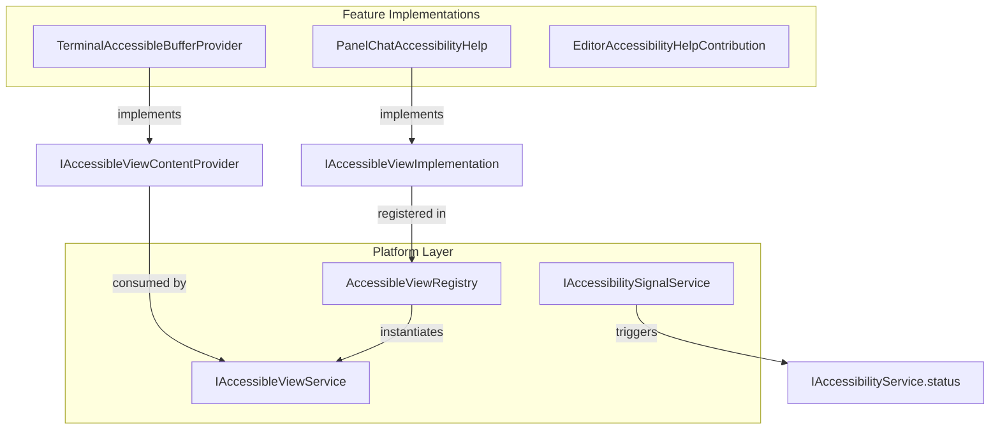
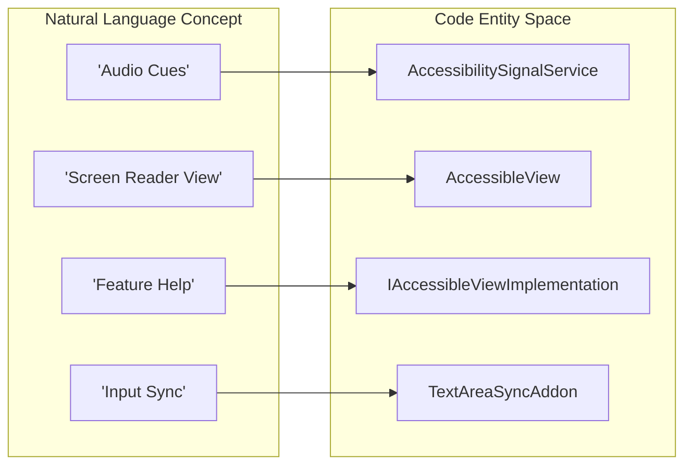

# Accessibility

Relevant source files

The following files were used as context for generating this wiki page:

- [extensions/copilot/test/prompts/settingsEditorSearchResultsSelector.stest.ts](https://github.com/microsoft/vscode/blob/HEAD/extensions/copilot/test/prompts/settingsEditorSearchResultsSelector.stest.ts)
- [src/vs/base/common/hotReloadHelpers.ts](https://github.com/microsoft/vscode/blob/HEAD/src/vs/base/common/hotReloadHelpers.ts)
- [src/vs/editor/common/standaloneStrings.ts](https://github.com/microsoft/vscode/blob/HEAD/src/vs/editor/common/standaloneStrings.ts)
- [src/vs/editor/contrib/placeholderText/browser/placeholderText.contribution.ts](https://github.com/microsoft/vscode/blob/HEAD/src/vs/editor/contrib/placeholderText/browser/placeholderText.contribution.ts)
- [src/vs/platform/accessibility/browser/accessibleView.ts](https://github.com/microsoft/vscode/blob/HEAD/src/vs/platform/accessibility/browser/accessibleView.ts)
- [src/vs/platform/accessibilitySignal/browser/accessibilitySignalService.ts](https://github.com/microsoft/vscode/blob/HEAD/src/vs/platform/accessibilitySignal/browser/accessibilitySignalService.ts)
- [src/vs/platform/accessibilitySignal/browser/media/voiceRecordingStarted.mp3](https://github.com/microsoft/vscode/blob/HEAD/src/vs/platform/accessibilitySignal/browser/media/voiceRecordingStarted.mp3)
- [src/vs/platform/accessibilitySignal/browser/media/voiceRecordingStopped.mp3](https://github.com/microsoft/vscode/blob/HEAD/src/vs/platform/accessibilitySignal/browser/media/voiceRecordingStopped.mp3)
- [src/vs/platform/observable/common/wrapInHotClass.ts](https://github.com/microsoft/vscode/blob/HEAD/src/vs/platform/observable/common/wrapInHotClass.ts)
- [src/vs/platform/observable/common/wrapInReloadableClass.ts](https://github.com/microsoft/vscode/blob/HEAD/src/vs/platform/observable/common/wrapInReloadableClass.ts)
- [src/vs/workbench/api/browser/mainThreadSpeech.ts](https://github.com/microsoft/vscode/blob/HEAD/src/vs/workbench/api/browser/mainThreadSpeech.ts)
- [src/vs/workbench/api/common/extHostSpeech.ts](https://github.com/microsoft/vscode/blob/HEAD/src/vs/workbench/api/common/extHostSpeech.ts)
- [src/vs/workbench/contrib/accessibility/browser/accessibility.contribution.ts](https://github.com/microsoft/vscode/blob/HEAD/src/vs/workbench/contrib/accessibility/browser/accessibility.contribution.ts)
- [src/vs/workbench/contrib/accessibility/browser/accessibilityConfiguration.ts](https://github.com/microsoft/vscode/blob/HEAD/src/vs/workbench/contrib/accessibility/browser/accessibilityConfiguration.ts)
- [src/vs/workbench/contrib/accessibility/browser/accessibleView.ts](https://github.com/microsoft/vscode/blob/HEAD/src/vs/workbench/contrib/accessibility/browser/accessibleView.ts)
- [src/vs/workbench/contrib/accessibility/browser/accessibleViewActions.ts](https://github.com/microsoft/vscode/blob/HEAD/src/vs/workbench/contrib/accessibility/browser/accessibleViewActions.ts)
- [src/vs/workbench/contrib/accessibility/browser/accessibleViewKeybindingResolver.ts](https://github.com/microsoft/vscode/blob/HEAD/src/vs/workbench/contrib/accessibility/browser/accessibleViewKeybindingResolver.ts)
- [src/vs/workbench/contrib/accessibility/browser/editorAccessibilityHelp.ts](https://github.com/microsoft/vscode/blob/HEAD/src/vs/workbench/contrib/accessibility/browser/editorAccessibilityHelp.ts)
- [src/vs/workbench/contrib/accessibility/browser/extensionAccesibilityHelp.contribution.ts](https://github.com/microsoft/vscode/blob/HEAD/src/vs/workbench/contrib/accessibility/browser/extensionAccesibilityHelp.contribution.ts)
- [src/vs/workbench/contrib/accessibility/common/accessibilityCommands.ts](https://github.com/microsoft/vscode/blob/HEAD/src/vs/workbench/contrib/accessibility/common/accessibilityCommands.ts)
- [src/vs/workbench/contrib/accessibilitySignals/browser/accessibilitySignal.contribution.ts](https://github.com/microsoft/vscode/blob/HEAD/src/vs/workbench/contrib/accessibilitySignals/browser/accessibilitySignal.contribution.ts)
- [src/vs/workbench/contrib/accessibilitySignals/browser/accessibilitySignalDebuggerContribution.ts](https://github.com/microsoft/vscode/blob/HEAD/src/vs/workbench/contrib/accessibilitySignals/browser/accessibilitySignalDebuggerContribution.ts)
- [src/vs/workbench/contrib/accessibilitySignals/browser/commands.ts](https://github.com/microsoft/vscode/blob/HEAD/src/vs/workbench/contrib/accessibilitySignals/browser/commands.ts)
- [src/vs/workbench/contrib/accessibilitySignals/browser/editorTextPropertySignalsContribution.ts](https://github.com/microsoft/vscode/blob/HEAD/src/vs/workbench/contrib/accessibilitySignals/browser/editorTextPropertySignalsContribution.ts)
- [src/vs/workbench/contrib/chat/browser/actions/chatAccessibilityHelp.ts](https://github.com/microsoft/vscode/blob/HEAD/src/vs/workbench/contrib/chat/browser/actions/chatAccessibilityHelp.ts)
- [src/vs/workbench/contrib/chat/browser/widget/chatPetWidget.ts](https://github.com/microsoft/vscode/blob/HEAD/src/vs/workbench/contrib/chat/browser/widget/chatPetWidget.ts)
- [src/vs/workbench/contrib/chat/browser/widget/media/chatPet.css](https://github.com/microsoft/vscode/blob/HEAD/src/vs/workbench/contrib/chat/browser/widget/media/chatPet.css)
- [src/vs/workbench/contrib/chat/browser/widget/media/chatPet/buddy-love-insiders-96.png](https://github.com/microsoft/vscode/blob/HEAD/src/vs/workbench/contrib/chat/browser/widget/media/chatPet/buddy-love-insiders-96.png)
- [src/vs/workbench/contrib/chat/browser/widget/media/chatPet/buddy-love-insiders-96.spritesheet.png](https://github.com/microsoft/vscode/blob/HEAD/src/vs/workbench/contrib/chat/browser/widget/media/chatPet/buddy-love-insiders-96.spritesheet.png)
- [src/vs/workbench/contrib/chat/browser/widget/media/chatPet/buddy-love-stable-96.png](https://github.com/microsoft/vscode/blob/HEAD/src/vs/workbench/contrib/chat/browser/widget/media/chatPet/buddy-love-stable-96.png)
- [src/vs/workbench/contrib/chat/browser/widget/media/chatPet/buddy-love-stable-96.spritesheet.png](https://github.com/microsoft/vscode/blob/HEAD/src/vs/workbench/contrib/chat/browser/widget/media/chatPet/buddy-love-stable-96.spritesheet.png)
- [src/vs/workbench/contrib/chat/browser/widget/media/chatPet/buddy-press-button-insiders-96.png](https://github.com/microsoft/vscode/blob/HEAD/src/vs/workbench/contrib/chat/browser/widget/media/chatPet/buddy-press-button-insiders-96.png)
- [src/vs/workbench/contrib/chat/browser/widget/media/chatPet/buddy-press-button-insiders-96.spritesheet.png](https://github.com/microsoft/vscode/blob/HEAD/src/vs/workbench/contrib/chat/browser/widget/media/chatPet/buddy-press-button-insiders-96.spritesheet.png)
- [src/vs/workbench/contrib/chat/browser/widget/media/chatPet/buddy-press-button-stable-96.png](https://github.com/microsoft/vscode/blob/HEAD/src/vs/workbench/contrib/chat/browser/widget/media/chatPet/buddy-press-button-stable-96.png)
- [src/vs/workbench/contrib/chat/browser/widget/media/chatPet/buddy-press-button-stable-96.spritesheet.png](https://github.com/microsoft/vscode/blob/HEAD/src/vs/workbench/contrib/chat/browser/widget/media/chatPet/buddy-press-button-stable-96.spritesheet.png)
- [src/vs/workbench/contrib/chat/browser/widget/media/chatPet/buddy-sing-insiders-124.png](https://github.com/microsoft/vscode/blob/HEAD/src/vs/workbench/contrib/chat/browser/widget/media/chatPet/buddy-sing-insiders-124.png)
- [src/vs/workbench/contrib/chat/browser/widget/media/chatPet/buddy-sing-insiders-124.spritesheet.png](https://github.com/microsoft/vscode/blob/HEAD/src/vs/workbench/contrib/chat/browser/widget/media/chatPet/buddy-sing-insiders-124.spritesheet.png)
- [src/vs/workbench/contrib/chat/browser/widget/media/chatPet/buddy-sing-stable-124.png](https://github.com/microsoft/vscode/blob/HEAD/src/vs/workbench/contrib/chat/browser/widget/media/chatPet/buddy-sing-stable-124.png)
- [src/vs/workbench/contrib/chat/browser/widget/media/chatPet/buddy-sing-stable-124.spritesheet.png](https://github.com/microsoft/vscode/blob/HEAD/src/vs/workbench/contrib/chat/browser/widget/media/chatPet/buddy-sing-stable-124.spritesheet.png)
- [src/vs/workbench/contrib/chat/browser/widget/media/chatPet/buddy-sleep-insiders-96.png](https://github.com/microsoft/vscode/blob/HEAD/src/vs/workbench/contrib/chat/browser/widget/media/chatPet/buddy-sleep-insiders-96.png)
- [src/vs/workbench/contrib/chat/browser/widget/media/chatPet/buddy-sleep-insiders-96.spritesheet.png](https://github.com/microsoft/vscode/blob/HEAD/src/vs/workbench/contrib/chat/browser/widget/media/chatPet/buddy-sleep-insiders-96.spritesheet.png)
- [src/vs/workbench/contrib/chat/browser/widget/media/chatPet/buddy-sleep-stable-96.png](https://github.com/microsoft/vscode/blob/HEAD/src/vs/workbench/contrib/chat/browser/widget/media/chatPet/buddy-sleep-stable-96.png)
- [src/vs/workbench/contrib/chat/browser/widget/media/chatPet/buddy-sleep-stable-96.spritesheet.png](https://github.com/microsoft/vscode/blob/HEAD/src/vs/workbench/contrib/chat/browser/widget/media/chatPet/buddy-sleep-stable-96.spritesheet.png)
- [src/vs/workbench/contrib/chat/browser/widget/media/chatPet/buddy-speechless-insiders-96.png](https://github.com/microsoft/vscode/blob/HEAD/src/vs/workbench/contrib/chat/browser/widget/media/chatPet/buddy-speechless-insiders-96.png)
- [src/vs/workbench/contrib/chat/browser/widget/media/chatPet/buddy-waking-insiders-96.png](https://github.com/microsoft/vscode/blob/HEAD/src/vs/workbench/contrib/chat/browser/widget/media/chatPet/buddy-waking-insiders-96.png)
- [src/vs/workbench/contrib/chat/browser/widget/media/chatPet/buddy-waking-insiders-96.spritesheet.png](https://github.com/microsoft/vscode/blob/HEAD/src/vs/workbench/contrib/chat/browser/widget/media/chatPet/buddy-waking-insiders-96.spritesheet.png)
- [src/vs/workbench/contrib/chat/browser/widget/media/chatPet/buddy-waking-stable-96.png](https://github.com/microsoft/vscode/blob/HEAD/src/vs/workbench/contrib/chat/browser/widget/media/chatPet/buddy-waking-stable-96.png)
- [src/vs/workbench/contrib/chat/browser/widget/media/chatPet/buddy-waking-stable-96.spritesheet.png](https://github.com/microsoft/vscode/blob/HEAD/src/vs/workbench/contrib/chat/browser/widget/media/chatPet/buddy-waking-stable-96.spritesheet.png)
- [src/vs/workbench/contrib/chat/test/browser/accessibility/chatAccessibilityHelp.test.ts](https://github.com/microsoft/vscode/blob/HEAD/src/vs/workbench/contrib/chat/test/browser/accessibility/chatAccessibilityHelp.test.ts)
- [src/vs/workbench/contrib/chat/test/browser/widget/chatPetWidget.test.ts](https://github.com/microsoft/vscode/blob/HEAD/src/vs/workbench/contrib/chat/test/browser/widget/chatPetWidget.test.ts)
- [src/vs/workbench/contrib/codeEditor/browser/accessibility/accessibility.css](https://github.com/microsoft/vscode/blob/HEAD/src/vs/workbench/contrib/codeEditor/browser/accessibility/accessibility.css)
- [src/vs/workbench/contrib/codeEditor/browser/accessibility/accessibility.ts](https://github.com/microsoft/vscode/blob/HEAD/src/vs/workbench/contrib/codeEditor/browser/accessibility/accessibility.ts)
- [src/vs/workbench/contrib/codeEditor/browser/diffEditorHelper.ts](https://github.com/microsoft/vscode/blob/HEAD/src/vs/workbench/contrib/codeEditor/browser/diffEditorHelper.ts)
- [src/vs/workbench/contrib/comments/browser/commentsAccessibility.ts](https://github.com/microsoft/vscode/blob/HEAD/src/vs/workbench/contrib/comments/browser/commentsAccessibility.ts)
- [src/vs/workbench/contrib/comments/common/commentCommandIds.ts](https://github.com/microsoft/vscode/blob/HEAD/src/vs/workbench/contrib/comments/common/commentCommandIds.ts)
- [src/vs/workbench/contrib/comments/common/commentContextKeys.ts](https://github.com/microsoft/vscode/blob/HEAD/src/vs/workbench/contrib/comments/common/commentContextKeys.ts)
- [src/vs/workbench/contrib/speech/browser/speechAccessibilitySignal.ts](https://github.com/microsoft/vscode/blob/HEAD/src/vs/workbench/contrib/speech/browser/speechAccessibilitySignal.ts)
- [src/vs/workbench/contrib/speech/browser/speechService.ts](https://github.com/microsoft/vscode/blob/HEAD/src/vs/workbench/contrib/speech/browser/speechService.ts)
- [src/vs/workbench/contrib/speech/common/speechService.ts](https://github.com/microsoft/vscode/blob/HEAD/src/vs/workbench/contrib/speech/common/speechService.ts)
- [src/vs/workbench/contrib/terminalContrib/accessibility/browser/terminal.accessibility.contribution.ts](https://github.com/microsoft/vscode/blob/HEAD/src/vs/workbench/contrib/terminalContrib/accessibility/browser/terminal.accessibility.contribution.ts)
- [src/vs/workbench/contrib/terminalContrib/accessibility/browser/terminalAccessibilityHelp.ts](https://github.com/microsoft/vscode/blob/HEAD/src/vs/workbench/contrib/terminalContrib/accessibility/browser/terminalAccessibilityHelp.ts)
- [src/vs/workbench/contrib/terminalContrib/accessibility/browser/terminalAccessibleBufferProvider.ts](https://github.com/microsoft/vscode/blob/HEAD/src/vs/workbench/contrib/terminalContrib/accessibility/browser/terminalAccessibleBufferProvider.ts)
- [src/vs/workbench/contrib/terminalContrib/accessibility/browser/textAreaSyncAddon.ts](https://github.com/microsoft/vscode/blob/HEAD/src/vs/workbench/contrib/terminalContrib/accessibility/browser/textAreaSyncAddon.ts)
- [src/vs/workbench/contrib/terminalContrib/accessibility/common/terminalAccessibilityConfiguration.ts](https://github.com/microsoft/vscode/blob/HEAD/src/vs/workbench/contrib/terminalContrib/accessibility/common/terminalAccessibilityConfiguration.ts)
- [src/vscode-dts/vscode.proposed.speech.d.ts](https://github.com/microsoft/vscode/blob/HEAD/src/vscode-dts/vscode.proposed.speech.d.ts)

The accessibility system in VS Code provides a comprehensive set of tools to ensure the editor is usable by developers using assistive technologies like screen readers. The architecture centers around an **Accessible View** for inspecting complex content, **Accessibility Signals** for non-visual feedback, and feature-specific help providers.

## Core Components

The accessibility infrastructure is primarily managed within `src/vs/workbench/contrib/accessibility` and integrated into the platform layer to allow cross-subsystem usage.

### Accessible View System
The `AccessibleView` is a specialized editor widget that provides a screen-reader-friendly way to inspect content that might otherwise be difficult to navigate, such as terminal history, chat responses, or inline completions [src/vs/workbench/contrib/accessibility/browser/accessibleView.ts:71-102](https://github.com/microsoft/vscode/blob/HEAD/src/vs/workbench/contrib/accessibility/browser/accessibleView.ts#L71-L102).

*   **IAccessibleViewService**: The primary service used to show content in the accessible view [src/vs/workbench/contrib/accessibility/browser/accessibleView.ts:30-30](https://github.com/microsoft/vscode/blob/HEAD/src/vs/workbench/contrib/accessibility/browser/accessibleView.ts#L30).
*   **AccessibleContentProvider**: An interface implemented by features (like Terminal or Chat) to provide text content and symbols to the view [src/vs/platform/accessibility/browser/accessibleView.ts:30-30](https://github.com/microsoft/vscode/blob/HEAD/src/vs/platform/accessibility/browser/accessibleView.ts#L30).
*   **Navigation**: Supports navigating between items (e.g., next/previous chat response) and "Go to Symbol" for structured content [src/vs/workbench/contrib/accessibility/browser/accessibleView.ts:77-79](https://github.com/microsoft/vscode/blob/HEAD/src/vs/workbench/contrib/accessibility/browser/accessibleView.ts#L77-L79).

### Accessibility Signals
Signals provide audio cues (sounds) and ARIA alerts to notify users of events without requiring visual focus. This is managed by the `IAccessibilitySignalService` [src/vs/platform/accessibilitySignal/browser/accessibilitySignalService.ts:20-22](https://github.com/microsoft/vscode/blob/HEAD/src/vs/platform/accessibilitySignal/browser/accessibilitySignalService.ts#L20-L22).

*   **Sounds**: Cues for events like breakpoints being hit, task completion, or error markers [src/vs/platform/accessibilitySignal/browser/accessibilitySignalService.ts:130-134](https://github.com/microsoft/vscode/blob/HEAD/src/vs/platform/accessibilitySignal/browser/accessibilitySignalService.ts#L130-L134).
*   **Announcements**: Textual descriptions sent to screen readers via ARIA live regions [src/vs/platform/accessibilitySignal/browser/accessibilitySignalService.ts:124-128](https://github.com/microsoft/vscode/blob/HEAD/src/vs/platform/accessibilitySignal/browser/accessibilitySignalService.ts#L124-L128).

For details, see [Accessible View and Signals](#16.1).

## System Architecture

The following diagram illustrates how feature providers interact with the central accessibility services.

### Accessibility Provider Registry
Feature-specific providers (Terminal, Chat, Editor) register with the AccessibleView system to supply screen-reader optimized content.

Title: Accessibility Service and Provider Interaction

**Sources:** [src/vs/workbench/contrib/accessibility/browser/accessibleView.ts:103-115](https://github.com/microsoft/vscode/blob/HEAD/src/vs/workbench/contrib/accessibility/browser/accessibleView.ts#L103-L115), [src/vs/workbench/contrib/terminalContrib/accessibility/browser/terminalAccessibleBufferProvider.ts:17-19](https://github.com/microsoft/vscode/blob/HEAD/src/vs/workbench/contrib/terminalContrib/accessibility/browser/terminalAccessibleBufferProvider.ts#L17-L19), [src/vs/workbench/contrib/chat/browser/actions/chatAccessibilityHelp.ts:28-36](https://github.com/microsoft/vscode/blob/HEAD/src/vs/workbench/contrib/chat/browser/actions/chatAccessibilityHelp.ts#L28-L36), [src/vs/platform/accessibilitySignal/browser/accessibilitySignalService.ts:127-128](https://github.com/microsoft/vscode/blob/HEAD/src/vs/platform/accessibilitySignal/browser/accessibilitySignalService.ts#L127-L128)

## Feature Accessibility

Accessibility is implemented as a contribution across major workbench features.

### Editor Accessibility
The editor provides specific help for screen reader users, including toggling "Screen Reader Optimized Mode" and announcing cursor positions [src/vs/workbench/contrib/codeEditor/browser/accessibility/accessibility.ts:22-92](https://github.com/microsoft/vscode/blob/HEAD/src/vs/workbench/contrib/codeEditor/browser/accessibility/accessibility.ts#L22-L92).
*   **Tab Focus Mode**: Allows users to toggle whether the `Tab` key inserts a character or moves focus [src/vs/editor/common/standaloneStrings.ts:24-25](https://github.com/microsoft/vscode/blob/HEAD/src/vs/editor/common/standaloneStrings.ts#L24-L25).
*   **Accessibility Help**: A dedicated dialog providing context-specific instructions for the editor, registered via `EditorAccessibilityHelpContribution` [src/vs/workbench/contrib/accessibility/browser/accessibility.contribution.ts:13-13](https://github.com/microsoft/vscode/blob/HEAD/src/vs/workbench/contrib/accessibility/browser/accessibility.contribution.ts#L13).

### Terminal Accessibility
The terminal uses a `BufferContentTracker` to mirror terminal output into a format that the `TerminalAccessibleBufferProvider` can render for the `AccessibleView` [src/vs/workbench/contrib/terminalContrib/accessibility/browser/terminalAccessibleBufferProvider.ts:17-32](https://github.com/microsoft/vscode/blob/HEAD/src/vs/workbench/contrib/terminalContrib/accessibility/browser/terminalAccessibleBufferProvider.ts#L17-L32).
*   **TextArea Sync**: The `TextAreaSyncAddon` synchronizes the terminal's `promptInputModel` with the xterm.js textarea to ensure screen readers can track the cursor and input text accurately [src/vs/workbench/contrib/terminalContrib/accessibility/browser/textAreaSyncAddon.ts:15-38](https://github.com/microsoft/vscode/blob/HEAD/src/vs/workbench/contrib/terminalContrib/accessibility/browser/textAreaSyncAddon.ts#L15-L38).

### Chat and AI Accessibility
Chat features provide specialized accessible views for inspecting code blocks and different help providers for panel chat, quick chat, edits view, and agent sessions [src/vs/workbench/contrib/chat/browser/actions/chatAccessibilityHelp.ts:28-76](https://github.com/microsoft/vscode/blob/HEAD/src/vs/workbench/contrib/chat/browser/actions/chatAccessibilityHelp.ts#L28-L76).
*   **Context Keys**: The system uses context keys like `ChatContextKeys.inChatInput` to determine which help provider to activate [src/vs/workbench/contrib/chat/browser/actions/chatAccessibilityHelp.ts:62-62](https://github.com/microsoft/vscode/blob/HEAD/src/vs/workbench/contrib/chat/browser/actions/chatAccessibilityHelp.ts#L62).

## Code Entity Mapping

The following diagram maps natural language accessibility concepts to their corresponding classes and services in the codebase.

Title: Accessibility Concepts to Code Entities

**Sources:** [src/vs/platform/accessibilitySignal/browser/accessibilitySignalService.ts:73-73](https://github.com/microsoft/vscode/blob/HEAD/src/vs/platform/accessibilitySignal/browser/accessibilitySignalService.ts#L73), [src/vs/workbench/contrib/accessibility/browser/accessibleView.ts:71-71](https://github.com/microsoft/vscode/blob/HEAD/src/vs/workbench/contrib/accessibility/browser/accessibleView.ts#L71), [src/vs/workbench/contrib/terminalContrib/accessibility/browser/textAreaSyncAddon.ts:15-15](https://github.com/microsoft/vscode/blob/HEAD/src/vs/workbench/contrib/terminalContrib/accessibility/browser/textAreaSyncAddon.ts#L15), [src/vs/workbench/contrib/chat/browser/actions/chatAccessibilityHelp.ts:28-28](https://github.com/microsoft/vscode/blob/HEAD/src/vs/workbench/contrib/chat/browser/actions/chatAccessibilityHelp.ts#L28)

## Configuration and Settings

Accessibility behavior is governed by a set of verbosity and signal settings defined in `accessibilityConfiguration.ts` [src/vs/workbench/contrib/accessibility/browser/accessibilityConfiguration.ts:49-77](https://github.com/microsoft/vscode/blob/HEAD/src/vs/workbench/contrib/accessibility/browser/accessibilityConfiguration.ts#L49-L77).

| Setting ID | Purpose | Source |
| :--- | :--- | :--- |
| `accessibility.verbosity.terminal` | Controls help hints when focusing the terminal | [src/vs/workbench/contrib/accessibility/browser/accessibilityConfiguration.ts:137-140](https://github.com/microsoft/vscode/blob/HEAD/src/vs/workbench/contrib/accessibility/browser/accessibilityConfiguration.ts#L137-L140) |
| `accessibility.verbosity.editor` | Controls help hints for the code editor | [src/vs/workbench/contrib/accessibility/browser/accessibilityConfiguration.ts:60-60](https://github.com/microsoft/vscode/blob/HEAD/src/vs/workbench/contrib/accessibility/browser/accessibilityConfiguration.ts#L60) |
| `accessibility.signals.sound` | Global toggle for audio feedback (auto/on/off) | [src/vs/workbench/contrib/accessibility/browser/accessibilityConfiguration.ts:91-101](https://github.com/microsoft/vscode/blob/HEAD/src/vs/workbench/contrib/accessibility/browser/accessibilityConfiguration.ts#L91-L101) |
| `editor.accessibilitySupport` | Main toggle for screen reader optimization | [src/vs/workbench/contrib/codeEditor/browser/accessibility/accessibility.ts:49-49](https://github.com/microsoft/vscode/blob/HEAD/src/vs/workbench/contrib/codeEditor/browser/accessibility/accessibility.ts#L49) |

**Sources:** [src/vs/workbench/contrib/accessibility/browser/accessibilityConfiguration.ts:49-140](https://github.com/microsoft/vscode/blob/HEAD/src/vs/workbench/contrib/accessibility/browser/accessibilityConfiguration.ts#L49-L140), [src/vs/workbench/contrib/codeEditor/browser/accessibility/accessibility.ts:45-51](https://github.com/microsoft/vscode/blob/HEAD/src/vs/workbench/contrib/codeEditor/browser/accessibility/accessibility.ts#L45-L51)

## Child Pages
- [Accessible View and Signals](#16.1): Deep dive into the `AccessibleView` implementation, the terminal buffer provider, and the accessibility signal service for audio/visual cues.
- [Accessibility Integrations Across Workbench Features](#16.2): Details how major UI surfaces integrate with accessibility primitives like chat, terminal buffers, and editor widgets.

**Sources:** [src/vs/workbench/contrib/accessibility/browser/accessibleView.ts](https://github.com/microsoft/vscode/blob/HEAD/src/vs/workbench/contrib/accessibility/browser/accessibleView.ts), [src/vs/platform/accessibilitySignal/browser/accessibilitySignalService.ts](https://github.com/microsoft/vscode/blob/HEAD/src/vs/platform/accessibilitySignal/browser/accessibilitySignalService.ts), [src/vs/workbench/contrib/terminalContrib/accessibility/browser/terminalAccessibleBufferProvider.ts](https://github.com/microsoft/vscode/blob/HEAD/src/vs/workbench/contrib/terminalContrib/accessibility/browser/terminalAccessibleBufferProvider.ts)