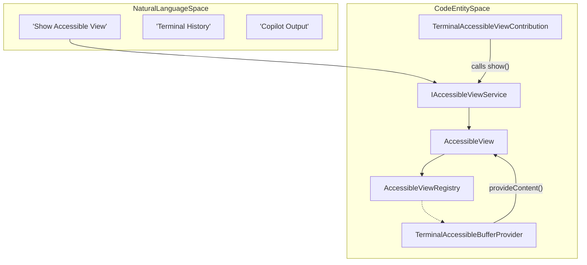
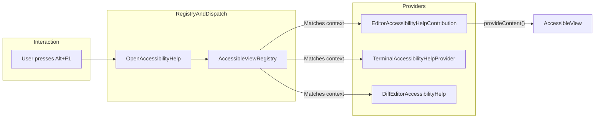

# Accessible View and Signals

Relevant source files

The following files were used as context for generating this wiki page:

- [extensions/copilot/test/prompts/settingsEditorSearchResultsSelector.stest.ts](extensions/copilot/test/prompts/settingsEditorSearchResultsSelector.stest.ts)
- [src/vs/base/common/hotReloadHelpers.ts](src/vs/base/common/hotReloadHelpers.ts)
- [src/vs/editor/common/standaloneStrings.ts](src/vs/editor/common/standaloneStrings.ts)
- [src/vs/editor/contrib/placeholderText/browser/placeholderText.contribution.ts](src/vs/editor/contrib/placeholderText/browser/placeholderText.contribution.ts)
- [src/vs/platform/accessibility/browser/accessibleView.ts](src/vs/platform/accessibility/browser/accessibleView.ts)
- [src/vs/platform/accessibilitySignal/browser/accessibilitySignalService.ts](src/vs/platform/accessibilitySignal/browser/accessibilitySignalService.ts)
- [src/vs/platform/accessibilitySignal/browser/media/voiceRecordingStarted.mp3](src/vs/platform/accessibilitySignal/browser/media/voiceRecordingStarted.mp3)
- [src/vs/platform/accessibilitySignal/browser/media/voiceRecordingStopped.mp3](src/vs/platform/accessibilitySignal/browser/media/voiceRecordingStopped.mp3)
- [src/vs/platform/observable/common/wrapInHotClass.ts](src/vs/platform/observable/common/wrapInHotClass.ts)
- [src/vs/platform/observable/common/wrapInReloadableClass.ts](src/vs/platform/observable/common/wrapInReloadableClass.ts)
- [src/vs/workbench/api/browser/mainThreadSpeech.ts](src/vs/workbench/api/browser/mainThreadSpeech.ts)
- [src/vs/workbench/api/common/extHostSpeech.ts](src/vs/workbench/api/common/extHostSpeech.ts)
- [src/vs/workbench/contrib/accessibility/browser/accessibility.contribution.ts](src/vs/workbench/contrib/accessibility/browser/accessibility.contribution.ts)
- [src/vs/workbench/contrib/accessibility/browser/accessibilityConfiguration.ts](src/vs/workbench/contrib/accessibility/browser/accessibilityConfiguration.ts)
- [src/vs/workbench/contrib/accessibility/browser/accessibleView.ts](src/vs/workbench/contrib/accessibility/browser/accessibleView.ts)
- [src/vs/workbench/contrib/accessibility/browser/accessibleViewActions.ts](src/vs/workbench/contrib/accessibility/browser/accessibleViewActions.ts)
- [src/vs/workbench/contrib/accessibility/browser/accessibleViewKeybindingResolver.ts](src/vs/workbench/contrib/accessibility/browser/accessibleViewKeybindingResolver.ts)
- [src/vs/workbench/contrib/accessibility/browser/editorAccessibilityHelp.ts](src/vs/workbench/contrib/accessibility/browser/editorAccessibilityHelp.ts)
- [src/vs/workbench/contrib/accessibility/browser/extensionAccesibilityHelp.contribution.ts](src/vs/workbench/contrib/accessibility/browser/extensionAccesibilityHelp.contribution.ts)
- [src/vs/workbench/contrib/accessibility/common/accessibilityCommands.ts](src/vs/workbench/contrib/accessibility/common/accessibilityCommands.ts)
- [src/vs/workbench/contrib/accessibilitySignals/browser/accessibilitySignal.contribution.ts](src/vs/workbench/contrib/accessibilitySignals/browser/accessibilitySignal.contribution.ts)
- [src/vs/workbench/contrib/accessibilitySignals/browser/accessibilitySignalDebuggerContribution.ts](src/vs/workbench/contrib/accessibilitySignals/browser/accessibilitySignalDebuggerContribution.ts)
- [src/vs/workbench/contrib/accessibilitySignals/browser/commands.ts](src/vs/workbench/contrib/accessibilitySignals/browser/commands.ts)
- [src/vs/workbench/contrib/accessibilitySignals/browser/editorTextPropertySignalsContribution.ts](src/vs/workbench/contrib/accessibilitySignals/browser/editorTextPropertySignalsContribution.ts)
- [src/vs/workbench/contrib/codeEditor/browser/accessibility/accessibility.css](src/vs/workbench/contrib/codeEditor/browser/accessibility/accessibility.css)
- [src/vs/workbench/contrib/codeEditor/browser/accessibility/accessibility.ts](src/vs/workbench/contrib/codeEditor/browser/accessibility/accessibility.ts)
- [src/vs/workbench/contrib/codeEditor/browser/diffEditorHelper.ts](src/vs/workbench/contrib/codeEditor/browser/diffEditorHelper.ts)
- [src/vs/workbench/contrib/comments/browser/commentsAccessibility.ts](src/vs/workbench/contrib/comments/browser/commentsAccessibility.ts)
- [src/vs/workbench/contrib/comments/common/commentCommandIds.ts](src/vs/workbench/contrib/comments/common/commentCommandIds.ts)
- [src/vs/workbench/contrib/comments/common/commentContextKeys.ts](src/vs/workbench/contrib/comments/common/commentContextKeys.ts)
- [src/vs/workbench/contrib/speech/browser/speechAccessibilitySignal.ts](src/vs/workbench/contrib/speech/browser/speechAccessibilitySignal.ts)
- [src/vs/workbench/contrib/speech/browser/speechService.ts](src/vs/workbench/contrib/speech/browser/speechService.ts)
- [src/vs/workbench/contrib/speech/common/speechService.ts](src/vs/workbench/contrib/speech/common/speechService.ts)
- [src/vs/workbench/contrib/terminalContrib/accessibility/browser/terminal.accessibility.contribution.ts](src/vs/workbench/contrib/terminalContrib/accessibility/browser/terminal.accessibility.contribution.ts)
- [src/vs/workbench/contrib/terminalContrib/accessibility/browser/terminalAccessibilityHelp.ts](src/vs/workbench/contrib/terminalContrib/accessibility/browser/terminalAccessibilityHelp.ts)
- [src/vs/workbench/contrib/terminalContrib/accessibility/browser/terminalAccessibleBufferProvider.ts](src/vs/workbench/contrib/terminalContrib/accessibility/browser/terminalAccessibleBufferProvider.ts)
- [src/vs/workbench/contrib/terminalContrib/accessibility/browser/textAreaSyncAddon.ts](src/vs/workbench/contrib/terminalContrib/accessibility/browser/textAreaSyncAddon.ts)
- [src/vs/workbench/contrib/terminalContrib/accessibility/common/terminalAccessibilityConfiguration.ts](src/vs/workbench/contrib/terminalContrib/accessibility/common/terminalAccessibilityConfiguration.ts)
- [src/vscode-dts/vscode.proposed.speech.d.ts](src/vscode-dts/vscode.proposed.speech.d.ts)

The accessibility subsystem in VS Code provides a rich set of tools for users of assistive technologies, centered around the **Accessible View** for inspecting complex content and the **Accessibility Signal Service** for non-visual feedback via audio and ARIA announcements.

## Accessible View

The `AccessibleView` is a specialized UI component that presents content (like terminal buffers, chat responses, or hover details) in a focused, screen-reader-friendly editor widget. This allows users to navigate content line-by-line using standard editor commands rather than relying on the screen reader's virtual cursor.

### Architecture and Data Flow

The system is built on a provider-consumer model. Features register implementations of `IAccessibleViewImplementation` or provide an `AccessibleContentProvider` to the `IAccessibleViewService`.

#### Key Components
- **`AccessibleView`**: The primary UI component. It hosts a `CodeEditorWidget` to display content [src/vs/workbench/contrib/accessibility/browser/accessibleView.ts:71-72](). It manages context keys such as `accessibleViewIsShown` and `accessibleViewCurrentProviderId` to coordinate with the rest of the workbench [src/vs/workbench/contrib/accessibility/browser/accessibleView.ts:74-80]().
- **`IAccessibleViewService`**: Manages the lifecycle of the view, including showing content, navigation between blocks, and symbol provider integration [src/vs/platform/accessibility/browser/accessibleView.ts:22-30]().
- **`AccessibleContentProvider`**: An interface implemented by features (e.g., Terminal, Chat) to supply text content, options, and symbols to the view [src/vs/platform/accessibility/browser/accessibleView.ts:30-30]().

### Accessible View Entity Mapping

Title: Accessible View Data Flow

**Sources:** [src/vs/workbench/contrib/accessibility/browser/accessibleView.ts:71-115](), [src/vs/workbench/contrib/terminalContrib/accessibility/browser/terminalAccessibleBufferProvider.ts:17-20](), [src/vs/workbench/contrib/terminalContrib/accessibility/browser/terminal.accessibility.contribution.ts:63-88]()

## Accessibility Signals

Accessibility signals provide audio (earcons) and visual cues for workbench events. These are managed by the `IAccessibilitySignalService`.

### Signal Types and Configuration
Signals are defined in the `AccessibilitySignal` enum. Each signal can be configured to play a sound, an announcement, or both, based on user settings [src/vs/workbench/contrib/accessibility/browser/accessibilityConfiguration.ts:91-111](). Configuration is grouped under the `accessibility` node [src/vs/workbench/contrib/accessibility/browser/accessibilityConfiguration.ts:85-89]().

### Implementation Details
- **`playSignal(signal, options)`**: The primary method to trigger a cue. It checks user enablement via `getEnabledState` and whether a screen reader is attached before playing [src/vs/platform/accessibilitySignal/browser/accessibilitySignalService.ts:123-135]().
- **`AccessibilitySignalService`**: Handles the loading of audio files and utilizes the `IAccessibilityService` to send ARIA alerts for announcements via `accessibilityService.status()` [src/vs/platform/accessibilitySignal/browser/accessibilitySignalService.ts:73-128]().
- **Dynamic Signals**: Some signals, like `SaveAccessibilitySignalContribution`, are triggered by workbench events (e.g., file save) to provide immediate feedback [src/vs/workbench/contrib/accessibility/browser/accessibility.contribution.ts:36-36]().

**Sources:** [src/vs/platform/accessibilitySignal/browser/accessibilitySignalService.ts:20-42](), [src/vs/workbench/contrib/accessibility/browser/accessibilityConfiguration.ts:85-111](), [src/vs/platform/accessibilitySignal/browser/accessibilitySignalService.ts:123-135]()

## Terminal Accessibility

Terminal accessibility is handled via the Accessible Buffer, Text Area Synchronization, and command-specific help.

### Terminal Accessible Buffer
The `TerminalAccessibleBufferProvider` captures the terminal's scrollback buffer and provides it to the `AccessibleView` [src/vs/workbench/contrib/terminalContrib/accessibility/browser/terminalAccessibleBufferProvider.ts:17-20]().
- **Buffer Tracking**: `BufferContentTracker` monitors the xterm.js instance to maintain a text representation of the terminal state [src/vs/workbench/contrib/terminalContrib/accessibility/browser/terminalAccessibleBufferProvider.ts:32-32]().
- **Command Navigation**: If shell integration is active, the provider extracts command boundaries as `IAccessibleViewSymbol` objects, allowing users to "Go to Symbol" (Ctrl+Shift+O) to jump between commands in the buffer [src/vs/workbench/contrib/terminalContrib/accessibility/browser/terminalAccessibleBufferProvider.ts:73-86]().

### Text Area Synchronization
The `TextAreaSyncAddon` ensures that the hidden `<textarea>` used by xterm.js for input stays in sync with the current prompt when shell integration is available [src/vs/workbench/contrib/terminalContrib/accessibility/browser/textAreaSyncAddon.ts:15-18]().
- **Sync Logic**: It uses `commandDetection.promptInputModel` to update the textarea value and cursor position [src/vs/workbench/contrib/terminalContrib/accessibility/browser/textAreaSyncAddon.ts:59-70]().
- **Activation**: Active when `isScreenReaderOptimized()` is true or in development mode [src/vs/workbench/contrib/terminalContrib/accessibility/browser/textAreaSyncAddon.ts:54-56]().

**Sources:** [src/vs/workbench/contrib/terminalContrib/accessibility/browser/terminalAccessibleBufferProvider.ts:17-59](), [src/vs/workbench/contrib/terminalContrib/accessibility/browser/textAreaSyncAddon.ts:15-71]()

## Accessibility Help

Accessibility Help views (Alt+F1) provide context-specific documentation and keybinding discovery for the focused component.

### Implementation Pattern
Features implement `IAccessibleViewContentProvider` with a type of `AccessibleViewType.Help` [src/vs/workbench/contrib/terminalContrib/accessibility/browser/terminalAccessibilityHelp.ts:32-45]().

| Feature | Provider Class | Purpose |
| :--- | :--- | :--- |
| **Editor** | `EditorAccessibilityHelpContribution` | Explains Screen Reader mode, Tab Focus mode, and folding [src/vs/workbench/contrib/accessibility/browser/editorAccessibilityHelp.ts:13-13](). |
| **Terminal** | `TerminalAccessibilityHelpProvider` | Details buffer navigation, link opening, and shell integration [src/vs/workbench/contrib/terminalContrib/accessibility/browser/terminalAccessibilityHelp.ts:32-33](). |
| **Diff Editor** | `DiffEditorAccessibilityHelp` | Navigates changes and explains read-only/editable panes [src/vs/workbench/contrib/codeEditor/browser/diffEditorHelper.ts:88-88](). |

### Accessibility Help Flow

Title: Accessibility Help Provider Selection

**Sources:** [src/vs/workbench/contrib/terminalContrib/accessibility/browser/terminalAccessibilityHelp.ts:60-98](), [src/vs/workbench/contrib/accessibility/browser/editorAccessibilityHelp.ts:13-13](), [src/vs/workbench/contrib/accessibility/browser/accessibleViewActions.ts:164-180]()

## Configuration and Context Keys

The accessibility system utilizes `IContextKeyService` to manage the visibility and behavior of these views.

- **`accessibilityHelpIsShown`**: Set when the help dialog is active [src/vs/workbench/contrib/accessibility/browser/accessibilityConfiguration.ts:18-18]().
- **`accessibleViewIsShown`**: Set when the content inspection view is active [src/vs/workbench/contrib/accessibility/browser/accessibilityConfiguration.ts:19-19]().
- **`accessibleViewCurrentProviderId`**: Stores the ID of the current provider (e.g., `terminal`, `panelChat`) [src/vs/workbench/contrib/accessibility/browser/accessibilityConfiguration.ts:24-24]().
- **`AccessibilityVerbositySettingId`**: An enum of settings (e.g., `accessibility.verbosity.terminal`) that controls whether the help hint is announced when the feature is focused [src/vs/workbench/contrib/accessibility/browser/accessibilityConfiguration.ts:49-77]().
- **Screen Reader Mode**: Users can toggle optimized mode via `editor.action.toggleScreenReaderAccessibilityMode` which updates `editor.accessibilitySupport` [src/vs/workbench/contrib/codeEditor/browser/accessibility/accessibility.ts:22-51]().
- **Cursor Announcement**: The `AnnounceCursorPosition` action provides on-demand feedback of the current line and column [src/vs/workbench/contrib/codeEditor/browser/accessibility/accessibility.ts:56-92]().

**Sources:** [src/vs/workbench/contrib/accessibility/browser/accessibilityConfiguration.ts:18-77](), [src/vs/workbench/contrib/accessibility/browser/accessibleView.ts:74-85](), [src/vs/workbench/contrib/codeEditor/browser/accessibility/accessibility.ts:45-92]()