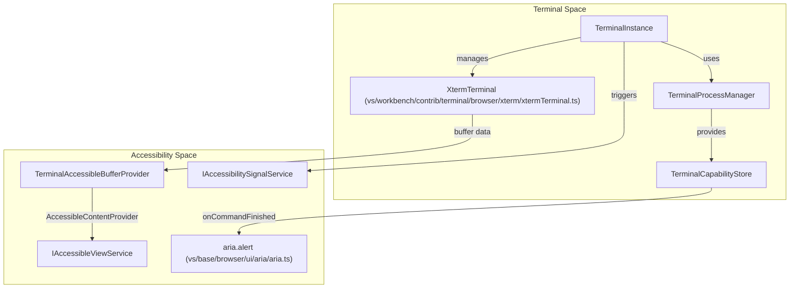
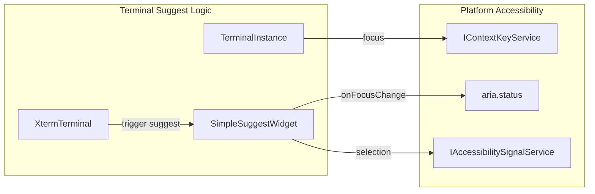

# Accessibility Integrations Across Workbench Features

Relevant source files

The following files were used as context for generating this wiki page:

- [extensions/copilot/test/prompts/settingsEditorSearchResultsSelector.stest.ts](extensions/copilot/test/prompts/settingsEditorSearchResultsSelector.stest.ts)
- [src/vs/base/common/hotReloadHelpers.ts](src/vs/base/common/hotReloadHelpers.ts)
- [src/vs/editor/common/standaloneStrings.ts](src/vs/editor/common/standaloneStrings.ts)
- [src/vs/editor/contrib/placeholderText/browser/placeholderText.contribution.ts](src/vs/editor/contrib/placeholderText/browser/placeholderText.contribution.ts)
- [src/vs/platform/accessibility/browser/accessibleView.ts](src/vs/platform/accessibility/browser/accessibleView.ts)
- [src/vs/platform/accessibilitySignal/browser/accessibilitySignalService.ts](src/vs/platform/accessibilitySignal/browser/accessibilitySignalService.ts)
- [src/vs/platform/accessibilitySignal/browser/media/voiceRecordingStarted.mp3](src/vs/platform/accessibilitySignal/browser/media/voiceRecordingStarted.mp3)
- [src/vs/platform/accessibilitySignal/browser/media/voiceRecordingStopped.mp3](src/vs/platform/accessibilitySignal/browser/media/voiceRecordingStopped.mp3)
- [src/vs/platform/observable/common/wrapInHotClass.ts](src/vs/platform/observable/common/wrapInHotClass.ts)
- [src/vs/platform/observable/common/wrapInReloadableClass.ts](src/vs/platform/observable/common/wrapInReloadableClass.ts)
- [src/vs/platform/terminal/common/terminal.ts](src/vs/platform/terminal/common/terminal.ts)
- [src/vs/platform/terminal/node/ptyHostService.ts](src/vs/platform/terminal/node/ptyHostService.ts)
- [src/vs/platform/terminal/node/ptyService.ts](src/vs/platform/terminal/node/ptyService.ts)
- [src/vs/platform/terminal/node/terminalProcess.ts](src/vs/platform/terminal/node/terminalProcess.ts)
- [src/vs/workbench/api/browser/mainThreadSpeech.ts](src/vs/workbench/api/browser/mainThreadSpeech.ts)
- [src/vs/workbench/api/browser/mainThreadTerminalService.ts](src/vs/workbench/api/browser/mainThreadTerminalService.ts)
- [src/vs/workbench/api/common/extHostSpeech.ts](src/vs/workbench/api/common/extHostSpeech.ts)
- [src/vs/workbench/api/common/extHostTerminalService.ts](src/vs/workbench/api/common/extHostTerminalService.ts)
- [src/vs/workbench/contrib/accessibility/browser/accessibility.contribution.ts](src/vs/workbench/contrib/accessibility/browser/accessibility.contribution.ts)
- [src/vs/workbench/contrib/accessibility/browser/accessibilityConfiguration.ts](src/vs/workbench/contrib/accessibility/browser/accessibilityConfiguration.ts)
- [src/vs/workbench/contrib/accessibility/browser/accessibleView.ts](src/vs/workbench/contrib/accessibility/browser/accessibleView.ts)
- [src/vs/workbench/contrib/accessibility/browser/accessibleViewActions.ts](src/vs/workbench/contrib/accessibility/browser/accessibleViewActions.ts)
- [src/vs/workbench/contrib/accessibility/browser/accessibleViewKeybindingResolver.ts](src/vs/workbench/contrib/accessibility/browser/accessibleViewKeybindingResolver.ts)
- [src/vs/workbench/contrib/accessibility/browser/editorAccessibilityHelp.ts](src/vs/workbench/contrib/accessibility/browser/editorAccessibilityHelp.ts)
- [src/vs/workbench/contrib/accessibility/browser/extensionAccesibilityHelp.contribution.ts](src/vs/workbench/contrib/accessibility/browser/extensionAccesibilityHelp.contribution.ts)
- [src/vs/workbench/contrib/accessibility/common/accessibilityCommands.ts](src/vs/workbench/contrib/accessibility/common/accessibilityCommands.ts)
- [src/vs/workbench/contrib/accessibilitySignals/browser/accessibilitySignal.contribution.ts](src/vs/workbench/contrib/accessibilitySignals/browser/accessibilitySignal.contribution.ts)
- [src/vs/workbench/contrib/accessibilitySignals/browser/accessibilitySignalDebuggerContribution.ts](src/vs/workbench/contrib/accessibilitySignals/browser/accessibilitySignalDebuggerContribution.ts)
- [src/vs/workbench/contrib/accessibilitySignals/browser/commands.ts](src/vs/workbench/contrib/accessibilitySignals/browser/commands.ts)
- [src/vs/workbench/contrib/accessibilitySignals/browser/editorTextPropertySignalsContribution.ts](src/vs/workbench/contrib/accessibilitySignals/browser/editorTextPropertySignalsContribution.ts)
- [src/vs/workbench/contrib/chat/browser/actions/chatAccessibilityHelp.ts](src/vs/workbench/contrib/chat/browser/actions/chatAccessibilityHelp.ts)
- [src/vs/workbench/contrib/chat/browser/widget/chatPetWidget.ts](src/vs/workbench/contrib/chat/browser/widget/chatPetWidget.ts)
- [src/vs/workbench/contrib/chat/browser/widget/media/chatPet.css](src/vs/workbench/contrib/chat/browser/widget/media/chatPet.css)
- [src/vs/workbench/contrib/chat/browser/widget/media/chatPet/buddy-love-insiders-96.png](src/vs/workbench/contrib/chat/browser/widget/media/chatPet/buddy-love-insiders-96.png)
- [src/vs/workbench/contrib/chat/browser/widget/media/chatPet/buddy-love-insiders-96.spritesheet.png](src/vs/workbench/contrib/chat/browser/widget/media/chatPet/buddy-love-insiders-96.spritesheet.png)
- [src/vs/workbench/contrib/chat/browser/widget/media/chatPet/buddy-love-stable-96.png](src/vs/workbench/contrib/chat/browser/widget/media/chatPet/buddy-love-stable-96.png)
- [src/vs/workbench/contrib/chat/browser/widget/media/chatPet/buddy-love-stable-96.spritesheet.png](src/vs/workbench/contrib/chat/browser/widget/media/chatPet/buddy-love-stable-96.spritesheet.png)
- [src/vs/workbench/contrib/chat/browser/widget/media/chatPet/buddy-press-button-insiders-96.png](src/vs/workbench/contrib/chat/browser/widget/media/chatPet/buddy-press-button-insiders-96.png)
- [src/vs/workbench/contrib/chat/browser/widget/media/chatPet/buddy-press-button-insiders-96.spritesheet.png](src/vs/workbench/contrib/chat/browser/widget/media/chatPet/buddy-press-button-insiders-96.spritesheet.png)
- [src/vs/workbench/contrib/chat/browser/widget/media/chatPet/buddy-press-button-stable-96.png](src/vs/workbench/contrib/chat/browser/widget/media/chatPet/buddy-press-button-stable-96.png)
- [src/vs/workbench/contrib/chat/browser/widget/media/chatPet/buddy-press-button-stable-96.spritesheet.png](src/vs/workbench/contrib/chat/browser/widget/media/chatPet/buddy-press-button-stable-96.spritesheet.png)
- [src/vs/workbench/contrib/chat/browser/widget/media/chatPet/buddy-sing-insiders-124.png](src/vs/workbench/contrib/chat/browser/widget/media/chatPet/buddy-sing-insiders-124.png)
- [src/vs/workbench/contrib/chat/browser/widget/media/chatPet/buddy-sing-insiders-124.spritesheet.png](src/vs/workbench/contrib/chat/browser/widget/media/chatPet/buddy-sing-insiders-124.spritesheet.png)
- [src/vs/workbench/contrib/chat/browser/widget/media/chatPet/buddy-sing-stable-124.png](src/vs/workbench/contrib/chat/browser/widget/media/chatPet/buddy-sing-stable-124.png)
- [src/vs/workbench/contrib/chat/browser/widget/media/chatPet/buddy-sing-stable-124.spritesheet.png](src/vs/workbench/contrib/chat/browser/widget/media/chatPet/buddy-sing-stable-124.spritesheet.png)
- [src/vs/workbench/contrib/chat/browser/widget/media/chatPet/buddy-sleep-insiders-96.png](src/vs/workbench/contrib/chat/browser/widget/media/chatPet/buddy-sleep-insiders-96.png)
- [src/vs/workbench/contrib/chat/browser/widget/media/chatPet/buddy-sleep-insiders-96.spritesheet.png](src/vs/workbench/contrib/chat/browser/widget/media/chatPet/buddy-sleep-insiders-96.spritesheet.png)
- [src/vs/workbench/contrib/chat/browser/widget/media/chatPet/buddy-sleep-stable-96.png](src/vs/workbench/contrib/chat/browser/widget/media/chatPet/buddy-sleep-stable-96.png)
- [src/vs/workbench/contrib/chat/browser/widget/media/chatPet/buddy-sleep-stable-96.spritesheet.png](src/vs/workbench/contrib/chat/browser/widget/media/chatPet/buddy-sleep-stable-96.spritesheet.png)
- [src/vs/workbench/contrib/chat/browser/widget/media/chatPet/buddy-speechless-insiders-96.png](src/vs/workbench/contrib/chat/browser/widget/media/chatPet/buddy-speechless-insiders-96.png)
- [src/vs/workbench/contrib/chat/browser/widget/media/chatPet/buddy-waking-insiders-96.png](src/vs/workbench/contrib/chat/browser/widget/media/chatPet/buddy-waking-insiders-96.png)
- [src/vs/workbench/contrib/chat/browser/widget/media/chatPet/buddy-waking-insiders-96.spritesheet.png](src/vs/workbench/contrib/chat/browser/widget/media/chatPet/buddy-waking-insiders-96.spritesheet.png)
- [src/vs/workbench/contrib/chat/browser/widget/media/chatPet/buddy-waking-stable-96.png](src/vs/workbench/contrib/chat/browser/widget/media/chatPet/buddy-waking-stable-96.png)
- [src/vs/workbench/contrib/chat/browser/widget/media/chatPet/buddy-waking-stable-96.spritesheet.png](src/vs/workbench/contrib/chat/browser/widget/media/chatPet/buddy-waking-stable-96.spritesheet.png)
- [src/vs/workbench/contrib/chat/test/browser/accessibility/chatAccessibilityHelp.test.ts](src/vs/workbench/contrib/chat/test/browser/accessibility/chatAccessibilityHelp.test.ts)
- [src/vs/workbench/contrib/chat/test/browser/widget/chatPetWidget.test.ts](src/vs/workbench/contrib/chat/test/browser/widget/chatPetWidget.test.ts)
- [src/vs/workbench/contrib/codeEditor/browser/accessibility/accessibility.css](src/vs/workbench/contrib/codeEditor/browser/accessibility/accessibility.css)
- [src/vs/workbench/contrib/codeEditor/browser/accessibility/accessibility.ts](src/vs/workbench/contrib/codeEditor/browser/accessibility/accessibility.ts)
- [src/vs/workbench/contrib/codeEditor/browser/diffEditorHelper.ts](src/vs/workbench/contrib/codeEditor/browser/diffEditorHelper.ts)
- [src/vs/workbench/contrib/comments/browser/commentsAccessibility.ts](src/vs/workbench/contrib/comments/browser/commentsAccessibility.ts)
- [src/vs/workbench/contrib/comments/common/commentCommandIds.ts](src/vs/workbench/contrib/comments/common/commentCommandIds.ts)
- [src/vs/workbench/contrib/comments/common/commentContextKeys.ts](src/vs/workbench/contrib/comments/common/commentContextKeys.ts)
- [src/vs/workbench/contrib/speech/browser/speechAccessibilitySignal.ts](src/vs/workbench/contrib/speech/browser/speechAccessibilitySignal.ts)
- [src/vs/workbench/contrib/speech/browser/speechService.ts](src/vs/workbench/contrib/speech/browser/speechService.ts)
- [src/vs/workbench/contrib/speech/common/speechService.ts](src/vs/workbench/contrib/speech/common/speechService.ts)
- [src/vs/workbench/contrib/terminal/browser/media/terminal.css](src/vs/workbench/contrib/terminal/browser/media/terminal.css)
- [src/vs/workbench/contrib/terminal/browser/media/xterm.css](src/vs/workbench/contrib/terminal/browser/media/xterm.css)
- [src/vs/workbench/contrib/terminal/browser/remotePty.ts](src/vs/workbench/contrib/terminal/browser/remotePty.ts)
- [src/vs/workbench/contrib/terminal/browser/terminal.contribution.ts](src/vs/workbench/contrib/terminal/browser/terminal.contribution.ts)
- [src/vs/workbench/contrib/terminal/browser/terminal.ts](src/vs/workbench/contrib/terminal/browser/terminal.ts)
- [src/vs/workbench/contrib/terminal/browser/terminalActions.ts](src/vs/workbench/contrib/terminal/browser/terminalActions.ts)
- [src/vs/workbench/contrib/terminal/browser/terminalEditor.ts](src/vs/workbench/contrib/terminal/browser/terminalEditor.ts)
- [src/vs/workbench/contrib/terminal/browser/terminalEditorInput.ts](src/vs/workbench/contrib/terminal/browser/terminalEditorInput.ts)
- [src/vs/workbench/contrib/terminal/browser/terminalEditorService.ts](src/vs/workbench/contrib/terminal/browser/terminalEditorService.ts)
- [src/vs/workbench/contrib/terminal/browser/terminalGroup.ts](src/vs/workbench/contrib/terminal/browser/terminalGroup.ts)
- [src/vs/workbench/contrib/terminal/browser/terminalGroupService.ts](src/vs/workbench/contrib/terminal/browser/terminalGroupService.ts)
- [src/vs/workbench/contrib/terminal/browser/terminalInstance.ts](src/vs/workbench/contrib/terminal/browser/terminalInstance.ts)
- [src/vs/workbench/contrib/terminal/browser/terminalMenus.ts](src/vs/workbench/contrib/terminal/browser/terminalMenus.ts)
- [src/vs/workbench/contrib/terminal/browser/terminalProcessExtHostProxy.ts](src/vs/workbench/contrib/terminal/browser/terminalProcessExtHostProxy.ts)
- [src/vs/workbench/contrib/terminal/browser/terminalProcessManager.ts](src/vs/workbench/contrib/terminal/browser/terminalProcessManager.ts)
- [src/vs/workbench/contrib/terminal/browser/terminalService.ts](src/vs/workbench/contrib/terminal/browser/terminalService.ts)
- [src/vs/workbench/contrib/terminal/browser/terminalTabbedView.ts](src/vs/workbench/contrib/terminal/browser/terminalTabbedView.ts)
- [src/vs/workbench/contrib/terminal/browser/terminalTabsList.ts](src/vs/workbench/contrib/terminal/browser/terminalTabsList.ts)
- [src/vs/workbench/contrib/terminal/browser/terminalView.ts](src/vs/workbench/contrib/terminal/browser/terminalView.ts)
- [src/vs/workbench/contrib/terminal/browser/xterm/decorationAddon.ts](src/vs/workbench/contrib/terminal/browser/xterm/decorationAddon.ts)
- [src/vs/workbench/contrib/terminal/browser/xterm/xtermTerminal.ts](src/vs/workbench/contrib/terminal/browser/xterm/xtermTerminal.ts)
- [src/vs/workbench/contrib/terminal/common/terminal.ts](src/vs/workbench/contrib/terminal/common/terminal.ts)
- [src/vs/workbench/contrib/terminal/common/terminalColorRegistry.ts](src/vs/workbench/contrib/terminal/common/terminalColorRegistry.ts)
- [src/vs/workbench/contrib/terminal/common/terminalConfiguration.ts](src/vs/workbench/contrib/terminal/common/terminalConfiguration.ts)
- [src/vs/workbench/contrib/terminal/common/terminalStrings.ts](src/vs/workbench/contrib/terminal/common/terminalStrings.ts)
- [src/vs/workbench/contrib/terminal/test/browser/terminalInstance.test.ts](src/vs/workbench/contrib/terminal/test/browser/terminalInstance.test.ts)
- [src/vs/workbench/contrib/terminalContrib/accessibility/browser/terminal.accessibility.contribution.ts](src/vs/workbench/contrib/terminalContrib/accessibility/browser/terminal.accessibility.contribution.ts)
- [src/vs/workbench/contrib/terminalContrib/accessibility/browser/terminalAccessibilityHelp.ts](src/vs/workbench/contrib/terminalContrib/accessibility/browser/terminalAccessibilityHelp.ts)
- [src/vs/workbench/contrib/terminalContrib/accessibility/browser/terminalAccessibleBufferProvider.ts](src/vs/workbench/contrib/terminalContrib/accessibility/browser/terminalAccessibleBufferProvider.ts)
- [src/vs/workbench/contrib/terminalContrib/accessibility/browser/textAreaSyncAddon.ts](src/vs/workbench/contrib/terminalContrib/accessibility/browser/textAreaSyncAddon.ts)
- [src/vs/workbench/contrib/terminalContrib/accessibility/common/terminalAccessibilityConfiguration.ts](src/vs/workbench/contrib/terminalContrib/accessibility/common/terminalAccessibilityConfiguration.ts)
- [src/vscode-dts/vscode.proposed.speech.d.ts](src/vscode-dts/vscode.proposed.speech.d.ts)

Accessibility in VS Code is not a bolt-on feature but a deeply integrated set of primitives that major workbench features (Chat, Terminal, Editor) consume to provide a screen-reader-optimized experience. This integration relies on the `IAccessibleViewService`, accessibility signals, and a robust system of context keys and ARIA alerts.

## 1. Core Integration Primitives

The accessibility framework provides a standard set of tools that features implement to surface content to assistive technologies.

### Accessible View and Help
Features integrate with accessibility by implementing `IAccessibleViewImplementation` or providing an `AccessibleContentProvider` [src/vs/platform/accessibility/browser/accessibleView.ts:30-30](). This allows features to show a read-only "Accessible View" buffer or a "Help" dialog containing feature-specific keyboard shortcuts and state information. The `AccessibleView` class itself manages a `CodeEditorWidget` to provide a standard text-navigation experience for non-standard UI surfaces [src/vs/workbench/contrib/accessibility/browser/accessibleView.ts:71-72]().

### Context Keys for State Awareness
The workbench uses a set of dedicated context keys to track the state of accessibility UI, enabling or disabling keybindings dynamically:
* `accessibleViewIsShown`: True when the accessible view is active [src/vs/workbench/contrib/accessibility/browser/accessibilityConfiguration.ts:52-52]().
* `accessibilityHelpIsShown`: True when an accessibility help dialog is visible [src/vs/workbench/contrib/accessibility/browser/accessibilityConfiguration.ts:52-52]().
* `accessibleViewCurrentProviderId`: Identifies which feature (e.g., 'terminal', 'panelChat') is currently providing content [src/vs/workbench/contrib/accessibility/browser/accessibilityConfiguration.ts:52-52]().

### Accessibility Signals
Features trigger audio and visual cues via the `IAccessibilitySignalService` [src/vs/platform/accessibilitySignal/browser/accessibilitySignalService.ts:32-32](). Signals are mapped to specific workbench events, such as when a terminal bell is triggered or a task fails.

**Sources:** [src/vs/workbench/contrib/accessibility/browser/accessibleView.ts:71-112](), [src/vs/workbench/contrib/accessibility/browser/accessibilityConfiguration.ts:52-85](), [src/vs/platform/accessibilitySignal/browser/accessibilitySignalService.ts:29-32]()

---

## 2. Terminal Accessibility Integration

The terminal integrates with accessibility via two primary mechanisms: an **Accessible Buffer** for reviewing history and **Shell Integration Hooks** for real-time navigation and command detection.

### Implementation Architecture
The `TerminalInstance` integrates with the accessibility service to provide an accessible buffer [src/vs/workbench/contrib/terminal/browser/terminalInstance.ts:28-28](). It uses the `TerminalCapabilityStore` to track features like `CommandDetection` which are vital for screen reader navigation [src/vs/workbench/contrib/terminal/browser/terminalInstance.ts:45-46]().

### Data Flow: Buffer to Accessible View
1. **Buffer Tracking**: The terminal maintains a history of output. When the accessible view is requested, the terminal provides a provider that can read from the xterm.js buffer [src/vs/workbench/contrib/terminal/browser/terminalInstance.ts:70-70]().
2. **Accessible Buffer Provider**: Fetches content and formats it for the `AccessibleView`.
3. **Synchronization**: For real-time input, the terminal uses a hidden textarea that is kept in sync with the cursor position to ensure screen readers focus on the active input line.

### Diagram: Terminal Accessibility Data Flow
This diagram shows how terminal entities map to accessibility providers and platform services.

**Sources:** [src/vs/workbench/contrib/terminal/browser/terminalInstance.ts:45-70](), [src/vs/workbench/contrib/terminal/browser/terminalProcessManager.ts:82-83](), [src/vs/platform/terminal/common/terminal.ts:15-15]()

---

## 3. Chat and AI Accessibility

Chat features utilize the `AccessibleView` to handle large markdown responses and provide specialized help for AI interactions.

### Chat Accessibility Help
The workbench provides help providers for different chat locations. These providers generate dynamic help text that includes keybindings for chat-specific actions like dictation or toggling speech-to-text.

### Tool Invocation and ARIA Alerts
When AI agents invoke tools in the terminal (e.g., via `runInTerminalTool`), the system uses ARIA alerts to notify the user of the process status. The `TerminalChatService` enables communication between the chat agents and the terminal UI, ensuring that tool outputs are accessible [src/vs/workbench/contrib/terminal/browser/terminal.ts:46-46]().

**Sources:** [src/vs/workbench/contrib/terminal/browser/terminal.ts:40-46](), [src/vs/workbench/contrib/accessibility/browser/accessibleView.ts:48-49]()

---

## 4. Editor Widget Integrations

Editor widgets (Find, Suggest, Inline Completions) integrate with accessibility through the `AccessibleView` and specific context keys.

### Suggest and Terminal Suggest
The suggest widget provides ARIA updates as users navigate suggestions. In the terminal, this is enhanced by shell integration.
* **Terminal Suggest**: Integrates with the `ITerminalInstance` to provide completions that are announced by screen readers as the user cycles through them.
* **Context Keys**: The workbench tracks `terminalSuggestFocused` and other keys to ensure that keyboard navigation (Up/Down arrows) is correctly routed between the terminal buffer and the suggest widget.

### Diagram: Suggest Widget Accessibility Integration
Mapping the suggest lifecycle to accessibility primitives within the terminal context.

**Sources:** [src/vs/workbench/contrib/terminal/browser/terminalInstance.ts:70-74](), [src/vs/workbench/contrib/terminal/browser/terminalService.ts:73-78](), [src/vs/platform/contextkey/common/contextkey.ts:19-19]()

---

## 5. Configuration and Verbosity

Accessibility behavior is governed by **Verbosity Settings**, which determine how much information is announced for specific features. These are defined in `AccessibilityVerbositySettingId` [src/vs/workbench/contrib/accessibility/browser/accessibilityConfiguration.ts:59-59]().

| Setting ID | Feature Surface | Purpose |
| :--- | :--- | :--- |
| `accessibility.verbosity.terminal` | Integrated Terminal | Announces help on focus [src/vs/workbench/contrib/terminal/browser/terminalInstance.ts:59-59]() |
| `accessibility.verbosity.editor` | Code Editor | Details about line numbers, foldings, etc. [src/vs/workbench/contrib/accessibility/browser/editorAccessibilityHelp.ts:13-13]() |
| `accessibility.verbosity.chat` | Chat Widgets | Explains how to interact with AI responses [src/vs/workbench/contrib/accessibility/browser/accessibleView.ts:52-52]() |

### Data Flow for Verbosity
1. **User Action**: User focuses a widget (e.g., Terminal).
2. **Context Check**: The feature checks if the corresponding `AccessibilityVerbositySettingId` is enabled via the `IConfigurationService` [src/vs/platform/configuration/common/configuration.ts:31-31]().
3. **Announcement**: If enabled, an `aria.alert` or `aria.status` is issued to describe available shortcuts and current state [src/vs/workbench/contrib/accessibility/browser/accessibleView.ts:9-9]().

---

## 6. Key Functions and Classes

### `AccessibleView`
The primary UI component for displaying accessible content. It manages a `CodeEditorWidget` to provide a standard text-navigation experience for non-standard UI surfaces [src/vs/workbench/contrib/accessibility/browser/accessibleView.ts:71-72]().

### `IAccessibleViewService`
The singleton service responsible for showing/hiding the view and managing the stack of content providers [src/vs/platform/accessibility/browser/accessibleView.ts:30-30]().

### `TerminalInstance`
The core terminal class that integrates with `IAccessibilityService` and `IAccessibilitySignalService` to provide audio cues for terminal events like the bell or command completion [src/vs/workbench/contrib/terminal/browser/terminalInstance.ts:28-29]().

### `TerminalService`
Coordinates accessibility across multiple terminal instances, managing context keys like `terminalCount` and `processSupport` which affect how accessibility help is presented [src/vs/workbench/contrib/terminal/browser/terminalService.ts:78-82]().

**Sources:** [src/vs/workbench/contrib/accessibility/browser/accessibleView.ts](), [src/vs/workbench/contrib/terminal/browser/terminalInstance.ts](), [src/vs/workbench/contrib/terminal/browser/terminalService.ts](), [src/vs/workbench/contrib/accessibility/browser/accessibilityConfiguration.ts]()