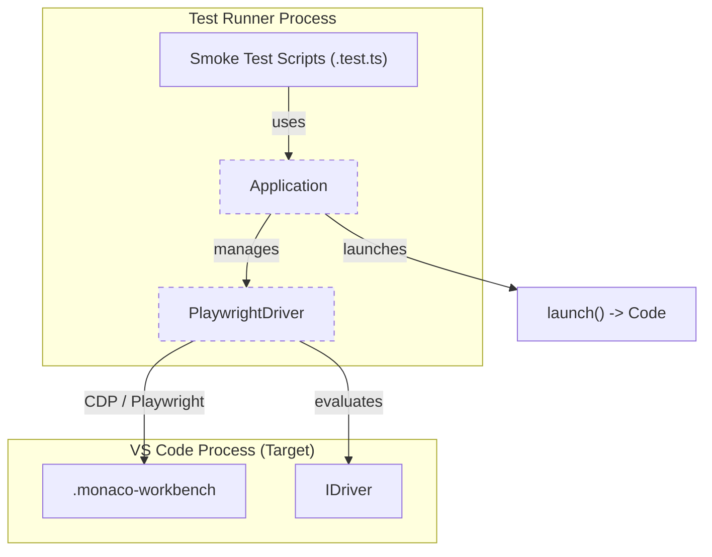
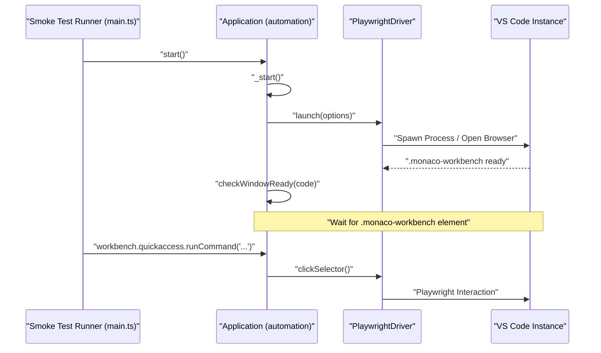

# Testing Infrastructure

Relevant source files

The following files were used as context for generating this wiki page:

- [.github/agents/demonstrate.md](.github/agents/demonstrate.md)
- [.vscode/mcp.json](.vscode/mcp.json)
- [build/package-lock.json](build/package-lock.json)
- [build/package.json](build/package.json)
- [src/typings/editContext.d.ts](src/typings/editContext.d.ts)
- [src/vs/workbench/services/driver/browser/driver.ts](src/vs/workbench/services/driver/browser/driver.ts)
- [test/automation/package-lock.json](test/automation/package-lock.json)
- [test/automation/package.json](test/automation/package.json)
- [test/automation/src/application.ts](test/automation/src/application.ts)
- [test/automation/src/code.ts](test/automation/src/code.ts)
- [test/automation/src/debug.ts](test/automation/src/debug.ts)
- [test/automation/src/editor.ts](test/automation/src/editor.ts)
- [test/automation/src/editors.ts](test/automation/src/editors.ts)
- [test/automation/src/electron.ts](test/automation/src/electron.ts)
- [test/automation/src/extensions.ts](test/automation/src/extensions.ts)
- [test/automation/src/notebook.ts](test/automation/src/notebook.ts)
- [test/automation/src/playwrightBrowser.ts](test/automation/src/playwrightBrowser.ts)
- [test/automation/src/playwrightDriver.ts](test/automation/src/playwrightDriver.ts)
- [test/automation/src/playwrightElectron.ts](test/automation/src/playwrightElectron.ts)
- [test/automation/src/scm.ts](test/automation/src/scm.ts)
- [test/automation/src/search.ts](test/automation/src/search.ts)
- [test/automation/src/settings.ts](test/automation/src/settings.ts)
- [test/integration/browser/package-lock.json](test/integration/browser/package-lock.json)
- [test/integration/browser/package.json](test/integration/browser/package.json)
- [test/mcp/README.md](test/mcp/README.md)
- [test/mcp/package-lock.json](test/mcp/package-lock.json)
- [test/mcp/package.json](test/mcp/package.json)
- [test/mcp/src/application.ts](test/mcp/src/application.ts)
- [test/mcp/src/automation.ts](test/mcp/src/automation.ts)
- [test/mcp/src/automationTools/chat.ts](test/mcp/src/automationTools/chat.ts)
- [test/mcp/src/automationTools/core.ts](test/mcp/src/automationTools/core.ts)
- [test/mcp/src/automationTools/index.ts](test/mcp/src/automationTools/index.ts)
- [test/mcp/src/automationTools/settings.ts](test/mcp/src/automationTools/settings.ts)
- [test/mcp/src/automationTools/windows.ts](test/mcp/src/automationTools/windows.ts)
- [test/mcp/src/evidence.ts](test/mcp/src/evidence.ts)
- [test/mcp/src/options.ts](test/mcp/src/options.ts)
- [test/mcp/src/stdio.ts](test/mcp/src/stdio.ts)
- [test/mcp/src/utils.ts](test/mcp/src/utils.ts)
- [test/smoke/package-lock.json](test/smoke/package-lock.json)
- [test/smoke/package.json](test/smoke/package.json)
- [test/smoke/src/areas/extensions/extensions.test.ts](test/smoke/src/areas/extensions/extensions.test.ts)
- [test/smoke/src/areas/languages/languages.test.ts](test/smoke/src/areas/languages/languages.test.ts)
- [test/smoke/src/areas/multiroot/multiroot.test.ts](test/smoke/src/areas/multiroot/multiroot.test.ts)
- [test/smoke/src/areas/notebook/notebook.test.ts](test/smoke/src/areas/notebook/notebook.test.ts)
- [test/smoke/src/areas/preferences/preferences.test.ts](test/smoke/src/areas/preferences/preferences.test.ts)
- [test/smoke/src/areas/search/search.test.ts](test/smoke/src/areas/search/search.test.ts)
- [test/smoke/src/areas/statusbar/statusbar.test.ts](test/smoke/src/areas/statusbar/statusbar.test.ts)
- [test/smoke/src/areas/workbench/data-loss.test.ts](test/smoke/src/areas/workbench/data-loss.test.ts)
- [test/smoke/src/areas/workbench/launch.test.ts](test/smoke/src/areas/workbench/launch.test.ts)
- [test/smoke/src/areas/workbench/localization.test.ts](test/smoke/src/areas/workbench/localization.test.ts)
- [test/smoke/src/main.ts](test/smoke/src/main.ts)
- [test/smoke/src/utils.ts](test/smoke/src/utils.ts)

The VS Code testing infrastructure is designed to validate the editor across multiple environments (Node.js, Electron, and Web) and across different layers of the architecture. It ranges from low-level unit tests of base utilities to high-level smoke tests that simulate end-user interactions with the full workbench.

## Infrastructure Overview

The testing stack is categorized by the scope of the code under test and the environment in which it executes. 

| Test Type | Scope | Environment | Technology |
| :--- | :--- | :--- | :--- |
| **Unit Tests** | Individual classes/functions | Node.js / Browser / Electron | Mocha |
| **Integration Tests** | Extension API and Workbench services | Full VS Code Instance | Mocha + `vscode-api-tests` |
| **Smoke Tests** | End-to-end user scenarios | Electron / Playwright (Web) | Playwright + Automation Lib |

The automation infrastructure is coordinated through the `test/automation/` directory, which provides a high-level driver for interacting with the VS Code UI [test/automation/src/code.ts:119-149]().

### Component Relationship

The following diagram illustrates how the automation library bridges the gap between test scripts and the running VS Code application.

**Automation Bridge Diagram**

Sources: [test/automation/src/application.ts:23-25](), [test/automation/src/playwrightDriver.ts:47-48](), [test/automation/src/code.ts:97-117](), [src/vs/workbench/services/driver/browser/driver.ts:1-10]()

---

## Unit and Integration Tests

Unit tests focus on the core logic of the platform, while integration tests verify the behavior of the `vscode` API and the interaction between internal workbench services.

- **Environment Support**: Tests are configured to run in different targets, including Node.js for base services and browser environments for UI components.
- **Integration Scripts**: The infrastructure supports running Node.js integration tests and extension host tests using a real VS Code instance via `test-integration.sh` or `test-integration.bat`.
- **vscode-api-tests**: A dedicated extension used to validate the VS Code API contracts by running within the extension host of a test instance.
- **Mocking**: The workbench provides a robust set of mock services to allow testing UI components without spawning a full backend.

For details, see [Unit and Integration Tests](#17.1).

---

## Smoke Tests and Automation

Smoke tests verify that major features (Search, Notebooks, Extensions, Terminal) work correctly from an end-user perspective [test/smoke/src/main.ts:17-38]().

### Automation Library
The `test/automation/` package acts as the "Standard Library" for testing VS Code. It encapsulates complex UI interactions into simple method calls:
- `Workbench`: Provides access to parts like `QuickAccess`, `Editors`, and `SCM` [test/automation/src/application.ts:127-128]().
- `Code`: Manages the lifecycle of the application process and provides the `dispatchKeybinding` utility [test/automation/src/code.ts:176-178]().
- `PlaywrightDriver`: A wrapper around Playwright that handles window switching, screenshots, and accessibility snapshots [test/automation/src/playwrightDriver.ts:109-132]().

### MCP Automation Server
The infrastructure includes a Model Context Protocol (MCP) server integration located in `test/mcp/`. This allows AI agents to interact with the VS Code automation tools via a standardized protocol using the `@modelcontextprotocol/sdk` [test/mcp/package.json:12-12](). This integration allows external models to query workbench state and trigger actions using MCP tools defined in `test/mcp/src/automationTools/`.

### Smoke Test Execution Flow
Smoke tests can target different builds (Stable, Insiders, or Dev) and different platforms (Desktop Electron or Web) [test/smoke/src/main.ts:211-224]().

**Smoke Test Execution Flow**

Sources: [test/smoke/src/main.ts:211-224](), [test/automation/src/application.ts:81-156](), [test/automation/src/playwrightDriver.ts:205-207](), [test/automation/src/code.ts:103-117]()

For details, see [Smoke Tests and Automation](#17.2).

---

## Testing Infrastructure Mapping

The following table maps high-level testing concepts to their respective code entities.

| Code Entity | Role | Path |
| :--- | :--- | :--- |
| `Application` | Main entry point for automation scripts; manages the `Code` and `Workbench` instances. | [test/automation/src/application.ts:23-25]() |
| `Code` | Wrapper for the application process; provides `dispatchKeybinding` and lifecycle management. | [test/automation/src/code.ts:119-149]() |
| `PlaywrightDriver` | Low-level browser/Electron interaction using Playwright; handles window switching and element locators. | [test/automation/src/playwrightDriver.ts:47-48]() |
| `MultiLogger` | Aggregates multiple logging strategies such as `ConsoleLogger` and `FileLogger`. | [test/smoke/src/main.ts:107-123]() |
| `Quality` | Enum defining the build quality being tested (Dev, Insiders, Stable, etc.). | [test/automation/src/application.ts:11-17]() |
| `LaunchOptions` | Configuration interface for spawning the test instance, including `userDataDir` and `extraArgs`. | [test/automation/src/code.ts:17-48]() |

Sources: [test/automation/src/application.ts:23-25](), [test/automation/src/code.ts:119-149](), [test/automation/src/playwrightDriver.ts:47-48](), [test/smoke/src/main.ts:107-123](), [test/automation/src/application.ts:11-17](), [test/automation/src/code.ts:17-48]()