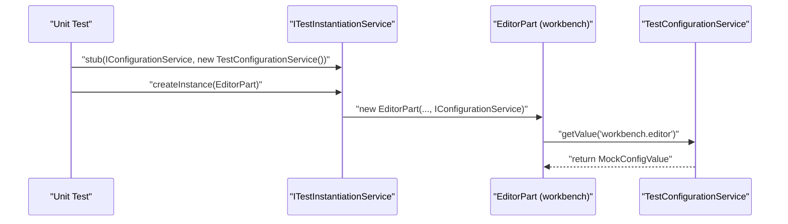
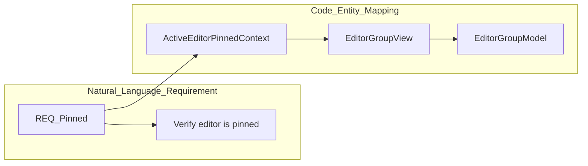

# Unit and Integration Tests

<details>
<summary>Relevant source files</summary>

The following files were used as context for generating this wiki page:

- [.github/agents/demonstrate.md](.github/agents/demonstrate.md)
- [.vscode-test.js](.vscode-test.js)
- [.vscode/launch.json](.vscode/launch.json)
- [.vscode/mcp.json](.vscode/mcp.json)
- [.vscode/tasks.json](.vscode/tasks.json)
- [build/package-lock.json](build/package-lock.json)
- [build/package.json](build/package.json)
- [scripts/test-integration.bat](scripts/test-integration.bat)
- [scripts/test-integration.sh](scripts/test-integration.sh)
- [scripts/test-remote-integration.bat](scripts/test-remote-integration.bat)
- [scripts/test-remote-integration.sh](scripts/test-remote-integration.sh)
- [scripts/test-web-integration.bat](scripts/test-web-integration.bat)
- [scripts/test-web-integration.sh](scripts/test-web-integration.sh)
- [src/vs/platform/editor/common/editor.ts](src/vs/platform/editor/common/editor.ts)
- [src/vs/workbench/browser/actions/layoutActions.ts](src/vs/workbench/browser/actions/layoutActions.ts)
- [src/vs/workbench/browser/actions/windowActions.ts](src/vs/workbench/browser/actions/windowActions.ts)
- [src/vs/workbench/browser/actions/workspaceActions.ts](src/vs/workbench/browser/actions/workspaceActions.ts)
- [src/vs/workbench/browser/actions/workspaceCommands.ts](src/vs/workbench/browser/actions/workspaceCommands.ts)
- [src/vs/workbench/browser/contextkeys.ts](src/vs/workbench/browser/contextkeys.ts)
- [src/vs/workbench/browser/layout.ts](src/vs/workbench/browser/layout.ts)
- [src/vs/workbench/browser/parts/auxiliarybar/auxiliaryBarActions.ts](src/vs/workbench/browser/parts/auxiliarybar/auxiliaryBarActions.ts)
- [src/vs/workbench/browser/parts/editor/auxiliaryEditorPart.ts](src/vs/workbench/browser/parts/editor/auxiliaryEditorPart.ts)
- [src/vs/workbench/browser/parts/editor/editor.contribution.ts](src/vs/workbench/browser/parts/editor/editor.contribution.ts)
- [src/vs/workbench/browser/parts/editor/editor.ts](src/vs/workbench/browser/parts/editor/editor.ts)
- [src/vs/workbench/browser/parts/editor/editorActions.ts](src/vs/workbench/browser/parts/editor/editorActions.ts)
- [src/vs/workbench/browser/parts/editor/editorCommands.ts](src/vs/workbench/browser/parts/editor/editorCommands.ts)
- [src/vs/workbench/browser/parts/editor/editorGroupView.ts](src/vs/workbench/browser/parts/editor/editorGroupView.ts)
- [src/vs/workbench/browser/parts/editor/editorPart.ts](src/vs/workbench/browser/parts/editor/editorPart.ts)
- [src/vs/workbench/browser/parts/editor/editorParts.ts](src/vs/workbench/browser/parts/editor/editorParts.ts)
- [src/vs/workbench/browser/parts/editor/media/modalEditorPart.css](src/vs/workbench/browser/parts/editor/media/modalEditorPart.css)
- [src/vs/workbench/browser/parts/editor/modalEditorPart.ts](src/vs/workbench/browser/parts/editor/modalEditorPart.ts)
- [src/vs/workbench/browser/parts/panel/panelActions.ts](src/vs/workbench/browser/parts/panel/panelActions.ts)
- [src/vs/workbench/browser/workbench.contribution.ts](src/vs/workbench/browser/workbench.contribution.ts)
- [src/vs/workbench/browser/workbench.ts](src/vs/workbench/browser/workbench.ts)
- [src/vs/workbench/common/contextkeys.ts](src/vs/workbench/common/contextkeys.ts)
- [src/vs/workbench/common/editor.ts](src/vs/workbench/common/editor.ts)
- [src/vs/workbench/common/editor/editorGroupModel.ts](src/vs/workbench/common/editor/editorGroupModel.ts)
- [src/vs/workbench/common/editor/filteredEditorGroupModel.ts](src/vs/workbench/common/editor/filteredEditorGroupModel.ts)
- [src/vs/workbench/services/editor/browser/editorService.ts](src/vs/workbench/services/editor/browser/editorService.ts)
- [src/vs/workbench/services/editor/common/editorGroupFinder.ts](src/vs/workbench/services/editor/common/editorGroupFinder.ts)
- [src/vs/workbench/services/editor/common/editorGroupsService.ts](src/vs/workbench/services/editor/common/editorGroupsService.ts)
- [src/vs/workbench/services/editor/common/editorService.ts](src/vs/workbench/services/editor/common/editorService.ts)
- [src/vs/workbench/services/editor/test/browser/editorGroupsService.test.ts](src/vs/workbench/services/editor/test/browser/editorGroupsService.test.ts)
- [src/vs/workbench/services/editor/test/browser/editorService.test.ts](src/vs/workbench/services/editor/test/browser/editorService.test.ts)
- [src/vs/workbench/services/editor/test/browser/modalEditorGroup.test.ts](src/vs/workbench/services/editor/test/browser/modalEditorGroup.test.ts)
- [src/vs/workbench/services/layout/browser/layoutService.ts](src/vs/workbench/services/layout/browser/layoutService.ts)
- [src/vs/workbench/test/browser/parts/editor/editorGroupModel.test.ts](src/vs/workbench/test/browser/parts/editor/editorGroupModel.test.ts)
- [src/vs/workbench/test/browser/parts/editor/filteredEditorGroupModel.test.ts](src/vs/workbench/test/browser/parts/editor/filteredEditorGroupModel.test.ts)
- [src/vs/workbench/test/browser/workbenchTestServices.ts](src/vs/workbench/test/browser/workbenchTestServices.ts)
- [test/automation/package-lock.json](test/automation/package-lock.json)
- [test/automation/package.json](test/automation/package.json)
- [test/automation/src/electron.ts](test/automation/src/electron.ts)
- [test/automation/src/playwrightBrowser.ts](test/automation/src/playwrightBrowser.ts)
- [test/automation/src/playwrightElectron.ts](test/automation/src/playwrightElectron.ts)
- [test/integration/browser/package-lock.json](test/integration/browser/package-lock.json)
- [test/integration/browser/package.json](test/integration/browser/package.json)
- [test/mcp/README.md](test/mcp/README.md)
- [test/mcp/package-lock.json](test/mcp/package-lock.json)
- [test/mcp/package.json](test/mcp/package.json)
- [test/mcp/src/application.ts](test/mcp/src/application.ts)
- [test/mcp/src/automation.ts](test/mcp/src/automation.ts)
- [test/mcp/src/automationTools/chat.ts](test/mcp/src/automationTools/chat.ts)
- [test/mcp/src/automationTools/core.ts](test/mcp/src/automationTools/core.ts)
- [test/mcp/src/automationTools/index.ts](test/mcp/src/automationTools/index.ts)
- [test/mcp/src/automationTools/settings.ts](test/mcp/src/automationTools/settings.ts)
- [test/mcp/src/automationTools/windows.ts](test/mcp/src/automationTools/windows.ts)
- [test/mcp/src/evidence.ts](test/mcp/src/evidence.ts)
- [test/mcp/src/options.ts](test/mcp/src/options.ts)
- [test/mcp/src/stdio.ts](test/mcp/src/stdio.ts)
- [test/mcp/src/utils.ts](test/mcp/src/utils.ts)
- [test/smoke/package-lock.json](test/smoke/package-lock.json)
- [test/smoke/package.json](test/smoke/package.json)

</details>


The VS Code testing infrastructure is divided into several layers to ensure reliability across different environments (Node.js, Electron, and Web). This page details the unit test runner, the integration test scripts, the API testing extension, and the mock infrastructure used to simulate workbench services.

## Unit Test Runner and Environments

VS Code uses a custom test runner capable of executing tests in three distinct environments. The choice of environment depends on the dependencies of the code under test (e.g., whether it requires Electron APIs, DOM access, or standard Node.js modules).

| Environment | Purpose | Entry Point / Logic |
| :--- | :--- | :--- |
| **Node.js** | Core logic, platform-independent utilities, and server-side services. | Uses standard Node.js modules and file system access. |
| **Electron** | Desktop-specific features, native integrations (e.g., menus, windows). | Leverages Electron's native modules and `CodeWindow` infrastructure. |
| **Browser** | Web-based workbench logic, DOM manipulation, and browser-specific services. | Executed within a browser context, utilizing `mainWindow` abstractions [src/vs/workbench/test/browser/workbenchTestServices.ts:9-9](). |

### Multi-Window Testing Support
The testing infrastructure accounts for VS Code's multi-window architecture. Utilities manage window registration and focus tracking, which is critical for tests involving auxiliary windows or floating editors. The `IEditorGroupsService` and `IEditorService` are central to coordinating these states across multiple containers [src/vs/workbench/services/editor/browser/editorService.ts:68-86](), [src/vs/workbench/browser/parts/editor/editorPart.ts:100-126]().

**Title: Environment and Workbench Service Mapping**
```mermaid
graph TD
    subgraph Test_Runner_Entry ["Test_Runner_Entry"]
        TestRunner["TestRunner"] --> [EnvCheck{"Environment?"}]
        EnvCheck["EnvCheck"] -- "Node" --> NodeProcess["NodeProcess"]
        EnvCheck["EnvCheck"] -- "Electron" --> ElectronRenderer["ElectronRenderer"]
        EnvCheck["EnvCheck"] -- "Browser" --> BrowserTab["BrowserTab"]
    end

    subgraph Code_Entity_Space ["Code_Entity_Space"]
        NodeProcess["NodeProcess"] --> BasePlatformMocks["BasePlatformMocks"]
        ElectronRenderer["ElectronRenderer"] --> NativeServiceMocks["NativeServiceMocks"]
        BrowserTab["BrowserTab"] --> workbenchTestServices_ts["workbenchTestServices.ts"]
        workbenchTestServices_ts["workbenchTestServices.ts"] --> TestCodeEditor["TestCodeEditor"]
        workbenchTestServices_ts["workbenchTestServices.ts"] --> TestConfigurationService["TestConfigurationService"]
        workbenchTestServices_ts["workbenchTestServices.ts"] --> TestLanguageConfigurationService["TestLanguageConfigurationService"]
    end
```
**Sources:** [src/vs/workbench/test/browser/workbenchTestServices.ts:48-59](), [src/vs/workbench/test/browser/workbenchTestServices.ts:9-9]()

## Integration Tests

Integration tests verify the interaction between components and the VS Code API. These tests run in a real instance of VS Code to ensure that the Extension Host and the Main Thread communicate correctly via the RPC protocol.

### vscode-api-tests
The `vscode-api-tests` extension is a specialized extension used to exercise the `vscode` namespace API. It is located in `extensions/vscode-api-tests`. Launch configurations are provided for both single-folder and multi-root workspace scenarios [.vscode/launch.json:164-198]().

Key areas covered by API tests:
*   **Editor Tabs**: Validates the state of editor tabs and their visibility.
*   **Workspace**: Tests folder management and workspace configuration.
*   **Colorization**: Performance and correctness tests for tokenization [.vscode/launch.json:202-234]().

### Integration Test Scripts
Automated execution of these tests is handled by scripts that configure the environment and launch the test instance:
*   `test-integration.sh`: Launches the desktop integration tests [scripts/test-integration.sh:1-10]().
*   `test-remote-integration.sh`: Specifically targets remote development scenarios [scripts/test-remote-integration.sh:1-10]().
*   `test-integration.bat`: Windows equivalent for integration testing [scripts/test-integration.bat:1-10]().

**Sources:** [.vscode/launch.json:164-234](), [scripts/test-integration.sh:1-10](), [scripts/test-remote-integration.sh:1-10](), [scripts/test-integration.bat:1-10]()

## Workbench Test Services Mock Infrastructure

Testing the workbench requires mocking complex services like the `IFileService`, `IConfigurationService`, and `IEditorService`. The `workbenchTestServices.ts` file provides a comprehensive set of "Test" versions of these services.

### Key Mock Classes
*   **`TestConfigurationService`**: Implements `IConfigurationService`, allowing tests to programmatically set and change configuration values [src/vs/workbench/test/browser/workbenchTestServices.ts:59-59]().
*   **`TestCodeEditor`**: A lightweight version of the Monaco editor used for unit tests that require an editor instance [src/vs/workbench/test/browser/workbenchTestServices.ts:48-48]().
*   **`InMemoryFileSystemProvider`**: Used with `FileService` to simulate file operations in memory [src/vs/workbench/test/browser/workbenchTestServices.ts:74-74]().
*   **`TestDialogService`**: Mocks user interaction for confirmation and file dialogs [src/vs/workbench/test/browser/workbenchTestServices.ts:67-67]().
*   **`TestEditorWorkerService`**: Provides a mock for background editor tasks [src/vs/workbench/test/browser/workbenchTestServices.ts:50-50]().
*   **`TestLanguageService`**: Handles language registration and associations in tests [src/vs/workbench/test/browser/workbenchTestServices.ts:42-42]().
*   **`TestAccessibilityService`**: Mocks accessibility features during tests [src/vs/workbench/test/browser/workbenchTestServices.ts:53-53]().

### Data Flow in Service Mocks
When a test instantiates a workbench component (e.g., the `EditorPart`), it uses an `InstantiationService` populated with these mocks via `workbenchInstantiationService` [src/vs/workbench/services/editor/test/browser/editorService.test.ts:11-11]().

**Title: Service Injection Flow in Workbench Tests**

**Sources:** [src/vs/workbench/test/browser/workbenchTestServices.ts:43-74](), [src/vs/workbench/services/editor/test/browser/editorService.test.ts:11-11](), [src/vs/workbench/browser/parts/editor/editorPart.ts:100-126]()

## Editor and Layout Testing

The editor subsystem is one of the most complex areas to test due to the `EditorGroupView` and `EditorService` interactions.

### Editor Group Model Testing
Tests validate how editors are opened, closed, and moved within groups. The `EditorGroupView` utilizes the `EditorGroupModel` to track the state of editors (pinned, sticky, active) [src/vs/workbench/browser/parts/editor/editorGroupView.ts:7-12](). Tests verify context keys like `ActiveEditorPinnedContext` or `ActiveEditorStickyContext` are correctly updated during these transitions [src/vs/workbench/browser/parts/editor/editorGroupView.ts:9-9]().

### Editor Service Testing
The `EditorService` is tested for its ability to resolve editor inputs and manage visibility across multiple groups. `EditorService.test.ts` exercises methods like `openEditor`, `getEditors`, and `activeEditorPane` [src/vs/workbench/services/editor/test/browser/editorService.test.ts:73-134](). The service coordinates with `IEditorGroupsContainer` to manage the grid of editors [src/vs/workbench/services/editor/browser/editorService.ts:68-86]().

| Test Target | Code Entity | Key Functionality Tested |
| :--- | :--- | :--- |
| **Editor Groups** | `EditorGroupModel` | Opening, closing, and reordering editors [src/vs/workbench/common/editor/editorGroupModel.ts:7-7](). |
| **Editor Service** | `EditorService` | Resolving editor inputs and managing active editors [src/vs/workbench/services/editor/browser/editorService.ts:39-66](). |
| **Editor Part** | `EditorPart` | Grid-based management of multiple editor groups [src/vs/workbench/browser/parts/editor/editorPart.ts:100-126](). |

### Context Key State in Tests
Testing frequently involves asserting the state of `ContextKey` values that drive UI visibility. For instance, `EditorPartMultipleEditorGroupsContext` is used to verify if the workbench correctly identifies when more than one editor group is open [src/vs/workbench/browser/parts/editor/editorPart.ts:37-37]().

**Title: Context Key Dependency Mapping**


**Sources:** [src/vs/workbench/browser/parts/editor/editorGroupView.ts:9-9](), [src/vs/workbench/services/editor/browser/editorService.ts:39-66](), [src/vs/workbench/browser/parts/editor/editorPart.ts:100-126](), [src/vs/workbench/services/editor/test/browser/editorService.test.ts:73-134]()