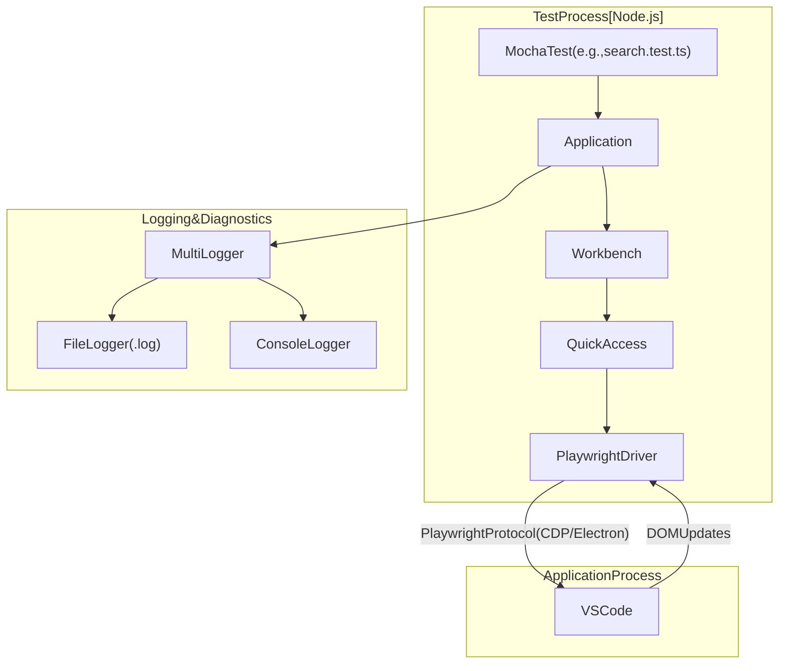
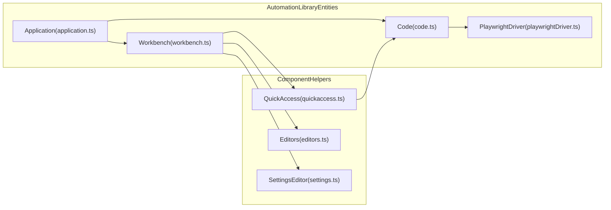
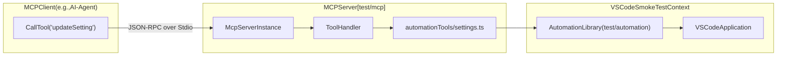

# Smoke Tests and Automation

Relevant source files

The following files were used as context for generating this wiki page:

- [.github/agents/demonstrate.md](.github/agents/demonstrate.md)
- [.vscode/mcp.json](.vscode/mcp.json)
- [build/package-lock.json](build/package-lock.json)
- [build/package.json](build/package.json)
- [src/typings/editContext.d.ts](src/typings/editContext.d.ts)
- [src/vs/workbench/services/driver/browser/driver.ts](src/vs/workbench/services/driver/browser/driver.ts)
- [test/automation/package-lock.json](test/automation/package-lock.json)
- [test/automation/package.json](test/automation/package.json)
- [test/automation/src/application.ts](test/automation/src/application.ts)
- [test/automation/src/code.ts](test/automation/src/code.ts)
- [test/automation/src/debug.ts](test/automation/src/debug.ts)
- [test/automation/src/editor.ts](test/automation/src/editor.ts)
- [test/automation/src/editors.ts](test/automation/src/editors.ts)
- [test/automation/src/electron.ts](test/automation/src/electron.ts)
- [test/automation/src/extensions.ts](test/automation/src/extensions.ts)
- [test/automation/src/notebook.ts](test/automation/src/notebook.ts)
- [test/automation/src/playwrightBrowser.ts](test/automation/src/playwrightBrowser.ts)
- [test/automation/src/playwrightDriver.ts](test/automation/src/playwrightDriver.ts)
- [test/automation/src/playwrightElectron.ts](test/automation/src/playwrightElectron.ts)
- [test/automation/src/scm.ts](test/automation/src/scm.ts)
- [test/automation/src/search.ts](test/automation/src/search.ts)
- [test/automation/src/settings.ts](test/automation/src/settings.ts)
- [test/integration/browser/package-lock.json](test/integration/browser/package-lock.json)
- [test/integration/browser/package.json](test/integration/browser/package.json)
- [test/mcp/README.md](test/mcp/README.md)
- [test/mcp/package-lock.json](test/mcp/package-lock.json)
- [test/mcp/package.json](test/mcp/package.json)
- [test/mcp/src/application.ts](test/mcp/src/application.ts)
- [test/mcp/src/automation.ts](test/mcp/src/automation.ts)
- [test/mcp/src/automationTools/chat.ts](test/mcp/src/automationTools/chat.ts)
- [test/mcp/src/automationTools/core.ts](test/mcp/src/automationTools/core.ts)
- [test/mcp/src/automationTools/index.ts](test/mcp/src/automationTools/index.ts)
- [test/mcp/src/automationTools/settings.ts](test/mcp/src/automationTools/settings.ts)
- [test/mcp/src/automationTools/windows.ts](test/mcp/src/automationTools/windows.ts)
- [test/mcp/src/evidence.ts](test/mcp/src/evidence.ts)
- [test/mcp/src/options.ts](test/mcp/src/options.ts)
- [test/mcp/src/stdio.ts](test/mcp/src/stdio.ts)
- [test/mcp/src/utils.ts](test/mcp/src/utils.ts)
- [test/smoke/package-lock.json](test/smoke/package-lock.json)
- [test/smoke/package.json](test/smoke/package.json)
- [test/smoke/src/areas/extensions/extensions.test.ts](test/smoke/src/areas/extensions/extensions.test.ts)
- [test/smoke/src/areas/languages/languages.test.ts](test/smoke/src/areas/languages/languages.test.ts)
- [test/smoke/src/areas/multiroot/multiroot.test.ts](test/smoke/src/areas/multiroot/multiroot.test.ts)
- [test/smoke/src/areas/notebook/notebook.test.ts](test/smoke/src/areas/notebook/notebook.test.ts)
- [test/smoke/src/areas/preferences/preferences.test.ts](test/smoke/src/areas/preferences/preferences.test.ts)
- [test/smoke/src/areas/search/search.test.ts](test/smoke/src/areas/search/search.test.ts)
- [test/smoke/src/areas/statusbar/statusbar.test.ts](test/smoke/src/areas/statusbar/statusbar.test.ts)
- [test/smoke/src/areas/workbench/data-loss.test.ts](test/smoke/src/areas/workbench/data-loss.test.ts)
- [test/smoke/src/areas/workbench/launch.test.ts](test/smoke/src/areas/workbench/launch.test.ts)
- [test/smoke/src/areas/workbench/localization.test.ts](test/smoke/src/areas/workbench/localization.test.ts)
- [test/smoke/src/main.ts](test/smoke/src/main.ts)
- [test/smoke/src/utils.ts](test/smoke/src/utils.ts)

The VS Code smoke test suite provides high-level end-to-end (E2E) validation of the editor's core functionality across different platforms: Desktop (Electron), Remote, and Web. It utilizes a custom automation library built on top of **Playwright** to interact with the workbench UI, simulating user actions like opening files, typing, and executing commands.

## Architecture Overview

The testing infrastructure is split into three distinct layers:
1.  **Smoke Tests (`test/smoke/`)**: The test specifications (Mocha) organized by functional "areas" (e.g., Search, Notebooks, Extensions) [test/smoke/src/main.ts:17-36]().
2.  **Automation Library (`test/automation/`)**: A domain-specific wrapper around Playwright that provides high-level abstractions for workbench components (e.g., `QuickAccess`, `Editors`, `SettingsEditor`) [test/automation/src/application.ts:6-9]().
3.  **Driver Layer**: The low-level bridge between the automation library and the running VS Code instance, primarily implemented in `PlaywrightDriver` [test/automation/src/playwrightDriver.ts:47-74]().

### System Data Flow

The following diagram illustrates how a smoke test interacts with the VS Code application through the automation layers.

**Test Execution Flow**

Sources: [test/smoke/src/main.ts:104-121](), [test/automation/src/application.ts:23-34](), [test/automation/src/playwrightDriver.ts:47-74]()

---

## Automation Library (`test/automation/`)

The automation library provides the `Application` class, which acts as the primary entry point for controlling a VS Code instance.

### The `Application` and `Code` Classes
-   **`Application`**: Manages the lifecycle of the VS Code instance, including starting, stopping, and restarting the application [test/automation/src/application.ts:77-86](). It holds references to the `Workbench` and `Profiler` [test/automation/src/application.ts:123-124]().
-   **`Code`**: A proxy around the `PlaywrightDriver`. It intercepts calls to log actions and provides methods for global interactions like `dispatchKeybinding` [test/automation/src/code.ts:119-149]().

### Playwright Integration
The `PlaywrightDriver` wraps Playwright's `Page` and `BrowserContext` objects. It provides helper methods for common UI automation tasks:
-   **Window Management**: `switchToWindow(indexOrUrl)` allows tests to navigate between the main workbench and auxiliary windows [test/automation/src/playwrightDriver.ts:109-132]().
-   **Interaction**: Methods like `clickSelector`, `typeText`, and `evaluateExpression` abstract the underlying Playwright locator logic [test/automation/src/playwrightDriver.ts:168-194]().
-   **Accessibility**: Integration with `axe-core` via `getAccessibilitySnapshot` allows for automated accessibility audits during smoke tests [test/automation/src/playwrightDriver.ts:18-25](), [test/automation/src/playwrightDriver.ts:198-200]().

**Automation Entity Mapping**

Sources: [test/automation/src/application.ts:123-124](), [test/automation/src/code.ts:121-131](), [test/automation/src/quickaccess.ts:17-19]()

---

## Smoke Test Suites (`test/smoke/`)

Smoke tests are written using Mocha and are categorized into "areas." Each area represents a major feature of VS Code.

### Test Areas and Setup
The main entry point `test/smoke/src/main.ts` parses CLI arguments to determine the environment (web, remote, or electron) and initializes the logger [test/smoke/src/main.ts:39-122]().

Key test areas include:
-   **Search**: Validates both the Search Viewlet and Quick Open (fuzzy matching) [test/smoke/src/areas/search/search.test.ts:36-42]().
-   **Preferences**: Tests settings modification via the UI and `settings.json` [test/smoke/src/areas/preferences/preferences.test.ts:15-23]().
-   **Notebooks**: Validates cell insertion, editing, and focus management [test/smoke/src/areas/notebook/notebook.test.ts:48-55]().
-   **Localization**: Verifies language pack installation and UI translation [test/smoke/src/areas/workbench/localization.test.ts:20-40]().
-   **Copilot/Chat**: Includes specialized setups for testing AI features like `copilotCli`, `chatSandbox`, and `chatSessions` [test/smoke/src/main.ts:31-34]().

### Common Utilities
The `installAllHandlers` utility is used in nearly every test suite to manage standard `before` and `after` hooks, ensuring the application is cleaned up between tests [test/smoke/src/areas/search/search.test.ts:14-15](). It also manages tracing for failed tests [test/smoke/src/utils.ts:67-71]().

---

## Component Fixture System

The automation library uses a "Part" or "Helper" pattern to interact with specific workbench components. These helpers use CSS selectors to find elements and interact with them.

### Example: QuickAccess Helper
The `QuickAccess` class encapsulates the logic for opening the Command Palette or File Picker [test/automation/src/quickaccess.ts:17]().

| Method | Description | Implementation Detail |
| :--- | :--- | :--- |
| `runCommand` | Executes a VS Code command via the Command Palette | Types `>${commandId}` and waits for the best choice [test/automation/src/quickaccess.ts:182-191]() |
| `openFile` | Opens a file by its absolute path | Uses `cmd+p` / `ctrl+p` and waits for the specific basename [test/automation/src/quickaccess.ts:119-138]() |
| `openQuickAccessWithRetry` | Robustly opens the quick input widget | Handles cases where focus is stolen by retrying the keybinding [test/automation/src/quickaccess.ts:140-174]() |

### Example: Extensions Helper
The `Extensions` class handles Marketplace interactions [test/automation/src/extensions.ts:15]().
-   **`installExtension(id)`**: Searches for an extension ID and clicks the "Install" button, retrying up to 3 times if the installation fails [test/automation/src/extensions.ts:52-68]().
-   **`searchForExtension(id)`**: Uses the `@id:` prefix in the extensions view search box to find a specific extension [test/automation/src/extensions.ts:21-23]().

---

## Model Context Protocol (MCP) Automation Server

The `test/mcp/` directory contains a specialized automation server based on the **Model Context Protocol (MCP)**. This allows AI agents or external tools to interact with the VS Code automation library via a standardized JSON-RPC interface.

### MCP Server Implementation
The server is built using the `@modelcontextprotocol/sdk` [test/mcp/package.json:12](). It exposes VS Code automation capabilities as "tools" that can be called by an MCP client.

- **Automation Tools**: It maps MCP tool calls to functions in the automation library, such as changing settings via `automationTools/settings.ts`.
- **Transport**: It primarily uses `StdioServerTransport` for communication with the host process.

**MCP Automation Data Flow**

Sources:
- `test/smoke/src/main.ts:17-36`
- `test/automation/src/application.ts:6-9, 23-34, 77-86, 123-124`
- `test/automation/src/code.ts:119-149`
- `test/automation/src/playwrightDriver.ts:18-25, 47-74, 109-132, 168-200`
- `test/automation/src/quickaccess.ts:17, 119-138, 140-174, 182-191`
- `test/automation/src/extensions.ts:15, 21-23, 52-68`
- `test/smoke/src/utils.ts:67-71`
- `test/smoke/src/areas/search/search.test.ts:14-15, 36-42`
- `test/smoke/src/areas/notebook/notebook.test.ts:48-55`
- `test/smoke/src/areas/preferences/preferences.test.ts:15-23`
- `test/mcp/package.json:12`