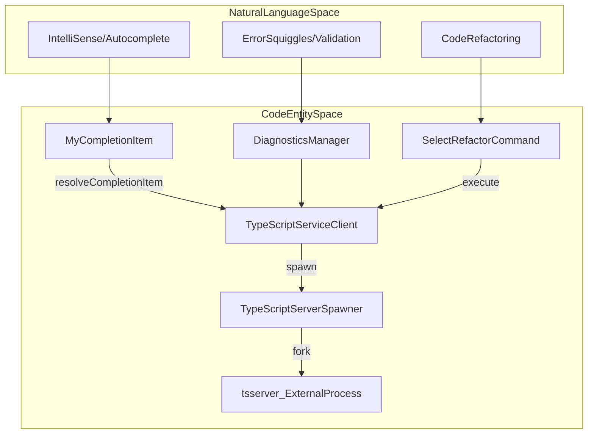
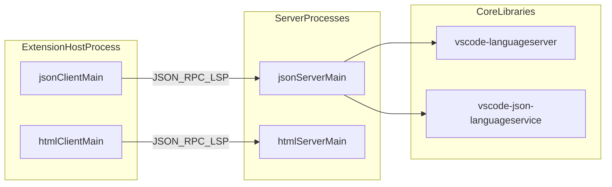

# Built-in Language Extensions

Relevant source files

The following files were used as context for generating this wiki page:

- [AGENTS.md](https://github.com/microsoft/vscode/blob/HEAD/AGENTS.md)
- [extensions/esbuild-common.mts](https://github.com/microsoft/vscode/blob/HEAD/extensions/esbuild-common.mts)
- [extensions/github-authentication/package.json](https://github.com/microsoft/vscode/blob/HEAD/extensions/github-authentication/package.json)
- [extensions/markdown-language-features/CONTRIBUTING.md](https://github.com/microsoft/vscode/blob/HEAD/extensions/markdown-language-features/CONTRIBUTING.md)
- [extensions/markdown-language-features/esbuild.browser.mts](https://github.com/microsoft/vscode/blob/HEAD/extensions/markdown-language-features/esbuild.browser.mts)
- [extensions/markdown-language-features/esbuild.markdownEditor.mts](https://github.com/microsoft/vscode/blob/HEAD/extensions/markdown-language-features/esbuild.markdownEditor.mts)
- [extensions/markdown-language-features/esbuild.mts](https://github.com/microsoft/vscode/blob/HEAD/extensions/markdown-language-features/esbuild.mts)
- [extensions/markdown-language-features/markdown-editor-src/editor.ts](https://github.com/microsoft/vscode/blob/HEAD/extensions/markdown-language-features/markdown-editor-src/editor.ts)
- [extensions/markdown-language-features/markdown-editor-src/syntaxHighlighter.ts](https://github.com/microsoft/vscode/blob/HEAD/extensions/markdown-language-features/markdown-editor-src/syntaxHighlighter.ts)
- [extensions/markdown-language-features/markdown-editor-src/tsconfig.json](https://github.com/microsoft/vscode/blob/HEAD/extensions/markdown-language-features/markdown-editor-src/tsconfig.json)
- [extensions/markdown-language-features/package-lock.json](https://github.com/microsoft/vscode/blob/HEAD/extensions/markdown-language-features/package-lock.json)
- [extensions/markdown-language-features/package.json](https://github.com/microsoft/vscode/blob/HEAD/extensions/markdown-language-features/package.json)
- [extensions/markdown-language-features/package.nls.json](https://github.com/microsoft/vscode/blob/HEAD/extensions/markdown-language-features/package.nls.json)
- [extensions/markdown-language-features/scripts/updateMarkdownEditorPackageJson.mts](https://github.com/microsoft/vscode/blob/HEAD/extensions/markdown-language-features/scripts/updateMarkdownEditorPackageJson.mts)
- [extensions/markdown-language-features/scripts/updateMarkdownEditorPackageJson.test.mts](https://github.com/microsoft/vscode/blob/HEAD/extensions/markdown-language-features/scripts/updateMarkdownEditorPackageJson.test.mts)
- [extensions/markdown-language-features/src/commands/insertResource.ts](https://github.com/microsoft/vscode/blob/HEAD/extensions/markdown-language-features/src/commands/insertResource.ts)
- [extensions/markdown-language-features/src/extension.shared.ts](https://github.com/microsoft/vscode/blob/HEAD/extensions/markdown-language-features/src/extension.shared.ts)
- [extensions/markdown-language-features/src/extension.ts](https://github.com/microsoft/vscode/blob/HEAD/extensions/markdown-language-features/src/extension.ts)
- [extensions/markdown-language-features/src/languageFeatures/copyFiles/copyFiles.ts](https://github.com/microsoft/vscode/blob/HEAD/extensions/markdown-language-features/src/languageFeatures/copyFiles/copyFiles.ts)
- [extensions/markdown-language-features/src/languageFeatures/copyFiles/dropOrPasteResource.ts](https://github.com/microsoft/vscode/blob/HEAD/extensions/markdown-language-features/src/languageFeatures/copyFiles/dropOrPasteResource.ts)
- [extensions/markdown-language-features/src/languageFeatures/copyFiles/pasteUrlProvider.ts](https://github.com/microsoft/vscode/blob/HEAD/extensions/markdown-language-features/src/languageFeatures/copyFiles/pasteUrlProvider.ts)
- [extensions/markdown-language-features/src/languageFeatures/copyFiles/shared.ts](https://github.com/microsoft/vscode/blob/HEAD/extensions/markdown-language-features/src/languageFeatures/copyFiles/shared.ts)
- [extensions/markdown-language-features/src/languageFeatures/diagnostics.ts](https://github.com/microsoft/vscode/blob/HEAD/extensions/markdown-language-features/src/languageFeatures/diagnostics.ts)
- [extensions/markdown-language-features/src/preview/markdownEditorProvider.ts](https://github.com/microsoft/vscode/blob/HEAD/extensions/markdown-language-features/src/preview/markdownEditorProvider.ts)
- [extensions/markdown-language-features/src/test/copyFile.test.ts](https://github.com/microsoft/vscode/blob/HEAD/extensions/markdown-language-features/src/test/copyFile.test.ts)
- [extensions/markdown-language-features/src/test/pasteUrl.test.ts](https://github.com/microsoft/vscode/blob/HEAD/extensions/markdown-language-features/src/test/pasteUrl.test.ts)
- [extensions/markdown-language-features/src/util/document.ts](https://github.com/microsoft/vscode/blob/HEAD/extensions/markdown-language-features/src/util/document.ts)
- [extensions/markdown-language-features/src/util/mimes.ts](https://github.com/microsoft/vscode/blob/HEAD/extensions/markdown-language-features/src/util/mimes.ts)
- [extensions/microsoft-authentication/package.json](https://github.com/microsoft/vscode/blob/HEAD/extensions/microsoft-authentication/package.json)
- [extensions/package-lock.json](https://github.com/microsoft/vscode/blob/HEAD/extensions/package-lock.json)
- [extensions/package.json](https://github.com/microsoft/vscode/blob/HEAD/extensions/package.json)
- [extensions/simple-browser/package.json](https://github.com/microsoft/vscode/blob/HEAD/extensions/simple-browser/package.json)
- [extensions/typescript-language-features/media/icon.png](https://github.com/microsoft/vscode/blob/HEAD/extensions/typescript-language-features/media/icon.png)
- [extensions/typescript-language-features/package.json](https://github.com/microsoft/vscode/blob/HEAD/extensions/typescript-language-features/package.json)
- [extensions/typescript-language-features/package.nls.json](https://github.com/microsoft/vscode/blob/HEAD/extensions/typescript-language-features/package.nls.json)
- [extensions/typescript-language-features/resources/walkthroughs/create-a-js-file.svg](https://github.com/microsoft/vscode/blob/HEAD/extensions/typescript-language-features/resources/walkthroughs/create-a-js-file.svg)
- [extensions/typescript-language-features/resources/walkthroughs/debug-and-run.svg](https://github.com/microsoft/vscode/blob/HEAD/extensions/typescript-language-features/resources/walkthroughs/debug-and-run.svg)
- [extensions/typescript-language-features/resources/walkthroughs/install-node-js.svg](https://github.com/microsoft/vscode/blob/HEAD/extensions/typescript-language-features/resources/walkthroughs/install-node-js.svg)
- [extensions/typescript-language-features/resources/walkthroughs/learn-more.svg](https://github.com/microsoft/vscode/blob/HEAD/extensions/typescript-language-features/resources/walkthroughs/learn-more.svg)
- [extensions/typescript-language-features/src/commands/commandManager.ts](https://github.com/microsoft/vscode/blob/HEAD/extensions/typescript-language-features/src/commands/commandManager.ts)
- [extensions/typescript-language-features/src/commands/configurePlugin.ts](https://github.com/microsoft/vscode/blob/HEAD/extensions/typescript-language-features/src/commands/configurePlugin.ts)
- [extensions/typescript-language-features/src/commands/index.ts](https://github.com/microsoft/vscode/blob/HEAD/extensions/typescript-language-features/src/commands/index.ts)
- [extensions/typescript-language-features/src/commands/tsserverRequests.ts](https://github.com/microsoft/vscode/blob/HEAD/extensions/typescript-language-features/src/commands/tsserverRequests.ts)
- [extensions/typescript-language-features/src/commands/useTsgo.ts](https://github.com/microsoft/vscode/blob/HEAD/extensions/typescript-language-features/src/commands/useTsgo.ts)
- [extensions/typescript-language-features/src/configuration/configuration.electron.ts](https://github.com/microsoft/vscode/blob/HEAD/extensions/typescript-language-features/src/configuration/configuration.electron.ts)
- [extensions/typescript-language-features/src/configuration/configuration.ts](https://github.com/microsoft/vscode/blob/HEAD/extensions/typescript-language-features/src/configuration/configuration.ts)
- [extensions/typescript-language-features/src/configuration/fileSchemes.ts](https://github.com/microsoft/vscode/blob/HEAD/extensions/typescript-language-features/src/configuration/fileSchemes.ts)
- [extensions/typescript-language-features/src/experimentTelemetryReporter.ts](https://github.com/microsoft/vscode/blob/HEAD/extensions/typescript-language-features/src/experimentTelemetryReporter.ts)
- [extensions/typescript-language-features/src/experimentationService.ts](https://github.com/microsoft/vscode/blob/HEAD/extensions/typescript-language-features/src/experimentationService.ts)
- [extensions/typescript-language-features/src/extension.browser.ts](https://github.com/microsoft/vscode/blob/HEAD/extensions/typescript-language-features/src/extension.browser.ts)
- [extensions/typescript-language-features/src/extension.ts](https://github.com/microsoft/vscode/blob/HEAD/extensions/typescript-language-features/src/extension.ts)
- [extensions/typescript-language-features/src/languageFeatures/callHierarchy.ts](https://github.com/microsoft/vscode/blob/HEAD/extensions/typescript-language-features/src/languageFeatures/callHierarchy.ts)
- [extensions/typescript-language-features/src/languageFeatures/completions.ts](https://github.com/microsoft/vscode/blob/HEAD/extensions/typescript-language-features/src/languageFeatures/completions.ts)
- [extensions/typescript-language-features/src/languageFeatures/copyPaste.ts](https://github.com/microsoft/vscode/blob/HEAD/extensions/typescript-language-features/src/languageFeatures/copyPaste.ts)
- [extensions/typescript-language-features/src/languageFeatures/definitionProviderBase.ts](https://github.com/microsoft/vscode/blob/HEAD/extensions/typescript-language-features/src/languageFeatures/definitionProviderBase.ts)
- [extensions/typescript-language-features/src/languageFeatures/definitions.ts](https://github.com/microsoft/vscode/blob/HEAD/extensions/typescript-language-features/src/languageFeatures/definitions.ts)
- [extensions/typescript-language-features/src/languageFeatures/diagnostics.ts](https://github.com/microsoft/vscode/blob/HEAD/extensions/typescript-language-features/src/languageFeatures/diagnostics.ts)
- [extensions/typescript-language-features/src/languageFeatures/documentSymbol.ts](https://github.com/microsoft/vscode/blob/HEAD/extensions/typescript-language-features/src/languageFeatures/documentSymbol.ts)
- [extensions/typescript-language-features/src/languageFeatures/fileConfigurationManager.ts](https://github.com/microsoft/vscode/blob/HEAD/extensions/typescript-language-features/src/languageFeatures/fileConfigurationManager.ts)
- [extensions/typescript-language-features/src/languageFeatures/folding.ts](https://github.com/microsoft/vscode/blob/HEAD/extensions/typescript-language-features/src/languageFeatures/folding.ts)
- [extensions/typescript-language-features/src/languageFeatures/hover.ts](https://github.com/microsoft/vscode/blob/HEAD/extensions/typescript-language-features/src/languageFeatures/hover.ts)
- [extensions/typescript-language-features/src/languageFeatures/inlayHints.ts](https://github.com/microsoft/vscode/blob/HEAD/extensions/typescript-language-features/src/languageFeatures/inlayHints.ts)
- [extensions/typescript-language-features/src/languageFeatures/organizeImports.ts](https://github.com/microsoft/vscode/blob/HEAD/extensions/typescript-language-features/src/languageFeatures/organizeImports.ts)
- [extensions/typescript-language-features/src/languageFeatures/quickFix.ts](https://github.com/microsoft/vscode/blob/HEAD/extensions/typescript-language-features/src/languageFeatures/quickFix.ts)
- [extensions/typescript-language-features/src/languageFeatures/refactor.ts](https://github.com/microsoft/vscode/blob/HEAD/extensions/typescript-language-features/src/languageFeatures/refactor.ts)
- [extensions/typescript-language-features/src/languageFeatures/signatureHelp.ts](https://github.com/microsoft/vscode/blob/HEAD/extensions/typescript-language-features/src/languageFeatures/signatureHelp.ts)
- [extensions/typescript-language-features/src/languageFeatures/signatureHelpState.ts](https://github.com/microsoft/vscode/blob/HEAD/extensions/typescript-language-features/src/languageFeatures/signatureHelpState.ts)
- [extensions/typescript-language-features/src/languageFeatures/util/codeAction.ts](https://github.com/microsoft/vscode/blob/HEAD/extensions/typescript-language-features/src/languageFeatures/util/codeAction.ts)
- [extensions/typescript-language-features/src/languageFeatures/util/copilot.ts](https://github.com/microsoft/vscode/blob/HEAD/extensions/typescript-language-features/src/languageFeatures/util/copilot.ts)
- [extensions/typescript-language-features/src/languageFeatures/util/dependentRegistration.ts](https://github.com/microsoft/vscode/blob/HEAD/extensions/typescript-language-features/src/languageFeatures/util/dependentRegistration.ts)
- [extensions/typescript-language-features/src/languageFeatures/workspaceSymbols.ts](https://github.com/microsoft/vscode/blob/HEAD/extensions/typescript-language-features/src/languageFeatures/workspaceSymbols.ts)
- [extensions/typescript-language-features/src/languageProvider.ts](https://github.com/microsoft/vscode/blob/HEAD/extensions/typescript-language-features/src/languageProvider.ts)
- [extensions/typescript-language-features/src/lazyClientHost.ts](https://github.com/microsoft/vscode/blob/HEAD/extensions/typescript-language-features/src/lazyClientHost.ts)
- [extensions/typescript-language-features/src/logging/logger.ts](https://github.com/microsoft/vscode/blob/HEAD/extensions/typescript-language-features/src/logging/logger.ts)
- [extensions/typescript-language-features/src/logging/telemetry.ts](https://github.com/microsoft/vscode/blob/HEAD/extensions/typescript-language-features/src/logging/telemetry.ts)
- [extensions/typescript-language-features/src/logging/tracer.ts](https://github.com/microsoft/vscode/blob/HEAD/extensions/typescript-language-features/src/logging/tracer.ts)
- [extensions/typescript-language-features/src/test/unit/server.test.ts](https://github.com/microsoft/vscode/blob/HEAD/extensions/typescript-language-features/src/test/unit/server.test.ts)
- [extensions/typescript-language-features/src/test/unit/signatureHelp.test.ts](https://github.com/microsoft/vscode/blob/HEAD/extensions/typescript-language-features/src/test/unit/signatureHelp.test.ts)
- [extensions/typescript-language-features/src/tsServer/api.ts](https://github.com/microsoft/vscode/blob/HEAD/extensions/typescript-language-features/src/tsServer/api.ts)
- [extensions/typescript-language-features/src/tsServer/bufferSyncSupport.ts](https://github.com/microsoft/vscode/blob/HEAD/extensions/typescript-language-features/src/tsServer/bufferSyncSupport.ts)
- [extensions/typescript-language-features/src/tsServer/callbackMap.ts](https://github.com/microsoft/vscode/blob/HEAD/extensions/typescript-language-features/src/tsServer/callbackMap.ts)
- [extensions/typescript-language-features/src/tsServer/plugins.ts](https://github.com/microsoft/vscode/blob/HEAD/extensions/typescript-language-features/src/tsServer/plugins.ts)
- [extensions/typescript-language-features/src/tsServer/protocol/fixNames.ts](https://github.com/microsoft/vscode/blob/HEAD/extensions/typescript-language-features/src/tsServer/protocol/fixNames.ts)
- [extensions/typescript-language-features/src/tsServer/protocol/protocol.const.ts](https://github.com/microsoft/vscode/blob/HEAD/extensions/typescript-language-features/src/tsServer/protocol/protocol.const.ts)
- [extensions/typescript-language-features/src/tsServer/protocol/protocol.d.ts](https://github.com/microsoft/vscode/blob/HEAD/extensions/typescript-language-features/src/tsServer/protocol/protocol.d.ts)
- [extensions/typescript-language-features/src/tsServer/requestQueue.ts](https://github.com/microsoft/vscode/blob/HEAD/extensions/typescript-language-features/src/tsServer/requestQueue.ts)
- [extensions/typescript-language-features/src/tsServer/server.ts](https://github.com/microsoft/vscode/blob/HEAD/extensions/typescript-language-features/src/tsServer/server.ts)
- [extensions/typescript-language-features/src/tsServer/serverProcess.browser.ts](https://github.com/microsoft/vscode/blob/HEAD/extensions/typescript-language-features/src/tsServer/serverProcess.browser.ts)
- [extensions/typescript-language-features/src/tsServer/serverProcess.electron.ts](https://github.com/microsoft/vscode/blob/HEAD/extensions/typescript-language-features/src/tsServer/serverProcess.electron.ts)
- [extensions/typescript-language-features/src/tsServer/spawner.ts](https://github.com/microsoft/vscode/blob/HEAD/extensions/typescript-language-features/src/tsServer/spawner.ts)
- [extensions/typescript-language-features/src/tsServer/versionManager.ts](https://github.com/microsoft/vscode/blob/HEAD/extensions/typescript-language-features/src/tsServer/versionManager.ts)
- [extensions/typescript-language-features/src/tsServer/versionProvider.electron.ts](https://github.com/microsoft/vscode/blob/HEAD/extensions/typescript-language-features/src/tsServer/versionProvider.electron.ts)
- [extensions/typescript-language-features/src/tsServer/versionProvider.ts](https://github.com/microsoft/vscode/blob/HEAD/extensions/typescript-language-features/src/tsServer/versionProvider.ts)
- [extensions/typescript-language-features/src/typeConverters.ts](https://github.com/microsoft/vscode/blob/HEAD/extensions/typescript-language-features/src/typeConverters.ts)
- [extensions/typescript-language-features/src/typeScriptServiceClientHost.ts](https://github.com/microsoft/vscode/blob/HEAD/extensions/typescript-language-features/src/typeScriptServiceClientHost.ts)
- [extensions/typescript-language-features/src/typescriptService.ts](https://github.com/microsoft/vscode/blob/HEAD/extensions/typescript-language-features/src/typescriptService.ts)
- [extensions/typescript-language-features/src/typescriptServiceClient.ts](https://github.com/microsoft/vscode/blob/HEAD/extensions/typescript-language-features/src/typescriptServiceClient.ts)
- [extensions/typescript-language-features/src/ui/suggestNativePreview.ts](https://github.com/microsoft/vscode/blob/HEAD/extensions/typescript-language-features/src/ui/suggestNativePreview.ts)
- [extensions/typescript-language-features/src/utils/configuration.ts](https://github.com/microsoft/vscode/blob/HEAD/extensions/typescript-language-features/src/utils/configuration.ts)
- [extensions/typescript-language-features/tsconfig.json](https://github.com/microsoft/vscode/blob/HEAD/extensions/typescript-language-features/tsconfig.json)
- [src/vs/sessions/contrib/agentFeedback/browser/agentEditorCommentsProvider.ts](https://github.com/microsoft/vscode/blob/HEAD/src/vs/sessions/contrib/agentFeedback/browser/agentEditorCommentsProvider.ts)
- [src/vs/workbench/api/browser/mainThreadAgentEditorComments.ts](https://github.com/microsoft/vscode/blob/HEAD/src/vs/workbench/api/browser/mainThreadAgentEditorComments.ts)
- [src/vs/workbench/api/common/extHostAgentEditorComments.ts](https://github.com/microsoft/vscode/blob/HEAD/src/vs/workbench/api/common/extHostAgentEditorComments.ts)
- [src/vs/workbench/services/agentEditorComments/common/agentEditorComments.ts](https://github.com/microsoft/vscode/blob/HEAD/src/vs/workbench/services/agentEditorComments/common/agentEditorComments.ts)
- [src/vscode-dts/vscode.proposed.agentEditorComments.d.ts](https://github.com/microsoft/vscode/blob/HEAD/src/vscode-dts/vscode.proposed.agentEditorComments.d.ts)

The VS Code repository contains a set of built-in extensions that provide essential language support. Unlike the core editor, which handles generic text manipulation, these extensions implement language-specific intelligence such as IntelliSense, refactorings, diagnostics, and previews.

These extensions are located in the `/extensions` directory and are bundled with the application. They typically follow one of two architectural patterns:
1.  **Client-Server (LSP/Custom):** The extension acts as a client that spawns and communicates with a dedicated language server (e.g., HTML, CSS, JSON).
2.  **Integrated Service Host:** The extension manages a complex external service process, such as TypeScript's `tsserver`.

### Language Extension Overview

| Extension | Implementation Pattern | Key Features |
| :--- | :--- | :--- |
| `typescript-language-features` | Custom `tsserver` Host | IntelliSense, Refactoring, Type Checking [extensions/typescript-language-features/package.nls.json:2-3](https://github.com/microsoft/vscode/blob/HEAD/extensions/typescript-language-features/package.nls.json#L2-L3) |
| `markdown-language-features` | Integrated Provider | Preview, Copy/Paste, Workspace Links [extensions/markdown-language-features/package.json:131-223](https://github.com/microsoft/vscode/blob/HEAD/extensions/markdown-language-features/package.json#L131-L223) |
| `html-language-features` | Language Server (LSP) | Tag completion, Emmet, Formatting |
| `css-language-features` | Language Server (LSP) | CSS/LESS/SCSS support, Color pickers |
| `json-language-features` | Language Server (LSP) | Schema validation, Property completion |

Sources: [extensions/typescript-language-features/package.json:1-89](https://github.com/microsoft/vscode/blob/HEAD/extensions/typescript-language-features/package.json#L1-L89), [extensions/markdown-language-features/package.json:1-45](https://github.com/microsoft/vscode/blob/HEAD/extensions/markdown-language-features/package.json#L1-L45)

---

## TypeScript and JavaScript Support

The `typescript-language-features` extension provides the heavy-lifting for both JavaScript and TypeScript [extensions/typescript-language-features/package.nls.json:2-3](https://github.com/microsoft/vscode/blob/HEAD/extensions/typescript-language-features/package.nls.json#L2-L3). It does not use the Language Server Protocol (LSP) but instead communicates with `tsserver` using a custom JSON RPC protocol [extensions/typescript-language-features/src/typescriptServiceClient.ts:24-31](https://github.com/microsoft/vscode/blob/HEAD/extensions/typescript-language-features/src/typescriptServiceClient.ts#L24-L31).

### Core Architecture
The extension is built around the `TypeScriptServiceClient`, which manages the lifecycle of the `tsserver` process [extensions/typescript-language-features/src/typescriptServiceClient.ts:108-126](https://github.com/microsoft/vscode/blob/HEAD/extensions/typescript-language-features/src/typescriptServiceClient.ts#L108-L126). It handles spawning the process via `TypeScriptServerSpawner` [extensions/typescript-language-features/src/typescriptServiceClient.ts:121-121](https://github.com/microsoft/vscode/blob/HEAD/extensions/typescript-language-features/src/typescriptServiceClient.ts#L121) and manages communication through the `ITypeScriptServiceClient` interface [extensions/typescript-language-features/src/typescriptServiceClient.ts:110-110](https://github.com/microsoft/vscode/blob/HEAD/extensions/typescript-language-features/src/typescriptServiceClient.ts#L110).

For details on the service client, server spawning, and specific language providers (completions, diagnostics, etc.), see **[TypeScript Language Features Extension](#18.1)**.

### System Mapping: TypeScript Service
The following diagram shows how the extension's natural language features map to specific code entities and the underlying `tsserver`.

Title: TypeScript Extension Architecture Mapping

Sources: [extensions/typescript-language-features/src/typescriptServiceClient.ts:108-132](https://github.com/microsoft/vscode/blob/HEAD/extensions/typescript-language-features/src/typescriptServiceClient.ts#L108-L132), [extensions/typescript-language-features/src/languageFeatures/completions.ts:51-157](https://github.com/microsoft/vscode/blob/HEAD/extensions/typescript-language-features/src/languageFeatures/completions.ts#L51-L157), [extensions/typescript-language-features/src/languageFeatures/refactor.ts:81-118](https://github.com/microsoft/vscode/blob/HEAD/extensions/typescript-language-features/src/languageFeatures/refactor.ts#L81-L118), [extensions/typescript-language-features/src/tsServer/spawner.ts:28-28](https://github.com/microsoft/vscode/blob/HEAD/extensions/typescript-language-features/src/tsServer/spawner.ts#L28)

---

## Web and Document Languages

For languages like HTML, CSS, and JSON, VS Code utilizes a standard Language Server architecture. These extensions are split into a **Client** (the extension itself) and a **Server** (a separate Node.js process).

### Markdown Features
The Markdown extension provides a rich set of features beyond standard text support, including a webview-based preview and advanced clipboard handling [extensions/markdown-language-features/package.json:131-223](https://github.com/microsoft/vscode/blob/HEAD/extensions/markdown-language-features/package.json#L131-L223).
*   **Preview:** Uses a `webview` to render Markdown content via `markdown.showPreview` [extensions/markdown-language-features/package.json:148-155](https://github.com/microsoft/vscode/blob/HEAD/extensions/markdown-language-features/package.json#L148-L155).
*   **Smart Paste:** Automatically converts URLs to Markdown links or copies images into the workspace when pasted [extensions/markdown-language-features/package.nls.json:58-65](https://github.com/microsoft/vscode/blob/HEAD/extensions/markdown-language-features/package.nls.json#L58-L65).
*   **Diagnostics:** Validates internal links and header references [extensions/markdown-language-features/package.nls.json:6-7](https://github.com/microsoft/vscode/blob/HEAD/extensions/markdown-language-features/package.nls.json#L6-L7).

### HTML, CSS, and JSON
These extensions use the `vscode-languageserver` node module to implement their logic. They provide:
*   **Schema Validation:** JSON uses JSON Schemas to provide validation and completions; the TypeScript extension also contributes schemas for `tsconfig.json` and `package.json` [extensions/typescript-language-features/package.json:75-103](https://github.com/microsoft/vscode/blob/HEAD/extensions/typescript-language-features/package.json#L75-L103).
*   **Embedded Support:** HTML handles embedded CSS and JavaScript.

For details on the Markdown preview architecture and the LSP implementations for HTML/CSS/JSON, see **[Markdown, HTML, CSS, and JSON Language Extensions](#18.2)**.

### System Mapping: LSP Extensions
This diagram illustrates the relationship between the VS Code Extension Host and the external Language Servers.

Title: LSP Extension Process Communication

Sources: [extensions/markdown-language-features/package.json:26-35](https://github.com/microsoft/vscode/blob/HEAD/extensions/markdown-language-features/package.json#L26-L35), [extensions/typescript-language-features/package.json:75-103](https://github.com/microsoft/vscode/blob/HEAD/extensions/typescript-language-features/package.json#L75-L103)

---

## Authentication and Infrastructure Extensions

In addition to language support, the `/extensions` folder contains infrastructure extensions that provide shared services to the workbench:

*   **GitHub Authentication:** Implements the `github` and `github-enterprise` authentication providers [extensions/github-authentication/package.json:35-50](https://github.com/microsoft/vscode/blob/HEAD/extensions/github-authentication/package.json#L35-L50).
*   **Microsoft Authentication:** Implements the `microsoft` and `microsoft-sovereign-cloud` authentication providers using MSAL (`@azure/msal-node`) [extensions/microsoft-authentication/package.json:36-49](https://github.com/microsoft/vscode/blob/HEAD/extensions/microsoft-authentication/package.json#L36-L49), [extensions/microsoft-authentication/package.json:148-148](https://github.com/microsoft/vscode/blob/HEAD/extensions/microsoft-authentication/package.json#L148).
*   **Simple Browser:** A built-in webview-based browser for previewing web content within the editor [extensions/simple-browser/package.json:1-20](https://github.com/microsoft/vscode/blob/HEAD/extensions/simple-browser/package.json#L1-L20).

Sources: [extensions/github-authentication/package.json:1-50](https://github.com/microsoft/vscode/blob/HEAD/extensions/github-authentication/package.json#L1-L50), [extensions/microsoft-authentication/package.json:1-153](https://github.com/microsoft/vscode/blob/HEAD/extensions/microsoft-authentication/package.json#L1-L153), [extensions/simple-browser/package.json:1-20](https://github.com/microsoft/vscode/blob/HEAD/extensions/simple-browser/package.json#L1-L20)