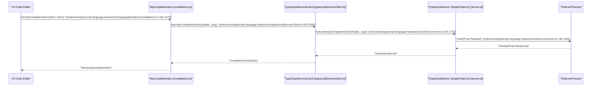

# TypeScript Language Features Extension

<details>
<summary>Relevant source files</summary>

The following files were used as context for generating this wiki page:

- [extensions/package-lock.json](https://github.com/microsoft/vscode/blob/HEAD/extensions/package-lock.json)
- [extensions/package.json](https://github.com/microsoft/vscode/blob/HEAD/extensions/package.json)
- [extensions/typescript-language-features/media/icon.png](https://github.com/microsoft/vscode/blob/HEAD/extensions/typescript-language-features/media/icon.png)
- [extensions/typescript-language-features/package.json](https://github.com/microsoft/vscode/blob/HEAD/extensions/typescript-language-features/package.json)
- [extensions/typescript-language-features/package.nls.json](https://github.com/microsoft/vscode/blob/HEAD/extensions/typescript-language-features/package.nls.json)
- [extensions/typescript-language-features/resources/walkthroughs/create-a-js-file.svg](https://github.com/microsoft/vscode/blob/HEAD/extensions/typescript-language-features/resources/walkthroughs/create-a-js-file.svg)
- [extensions/typescript-language-features/resources/walkthroughs/debug-and-run.svg](https://github.com/microsoft/vscode/blob/HEAD/extensions/typescript-language-features/resources/walkthroughs/debug-and-run.svg)
- [extensions/typescript-language-features/resources/walkthroughs/install-node-js.svg](https://github.com/microsoft/vscode/blob/HEAD/extensions/typescript-language-features/resources/walkthroughs/install-node-js.svg)
- [extensions/typescript-language-features/resources/walkthroughs/learn-more.svg](https://github.com/microsoft/vscode/blob/HEAD/extensions/typescript-language-features/resources/walkthroughs/learn-more.svg)
- [extensions/typescript-language-features/src/commands/commandManager.ts](https://github.com/microsoft/vscode/blob/HEAD/extensions/typescript-language-features/src/commands/commandManager.ts)
- [extensions/typescript-language-features/src/commands/configurePlugin.ts](https://github.com/microsoft/vscode/blob/HEAD/extensions/typescript-language-features/src/commands/configurePlugin.ts)
- [extensions/typescript-language-features/src/commands/index.ts](https://github.com/microsoft/vscode/blob/HEAD/extensions/typescript-language-features/src/commands/index.ts)
- [extensions/typescript-language-features/src/commands/tsserverRequests.ts](https://github.com/microsoft/vscode/blob/HEAD/extensions/typescript-language-features/src/commands/tsserverRequests.ts)
- [extensions/typescript-language-features/src/commands/useTsgo.ts](https://github.com/microsoft/vscode/blob/HEAD/extensions/typescript-language-features/src/commands/useTsgo.ts)
- [extensions/typescript-language-features/src/configuration/configuration.electron.ts](https://github.com/microsoft/vscode/blob/HEAD/extensions/typescript-language-features/src/configuration/configuration.electron.ts)
- [extensions/typescript-language-features/src/configuration/configuration.ts](https://github.com/microsoft/vscode/blob/HEAD/extensions/typescript-language-features/src/configuration/configuration.ts)
- [extensions/typescript-language-features/src/configuration/fileSchemes.ts](https://github.com/microsoft/vscode/blob/HEAD/extensions/typescript-language-features/src/configuration/fileSchemes.ts)
- [extensions/typescript-language-features/src/experimentTelemetryReporter.ts](https://github.com/microsoft/vscode/blob/HEAD/extensions/typescript-language-features/src/experimentTelemetryReporter.ts)
- [extensions/typescript-language-features/src/experimentationService.ts](https://github.com/microsoft/vscode/blob/HEAD/extensions/typescript-language-features/src/experimentationService.ts)
- [extensions/typescript-language-features/src/extension.browser.ts](https://github.com/microsoft/vscode/blob/HEAD/extensions/typescript-language-features/src/extension.browser.ts)
- [extensions/typescript-language-features/src/extension.ts](https://github.com/microsoft/vscode/blob/HEAD/extensions/typescript-language-features/src/extension.ts)
- [extensions/typescript-language-features/src/languageFeatures/callHierarchy.ts](https://github.com/microsoft/vscode/blob/HEAD/extensions/typescript-language-features/src/languageFeatures/callHierarchy.ts)
- [extensions/typescript-language-features/src/languageFeatures/completions.ts](https://github.com/microsoft/vscode/blob/HEAD/extensions/typescript-language-features/src/languageFeatures/completions.ts)
- [extensions/typescript-language-features/src/languageFeatures/copyPaste.ts](https://github.com/microsoft/vscode/blob/HEAD/extensions/typescript-language-features/src/languageFeatures/copyPaste.ts)
- [extensions/typescript-language-features/src/languageFeatures/definitionProviderBase.ts](https://github.com/microsoft/vscode/blob/HEAD/extensions/typescript-language-features/src/languageFeatures/definitionProviderBase.ts)
- [extensions/typescript-language-features/src/languageFeatures/definitions.ts](https://github.com/microsoft/vscode/blob/HEAD/extensions/typescript-language-features/src/languageFeatures/definitions.ts)
- [extensions/typescript-language-features/src/languageFeatures/diagnostics.ts](https://github.com/microsoft/vscode/blob/HEAD/extensions/typescript-language-features/src/languageFeatures/diagnostics.ts)
- [extensions/typescript-language-features/src/languageFeatures/documentSymbol.ts](https://github.com/microsoft/vscode/blob/HEAD/extensions/typescript-language-features/src/languageFeatures/documentSymbol.ts)
- [extensions/typescript-language-features/src/languageFeatures/fileConfigurationManager.ts](https://github.com/microsoft/vscode/blob/HEAD/extensions/typescript-language-features/src/languageFeatures/fileConfigurationManager.ts)
- [extensions/typescript-language-features/src/languageFeatures/folding.ts](https://github.com/microsoft/vscode/blob/HEAD/extensions/typescript-language-features/src/languageFeatures/folding.ts)
- [extensions/typescript-language-features/src/languageFeatures/hover.ts](https://github.com/microsoft/vscode/blob/HEAD/extensions/typescript-language-features/src/languageFeatures/hover.ts)
- [extensions/typescript-language-features/src/languageFeatures/inlayHints.ts](https://github.com/microsoft/vscode/blob/HEAD/extensions/typescript-language-features/src/languageFeatures/inlayHints.ts)
- [extensions/typescript-language-features/src/languageFeatures/organizeImports.ts](https://github.com/microsoft/vscode/blob/HEAD/extensions/typescript-language-features/src/languageFeatures/organizeImports.ts)
- [extensions/typescript-language-features/src/languageFeatures/quickFix.ts](https://github.com/microsoft/vscode/blob/HEAD/extensions/typescript-language-features/src/languageFeatures/quickFix.ts)
- [extensions/typescript-language-features/src/languageFeatures/refactor.ts](https://github.com/microsoft/vscode/blob/HEAD/extensions/typescript-language-features/src/languageFeatures/refactor.ts)
- [extensions/typescript-language-features/src/languageFeatures/signatureHelp.ts](https://github.com/microsoft/vscode/blob/HEAD/extensions/typescript-language-features/src/languageFeatures/signatureHelp.ts)
- [extensions/typescript-language-features/src/languageFeatures/signatureHelpState.ts](https://github.com/microsoft/vscode/blob/HEAD/extensions/typescript-language-features/src/languageFeatures/signatureHelpState.ts)
- [extensions/typescript-language-features/src/languageFeatures/util/codeAction.ts](https://github.com/microsoft/vscode/blob/HEAD/extensions/typescript-language-features/src/languageFeatures/util/codeAction.ts)
- [extensions/typescript-language-features/src/languageFeatures/util/copilot.ts](https://github.com/microsoft/vscode/blob/HEAD/extensions/typescript-language-features/src/languageFeatures/util/copilot.ts)
- [extensions/typescript-language-features/src/languageFeatures/util/dependentRegistration.ts](https://github.com/microsoft/vscode/blob/HEAD/extensions/typescript-language-features/src/languageFeatures/util/dependentRegistration.ts)
- [extensions/typescript-language-features/src/languageFeatures/workspaceSymbols.ts](https://github.com/microsoft/vscode/blob/HEAD/extensions/typescript-language-features/src/languageFeatures/workspaceSymbols.ts)
- [extensions/typescript-language-features/src/languageProvider.ts](https://github.com/microsoft/vscode/blob/HEAD/extensions/typescript-language-features/src/languageProvider.ts)
- [extensions/typescript-language-features/src/lazyClientHost.ts](https://github.com/microsoft/vscode/blob/HEAD/extensions/typescript-language-features/src/lazyClientHost.ts)
- [extensions/typescript-language-features/src/logging/logger.ts](https://github.com/microsoft/vscode/blob/HEAD/extensions/typescript-language-features/src/logging/logger.ts)
- [extensions/typescript-language-features/src/logging/telemetry.ts](https://github.com/microsoft/vscode/blob/HEAD/extensions/typescript-language-features/src/logging/telemetry.ts)
- [extensions/typescript-language-features/src/logging/tracer.ts](https://github.com/microsoft/vscode/blob/HEAD/extensions/typescript-language-features/src/logging/tracer.ts)
- [extensions/typescript-language-features/src/test/unit/server.test.ts](https://github.com/microsoft/vscode/blob/HEAD/extensions/typescript-language-features/src/test/unit/server.test.ts)
- [extensions/typescript-language-features/src/test/unit/signatureHelp.test.ts](https://github.com/microsoft/vscode/blob/HEAD/extensions/typescript-language-features/src/test/unit/signatureHelp.test.ts)
- [extensions/typescript-language-features/src/tsServer/api.ts](https://github.com/microsoft/vscode/blob/HEAD/extensions/typescript-language-features/src/tsServer/api.ts)
- [extensions/typescript-language-features/src/tsServer/bufferSyncSupport.ts](https://github.com/microsoft/vscode/blob/HEAD/extensions/typescript-language-features/src/tsServer/bufferSyncSupport.ts)
- [extensions/typescript-language-features/src/tsServer/callbackMap.ts](https://github.com/microsoft/vscode/blob/HEAD/extensions/typescript-language-features/src/tsServer/callbackMap.ts)
- [extensions/typescript-language-features/src/tsServer/plugins.ts](https://github.com/microsoft/vscode/blob/HEAD/extensions/typescript-language-features/src/tsServer/plugins.ts)
- [extensions/typescript-language-features/src/tsServer/protocol/fixNames.ts](https://github.com/microsoft/vscode/blob/HEAD/extensions/typescript-language-features/src/tsServer/protocol/fixNames.ts)
- [extensions/typescript-language-features/src/tsServer/protocol/protocol.const.ts](https://github.com/microsoft/vscode/blob/HEAD/extensions/typescript-language-features/src/tsServer/protocol/protocol.const.ts)
- [extensions/typescript-language-features/src/tsServer/protocol/protocol.d.ts](https://github.com/microsoft/vscode/blob/HEAD/extensions/typescript-language-features/src/tsServer/protocol/protocol.d.ts)
- [extensions/typescript-language-features/src/tsServer/requestQueue.ts](https://github.com/microsoft/vscode/blob/HEAD/extensions/typescript-language-features/src/tsServer/requestQueue.ts)
- [extensions/typescript-language-features/src/tsServer/server.ts](https://github.com/microsoft/vscode/blob/HEAD/extensions/typescript-language-features/src/tsServer/server.ts)
- [extensions/typescript-language-features/src/tsServer/serverProcess.browser.ts](https://github.com/microsoft/vscode/blob/HEAD/extensions/typescript-language-features/src/tsServer/serverProcess.browser.ts)
- [extensions/typescript-language-features/src/tsServer/serverProcess.electron.ts](https://github.com/microsoft/vscode/blob/HEAD/extensions/typescript-language-features/src/tsServer/serverProcess.electron.ts)
- [extensions/typescript-language-features/src/tsServer/spawner.ts](https://github.com/microsoft/vscode/blob/HEAD/extensions/typescript-language-features/src/tsServer/spawner.ts)
- [extensions/typescript-language-features/src/tsServer/versionManager.ts](https://github.com/microsoft/vscode/blob/HEAD/extensions/typescript-language-features/src/tsServer/versionManager.ts)
- [extensions/typescript-language-features/src/tsServer/versionProvider.electron.ts](https://github.com/microsoft/vscode/blob/HEAD/extensions/typescript-language-features/src/tsServer/versionProvider.electron.ts)
- [extensions/typescript-language-features/src/tsServer/versionProvider.ts](https://github.com/microsoft/vscode/blob/HEAD/extensions/typescript-language-features/src/tsServer/versionProvider.ts)
- [extensions/typescript-language-features/src/typeConverters.ts](https://github.com/microsoft/vscode/blob/HEAD/extensions/typescript-language-features/src/typeConverters.ts)
- [extensions/typescript-language-features/src/typeScriptServiceClientHost.ts](https://github.com/microsoft/vscode/blob/HEAD/extensions/typescript-language-features/src/typeScriptServiceClientHost.ts)
- [extensions/typescript-language-features/src/typescriptService.ts](https://github.com/microsoft/vscode/blob/HEAD/extensions/typescript-language-features/src/typescriptService.ts)
- [extensions/typescript-language-features/src/typescriptServiceClient.ts](https://github.com/microsoft/vscode/blob/HEAD/extensions/typescript-language-features/src/typescriptServiceClient.ts)
- [extensions/typescript-language-features/src/ui/suggestNativePreview.ts](https://github.com/microsoft/vscode/blob/HEAD/extensions/typescript-language-features/src/ui/suggestNativePreview.ts)
- [extensions/typescript-language-features/src/utils/configuration.ts](https://github.com/microsoft/vscode/blob/HEAD/extensions/typescript-language-features/src/utils/configuration.ts)
- [extensions/typescript-language-features/tsconfig.json](https://github.com/microsoft/vscode/blob/HEAD/extensions/typescript-language-features/tsconfig.json)

</details>


The TypeScript Language Features extension (`typescript-language-features`) provides the core IntelliSense, refactoring, and diagnostic capabilities for JavaScript and TypeScript in VS Code. It acts as a bridge between the VS Code extension API and the TypeScript standalone server (`tsserver`).

## Architecture and Data Flow

The extension follows a client-server architecture where VS Code acts as the client and `tsserver` acts as the language server. Communication occurs over a custom JSON-RPC-like protocol defined in the TypeScript project.

### High-Level Architecture
The `TypeScriptServiceClient` is the central coordinator, managing the lifecycle of `tsserver` processes and routing requests from various language providers.

| Component | Responsibility |
| :--- | :--- |
| `TypeScriptServiceClient` | Manages server lifecycle, configuration, and communication. [extensions/typescript-language-features/src/typescriptServiceClient.ts:111-141](https://github.com/microsoft/vscode/blob/HEAD/extensions/typescript-language-features/src/typescriptServiceClient.ts#L111-L141) |
| `TypeScriptServerSpawner` | Spawns and manages different types of `tsserver` processes (Syntax, Semantic, Diagnostics). [extensions/typescript-language-features/src/tsServer/spawner.ts:38-54](https://github.com/microsoft/vscode/blob/HEAD/extensions/typescript-language-features/src/tsServer/spawner.ts#L38-L54) |
| `LanguageProvider` | Registers VS Code language features (completions, hovers, etc.) and maps them to `tsserver` requests. [extensions/typescript-language-features/src/languageProvider.ts:25-49](https://github.com/microsoft/vscode/blob/HEAD/extensions/typescript-language-features/src/languageProvider.ts#L25-L49) |
| `FileConfigurationManager` | Synchronizes editor settings (tab size, formatting rules) with the server. [extensions/typescript-language-features/src/languageFeatures/fileConfigurationManager.ts:34-50](https://github.com/microsoft/vscode/blob/HEAD/extensions/typescript-language-features/src/languageFeatures/fileConfigurationManager.ts#L34-L50) |
| `BufferSyncSupport` | Manages the synchronization of open file buffers between VS Code and `tsserver`. [extensions/typescript-language-features/src/tsServer/bufferSyncSupport.ts:18-18](https://github.com/microsoft/vscode/blob/HEAD/extensions/typescript-language-features/src/tsServer/bufferSyncSupport.ts#L18) |

### Request Lifecycle Diagram
This diagram shows how a user action (e.g., requesting completions) flows from the VS Code UI through the extension to `tsserver`.



**Sources:**
- [extensions/typescript-language-features/src/typescriptServiceClient.ts:111-141](https://github.com/microsoft/vscode/blob/HEAD/extensions/typescript-language-features/src/typescriptServiceClient.ts#L111-L141)
- [extensions/typescript-language-features/src/tsServer/server.ts:164-172](https://github.com/microsoft/vscode/blob/HEAD/extensions/typescript-language-features/src/tsServer/server.ts#L164-L172)
- [extensions/typescript-language-features/src/languageFeatures/completions.ts:154-157](https://github.com/microsoft/vscode/blob/HEAD/extensions/typescript-language-features/src/languageFeatures/completions.ts#L154-L157)

---

## TypeScriptServiceClient

The `TypeScriptServiceClient` implements `ITypeScriptServiceClient` and is responsible for maintaining the state of the connection to `tsserver`.

### Key Functions
- `execute()`: The method used by language providers to send commands to the server. It handles request queuing and cancellation. [extensions/typescript-language-features/src/typescriptServiceClient.ts:502-504](https://github.com/microsoft/vscode/blob/HEAD/extensions/typescript-language-features/src/typescriptServiceClient.ts#L502-L504)
- `toOpenTsFilePath()`: Converts a VS Code `TextDocument` into a file path string that `tsserver` understands. [extensions/typescript-language-features/src/typescriptServiceClient.ts:771-773](https://github.com/microsoft/vscode/blob/HEAD/extensions/typescript-language-features/src/typescriptServiceClient.ts#L771-L773)
- `onReady()`: A promise that resolves once the server has successfully started and is ready to receive requests. [extensions/typescript-language-features/src/typescriptServiceClient.ts:436-438](https://github.com/microsoft/vscode/blob/HEAD/extensions/typescript-language-features/src/typescriptServiceClient.ts#L436-L438)

### Server States
The client tracks the server state using the `ServerState` namespace:
- `None`: Initial state before any server is started. [extensions/typescript-language-features/src/typescriptServiceClient.ts:57-57](https://github.com/microsoft/vscode/blob/HEAD/extensions/typescript-language-features/src/typescriptServiceClient.ts#L57)
- `Running`: Server is active, with specific `apiVersion` and `tsserverVersion`. [extensions/typescript-language-features/src/typescriptServiceClient.ts:59-86](https://github.com/microsoft/vscode/blob/HEAD/extensions/typescript-language-features/src/typescriptServiceClient.ts#L59-L86)
- `Errored`: Server failed to start or crashed fatally. [extensions/typescript-language-features/src/typescriptServiceClient.ts:88-94](https://github.com/microsoft/vscode/blob/HEAD/extensions/typescript-language-features/src/typescriptServiceClient.ts#L88-L94)

**Sources:**
- [extensions/typescript-language-features/src/typescriptServiceClient.ts:50-97](https://github.com/microsoft/vscode/blob/HEAD/extensions/typescript-language-features/src/typescriptServiceClient.ts#L50-L97)
- [extensions/typescript-language-features/src/typescriptServiceClient.ts:436-438](https://github.com/microsoft/vscode/blob/HEAD/extensions/typescript-language-features/src/typescriptServiceClient.ts#L436-L438)
- [extensions/typescript-language-features/src/typescriptServiceClient.ts:502-504](https://github.com/microsoft/vscode/blob/HEAD/extensions/typescript-language-features/src/typescriptServiceClient.ts#L502-L504)

---

## TSServer Spawning and Process Management

The `TypeScriptServerSpawner` handles the complexity of launching `tsserver`. Depending on the configuration and environment, it may spawn multiple server instances to improve performance.

### Composite Server Types
VS Code can run different combinations of server processes based on the `typescript.tsserver.useSyntaxServer` setting:
- `Single`: One process handles all commands. [extensions/typescript-language-features/src/tsServer/spawner.ts:26-26](https://github.com/microsoft/vscode/blob/HEAD/extensions/typescript-language-features/src/tsServer/spawner.ts#L26)
- `SeparateSyntax`: A dedicated process for syntax features and another for semantic features. [extensions/typescript-language-features/src/tsServer/spawner.ts:29-29](https://github.com/microsoft/vscode/blob/HEAD/extensions/typescript-language-features/src/tsServer/spawner.ts#L29)
- `DynamicSeparateSyntax`: Uses a separate syntax server while the project is loading. [extensions/typescript-language-features/src/tsServer/spawner.ts:32-32](https://github.com/microsoft/vscode/blob/HEAD/extensions/typescript-language-features/src/tsServer/spawner.ts#L32)
- `SyntaxOnly`: Only enables the syntax server (e.g., in restricted environments). [extensions/typescript-language-features/src/tsServer/spawner.ts:35-35](https://github.com/microsoft/vscode/blob/HEAD/extensions/typescript-language-features/src/tsServer/spawner.ts#L35)

### Spawning Logic
The `TypeScriptServerSpawner.spawn` method determines which `ITypeScriptServer` implementation to instantiate. If `enableProjectDiagnostics` is true, it wraps the primary server in a `GetErrRoutingTsServer` to route diagnostic requests to a dedicated process. [extensions/typescript-language-features/src/tsServer/spawner.ts:91-96](https://github.com/microsoft/vscode/blob/HEAD/extensions/typescript-language-features/src/tsServer/spawner.ts#L91-L96)

```mermaid
graph TD
    subgraph TypeScriptServerSpawner_spawner_ts ["TypeScriptServerSpawner [spawner.ts]"]
        Spawner["spawn()"]
    end

    Spawner -->|"SeparateSyntax"| S1["SyntaxRoutingTsServer server_ts["server.ts"]"]
    Spawner -->|"Single"| S2["SingleTsServer server_ts["server.ts"]"]
    Spawner -->|"Diagnostics Enabled"| S3["GetErrRoutingTsServer server_ts["server.ts"]"]

    subgraph Process_Types ["Process Types"]
        S1 --> P1["Syntax Process"]
        S1 --> P2["Semantic Process"]
        S3 --> P4["Diagnostics Process (getErr)"]
    end
```

**Sources:**
- [extensions/typescript-language-features/src/tsServer/spawner.ts:24-36](https://github.com/microsoft/vscode/blob/HEAD/extensions/typescript-language-features/src/tsServer/spawner.ts#L24-L36)
- [extensions/typescript-language-features/src/tsServer/spawner.ts:56-99](https://github.com/microsoft/vscode/blob/HEAD/extensions/typescript-language-features/src/tsServer/spawner.ts#L56-L99)
- [extensions/typescript-language-features/src/tsServer/spawner.ts:130-173](https://github.com/microsoft/vscode/blob/HEAD/extensions/typescript-language-features/src/tsServer/spawner.ts#L130-L173)

---

## Language Providers

The extension implements standard VS Code language feature providers by wrapping `tsserver` commands.

### Completion Provider
The completion logic is handled by `MyCompletionItem` and registered via `registerProviders` in `LanguageProvider`.
- **Data Flow**: `resolveCompletionItem` calls `completionEntryDetails` to get documentation and auto-import edits. [extensions/typescript-language-features/src/languageFeatures/completions.ts:154-182](https://github.com/microsoft/vscode/blob/HEAD/extensions/typescript-language-features/src/languageFeatures/completions.ts#L154-L182)

### Refactoring and Quick Fixes
- **Refactoring**: `SelectRefactorCommand` handles interactive refactoring selection. It requests `getEditsForRefactor` from `tsserver`. [extensions/typescript-language-features/src/languageFeatures/refactor.ts:89-117](https://github.com/microsoft/vscode/blob/HEAD/extensions/typescript-language-features/src/languageFeatures/refactor.ts#L89-L117)
- **Quick Fixes**: `ApplyCodeActionCommand` uses diagnostics to request `getCodeFixes` or `applyCodeActionCommands`. [extensions/typescript-language-features/src/languageFeatures/quickFix.ts:30-59](https://github.com/microsoft/vscode/blob/HEAD/extensions/typescript-language-features/src/languageFeatures/quickFix.ts#L30-L59)

### Diagnostics
The `DiagnosticsManager` and `FileDiagnostics` class handle error tracking.
- **Region Updates**: `updateRegionDiagnostics` allows updating only specific parts of the file's semantic diagnostics. [extensions/typescript-language-features/src/languageFeatures/diagnostics.ts:95-107](https://github.com/microsoft/vscode/blob/HEAD/extensions/typescript-language-features/src/languageFeatures/diagnostics.ts#L95-L107)
- **Filtering**: Suggestion diagnostics are filtered based on user settings (e.g., hiding unused variables). [extensions/typescript-language-features/src/languageFeatures/diagnostics.ts:109-118](https://github.com/microsoft/vscode/blob/HEAD/extensions/typescript-language-features/src/languageFeatures/diagnostics.ts#L109-L118)

**Sources:**
- [extensions/typescript-language-features/src/languageFeatures/completions.ts:154-182](https://github.com/microsoft/vscode/blob/HEAD/extensions/typescript-language-features/src/languageFeatures/completions.ts#L154-L182)
- [extensions/typescript-language-features/src/languageFeatures/refactor.ts:89-117](https://github.com/microsoft/vscode/blob/HEAD/extensions/typescript-language-features/src/languageFeatures/refactor.ts#L89-L117)
- [extensions/typescript-language-features/src/languageFeatures/quickFix.ts:30-59](https://github.com/microsoft/vscode/blob/HEAD/extensions/typescript-language-features/src/languageFeatures/quickFix.ts#L30-L59)
- [extensions/typescript-language-features/src/languageFeatures/diagnostics.ts:41-72](https://github.com/microsoft/vscode/blob/HEAD/extensions/typescript-language-features/src/languageFeatures/diagnostics.ts#L41-L72)

---

## Web Extension Variant

The extension supports running in the browser (e.g., `vscode.dev`) using a Web Worker implementation of `tsserver`.

### Implementation Details
- **Entry Point**: Uses `extension.browser.ts` as the browser-specific entry. [extensions/typescript-language-features/src/extension.browser.ts:47](https://github.com/microsoft/vscode/blob/HEAD/extensions/typescript-language-features/src/extension.browser.ts#L47)
- **Server Loading**: The server is loaded as a worker script from `dist/browser/typescript/tsserver.web.js`. [extensions/typescript-language-features/src/extension.browser.ts:60-64](https://github.com/microsoft/vscode/blob/HEAD/extensions/typescript-language-features/src/extension.browser.ts#L60-L64)
- **Browser Spawner**: Uses `WorkerServerProcessFactory` to create the server process. [extensions/typescript-language-features/src/extension.browser.ts:83](https://github.com/microsoft/vscode/blob/HEAD/extensions/typescript-language-features/src/extension.browser.ts#L83)
- **Preloading**: For GitHub repositories, it uses `RemoteWorkspaceContentsPreloader` to trigger early loading of workspace contents via the `remoteHub` API. [extensions/typescript-language-features/src/extension.browser.ts:135-172](https://github.com/microsoft/vscode/blob/HEAD/extensions/typescript-language-features/src/extension.browser.ts#L135-L172)

**Sources:**
- [extensions/typescript-language-features/src/extension.browser.ts:47-90](https://github.com/microsoft/vscode/blob/HEAD/extensions/typescript-language-features/src/extension.browser.ts#L47-L90)
- [extensions/typescript-language-features/src/extension.browser.ts:135-172](https://github.com/microsoft/vscode/blob/HEAD/extensions/typescript-language-features/src/extension.browser.ts#L135-L172)
- [extensions/typescript-language-features/package.json:73-73](https://github.com/microsoft/vscode/blob/HEAD/extensions/typescript-language-features/package.json#L73)

---

## Configuration Management

The `FileConfigurationManager` ensures that `tsserver` is aware of the user's formatting and code style preferences.

- **Synchronization**: `ensureConfigurationOptions` sends a `configure` request to `tsserver` if the cached options differ from the current editor settings. [extensions/typescript-language-features/src/languageFeatures/fileConfigurationManager.ts:73-108](https://github.com/microsoft/vscode/blob/HEAD/extensions/typescript-language-features/src/languageFeatures/fileConfigurationManager.ts#L73-L108)
- **Formatting Options**: Maps VS Code's `tabSize` and `insertSpaces` to `Proto.FormatCodeSettings`. [extensions/typescript-language-features/src/languageFeatures/fileConfigurationManager.ts:140-151](https://github.com/microsoft/vscode/blob/HEAD/extensions/typescript-language-features/src/languageFeatures/fileConfigurationManager.ts#L140-L151)
- **Unified Config**: Uses `readUnifiedConfig` to fetch settings shared between JS and TS, such as `format.insertSpaceAfterCommaDelimiter`. [extensions/typescript-language-features/src/languageFeatures/fileConfigurationManager.ts:152-164](https://github.com/microsoft/vscode/blob/HEAD/extensions/typescript-language-features/src/languageFeatures/fileConfigurationManager.ts#L152-L164)

**Sources:**
- [extensions/typescript-language-features/src/languageFeatures/fileConfigurationManager.ts:73-108](https://github.com/microsoft/vscode/blob/HEAD/extensions/typescript-language-features/src/languageFeatures/fileConfigurationManager.ts#L73-L108)
- [extensions/typescript-language-features/src/languageFeatures/fileConfigurationManager.ts:140-164](https://github.com/microsoft/vscode/blob/HEAD/extensions/typescript-language-features/src/languageFeatures/fileConfigurationManager.ts#L140-L164)
- [extensions/typescript-language-features/src/utils/configuration.ts:1-20](https://github.com/microsoft/vscode/blob/HEAD/extensions/typescript-language-features/src/utils/configuration.ts#L1-L20)