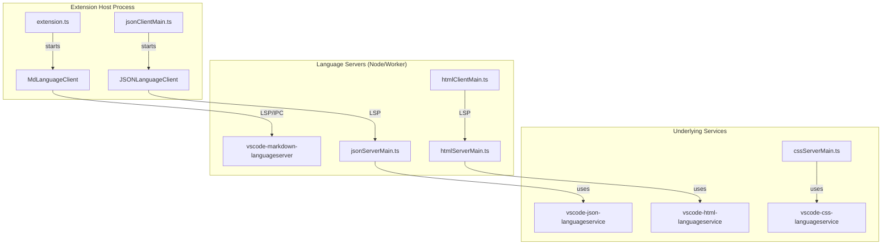
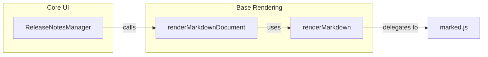

# Markdown, HTML, CSS, and JSON Language Extensions

<details>
<summary>Relevant source files</summary>

The following files were used as context for generating this wiki page:

- [.npmrc](.npmrc)
- [.nvmrc](.nvmrc)
- [AGENTS.md](AGENTS.md)
- [build/azure-pipelines/linux/setup-env.sh](build/azure-pipelines/linux/setup-env.sh)
- [build/checksums/electron.txt](build/checksums/electron.txt)
- [build/checksums/nodejs.txt](build/checksums/nodejs.txt)
- [build/linux/debian/calculate-deps.ts](build/linux/debian/calculate-deps.ts)
- [build/linux/debian/dep-lists.ts](build/linux/debian/dep-lists.ts)
- [build/linux/dependencies-generator.ts](build/linux/dependencies-generator.ts)
- [build/linux/rpm/dep-lists.ts](build/linux/rpm/dep-lists.ts)
- [cgmanifest.json](cgmanifest.json)
- [extensions/copilot/chat-lib/package-lock.json](extensions/copilot/chat-lib/package-lock.json)
- [extensions/copilot/chat-lib/package.json](extensions/copilot/chat-lib/package.json)
- [extensions/copilot/package-lock.json](extensions/copilot/package-lock.json)
- [extensions/esbuild-common.mts](extensions/esbuild-common.mts)
- [extensions/github-authentication/package.json](extensions/github-authentication/package.json)
- [extensions/markdown-language-features/CONTRIBUTING.md](extensions/markdown-language-features/CONTRIBUTING.md)
- [extensions/markdown-language-features/esbuild.browser.mts](extensions/markdown-language-features/esbuild.browser.mts)
- [extensions/markdown-language-features/esbuild.markdownEditor.mts](extensions/markdown-language-features/esbuild.markdownEditor.mts)
- [extensions/markdown-language-features/esbuild.mts](extensions/markdown-language-features/esbuild.mts)
- [extensions/markdown-language-features/markdown-editor-src/editor.ts](extensions/markdown-language-features/markdown-editor-src/editor.ts)
- [extensions/markdown-language-features/markdown-editor-src/syntaxHighlighter.ts](extensions/markdown-language-features/markdown-editor-src/syntaxHighlighter.ts)
- [extensions/markdown-language-features/markdown-editor-src/tsconfig.json](extensions/markdown-language-features/markdown-editor-src/tsconfig.json)
- [extensions/markdown-language-features/package-lock.json](extensions/markdown-language-features/package-lock.json)
- [extensions/markdown-language-features/package.json](extensions/markdown-language-features/package.json)
- [extensions/markdown-language-features/package.nls.json](extensions/markdown-language-features/package.nls.json)
- [extensions/markdown-language-features/scripts/updateMarkdownEditorPackageJson.mts](extensions/markdown-language-features/scripts/updateMarkdownEditorPackageJson.mts)
- [extensions/markdown-language-features/scripts/updateMarkdownEditorPackageJson.test.mts](extensions/markdown-language-features/scripts/updateMarkdownEditorPackageJson.test.mts)
- [extensions/markdown-language-features/src/commands/insertResource.ts](extensions/markdown-language-features/src/commands/insertResource.ts)
- [extensions/markdown-language-features/src/extension.shared.ts](extensions/markdown-language-features/src/extension.shared.ts)
- [extensions/markdown-language-features/src/extension.ts](extensions/markdown-language-features/src/extension.ts)
- [extensions/markdown-language-features/src/languageFeatures/copyFiles/copyFiles.ts](extensions/markdown-language-features/src/languageFeatures/copyFiles/copyFiles.ts)
- [extensions/markdown-language-features/src/languageFeatures/copyFiles/dropOrPasteResource.ts](extensions/markdown-language-features/src/languageFeatures/copyFiles/dropOrPasteResource.ts)
- [extensions/markdown-language-features/src/languageFeatures/copyFiles/pasteUrlProvider.ts](extensions/markdown-language-features/src/languageFeatures/copyFiles/pasteUrlProvider.ts)
- [extensions/markdown-language-features/src/languageFeatures/copyFiles/shared.ts](extensions/markdown-language-features/src/languageFeatures/copyFiles/shared.ts)
- [extensions/markdown-language-features/src/languageFeatures/diagnostics.ts](extensions/markdown-language-features/src/languageFeatures/diagnostics.ts)
- [extensions/markdown-language-features/src/preview/markdownEditorProvider.ts](extensions/markdown-language-features/src/preview/markdownEditorProvider.ts)
- [extensions/markdown-language-features/src/test/copyFile.test.ts](extensions/markdown-language-features/src/test/copyFile.test.ts)
- [extensions/markdown-language-features/src/test/pasteUrl.test.ts](extensions/markdown-language-features/src/test/pasteUrl.test.ts)
- [extensions/markdown-language-features/src/util/document.ts](extensions/markdown-language-features/src/util/document.ts)
- [extensions/markdown-language-features/src/util/mimes.ts](extensions/markdown-language-features/src/util/mimes.ts)
- [extensions/microsoft-authentication/package.json](extensions/microsoft-authentication/package.json)
- [extensions/simple-browser/package.json](extensions/simple-browser/package.json)
- [package-lock.json](package-lock.json)
- [package.json](package.json)
- [remote/.npmrc](remote/.npmrc)
- [remote/package-lock.json](remote/package-lock.json)
- [remote/package.json](remote/package.json)
- [remote/web/package-lock.json](remote/web/package-lock.json)
- [remote/web/package.json](remote/web/package.json)
- [src/vs/base/common/codiconsLibrary.ts](src/vs/base/common/codiconsLibrary.ts)
- [src/vs/sessions/contrib/agentFeedback/browser/agentEditorCommentsProvider.ts](src/vs/sessions/contrib/agentFeedback/browser/agentEditorCommentsProvider.ts)
- [src/vs/workbench/api/browser/mainThreadAgentEditorComments.ts](src/vs/workbench/api/browser/mainThreadAgentEditorComments.ts)
- [src/vs/workbench/api/common/extHostAgentEditorComments.ts](src/vs/workbench/api/common/extHostAgentEditorComments.ts)
- [src/vs/workbench/services/agentEditorComments/common/agentEditorComments.ts](src/vs/workbench/services/agentEditorComments/common/agentEditorComments.ts)
- [src/vscode-dts/vscode.proposed.agentEditorComments.d.ts](src/vscode-dts/vscode.proposed.agentEditorComments.d.ts)

</details>


This section details the implementation of built-in language extensions for Markdown, HTML, CSS, and JSON. These extensions provide rich language features such as previews, diagnostics, IntelliSense, and formatting. While Markdown is primarily implemented as a standard extension with a custom previewer and complex editor-side features (like copy/paste management), HTML, CSS, and JSON utilize a client-server architecture based on the Language Server Protocol (LSP).

## 1. Markdown Language Features

The Markdown extension provides a rich editing experience including live previews, smart copy/paste, and document validation. It is activated for `markdown`, `prompt`, `instructions`, `chatagent`, and `skill` language IDs [extensions/markdown-language-features/package.json:26-30]().

### 1.1 Markdown Rendering Engine
The extension uses a multi-layered approach to rendering. For notebook cells, it contributes a `vscode.markdown-it-renderer` which handles various MIME types including `text/markdown`, `text/latex`, and `application/json` [extensions/markdown-language-features/package.json:47-129]().

In the core workbench, `renderMarkdown` [src/vs/base/browser/markdownRenderer.ts:331-331]() serves as the primary entry point for converting `IMarkdownString` to `HTMLElement`. It uses a custom `marked` renderer [src/vs/base/browser/markdownRenderer.ts:111-111]() that handles:
*   **Images**: Rewriting URIs and parsing dimensions (e.g., `|width=100`) [src/vs/base/browser/markdownRenderer.ts:91-109]().
*   **Links**: Sanitizing `command:` URIs and improving file path tooltips [src/vs/base/browser/markdownRenderer.ts:117-152]().
*   **GitHub Alerts**: Processing `[!NOTE]` or `[!WARNING]` syntax into structured alert markup [src/vs/base/browser/markdownRenderer.ts:160-184]().

For standalone documents (like Release Notes), `renderMarkdownDocument` [src/vs/workbench/contrib/markdown/browser/markdownDocumentRenderer.ts:223-223]() provides a more isolated rendering environment using `tokenizeToString` [src/vs/workbench/contrib/markdown/browser/markdownDocumentRenderer.ts:244-244]() for code block syntax highlighting.

### 1.2 Markdown Editor (WYSIWYG)
The extension includes an experimental hybrid editor implemented via `MarkdownEditorProvider` [extensions/markdown-language-features/src/preview/markdownEditorProvider.ts:84-84](). This is a `CustomTextEditorProvider` that uses a webview to host the `@vscode/markdown-editor` component [extensions/markdown-language-features/src/preview/markdownEditorProvider.ts:80-82]().

Key components include:
*   **AuthenticatedWebview**: Manages a `messageSecret` to authenticate communication between the extension host and the webview [extensions/markdown-language-features/src/preview/markdownEditorProvider.ts:63-76]().
*   **Initial State**: The webview is initialized with settings like `scrollBeyondLastLine` and `lineNumbers` via `encodeWebviewInitialState` [extensions/markdown-language-features/src/preview/markdownEditorProvider.ts:11-11]().
*   **Syntax Highlighting**: The editor uses `MarkdownSyntaxHighlighter` to provide in-webview highlighting [extensions/markdown-language-features/markdown-editor-src/syntaxHighlighter.ts]().

### 1.3 Copy, Paste, and Drop
The extension implements "Smart" copy/paste and drag-and-drop features. When a file (like an image) is dropped or pasted into a Markdown editor, the extension can automatically copy the file into the workspace and insert a Markdown link [extensions/markdown-language-features/package.nls.json:53-62]().

**Data Flow for Paste/Drop:**
1.  **Interception**: `MarkdownDocumentDropOrPasteEditProvider` intercepts the event [extensions/markdown-language-features/src/languageFeatures/copyFiles/dropOrPasteResource.ts]().
2.  **Resource Handling**: The `copyFiles` utility determines if the file should be moved into the workspace based on `markdown.copyFiles.destination` [extensions/markdown-language-features/src/languageFeatures/copyFiles/copyFiles.ts:16-22]().
3.  **Snippet Generation**: `createInsertUriListEdit` [extensions/markdown-language-features/src/languageFeatures/copyFiles/shared.ts:94-99]() uses `createUriListSnippet` [extensions/markdown-language-features/src/languageFeatures/copyFiles/shared.ts:173-181]() to generate a `vscode.SnippetString`.
4.  **Media Detection**: The system differentiates between `DesiredLinkKind.Link`, `DesiredLinkKind.Image`, `DesiredLinkKind.Video`, and `DesiredLinkKind.Audio` based on file extensions [extensions/markdown-language-features/src/languageFeatures/copyFiles/shared.ts:203-215]().
5.  **URL Pasting**: `PasteUrlEditProvider` specifically handles pasting URLs as formatted Markdown links [extensions/markdown-language-features/src/languageFeatures/copyFiles/pasteUrlProvider.ts]().

### 1.4 Diagnostics and Validation
The extension provides link validation to detect broken links or missing headers.
*   **Quick Fixes**: The `AddToIgnoreLinksQuickFixProvider` allows users to exclude specific links from validation by updating the `markdown.validate.ignoredLinks` setting [extensions/markdown-language-features/src/languageFeatures/diagnostics.ts:32-40]().

**Sources:** [extensions/markdown-language-features/package.json:1-131](), [src/vs/base/browser/markdownRenderer.ts:33-184](), [extensions/markdown-language-features/src/preview/markdownEditorProvider.ts:84-180](), [extensions/markdown-language-features/src/languageFeatures/copyFiles/shared.ts:94-215](), [src/vs/workbench/contrib/markdown/browser/markdownDocumentRenderer.ts:223-253](), [extensions/markdown-language-features/src/languageFeatures/copyFiles/pasteUrlProvider.ts:1-30]().

---

## 2. HTML, CSS, and JSON Language Servers

These languages are implemented using a client-server architecture. The "client" part runs in the extension host, while the "server" runs in a separate process.

### 2.1 JSON Language Features
The JSON extension provides validation against JSON schemas and smart completions.
*   **Schema Association**: Users can map file patterns to schemas via the `json.schemas` setting [extensions/json-language-features/package.json:46-80]().
*   **Server Implementation**: The server uses `vscode-json-languageservice` [extensions/markdown-language-features/package-lock.json:24-24]().

### 2.2 HTML and CSS Features
Both extensions leverage specialized language service libraries.
*   **HTML**: Supports Emmet, auto-closing tags, and custom data for web components via `html.customData` [extensions/html-language-features/package.json:59-67]().
*   **CSS**: Handles CSS, LESS, and SCSS. It provides extensive linting configuration [extensions/css-language-features/package.json:91-112]().

**Language Server Data Flow**

**Sources:** [extensions/markdown-language-features/package-lock.json:22-26](), [extensions/json-language-features/package.json:46-80](), [extensions/html-language-features/package.json:59-67]().

---

## 3. Simple Browser Extension

The `simple-browser` extension provides an internal webview-based browser within VS Code.

*   **Implementation**: It activates on `onOpenExternalUri:http` and `onOpenExternalUri:https`, allowing it to intercept external link opening [extensions/simple-browser/package.json:27-28]().
*   **Webview**: It utilizes a `WebviewPanel` (id: `simpleBrowser.view`) to host the browser content [extensions/simple-browser/package.json:29-29]().
*   **Focus Lock**: Includes a configuration `simpleBrowser.focusLockIndicator.enabled` to show an indicator when the webview has focus lock [extensions/simple-browser/package.json:57-62]().

**Sources:** [extensions/simple-browser/package.json:1-93]().

---

## 4. Entity Mapping: Code to System

This diagram bridges the gap between the conceptual "Language Features" and the actual classes/files in the repository.

**Markdown Link Insertion Entity Map**
```mermaid
classDiagram
    class "InsertLinkFromWorkspace" {
        <<extensions/markdown-language-features/src/commands/insertResource.ts>>
        +execute(resources)
        +insertLink(editor, selectedFiles, insertAsMedia)
    }
    class "createUriListSnippet" {
        <<extensions/markdown-language-features/src/languageFeatures/copyFiles/shared.ts>>
        +createUriListSnippet(document, uris, options)
    }
    class "resolveCopyDestination" {
        <<extensions/markdown-language-features/src/languageFeatures/copyFiles/copyFiles.ts>>
        +resolveCopyDestination(documentUri, fileName, dest, getWorkspaceFolder)
    }
    class "MarkdownDocumentDropOrPasteEditProvider" {
        <<extensions/markdown-language-features/src/languageFeatures/copyFiles/dropOrPasteResource.ts>>
        +provideDocumentPasteEdits()
        +provideDocumentOnDropEdits()
    }

    "MarkdownDocumentDropOrPasteEditProvider" ..> "createUriListSnippet" : "uses to format link"
    "createUriListSnippet" ..> "resolveCopyDestination" : "uses for path resolution"
    "InsertLinkFromWorkspace" ..> "createUriListSnippet" : "uses to insert links manually"
```

**Markdown Preview Implementation Map**


**Sources:** [extensions/markdown-language-features/src/commands/insertResource.ts:16-82](), [extensions/markdown-language-features/src/languageFeatures/copyFiles/shared.ts:173-181](), [extensions/markdown-language-features/src/languageFeatures/copyFiles/copyFiles.ts:47-58](), [src/vs/workbench/contrib/markdown/browser/markdownDocumentRenderer.ts:223-223]().