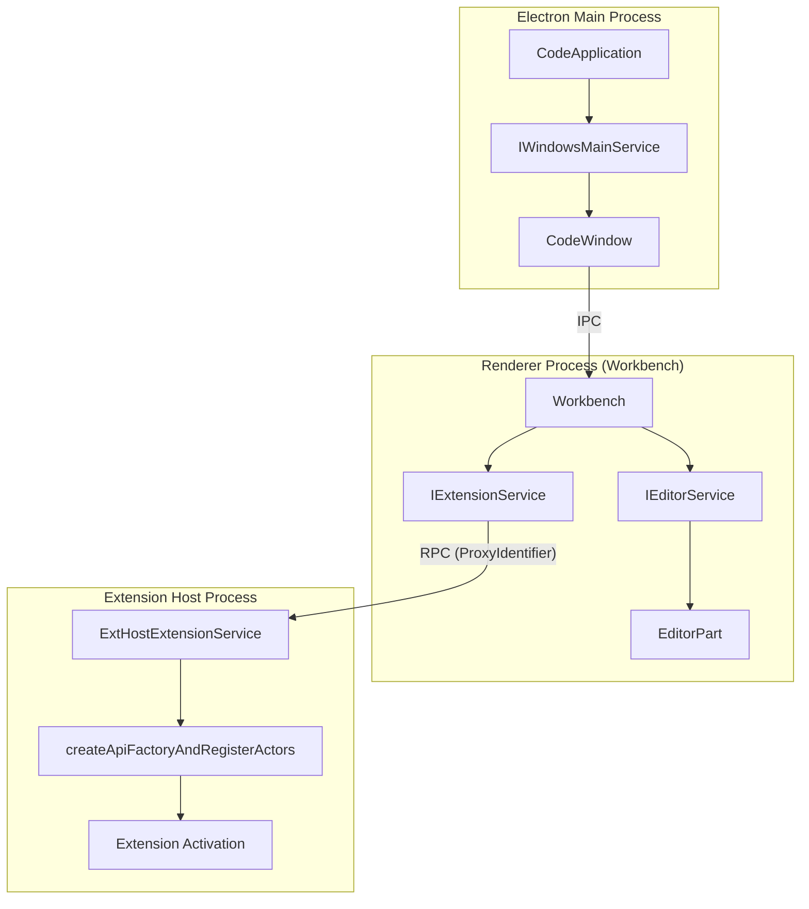
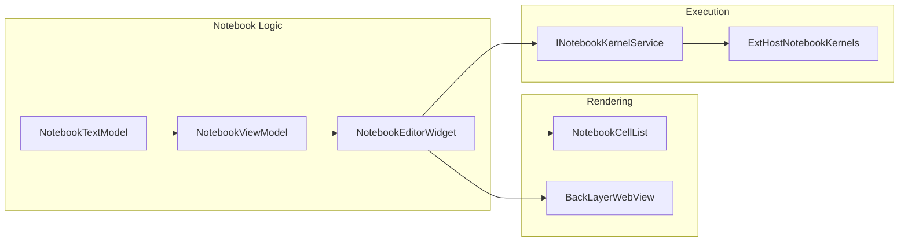
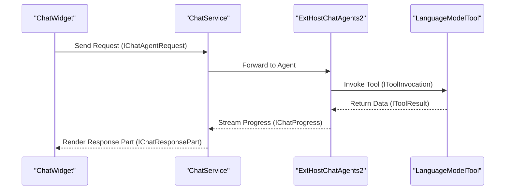

# Glossary

Relevant source files

The following files were used as context for generating this wiki page:

- [.npmrc](https://github.com/microsoft/vscode/blob/HEAD/.npmrc)
- [.nvmrc](https://github.com/microsoft/vscode/blob/HEAD/.nvmrc)
- [build/azure-pipelines/linux/setup-env.sh](https://github.com/microsoft/vscode/blob/HEAD/build/azure-pipelines/linux/setup-env.sh)
- [build/checksums/electron.txt](https://github.com/microsoft/vscode/blob/HEAD/build/checksums/electron.txt)
- [build/checksums/nodejs.txt](https://github.com/microsoft/vscode/blob/HEAD/build/checksums/nodejs.txt)
- [build/linux/debian/calculate-deps.ts](https://github.com/microsoft/vscode/blob/HEAD/build/linux/debian/calculate-deps.ts)
- [build/linux/debian/dep-lists.ts](https://github.com/microsoft/vscode/blob/HEAD/build/linux/debian/dep-lists.ts)
- [build/linux/dependencies-generator.ts](https://github.com/microsoft/vscode/blob/HEAD/build/linux/dependencies-generator.ts)
- [build/linux/rpm/dep-lists.ts](https://github.com/microsoft/vscode/blob/HEAD/build/linux/rpm/dep-lists.ts)
- [cgmanifest.json](https://github.com/microsoft/vscode/blob/HEAD/cgmanifest.json)
- [extensions/copilot/chat-lib/package-lock.json](https://github.com/microsoft/vscode/blob/HEAD/extensions/copilot/chat-lib/package-lock.json)
- [extensions/copilot/chat-lib/package.json](https://github.com/microsoft/vscode/blob/HEAD/extensions/copilot/chat-lib/package.json)
- [extensions/copilot/package-lock.json](https://github.com/microsoft/vscode/blob/HEAD/extensions/copilot/package-lock.json)
- [extensions/vscode-api-tests/package.json](https://github.com/microsoft/vscode/blob/HEAD/extensions/vscode-api-tests/package.json)
- [extensions/vscode-api-tests/src/singlefolder-tests/chat.test.ts](https://github.com/microsoft/vscode/blob/HEAD/extensions/vscode-api-tests/src/singlefolder-tests/chat.test.ts)
- [extensions/vscode-colorize-tests/src/colorizer.test.ts](https://github.com/microsoft/vscode/blob/HEAD/extensions/vscode-colorize-tests/src/colorizer.test.ts)
- [package-lock.json](https://github.com/microsoft/vscode/blob/HEAD/package-lock.json)
- [package.json](https://github.com/microsoft/vscode/blob/HEAD/package.json)
- [remote/.npmrc](https://github.com/microsoft/vscode/blob/HEAD/remote/.npmrc)
- [remote/package-lock.json](https://github.com/microsoft/vscode/blob/HEAD/remote/package-lock.json)
- [remote/package.json](https://github.com/microsoft/vscode/blob/HEAD/remote/package.json)
- [remote/web/package-lock.json](https://github.com/microsoft/vscode/blob/HEAD/remote/web/package-lock.json)
- [remote/web/package.json](https://github.com/microsoft/vscode/blob/HEAD/remote/web/package.json)
- [src/vs/base/common/arrays.ts](https://github.com/microsoft/vscode/blob/HEAD/src/vs/base/common/arrays.ts)
- [src/vs/base/common/codiconsLibrary.ts](https://github.com/microsoft/vscode/blob/HEAD/src/vs/base/common/codiconsLibrary.ts)
- [src/vs/base/test/common/arrays.test.ts](https://github.com/microsoft/vscode/blob/HEAD/src/vs/base/test/common/arrays.test.ts)
- [src/vs/editor/common/config/editorConfigurationSchema.ts](https://github.com/microsoft/vscode/blob/HEAD/src/vs/editor/common/config/editorConfigurationSchema.ts)
- [src/vs/editor/common/config/editorOptions.ts](https://github.com/microsoft/vscode/blob/HEAD/src/vs/editor/common/config/editorOptions.ts)
- [src/vs/editor/common/languages.ts](https://github.com/microsoft/vscode/blob/HEAD/src/vs/editor/common/languages.ts)
- [src/vs/editor/common/model.ts](https://github.com/microsoft/vscode/blob/HEAD/src/vs/editor/common/model.ts)
- [src/vs/editor/common/model/textModel.ts](https://github.com/microsoft/vscode/blob/HEAD/src/vs/editor/common/model/textModel.ts)
- [src/vs/editor/common/standalone/standaloneEnums.ts](https://github.com/microsoft/vscode/blob/HEAD/src/vs/editor/common/standalone/standaloneEnums.ts)
- [src/vs/editor/common/viewModel/viewModelImpl.ts](https://github.com/microsoft/vscode/blob/HEAD/src/vs/editor/common/viewModel/viewModelImpl.ts)
- [src/vs/editor/contrib/inlineCompletions/browser/controller/commandIds.ts](https://github.com/microsoft/vscode/blob/HEAD/src/vs/editor/contrib/inlineCompletions/browser/controller/commandIds.ts)
- [src/vs/editor/contrib/inlineCompletions/browser/controller/commands.ts](https://github.com/microsoft/vscode/blob/HEAD/src/vs/editor/contrib/inlineCompletions/browser/controller/commands.ts)
- [src/vs/editor/contrib/inlineCompletions/browser/controller/inlineCompletionContextKeys.ts](https://github.com/microsoft/vscode/blob/HEAD/src/vs/editor/contrib/inlineCompletions/browser/controller/inlineCompletionContextKeys.ts)
- [src/vs/editor/contrib/inlineCompletions/browser/controller/inlineCompletionsController.ts](https://github.com/microsoft/vscode/blob/HEAD/src/vs/editor/contrib/inlineCompletions/browser/controller/inlineCompletionsController.ts)
- [src/vs/editor/contrib/inlineCompletions/browser/inlineCompletions.contribution.ts](https://github.com/microsoft/vscode/blob/HEAD/src/vs/editor/contrib/inlineCompletions/browser/inlineCompletions.contribution.ts)
- [src/vs/editor/contrib/inlineCompletions/browser/model/inlineCompletionsModel.ts](https://github.com/microsoft/vscode/blob/HEAD/src/vs/editor/contrib/inlineCompletions/browser/model/inlineCompletionsModel.ts)
- [src/vs/editor/contrib/inlineCompletions/browser/model/inlineCompletionsSource.ts](https://github.com/microsoft/vscode/blob/HEAD/src/vs/editor/contrib/inlineCompletions/browser/model/inlineCompletionsSource.ts)
- [src/vs/editor/contrib/inlineCompletions/browser/model/inlineSuggestionItem.ts](https://github.com/microsoft/vscode/blob/HEAD/src/vs/editor/contrib/inlineCompletions/browser/model/inlineSuggestionItem.ts)
- [src/vs/editor/contrib/inlineCompletions/browser/model/provideInlineCompletions.ts](https://github.com/microsoft/vscode/blob/HEAD/src/vs/editor/contrib/inlineCompletions/browser/model/provideInlineCompletions.ts)
- [src/vs/editor/contrib/inlineCompletions/browser/telemetry.ts](https://github.com/microsoft/vscode/blob/HEAD/src/vs/editor/contrib/inlineCompletions/browser/telemetry.ts)
- [src/vs/editor/contrib/inlineCompletions/browser/view/inlineEdits/inlineEditWithChanges.ts](https://github.com/microsoft/vscode/blob/HEAD/src/vs/editor/contrib/inlineCompletions/browser/view/inlineEdits/inlineEditWithChanges.ts)
- [src/vs/editor/contrib/inlineCompletions/browser/view/inlineEdits/inlineEditsModel.ts](https://github.com/microsoft/vscode/blob/HEAD/src/vs/editor/contrib/inlineCompletions/browser/view/inlineEdits/inlineEditsModel.ts)
- [src/vs/editor/contrib/inlineCompletions/browser/view/inlineEdits/inlineEditsView.ts](https://github.com/microsoft/vscode/blob/HEAD/src/vs/editor/contrib/inlineCompletions/browser/view/inlineEdits/inlineEditsView.ts)
- [src/vs/editor/contrib/inlineCompletions/browser/view/inlineEdits/inlineEditsViewInterface.ts](https://github.com/microsoft/vscode/blob/HEAD/src/vs/editor/contrib/inlineCompletions/browser/view/inlineEdits/inlineEditsViewInterface.ts)
- [src/vs/editor/contrib/inlineCompletions/browser/view/inlineEdits/inlineEditsViewProducer.ts](https://github.com/microsoft/vscode/blob/HEAD/src/vs/editor/contrib/inlineCompletions/browser/view/inlineEdits/inlineEditsViewProducer.ts)
- [src/vs/monaco.d.ts](https://github.com/microsoft/vscode/blob/HEAD/src/vs/monaco.d.ts)
- [src/vs/platform/extensions/common/extensionsApiProposals.ts](https://github.com/microsoft/vscode/blob/HEAD/src/vs/platform/extensions/common/extensionsApiProposals.ts)
- [src/vs/platform/terminal/common/terminal.ts](https://github.com/microsoft/vscode/blob/HEAD/src/vs/platform/terminal/common/terminal.ts)
- [src/vs/platform/terminal/node/ptyHostService.ts](https://github.com/microsoft/vscode/blob/HEAD/src/vs/platform/terminal/node/ptyHostService.ts)
- [src/vs/platform/terminal/node/ptyService.ts](https://github.com/microsoft/vscode/blob/HEAD/src/vs/platform/terminal/node/ptyService.ts)
- [src/vs/platform/terminal/node/terminalProcess.ts](https://github.com/microsoft/vscode/blob/HEAD/src/vs/platform/terminal/node/terminalProcess.ts)
- [src/vs/sessions/contrib/providers/agentHost/browser/openSubagentChat.ts](https://github.com/microsoft/vscode/blob/HEAD/src/vs/sessions/contrib/providers/agentHost/browser/openSubagentChat.ts)
- [src/vs/sessions/contrib/providers/agentHost/test/browser/openSubagentChat.test.ts](https://github.com/microsoft/vscode/blob/HEAD/src/vs/sessions/contrib/providers/agentHost/test/browser/openSubagentChat.test.ts)
- [src/vs/workbench/api/browser/mainThreadChatAgents2.ts](https://github.com/microsoft/vscode/blob/HEAD/src/vs/workbench/api/browser/mainThreadChatAgents2.ts)
- [src/vs/workbench/api/browser/mainThreadLanguageFeatures.ts](https://github.com/microsoft/vscode/blob/HEAD/src/vs/workbench/api/browser/mainThreadLanguageFeatures.ts)
- [src/vs/workbench/api/browser/mainThreadTerminalService.ts](https://github.com/microsoft/vscode/blob/HEAD/src/vs/workbench/api/browser/mainThreadTerminalService.ts)
- [src/vs/workbench/api/common/extHost.api.impl.ts](https://github.com/microsoft/vscode/blob/HEAD/src/vs/workbench/api/common/extHost.api.impl.ts)
- [src/vs/workbench/api/common/extHost.protocol.ts](https://github.com/microsoft/vscode/blob/HEAD/src/vs/workbench/api/common/extHost.protocol.ts)
- [src/vs/workbench/api/common/extHostChatAgents2.ts](https://github.com/microsoft/vscode/blob/HEAD/src/vs/workbench/api/common/extHostChatAgents2.ts)
- [src/vs/workbench/api/common/extHostLanguageFeatures.ts](https://github.com/microsoft/vscode/blob/HEAD/src/vs/workbench/api/common/extHostLanguageFeatures.ts)
- [src/vs/workbench/api/common/extHostTerminalService.ts](https://github.com/microsoft/vscode/blob/HEAD/src/vs/workbench/api/common/extHostTerminalService.ts)
- [src/vs/workbench/api/common/extHostTypeConverters.ts](https://github.com/microsoft/vscode/blob/HEAD/src/vs/workbench/api/common/extHostTypeConverters.ts)
- [src/vs/workbench/api/common/extHostTypes.ts](https://github.com/microsoft/vscode/blob/HEAD/src/vs/workbench/api/common/extHostTypes.ts)
- [src/vs/workbench/contrib/chat/browser/actions/chatActions.ts](https://github.com/microsoft/vscode/blob/HEAD/src/vs/workbench/contrib/chat/browser/actions/chatActions.ts)
- [src/vs/workbench/contrib/chat/browser/actions/chatExecuteActions.ts](https://github.com/microsoft/vscode/blob/HEAD/src/vs/workbench/contrib/chat/browser/actions/chatExecuteActions.ts)
- [src/vs/workbench/contrib/chat/browser/agentSessions/localAgentSessionsController.ts](https://github.com/microsoft/vscode/blob/HEAD/src/vs/workbench/contrib/chat/browser/agentSessions/localAgentSessionsController.ts)
- [src/vs/workbench/contrib/chat/browser/chat.contribution.ts](https://github.com/microsoft/vscode/blob/HEAD/src/vs/workbench/contrib/chat/browser/chat.contribution.ts)
- [src/vs/workbench/contrib/chat/browser/chat.ts](https://github.com/microsoft/vscode/blob/HEAD/src/vs/workbench/contrib/chat/browser/chat.ts)
- [src/vs/workbench/contrib/chat/browser/widget/chatContentParts/chatDisabledClaudeHooksContentPart.ts](https://github.com/microsoft/vscode/blob/HEAD/src/vs/workbench/contrib/chat/browser/widget/chatContentParts/chatDisabledClaudeHooksContentPart.ts)
- [src/vs/workbench/contrib/chat/browser/widget/chatContentParts/chatHookContentPart.ts](https://github.com/microsoft/vscode/blob/HEAD/src/vs/workbench/contrib/chat/browser/widget/chatContentParts/chatHookContentPart.ts)
- [src/vs/workbench/contrib/chat/browser/widget/chatContentParts/chatMcpServersInteractionContentPart.ts](https://github.com/microsoft/vscode/blob/HEAD/src/vs/workbench/contrib/chat/browser/widget/chatContentParts/chatMcpServersInteractionContentPart.ts)
- [src/vs/workbench/contrib/chat/browser/widget/chatContentParts/chatProgressContentPart.ts](https://github.com/microsoft/vscode/blob/HEAD/src/vs/workbench/contrib/chat/browser/widget/chatContentParts/chatProgressContentPart.ts)
- [src/vs/workbench/contrib/chat/browser/widget/chatContentParts/chatSubagentContentPart.ts](https://github.com/microsoft/vscode/blob/HEAD/src/vs/workbench/contrib/chat/browser/widget/chatContentParts/chatSubagentContentPart.ts)
- [src/vs/workbench/contrib/chat/browser/widget/chatContentParts/chatTaskContentPart.ts](https://github.com/microsoft/vscode/blob/HEAD/src/vs/workbench/contrib/chat/browser/widget/chatContentParts/chatTaskContentPart.ts)
- [src/vs/workbench/contrib/chat/browser/widget/chatContentParts/chatThinkingContentPart.ts](https://github.com/microsoft/vscode/blob/HEAD/src/vs/workbench/contrib/chat/browser/widget/chatContentParts/chatThinkingContentPart.ts)
- [src/vs/workbench/contrib/chat/browser/widget/chatContentParts/media/chatCodeBlockPill.css](https://github.com/microsoft/vscode/blob/HEAD/src/vs/workbench/contrib/chat/browser/widget/chatContentParts/media/chatCodeBlockPill.css)
- [src/vs/workbench/contrib/chat/browser/widget/chatContentParts/media/chatDisabledClaudeHooksContent.css](https://github.com/microsoft/vscode/blob/HEAD/src/vs/workbench/contrib/chat/browser/widget/chatContentParts/media/chatDisabledClaudeHooksContent.css)
- [src/vs/workbench/contrib/chat/browser/widget/chatContentParts/media/chatHookContentPart.css](https://github.com/microsoft/vscode/blob/HEAD/src/vs/workbench/contrib/chat/browser/widget/chatContentParts/media/chatHookContentPart.css)
- [src/vs/workbench/contrib/chat/browser/widget/chatContentParts/media/chatSubagentContent.css](https://github.com/microsoft/vscode/blob/HEAD/src/vs/workbench/contrib/chat/browser/widget/chatContentParts/media/chatSubagentContent.css)
- [src/vs/workbench/contrib/chat/browser/widget/chatContentParts/media/chatThinkingContent.css](https://github.com/microsoft/vscode/blob/HEAD/src/vs/workbench/contrib/chat/browser/widget/chatContentParts/media/chatThinkingContent.css)
- [src/vs/workbench/contrib/chat/browser/widget/chatContentParts/toolInvocationParts/chatResultListSubPart.ts](https://github.com/microsoft/vscode/blob/HEAD/src/vs/workbench/contrib/chat/browser/widget/chatContentParts/toolInvocationParts/chatResultListSubPart.ts)
- [src/vs/workbench/contrib/chat/browser/widget/chatContentParts/toolInvocationParts/chatToolInvocationSubPart.ts](https://github.com/microsoft/vscode/blob/HEAD/src/vs/workbench/contrib/chat/browser/widget/chatContentParts/toolInvocationParts/chatToolInvocationSubPart.ts)
- [src/vs/workbench/contrib/chat/browser/widget/chatContentParts/toolInvocationParts/chatToolProgressPart.ts](https://github.com/microsoft/vscode/blob/HEAD/src/vs/workbench/contrib/chat/browser/widget/chatContentParts/toolInvocationParts/chatToolProgressPart.ts)
- [src/vs/workbench/contrib/chat/browser/widget/chatContentParts/toolInvocationParts/chatToolStreamingSubPart.ts](https://github.com/microsoft/vscode/blob/HEAD/src/vs/workbench/contrib/chat/browser/widget/chatContentParts/toolInvocationParts/chatToolStreamingSubPart.ts)
- [src/vs/workbench/contrib/chat/browser/widget/chatListRenderer.ts](https://github.com/microsoft/vscode/blob/HEAD/src/vs/workbench/contrib/chat/browser/widget/chatListRenderer.ts)
- [src/vs/workbench/contrib/chat/browser/widget/chatWidget.ts](https://github.com/microsoft/vscode/blob/HEAD/src/vs/workbench/contrib/chat/browser/widget/chatWidget.ts)
- [src/vs/workbench/contrib/chat/browser/widget/input/chatInputPart.ts](https://github.com/microsoft/vscode/blob/HEAD/src/vs/workbench/contrib/chat/browser/widget/input/chatInputPart.ts)
- [src/vs/workbench/contrib/chat/browser/widget/media/chat.css](https://github.com/microsoft/vscode/blob/HEAD/src/vs/workbench/contrib/chat/browser/widget/media/chat.css)
- [src/vs/workbench/contrib/chat/common/actions/chatContextKeys.ts](https://github.com/microsoft/vscode/blob/HEAD/src/vs/workbench/contrib/chat/common/actions/chatContextKeys.ts)
- [src/vs/workbench/contrib/chat/common/chatService/chatService.ts](https://github.com/microsoft/vscode/blob/HEAD/src/vs/workbench/contrib/chat/common/chatService/chatService.ts)
- [src/vs/workbench/contrib/chat/common/chatService/chatServiceImpl.ts](https://github.com/microsoft/vscode/blob/HEAD/src/vs/workbench/contrib/chat/common/chatService/chatServiceImpl.ts)
- [src/vs/workbench/contrib/chat/common/constants.ts](https://github.com/microsoft/vscode/blob/HEAD/src/vs/workbench/contrib/chat/common/constants.ts)
- [src/vs/workbench/contrib/chat/common/model/chatModel.ts](https://github.com/microsoft/vscode/blob/HEAD/src/vs/workbench/contrib/chat/common/model/chatModel.ts)
- [src/vs/workbench/contrib/chat/common/model/chatSessionOperationLog.ts](https://github.com/microsoft/vscode/blob/HEAD/src/vs/workbench/contrib/chat/common/model/chatSessionOperationLog.ts)
- [src/vs/workbench/contrib/chat/common/model/chatViewModel.ts](https://github.com/microsoft/vscode/blob/HEAD/src/vs/workbench/contrib/chat/common/model/chatViewModel.ts)
- [src/vs/workbench/contrib/chat/common/widget/annotations.ts](https://github.com/microsoft/vscode/blob/HEAD/src/vs/workbench/contrib/chat/common/widget/annotations.ts)
- [src/vs/workbench/contrib/chat/test/browser/agentSessions/localAgentSessionsController.test.ts](https://github.com/microsoft/vscode/blob/HEAD/src/vs/workbench/contrib/chat/test/browser/agentSessions/localAgentSessionsController.test.ts)
- [src/vs/workbench/contrib/chat/test/browser/widget/chatContentParts/chatSubagentContentPart.test.ts](https://github.com/microsoft/vscode/blob/HEAD/src/vs/workbench/contrib/chat/test/browser/widget/chatContentParts/chatSubagentContentPart.test.ts)
- [src/vs/workbench/contrib/chat/test/browser/widget/chatContentParts/chatThinkingContentPart.test.ts](https://github.com/microsoft/vscode/blob/HEAD/src/vs/workbench/contrib/chat/test/browser/widget/chatContentParts/chatThinkingContentPart.test.ts)
- [src/vs/workbench/contrib/chat/test/browser/widget/chatListRenderer.test.ts](https://github.com/microsoft/vscode/blob/HEAD/src/vs/workbench/contrib/chat/test/browser/widget/chatListRenderer.test.ts)
- [src/vs/workbench/contrib/chat/test/common/chatService/__snapshots__/ChatService_can_deserialize.0.snap](https://github.com/microsoft/vscode/blob/HEAD/src/vs/workbench/contrib/chat/test/common/chatService/__snapshots__/ChatService_can_deserialize.0.snap)
- [src/vs/workbench/contrib/chat/test/common/chatService/__snapshots__/ChatService_can_deserialize_with_response.0.snap](https://github.com/microsoft/vscode/blob/HEAD/src/vs/workbench/contrib/chat/test/common/chatService/__snapshots__/ChatService_can_deserialize_with_response.0.snap)
- [src/vs/workbench/contrib/chat/test/common/chatService/__snapshots__/ChatService_can_serialize.1.snap](https://github.com/microsoft/vscode/blob/HEAD/src/vs/workbench/contrib/chat/test/common/chatService/__snapshots__/ChatService_can_serialize.1.snap)
- [src/vs/workbench/contrib/chat/test/common/chatService/__snapshots__/ChatService_sendRequest_fails.0.snap](https://github.com/microsoft/vscode/blob/HEAD/src/vs/workbench/contrib/chat/test/common/chatService/__snapshots__/ChatService_sendRequest_fails.0.snap)
- [src/vs/workbench/contrib/chat/test/common/chatService/chatService.test.ts](https://github.com/microsoft/vscode/blob/HEAD/src/vs/workbench/contrib/chat/test/common/chatService/chatService.test.ts)
- [src/vs/workbench/contrib/chat/test/common/chatService/mockChatService.ts](https://github.com/microsoft/vscode/blob/HEAD/src/vs/workbench/contrib/chat/test/common/chatService/mockChatService.ts)
- [src/vs/workbench/contrib/chat/test/common/model/chatModel.test.ts](https://github.com/microsoft/vscode/blob/HEAD/src/vs/workbench/contrib/chat/test/common/model/chatModel.test.ts)
- [src/vs/workbench/contrib/chat/test/common/widget/annotations.test.ts](https://github.com/microsoft/vscode/blob/HEAD/src/vs/workbench/contrib/chat/test/common/widget/annotations.test.ts)
- [src/vs/workbench/contrib/terminal/browser/media/terminal.css](https://github.com/microsoft/vscode/blob/HEAD/src/vs/workbench/contrib/terminal/browser/media/terminal.css)
- [src/vs/workbench/contrib/terminal/browser/media/xterm.css](https://github.com/microsoft/vscode/blob/HEAD/src/vs/workbench/contrib/terminal/browser/media/xterm.css)
- [src/vs/workbench/contrib/terminal/browser/remotePty.ts](https://github.com/microsoft/vscode/blob/HEAD/src/vs/workbench/contrib/terminal/browser/remotePty.ts)
- [src/vs/workbench/contrib/terminal/browser/terminal.contribution.ts](https://github.com/microsoft/vscode/blob/HEAD/src/vs/workbench/contrib/terminal/browser/terminal.contribution.ts)
- [src/vs/workbench/contrib/terminal/browser/terminal.ts](https://github.com/microsoft/vscode/blob/HEAD/src/vs/workbench/contrib/terminal/browser/terminal.ts)
- [src/vs/workbench/contrib/terminal/browser/terminalActions.ts](https://github.com/microsoft/vscode/blob/HEAD/src/vs/workbench/contrib/terminal/browser/terminalActions.ts)
- [src/vs/workbench/contrib/terminal/browser/terminalEditor.ts](https://github.com/microsoft/vscode/blob/HEAD/src/vs/workbench/contrib/terminal/browser/terminalEditor.ts)
- [src/vs/workbench/contrib/terminal/browser/terminalEditorInput.ts](https://github.com/microsoft/vscode/blob/HEAD/src/vs/workbench/contrib/terminal/browser/terminalEditorInput.ts)
- [src/vs/workbench/contrib/terminal/browser/terminalEditorService.ts](https://github.com/microsoft/vscode/blob/HEAD/src/vs/workbench/contrib/terminal/browser/terminalEditorService.ts)
- [src/vs/workbench/contrib/terminal/browser/terminalGroup.ts](https://github.com/microsoft/vscode/blob/HEAD/src/vs/workbench/contrib/terminal/browser/terminalGroup.ts)
- [src/vs/workbench/contrib/terminal/browser/terminalGroupService.ts](https://github.com/microsoft/vscode/blob/HEAD/src/vs/workbench/contrib/terminal/browser/terminalGroupService.ts)
- [src/vs/workbench/contrib/terminal/browser/terminalInstance.ts](https://github.com/microsoft/vscode/blob/HEAD/src/vs/workbench/contrib/terminal/browser/terminalInstance.ts)
- [src/vs/workbench/contrib/terminal/browser/terminalMenus.ts](https://github.com/microsoft/vscode/blob/HEAD/src/vs/workbench/contrib/terminal/browser/terminalMenus.ts)
- [src/vs/workbench/contrib/terminal/browser/terminalProcessExtHostProxy.ts](https://github.com/microsoft/vscode/blob/HEAD/src/vs/workbench/contrib/terminal/browser/terminalProcessExtHostProxy.ts)
- [src/vs/workbench/contrib/terminal/browser/terminalProcessManager.ts](https://github.com/microsoft/vscode/blob/HEAD/src/vs/workbench/contrib/terminal/browser/terminalProcessManager.ts)
- [src/vs/workbench/contrib/terminal/browser/terminalService.ts](https://github.com/microsoft/vscode/blob/HEAD/src/vs/workbench/contrib/terminal/browser/terminalService.ts)
- [src/vs/workbench/contrib/terminal/browser/terminalTabbedView.ts](https://github.com/microsoft/vscode/blob/HEAD/src/vs/workbench/contrib/terminal/browser/terminalTabbedView.ts)
- [src/vs/workbench/contrib/terminal/browser/terminalTabsList.ts](https://github.com/microsoft/vscode/blob/HEAD/src/vs/workbench/contrib/terminal/browser/terminalTabsList.ts)
- [src/vs/workbench/contrib/terminal/browser/terminalView.ts](https://github.com/microsoft/vscode/blob/HEAD/src/vs/workbench/contrib/terminal/browser/terminalView.ts)
- [src/vs/workbench/contrib/terminal/browser/xterm/decorationAddon.ts](https://github.com/microsoft/vscode/blob/HEAD/src/vs/workbench/contrib/terminal/browser/xterm/decorationAddon.ts)
- [src/vs/workbench/contrib/terminal/browser/xterm/xtermTerminal.ts](https://github.com/microsoft/vscode/blob/HEAD/src/vs/workbench/contrib/terminal/browser/xterm/xtermTerminal.ts)
- [src/vs/workbench/contrib/terminal/common/terminal.ts](https://github.com/microsoft/vscode/blob/HEAD/src/vs/workbench/contrib/terminal/common/terminal.ts)
- [src/vs/workbench/contrib/terminal/common/terminalColorRegistry.ts](https://github.com/microsoft/vscode/blob/HEAD/src/vs/workbench/contrib/terminal/common/terminalColorRegistry.ts)
- [src/vs/workbench/contrib/terminal/common/terminalConfiguration.ts](https://github.com/microsoft/vscode/blob/HEAD/src/vs/workbench/contrib/terminal/common/terminalConfiguration.ts)
- [src/vs/workbench/contrib/terminal/common/terminalStrings.ts](https://github.com/microsoft/vscode/blob/HEAD/src/vs/workbench/contrib/terminal/common/terminalStrings.ts)
- [src/vs/workbench/contrib/terminal/test/browser/terminalInstance.test.ts](https://github.com/microsoft/vscode/blob/HEAD/src/vs/workbench/contrib/terminal/test/browser/terminalInstance.test.ts)
- [src/vscode-dts/vscode.d.ts](https://github.com/microsoft/vscode/blob/HEAD/src/vscode-dts/vscode.d.ts)
- [src/vscode-dts/vscode.proposed.chatParticipantAdditions.d.ts](https://github.com/microsoft/vscode/blob/HEAD/src/vscode-dts/vscode.proposed.chatParticipantAdditions.d.ts)
- [src/vscode-dts/vscode.proposed.inlineCompletionsAdditions.d.ts](https://github.com/microsoft/vscode/blob/HEAD/src/vscode-dts/vscode.proposed.inlineCompletionsAdditions.d.ts)

This page provides definitions and technical pointers for codebase-specific terms, abbreviations, and domain concepts within the VS Code repository.

## Core Concepts & Process Architecture

| Term | Definition | Key Code Entities |
| :--- | :--- | :--- |
| **Workbench** | The main UI container of VS Code, including the activity bar, side bar, editor area, and panels. | `vs/workbench/browser/workbench.ts` |
| **Extension Host** | A dedicated process (or worker) where extension code runs to ensure UI responsiveness. | [src/vs/workbench/api/common/extHost.protocol.ts:1-10](https://github.com/microsoft/vscode/blob/HEAD/src/vs/workbench/api/common/extHost.protocol.ts#L1-L10) |
| **Main Process** | The Electron main process responsible for window management, native menus, and lifecycle. | `vs/code/electron-main/main.ts` |
| **Shared Process** | A background process for heavy-duty tasks like extension installation and log rotation. | `vs/code/electron-shared/sharedProcessMain.ts` |
| **Monaco Editor** | The core text editor component used within VS Code and also available as a standalone library. | [src/vscode-dts/vscode.d.ts:9-40](https://github.com/microsoft/vscode/blob/HEAD/src/vscode-dts/vscode.d.ts#L9-L40) |

### Process Interaction Overview

The following diagram illustrates how different system components map to specific code entities across the process boundary.

"Code Entity Space Mapping"

Sources: [src/vs/workbench/api/common/extHost.protocol.ts:1-50](https://github.com/microsoft/vscode/blob/HEAD/src/vs/workbench/api/common/extHost.protocol.ts#L1-L50), [src/vs/workbench/api/common/extHost.api.impl.ts:1-65](https://github.com/microsoft/vscode/blob/HEAD/src/vs/workbench/api/common/extHost.api.impl.ts#L1-L65)

---

## Editor & Notebook Domain

### Monaco Editor Terms
*   **TextModel**: The in-memory representation of a document's content, markers, and undo/redo history [src/vs/workbench/api/common/extHost.protocol.ts:30-32](https://github.com/microsoft/vscode/blob/HEAD/src/vs/workbench/api/common/extHost.protocol.ts#L30-L32).
*   **ViewModel**: Handles the transformation from model coordinates to view coordinates (e.g., handling word wrap and folding).
*   **Contribution**: A modular piece of logic that extends the editor's functionality (e.g., `FoldingController` or `SuggestController`).
*   **EditContext**: A modern input handling mechanism replacing the traditional `<textarea>`, integrated via `NativeEditContext` or `TextAreaEditContext` [src/vs/workbench/api/common/extHost.protocol.ts:19-20](https://github.com/microsoft/vscode/blob/HEAD/src/vs/workbench/api/common/extHost.protocol.ts#L19-L20).

### Notebook Terms
*   **Cell**: An atomic unit of a notebook, either `Markup` (Markdown) or `Code` [src/vs/workbench/api/common/extHost.protocol.ts:72-72](https://github.com/microsoft/vscode/blob/HEAD/src/vs/workbench/api/common/extHost.protocol.ts#L72).
*   **Kernel**: The execution engine for code cells, managed by `INotebookKernelService` and implemented via `ExtHostNotebookKernels` [src/vs/workbench/api/common/extHost.api.impl.ts:86-86](https://github.com/microsoft/vscode/blob/HEAD/src/vs/workbench/api/common/extHost.api.impl.ts#L86).
*   **BackLayerWebView**: A specialized webview used to render notebook cell outputs.
*   **Output**: The result of a cell execution, which can be rendered as HTML or via an extension-contributed renderer [src/vs/workbench/api/common/extHostTypes.ts:42-42](https://github.com/microsoft/vscode/blob/HEAD/src/vs/workbench/api/common/extHostTypes.ts#L42).

"Notebook Architecture Flow"

Sources: [src/vs/workbench/api/common/extHost.api.impl.ts:82-87](https://github.com/microsoft/vscode/blob/HEAD/src/vs/workbench/api/common/extHost.api.impl.ts#L82-L87), [src/vs/workbench/api/common/extHost.protocol.ts:72-74](https://github.com/microsoft/vscode/blob/HEAD/src/vs/workbench/api/common/extHost.protocol.ts#L72-L74)

---

## Terminal & Shell Integration

*   **PTY (Pseudo Terminal)**: The backend process (typically `node-pty`) that communicates with the shell [package-lock.json:68-68](https://github.com/microsoft/vscode/blob/HEAD/package-lock.json#L68).
*   **xterm.js**: The front-end library used to render the terminal in the browser [package-lock.json:55-55](https://github.com/microsoft/vscode/blob/HEAD/package-lock.json#L55).
*   **Shell Integration**: A feature that injects scripts into the shell to provide command detection and exit code reporting [src/vs/workbench/contrib/terminal/browser/terminalInstance.ts:49-49](https://github.com/microsoft/vscode/blob/HEAD/src/vs/workbench/contrib/terminal/browser/terminalInstance.ts#L49).
*   **PtyHost**: A dedicated process for managing PTYs, abstracted by `IPtyService` and communicated with via `PtyHostService` [src/vs/platform/terminal/node/ptyService.ts:1-20](https://github.com/microsoft/vscode/blob/HEAD/src/vs/platform/terminal/node/ptyService.ts#L1-L20).

| Term | Implementation Class | File Pointer |
| :--- | :--- | :--- |
| **Terminal Instance** | `TerminalInstance` | [src/vs/workbench/contrib/terminal/browser/terminalInstance.ts:48-48](https://github.com/microsoft/vscode/blob/HEAD/src/vs/workbench/contrib/terminal/browser/terminalInstance.ts#L48) |
| **Terminal Service** | `TerminalService` | [src/vs/workbench/contrib/terminal/browser/terminalService.ts:66-66](https://github.com/microsoft/vscode/blob/HEAD/src/vs/workbench/contrib/terminal/browser/terminalService.ts#L66) |
| **Terminal Profile** | `ITerminalProfile` | [src/vs/platform/terminal/common/terminal.ts:51-51](https://github.com/microsoft/vscode/blob/HEAD/src/vs/platform/terminal/common/terminal.ts#L51) |
| **Shell Launch Config** | `IShellLaunchConfig` | [src/vs/platform/terminal/common/terminal.ts:49-49](https://github.com/microsoft/vscode/blob/HEAD/src/vs/platform/terminal/common/terminal.ts#L49) |

Sources: [src/vs/platform/terminal/common/terminal.ts:49-55](https://github.com/microsoft/vscode/blob/HEAD/src/vs/platform/terminal/common/terminal.ts#L49-L55), [src/vs/workbench/contrib/terminal/browser/terminalInstance.ts:1-70](https://github.com/microsoft/vscode/blob/HEAD/src/vs/workbench/contrib/terminal/browser/terminalInstance.ts#L1-L70), [src/vs/workbench/contrib/terminal/browser/terminalService.ts:66-100](https://github.com/microsoft/vscode/blob/HEAD/src/vs/workbench/contrib/terminal/browser/terminalService.ts#L66-L100)

---

## AI & Copilot Concepts

*   **Chat Agent (Participant)**: An extension-contributed entity that handles chat requests, such as `@workspace` or `@terminal` [src/vs/workbench/api/common/extHost.protocol.ts:59-59](https://github.com/microsoft/vscode/blob/HEAD/src/vs/workbench/api/common/extHost.protocol.ts#L59).
*   **Language Model Tool**: A capability (like `copilot_searchCodebase`) that a model can invoke via the `LanguageModelToolsService` [src/vs/workbench/api/common/extHost.protocol.ts:68-68](https://github.com/microsoft/vscode/blob/HEAD/src/vs/workbench/api/common/extHost.protocol.ts#L68).
*   **Subagent**: An iterative AI session focused on a specific task, managed within the chat session lifecycle.
*   **MCP (Model Context Protocol)**: A protocol for integrating external data sources and tools into AI sessions [src/vs/workbench/api/common/extHost.protocol.ts:71-71](https://github.com/microsoft/vscode/blob/HEAD/src/vs/workbench/api/common/extHost.protocol.ts#L71).
*   **Prompt Syntax**: A DSL for defining structured prompts, handled by `IPromptsService` [src/vs/workbench/api/common/extHost.protocol.ts:69-69](https://github.com/microsoft/vscode/blob/HEAD/src/vs/workbench/api/common/extHost.protocol.ts#L69).

"AI Chat Request Flow"

Sources: [src/vs/workbench/api/common/extHost.protocol.ts:58-68](https://github.com/microsoft/vscode/blob/HEAD/src/vs/workbench/api/common/extHost.protocol.ts#L58-L68), [src/vs/workbench/api/common/extHost.api.impl.ts:40-40](https://github.com/microsoft/vscode/blob/HEAD/src/vs/workbench/api/common/extHost.api.impl.ts#L40)

---

## Infrastructure & Lifecycle

### Disposable Pattern
The primary mechanism for memory management in VS Code. Objects implement `IDisposable` and are tracked via `DisposableStore` or `MutableDisposable` [src/vs/workbench/contrib/terminal/browser/terminalInstance.ts:20-20](https://github.com/microsoft/vscode/blob/HEAD/src/vs/workbench/contrib/terminal/browser/terminalInstance.ts#L20). In the extension host, `extHostTypes.ts` provides the `Disposable` class used by extensions [src/vs/workbench/api/common/extHostTypes.ts:64-92](https://github.com/microsoft/vscode/blob/HEAD/src/vs/workbench/api/common/extHostTypes.ts#L64-L92).

### Dependency Injection (DI)
VS Code uses a custom DI container. Services are identified by `ServiceIdentifier` (e.g., `ITerminalService`) and decorated with `@serviceBrand` [src/vs/workbench/contrib/terminal/browser/terminalService.ts:66-67](https://github.com/microsoft/vscode/blob/HEAD/src/vs/workbench/contrib/terminal/browser/terminalService.ts#L66-L67).

### Extension RPC Protocol
Communication between the Renderer and Extension Host uses a proxy-based RPC system defined in `extHost.protocol.ts` [src/vs/workbench/api/common/extHost.protocol.ts:1-100](https://github.com/microsoft/vscode/blob/HEAD/src/vs/workbench/api/common/extHost.protocol.ts#L1-L100).
*   **MainThreadX**: Classes in the Renderer that are called by extensions (e.g., `MainThreadLanguageFeatures`).
*   **ExtHostX**: Classes in the Extension Host that are called by the Renderer (e.g., `ExtHostChatAgents2`) [src/vs/workbench/api/common/extHost.api.impl.ts:40-40](https://github.com/microsoft/vscode/blob/HEAD/src/vs/workbench/api/common/extHost.api.impl.ts#L40).

### Environment and Product Configuration
*   **Product Service**: Provides access to `product.json` values (e.g., quality, name, commit) [src/vs/workbench/contrib/terminal/browser/terminalInstance.ts:41-41](https://github.com/microsoft/vscode/blob/HEAD/src/vs/workbench/contrib/terminal/browser/terminalInstance.ts#L41).
*   **Environment Service**: Resolves paths and environment-specific settings (e.g., user data path, extensions path) [src/vs/workbench/contrib/terminal/browser/terminalInstance.ts:77-77](https://github.com/microsoft/vscode/blob/HEAD/src/vs/workbench/contrib/terminal/browser/terminalInstance.ts#L77).
*   **Configuration Service**: Manages user and workspace settings, accessed via `IConfigurationService` [src/vs/workbench/contrib/terminal/browser/terminalInstance.ts:31-31](https://github.com/microsoft/vscode/blob/HEAD/src/vs/workbench/contrib/terminal/browser/terminalInstance.ts#L31).

Sources: [src/vs/workbench/api/common/extHost.protocol.ts:1-100](https://github.com/microsoft/vscode/blob/HEAD/src/vs/workbench/api/common/extHost.protocol.ts#L1-L100), [src/vs/workbench/api/common/extHost.api.impl.ts:31-85](https://github.com/microsoft/vscode/blob/HEAD/src/vs/workbench/api/common/extHost.api.impl.ts#L31-L85), [src/vs/workbench/api/common/extHostTypes.ts:64-92](https://github.com/microsoft/vscode/blob/HEAD/src/vs/workbench/api/common/extHostTypes.ts#L64-L92), [src/vs/workbench/contrib/terminal/browser/terminalService.ts:1-80](https://github.com/microsoft/vscode/blob/HEAD/src/vs/workbench/contrib/terminal/browser/terminalService.ts#L1-L80)