# microsoft/vscode - Complete Documentation

> **Repository:** https://github.com/microsoft/vscode
> **Source:** [https://deepwiki.com/microsoft/vscode](https://deepwiki.com/microsoft/vscode)
> **Total Chapters:** 75

---

## Table of Contents

- [VS Code Architecture Overview](#vs-code-architecture-overview)
- [Repository Structure and Build System](#repository-structure-and-build-system)
- [Core Architectural Layers](#core-architectural-layers)
- [Getting Started: Development Environment](#getting-started-development-environment)
- [Contribution Workflow and Repo Automation](#contribution-workflow-and-repo-automation)
- [Electron Main Process](#electron-main-process)
- [Application Lifecycle and Window Management](#application-lifecycle-and-window-management)
- [CLI and Environment Services](#cli-and-environment-services)
- [Workbench UI Framework](#workbench-ui-framework)
- [Layout and Parts System](#layout-and-parts-system)
- [Editor Groups and Editor Service](#editor-groups-and-editor-service)
- [Views, Panels, and Activity Bar](#views-panels-and-activity-bar)
- [Theming, Icons, and Styling](#theming-icons-and-styling)
- [Settings, Keybindings, and Configuration](#settings-keybindings-and-configuration)
- [Monaco Editor Core](#monaco-editor-core)
- [Text Model and View Model](#text-model-and-view-model)
- [Editor Rendering and Input Handling](#editor-rendering-and-input-handling)
- [Language Features and Editor Contributions](#language-features-and-editor-contributions)
- [Inline Completions and Ghost Text](#inline-completions-and-ghost-text)
- [Extension System](#extension-system)
- [Extension Host Architecture](#extension-host-architecture)
- [VS Code Extension API](#vs-code-extension-api)
- [Extension Marketplace and Management](#extension-marketplace-and-management)
- [Webview and Custom Editors](#webview-and-custom-editors)
- [Terminal](#terminal)
- [Terminal Architecture and Process Management](#terminal-architecture-and-process-management)
- [Shell Integration and Terminal Contributions](#shell-integration-and-terminal-contributions)
- [Terminal Chat Agent Tools](#terminal-chat-agent-tools)
- [AI and Copilot Features](#ai-and-copilot-features)
- [Chat Service and Widget](#chat-service-and-widget)
- [Chat Editing and Agent Sessions](#chat-editing-and-agent-sessions)
- [Inline Chat](#inline-chat)
- [Copilot Extension: Agent Orchestration](#copilot-extension-agent-orchestration)
- [Copilot CLI and Cloud Sessions](#copilot-cli-and-cloud-sessions)
- [Prompt Syntax and Custom Instructions](#prompt-syntax-and-custom-instructions)
- [MCP (Model Context Protocol) Integration](#mcp-model-context-protocol-integration)
- [Agent Host Platform](#agent-host-platform)
- [Notebooks](#notebooks)
- [Notebook Editor Architecture](#notebook-editor-architecture)
- [Notebook Kernels and Extension API](#notebook-kernels-and-extension-api)
- [Notebook Diff Editor and Interactive Window](#notebook-diff-editor-and-interactive-window)
- [Source Control and Git](#source-control-and-git)
- [SCM Framework](#scm-framework)
- [Git Extension](#git-extension)
- [Debugging](#debugging)
- [Debug Service and Session Lifecycle](#debug-service-and-session-lifecycle)
- [Debug Configuration and Adapters](#debug-configuration-and-adapters)
- [Search](#search)
- [Search Service and Engines](#search-service-and-engines)
- [Search UI and Quick Access](#search-ui-and-quick-access)
- [Tasks and Testing](#tasks-and-testing)
- [Task System](#task-system)
- [Test Explorer](#test-explorer)
- [Remote Development and Tunnels](#remote-development-and-tunnels)
- [Remote Extension Host Server](#remote-extension-host-server)
- [CLI Tunnel Client (Rust)](#cli-tunnel-client-rust)
- [Platform Services](#platform-services)
- [File System Service](#file-system-service)
- [Authentication and User Accounts](#authentication-and-user-accounts)
- [User Data Sync and Profiles](#user-data-sync-and-profiles)
- [Workspace Trust and Comments](#workspace-trust-and-comments)
- [Agents Window (Sessions Layer)](#agents-window-sessions-layer)
- [Sessions Architecture and Provider Model](#sessions-architecture-and-provider-model)
- [Agents Window UI and Layout](#agents-window-ui-and-layout)
- [Agents Window Contributions (Changes, Automations, GitHub, Feedback)](#agents-window-contributions-changes-automations-github-feedback)
- [Accessibility](#accessibility)
- [Accessible View and Signals](#accessible-view-and-signals)
- [Accessibility Integrations Across Workbench Features](#accessibility-integrations-across-workbench-features)
- [Testing Infrastructure](#testing-infrastructure)
- [Unit and Integration Tests](#unit-and-integration-tests)
- [Smoke Tests and Automation](#smoke-tests-and-automation)
- [Built-in Language Extensions](#built-in-language-extensions)
- [TypeScript Language Features Extension](#typescript-language-features-extension)
- [Markdown, HTML, CSS, and JSON Language Extensions](#markdown-html-css-and-json-language-extensions)
- [Glossary](#glossary)

---

<!-- Chapter 1: VS Code Architecture Overview -->
<!-- Source: https://deepwiki.com/microsoft/vscode/1-vs-code-architecture-overview -->

# VS Code Architecture Overview

<details>
<summary>Relevant source files</summary>

The following files were used as context for generating this wiki page:

- [.npmrc](https://github.com/microsoft/vscode/blob/HEAD/.npmrc)
- [.nvmrc](https://github.com/microsoft/vscode/blob/HEAD/.nvmrc)
- [build/azure-pipelines/linux/setup-env.sh](https://github.com/microsoft/vscode/blob/HEAD/build/azure-pipelines/linux/setup-env.sh)
- [build/checksums/electron.txt](https://github.com/microsoft/vscode/blob/HEAD/build/checksums/electron.txt)
- [build/checksums/nodejs.txt](https://github.com/microsoft/vscode/blob/HEAD/build/checksums/nodejs.txt)
- [build/lib/i18n.resources.json](https://github.com/microsoft/vscode/blob/HEAD/build/lib/i18n.resources.json)
- [build/linux/debian/calculate-deps.ts](https://github.com/microsoft/vscode/blob/HEAD/build/linux/debian/calculate-deps.ts)
- [build/linux/debian/dep-lists.ts](https://github.com/microsoft/vscode/blob/HEAD/build/linux/debian/dep-lists.ts)
- [build/linux/dependencies-generator.ts](https://github.com/microsoft/vscode/blob/HEAD/build/linux/dependencies-generator.ts)
- [build/linux/rpm/dep-lists.ts](https://github.com/microsoft/vscode/blob/HEAD/build/linux/rpm/dep-lists.ts)
- [cgmanifest.json](https://github.com/microsoft/vscode/blob/HEAD/cgmanifest.json)
- [cli/src/bin/code/legacy_args.rs](https://github.com/microsoft/vscode/blob/HEAD/cli/src/bin/code/legacy_args.rs)
- [cli/src/tunnels/paths.rs](https://github.com/microsoft/vscode/blob/HEAD/cli/src/tunnels/paths.rs)
- [extensions/copilot/chat-lib/package-lock.json](https://github.com/microsoft/vscode/blob/HEAD/extensions/copilot/chat-lib/package-lock.json)
- [extensions/copilot/chat-lib/package.json](https://github.com/microsoft/vscode/blob/HEAD/extensions/copilot/chat-lib/package.json)
- [extensions/copilot/package-lock.json](https://github.com/microsoft/vscode/blob/HEAD/extensions/copilot/package-lock.json)
- [package-lock.json](https://github.com/microsoft/vscode/blob/HEAD/package-lock.json)
- [package.json](https://github.com/microsoft/vscode/blob/HEAD/package.json)
- [remote/.npmrc](https://github.com/microsoft/vscode/blob/HEAD/remote/.npmrc)
- [remote/package-lock.json](https://github.com/microsoft/vscode/blob/HEAD/remote/package-lock.json)
- [remote/package.json](https://github.com/microsoft/vscode/blob/HEAD/remote/package.json)
- [remote/web/package-lock.json](https://github.com/microsoft/vscode/blob/HEAD/remote/web/package-lock.json)
- [remote/web/package.json](https://github.com/microsoft/vscode/blob/HEAD/remote/web/package.json)
- [resources/completions/bash/code](https://github.com/microsoft/vscode/blob/HEAD/resources/completions/bash/code)
- [resources/completions/zsh/_code](https://github.com/microsoft/vscode/blob/HEAD/resources/completions/zsh/_code)
- [src/vs/base/browser/indexedDB.ts](https://github.com/microsoft/vscode/blob/HEAD/src/vs/base/browser/indexedDB.ts)
- [src/vs/base/common/codiconsLibrary.ts](https://github.com/microsoft/vscode/blob/HEAD/src/vs/base/common/codiconsLibrary.ts)
- [src/vs/base/test/browser/indexedDB.test.ts](https://github.com/microsoft/vscode/blob/HEAD/src/vs/base/test/browser/indexedDB.test.ts)
- [src/vs/code/browser/workbench/callback.html](https://github.com/microsoft/vscode/blob/HEAD/src/vs/code/browser/workbench/callback.html)
- [src/vs/code/browser/workbench/workbench-dev.html](https://github.com/microsoft/vscode/blob/HEAD/src/vs/code/browser/workbench/workbench-dev.html)
- [src/vs/code/browser/workbench/workbench.html](https://github.com/microsoft/vscode/blob/HEAD/src/vs/code/browser/workbench/workbench.html)
- [src/vs/code/browser/workbench/workbench.ts](https://github.com/microsoft/vscode/blob/HEAD/src/vs/code/browser/workbench/workbench.ts)
- [src/vs/code/electron-main/app.ts](https://github.com/microsoft/vscode/blob/HEAD/src/vs/code/electron-main/app.ts)
- [src/vs/code/electron-main/main.ts](https://github.com/microsoft/vscode/blob/HEAD/src/vs/code/electron-main/main.ts)
- [src/vs/code/electron-utility/sharedProcess/sharedProcessMain.ts](https://github.com/microsoft/vscode/blob/HEAD/src/vs/code/electron-utility/sharedProcess/sharedProcessMain.ts)
- [src/vs/code/node/cliProcessMain.ts](https://github.com/microsoft/vscode/blob/HEAD/src/vs/code/node/cliProcessMain.ts)
- [src/vs/platform/auxiliaryWindow/electron-main/auxiliaryWindow.ts](https://github.com/microsoft/vscode/blob/HEAD/src/vs/platform/auxiliaryWindow/electron-main/auxiliaryWindow.ts)
- [src/vs/platform/auxiliaryWindow/electron-main/auxiliaryWindows.ts](https://github.com/microsoft/vscode/blob/HEAD/src/vs/platform/auxiliaryWindow/electron-main/auxiliaryWindows.ts)
- [src/vs/platform/auxiliaryWindow/electron-main/auxiliaryWindowsMainService.ts](https://github.com/microsoft/vscode/blob/HEAD/src/vs/platform/auxiliaryWindow/electron-main/auxiliaryWindowsMainService.ts)
- [src/vs/platform/extensionManagement/common/extensionManagementCLI.ts](https://github.com/microsoft/vscode/blob/HEAD/src/vs/platform/extensionManagement/common/extensionManagementCLI.ts)
- [src/vs/platform/files/browser/indexedDBFileSystemProvider.ts](https://github.com/microsoft/vscode/blob/HEAD/src/vs/platform/files/browser/indexedDBFileSystemProvider.ts)
- [src/vs/platform/launch/electron-main/launchMainService.ts](https://github.com/microsoft/vscode/blob/HEAD/src/vs/platform/launch/electron-main/launchMainService.ts)
- [src/vs/platform/native/common/native.ts](https://github.com/microsoft/vscode/blob/HEAD/src/vs/platform/native/common/native.ts)
- [src/vs/platform/native/electron-main/nativeHostMainService.ts](https://github.com/microsoft/vscode/blob/HEAD/src/vs/platform/native/electron-main/nativeHostMainService.ts)
- [src/vs/platform/window/common/window.ts](https://github.com/microsoft/vscode/blob/HEAD/src/vs/platform/window/common/window.ts)
- [src/vs/platform/window/electron-main/window.ts](https://github.com/microsoft/vscode/blob/HEAD/src/vs/platform/window/electron-main/window.ts)
- [src/vs/platform/windows/electron-main/windowImpl.ts](https://github.com/microsoft/vscode/blob/HEAD/src/vs/platform/windows/electron-main/windowImpl.ts)
- [src/vs/platform/windows/electron-main/windows.ts](https://github.com/microsoft/vscode/blob/HEAD/src/vs/platform/windows/electron-main/windows.ts)
- [src/vs/platform/windows/electron-main/windowsMainService.ts](https://github.com/microsoft/vscode/blob/HEAD/src/vs/platform/windows/electron-main/windowsMainService.ts)
- [src/vs/platform/windows/test/electron-main/windowsFinder.test.ts](https://github.com/microsoft/vscode/blob/HEAD/src/vs/platform/windows/test/electron-main/windowsFinder.test.ts)
- [src/vs/server/node/remoteExtensionHostAgentCli.ts](https://github.com/microsoft/vscode/blob/HEAD/src/vs/server/node/remoteExtensionHostAgentCli.ts)
- [src/vs/server/node/serverServices.ts](https://github.com/microsoft/vscode/blob/HEAD/src/vs/server/node/serverServices.ts)
- [src/vs/sessions/sessions.common.main.ts](https://github.com/microsoft/vscode/blob/HEAD/src/vs/sessions/sessions.common.main.ts)
- [src/vs/sessions/sessions.desktop.main.ts](https://github.com/microsoft/vscode/blob/HEAD/src/vs/sessions/sessions.desktop.main.ts)
- [src/vs/sessions/sessions.web.main.ts](https://github.com/microsoft/vscode/blob/HEAD/src/vs/sessions/sessions.web.main.ts)
- [src/vs/workbench/api/browser/extensionHost.contribution.ts](https://github.com/microsoft/vscode/blob/HEAD/src/vs/workbench/api/browser/extensionHost.contribution.ts)
- [src/vs/workbench/api/browser/mainThreadCLICommands.ts](https://github.com/microsoft/vscode/blob/HEAD/src/vs/workbench/api/browser/mainThreadCLICommands.ts)
- [src/vs/workbench/api/common/extHost.common.services.ts](https://github.com/microsoft/vscode/blob/HEAD/src/vs/workbench/api/common/extHost.common.services.ts)
- [src/vs/workbench/api/common/extHostLogService.ts](https://github.com/microsoft/vscode/blob/HEAD/src/vs/workbench/api/common/extHostLogService.ts)
- [src/vs/workbench/api/node/extHost.node.services.ts](https://github.com/microsoft/vscode/blob/HEAD/src/vs/workbench/api/node/extHost.node.services.ts)
- [src/vs/workbench/api/node/extHostCLIServer.ts](https://github.com/microsoft/vscode/blob/HEAD/src/vs/workbench/api/node/extHostCLIServer.ts)
- [src/vs/workbench/api/node/extHostLoggerService.ts](https://github.com/microsoft/vscode/blob/HEAD/src/vs/workbench/api/node/extHostLoggerService.ts)
- [src/vs/workbench/api/worker/extHost.worker.services.ts](https://github.com/microsoft/vscode/blob/HEAD/src/vs/workbench/api/worker/extHost.worker.services.ts)
- [src/vs/workbench/browser/web.api.ts](https://github.com/microsoft/vscode/blob/HEAD/src/vs/workbench/browser/web.api.ts)
- [src/vs/workbench/browser/web.factory.ts](https://github.com/microsoft/vscode/blob/HEAD/src/vs/workbench/browser/web.factory.ts)
- [src/vs/workbench/browser/web.main.ts](https://github.com/microsoft/vscode/blob/HEAD/src/vs/workbench/browser/web.main.ts)
- [src/vs/workbench/contrib/relauncher/browser/relauncher.contribution.ts](https://github.com/microsoft/vscode/blob/HEAD/src/vs/workbench/contrib/relauncher/browser/relauncher.contribution.ts)
- [src/vs/workbench/electron-browser/desktop.main.ts](https://github.com/microsoft/vscode/blob/HEAD/src/vs/workbench/electron-browser/desktop.main.ts)
- [src/vs/workbench/services/host/browser/browserHostService.ts](https://github.com/microsoft/vscode/blob/HEAD/src/vs/workbench/services/host/browser/browserHostService.ts)
- [src/vs/workbench/services/host/browser/host.ts](https://github.com/microsoft/vscode/blob/HEAD/src/vs/workbench/services/host/browser/host.ts)
- [src/vs/workbench/test/electron-browser/workbenchTestServices.ts](https://github.com/microsoft/vscode/blob/HEAD/src/vs/workbench/test/electron-browser/workbenchTestServices.ts)
- [src/vs/workbench/workbench.common.main.ts](https://github.com/microsoft/vscode/blob/HEAD/src/vs/workbench/workbench.common.main.ts)
- [src/vs/workbench/workbench.desktop.main.ts](https://github.com/microsoft/vscode/blob/HEAD/src/vs/workbench/workbench.desktop.main.ts)
- [src/vs/workbench/workbench.web.main.internal.ts](https://github.com/microsoft/vscode/blob/HEAD/src/vs/workbench/workbench.web.main.internal.ts)
- [src/vs/workbench/workbench.web.main.ts](https://github.com/microsoft/vscode/blob/HEAD/src/vs/workbench/workbench.web.main.ts)

</details>


Visual Studio Code is built on a multi-process, layered architecture designed to provide a highly responsive user interface while supporting heavy-duty features like language intelligence, debugging, and terminal integration. It is designed to run as a desktop application (via Electron), in the web browser, or connected to a remote server.

## Multi-Process Model

VS Code distributes work across several processes to ensure that the UI remains responsive even when extensions or language servers are performing heavy computations.

*   **Main Process**: The entry point for the Electron application. It manages the application lifecycle, window creation, and native OS integration via `CodeApplication` and `WindowsMainService`. [src/vs/code/electron-main/app.ts:58-80](https://github.com/microsoft/vscode/blob/HEAD/src/vs/code/electron-main/app.ts#L58-L80).
*   **Renderer Process**: Each window runs in its own renderer process. It hosts the `Workbench` UI and the Monaco Editor. [src/vs/workbench/browser/web.main.ts:13-13](https://github.com/microsoft/vscode/blob/HEAD/src/vs/workbench/browser/web.main.ts#L13).
*   **Extension Host**: Extensions run in a dedicated process (`ExtensionHost`) to prevent them from blocking the UI thread. [src/vs/workbench/workbench.common.main.ts:10-10](https://github.com/microsoft/vscode/blob/HEAD/src/vs/workbench/workbench.common.main.ts#L10).
*   **Utility Processes**: Separate processes for tasks like the Integrated Terminal (PTY host), file watching, and search. [package-lock.json:68-68](https://github.com/microsoft/vscode/blob/HEAD/package-lock.json#L68).
*   **Remote Extension Host (REH)**: When using remote development, a server-side process hosts extensions and provides file/terminal access. [remote/package.json:2-5](https://github.com/microsoft/vscode/blob/HEAD/remote/package.json#L2-L5).

### Process Interaction Diagram

The following diagram illustrates the relationship between the primary processes and their code entry points.

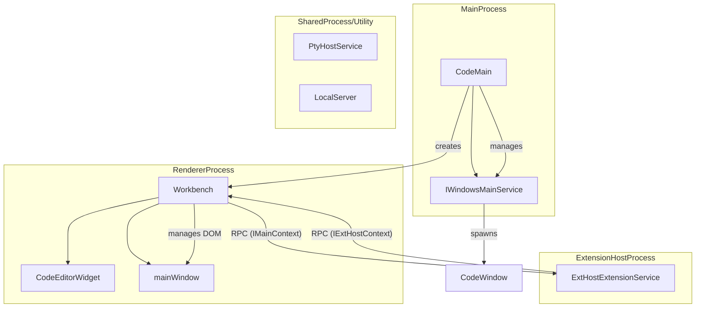

**Sources:**
- `src/vs/code/electron-main/app.ts` [58-80](https://github.com/microsoft/vscode/blob/HEAD/src/vs/code/electron-main/app.ts#L58-L80)
- `src/vs/workbench/browser/web.main.ts` [13-13](https://github.com/microsoft/vscode/blob/HEAD/src/vs/workbench/browser/web.main.ts#L13)
- `package.json` [9-10](https://github.com/microsoft/vscode/blob/HEAD/package.json#L9-L10)
- `remote/package.json` [2-5](https://github.com/microsoft/vscode/blob/HEAD/remote/package.json#L2-L5)

## Repository Structure and Build System

The repository is organized to support multiple targets (Electron desktop, REH server, web) from a single codebase.

*   **`src/`**: The core TypeScript source code.
*   **`extensions/`**: Built-in extensions like Git, Markdown, and the `copilot` chat extension. [package.json:27-27](https://github.com/microsoft/vscode/blob/HEAD/package.json#L27)
*   **`build/`**: Gulp, Rspack, and Vite configurations for the build pipeline. [package.json:55-55, 75-75](https://github.com/microsoft/vscode/blob/HEAD/package.json#L55)
*   **`cli/`**: The Rust-based command-line interface. [remote/package.json:43-43](https://github.com/microsoft/vscode/blob/HEAD/remote/package.json#L43)
*   **`remote/`**: Configuration and dependencies for the Remote Extension Host (REH) and Web server. [remote/package.json:1-5](https://github.com/microsoft/vscode/blob/HEAD/remote/package.json#L1-L5)

VS Code uses a multi-target build system defined in `package.json`. It supports transpilation for the desktop application (`compile-client`), the Copilot features (`compile-copilot`), and web-based targets (`compile-web`). [package.json:25-27, 74-74](https://github.com/microsoft/vscode/blob/HEAD/package.json#L25-L27)

For details, see [Repository Structure and Build System](#1.1).

**Sources:**
- `package.json` [25-27, 73-77](https://github.com/microsoft/vscode/blob/HEAD/package.json#L25-L27)
- `remote/package.json` [1-5, 43-43](https://github.com/microsoft/vscode/blob/HEAD/remote/package.json#L1-L5)

## Core Architectural Layers

The codebase follows a strict layering model to manage dependencies and ensure portability across platforms.

1.  **`base`**: General utilities (e.g., `Event`, `IDisposable`, `VSBuffer`) and UI building blocks. [src/vs/workbench/browser/web.main.ts:11-11](https://github.com/microsoft/vscode/blob/HEAD/src/vs/workbench/browser/web.main.ts#L11)
2.  **`platform`**: Common services (Files, Configuration, Telemetry) and the Dependency Injection (DI) system. [src/vs/platform/instantiation/common/instantiation.ts:58-59](https://github.com/microsoft/vscode/blob/HEAD/src/vs/platform/instantiation/common/instantiation.ts#L58-L59)
3.  **`editor`**: The "Monaco" editor core, including the text model and rendering pipeline. [src/vs/workbench/workbench.common.main.ts:8-8](https://github.com/microsoft/vscode/blob/HEAD/src/vs/workbench/workbench.common.main.ts#L8)
4.  **`workbench`**: The UI framework surrounding the editor (Sidebars, Panels, Activity Bar). [src/vs/workbench/browser/web.main.ts:13-13](https://github.com/microsoft/vscode/blob/HEAD/src/vs/workbench/browser/web.main.ts#L13)
5.  **`sessions`**: Specialized layer for AI-centric orchestration and "Agents Windows". [src/vs/workbench/workbench.common.main.ts:14-20](https://github.com/microsoft/vscode/blob/HEAD/src/vs/workbench/workbench.common.main.ts#L14-L20)

Imports are strictly enforced by the `valid-layers-check` script to prevent layer violations. [package.json:68-68](https://github.com/microsoft/vscode/blob/HEAD/package.json#L68)

For details, see [Core Architectural Layers](#1.2).

**Sources:**
- `package.json` [68-68](https://github.com/microsoft/vscode/blob/HEAD/package.json#L68)
- `src/vs/workbench/workbench.common.main.ts` [8-20](https://github.com/microsoft/vscode/blob/HEAD/src/vs/workbench/workbench.common.main.ts#L8-L20)
- `src/vs/platform/instantiation/common/instantiation.ts` [58-59](https://github.com/microsoft/vscode/blob/HEAD/src/vs/platform/instantiation/common/instantiation.ts#L58-L59)

## Major Subsystems

VS Code functionality is partitioned into several large subsystems that interact via the service layer:

| Subsystem | Primary Responsibility | Key Service/Entry Point |
| :--- | :--- | :--- |
| **Workbench** | Layout, Views, and UI Parts | `IWorkbenchLayoutService`, `IEditorService` |
| **Monaco** | Text rendering and language features | `ITextModel`, `ICodeEditor` |
| **Extension Host** | Running 3rd party code safely | `IExtensionService` |
| **Terminal** | Integrated shell access | `ITerminalService` |
| **AI/Copilot** | Chat, Inline completions, and Agents | `IChatService`, `IAgentService` |
| **Notebooks** | Interactive document execution | `INotebookService` |

**Sources:**
- `src/vs/workbench/workbench.common.main.ts` [53-150](https://github.com/microsoft/vscode/blob/HEAD/src/vs/workbench/workbench.common.main.ts#L53-L150)
- `src/vs/workbench/browser/web.main.ts` [8-86](https://github.com/microsoft/vscode/blob/HEAD/src/vs/workbench/browser/web.main.ts#L8-L86)

## Code Navigation and Services

VS Code uses a custom Dependency Injection (DI) system. Most functionality is exposed as services identified by a decorator (e.g., `IFileService`).

### Service Association Diagram

This diagram shows how system-level concepts map to specific service identifiers and their implementations used in the code.

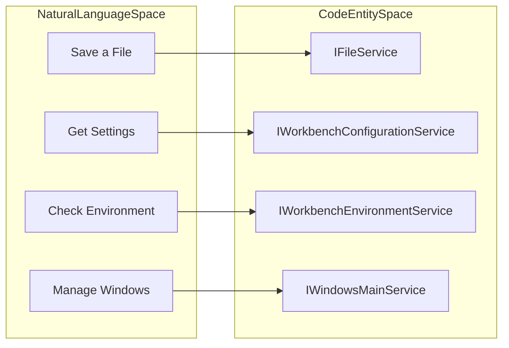

### CLI Entry Points Diagram

Navigating the codebase often starts with the command-line arguments handled in the `NativeParsedArgs` interface.

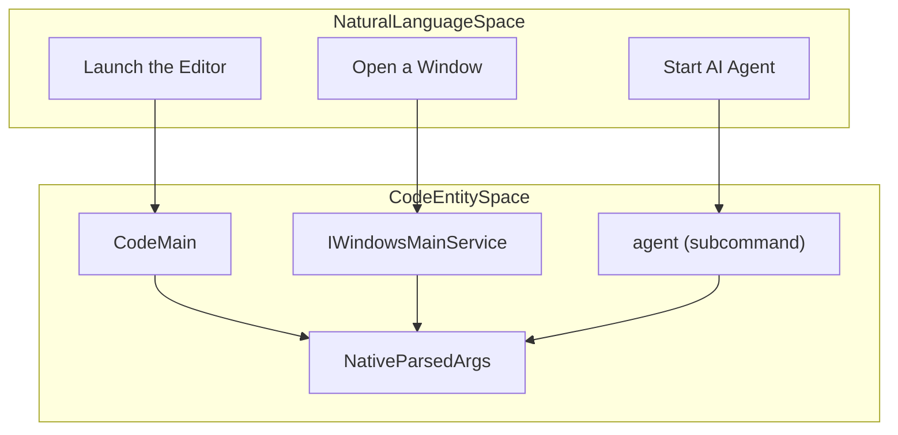

**Sources:**
- `src/vs/platform/environment/common/argv.ts` [43-43](https://github.com/microsoft/vscode/blob/HEAD/src/vs/platform/environment/common/argv.ts#L43)
- `src/vs/workbench/browser/web.main.ts` [8-25](https://github.com/microsoft/vscode/blob/HEAD/src/vs/workbench/browser/web.main.ts#L8-L25)

## Getting Started

To begin contributing, you must set up the development environment, which involves installing dependencies and running the build scripts.

*   **Setup**: Run `npm install`. This triggers `postinstall.ts` to configure the repository. [package.json:24-24](https://github.com/microsoft/vscode/blob/HEAD/package.json#L24)
*   **Compilation**: Use `npm run compile` or `npm run watch` for incremental builds. [package.json:25-33](https://github.com/microsoft/vscode/blob/HEAD/package.json#L25-L33)
*   **Testing**: Unit tests can be run via `npm run test-node` or `npm run test-browser`. [package.json:14-16](https://github.com/microsoft/vscode/blob/HEAD/package.json#L14-L16)
*   **Execution**: Launch the development version using the `electron` script. [package.json:56-56](https://github.com/microsoft/vscode/blob/HEAD/package.json#L56)

For details, see [Getting Started: Development Environment](#1.3).

**Sources:**
- `package.json` [12-56, 23-24](https://github.com/microsoft/vscode/blob/HEAD/package.json#L12-L56)

## Child Pages
- [Repository Structure and Build System](#1.1)
- [Core Architectural Layers](#1.2)
- [Getting Started: Development Environment](#1.3)
- [Contribution Workflow and Repo Automation](#1.4)


---

<!-- Chapter 2: Repository Structure and Build System -->
<!-- Source: https://deepwiki.com/microsoft/vscode/1.1-repository-structure-and-build-system -->

# Repository Structure and Build System

<details>
<summary>Relevant source files</summary>

The following files were used as context for generating this wiki page:

- [.github/agents/demonstrate.md](https://github.com/microsoft/vscode/blob/HEAD/.github/agents/demonstrate.md)
- [.github/instructions/buildNext.instructions.md](https://github.com/microsoft/vscode/blob/HEAD/.github/instructions/buildNext.instructions.md)
- [.github/prompts/codenotify.prompt.md](https://github.com/microsoft/vscode/blob/HEAD/.github/prompts/codenotify.prompt.md)
- [.github/prompts/component.prompt.md](https://github.com/microsoft/vscode/blob/HEAD/.github/prompts/component.prompt.md)
- [.github/prompts/fixIssueNo.prompt.md](https://github.com/microsoft/vscode/blob/HEAD/.github/prompts/fixIssueNo.prompt.md)
- [.github/prompts/implement.prompt.md](https://github.com/microsoft/vscode/blob/HEAD/.github/prompts/implement.prompt.md)
- [.github/prompts/no-any.prompt.md](https://github.com/microsoft/vscode/blob/HEAD/.github/prompts/no-any.prompt.md)
- [.github/prompts/plan-deep.prompt.md](https://github.com/microsoft/vscode/blob/HEAD/.github/prompts/plan-deep.prompt.md)
- [.github/prompts/plan-fast.prompt.md](https://github.com/microsoft/vscode/blob/HEAD/.github/prompts/plan-fast.prompt.md)
- [.github/prompts/setup-environment.prompt.md](https://github.com/microsoft/vscode/blob/HEAD/.github/prompts/setup-environment.prompt.md)
- [.github/prompts/update-instructions.prompt.md](https://github.com/microsoft/vscode/blob/HEAD/.github/prompts/update-instructions.prompt.md)
- [.npmrc](https://github.com/microsoft/vscode/blob/HEAD/.npmrc)
- [.nvmrc](https://github.com/microsoft/vscode/blob/HEAD/.nvmrc)
- [.vscode-test.js](https://github.com/microsoft/vscode/blob/HEAD/.vscode-test.js)
- [.vscode/launch.json](https://github.com/microsoft/vscode/blob/HEAD/.vscode/launch.json)
- [.vscode/mcp.json](https://github.com/microsoft/vscode/blob/HEAD/.vscode/mcp.json)
- [.vscode/settings.json](https://github.com/microsoft/vscode/blob/HEAD/.vscode/settings.json)
- [.vscode/tasks.json](https://github.com/microsoft/vscode/blob/HEAD/.vscode/tasks.json)
- [build/.cachesalt](https://github.com/microsoft/vscode/blob/HEAD/build/.cachesalt)
- [build/.moduleignore](https://github.com/microsoft/vscode/blob/HEAD/build/.moduleignore)
- [build/.webignore](https://github.com/microsoft/vscode/blob/HEAD/build/.webignore)
- [build/azure-pipelines/alpine/product-build-alpine-node-modules.yml](https://github.com/microsoft/vscode/blob/HEAD/build/azure-pipelines/alpine/product-build-alpine-node-modules.yml)
- [build/azure-pipelines/alpine/product-build-alpine.yml](https://github.com/microsoft/vscode/blob/HEAD/build/azure-pipelines/alpine/product-build-alpine.yml)
- [build/azure-pipelines/cli/cli-compile.yml](https://github.com/microsoft/vscode/blob/HEAD/build/azure-pipelines/cli/cli-compile.yml)
- [build/azure-pipelines/common/createBuild.ts](https://github.com/microsoft/vscode/blob/HEAD/build/azure-pipelines/common/createBuild.ts)
- [build/azure-pipelines/common/publish.ts](https://github.com/microsoft/vscode/blob/HEAD/build/azure-pipelines/common/publish.ts)
- [build/azure-pipelines/common/releaseBuild.ts](https://github.com/microsoft/vscode/blob/HEAD/build/azure-pipelines/common/releaseBuild.ts)
- [build/azure-pipelines/copilot/setup-steps.yml](https://github.com/microsoft/vscode/blob/HEAD/build/azure-pipelines/copilot/setup-steps.yml)
- [build/azure-pipelines/darwin/product-build-darwin-node-modules.yml](https://github.com/microsoft/vscode/blob/HEAD/build/azure-pipelines/darwin/product-build-darwin-node-modules.yml)
- [build/azure-pipelines/darwin/product-build-darwin-universal.yml](https://github.com/microsoft/vscode/blob/HEAD/build/azure-pipelines/darwin/product-build-darwin-universal.yml)
- [build/azure-pipelines/darwin/product-build-darwin.yml](https://github.com/microsoft/vscode/blob/HEAD/build/azure-pipelines/darwin/product-build-darwin.yml)
- [build/azure-pipelines/darwin/steps/product-build-darwin-compile.yml](https://github.com/microsoft/vscode/blob/HEAD/build/azure-pipelines/darwin/steps/product-build-darwin-compile.yml)
- [build/azure-pipelines/linux/product-build-linux-node-modules.yml](https://github.com/microsoft/vscode/blob/HEAD/build/azure-pipelines/linux/product-build-linux-node-modules.yml)
- [build/azure-pipelines/linux/product-build-linux.yml](https://github.com/microsoft/vscode/blob/HEAD/build/azure-pipelines/linux/product-build-linux.yml)
- [build/azure-pipelines/linux/setup-env.sh](https://github.com/microsoft/vscode/blob/HEAD/build/azure-pipelines/linux/setup-env.sh)
- [build/azure-pipelines/linux/steps/product-build-linux-compile.yml](https://github.com/microsoft/vscode/blob/HEAD/build/azure-pipelines/linux/steps/product-build-linux-compile.yml)
- [build/azure-pipelines/product-build.yml](https://github.com/microsoft/vscode/blob/HEAD/build/azure-pipelines/product-build.yml)
- [build/azure-pipelines/product-publish.yml](https://github.com/microsoft/vscode/blob/HEAD/build/azure-pipelines/product-publish.yml)
- [build/azure-pipelines/product-quality-checks.yml](https://github.com/microsoft/vscode/blob/HEAD/build/azure-pipelines/product-quality-checks.yml)
- [build/azure-pipelines/product-release.yml](https://github.com/microsoft/vscode/blob/HEAD/build/azure-pipelines/product-release.yml)
- [build/azure-pipelines/upload-cdn.ts](https://github.com/microsoft/vscode/blob/HEAD/build/azure-pipelines/upload-cdn.ts)
- [build/azure-pipelines/upload-nlsmetadata.ts](https://github.com/microsoft/vscode/blob/HEAD/build/azure-pipelines/upload-nlsmetadata.ts)
- [build/azure-pipelines/upload-sourcemaps.ts](https://github.com/microsoft/vscode/blob/HEAD/build/azure-pipelines/upload-sourcemaps.ts)
- [build/azure-pipelines/web/product-build-web-node-modules.yml](https://github.com/microsoft/vscode/blob/HEAD/build/azure-pipelines/web/product-build-web-node-modules.yml)
- [build/azure-pipelines/web/product-build-web.yml](https://github.com/microsoft/vscode/blob/HEAD/build/azure-pipelines/web/product-build-web.yml)
- [build/azure-pipelines/win32/product-build-win32-node-modules.yml](https://github.com/microsoft/vscode/blob/HEAD/build/azure-pipelines/win32/product-build-win32-node-modules.yml)
- [build/azure-pipelines/win32/product-build-win32.yml](https://github.com/microsoft/vscode/blob/HEAD/build/azure-pipelines/win32/product-build-win32.yml)
- [build/azure-pipelines/win32/sdl-scan-win32.yml](https://github.com/microsoft/vscode/blob/HEAD/build/azure-pipelines/win32/sdl-scan-win32.yml)
- [build/azure-pipelines/win32/steps/product-build-win32-compile.yml](https://github.com/microsoft/vscode/blob/HEAD/build/azure-pipelines/win32/steps/product-build-win32-compile.yml)
- [build/buildfile.ts](https://github.com/microsoft/vscode/blob/HEAD/build/buildfile.ts)
- [build/checksums/electron.txt](https://github.com/microsoft/vscode/blob/HEAD/build/checksums/electron.txt)
- [build/checksums/nodejs.txt](https://github.com/microsoft/vscode/blob/HEAD/build/checksums/nodejs.txt)
- [build/checksums/vscode-sysroot.txt](https://github.com/microsoft/vscode/blob/HEAD/build/checksums/vscode-sysroot.txt)
- [build/darwin/create-universal-app.ts](https://github.com/microsoft/vscode/blob/HEAD/build/darwin/create-universal-app.ts)
- [build/darwin/verify-macho.ts](https://github.com/microsoft/vscode/blob/HEAD/build/darwin/verify-macho.ts)
- [build/gulpfile.reh.ts](https://github.com/microsoft/vscode/blob/HEAD/build/gulpfile.reh.ts)
- [build/gulpfile.vscode.ts](https://github.com/microsoft/vscode/blob/HEAD/build/gulpfile.vscode.ts)
- [build/gulpfile.vscode.web.ts](https://github.com/microsoft/vscode/blob/HEAD/build/gulpfile.vscode.web.ts)
- [build/lib/copilot.ts](https://github.com/microsoft/vscode/blob/HEAD/build/lib/copilot.ts)
- [build/lib/nls.ts](https://github.com/microsoft/vscode/blob/HEAD/build/lib/nls.ts)
- [build/lib/npmPackage.ts](https://github.com/microsoft/vscode/blob/HEAD/build/lib/npmPackage.ts)
- [build/lib/osProxyResolver.ts](https://github.com/microsoft/vscode/blob/HEAD/build/lib/osProxyResolver.ts)
- [build/lib/test/copilot.test.ts](https://github.com/microsoft/vscode/blob/HEAD/build/lib/test/copilot.test.ts)
- [build/lib/test/osProxyResolver.test.ts](https://github.com/microsoft/vscode/blob/HEAD/build/lib/test/osProxyResolver.test.ts)
- [build/linux/debian/calculate-deps.ts](https://github.com/microsoft/vscode/blob/HEAD/build/linux/debian/calculate-deps.ts)
- [build/linux/debian/dep-lists.ts](https://github.com/microsoft/vscode/blob/HEAD/build/linux/debian/dep-lists.ts)
- [build/linux/debian/install-sysroot.ts](https://github.com/microsoft/vscode/blob/HEAD/build/linux/debian/install-sysroot.ts)
- [build/linux/dependencies-generator.ts](https://github.com/microsoft/vscode/blob/HEAD/build/linux/dependencies-generator.ts)
- [build/linux/rpm/dep-lists.ts](https://github.com/microsoft/vscode/blob/HEAD/build/linux/rpm/dep-lists.ts)
- [build/next/build-fast.ts](https://github.com/microsoft/vscode/blob/HEAD/build/next/build-fast.ts)
- [build/next/index.ts](https://github.com/microsoft/vscode/blob/HEAD/build/next/index.ts)
- [build/next/nls-plugin.ts](https://github.com/microsoft/vscode/blob/HEAD/build/next/nls-plugin.ts)
- [build/next/private-to-property.ts](https://github.com/microsoft/vscode/blob/HEAD/build/next/private-to-property.ts)
- [build/next/test/build-fast.test.ts](https://github.com/microsoft/vscode/blob/HEAD/build/next/test/build-fast.test.ts)
- [build/next/test/nls-sourcemap.test.ts](https://github.com/microsoft/vscode/blob/HEAD/build/next/test/nls-sourcemap.test.ts)
- [build/next/test/private-to-property.test.ts](https://github.com/microsoft/vscode/blob/HEAD/build/next/test/private-to-property.test.ts)
- [build/next/transpile.ts](https://github.com/microsoft/vscode/blob/HEAD/build/next/transpile.ts)
- [build/package-lock.json](https://github.com/microsoft/vscode/blob/HEAD/build/package-lock.json)
- [build/package.json](https://github.com/microsoft/vscode/blob/HEAD/build/package.json)
- [cgmanifest.json](https://github.com/microsoft/vscode/blob/HEAD/cgmanifest.json)
- [cli/Cargo.lock](https://github.com/microsoft/vscode/blob/HEAD/cli/Cargo.lock)
- [cli/Cargo.toml](https://github.com/microsoft/vscode/blob/HEAD/cli/Cargo.toml)
- [cli/src/async_pipe.rs](https://github.com/microsoft/vscode/blob/HEAD/cli/src/async_pipe.rs)
- [cli/src/auth.rs](https://github.com/microsoft/vscode/blob/HEAD/cli/src/auth.rs)
- [cli/src/bin/code/main.rs](https://github.com/microsoft/vscode/blob/HEAD/cli/src/bin/code/main.rs)
- [cli/src/commands.rs](https://github.com/microsoft/vscode/blob/HEAD/cli/src/commands.rs)
- [cli/src/commands/agent.rs](https://github.com/microsoft/vscode/blob/HEAD/cli/src/commands/agent.rs)
- [cli/src/commands/agent_discovery.rs](https://github.com/microsoft/vscode/blob/HEAD/cli/src/commands/agent_discovery.rs)
- [cli/src/commands/agent_host.rs](https://github.com/microsoft/vscode/blob/HEAD/cli/src/commands/agent_host.rs)
- [cli/src/commands/agent_kill.rs](https://github.com/microsoft/vscode/blob/HEAD/cli/src/commands/agent_kill.rs)
- [cli/src/commands/agent_logs.rs](https://github.com/microsoft/vscode/blob/HEAD/cli/src/commands/agent_logs.rs)
- [cli/src/commands/agent_ps.rs](https://github.com/microsoft/vscode/blob/HEAD/cli/src/commands/agent_ps.rs)
- [cli/src/commands/agent_stop.rs](https://github.com/microsoft/vscode/blob/HEAD/cli/src/commands/agent_stop.rs)
- [cli/src/commands/args.rs](https://github.com/microsoft/vscode/blob/HEAD/cli/src/commands/args.rs)
- [cli/src/commands/serve_web.rs](https://github.com/microsoft/vscode/blob/HEAD/cli/src/commands/serve_web.rs)
- [cli/src/commands/tunnels.rs](https://github.com/microsoft/vscode/blob/HEAD/cli/src/commands/tunnels.rs)
- [cli/src/constants.rs](https://github.com/microsoft/vscode/blob/HEAD/cli/src/constants.rs)
- [cli/src/desktop/version_manager.rs](https://github.com/microsoft/vscode/blob/HEAD/cli/src/desktop/version_manager.rs)
- [cli/src/download_cache.rs](https://github.com/microsoft/vscode/blob/HEAD/cli/src/download_cache.rs)
- [cli/src/lib.rs](https://github.com/microsoft/vscode/blob/HEAD/cli/src/lib.rs)
- [cli/src/log.rs](https://github.com/microsoft/vscode/blob/HEAD/cli/src/log.rs)
- [cli/src/msgpack_rpc.rs](https://github.com/microsoft/vscode/blob/HEAD/cli/src/msgpack_rpc.rs)
- [cli/src/options.rs](https://github.com/microsoft/vscode/blob/HEAD/cli/src/options.rs)
- [cli/src/self_update.rs](https://github.com/microsoft/vscode/blob/HEAD/cli/src/self_update.rs)
- [cli/src/state.rs](https://github.com/microsoft/vscode/blob/HEAD/cli/src/state.rs)
- [cli/src/tunnels.rs](https://github.com/microsoft/vscode/blob/HEAD/cli/src/tunnels.rs)
- [cli/src/tunnels/agent_host.rs](https://github.com/microsoft/vscode/blob/HEAD/cli/src/tunnels/agent_host.rs)
- [cli/src/tunnels/challenge.rs](https://github.com/microsoft/vscode/blob/HEAD/cli/src/tunnels/challenge.rs)
- [cli/src/tunnels/code_server.rs](https://github.com/microsoft/vscode/blob/HEAD/cli/src/tunnels/code_server.rs)
- [cli/src/tunnels/control_server.rs](https://github.com/microsoft/vscode/blob/HEAD/cli/src/tunnels/control_server.rs)
- [cli/src/tunnels/dev_tunnels.rs](https://github.com/microsoft/vscode/blob/HEAD/cli/src/tunnels/dev_tunnels.rs)
- [cli/src/tunnels/local_forwarding.rs](https://github.com/microsoft/vscode/blob/HEAD/cli/src/tunnels/local_forwarding.rs)
- [cli/src/tunnels/port_forwarder.rs](https://github.com/microsoft/vscode/blob/HEAD/cli/src/tunnels/port_forwarder.rs)
- [cli/src/tunnels/protocol.rs](https://github.com/microsoft/vscode/blob/HEAD/cli/src/tunnels/protocol.rs)
- [cli/src/tunnels/server_bridge.rs](https://github.com/microsoft/vscode/blob/HEAD/cli/src/tunnels/server_bridge.rs)
- [cli/src/tunnels/service.rs](https://github.com/microsoft/vscode/blob/HEAD/cli/src/tunnels/service.rs)
- [cli/src/tunnels/service_linux.rs](https://github.com/microsoft/vscode/blob/HEAD/cli/src/tunnels/service_linux.rs)
- [cli/src/tunnels/service_macos.rs](https://github.com/microsoft/vscode/blob/HEAD/cli/src/tunnels/service_macos.rs)
- [cli/src/tunnels/service_windows.rs](https://github.com/microsoft/vscode/blob/HEAD/cli/src/tunnels/service_windows.rs)
- [cli/src/tunnels/singleton_client.rs](https://github.com/microsoft/vscode/blob/HEAD/cli/src/tunnels/singleton_client.rs)
- [cli/src/tunnels/singleton_server.rs](https://github.com/microsoft/vscode/blob/HEAD/cli/src/tunnels/singleton_server.rs)
- [cli/src/tunnels/socket_signal.rs](https://github.com/microsoft/vscode/blob/HEAD/cli/src/tunnels/socket_signal.rs)
- [cli/src/util/command.rs](https://github.com/microsoft/vscode/blob/HEAD/cli/src/util/command.rs)
- [cli/src/util/errors.rs](https://github.com/microsoft/vscode/blob/HEAD/cli/src/util/errors.rs)
- [cli/src/util/io.rs](https://github.com/microsoft/vscode/blob/HEAD/cli/src/util/io.rs)
- [cli/src/util/sync.rs](https://github.com/microsoft/vscode/blob/HEAD/cli/src/util/sync.rs)
- [extensions/copilot/.vscode/settings.json](https://github.com/microsoft/vscode/blob/HEAD/extensions/copilot/.vscode/settings.json)
- [extensions/copilot/.vscodeignore](https://github.com/microsoft/vscode/blob/HEAD/extensions/copilot/.vscodeignore)
- [extensions/copilot/chat-lib/package-lock.json](https://github.com/microsoft/vscode/blob/HEAD/extensions/copilot/chat-lib/package-lock.json)
- [extensions/copilot/chat-lib/package.json](https://github.com/microsoft/vscode/blob/HEAD/extensions/copilot/chat-lib/package.json)
- [extensions/copilot/package-lock.json](https://github.com/microsoft/vscode/blob/HEAD/extensions/copilot/package-lock.json)
- [extensions/copilot/script/postinstall.ts](https://github.com/microsoft/vscode/blob/HEAD/extensions/copilot/script/postinstall.ts)
- [extensions/copilot/src/extension/chatSessions/copilotcli/vscode-node/test/copilotCLISDKUpgrade.spec.ts](https://github.com/microsoft/vscode/blob/HEAD/extensions/copilot/src/extension/chatSessions/copilotcli/vscode-node/test/copilotCLISDKUpgrade.spec.ts)
- [extensions/tunnel-forwarding/.vscode/launch.json](https://github.com/microsoft/vscode/blob/HEAD/extensions/tunnel-forwarding/.vscode/launch.json)
- [extensions/tunnel-forwarding/.vscodeignore](https://github.com/microsoft/vscode/blob/HEAD/extensions/tunnel-forwarding/.vscodeignore)
- [extensions/tunnel-forwarding/src/extension.ts](https://github.com/microsoft/vscode/blob/HEAD/extensions/tunnel-forwarding/src/extension.ts)
- [package-lock.json](https://github.com/microsoft/vscode/blob/HEAD/package-lock.json)
- [package.json](https://github.com/microsoft/vscode/blob/HEAD/package.json)
- [remote/.npmrc](https://github.com/microsoft/vscode/blob/HEAD/remote/.npmrc)
- [remote/package-lock.json](https://github.com/microsoft/vscode/blob/HEAD/remote/package-lock.json)
- [remote/package.json](https://github.com/microsoft/vscode/blob/HEAD/remote/package.json)
- [remote/web/package-lock.json](https://github.com/microsoft/vscode/blob/HEAD/remote/web/package-lock.json)
- [remote/web/package.json](https://github.com/microsoft/vscode/blob/HEAD/remote/web/package.json)
- [scripts/test-integration.bat](https://github.com/microsoft/vscode/blob/HEAD/scripts/test-integration.bat)
- [scripts/test-integration.sh](https://github.com/microsoft/vscode/blob/HEAD/scripts/test-integration.sh)
- [scripts/test-remote-integration.bat](https://github.com/microsoft/vscode/blob/HEAD/scripts/test-remote-integration.bat)
- [scripts/test-remote-integration.sh](https://github.com/microsoft/vscode/blob/HEAD/scripts/test-remote-integration.sh)
- [scripts/test-web-integration.bat](https://github.com/microsoft/vscode/blob/HEAD/scripts/test-web-integration.bat)
- [scripts/test-web-integration.sh](https://github.com/microsoft/vscode/blob/HEAD/scripts/test-web-integration.sh)
- [src/vs/base/common/codiconsLibrary.ts](https://github.com/microsoft/vscode/blob/HEAD/src/vs/base/common/codiconsLibrary.ts)
- [src/vs/nls.ts](https://github.com/microsoft/vscode/blob/HEAD/src/vs/nls.ts)
- [src/vs/platform/environment/test/node/nativeModules.integrationTest.ts](https://github.com/microsoft/vscode/blob/HEAD/src/vs/platform/environment/test/node/nativeModules.integrationTest.ts)
- [test/automation/package-lock.json](https://github.com/microsoft/vscode/blob/HEAD/test/automation/package-lock.json)
- [test/automation/package.json](https://github.com/microsoft/vscode/blob/HEAD/test/automation/package.json)
- [test/automation/src/electron.ts](https://github.com/microsoft/vscode/blob/HEAD/test/automation/src/electron.ts)
- [test/automation/src/playwrightBrowser.ts](https://github.com/microsoft/vscode/blob/HEAD/test/automation/src/playwrightBrowser.ts)
- [test/automation/src/playwrightElectron.ts](https://github.com/microsoft/vscode/blob/HEAD/test/automation/src/playwrightElectron.ts)
- [test/integration/browser/package-lock.json](https://github.com/microsoft/vscode/blob/HEAD/test/integration/browser/package-lock.json)
- [test/integration/browser/package.json](https://github.com/microsoft/vscode/blob/HEAD/test/integration/browser/package.json)
- [test/mcp/README.md](https://github.com/microsoft/vscode/blob/HEAD/test/mcp/README.md)
- [test/mcp/package-lock.json](https://github.com/microsoft/vscode/blob/HEAD/test/mcp/package-lock.json)
- [test/mcp/package.json](https://github.com/microsoft/vscode/blob/HEAD/test/mcp/package.json)
- [test/mcp/src/application.ts](https://github.com/microsoft/vscode/blob/HEAD/test/mcp/src/application.ts)
- [test/mcp/src/automation.ts](https://github.com/microsoft/vscode/blob/HEAD/test/mcp/src/automation.ts)
- [test/mcp/src/automationTools/chat.ts](https://github.com/microsoft/vscode/blob/HEAD/test/mcp/src/automationTools/chat.ts)
- [test/mcp/src/automationTools/core.ts](https://github.com/microsoft/vscode/blob/HEAD/test/mcp/src/automationTools/core.ts)
- [test/mcp/src/automationTools/index.ts](https://github.com/microsoft/vscode/blob/HEAD/test/mcp/src/automationTools/index.ts)
- [test/mcp/src/automationTools/settings.ts](https://github.com/microsoft/vscode/blob/HEAD/test/mcp/src/automationTools/settings.ts)
- [test/mcp/src/automationTools/windows.ts](https://github.com/microsoft/vscode/blob/HEAD/test/mcp/src/automationTools/windows.ts)
- [test/mcp/src/evidence.ts](https://github.com/microsoft/vscode/blob/HEAD/test/mcp/src/evidence.ts)
- [test/mcp/src/options.ts](https://github.com/microsoft/vscode/blob/HEAD/test/mcp/src/options.ts)
- [test/mcp/src/stdio.ts](https://github.com/microsoft/vscode/blob/HEAD/test/mcp/src/stdio.ts)
- [test/mcp/src/utils.ts](https://github.com/microsoft/vscode/blob/HEAD/test/mcp/src/utils.ts)
- [test/smoke/package-lock.json](https://github.com/microsoft/vscode/blob/HEAD/test/smoke/package-lock.json)
- [test/smoke/package.json](https://github.com/microsoft/vscode/blob/HEAD/test/smoke/package.json)

</details>


The VS Code repository is a multi-target project designed to produce several distinct distributions: the Electron-based desktop application, the Remote Extension Host (REH) server, and the web-based editor. The build system manages these targets through a unified Gulp-based pipeline, augmented by modern tools like Rspack and Vite for web targets and component exploration.

## Top-Level Directory Layout

The repository is organized into several key directories, each serving a specific role in the development and build lifecycle.

| Directory | Purpose | Key Contents |
| :--- | :--- | :--- |
| `src/` | Core source code | TypeScript source for base, platform, editor, workbench, and sessions. |
| `extensions/` | Built-in extensions | Extensions like TypeScript, Markdown, and Copilot [package.json:25-27](https://github.com/microsoft/vscode/blob/HEAD/package.json#L25-L27). |
| `build/` | Build infrastructure | Gulp tasks, CI configuration, and compilation scripts [build/package.json:1-5](https://github.com/microsoft/vscode/blob/HEAD/build/package.json#L1-L5). |
| `cli/` | Command Line Interface | Rust-based source for the `code` tunnel and CLI client [cli/Cargo.toml:1-10](https://github.com/microsoft/vscode/blob/HEAD/cli/Cargo.toml#L1-L10). |
| `resources/` | Static assets | Icons, platform-specific installers, and platform metadata. |
| `scripts/` | Helper scripts | Developer utilities for launching, testing, and profiling [package.json:90-92](https://github.com/microsoft/vscode/blob/HEAD/package.json#L90-L92). |
| `remote/` | Remote Server | Server-specific `package.json` and web-target dependencies [remote/package.json:1-5](https://github.com/microsoft/vscode/blob/HEAD/remote/package.json#L1-L5). |

**Sources:** [package.json:1-98](https://github.com/microsoft/vscode/blob/HEAD/package.json#L1-L98), [remote/package.json:1-5](https://github.com/microsoft/vscode/blob/HEAD/remote/package.json#L1-L5), [build/package.json:1-5](https://github.com/microsoft/vscode/blob/HEAD/build/package.json#L1-L5), [remote/web/package.json:1-5](https://github.com/microsoft/vscode/blob/HEAD/remote/web/package.json#L1-L5), [cli/Cargo.toml:1-10](https://github.com/microsoft/vscode/blob/HEAD/cli/Cargo.toml#L1-L10)

## Multi-Target Build System

VS Code uses a multi-layered build approach to support different execution environments. The primary entry point for build tasks is managed through Gulp, with logic distributed across specialized gulpfiles.

### Distribution Targets
1.  **Electron Desktop:** The standard VS Code application. It combines the `src/` code with the Electron runtime [package.json:56](https://github.com/microsoft/vscode/blob/HEAD/package.json#L56).
2.  **REH (Remote Extension Host):** A Node.js server that runs on a remote machine (e.g., WSL, SSH, or Containers) [remote/package.json:2](https://github.com/microsoft/vscode/blob/HEAD/remote/package.json#L2).
3.  **Web:** A browser-based version of the workbench, often served by the REH or standalone [remote/web/package.json:2](https://github.com/microsoft/vscode/blob/HEAD/remote/web/package.json#L2).

### Build Pipelines
The build system utilizes different compilers and bundlers depending on the target and development mode:

*   **Gulp:** The primary orchestrator for the entire build process, including task definition and file manipulation [package.json:55](https://github.com/microsoft/vscode/blob/HEAD/package.json#L55). Key tasks include `compile-client` [package.json:26](https://github.com/microsoft/vscode/blob/HEAD/package.json#L26), `minify-vscode` [package.json:84](https://github.com/microsoft/vscode/blob/HEAD/package.json#L84), and `core-ci` [package.json:88](https://github.com/microsoft/vscode/blob/HEAD/package.json#L88).
*   **TypeScript (tsc):** Used for type checking and transpilation. Compilation is often handled via `tsc` for specific projects like the main workbench [package.json:30](https://github.com/microsoft/vscode/blob/HEAD/package.json#L30) or the Monaco editor [package.json:65](https://github.com/microsoft/vscode/blob/HEAD/package.json#L65).
*   **Rspack/Vite:** Modern bundlers used for the web targets and component exploration. Rspack is specifically utilized for high-performance bundling of the web workbench via `rspack.serve-out.config.mts` [package.json:75](https://github.com/microsoft/vscode/blob/HEAD/package.json#L75). Integration with Vite is also supported for component exploration [package.json:96-98](https://github.com/microsoft/vscode/blob/HEAD/package.json#L96-L98).
*   **Esbuild:** Frequently used within the `build/` scripts for fast transpilation of build-time utilities and next-generation transpilation pipelines [build/package.json:50](https://github.com/microsoft/vscode/blob/HEAD/build/package.json#L50).

### Build Data Flow
The following diagram illustrates how source code is transformed into the final artifacts, mapping directory structures to the build entities.

Title: VS Code Build Transformation Pipeline
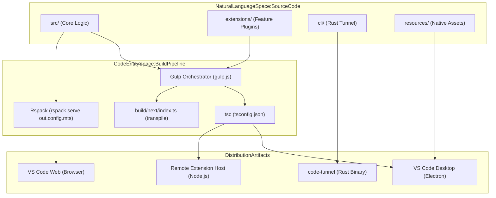
**Sources:** [package.json:25-47](https://github.com/microsoft/vscode/blob/HEAD/package.json#L25-L47), [package.json:73-77](https://github.com/microsoft/vscode/blob/HEAD/package.json#L73-L77), [build/package.json:50](https://github.com/microsoft/vscode/blob/HEAD/build/package.json#L50), [build/next/index.ts:1-10](https://github.com/microsoft/vscode/blob/HEAD/build/next/index.ts#L1-L10), [cli/Cargo.toml:1-10](https://github.com/microsoft/vscode/blob/HEAD/cli/Cargo.toml#L1-L10)

## CI/CD Configuration (Azure Pipelines)

VS Code uses Azure Pipelines for its continuous integration and delivery. The configuration is modularized by platform and target.

### Main Pipeline Stages
The root pipeline is defined in `build/azure-pipelines/product-build.yml`. It orchestrates builds across Windows, Linux, macOS, and Web [build/azure-pipelines/product-build.yml:54-101](https://github.com/microsoft/vscode/blob/HEAD/build/azure-pipelines/product-build.yml#L54-L101).

*   **Parameters:** Allow triggering specific architecture builds (x64, arm64, armhf) and qualities (insider, stable, exploration) [build/azure-pipelines/product-build.yml:31-45](https://github.com/microsoft/vscode/blob/HEAD/build/azure-pipelines/product-build.yml#L31-L45).
*   **Platform Templates:** Each OS has a dedicated template:
    *   Windows: `build/azure-pipelines/win32/product-build-win32.yml` [build/azure-pipelines/win32/product-build-win32.yml:19-20](https://github.com/microsoft/vscode/blob/HEAD/build/azure-pipelines/win32/product-build-win32.yml#L19-L20)
    *   macOS: `build/azure-pipelines/darwin/product-build-darwin.yml` [build/azure-pipelines/darwin/product-build-darwin.yml:17-18](https://github.com/microsoft/vscode/blob/HEAD/build/azure-pipelines/darwin/product-build-darwin.yml#L17-L18)
    *   Linux: `build/azure-pipelines/linux/product-build-linux.yml`
    *   Web: `build/azure-pipelines/web/product-build-web.yml`

### CI Build Artifacts
The pipeline produces several artifacts per platform:
1.  **System/User Setups:** Executable installers for Windows [build/azure-pipelines/win32/product-build-win32.yml:51-63](https://github.com/microsoft/vscode/blob/HEAD/build/azure-pipelines/win32/product-build-win32.yml#L51-L63).
2.  **Archives:** `.zip`, `.dmg`, or `.tar.gz` files for portable use across macOS and Linux [build/azure-pipelines/darwin/product-build-darwin.yml:49-57](https://github.com/microsoft/vscode/blob/HEAD/build/azure-pipelines/darwin/product-build-darwin.yml#L49-L57).
3.  **Server/Web Builds:** Optimized bundles for remote and browser scenarios [build/azure-pipelines/win32/product-build-win32.yml:72-84](https://github.com/microsoft/vscode/blob/HEAD/build/azure-pipelines/win32/product-build-win32.yml#L72-L84).

### CI/CD Pipeline Architecture
This diagram bridges the CI configuration to the resulting system artifacts.

Title: Azure Pipelines CI/CD Architecture
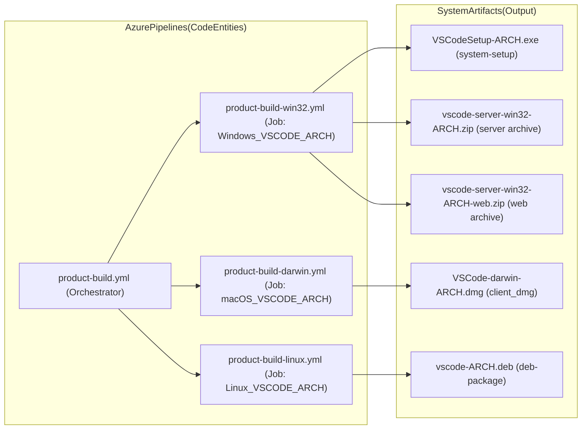
**Sources:** [build/azure-pipelines/product-build.yml:159-168](https://github.com/microsoft/vscode/blob/HEAD/build/azure-pipelines/product-build.yml#L159-L168), [build/azure-pipelines/win32/product-build-win32.yml:51-84](https://github.com/microsoft/vscode/blob/HEAD/build/azure-pipelines/win32/product-build-win32.yml#L51-L84), [build/azure-pipelines/darwin/product-build-darwin.yml:73-78](https://github.com/microsoft/vscode/blob/HEAD/build/azure-pipelines/darwin/product-build-darwin.yml#L73-L78)

## Meta Tooling and Repo Orientation

The repository includes extensive meta-tooling to support contributors and enforce standards.

*   **.github/:** Contains GitHub-specific automation, including issue templates, PR templates, and GitHub Actions workflows.
*   **.devcontainer/:** Configuration for developing VS Code inside a container, ensuring a consistent environment.
*   **.vscode/:** Shared workspace settings, launch configurations for debugging the workbench, and task definitions [ .vscode/settings.json:1-10](https://github.com/microsoft/vscode/blob/HEAD/.vscode/settings.json#L1-L10).
*   **scripts/:** Houses developer utilities like `code.sh` or `code.bat` for launching the built editor, and test runners like `test.sh` [package.json:13](https://github.com/microsoft/vscode/blob/HEAD/package.json#L13).
*   **.eslint-plugin-local/:** Contains local ESLint rules specific to the VS Code codebase, such as enforcing layering rules.
*   **build/checker/:** Contains custom linting and architectural enforcement tools like the `layersChecker.ts` which ensures the strict layering model is not violated [package.json:68](https://github.com/microsoft/vscode/blob/HEAD/package.json#L68).

## Key Build Scripts and Commands

The `package.json` defines numerous scripts for local development and build automation.

| Command | Action |
| :--- | :--- |
| `npm run compile` | Runs Gulp to compile the client and Copilot extension [package.json:25](https://github.com/microsoft/vscode/blob/HEAD/package.json#L25). |
| `npm run watch` | Starts a multi-process watch mode for the client, extensions, and Copilot [package.json:33](https://github.com/microsoft/vscode/blob/HEAD/package.json#L33). |
| `npm run gulp -- <task>` | Direct access to the Gulp task runner with high memory limits (8GB) [package.json:55](https://github.com/microsoft/vscode/blob/HEAD/package.json#L55). |
| `npm run hygiene` | Runs Gulp hygiene tasks for code quality and linting [package.json:87](https://github.com/microsoft/vscode/blob/HEAD/package.json#L87). |
| `npm run valid-layers-check` | Enforces the strict layering model via `layersChecker.ts` [package.json:68](https://github.com/microsoft/vscode/blob/HEAD/package.json#L68). |
| `npm run test-node` | Runs unit tests in the Node.js environment via Mocha [package.json:16](https://github.com/microsoft/vscode/blob/HEAD/package.json#L16). |
| `npm run test-browser` | Installs Playwright and runs unit tests in the browser [package.json:14](https://github.com/microsoft/vscode/blob/HEAD/package.json#L14). |
| `npm run eslint` | Executes the ESLint configuration defined in `build/eslint.ts` [package.json:79](https://github.com/microsoft/vscode/blob/HEAD/package.json#L79). |
| `npm run build-fast` | Optimized transpilation using `build/next/index.ts` [package.json:28](https://github.com/microsoft/vscode/blob/HEAD/package.json#L28), [package.json:44](https://github.com/microsoft/vscode/blob/HEAD/package.json#L44). |

**Sources:** [package.json:12-98](https://github.com/microsoft/vscode/blob/HEAD/package.json#L12-L98), [build/package.json:67-73](https://github.com/microsoft/vscode/blob/HEAD/build/package.json#L67-L73), [build/azure-pipelines/product-build.yml:1-30](https://github.com/microsoft/vscode/blob/HEAD/build/azure-pipelines/product-build.yml#L1-L30), [.vscode/settings.json:1-10](https://github.com/microsoft/vscode/blob/HEAD/.vscode/settings.json#L1-L10)


---

<!-- Chapter 3: Core Architectural Layers -->
<!-- Source: https://deepwiki.com/microsoft/vscode/1.2-core-architectural-layers -->

# Core Architectural Layers

<details>
<summary>Relevant source files</summary>

The following files were used as context for generating this wiki page:

- [extensions/git/src/staging.ts](https://github.com/microsoft/vscode/blob/HEAD/extensions/git/src/staging.ts)
- [extensions/theme-defaults/themes/dark_modern.json](https://github.com/microsoft/vscode/blob/HEAD/extensions/theme-defaults/themes/dark_modern.json)
- [extensions/theme-defaults/themes/light_modern.json](https://github.com/microsoft/vscode/blob/HEAD/extensions/theme-defaults/themes/light_modern.json)
- [src/vs/base/browser/contextmenu.ts](https://github.com/microsoft/vscode/blob/HEAD/src/vs/base/browser/contextmenu.ts)
- [src/vs/base/browser/keyboardEvent.ts](https://github.com/microsoft/vscode/blob/HEAD/src/vs/base/browser/keyboardEvent.ts)
- [src/vs/base/browser/ui/actionbar/actionViewItems.ts](https://github.com/microsoft/vscode/blob/HEAD/src/vs/base/browser/ui/actionbar/actionViewItems.ts)
- [src/vs/base/browser/ui/actionbar/actionbar.ts](https://github.com/microsoft/vscode/blob/HEAD/src/vs/base/browser/ui/actionbar/actionbar.ts)
- [src/vs/base/browser/ui/contextview/contextview.ts](https://github.com/microsoft/vscode/blob/HEAD/src/vs/base/browser/ui/contextview/contextview.ts)
- [src/vs/base/browser/ui/dropdown/dropdown.ts](https://github.com/microsoft/vscode/blob/HEAD/src/vs/base/browser/ui/dropdown/dropdown.ts)
- [src/vs/base/browser/ui/dropdown/dropdownActionViewItem.ts](https://github.com/microsoft/vscode/blob/HEAD/src/vs/base/browser/ui/dropdown/dropdownActionViewItem.ts)
- [src/vs/base/browser/ui/list/list.ts](https://github.com/microsoft/vscode/blob/HEAD/src/vs/base/browser/ui/list/list.ts)
- [src/vs/base/browser/ui/list/listPaging.ts](https://github.com/microsoft/vscode/blob/HEAD/src/vs/base/browser/ui/list/listPaging.ts)
- [src/vs/base/browser/ui/list/listView.ts](https://github.com/microsoft/vscode/blob/HEAD/src/vs/base/browser/ui/list/listView.ts)
- [src/vs/base/browser/ui/list/listWidget.ts](https://github.com/microsoft/vscode/blob/HEAD/src/vs/base/browser/ui/list/listWidget.ts)
- [src/vs/base/browser/ui/list/rangeMap.ts](https://github.com/microsoft/vscode/blob/HEAD/src/vs/base/browser/ui/list/rangeMap.ts)
- [src/vs/base/browser/ui/menu/menu.ts](https://github.com/microsoft/vscode/blob/HEAD/src/vs/base/browser/ui/menu/menu.ts)
- [src/vs/base/browser/ui/menu/menubar.ts](https://github.com/microsoft/vscode/blob/HEAD/src/vs/base/browser/ui/menu/menubar.ts)
- [src/vs/base/browser/ui/toolbar/toolbar.ts](https://github.com/microsoft/vscode/blob/HEAD/src/vs/base/browser/ui/toolbar/toolbar.ts)
- [src/vs/base/browser/ui/tree/abstractTree.ts](https://github.com/microsoft/vscode/blob/HEAD/src/vs/base/browser/ui/tree/abstractTree.ts)
- [src/vs/base/browser/ui/tree/asyncDataTree.ts](https://github.com/microsoft/vscode/blob/HEAD/src/vs/base/browser/ui/tree/asyncDataTree.ts)
- [src/vs/base/browser/ui/tree/compressedObjectTreeModel.ts](https://github.com/microsoft/vscode/blob/HEAD/src/vs/base/browser/ui/tree/compressedObjectTreeModel.ts)
- [src/vs/base/browser/ui/tree/dataTree.ts](https://github.com/microsoft/vscode/blob/HEAD/src/vs/base/browser/ui/tree/dataTree.ts)
- [src/vs/base/browser/ui/tree/indexTree.ts](https://github.com/microsoft/vscode/blob/HEAD/src/vs/base/browser/ui/tree/indexTree.ts)
- [src/vs/base/browser/ui/tree/indexTreeModel.ts](https://github.com/microsoft/vscode/blob/HEAD/src/vs/base/browser/ui/tree/indexTreeModel.ts)
- [src/vs/base/browser/ui/tree/objectTree.ts](https://github.com/microsoft/vscode/blob/HEAD/src/vs/base/browser/ui/tree/objectTree.ts)
- [src/vs/base/browser/ui/tree/objectTreeModel.ts](https://github.com/microsoft/vscode/blob/HEAD/src/vs/base/browser/ui/tree/objectTreeModel.ts)
- [src/vs/base/browser/ui/tree/tree.ts](https://github.com/microsoft/vscode/blob/HEAD/src/vs/base/browser/ui/tree/tree.ts)
- [src/vs/base/common/actions.ts](https://github.com/microsoft/vscode/blob/HEAD/src/vs/base/common/actions.ts)
- [src/vs/base/common/errors.ts](https://github.com/microsoft/vscode/blob/HEAD/src/vs/base/common/errors.ts)
- [src/vs/base/common/event.ts](https://github.com/microsoft/vscode/blob/HEAD/src/vs/base/common/event.ts)
- [src/vs/base/common/iterator.ts](https://github.com/microsoft/vscode/blob/HEAD/src/vs/base/common/iterator.ts)
- [src/vs/base/common/keyCodes.ts](https://github.com/microsoft/vscode/blob/HEAD/src/vs/base/common/keyCodes.ts)
- [src/vs/base/common/keybindingLabels.ts](https://github.com/microsoft/vscode/blob/HEAD/src/vs/base/common/keybindingLabels.ts)
- [src/vs/base/common/lifecycle.ts](https://github.com/microsoft/vscode/blob/HEAD/src/vs/base/common/lifecycle.ts)
- [src/vs/base/test/browser/ui/contextview/contextview.test.ts](https://github.com/microsoft/vscode/blob/HEAD/src/vs/base/test/browser/ui/contextview/contextview.test.ts)
- [src/vs/base/test/browser/ui/list/rangeMap.test.ts](https://github.com/microsoft/vscode/blob/HEAD/src/vs/base/test/browser/ui/list/rangeMap.test.ts)
- [src/vs/base/test/browser/ui/menu/menu.test.ts](https://github.com/microsoft/vscode/blob/HEAD/src/vs/base/test/browser/ui/menu/menu.test.ts)
- [src/vs/base/test/browser/ui/splitview/splitview.test.ts](https://github.com/microsoft/vscode/blob/HEAD/src/vs/base/test/browser/ui/splitview/splitview.test.ts)
- [src/vs/base/test/browser/ui/toolbar/toolbar.test.ts](https://github.com/microsoft/vscode/blob/HEAD/src/vs/base/test/browser/ui/toolbar/toolbar.test.ts)
- [src/vs/base/test/browser/ui/tree/asyncDataTree.test.ts](https://github.com/microsoft/vscode/blob/HEAD/src/vs/base/test/browser/ui/tree/asyncDataTree.test.ts)
- [src/vs/base/test/browser/ui/tree/compressedObjectTreeModel.test.ts](https://github.com/microsoft/vscode/blob/HEAD/src/vs/base/test/browser/ui/tree/compressedObjectTreeModel.test.ts)
- [src/vs/base/test/browser/ui/tree/indexTreeModel.test.ts](https://github.com/microsoft/vscode/blob/HEAD/src/vs/base/test/browser/ui/tree/indexTreeModel.test.ts)
- [src/vs/base/test/browser/ui/tree/objectTree.test.ts](https://github.com/microsoft/vscode/blob/HEAD/src/vs/base/test/browser/ui/tree/objectTree.test.ts)
- [src/vs/base/test/browser/ui/tree/objectTreeModel.test.ts](https://github.com/microsoft/vscode/blob/HEAD/src/vs/base/test/browser/ui/tree/objectTreeModel.test.ts)
- [src/vs/base/test/common/errors.test.ts](https://github.com/microsoft/vscode/blob/HEAD/src/vs/base/test/common/errors.test.ts)
- [src/vs/base/test/common/event.test.ts](https://github.com/microsoft/vscode/blob/HEAD/src/vs/base/test/common/event.test.ts)
- [src/vs/base/test/common/iterator.test.ts](https://github.com/microsoft/vscode/blob/HEAD/src/vs/base/test/common/iterator.test.ts)
- [src/vs/base/test/common/keyCodes.test.ts](https://github.com/microsoft/vscode/blob/HEAD/src/vs/base/test/common/keyCodes.test.ts)
- [src/vs/base/test/common/lifecycle.test.ts](https://github.com/microsoft/vscode/blob/HEAD/src/vs/base/test/common/lifecycle.test.ts)
- [src/vs/base/test/common/utils.ts](https://github.com/microsoft/vscode/blob/HEAD/src/vs/base/test/common/utils.ts)
- [src/vs/editor/browser/config/elementSizeObserver.ts](https://github.com/microsoft/vscode/blob/HEAD/src/vs/editor/browser/config/elementSizeObserver.ts)
- [src/vs/editor/browser/widget/diffEditor/commands.ts](https://github.com/microsoft/vscode/blob/HEAD/src/vs/editor/browser/widget/diffEditor/commands.ts)
- [src/vs/editor/browser/widget/diffEditor/diffEditor.contribution.ts](https://github.com/microsoft/vscode/blob/HEAD/src/vs/editor/browser/widget/diffEditor/diffEditor.contribution.ts)
- [src/vs/editor/contrib/hover/test/browser/hoverCopyButton.test.ts](https://github.com/microsoft/vscode/blob/HEAD/src/vs/editor/contrib/hover/test/browser/hoverCopyButton.test.ts)
- [src/vs/editor/standalone/browser/standalone-tokens.css](https://github.com/microsoft/vscode/blob/HEAD/src/vs/editor/standalone/browser/standalone-tokens.css)
- [src/vs/platform/action/common/action.ts](https://github.com/microsoft/vscode/blob/HEAD/src/vs/platform/action/common/action.ts)
- [src/vs/platform/actions/browser/actionViewItemService.ts](https://github.com/microsoft/vscode/blob/HEAD/src/vs/platform/actions/browser/actionViewItemService.ts)
- [src/vs/platform/actions/browser/menuEntryActionViewItem.ts](https://github.com/microsoft/vscode/blob/HEAD/src/vs/platform/actions/browser/menuEntryActionViewItem.ts)
- [src/vs/platform/actions/browser/toolbar.ts](https://github.com/microsoft/vscode/blob/HEAD/src/vs/platform/actions/browser/toolbar.ts)
- [src/vs/platform/actions/common/actions.ts](https://github.com/microsoft/vscode/blob/HEAD/src/vs/platform/actions/common/actions.ts)
- [src/vs/platform/actions/common/menuService.ts](https://github.com/microsoft/vscode/blob/HEAD/src/vs/platform/actions/common/menuService.ts)
- [src/vs/platform/actions/test/common/menuService.test.ts](https://github.com/microsoft/vscode/blob/HEAD/src/vs/platform/actions/test/common/menuService.test.ts)
- [src/vs/platform/contextkey/browser/contextKeyService.ts](https://github.com/microsoft/vscode/blob/HEAD/src/vs/platform/contextkey/browser/contextKeyService.ts)
- [src/vs/platform/contextkey/common/contextkey.ts](https://github.com/microsoft/vscode/blob/HEAD/src/vs/platform/contextkey/common/contextkey.ts)
- [src/vs/platform/contextkey/common/scanner.ts](https://github.com/microsoft/vscode/blob/HEAD/src/vs/platform/contextkey/common/scanner.ts)
- [src/vs/platform/contextkey/test/browser/contextkey.test.ts](https://github.com/microsoft/vscode/blob/HEAD/src/vs/platform/contextkey/test/browser/contextkey.test.ts)
- [src/vs/platform/contextkey/test/common/contextkey.test.ts](https://github.com/microsoft/vscode/blob/HEAD/src/vs/platform/contextkey/test/common/contextkey.test.ts)
- [src/vs/platform/contextkey/test/common/parser.test.ts](https://github.com/microsoft/vscode/blob/HEAD/src/vs/platform/contextkey/test/common/parser.test.ts)
- [src/vs/platform/contextkey/test/common/scanner.test.ts](https://github.com/microsoft/vscode/blob/HEAD/src/vs/platform/contextkey/test/common/scanner.test.ts)
- [src/vs/platform/contextview/browser/contextMenuHandler.ts](https://github.com/microsoft/vscode/blob/HEAD/src/vs/platform/contextview/browser/contextMenuHandler.ts)
- [src/vs/platform/contextview/browser/contextMenuService.ts](https://github.com/microsoft/vscode/blob/HEAD/src/vs/platform/contextview/browser/contextMenuService.ts)
- [src/vs/platform/contextview/browser/contextView.ts](https://github.com/microsoft/vscode/blob/HEAD/src/vs/platform/contextview/browser/contextView.ts)
- [src/vs/platform/contextview/browser/contextViewService.ts](https://github.com/microsoft/vscode/blob/HEAD/src/vs/platform/contextview/browser/contextViewService.ts)
- [src/vs/platform/keybinding/common/abstractKeybindingService.ts](https://github.com/microsoft/vscode/blob/HEAD/src/vs/platform/keybinding/common/abstractKeybindingService.ts)
- [src/vs/platform/keybinding/common/baseResolvedKeybinding.ts](https://github.com/microsoft/vscode/blob/HEAD/src/vs/platform/keybinding/common/baseResolvedKeybinding.ts)
- [src/vs/platform/keybinding/common/keybinding.ts](https://github.com/microsoft/vscode/blob/HEAD/src/vs/platform/keybinding/common/keybinding.ts)
- [src/vs/platform/keybinding/common/keybindingResolver.ts](https://github.com/microsoft/vscode/blob/HEAD/src/vs/platform/keybinding/common/keybindingResolver.ts)
- [src/vs/platform/keybinding/common/keybindingsRegistry.ts](https://github.com/microsoft/vscode/blob/HEAD/src/vs/platform/keybinding/common/keybindingsRegistry.ts)
- [src/vs/platform/keybinding/common/resolvedKeybindingItem.ts](https://github.com/microsoft/vscode/blob/HEAD/src/vs/platform/keybinding/common/resolvedKeybindingItem.ts)
- [src/vs/platform/keybinding/common/usLayoutResolvedKeybinding.ts](https://github.com/microsoft/vscode/blob/HEAD/src/vs/platform/keybinding/common/usLayoutResolvedKeybinding.ts)
- [src/vs/platform/keybinding/test/common/keybindingResolver.test.ts](https://github.com/microsoft/vscode/blob/HEAD/src/vs/platform/keybinding/test/common/keybindingResolver.test.ts)
- [src/vs/platform/keybinding/test/common/mockKeybindingService.ts](https://github.com/microsoft/vscode/blob/HEAD/src/vs/platform/keybinding/test/common/mockKeybindingService.ts)
- [src/vs/platform/list/browser/listService.ts](https://github.com/microsoft/vscode/blob/HEAD/src/vs/platform/list/browser/listService.ts)
- [src/vs/platform/observable/common/platformObservableUtils.ts](https://github.com/microsoft/vscode/blob/HEAD/src/vs/platform/observable/common/platformObservableUtils.ts)
- [src/vs/platform/telemetry/browser/errorTelemetry.ts](https://github.com/microsoft/vscode/blob/HEAD/src/vs/platform/telemetry/browser/errorTelemetry.ts)
- [src/vs/platform/telemetry/common/errorTelemetry.ts](https://github.com/microsoft/vscode/blob/HEAD/src/vs/platform/telemetry/common/errorTelemetry.ts)
- [src/vs/platform/telemetry/electron-main/errorTelemetry.ts](https://github.com/microsoft/vscode/blob/HEAD/src/vs/platform/telemetry/electron-main/errorTelemetry.ts)
- [src/vs/platform/telemetry/node/errorTelemetry.ts](https://github.com/microsoft/vscode/blob/HEAD/src/vs/platform/telemetry/node/errorTelemetry.ts)
- [src/vs/platform/theme/common/colorRegistry.ts](https://github.com/microsoft/vscode/blob/HEAD/src/vs/platform/theme/common/colorRegistry.ts)
- [src/vs/platform/userData/common/fileUserDataProvider.ts](https://github.com/microsoft/vscode/blob/HEAD/src/vs/platform/userData/common/fileUserDataProvider.ts)
- [src/vs/platform/userData/test/browser/fileUserDataProvider.test.ts](https://github.com/microsoft/vscode/blob/HEAD/src/vs/platform/userData/test/browser/fileUserDataProvider.test.ts)
- [src/vs/sessions/browser/parts/sessionBarStyles.ts](https://github.com/microsoft/vscode/blob/HEAD/src/vs/sessions/browser/parts/sessionBarStyles.ts)
- [src/vs/workbench/api/browser/mainThreadErrors.ts](https://github.com/microsoft/vscode/blob/HEAD/src/vs/workbench/api/browser/mainThreadErrors.ts)
- [src/vs/workbench/browser/actions/listCommands.ts](https://github.com/microsoft/vscode/blob/HEAD/src/vs/workbench/browser/actions/listCommands.ts)
- [src/vs/workbench/browser/parts/titlebar/menubarControl.ts](https://github.com/microsoft/vscode/blob/HEAD/src/vs/workbench/browser/parts/titlebar/menubarControl.ts)
- [src/vs/workbench/contrib/chat/browser/chatEditing/chatEditing.ts](https://github.com/microsoft/vscode/blob/HEAD/src/vs/workbench/contrib/chat/browser/chatEditing/chatEditing.ts)
- [src/vs/workbench/contrib/commands/common/commands.contribution.ts](https://github.com/microsoft/vscode/blob/HEAD/src/vs/workbench/contrib/commands/common/commands.contribution.ts)
- [src/vs/workbench/services/actions/common/menusExtensionPoint.ts](https://github.com/microsoft/vscode/blob/HEAD/src/vs/workbench/services/actions/common/menusExtensionPoint.ts)
- [src/vs/workbench/services/extensions/test/browser/extensionStorageMigration.test.ts](https://github.com/microsoft/vscode/blob/HEAD/src/vs/workbench/services/extensions/test/browser/extensionStorageMigration.test.ts)
- [src/vs/workbench/services/keybinding/browser/keybindingService.ts](https://github.com/microsoft/vscode/blob/HEAD/src/vs/workbench/services/keybinding/browser/keybindingService.ts)
- [src/vs/workbench/services/keybinding/common/keybindingIO.ts](https://github.com/microsoft/vscode/blob/HEAD/src/vs/workbench/services/keybinding/common/keybindingIO.ts)
- [src/vs/workbench/services/keybinding/common/macLinuxKeyboardMapper.ts](https://github.com/microsoft/vscode/blob/HEAD/src/vs/workbench/services/keybinding/common/macLinuxKeyboardMapper.ts)
- [src/vs/workbench/services/keybinding/common/windowsKeyboardMapper.ts](https://github.com/microsoft/vscode/blob/HEAD/src/vs/workbench/services/keybinding/common/windowsKeyboardMapper.ts)
- [src/vs/workbench/services/keybinding/test/browser/keybindingEditing.test.ts](https://github.com/microsoft/vscode/blob/HEAD/src/vs/workbench/services/keybinding/test/browser/keybindingEditing.test.ts)
- [src/vs/workbench/services/keybinding/test/browser/keybindingIO.test.ts](https://github.com/microsoft/vscode/blob/HEAD/src/vs/workbench/services/keybinding/test/browser/keybindingIO.test.ts)

</details>


The VS Code codebase is organized into a strict layering model designed to ensure portability across different environments (Desktop Electron, Web Browser, and Remote Server) while maintaining a clean separation of concerns. This model is enforced by ESLint rules that prevent lower layers from importing from higher layers.

## Layering Model

The architecture follows a unidirectional dependency flow: `base` → `platform` → `editor` → `workbench` → `sessions`.

| Layer | Purpose | Key Contents |
| :--- | :--- | :--- |
| **base** | General-purpose utilities and UI libraries. No dependencies on other layers. | `vs/base/common/event.ts` [src/vs/base/common/event.ts:1-48](https://github.com/microsoft/vscode/blob/HEAD/src/vs/base/common/event.ts#L1-L48), `vs/base/common/lifecycle.ts` [src/vs/base/common/lifecycle.ts:8-14](https://github.com/microsoft/vscode/blob/HEAD/src/vs/base/common/lifecycle.ts#L8-L14) |
| **platform** | Shared services and infrastructure used across the editor and workbench. | `vs/platform/instantiation` [src/vs/platform/instantiation/common/instantiation.ts:15-15](https://github.com/microsoft/vscode/blob/HEAD/src/vs/platform/instantiation/common/instantiation.ts#L15), `vs/platform/contextkey` [src/vs/platform/contextkey/common/contextkey.ts:14-14](https://github.com/microsoft/vscode/blob/HEAD/src/vs/platform/contextkey/common/contextkey.ts#L14), `vs/platform/list` [src/vs/platform/list/browser/listService.ts:36-36](https://github.com/microsoft/vscode/blob/HEAD/src/vs/platform/list/browser/listService.ts#L36) |
| **editor** | The "Monaco" editor core. Can be used standalone without the workbench. | `vs/editor/common/model/textModel.ts` [src/vs/editor/common/model/textModelTokens.ts:1-10](https://github.com/microsoft/vscode/blob/HEAD/src/vs/editor/common/model/textModelTokens.ts#L1-L10) |
| **workbench** | The shell surrounding the editor (Side Bar, Panel, Status Bar, etc.). | `vs/workbench/services/actions/common/menusExtensionPoint.ts` [src/vs/workbench/services/actions/common/menusExtensionPoint.ts:12-12](https://github.com/microsoft/vscode/blob/HEAD/src/vs/workbench/services/actions/common/menusExtensionPoint.ts#L12) |
| **sessions** | Specialized layers for agent-based workflows and the Agents Window. | `vs/sessions/browser/workbench.ts` [src/vs/sessions/browser/workbench.ts:1-10](https://github.com/microsoft/vscode/blob/HEAD/src/vs/sessions/browser/workbench.ts#L1-L10) |

### Layering Rules and Enforcement
The layering is strictly enforced by ESLint. Low-level layers like `vs/base` provide primitives like `IDisposable` [src/vs/base/common/lifecycle.ts:11-11](https://github.com/microsoft/vscode/blob/HEAD/src/vs/base/common/lifecycle.ts#L11) and `Event<T>` [src/vs/base/common/event.ts:46-48](https://github.com/microsoft/vscode/blob/HEAD/src/vs/base/common/event.ts#L46-L48) which are used by all subsequent layers. Higher layers like `workbench` depend on `platform` services to handle cross-cutting concerns like keybindings via `IKeybindingService` [src/vs/platform/keybinding/common/keybinding.ts:37-37](https://github.com/microsoft/vscode/blob/HEAD/src/vs/platform/keybinding/common/keybinding.ts#L37).

**Sources:** [src/vs/base/common/lifecycle.ts:1-17](https://github.com/microsoft/vscode/blob/HEAD/src/vs/base/common/lifecycle.ts#L1-L17), [src/vs/base/common/event.ts:1-50](https://github.com/microsoft/vscode/blob/HEAD/src/vs/base/common/event.ts#L1-L50), [src/vs/platform/instantiation/common/instantiation.ts:1-15](https://github.com/microsoft/vscode/blob/HEAD/src/vs/platform/instantiation/common/instantiation.ts#L1-L15).

---

## Dependency Injection (DI)

VS Code uses a custom dependency injection system to manage service lifecycles and decoupling. Services are identified by decorators created via `createDecorator`.

### Service Definition and Registration
Services are typically split into an interface (in a `common` folder) and one or more implementations (in `browser`, `node`, or `electron-browser` folders).

1.  **Create Decorator**: Define a service identifier using `createDecorator<T>(serviceId: string)`. [src/vs/platform/instantiation/common/instantiation.ts:15-15](https://github.com/microsoft/vscode/blob/HEAD/src/vs/platform/instantiation/common/instantiation.ts#L15)
2.  **Registration**: Implementations are often registered as singletons. For example, `IListService` [src/vs/platform/list/browser/listService.ts:36-36](https://github.com/microsoft/vscode/blob/HEAD/src/vs/platform/list/browser/listService.ts#L36) is implemented by `ListService` [src/vs/platform/list/browser/listService.ts:53-53](https://github.com/microsoft/vscode/blob/HEAD/src/vs/platform/list/browser/listService.ts#L53).
3.  **Consumption**: Use the decorator in a constructor to inject the service. For example, `MenuEntryActionViewItem` injects `IKeybindingService`, `ICommandService`, and others to resolve action states [src/vs/platform/actions/browser/menuEntryActionViewItem.ts:26-30](https://github.com/microsoft/vscode/blob/HEAD/src/vs/platform/actions/browser/menuEntryActionViewItem.ts#L26-L30).

### Mapping Code Entities to DI Concepts

Title: Dependency Injection Entity Mapping
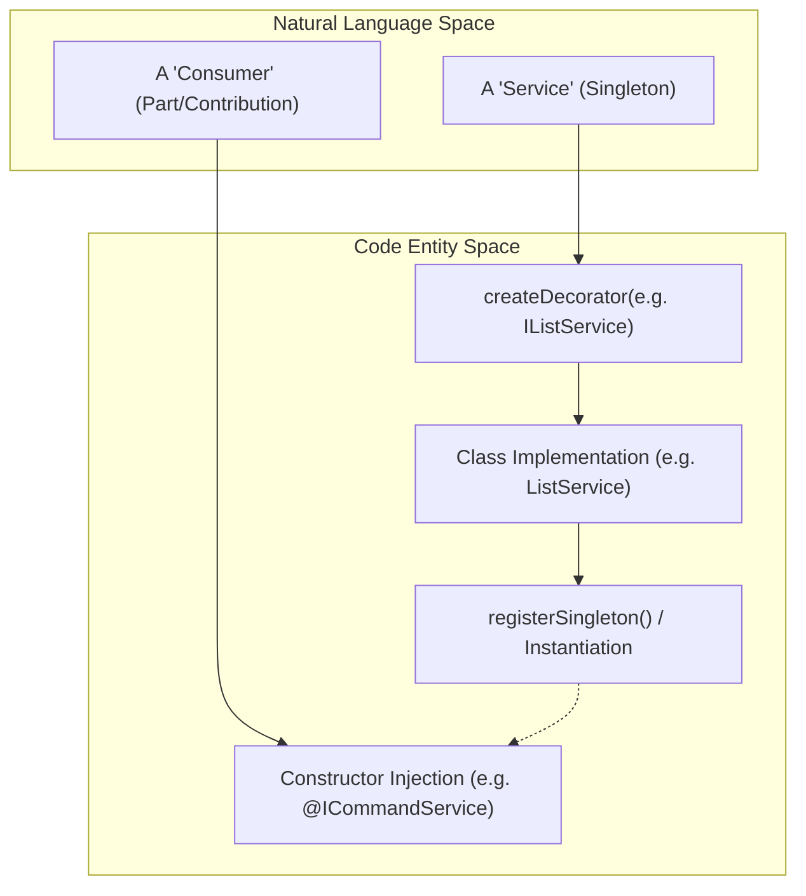

**Sources:** [src/vs/platform/instantiation/common/instantiation.ts:11-15](https://github.com/microsoft/vscode/blob/HEAD/src/vs/platform/instantiation/common/instantiation.ts#L11-L15), [src/vs/platform/list/browser/listService.ts:36-55](https://github.com/microsoft/vscode/blob/HEAD/src/vs/platform/list/browser/listService.ts#L36-L55), [src/vs/platform/actions/browser/menuEntryActionViewItem.ts:23-39](https://github.com/microsoft/vscode/blob/HEAD/src/vs/platform/actions/browser/menuEntryActionViewItem.ts#L23-L39).

---

## Contribution and Registry Pattern

The workbench is extended via a "Contribution" pattern. Features register themselves into global registries, allowing the system to remain decoupled.

### Key Registries and Implementation
*   **Registry**: The global entry point for all registries, accessed via `Registry.as<T>(ID)`. [src/vs/platform/registry/common/platform.ts:30-30](https://github.com/microsoft/vscode/blob/HEAD/src/vs/platform/registry/common/platform.ts#L30)
*   **MenuRegistry**: Handles command-to-menu mappings. Items are added via `MenuRegistry.appendMenuItem` or `MenuRegistry.addCommand`. [src/vs/platform/actions/common/actions.ts:70-134](https://github.com/microsoft/vscode/blob/HEAD/src/vs/platform/actions/common/actions.ts#L70-L134)
*   **ColorRegistry**: Manages workbench colors and themeable tokens. [src/vs/platform/theme/common/colorRegistry.ts:1-19](https://github.com/microsoft/vscode/blob/HEAD/src/vs/platform/theme/common/colorRegistry.ts#L1-L19)
*   **ExtensionsRegistry**: Used to register extension points like `menus` [src/vs/workbench/services/actions/common/menusExtensionPoint.ts:10-12](https://github.com/microsoft/vscode/blob/HEAD/src/vs/workbench/services/actions/common/menusExtensionPoint.ts#L10-L12).

### Data Flow for Feature Contributions
Title: Contribution Registration Flow
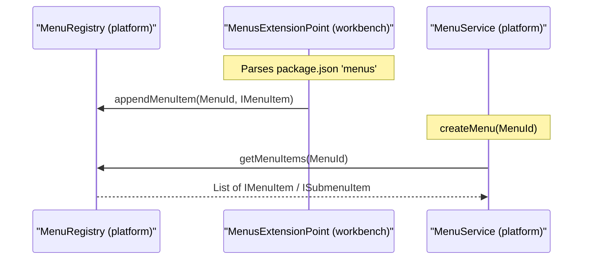

**Sources:** [src/vs/platform/registry/common/platform.ts:1-30](https://github.com/microsoft/vscode/blob/HEAD/src/vs/platform/registry/common/platform.ts#L1-L30), [src/vs/platform/actions/common/actions.ts:12-134](https://github.com/microsoft/vscode/blob/HEAD/src/vs/platform/actions/common/actions.ts#L12-L134), [src/vs/workbench/services/actions/common/menusExtensionPoint.ts:1-181](https://github.com/microsoft/vscode/blob/HEAD/src/vs/workbench/services/actions/common/menusExtensionPoint.ts#L1-L181).

---

## Core Utilities: Events and Lifecycle

The `base` layer provides the fundamental building blocks for reactivity and resource management.

### Lifecycle Management (`IDisposable`)
VS Code uses the `IDisposable` pattern to prevent memory leaks.
*   **Disposable**: A base class that provides a `_register` method to track child disposables. [src/vs/base/common/lifecycle.ts:14-14](https://github.com/microsoft/vscode/blob/HEAD/src/vs/base/common/lifecycle.ts#L14)
*   **DisposableStore**: A container that holds multiple disposables and disposes them all at once. [src/vs/base/common/lifecycle.ts:11-11](https://github.com/microsoft/vscode/blob/HEAD/src/vs/base/common/lifecycle.ts#L11)
*   **MutableDisposable**: A wrapper for a single disposable that can be replaced, automatically disposing the old one. [src/vs/base/common/lifecycle.ts:9-9](https://github.com/microsoft/vscode/blob/HEAD/src/vs/base/common/lifecycle.ts#L9)

### Eventing (`Event<T>`)
An `Event` is a function that takes a listener and returns an `IDisposable`. [src/vs/base/common/event.ts:46-48](https://github.com/microsoft/vscode/blob/HEAD/src/vs/base/common/event.ts#L46-L48)
*   **Emitter**: The standard way to create an event. Calling `fire(data)` on an `Emitter<T>` triggers all listeners. [src/vs/base/common/event.ts:49-50](https://github.com/microsoft/vscode/blob/HEAD/src/vs/base/common/event.ts#L49-L50)
*   **Relay**: A utility that can forward events from different sources. [src/vs/base/browser/ui/tree/abstractTree.ts:28-28](https://github.com/microsoft/vscode/blob/HEAD/src/vs/base/browser/ui/tree/abstractTree.ts#L28)

**Sources:** [src/vs/base/common/lifecycle.ts:1-31](https://github.com/microsoft/vscode/blob/HEAD/src/vs/base/common/lifecycle.ts#L1-L31), [src/vs/base/common/event.ts:1-60](https://github.com/microsoft/vscode/blob/HEAD/src/vs/base/common/event.ts#L1-L60).

---

## Context Keys and UI State

The `platform` layer provides the `ContextKey` system, which allows the UI and keybindings to react to state changes.

*   **ContextKeyExpr**: A language for defining boolean expressions (e.g., `when` clauses in `package.json`). [src/vs/platform/contextkey/common/contextkey.ts:14-14](https://github.com/microsoft/vscode/blob/HEAD/src/vs/platform/contextkey/common/contextkey.ts#L14)
*   **IContextKeyService**: Manages the hierarchy of contexts and evaluates expressions. [src/vs/platform/contextkey/common/contextkey.ts:23-23](https://github.com/microsoft/vscode/blob/HEAD/src/vs/platform/contextkey/common/contextkey.ts#L23)
*   **Workbench Context Keys**: Specific keys like `listFocus` [src/vs/platform/list/browser/listService.ts:116-116](https://github.com/microsoft/vscode/blob/HEAD/src/vs/platform/list/browser/listService.ts#L116) or `listMultiSelection` [src/vs/platform/list/browser/listService.ts:122-122](https://github.com/microsoft/vscode/blob/HEAD/src/vs/platform/list/browser/listService.ts#L122) are used to control command availability.

Title: Context Key State Flow
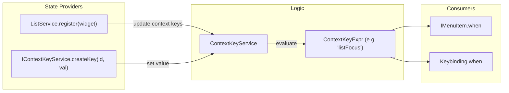

**Sources:** [src/vs/platform/contextkey/common/contextkey.ts:14-23](https://github.com/microsoft/vscode/blob/HEAD/src/vs/platform/contextkey/common/contextkey.ts#L14-L23), [src/vs/platform/list/browser/listService.ts:108-125](https://github.com/microsoft/vscode/blob/HEAD/src/vs/platform/list/browser/listService.ts#L108-L125).

---

## UI Foundations: Lists and Trees

VS Code uses a highly optimized virtualization engine for lists and trees, located in `vs/base/browser/ui`.

*   **ListView**: The core virtualization engine that manages the DOM for large sets of items. [src/vs/base/browser/ui/list/listView.ts:115-115](https://github.com/microsoft/vscode/blob/HEAD/src/vs/base/browser/ui/list/listView.ts#L115)
*   **List**: A widget that adds selection, focus, and keyboard navigation logic. [src/vs/base/browser/ui/list/listWidget.ts:117-117](https://github.com/microsoft/vscode/blob/HEAD/src/vs/base/browser/ui/list/listWidget.ts#L117)
*   **AbstractTree**: A base class for tree structures that maps hierarchical data to a flat list for virtualization. [src/vs/base/browser/ui/tree/abstractTree.ts:65-65](https://github.com/microsoft/vscode/blob/HEAD/src/vs/base/browser/ui/tree/abstractTree.ts#L65)
*   **AsyncDataTree**: A specialized tree for data that is loaded lazily via an `IAsyncDataSource`. It handles loading states and twistie rendering [src/vs/base/browser/ui/tree/asyncDataTree.ts:96-126](https://github.com/microsoft/vscode/blob/HEAD/src/vs/base/browser/ui/tree/asyncDataTree.ts#L96-L126).

**Sources:** [src/vs/base/browser/ui/list/listWidget.ts:1-117](https://github.com/microsoft/vscode/blob/HEAD/src/vs/base/browser/ui/list/listWidget.ts#L1-L117), [src/vs/base/browser/ui/tree/abstractTree.ts:1-65](https://github.com/microsoft/vscode/blob/HEAD/src/vs/base/browser/ui/tree/abstractTree.ts#L1-L65), [src/vs/base/browser/ui/list/listView.ts:1-115](https://github.com/microsoft/vscode/blob/HEAD/src/vs/base/browser/ui/list/listView.ts#L1-L115), [src/vs/base/browser/ui/tree/asyncDataTree.ts:30-133](https://github.com/microsoft/vscode/blob/HEAD/src/vs/base/browser/ui/tree/asyncDataTree.ts#L30-L133).1a:T2b6f


---

<!-- Chapter 4: Getting Started: Development Environment -->
<!-- Source: https://deepwiki.com/microsoft/vscode/1.3-getting-started-development-environment -->

# Getting Started: Development Environment

<details>
<summary>Relevant source files</summary>

The following files were used as context for generating this wiki page:

- [.npmrc](https://github.com/microsoft/vscode/blob/HEAD/.npmrc)
- [.nvmrc](https://github.com/microsoft/vscode/blob/HEAD/.nvmrc)
- [.vscode-test.js](https://github.com/microsoft/vscode/blob/HEAD/.vscode-test.js)
- [.vscode/launch.json](https://github.com/microsoft/vscode/blob/HEAD/.vscode/launch.json)
- [.vscode/tasks.json](https://github.com/microsoft/vscode/blob/HEAD/.vscode/tasks.json)
- [build/azure-pipelines/linux/setup-env.sh](https://github.com/microsoft/vscode/blob/HEAD/build/azure-pipelines/linux/setup-env.sh)
- [build/checksums/electron.txt](https://github.com/microsoft/vscode/blob/HEAD/build/checksums/electron.txt)
- [build/checksums/nodejs.txt](https://github.com/microsoft/vscode/blob/HEAD/build/checksums/nodejs.txt)
- [build/linux/debian/calculate-deps.ts](https://github.com/microsoft/vscode/blob/HEAD/build/linux/debian/calculate-deps.ts)
- [build/linux/debian/dep-lists.ts](https://github.com/microsoft/vscode/blob/HEAD/build/linux/debian/dep-lists.ts)
- [build/linux/dependencies-generator.ts](https://github.com/microsoft/vscode/blob/HEAD/build/linux/dependencies-generator.ts)
- [build/linux/rpm/dep-lists.ts](https://github.com/microsoft/vscode/blob/HEAD/build/linux/rpm/dep-lists.ts)
- [cgmanifest.json](https://github.com/microsoft/vscode/blob/HEAD/cgmanifest.json)
- [extensions/copilot/chat-lib/package-lock.json](https://github.com/microsoft/vscode/blob/HEAD/extensions/copilot/chat-lib/package-lock.json)
- [extensions/copilot/chat-lib/package.json](https://github.com/microsoft/vscode/blob/HEAD/extensions/copilot/chat-lib/package.json)
- [extensions/copilot/package-lock.json](https://github.com/microsoft/vscode/blob/HEAD/extensions/copilot/package-lock.json)
- [package-lock.json](https://github.com/microsoft/vscode/blob/HEAD/package-lock.json)
- [package.json](https://github.com/microsoft/vscode/blob/HEAD/package.json)
- [remote/.npmrc](https://github.com/microsoft/vscode/blob/HEAD/remote/.npmrc)
- [remote/package-lock.json](https://github.com/microsoft/vscode/blob/HEAD/remote/package-lock.json)
- [remote/package.json](https://github.com/microsoft/vscode/blob/HEAD/remote/package.json)
- [remote/web/package-lock.json](https://github.com/microsoft/vscode/blob/HEAD/remote/web/package-lock.json)
- [remote/web/package.json](https://github.com/microsoft/vscode/blob/HEAD/remote/web/package.json)
- [scripts/test-integration.bat](https://github.com/microsoft/vscode/blob/HEAD/scripts/test-integration.bat)
- [scripts/test-integration.sh](https://github.com/microsoft/vscode/blob/HEAD/scripts/test-integration.sh)
- [scripts/test-remote-integration.bat](https://github.com/microsoft/vscode/blob/HEAD/scripts/test-remote-integration.bat)
- [scripts/test-remote-integration.sh](https://github.com/microsoft/vscode/blob/HEAD/scripts/test-remote-integration.sh)
- [scripts/test-web-integration.bat](https://github.com/microsoft/vscode/blob/HEAD/scripts/test-web-integration.bat)
- [scripts/test-web-integration.sh](https://github.com/microsoft/vscode/blob/HEAD/scripts/test-web-integration.sh)
- [src/typings/editContext.d.ts](https://github.com/microsoft/vscode/blob/HEAD/src/typings/editContext.d.ts)
- [src/vs/base/common/codiconsLibrary.ts](https://github.com/microsoft/vscode/blob/HEAD/src/vs/base/common/codiconsLibrary.ts)
- [src/vs/workbench/services/driver/browser/driver.ts](https://github.com/microsoft/vscode/blob/HEAD/src/vs/workbench/services/driver/browser/driver.ts)
- [test/automation/src/application.ts](https://github.com/microsoft/vscode/blob/HEAD/test/automation/src/application.ts)
- [test/automation/src/code.ts](https://github.com/microsoft/vscode/blob/HEAD/test/automation/src/code.ts)
- [test/automation/src/debug.ts](https://github.com/microsoft/vscode/blob/HEAD/test/automation/src/debug.ts)
- [test/automation/src/editor.ts](https://github.com/microsoft/vscode/blob/HEAD/test/automation/src/editor.ts)
- [test/automation/src/editors.ts](https://github.com/microsoft/vscode/blob/HEAD/test/automation/src/editors.ts)
- [test/automation/src/extensions.ts](https://github.com/microsoft/vscode/blob/HEAD/test/automation/src/extensions.ts)
- [test/automation/src/notebook.ts](https://github.com/microsoft/vscode/blob/HEAD/test/automation/src/notebook.ts)
- [test/automation/src/playwrightDriver.ts](https://github.com/microsoft/vscode/blob/HEAD/test/automation/src/playwrightDriver.ts)
- [test/automation/src/scm.ts](https://github.com/microsoft/vscode/blob/HEAD/test/automation/src/scm.ts)
- [test/automation/src/search.ts](https://github.com/microsoft/vscode/blob/HEAD/test/automation/src/search.ts)
- [test/automation/src/settings.ts](https://github.com/microsoft/vscode/blob/HEAD/test/automation/src/settings.ts)
- [test/smoke/src/areas/extensions/extensions.test.ts](https://github.com/microsoft/vscode/blob/HEAD/test/smoke/src/areas/extensions/extensions.test.ts)
- [test/smoke/src/areas/languages/languages.test.ts](https://github.com/microsoft/vscode/blob/HEAD/test/smoke/src/areas/languages/languages.test.ts)
- [test/smoke/src/areas/multiroot/multiroot.test.ts](https://github.com/microsoft/vscode/blob/HEAD/test/smoke/src/areas/multiroot/multiroot.test.ts)
- [test/smoke/src/areas/notebook/notebook.test.ts](https://github.com/microsoft/vscode/blob/HEAD/test/smoke/src/areas/notebook/notebook.test.ts)
- [test/smoke/src/areas/preferences/preferences.test.ts](https://github.com/microsoft/vscode/blob/HEAD/test/smoke/src/areas/preferences/preferences.test.ts)
- [test/smoke/src/areas/search/search.test.ts](https://github.com/microsoft/vscode/blob/HEAD/test/smoke/src/areas/search/search.test.ts)
- [test/smoke/src/areas/statusbar/statusbar.test.ts](https://github.com/microsoft/vscode/blob/HEAD/test/smoke/src/areas/statusbar/statusbar.test.ts)
- [test/smoke/src/areas/workbench/data-loss.test.ts](https://github.com/microsoft/vscode/blob/HEAD/test/smoke/src/areas/workbench/data-loss.test.ts)
- [test/smoke/src/areas/workbench/launch.test.ts](https://github.com/microsoft/vscode/blob/HEAD/test/smoke/src/areas/workbench/launch.test.ts)
- [test/smoke/src/areas/workbench/localization.test.ts](https://github.com/microsoft/vscode/blob/HEAD/test/smoke/src/areas/workbench/localization.test.ts)
- [test/smoke/src/main.ts](https://github.com/microsoft/vscode/blob/HEAD/test/smoke/src/main.ts)
- [test/smoke/src/utils.ts](https://github.com/microsoft/vscode/blob/HEAD/test/smoke/src/utils.ts)

</details>


This page describes how to set up, build, and verify the VS Code development environment. The repository uses a complex multi-process architecture requiring specific orchestration of build tasks, launch configurations, and test runners.

## Development Setup and Build System

VS Code uses a combination of `npm` scripts and `Gulp` to manage its build pipeline. The environment is optimized for a "watch" workflow where changes are transpiled in the background using `esbuild` for speed and `tsc` for type checking.

### Build Tasks
The primary entry point for building is the `VS Code - Build` task, which is a composite task defined in `[.vscode/tasks.json:233-245](https://github.com/microsoft/vscode/blob/HEAD/.vscode/tasks.json#L233-L245)`. It orchestrates four critical sub-watchers:

| Task Label | Script | Purpose |
| :--- | :--- | :--- |
| `Core - Transpile` | `watch-client-transpiled` | Uses `esbuild` to rapidly transpile core TypeScript to JS in `out/` `[.vscode/tasks.json:112-139](https://github.com/microsoft/vscode/blob/HEAD/.vscode/tasks.json#L112-L139)`. |
| `Core - Typecheck` | `watch-clientd` | Runs `tsc` in watch mode for background type safety across the core `[.vscode/tasks.json:142-170](https://github.com/microsoft/vscode/blob/HEAD/.vscode/tasks.json#L142-L170)`. |
| `Ext - Build` | `watch-extensionsd` | Compiles built-in extensions (like `npm`, `git`) using the extension build pipeline `[.vscode/tasks.json:172-199](https://github.com/microsoft/vscode/blob/HEAD/.vscode/tasks.json#L172-L199)`. |
| `Copilot - Build` | `watch-copilotd` | Specific build for the Copilot extension in `extensions/copilot` `[.vscode/tasks.json:201-231](https://github.com/microsoft/vscode/blob/HEAD/.vscode/tasks.json#L201-L231)`. |

Sources: `[.vscode/tasks.json:233-245](https://github.com/microsoft/vscode/blob/HEAD/.vscode/tasks.json#L233-L245)`, `[.vscode/tasks.json:112-231](https://github.com/microsoft/vscode/blob/HEAD/.vscode/tasks.json#L112-L231)`, `[package.json:33-53](https://github.com/microsoft/vscode/blob/HEAD/package.json#L33-L53)`

### Build Process Data Flow
The following diagram illustrates how source code is transformed into a runnable state by the internal build tooling.

**Build Pipeline Data Flow**
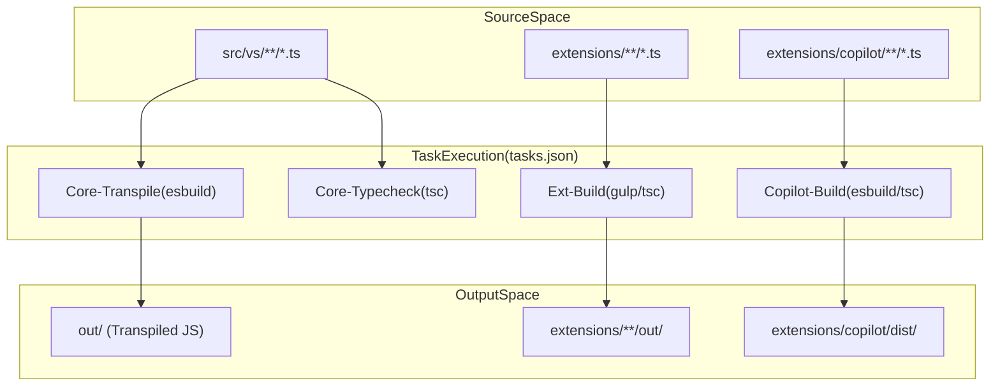
Sources: `[.vscode/tasks.json:4-231](https://github.com/microsoft/vscode/blob/HEAD/.vscode/tasks.json#L4-L231)`, `[package.json:25-53](https://github.com/microsoft/vscode/blob/HEAD/package.json#L25-L53)`

---

## Running and Debugging Locally

The repository includes pre-configured scripts and launch targets to run the Electron application or the web-based editor.

### Launching the Editor
- **Desktop (Electron):** Run `./scripts/code.sh` (Linux/macOS) or `.\scripts\code.bat` (Windows) via the `Run VS Code` task `[.vscode/tasks.json:17-30](https://github.com/microsoft/vscode/blob/HEAD/.vscode/tasks.json#L17-L30)`. This task sets the user data directory to `.profile-oss` `[.vscode/tasks.json:25-26](https://github.com/microsoft/vscode/blob/HEAD/.vscode/tasks.json#L25-L26)`.
- **Web/Server:** The `npm run web` script has been replaced by specific server scripts: `./scripts/code-server` and `./scripts/code-web` `[package.json:72](https://github.com/microsoft/vscode/blob/HEAD/package.json#L72)`.

### Debugger Attach Points
Because VS Code is multi-process, the debugger must attach to specific processes. Key configurations in `[.vscode/launch.json](https://github.com/microsoft/vscode/blob/HEAD/.vscode/launch.json)` include:

- **Attach to Main Process:** Port `5875`. Controls window lifecycle and native menus `[.vscode/launch.json:79-89](https://github.com/microsoft/vscode/blob/HEAD/.vscode/launch.json#L79-L89)`.
- **Attach to Extension Host:** Port `5870`. Debugs the environment where extensions run `[.vscode/launch.json:18-26](https://github.com/microsoft/vscode/blob/HEAD/.vscode/launch.json#L18-L26)`.
- **Attach to Shared Process:** Port `5879`. Handles file services and update logic `[.vscode/launch.json:31-37](https://github.com/microsoft/vscode/blob/HEAD/.vscode/launch.json#L31-L37)`.
- **Attach to Agent Host Process:** Port `5878`. Debugs AI agent orchestration and the protocol handler `[.vscode/launch.json:59-66](https://github.com/microsoft/vscode/blob/HEAD/.vscode/launch.json#L59-L66)`.
- **Attach to Pty Host Process:** Port `5877`. Debugs the terminal process management `[.vscode/launch.json:50-55](https://github.com/microsoft/vscode/blob/HEAD/.vscode/launch.json#L50-L55)`.
- **Attach to VS Code (Renderer):** Port `9222`. Attaches to the renderer process using Chrome DevTools Protocol `[.vscode/launch.json:236-248](https://github.com/microsoft/vscode/blob/HEAD/.vscode/launch.json#L236-L248)`.

Sources: `[.vscode/launch.json:18-89](https://github.com/microsoft/vscode/blob/HEAD/.vscode/launch.json#L18-L89)`, `[.vscode/tasks.json:17-30](https://github.com/microsoft/vscode/blob/HEAD/.vscode/tasks.json#L17-L30)`, `[package.json:72](https://github.com/microsoft/vscode/blob/HEAD/package.json#L72)`

---

## Testing Infrastructure

VS Code employs a tiered testing strategy: Unit tests, Integration tests, and Smoke tests.

### Unit and Integration Tests
Unit tests are categorized by environment (Node vs Browser).
- **Node Unit Tests:** Run via `mocha` using the configuration in `test/unit/node/index.js` `[package.json:16](https://github.com/microsoft/vscode/blob/HEAD/package.json#L16)`.
- **Browser Unit Tests:** Executed using Playwright via `test/unit/browser/index.js` `[package.json:14-15](https://github.com/microsoft/vscode/blob/HEAD/package.json#L14-L15)`.
- **Agent Host E2E:** Specific end-to-end tests for the AI agent host platform `[package.json:19](https://github.com/microsoft/vscode/blob/HEAD/package.json#L19)`.
- **Extension API Tests:** Integration tests for the extension API, including `vscode-api-tests` in both single-folder and workspace modes `[.vscode/launch.json:164-198](https://github.com/microsoft/vscode/blob/HEAD/.vscode/launch.json#L164-L198)`.

### Smoke Tests
Smoke tests use Playwright to automate a full instance of VS Code. The smoke test runner is defined in `test/smoke/src/main.ts` `[test/smoke/src/main.ts:1-38](https://github.com/microsoft/vscode/blob/HEAD/test/smoke/src/main.ts#L1-L38)` and supports Electron, Web, and Remote targets `[test/smoke/src/main.ts:75-103](https://github.com/microsoft/vscode/blob/HEAD/test/smoke/src/main.ts#L75-L103)`.

**Automation Entity Mapping**
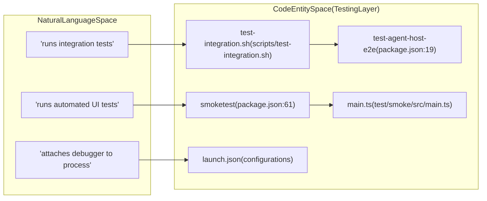
Sources: `[package.json:13-21](https://github.com/microsoft/vscode/blob/HEAD/package.json#L13-L21)`, `[package.json:61-62](https://github.com/microsoft/vscode/blob/HEAD/package.json#L61-L62)`, `[.vscode/launch.json:1-89](https://github.com/microsoft/vscode/blob/HEAD/.vscode/launch.json#L1-L89)`, `[test/smoke/src/main.ts:1-103](https://github.com/microsoft/vscode/blob/HEAD/test/smoke/src/main.ts#L1-L103)`

### Test Execution Commands
| Target | Command |
| :--- | :--- |
| **Node Unit Tests** | `npm run test-node` `[package.json:16](https://github.com/microsoft/vscode/blob/HEAD/package.json#L16)` |
| **Browser Unit Tests** | `npm run test-browser` `[package.json:14](https://github.com/microsoft/vscode/blob/HEAD/package.json#L14)` |
| **Smoke Tests** | `npm run smoketest` `[package.json:61](https://github.com/microsoft/vscode/blob/HEAD/package.json#L61)` |
| **Agent Host E2E** | `npm run test-agent-host-e2e` `[package.json:19](https://github.com/microsoft/vscode/blob/HEAD/package.json#L19)` |

Sources: `[package.json:13-22](https://github.com/microsoft/vscode/blob/HEAD/package.json#L13-L22)`, `[package.json:61-62](https://github.com/microsoft/vscode/blob/HEAD/package.json#L61-L62)`

---

## Development Scripts and Utilities

The `scripts/` and `build/` directories contain essential utilities for environment maintenance:

- **Hygiene:** The `Gulp Build` launch configuration runs the `hygiene` task to ensure code quality and license headers `[.vscode/launch.json:7-13](https://github.com/microsoft/vscode/blob/HEAD/.vscode/launch.json#L7-L13)`, `[package.json:87](https://github.com/microsoft/vscode/blob/HEAD/package.json#L87)`.
- **Kill Build:** If background watchers hang, specific "kill" tasks like `Kill VS Code - Build` terminate the processes managing `esbuild` and `tsc` `[.vscode/tasks.json:295-303](https://github.com/microsoft/vscode/blob/HEAD/.vscode/tasks.json#L295-L303)`.
- **Cyclic Dependency Check:** A build script to ensure no cyclic dependencies exist in the output `[package.json:22](https://github.com/microsoft/vscode/blob/HEAD/package.json#L22)`.

### Build Environment Configuration
The build system itself is a standalone project.
- **Transpilation:** The `transpile-client` script uses the build orchestrator at `build/next/index.ts` `[package.json:44-45](https://github.com/microsoft/vscode/blob/HEAD/package.json#L44-L45)`.
- **Gulp Pipeline:** Core compilation and watching is managed via `node ./node_modules/gulp/bin/gulp.js` `[package.json:55](https://github.com/microsoft/vscode/blob/HEAD/package.json#L55)`.

Sources: `[package.json:22-55](https://github.com/microsoft/vscode/blob/HEAD/package.json#L22-L55)`, `[package.json:87](https://github.com/microsoft/vscode/blob/HEAD/package.json#L87)`, `[.vscode/tasks.json:295-303](https://github.com/microsoft/vscode/blob/HEAD/.vscode/tasks.json#L295-L303)`, `[.vscode/launch.json:7-13](https://github.com/microsoft/vscode/blob/HEAD/.vscode/launch.json#L7-L13)`


---

<!-- Chapter 5: Contribution Workflow and Repo Automation -->
<!-- Source: https://deepwiki.com/microsoft/vscode/1.4-contribution-workflow-and-repo-automation -->

# Contribution Workflow and Repo Automation

<details>
<summary>Relevant source files</summary>

The following files were used as context for generating this wiki page:

- [.github/prompts/codenotify.prompt.md](https://github.com/microsoft/vscode/blob/HEAD/.github/prompts/codenotify.prompt.md)
- [.github/prompts/component.prompt.md](https://github.com/microsoft/vscode/blob/HEAD/.github/prompts/component.prompt.md)
- [.github/prompts/fixIssueNo.prompt.md](https://github.com/microsoft/vscode/blob/HEAD/.github/prompts/fixIssueNo.prompt.md)
- [.github/prompts/implement.prompt.md](https://github.com/microsoft/vscode/blob/HEAD/.github/prompts/implement.prompt.md)
- [.github/prompts/no-any.prompt.md](https://github.com/microsoft/vscode/blob/HEAD/.github/prompts/no-any.prompt.md)
- [.github/prompts/plan-deep.prompt.md](https://github.com/microsoft/vscode/blob/HEAD/.github/prompts/plan-deep.prompt.md)
- [.github/prompts/plan-fast.prompt.md](https://github.com/microsoft/vscode/blob/HEAD/.github/prompts/plan-fast.prompt.md)
- [.github/prompts/setup-environment.prompt.md](https://github.com/microsoft/vscode/blob/HEAD/.github/prompts/setup-environment.prompt.md)
- [.github/prompts/update-instructions.prompt.md](https://github.com/microsoft/vscode/blob/HEAD/.github/prompts/update-instructions.prompt.md)
- [.vscode/settings.json](https://github.com/microsoft/vscode/blob/HEAD/.vscode/settings.json)
- [build/.cachesalt](https://github.com/microsoft/vscode/blob/HEAD/build/.cachesalt)
- [build/azure-pipelines/alpine/product-build-alpine-node-modules.yml](https://github.com/microsoft/vscode/blob/HEAD/build/azure-pipelines/alpine/product-build-alpine-node-modules.yml)
- [build/azure-pipelines/alpine/product-build-alpine.yml](https://github.com/microsoft/vscode/blob/HEAD/build/azure-pipelines/alpine/product-build-alpine.yml)
- [build/azure-pipelines/cli/cli-compile.yml](https://github.com/microsoft/vscode/blob/HEAD/build/azure-pipelines/cli/cli-compile.yml)
- [build/azure-pipelines/common/createBuild.ts](https://github.com/microsoft/vscode/blob/HEAD/build/azure-pipelines/common/createBuild.ts)
- [build/azure-pipelines/common/publish.ts](https://github.com/microsoft/vscode/blob/HEAD/build/azure-pipelines/common/publish.ts)
- [build/azure-pipelines/common/releaseBuild.ts](https://github.com/microsoft/vscode/blob/HEAD/build/azure-pipelines/common/releaseBuild.ts)
- [build/azure-pipelines/copilot/setup-steps.yml](https://github.com/microsoft/vscode/blob/HEAD/build/azure-pipelines/copilot/setup-steps.yml)
- [build/azure-pipelines/darwin/product-build-darwin-node-modules.yml](https://github.com/microsoft/vscode/blob/HEAD/build/azure-pipelines/darwin/product-build-darwin-node-modules.yml)
- [build/azure-pipelines/darwin/product-build-darwin-universal.yml](https://github.com/microsoft/vscode/blob/HEAD/build/azure-pipelines/darwin/product-build-darwin-universal.yml)
- [build/azure-pipelines/darwin/product-build-darwin.yml](https://github.com/microsoft/vscode/blob/HEAD/build/azure-pipelines/darwin/product-build-darwin.yml)
- [build/azure-pipelines/darwin/steps/product-build-darwin-compile.yml](https://github.com/microsoft/vscode/blob/HEAD/build/azure-pipelines/darwin/steps/product-build-darwin-compile.yml)
- [build/azure-pipelines/linux/product-build-linux-node-modules.yml](https://github.com/microsoft/vscode/blob/HEAD/build/azure-pipelines/linux/product-build-linux-node-modules.yml)
- [build/azure-pipelines/linux/product-build-linux.yml](https://github.com/microsoft/vscode/blob/HEAD/build/azure-pipelines/linux/product-build-linux.yml)
- [build/azure-pipelines/linux/steps/product-build-linux-compile.yml](https://github.com/microsoft/vscode/blob/HEAD/build/azure-pipelines/linux/steps/product-build-linux-compile.yml)
- [build/azure-pipelines/product-build.yml](https://github.com/microsoft/vscode/blob/HEAD/build/azure-pipelines/product-build.yml)
- [build/azure-pipelines/product-publish.yml](https://github.com/microsoft/vscode/blob/HEAD/build/azure-pipelines/product-publish.yml)
- [build/azure-pipelines/product-quality-checks.yml](https://github.com/microsoft/vscode/blob/HEAD/build/azure-pipelines/product-quality-checks.yml)
- [build/azure-pipelines/product-release.yml](https://github.com/microsoft/vscode/blob/HEAD/build/azure-pipelines/product-release.yml)
- [build/azure-pipelines/upload-cdn.ts](https://github.com/microsoft/vscode/blob/HEAD/build/azure-pipelines/upload-cdn.ts)
- [build/azure-pipelines/upload-nlsmetadata.ts](https://github.com/microsoft/vscode/blob/HEAD/build/azure-pipelines/upload-nlsmetadata.ts)
- [build/azure-pipelines/upload-sourcemaps.ts](https://github.com/microsoft/vscode/blob/HEAD/build/azure-pipelines/upload-sourcemaps.ts)
- [build/azure-pipelines/web/product-build-web-node-modules.yml](https://github.com/microsoft/vscode/blob/HEAD/build/azure-pipelines/web/product-build-web-node-modules.yml)
- [build/azure-pipelines/web/product-build-web.yml](https://github.com/microsoft/vscode/blob/HEAD/build/azure-pipelines/web/product-build-web.yml)
- [build/azure-pipelines/win32/product-build-win32-node-modules.yml](https://github.com/microsoft/vscode/blob/HEAD/build/azure-pipelines/win32/product-build-win32-node-modules.yml)
- [build/azure-pipelines/win32/product-build-win32.yml](https://github.com/microsoft/vscode/blob/HEAD/build/azure-pipelines/win32/product-build-win32.yml)
- [build/azure-pipelines/win32/sdl-scan-win32.yml](https://github.com/microsoft/vscode/blob/HEAD/build/azure-pipelines/win32/sdl-scan-win32.yml)
- [build/azure-pipelines/win32/steps/product-build-win32-compile.yml](https://github.com/microsoft/vscode/blob/HEAD/build/azure-pipelines/win32/steps/product-build-win32-compile.yml)
- [build/checksums/vscode-sysroot.txt](https://github.com/microsoft/vscode/blob/HEAD/build/checksums/vscode-sysroot.txt)
- [build/lib/nls.ts](https://github.com/microsoft/vscode/blob/HEAD/build/lib/nls.ts)
- [build/linux/debian/install-sysroot.ts](https://github.com/microsoft/vscode/blob/HEAD/build/linux/debian/install-sysroot.ts)

</details>


This section documents the repository automation, governance, and developer tooling within the VS Code codebase. It covers the orchestration of GitHub workflows, CI/CD pipelines, repository hygiene, and the integration of AI-assisted development tools.

## Repository Governance and Automation

The VS Code repository utilizes extensive automation to manage a high volume of contributions, issues, and pull requests. This automation is primarily driven by GitHub Actions, custom triage logic, and scripts located in the `build/` and `.github/` directories.

### Issue Triage and Classification
The repository uses a deep-learning classifier to automatically assign labels and owners to incoming issues. This is configured in `.github/classifier.json`, which maps feature areas to specific engineering owners [ .github/classifier.json:1-163 ](https://github.com/microsoft/vscode/blob/HEAD/.github/classifier.json#L1-L163). For example, issues labeled `accessibility` are assigned to `meganrogge` [ .github/classifier.json:8-8 ](https://github.com/microsoft/vscode/blob/HEAD/.github/classifier.json#L8), while `git` related issues are routed to `lszomoru` [ .github/classifier.json:98-98 ](https://github.com/microsoft/vscode/blob/HEAD/.github/classifier.json#L98).

### Hygiene and Pre-commit Hooks
Before code is committed, the repository enforces strict hygiene rules. The `precommit` script (referenced in `package.json`) executes validation logic to check for common issues like incorrect line endings, missing headers, or disallowed patterns [ package.json:54-54 ](https://github.com/microsoft/vscode/blob/HEAD/package.json#L54). This is often handled by `build/hygiene.ts`.

### Repository Tooling
Key developer tools are managed at the root and within the `build/` directory:
*   **ESLint**: The repo uses flat config mode for linting, executed via `build/eslint.ts` [ package.json:79-79 ](https://github.com/microsoft/vscode/blob/HEAD/package.json#L79). Flat config is explicitly enabled in workspace settings [ .vscode/settings.json:190-190 ](https://github.com/microsoft/vscode/blob/HEAD/.vscode/settings.json#L190).
*   **Build Scripts**: The core build orchestration is handled by Gulp, with the binary located at `./node_modules/gulp/bin/gulp.js` [ package.json:55-55 ](https://github.com/microsoft/vscode/blob/HEAD/package.json#L55).
*   **Cyclic Dependency Check**: A dedicated script `build/lib/checkCyclicDependencies.ts` ensures architectural integrity [ package.json:22-22 ](https://github.com/microsoft/vscode/blob/HEAD/package.json#L22).
*   **Layer Validation**: The `valid-layers-check` script runs `build/checker/layersChecker.ts` to enforce the strict layering model (base → platform → editor → workbench) [ package.json:68-68 ](https://github.com/microsoft/vscode/blob/HEAD/package.json#L68).

### Data Flow: Contribution to Build
The following diagram illustrates how a developer contribution moves from local validation to the automated CI pipeline.

**Contribution Validation Pipeline**
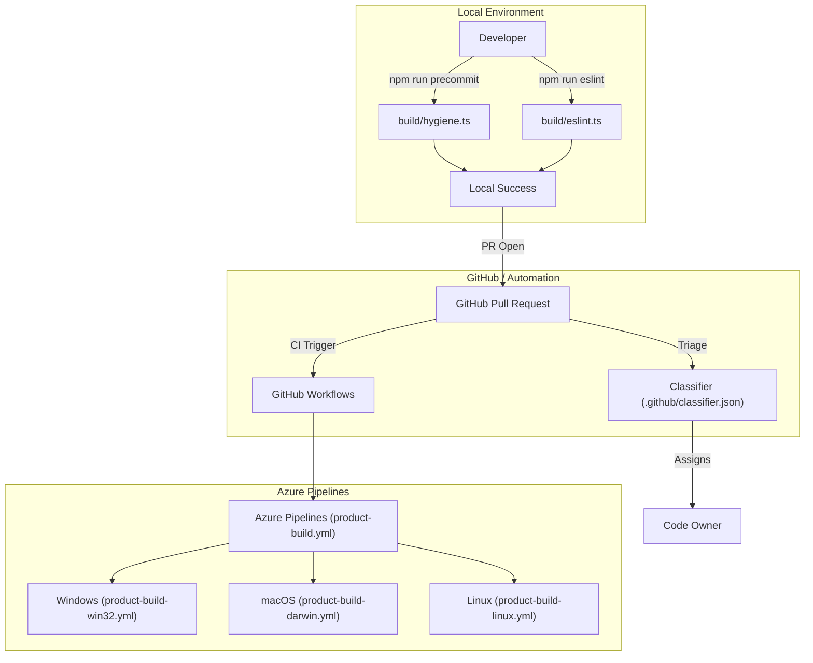
**Sources:** [ .github/classifier.json:1-163 ](https://github.com/microsoft/vscode/blob/HEAD/.github/classifier.json#L1-L163), [ package.json:54-87 ](https://github.com/microsoft/vscode/blob/HEAD/package.json#L54-L87), [ build/azure-pipelines/product-build.yml:25-28 ](https://github.com/microsoft/vscode/blob/HEAD/build/azure-pipelines/product-build.yml#L25-L28)

---

## CI/CD and Build Orchestration

The build system is orchestrated via Azure Pipelines, defined in `build/azure-pipelines/`. The system supports multiple "qualities" (exploration, insider, stable) [ build/azure-pipelines/product-build.yml:31-38 ](https://github.com/microsoft/vscode/blob/HEAD/build/azure-pipelines/product-build.yml#L31-L38) and build types (Product, CI) [ build/azure-pipelines/product-build.yml:39-45 ](https://github.com/microsoft/vscode/blob/HEAD/build/azure-pipelines/product-build.yml#L39-L45).

### Build Pipeline Stages
The main pipeline (`product-build.yml`) coordinates platform-specific jobs. It uses a schedule to run builds at specific intervals (05:00, 11:00, 17:00, 23:00 UTC) for the `main` branch [ build/azure-pipelines/product-build.yml:3-23 ](https://github.com/microsoft/vscode/blob/HEAD/build/azure-pipelines/product-build.yml#L3-L23).

| Stage | Platform File | Key Artifacts |
| :--- | :--- | :--- |
| **Windows** | `win32/product-build-win32.yml` | System/User Setup (.exe), Server/Web Zip [ build/azure-pipelines/win32/product-build-win32.yml:50-84 ](https://github.com/microsoft/vscode/blob/HEAD/build/azure-pipelines/win32/product-build-win32.yml#L50-L84) |
| **macOS** | `darwin/product-build-darwin.yml` | .zip, .dmg, Server/Web Zip [ build/azure-pipelines/darwin/product-build-darwin.yml:48-78 ](https://github.com/microsoft/vscode/blob/HEAD/build/azure-pipelines/darwin/product-build-darwin.yml#L48-L78) |
| **Linux** | `linux/product-build-linux.yml` | .deb, .rpm, .snap, Server tar.gz [ build/azure-pipelines/linux/product-build-linux.yml:67-110 ](https://github.com/microsoft/vscode/blob/HEAD/build/azure-pipelines/linux/product-build-linux.yml#L67-L110) |
| **Alpine** | `alpine/product-build-alpine.yml` | MUSL Server tar.gz [ build/azure-pipelines/alpine/product-build-alpine.yml:20-51 ](https://github.com/microsoft/vscode/blob/HEAD/build/azure-pipelines/alpine/product-build-alpine.yml#L20-L51) |
| **Web** | `web/product-build-web.yml` | Standalone Web Archive, CDN Upload [ build/azure-pipelines/web/product-build-web.yml:13-19 ](https://github.com/microsoft/vscode/blob/HEAD/build/azure-pipelines/web/product-build-web.yml#L13-L19), [ build/azure-pipelines/web/product-build-web.yml:153-160 ](https://github.com/microsoft/vscode/blob/HEAD/build/azure-pipelines/web/product-build-web.yml#L153-L160) |

### Artifact Processing and Publishing
After successful platform builds, `product-publish.yml` coordinates the creation of a build version and artifact distribution [ build/azure-pipelines/product-publish.yml:105-107 ](https://github.com/microsoft/vscode/blob/HEAD/build/azure-pipelines/product-publish.yml#L105-L107). This involves:
1.  **Creation**: `build/azure-pipelines/common/createBuild.ts` registers the new version [ build/azure-pipelines/product-publish.yml:107-107 ](https://github.com/microsoft/vscode/blob/HEAD/build/azure-pipelines/product-publish.yml#L107).
2.  **Publishing**: `build/azure-pipelines/common/publish.ts` handles the actual upload and ESRP signing [ build/azure-pipelines/product-publish.yml:123-132 ](https://github.com/microsoft/vscode/blob/HEAD/build/azure-pipelines/product-publish.yml#L123-L132).
3.  **Release**: For scheduled Insider builds, `build/azure-pipelines/common/releaseBuild.ts` triggers the release [ build/azure-pipelines/product-publish.yml:134-143 ](https://github.com/microsoft/vscode/blob/HEAD/build/azure-pipelines/product-publish.yml#L134-L143).

**Sources:** [ build/azure-pipelines/product-build.yml:1-110 ](https://github.com/microsoft/vscode/blob/HEAD/build/azure-pipelines/product-build.yml#L1-L110), [ build/azure-pipelines/win32/product-build-win32.yml:1-103 ](https://github.com/microsoft/vscode/blob/HEAD/build/azure-pipelines/win32/product-build-win32.yml#L1-L103), [ build/azure-pipelines/darwin/product-build-darwin.yml:1-93 ](https://github.com/microsoft/vscode/blob/HEAD/build/azure-pipelines/darwin/product-build-darwin.yml#L1-L93), [ build/azure-pipelines/product-publish.yml:1-143 ](https://github.com/microsoft/vscode/blob/HEAD/build/azure-pipelines/product-publish.yml#L1-L143)

---

## AI and Agentic Tooling Automation

The repository includes specialized configurations for AI-assisted development, specifically for GitHub Copilot and agentic workflows.

### Prompt Engineering and Skills
The repository contains a set of reusable prompts and instructions for AI agents in `.github/prompts/`. These define specific behaviors for tasks such as:
*   **Issue Fixing**: `fixIssueNo.prompt.md` guides agents in resolving specific issues.
*   **Planning**: `plan-deep.prompt.md` and `plan-fast.prompt.md` provide different levels of task decomposition.
*   **Component Creation**: `component.prompt.md` defines standards for new UI components.

Developer settings in `.vscode/settings.json` define where these skills are located via `chat.agentSkillsLocations` [ .vscode/settings.json:214-218 ](https://github.com/microsoft/vscode/blob/HEAD/.vscode/settings.json#L214-L218).

### Agent Tooling Safety
To ensure safe execution of AI-generated commands, the repository uses an auto-approval mechanism for specific scripts. Tools like `scripts/test.sh` and `scripts/test-integration.sh` are pre-approved for terminal execution by AI agents [ .vscode/settings.json:4-9 ](https://github.com/microsoft/vscode/blob/HEAD/.vscode/settings.json#L4-L9).

**AI-Code Interaction Mapping**
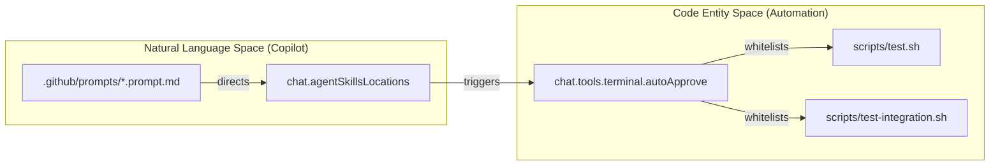
**Sources:** [ .vscode/settings.json:1-219 ](https://github.com/microsoft/vscode/blob/HEAD/.vscode/settings.json#L1-L219), [ .github/prompts/plan-deep.prompt.md ](https://github.com/microsoft/vscode/blob/HEAD/.github/prompts/plan-deep.prompt.md), [ .github/prompts/fixIssueNo.prompt.md ](https://github.com/microsoft/vscode/blob/HEAD/.github/prompts/fixIssueNo.prompt.md)

---

## Milestone and Issue Management

The team uses "GitHub Issue Notebooks" (`.github-issues` files) to manage work across milestones. These files contain queries that filter issues for specific tasks like "Endgame" (release preparation) or "Grooming".

### Endgame and Verification
During the "Endgame" phase, developers use notebooks like `.vscode/notebooks/endgame.github-issues` to track:
*   **Open PRs and Issues** on the current milestone [ .vscode/notebooks/endgame.github-issues:15-21 ](https://github.com/microsoft/vscode/blob/HEAD/.vscode/notebooks/endgame.github-issues#L15-L21).
*   **Verification Needed**: Bugs that have been fixed but require manual verification by another team member [ .vscode/notebooks/endgame.github-issues:25-31 ](https://github.com/microsoft/vscode/blob/HEAD/.vscode/notebooks/endgame.github-issues#L25-L31).
*   **TPI (Test Plan Item) Tracking**: New bugs found during testing that need manual verification [ .vscode/notebooks/endgame.github-issues:45-51 ](https://github.com/microsoft/vscode/blob/HEAD/.vscode/notebooks/endgame.github-issues#L45-L51).

### Release Preparation (My Endgame)
Individual developers track their own release-readiness using `my-endgame.github-issues`. This includes:
*   **Macros**: Definitions for `$MILESTONE` and `$MINE` to reuse queries [ .vscode/notebooks/my-endgame.github-issues:10-10 ](https://github.com/microsoft/vscode/blob/HEAD/.vscode/notebooks/my-endgame.github-issues#L10).
*   **Verification Found**: Issues assigned to the developer where verification failed [ .vscode/notebooks/my-endgame.github-issues:140-146 ](https://github.com/microsoft/vscode/blob/HEAD/.vscode/notebooks/my-endgame.github-issues#L140-L146).
*   **Release Notes**: Tracking feature requests that need to be included in the official release notes [ .vscode/notebooks/my-endgame.github-issues:190-195 ](https://github.com/microsoft/vscode/blob/HEAD/.vscode/notebooks/my-endgame.github-issues#L190-L195).

**Sources:** [ .vscode/notebooks/endgame.github-issues:1-52 ](https://github.com/microsoft/vscode/blob/HEAD/.vscode/notebooks/endgame.github-issues#L1-L52), [ .vscode/notebooks/my-endgame.github-issues:1-195 ](https://github.com/microsoft/vscode/blob/HEAD/.vscode/notebooks/my-endgame.github-issues#L1-L195), [ .vscode/notebooks/my-work.github-issues:1-110 ](https://github.com/microsoft/vscode/blob/HEAD/.vscode/notebooks/my-work.github-issues#L1-L110)1c:T32


---

<!-- Chapter 6: Electron Main Process -->
<!-- Source: https://deepwiki.com/microsoft/vscode/2-electron-main-process -->

# Electron Main Process

<details>
<summary>Relevant source files</summary>

The following files were used as context for generating this wiki page:

- [cli/src/bin/code/legacy_args.rs](https://github.com/microsoft/vscode/blob/HEAD/cli/src/bin/code/legacy_args.rs)
- [product.json](https://github.com/microsoft/vscode/blob/HEAD/product.json)
- [resources/completions/bash/code](https://github.com/microsoft/vscode/blob/HEAD/resources/completions/bash/code)
- [resources/completions/zsh/_code](https://github.com/microsoft/vscode/blob/HEAD/resources/completions/zsh/_code)
- [src/vs/base/common/product.ts](https://github.com/microsoft/vscode/blob/HEAD/src/vs/base/common/product.ts)
- [src/vs/code/electron-main/app.ts](https://github.com/microsoft/vscode/blob/HEAD/src/vs/code/electron-main/app.ts)
- [src/vs/code/electron-main/main.ts](https://github.com/microsoft/vscode/blob/HEAD/src/vs/code/electron-main/main.ts)
- [src/vs/code/electron-utility/sharedProcess/sharedProcessMain.ts](https://github.com/microsoft/vscode/blob/HEAD/src/vs/code/electron-utility/sharedProcess/sharedProcessMain.ts)
- [src/vs/code/node/cli.ts](https://github.com/microsoft/vscode/blob/HEAD/src/vs/code/node/cli.ts)
- [src/vs/code/node/cliProcessMain.ts](https://github.com/microsoft/vscode/blob/HEAD/src/vs/code/node/cliProcessMain.ts)
- [src/vs/platform/auxiliaryWindow/electron-main/auxiliaryWindow.ts](https://github.com/microsoft/vscode/blob/HEAD/src/vs/platform/auxiliaryWindow/electron-main/auxiliaryWindow.ts)
- [src/vs/platform/auxiliaryWindow/electron-main/auxiliaryWindows.ts](https://github.com/microsoft/vscode/blob/HEAD/src/vs/platform/auxiliaryWindow/electron-main/auxiliaryWindows.ts)
- [src/vs/platform/auxiliaryWindow/electron-main/auxiliaryWindowsMainService.ts](https://github.com/microsoft/vscode/blob/HEAD/src/vs/platform/auxiliaryWindow/electron-main/auxiliaryWindowsMainService.ts)
- [src/vs/platform/environment/common/argv.ts](https://github.com/microsoft/vscode/blob/HEAD/src/vs/platform/environment/common/argv.ts)
- [src/vs/platform/environment/common/environment.ts](https://github.com/microsoft/vscode/blob/HEAD/src/vs/platform/environment/common/environment.ts)
- [src/vs/platform/environment/common/environmentService.ts](https://github.com/microsoft/vscode/blob/HEAD/src/vs/platform/environment/common/environmentService.ts)
- [src/vs/platform/environment/electron-main/environmentMainService.ts](https://github.com/microsoft/vscode/blob/HEAD/src/vs/platform/environment/electron-main/environmentMainService.ts)
- [src/vs/platform/environment/node/argv.ts](https://github.com/microsoft/vscode/blob/HEAD/src/vs/platform/environment/node/argv.ts)
- [src/vs/platform/environment/node/environmentService.ts](https://github.com/microsoft/vscode/blob/HEAD/src/vs/platform/environment/node/environmentService.ts)
- [src/vs/platform/environment/node/stdin.ts](https://github.com/microsoft/vscode/blob/HEAD/src/vs/platform/environment/node/stdin.ts)
- [src/vs/platform/extensionManagement/common/extensionManagementCLI.ts](https://github.com/microsoft/vscode/blob/HEAD/src/vs/platform/extensionManagement/common/extensionManagementCLI.ts)
- [src/vs/platform/launch/electron-main/launchMainService.ts](https://github.com/microsoft/vscode/blob/HEAD/src/vs/platform/launch/electron-main/launchMainService.ts)
- [src/vs/platform/log/browser/log.ts](https://github.com/microsoft/vscode/blob/HEAD/src/vs/platform/log/browser/log.ts)
- [src/vs/platform/native/common/native.ts](https://github.com/microsoft/vscode/blob/HEAD/src/vs/platform/native/common/native.ts)
- [src/vs/platform/native/electron-main/nativeHostMainService.ts](https://github.com/microsoft/vscode/blob/HEAD/src/vs/platform/native/electron-main/nativeHostMainService.ts)
- [src/vs/platform/product/common/product.ts](https://github.com/microsoft/vscode/blob/HEAD/src/vs/platform/product/common/product.ts)
- [src/vs/platform/window/common/window.ts](https://github.com/microsoft/vscode/blob/HEAD/src/vs/platform/window/common/window.ts)
- [src/vs/platform/window/electron-main/window.ts](https://github.com/microsoft/vscode/blob/HEAD/src/vs/platform/window/electron-main/window.ts)
- [src/vs/platform/windows/electron-main/windowImpl.ts](https://github.com/microsoft/vscode/blob/HEAD/src/vs/platform/windows/electron-main/windowImpl.ts)
- [src/vs/platform/windows/electron-main/windows.ts](https://github.com/microsoft/vscode/blob/HEAD/src/vs/platform/windows/electron-main/windows.ts)
- [src/vs/platform/windows/electron-main/windowsMainService.ts](https://github.com/microsoft/vscode/blob/HEAD/src/vs/platform/windows/electron-main/windowsMainService.ts)
- [src/vs/platform/windows/test/electron-main/windowsFinder.test.ts](https://github.com/microsoft/vscode/blob/HEAD/src/vs/platform/windows/test/electron-main/windowsFinder.test.ts)
- [src/vs/server/node/remoteExtensionHostAgentCli.ts](https://github.com/microsoft/vscode/blob/HEAD/src/vs/server/node/remoteExtensionHostAgentCli.ts)
- [src/vs/server/node/server.cli.ts](https://github.com/microsoft/vscode/blob/HEAD/src/vs/server/node/server.cli.ts)
- [src/vs/server/node/serverServices.ts](https://github.com/microsoft/vscode/blob/HEAD/src/vs/server/node/serverServices.ts)
- [src/vs/workbench/api/browser/mainThreadCLICommands.ts](https://github.com/microsoft/vscode/blob/HEAD/src/vs/workbench/api/browser/mainThreadCLICommands.ts)
- [src/vs/workbench/api/node/extHostCLIServer.ts](https://github.com/microsoft/vscode/blob/HEAD/src/vs/workbench/api/node/extHostCLIServer.ts)
- [src/vs/workbench/contrib/relauncher/browser/relauncher.contribution.ts](https://github.com/microsoft/vscode/blob/HEAD/src/vs/workbench/contrib/relauncher/browser/relauncher.contribution.ts)
- [src/vs/workbench/services/environment/browser/environmentService.ts](https://github.com/microsoft/vscode/blob/HEAD/src/vs/workbench/services/environment/browser/environmentService.ts)
- [src/vs/workbench/services/environment/common/environmentService.ts](https://github.com/microsoft/vscode/blob/HEAD/src/vs/workbench/services/environment/common/environmentService.ts)
- [src/vs/workbench/services/environment/electron-browser/environmentService.ts](https://github.com/microsoft/vscode/blob/HEAD/src/vs/workbench/services/environment/electron-browser/environmentService.ts)
- [src/vs/workbench/services/host/browser/browserHostService.ts](https://github.com/microsoft/vscode/blob/HEAD/src/vs/workbench/services/host/browser/browserHostService.ts)
- [src/vs/workbench/services/host/browser/host.ts](https://github.com/microsoft/vscode/blob/HEAD/src/vs/workbench/services/host/browser/host.ts)
- [src/vs/workbench/test/electron-browser/workbenchTestServices.ts](https://github.com/microsoft/vscode/blob/HEAD/src/vs/workbench/test/electron-browser/workbenchTestServices.ts)
- [src/vs/workbench/workbench.web.main.internal.ts](https://github.com/microsoft/vscode/blob/HEAD/src/vs/workbench/workbench.web.main.internal.ts)
- [test/integration/browser/src/index.ts](https://github.com/microsoft/vscode/blob/HEAD/test/integration/browser/src/index.ts)

</details>


The Electron Main Process is the entry point and backbone of the VS Code desktop application. It is responsible for the application lifecycle, managing all windows (main and auxiliary), integrating with the native operating system, and handling Command Line Interface (CLI) requests. It operates in a privileged Node.js environment and orchestrates the creation of renderer processes for the workbench.

## Core Architecture

The main process is centered around the `CodeApplication` class, which initializes the core services required for the application to run. It manages the communication between different processes via an IPC (Inter-Process Communication) server.

### Application Entry Points
The startup sequence begins in `src/vs/code/electron-main/main.ts`, which handles the initial environment setup and determines if a new instance should be started or if the request should be forwarded to an existing instance via a shared socket.

| Class | Responsibility | Location |
| :--- | :--- | :--- |
| `CodeMain` | Entry point logic, service initialization, and instance locking. | [src/vs/code/electron-main/main.ts:91-91](https://github.com/microsoft/vscode/blob/HEAD/src/vs/code/electron-main/main.ts#L91) |
| `CodeApplication` | Orchestrates the application lifecycle and starts core IPC servers. | [src/vs/code/electron-main/app.ts:145-145](https://github.com/microsoft/vscode/blob/HEAD/src/vs/code/electron-main/app.ts#L145) |
| `CliMain` | Handles extension management, MCP (Model Context Protocol) management, and telemetry tasks from the terminal. | [src/vs/code/node/cliProcessMain.ts:81-81](https://github.com/microsoft/vscode/blob/HEAD/src/vs/code/node/cliProcessMain.ts#L81) |

### System Overview Diagram

This diagram shows how the `CodeMain` entry point branches into either a full application or a CLI process, and how it manages windows.

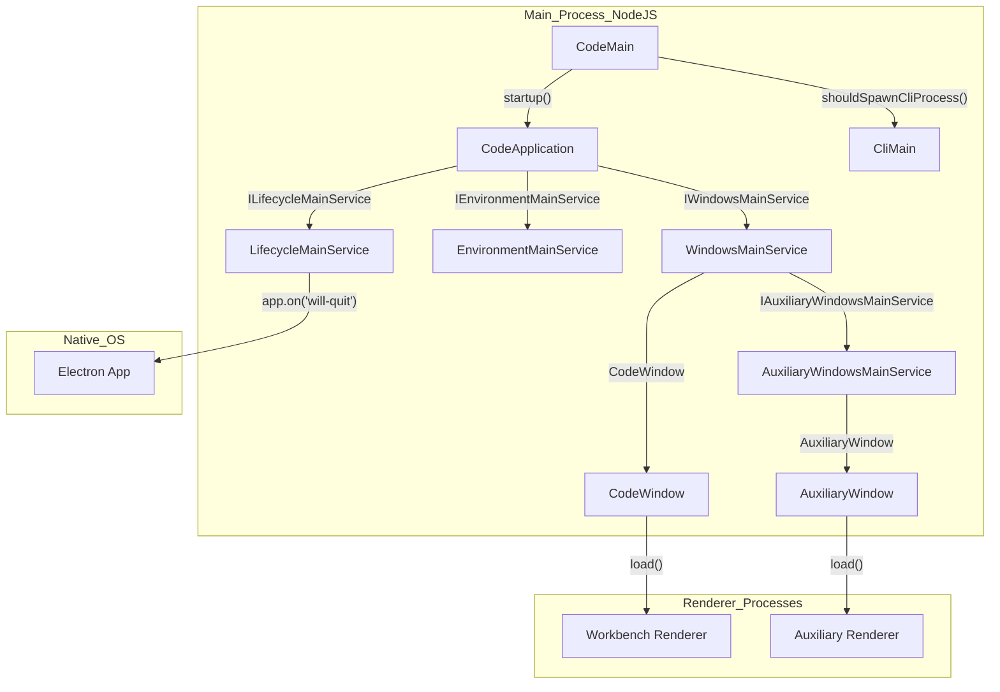
Sources: [src/vs/code/electron-main/main.ts:91-140](https://github.com/microsoft/vscode/blob/HEAD/src/vs/code/electron-main/main.ts#L91-L140), [src/vs/code/electron-main/app.ts:145-300](https://github.com/microsoft/vscode/blob/HEAD/src/vs/code/electron-main/app.ts#L145-L300), [src/vs/platform/windows/electron-main/windowsMainService.ts:41-42](https://github.com/microsoft/vscode/blob/HEAD/src/vs/platform/windows/electron-main/windowsMainService.ts#L41-L42), [src/vs/platform/windows/electron-main/windowImpl.ts:39-39](https://github.com/microsoft/vscode/blob/HEAD/src/vs/platform/windows/electron-main/windowImpl.ts#L39), [src/vs/platform/auxiliaryWindow/electron-main/auxiliaryWindowsMainService.ts:22-22](https://github.com/microsoft/vscode/blob/HEAD/src/vs/platform/auxiliaryWindow/electron-main/auxiliaryWindowsMainService.ts#L22)

## Application Lifecycle and Window Management

The `ILifecycleMainService` manages the phases of the application, from the initial startup to the final shutdown. Window management is handled by the `IWindowsMainService`, which tracks all open `CodeWindow` instances. VS Code supports both primary workbench windows and "Auxiliary Windows" (e.g., floating editors).

*   **Lifecycle Phases:** Startup moves through phases like `Starting`, `Ready`, and `Eventually` to ensure services are initialized in the correct order [src/vs/platform/lifecycle/electron-main/lifecycleMainService.ts:63-63](https://github.com/microsoft/vscode/blob/HEAD/src/vs/platform/lifecycle/electron-main/lifecycleMainService.ts#L63).
*   **Window State:** The `WindowsStateHandler` persists window positions, sizes, and open folders to ensure they are restored correctly on restart [src/vs/platform/windows/electron-main/windowsMainService.ts:44-44](https://github.com/microsoft/vscode/blob/HEAD/src/vs/platform/windows/electron-main/windowsMainService.ts#L44).
*   **Auxiliary Windows:** Multi-window support is managed by `IAuxiliaryWindowsMainService`, allowing parts of the UI to be detached into separate native windows [src/vs/platform/auxiliaryWindow/electron-main/auxiliaryWindows.ts:14-14](https://github.com/microsoft/vscode/blob/HEAD/src/vs/platform/auxiliaryWindow/electron-main/auxiliaryWindows.ts#L14).
*   **Native Integration:** The `NativeHostMainService` provides a bridge for renderer processes to access native OS features like dialogs, power monitor, and shell integration [src/vs/platform/native/electron-main/nativeHostMainService.ts:58-58](https://github.com/microsoft/vscode/blob/HEAD/src/vs/platform/native/electron-main/nativeHostMainService.ts#L58).

For details, see [Application Lifecycle and Window Management](#2.1).

## CLI and Environment Services

VS Code's CLI allows users to open files, install extensions, and compare files from the terminal. The main process parses these arguments and resolves paths using various environment services.

*   **Argument Parsing:** `NativeParsedArgs` defines the schema for all supported CLI flags, such as `--diff`, `--wait`, and `--user-data-dir` [src/vs/platform/environment/common/argv.ts:50-50](https://github.com/microsoft/vscode/blob/HEAD/src/vs/platform/environment/common/argv.ts#L50).
*   **Environment Resolution:** The `IEnvironmentMainService` resolves critical system paths (logs, user data, extensions) and merges them with the `product.json` configuration [src/vs/platform/environment/node/environmentService.ts:24-24](https://github.com/microsoft/vscode/blob/HEAD/src/vs/platform/environment/node/environmentService.ts#L24).
*   **Single Instance Locking:** If an instance is already running, the CLI process communicates with the main process via a socket/named pipe to open files in the existing window [src/vs/code/electron-main/main.ts:555-570](https://github.com/microsoft/vscode/blob/HEAD/src/vs/code/electron-main/main.ts#L555-L570).
*   **Subcommands:** The CLI supports specific subcommands like `tunnel`, `serve-web`, and `agent` which may spawn separate processes or interact with the Rust-based CLI [src/vs/platform/environment/node/argv.ts:48-48](https://github.com/microsoft/vscode/blob/HEAD/src/vs/platform/environment/node/argv.ts#L48).

### CLI Command Flow

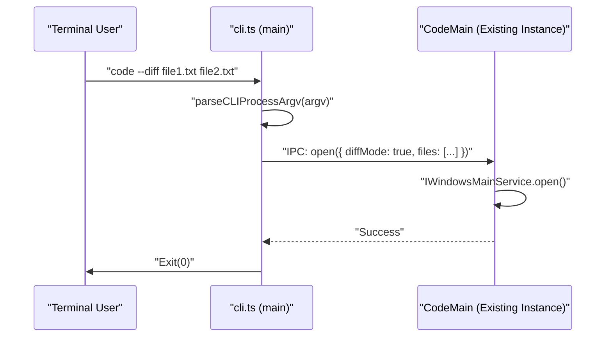
Sources: [src/vs/code/node/cli.ts:44-52](https://github.com/microsoft/vscode/blob/HEAD/src/vs/code/node/cli.ts#L44-L52), [src/vs/platform/environment/node/argvHelper.ts:36-36](https://github.com/microsoft/vscode/blob/HEAD/src/vs/platform/environment/node/argvHelper.ts#L36), [src/vs/code/electron-main/main.ts:555-570](https://github.com/microsoft/vscode/blob/HEAD/src/vs/code/electron-main/main.ts#L555-L570), [src/vs/platform/environment/common/argv.ts:104-105](https://github.com/microsoft/vscode/blob/HEAD/src/vs/platform/environment/common/argv.ts#L104-L105)

For details, see [CLI and Environment Services](#2.2).

## Native OS Integration

The main process acts as a proxy for native capabilities that are not available in the sandbox of the renderer process.

*   **File System:** While renderers use a virtual file system, the main process provides the `DiskFileSystemProvider` for direct local I/O [src/vs/platform/files/node/diskFileSystemProvider.ts:56-56](https://github.com/microsoft/vscode/blob/HEAD/src/vs/platform/files/node/diskFileSystemProvider.ts#L56).
*   **Native Dialogs:** Opening and saving files via OS-native dialogs is handled by `DialogMainService` [src/vs/platform/dialogs/electron-main/dialogMainService.ts:19-19](https://github.com/microsoft/vscode/blob/HEAD/src/vs/platform/dialogs/electron-main/dialogMainService.ts#L19).
*   **Global Menus:** The `MenubarMainService` manages the top-level application menu on macOS and the custom/native menubars on Windows/Linux [src/vs/platform/menubar/electron-main/menubarMainService.ts:25-25](https://github.com/microsoft/vscode/blob/HEAD/src/vs/platform/menubar/electron-main/menubarMainService.ts#L25).
*   **Native Host Services:** The `NativeHostMainService` implements `INativeHostMainService` to provide system-level statistics (CPU, memory), power management, and clipboard access [src/vs/platform/native/electron-main/nativeHostMainService.ts:58-58](https://github.com/microsoft/vscode/blob/HEAD/src/vs/platform/native/electron-main/nativeHostMainService.ts#L58).

Sources: [src/vs/code/electron-main/app.ts:6-28](https://github.com/microsoft/vscode/blob/HEAD/src/vs/code/electron-main/app.ts#L6-L28), [src/vs/platform/native/electron-main/nativeHostMainService.ts:8-9](https://github.com/microsoft/vscode/blob/HEAD/src/vs/platform/native/electron-main/nativeHostMainService.ts#L8-L9), [src/vs/platform/files/electron-main/diskFileSystemProviderServer.ts:17-17](https://github.com/microsoft/vscode/blob/HEAD/src/vs/platform/files/electron-main/diskFileSystemProviderServer.ts#L17)

## Configuration and Product Metadata

The behavior of the main process is heavily influenced by two static configurations:
1.  **`product.json`**: Contains build-time metadata like the application name, update URL, and default extensions [product.json:1-10](https://github.com/microsoft/vscode/blob/HEAD/product.json#L1-L10).
2.  **`IConfigurationService`**: Manages user settings (e.g., `window.restoreWindows`, `window.confirmBeforeClose`) that dictate how the main process behaves during startup and shutdown [src/vs/platform/configuration/common/configuration.ts:18-18](https://github.com/microsoft/vscode/blob/HEAD/src/vs/platform/configuration/common/configuration.ts#L18).

Sources: [product.json:1-10](https://github.com/microsoft/vscode/blob/HEAD/product.json#L1-L10), [src/vs/base/common/product.ts:99-122](https://github.com/microsoft/vscode/blob/HEAD/src/vs/base/common/product.ts#L99-L122)


---

<!-- Chapter 7: Application Lifecycle and Window Management -->
<!-- Source: https://deepwiki.com/microsoft/vscode/2.1-application-lifecycle-and-window-management -->

# Application Lifecycle and Window Management

<details>
<summary>Relevant source files</summary>

The following files were used as context for generating this wiki page:

- [cli/src/bin/code/legacy_args.rs](https://github.com/microsoft/vscode/blob/HEAD/cli/src/bin/code/legacy_args.rs)
- [resources/completions/bash/code](https://github.com/microsoft/vscode/blob/HEAD/resources/completions/bash/code)
- [resources/completions/zsh/_code](https://github.com/microsoft/vscode/blob/HEAD/resources/completions/zsh/_code)
- [src/vs/code/electron-main/app.ts](https://github.com/microsoft/vscode/blob/HEAD/src/vs/code/electron-main/app.ts)
- [src/vs/code/electron-main/main.ts](https://github.com/microsoft/vscode/blob/HEAD/src/vs/code/electron-main/main.ts)
- [src/vs/code/electron-utility/sharedProcess/sharedProcessMain.ts](https://github.com/microsoft/vscode/blob/HEAD/src/vs/code/electron-utility/sharedProcess/sharedProcessMain.ts)
- [src/vs/code/node/cliProcessMain.ts](https://github.com/microsoft/vscode/blob/HEAD/src/vs/code/node/cliProcessMain.ts)
- [src/vs/platform/auxiliaryWindow/electron-main/auxiliaryWindow.ts](https://github.com/microsoft/vscode/blob/HEAD/src/vs/platform/auxiliaryWindow/electron-main/auxiliaryWindow.ts)
- [src/vs/platform/auxiliaryWindow/electron-main/auxiliaryWindows.ts](https://github.com/microsoft/vscode/blob/HEAD/src/vs/platform/auxiliaryWindow/electron-main/auxiliaryWindows.ts)
- [src/vs/platform/auxiliaryWindow/electron-main/auxiliaryWindowsMainService.ts](https://github.com/microsoft/vscode/blob/HEAD/src/vs/platform/auxiliaryWindow/electron-main/auxiliaryWindowsMainService.ts)
- [src/vs/platform/extensionManagement/common/extensionManagementCLI.ts](https://github.com/microsoft/vscode/blob/HEAD/src/vs/platform/extensionManagement/common/extensionManagementCLI.ts)
- [src/vs/platform/launch/electron-main/launchMainService.ts](https://github.com/microsoft/vscode/blob/HEAD/src/vs/platform/launch/electron-main/launchMainService.ts)
- [src/vs/platform/native/common/native.ts](https://github.com/microsoft/vscode/blob/HEAD/src/vs/platform/native/common/native.ts)
- [src/vs/platform/native/electron-main/nativeHostMainService.ts](https://github.com/microsoft/vscode/blob/HEAD/src/vs/platform/native/electron-main/nativeHostMainService.ts)
- [src/vs/platform/window/common/window.ts](https://github.com/microsoft/vscode/blob/HEAD/src/vs/platform/window/common/window.ts)
- [src/vs/platform/window/electron-main/window.ts](https://github.com/microsoft/vscode/blob/HEAD/src/vs/platform/window/electron-main/window.ts)
- [src/vs/platform/windows/electron-main/windowImpl.ts](https://github.com/microsoft/vscode/blob/HEAD/src/vs/platform/windows/electron-main/windowImpl.ts)
- [src/vs/platform/windows/electron-main/windows.ts](https://github.com/microsoft/vscode/blob/HEAD/src/vs/platform/windows/electron-main/windows.ts)
- [src/vs/platform/windows/electron-main/windowsMainService.ts](https://github.com/microsoft/vscode/blob/HEAD/src/vs/platform/windows/electron-main/windowsMainService.ts)
- [src/vs/platform/windows/test/electron-main/windowsFinder.test.ts](https://github.com/microsoft/vscode/blob/HEAD/src/vs/platform/windows/test/electron-main/windowsFinder.test.ts)
- [src/vs/server/node/remoteExtensionHostAgentCli.ts](https://github.com/microsoft/vscode/blob/HEAD/src/vs/server/node/remoteExtensionHostAgentCli.ts)
- [src/vs/server/node/serverServices.ts](https://github.com/microsoft/vscode/blob/HEAD/src/vs/server/node/serverServices.ts)
- [src/vs/workbench/api/browser/mainThreadCLICommands.ts](https://github.com/microsoft/vscode/blob/HEAD/src/vs/workbench/api/browser/mainThreadCLICommands.ts)
- [src/vs/workbench/api/node/extHostCLIServer.ts](https://github.com/microsoft/vscode/blob/HEAD/src/vs/workbench/api/node/extHostCLIServer.ts)
- [src/vs/workbench/contrib/relauncher/browser/relauncher.contribution.ts](https://github.com/microsoft/vscode/blob/HEAD/src/vs/workbench/contrib/relauncher/browser/relauncher.contribution.ts)
- [src/vs/workbench/services/host/browser/browserHostService.ts](https://github.com/microsoft/vscode/blob/HEAD/src/vs/workbench/services/host/browser/browserHostService.ts)
- [src/vs/workbench/services/host/browser/host.ts](https://github.com/microsoft/vscode/blob/HEAD/src/vs/workbench/services/host/browser/host.ts)
- [src/vs/workbench/test/electron-browser/workbenchTestServices.ts](https://github.com/microsoft/vscode/blob/HEAD/src/vs/workbench/test/electron-browser/workbenchTestServices.ts)
- [src/vs/workbench/workbench.web.main.internal.ts](https://github.com/microsoft/vscode/blob/HEAD/src/vs/workbench/workbench.web.main.internal.ts)

</details>


The application lifecycle and window management system in VS Code coordinates the transition from the Electron main process startup to the creation of the user interface. This system is responsible for managing the primary workbench window, auxiliary windows (detached editors), and the persistence of window states across sessions.

## CodeApplication Startup Sequence

The `CodeApplication` class is the entry point for the Electron main process. It orchestrates the initialization of core services and the eventual opening of the first window.

### Startup Phases
1.  **Initialization**: The app initializes basic Electron settings, such as configuring UNC host allowlists on Windows via `addUNCHostToAllowlist` and `disableUNCAccessRestrictions` [src/vs/code/electron-main/app.ts:7-8](https://github.com/microsoft/vscode/blob/HEAD/src/vs/code/electron-main/app.ts#L7-L8). It also initializes Windows version information for compatibility [src/vs/code/electron-main/app.ts:10-10](https://github.com/microsoft/vscode/blob/HEAD/src/vs/code/electron-main/app.ts#L10).
2.  **Service Collection**: A `ServiceCollection` is populated with essential main-process services, including `IWindowsMainService`, `ILifecycleMainService`, and `IEnvironmentMainService` [src/vs/code/electron-main/app.ts:78-95](https://github.com/microsoft/vscode/blob/HEAD/src/vs/code/electron-main/app.ts#L78-L95).
3.  **Environment Setup**: Resolves the shell environment using `getResolvedShellEnv` to ensure the renderer has access to the user's PATH and other variables [src/vs/code/electron-main/app.ts:46-46](https://github.com/microsoft/vscode/blob/HEAD/src/vs/code/electron-main/app.ts#L46).
4.  **Window Restoration**: Uses the `IWindowsMainService` to restore previous windows or open new ones based on the provided configuration [src/vs/platform/windows/electron-main/windowsMainService.ts:42-42](https://github.com/microsoft/vscode/blob/HEAD/src/vs/platform/windows/electron-main/windowsMainService.ts#L42).

**Startup Flow Diagram**
```mermaid
graph TD
    subgraph MainProcess_src_vs_code_electron_main_ap ["MainProcess [src/vs/code/electron-main/app.ts]"]
        "CodeMain.main()"CodeMain_main["CodeMain.main()"] --> "CodeApplication.startup()"CodeApplication_startup["CodeApplication.startup()"]
        "CodeApplication.startup()" --> "CodeApplication.initServices()"CodeApplication_initServices["CodeApplication.initServices()"]
        "CodeApplication.initServices()" --> "getResolvedShellEnv()"getResolvedShellEnv["getResolvedShellEnv()"]
        "getResolvedShellEnv()" --> "IWindowsMainService.open()"IWindowsMainService_open["IWindowsMainService.open()"]
    end

    subgraph WindowManagement_src_vs_platform_windows ["WindowManagement [src/vs/platform/windows/electron-main/]"]
        "IWindowsMainService.open()" --> "WindowsStateHandler.restore()"WindowsStateHandler_restore["WindowsStateHandler.restore()"]
        "WindowsStateHandler.restore()" --> "CodeWindow.create()"CodeWindow_create["CodeWindow.create()"]
        "CodeWindow.create()" --> "new BrowserWindow()"new_BrowserWindow["new BrowserWindow()"]
    end

    "new BrowserWindow()" --> Renderer["Renderer Process (Workbench)"]
```
Sources: [src/vs/code/electron-main/app.ts:7-95](https://github.com/microsoft/vscode/blob/HEAD/src/vs/code/electron-main/app.ts#L7-L95), [src/vs/platform/windows/electron-main/windowsMainService.ts:41-47](https://github.com/microsoft/vscode/blob/HEAD/src/vs/platform/windows/electron-main/windowsMainService.ts#L41-L47)

## IWindowsMainService and Window Tracking

The `IWindowsMainService` is the central authority for managing `ICodeWindow` instances in the main process. It tracks all open windows and handles the complex logic of opening files, folders, or workspaces.

### Key Responsibilities
*   **Window Creation**: Wraps the Electron `BrowserWindow` in a `CodeWindow` class (implemented in `windowImpl.ts`) to provide VS Code-specific functionality [src/vs/platform/windows/electron-main/windowImpl.ts:148-153](https://github.com/microsoft/vscode/blob/HEAD/src/vs/platform/windows/electron-main/windowImpl.ts#L148-L153).
*   **Window Matching**: When a request comes in to open a path, it searches for an existing window using `findWindowOnWorkspaceOrFolder` or `findWindowOnFile` [src/vs/platform/windows/electron-main/windowsMainService.ts:43-43](https://github.com/microsoft/vscode/blob/HEAD/src/vs/platform/windows/electron-main/windowsMainService.ts#L43).
*   **Lifecycle Coordination**: Handles window closing events and determines if the application should quit when the last window is closed via the `ILifecycleMainService` [src/vs/platform/windows/electron-main/windowsMainService.ts:34-34](https://github.com/microsoft/vscode/blob/HEAD/src/vs/platform/windows/electron-main/windowsMainService.ts#L34).
*   **Specialized Windows**: Supports opening the "Agents Window" (Sessions layer) via `openAgentsWindow` [src/vs/platform/windows/electron-main/windows.ts:44-44](https://github.com/microsoft/vscode/blob/HEAD/src/vs/platform/windows/electron-main/windows.ts#L44).

### Window Types
| Type | Class | Description |
| :--- | :--- | :--- |
| **Main Window** | `CodeWindow` | The primary workbench window containing the activity bar, sidebar, and editor area [src/vs/platform/windows/electron-main/windowImpl.ts:39-39](https://github.com/microsoft/vscode/blob/HEAD/src/vs/platform/windows/electron-main/windowImpl.ts#L39). |
| **Auxiliary Window** | `BaseWindow` | A secondary window (detached editor) managed via `IAuxiliaryWindowsMainService` [src/vs/platform/windows/electron-main/windowImpl.ts:112-112](https://github.com/microsoft/vscode/blob/HEAD/src/vs/platform/windows/electron-main/windowImpl.ts#L112). |

Sources: [src/vs/platform/windows/electron-main/windowsMainService.ts:41-58](https://github.com/microsoft/vscode/blob/HEAD/src/vs/platform/windows/electron-main/windowsMainService.ts#L41-L58), [src/vs/platform/windows/electron-main/windowImpl.ts:39-153](https://github.com/microsoft/vscode/blob/HEAD/src/vs/platform/windows/electron-main/windowImpl.ts#L39-L153), [src/vs/platform/windows/electron-main/windows.ts:25-58](https://github.com/microsoft/vscode/blob/HEAD/src/vs/platform/windows/electron-main/windows.ts#L25-L58)

## Multi-Window Support and Auxiliary Windows

VS Code supports a multi-window architecture where editors can be floated into separate windows. This is managed by the `IAuxiliaryWindowsMainService` on the main process side and `registerWindow` utilities in the browser layer.

### Implementation Details
*   **AuxiliaryWindow Management**: The `IAuxiliaryWindowsMainService` tracks secondary windows and provides events for system context menus and fullscreen transitions [src/vs/platform/native/electron-main/nativeHostMainService.ts:44-45](https://github.com/microsoft/vscode/blob/HEAD/src/vs/platform/native/electron-main/nativeHostMainService.ts#L44-L45).
*   **Window Identification**: Every window is assigned a unique ID (`windowId`), which is used to route IPC messages via `NativeHostMainService`. Events from both main and auxiliary windows are merged in the native host service [src/vs/platform/native/electron-main/nativeHostMainService.ts:82-104](https://github.com/microsoft/vscode/blob/HEAD/src/vs/platform/native/electron-main/nativeHostMainService.ts#L82-L104).
*   **Base Class Hierarchy**: Both `CodeWindow` and auxiliary windows inherit from `BaseWindow`, which handles standard Electron events like `maximize`, `unmaximize`, and `fullscreen` [src/vs/platform/windows/electron-main/windowImpl.ts:112-153](https://github.com/microsoft/vscode/blob/HEAD/src/vs/platform/windows/electron-main/windowImpl.ts#L112-L153).

**Window Entity Association**
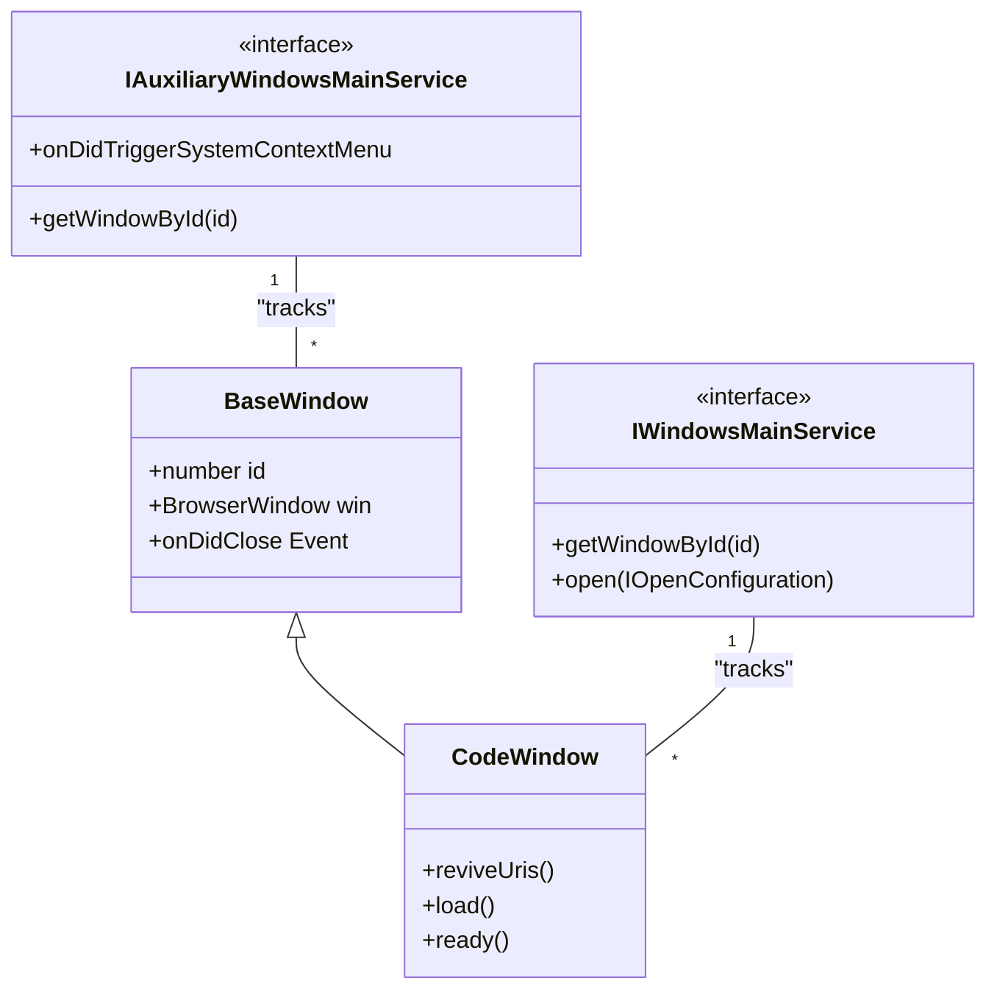
Sources: [src/vs/platform/windows/electron-main/windowImpl.ts:112-153](https://github.com/microsoft/vscode/blob/HEAD/src/vs/platform/windows/electron-main/windowImpl.ts#L112-L153), [src/vs/platform/native/electron-main/nativeHostMainService.ts:57-106](https://github.com/microsoft/vscode/blob/HEAD/src/vs/platform/native/electron-main/nativeHostMainService.ts#L57-L106), [src/vs/platform/windows/electron-main/windows.ts:25-58](https://github.com/microsoft/vscode/blob/HEAD/src/vs/platform/windows/electron-main/windows.ts#L25-L58)

## Window State Persistence

The state of windows (position, size, opened folders) is persisted using the `WindowsStateHandler` and the `IStateService`.

*   **Persistence Trigger**: Window state is saved whenever a window is closed or the application shuts down. The `CodeWindow` class tracks its own state including `x`, `y`, `width`, `height`, and `mode` (maximized, fullscreen) [src/vs/platform/windows/electron-main/windowImpl.ts:39-52](https://github.com/microsoft/vscode/blob/HEAD/src/vs/platform/windows/electron-main/windowImpl.ts#L39-L52).
*   **State Data**: Encapsulated in the `IWindowState` interface [src/vs/platform/window/electron-main/window.ts:39-39](https://github.com/microsoft/vscode/blob/HEAD/src/vs/platform/window/electron-main/window.ts#L39).
*   **Restoration Logic**: On startup, `WindowsMainService` determines the set of windows to open by consulting the `RestoreWindowsSetting` (e.g., 'all', 'folders', 'one', 'none') [src/vs/platform/windows/electron-main/windowsMainService.ts:65-65](https://github.com/microsoft/vscode/blob/HEAD/src/vs/platform/windows/electron-main/windowsMainService.ts#L65).

Sources: [src/vs/platform/windows/electron-main/windowsMainService.ts:44-65](https://github.com/microsoft/vscode/blob/HEAD/src/vs/platform/windows/electron-main/windowsMainService.ts#L44-L65), [src/vs/platform/windows/electron-main/windowImpl.ts:39-56](https://github.com/microsoft/vscode/blob/HEAD/src/vs/platform/windows/electron-main/windowImpl.ts#L39-L56), [src/vs/platform/window/electron-main/window.ts:39-39](https://github.com/microsoft/vscode/blob/HEAD/src/vs/platform/window/electron-main/window.ts#L39)

## Security and Window Configuration

Every window is initialized with an `INativeWindowConfiguration` which contains security-sensitive and environment-specific settings.

### Security Controls
*   **Sandbox**: VS Code uses Electron's sandbox for renderer processes. The `ISandboxHelperMainService` provides utilities for managing sandboxed processes [src/vs/code/electron-main/app.ts:51-52](https://github.com/microsoft/vscode/blob/HEAD/src/vs/code/electron-main/app.ts#L51-L52).
*   **UNC Paths**: On Windows, the main process restricts access to UNC hosts unless they are explicitly allowed via the `addUNCHostToAllowlist` utility [src/vs/code/electron-main/app.ts:7-8](https://github.com/microsoft/vscode/blob/HEAD/src/vs/code/electron-main/app.ts#L7-L8).
*   **Webview Security**: Handled via custom protocols and the `IProtocolMainService` to ensure webview content is isolated [src/vs/platform/windows/electron-main/windowImpl.ts:29-29](https://github.com/microsoft/vscode/blob/HEAD/src/vs/platform/windows/electron-main/windowImpl.ts#L29).

### Window Configuration Properties
| Property | Description |
| :--- | :--- |
| `titleBarStyle` | Determines if the window uses native or custom title bars [src/vs/platform/window/common/window.ts:35-35](https://github.com/microsoft/vscode/blob/HEAD/src/vs/platform/window/common/window.ts#L35). |
| `useNativeFullScreen` | Controls whether to use the OS-native full-screen mode [src/vs/platform/window/common/window.ts:35-35](https://github.com/microsoft/vscode/blob/HEAD/src/vs/platform/window/common/window.ts#L35). |
| `windowControlsOverlay` | Enables the Window Controls Overlay (WCO) for custom title bars on Windows/Linux [src/vs/platform/window/common/window.ts:35-35](https://github.com/microsoft/vscode/blob/HEAD/src/vs/platform/window/common/window.ts#L35). |
| `backgroundColor` | Initialized to reduce flicker during startup via `themeMainService.getBackgroundColor()` [src/vs/platform/windows/electron-main/windows.ts:143-143](https://github.com/microsoft/vscode/blob/HEAD/src/vs/platform/windows/electron-main/windows.ts#L143). |

Sources: [src/vs/code/electron-main/app.ts:1-52](https://github.com/microsoft/vscode/blob/HEAD/src/vs/code/electron-main/app.ts#L1-L52), [src/vs/platform/windows/electron-main/windowImpl.ts:35-40](https://github.com/microsoft/vscode/blob/HEAD/src/vs/platform/windows/electron-main/windowImpl.ts#L35-L40), [src/vs/platform/window/common/window.ts:35-35](https://github.com/microsoft/vscode/blob/HEAD/src/vs/platform/window/common/window.ts#L35), [src/vs/platform/windows/electron-main/windows.ts:134-166](https://github.com/microsoft/vscode/blob/HEAD/src/vs/platform/windows/electron-main/windows.ts#L134-L166)


---

<!-- Chapter 8: CLI and Environment Services -->
<!-- Source: https://deepwiki.com/microsoft/vscode/2.2-cli-and-environment-services -->

# CLI and Environment Services

<details>
<summary>Relevant source files</summary>

The following files were used as context for generating this wiki page:

- [cli/Cargo.lock](https://github.com/microsoft/vscode/blob/HEAD/cli/Cargo.lock)
- [cli/Cargo.toml](https://github.com/microsoft/vscode/blob/HEAD/cli/Cargo.toml)
- [cli/src/async_pipe.rs](https://github.com/microsoft/vscode/blob/HEAD/cli/src/async_pipe.rs)
- [cli/src/auth.rs](https://github.com/microsoft/vscode/blob/HEAD/cli/src/auth.rs)
- [cli/src/bin/code/main.rs](https://github.com/microsoft/vscode/blob/HEAD/cli/src/bin/code/main.rs)
- [cli/src/commands.rs](https://github.com/microsoft/vscode/blob/HEAD/cli/src/commands.rs)
- [cli/src/commands/agent.rs](https://github.com/microsoft/vscode/blob/HEAD/cli/src/commands/agent.rs)
- [cli/src/commands/agent_discovery.rs](https://github.com/microsoft/vscode/blob/HEAD/cli/src/commands/agent_discovery.rs)
- [cli/src/commands/agent_host.rs](https://github.com/microsoft/vscode/blob/HEAD/cli/src/commands/agent_host.rs)
- [cli/src/commands/agent_kill.rs](https://github.com/microsoft/vscode/blob/HEAD/cli/src/commands/agent_kill.rs)
- [cli/src/commands/agent_logs.rs](https://github.com/microsoft/vscode/blob/HEAD/cli/src/commands/agent_logs.rs)
- [cli/src/commands/agent_ps.rs](https://github.com/microsoft/vscode/blob/HEAD/cli/src/commands/agent_ps.rs)
- [cli/src/commands/agent_stop.rs](https://github.com/microsoft/vscode/blob/HEAD/cli/src/commands/agent_stop.rs)
- [cli/src/commands/args.rs](https://github.com/microsoft/vscode/blob/HEAD/cli/src/commands/args.rs)
- [cli/src/commands/serve_web.rs](https://github.com/microsoft/vscode/blob/HEAD/cli/src/commands/serve_web.rs)
- [cli/src/commands/tunnels.rs](https://github.com/microsoft/vscode/blob/HEAD/cli/src/commands/tunnels.rs)
- [cli/src/constants.rs](https://github.com/microsoft/vscode/blob/HEAD/cli/src/constants.rs)
- [cli/src/desktop/version_manager.rs](https://github.com/microsoft/vscode/blob/HEAD/cli/src/desktop/version_manager.rs)
- [cli/src/download_cache.rs](https://github.com/microsoft/vscode/blob/HEAD/cli/src/download_cache.rs)
- [cli/src/lib.rs](https://github.com/microsoft/vscode/blob/HEAD/cli/src/lib.rs)
- [cli/src/log.rs](https://github.com/microsoft/vscode/blob/HEAD/cli/src/log.rs)
- [cli/src/msgpack_rpc.rs](https://github.com/microsoft/vscode/blob/HEAD/cli/src/msgpack_rpc.rs)
- [cli/src/options.rs](https://github.com/microsoft/vscode/blob/HEAD/cli/src/options.rs)
- [cli/src/self_update.rs](https://github.com/microsoft/vscode/blob/HEAD/cli/src/self_update.rs)
- [cli/src/state.rs](https://github.com/microsoft/vscode/blob/HEAD/cli/src/state.rs)
- [cli/src/tunnels.rs](https://github.com/microsoft/vscode/blob/HEAD/cli/src/tunnels.rs)
- [cli/src/tunnels/agent_host.rs](https://github.com/microsoft/vscode/blob/HEAD/cli/src/tunnels/agent_host.rs)
- [cli/src/tunnels/challenge.rs](https://github.com/microsoft/vscode/blob/HEAD/cli/src/tunnels/challenge.rs)
- [cli/src/tunnels/code_server.rs](https://github.com/microsoft/vscode/blob/HEAD/cli/src/tunnels/code_server.rs)
- [cli/src/tunnels/control_server.rs](https://github.com/microsoft/vscode/blob/HEAD/cli/src/tunnels/control_server.rs)
- [cli/src/tunnels/dev_tunnels.rs](https://github.com/microsoft/vscode/blob/HEAD/cli/src/tunnels/dev_tunnels.rs)
- [cli/src/tunnels/local_forwarding.rs](https://github.com/microsoft/vscode/blob/HEAD/cli/src/tunnels/local_forwarding.rs)
- [cli/src/tunnels/port_forwarder.rs](https://github.com/microsoft/vscode/blob/HEAD/cli/src/tunnels/port_forwarder.rs)
- [cli/src/tunnels/protocol.rs](https://github.com/microsoft/vscode/blob/HEAD/cli/src/tunnels/protocol.rs)
- [cli/src/tunnels/server_bridge.rs](https://github.com/microsoft/vscode/blob/HEAD/cli/src/tunnels/server_bridge.rs)
- [cli/src/tunnels/service.rs](https://github.com/microsoft/vscode/blob/HEAD/cli/src/tunnels/service.rs)
- [cli/src/tunnels/service_linux.rs](https://github.com/microsoft/vscode/blob/HEAD/cli/src/tunnels/service_linux.rs)
- [cli/src/tunnels/service_macos.rs](https://github.com/microsoft/vscode/blob/HEAD/cli/src/tunnels/service_macos.rs)
- [cli/src/tunnels/service_windows.rs](https://github.com/microsoft/vscode/blob/HEAD/cli/src/tunnels/service_windows.rs)
- [cli/src/tunnels/singleton_client.rs](https://github.com/microsoft/vscode/blob/HEAD/cli/src/tunnels/singleton_client.rs)
- [cli/src/tunnels/singleton_server.rs](https://github.com/microsoft/vscode/blob/HEAD/cli/src/tunnels/singleton_server.rs)
- [cli/src/tunnels/socket_signal.rs](https://github.com/microsoft/vscode/blob/HEAD/cli/src/tunnels/socket_signal.rs)
- [cli/src/util/command.rs](https://github.com/microsoft/vscode/blob/HEAD/cli/src/util/command.rs)
- [cli/src/util/errors.rs](https://github.com/microsoft/vscode/blob/HEAD/cli/src/util/errors.rs)
- [cli/src/util/io.rs](https://github.com/microsoft/vscode/blob/HEAD/cli/src/util/io.rs)
- [cli/src/util/sync.rs](https://github.com/microsoft/vscode/blob/HEAD/cli/src/util/sync.rs)
- [extensions/tunnel-forwarding/.vscode/launch.json](https://github.com/microsoft/vscode/blob/HEAD/extensions/tunnel-forwarding/.vscode/launch.json)
- [extensions/tunnel-forwarding/.vscodeignore](https://github.com/microsoft/vscode/blob/HEAD/extensions/tunnel-forwarding/.vscodeignore)
- [extensions/tunnel-forwarding/src/extension.ts](https://github.com/microsoft/vscode/blob/HEAD/extensions/tunnel-forwarding/src/extension.ts)
- [product.json](https://github.com/microsoft/vscode/blob/HEAD/product.json)
- [src/vs/base/common/product.ts](https://github.com/microsoft/vscode/blob/HEAD/src/vs/base/common/product.ts)
- [src/vs/code/node/cli.ts](https://github.com/microsoft/vscode/blob/HEAD/src/vs/code/node/cli.ts)
- [src/vs/platform/environment/common/argv.ts](https://github.com/microsoft/vscode/blob/HEAD/src/vs/platform/environment/common/argv.ts)
- [src/vs/platform/environment/common/environment.ts](https://github.com/microsoft/vscode/blob/HEAD/src/vs/platform/environment/common/environment.ts)
- [src/vs/platform/environment/common/environmentService.ts](https://github.com/microsoft/vscode/blob/HEAD/src/vs/platform/environment/common/environmentService.ts)
- [src/vs/platform/environment/electron-main/environmentMainService.ts](https://github.com/microsoft/vscode/blob/HEAD/src/vs/platform/environment/electron-main/environmentMainService.ts)
- [src/vs/platform/environment/node/argv.ts](https://github.com/microsoft/vscode/blob/HEAD/src/vs/platform/environment/node/argv.ts)
- [src/vs/platform/environment/node/environmentService.ts](https://github.com/microsoft/vscode/blob/HEAD/src/vs/platform/environment/node/environmentService.ts)
- [src/vs/platform/environment/node/stdin.ts](https://github.com/microsoft/vscode/blob/HEAD/src/vs/platform/environment/node/stdin.ts)
- [src/vs/platform/log/browser/log.ts](https://github.com/microsoft/vscode/blob/HEAD/src/vs/platform/log/browser/log.ts)
- [src/vs/platform/product/common/product.ts](https://github.com/microsoft/vscode/blob/HEAD/src/vs/platform/product/common/product.ts)
- [src/vs/server/node/server.cli.ts](https://github.com/microsoft/vscode/blob/HEAD/src/vs/server/node/server.cli.ts)
- [src/vs/workbench/services/environment/browser/environmentService.ts](https://github.com/microsoft/vscode/blob/HEAD/src/vs/workbench/services/environment/browser/environmentService.ts)
- [src/vs/workbench/services/environment/common/environmentService.ts](https://github.com/microsoft/vscode/blob/HEAD/src/vs/workbench/services/environment/common/environmentService.ts)
- [src/vs/workbench/services/environment/electron-browser/environmentService.ts](https://github.com/microsoft/vscode/blob/HEAD/src/vs/workbench/services/environment/electron-browser/environmentService.ts)
- [test/integration/browser/src/index.ts](https://github.com/microsoft/vscode/blob/HEAD/test/integration/browser/src/index.ts)

</details>


The VS Code Command Line Interface (CLI) and Environment Services provide the infrastructure for argument parsing, application entry points, and the resolution of system-wide paths and configurations. This system ensures that the application behaves consistently whether launched from a terminal, an Electron shortcut, or a remote server.

## CLI Argument Parsing

VS Code uses a structured approach to CLI arguments, defining them in a central location to ensure type safety across processes. Arguments are parsed using the `minimist` library [src/vs/platform/environment/node/argv.ts:6-6](https://github.com/microsoft/vscode/blob/HEAD/src/vs/platform/environment/node/argv.ts#L6) and validated against a schema.

### NativeParsedArgs
The `NativeParsedArgs` interface defines the schema for all supported CLI flags and subcommands [src/vs/platform/environment/common/argv.ts:15-181](https://github.com/microsoft/vscode/blob/HEAD/src/vs/platform/environment/common/argv.ts#L15-L181). This includes:
- **Subcommands**: `tunnel`, `serve-web`, `agent`, and `chat` [src/vs/platform/environment/node/argv.ts:48-82](https://github.com/microsoft/vscode/blob/HEAD/src/vs/platform/environment/node/argv.ts#L48-L82). The `chat` subcommand supports specific options like `--mode`, `--add-file`, and `--maximize` [src/vs/platform/environment/node/argv.ts:51-64](https://github.com/microsoft/vscode/blob/HEAD/src/vs/platform/environment/node/argv.ts#L51-L64).
- **File Operations**: `--diff`, `--merge`, `--goto`, and `--wait` [src/vs/platform/environment/node/argv.ts:104-112](https://github.com/microsoft/vscode/blob/HEAD/src/vs/platform/environment/node/argv.ts#L104-L112).
- **Environment Overrides**: `--user-data-dir`, `--extensions-dir`, and `--profile` [src/vs/platform/environment/node/argv.ts:115-119](https://github.com/microsoft/vscode/blob/HEAD/src/vs/platform/environment/node/argv.ts#L115-L119).
- **Troubleshooting**: `--verbose`, `--trace`, and `--open-devtools` [src/vs/platform/environment/common/argv.ts:67-72](https://github.com/microsoft/vscode/blob/HEAD/src/vs/platform/environment/common/argv.ts#L67-L72).

### Parsing Logic
Arguments are processed by `parseCLIProcessArgv` and `parseMainProcessArgv` [src/vs/code/node/cli.ts:48-48](https://github.com/microsoft/vscode/blob/HEAD/src/vs/code/node/cli.ts#L48). These functions handle alias resolution and type conversion. The `OPTIONS` constant in `src/vs/platform/environment/node/argv.ts` provides the metadata for parsing, including descriptions and help categories like `optionsUpperCase` (Options), `extensionsManagement` (Extensions Management), and `mcp` (Model Context Protocol) [src/vs/platform/environment/node/argv.ts:14-31](https://github.com/microsoft/vscode/blob/HEAD/src/vs/platform/environment/node/argv.ts#L14-L31).

**Sources:** [src/vs/platform/environment/common/argv.ts:15-181](https://github.com/microsoft/vscode/blob/HEAD/src/vs/platform/environment/common/argv.ts#L15-L181), [src/vs/platform/environment/node/argv.ts:6-118](https://github.com/microsoft/vscode/blob/HEAD/src/vs/platform/environment/node/argv.ts#L6-L118), [src/vs/code/node/cli.ts:44-52](https://github.com/microsoft/vscode/blob/HEAD/src/vs/code/node/cli.ts#L44-L52)

## Application Entry Points

The entry point for the application depends on the execution context. The CLI acts as a gateway that either performs a task and exits or hands off control to the main Electron process.

### CLI Gateway (`vs/code/node/cli.ts`)
The `main` function in `src/vs/code/node/cli.ts` is the first point of execution for the desktop CLI [src/vs/code/node/cli.ts:44-44](https://github.com/microsoft/vscode/blob/HEAD/src/vs/code/node/cli.ts#L44).
- **Native Commands**: If subcommands like `tunnel`, `serve-web`, or `agent` are detected, it spawns the Rust-based CLI binary [src/vs/code/node/cli.ts:54-90](https://github.com/microsoft/vscode/blob/HEAD/src/vs/code/node/cli.ts#L54-L90).
- **CLI Process Handoff**: For extension management (e.g., `--install-extension`), it imports and delegates to `cliProcessMain.js` [src/vs/code/node/cli.ts:127-145](https://github.com/microsoft/vscode/blob/HEAD/src/vs/code/node/cli.ts#L127-L145).
- **Shell Integration**: Handles the `--locate-shell-integration-path` flag to return paths for `bash`, `pwsh`, `zsh`, or `fish` scripts [src/vs/code/node/cli.ts:110-124](https://github.com/microsoft/vscode/blob/HEAD/src/vs/code/node/cli.ts#L110-L124).

### Rust CLI (`cli/src/`)
For remote tunneling and server management, VS Code utilizes a Rust-based CLI.
- **Integrated vs Standalone**: The CLI can run as an `IntegratedCli` (bundled with desktop) or `StandaloneCli` [cli/src/commands/args.rs:62-100](https://github.com/microsoft/vscode/blob/HEAD/cli/src/commands/args.rs#L62-L100).
- **Subcommands**: Implements `tunnel`, `serve-web`, and `agent` logic [cli/src/commands/args.rs:166-192](https://github.com/microsoft/vscode/blob/HEAD/cli/src/commands/args.rs#L166-L192).
- **Tunneling**: The `tunnel` command uses `DevTunnels` to create secure connections to `vscode.dev` [cli/src/commands/tunnels.rs:43-43](https://github.com/microsoft/vscode/blob/HEAD/cli/src/commands/tunnels.rs#L43).

### CLI to Code Entity Mapping
```mermaid
graph TD
    subgraph Terminal_Shell ["Terminal_Shell"]
        A["'code --install-extension ms-python.python'"]
        B["'code tunnel'"]
    end

    subgraph Code_Entity_Space_Entry_Points ["Code_Entity_Space_Entry_Points"]
        C["main(argv: string[])" --> "vs/code/node/cli.ts"]
        D["cliProcessMain.main()" --> "vs/code/node/cliProcessMain.ts"]
        E["IntegratedCli" --> "cli/src/commands/args.rs"]
    end

    subgraph Service_Layer ["Service_Layer"]
        F["ExtensionManagementCLI" --> "vs/platform/extensionManagement/common/extensionManagementCLI.ts"]
        G["DevTunnels" --> "cli/src/tunnels/dev_tunnels.rs"]
        H["CodeServerArgs" --> "cli/src/tunnels/code_server.rs"]
    end

    A --> C
    B --> C
    C -- "shouldSpawnCliProcess() == true" --> D
    C -- "spawn tunnel binary" --> E
    D --> F
    E --> G
    E --> H
```
**Sources:** [src/vs/code/node/cli.ts:44-145](https://github.com/microsoft/vscode/blob/HEAD/src/vs/code/node/cli.ts#L44-L145), [cli/src/commands/args.rs:62-192](https://github.com/microsoft/vscode/blob/HEAD/cli/src/commands/args.rs#L62-L192), [cli/src/commands/tunnels.rs:22-62](https://github.com/microsoft/vscode/blob/HEAD/cli/src/commands/tunnels.rs#L22-L62)

## Environment Services

The `IEnvironmentService` hierarchy is responsible for resolving paths to user data, logs, and application resources.

### Service Hierarchy
- **INativeEnvironmentService**: Extends the base service with Node.js-specific paths like `userHome`, `appRoot`, and `cliDataDir` [src/vs/platform/environment/common/environment.ts:114-165](https://github.com/microsoft/vscode/blob/HEAD/src/vs/platform/environment/common/environment.ts#L114-L165).
- **IBrowserWorkbenchEnvironmentService**: Used in the web context, mapping paths to virtual schemes like `vscode-userdata:/` [src/vs/workbench/services/environment/browser/environmentService.ts:23-40](https://github.com/microsoft/vscode/blob/HEAD/src/vs/workbench/services/environment/browser/environmentService.ts#L23-L40).

### Path Resolution
The environment service determines critical locations using `product.json` values and CLI overrides:
- **User Data Dir**: Resolved via `user-data-dir` flag or defaults to platform-specific paths (e.g., `~/.vscode-oss`) [src/vs/workbench/services/environment/browser/environmentService.ts:105-105](https://github.com/microsoft/vscode/blob/HEAD/src/vs/workbench/services/environment/browser/environmentService.ts#L105).
- **Agent Sessions**: A specific workspace URI is resolved for AI agent sessions at `agent-sessions.code-workspace` [src/vs/workbench/services/environment/browser/environmentService.ts:145-145](https://github.com/microsoft/vscode/blob/HEAD/src/vs/workbench/services/environment/browser/environmentService.ts#L145).
- **Logs**: The `logsHome` property points to the root directory for all application logs [src/vs/workbench/services/environment/browser/environmentService.ts:99-99](https://github.com/microsoft/vscode/blob/HEAD/src/vs/workbench/services/environment/browser/environmentService.ts#L99).

**Environment Service Path Mapping**
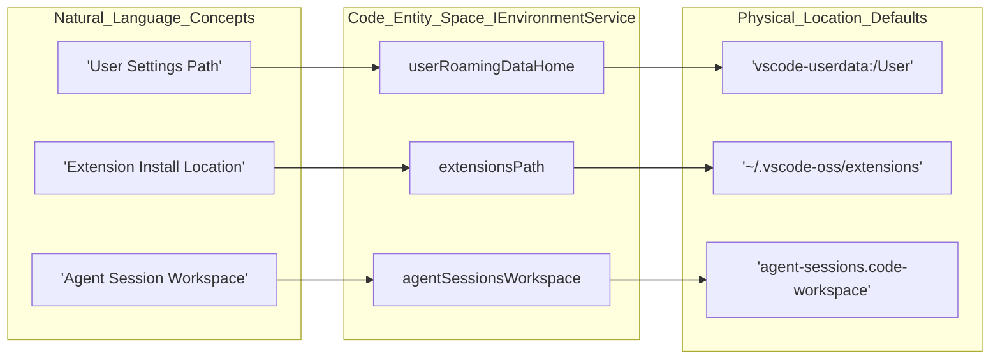
**Sources:** [src/vs/platform/environment/common/environment.ts:114-165](https://github.com/microsoft/vscode/blob/HEAD/src/vs/platform/environment/common/environment.ts#L114-L165), [src/vs/workbench/services/environment/browser/environmentService.ts:42-151](https://github.com/microsoft/vscode/blob/HEAD/src/vs/workbench/services/environment/browser/environmentService.ts#L42-L151)

## Product Configuration (`product.json`)

The `product.json` file is a central configuration file that defines the "flavor" of the build. It is consumed by the `IProductService` and the `product` module [src/vs/platform/product/common/product.ts:24-24](https://github.com/microsoft/vscode/blob/HEAD/src/vs/platform/product/common/product.ts#L24).

Key properties include:
- **`nameShort` / `nameLong`**: Display names (e.g., "Code - OSS") [product.json:2-3](https://github.com/microsoft/vscode/blob/HEAD/product.json#L2-L3).
- **`dataFolderName`**: Folder name for user data (e.g., `.vscode-oss`) [product.json:5](https://github.com/microsoft/vscode/blob/HEAD/product.json#L5).
- **`urlProtocol`**: Custom URI scheme (e.g., `code-oss`) [product.json:36](https://github.com/microsoft/vscode/blob/HEAD/product.json#L36).
- **`defaultChatAgent`**: Configuration for the default AI provider, including extension IDs and API endpoints [product.json:89-152](https://github.com/microsoft/vscode/blob/HEAD/product.json#L89-L152).
- **`tunnelApplicationName`**: Name of the binary used for remote tunneling [product.json:16](https://github.com/microsoft/vscode/blob/HEAD/product.json#L16).

**Sources:** [product.json:1-152](https://github.com/microsoft/vscode/blob/HEAD/product.json#L1-L152), [src/vs/base/common/product.ts:99-206](https://github.com/microsoft/vscode/blob/HEAD/src/vs/base/common/product.ts#L99-L206), [src/vs/platform/product/common/product.ts:37-68](https://github.com/microsoft/vscode/blob/HEAD/src/vs/platform/product/common/product.ts#L37-L68)

## Server CLI and Remote Terminals

When running in a remote context, the server agent handles command execution.

- **Serve Web**: The `ServeWebArgs` in the Rust CLI define how the local web version of VS Code is hosted, including `host`, `port`, and `connection-token` [cli/src/commands/args.rs:195-235](https://github.com/microsoft/vscode/blob/HEAD/cli/src/commands/args.rs#L195-L235).
- **Agent Host**: The `agent` subcommand manages AI agent host sessions, allowing binding to specific hosts and ports [cli/src/commands/args.rs:238-243](https://github.com/microsoft/vscode/blob/HEAD/cli/src/commands/args.rs#L238-L243).
- **Command Shell**: A hidden command `command-shell` runs the control server on process stdin/stdout to facilitate communication between the renderer and the agent host [cli/src/commands/tunnels.rs:146-186](https://github.com/microsoft/vscode/blob/HEAD/cli/src/commands/tunnels.rs#L146-L186).

**Sources:** [cli/src/commands/args.rs:195-243](https://github.com/microsoft/vscode/blob/HEAD/cli/src/commands/args.rs#L195-L243), [cli/src/commands/tunnels.rs:146-186](https://github.com/microsoft/vscode/blob/HEAD/cli/src/commands/tunnels.rs#L146-L186)


---

<!-- Chapter 9: Workbench UI Framework -->
<!-- Source: https://deepwiki.com/microsoft/vscode/3-workbench-ui-framework -->

# Workbench UI Framework

<details>
<summary>Relevant source files</summary>

The following files were used as context for generating this wiki page:

- [src/vs/base/browser/ui/actionbar/actionbar.css](https://github.com/microsoft/vscode/blob/HEAD/src/vs/base/browser/ui/actionbar/actionbar.css)
- [src/vs/base/browser/ui/splitview/paneview.css](https://github.com/microsoft/vscode/blob/HEAD/src/vs/base/browser/ui/splitview/paneview.css)
- [src/vs/base/browser/ui/splitview/paneview.ts](https://github.com/microsoft/vscode/blob/HEAD/src/vs/base/browser/ui/splitview/paneview.ts)
- [src/vs/base/test/browser/ui/splitview/paneview.test.ts](https://github.com/microsoft/vscode/blob/HEAD/src/vs/base/test/browser/ui/splitview/paneview.test.ts)
- [src/vs/platform/editor/common/editor.ts](https://github.com/microsoft/vscode/blob/HEAD/src/vs/platform/editor/common/editor.ts)
- [src/vs/workbench/browser/actions/layoutActions.ts](https://github.com/microsoft/vscode/blob/HEAD/src/vs/workbench/browser/actions/layoutActions.ts)
- [src/vs/workbench/browser/actions/windowActions.ts](https://github.com/microsoft/vscode/blob/HEAD/src/vs/workbench/browser/actions/windowActions.ts)
- [src/vs/workbench/browser/actions/workspaceActions.ts](https://github.com/microsoft/vscode/blob/HEAD/src/vs/workbench/browser/actions/workspaceActions.ts)
- [src/vs/workbench/browser/actions/workspaceCommands.ts](https://github.com/microsoft/vscode/blob/HEAD/src/vs/workbench/browser/actions/workspaceCommands.ts)
- [src/vs/workbench/browser/composite.ts](https://github.com/microsoft/vscode/blob/HEAD/src/vs/workbench/browser/composite.ts)
- [src/vs/workbench/browser/contextkeys.ts](https://github.com/microsoft/vscode/blob/HEAD/src/vs/workbench/browser/contextkeys.ts)
- [src/vs/workbench/browser/layout.ts](https://github.com/microsoft/vscode/blob/HEAD/src/vs/workbench/browser/layout.ts)
- [src/vs/workbench/browser/media/floatingPanels.css](https://github.com/microsoft/vscode/blob/HEAD/src/vs/workbench/browser/media/floatingPanels.css)
- [src/vs/workbench/browser/panecomposite.ts](https://github.com/microsoft/vscode/blob/HEAD/src/vs/workbench/browser/panecomposite.ts)
- [src/vs/workbench/browser/part.ts](https://github.com/microsoft/vscode/blob/HEAD/src/vs/workbench/browser/part.ts)
- [src/vs/workbench/browser/parts/activitybar/activitybarPart.ts](https://github.com/microsoft/vscode/blob/HEAD/src/vs/workbench/browser/parts/activitybar/activitybarPart.ts)
- [src/vs/workbench/browser/parts/auxiliarybar/auxiliaryBarActions.ts](https://github.com/microsoft/vscode/blob/HEAD/src/vs/workbench/browser/parts/auxiliarybar/auxiliaryBarActions.ts)
- [src/vs/workbench/browser/parts/auxiliarybar/auxiliaryBarPart.ts](https://github.com/microsoft/vscode/blob/HEAD/src/vs/workbench/browser/parts/auxiliarybar/auxiliaryBarPart.ts)
- [src/vs/workbench/browser/parts/auxiliarybar/media/auxiliaryBarPart.css](https://github.com/microsoft/vscode/blob/HEAD/src/vs/workbench/browser/parts/auxiliarybar/media/auxiliaryBarPart.css)
- [src/vs/workbench/browser/parts/compositeBar.ts](https://github.com/microsoft/vscode/blob/HEAD/src/vs/workbench/browser/parts/compositeBar.ts)
- [src/vs/workbench/browser/parts/compositeBarActions.ts](https://github.com/microsoft/vscode/blob/HEAD/src/vs/workbench/browser/parts/compositeBarActions.ts)
- [src/vs/workbench/browser/parts/compositePart.ts](https://github.com/microsoft/vscode/blob/HEAD/src/vs/workbench/browser/parts/compositePart.ts)
- [src/vs/workbench/browser/parts/editor/auxiliaryEditorPart.ts](https://github.com/microsoft/vscode/blob/HEAD/src/vs/workbench/browser/parts/editor/auxiliaryEditorPart.ts)
- [src/vs/workbench/browser/parts/editor/editor.contribution.ts](https://github.com/microsoft/vscode/blob/HEAD/src/vs/workbench/browser/parts/editor/editor.contribution.ts)
- [src/vs/workbench/browser/parts/editor/editor.ts](https://github.com/microsoft/vscode/blob/HEAD/src/vs/workbench/browser/parts/editor/editor.ts)
- [src/vs/workbench/browser/parts/editor/editorActions.ts](https://github.com/microsoft/vscode/blob/HEAD/src/vs/workbench/browser/parts/editor/editorActions.ts)
- [src/vs/workbench/browser/parts/editor/editorCommands.ts](https://github.com/microsoft/vscode/blob/HEAD/src/vs/workbench/browser/parts/editor/editorCommands.ts)
- [src/vs/workbench/browser/parts/editor/editorGroupView.ts](https://github.com/microsoft/vscode/blob/HEAD/src/vs/workbench/browser/parts/editor/editorGroupView.ts)
- [src/vs/workbench/browser/parts/editor/editorPart.ts](https://github.com/microsoft/vscode/blob/HEAD/src/vs/workbench/browser/parts/editor/editorPart.ts)
- [src/vs/workbench/browser/parts/editor/editorParts.ts](https://github.com/microsoft/vscode/blob/HEAD/src/vs/workbench/browser/parts/editor/editorParts.ts)
- [src/vs/workbench/browser/parts/editor/media/modalEditorPart.css](https://github.com/microsoft/vscode/blob/HEAD/src/vs/workbench/browser/parts/editor/media/modalEditorPart.css)
- [src/vs/workbench/browser/parts/editor/modalEditorPart.ts](https://github.com/microsoft/vscode/blob/HEAD/src/vs/workbench/browser/parts/editor/modalEditorPart.ts)
- [src/vs/workbench/browser/parts/media/paneCompositePart.css](https://github.com/microsoft/vscode/blob/HEAD/src/vs/workbench/browser/parts/media/paneCompositePart.css)
- [src/vs/workbench/browser/parts/paneCompositeBar.ts](https://github.com/microsoft/vscode/blob/HEAD/src/vs/workbench/browser/parts/paneCompositeBar.ts)
- [src/vs/workbench/browser/parts/paneCompositePart.ts](https://github.com/microsoft/vscode/blob/HEAD/src/vs/workbench/browser/parts/paneCompositePart.ts)
- [src/vs/workbench/browser/parts/panel/media/panelpart.css](https://github.com/microsoft/vscode/blob/HEAD/src/vs/workbench/browser/parts/panel/media/panelpart.css)
- [src/vs/workbench/browser/parts/panel/panelActions.ts](https://github.com/microsoft/vscode/blob/HEAD/src/vs/workbench/browser/parts/panel/panelActions.ts)
- [src/vs/workbench/browser/parts/panel/panelPart.ts](https://github.com/microsoft/vscode/blob/HEAD/src/vs/workbench/browser/parts/panel/panelPart.ts)
- [src/vs/workbench/browser/parts/sidebar/media/sidebarpart.css](https://github.com/microsoft/vscode/blob/HEAD/src/vs/workbench/browser/parts/sidebar/media/sidebarpart.css)
- [src/vs/workbench/browser/parts/sidebar/sidebarPart.ts](https://github.com/microsoft/vscode/blob/HEAD/src/vs/workbench/browser/parts/sidebar/sidebarPart.ts)
- [src/vs/workbench/browser/parts/views/media/paneviewlet.css](https://github.com/microsoft/vscode/blob/HEAD/src/vs/workbench/browser/parts/views/media/paneviewlet.css)
- [src/vs/workbench/browser/parts/views/viewMenuActions.ts](https://github.com/microsoft/vscode/blob/HEAD/src/vs/workbench/browser/parts/views/viewMenuActions.ts)
- [src/vs/workbench/browser/parts/views/viewPane.ts](https://github.com/microsoft/vscode/blob/HEAD/src/vs/workbench/browser/parts/views/viewPane.ts)
- [src/vs/workbench/browser/parts/views/viewPaneContainer.ts](https://github.com/microsoft/vscode/blob/HEAD/src/vs/workbench/browser/parts/views/viewPaneContainer.ts)
- [src/vs/workbench/browser/workbench.contribution.ts](https://github.com/microsoft/vscode/blob/HEAD/src/vs/workbench/browser/workbench.contribution.ts)
- [src/vs/workbench/browser/workbench.ts](https://github.com/microsoft/vscode/blob/HEAD/src/vs/workbench/browser/workbench.ts)
- [src/vs/workbench/common/contextkeys.ts](https://github.com/microsoft/vscode/blob/HEAD/src/vs/workbench/common/contextkeys.ts)
- [src/vs/workbench/common/editor.ts](https://github.com/microsoft/vscode/blob/HEAD/src/vs/workbench/common/editor.ts)
- [src/vs/workbench/common/editor/editorGroupModel.ts](https://github.com/microsoft/vscode/blob/HEAD/src/vs/workbench/common/editor/editorGroupModel.ts)
- [src/vs/workbench/common/editor/filteredEditorGroupModel.ts](https://github.com/microsoft/vscode/blob/HEAD/src/vs/workbench/common/editor/filteredEditorGroupModel.ts)
- [src/vs/workbench/contrib/chat/test/browser/agentSessions/agentSessionsRenderer.test.ts](https://github.com/microsoft/vscode/blob/HEAD/src/vs/workbench/contrib/chat/test/browser/agentSessions/agentSessionsRenderer.test.ts)
- [src/vs/workbench/contrib/styleOverrides/browser/media/activityBar.css](https://github.com/microsoft/vscode/blob/HEAD/src/vs/workbench/contrib/styleOverrides/browser/media/activityBar.css)
- [src/vs/workbench/contrib/styleOverrides/browser/media/editorBorder.css](https://github.com/microsoft/vscode/blob/HEAD/src/vs/workbench/contrib/styleOverrides/browser/media/editorBorder.css)
- [src/vs/workbench/contrib/styleOverrides/browser/media/fontRamp.css](https://github.com/microsoft/vscode/blob/HEAD/src/vs/workbench/contrib/styleOverrides/browser/media/fontRamp.css)
- [src/vs/workbench/contrib/styleOverrides/browser/media/notificationsDialogs.css](https://github.com/microsoft/vscode/blob/HEAD/src/vs/workbench/contrib/styleOverrides/browser/media/notificationsDialogs.css)
- [src/vs/workbench/contrib/styleOverrides/browser/media/padding.css](https://github.com/microsoft/vscode/blob/HEAD/src/vs/workbench/contrib/styleOverrides/browser/media/padding.css)
- [src/vs/workbench/contrib/styleOverrides/browser/media/paneHeaders.css](https://github.com/microsoft/vscode/blob/HEAD/src/vs/workbench/contrib/styleOverrides/browser/media/paneHeaders.css)
- [src/vs/workbench/contrib/styleOverrides/browser/media/roundedCorners.css](https://github.com/microsoft/vscode/blob/HEAD/src/vs/workbench/contrib/styleOverrides/browser/media/roundedCorners.css)
- [src/vs/workbench/contrib/styleOverrides/browser/media/statusBar.css](https://github.com/microsoft/vscode/blob/HEAD/src/vs/workbench/contrib/styleOverrides/browser/media/statusBar.css)
- [src/vs/workbench/contrib/styleOverrides/browser/media/tabs.css](https://github.com/microsoft/vscode/blob/HEAD/src/vs/workbench/contrib/styleOverrides/browser/media/tabs.css)
- [src/vs/workbench/contrib/styleOverrides/browser/media/titlebar.css](https://github.com/microsoft/vscode/blob/HEAD/src/vs/workbench/contrib/styleOverrides/browser/media/titlebar.css)
- [src/vs/workbench/contrib/styleOverrides/browser/styleOverrides.contribution.ts](https://github.com/microsoft/vscode/blob/HEAD/src/vs/workbench/contrib/styleOverrides/browser/styleOverrides.contribution.ts)
- [src/vs/workbench/contrib/styleOverrides/test/browser/styleOverrides.contribution.test.ts](https://github.com/microsoft/vscode/blob/HEAD/src/vs/workbench/contrib/styleOverrides/test/browser/styleOverrides.contribution.test.ts)
- [src/vs/workbench/services/editor/browser/editorService.ts](https://github.com/microsoft/vscode/blob/HEAD/src/vs/workbench/services/editor/browser/editorService.ts)
- [src/vs/workbench/services/editor/common/editorGroupFinder.ts](https://github.com/microsoft/vscode/blob/HEAD/src/vs/workbench/services/editor/common/editorGroupFinder.ts)
- [src/vs/workbench/services/editor/common/editorGroupsService.ts](https://github.com/microsoft/vscode/blob/HEAD/src/vs/workbench/services/editor/common/editorGroupsService.ts)
- [src/vs/workbench/services/editor/common/editorService.ts](https://github.com/microsoft/vscode/blob/HEAD/src/vs/workbench/services/editor/common/editorService.ts)
- [src/vs/workbench/services/editor/test/browser/editorGroupsService.test.ts](https://github.com/microsoft/vscode/blob/HEAD/src/vs/workbench/services/editor/test/browser/editorGroupsService.test.ts)
- [src/vs/workbench/services/editor/test/browser/editorService.test.ts](https://github.com/microsoft/vscode/blob/HEAD/src/vs/workbench/services/editor/test/browser/editorService.test.ts)
- [src/vs/workbench/services/editor/test/browser/modalEditorGroup.test.ts](https://github.com/microsoft/vscode/blob/HEAD/src/vs/workbench/services/editor/test/browser/modalEditorGroup.test.ts)
- [src/vs/workbench/services/layout/browser/layoutService.ts](https://github.com/microsoft/vscode/blob/HEAD/src/vs/workbench/services/layout/browser/layoutService.ts)
- [src/vs/workbench/services/layout/test/browser/layoutService.test.ts](https://github.com/microsoft/vscode/blob/HEAD/src/vs/workbench/services/layout/test/browser/layoutService.test.ts)
- [src/vs/workbench/services/progress/browser/media/progressService.css](https://github.com/microsoft/vscode/blob/HEAD/src/vs/workbench/services/progress/browser/media/progressService.css)
- [src/vs/workbench/services/views/browser/viewDescriptorService.ts](https://github.com/microsoft/vscode/blob/HEAD/src/vs/workbench/services/views/browser/viewDescriptorService.ts)
- [src/vs/workbench/services/views/browser/viewsService.ts](https://github.com/microsoft/vscode/blob/HEAD/src/vs/workbench/services/views/browser/viewsService.ts)
- [src/vs/workbench/services/views/common/viewContainerModel.ts](https://github.com/microsoft/vscode/blob/HEAD/src/vs/workbench/services/views/common/viewContainerModel.ts)
- [src/vs/workbench/services/views/common/viewsService.ts](https://github.com/microsoft/vscode/blob/HEAD/src/vs/workbench/services/views/common/viewsService.ts)
- [src/vs/workbench/services/views/test/browser/viewContainerModel.test.ts](https://github.com/microsoft/vscode/blob/HEAD/src/vs/workbench/services/views/test/browser/viewContainerModel.test.ts)
- [src/vs/workbench/services/views/test/browser/viewDescriptorService.test.ts](https://github.com/microsoft/vscode/blob/HEAD/src/vs/workbench/services/views/test/browser/viewDescriptorService.test.ts)
- [src/vs/workbench/test/browser/part.test.ts](https://github.com/microsoft/vscode/blob/HEAD/src/vs/workbench/test/browser/part.test.ts)
- [src/vs/workbench/test/browser/parts/activitybar/activitybarPart.test.ts](https://github.com/microsoft/vscode/blob/HEAD/src/vs/workbench/test/browser/parts/activitybar/activitybarPart.test.ts)
- [src/vs/workbench/test/browser/parts/editor/editorGroupModel.test.ts](https://github.com/microsoft/vscode/blob/HEAD/src/vs/workbench/test/browser/parts/editor/editorGroupModel.test.ts)
- [src/vs/workbench/test/browser/parts/editor/filteredEditorGroupModel.test.ts](https://github.com/microsoft/vscode/blob/HEAD/src/vs/workbench/test/browser/parts/editor/filteredEditorGroupModel.test.ts)
- [src/vs/workbench/test/browser/workbenchTestServices.ts](https://github.com/microsoft/vscode/blob/HEAD/src/vs/workbench/test/browser/workbenchTestServices.ts)

</details>


The Workbench UI Framework provides the structural foundation for the VS Code interface. It manages a parts-based layout system that organizes the editor area, sidebars, panels, and toolbars into a cohesive user experience. The framework is built on a service-oriented architecture, using dependency injection to coordinate complex interactions between the layout, editor management, and view contributions.

## Layout and Parts System

The workbench is divided into several distinct **Parts**, each represented by a class extending `Part` [src/vs/workbench/browser/part.ts:29-29](https://github.com/microsoft/vscode/blob/HEAD/src/vs/workbench/browser/part.ts#L29). The `Layout` class [src/vs/workbench/browser/layout.ts:143-143](https://github.com/microsoft/vscode/blob/HEAD/src/vs/workbench/browser/layout.ts#L143) orchestrates the visibility, sizing, and positioning of these parts using a grid-based system.

*   **Main Parts**: Defined by the `Parts` enum, these include the `TITLEBAR_PART`, `EDITOR_PART`, `SIDEBAR_PART`, `PANEL_PART`, `AUXILIARYBAR_PART`, and `STATUSBAR_PART` [src/vs/workbench/services/layout/browser/layoutService.ts:15-15](https://github.com/microsoft/vscode/blob/HEAD/src/vs/workbench/services/layout/browser/layoutService.ts#L15).
*   **Grid Management**: The layout uses `SerializableGrid` [src/vs/workbench/browser/layout.ts:28-28](https://github.com/microsoft/vscode/blob/HEAD/src/vs/workbench/browser/layout.ts#L28) to maintain the proportional relationship between UI elements via a set of `LayoutClasses` such as `SIDEBAR_HIDDEN`, `PANEL_HIDDEN`, or `STATUSBAR_HIDDEN` [src/vs/workbench/browser/layout.ts:99-105](https://github.com/microsoft/vscode/blob/HEAD/src/vs/workbench/browser/layout.ts#L99-L105).
*   **Multi-Window Support**: The `IAuxiliaryWindowService` [src/vs/workbench/browser/layout.ts:51-51](https://github.com/microsoft/vscode/blob/HEAD/src/vs/workbench/browser/layout.ts#L51) allows the workbench to span across multiple native windows. The `AuxiliaryEditorPart` enables editor groups to be moved into these separate windows [src/vs/workbench/browser/parts/editor/auxiliaryEditorPart.ts:16-16](https://github.com/microsoft/vscode/blob/HEAD/src/vs/workbench/browser/parts/editor/auxiliaryEditorPart.ts#L16).

For details, see [Layout and Parts System](#3.1).

**Sources:** [src/vs/workbench/browser/layout.ts:143-143](https://github.com/microsoft/vscode/blob/HEAD/src/vs/workbench/browser/layout.ts#L143), [src/vs/workbench/services/layout/browser/layoutService.ts:15-15](https://github.com/microsoft/vscode/blob/HEAD/src/vs/workbench/services/layout/browser/layoutService.ts#L15), [src/vs/workbench/browser/part.ts:29-29](https://github.com/microsoft/vscode/blob/HEAD/src/vs/workbench/browser/part.ts#L29).

## Editor Groups and Editor Service

The Editor area is the central component of the workbench. It is managed by two primary services: `IEditorService` [src/vs/workbench/services/editor/common/editorService.ts:19-19](https://github.com/microsoft/vscode/blob/HEAD/src/vs/workbench/services/editor/common/editorService.ts#L19) and `IEditorGroupsService` [src/vs/workbench/services/editor/common/editorGroupsService.ts:35-35](https://github.com/microsoft/vscode/blob/HEAD/src/vs/workbench/services/editor/common/editorGroupsService.ts#L35).

*   **Editor Groups**: Editors are organized into groups (`EditorGroupView`), which can be split vertically or horizontally [src/vs/workbench/browser/parts/editor/editorGroupView.ts:65-65](https://github.com/microsoft/vscode/blob/HEAD/src/vs/workbench/browser/parts/editor/editorGroupView.ts#L65).
*   **Editor Inputs**: Every resource opened in the editor is represented by an `EditorInput` [src/vs/workbench/common/editor.ts:13-13](https://github.com/microsoft/vscode/blob/HEAD/src/vs/workbench/common/editor.ts#L13), such as `TextResourceEditorInput` [src/vs/workbench/browser/parts/editor/editor.contribution.ts:22-22](https://github.com/microsoft/vscode/blob/HEAD/src/vs/workbench/browser/parts/editor/editor.contribution.ts#L22) or `DiffEditorInput` [src/vs/workbench/browser/parts/editor/editor.contribution.ts:20-20](https://github.com/microsoft/vscode/blob/HEAD/src/vs/workbench/browser/parts/editor/editor.contribution.ts#L20).
*   **Models**: The `EditorGroupModel` tracks the state of editors within a group, including the Most Recently Used (MRU) order, pinned state, and sticky editors [src/vs/workbench/common/editor/editorGroupModel.ts:7-7](https://github.com/microsoft/vscode/blob/HEAD/src/vs/workbench/common/editor/editorGroupModel.ts#L7).

For details, see [Editor Groups and Editor Service](#3.2).

**Sources:** [src/vs/workbench/services/editor/browser/editorService.ts:39-39](https://github.com/microsoft/vscode/blob/HEAD/src/vs/workbench/services/editor/browser/editorService.ts#L39), [src/vs/workbench/browser/parts/editor/editorGroupView.ts:65-65](https://github.com/microsoft/vscode/blob/HEAD/src/vs/workbench/browser/parts/editor/editorGroupView.ts#L65), [src/vs/workbench/common/editor.ts:13-13](https://github.com/microsoft/vscode/blob/HEAD/src/vs/workbench/common/editor.ts#L13).

## Views, Panels, and Activity Bar

Views are specialized UI components (typically trees or lists) that reside within containers like the Sidebar or Panel.

*   **View Containers**: Managed by `IViewDescriptorService` [src/vs/workbench/common/views.ts:37-37](https://github.com/microsoft/vscode/blob/HEAD/src/vs/workbench/common/views.ts#L37), which handles the registration and location of view containers.
*   **View Panes**: Individual sections within a sidebar or panel are typically `ViewPane` instances [src/vs/workbench/browser/parts/views/viewPane.ts:33-33](https://github.com/microsoft/vscode/blob/HEAD/src/vs/workbench/browser/parts/views/viewPane.ts#L33).
*   **Activity Bar**: The `ActivitybarPart` [src/vs/workbench/browser/parts/activitybar/activitybarPart.ts:44-44](https://github.com/microsoft/vscode/blob/HEAD/src/vs/workbench/browser/parts/activitybar/activitybarPart.ts#L44) provides navigation for switching between view containers. It supports a standard width (48px) and a compact mode (36px) [src/vs/workbench/browser/parts/activitybar/activitybarPart.ts:49-50](https://github.com/microsoft/vscode/blob/HEAD/src/vs/workbench/browser/parts/activitybar/activitybarPart.ts#L49-L50).

For details, see [Views, Panels, and Activity Bar](#3.3).

**Sources:** [src/vs/workbench/common/views.ts:37-37](https://github.com/microsoft/vscode/blob/HEAD/src/vs/workbench/common/views.ts#L37), [src/vs/workbench/browser/parts/views/viewPane.ts:33-33](https://github.com/microsoft/vscode/blob/HEAD/src/vs/workbench/browser/parts/views/viewPane.ts#L33), [src/vs/workbench/browser/parts/activitybar/activitybarPart.ts:44-44](https://github.com/microsoft/vscode/blob/HEAD/src/vs/workbench/browser/parts/activitybar/activitybarPart.ts#L44).

## Workbench Service Layer

The following diagram illustrates how the core services interact to form the Workbench UI.

### UI Service Interaction
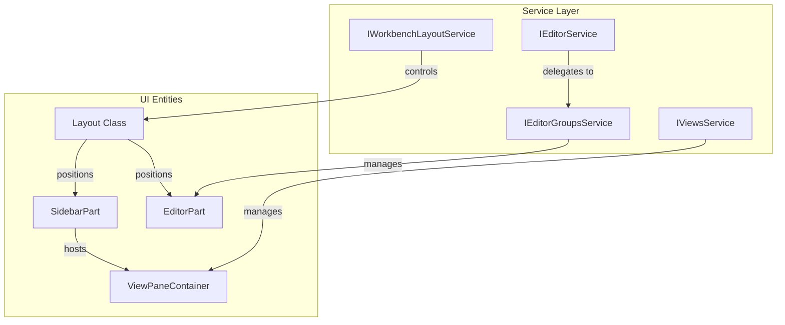
**Sources:** [src/vs/workbench/browser/layout.ts:143-143](https://github.com/microsoft/vscode/blob/HEAD/src/vs/workbench/browser/layout.ts#L143), [src/vs/workbench/services/editor/browser/editorService.ts:39-39](https://github.com/microsoft/vscode/blob/HEAD/src/vs/workbench/services/editor/browser/editorService.ts#L39), [src/vs/workbench/browser/parts/paneCompositePart.ts:21-21](https://github.com/microsoft/vscode/blob/HEAD/src/vs/workbench/browser/parts/paneCompositePart.ts#L21).

## Code Entity Mapping

This table bridges the conceptual UI parts to their primary implementation classes and associated services.

| UI Concept | Code Entity (Class) | Primary Service |
| :--- | :--- | :--- |
| **Main Layout** | `Layout` [src/vs/workbench/browser/layout.ts:143](https://github.com/microsoft/vscode/blob/HEAD/src/vs/workbench/browser/layout.ts#L143) | `IWorkbenchLayoutService` |
| **Editor Area** | `EditorPart` [src/vs/workbench/browser/parts/editor/editorPart.ts:89](https://github.com/microsoft/vscode/blob/HEAD/src/vs/workbench/browser/parts/editor/editorPart.ts#L89) | `IEditorGroupsService` |
| **Sidebar** | `SidebarPart` [src/vs/workbench/browser/parts/sidebar/sidebarPart.ts:13](https://github.com/microsoft/vscode/blob/HEAD/src/vs/workbench/browser/parts/sidebar/sidebarPart.ts#L13) | `IPaneCompositePartService` |
| **Activity Bar** | `ActivitybarPart` [src/vs/workbench/browser/parts/activitybar/activitybarPart.ts:44](https://github.com/microsoft/vscode/blob/HEAD/src/vs/workbench/browser/parts/activitybar/activitybarPart.ts#L44) | `IViewDescriptorService` |
| **Panel** | `PanelPart` [src/vs/workbench/browser/parts/panel/panelPart.ts:36](https://github.com/microsoft/vscode/blob/HEAD/src/vs/workbench/browser/parts/panel/panelPart.ts#L36) | `IPaneCompositePartService` |
| **Auxiliary Bar** | `AuxiliaryBarPart` [src/vs/workbench/browser/parts/auxiliarybar/auxiliaryBarPart.ts:16](https://github.com/microsoft/vscode/blob/HEAD/src/vs/workbench/browser/parts/auxiliarybar/auxiliaryBarPart.ts#L16) | `IPaneCompositePartService` |

### Workbench Composition Diagram
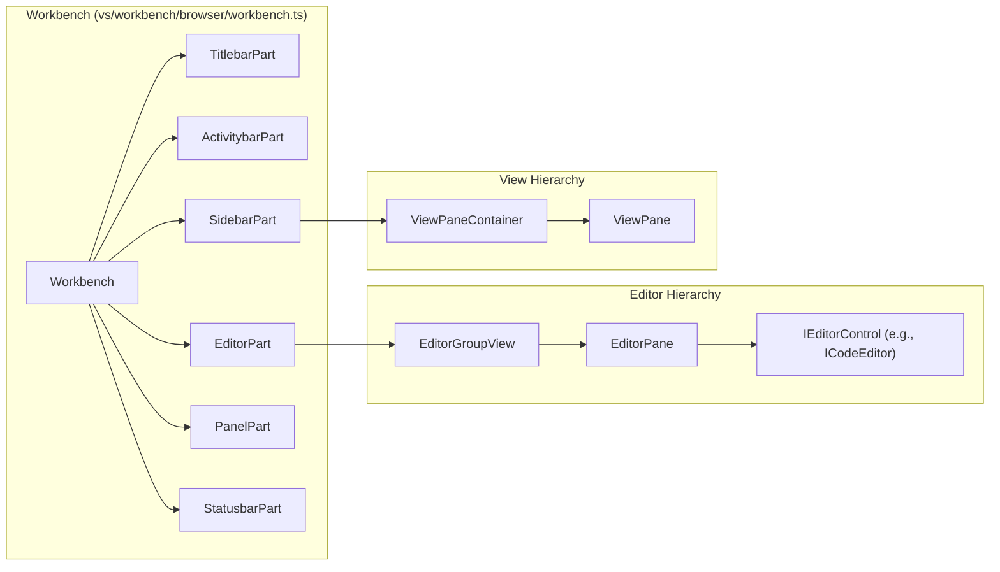
**Sources:** [src/vs/workbench/browser/parts/editor/editorGroupView.ts:65-65](https://github.com/microsoft/vscode/blob/HEAD/src/vs/workbench/browser/parts/editor/editorGroupView.ts#L65), [src/vs/workbench/browser/parts/views/viewPane.ts:33-33](https://github.com/microsoft/vscode/blob/HEAD/src/vs/workbench/browser/parts/views/viewPane.ts#L33), [src/vs/workbench/browser/parts/editor/editorPart.ts:89-89](https://github.com/microsoft/vscode/blob/HEAD/src/vs/workbench/browser/parts/editor/editorPart.ts#L89).

## Child Pages

*   [Layout and Parts System](#3.1) — Details on the grid layout, part lifecycle, and multi-window orchestration via `AuxiliaryWindowService`.
*   [Editor Groups and Editor Service](#3.2) — Deep dive into editor management, `EditorInput` types, and `EditorGroupModel`.
*   [Views, Panels, and Activity Bar](#3.3) — Explanation of the view contribution system, `ViewPaneContainer`, and the composite bar.
*   [Theming, Icons, and Styling](#3.4) — How the workbench applies colors, `ThemeIcon`, and CSS variables.
*   [Settings, Keybindings, and Configuration](#3.5) — The infrastructure for user preferences, `IConfigurationService`, and command shortcuts.20:T4bfb,#


---

<!-- Chapter 10: Layout and Parts System -->
<!-- Source: https://deepwiki.com/microsoft/vscode/3.1-layout-and-parts-system -->

# Layout and Parts System

<details>
<summary>Relevant source files</summary>

The following files were used as context for generating this wiki page:

- [src/vs/base/browser/ui/actionbar/actionbar.css](https://github.com/microsoft/vscode/blob/HEAD/src/vs/base/browser/ui/actionbar/actionbar.css)
- [src/vs/base/browser/ui/splitview/paneview.css](https://github.com/microsoft/vscode/blob/HEAD/src/vs/base/browser/ui/splitview/paneview.css)
- [src/vs/base/browser/ui/splitview/paneview.ts](https://github.com/microsoft/vscode/blob/HEAD/src/vs/base/browser/ui/splitview/paneview.ts)
- [src/vs/base/test/browser/ui/splitview/paneview.test.ts](https://github.com/microsoft/vscode/blob/HEAD/src/vs/base/test/browser/ui/splitview/paneview.test.ts)
- [src/vs/platform/editor/common/editor.ts](https://github.com/microsoft/vscode/blob/HEAD/src/vs/platform/editor/common/editor.ts)
- [src/vs/workbench/browser/actions/layoutActions.ts](https://github.com/microsoft/vscode/blob/HEAD/src/vs/workbench/browser/actions/layoutActions.ts)
- [src/vs/workbench/browser/actions/windowActions.ts](https://github.com/microsoft/vscode/blob/HEAD/src/vs/workbench/browser/actions/windowActions.ts)
- [src/vs/workbench/browser/actions/workspaceActions.ts](https://github.com/microsoft/vscode/blob/HEAD/src/vs/workbench/browser/actions/workspaceActions.ts)
- [src/vs/workbench/browser/actions/workspaceCommands.ts](https://github.com/microsoft/vscode/blob/HEAD/src/vs/workbench/browser/actions/workspaceCommands.ts)
- [src/vs/workbench/browser/composite.ts](https://github.com/microsoft/vscode/blob/HEAD/src/vs/workbench/browser/composite.ts)
- [src/vs/workbench/browser/contextkeys.ts](https://github.com/microsoft/vscode/blob/HEAD/src/vs/workbench/browser/contextkeys.ts)
- [src/vs/workbench/browser/layout.ts](https://github.com/microsoft/vscode/blob/HEAD/src/vs/workbench/browser/layout.ts)
- [src/vs/workbench/browser/media/floatingPanels.css](https://github.com/microsoft/vscode/blob/HEAD/src/vs/workbench/browser/media/floatingPanels.css)
- [src/vs/workbench/browser/panecomposite.ts](https://github.com/microsoft/vscode/blob/HEAD/src/vs/workbench/browser/panecomposite.ts)
- [src/vs/workbench/browser/part.ts](https://github.com/microsoft/vscode/blob/HEAD/src/vs/workbench/browser/part.ts)
- [src/vs/workbench/browser/parts/activitybar/activitybarPart.ts](https://github.com/microsoft/vscode/blob/HEAD/src/vs/workbench/browser/parts/activitybar/activitybarPart.ts)
- [src/vs/workbench/browser/parts/auxiliarybar/auxiliaryBarActions.ts](https://github.com/microsoft/vscode/blob/HEAD/src/vs/workbench/browser/parts/auxiliarybar/auxiliaryBarActions.ts)
- [src/vs/workbench/browser/parts/auxiliarybar/auxiliaryBarPart.ts](https://github.com/microsoft/vscode/blob/HEAD/src/vs/workbench/browser/parts/auxiliarybar/auxiliaryBarPart.ts)
- [src/vs/workbench/browser/parts/auxiliarybar/media/auxiliaryBarPart.css](https://github.com/microsoft/vscode/blob/HEAD/src/vs/workbench/browser/parts/auxiliarybar/media/auxiliaryBarPart.css)
- [src/vs/workbench/browser/parts/compositeBar.ts](https://github.com/microsoft/vscode/blob/HEAD/src/vs/workbench/browser/parts/compositeBar.ts)
- [src/vs/workbench/browser/parts/compositeBarActions.ts](https://github.com/microsoft/vscode/blob/HEAD/src/vs/workbench/browser/parts/compositeBarActions.ts)
- [src/vs/workbench/browser/parts/compositePart.ts](https://github.com/microsoft/vscode/blob/HEAD/src/vs/workbench/browser/parts/compositePart.ts)
- [src/vs/workbench/browser/parts/editor/auxiliaryEditorPart.ts](https://github.com/microsoft/vscode/blob/HEAD/src/vs/workbench/browser/parts/editor/auxiliaryEditorPart.ts)
- [src/vs/workbench/browser/parts/editor/editor.contribution.ts](https://github.com/microsoft/vscode/blob/HEAD/src/vs/workbench/browser/parts/editor/editor.contribution.ts)
- [src/vs/workbench/browser/parts/editor/editor.ts](https://github.com/microsoft/vscode/blob/HEAD/src/vs/workbench/browser/parts/editor/editor.ts)
- [src/vs/workbench/browser/parts/editor/editorActions.ts](https://github.com/microsoft/vscode/blob/HEAD/src/vs/workbench/browser/parts/editor/editorActions.ts)
- [src/vs/workbench/browser/parts/editor/editorCommands.ts](https://github.com/microsoft/vscode/blob/HEAD/src/vs/workbench/browser/parts/editor/editorCommands.ts)
- [src/vs/workbench/browser/parts/editor/editorGroupView.ts](https://github.com/microsoft/vscode/blob/HEAD/src/vs/workbench/browser/parts/editor/editorGroupView.ts)
- [src/vs/workbench/browser/parts/editor/editorPart.ts](https://github.com/microsoft/vscode/blob/HEAD/src/vs/workbench/browser/parts/editor/editorPart.ts)
- [src/vs/workbench/browser/parts/editor/editorParts.ts](https://github.com/microsoft/vscode/blob/HEAD/src/vs/workbench/browser/parts/editor/editorParts.ts)
- [src/vs/workbench/browser/parts/editor/media/modalEditorPart.css](https://github.com/microsoft/vscode/blob/HEAD/src/vs/workbench/browser/parts/editor/media/modalEditorPart.css)
- [src/vs/workbench/browser/parts/editor/modalEditorPart.ts](https://github.com/microsoft/vscode/blob/HEAD/src/vs/workbench/browser/parts/editor/modalEditorPart.ts)
- [src/vs/workbench/browser/parts/media/paneCompositePart.css](https://github.com/microsoft/vscode/blob/HEAD/src/vs/workbench/browser/parts/media/paneCompositePart.css)
- [src/vs/workbench/browser/parts/paneCompositeBar.ts](https://github.com/microsoft/vscode/blob/HEAD/src/vs/workbench/browser/parts/paneCompositeBar.ts)
- [src/vs/workbench/browser/parts/paneCompositePart.ts](https://github.com/microsoft/vscode/blob/HEAD/src/vs/workbench/browser/parts/paneCompositePart.ts)
- [src/vs/workbench/browser/parts/panel/media/panelpart.css](https://github.com/microsoft/vscode/blob/HEAD/src/vs/workbench/browser/parts/panel/media/panelpart.css)
- [src/vs/workbench/browser/parts/panel/panelActions.ts](https://github.com/microsoft/vscode/blob/HEAD/src/vs/workbench/browser/parts/panel/panelActions.ts)
- [src/vs/workbench/browser/parts/panel/panelPart.ts](https://github.com/microsoft/vscode/blob/HEAD/src/vs/workbench/browser/parts/panel/panelPart.ts)
- [src/vs/workbench/browser/parts/sidebar/media/sidebarpart.css](https://github.com/microsoft/vscode/blob/HEAD/src/vs/workbench/browser/parts/sidebar/media/sidebarpart.css)
- [src/vs/workbench/browser/parts/sidebar/sidebarPart.ts](https://github.com/microsoft/vscode/blob/HEAD/src/vs/workbench/browser/parts/sidebar/sidebarPart.ts)
- [src/vs/workbench/browser/parts/views/media/paneviewlet.css](https://github.com/microsoft/vscode/blob/HEAD/src/vs/workbench/browser/parts/views/media/paneviewlet.css)
- [src/vs/workbench/browser/parts/views/viewMenuActions.ts](https://github.com/microsoft/vscode/blob/HEAD/src/vs/workbench/browser/parts/views/viewMenuActions.ts)
- [src/vs/workbench/browser/parts/views/viewPane.ts](https://github.com/microsoft/vscode/blob/HEAD/src/vs/workbench/browser/parts/views/viewPane.ts)
- [src/vs/workbench/browser/parts/views/viewPaneContainer.ts](https://github.com/microsoft/vscode/blob/HEAD/src/vs/workbench/browser/parts/views/viewPaneContainer.ts)
- [src/vs/workbench/browser/workbench.contribution.ts](https://github.com/microsoft/vscode/blob/HEAD/src/vs/workbench/browser/workbench.contribution.ts)
- [src/vs/workbench/browser/workbench.ts](https://github.com/microsoft/vscode/blob/HEAD/src/vs/workbench/browser/workbench.ts)
- [src/vs/workbench/common/contextkeys.ts](https://github.com/microsoft/vscode/blob/HEAD/src/vs/workbench/common/contextkeys.ts)
- [src/vs/workbench/common/editor.ts](https://github.com/microsoft/vscode/blob/HEAD/src/vs/workbench/common/editor.ts)
- [src/vs/workbench/common/editor/editorGroupModel.ts](https://github.com/microsoft/vscode/blob/HEAD/src/vs/workbench/common/editor/editorGroupModel.ts)
- [src/vs/workbench/common/editor/filteredEditorGroupModel.ts](https://github.com/microsoft/vscode/blob/HEAD/src/vs/workbench/common/editor/filteredEditorGroupModel.ts)
- [src/vs/workbench/contrib/chat/test/browser/agentSessions/agentSessionsRenderer.test.ts](https://github.com/microsoft/vscode/blob/HEAD/src/vs/workbench/contrib/chat/test/browser/agentSessions/agentSessionsRenderer.test.ts)
- [src/vs/workbench/contrib/styleOverrides/browser/media/activityBar.css](https://github.com/microsoft/vscode/blob/HEAD/src/vs/workbench/contrib/styleOverrides/browser/media/activityBar.css)
- [src/vs/workbench/contrib/styleOverrides/browser/media/editorBorder.css](https://github.com/microsoft/vscode/blob/HEAD/src/vs/workbench/contrib/styleOverrides/browser/media/editorBorder.css)
- [src/vs/workbench/contrib/styleOverrides/browser/media/fontRamp.css](https://github.com/microsoft/vscode/blob/HEAD/src/vs/workbench/contrib/styleOverrides/browser/media/fontRamp.css)
- [src/vs/workbench/contrib/styleOverrides/browser/media/notificationsDialogs.css](https://github.com/microsoft/vscode/blob/HEAD/src/vs/workbench/contrib/styleOverrides/browser/media/notificationsDialogs.css)
- [src/vs/workbench/contrib/styleOverrides/browser/media/padding.css](https://github.com/microsoft/vscode/blob/HEAD/src/vs/workbench/contrib/styleOverrides/browser/media/padding.css)
- [src/vs/workbench/contrib/styleOverrides/browser/media/paneHeaders.css](https://github.com/microsoft/vscode/blob/HEAD/src/vs/workbench/contrib/styleOverrides/browser/media/paneHeaders.css)
- [src/vs/workbench/contrib/styleOverrides/browser/media/roundedCorners.css](https://github.com/microsoft/vscode/blob/HEAD/src/vs/workbench/contrib/styleOverrides/browser/media/roundedCorners.css)
- [src/vs/workbench/contrib/styleOverrides/browser/media/statusBar.css](https://github.com/microsoft/vscode/blob/HEAD/src/vs/workbench/contrib/styleOverrides/browser/media/statusBar.css)
- [src/vs/workbench/contrib/styleOverrides/browser/media/tabs.css](https://github.com/microsoft/vscode/blob/HEAD/src/vs/workbench/contrib/styleOverrides/browser/media/tabs.css)
- [src/vs/workbench/contrib/styleOverrides/browser/media/titlebar.css](https://github.com/microsoft/vscode/blob/HEAD/src/vs/workbench/contrib/styleOverrides/browser/media/titlebar.css)
- [src/vs/workbench/contrib/styleOverrides/browser/styleOverrides.contribution.ts](https://github.com/microsoft/vscode/blob/HEAD/src/vs/workbench/contrib/styleOverrides/browser/styleOverrides.contribution.ts)
- [src/vs/workbench/contrib/styleOverrides/test/browser/styleOverrides.contribution.test.ts](https://github.com/microsoft/vscode/blob/HEAD/src/vs/workbench/contrib/styleOverrides/test/browser/styleOverrides.contribution.test.ts)
- [src/vs/workbench/services/editor/browser/editorService.ts](https://github.com/microsoft/vscode/blob/HEAD/src/vs/workbench/services/editor/browser/editorService.ts)
- [src/vs/workbench/services/editor/common/editorGroupFinder.ts](https://github.com/microsoft/vscode/blob/HEAD/src/vs/workbench/services/editor/common/editorGroupFinder.ts)
- [src/vs/workbench/services/editor/common/editorGroupsService.ts](https://github.com/microsoft/vscode/blob/HEAD/src/vs/workbench/services/editor/common/editorGroupsService.ts)
- [src/vs/workbench/services/editor/common/editorService.ts](https://github.com/microsoft/vscode/blob/HEAD/src/vs/workbench/services/editor/common/editorService.ts)
- [src/vs/workbench/services/editor/test/browser/editorGroupsService.test.ts](https://github.com/microsoft/vscode/blob/HEAD/src/vs/workbench/services/editor/test/browser/editorGroupsService.test.ts)
- [src/vs/workbench/services/editor/test/browser/editorService.test.ts](https://github.com/microsoft/vscode/blob/HEAD/src/vs/workbench/services/editor/test/browser/editorService.test.ts)
- [src/vs/workbench/services/editor/test/browser/modalEditorGroup.test.ts](https://github.com/microsoft/vscode/blob/HEAD/src/vs/workbench/services/editor/test/browser/modalEditorGroup.test.ts)
- [src/vs/workbench/services/layout/browser/layoutService.ts](https://github.com/microsoft/vscode/blob/HEAD/src/vs/workbench/services/layout/browser/layoutService.ts)
- [src/vs/workbench/services/layout/test/browser/layoutService.test.ts](https://github.com/microsoft/vscode/blob/HEAD/src/vs/workbench/services/layout/test/browser/layoutService.test.ts)
- [src/vs/workbench/services/progress/browser/media/progressService.css](https://github.com/microsoft/vscode/blob/HEAD/src/vs/workbench/services/progress/browser/media/progressService.css)
- [src/vs/workbench/services/views/browser/viewDescriptorService.ts](https://github.com/microsoft/vscode/blob/HEAD/src/vs/workbench/services/views/browser/viewDescriptorService.ts)
- [src/vs/workbench/services/views/browser/viewsService.ts](https://github.com/microsoft/vscode/blob/HEAD/src/vs/workbench/services/views/browser/viewsService.ts)
- [src/vs/workbench/services/views/common/viewContainerModel.ts](https://github.com/microsoft/vscode/blob/HEAD/src/vs/workbench/services/views/common/viewContainerModel.ts)
- [src/vs/workbench/services/views/common/viewsService.ts](https://github.com/microsoft/vscode/blob/HEAD/src/vs/workbench/services/views/common/viewsService.ts)
- [src/vs/workbench/services/views/test/browser/viewContainerModel.test.ts](https://github.com/microsoft/vscode/blob/HEAD/src/vs/workbench/services/views/test/browser/viewContainerModel.test.ts)
- [src/vs/workbench/services/views/test/browser/viewDescriptorService.test.ts](https://github.com/microsoft/vscode/blob/HEAD/src/vs/workbench/services/views/test/browser/viewDescriptorService.test.ts)
- [src/vs/workbench/test/browser/part.test.ts](https://github.com/microsoft/vscode/blob/HEAD/src/vs/workbench/test/browser/part.test.ts)
- [src/vs/workbench/test/browser/parts/activitybar/activitybarPart.test.ts](https://github.com/microsoft/vscode/blob/HEAD/src/vs/workbench/test/browser/parts/activitybar/activitybarPart.test.ts)
- [src/vs/workbench/test/browser/parts/editor/editorGroupModel.test.ts](https://github.com/microsoft/vscode/blob/HEAD/src/vs/workbench/test/browser/parts/editor/editorGroupModel.test.ts)
- [src/vs/workbench/test/browser/parts/editor/filteredEditorGroupModel.test.ts](https://github.com/microsoft/vscode/blob/HEAD/src/vs/workbench/test/browser/parts/editor/filteredEditorGroupModel.test.ts)
- [src/vs/workbench/test/browser/workbenchTestServices.ts](https://github.com/microsoft/vscode/blob/HEAD/src/vs/workbench/test/browser/workbenchTestServices.ts)

</details>


The VS Code workbench UI is organized into a set of discrete **Parts** managed by a central **Layout** engine. This system handles the positioning, sizing, and visibility of high-level UI components such as the Editor, Sidebar, and Panel, while supporting advanced states like Zen Mode, Centered Layout, and multi-window environments via auxiliary windows.

## The Layout Engine

The `Layout` class in `vs/workbench/browser/layout.ts` is the orchestrator for the workbench UI. It implements `IWorkbenchLayoutService` and is responsible for calculating the dimensions of every Part based on the window size and user configuration [src/vs/workbench/browser/layout.ts:15-15](https://github.com/microsoft/vscode/blob/HEAD/src/vs/workbench/browser/layout.ts#L15).

### Core Responsibilities
- **Part Orchestration**: Manages the lifecycle and visibility of the primary workbench parts [src/vs/workbench/browser/layout.ts:15-15](https://github.com/microsoft/vscode/blob/HEAD/src/vs/workbench/browser/layout.ts#L15).
- **Grid Management**: Uses a `SerializableGrid` to maintain the spatial relationship between the Sidebar, Editor, Panel, and Auxiliary Bar [src/vs/workbench/browser/layout.ts:27-28](https://github.com/microsoft/vscode/blob/HEAD/src/vs/workbench/browser/layout.ts#L27-L28).
- **State Persistence**: Saves and restores layout state (e.g., part sizes, visibility) via `IStorageService` [src/vs/workbench/browser/layout.ts:17-17](https://github.com/microsoft/vscode/blob/HEAD/src/vs/workbench/browser/layout.ts#L17).
- **Window Management**: Coordinates with `IAuxiliaryWindowService` to support parts in secondary floating windows [src/vs/workbench/browser/layout.ts:49-51](https://github.com/microsoft/vscode/blob/HEAD/src/vs/workbench/browser/layout.ts#L49-L51).

### Workbench Parts (The `Parts` Enum)
The workbench is divided into several functional areas defined in the `Parts` enum [src/vs/workbench/services/layout/browser/layoutService.ts:15-15](https://github.com/microsoft/vscode/blob/HEAD/src/vs/workbench/services/layout/browser/layoutService.ts#L15). Parts are categorized into `SINGLE_WINDOW_PARTS` (fixed to the main window, e.g., Status Bar) and `MULTI_WINDOW_PARTS` (can appear in auxiliary windows, e.g., Editor Part) [src/vs/workbench/services/layout/browser/layoutService.ts:15-15](https://github.com/microsoft/vscode/blob/HEAD/src/vs/workbench/services/layout/browser/layoutService.ts#L15).

| Part | Description | Implementation Class |
| :--- | :--- | :--- |
| `TITLEBAR_PART` | The top-most bar containing window controls and menu. | `BrowserTitlebarPart` [src/vs/workbench/browser/parts/titlebar/titlebarPart.ts:91-91](https://github.com/microsoft/vscode/blob/HEAD/src/vs/workbench/browser/parts/titlebar/titlebarPart.ts#L91) |
| `BANNER_PART` | A thin strip below the title bar for global notifications. | `BannerPart` [src/vs/workbench/browser/layout.ts:47-47](https://github.com/microsoft/vscode/blob/HEAD/src/vs/workbench/browser/layout.ts#L47) |
| `ACTIVITYBAR_PART` | The narrow vertical bar for switching view containers. | `ActivitybarPart` [src/vs/workbench/browser/parts/activitybar/activitybarPart.ts:44-44](https://github.com/microsoft/vscode/blob/HEAD/src/vs/workbench/browser/parts/activitybar/activitybarPart.ts#L44) |
| `SIDEBAR_PART` | The primary container for views (e.g., Explorer, Search). | `SidebarPart` [src/vs/workbench/browser/parts/sidebar/sidebarPart.ts:13-13](https://github.com/microsoft/vscode/blob/HEAD/src/vs/workbench/browser/parts/sidebar/sidebarPart.ts#L13) |
| `EDITOR_PART` | The central area where editor groups are rendered. | `EditorPart` [src/vs/workbench/browser/parts/editor/editorPart.ts:1-1](https://github.com/microsoft/vscode/blob/HEAD/src/vs/workbench/browser/parts/editor/editorPart.ts#L1) |
| `PANEL_PART` | The bottom (or side) area for Output, Terminal, etc. | `PanelPart` [src/vs/workbench/browser/parts/panel/panelPart.ts:36-36](https://github.com/microsoft/vscode/blob/HEAD/src/vs/workbench/browser/parts/panel/panelPart.ts#L36) |
| `AUXILIARYBAR_PART` | An additional sidebar on the opposite side of the Sidebar. | `AuxiliaryBarPart` [src/vs/workbench/browser/parts/auxiliarybar/auxiliaryBarPart.ts:49-49](https://github.com/microsoft/vscode/blob/HEAD/src/vs/workbench/browser/parts/auxiliarybar/auxiliaryBarPart.ts#L49) |
| `STATUSBAR_PART` | The bottom-most bar for status indicators and actions. | `StatusbarPart` [src/vs/workbench/browser/parts/statusbar/statusbarPart.ts:120-120](https://github.com/microsoft/vscode/blob/HEAD/src/vs/workbench/browser/parts/statusbar/statusbarPart.ts#L120) |

### Layout Logic Data Flow
The following diagram illustrates how the `Layout` class processes window resize events to update the Parts.

**Title: Layout Update Data Flow**
```mermaid
graph TD
    Window["window (Resize Event)"] --> Layout["Layout.ts (layout())"]
    Layout --> Dimension["Dimension (width, height)"]
    Dimension --> Grid["SerializableGrid.layout()"]
    Grid --> PartEditor["EditorPart.layout()"]
    Grid --> PartSidebar["SidebarPart.layout()"]
    Grid --> PartPanel["PanelPart.layout()"]
    Layout --> PartTitle["BrowserTitlebarPart.layout()"]
    Layout --> PartStatus["StatusbarPart.layout()"]

    subgraph Grid_Management ["Grid Management"]
    Grid["SerializableGrid"]
    end

    subgraph Workbench_Parts ["Workbench Parts"]
    PartEditor["EditorPart"]
    PartSidebar["SidebarPart"]
    PartPanel["PanelPart"]
    PartTitle["BrowserTitlebarPart"]
    PartStatus["StatusbarPart"]
    end
```
Sources: [src/vs/workbench/browser/layout.ts:15-121](https://github.com/microsoft/vscode/blob/HEAD/src/vs/workbench/browser/layout.ts#L15-L121), [src/vs/workbench/services/layout/browser/layoutService.ts:15-15](https://github.com/microsoft/vscode/blob/HEAD/src/vs/workbench/services/layout/browser/layoutService.ts#L15), [src/vs/workbench/browser/parts/panel/panelPart.ts:36-65](https://github.com/microsoft/vscode/blob/HEAD/src/vs/workbench/browser/parts/panel/panelPart.ts#L36-L65)

---

## Visibility and Toggling

The layout system provides methods to toggle the visibility of parts, which triggers a re-layout of the remaining visible parts.

- **Methods**: Functions like `setPartHidden(hidden, part)` modify the `ILayoutRuntimeState` [src/vs/workbench/browser/layout.ts:57-69](https://github.com/microsoft/vscode/blob/HEAD/src/vs/workbench/browser/layout.ts#L57-L69).
- **CSS Classes**: The layout engine applies specific CSS classes to the workbench container (e.g., `nosidebar`, `nopanel`, `fullscreen`) to hide elements via CSS and adjust grid spacing [src/vs/workbench/browser/layout.ts:99-121](https://github.com/microsoft/vscode/blob/HEAD/src/vs/workbench/browser/layout.ts#L99-L121).
- **Zen Mode**: A special state that hides all parts except the Editor and Titlebar (optional), managed via `zenMode.transitionDisposables` [src/vs/workbench/browser/layout.ts:66-68](https://github.com/microsoft/vscode/blob/HEAD/src/vs/workbench/browser/layout.ts#L66-L68). Configuration is defined in `ZenModeSettings` [src/vs/workbench/services/layout/browser/layoutService.ts:15-15](https://github.com/microsoft/vscode/blob/HEAD/src/vs/workbench/services/layout/browser/layoutService.ts#L15).

### Panel Alignment and Position
The Panel can be positioned at the `BOTTOM`, `LEFT`, or `RIGHT` [src/vs/workbench/services/layout/browser/layoutService.ts:15-15](https://github.com/microsoft/vscode/blob/HEAD/src/vs/workbench/services/layout/browser/layoutService.ts#L15). When at the bottom, it supports `PanelAlignment` (Left, Center, Right, Justify), which controls the horizontal span of the panel relative to the Sidebar and Auxiliary Bar [src/vs/workbench/services/layout/browser/layoutService.ts:15-15](https://github.com/microsoft/vscode/blob/HEAD/src/vs/workbench/services/layout/browser/layoutService.ts#L15). Alignment is toggled via actions like `TogglePanelAlignmentAction` [src/vs/workbench/browser/actions/layoutActions.ts:50-53](https://github.com/microsoft/vscode/blob/HEAD/src/vs/workbench/browser/actions/layoutActions.ts#L50-L53).

---

## Multi-Window Support

VS Code supports moving parts (specifically Editor Groups) into auxiliary windows. This is handled by the `IAuxiliaryWindowService`.

- **Auxiliary Windows**: Created via secondary windows but managed as first-class workbench windows [src/vs/workbench/browser/layout.ts:51-51](https://github.com/microsoft/vscode/blob/HEAD/src/vs/workbench/browser/layout.ts#L51).
- **Part Injection**: The `Layout` class distinguishes between `SINGLE_WINDOW_PARTS` (main window only) and `MULTI_WINDOW_PARTS` (can exist in auxiliary windows) [src/vs/workbench/services/layout/browser/layoutService.ts:15-15](https://github.com/microsoft/vscode/blob/HEAD/src/vs/workbench/services/layout/browser/layoutService.ts#L15).
- **Service Integration**: `IAuxiliaryWindowService` coordinates with `IWorkbenchLayoutService` to ensure appropriate parts are instantiated in the window's DOM [src/vs/workbench/browser/layout.ts:49-51](https://github.com/microsoft/vscode/blob/HEAD/src/vs/workbench/browser/layout.ts#L49-L51).

**Title: Multi-Window Entity Relationship**
```mermaid
classDiagram
    class IWorkbenchLayoutService {
        <<interface>>
        +layout()
        +setPartHidden()
    }
    class Layout {
        -SerializableGrid "mainGrid"
        -Map "auxiliaryWindows"
    }
    class IAuxiliaryWindowService {
        <<interface>>
        +open()
    }
    class AuxiliaryWindow {
        +CodeWindow "window"
        +EditorPart "editorPart"
    }

    IWorkbenchLayoutService <|-- Layout
    Layout --> IAuxiliaryWindowService : "uses IAuxiliaryWindowService"
    IAuxiliaryWindowService --> AuxiliaryWindow : "manages"
```
Sources: [src/vs/workbench/browser/layout.ts:49-51](https://github.com/microsoft/vscode/blob/HEAD/src/vs/workbench/browser/layout.ts#L49-L51), [src/vs/workbench/services/layout/browser/layoutService.ts:15-15](https://github.com/microsoft/vscode/blob/HEAD/src/vs/workbench/services/layout/browser/layoutService.ts#L15)

---

## Implementation Details

### The Grid System
The core of the workbench layout is a `SerializableGrid` [src/vs/workbench/browser/layout.ts:28-28](https://github.com/microsoft/vscode/blob/HEAD/src/vs/workbench/browser/layout.ts#L28). This grid handles the complex math of "Sash" dragging and proportional resizing.
1. **View Descriptors**: Each Part implements `ISerializableView` [src/vs/workbench/browser/layout.ts:28-28](https://github.com/microsoft/vscode/blob/HEAD/src/vs/workbench/browser/layout.ts#L28).
2. **Orientation**: The grid uses `Orientation.VERTICAL` for the top-level (Titlebar, Main Area, Statusbar) and `Orientation.HORIZONTAL` within the Main Area (Sidebar, Editor, Auxiliary Bar) [src/vs/workbench/browser/layout.ts:28-28](https://github.com/microsoft/vscode/blob/HEAD/src/vs/workbench/browser/layout.ts#L28).

### Layout Lifecycle
1. **Initialization**: During startup, `Layout` processes the `ILayoutInitializationState` [src/vs/workbench/browser/layout.ts:76-92](https://github.com/microsoft/vscode/blob/HEAD/src/vs/workbench/browser/layout.ts#L76-L92).
2. **Creation**: The layout engine creates the workbench container and initializes the grid structure [src/vs/workbench/browser/layout.ts:99-121](https://github.com/microsoft/vscode/blob/HEAD/src/vs/workbench/browser/layout.ts#L99-L121).
3. **Bootstrap**: Coordinates with `ILifecycleService` for startup transitions [src/vs/workbench/browser/layout.ts:22-22](https://github.com/microsoft/vscode/blob/HEAD/src/vs/workbench/browser/layout.ts#L22).

### Modern UI and Style Overrides
Recent updates introduce "Modern UI" experiments (e.g., floating panels, rounded tabs). These are often controlled by `StyleOverridesContribution` and the `LayoutClasses.STYLE_OVERRIDE` class [src/vs/workbench/browser/layout.ts:114-118](https://github.com/microsoft/vscode/blob/HEAD/src/vs/workbench/browser/layout.ts#L114-L118).
- **Floating Panels**: Reduces the size of the Activity Bar and Status Bar to create a "floating" effect [src/vs/workbench/browser/parts/activitybar/activitybarPart.ts:52-55](https://github.com/microsoft/vscode/blob/HEAD/src/vs/workbench/browser/parts/activitybar/activitybarPart.ts#L52-L55).
- **Modern Tabs**: Implements transparent, rounded, borderless pills for editor tabs [src/vs/workbench/contrib/styleOverrides/browser/media/tabs.css:6-16](https://github.com/microsoft/vscode/blob/HEAD/src/vs/workbench/contrib/styleOverrides/browser/media/tabs.css#L6-L16).

Sources:
- [src/vs/workbench/browser/layout.ts:15-121](https://github.com/microsoft/vscode/blob/HEAD/src/vs/workbench/browser/layout.ts#L15-L121)
- [src/vs/workbench/services/layout/browser/layoutService.ts:15-15](https://github.com/microsoft/vscode/blob/HEAD/src/vs/workbench/services/layout/browser/layoutService.ts#L15)
- [src/vs/workbench/browser/parts/activitybar/activitybarPart.ts:44-97](https://github.com/microsoft/vscode/blob/HEAD/src/vs/workbench/browser/parts/activitybar/activitybarPart.ts#L44-L97)
- [src/vs/workbench/browser/parts/panel/panelPart.ts:36-112](https://github.com/microsoft/vscode/blob/HEAD/src/vs/workbench/browser/parts/panel/panelPart.ts#L36-L112)
- [src/vs/workbench/browser/parts/statusbar/statusbarPart.ts:120-140](https://github.com/microsoft/vscode/blob/HEAD/src/vs/workbench/browser/parts/statusbar/statusbarPart.ts#L120-L140)
- [src/vs/workbench/contrib/styleOverrides/browser/media/tabs.css:6-31](https://github.com/microsoft/vscode/blob/HEAD/src/vs/workbench/contrib/styleOverrides/browser/media/tabs.css#L6-L31)


---

<!-- Chapter 11: Editor Groups and Editor Service -->
<!-- Source: https://deepwiki.com/microsoft/vscode/3.2-editor-groups-and-editor-service -->

# Editor Groups and Editor Service

<details>
<summary>Relevant source files</summary>

The following files were used as context for generating this wiki page:

- [build/lib/stylelint/validateVariableNames.ts](https://github.com/microsoft/vscode/blob/HEAD/build/lib/stylelint/validateVariableNames.ts)
- [src/vs/base/browser/cssValue.ts](https://github.com/microsoft/vscode/blob/HEAD/src/vs/base/browser/cssValue.ts)
- [src/vs/base/browser/ui/codicons/codiconStyles.ts](https://github.com/microsoft/vscode/blob/HEAD/src/vs/base/browser/ui/codicons/codiconStyles.ts)
- [src/vs/base/browser/ui/menu/menubar.css](https://github.com/microsoft/vscode/blob/HEAD/src/vs/base/browser/ui/menu/menubar.css)
- [src/vs/editor/common/services/getIconClasses.ts](https://github.com/microsoft/vscode/blob/HEAD/src/vs/editor/common/services/getIconClasses.ts)
- [src/vs/editor/contrib/inlineProgress/browser/inlineProgressWidget.css](https://github.com/microsoft/vscode/blob/HEAD/src/vs/editor/contrib/inlineProgress/browser/inlineProgressWidget.css)
- [src/vs/platform/editor/common/editor.ts](https://github.com/microsoft/vscode/blob/HEAD/src/vs/platform/editor/common/editor.ts)
- [src/vs/platform/theme/browser/iconsStyleSheet.ts](https://github.com/microsoft/vscode/blob/HEAD/src/vs/platform/theme/browser/iconsStyleSheet.ts)
- [src/vs/platform/theme/common/iconRegistry.ts](https://github.com/microsoft/vscode/blob/HEAD/src/vs/platform/theme/common/iconRegistry.ts)
- [src/vs/workbench/api/browser/viewsExtensionPoint.ts](https://github.com/microsoft/vscode/blob/HEAD/src/vs/workbench/api/browser/viewsExtensionPoint.ts)
- [src/vs/workbench/browser/actions/layoutActions.ts](https://github.com/microsoft/vscode/blob/HEAD/src/vs/workbench/browser/actions/layoutActions.ts)
- [src/vs/workbench/browser/actions/media/actions.css](https://github.com/microsoft/vscode/blob/HEAD/src/vs/workbench/browser/actions/media/actions.css)
- [src/vs/workbench/browser/actions/windowActions.ts](https://github.com/microsoft/vscode/blob/HEAD/src/vs/workbench/browser/actions/windowActions.ts)
- [src/vs/workbench/browser/actions/workspaceActions.ts](https://github.com/microsoft/vscode/blob/HEAD/src/vs/workbench/browser/actions/workspaceActions.ts)
- [src/vs/workbench/browser/actions/workspaceCommands.ts](https://github.com/microsoft/vscode/blob/HEAD/src/vs/workbench/browser/actions/workspaceCommands.ts)
- [src/vs/workbench/browser/contextkeys.ts](https://github.com/microsoft/vscode/blob/HEAD/src/vs/workbench/browser/contextkeys.ts)
- [src/vs/workbench/browser/layout.ts](https://github.com/microsoft/vscode/blob/HEAD/src/vs/workbench/browser/layout.ts)
- [src/vs/workbench/browser/media/style.css](https://github.com/microsoft/vscode/blob/HEAD/src/vs/workbench/browser/media/style.css)
- [src/vs/workbench/browser/parts/auxiliarybar/auxiliaryBarActions.ts](https://github.com/microsoft/vscode/blob/HEAD/src/vs/workbench/browser/parts/auxiliarybar/auxiliaryBarActions.ts)
- [src/vs/workbench/browser/parts/editor/auxiliaryEditorPart.ts](https://github.com/microsoft/vscode/blob/HEAD/src/vs/workbench/browser/parts/editor/auxiliaryEditorPart.ts)
- [src/vs/workbench/browser/parts/editor/editor.contribution.ts](https://github.com/microsoft/vscode/blob/HEAD/src/vs/workbench/browser/parts/editor/editor.contribution.ts)
- [src/vs/workbench/browser/parts/editor/editor.ts](https://github.com/microsoft/vscode/blob/HEAD/src/vs/workbench/browser/parts/editor/editor.ts)
- [src/vs/workbench/browser/parts/editor/editorActions.ts](https://github.com/microsoft/vscode/blob/HEAD/src/vs/workbench/browser/parts/editor/editorActions.ts)
- [src/vs/workbench/browser/parts/editor/editorAutoSave.ts](https://github.com/microsoft/vscode/blob/HEAD/src/vs/workbench/browser/parts/editor/editorAutoSave.ts)
- [src/vs/workbench/browser/parts/editor/editorCommands.ts](https://github.com/microsoft/vscode/blob/HEAD/src/vs/workbench/browser/parts/editor/editorCommands.ts)
- [src/vs/workbench/browser/parts/editor/editorGroupView.ts](https://github.com/microsoft/vscode/blob/HEAD/src/vs/workbench/browser/parts/editor/editorGroupView.ts)
- [src/vs/workbench/browser/parts/editor/editorPart.ts](https://github.com/microsoft/vscode/blob/HEAD/src/vs/workbench/browser/parts/editor/editorPart.ts)
- [src/vs/workbench/browser/parts/editor/editorParts.ts](https://github.com/microsoft/vscode/blob/HEAD/src/vs/workbench/browser/parts/editor/editorParts.ts)
- [src/vs/workbench/browser/parts/editor/editorTabsControl.ts](https://github.com/microsoft/vscode/blob/HEAD/src/vs/workbench/browser/parts/editor/editorTabsControl.ts)
- [src/vs/workbench/browser/parts/editor/editorTitleControl.ts](https://github.com/microsoft/vscode/blob/HEAD/src/vs/workbench/browser/parts/editor/editorTitleControl.ts)
- [src/vs/workbench/browser/parts/editor/media/editorquickaccess.css](https://github.com/microsoft/vscode/blob/HEAD/src/vs/workbench/browser/parts/editor/media/editorquickaccess.css)
- [src/vs/workbench/browser/parts/editor/media/modalEditorPart.css](https://github.com/microsoft/vscode/blob/HEAD/src/vs/workbench/browser/parts/editor/media/modalEditorPart.css)
- [src/vs/workbench/browser/parts/editor/media/multieditortabscontrol.css](https://github.com/microsoft/vscode/blob/HEAD/src/vs/workbench/browser/parts/editor/media/multieditortabscontrol.css)
- [src/vs/workbench/browser/parts/editor/media/singleeditortabscontrol.css](https://github.com/microsoft/vscode/blob/HEAD/src/vs/workbench/browser/parts/editor/media/singleeditortabscontrol.css)
- [src/vs/workbench/browser/parts/editor/modalEditorPart.ts](https://github.com/microsoft/vscode/blob/HEAD/src/vs/workbench/browser/parts/editor/modalEditorPart.ts)
- [src/vs/workbench/browser/parts/editor/multiEditorTabsControl.ts](https://github.com/microsoft/vscode/blob/HEAD/src/vs/workbench/browser/parts/editor/multiEditorTabsControl.ts)
- [src/vs/workbench/browser/parts/editor/multiRowEditorTabsControl.ts](https://github.com/microsoft/vscode/blob/HEAD/src/vs/workbench/browser/parts/editor/multiRowEditorTabsControl.ts)
- [src/vs/workbench/browser/parts/editor/singleEditorTabsControl.ts](https://github.com/microsoft/vscode/blob/HEAD/src/vs/workbench/browser/parts/editor/singleEditorTabsControl.ts)
- [src/vs/workbench/browser/parts/panel/panelActions.ts](https://github.com/microsoft/vscode/blob/HEAD/src/vs/workbench/browser/parts/panel/panelActions.ts)
- [src/vs/workbench/browser/workbench.contribution.ts](https://github.com/microsoft/vscode/blob/HEAD/src/vs/workbench/browser/workbench.contribution.ts)
- [src/vs/workbench/browser/workbench.ts](https://github.com/microsoft/vscode/blob/HEAD/src/vs/workbench/browser/workbench.ts)
- [src/vs/workbench/common/contextkeys.ts](https://github.com/microsoft/vscode/blob/HEAD/src/vs/workbench/common/contextkeys.ts)
- [src/vs/workbench/common/editor.ts](https://github.com/microsoft/vscode/blob/HEAD/src/vs/workbench/common/editor.ts)
- [src/vs/workbench/common/editor/editorGroupModel.ts](https://github.com/microsoft/vscode/blob/HEAD/src/vs/workbench/common/editor/editorGroupModel.ts)
- [src/vs/workbench/common/editor/filteredEditorGroupModel.ts](https://github.com/microsoft/vscode/blob/HEAD/src/vs/workbench/common/editor/filteredEditorGroupModel.ts)
- [src/vs/workbench/common/editor/textEditorModel.ts](https://github.com/microsoft/vscode/blob/HEAD/src/vs/workbench/common/editor/textEditorModel.ts)
- [src/vs/workbench/common/editor/textResourceEditorModel.ts](https://github.com/microsoft/vscode/blob/HEAD/src/vs/workbench/common/editor/textResourceEditorModel.ts)
- [src/vs/workbench/contrib/files/browser/editors/fileEditorHandler.ts](https://github.com/microsoft/vscode/blob/HEAD/src/vs/workbench/contrib/files/browser/editors/fileEditorHandler.ts)
- [src/vs/workbench/contrib/files/browser/views/media/openeditors.css](https://github.com/microsoft/vscode/blob/HEAD/src/vs/workbench/contrib/files/browser/views/media/openeditors.css)
- [src/vs/workbench/contrib/files/test/browser/fileEditorInput.test.ts](https://github.com/microsoft/vscode/blob/HEAD/src/vs/workbench/contrib/files/test/browser/fileEditorInput.test.ts)
- [src/vs/workbench/services/editor/browser/editorService.ts](https://github.com/microsoft/vscode/blob/HEAD/src/vs/workbench/services/editor/browser/editorService.ts)
- [src/vs/workbench/services/editor/common/editorGroupFinder.ts](https://github.com/microsoft/vscode/blob/HEAD/src/vs/workbench/services/editor/common/editorGroupFinder.ts)
- [src/vs/workbench/services/editor/common/editorGroupsService.ts](https://github.com/microsoft/vscode/blob/HEAD/src/vs/workbench/services/editor/common/editorGroupsService.ts)
- [src/vs/workbench/services/editor/common/editorService.ts](https://github.com/microsoft/vscode/blob/HEAD/src/vs/workbench/services/editor/common/editorService.ts)
- [src/vs/workbench/services/editor/test/browser/editorGroupsService.test.ts](https://github.com/microsoft/vscode/blob/HEAD/src/vs/workbench/services/editor/test/browser/editorGroupsService.test.ts)
- [src/vs/workbench/services/editor/test/browser/editorService.test.ts](https://github.com/microsoft/vscode/blob/HEAD/src/vs/workbench/services/editor/test/browser/editorService.test.ts)
- [src/vs/workbench/services/editor/test/browser/modalEditorGroup.test.ts](https://github.com/microsoft/vscode/blob/HEAD/src/vs/workbench/services/editor/test/browser/modalEditorGroup.test.ts)
- [src/vs/workbench/services/filesConfiguration/common/filesConfigurationService.ts](https://github.com/microsoft/vscode/blob/HEAD/src/vs/workbench/services/filesConfiguration/common/filesConfigurationService.ts)
- [src/vs/workbench/services/layout/browser/layoutService.ts](https://github.com/microsoft/vscode/blob/HEAD/src/vs/workbench/services/layout/browser/layoutService.ts)
- [src/vs/workbench/services/textfile/browser/textFileService.ts](https://github.com/microsoft/vscode/blob/HEAD/src/vs/workbench/services/textfile/browser/textFileService.ts)
- [src/vs/workbench/services/textfile/common/textFileEditorModel.ts](https://github.com/microsoft/vscode/blob/HEAD/src/vs/workbench/services/textfile/common/textFileEditorModel.ts)
- [src/vs/workbench/services/textfile/common/textFileEditorModelManager.ts](https://github.com/microsoft/vscode/blob/HEAD/src/vs/workbench/services/textfile/common/textFileEditorModelManager.ts)
- [src/vs/workbench/services/textfile/common/textFileSaveParticipant.ts](https://github.com/microsoft/vscode/blob/HEAD/src/vs/workbench/services/textfile/common/textFileSaveParticipant.ts)
- [src/vs/workbench/services/textfile/common/textfiles.ts](https://github.com/microsoft/vscode/blob/HEAD/src/vs/workbench/services/textfile/common/textfiles.ts)
- [src/vs/workbench/services/textfile/test/browser/textFileEditorModel.test.ts](https://github.com/microsoft/vscode/blob/HEAD/src/vs/workbench/services/textfile/test/browser/textFileEditorModel.test.ts)
- [src/vs/workbench/services/textfile/test/browser/textFileEditorModelManager.test.ts](https://github.com/microsoft/vscode/blob/HEAD/src/vs/workbench/services/textfile/test/browser/textFileEditorModelManager.test.ts)
- [src/vs/workbench/services/textfile/test/browser/textFileService.test.ts](https://github.com/microsoft/vscode/blob/HEAD/src/vs/workbench/services/textfile/test/browser/textFileService.test.ts)
- [src/vs/workbench/services/themes/browser/fileIconThemeData.ts](https://github.com/microsoft/vscode/blob/HEAD/src/vs/workbench/services/themes/browser/fileIconThemeData.ts)
- [src/vs/workbench/services/themes/browser/productIconThemeData.ts](https://github.com/microsoft/vscode/blob/HEAD/src/vs/workbench/services/themes/browser/productIconThemeData.ts)
- [src/vs/workbench/services/themes/common/fileIconThemeSchema.ts](https://github.com/microsoft/vscode/blob/HEAD/src/vs/workbench/services/themes/common/fileIconThemeSchema.ts)
- [src/vs/workbench/services/themes/common/iconExtensionPoint.ts](https://github.com/microsoft/vscode/blob/HEAD/src/vs/workbench/services/themes/common/iconExtensionPoint.ts)
- [src/vs/workbench/services/themes/common/productIconThemeSchema.ts](https://github.com/microsoft/vscode/blob/HEAD/src/vs/workbench/services/themes/common/productIconThemeSchema.ts)
- [src/vs/workbench/services/untitled/common/untitledTextEditorHandler.ts](https://github.com/microsoft/vscode/blob/HEAD/src/vs/workbench/services/untitled/common/untitledTextEditorHandler.ts)
- [src/vs/workbench/services/untitled/common/untitledTextEditorModel.ts](https://github.com/microsoft/vscode/blob/HEAD/src/vs/workbench/services/untitled/common/untitledTextEditorModel.ts)
- [src/vs/workbench/services/untitled/test/browser/untitledTextEditor.test.ts](https://github.com/microsoft/vscode/blob/HEAD/src/vs/workbench/services/untitled/test/browser/untitledTextEditor.test.ts)
- [src/vs/workbench/services/workingCopy/common/abstractFileWorkingCopyManager.ts](https://github.com/microsoft/vscode/blob/HEAD/src/vs/workbench/services/workingCopy/common/abstractFileWorkingCopyManager.ts)
- [src/vs/workbench/services/workingCopy/common/fileWorkingCopy.ts](https://github.com/microsoft/vscode/blob/HEAD/src/vs/workbench/services/workingCopy/common/fileWorkingCopy.ts)
- [src/vs/workbench/services/workingCopy/common/fileWorkingCopyManager.ts](https://github.com/microsoft/vscode/blob/HEAD/src/vs/workbench/services/workingCopy/common/fileWorkingCopyManager.ts)
- [src/vs/workbench/services/workingCopy/common/storedFileWorkingCopy.ts](https://github.com/microsoft/vscode/blob/HEAD/src/vs/workbench/services/workingCopy/common/storedFileWorkingCopy.ts)
- [src/vs/workbench/services/workingCopy/common/storedFileWorkingCopyManager.ts](https://github.com/microsoft/vscode/blob/HEAD/src/vs/workbench/services/workingCopy/common/storedFileWorkingCopyManager.ts)
- [src/vs/workbench/services/workingCopy/common/storedFileWorkingCopySaveParticipant.ts](https://github.com/microsoft/vscode/blob/HEAD/src/vs/workbench/services/workingCopy/common/storedFileWorkingCopySaveParticipant.ts)
- [src/vs/workbench/services/workingCopy/common/untitledFileWorkingCopy.ts](https://github.com/microsoft/vscode/blob/HEAD/src/vs/workbench/services/workingCopy/common/untitledFileWorkingCopy.ts)
- [src/vs/workbench/services/workingCopy/common/untitledFileWorkingCopyManager.ts](https://github.com/microsoft/vscode/blob/HEAD/src/vs/workbench/services/workingCopy/common/untitledFileWorkingCopyManager.ts)
- [src/vs/workbench/services/workingCopy/common/workingCopyFileOperationParticipant.ts](https://github.com/microsoft/vscode/blob/HEAD/src/vs/workbench/services/workingCopy/common/workingCopyFileOperationParticipant.ts)
- [src/vs/workbench/services/workingCopy/common/workingCopyFileService.ts](https://github.com/microsoft/vscode/blob/HEAD/src/vs/workbench/services/workingCopy/common/workingCopyFileService.ts)
- [src/vs/workbench/services/workingCopy/test/browser/fileWorkingCopyManager.test.ts](https://github.com/microsoft/vscode/blob/HEAD/src/vs/workbench/services/workingCopy/test/browser/fileWorkingCopyManager.test.ts)
- [src/vs/workbench/services/workingCopy/test/browser/storedFileWorkingCopy.test.ts](https://github.com/microsoft/vscode/blob/HEAD/src/vs/workbench/services/workingCopy/test/browser/storedFileWorkingCopy.test.ts)
- [src/vs/workbench/services/workingCopy/test/browser/storedFileWorkingCopyManager.test.ts](https://github.com/microsoft/vscode/blob/HEAD/src/vs/workbench/services/workingCopy/test/browser/storedFileWorkingCopyManager.test.ts)
- [src/vs/workbench/services/workingCopy/test/browser/untitledFileWorkingCopy.test.ts](https://github.com/microsoft/vscode/blob/HEAD/src/vs/workbench/services/workingCopy/test/browser/untitledFileWorkingCopy.test.ts)
- [src/vs/workbench/services/workingCopy/test/browser/untitledFileWorkingCopyManager.test.ts](https://github.com/microsoft/vscode/blob/HEAD/src/vs/workbench/services/workingCopy/test/browser/untitledFileWorkingCopyManager.test.ts)
- [src/vs/workbench/services/workingCopy/test/browser/workingCopyFileService.test.ts](https://github.com/microsoft/vscode/blob/HEAD/src/vs/workbench/services/workingCopy/test/browser/workingCopyFileService.test.ts)
- [src/vs/workbench/test/browser/parts/editor/editorGroupModel.test.ts](https://github.com/microsoft/vscode/blob/HEAD/src/vs/workbench/test/browser/parts/editor/editorGroupModel.test.ts)
- [src/vs/workbench/test/browser/parts/editor/editorModel.test.ts](https://github.com/microsoft/vscode/blob/HEAD/src/vs/workbench/test/browser/parts/editor/editorModel.test.ts)
- [src/vs/workbench/test/browser/parts/editor/filteredEditorGroupModel.test.ts](https://github.com/microsoft/vscode/blob/HEAD/src/vs/workbench/test/browser/parts/editor/filteredEditorGroupModel.test.ts)
- [src/vs/workbench/test/browser/workbenchTestServices.ts](https://github.com/microsoft/vscode/blob/HEAD/src/vs/workbench/test/browser/workbenchTestServices.ts)
- [src/vs/workbench/test/common/workbenchTestServices.ts](https://github.com/microsoft/vscode/blob/HEAD/src/vs/workbench/test/common/workbenchTestServices.ts)

</details>


The editor subsystem is the core of the VS Code workbench, responsible for managing how documents and resources are presented to the user. It is built on a hierarchical structure where the `EditorPart` contains multiple `EditorGroupView` instances, each managing an `EditorGroupModel` of `EditorInput` objects.

## IEditorGroupsService and IEditorService

The workbench provides two primary services for interacting with editors:

1.  **`IEditorGroupsService`**: Manages the layout of editor groups (the grid of panes). It handles creating, moving, and splitting groups. It is implemented by the `EditorPart` [src/vs/workbench/browser/parts/editor/editorPart.ts:100](https://github.com/microsoft/vscode/blob/HEAD/src/vs/workbench/browser/parts/editor/editorPart.ts#L100).
2.  **`IEditorService`**: The high-level API for opening, closing, and finding editors across all groups. It abstracts away the group structure for common operations [src/vs/workbench/services/editor/browser/editorService.ts:39](https://github.com/microsoft/vscode/blob/HEAD/src/vs/workbench/services/editor/browser/editorService.ts#L39).

### Data Flow: Opening an Editor
When `IEditorService.openEditor` is called, the following sequence occurs:
1.  **Resolution**: The service determines which group should host the editor using `findGroup` [src/vs/workbench/services/editor/common/editorGroupFinder.ts:35](https://github.com/microsoft/vscode/blob/HEAD/src/vs/workbench/services/editor/common/editorGroupFinder.ts#L35).
2.  **Input Normalization**: The untyped input (e.g., a URI) is resolved into a formal `EditorInput` via the `IEditorResolverService` [src/vs/workbench/services/editor/browser/editorService.ts:79](https://github.com/microsoft/vscode/blob/HEAD/src/vs/workbench/services/editor/browser/editorService.ts#L79).
3.  **Group Delegation**: The target `IEditorGroupView` is instructed to open the input via `EditorGroupView.openEditor()` [src/vs/workbench/browser/parts/editor/editorGroupView.ts:64-70](https://github.com/microsoft/vscode/blob/HEAD/src/vs/workbench/browser/parts/editor/editorGroupView.ts#L64-L70).
4.  **Pane Instantiation**: The group identifies the correct `IEditorPane` (e.g., `TextResourceEditor`, `TextDiffEditor`) via the `EditorPaneRegistry` and instantiates it using `EditorPanes` [src/vs/workbench/browser/parts/editor/editorGroupView.ts:22](https://github.com/microsoft/vscode/blob/HEAD/src/vs/workbench/browser/parts/editor/editorGroupView.ts#L22).

### Editor Service Relationships
This diagram bridges the natural language concepts of "Services" and "Containers" to the specific classes implementing the editor lifecycle.

```mermaid
graph TD
    "IEditorService"IEditorService_EditorService["IEditorService (EditorService)"] -- "delegates to" --> "IEditorGroupsContainer"IEditorGroupsContainer["IEditorGroupsContainer"]
    "IEditorGroupsContainer" -- "implemented by" --> "IEditorGroupsService"IEditorGroupsService_EditorPart["IEditorGroupsService (EditorPart)"]
    "IEditorGroupsService" -- "contains" --> "IEditorGroupView"IEditorGroupView_EditorGroupView["IEditorGroupView (EditorGroupView)"]
    "IEditorGroupView" -- "manages state" --> "EditorGroupModel"EditorGroupModel["EditorGroupModel"]
    "IEditorGroupView" -- "manages UI" --> "EditorPanes"EditorPanes["EditorPanes"]
    "EditorPanes" -- "renders" --> "IEditorPane"IEditorPane_e_g_TextDiffEditor["IEditorPane (e.g. TextDiffEditor)"]
    "EditorGroupModel" -- "tracks" --> "EditorInput"EditorInput["EditorInput"]
```
**Sources:** [src/vs/workbench/services/editor/browser/editorService.ts:39-96](https://github.com/microsoft/vscode/blob/HEAD/src/vs/workbench/services/editor/browser/editorService.ts#L39-L96), [src/vs/workbench/browser/parts/editor/editorGroupView.ts:64-72](https://github.com/microsoft/vscode/blob/HEAD/src/vs/workbench/browser/parts/editor/editorGroupView.ts#L64-L72), [src/vs/workbench/common/editor/editorGroupModel.ts:7](https://github.com/microsoft/vscode/blob/HEAD/src/vs/workbench/common/editor/editorGroupModel.ts#L7).

---

## Editor Groups and Layout

The `EditorPart` implements `IEditorGroupsService` and manages a `SerializableGrid` of editor groups [src/vs/workbench/browser/parts/editor/editorPart.ts:13](https://github.com/microsoft/vscode/blob/HEAD/src/vs/workbench/browser/parts/editor/editorPart.ts#L13), [src/vs/workbench/browser/parts/editor/editorPart.ts:100](https://github.com/microsoft/vscode/blob/HEAD/src/vs/workbench/browser/parts/editor/editorPart.ts#L100). 

### EditorGroupModel
The state of an individual group is maintained in an `EditorGroupModel`. It tracks:
*   **Selection**: The currently active editor in the group [src/vs/workbench/common/editor/editorGroupModel.ts:7](https://github.com/microsoft/vscode/blob/HEAD/src/vs/workbench/common/editor/editorGroupModel.ts#L7).
*   **MRU (Most Recently Used)**: An ordered list of editors used for navigation and tab cycling [src/vs/workbench/common/editor/editorGroupModel.ts:7](https://github.com/microsoft/vscode/blob/HEAD/src/vs/workbench/common/editor/editorGroupModel.ts#L7).
*   **Pinned State**: Pinned editors remain in the tab bar; unpinned ("preview") editors are replaced when a new editor is opened [src/vs/workbench/common/editor/editorGroupModel.ts:7](https://github.com/microsoft/vscode/blob/HEAD/src/vs/workbench/common/editor/editorGroupModel.ts#L7).
*   **Sticky Editors**: Editors pinned to the beginning of the tab bar that stay visible even when scrolling [src/vs/workbench/common/editor/editorGroupModel.ts:7](https://github.com/microsoft/vscode/blob/HEAD/src/vs/workbench/common/editor/editorGroupModel.ts#L7).

### EditorGroupView
The `EditorGroupView` is the visual container for a group. It manages:
*   **EditorTitleControl**: Renders the tabs or breadcrumbs based on `EditorTabsMode` [src/vs/workbench/browser/parts/editor/editorGroupView.ts:57](https://github.com/microsoft/vscode/blob/HEAD/src/vs/workbench/browser/parts/editor/editorGroupView.ts#L57).
*   **ProgressBar**: Uses `EditorProgressIndicator` to show activity [src/vs/workbench/browser/parts/editor/editorGroupView.ts:24](https://github.com/microsoft/vscode/blob/HEAD/src/vs/workbench/browser/parts/editor/editorGroupView.ts#L24).
*   **EditorPanes**: Manages the lifecycle and visibility of the actual editor widgets (Monaco instances, webviews, etc.) [src/vs/workbench/browser/parts/editor/editorGroupView.ts:22](https://github.com/microsoft/vscode/blob/HEAD/src/vs/workbench/browser/parts/editor/editorGroupView.ts#L22).

**Sources:** [src/vs/workbench/common/editor/editorGroupModel.ts:7](https://github.com/microsoft/vscode/blob/HEAD/src/vs/workbench/common/editor/editorGroupModel.ts#L7), [src/vs/workbench/browser/parts/editor/editorGroupView.ts:64-72](https://github.com/microsoft/vscode/blob/HEAD/src/vs/workbench/browser/parts/editor/editorGroupView.ts#L64-L72), [src/vs/workbench/browser/parts/editor/editorPart.ts:100](https://github.com/microsoft/vscode/blob/HEAD/src/vs/workbench/browser/parts/editor/editorPart.ts#L100).

---

## Editor Inputs

`EditorInput` is a workbench-level abstraction for any resource that can be opened. Unlike the Monaco `ITextModel`, which is strictly about text, an `EditorInput` can represent notebooks, side-by-side views, or custom webview editors [src/vs/workbench/common/editor.ts:13](https://github.com/microsoft/vscode/blob/HEAD/src/vs/workbench/common/editor.ts#L13).

| Input Type | Class | Description |
| :--- | :--- | :--- |
| **Text** | `TextResourceEditorInput` | Standard text files or in-memory resources [src/vs/workbench/browser/parts/editor/editor.contribution.ts:22](https://github.com/microsoft/vscode/blob/HEAD/src/vs/workbench/browser/parts/editor/editor.contribution.ts#L22). |
| **Diff** | `DiffEditorInput` | Represents two inputs side-by-side for comparison [src/vs/workbench/browser/parts/editor/editor.contribution.ts:20](https://github.com/microsoft/vscode/blob/HEAD/src/vs/workbench/browser/parts/editor/editor.contribution.ts#L20). |
| **Side-by-Side** | `SideBySideEditorInput` | Two different editors shown together (e.g., Markdown + Preview) [src/vs/workbench/browser/parts/editor/editor.contribution.ts:17](https://github.com/microsoft/vscode/blob/HEAD/src/vs/workbench/browser/parts/editor/editor.contribution.ts#L17). |
| **Untitled** | `UntitledTextEditorInput` | New unsaved files [src/vs/workbench/browser/parts/editor/editor.contribution.ts:21](https://github.com/microsoft/vscode/blob/HEAD/src/vs/workbench/browser/parts/editor/editor.contribution.ts#L21). |

### Input to Pane Mapping
The `EditorPaneDescriptor` and `EditorPaneRegistry` facilitate the association between an `EditorInput` and the `IEditorPane` that renders it.

```mermaid
graph LR
    subgraph Inputs_EditorInput ["Inputs (EditorInput)"]
        "FileEditorInput"FileEditorInput["FileEditorInput"]
        "DiffInput"DiffEditorInput["DiffEditorInput"]
        "SideBySideInput"SideBySideEditorInput["SideBySideEditorInput"]
    end

    subgraph Registry_EditorPaneRegistry ["Registry (EditorPaneRegistry)"]
        "Registry"EditorPaneRegistry["EditorPaneRegistry"]
    end

    subgraph Panes_IEditorPane ["Panes (IEditorPane)"]
        "TextEditor"TextResourceEditor["TextResourceEditor"]
        "TextDiff"TextDiffEditor["TextDiffEditor"]
        "SideBySidePane"SideBySideEditor["SideBySideEditor"]
    end

    "FileEditorInput" -- "triggers resolution" --> "Registry"
    "DiffInput" -- "triggers resolution" --> "Registry"
    "SideBySideInput" -- "triggers resolution" --> "Registry"
    "Registry" -- "instantiates" --> "TextEditor"
    "Registry" -- "instantiates" --> "TextDiff"
    "Registry" -- "instantiates" --> "SideBySidePane"
```
**Sources:** [src/vs/workbench/common/editor.ts:33-36](https://github.com/microsoft/vscode/blob/HEAD/src/vs/workbench/common/editor.ts#L33-L36), [src/vs/workbench/browser/parts/editor/editor.contribution.ts:8-24](https://github.com/microsoft/vscode/blob/HEAD/src/vs/workbench/browser/parts/editor/editor.contribution.ts#L8-L24), [src/vs/workbench/browser/parts/editor/editorGroupView.ts:22](https://github.com/microsoft/vscode/blob/HEAD/src/vs/workbench/browser/parts/editor/editorGroupView.ts#L22).

---

## Drag and Drop (DND)

The workbench supports complex drag-and-drop operations for editors, handled primarily by the `EditorDropTarget` and `CompositeDragAndDropObserver`.

1.  **`EditorDropTarget`**: Installed on each editor group to detect when editors are dragged over it [src/vs/workbench/browser/parts/editor/editorDropTarget.ts:23](https://github.com/microsoft/vscode/blob/HEAD/src/vs/workbench/browser/parts/editor/editorDropTarget.ts#L23).
2.  **Split Detection**: The drop target calculates "split views" (top, bottom, left, right) based on the mouse position relative to the group's center [src/vs/workbench/browser/parts/editor/editorDropTarget.ts:23](https://github.com/microsoft/vscode/blob/HEAD/src/vs/workbench/browser/parts/editor/editorDropTarget.ts#L23).
3.  **Implementation**: The drop handler handles the actual drop event, resolving target groups and opening editors via `IEditorService`. It supports dragging editors between groups or even into new windows via `prepareMoveCopyEditors` [src/vs/workbench/browser/parts/editor/editor.ts:46](https://github.com/microsoft/vscode/blob/HEAD/src/vs/workbench/browser/parts/editor/editor.ts#L46).

**Sources:** [src/vs/workbench/browser/parts/editor/editorDropTarget.ts:23](https://github.com/microsoft/vscode/blob/HEAD/src/vs/workbench/browser/parts/editor/editorDropTarget.ts#L23), [src/vs/workbench/browser/parts/editor/editorCommands.ts:46](https://github.com/microsoft/vscode/blob/HEAD/src/vs/workbench/browser/parts/editor/editorCommands.ts#L46), [src/vs/workbench/browser/parts/editor/editorPart.ts:23](https://github.com/microsoft/vscode/blob/HEAD/src/vs/workbench/browser/parts/editor/editorPart.ts#L23).

---

## Multi-Window Support

Editor groups can exist in the main window or in auxiliary windows (floating windows).

*   **`AuxiliaryEditorPart`**: Extends `EditorPart` to provide editor group functionality in secondary windows [src/vs/workbench/browser/parts/editor/auxiliaryEditorPart.ts:20](https://github.com/microsoft/vscode/blob/HEAD/src/vs/workbench/browser/parts/editor/auxiliaryEditorPart.ts#L20).
*   **`EditorPart`**: Implements the grid layout and can be instantiated for auxiliary windows [src/vs/workbench/browser/parts/editor/editorPart.ts:100](https://github.com/microsoft/vscode/blob/HEAD/src/vs/workbench/browser/parts/editor/editorPart.ts#L100).
*   **Context Keys**: The system uses `IsAuxiliaryWindowContext` and `IsSessionsWindowContext` to differentiate behavior between the main window and floating windows [src/vs/workbench/browser/parts/editor/editor.contribution.ts:13-15](https://github.com/microsoft/vscode/blob/HEAD/src/vs/workbench/browser/parts/editor/editor.contribution.ts#L13-L15).
*   **Layout Coordination**: The `EditorPart` coordinates with the `IWorkbenchLayoutService` to handle fullscreen, maximized states, and centering [src/vs/workbench/browser/parts/editor/editorPart.ts:27](https://github.com/microsoft/vscode/blob/HEAD/src/vs/workbench/browser/parts/editor/editorPart.ts#L27).

**Sources:** [src/vs/workbench/browser/parts/editor/editorPart.ts:100](https://github.com/microsoft/vscode/blob/HEAD/src/vs/workbench/browser/parts/editor/editorPart.ts#L100), [src/vs/workbench/browser/parts/editor/editor.contribution.ts:12-16](https://github.com/microsoft/vscode/blob/HEAD/src/vs/workbench/browser/parts/editor/editor.contribution.ts#L12-L16), [src/vs/workbench/services/layout/browser/layoutService.ts:27](https://github.com/microsoft/vscode/blob/HEAD/src/vs/workbench/services/layout/browser/layoutService.ts#L27).


---

<!-- Chapter 12: Views, Panels, and Activity Bar -->
<!-- Source: https://deepwiki.com/microsoft/vscode/3.3-views-panels-and-activity-bar -->

# Views, Panels, and Activity Bar

<details>
<summary>Relevant source files</summary>

The following files were used as context for generating this wiki page:

- [extensions/vscode-api-tests/src/singlefolder-tests/tree.test.ts](https://github.com/microsoft/vscode/blob/HEAD/extensions/vscode-api-tests/src/singlefolder-tests/tree.test.ts)
- [src/vs/base/browser/ui/actionbar/actionbar.css](https://github.com/microsoft/vscode/blob/HEAD/src/vs/base/browser/ui/actionbar/actionbar.css)
- [src/vs/base/browser/ui/keybindingLabel/keybindingLabel.ts](https://github.com/microsoft/vscode/blob/HEAD/src/vs/base/browser/ui/keybindingLabel/keybindingLabel.ts)
- [src/vs/base/browser/ui/splitview/paneview.css](https://github.com/microsoft/vscode/blob/HEAD/src/vs/base/browser/ui/splitview/paneview.css)
- [src/vs/base/browser/ui/splitview/paneview.ts](https://github.com/microsoft/vscode/blob/HEAD/src/vs/base/browser/ui/splitview/paneview.ts)
- [src/vs/base/test/browser/ui/splitview/paneview.test.ts](https://github.com/microsoft/vscode/blob/HEAD/src/vs/base/test/browser/ui/splitview/paneview.test.ts)
- [src/vs/workbench/api/browser/mainThreadCommands.ts](https://github.com/microsoft/vscode/blob/HEAD/src/vs/workbench/api/browser/mainThreadCommands.ts)
- [src/vs/workbench/api/browser/mainThreadDocumentContentProviders.ts](https://github.com/microsoft/vscode/blob/HEAD/src/vs/workbench/api/browser/mainThreadDocumentContentProviders.ts)
- [src/vs/workbench/api/browser/mainThreadLabelService.ts](https://github.com/microsoft/vscode/blob/HEAD/src/vs/workbench/api/browser/mainThreadLabelService.ts)
- [src/vs/workbench/api/browser/mainThreadTreeViews.ts](https://github.com/microsoft/vscode/blob/HEAD/src/vs/workbench/api/browser/mainThreadTreeViews.ts)
- [src/vs/workbench/api/common/extHostApiCommands.ts](https://github.com/microsoft/vscode/blob/HEAD/src/vs/workbench/api/common/extHostApiCommands.ts)
- [src/vs/workbench/api/common/extHostCommands.ts](https://github.com/microsoft/vscode/blob/HEAD/src/vs/workbench/api/common/extHostCommands.ts)
- [src/vs/workbench/api/common/extHostDocumentContentProviders.ts](https://github.com/microsoft/vscode/blob/HEAD/src/vs/workbench/api/common/extHostDocumentContentProviders.ts)
- [src/vs/workbench/api/common/extHostTreeViews.ts](https://github.com/microsoft/vscode/blob/HEAD/src/vs/workbench/api/common/extHostTreeViews.ts)
- [src/vs/workbench/api/test/browser/extHostCommands.test.ts](https://github.com/microsoft/vscode/blob/HEAD/src/vs/workbench/api/test/browser/extHostCommands.test.ts)
- [src/vs/workbench/api/test/browser/extHostDocumentContentProvider.test.ts](https://github.com/microsoft/vscode/blob/HEAD/src/vs/workbench/api/test/browser/extHostDocumentContentProvider.test.ts)
- [src/vs/workbench/api/test/browser/extHostTreeViews.test.ts](https://github.com/microsoft/vscode/blob/HEAD/src/vs/workbench/api/test/browser/extHostTreeViews.test.ts)
- [src/vs/workbench/api/test/browser/mainThreadBulkEdits.test.ts](https://github.com/microsoft/vscode/blob/HEAD/src/vs/workbench/api/test/browser/mainThreadBulkEdits.test.ts)
- [src/vs/workbench/api/test/browser/mainThreadCommands.test.ts](https://github.com/microsoft/vscode/blob/HEAD/src/vs/workbench/api/test/browser/mainThreadCommands.test.ts)
- [src/vs/workbench/api/test/browser/mainThreadDiagnostics.test.ts](https://github.com/microsoft/vscode/blob/HEAD/src/vs/workbench/api/test/browser/mainThreadDiagnostics.test.ts)
- [src/vs/workbench/api/test/browser/mainThreadDocumentContentProviders.test.ts](https://github.com/microsoft/vscode/blob/HEAD/src/vs/workbench/api/test/browser/mainThreadDocumentContentProviders.test.ts)
- [src/vs/workbench/api/test/browser/mainThreadTreeViews.test.ts](https://github.com/microsoft/vscode/blob/HEAD/src/vs/workbench/api/test/browser/mainThreadTreeViews.test.ts)
- [src/vs/workbench/api/test/common/testRPCProtocol.ts](https://github.com/microsoft/vscode/blob/HEAD/src/vs/workbench/api/test/common/testRPCProtocol.ts)
- [src/vs/workbench/browser/composite.ts](https://github.com/microsoft/vscode/blob/HEAD/src/vs/workbench/browser/composite.ts)
- [src/vs/workbench/browser/media/floatingPanels.css](https://github.com/microsoft/vscode/blob/HEAD/src/vs/workbench/browser/media/floatingPanels.css)
- [src/vs/workbench/browser/media/part.css](https://github.com/microsoft/vscode/blob/HEAD/src/vs/workbench/browser/media/part.css)
- [src/vs/workbench/browser/panecomposite.ts](https://github.com/microsoft/vscode/blob/HEAD/src/vs/workbench/browser/panecomposite.ts)
- [src/vs/workbench/browser/part.ts](https://github.com/microsoft/vscode/blob/HEAD/src/vs/workbench/browser/part.ts)
- [src/vs/workbench/browser/parts/activitybar/activitybarPart.ts](https://github.com/microsoft/vscode/blob/HEAD/src/vs/workbench/browser/parts/activitybar/activitybarPart.ts)
- [src/vs/workbench/browser/parts/auxiliarybar/auxiliaryBarPart.ts](https://github.com/microsoft/vscode/blob/HEAD/src/vs/workbench/browser/parts/auxiliarybar/auxiliaryBarPart.ts)
- [src/vs/workbench/browser/parts/auxiliarybar/media/auxiliaryBarPart.css](https://github.com/microsoft/vscode/blob/HEAD/src/vs/workbench/browser/parts/auxiliarybar/media/auxiliaryBarPart.css)
- [src/vs/workbench/browser/parts/compositeBar.ts](https://github.com/microsoft/vscode/blob/HEAD/src/vs/workbench/browser/parts/compositeBar.ts)
- [src/vs/workbench/browser/parts/compositeBarActions.ts](https://github.com/microsoft/vscode/blob/HEAD/src/vs/workbench/browser/parts/compositeBarActions.ts)
- [src/vs/workbench/browser/parts/compositePart.ts](https://github.com/microsoft/vscode/blob/HEAD/src/vs/workbench/browser/parts/compositePart.ts)
- [src/vs/workbench/browser/parts/editor/editorGroupWatermark.ts](https://github.com/microsoft/vscode/blob/HEAD/src/vs/workbench/browser/parts/editor/editorGroupWatermark.ts)
- [src/vs/workbench/browser/parts/editor/media/editorgroupview.css](https://github.com/microsoft/vscode/blob/HEAD/src/vs/workbench/browser/parts/editor/media/editorgroupview.css)
- [src/vs/workbench/browser/parts/media/paneCompositePart.css](https://github.com/microsoft/vscode/blob/HEAD/src/vs/workbench/browser/parts/media/paneCompositePart.css)
- [src/vs/workbench/browser/parts/paneCompositeBar.ts](https://github.com/microsoft/vscode/blob/HEAD/src/vs/workbench/browser/parts/paneCompositeBar.ts)
- [src/vs/workbench/browser/parts/paneCompositePart.ts](https://github.com/microsoft/vscode/blob/HEAD/src/vs/workbench/browser/parts/paneCompositePart.ts)
- [src/vs/workbench/browser/parts/panel/media/panelpart.css](https://github.com/microsoft/vscode/blob/HEAD/src/vs/workbench/browser/parts/panel/media/panelpart.css)
- [src/vs/workbench/browser/parts/panel/panelPart.ts](https://github.com/microsoft/vscode/blob/HEAD/src/vs/workbench/browser/parts/panel/panelPart.ts)
- [src/vs/workbench/browser/parts/sidebar/media/sidebarpart.css](https://github.com/microsoft/vscode/blob/HEAD/src/vs/workbench/browser/parts/sidebar/media/sidebarpart.css)
- [src/vs/workbench/browser/parts/sidebar/sidebarPart.ts](https://github.com/microsoft/vscode/blob/HEAD/src/vs/workbench/browser/parts/sidebar/sidebarPart.ts)
- [src/vs/workbench/browser/parts/views/media/paneviewlet.css](https://github.com/microsoft/vscode/blob/HEAD/src/vs/workbench/browser/parts/views/media/paneviewlet.css)
- [src/vs/workbench/browser/parts/views/media/views.css](https://github.com/microsoft/vscode/blob/HEAD/src/vs/workbench/browser/parts/views/media/views.css)
- [src/vs/workbench/browser/parts/views/treeView.ts](https://github.com/microsoft/vscode/blob/HEAD/src/vs/workbench/browser/parts/views/treeView.ts)
- [src/vs/workbench/browser/parts/views/viewFilter.ts](https://github.com/microsoft/vscode/blob/HEAD/src/vs/workbench/browser/parts/views/viewFilter.ts)
- [src/vs/workbench/browser/parts/views/viewMenuActions.ts](https://github.com/microsoft/vscode/blob/HEAD/src/vs/workbench/browser/parts/views/viewMenuActions.ts)
- [src/vs/workbench/browser/parts/views/viewPane.ts](https://github.com/microsoft/vscode/blob/HEAD/src/vs/workbench/browser/parts/views/viewPane.ts)
- [src/vs/workbench/browser/parts/views/viewPaneContainer.ts](https://github.com/microsoft/vscode/blob/HEAD/src/vs/workbench/browser/parts/views/viewPaneContainer.ts)
- [src/vs/workbench/common/composite.ts](https://github.com/microsoft/vscode/blob/HEAD/src/vs/workbench/common/composite.ts)
- [src/vs/workbench/common/panecomposite.ts](https://github.com/microsoft/vscode/blob/HEAD/src/vs/workbench/common/panecomposite.ts)
- [src/vs/workbench/common/views.ts](https://github.com/microsoft/vscode/blob/HEAD/src/vs/workbench/common/views.ts)
- [src/vs/workbench/contrib/chat/test/browser/agentSessions/agentSessionsRenderer.test.ts](https://github.com/microsoft/vscode/blob/HEAD/src/vs/workbench/contrib/chat/test/browser/agentSessions/agentSessionsRenderer.test.ts)
- [src/vs/workbench/contrib/preferences/browser/keybindingWidgets.ts](https://github.com/microsoft/vscode/blob/HEAD/src/vs/workbench/contrib/preferences/browser/keybindingWidgets.ts)
- [src/vs/workbench/contrib/scm/browser/scmInput.ts](https://github.com/microsoft/vscode/blob/HEAD/src/vs/workbench/contrib/scm/browser/scmInput.ts)
- [src/vs/workbench/contrib/styleOverrides/browser/media/activityBar.css](https://github.com/microsoft/vscode/blob/HEAD/src/vs/workbench/contrib/styleOverrides/browser/media/activityBar.css)
- [src/vs/workbench/contrib/styleOverrides/browser/media/editorBorder.css](https://github.com/microsoft/vscode/blob/HEAD/src/vs/workbench/contrib/styleOverrides/browser/media/editorBorder.css)
- [src/vs/workbench/contrib/styleOverrides/browser/media/fontRamp.css](https://github.com/microsoft/vscode/blob/HEAD/src/vs/workbench/contrib/styleOverrides/browser/media/fontRamp.css)
- [src/vs/workbench/contrib/styleOverrides/browser/media/notificationsDialogs.css](https://github.com/microsoft/vscode/blob/HEAD/src/vs/workbench/contrib/styleOverrides/browser/media/notificationsDialogs.css)
- [src/vs/workbench/contrib/styleOverrides/browser/media/padding.css](https://github.com/microsoft/vscode/blob/HEAD/src/vs/workbench/contrib/styleOverrides/browser/media/padding.css)
- [src/vs/workbench/contrib/styleOverrides/browser/media/paneHeaders.css](https://github.com/microsoft/vscode/blob/HEAD/src/vs/workbench/contrib/styleOverrides/browser/media/paneHeaders.css)
- [src/vs/workbench/contrib/styleOverrides/browser/media/roundedCorners.css](https://github.com/microsoft/vscode/blob/HEAD/src/vs/workbench/contrib/styleOverrides/browser/media/roundedCorners.css)
- [src/vs/workbench/contrib/styleOverrides/browser/media/statusBar.css](https://github.com/microsoft/vscode/blob/HEAD/src/vs/workbench/contrib/styleOverrides/browser/media/statusBar.css)
- [src/vs/workbench/contrib/styleOverrides/browser/media/tabs.css](https://github.com/microsoft/vscode/blob/HEAD/src/vs/workbench/contrib/styleOverrides/browser/media/tabs.css)
- [src/vs/workbench/contrib/styleOverrides/browser/media/titlebar.css](https://github.com/microsoft/vscode/blob/HEAD/src/vs/workbench/contrib/styleOverrides/browser/media/titlebar.css)
- [src/vs/workbench/contrib/styleOverrides/browser/styleOverrides.contribution.ts](https://github.com/microsoft/vscode/blob/HEAD/src/vs/workbench/contrib/styleOverrides/browser/styleOverrides.contribution.ts)
- [src/vs/workbench/contrib/styleOverrides/test/browser/styleOverrides.contribution.test.ts](https://github.com/microsoft/vscode/blob/HEAD/src/vs/workbench/contrib/styleOverrides/test/browser/styleOverrides.contribution.test.ts)
- [src/vs/workbench/services/layout/test/browser/layoutService.test.ts](https://github.com/microsoft/vscode/blob/HEAD/src/vs/workbench/services/layout/test/browser/layoutService.test.ts)
- [src/vs/workbench/services/progress/browser/media/progressService.css](https://github.com/microsoft/vscode/blob/HEAD/src/vs/workbench/services/progress/browser/media/progressService.css)
- [src/vs/workbench/services/progress/browser/progressIndicator.ts](https://github.com/microsoft/vscode/blob/HEAD/src/vs/workbench/services/progress/browser/progressIndicator.ts)
- [src/vs/workbench/services/progress/test/browser/progressIndicator.test.ts](https://github.com/microsoft/vscode/blob/HEAD/src/vs/workbench/services/progress/test/browser/progressIndicator.test.ts)
- [src/vs/workbench/services/views/browser/viewDescriptorService.ts](https://github.com/microsoft/vscode/blob/HEAD/src/vs/workbench/services/views/browser/viewDescriptorService.ts)
- [src/vs/workbench/services/views/browser/viewsService.ts](https://github.com/microsoft/vscode/blob/HEAD/src/vs/workbench/services/views/browser/viewsService.ts)
- [src/vs/workbench/services/views/common/viewContainerModel.ts](https://github.com/microsoft/vscode/blob/HEAD/src/vs/workbench/services/views/common/viewContainerModel.ts)
- [src/vs/workbench/services/views/common/viewsService.ts](https://github.com/microsoft/vscode/blob/HEAD/src/vs/workbench/services/views/common/viewsService.ts)
- [src/vs/workbench/services/views/test/browser/viewContainerModel.test.ts](https://github.com/microsoft/vscode/blob/HEAD/src/vs/workbench/services/views/test/browser/viewContainerModel.test.ts)
- [src/vs/workbench/services/views/test/browser/viewDescriptorService.test.ts](https://github.com/microsoft/vscode/blob/HEAD/src/vs/workbench/services/views/test/browser/viewDescriptorService.test.ts)
- [src/vs/workbench/test/browser/part.test.ts](https://github.com/microsoft/vscode/blob/HEAD/src/vs/workbench/test/browser/part.test.ts)
- [src/vs/workbench/test/browser/parts/activitybar/activitybarPart.test.ts](https://github.com/microsoft/vscode/blob/HEAD/src/vs/workbench/test/browser/parts/activitybar/activitybarPart.test.ts)
- [src/vs/workbench/test/browser/viewlet.test.ts](https://github.com/microsoft/vscode/blob/HEAD/src/vs/workbench/test/browser/viewlet.test.ts)

</details>


This page details the architectural components responsible for the management, layout, and rendering of views within the VS Code workbench. This includes the infrastructure for view containers (Sidebar, Panel, Auxiliary Bar), the services that track view state and locations, and the specific implementations for tree-based views.

## View Descriptor Service

The `ViewDescriptorService` is the central authority for managing the lifecycle, location, and visibility of all views in the workbench [src/vs/workbench/services/views/browser/viewDescriptorService.ts:37-37](https://github.com/microsoft/vscode/blob/HEAD/src/vs/workbench/services/views/browser/viewDescriptorService.ts#L37). It bridges the gap between static registrations (via extension points) and the runtime state (user customizations).

### Key Responsibilities
- **Registry Integration**: Monitors the `IViewsRegistry` and `IViewContainersRegistry` for new contributions [src/vs/workbench/services/views/browser/viewDescriptorService.ts:94-95](https://github.com/microsoft/vscode/blob/HEAD/src/vs/workbench/services/views/browser/viewDescriptorService.ts#L94-L95), [src/vs/workbench/common/views.ts:149-158](https://github.com/microsoft/vscode/blob/HEAD/src/vs/workbench/common/views.ts#L149-L158).
- **Location Management**: Tracks which `ViewContainer` a view belongs to and which `ViewContainerLocation` (Sidebar, Panel, or Auxiliary Bar) that container is currently in [src/vs/workbench/common/views.ts:39-43](https://github.com/microsoft/vscode/blob/HEAD/src/vs/workbench/common/views.ts#L39-L43).
- **Customizations Persistence**: Persists user-driven changes such as dragging a view from the Sidebar to the Panel or moving a View Container via the `views.customizations` storage key [src/vs/workbench/services/views/browser/viewDescriptorService.ts:41-41](https://github.com/microsoft/vscode/blob/HEAD/src/vs/workbench/services/views/browser/viewDescriptorService.ts#L41), [src/vs/workbench/services/views/browser/viewDescriptorService.ts:97-101](https://github.com/microsoft/vscode/blob/HEAD/src/vs/workbench/services/views/browser/viewDescriptorService.ts#L97-L101).
- **Context Key Management**: Manages context keys for view visibility and location (e.g., `view.explorer.visible`), allowing the UI and keybindings to react to state changes [src/vs/workbench/services/views/browser/viewDescriptorService.ts:89-92](https://github.com/microsoft/vscode/blob/HEAD/src/vs/workbench/services/views/browser/viewDescriptorService.ts#L89-L92).
- **Window Enablement**: Handles window-specific enablement via `WindowEnablement`, allowing certain views to be exclusive to the standard editor or the Agent Sessions window [src/vs/workbench/services/views/browser/viewDescriptorService.ts:73-87](https://github.com/microsoft/vscode/blob/HEAD/src/vs/workbench/services/views/browser/viewDescriptorService.ts#L73-L87), [src/vs/workbench/common/views.ts:64-77](https://github.com/microsoft/vscode/blob/HEAD/src/vs/workbench/common/views.ts#L64-L77).

### Data Flow: View Registration to UI
The following diagram illustrates how a view contribution from an extension reaches the physical UI parts.

Title: View Registration and UI Instantiation Flow
```mermaid
graph TD
    subgraph Registry_Space ["Registry_Space"]
        A["IViewsRegistry"] -- "registerViews" --> B["IViewDescriptor"]
        C["IViewContainersRegistry"] -- "registerViewContainer" --> D["ViewContainer"]
    end

    subgraph Service_Layer ["Service_Layer"]
        E["ViewDescriptorService"]
        F["ViewContainerModel"]
    end

    subgraph UI_Layer ["UI_Layer"]
        G["SidebarPart / PanelPart / AuxiliaryBarPart"]
        H["ViewPaneContainer"]
        I["ViewPane"]
    end

    B --> E
    D --> E
    E --> F
    F -- "notifies" --> H
    H -- "instantiates" --> I
    G -- "hosts" --> H
```
Sources: [src/vs/workbench/services/views/browser/viewDescriptorService.ts:37-74](https://github.com/microsoft/vscode/blob/HEAD/src/vs/workbench/services/views/browser/viewDescriptorService.ts#L37-L74), [src/vs/workbench/common/views.ts:149-203](https://github.com/microsoft/vscode/blob/HEAD/src/vs/workbench/common/views.ts#L149-L203), [src/vs/workbench/browser/parts/views/viewPaneContainer.ts:36-45](https://github.com/microsoft/vscode/blob/HEAD/src/vs/workbench/browser/parts/views/viewPaneContainer.ts#L36-L45), [src/vs/workbench/services/views/common/viewContainerModel.ts:19-19](https://github.com/microsoft/vscode/blob/HEAD/src/vs/workbench/services/views/common/viewContainerModel.ts#L19)

## View Containers and Panes

The UI is organized hierarchically: `Part` -> `ViewPaneContainer` -> `ViewPane`.

### ViewPaneContainer
A `ViewPaneContainer` is a composite UI component that renders multiple `ViewPane`s, typically using a `PaneView` (a split-view implementation) [src/vs/workbench/browser/parts/views/viewPaneContainer.ts:11-11](https://github.com/microsoft/vscode/blob/HEAD/src/vs/workbench/browser/parts/views/viewPaneContainer.ts#L11), [src/vs/workbench/browser/parts/views/viewPaneContainer.ts:36-37](https://github.com/microsoft/vscode/blob/HEAD/src/vs/workbench/browser/parts/views/viewPaneContainer.ts#L36-L37). 
- **Pane Management**: It manages the layout and sash-based resizing of individual panes via `IPaneViewOptions` [src/vs/workbench/browser/parts/views/viewPaneContainer.ts:53-55](https://github.com/microsoft/vscode/blob/HEAD/src/vs/workbench/browser/parts/views/viewPaneContainer.ts#L53-L55).
- **Single View Optimization**: Can merge the view header with the container header when only one view is visible if `mergeViewWithContainerWhenSingleView` is enabled [src/vs/workbench/browser/parts/views/viewPaneContainer.ts:54-54](https://github.com/microsoft/vscode/blob/HEAD/src/vs/workbench/browser/parts/views/viewPaneContainer.ts#L54).
- **Drag and Drop**: Supports drag-and-drop of panes within the container or between containers using `ViewPaneDropOverlay` [src/vs/workbench/browser/parts/views/viewPaneContainer.ts:71-100](https://github.com/microsoft/vscode/blob/HEAD/src/vs/workbench/browser/parts/views/viewPaneContainer.ts#L71-L100).

### ViewPane
The `ViewPane` is the base class for individual sections within a container (e.g., "Outline" or "Timeline" within the Explorer) [src/vs/workbench/browser/parts/views/viewPane.ts:59-59](https://github.com/microsoft/vscode/blob/HEAD/src/vs/workbench/browser/parts/views/viewPane.ts#L59).
- **Header**: Renders the title and actions for that specific pane via `WorkbenchToolBar` [src/vs/workbench/browser/parts/views/viewPane.ts:44-44](https://github.com/microsoft/vscode/blob/HEAD/src/vs/workbench/browser/parts/views/viewPane.ts#L44).
- **Body**: The primary content area, often containing a tree or a list.
- **Welcome Content**: Manages "Welcome Views" for empty states via `ViewWelcomeController` [src/vs/workbench/browser/parts/views/viewPane.ts:101-116](https://github.com/microsoft/vscode/blob/HEAD/src/vs/workbench/browser/parts/views/viewPane.ts#L101-L116).
- **Persistence**: Remembers its expansion state and height [src/vs/workbench/browser/parts/views/viewPane.ts:81-83](https://github.com/microsoft/vscode/blob/HEAD/src/vs/workbench/browser/parts/views/viewPane.ts#L81-L83).

Sources: [src/vs/workbench/browser/parts/views/viewPaneContainer.ts:1-60](https://github.com/microsoft/vscode/blob/HEAD/src/vs/workbench/browser/parts/views/viewPaneContainer.ts#L1-L60), [src/vs/workbench/browser/parts/views/viewPane.ts:1-61](https://github.com/microsoft/vscode/blob/HEAD/src/vs/workbench/browser/parts/views/viewPane.ts#L1-L61), [src/vs/base/browser/ui/splitview/paneview.ts:11-11](https://github.com/microsoft/vscode/blob/HEAD/src/vs/base/browser/ui/splitview/paneview.ts#L11)

## Tree Views and Extensions

Extension-contributed views are primarily implemented as `TreeView`s.

### TreeView and TreeViewPane
When an extension registers a `treeView` via `package.json`, the workbench instantiates a `TreeViewPane` [src/vs/workbench/browser/parts/views/treeView.ts:81-81](https://github.com/microsoft/vscode/blob/HEAD/src/vs/workbench/browser/parts/views/treeView.ts#L81).
- **Data Source**: It uses an `ITreeViewDataProvider` which communicates with the Extension Host [src/vs/workbench/browser/parts/views/treeView.ts:61-61](https://github.com/microsoft/vscode/blob/HEAD/src/vs/workbench/browser/parts/views/treeView.ts#L61).
- **Data Flow**: 
    1. **Extension Host**: `ExtHostTreeViews` manages the extension's data and handles commands resolving to tree items [src/vs/workbench/api/common/extHostTreeViews.ts:52-81](https://github.com/microsoft/vscode/blob/HEAD/src/vs/workbench/api/common/extHostTreeViews.ts#L52-L81).
    2. **Protocol**: Data is sent via RPC to `MainThreadTreeViews` [src/vs/workbench/api/browser/mainThreadTreeViews.ts:21-21](https://github.com/microsoft/vscode/blob/HEAD/src/vs/workbench/api/browser/mainThreadTreeViews.ts#L21).
    3. **Renderer**: `TreeViewPane` renders the data using a `WorkbenchAsyncDataTree` [src/vs/workbench/browser/parts/views/treeView.ts:46-46](https://github.com/microsoft/vscode/blob/HEAD/src/vs/workbench/browser/parts/views/treeView.ts#L46).

### TreeView Implementation Mapping

| Workbench Concept | Code Entity | Role |
| :--- | :--- | :--- |
| **View Logic** | `TreeViewPane` | The UI pane that hosts the tree widget [src/vs/workbench/browser/parts/views/treeView.ts:81](https://github.com/microsoft/vscode/blob/HEAD/src/vs/workbench/browser/parts/views/treeView.ts#L81) |
| **Tree Widget** | `WorkbenchAsyncDataTree` | The underlying virtualized tree implementation [src/vs/workbench/browser/parts/views/treeView.ts:46](https://github.com/microsoft/vscode/blob/HEAD/src/vs/workbench/browser/parts/views/treeView.ts#L46) |
| **Data Provider** | `ITreeViewDataProvider` | Interface for fetching items and resolving children [src/vs/workbench/common/views.ts:61](https://github.com/microsoft/vscode/blob/HEAD/src/vs/workbench/common/views.ts#L61) |
| **Extension Proxy** | `ExtHostTreeViews` | Manages the provider on the extension host side [src/vs/workbench/api/common/extHostTreeViews.ts:52](https://github.com/microsoft/vscode/blob/HEAD/src/vs/workbench/api/common/extHostTreeViews.ts#L52) |

Sources: [src/vs/workbench/browser/parts/views/treeView.ts:81-100](https://github.com/microsoft/vscode/blob/HEAD/src/vs/workbench/browser/parts/views/treeView.ts#L81-L100), [src/vs/workbench/api/common/extHostTreeViews.ts:52-110](https://github.com/microsoft/vscode/blob/HEAD/src/vs/workbench/api/common/extHostTreeViews.ts#L52-L110), [src/vs/workbench/common/views.ts:61-61](https://github.com/microsoft/vscode/blob/HEAD/src/vs/workbench/common/views.ts#L61), [src/vs/workbench/api/browser/mainThreadTreeViews.ts:21-21](https://github.com/microsoft/vscode/blob/HEAD/src/vs/workbench/api/browser/mainThreadTreeViews.ts#L21)

## Composite Bar and Activity Bar

The `ActivitybarPart` and `PanelPart` use a `PaneCompositeBar` to manage the icons or labels representing View Containers.

### CompositeBar
The `CompositeBar` manages a set of `ICompositeBarItem`s (View Containers) [src/vs/workbench/browser/parts/compositeBar.ts:26-34](https://github.com/microsoft/vscode/blob/HEAD/src/vs/workbench/browser/parts/compositeBar.ts#L26-L34).
- **Pinning**: Users can pin/unpin containers to the bar via `PinCompositeAction` and `UnpinCompositeAction` [src/vs/workbench/browser/parts/compositeBarActions.ts:37-44](https://github.com/microsoft/vscode/blob/HEAD/src/vs/workbench/browser/parts/compositeBarActions.ts#L37-L44).
- **Drag and Drop**: Supports moving containers between bars (e.g., Sidebar to Auxiliary Bar) or moving individual views to create new containers via `CompositeDragAndDrop` [src/vs/workbench/browser/parts/compositeBar.ts:36-89](https://github.com/microsoft/vscode/blob/HEAD/src/vs/workbench/browser/parts/compositeBar.ts#L36-L89).
- **Overflow**: Automatically moves items that don't fit into an "..." overflow menu using `CompositeOverflowActivityAction` [src/vs/workbench/browser/parts/compositeBarActions.ts:11-11](https://github.com/microsoft/vscode/blob/HEAD/src/vs/workbench/browser/parts/compositeBarActions.ts#L11).

### Activity Bar
The `ActivitybarPart` specifically hosts the `PaneCompositeBar` at the edge of the workbench [src/vs/workbench/browser/parts/activitybar/activitybarPart.ts:43-43](https://github.com/microsoft/vscode/blob/HEAD/src/vs/workbench/browser/parts/activitybar/activitybarPart.ts#L43).
- **Compact Mode**: Supports a smaller width (36px vs 48px) and icon size (16px vs 24px) based on `LayoutSettings.ACTIVITY_BAR_COMPACT` [src/vs/workbench/browser/parts/activitybar/activitybarPart.ts:48-53](https://github.com/microsoft/vscode/blob/HEAD/src/vs/workbench/browser/parts/activitybar/activitybarPart.ts#L48-L53), [src/vs/workbench/browser/parts/activitybar/activitybarPart.ts:82-91](https://github.com/microsoft/vscode/blob/HEAD/src/vs/workbench/browser/parts/activitybar/activitybarPart.ts#L82-L91).
- **Global Actions**: Hosts the "Accounts" and "Manage" (Settings) icons at the bottom via `GlobalCompositeBar` [src/vs/workbench/browser/parts/activitybar/activitybarPart.ts:31-31](https://github.com/microsoft/vscode/blob/HEAD/src/vs/workbench/browser/parts/activitybar/activitybarPart.ts#L31).

Title: Activity Bar Component Hierarchy
```mermaid
classDiagram
    class ActivitybarPart {
        -compositeBar: MutableDisposable~PaneCompositeBar~
        -content: HTMLElement
        +layout(width, height)
    }
    class PaneCompositeBar {
        -compositeBar: CompositeBar
        +create(parent)
    }
    class CompositeBar {
        -items: ICompositeBarItem[]
        -actionBar: ActionBar
        +render(dimension)
    }
    class CompositeDragAndDrop {
        +drop(data, targetId)
        +onDragOver(data, targetId)
    }

    ActivitybarPart *-- PaneCompositeBar
    PaneCompositeBar *-- CompositeBar
    CompositeBar o-- CompositeDragAndDrop
```
Sources: [src/vs/workbench/browser/parts/activitybar/activitybarPart.ts:43-80](https://github.com/microsoft/vscode/blob/HEAD/src/vs/workbench/browser/parts/activitybar/activitybarPart.ts#L43-L80), [src/vs/workbench/browser/parts/compositeBar.ts:26-45](https://github.com/microsoft/vscode/blob/HEAD/src/vs/workbench/browser/parts/compositeBar.ts#L26-L45), [src/vs/workbench/browser/parts/paneCompositeBar.ts:17-17](https://github.com/microsoft/vscode/blob/HEAD/src/vs/workbench/browser/parts/paneCompositeBar.ts#L17)

## UI Parts: Sidebar, Panel, and Auxiliary Bar

These are the primary top-level containers for views, all extending `AbstractPaneCompositePart` [src/vs/workbench/browser/parts/paneCompositePart.ts:109-109](https://github.com/microsoft/vscode/blob/HEAD/src/vs/workbench/browser/parts/paneCompositePart.ts#L109).

### SidebarPart
Located on the left (default) or right. It typically hosts high-frequency views like the Explorer, Search, and Source Control. It is registered under `Parts.SIDEBAR_PART` [src/vs/workbench/browser/parts/sidebar/sidebarPart.ts:25-25](https://github.com/microsoft/vscode/blob/HEAD/src/vs/workbench/browser/parts/sidebar/sidebarPart.ts#L25).

### PanelPart
Located at the bottom (default), left, or right. It is optimized for wide, horizontal content like Terminal, Output, and Problems [src/vs/workbench/browser/parts/panel/panelPart.ts:36-36](https://github.com/microsoft/vscode/blob/HEAD/src/vs/workbench/browser/parts/panel/panelPart.ts#L36).
- **Alignment**: Can be aligned to the center or fill the width of the workbench via `layoutService` [src/vs/workbench/browser/parts/panel/panelPart.ts:45-49](https://github.com/microsoft/vscode/blob/HEAD/src/vs/workbench/browser/parts/panel/panelPart.ts#L45-L49).
- **Labels**: Supports showing text labels instead of icons in the composite bar if `workbench.panel.showLabels` is enabled [src/vs/workbench/browser/parts/panel/panelPart.ts:113-117](https://github.com/microsoft/vscode/blob/HEAD/src/vs/workbench/browser/parts/panel/panelPart.ts#L113-L117), [src/vs/workbench/browser/parts/panel/panelPart.ts:141-141](https://github.com/microsoft/vscode/blob/HEAD/src/vs/workbench/browser/parts/panel/panelPart.ts#L141).

### AuxiliaryBarPart
Provides a secondary space (the "Right Sidebar") for views that the user wants to keep open alongside the primary Sidebar. It is registered under `Parts.AUXILIARYBAR_PART` [src/vs/workbench/browser/parts/auxiliarybar/auxiliaryBarPart.ts:24-24](https://github.com/microsoft/vscode/blob/HEAD/src/vs/workbench/browser/parts/auxiliarybar/auxiliaryBarPart.ts#L24).

## Modern UI and Style Overrides
The workbench supports a "Modern UI" update (experimental) which impacts the layout of views and bars through CSS overrides and configuration [src/vs/workbench/contrib/styleOverrides/browser/styleOverrides.contribution.ts:13-15](https://github.com/microsoft/vscode/blob/HEAD/src/vs/workbench/contrib/styleOverrides/browser/styleOverrides.contribution.ts#L13-L15).
- **Floating Panels**: When enabled, parts like the Activity Bar use narrower dimensions (e.g., `FLOATING_ACTIVITYBAR_WIDTH`) and margins [src/vs/workbench/browser/parts/activitybar/activitybarPart.ts:52-55](https://github.com/microsoft/vscode/blob/HEAD/src/vs/workbench/browser/parts/activitybar/activitybarPart.ts#L52-L55), [src/vs/workbench/browser/parts/activitybar/activitybarPart.ts:64-64](https://github.com/microsoft/vscode/blob/HEAD/src/vs/workbench/browser/parts/activitybar/activitybarPart.ts#L64).
- **Modern Tabs**: The `modern-ui-tabs` class is applied to provide transparent, rounded, borderless pills for editor and view tabs [src/vs/workbench/contrib/styleOverrides/browser/media/tabs.css:18-24](https://github.com/microsoft/vscode/blob/HEAD/src/vs/workbench/contrib/styleOverrides/browser/media/tabs.css#L18-L24).
- **Styling primitives**: Uses CSS variables for consistent theming across parts, such as `--modern-ui-tab-active-background` [src/vs/workbench/contrib/styleOverrides/browser/media/tabs.css:19-22](https://github.com/microsoft/vscode/blob/HEAD/src/vs/workbench/contrib/styleOverrides/browser/media/tabs.css#L19-L22).

Sources: [src/vs/workbench/browser/parts/panel/panelPart.ts:36-111](https://github.com/microsoft/vscode/blob/HEAD/src/vs/workbench/browser/parts/panel/panelPart.ts#L36-L111), [src/vs/workbench/browser/parts/paneCompositePart.ts:109-147](https://github.com/microsoft/vscode/blob/HEAD/src/vs/workbench/browser/parts/paneCompositePart.ts#L109-L147), [src/vs/workbench/browser/parts/sidebar/sidebarPart.ts:25-25](https://github.com/microsoft/vscode/blob/HEAD/src/vs/workbench/browser/parts/sidebar/sidebarPart.ts#L25), [src/vs/workbench/browser/parts/auxiliarybar/auxiliaryBarPart.ts:24-24](https://github.com/microsoft/vscode/blob/HEAD/src/vs/workbench/browser/parts/auxiliarybar/auxiliaryBarPart.ts#L24), [src/vs/workbench/contrib/styleOverrides/browser/media/tabs.css:1-24](https://github.com/microsoft/vscode/blob/HEAD/src/vs/workbench/contrib/styleOverrides/browser/media/tabs.css#L1-L24)


---

<!-- Chapter 13: Theming, Icons, and Styling -->
<!-- Source: https://deepwiki.com/microsoft/vscode/3.4-theming-icons-and-styling -->

# Theming, Icons, and Styling

<details>
<summary>Relevant source files</summary>

The following files were used as context for generating this wiki page:

- [.npmrc](https://github.com/microsoft/vscode/blob/HEAD/.npmrc)
- [.nvmrc](https://github.com/microsoft/vscode/blob/HEAD/.nvmrc)
- [build/azure-pipelines/linux/setup-env.sh](https://github.com/microsoft/vscode/blob/HEAD/build/azure-pipelines/linux/setup-env.sh)
- [build/checksums/electron.txt](https://github.com/microsoft/vscode/blob/HEAD/build/checksums/electron.txt)
- [build/checksums/nodejs.txt](https://github.com/microsoft/vscode/blob/HEAD/build/checksums/nodejs.txt)
- [build/lib/stylelint/vscode-known-variables.json](https://github.com/microsoft/vscode/blob/HEAD/build/lib/stylelint/vscode-known-variables.json)
- [build/linux/debian/calculate-deps.ts](https://github.com/microsoft/vscode/blob/HEAD/build/linux/debian/calculate-deps.ts)
- [build/linux/debian/dep-lists.ts](https://github.com/microsoft/vscode/blob/HEAD/build/linux/debian/dep-lists.ts)
- [build/linux/dependencies-generator.ts](https://github.com/microsoft/vscode/blob/HEAD/build/linux/dependencies-generator.ts)
- [build/linux/rpm/dep-lists.ts](https://github.com/microsoft/vscode/blob/HEAD/build/linux/rpm/dep-lists.ts)
- [cgmanifest.json](https://github.com/microsoft/vscode/blob/HEAD/cgmanifest.json)
- [extensions/copilot/chat-lib/package-lock.json](https://github.com/microsoft/vscode/blob/HEAD/extensions/copilot/chat-lib/package-lock.json)
- [extensions/copilot/chat-lib/package.json](https://github.com/microsoft/vscode/blob/HEAD/extensions/copilot/chat-lib/package.json)
- [extensions/copilot/package-lock.json](https://github.com/microsoft/vscode/blob/HEAD/extensions/copilot/package-lock.json)
- [extensions/javascript/package.json](https://github.com/microsoft/vscode/blob/HEAD/extensions/javascript/package.json)
- [extensions/theme-defaults/package.json](https://github.com/microsoft/vscode/blob/HEAD/extensions/theme-defaults/package.json)
- [extensions/theme-defaults/package.nls.json](https://github.com/microsoft/vscode/blob/HEAD/extensions/theme-defaults/package.nls.json)
- [extensions/theme-defaults/themes/2026-dark.json](https://github.com/microsoft/vscode/blob/HEAD/extensions/theme-defaults/themes/2026-dark.json)
- [extensions/theme-defaults/themes/2026-light.json](https://github.com/microsoft/vscode/blob/HEAD/extensions/theme-defaults/themes/2026-light.json)
- [extensions/typescript-basics/build/update-grammars.mjs](https://github.com/microsoft/vscode/blob/HEAD/extensions/typescript-basics/build/update-grammars.mjs)
- [extensions/typescript-basics/package.json](https://github.com/microsoft/vscode/blob/HEAD/extensions/typescript-basics/package.json)
- [extensions/typescript-basics/syntaxes/jsdoc.js.injection.tmLanguage.json](https://github.com/microsoft/vscode/blob/HEAD/extensions/typescript-basics/syntaxes/jsdoc.js.injection.tmLanguage.json)
- [extensions/typescript-basics/syntaxes/jsdoc.ts.injection.tmLanguage.json](https://github.com/microsoft/vscode/blob/HEAD/extensions/typescript-basics/syntaxes/jsdoc.ts.injection.tmLanguage.json)
- [package-lock.json](https://github.com/microsoft/vscode/blob/HEAD/package-lock.json)
- [package.json](https://github.com/microsoft/vscode/blob/HEAD/package.json)
- [remote/.npmrc](https://github.com/microsoft/vscode/blob/HEAD/remote/.npmrc)
- [remote/package-lock.json](https://github.com/microsoft/vscode/blob/HEAD/remote/package-lock.json)
- [remote/package.json](https://github.com/microsoft/vscode/blob/HEAD/remote/package.json)
- [remote/web/package-lock.json](https://github.com/microsoft/vscode/blob/HEAD/remote/web/package-lock.json)
- [remote/web/package.json](https://github.com/microsoft/vscode/blob/HEAD/remote/web/package.json)
- [src/vs/base/browser/ui/iconLabel/iconLabels.ts](https://github.com/microsoft/vscode/blob/HEAD/src/vs/base/browser/ui/iconLabel/iconLabels.ts)
- [src/vs/base/common/codicons.ts](https://github.com/microsoft/vscode/blob/HEAD/src/vs/base/common/codicons.ts)
- [src/vs/base/common/codiconsLibrary.ts](https://github.com/microsoft/vscode/blob/HEAD/src/vs/base/common/codiconsLibrary.ts)
- [src/vs/base/common/iconLabels.ts](https://github.com/microsoft/vscode/blob/HEAD/src/vs/base/common/iconLabels.ts)
- [src/vs/base/test/browser/iconLabels.test.ts](https://github.com/microsoft/vscode/blob/HEAD/src/vs/base/test/browser/iconLabels.test.ts)
- [src/vs/base/test/common/iconLabels.test.ts](https://github.com/microsoft/vscode/blob/HEAD/src/vs/base/test/common/iconLabels.test.ts)
- [src/vs/code/electron-browser/workbench/workbench.ts](https://github.com/microsoft/vscode/blob/HEAD/src/vs/code/electron-browser/workbench/workbench.ts)
- [src/vs/editor/contrib/codeAction/browser/codeAction.ts](https://github.com/microsoft/vscode/blob/HEAD/src/vs/editor/contrib/codeAction/browser/codeAction.ts)
- [src/vs/editor/contrib/codeAction/browser/codeActionCommands.ts](https://github.com/microsoft/vscode/blob/HEAD/src/vs/editor/contrib/codeAction/browser/codeActionCommands.ts)
- [src/vs/editor/contrib/codeAction/browser/codeActionContributions.ts](https://github.com/microsoft/vscode/blob/HEAD/src/vs/editor/contrib/codeAction/browser/codeActionContributions.ts)
- [src/vs/editor/contrib/codeAction/browser/codeActionController.ts](https://github.com/microsoft/vscode/blob/HEAD/src/vs/editor/contrib/codeAction/browser/codeActionController.ts)
- [src/vs/editor/contrib/codeAction/browser/codeActionKeybindingResolver.ts](https://github.com/microsoft/vscode/blob/HEAD/src/vs/editor/contrib/codeAction/browser/codeActionKeybindingResolver.ts)
- [src/vs/editor/contrib/codeAction/browser/codeActionMenu.ts](https://github.com/microsoft/vscode/blob/HEAD/src/vs/editor/contrib/codeAction/browser/codeActionMenu.ts)
- [src/vs/editor/contrib/codeAction/browser/codeActionModel.ts](https://github.com/microsoft/vscode/blob/HEAD/src/vs/editor/contrib/codeAction/browser/codeActionModel.ts)
- [src/vs/editor/contrib/codeAction/browser/lightBulbWidget.css](https://github.com/microsoft/vscode/blob/HEAD/src/vs/editor/contrib/codeAction/browser/lightBulbWidget.css)
- [src/vs/editor/contrib/codeAction/browser/lightBulbWidget.ts](https://github.com/microsoft/vscode/blob/HEAD/src/vs/editor/contrib/codeAction/browser/lightBulbWidget.ts)
- [src/vs/editor/contrib/codeAction/common/types.ts](https://github.com/microsoft/vscode/blob/HEAD/src/vs/editor/contrib/codeAction/common/types.ts)
- [src/vs/editor/contrib/codeAction/test/browser/codeAction.test.ts](https://github.com/microsoft/vscode/blob/HEAD/src/vs/editor/contrib/codeAction/test/browser/codeAction.test.ts)
- [src/vs/editor/contrib/format/browser/format.ts](https://github.com/microsoft/vscode/blob/HEAD/src/vs/editor/contrib/format/browser/format.ts)
- [src/vs/editor/contrib/format/browser/formatActions.ts](https://github.com/microsoft/vscode/blob/HEAD/src/vs/editor/contrib/format/browser/formatActions.ts)
- [src/vs/editor/standalone/browser/inspectTokens/inspectTokens.ts](https://github.com/microsoft/vscode/blob/HEAD/src/vs/editor/standalone/browser/inspectTokens/inspectTokens.ts)
- [src/vs/editor/standalone/browser/standaloneThemeService.ts](https://github.com/microsoft/vscode/blob/HEAD/src/vs/editor/standalone/browser/standaloneThemeService.ts)
- [src/vs/editor/standalone/browser/toggleHighContrast/toggleHighContrast.ts](https://github.com/microsoft/vscode/blob/HEAD/src/vs/editor/standalone/browser/toggleHighContrast/toggleHighContrast.ts)
- [src/vs/editor/standalone/test/browser/standaloneLanguages.test.ts](https://github.com/microsoft/vscode/blob/HEAD/src/vs/editor/standalone/test/browser/standaloneLanguages.test.ts)
- [src/vs/platform/actionWidget/common/actionWidget.ts](https://github.com/microsoft/vscode/blob/HEAD/src/vs/platform/actionWidget/common/actionWidget.ts)
- [src/vs/platform/theme/common/theme.ts](https://github.com/microsoft/vscode/blob/HEAD/src/vs/platform/theme/common/theme.ts)
- [src/vs/platform/theme/common/themeService.ts](https://github.com/microsoft/vscode/blob/HEAD/src/vs/platform/theme/common/themeService.ts)
- [src/vs/platform/theme/common/tokenClassificationRegistry.ts](https://github.com/microsoft/vscode/blob/HEAD/src/vs/platform/theme/common/tokenClassificationRegistry.ts)
- [src/vs/platform/theme/electron-main/themeMainService.ts](https://github.com/microsoft/vscode/blob/HEAD/src/vs/platform/theme/electron-main/themeMainService.ts)
- [src/vs/platform/theme/electron-main/themeMainServiceImpl.ts](https://github.com/microsoft/vscode/blob/HEAD/src/vs/platform/theme/electron-main/themeMainServiceImpl.ts)
- [src/vs/platform/theme/test/common/testThemeService.ts](https://github.com/microsoft/vscode/blob/HEAD/src/vs/platform/theme/test/common/testThemeService.ts)
- [src/vs/sessions/browser/media/sidebarActionButton.css](https://github.com/microsoft/vscode/blob/HEAD/src/vs/sessions/browser/media/sidebarActionButton.css)
- [src/vs/sessions/browser/media/style.css](https://github.com/microsoft/vscode/blob/HEAD/src/vs/sessions/browser/media/style.css)
- [src/vs/sessions/browser/parts/auxiliaryBarPart.ts](https://github.com/microsoft/vscode/blob/HEAD/src/vs/sessions/browser/parts/auxiliaryBarPart.ts)
- [src/vs/sessions/browser/parts/media/auxiliaryBarPart.css](https://github.com/microsoft/vscode/blob/HEAD/src/vs/sessions/browser/parts/media/auxiliaryBarPart.css)
- [src/vs/sessions/browser/parts/media/panelPart.css](https://github.com/microsoft/vscode/blob/HEAD/src/vs/sessions/browser/parts/media/panelPart.css)
- [src/vs/sessions/browser/parts/media/sidebarPart.css](https://github.com/microsoft/vscode/blob/HEAD/src/vs/sessions/browser/parts/media/sidebarPart.css)
- [src/vs/sessions/browser/parts/panelPart.ts](https://github.com/microsoft/vscode/blob/HEAD/src/vs/sessions/browser/parts/panelPart.ts)
- [src/vs/sessions/browser/parts/sidebarPart.ts](https://github.com/microsoft/vscode/blob/HEAD/src/vs/sessions/browser/parts/sidebarPart.ts)
- [src/vs/sessions/common/theme.ts](https://github.com/microsoft/vscode/blob/HEAD/src/vs/sessions/common/theme.ts)
- [src/vs/sessions/contrib/chat/browser/media/chatInput.css](https://github.com/microsoft/vscode/blob/HEAD/src/vs/sessions/contrib/chat/browser/media/chatInput.css)
- [src/vs/sessions/contrib/chat/browser/media/chatWidget.css](https://github.com/microsoft/vscode/blob/HEAD/src/vs/sessions/contrib/chat/browser/media/chatWidget.css)
- [src/vs/sessions/contrib/chat/browser/media/newChatInSession.css](https://github.com/microsoft/vscode/blob/HEAD/src/vs/sessions/contrib/chat/browser/media/newChatInSession.css)
- [src/vs/sessions/contrib/chat/browser/newChatContextAttachments.ts](https://github.com/microsoft/vscode/blob/HEAD/src/vs/sessions/contrib/chat/browser/newChatContextAttachments.ts)
- [src/vs/sessions/contrib/chat/browser/newChatInput.ts](https://github.com/microsoft/vscode/blob/HEAD/src/vs/sessions/contrib/chat/browser/newChatInput.ts)
- [src/vs/sessions/contrib/chat/browser/sessionReferenceCompletions.ts](https://github.com/microsoft/vscode/blob/HEAD/src/vs/sessions/contrib/chat/browser/sessionReferenceCompletions.ts)
- [src/vs/sessions/contrib/chat/browser/variableCompletions.ts](https://github.com/microsoft/vscode/blob/HEAD/src/vs/sessions/contrib/chat/browser/variableCompletions.ts)
- [src/vs/sessions/contrib/fileTreeView/browser/fileTreeView.contribution.ts](https://github.com/microsoft/vscode/blob/HEAD/src/vs/sessions/contrib/fileTreeView/browser/fileTreeView.contribution.ts)
- [src/vs/sessions/contrib/fileTreeView/browser/githubFileSystemProvider.ts](https://github.com/microsoft/vscode/blob/HEAD/src/vs/sessions/contrib/fileTreeView/browser/githubFileSystemProvider.ts)
- [src/vs/sessions/contrib/sessions/browser/aiCustomizationShortcutsWidget.ts](https://github.com/microsoft/vscode/blob/HEAD/src/vs/sessions/contrib/sessions/browser/aiCustomizationShortcutsWidget.ts)
- [src/vs/sessions/contrib/sessions/browser/customizationsToolbar.contribution.ts](https://github.com/microsoft/vscode/blob/HEAD/src/vs/sessions/contrib/sessions/browser/customizationsToolbar.contribution.ts)
- [src/vs/sessions/contrib/sessions/browser/media/customizationsToolbar.css](https://github.com/microsoft/vscode/blob/HEAD/src/vs/sessions/contrib/sessions/browser/media/customizationsToolbar.css)
- [src/vs/sessions/contrib/sessions/browser/media/sessionsViewPane.css](https://github.com/microsoft/vscode/blob/HEAD/src/vs/sessions/contrib/sessions/browser/media/sessionsViewPane.css)
- [src/vs/sessions/contrib/sessions/browser/views/sessionsView.ts](https://github.com/microsoft/vscode/blob/HEAD/src/vs/sessions/contrib/sessions/browser/views/sessionsView.ts)
- [src/vs/sessions/contrib/sessions/test/browser/aiCustomizationShortcutsWidget.fixture.ts](https://github.com/microsoft/vscode/blob/HEAD/src/vs/sessions/contrib/sessions/test/browser/aiCustomizationShortcutsWidget.fixture.ts)
- [src/vs/sessions/services/sessions/browser/sessionReference.ts](https://github.com/microsoft/vscode/blob/HEAD/src/vs/sessions/services/sessions/browser/sessionReference.ts)
- [src/vs/sessions/skills/troubleshoot/SKILL.md](https://github.com/microsoft/vscode/blob/HEAD/src/vs/sessions/skills/troubleshoot/SKILL.md)
- [src/vs/workbench/browser/parts/activitybar/media/activityaction.css](https://github.com/microsoft/vscode/blob/HEAD/src/vs/workbench/browser/parts/activitybar/media/activityaction.css)
- [src/vs/workbench/browser/parts/activitybar/media/activitybarpart.css](https://github.com/microsoft/vscode/blob/HEAD/src/vs/workbench/browser/parts/activitybar/media/activitybarpart.css)
- [src/vs/workbench/common/theme.ts](https://github.com/microsoft/vscode/blob/HEAD/src/vs/workbench/common/theme.ts)
- [src/vs/workbench/contrib/codeEditor/browser/inspectEditorTokens/inspectEditorTokens.ts](https://github.com/microsoft/vscode/blob/HEAD/src/vs/workbench/contrib/codeEditor/browser/inspectEditorTokens/inspectEditorTokens.ts)
- [src/vs/workbench/contrib/codeEditor/browser/saveParticipants.ts](https://github.com/microsoft/vscode/blob/HEAD/src/vs/workbench/contrib/codeEditor/browser/saveParticipants.ts)
- [src/vs/workbench/contrib/format/browser/formatActionsMultiple.ts](https://github.com/microsoft/vscode/blob/HEAD/src/vs/workbench/contrib/format/browser/formatActionsMultiple.ts)
- [src/vs/workbench/contrib/format/browser/formatModified.ts](https://github.com/microsoft/vscode/blob/HEAD/src/vs/workbench/contrib/format/browser/formatModified.ts)
- [src/vs/workbench/contrib/notebook/browser/contrib/format/formatting.ts](https://github.com/microsoft/vscode/blob/HEAD/src/vs/workbench/contrib/notebook/browser/contrib/format/formatting.ts)
- [src/vs/workbench/contrib/notebook/browser/contrib/saveParticipants/saveParticipants.ts](https://github.com/microsoft/vscode/blob/HEAD/src/vs/workbench/contrib/notebook/browser/contrib/saveParticipants/saveParticipants.ts)
- [src/vs/workbench/contrib/splash/browser/partsSplash.ts](https://github.com/microsoft/vscode/blob/HEAD/src/vs/workbench/contrib/splash/browser/partsSplash.ts)
- [src/vs/workbench/contrib/splash/browser/splash.contribution.ts](https://github.com/microsoft/vscode/blob/HEAD/src/vs/workbench/contrib/splash/browser/splash.contribution.ts)
- [src/vs/workbench/contrib/splash/browser/splash.ts](https://github.com/microsoft/vscode/blob/HEAD/src/vs/workbench/contrib/splash/browser/splash.ts)
- [src/vs/workbench/contrib/themes/browser/themes.contribution.ts](https://github.com/microsoft/vscode/blob/HEAD/src/vs/workbench/contrib/themes/browser/themes.contribution.ts)
- [src/vs/workbench/contrib/themes/browser/themes.test.contribution.ts](https://github.com/microsoft/vscode/blob/HEAD/src/vs/workbench/contrib/themes/browser/themes.test.contribution.ts)
- [src/vs/workbench/services/themes/browser/browserHostColorSchemeService.ts](https://github.com/microsoft/vscode/blob/HEAD/src/vs/workbench/services/themes/browser/browserHostColorSchemeService.ts)
- [src/vs/workbench/services/themes/browser/workbenchThemeService.ts](https://github.com/microsoft/vscode/blob/HEAD/src/vs/workbench/services/themes/browser/workbenchThemeService.ts)
- [src/vs/workbench/services/themes/common/colorThemeData.ts](https://github.com/microsoft/vscode/blob/HEAD/src/vs/workbench/services/themes/common/colorThemeData.ts)
- [src/vs/workbench/services/themes/common/colorThemeSchema.ts](https://github.com/microsoft/vscode/blob/HEAD/src/vs/workbench/services/themes/common/colorThemeSchema.ts)
- [src/vs/workbench/services/themes/common/themeConfiguration.ts](https://github.com/microsoft/vscode/blob/HEAD/src/vs/workbench/services/themes/common/themeConfiguration.ts)
- [src/vs/workbench/services/themes/common/themeExtensionPoints.ts](https://github.com/microsoft/vscode/blob/HEAD/src/vs/workbench/services/themes/common/themeExtensionPoints.ts)
- [src/vs/workbench/services/themes/common/tokenClassificationExtensionPoint.ts](https://github.com/microsoft/vscode/blob/HEAD/src/vs/workbench/services/themes/common/tokenClassificationExtensionPoint.ts)
- [src/vs/workbench/services/themes/common/workbenchThemeService.ts](https://github.com/microsoft/vscode/blob/HEAD/src/vs/workbench/services/themes/common/workbenchThemeService.ts)
- [src/vs/workbench/services/themes/test/common/workbenchThemeService.test.ts](https://github.com/microsoft/vscode/blob/HEAD/src/vs/workbench/services/themes/test/common/workbenchThemeService.test.ts)

</details>


The VS Code theming system provides a comprehensive framework for customizing the visual appearance of the workbench and editor. It manages color themes, file and product icons, and semantic token styling through a centralized service and a CSS variable-based distribution system.

## Workbench Theme Service

The `WorkbenchThemeService` is the central coordinator for all theming concerns in the workbench. It manages the lifecycle of color themes, file and product icons, and semantic token styling, ensuring that changes are propagated across the UI.

### Key Classes and Data Flow

*   **`WorkbenchThemeService`**: Implemented in [src/vs/workbench/services/themes/browser/workbenchThemeService.ts:78-103](https://github.com/microsoft/vscode/blob/HEAD/src/vs/workbench/services/themes/browser/workbenchThemeService.ts#L78-L103). It tracks the current active themes and handles the loading of theme data from extensions or storage. It manages registries for `ColorThemeData`, `FileIconThemeData`, and `ProductIconThemeData`.
*   **`ColorThemeData`**: Represents a loaded color theme. It stores information about the theme type (Light, Dark, High Contrast), its color map, and token rules. [src/vs/workbench/services/themes/common/colorThemeData.ts:54-91](https://github.com/microsoft/vscode/blob/HEAD/src/vs/workbench/services/themes/common/colorThemeData.ts#L54-L91).
*   **`ThemeRegistry`**: A generic registry used by the service to manage themes contributed via extension points like `registerColorThemeExtensionPoint`. [src/vs/workbench/services/themes/common/themeExtensionPoints.ts:31-31](https://github.com/microsoft/vscode/blob/HEAD/src/vs/workbench/services/themes/common/themeExtensionPoints.ts#L31).

### Theme Loading Flow

This diagram illustrates how the `WorkbenchThemeService` coordinates theme loading from extension contributions to CSS generation.

Title: Theme Loading and CSS Generation Flow
```mermaid
graph TD
    subgraph Extension_Contribution ["Extension_Contribution"]
        A["registerColorThemeExtensionPoint()"] --> B["ThemeRegistry"]
    end

    subgraph WorkbenchThemeService_Logic ["WorkbenchThemeService_Logic"]
        B --> C["WorkbenchThemeService"]
        D["IStorageService"] -- "Restore State" --> C
        E["IConfigurationService"] -- "Watch Settings" --> C
        
        C --> F["ColorThemeData"]
        F --> G["generateColorThemeCSS()"]
        G --> H["Apply_to_Document_Styles_Sheet"]
    end

    subgraph UI_Consumption ["UI_Consumption"]
        I["CSS_Variables_(--vscode-*)"]
        H --> I
        I --> J["Workbench_Parts_CSS"]
        I --> K["Monaco_Editor"]
    end
```
Sources: [src/vs/workbench/services/themes/browser/workbenchThemeService.ts:74-103](https://github.com/microsoft/vscode/blob/HEAD/src/vs/workbench/services/themes/browser/workbenchThemeService.ts#L74-L103), [src/vs/workbench/services/themes/browser/workbenchThemeService.ts:45-45](https://github.com/microsoft/vscode/blob/HEAD/src/vs/workbench/services/themes/browser/workbenchThemeService.ts#L45), [src/vs/workbench/services/themes/common/themeExtensionPoints.ts:31-31](https://github.com/microsoft/vscode/blob/HEAD/src/vs/workbench/services/themes/common/themeExtensionPoints.ts#L31)

## Color Registry and CSS Variables

The workbench uses a registry pattern to define themeable colors. These colors are then exposed as CSS variables to be used in `.css` files throughout the codebase.

### Color Registration
Colors are registered using `registerColor` in various `colorRegistry.ts` or theme-specific files. Each color has a unique ID and default values for different theme types (Light, Dark, HC).
*   **Base Registry**: Accessed via `getColorRegistry()` in [src/vs/workbench/services/themes/browser/workbenchThemeService.ts:42-42](https://github.com/microsoft/vscode/blob/HEAD/src/vs/workbench/services/themes/browser/workbenchThemeService.ts#L42).
*   **Color Exports**: The system aggregates colors from multiple domains (editor, list, menu, etc.) via [src/vs/platform/theme/common/colorRegistry.ts:8-19](https://github.com/microsoft/vscode/blob/HEAD/src/vs/platform/theme/common/colorRegistry.ts#L8-L19).
*   **Workbench Specifics**: Workbench-level colors like `TAB_ACTIVE_BACKGROUND` are defined and registered in [src/vs/workbench/common/theme.ts:32-32](https://github.com/microsoft/vscode/blob/HEAD/src/vs/workbench/common/theme.ts#L32).

### Variable Generation
The `generateColorThemeCSS` function converts the `ColorThemeData` into a block of CSS variables prefixed with `--vscode-`. For example, a registered color `editor.background` becomes `--vscode-editor-background`. [src/vs/workbench/services/themes/browser/workbenchThemeService.ts:45-45](https://github.com/microsoft/vscode/blob/HEAD/src/vs/workbench/services/themes/browser/workbenchThemeService.ts#L45). A comprehensive list of known variables used for build-time linting is maintained in [build/lib/stylelint/vscode-known-variables.json:1-300](https://github.com/microsoft/vscode/blob/HEAD/build/lib/stylelint/vscode-known-variables.json#L1-L300).

| Code Entity | Purpose |
| :--- | :--- |
| `IColorRegistry` | Registry for all color identifiers and their defaults. [src/vs/platform/theme/common/colorRegistry.ts:9-19](https://github.com/microsoft/vscode/blob/HEAD/src/vs/platform/theme/common/colorRegistry.ts#L9-L19) |
| `ColorThemeData` | Holds the actual color values for a specific theme. [src/vs/workbench/services/themes/common/colorThemeData.ts:54-54](https://github.com/microsoft/vscode/blob/HEAD/src/vs/workbench/services/themes/common/colorThemeData.ts#L54) |
| `generateColorThemeCSS` | Function that generates the CSS variable block for the document. [src/vs/workbench/services/themes/browser/workbenchThemeService.ts:45-45](https://github.com/microsoft/vscode/blob/HEAD/src/vs/workbench/services/themes/browser/workbenchThemeService.ts#L45) |

### UI Part Styling
Individual workbench parts consume these colors via CSS. Global styles for workbench components are defined in specialized CSS files. For example, the chat widget uses variables like `--vscode-chat-requestBackground` [build/lib/stylelint/vscode-known-variables.json:80-80](https://github.com/microsoft/vscode/blob/HEAD/build/lib/stylelint/vscode-known-variables.json#L80). The Agents Window uses specific variables like `--vscode-agentsPanel-background` to theme its unique parts [src/vs/sessions/browser/media/style.css:54-54](https://github.com/microsoft/vscode/blob/HEAD/src/vs/sessions/browser/media/style.css#L54).

Sources: [src/vs/platform/theme/common/colorRegistry.ts:8-19](https://github.com/microsoft/vscode/blob/HEAD/src/vs/platform/theme/common/colorRegistry.ts#L8-L19), [src/vs/workbench/services/themes/browser/workbenchThemeService.ts:45-45](https://github.com/microsoft/vscode/blob/HEAD/src/vs/workbench/services/themes/browser/workbenchThemeService.ts#L45), [build/lib/stylelint/vscode-known-variables.json:1-300](https://github.com/microsoft/vscode/blob/HEAD/build/lib/stylelint/vscode-known-variables.json#L1-L300), [src/vs/workbench/common/theme.ts:32-75](https://github.com/microsoft/vscode/blob/HEAD/src/vs/workbench/common/theme.ts#L32-L75), [src/vs/sessions/browser/media/style.css:53-95](https://github.com/microsoft/vscode/blob/HEAD/src/vs/sessions/browser/media/style.css#L53-L95)

## Icons: Codicons and Product Icons

VS Code distinguishes between **Codicons** (the built-in icon font) and **Product Icon Themes** (which allow extensions to replace the built-in icons).

### Codicons
Codicons are defined in `codiconsLibrary.ts` and registered in `codicons.ts`. They are used as default icons for UI components.
*   **Registration**: `register` defines a themeable icon identifier. [src/vs/base/common/codicons.ts:6-7](https://github.com/microsoft/vscode/blob/HEAD/src/vs/base/common/codicons.ts#L6-L7).
*   **Library**: The full list of base icons is in `codiconsLibrary.ts`, while derived icons (specific UI aliases) are in [src/vs/base/common/codicons.ts:21-53](https://github.com/microsoft/vscode/blob/HEAD/src/vs/base/common/codicons.ts#L21-L53).
*   **Usage**: UI components like the code action menu use `Codicon` for action categories. [src/vs/editor/contrib/codeAction/browser/codeActionMenu.ts:25-34](https://github.com/microsoft/vscode/blob/HEAD/src/vs/editor/contrib/codeAction/browser/codeActionMenu.ts#L25-L34). Tree widgets use `Codicon.treeItemLoading` to indicate slow-loading nodes [src/vs/base/common/codicons.ts:30-30](https://github.com/microsoft/vscode/blob/HEAD/src/vs/base/common/codicons.ts#L30).

### Product Icon Themes
Product Icon Themes allow changing the entire icon set of the workbench.
*   **`ProductIconThemeData`**: Handles loading the font and mapping identifiers to font glyphs. [src/vs/workbench/services/themes/browser/productIconThemeData.ts:33-33](https://github.com/microsoft/vscode/blob/HEAD/src/vs/workbench/services/themes/browser/productIconThemeData.ts#L33).
*   **Registry**: `registerProductIconThemeExtensionPoint` allows extensions to contribute new sets. [src/vs/workbench/services/themes/browser/workbenchThemeService.ts:76-76](https://github.com/microsoft/vscode/blob/HEAD/src/vs/workbench/services/themes/browser/workbenchThemeService.ts#L76).

### Icon System Mapping

This diagram shows the relationship between UI components, the Icon Registry, and the actual font assets.

Title: Icon System Entity Mapping
```mermaid
graph LR
    subgraph Natural_Language_UI_Space ["Natural_Language_UI_Space"]
        LB["'Wrench' UI Element"]
        GUT["'Loading' Spinner"]
    end

    subgraph Code_Entity_Space ["Code_Entity_Space"]
        LB --> CI["Codicon.wrench"]
        GUT --> RI["Codicon.treeItemLoading"]
        
        RI --> IR["IconRegistry"]
        CI --> CL["codiconsLibrary.ts"]
        
        IR --> PIT["ProductIconThemeData"]
        PIT --> CSS[".contributedProductIconTheme { font-family: ... }"]
    end
```
Sources: [src/vs/base/common/codicons.ts:62-66](https://github.com/microsoft/vscode/blob/HEAD/src/vs/base/common/codicons.ts#L62-L66), [src/vs/workbench/services/themes/browser/workbenchThemeService.ts:59-59](https://github.com/microsoft/vscode/blob/HEAD/src/vs/workbench/services/themes/browser/workbenchThemeService.ts#L59), [src/vs/editor/contrib/codeAction/browser/codeActionMenu.ts:27-30](https://github.com/microsoft/vscode/blob/HEAD/src/vs/editor/contrib/codeAction/browser/codeActionMenu.ts#L27-L30), [src/vs/base/common/codicons.ts:30-30](https://github.com/microsoft/vscode/blob/HEAD/src/vs/base/common/codicons.ts#L30)

## File Icon Themes

File icon themes (like the "Seti" theme) map file extensions, names, and folder names to specific icons.

*   **`FileIconThemeData`**: Stores the mapping of file patterns to icon definitions and manages the generated CSS for file icons. [src/vs/workbench/services/themes/browser/fileIconThemeData.ts:20-46](https://github.com/microsoft/vscode/blob/HEAD/src/vs/workbench/services/themes/browser/fileIconThemeData.ts#L20-L46).
*   **Workbench Integration**: The workbench applies the `file-icons-enabled` class to the container when a file icon theme is active. [src/vs/workbench/services/themes/browser/workbenchThemeService.ts:55-55](https://github.com/microsoft/vscode/blob/HEAD/src/vs/workbench/services/themes/browser/workbenchThemeService.ts#L55).
*   **Default Theme**: The default file icon theme is `vscode.vscode-theme-seti-vs-seti`. [src/vs/workbench/services/themes/browser/workbenchThemeService.ts:54-54](https://github.com/microsoft/vscode/blob/HEAD/src/vs/workbench/services/themes/browser/workbenchThemeService.ts#L54).

Sources: [src/vs/workbench/services/themes/browser/fileIconThemeData.ts:20-46](https://github.com/microsoft/vscode/blob/HEAD/src/vs/workbench/services/themes/browser/fileIconThemeData.ts#L20-L46), [src/vs/workbench/services/themes/browser/workbenchThemeService.ts:54-55](https://github.com/microsoft/vscode/blob/HEAD/src/vs/workbench/services/themes/browser/workbenchThemeService.ts#L54-L55)

## List and Tree Styling

The workbench list and tree components (based on `ListWidget` and `AbstractTree`) utilize the theme service to apply selection, focus, and hover styles.

*   **List Styles**: `getListStyles` provides a standard mapping of theme colors to list CSS variables like `--vscode-list-activeSelectionBackground`. [src/vs/platform/list/browser/listService.ts:31-31](https://github.com/microsoft/vscode/blob/HEAD/src/vs/platform/list/browser/listService.ts#L31).
*   **Tree Indent Guides**: The stroke color for tree guides is registered as `treeIndentGuidesStroke`. [src/vs/workbench/common/theme.ts:7-7](https://github.com/microsoft/vscode/blob/HEAD/src/vs/workbench/common/theme.ts#L7).
*   **Dynamic Theming**: The `TraitRenderer` in the list widget toggles CSS classes based on selection/focus state, which are then styled via the theme's generated CSS. [src/vs/base/browser/ui/list/listWidget.ts:158-160](https://github.com/microsoft/vscode/blob/HEAD/src/vs/base/browser/ui/list/listWidget.ts#L158-L160).

Sources: [src/vs/platform/list/browser/listService.ts:31-31](https://github.com/microsoft/vscode/blob/HEAD/src/vs/platform/list/browser/listService.ts#L31), [src/vs/workbench/common/theme.ts:7-7](https://github.com/microsoft/vscode/blob/HEAD/src/vs/workbench/common/theme.ts#L7), [src/vs/base/browser/ui/list/listWidget.ts:158-160](https://github.com/microsoft/vscode/blob/HEAD/src/vs/base/browser/ui/list/listWidget.ts#L158-L160)

## Theme Selection and Configuration

The integration of themes into the workbench UI allows users to discover and switch themes dynamically via the Command Palette or Settings.

*   **Extension Points**: Themes are contributed via `contributes.themes` in `package.json`, which are processed by `registerColorThemeExtensionPoint`. [src/vs/workbench/services/themes/browser/workbenchThemeService.ts:74-74](https://github.com/microsoft/vscode/blob/HEAD/src/vs/workbench/services/themes/browser/workbenchThemeService.ts#L74).
*   **Configuration**: Theme selection is persisted via settings like `workbench.colorTheme`. [src/vs/workbench/services/themes/common/themeConfiguration.ts:34-53](https://github.com/microsoft/vscode/blob/HEAD/src/vs/workbench/services/themes/common/themeConfiguration.ts#L34-L53).
*   **State Management**: `WorkbenchThemeService` uses `IStorageService` to persist the current theme across sessions. [src/vs/workbench/services/themes/browser/workbenchThemeService.ts:106-106](https://github.com/microsoft/vscode/blob/HEAD/src/vs/workbench/services/themes/browser/workbenchThemeService.ts#L106).

### Theme Selection Mapping

This diagram maps user-facing concepts to the specific code classes that implement them.

Title: Theme Selection and Management Mapping
```mermaid
graph TD
    subgraph User_Concept ["User_Concept"]
        UC1["'Color Theme' Picker"]
        UC2["Setting 'workbench.colorTheme'"]
    end

    subgraph Code_Implementation ["Code_Implementation"]
        UC1 --> CP["WorkbenchThemeService.setColorTheme()"]
        UC2 --> CS["IConfigurationService"]
        
        CS -- "Trigger" --> CP
        CP --> CTD["ColorThemeData"]
        CTD --> GCS["generateColorThemeCSS()"]
    end
```
Sources: [src/vs/workbench/services/themes/browser/workbenchThemeService.ts:78-86](https://github.com/microsoft/vscode/blob/HEAD/src/vs/workbench/services/themes/browser/workbenchThemeService.ts#L78-L86), [src/vs/workbench/services/themes/common/themeConfiguration.ts:34-53](https://github.com/microsoft/vscode/blob/HEAD/src/vs/workbench/services/themes/common/themeConfiguration.ts#L34-L53), [src/vs/workbench/services/themes/browser/workbenchThemeService.ts:45-45](https://github.com/microsoft/vscode/blob/HEAD/src/vs/workbench/services/themes/browser/workbenchThemeService.ts#L45)

## Build-time Linting

To ensure consistency and prevent the use of unregistered variables, VS Code uses a custom Stylelint rule. This rule checks CSS files against a known list of variables.
*   **Known Variables**: A JSON file containing all valid `--vscode-*` variables is used during the build process. [build/lib/stylelint/vscode-known-variables.json:1-300](https://github.com/microsoft/vscode/blob/HEAD/build/lib/stylelint/vscode-known-variables.json#L1-L300).
*   **Variable Scope**: Variables are categorized by their subsystem, such as `activityBar`, `button`, `chat`, and `editor`. [build/lib/stylelint/vscode-known-variables.json:4-172](https://github.com/microsoft/vscode/blob/HEAD/build/lib/stylelint/vscode-known-variables.json#L4-L172).
*   **Enforcement**: The `stylelint` script in [package.json:80-80](https://github.com/microsoft/vscode/blob/HEAD/package.json#L80) runs these checks during the CI pipeline.

Sources: [build/lib/stylelint/vscode-known-variables.json:1-300](https://github.com/microsoft/vscode/blob/HEAD/build/lib/stylelint/vscode-known-variables.json#L1-L300), [package.json:80-80](https://github.com/microsoft/vscode/blob/HEAD/package.json#L80)


---

<!-- Chapter 14: Settings, Keybindings, and Configuration -->
<!-- Source: https://deepwiki.com/microsoft/vscode/3.5-settings-keybindings-and-configuration -->

# Settings, Keybindings, and Configuration

<details>
<summary>Relevant source files</summary>

The following files were used as context for generating this wiki page:

- [extensions/vscode-api-tests/src/singlefolder-tests/window.test.ts](https://github.com/microsoft/vscode/blob/HEAD/extensions/vscode-api-tests/src/singlefolder-tests/window.test.ts)
- [src/vs/base/browser/keyboardEvent.ts](https://github.com/microsoft/vscode/blob/HEAD/src/vs/base/browser/keyboardEvent.ts)
- [src/vs/base/common/keyCodes.ts](https://github.com/microsoft/vscode/blob/HEAD/src/vs/base/common/keyCodes.ts)
- [src/vs/base/common/keybindingLabels.ts](https://github.com/microsoft/vscode/blob/HEAD/src/vs/base/common/keybindingLabels.ts)
- [src/vs/base/common/policy.ts](https://github.com/microsoft/vscode/blob/HEAD/src/vs/base/common/policy.ts)
- [src/vs/base/test/common/keyCodes.test.ts](https://github.com/microsoft/vscode/blob/HEAD/src/vs/base/test/common/keyCodes.test.ts)
- [src/vs/editor/browser/config/elementSizeObserver.ts](https://github.com/microsoft/vscode/blob/HEAD/src/vs/editor/browser/config/elementSizeObserver.ts)
- [src/vs/platform/configuration/common/configuration.ts](https://github.com/microsoft/vscode/blob/HEAD/src/vs/platform/configuration/common/configuration.ts)
- [src/vs/platform/configuration/common/configurationModels.ts](https://github.com/microsoft/vscode/blob/HEAD/src/vs/platform/configuration/common/configurationModels.ts)
- [src/vs/platform/configuration/common/configurationRegistry.ts](https://github.com/microsoft/vscode/blob/HEAD/src/vs/platform/configuration/common/configurationRegistry.ts)
- [src/vs/platform/configuration/common/configurationService.ts](https://github.com/microsoft/vscode/blob/HEAD/src/vs/platform/configuration/common/configurationService.ts)
- [src/vs/platform/configuration/common/configurations.ts](https://github.com/microsoft/vscode/blob/HEAD/src/vs/platform/configuration/common/configurations.ts)
- [src/vs/platform/configuration/test/common/configurationModels.test.ts](https://github.com/microsoft/vscode/blob/HEAD/src/vs/platform/configuration/test/common/configurationModels.test.ts)
- [src/vs/platform/configuration/test/common/configurationRegistry.test.ts](https://github.com/microsoft/vscode/blob/HEAD/src/vs/platform/configuration/test/common/configurationRegistry.test.ts)
- [src/vs/platform/configuration/test/common/configurationService.test.ts](https://github.com/microsoft/vscode/blob/HEAD/src/vs/platform/configuration/test/common/configurationService.test.ts)
- [src/vs/platform/configuration/test/common/configurations.test.ts](https://github.com/microsoft/vscode/blob/HEAD/src/vs/platform/configuration/test/common/configurations.test.ts)
- [src/vs/platform/configuration/test/common/policyConfiguration.test.ts](https://github.com/microsoft/vscode/blob/HEAD/src/vs/platform/configuration/test/common/policyConfiguration.test.ts)
- [src/vs/platform/contextkey/browser/contextKeyService.ts](https://github.com/microsoft/vscode/blob/HEAD/src/vs/platform/contextkey/browser/contextKeyService.ts)
- [src/vs/platform/contextkey/common/contextkey.ts](https://github.com/microsoft/vscode/blob/HEAD/src/vs/platform/contextkey/common/contextkey.ts)
- [src/vs/platform/contextkey/common/scanner.ts](https://github.com/microsoft/vscode/blob/HEAD/src/vs/platform/contextkey/common/scanner.ts)
- [src/vs/platform/contextkey/test/browser/contextkey.test.ts](https://github.com/microsoft/vscode/blob/HEAD/src/vs/platform/contextkey/test/browser/contextkey.test.ts)
- [src/vs/platform/contextkey/test/common/contextkey.test.ts](https://github.com/microsoft/vscode/blob/HEAD/src/vs/platform/contextkey/test/common/contextkey.test.ts)
- [src/vs/platform/contextkey/test/common/parser.test.ts](https://github.com/microsoft/vscode/blob/HEAD/src/vs/platform/contextkey/test/common/parser.test.ts)
- [src/vs/platform/contextkey/test/common/scanner.test.ts](https://github.com/microsoft/vscode/blob/HEAD/src/vs/platform/contextkey/test/common/scanner.test.ts)
- [src/vs/platform/keybinding/common/abstractKeybindingService.ts](https://github.com/microsoft/vscode/blob/HEAD/src/vs/platform/keybinding/common/abstractKeybindingService.ts)
- [src/vs/platform/keybinding/common/baseResolvedKeybinding.ts](https://github.com/microsoft/vscode/blob/HEAD/src/vs/platform/keybinding/common/baseResolvedKeybinding.ts)
- [src/vs/platform/keybinding/common/keybinding.ts](https://github.com/microsoft/vscode/blob/HEAD/src/vs/platform/keybinding/common/keybinding.ts)
- [src/vs/platform/keybinding/common/keybindingResolver.ts](https://github.com/microsoft/vscode/blob/HEAD/src/vs/platform/keybinding/common/keybindingResolver.ts)
- [src/vs/platform/keybinding/common/keybindingsRegistry.ts](https://github.com/microsoft/vscode/blob/HEAD/src/vs/platform/keybinding/common/keybindingsRegistry.ts)
- [src/vs/platform/keybinding/common/resolvedKeybindingItem.ts](https://github.com/microsoft/vscode/blob/HEAD/src/vs/platform/keybinding/common/resolvedKeybindingItem.ts)
- [src/vs/platform/keybinding/common/usLayoutResolvedKeybinding.ts](https://github.com/microsoft/vscode/blob/HEAD/src/vs/platform/keybinding/common/usLayoutResolvedKeybinding.ts)
- [src/vs/platform/keybinding/test/common/keybindingResolver.test.ts](https://github.com/microsoft/vscode/blob/HEAD/src/vs/platform/keybinding/test/common/keybindingResolver.test.ts)
- [src/vs/platform/keybinding/test/common/mockKeybindingService.ts](https://github.com/microsoft/vscode/blob/HEAD/src/vs/platform/keybinding/test/common/mockKeybindingService.ts)
- [src/vs/platform/policy/common/filePolicyService.ts](https://github.com/microsoft/vscode/blob/HEAD/src/vs/platform/policy/common/filePolicyService.ts)
- [src/vs/platform/policy/common/policy.ts](https://github.com/microsoft/vscode/blob/HEAD/src/vs/platform/policy/common/policy.ts)
- [src/vs/platform/policy/common/policyIpc.ts](https://github.com/microsoft/vscode/blob/HEAD/src/vs/platform/policy/common/policyIpc.ts)
- [src/vs/platform/policy/node/nativePolicyService.ts](https://github.com/microsoft/vscode/blob/HEAD/src/vs/platform/policy/node/nativePolicyService.ts)
- [src/vs/workbench/api/browser/mainThreadAiSettingsSearch.ts](https://github.com/microsoft/vscode/blob/HEAD/src/vs/workbench/api/browser/mainThreadAiSettingsSearch.ts)
- [src/vs/workbench/api/browser/mainThreadConfiguration.ts](https://github.com/microsoft/vscode/blob/HEAD/src/vs/workbench/api/browser/mainThreadConfiguration.ts)
- [src/vs/workbench/api/browser/mainThreadEditorTabs.ts](https://github.com/microsoft/vscode/blob/HEAD/src/vs/workbench/api/browser/mainThreadEditorTabs.ts)
- [src/vs/workbench/api/common/configurationExtensionPoint.ts](https://github.com/microsoft/vscode/blob/HEAD/src/vs/workbench/api/common/configurationExtensionPoint.ts)
- [src/vs/workbench/api/common/extHostAiSettingsSearch.ts](https://github.com/microsoft/vscode/blob/HEAD/src/vs/workbench/api/common/extHostAiSettingsSearch.ts)
- [src/vs/workbench/api/common/extHostConfiguration.ts](https://github.com/microsoft/vscode/blob/HEAD/src/vs/workbench/api/common/extHostConfiguration.ts)
- [src/vs/workbench/api/common/extHostDiagnostics.ts](https://github.com/microsoft/vscode/blob/HEAD/src/vs/workbench/api/common/extHostDiagnostics.ts)
- [src/vs/workbench/api/common/extHostEditorTabs.ts](https://github.com/microsoft/vscode/blob/HEAD/src/vs/workbench/api/common/extHostEditorTabs.ts)
- [src/vs/workbench/api/test/browser/extHostConfiguration.test.ts](https://github.com/microsoft/vscode/blob/HEAD/src/vs/workbench/api/test/browser/extHostConfiguration.test.ts)
- [src/vs/workbench/api/test/browser/extHostDiagnostics.test.ts](https://github.com/microsoft/vscode/blob/HEAD/src/vs/workbench/api/test/browser/extHostDiagnostics.test.ts)
- [src/vs/workbench/api/test/browser/extHostEditorTabs.test.ts](https://github.com/microsoft/vscode/blob/HEAD/src/vs/workbench/api/test/browser/extHostEditorTabs.test.ts)
- [src/vs/workbench/common/editor/binaryEditorModel.ts](https://github.com/microsoft/vscode/blob/HEAD/src/vs/workbench/common/editor/binaryEditorModel.ts)
- [src/vs/workbench/contrib/commands/common/commands.contribution.ts](https://github.com/microsoft/vscode/blob/HEAD/src/vs/workbench/contrib/commands/common/commands.contribution.ts)
- [src/vs/workbench/contrib/editTelemetry/browser/editTelemetry.contribution.ts](https://github.com/microsoft/vscode/blob/HEAD/src/vs/workbench/contrib/editTelemetry/browser/editTelemetry.contribution.ts)
- [src/vs/workbench/contrib/performance/electron-browser/performance.contribution.ts](https://github.com/microsoft/vscode/blob/HEAD/src/vs/workbench/contrib/performance/electron-browser/performance.contribution.ts)
- [src/vs/workbench/contrib/preferences/browser/keybindingsEditor.ts](https://github.com/microsoft/vscode/blob/HEAD/src/vs/workbench/contrib/preferences/browser/keybindingsEditor.ts)
- [src/vs/workbench/contrib/preferences/browser/media/keybindingsEditor.css](https://github.com/microsoft/vscode/blob/HEAD/src/vs/workbench/contrib/preferences/browser/media/keybindingsEditor.css)
- [src/vs/workbench/contrib/preferences/browser/media/settingsEditor2.css](https://github.com/microsoft/vscode/blob/HEAD/src/vs/workbench/contrib/preferences/browser/media/settingsEditor2.css)
- [src/vs/workbench/contrib/preferences/browser/media/settingsWidgets.css](https://github.com/microsoft/vscode/blob/HEAD/src/vs/workbench/contrib/preferences/browser/media/settingsWidgets.css)
- [src/vs/workbench/contrib/preferences/browser/preferences.contribution.ts](https://github.com/microsoft/vscode/blob/HEAD/src/vs/workbench/contrib/preferences/browser/preferences.contribution.ts)
- [src/vs/workbench/contrib/preferences/browser/preferencesEditor.ts](https://github.com/microsoft/vscode/blob/HEAD/src/vs/workbench/contrib/preferences/browser/preferencesEditor.ts)
- [src/vs/workbench/contrib/preferences/browser/preferencesRenderers.ts](https://github.com/microsoft/vscode/blob/HEAD/src/vs/workbench/contrib/preferences/browser/preferencesRenderers.ts)
- [src/vs/workbench/contrib/preferences/browser/preferencesSearch.ts](https://github.com/microsoft/vscode/blob/HEAD/src/vs/workbench/contrib/preferences/browser/preferencesSearch.ts)
- [src/vs/workbench/contrib/preferences/browser/preferencesWidgets.ts](https://github.com/microsoft/vscode/blob/HEAD/src/vs/workbench/contrib/preferences/browser/preferencesWidgets.ts)
- [src/vs/workbench/contrib/preferences/browser/settingsEditor2.ts](https://github.com/microsoft/vscode/blob/HEAD/src/vs/workbench/contrib/preferences/browser/settingsEditor2.ts)
- [src/vs/workbench/contrib/preferences/browser/settingsEditorSettingIndicators.ts](https://github.com/microsoft/vscode/blob/HEAD/src/vs/workbench/contrib/preferences/browser/settingsEditorSettingIndicators.ts)
- [src/vs/workbench/contrib/preferences/browser/settingsLayout.ts](https://github.com/microsoft/vscode/blob/HEAD/src/vs/workbench/contrib/preferences/browser/settingsLayout.ts)
- [src/vs/workbench/contrib/preferences/browser/settingsTree.ts](https://github.com/microsoft/vscode/blob/HEAD/src/vs/workbench/contrib/preferences/browser/settingsTree.ts)
- [src/vs/workbench/contrib/preferences/browser/settingsTreeModels.ts](https://github.com/microsoft/vscode/blob/HEAD/src/vs/workbench/contrib/preferences/browser/settingsTreeModels.ts)
- [src/vs/workbench/contrib/preferences/browser/settingsWidgets.ts](https://github.com/microsoft/vscode/blob/HEAD/src/vs/workbench/contrib/preferences/browser/settingsWidgets.ts)
- [src/vs/workbench/contrib/preferences/browser/tocTree.ts](https://github.com/microsoft/vscode/blob/HEAD/src/vs/workbench/contrib/preferences/browser/tocTree.ts)
- [src/vs/workbench/contrib/preferences/common/preferences.ts](https://github.com/microsoft/vscode/blob/HEAD/src/vs/workbench/contrib/preferences/common/preferences.ts)
- [src/vs/workbench/contrib/preferences/common/preferencesContribution.ts](https://github.com/microsoft/vscode/blob/HEAD/src/vs/workbench/contrib/preferences/common/preferencesContribution.ts)
- [src/vs/workbench/services/aiSettingsSearch/common/aiSettingsSearch.ts](https://github.com/microsoft/vscode/blob/HEAD/src/vs/workbench/services/aiSettingsSearch/common/aiSettingsSearch.ts)
- [src/vs/workbench/services/aiSettingsSearch/common/aiSettingsSearchService.ts](https://github.com/microsoft/vscode/blob/HEAD/src/vs/workbench/services/aiSettingsSearch/common/aiSettingsSearchService.ts)
- [src/vs/workbench/services/configuration/browser/configuration.ts](https://github.com/microsoft/vscode/blob/HEAD/src/vs/workbench/services/configuration/browser/configuration.ts)
- [src/vs/workbench/services/configuration/browser/configurationService.ts](https://github.com/microsoft/vscode/blob/HEAD/src/vs/workbench/services/configuration/browser/configurationService.ts)
- [src/vs/workbench/services/configuration/common/configuration.ts](https://github.com/microsoft/vscode/blob/HEAD/src/vs/workbench/services/configuration/common/configuration.ts)
- [src/vs/workbench/services/configuration/common/configurationEditing.ts](https://github.com/microsoft/vscode/blob/HEAD/src/vs/workbench/services/configuration/common/configurationEditing.ts)
- [src/vs/workbench/services/configuration/common/configurationModels.ts](https://github.com/microsoft/vscode/blob/HEAD/src/vs/workbench/services/configuration/common/configurationModels.ts)
- [src/vs/workbench/services/configuration/common/jsonEditing.ts](https://github.com/microsoft/vscode/blob/HEAD/src/vs/workbench/services/configuration/common/jsonEditing.ts)
- [src/vs/workbench/services/configuration/common/jsonEditingService.ts](https://github.com/microsoft/vscode/blob/HEAD/src/vs/workbench/services/configuration/common/jsonEditingService.ts)
- [src/vs/workbench/services/configuration/test/browser/configuration.test.ts](https://github.com/microsoft/vscode/blob/HEAD/src/vs/workbench/services/configuration/test/browser/configuration.test.ts)
- [src/vs/workbench/services/configuration/test/browser/configurationService.test.ts](https://github.com/microsoft/vscode/blob/HEAD/src/vs/workbench/services/configuration/test/browser/configurationService.test.ts)
- [src/vs/workbench/services/configuration/test/common/configurationModels.test.ts](https://github.com/microsoft/vscode/blob/HEAD/src/vs/workbench/services/configuration/test/common/configurationModels.test.ts)
- [src/vs/workbench/services/configuration/test/common/testServices.ts](https://github.com/microsoft/vscode/blob/HEAD/src/vs/workbench/services/configuration/test/common/testServices.ts)
- [src/vs/workbench/services/keybinding/browser/keybindingService.ts](https://github.com/microsoft/vscode/blob/HEAD/src/vs/workbench/services/keybinding/browser/keybindingService.ts)
- [src/vs/workbench/services/keybinding/common/keybindingEditing.ts](https://github.com/microsoft/vscode/blob/HEAD/src/vs/workbench/services/keybinding/common/keybindingEditing.ts)
- [src/vs/workbench/services/keybinding/common/keybindingIO.ts](https://github.com/microsoft/vscode/blob/HEAD/src/vs/workbench/services/keybinding/common/keybindingIO.ts)
- [src/vs/workbench/services/keybinding/common/macLinuxKeyboardMapper.ts](https://github.com/microsoft/vscode/blob/HEAD/src/vs/workbench/services/keybinding/common/macLinuxKeyboardMapper.ts)
- [src/vs/workbench/services/keybinding/common/windowsKeyboardMapper.ts](https://github.com/microsoft/vscode/blob/HEAD/src/vs/workbench/services/keybinding/common/windowsKeyboardMapper.ts)
- [src/vs/workbench/services/keybinding/test/browser/keybindingIO.test.ts](https://github.com/microsoft/vscode/blob/HEAD/src/vs/workbench/services/keybinding/test/browser/keybindingIO.test.ts)
- [src/vs/workbench/services/preferences/browser/keybindingsEditorModel.ts](https://github.com/microsoft/vscode/blob/HEAD/src/vs/workbench/services/preferences/browser/keybindingsEditorModel.ts)
- [src/vs/workbench/services/preferences/browser/preferencesService.ts](https://github.com/microsoft/vscode/blob/HEAD/src/vs/workbench/services/preferences/browser/preferencesService.ts)
- [src/vs/workbench/services/preferences/common/preferences.ts](https://github.com/microsoft/vscode/blob/HEAD/src/vs/workbench/services/preferences/common/preferences.ts)
- [src/vs/workbench/services/preferences/common/preferencesModels.ts](https://github.com/microsoft/vscode/blob/HEAD/src/vs/workbench/services/preferences/common/preferencesModels.ts)
- [src/vs/workbench/services/preferences/test/browser/keybindingsEditorModel.test.ts](https://github.com/microsoft/vscode/blob/HEAD/src/vs/workbench/services/preferences/test/browser/keybindingsEditorModel.test.ts)
- [src/vs/workbench/services/preferences/test/browser/preferencesService.test.ts](https://github.com/microsoft/vscode/blob/HEAD/src/vs/workbench/services/preferences/test/browser/preferencesService.test.ts)
- [src/vs/workbench/services/workingCopy/test/browser/workingCopyEditorService.test.ts](https://github.com/microsoft/vscode/blob/HEAD/src/vs/workbench/services/workingCopy/test/browser/workingCopyEditorService.test.ts)
- [src/vs/workbench/test/browser/codeeditor.test.ts](https://github.com/microsoft/vscode/blob/HEAD/src/vs/workbench/test/browser/codeeditor.test.ts)
- [src/vscode-dts/vscode.proposed.aiSettingsSearch.d.ts](https://github.com/microsoft/vscode/blob/HEAD/src/vscode-dts/vscode.proposed.aiSettingsSearch.d.ts)

</details>


This section details the architecture and implementation of the VS Code configuration system, the keybinding resolution engine, and the user interfaces for managing them.

## 1. Configuration Registry and Data Models

The configuration system is built on a global registry where extensions and core components declare settings using JSON schemas.

### Configuration Registry
The `IConfigurationRegistry` is the central point for registering settings. It manages `IConfigurationNode` objects which define properties, default values, and metadata like `ConfigurationScope` (Application, Machine, Window, Resource) [src/vs/platform/configuration/common/configurationRegistry.ts:34-127](https://github.com/microsoft/vscode/blob/HEAD/src/vs/platform/configuration/common/configurationRegistry.ts#L34-L127). Settings are categorized by scope to determine where they can be stored (e.g., `APPLICATION_SCOPES`, `LOCAL_MACHINE_SCOPES`, `WORKSPACE_SCOPES`) [src/vs/workbench/services/configuration/common/configuration.ts:14-19](https://github.com/microsoft/vscode/blob/HEAD/src/vs/workbench/services/configuration/common/configuration.ts#L14-L19).

### Configuration Models
Settings are processed and stored in a hierarchy of `ConfigurationModel` instances [src/vs/platform/configuration/common/configurationModels.ts:14-15](https://github.com/microsoft/vscode/blob/HEAD/src/vs/platform/configuration/common/configurationModels.ts#L14-L15):
*   **Default**: Aggregated from `IConfigurationRegistry`. Managed by `DefaultConfiguration`, which handles extension-contributed defaults and language-specific overrides [src/vs/workbench/services/configuration/browser/configuration.ts:32-60](https://github.com/microsoft/vscode/blob/HEAD/src/vs/workbench/services/configuration/browser/configuration.ts#L32-L60). It caches default overrides in `localStorage` to speed up startup [src/vs/workbench/services/configuration/browser/configuration.ts:78-83](https://github.com/microsoft/vscode/blob/HEAD/src/vs/workbench/services/configuration/browser/configuration.ts#L78-L83).
*   **Application**: Global settings that apply to all profiles, typically stored in `argv.json` [src/vs/workbench/services/configuration/browser/configuration.ts:129-132](https://github.com/microsoft/vscode/blob/HEAD/src/vs/workbench/services/configuration/browser/configuration.ts#L129-L132).
*   **User**: Profile-specific global settings, managed by `UserConfiguration` [src/vs/workbench/services/configuration/browser/configurationService.ts:79](https://github.com/microsoft/vscode/blob/HEAD/src/vs/workbench/services/configuration/browser/configurationService.ts#L79).
*   **Workspace**: Settings specific to the current `.code-workspace` file, managed by `WorkspaceConfiguration` [src/vs/workbench/services/configuration/browser/configurationService.ts:81](https://github.com/microsoft/vscode/blob/HEAD/src/vs/workbench/services/configuration/browser/configurationService.ts#L81).
*   **Folder**: Settings in `.vscode/settings.json` within a workspace folder, managed by `FolderConfiguration` [src/vs/workbench/services/configuration/browser/configurationService.ts:82](https://github.com/microsoft/vscode/blob/HEAD/src/vs/workbench/services/configuration/browser/configurationService.ts#L82).

### Data Flow: Configuration Merging
The `WorkspaceService` (implementing `IWorkbenchConfigurationService`) aggregates these models into a single `Configuration` object. It uses a `Barrier` to ensure remote user configurations are loaded before initialization completes [src/vs/workbench/services/configuration/browser/configurationService.ts:65-85](https://github.com/microsoft/vscode/blob/HEAD/src/vs/workbench/services/configuration/browser/configurationService.ts#L65-L85).

**Configuration Merging Pipeline**
```mermaid
graph TD
    subgraph Registry_Space ["Registry_Space"]
        Defaults["DefaultConfiguration (src/vs/workbench/services/configuration/browser/configuration.ts)"]
    end
    subgraph Files_Space ["Files_Space"]
        UserJSON["User settings.json (UserConfiguration)"]
        WSJSON["Workspace .code-workspace (WorkspaceConfiguration)"]
        FolderJSON["Folder settings.json (FolderConfiguration)"]
    end
    
    Defaults --> WorkspaceService["WorkspaceService (src/vs/workbench/services/configuration/browser/configurationService.ts)"]
    UserJSON --> WorkspaceService
    WSJSON --> WorkspaceService
    FolderJSON --> WorkspaceService
    
    WorkspaceService -->|Aggregates| ConfigModel["Configuration (src/vs/workbench/services/configuration/common/configurationModels.ts)"]
    ConfigModel -->|Exposes| API["getValue(key, overrides)"]
```
Sources: [src/vs/platform/configuration/common/configurationRegistry.ts:34-127](https://github.com/microsoft/vscode/blob/HEAD/src/vs/platform/configuration/common/configurationRegistry.ts#L34-L127), [src/vs/workbench/services/configuration/browser/configurationService.ts:65-85](https://github.com/microsoft/vscode/blob/HEAD/src/vs/workbench/services/configuration/browser/configurationService.ts#L65-L85), [src/vs/workbench/services/configuration/browser/configuration.ts:32-60](https://github.com/microsoft/vscode/blob/HEAD/src/vs/workbench/services/configuration/browser/configuration.ts#L32-L60), [src/vs/platform/configuration/common/configurationModels.ts:14-15](https://github.com/microsoft/vscode/blob/HEAD/src/vs/platform/configuration/common/configurationModels.ts#L14-L15)

## 2. Settings Editor UI

The Settings Editor (`settingsEditor2`) is a complex UI component that renders settings as a searchable tree.

### Architecture
*   **SettingsEditor2**: The main editor pane. It coordinates search providers (e.g., `STRING_MATCH_SEARCH_PROVIDER_NAME`, `TF_IDF_SEARCH_PROVIDER_NAME`, `LLM_RANKED_SEARCH_PROVIDER_NAME`), handles the `SplitView` for the Table of Contents (ToC), and manages the lifecycle of the `Settings2EditorModel` [src/vs/workbench/contrib/preferences/browser/settingsEditor2.ts:52-74](https://github.com/microsoft/vscode/blob/HEAD/src/vs/workbench/contrib/preferences/browser/settingsEditor2.ts#L52-L74).
*   **SettingsTree**: A `WorkbenchObjectTree` that renders individual settings using specialized renderers [src/vs/workbench/contrib/preferences/browser/settingsTree.ts:49](https://github.com/microsoft/vscode/blob/HEAD/src/vs/workbench/contrib/preferences/browser/settingsTree.ts#L49). It uses a `CachedListVirtualDelegate` to calculate row heights for different setting types [src/vs/workbench/contrib/preferences/browser/settingsTree.ts:16](https://github.com/microsoft/vscode/blob/HEAD/src/vs/workbench/contrib/preferences/browser/settingsTree.ts#L16).
*   **SettingsTreeModels**: Classes like `SettingsTreeSettingElement` wrap raw `ISetting` data, providing logic for `isConfigured`, `isUntrusted`, and `isAgentsWindowReadOnly` [src/vs/workbench/contrib/preferences/browser/settingsTreeModels.ts:113-160](https://github.com/microsoft/vscode/blob/HEAD/src/vs/workbench/contrib/preferences/browser/settingsTreeModels.ts#L113-L160).

### Implementation Details
The UI uses `AbstractSettingRenderer` to handle different value types (boolean, string, enum, object) by instantiating widgets like `ListSettingWidget`, `ObjectSettingCheckboxWidget`, or `ExcludeSettingWidget` [src/vs/workbench/contrib/preferences/browser/settingsTree.ts:74](https://github.com/microsoft/vscode/blob/HEAD/src/vs/workbench/contrib/preferences/browser/settingsTree.ts#L74).

**Settings Editor Component Mapping**
```mermaid
graph LR
    subgraph UI_Space ["UI_Space"]
        SearchBox["Search Input"]
        TOC["Table of Contents"]
        SettingsList["Settings Tree"]
    end

    subgraph Code_Entity_Space ["Code_Entity_Space"]
        SearchBox --- SuggestEnabledInput["SuggestEnabledInput (src/vs/workbench/contrib/codeEditor/browser/suggestEnabledInput/suggestEnabledInput.ts)"]
        TOC --- TOCTree["TOCTree (src/vs/workbench/contrib/preferences/browser/tocTree.ts)"]
        SettingsList --- SettingsTree["SettingsTree (src/vs/workbench/contrib/preferences/browser/settingsTree.ts)"]
        SettingsList --- Settings2EditorModel["Settings2EditorModel (src/vs/workbench/services/preferences/common/preferencesModels.ts)"]
    end
```
Sources: [src/vs/workbench/contrib/preferences/browser/settingsEditor2.ts:74](https://github.com/microsoft/vscode/blob/HEAD/src/vs/workbench/contrib/preferences/browser/settingsEditor2.ts#L74), [src/vs/workbench/contrib/preferences/browser/settingsTree.ts:49-74](https://github.com/microsoft/vscode/blob/HEAD/src/vs/workbench/contrib/preferences/browser/settingsTree.ts#L49-L74), [src/vs/workbench/contrib/preferences/browser/settingsTreeModels.ts:113-160](https://github.com/microsoft/vscode/blob/HEAD/src/vs/workbench/contrib/preferences/browser/settingsTreeModels.ts#L113-L160), [src/vs/workbench/contrib/codeEditor/browser/suggestEnabledInput/suggestEnabledInput.ts:55](https://github.com/microsoft/vscode/blob/HEAD/src/vs/workbench/contrib/codeEditor/browser/suggestEnabledInput/suggestEnabledInput.ts#L55)

## 3. Keybindings and Context Keys

Keybindings are resolved dynamically based on the current state of the application, defined by "Context Keys".

### Context Key Service
The `IContextKeyService` maintains a key-value store of the editor's state. Expressions are parsed from "when" clauses using a `Scanner` and `Parser` [src/vs/platform/contextkey/common/contextkey.ts:173-185](https://github.com/microsoft/vscode/blob/HEAD/src/vs/platform/contextkey/common/contextkey.ts#L173-L185). The grammar supports operators like `==`, `!=`, `=~` (regex), `in`, and boolean logic (`&&`, `||`, `!`) [src/vs/platform/contextkey/common/contextkey.ts:98-126](https://github.com/microsoft/vscode/blob/HEAD/src/vs/platform/contextkey/common/contextkey.ts#L98-L126).

### Keybinding Resolver
The `KeybindingResolver` matches incoming keyboard events against `ResolvedKeybindingItem`s. It filters by `ContextKeyExpression` and selects the command with the highest `KeybindingWeight` [src/vs/platform/keybinding/common/keybindingResolver.ts:38-40](https://github.com/microsoft/vscode/blob/HEAD/src/vs/platform/keybinding/common/keybindingResolver.ts#L38-L40).

### Keybindings Editor
The `KeybindingsEditor` uses a `WorkbenchTable` to display command IDs, keybindings, and "when" clauses [src/vs/workbench/contrib/preferences/browser/keybindingsEditor.ts:37-74](https://github.com/microsoft/vscode/blob/HEAD/src/vs/workbench/contrib/preferences/browser/keybindingsEditor.ts#L37-L74). It allows users to define new bindings via the `DefineKeybindingWidget` [src/vs/workbench/contrib/preferences/browser/keybindingWidgets.ts:25](https://github.com/microsoft/vscode/blob/HEAD/src/vs/workbench/contrib/preferences/browser/keybindingWidgets.ts#L25).

**Keybinding Resolution Flow**
```mermaid
sequenceDiagram
    participant OS as "Operating System"
    participant KBService as "KeybindingService (src/vs/workbench/services/keybinding/browser/keybindingService.ts)"
    participant Resolver as "KeybindingResolver (src/vs/platform/keybinding/common/keybindingResolver.ts)"
    participant CKService as "ContextKeyService (src/vs/platform/contextkey/browser/contextKeyService.ts)"
    participant Command as "CommandService (src/vs/platform/commands/common/commands.ts)"

    OS->>KBService: Keyboard Event (e.g., Ctrl+S)
    KBService->>CKService: Get current context
    KBService->>Resolver: Resolve(Event, Context)
    Resolver->>Resolver: Evaluate 'when' via ContextKeyExpression.evaluate()
    Resolver->>Resolver: Sort by KeybindingWeight
    Resolver-->>KBService: Target Command ID
    KBService->>Command: ExecuteCommand(id)
```
Sources: [src/vs/platform/keybinding/common/keybindingResolver.ts:38-40](https://github.com/microsoft/vscode/blob/HEAD/src/vs/platform/keybinding/common/keybindingResolver.ts#L38-L40), [src/vs/workbench/services/keybinding/browser/keybindingService.ts:36-40](https://github.com/microsoft/vscode/blob/HEAD/src/vs/workbench/services/keybinding/browser/keybindingService.ts#L36-L40), [src/vs/platform/contextkey/common/contextkey.ts:71-81](https://github.com/microsoft/vscode/blob/HEAD/src/vs/platform/contextkey/common/contextkey.ts#L71-L81), [src/vs/platform/contextkey/common/contextkey.ts:173-185](https://github.com/microsoft/vscode/blob/HEAD/src/vs/platform/contextkey/common/contextkey.ts#L173-L185)

## 4. Policy Enforcement and Restrictions

VS Code supports enterprise policies and workspace trust restrictions that can lock or disable certain settings.

*   **PolicyConfiguration**: A specialized configuration model that aggregates settings enforced by the OS (e.g., Windows Group Policy). It overrides all other configuration targets [src/vs/workbench/services/configuration/browser/configurationService.ts:76](https://github.com/microsoft/vscode/blob/HEAD/src/vs/workbench/services/configuration/browser/configurationService.ts#L76), [src/vs/platform/configuration/common/configurations.ts:16](https://github.com/microsoft/vscode/blob/HEAD/src/vs/platform/configuration/common/configurations.ts#L16).
*   **Restricted Settings**: Settings marked as `restricted: true` in the registry [src/vs/workbench/services/preferences/common/preferences.ts:89](https://github.com/microsoft/vscode/blob/HEAD/src/vs/workbench/services/preferences/common/preferences.ts#L89). If the workspace is untrusted (via `IWorkspaceTrustManagementService`), these settings are ignored at the workspace/folder level [src/vs/workbench/contrib/preferences/browser/settingsTreeModels.ts:178](https://github.com/microsoft/vscode/blob/HEAD/src/vs/workbench/contrib/preferences/browser/settingsTreeModels.ts#L178).
*   **Agents Window Constraints**: In the "Agents Window" (sessions layer), settings can be marked as read-only (via `isAgentsWindowReadOnly`) to ensure a consistent environment for AI agents [src/vs/workbench/contrib/preferences/browser/settingsTreeModels.ts:158-160](https://github.com/microsoft/vscode/blob/HEAD/src/vs/workbench/contrib/preferences/browser/settingsTreeModels.ts#L158-L160).

| Component | Implementation Class | Purpose |
| :--- | :--- | :--- |
| **Policy Service** | `IPolicyService` | Fetches values from the underlying OS policy store [src/vs/platform/policy/common/policy.ts:43](https://github.com/microsoft/vscode/blob/HEAD/src/vs/platform/policy/common/policy.ts#L43). |
| **Sync Enablement** | `IUserDataSyncEnablementService` | Controls which settings are allowed to sync across machines [src/vs/workbench/contrib/preferences/browser/settingsTree.ts:59](https://github.com/microsoft/vscode/blob/HEAD/src/vs/workbench/contrib/preferences/browser/settingsTree.ts#L59). |
| **Trust Management** | `IWorkspaceTrustManagementService` | Tracks if the current workspace is trusted by the user [src/vs/workbench/contrib/preferences/browser/settingsEditor2.ts:50](https://github.com/microsoft/vscode/blob/HEAD/src/vs/workbench/contrib/preferences/browser/settingsEditor2.ts#L50). |

Sources: [src/vs/platform/configuration/common/configurations.ts:16](https://github.com/microsoft/vscode/blob/HEAD/src/vs/platform/configuration/common/configurations.ts#L16), [src/vs/workbench/services/configuration/browser/configurationService.ts:76](https://github.com/microsoft/vscode/blob/HEAD/src/vs/workbench/services/configuration/browser/configurationService.ts#L76), [src/vs/workbench/contrib/preferences/browser/settingsTreeModels.ts:158-160](https://github.com/microsoft/vscode/blob/HEAD/src/vs/workbench/contrib/preferences/browser/settingsTreeModels.ts#L158-L160), [src/vs/workbench/services/preferences/common/preferences.ts:89](https://github.com/microsoft/vscode/blob/HEAD/src/vs/workbench/services/preferences/common/preferences.ts#L89)


---

<!-- Chapter 15: Monaco Editor Core -->
<!-- Source: https://deepwiki.com/microsoft/vscode/4-monaco-editor-core -->

# Monaco Editor Core

<details>
<summary>Relevant source files</summary>

The following files were used as context for generating this wiki page:

- [extensions/css-language-features/server/test/linksTestFixtures/node_modules/foo/package.json](https://github.com/microsoft/vscode/blob/HEAD/extensions/css-language-features/server/test/linksTestFixtures/node_modules/foo/package.json)
- [extensions/ipynb/src/notebookImagePaste.ts](https://github.com/microsoft/vscode/blob/HEAD/extensions/ipynb/src/notebookImagePaste.ts)
- [extensions/vscode-api-tests/package.json](https://github.com/microsoft/vscode/blob/HEAD/extensions/vscode-api-tests/package.json)
- [extensions/vscode-api-tests/src/singlefolder-tests/chat.test.ts](https://github.com/microsoft/vscode/blob/HEAD/extensions/vscode-api-tests/src/singlefolder-tests/chat.test.ts)
- [extensions/vscode-colorize-tests/src/colorizer.test.ts](https://github.com/microsoft/vscode/blob/HEAD/extensions/vscode-colorize-tests/src/colorizer.test.ts)
- [src/vs/base/common/arrays.ts](https://github.com/microsoft/vscode/blob/HEAD/src/vs/base/common/arrays.ts)
- [src/vs/base/test/common/arrays.test.ts](https://github.com/microsoft/vscode/blob/HEAD/src/vs/base/test/common/arrays.test.ts)
- [src/vs/editor/browser/controller/editContext/clipboardUtils.ts](https://github.com/microsoft/vscode/blob/HEAD/src/vs/editor/browser/controller/editContext/clipboardUtils.ts)
- [src/vs/editor/browser/controller/editContext/editContext.ts](https://github.com/microsoft/vscode/blob/HEAD/src/vs/editor/browser/controller/editContext/editContext.ts)
- [src/vs/editor/browser/controller/editContext/native/debugEditContext.ts](https://github.com/microsoft/vscode/blob/HEAD/src/vs/editor/browser/controller/editContext/native/debugEditContext.ts)
- [src/vs/editor/browser/controller/editContext/native/editContextFactory.ts](https://github.com/microsoft/vscode/blob/HEAD/src/vs/editor/browser/controller/editContext/native/editContextFactory.ts)
- [src/vs/editor/browser/controller/editContext/native/nativeEditContext.css](https://github.com/microsoft/vscode/blob/HEAD/src/vs/editor/browser/controller/editContext/native/nativeEditContext.css)
- [src/vs/editor/browser/controller/editContext/native/nativeEditContext.ts](https://github.com/microsoft/vscode/blob/HEAD/src/vs/editor/browser/controller/editContext/native/nativeEditContext.ts)
- [src/vs/editor/browser/controller/editContext/native/nativeEditContextUtils.ts](https://github.com/microsoft/vscode/blob/HEAD/src/vs/editor/browser/controller/editContext/native/nativeEditContextUtils.ts)
- [src/vs/editor/browser/controller/editContext/native/screenReaderContentRich.ts](https://github.com/microsoft/vscode/blob/HEAD/src/vs/editor/browser/controller/editContext/native/screenReaderContentRich.ts)
- [src/vs/editor/browser/controller/editContext/native/screenReaderContentSimple.ts](https://github.com/microsoft/vscode/blob/HEAD/src/vs/editor/browser/controller/editContext/native/screenReaderContentSimple.ts)
- [src/vs/editor/browser/controller/editContext/native/screenReaderSupport.ts](https://github.com/microsoft/vscode/blob/HEAD/src/vs/editor/browser/controller/editContext/native/screenReaderSupport.ts)
- [src/vs/editor/browser/controller/editContext/native/screenReaderUtils.ts](https://github.com/microsoft/vscode/blob/HEAD/src/vs/editor/browser/controller/editContext/native/screenReaderUtils.ts)
- [src/vs/editor/browser/controller/editContext/screenReaderUtils.ts](https://github.com/microsoft/vscode/blob/HEAD/src/vs/editor/browser/controller/editContext/screenReaderUtils.ts)
- [src/vs/editor/browser/controller/editContext/textArea/textAreaEditContext.ts](https://github.com/microsoft/vscode/blob/HEAD/src/vs/editor/browser/controller/editContext/textArea/textAreaEditContext.ts)
- [src/vs/editor/browser/controller/editContext/textArea/textAreaEditContextInput.ts](https://github.com/microsoft/vscode/blob/HEAD/src/vs/editor/browser/controller/editContext/textArea/textAreaEditContextInput.ts)
- [src/vs/editor/browser/controller/editContext/textArea/textAreaEditContextState.ts](https://github.com/microsoft/vscode/blob/HEAD/src/vs/editor/browser/controller/editContext/textArea/textAreaEditContextState.ts)
- [src/vs/editor/browser/controller/mouseHandler.ts](https://github.com/microsoft/vscode/blob/HEAD/src/vs/editor/browser/controller/mouseHandler.ts)
- [src/vs/editor/browser/controller/mouseTarget.ts](https://github.com/microsoft/vscode/blob/HEAD/src/vs/editor/browser/controller/mouseTarget.ts)
- [src/vs/editor/browser/controller/pointerHandler.ts](https://github.com/microsoft/vscode/blob/HEAD/src/vs/editor/browser/controller/pointerHandler.ts)
- [src/vs/editor/browser/editorBrowser.ts](https://github.com/microsoft/vscode/blob/HEAD/src/vs/editor/browser/editorBrowser.ts)
- [src/vs/editor/browser/editorDom.ts](https://github.com/microsoft/vscode/blob/HEAD/src/vs/editor/browser/editorDom.ts)
- [src/vs/editor/browser/view.ts](https://github.com/microsoft/vscode/blob/HEAD/src/vs/editor/browser/view.ts)
- [src/vs/editor/browser/view/viewController.ts](https://github.com/microsoft/vscode/blob/HEAD/src/vs/editor/browser/view/viewController.ts)
- [src/vs/editor/browser/view/viewUserInputEvents.ts](https://github.com/microsoft/vscode/blob/HEAD/src/vs/editor/browser/view/viewUserInputEvents.ts)
- [src/vs/editor/browser/widget/codeEditor/codeEditorWidget.ts](https://github.com/microsoft/vscode/blob/HEAD/src/vs/editor/browser/widget/codeEditor/codeEditorWidget.ts)
- [src/vs/editor/common/config/editorConfigurationSchema.ts](https://github.com/microsoft/vscode/blob/HEAD/src/vs/editor/common/config/editorConfigurationSchema.ts)
- [src/vs/editor/common/config/editorOptions.ts](https://github.com/microsoft/vscode/blob/HEAD/src/vs/editor/common/config/editorOptions.ts)
- [src/vs/editor/common/editorCommon.ts](https://github.com/microsoft/vscode/blob/HEAD/src/vs/editor/common/editorCommon.ts)
- [src/vs/editor/common/languages.ts](https://github.com/microsoft/vscode/blob/HEAD/src/vs/editor/common/languages.ts)
- [src/vs/editor/common/model.ts](https://github.com/microsoft/vscode/blob/HEAD/src/vs/editor/common/model.ts)
- [src/vs/editor/common/model/textModel.ts](https://github.com/microsoft/vscode/blob/HEAD/src/vs/editor/common/model/textModel.ts)
- [src/vs/editor/common/standalone/standaloneEnums.ts](https://github.com/microsoft/vscode/blob/HEAD/src/vs/editor/common/standalone/standaloneEnums.ts)
- [src/vs/editor/common/viewModel/screenReaderSimpleModel.ts](https://github.com/microsoft/vscode/blob/HEAD/src/vs/editor/common/viewModel/screenReaderSimpleModel.ts)
- [src/vs/editor/common/viewModel/viewModelImpl.ts](https://github.com/microsoft/vscode/blob/HEAD/src/vs/editor/common/viewModel/viewModelImpl.ts)
- [src/vs/editor/contrib/clipboard/browser/clipboard.ts](https://github.com/microsoft/vscode/blob/HEAD/src/vs/editor/contrib/clipboard/browser/clipboard.ts)
- [src/vs/editor/contrib/dropOrPasteInto/browser/copyPasteContribution.ts](https://github.com/microsoft/vscode/blob/HEAD/src/vs/editor/contrib/dropOrPasteInto/browser/copyPasteContribution.ts)
- [src/vs/editor/contrib/dropOrPasteInto/browser/copyPasteController.ts](https://github.com/microsoft/vscode/blob/HEAD/src/vs/editor/contrib/dropOrPasteInto/browser/copyPasteController.ts)
- [src/vs/editor/contrib/dropOrPasteInto/browser/defaultProviders.ts](https://github.com/microsoft/vscode/blob/HEAD/src/vs/editor/contrib/dropOrPasteInto/browser/defaultProviders.ts)
- [src/vs/editor/contrib/dropOrPasteInto/browser/dropIntoEditorContribution.ts](https://github.com/microsoft/vscode/blob/HEAD/src/vs/editor/contrib/dropOrPasteInto/browser/dropIntoEditorContribution.ts)
- [src/vs/editor/contrib/dropOrPasteInto/browser/dropIntoEditorController.ts](https://github.com/microsoft/vscode/blob/HEAD/src/vs/editor/contrib/dropOrPasteInto/browser/dropIntoEditorController.ts)
- [src/vs/editor/contrib/dropOrPasteInto/browser/edit.ts](https://github.com/microsoft/vscode/blob/HEAD/src/vs/editor/contrib/dropOrPasteInto/browser/edit.ts)
- [src/vs/editor/contrib/dropOrPasteInto/browser/postEditWidget.css](https://github.com/microsoft/vscode/blob/HEAD/src/vs/editor/contrib/dropOrPasteInto/browser/postEditWidget.css)
- [src/vs/editor/contrib/dropOrPasteInto/browser/postEditWidget.ts](https://github.com/microsoft/vscode/blob/HEAD/src/vs/editor/contrib/dropOrPasteInto/browser/postEditWidget.ts)
- [src/vs/editor/contrib/dropOrPasteInto/test/browser/editSort.test.ts](https://github.com/microsoft/vscode/blob/HEAD/src/vs/editor/contrib/dropOrPasteInto/test/browser/editSort.test.ts)
- [src/vs/editor/contrib/inlayHints/browser/inlayHintsController.ts](https://github.com/microsoft/vscode/blob/HEAD/src/vs/editor/contrib/inlayHints/browser/inlayHintsController.ts)
- [src/vs/editor/contrib/inlineCompletions/browser/controller/commandIds.ts](https://github.com/microsoft/vscode/blob/HEAD/src/vs/editor/contrib/inlineCompletions/browser/controller/commandIds.ts)
- [src/vs/editor/contrib/inlineCompletions/browser/controller/commands.ts](https://github.com/microsoft/vscode/blob/HEAD/src/vs/editor/contrib/inlineCompletions/browser/controller/commands.ts)
- [src/vs/editor/contrib/inlineCompletions/browser/controller/inlineCompletionContextKeys.ts](https://github.com/microsoft/vscode/blob/HEAD/src/vs/editor/contrib/inlineCompletions/browser/controller/inlineCompletionContextKeys.ts)
- [src/vs/editor/contrib/inlineCompletions/browser/controller/inlineCompletionsController.ts](https://github.com/microsoft/vscode/blob/HEAD/src/vs/editor/contrib/inlineCompletions/browser/controller/inlineCompletionsController.ts)
- [src/vs/editor/contrib/inlineCompletions/browser/inlineCompletions.contribution.ts](https://github.com/microsoft/vscode/blob/HEAD/src/vs/editor/contrib/inlineCompletions/browser/inlineCompletions.contribution.ts)
- [src/vs/editor/contrib/inlineCompletions/browser/model/inlineCompletionsModel.ts](https://github.com/microsoft/vscode/blob/HEAD/src/vs/editor/contrib/inlineCompletions/browser/model/inlineCompletionsModel.ts)
- [src/vs/editor/contrib/inlineCompletions/browser/model/inlineCompletionsSource.ts](https://github.com/microsoft/vscode/blob/HEAD/src/vs/editor/contrib/inlineCompletions/browser/model/inlineCompletionsSource.ts)
- [src/vs/editor/contrib/inlineCompletions/browser/model/inlineSuggestionItem.ts](https://github.com/microsoft/vscode/blob/HEAD/src/vs/editor/contrib/inlineCompletions/browser/model/inlineSuggestionItem.ts)
- [src/vs/editor/contrib/inlineCompletions/browser/model/provideInlineCompletions.ts](https://github.com/microsoft/vscode/blob/HEAD/src/vs/editor/contrib/inlineCompletions/browser/model/provideInlineCompletions.ts)
- [src/vs/editor/contrib/inlineCompletions/browser/telemetry.ts](https://github.com/microsoft/vscode/blob/HEAD/src/vs/editor/contrib/inlineCompletions/browser/telemetry.ts)
- [src/vs/editor/contrib/inlineCompletions/browser/view/inlineEdits/inlineEditWithChanges.ts](https://github.com/microsoft/vscode/blob/HEAD/src/vs/editor/contrib/inlineCompletions/browser/view/inlineEdits/inlineEditWithChanges.ts)
- [src/vs/editor/contrib/inlineCompletions/browser/view/inlineEdits/inlineEditsModel.ts](https://github.com/microsoft/vscode/blob/HEAD/src/vs/editor/contrib/inlineCompletions/browser/view/inlineEdits/inlineEditsModel.ts)
- [src/vs/editor/contrib/inlineCompletions/browser/view/inlineEdits/inlineEditsView.ts](https://github.com/microsoft/vscode/blob/HEAD/src/vs/editor/contrib/inlineCompletions/browser/view/inlineEdits/inlineEditsView.ts)
- [src/vs/editor/contrib/inlineCompletions/browser/view/inlineEdits/inlineEditsViewInterface.ts](https://github.com/microsoft/vscode/blob/HEAD/src/vs/editor/contrib/inlineCompletions/browser/view/inlineEdits/inlineEditsViewInterface.ts)
- [src/vs/editor/contrib/inlineCompletions/browser/view/inlineEdits/inlineEditsViewProducer.ts](https://github.com/microsoft/vscode/blob/HEAD/src/vs/editor/contrib/inlineCompletions/browser/view/inlineEdits/inlineEditsViewProducer.ts)
- [src/vs/editor/test/browser/controller/imeRecordedTypes.ts](https://github.com/microsoft/vscode/blob/HEAD/src/vs/editor/test/browser/controller/imeRecordedTypes.ts)
- [src/vs/editor/test/browser/controller/nativeEditContextUtils.test.ts](https://github.com/microsoft/vscode/blob/HEAD/src/vs/editor/test/browser/controller/nativeEditContextUtils.test.ts)
- [src/vs/editor/test/browser/controller/textAreaInput.test.ts](https://github.com/microsoft/vscode/blob/HEAD/src/vs/editor/test/browser/controller/textAreaInput.test.ts)
- [src/vs/editor/test/browser/controller/textAreaState.test.ts](https://github.com/microsoft/vscode/blob/HEAD/src/vs/editor/test/browser/controller/textAreaState.test.ts)
- [src/vs/editor/test/browser/view/viewController.test.ts](https://github.com/microsoft/vscode/blob/HEAD/src/vs/editor/test/browser/view/viewController.test.ts)
- [src/vs/monaco.d.ts](https://github.com/microsoft/vscode/blob/HEAD/src/vs/monaco.d.ts)
- [src/vs/platform/extensions/common/extensionsApiProposals.ts](https://github.com/microsoft/vscode/blob/HEAD/src/vs/platform/extensions/common/extensionsApiProposals.ts)
- [src/vs/workbench/api/browser/mainThreadChatAgents2.ts](https://github.com/microsoft/vscode/blob/HEAD/src/vs/workbench/api/browser/mainThreadChatAgents2.ts)
- [src/vs/workbench/api/browser/mainThreadLanguageFeatures.ts](https://github.com/microsoft/vscode/blob/HEAD/src/vs/workbench/api/browser/mainThreadLanguageFeatures.ts)
- [src/vs/workbench/api/common/extHost.api.impl.ts](https://github.com/microsoft/vscode/blob/HEAD/src/vs/workbench/api/common/extHost.api.impl.ts)
- [src/vs/workbench/api/common/extHost.protocol.ts](https://github.com/microsoft/vscode/blob/HEAD/src/vs/workbench/api/common/extHost.protocol.ts)
- [src/vs/workbench/api/common/extHostChatAgents2.ts](https://github.com/microsoft/vscode/blob/HEAD/src/vs/workbench/api/common/extHostChatAgents2.ts)
- [src/vs/workbench/api/common/extHostLanguageFeatures.ts](https://github.com/microsoft/vscode/blob/HEAD/src/vs/workbench/api/common/extHostLanguageFeatures.ts)
- [src/vs/workbench/api/common/extHostTypeConverters.ts](https://github.com/microsoft/vscode/blob/HEAD/src/vs/workbench/api/common/extHostTypeConverters.ts)
- [src/vs/workbench/api/common/extHostTypes.ts](https://github.com/microsoft/vscode/blob/HEAD/src/vs/workbench/api/common/extHostTypes.ts)
- [src/vs/workbench/contrib/dropOrPasteInto/browser/commands.ts](https://github.com/microsoft/vscode/blob/HEAD/src/vs/workbench/contrib/dropOrPasteInto/browser/commands.ts)
- [src/vs/workbench/contrib/dropOrPasteInto/browser/dropOrPasteInto.contribution.ts](https://github.com/microsoft/vscode/blob/HEAD/src/vs/workbench/contrib/dropOrPasteInto/browser/dropOrPasteInto.contribution.ts)
- [src/vscode-dts/vscode.d.ts](https://github.com/microsoft/vscode/blob/HEAD/src/vscode-dts/vscode.d.ts)
- [src/vscode-dts/vscode.proposed.chatParticipantAdditions.d.ts](https://github.com/microsoft/vscode/blob/HEAD/src/vscode-dts/vscode.proposed.chatParticipantAdditions.d.ts)
- [src/vscode-dts/vscode.proposed.inlineCompletionsAdditions.d.ts](https://github.com/microsoft/vscode/blob/HEAD/src/vscode-dts/vscode.proposed.inlineCompletionsAdditions.d.ts)

</details>


The Monaco Editor is the core text editing component of VS Code. It is responsible for the efficient representation of text documents, the management of visual state (word wrap, folding, projections), and the orchestration of complex language features and user interface elements within the editor viewport.

The editor is built on a strict Model-View-ViewModel (MVVM) architecture to separate heavy-duty text manipulation from DOM-heavy rendering logic.

### Core Architecture Overview

The editor's lifecycle and data flow are managed through three primary layers:
1.  **TextModel**: The "Source of Truth." It handles raw text via a `PieceTreeTextBuffer`, manages edit operations, and the undo/redo stack [src/vs/editor/common/model/textModel.ts:46-56](https://github.com/microsoft/vscode/blob/HEAD/src/vs/editor/common/model/textModel.ts#L46-L56).
2.  **ViewModel**: The "Visual Logic." It translates the flat text model into a visual representation, handling line projections (like word wrap) and coordinating decorations [src/vs/editor/common/viewModel/viewModelImpl.ts:51-125](https://github.com/microsoft/vscode/blob/HEAD/src/vs/editor/common/viewModel/viewModelImpl.ts#L51-L125).
3.  **View**: The "Renderer." It interacts with the DOM to display lines, cursors, and widgets [src/vs/editor/browser/view.ts:32-60](https://github.com/microsoft/vscode/blob/HEAD/src/vs/editor/browser/view.ts#L32-L60).

The following diagram illustrates the relationship between these core entities:

#### Editor Data Flow
```mermaid
graph TD
    subgraph Model_Layer ["Model Layer"]
        TM["TextModel (vs/editor/common/model/textModel.ts)"]
        ES["EditStack (vs/editor/common/model/textModel.ts)"]
    end

    subgraph ViewModel_Layer ["ViewModel Layer"]
        VM["ViewModel (vs/editor/common/viewModel/viewModelImpl.ts)"]
        CC["CursorsController (vs/editor/common/cursor/cursor.ts)"]
    end

    subgraph View_Layer ["View Layer"]
        V["View (vs/editor/browser/view.ts)"]
        CW["ViewContentWidgets (vs/editor/browser/viewParts/contentWidgets/contentWidgets.ts)"]
    end

    TM -- "IModelContentChangedEvent" --> VM
    VM -- "ViewEvents" --> V
    V -- "ViewController" --> VM
    VM -- "CursorsController" --> TM
    TM -- "pushEditOperation" --> ES
```
**Sources:** [src/vs/editor/common/model/textModel.ts:40-57](https://github.com/microsoft/vscode/blob/HEAD/src/vs/editor/common/model/textModel.ts#L40-L57), [src/vs/editor/common/viewModel/viewModelImpl.ts:86-125](https://github.com/microsoft/vscode/blob/HEAD/src/vs/editor/common/viewModel/viewModelImpl.ts#L86-L125), [src/vs/editor/common/model/textModel.ts:46-56](https://github.com/microsoft/vscode/blob/HEAD/src/vs/editor/common/model/textModel.ts#L46-L56)

---

## 4.1 Text Model and View Model
The `TextModel` manages the buffer of text and maintains document state, including decorations and tokenization state [src/vs/editor/common/model/textModel.ts:40-56](https://github.com/microsoft/vscode/blob/HEAD/src/vs/editor/common/model/textModel.ts#L40-L56). It provides the underlying data structure for all text-based operations using a `PieceTreeTextBuffer` for efficient large-file handling [src/vs/editor/common/model/textModel.ts:50-51](https://github.com/microsoft/vscode/blob/HEAD/src/vs/editor/common/model/textModel.ts#L50-L51). The `UndoRedoService` tracks changes across resources to provide robust undo/redo capabilities [src/vs/editor/common/model/textModel.ts:23-23](https://github.com/microsoft/vscode/blob/HEAD/src/vs/editor/common/model/textModel.ts#L23).

The `ViewModel` acts as a proxy between the model and the view. Its primary responsibility is "Line Projection"—calculating how a model line maps to a view line (e.g., visual lines created by word wrap) [src/vs/editor/common/viewModel/viewModelImpl.ts:98-120](https://github.com/microsoft/vscode/blob/HEAD/src/vs/editor/common/viewModel/viewModelImpl.ts#L98-L120). It also coordinates `ViewModelDecorations` which are visual-only markers filtered from the model [src/vs/editor/common/viewModel/viewModelImpl.ts:66-66](https://github.com/microsoft/vscode/blob/HEAD/src/vs/editor/common/viewModel/viewModelImpl.ts#L66).

For details, see [Text Model and View Model](#4.1).

**Sources:** [src/vs/editor/common/model/textModel.ts:111-121](https://github.com/microsoft/vscode/blob/HEAD/src/vs/editor/common/model/textModel.ts#L111-L121), [src/vs/editor/common/viewModel/viewModelImpl.ts:51-125](https://github.com/microsoft/vscode/blob/HEAD/src/vs/editor/common/viewModel/viewModelImpl.ts#L51-L125), [src/vs/editor/common/model/textModel.ts:46-56](https://github.com/microsoft/vscode/blob/HEAD/src/vs/editor/common/model/textModel.ts#L46-L56)

---

## 4.2 Editor Rendering and Input Handling
The rendering pipeline is highly optimized to minimize DOM churn, rendering only the visible lines in the viewport. Input is handled via a specialized `EditContext`. The editor supports various strategies for rendering, including experimental GPU acceleration and sophisticated whitespace rendering [src/vs/editor/common/config/editorOptions.ts:223-224](https://github.com/microsoft/vscode/blob/HEAD/src/vs/editor/common/config/editorOptions.ts#L223-L224).

Input handling is managed by specialized contexts such as `NativeEditContext` for modern browser APIs [src/vs/editor/browser/controller/editContext/native/nativeEditContext.ts:27-50](https://github.com/microsoft/vscode/blob/HEAD/src/vs/editor/browser/controller/editContext/native/nativeEditContext.ts#L27-L50) or `TextAreaEditContext` for legacy compatibility [src/vs/editor/browser/controller/editContext/textArea/textAreaEditContext.ts:24-40](https://github.com/microsoft/vscode/blob/HEAD/src/vs/editor/browser/controller/editContext/textArea/textAreaEditContext.ts#L24-L40). The editor also manages `ContentWidgetPositionPreference` for elements like the suggest widget that float over the text [src/vs/editor/common/standalone/standaloneEnums.ts:84-97](https://github.com/microsoft/vscode/blob/HEAD/src/vs/editor/common/standalone/standaloneEnums.ts#L84-L97).

For details, see [Editor Rendering and Input Handling](#4.2).

**Sources:** [src/vs/editor/common/config/editorOptions.ts:223-224](https://github.com/microsoft/vscode/blob/HEAD/src/vs/editor/common/config/editorOptions.ts#L223-L224), [src/vs/editor/common/standalone/standaloneEnums.ts:84-97](https://github.com/microsoft/vscode/blob/HEAD/src/vs/editor/common/standalone/standaloneEnums.ts#L84-L97), [src/vs/editor/browser/controller/editContext/native/nativeEditContext.ts:27-50](https://github.com/microsoft/vscode/blob/HEAD/src/vs/editor/browser/controller/editContext/native/nativeEditContext.ts#L27-L50)

---

## 4.3 Language Features and Editor Contributions
The Monaco Editor provides a rich set of language features through a provider-based architecture defined in `languages.ts` [src/vs/editor/common/languages.ts:1-223](https://github.com/microsoft/vscode/blob/HEAD/src/vs/editor/common/languages.ts#L1-L223). This includes IntelliSense (completions, hovers) and Navigation (definitions). Features are registered with the `ILanguageFeaturesService` [src/vs/workbench/api/browser/mainThreadLanguageFeatures.ts:55-55](https://github.com/microsoft/vscode/blob/HEAD/src/vs/workbench/api/browser/mainThreadLanguageFeatures.ts#L55).

These features are often implemented as editor contribution classes. For example, the `MainThreadLanguageFeatures` coordinates communication between the renderer and the extension host for features like diagnostics and word definitions [src/vs/workbench/api/browser/mainThreadLanguageFeatures.ts:65-90](https://github.com/microsoft/vscode/blob/HEAD/src/vs/workbench/api/browser/mainThreadLanguageFeatures.ts#L65-L90).

#### Language Feature and Contribution Architecture
```mermaid
graph LR
    subgraph Language_Services ["Language Services"]
        LFS["ILanguageFeaturesService (vs/editor/common/services/languageFeatures.ts)"]
        HP["HoverProvider (vs/editor/common/languages.ts)"]
    end

    subgraph Extension_Host_Boundary ["Extension Host Boundary"]
        MTLF["MainThreadLanguageFeatures (vs/workbench/api/browser/mainThreadLanguageFeatures.ts)"]
        EHLF["ExtHostLanguageFeatures (vs/workbench/api/common/extHostLanguageFeatures.ts)"]
    end

    MTLF -- "RPC Protocol" --> EHLF
    EHLF -- "Invokes Extension" --> HP
    MTLF -- "Registers with" --> LFS
```
**Sources:** [src/vs/workbench/api/browser/mainThreadLanguageFeatures.ts:46-98](https://github.com/microsoft/vscode/blob/HEAD/src/vs/workbench/api/browser/mainThreadLanguageFeatures.ts#L46-L98), [src/vs/workbench/api/common/extHostLanguageFeatures.ts:43-105](https://github.com/microsoft/vscode/blob/HEAD/src/vs/workbench/api/common/extHostLanguageFeatures.ts#L43-L105), [src/vs/editor/common/languages.ts:217-223](https://github.com/microsoft/vscode/blob/HEAD/src/vs/editor/common/languages.ts#L217-L223)

For details, see [Language Features and Editor Contributions](#4.3).

---

## 4.4 Inline Completions and Ghost Text
The `InlineCompletionsModel` manages the state for "Ghost Text" (unaccepted suggestions appearing inline) [src/vs/editor/contrib/inlineCompletions/browser/model/inlineCompletionsModel.ts:59-110](https://github.com/microsoft/vscode/blob/HEAD/src/vs/editor/contrib/inlineCompletions/browser/model/inlineCompletionsModel.ts#L59-L110). This system uses observables to track changes and update the visual state of completions [src/vs/editor/contrib/inlineCompletions/browser/model/inlineCompletionsModel.ts:11-13](https://github.com/microsoft/vscode/blob/HEAD/src/vs/editor/contrib/inlineCompletions/browser/model/inlineCompletionsModel.ts#L11-L13). 

It supports sophisticated "Inline Edits" rendered via `InlineEditsView`, which can show side-by-side diffs, insertions, or deletions directly within the editor flow [src/vs/editor/contrib/inlineCompletions/browser/view/inlineEdits/inlineEditsView.ts:86-125](https://github.com/microsoft/vscode/blob/HEAD/src/vs/editor/contrib/inlineCompletions/browser/view/inlineEdits/inlineEditsView.ts#L86-L125). Suggestions are fetched via the `InlineCompletionsSource` which interacts with registered `InlineCompletionsProvider` instances and manages the request lifecycle [src/vs/editor/contrib/inlineCompletions/browser/model/inlineCompletionsSource.ts:42-100](https://github.com/microsoft/vscode/blob/HEAD/src/vs/editor/contrib/inlineCompletions/browser/model/inlineCompletionsSource.ts#L42-L100).

For details, see [Inline Completions and Ghost Text](#4.4).

**Sources:** [src/vs/editor/contrib/inlineCompletions/browser/model/inlineCompletionsModel.ts:59-110](https://github.com/microsoft/vscode/blob/HEAD/src/vs/editor/contrib/inlineCompletions/browser/model/inlineCompletionsModel.ts#L59-L110), [src/vs/editor/contrib/inlineCompletions/browser/view/inlineEdits/inlineEditsView.ts:86-125](https://github.com/microsoft/vscode/blob/HEAD/src/vs/editor/contrib/inlineCompletions/browser/view/inlineEdits/inlineEditsView.ts#L86-L125), [src/vs/editor/contrib/inlineCompletions/browser/model/inlineCompletionsSource.ts:42-100](https://github.com/microsoft/vscode/blob/HEAD/src/vs/editor/contrib/inlineCompletions/browser/model/inlineCompletionsSource.ts#L42-L100)26


---

<!-- Chapter 16: Text Model and View Model -->
<!-- Source: https://deepwiki.com/microsoft/vscode/4.1-text-model-and-view-model -->

# Text Model and View Model

<details>
<summary>Relevant source files</summary>

The following files were used as context for generating this wiki page:

- [extensions/vscode-api-tests/package.json](https://github.com/microsoft/vscode/blob/HEAD/extensions/vscode-api-tests/package.json)
- [extensions/vscode-api-tests/src/singlefolder-tests/chat.test.ts](https://github.com/microsoft/vscode/blob/HEAD/extensions/vscode-api-tests/src/singlefolder-tests/chat.test.ts)
- [extensions/vscode-colorize-tests/src/colorizer.test.ts](https://github.com/microsoft/vscode/blob/HEAD/extensions/vscode-colorize-tests/src/colorizer.test.ts)
- [src/vs/base/common/arrays.ts](https://github.com/microsoft/vscode/blob/HEAD/src/vs/base/common/arrays.ts)
- [src/vs/base/test/common/arrays.test.ts](https://github.com/microsoft/vscode/blob/HEAD/src/vs/base/test/common/arrays.test.ts)
- [src/vs/editor/common/config/editorConfigurationSchema.ts](https://github.com/microsoft/vscode/blob/HEAD/src/vs/editor/common/config/editorConfigurationSchema.ts)
- [src/vs/editor/common/config/editorOptions.ts](https://github.com/microsoft/vscode/blob/HEAD/src/vs/editor/common/config/editorOptions.ts)
- [src/vs/editor/common/languages.ts](https://github.com/microsoft/vscode/blob/HEAD/src/vs/editor/common/languages.ts)
- [src/vs/editor/common/model.ts](https://github.com/microsoft/vscode/blob/HEAD/src/vs/editor/common/model.ts)
- [src/vs/editor/common/model/textModel.ts](https://github.com/microsoft/vscode/blob/HEAD/src/vs/editor/common/model/textModel.ts)
- [src/vs/editor/common/standalone/standaloneEnums.ts](https://github.com/microsoft/vscode/blob/HEAD/src/vs/editor/common/standalone/standaloneEnums.ts)
- [src/vs/editor/common/viewModel/viewModelImpl.ts](https://github.com/microsoft/vscode/blob/HEAD/src/vs/editor/common/viewModel/viewModelImpl.ts)
- [src/vs/editor/contrib/inlineCompletions/browser/controller/commandIds.ts](https://github.com/microsoft/vscode/blob/HEAD/src/vs/editor/contrib/inlineCompletions/browser/controller/commandIds.ts)
- [src/vs/editor/contrib/inlineCompletions/browser/controller/commands.ts](https://github.com/microsoft/vscode/blob/HEAD/src/vs/editor/contrib/inlineCompletions/browser/controller/commands.ts)
- [src/vs/editor/contrib/inlineCompletions/browser/controller/inlineCompletionContextKeys.ts](https://github.com/microsoft/vscode/blob/HEAD/src/vs/editor/contrib/inlineCompletions/browser/controller/inlineCompletionContextKeys.ts)
- [src/vs/editor/contrib/inlineCompletions/browser/controller/inlineCompletionsController.ts](https://github.com/microsoft/vscode/blob/HEAD/src/vs/editor/contrib/inlineCompletions/browser/controller/inlineCompletionsController.ts)
- [src/vs/editor/contrib/inlineCompletions/browser/inlineCompletions.contribution.ts](https://github.com/microsoft/vscode/blob/HEAD/src/vs/editor/contrib/inlineCompletions/browser/inlineCompletions.contribution.ts)
- [src/vs/editor/contrib/inlineCompletions/browser/model/inlineCompletionsModel.ts](https://github.com/microsoft/vscode/blob/HEAD/src/vs/editor/contrib/inlineCompletions/browser/model/inlineCompletionsModel.ts)
- [src/vs/editor/contrib/inlineCompletions/browser/model/inlineCompletionsSource.ts](https://github.com/microsoft/vscode/blob/HEAD/src/vs/editor/contrib/inlineCompletions/browser/model/inlineCompletionsSource.ts)
- [src/vs/editor/contrib/inlineCompletions/browser/model/inlineSuggestionItem.ts](https://github.com/microsoft/vscode/blob/HEAD/src/vs/editor/contrib/inlineCompletions/browser/model/inlineSuggestionItem.ts)
- [src/vs/editor/contrib/inlineCompletions/browser/model/provideInlineCompletions.ts](https://github.com/microsoft/vscode/blob/HEAD/src/vs/editor/contrib/inlineCompletions/browser/model/provideInlineCompletions.ts)
- [src/vs/editor/contrib/inlineCompletions/browser/telemetry.ts](https://github.com/microsoft/vscode/blob/HEAD/src/vs/editor/contrib/inlineCompletions/browser/telemetry.ts)
- [src/vs/editor/contrib/inlineCompletions/browser/view/inlineEdits/inlineEditWithChanges.ts](https://github.com/microsoft/vscode/blob/HEAD/src/vs/editor/contrib/inlineCompletions/browser/view/inlineEdits/inlineEditWithChanges.ts)
- [src/vs/editor/contrib/inlineCompletions/browser/view/inlineEdits/inlineEditsModel.ts](https://github.com/microsoft/vscode/blob/HEAD/src/vs/editor/contrib/inlineCompletions/browser/view/inlineEdits/inlineEditsModel.ts)
- [src/vs/editor/contrib/inlineCompletions/browser/view/inlineEdits/inlineEditsView.ts](https://github.com/microsoft/vscode/blob/HEAD/src/vs/editor/contrib/inlineCompletions/browser/view/inlineEdits/inlineEditsView.ts)
- [src/vs/editor/contrib/inlineCompletions/browser/view/inlineEdits/inlineEditsViewInterface.ts](https://github.com/microsoft/vscode/blob/HEAD/src/vs/editor/contrib/inlineCompletions/browser/view/inlineEdits/inlineEditsViewInterface.ts)
- [src/vs/editor/contrib/inlineCompletions/browser/view/inlineEdits/inlineEditsViewProducer.ts](https://github.com/microsoft/vscode/blob/HEAD/src/vs/editor/contrib/inlineCompletions/browser/view/inlineEdits/inlineEditsViewProducer.ts)
- [src/vs/monaco.d.ts](https://github.com/microsoft/vscode/blob/HEAD/src/vs/monaco.d.ts)
- [src/vs/platform/extensions/common/extensionsApiProposals.ts](https://github.com/microsoft/vscode/blob/HEAD/src/vs/platform/extensions/common/extensionsApiProposals.ts)
- [src/vs/workbench/api/browser/mainThreadChatAgents2.ts](https://github.com/microsoft/vscode/blob/HEAD/src/vs/workbench/api/browser/mainThreadChatAgents2.ts)
- [src/vs/workbench/api/browser/mainThreadLanguageFeatures.ts](https://github.com/microsoft/vscode/blob/HEAD/src/vs/workbench/api/browser/mainThreadLanguageFeatures.ts)
- [src/vs/workbench/api/common/extHost.api.impl.ts](https://github.com/microsoft/vscode/blob/HEAD/src/vs/workbench/api/common/extHost.api.impl.ts)
- [src/vs/workbench/api/common/extHost.protocol.ts](https://github.com/microsoft/vscode/blob/HEAD/src/vs/workbench/api/common/extHost.protocol.ts)
- [src/vs/workbench/api/common/extHostChatAgents2.ts](https://github.com/microsoft/vscode/blob/HEAD/src/vs/workbench/api/common/extHostChatAgents2.ts)
- [src/vs/workbench/api/common/extHostLanguageFeatures.ts](https://github.com/microsoft/vscode/blob/HEAD/src/vs/workbench/api/common/extHostLanguageFeatures.ts)
- [src/vs/workbench/api/common/extHostTypeConverters.ts](https://github.com/microsoft/vscode/blob/HEAD/src/vs/workbench/api/common/extHostTypeConverters.ts)
- [src/vs/workbench/api/common/extHostTypes.ts](https://github.com/microsoft/vscode/blob/HEAD/src/vs/workbench/api/common/extHostTypes.ts)
- [src/vscode-dts/vscode.d.ts](https://github.com/microsoft/vscode/blob/HEAD/src/vscode-dts/vscode.d.ts)
- [src/vscode-dts/vscode.proposed.chatParticipantAdditions.d.ts](https://github.com/microsoft/vscode/blob/HEAD/src/vscode-dts/vscode.proposed.chatParticipantAdditions.d.ts)
- [src/vscode-dts/vscode.proposed.inlineCompletionsAdditions.d.ts](https://github.com/microsoft/vscode/blob/HEAD/src/vscode-dts/vscode.proposed.inlineCompletionsAdditions.d.ts)

</details>


This page covers the core data structures and transformation layers of the Monaco Editor. The **Text Model** represents the document's logical state, while the **View Model** handles the visual projection of that state, including line wrapping, coordinate mapping, and visual-only decorations.

## Text Model

The `TextModel` (defined in `textModel.ts`) is the central representation of a document in the editor. It manages the raw text content, the edit history (undo/redo stack), and metadata like decorations and tokens.

### Data Representation
The underlying text storage is implemented using a **Piece Tree** (`PieceTreeTextBuffer`), which allows for efficient insertions and deletions even in very large files [src/vs/editor/common/model/textModel.ts:50-51](https://github.com/microsoft/vscode/blob/HEAD/src/vs/editor/common/model/textModel.ts#L50-L51). This structure maintains a list of "pieces" that point to either the original file content or buffers containing new edits. The `PieceTreeTextBufferBuilder` is used to construct these buffers from strings, streams, or snapshots [src/vs/editor/common/model/textModel.ts:60-109](https://github.com/microsoft/vscode/blob/HEAD/src/vs/editor/common/model/textModel.ts#L60-L109).

### Key Components
*   **TextBuffer**: Managed by `PieceTreeTextBuffer`, it handles the actual string data and provides line-based access [src/vs/editor/common/model/textModel.ts:50-50](https://github.com/microsoft/vscode/blob/HEAD/src/vs/editor/common/model/textModel.ts#L50).
*   **Edit Stack**: Managed via `EditStack`, it tracks changes for undo and redo operations within a specific model [src/vs/editor/common/model/textModel.ts:46-46](https://github.com/microsoft/vscode/blob/HEAD/src/vs/editor/common/model/textModel.ts#L46).
*   **Interval Tree**: Used to store and efficiently query `ModelDecorations` (e.g., breakpoints, highlights) via `IntervalTree` and `IntervalNode` [src/vs/editor/common/model/textModel.ts:49-49](https://github.com/microsoft/vscode/blob/HEAD/src/vs/editor/common/model/textModel.ts#L49).
*   **Tokenization Part**: The `TokenizationTextModelPart` handles syntax highlighting and language-specific metadata [src/vs/editor/common/model/textModel.ts:56-56](https://github.com/microsoft/vscode/blob/HEAD/src/vs/editor/common/model/textModel.ts#L56). It interacts with `TokenizerWithStateStoreAndTextModel` to manage token states and background tokenization [src/vs/editor/common/model/textModelTokens.ts:49-57](https://github.com/microsoft/vscode/blob/HEAD/src/vs/editor/common/model/textModelTokens.ts#L49-L57).
*   **Bracket Pairs**: Managed by `BracketPairsTextModelPart`, providing high-performance bracket matching and colorization [src/vs/editor/common/model/textModel.ts:44-45](https://github.com/microsoft/vscode/blob/HEAD/src/vs/editor/common/model/textModel.ts#L44-L45).

### Edit Lifecycle and Data Flow
The following diagram illustrates how a text change flows from a raw edit into the model and triggers updates.

**Document Edit Data Flow**
```mermaid
graph TD
    subgraph Natural_Language_Space ["Natural Language Space"]
        UserAction["User Types/Pastes Text"]
    end

    subgraph Code_Entity_Space ["Code Entity Space"]
        UserAction -->|"pushEditOperations"| TM["TextModel (textModel.ts)"]
        TM -->|"applyEdits"| PTB["PieceTreeTextBuffer (pieceTreeTextBuffer.ts)"]
        PTB -->|"update"| InternalState["Internal Piece Tree Nodes"]
        
        TM -->|"push"| ES["EditStack (editStack.ts)"]
        ES -->|"register"| URS["UndoRedoService (undoRedo.ts)"]
        
        TM -->|"fire"| ContentChangeEvent["IModelContentChangedEvent (textModelEvents.ts)"]
    end
```
Sources: [src/vs/editor/common/model/textModel.ts:40-56](https://github.com/microsoft/vscode/blob/HEAD/src/vs/editor/common/model/textModel.ts#L40-L56), [src/vs/editor/common/textModelEvents.ts:1-40](https://github.com/microsoft/vscode/blob/HEAD/src/vs/editor/common/textModelEvents.ts#L1-L40), [src/vs/platform/undoRedo/common/undoRedo.ts:23-23](https://github.com/microsoft/vscode/blob/HEAD/src/vs/platform/undoRedo/common/undoRedo.ts#L23)

## View Model

The `ViewModel` (implemented in `ViewModelImpl`) is a visual projection of the `TextModel`. It translates "Model Coordinates" (logical lines and columns) into "View Coordinates" (visual lines and columns, accounting for word wrap, folded regions, and hidden areas).

### Line Projection and Wrapping
The `ViewModel` uses `IViewModelLines` to manage the mapping between the flat model and the potentially wrapped view [src/vs/editor/common/viewModel/viewModelImpl.ts:62-62](https://github.com/microsoft/vscode/blob/HEAD/src/vs/editor/common/viewModel/viewModelImpl.ts#L62).
*   **Identity Projection**: Used when word wrap is disabled or the model is too large for tokenization; `ViewModelLinesFromModelAsIs` maps lines 1:1 [src/vs/editor/common/viewModel/viewModelImpl.ts:94-96](https://github.com/microsoft/vscode/blob/HEAD/src/vs/editor/common/viewModel/viewModelImpl.ts#L94-L96).
*   **Projected Model**: `ViewModelLinesFromProjectedModel` handles complex scenarios like word wrapping and "Injected Text" (e.g., ghost text, inlay hints) [src/vs/editor/common/viewModel/viewModelImpl.ts:107-120](https://github.com/microsoft/vscode/blob/HEAD/src/vs/editor/common/viewModel/viewModelImpl.ts#L107-L120). It maintains `IModelLineProjection` instances for each line [src/vs/editor/common/viewModel/viewModelLines.ts:76-81](https://github.com/microsoft/vscode/blob/HEAD/src/vs/editor/common/viewModel/viewModelLines.ts#L76-L81).
*   **Line Breaks Computer**: `MonospaceLineBreaksComputerFactory` and `domLineBreaksComputer.ts` calculate where lines should break based on font info and wrapping strategy [src/vs/editor/common/viewModel/monospaceLineBreaksComputer.ts:15-15](https://github.com/microsoft/vscode/blob/HEAD/src/vs/editor/common/viewModel/monospaceLineBreaksComputer.ts#L15), [src/vs/editor/browser/view/domLineBreaksComputer.ts:20-20](https://github.com/microsoft/vscode/blob/HEAD/src/vs/editor/browser/view/domLineBreaksComputer.ts#L20).

### Coordinate Mapping
The `ICoordinatesConverter` provides functions to convert between model and view positions [src/vs/editor/common/viewModel/viewModelImpl.ts:63-63](https://github.com/microsoft/vscode/blob/HEAD/src/vs/editor/common/viewModel/viewModelImpl.ts#L63).

| Function | Purpose | Source |
| :--- | :--- | :--- |
| `convertModelPositionToViewPosition` | Maps a logical line/column to a visual line/column | [src/vs/editor/common/viewModel/viewModelImpl.ts:63-63](https://github.com/microsoft/vscode/blob/HEAD/src/vs/editor/common/viewModel/viewModelImpl.ts#L63) |
| `convertViewPositionToModelPosition` | Maps a visual coordinate back to the document logic | [src/vs/editor/common/viewModel/viewModelImpl.ts:63-63](https://github.com/microsoft/vscode/blob/HEAD/src/vs/editor/common/viewModel/viewModelImpl.ts#L63) |

**Coordinate Transformation Logic**
```mermaid
graph LR
    subgraph Model_Space ["Model Space"]
        MP["Model Position (Position.ts)"]
    end

    subgraph Transformation_Layer ["Transformation Layer"]
        CC["CoordinatesConverter (viewModelImpl.ts)"]
        VML["IViewModelLines (viewModelLines.ts)"]
        MLP["ModelLineProjection (modelLineProjection.ts)"]
    end

    subgraph View_Space ["View Space"]
        VP["View Position (Visual Line/Column)"]
    end

    MP <--> CC
    CC <--> VML
    VML <--> MLP
    MLP <--> VP
```
Sources: [src/vs/editor/common/viewModel/viewModelImpl.ts:51-63](https://github.com/microsoft/vscode/blob/HEAD/src/vs/editor/common/viewModel/viewModelImpl.ts#L51-L63), [src/vs/editor/common/viewModel/viewModelLines.ts:60-120](https://github.com/microsoft/vscode/blob/HEAD/src/vs/editor/common/viewModel/viewModelLines.ts#L60-L120), [src/vs/editor/common/viewModel/modelLineProjection.ts:15-15](https://github.com/microsoft/vscode/blob/HEAD/src/vs/editor/common/viewModel/modelLineProjection.ts#L15)

## Undo and Redo Service

The `UndoRedoService` provides a centralized mechanism for managing edit history across multiple resources, ensuring that global operations (like multi-file renames) can be undone atomically.

### Edit Stack Management
*   **EditStack**: Maintains the undo/redo history for a specific `TextModel`. It captures `TextChange` objects and manages snapshots [src/vs/editor/common/model/textModel.ts:46-46](https://github.com/microsoft/vscode/blob/HEAD/src/vs/editor/common/model/textModel.ts#L46).
*   **UndoRedoService**: A platform-level service (`IUndoRedoService`) that tracks `ResourceEditStackSnapshot` across the workbench [src/vs/editor/common/model/textModel.ts:23-23](https://github.com/microsoft/vscode/blob/HEAD/src/vs/editor/common/model/textModel.ts#L23).

Sources: [src/vs/editor/common/model/textModel.ts:23-46](https://github.com/microsoft/vscode/blob/HEAD/src/vs/editor/common/model/textModel.ts#L23-L46)

## Implementation Details

### Decorations and Visual Parts
*   **ViewModelDecorations**: Filters and transforms model decorations into view-specific decorations, accounting for viewport visibility and visual-only styles [src/vs/editor/common/viewModel/viewModelImpl.ts:66-66](https://github.com/microsoft/vscode/blob/HEAD/src/vs/editor/common/viewModel/viewModelImpl.ts#L66).
*   **Minimap**: `Minimap` rendering uses `MinimapTokensColorTracker` and `MinimapCharRenderer` to draw a condensed version of the `ViewModel` [src/vs/editor/browser/viewParts/minimap/minimap.ts:50-113](https://github.com/microsoft/vscode/blob/HEAD/src/vs/editor/browser/viewParts/minimap/minimap.ts#L50-L113). It reacts to `ModelTokensChangedEvent` to refresh visual tokens [src/vs/editor/browser/viewParts/minimap/minimap.ts:24-31](https://github.com/microsoft/vscode/blob/HEAD/src/vs/editor/browser/viewParts/minimap/minimap.ts#L24-L31).
*   **Content Widgets**: `ViewContentWidgets` renders UI elements (like suggest widgets) pinned to specific editor positions, using the `ViewModel` to resolve their visual coordinates [src/vs/editor/browser/viewParts/contentWidgets/contentWidgets.ts:25-47](https://github.com/microsoft/vscode/blob/HEAD/src/vs/editor/browser/viewParts/contentWidgets/contentWidgets.ts#L25-L47).

### Inline Completions and Ghost Text
The `ViewModel` and `TextModel` are also heavily utilized by the `InlineCompletionsModel` [src/vs/editor/contrib/inlineCompletions/browser/model/inlineCompletionsModel.ts:59-110](https://github.com/microsoft/vscode/blob/HEAD/src/vs/editor/contrib/inlineCompletions/browser/model/inlineCompletionsModel.ts#L59-L110). This model tracks the state of ghost text (visual-only text shown before acceptance) and uses `computeGhostText` to determine how to project these completions onto the current `TextModel` content [src/vs/editor/contrib/inlineCompletions/browser/model/inlineCompletionsModel.ts:39-40](https://github.com/microsoft/vscode/blob/HEAD/src/vs/editor/contrib/inlineCompletions/browser/model/inlineCompletionsModel.ts#L39-L40).

### Configuration and Lifecycle
*   **IEditorConfiguration**: The `ViewModel` listens to configuration changes (e.g., toggling word wrap) and triggers a re-projection of lines via `_updateConfigurationViewLineCount` [src/vs/editor/common/viewModel/viewModelImpl.ts:88-89](https://github.com/microsoft/vscode/blob/HEAD/src/vs/editor/common/viewModel/viewModelImpl.ts#L88-L89).
*   **View Events**: Changes in the `ViewModel` (scrolling, line changes, decoration updates) are dispatched as `ViewModelEvent` to the view layer [src/vs/editor/common/viewModel/viewModelImpl.ts:40-40](https://github.com/microsoft/vscode/blob/HEAD/src/vs/editor/common/viewModel/viewModelImpl.ts#L40).

Sources: [src/vs/editor/common/viewModel/viewModelImpl.ts:51-125](https://github.com/microsoft/vscode/blob/HEAD/src/vs/editor/common/viewModel/viewModelImpl.ts#L51-L125), [src/vs/editor/browser/viewParts/minimap/minimap.ts:1-113](https://github.com/microsoft/vscode/blob/HEAD/src/vs/editor/browser/viewParts/minimap/minimap.ts#L1-L113), [src/vs/editor/browser/viewParts/contentWidgets/contentWidgets.ts:1-47](https://github.com/microsoft/vscode/blob/HEAD/src/vs/editor/browser/viewParts/contentWidgets/contentWidgets.ts#L1-L47), [src/vs/editor/contrib/inlineCompletions/browser/model/inlineCompletionsModel.ts:59-112](https://github.com/microsoft/vscode/blob/HEAD/src/vs/editor/contrib/inlineCompletions/browser/model/inlineCompletionsModel.ts#L59-L112)


---

<!-- Chapter 17: Editor Rendering and Input Handling -->
<!-- Source: https://deepwiki.com/microsoft/vscode/4.2-editor-rendering-and-input-handling -->

# Editor Rendering and Input Handling

<details>
<summary>Relevant source files</summary>

The following files were used as context for generating this wiki page:

- [extensions/css-language-features/server/test/linksTestFixtures/node_modules/foo/package.json](https://github.com/microsoft/vscode/blob/HEAD/extensions/css-language-features/server/test/linksTestFixtures/node_modules/foo/package.json)
- [extensions/ipynb/src/notebookImagePaste.ts](https://github.com/microsoft/vscode/blob/HEAD/extensions/ipynb/src/notebookImagePaste.ts)
- [src/typings/crypto.d.ts](https://github.com/microsoft/vscode/blob/HEAD/src/typings/crypto.d.ts)
- [src/vs/base/browser/browser.ts](https://github.com/microsoft/vscode/blob/HEAD/src/vs/base/browser/browser.ts)
- [src/vs/base/browser/canIUse.ts](https://github.com/microsoft/vscode/blob/HEAD/src/vs/base/browser/canIUse.ts)
- [src/vs/base/browser/dom.ts](https://github.com/microsoft/vscode/blob/HEAD/src/vs/base/browser/dom.ts)
- [src/vs/base/browser/formattedTextRenderer.ts](https://github.com/microsoft/vscode/blob/HEAD/src/vs/base/browser/formattedTextRenderer.ts)
- [src/vs/base/browser/markdownRenderer.ts](https://github.com/microsoft/vscode/blob/HEAD/src/vs/base/browser/markdownRenderer.ts)
- [src/vs/base/browser/touch.ts](https://github.com/microsoft/vscode/blob/HEAD/src/vs/base/browser/touch.ts)
- [src/vs/base/common/hash.ts](https://github.com/microsoft/vscode/blob/HEAD/src/vs/base/common/hash.ts)
- [src/vs/base/common/htmlContent.ts](https://github.com/microsoft/vscode/blob/HEAD/src/vs/base/common/htmlContent.ts)
- [src/vs/base/common/resources.ts](https://github.com/microsoft/vscode/blob/HEAD/src/vs/base/common/resources.ts)
- [src/vs/base/common/uri.ts](https://github.com/microsoft/vscode/blob/HEAD/src/vs/base/common/uri.ts)
- [src/vs/base/common/uriIpc.ts](https://github.com/microsoft/vscode/blob/HEAD/src/vs/base/common/uriIpc.ts)
- [src/vs/base/common/uuid.ts](https://github.com/microsoft/vscode/blob/HEAD/src/vs/base/common/uuid.ts)
- [src/vs/base/test/browser/dom.test.ts](https://github.com/microsoft/vscode/blob/HEAD/src/vs/base/test/browser/dom.test.ts)
- [src/vs/base/test/browser/formattedTextRenderer.test.ts](https://github.com/microsoft/vscode/blob/HEAD/src/vs/base/test/browser/formattedTextRenderer.test.ts)
- [src/vs/base/test/browser/hash.test.ts](https://github.com/microsoft/vscode/blob/HEAD/src/vs/base/test/browser/hash.test.ts)
- [src/vs/base/test/browser/markdownRenderer.test.ts](https://github.com/microsoft/vscode/blob/HEAD/src/vs/base/test/browser/markdownRenderer.test.ts)
- [src/vs/base/test/common/htmlContent.test.ts](https://github.com/microsoft/vscode/blob/HEAD/src/vs/base/test/common/htmlContent.test.ts)
- [src/vs/base/test/common/markdownString.test.ts](https://github.com/microsoft/vscode/blob/HEAD/src/vs/base/test/common/markdownString.test.ts)
- [src/vs/base/test/common/resources.test.ts](https://github.com/microsoft/vscode/blob/HEAD/src/vs/base/test/common/resources.test.ts)
- [src/vs/base/test/common/uri.test.ts](https://github.com/microsoft/vscode/blob/HEAD/src/vs/base/test/common/uri.test.ts)
- [src/vs/base/test/common/uuid.test.ts](https://github.com/microsoft/vscode/blob/HEAD/src/vs/base/test/common/uuid.test.ts)
- [src/vs/editor/browser/controller/editContext/clipboardUtils.ts](https://github.com/microsoft/vscode/blob/HEAD/src/vs/editor/browser/controller/editContext/clipboardUtils.ts)
- [src/vs/editor/browser/controller/editContext/editContext.ts](https://github.com/microsoft/vscode/blob/HEAD/src/vs/editor/browser/controller/editContext/editContext.ts)
- [src/vs/editor/browser/controller/editContext/native/debugEditContext.ts](https://github.com/microsoft/vscode/blob/HEAD/src/vs/editor/browser/controller/editContext/native/debugEditContext.ts)
- [src/vs/editor/browser/controller/editContext/native/editContextFactory.ts](https://github.com/microsoft/vscode/blob/HEAD/src/vs/editor/browser/controller/editContext/native/editContextFactory.ts)
- [src/vs/editor/browser/controller/editContext/native/nativeEditContext.css](https://github.com/microsoft/vscode/blob/HEAD/src/vs/editor/browser/controller/editContext/native/nativeEditContext.css)
- [src/vs/editor/browser/controller/editContext/native/nativeEditContext.ts](https://github.com/microsoft/vscode/blob/HEAD/src/vs/editor/browser/controller/editContext/native/nativeEditContext.ts)
- [src/vs/editor/browser/controller/editContext/native/nativeEditContextUtils.ts](https://github.com/microsoft/vscode/blob/HEAD/src/vs/editor/browser/controller/editContext/native/nativeEditContextUtils.ts)
- [src/vs/editor/browser/controller/editContext/native/screenReaderContentRich.ts](https://github.com/microsoft/vscode/blob/HEAD/src/vs/editor/browser/controller/editContext/native/screenReaderContentRich.ts)
- [src/vs/editor/browser/controller/editContext/native/screenReaderContentSimple.ts](https://github.com/microsoft/vscode/blob/HEAD/src/vs/editor/browser/controller/editContext/native/screenReaderContentSimple.ts)
- [src/vs/editor/browser/controller/editContext/native/screenReaderSupport.ts](https://github.com/microsoft/vscode/blob/HEAD/src/vs/editor/browser/controller/editContext/native/screenReaderSupport.ts)
- [src/vs/editor/browser/controller/editContext/native/screenReaderUtils.ts](https://github.com/microsoft/vscode/blob/HEAD/src/vs/editor/browser/controller/editContext/native/screenReaderUtils.ts)
- [src/vs/editor/browser/controller/editContext/screenReaderUtils.ts](https://github.com/microsoft/vscode/blob/HEAD/src/vs/editor/browser/controller/editContext/screenReaderUtils.ts)
- [src/vs/editor/browser/controller/editContext/textArea/textAreaEditContext.ts](https://github.com/microsoft/vscode/blob/HEAD/src/vs/editor/browser/controller/editContext/textArea/textAreaEditContext.ts)
- [src/vs/editor/browser/controller/editContext/textArea/textAreaEditContextInput.ts](https://github.com/microsoft/vscode/blob/HEAD/src/vs/editor/browser/controller/editContext/textArea/textAreaEditContextInput.ts)
- [src/vs/editor/browser/controller/editContext/textArea/textAreaEditContextState.ts](https://github.com/microsoft/vscode/blob/HEAD/src/vs/editor/browser/controller/editContext/textArea/textAreaEditContextState.ts)
- [src/vs/editor/browser/controller/mouseHandler.ts](https://github.com/microsoft/vscode/blob/HEAD/src/vs/editor/browser/controller/mouseHandler.ts)
- [src/vs/editor/browser/controller/mouseTarget.ts](https://github.com/microsoft/vscode/blob/HEAD/src/vs/editor/browser/controller/mouseTarget.ts)
- [src/vs/editor/browser/controller/pointerHandler.ts](https://github.com/microsoft/vscode/blob/HEAD/src/vs/editor/browser/controller/pointerHandler.ts)
- [src/vs/editor/browser/editorBrowser.ts](https://github.com/microsoft/vscode/blob/HEAD/src/vs/editor/browser/editorBrowser.ts)
- [src/vs/editor/browser/editorDom.ts](https://github.com/microsoft/vscode/blob/HEAD/src/vs/editor/browser/editorDom.ts)
- [src/vs/editor/browser/view.ts](https://github.com/microsoft/vscode/blob/HEAD/src/vs/editor/browser/view.ts)
- [src/vs/editor/browser/view/viewController.ts](https://github.com/microsoft/vscode/blob/HEAD/src/vs/editor/browser/view/viewController.ts)
- [src/vs/editor/browser/view/viewUserInputEvents.ts](https://github.com/microsoft/vscode/blob/HEAD/src/vs/editor/browser/view/viewUserInputEvents.ts)
- [src/vs/editor/browser/widget/codeEditor/codeEditorWidget.ts](https://github.com/microsoft/vscode/blob/HEAD/src/vs/editor/browser/widget/codeEditor/codeEditorWidget.ts)
- [src/vs/editor/common/editorCommon.ts](https://github.com/microsoft/vscode/blob/HEAD/src/vs/editor/common/editorCommon.ts)
- [src/vs/editor/common/viewModel/screenReaderSimpleModel.ts](https://github.com/microsoft/vscode/blob/HEAD/src/vs/editor/common/viewModel/screenReaderSimpleModel.ts)
- [src/vs/editor/contrib/clipboard/browser/clipboard.ts](https://github.com/microsoft/vscode/blob/HEAD/src/vs/editor/contrib/clipboard/browser/clipboard.ts)
- [src/vs/editor/contrib/dropOrPasteInto/browser/copyPasteContribution.ts](https://github.com/microsoft/vscode/blob/HEAD/src/vs/editor/contrib/dropOrPasteInto/browser/copyPasteContribution.ts)
- [src/vs/editor/contrib/dropOrPasteInto/browser/copyPasteController.ts](https://github.com/microsoft/vscode/blob/HEAD/src/vs/editor/contrib/dropOrPasteInto/browser/copyPasteController.ts)
- [src/vs/editor/contrib/dropOrPasteInto/browser/defaultProviders.ts](https://github.com/microsoft/vscode/blob/HEAD/src/vs/editor/contrib/dropOrPasteInto/browser/defaultProviders.ts)
- [src/vs/editor/contrib/dropOrPasteInto/browser/dropIntoEditorContribution.ts](https://github.com/microsoft/vscode/blob/HEAD/src/vs/editor/contrib/dropOrPasteInto/browser/dropIntoEditorContribution.ts)
- [src/vs/editor/contrib/dropOrPasteInto/browser/dropIntoEditorController.ts](https://github.com/microsoft/vscode/blob/HEAD/src/vs/editor/contrib/dropOrPasteInto/browser/dropIntoEditorController.ts)
- [src/vs/editor/contrib/dropOrPasteInto/browser/edit.ts](https://github.com/microsoft/vscode/blob/HEAD/src/vs/editor/contrib/dropOrPasteInto/browser/edit.ts)
- [src/vs/editor/contrib/dropOrPasteInto/browser/postEditWidget.css](https://github.com/microsoft/vscode/blob/HEAD/src/vs/editor/contrib/dropOrPasteInto/browser/postEditWidget.css)
- [src/vs/editor/contrib/dropOrPasteInto/browser/postEditWidget.ts](https://github.com/microsoft/vscode/blob/HEAD/src/vs/editor/contrib/dropOrPasteInto/browser/postEditWidget.ts)
- [src/vs/editor/contrib/dropOrPasteInto/test/browser/editSort.test.ts](https://github.com/microsoft/vscode/blob/HEAD/src/vs/editor/contrib/dropOrPasteInto/test/browser/editSort.test.ts)
- [src/vs/editor/contrib/inlayHints/browser/inlayHintsController.ts](https://github.com/microsoft/vscode/blob/HEAD/src/vs/editor/contrib/inlayHints/browser/inlayHintsController.ts)
- [src/vs/editor/test/browser/controller/imeRecordedTypes.ts](https://github.com/microsoft/vscode/blob/HEAD/src/vs/editor/test/browser/controller/imeRecordedTypes.ts)
- [src/vs/editor/test/browser/controller/nativeEditContextUtils.test.ts](https://github.com/microsoft/vscode/blob/HEAD/src/vs/editor/test/browser/controller/nativeEditContextUtils.test.ts)
- [src/vs/editor/test/browser/controller/textAreaInput.test.ts](https://github.com/microsoft/vscode/blob/HEAD/src/vs/editor/test/browser/controller/textAreaInput.test.ts)
- [src/vs/editor/test/browser/controller/textAreaState.test.ts](https://github.com/microsoft/vscode/blob/HEAD/src/vs/editor/test/browser/controller/textAreaState.test.ts)
- [src/vs/editor/test/browser/view/viewController.test.ts](https://github.com/microsoft/vscode/blob/HEAD/src/vs/editor/test/browser/view/viewController.test.ts)
- [src/vs/platform/extensionManagement/common/configRemotes.ts](https://github.com/microsoft/vscode/blob/HEAD/src/vs/platform/extensionManagement/common/configRemotes.ts)
- [src/vs/platform/extensionManagement/test/common/configRemotes.test.ts](https://github.com/microsoft/vscode/blob/HEAD/src/vs/platform/extensionManagement/test/common/configRemotes.test.ts)
- [src/vs/platform/extensionManagement/test/common/extensionManagement.test.ts](https://github.com/microsoft/vscode/blob/HEAD/src/vs/platform/extensionManagement/test/common/extensionManagement.test.ts)
- [src/vs/platform/markdown/browser/markdownRenderer.ts](https://github.com/microsoft/vscode/blob/HEAD/src/vs/platform/markdown/browser/markdownRenderer.ts)
- [src/vs/workbench/browser/window.ts](https://github.com/microsoft/vscode/blob/HEAD/src/vs/workbench/browser/window.ts)
- [src/vs/workbench/contrib/dropOrPasteInto/browser/commands.ts](https://github.com/microsoft/vscode/blob/HEAD/src/vs/workbench/contrib/dropOrPasteInto/browser/commands.ts)
- [src/vs/workbench/contrib/dropOrPasteInto/browser/dropOrPasteInto.contribution.ts](https://github.com/microsoft/vscode/blob/HEAD/src/vs/workbench/contrib/dropOrPasteInto/browser/dropOrPasteInto.contribution.ts)
- [src/vs/workbench/contrib/extensions/test/electron-browser/extension.test.ts](https://github.com/microsoft/vscode/blob/HEAD/src/vs/workbench/contrib/extensions/test/electron-browser/extension.test.ts)
- [src/vs/workbench/contrib/tags/common/javaWorkspaceTags.ts](https://github.com/microsoft/vscode/blob/HEAD/src/vs/workbench/contrib/tags/common/javaWorkspaceTags.ts)
- [src/vs/workbench/contrib/tags/electron-browser/workspaceTags.ts](https://github.com/microsoft/vscode/blob/HEAD/src/vs/workbench/contrib/tags/electron-browser/workspaceTags.ts)
- [src/vs/workbench/contrib/tags/electron-browser/workspaceTagsService.ts](https://github.com/microsoft/vscode/blob/HEAD/src/vs/workbench/contrib/tags/electron-browser/workspaceTagsService.ts)
- [src/vs/workbench/contrib/telemetry/browser/telemetry.contribution.ts](https://github.com/microsoft/vscode/blob/HEAD/src/vs/workbench/contrib/telemetry/browser/telemetry.contribution.ts)
- [src/vs/workbench/contrib/workspaces/browser/recentRemoteFolderPruner.ts](https://github.com/microsoft/vscode/blob/HEAD/src/vs/workbench/contrib/workspaces/browser/recentRemoteFolderPruner.ts)
- [src/vs/workbench/contrib/workspaces/browser/workspaces.contribution.ts](https://github.com/microsoft/vscode/blob/HEAD/src/vs/workbench/contrib/workspaces/browser/workspaces.contribution.ts)
- [src/vs/workbench/contrib/workspaces/test/browser/recentRemoteFolderPruner.test.ts](https://github.com/microsoft/vscode/blob/HEAD/src/vs/workbench/contrib/workspaces/test/browser/recentRemoteFolderPruner.test.ts)
- [src/vs/workbench/services/auxiliaryWindow/browser/auxiliaryWindowService.ts](https://github.com/microsoft/vscode/blob/HEAD/src/vs/workbench/services/auxiliaryWindow/browser/auxiliaryWindowService.ts)
- [src/vs/workbench/services/lifecycle/browser/lifecycleService.ts](https://github.com/microsoft/vscode/blob/HEAD/src/vs/workbench/services/lifecycle/browser/lifecycleService.ts)
- [src/vs/workbench/services/lifecycle/common/lifecycle.ts](https://github.com/microsoft/vscode/blob/HEAD/src/vs/workbench/services/lifecycle/common/lifecycle.ts)
- [src/vs/workbench/services/lifecycle/common/lifecycleService.ts](https://github.com/microsoft/vscode/blob/HEAD/src/vs/workbench/services/lifecycle/common/lifecycleService.ts)
- [src/vs/workbench/services/remote/browser/remoteAgentService.ts](https://github.com/microsoft/vscode/blob/HEAD/src/vs/workbench/services/remote/browser/remoteAgentService.ts)
- [src/vs/workbench/services/textfile/browser/browserTextFileService.ts](https://github.com/microsoft/vscode/blob/HEAD/src/vs/workbench/services/textfile/browser/browserTextFileService.ts)
- [src/vs/workbench/test/browser/window.test.ts](https://github.com/microsoft/vscode/blob/HEAD/src/vs/workbench/test/browser/window.test.ts)

</details>


The editor's rendering and input handling system is responsible for the visual representation of the code, the management of the DOM structure, and the orchestration of user input (keyboard, mouse, and clipboard). This system bridges the gap between the internal `TextModel` and the browser's DOM.

## Editor View and Rendering Pipeline

The `View` class is the central orchestrator for rendering the editor. It inherits from `ViewEventHandler` and manages a collection of `ViewPart` objects, each responsible for a specific aspect of the UI (e.g., lines, cursors, scrollbars) [src/vs/editor/browser/view.ts:86-105](https://github.com/microsoft/vscode/blob/HEAD/src/vs/editor/browser/view.ts#L86-L105).

### View Architecture
The view is composed of several layers:
1.  **Lines Content**: The actual text rendering area, managed by `ViewLines` [src/vs/editor/browser/view.ts:96-96](https://github.com/microsoft/vscode/blob/HEAD/src/vs/editor/browser/view.ts#L96). In experimental configurations, this can be handled by `ViewLinesGpu` for high-performance rendering [src/vs/editor/browser/view.ts:97-97](https://github.com/microsoft/vscode/blob/HEAD/src/vs/editor/browser/view.ts#L97).
2.  **Overlays**: Content rendered on top of the text, such as `SelectionsOverlay`, `DecorationsOverlay`, and `IndentGuidesOverlay` [src/vs/editor/browser/view.ts:19-43](https://github.com/microsoft/vscode/blob/HEAD/src/vs/editor/browser/view.ts#L19-L43).
3.  **Margin**: The area to the left of the text, containing line numbers (`LineNumbersOverlay`) and glyphs (`GlyphMarginWidgets`) [src/vs/editor/browser/view.ts:29-33](https://github.com/microsoft/vscode/blob/HEAD/src/vs/editor/browser/view.ts#L29-L33).
4.  **Widgets**: Floating elements like `ViewContentWidgets` (hovers, suggest widget) and `ViewOverlayWidgets` (find widget) [src/vs/editor/browser/view.ts:101-103](https://github.com/microsoft/vscode/blob/HEAD/src/vs/editor/browser/view.ts#L101-L103).

### Rendering Flow
The rendering process is reactive. When the `ViewModel` or `TextModel` changes, events are emitted that trigger the `View` to refresh. The view uses a `RestrictedRenderingContext` to provide parts with the necessary dimensions and scroll positions for drawing [src/vs/editor/browser/view/renderingContext.ts:17-17](https://github.com/microsoft/vscode/blob/HEAD/src/vs/editor/browser/view/renderingContext.ts#L17).

**Title: View Rendering Data Flow**
```mermaid
graph TD
    subgraph ModelLayer ["ModelLayer"]
        TM["TextModel (src/vs/editor/common/model/textModel.ts)"] --> VM["ViewModel (src/vs/editor/common/viewModel/viewModelImpl.ts)"]
    end

    subgraph ViewLayer ["ViewLayer"]
        VM -- "OutgoingViewModelEvent" --> V["View (src/vs/editor/browser/view.ts)"]
        V --> VL["ViewLines (src/vs/editor/browser/viewParts/viewLines/viewLines.ts)"]
        V --> VC["ViewCursors (src/vs/editor/browser/viewParts/viewCursors/viewCursors.ts)"]
        V --> MZ["Margin (src/vs/editor/browser/viewParts/margin/margin.ts)"]
        V --> SB["EditorScrollbar (src/vs/editor/browser/viewParts/editorScrollbar/editorScrollbar.ts)"]
    end

    subgraph DOM ["DOM"]
        VL --> DN["Line DOM Nodes"]
        MZ --> MN["Margin DOM Nodes"]
    end

    V -- "requestAnimationFrame" --> R["Browser Paint"]
```
Sources: [src/vs/editor/browser/view.ts:86-125](https://github.com/microsoft/vscode/blob/HEAD/src/vs/editor/browser/view.ts#L86-L125), [src/vs/editor/browser/view/renderingContext.ts:17-18](https://github.com/microsoft/vscode/blob/HEAD/src/vs/editor/browser/view/renderingContext.ts#L17-L18), [src/vs/editor/browser/widget/codeEditor/codeEditorWidget.ts:50-53](https://github.com/microsoft/vscode/blob/HEAD/src/vs/editor/browser/widget/codeEditor/codeEditorWidget.ts#L50-L53), [src/vs/editor/common/viewModel/viewModelImpl.ts:51-66](https://github.com/microsoft/vscode/blob/HEAD/src/vs/editor/common/viewModel/viewModelImpl.ts#L51-L66)

## Input Handling and EditContext

VS Code supports two primary methods for handling text input: the traditional `TextAreaEditContext` and the modern `NativeEditContext` which leverages the browser's `EditContext` API.

### EditContext Integration
The `NativeEditContext` class implements the integration with the browser's `EditContext` API. This allows the editor to receive complex input (like IME) directly without relying on a hidden textarea.

*   **NativeEditContext**: Uses `EditContext.create(window)` to manage text and selection state [src/vs/editor/browser/controller/editContext/native/nativeEditContext.ts:113-113](https://github.com/microsoft/vscode/blob/HEAD/src/vs/editor/browser/controller/editContext/native/nativeEditContext.ts#L113). It handles composition events and maps DOM offsets to editor positions using `PositionOffsetTransformer` [src/vs/editor/browser/controller/editContext/native/nativeEditContext.ts:27-28](https://github.com/microsoft/vscode/blob/HEAD/src/vs/editor/browser/controller/editContext/native/nativeEditContext.ts#L27-L28).
*   **TextAreaEditContext**: A fallback that uses a hidden `<textarea>` to capture input events, particularly useful for browsers without `EditContext` support [src/vs/editor/browser/controller/editContext/textArea/textAreaEditContext.ts:62-63](https://github.com/microsoft/vscode/blob/HEAD/src/vs/editor/browser/controller/editContext/textArea/textAreaEditContext.ts#L62-L63).

### Clipboard Handling
Clipboard operations (Cut, Copy, Paste) are intercepted by the `EditContext` to ensure editor-specific metadata (like line-wise selection status) is preserved.

| Class/Function | Role |
| :--- | :--- |
| `createClipboardCopyEvent` | Packages editor selection data into the system clipboard [src/vs/editor/browser/controller/editContext/clipboardUtils.ts:19-19](https://github.com/microsoft/vscode/blob/HEAD/src/vs/editor/browser/controller/editContext/clipboardUtils.ts#L19). |
| `CopyPasteController` | Orchestrates complex paste operations, including `DocumentPasteEditProvider` integration [src/vs/editor/contrib/dropOrPasteInto/browser/copyPasteController.ts:79-85](https://github.com/microsoft/vscode/blob/HEAD/src/vs/editor/contrib/dropOrPasteInto/browser/copyPasteController.ts#L79-L85). |
| `NativeEditContext` | Listens for `copy`, `cut`, and `paste` DOM events on the editor node [src/vs/editor/browser/controller/editContext/native/nativeEditContext.ts:118-150](https://github.com/microsoft/vscode/blob/HEAD/src/vs/editor/browser/controller/editContext/native/nativeEditContext.ts#L118-L150). |
| `generateDataToCopyAndStoreInMemory` | Prepares metadata for clipboard events, ensuring formatting and metadata travel with the text [src/vs/editor/browser/controller/editContext/clipboardUtils.ts:17-17](https://github.com/microsoft/vscode/blob/HEAD/src/vs/editor/browser/controller/editContext/clipboardUtils.ts#L17). |

Sources: [src/vs/editor/browser/controller/editContext/native/nativeEditContext.ts:53-60](https://github.com/microsoft/vscode/blob/HEAD/src/vs/editor/browser/controller/editContext/native/nativeEditContext.ts#L53-L60), [src/vs/editor/browser/controller/editContext/clipboardUtils.ts:19-19](https://github.com/microsoft/vscode/blob/HEAD/src/vs/editor/browser/controller/editContext/clipboardUtils.ts#L19), [src/vs/editor/contrib/dropOrPasteInto/browser/copyPasteController.ts:79-139](https://github.com/microsoft/vscode/blob/HEAD/src/vs/editor/contrib/dropOrPasteInto/browser/copyPasteController.ts#L79-L139), [src/vs/editor/contrib/clipboard/browser/clipboard.ts:17-17](https://github.com/microsoft/vscode/blob/HEAD/src/vs/editor/contrib/clipboard/browser/clipboard.ts#L17)

## Widgets and Overlays

The editor supports several types of interactive elements that float over or are embedded within the text.

### Content and Overlay Widgets
*   **Content Widgets**: Positioned relative to a coordinate in the text (e.g., `SuggestWidget`). They follow the text as it scrolls and use `ContentWidgetPositionPreference` to determine placement (ABOVE, BELOW, EXACT) [src/vs/editor/browser/editorBrowser.ts:126-140](https://github.com/microsoft/vscode/blob/HEAD/src/vs/editor/browser/editorBrowser.ts#L126-L140).
*   **Overlay Widgets**: Positioned relative to the editor's container (e.g., `FindWidget`). They stay fixed while text scrolls and use `OverlayWidgetPositionPreference` [src/vs/editor/browser/editorBrowser.ts:182-195](https://github.com/microsoft/vscode/blob/HEAD/src/vs/editor/browser/editorBrowser.ts#L182-L195).
*   **View Zones**: Horizontal spacers that push lines apart to insert content like Peek Views. They are managed via `IViewZoneChangeAccessor` [src/vs/editor/browser/editorBrowser.ts:36-51](https://github.com/microsoft/vscode/blob/HEAD/src/vs/editor/browser/editorBrowser.ts#L36-L51), [src/vs/editor/browser/editorBrowser.ts:104-121](https://github.com/microsoft/vscode/blob/HEAD/src/vs/editor/browser/editorBrowser.ts#L104-L121).

### Language Feature Rendering
`InlayHintsController` manages the lifecycle of inlay hints, which are rendered as injected text within the line [src/vs/editor/contrib/inlayHints/browser/inlayHintsController.ts:129-141](https://github.com/microsoft/vscode/blob/HEAD/src/vs/editor/contrib/inlayHints/browser/inlayHintsController.ts#L129-L141). It uses `DynamicCssRules` to manage styles for rendered hints [src/vs/editor/contrib/inlayHints/browser/inlayHintsController.ts:159-159](https://github.com/microsoft/vscode/blob/HEAD/src/vs/editor/contrib/inlayHints/browser/inlayHintsController.ts#L159).

**Title: Input Handling Entity Mapping**
```mermaid
graph TD
    subgraph NaturalLanguageSpace ["NaturalLanguageSpace"]
        Input["User Keyboard Input"]
        Paste["Paste Operation"]
        IME["Composition (IME)"]
    end

    subgraph CodeEntitySpace ["CodeEntitySpace"]
        NEC["NativeEditContext (src/vs/editor/browser/controller/editContext/native/nativeEditContext.ts)"]
        TAEC["TextAreaEditContext (src/vs/editor/browser/controller/editContext/textArea/textAreaEditContext.ts)"]
        CPC["CopyPasteController (src/vs/editor/contrib/dropOrPasteInto/browser/copyPasteController.ts)"]
        ECF["EditContext (src/vs/editor/browser/controller/editContext/native/editContextFactory.ts)"]
    end

    Input --> NEC
    Input --> TAEC
    Paste --> CPC
    IME --> NEC
    NEC --> ECF
```
Sources: [src/vs/editor/browser/controller/editContext/native/nativeEditContext.ts:53-63](https://github.com/microsoft/vscode/blob/HEAD/src/vs/editor/browser/controller/editContext/native/nativeEditContext.ts#L53-L63), [src/vs/editor/contrib/dropOrPasteInto/browser/copyPasteController.ts:79-139](https://github.com/microsoft/vscode/blob/HEAD/src/vs/editor/contrib/dropOrPasteInto/browser/copyPasteController.ts#L79-L139), [src/vs/editor/contrib/inlayHints/browser/inlayHintsController.ts:129-160](https://github.com/microsoft/vscode/blob/HEAD/src/vs/editor/contrib/inlayHints/browser/inlayHintsController.ts#L129-L160)

## Drop and Paste Controllers

VS Code provides a mechanism for handling file drops and complex pastes through the `DropIntoEditorController` and `CopyPasteController`.

### Data Flow for Paste
When a paste occurs, the `CopyPasteController` queries registered `DocumentPasteEditProvider`s. This allows extensions to transform pasted data (e.g., turning a URL into a Markdown link).

1.  **Paste Event**: `NativeEditContext` catches the browser `paste` event [src/vs/editor/browser/controller/editContext/native/nativeEditContext.ts:146-150](https://github.com/microsoft/vscode/blob/HEAD/src/vs/editor/browser/controller/editContext/native/nativeEditContext.ts#L146-L150).
2.  **Controller Interception**: `CopyPasteController` handles the event via `handlePaste` [src/vs/editor/contrib/dropOrPasteInto/browser/copyPasteController.ts:131-131](https://github.com/microsoft/vscode/blob/HEAD/src/vs/editor/contrib/dropOrPasteInto/browser/copyPasteController.ts#L131).
3.  **Provider Execution**: The controller gathers edits from providers and sorts them by `yieldTo` preferences using `sortEditsByYieldTo` [src/vs/editor/contrib/dropOrPasteInto/browser/copyPasteController.ts:40-40](https://github.com/microsoft/vscode/blob/HEAD/src/vs/editor/contrib/dropOrPasteInto/browser/copyPasteController.ts#L40).
4.  **UI Feedback**: If multiple options exist, a `PostEditWidgetManager` is used to show a selector to the user [src/vs/editor/contrib/dropOrPasteInto/browser/copyPasteController.ts:135-138](https://github.com/microsoft/vscode/blob/HEAD/src/vs/editor/contrib/dropOrPasteInto/browser/copyPasteController.ts#L135-L138).

Sources: [src/vs/editor/contrib/dropOrPasteInto/browser/copyPasteController.ts:79-139](https://github.com/microsoft/vscode/blob/HEAD/src/vs/editor/contrib/dropOrPasteInto/browser/copyPasteController.ts#L79-L139), [src/vs/editor/browser/controller/editContext/native/nativeEditContext.ts:118-150](https://github.com/microsoft/vscode/blob/HEAD/src/vs/editor/browser/controller/editContext/native/nativeEditContext.ts#L118-L150)

## Accessibility and Screen Reader Support

Input handling is tightly coupled with accessibility. The `ScreenReaderSupport` class ensures that the state of the `EditContext` is synchronized with screen readers.

*   **Aria Options**: Managed via `IEditorAriaOptions` to control how the editor is described to assistive technology [src/vs/editor/browser/editorBrowser.ts:251-264](https://github.com/microsoft/vscode/blob/HEAD/src/vs/editor/browser/editorBrowser.ts#L251-L264).
*   **Focus Tracking**: The `FocusTracker` in `NativeEditContext` ensures the `ViewModel` is aware of focus changes to update cursor rendering and accessibility state [src/vs/editor/browser/controller/editContext/native/nativeEditContext.ts:106-110](https://github.com/microsoft/vscode/blob/HEAD/src/vs/editor/browser/controller/editContext/native/nativeEditContext.ts#L106-L110).
*   **Selection Synchronization**: When the selection changes in the editor, `NativeEditContext` updates the browser's `EditContext` selection, which in turn informs the screen reader of the current cursor position [src/vs/editor/browser/controller/editContext/native/nativeEditContext.ts:60-63](https://github.com/microsoft/vscode/blob/HEAD/src/vs/editor/browser/controller/editContext/native/nativeEditContext.ts#L60-L63).
*   **Content Generation**: `ScreenReaderSupport` uses either `RichScreenReaderContent` or `SimpleScreenReaderContent` to generate the text provided to screen readers based on user configuration [src/vs/editor/browser/controller/editContext/native/screenReaderSupport.ts:83-89](https://github.com/microsoft/vscode/blob/HEAD/src/vs/editor/browser/controller/editContext/native/screenReaderSupport.ts#L83-L89).

Sources: [src/vs/editor/browser/controller/editContext/native/nativeEditContext.ts:59-60](https://github.com/microsoft/vscode/blob/HEAD/src/vs/editor/browser/controller/editContext/native/nativeEditContext.ts#L59-L60), [src/vs/editor/browser/editorBrowser.ts:251-264](https://github.com/microsoft/vscode/blob/HEAD/src/vs/editor/browser/editorBrowser.ts#L251-L264), [src/vs/editor/browser/controller/editContext/native/screenReaderSupport.ts:25-51](https://github.com/microsoft/vscode/blob/HEAD/src/vs/editor/browser/controller/editContext/native/screenReaderSupport.ts#L25-L51)

## Mouse Interaction and Target Detection

The `PointerHandler` and `MouseTarget` classes manage how mouse events are mapped back to the document model.

| Entity | Role |
| :--- | :--- |
| `PointerHandler` | Main entry point for mouse/pointer events, coordinating between the view and the `ViewController` [src/vs/editor/browser/controller/pointerHandler.ts:24-24](https://github.com/microsoft/vscode/blob/HEAD/src/vs/editor/browser/controller/pointerHandler.ts#L24). |
| `MouseTarget` | A static utility that analyzes a DOM event to determine exactly what part of the editor was clicked (e.g., `CONTENT_TEXT`, `GUTTER_LINE_NUMBERS`, `SCROLLBAR`) [src/vs/editor/browser/controller/mouseTarget.ts:70-110](https://github.com/microsoft/vscode/blob/HEAD/src/vs/editor/browser/controller/mouseTarget.ts#L70-L110). |
| `HitTestContext` | Provides the necessary view state to convert DOM coordinates into editor `Position` and `Range` [src/vs/editor/browser/controller/mouseTarget.ts:54-60](https://github.com/microsoft/vscode/blob/HEAD/src/vs/editor/browser/controller/mouseTarget.ts#L54-L60). |

Sources: [src/vs/editor/browser/controller/pointerHandler.ts:24-24](https://github.com/microsoft/vscode/blob/HEAD/src/vs/editor/browser/controller/pointerHandler.ts#L24), [src/vs/editor/browser/controller/mouseTarget.ts:70-110](https://github.com/microsoft/vscode/blob/HEAD/src/vs/editor/browser/controller/mouseTarget.ts#L70-L110), [src/vs/editor/browser/view/viewController.ts:18-18](https://github.com/microsoft/vscode/blob/HEAD/src/vs/editor/browser/view/viewController.ts#L18)


---

<!-- Chapter 18: Language Features and Editor Contributions -->
<!-- Source: https://deepwiki.com/microsoft/vscode/4.3-language-features-and-editor-contributions -->

# Language Features and Editor Contributions

<details>
<summary>Relevant source files</summary>

The following files were used as context for generating this wiki page:

- [extensions/vscode-api-tests/package.json](https://github.com/microsoft/vscode/blob/HEAD/extensions/vscode-api-tests/package.json)
- [extensions/vscode-api-tests/src/singlefolder-tests/chat.test.ts](https://github.com/microsoft/vscode/blob/HEAD/extensions/vscode-api-tests/src/singlefolder-tests/chat.test.ts)
- [extensions/vscode-colorize-tests/src/colorizer.test.ts](https://github.com/microsoft/vscode/blob/HEAD/extensions/vscode-colorize-tests/src/colorizer.test.ts)
- [src/vs/base/browser/ui/iconLabel/iconLabels.ts](https://github.com/microsoft/vscode/blob/HEAD/src/vs/base/browser/ui/iconLabel/iconLabels.ts)
- [src/vs/base/common/arrays.ts](https://github.com/microsoft/vscode/blob/HEAD/src/vs/base/common/arrays.ts)
- [src/vs/base/common/codicons.ts](https://github.com/microsoft/vscode/blob/HEAD/src/vs/base/common/codicons.ts)
- [src/vs/base/common/iconLabels.ts](https://github.com/microsoft/vscode/blob/HEAD/src/vs/base/common/iconLabels.ts)
- [src/vs/base/test/browser/iconLabels.test.ts](https://github.com/microsoft/vscode/blob/HEAD/src/vs/base/test/browser/iconLabels.test.ts)
- [src/vs/base/test/browser/ui/menu/menubar.test.ts](https://github.com/microsoft/vscode/blob/HEAD/src/vs/base/test/browser/ui/menu/menubar.test.ts)
- [src/vs/base/test/common/arrays.test.ts](https://github.com/microsoft/vscode/blob/HEAD/src/vs/base/test/common/arrays.test.ts)
- [src/vs/base/test/common/iconLabels.test.ts](https://github.com/microsoft/vscode/blob/HEAD/src/vs/base/test/common/iconLabels.test.ts)
- [src/vs/editor/common/config/editorConfigurationSchema.ts](https://github.com/microsoft/vscode/blob/HEAD/src/vs/editor/common/config/editorConfigurationSchema.ts)
- [src/vs/editor/common/config/editorOptions.ts](https://github.com/microsoft/vscode/blob/HEAD/src/vs/editor/common/config/editorOptions.ts)
- [src/vs/editor/common/editorContextKeys.ts](https://github.com/microsoft/vscode/blob/HEAD/src/vs/editor/common/editorContextKeys.ts)
- [src/vs/editor/common/languages.ts](https://github.com/microsoft/vscode/blob/HEAD/src/vs/editor/common/languages.ts)
- [src/vs/editor/common/languages/modesRegistry.ts](https://github.com/microsoft/vscode/blob/HEAD/src/vs/editor/common/languages/modesRegistry.ts)
- [src/vs/editor/common/model.ts](https://github.com/microsoft/vscode/blob/HEAD/src/vs/editor/common/model.ts)
- [src/vs/editor/common/model/textModel.ts](https://github.com/microsoft/vscode/blob/HEAD/src/vs/editor/common/model/textModel.ts)
- [src/vs/editor/common/standalone/standaloneEnums.ts](https://github.com/microsoft/vscode/blob/HEAD/src/vs/editor/common/standalone/standaloneEnums.ts)
- [src/vs/editor/common/viewModel/viewModelImpl.ts](https://github.com/microsoft/vscode/blob/HEAD/src/vs/editor/common/viewModel/viewModelImpl.ts)
- [src/vs/editor/contrib/codeAction/browser/codeAction.ts](https://github.com/microsoft/vscode/blob/HEAD/src/vs/editor/contrib/codeAction/browser/codeAction.ts)
- [src/vs/editor/contrib/codeAction/browser/codeActionCommands.ts](https://github.com/microsoft/vscode/blob/HEAD/src/vs/editor/contrib/codeAction/browser/codeActionCommands.ts)
- [src/vs/editor/contrib/codeAction/browser/codeActionContributions.ts](https://github.com/microsoft/vscode/blob/HEAD/src/vs/editor/contrib/codeAction/browser/codeActionContributions.ts)
- [src/vs/editor/contrib/codeAction/browser/codeActionController.ts](https://github.com/microsoft/vscode/blob/HEAD/src/vs/editor/contrib/codeAction/browser/codeActionController.ts)
- [src/vs/editor/contrib/codeAction/browser/codeActionKeybindingResolver.ts](https://github.com/microsoft/vscode/blob/HEAD/src/vs/editor/contrib/codeAction/browser/codeActionKeybindingResolver.ts)
- [src/vs/editor/contrib/codeAction/browser/codeActionMenu.ts](https://github.com/microsoft/vscode/blob/HEAD/src/vs/editor/contrib/codeAction/browser/codeActionMenu.ts)
- [src/vs/editor/contrib/codeAction/browser/codeActionModel.ts](https://github.com/microsoft/vscode/blob/HEAD/src/vs/editor/contrib/codeAction/browser/codeActionModel.ts)
- [src/vs/editor/contrib/codeAction/browser/lightBulbWidget.css](https://github.com/microsoft/vscode/blob/HEAD/src/vs/editor/contrib/codeAction/browser/lightBulbWidget.css)
- [src/vs/editor/contrib/codeAction/browser/lightBulbWidget.ts](https://github.com/microsoft/vscode/blob/HEAD/src/vs/editor/contrib/codeAction/browser/lightBulbWidget.ts)
- [src/vs/editor/contrib/codeAction/common/types.ts](https://github.com/microsoft/vscode/blob/HEAD/src/vs/editor/contrib/codeAction/common/types.ts)
- [src/vs/editor/contrib/codeAction/test/browser/codeAction.test.ts](https://github.com/microsoft/vscode/blob/HEAD/src/vs/editor/contrib/codeAction/test/browser/codeAction.test.ts)
- [src/vs/editor/contrib/folding/browser/folding.css](https://github.com/microsoft/vscode/blob/HEAD/src/vs/editor/contrib/folding/browser/folding.css)
- [src/vs/editor/contrib/folding/browser/folding.ts](https://github.com/microsoft/vscode/blob/HEAD/src/vs/editor/contrib/folding/browser/folding.ts)
- [src/vs/editor/contrib/folding/browser/foldingDecorations.ts](https://github.com/microsoft/vscode/blob/HEAD/src/vs/editor/contrib/folding/browser/foldingDecorations.ts)
- [src/vs/editor/contrib/folding/browser/foldingModel.ts](https://github.com/microsoft/vscode/blob/HEAD/src/vs/editor/contrib/folding/browser/foldingModel.ts)
- [src/vs/editor/contrib/folding/browser/foldingRanges.ts](https://github.com/microsoft/vscode/blob/HEAD/src/vs/editor/contrib/folding/browser/foldingRanges.ts)
- [src/vs/editor/contrib/folding/browser/hiddenRangeModel.ts](https://github.com/microsoft/vscode/blob/HEAD/src/vs/editor/contrib/folding/browser/hiddenRangeModel.ts)
- [src/vs/editor/contrib/folding/browser/indentRangeProvider.ts](https://github.com/microsoft/vscode/blob/HEAD/src/vs/editor/contrib/folding/browser/indentRangeProvider.ts)
- [src/vs/editor/contrib/folding/browser/syntaxRangeProvider.ts](https://github.com/microsoft/vscode/blob/HEAD/src/vs/editor/contrib/folding/browser/syntaxRangeProvider.ts)
- [src/vs/editor/contrib/folding/test/browser/foldingModel.test.ts](https://github.com/microsoft/vscode/blob/HEAD/src/vs/editor/contrib/folding/test/browser/foldingModel.test.ts)
- [src/vs/editor/contrib/folding/test/browser/foldingRanges.test.ts](https://github.com/microsoft/vscode/blob/HEAD/src/vs/editor/contrib/folding/test/browser/foldingRanges.test.ts)
- [src/vs/editor/contrib/folding/test/browser/hiddenRangeModel.test.ts](https://github.com/microsoft/vscode/blob/HEAD/src/vs/editor/contrib/folding/test/browser/hiddenRangeModel.test.ts)
- [src/vs/editor/contrib/folding/test/browser/indentFold.test.ts](https://github.com/microsoft/vscode/blob/HEAD/src/vs/editor/contrib/folding/test/browser/indentFold.test.ts)
- [src/vs/editor/contrib/folding/test/browser/syntaxFold.test.ts](https://github.com/microsoft/vscode/blob/HEAD/src/vs/editor/contrib/folding/test/browser/syntaxFold.test.ts)
- [src/vs/editor/contrib/format/browser/format.ts](https://github.com/microsoft/vscode/blob/HEAD/src/vs/editor/contrib/format/browser/format.ts)
- [src/vs/editor/contrib/format/browser/formatActions.ts](https://github.com/microsoft/vscode/blob/HEAD/src/vs/editor/contrib/format/browser/formatActions.ts)
- [src/vs/editor/contrib/inlineCompletions/browser/controller/commandIds.ts](https://github.com/microsoft/vscode/blob/HEAD/src/vs/editor/contrib/inlineCompletions/browser/controller/commandIds.ts)
- [src/vs/editor/contrib/inlineCompletions/browser/controller/commands.ts](https://github.com/microsoft/vscode/blob/HEAD/src/vs/editor/contrib/inlineCompletions/browser/controller/commands.ts)
- [src/vs/editor/contrib/inlineCompletions/browser/controller/inlineCompletionContextKeys.ts](https://github.com/microsoft/vscode/blob/HEAD/src/vs/editor/contrib/inlineCompletions/browser/controller/inlineCompletionContextKeys.ts)
- [src/vs/editor/contrib/inlineCompletions/browser/controller/inlineCompletionsController.ts](https://github.com/microsoft/vscode/blob/HEAD/src/vs/editor/contrib/inlineCompletions/browser/controller/inlineCompletionsController.ts)
- [src/vs/editor/contrib/inlineCompletions/browser/inlineCompletions.contribution.ts](https://github.com/microsoft/vscode/blob/HEAD/src/vs/editor/contrib/inlineCompletions/browser/inlineCompletions.contribution.ts)
- [src/vs/editor/contrib/inlineCompletions/browser/model/inlineCompletionsModel.ts](https://github.com/microsoft/vscode/blob/HEAD/src/vs/editor/contrib/inlineCompletions/browser/model/inlineCompletionsModel.ts)
- [src/vs/editor/contrib/inlineCompletions/browser/model/inlineCompletionsSource.ts](https://github.com/microsoft/vscode/blob/HEAD/src/vs/editor/contrib/inlineCompletions/browser/model/inlineCompletionsSource.ts)
- [src/vs/editor/contrib/inlineCompletions/browser/model/inlineSuggestionItem.ts](https://github.com/microsoft/vscode/blob/HEAD/src/vs/editor/contrib/inlineCompletions/browser/model/inlineSuggestionItem.ts)
- [src/vs/editor/contrib/inlineCompletions/browser/model/provideInlineCompletions.ts](https://github.com/microsoft/vscode/blob/HEAD/src/vs/editor/contrib/inlineCompletions/browser/model/provideInlineCompletions.ts)
- [src/vs/editor/contrib/inlineCompletions/browser/telemetry.ts](https://github.com/microsoft/vscode/blob/HEAD/src/vs/editor/contrib/inlineCompletions/browser/telemetry.ts)
- [src/vs/editor/contrib/inlineCompletions/browser/view/inlineEdits/inlineEditWithChanges.ts](https://github.com/microsoft/vscode/blob/HEAD/src/vs/editor/contrib/inlineCompletions/browser/view/inlineEdits/inlineEditWithChanges.ts)
- [src/vs/editor/contrib/inlineCompletions/browser/view/inlineEdits/inlineEditsModel.ts](https://github.com/microsoft/vscode/blob/HEAD/src/vs/editor/contrib/inlineCompletions/browser/view/inlineEdits/inlineEditsModel.ts)
- [src/vs/editor/contrib/inlineCompletions/browser/view/inlineEdits/inlineEditsView.ts](https://github.com/microsoft/vscode/blob/HEAD/src/vs/editor/contrib/inlineCompletions/browser/view/inlineEdits/inlineEditsView.ts)
- [src/vs/editor/contrib/inlineCompletions/browser/view/inlineEdits/inlineEditsViewInterface.ts](https://github.com/microsoft/vscode/blob/HEAD/src/vs/editor/contrib/inlineCompletions/browser/view/inlineEdits/inlineEditsViewInterface.ts)
- [src/vs/editor/contrib/inlineCompletions/browser/view/inlineEdits/inlineEditsViewProducer.ts](https://github.com/microsoft/vscode/blob/HEAD/src/vs/editor/contrib/inlineCompletions/browser/view/inlineEdits/inlineEditsViewProducer.ts)
- [src/vs/editor/contrib/stickyScroll/browser/stickyScroll.css](https://github.com/microsoft/vscode/blob/HEAD/src/vs/editor/contrib/stickyScroll/browser/stickyScroll.css)
- [src/vs/editor/contrib/stickyScroll/browser/stickyScrollActions.ts](https://github.com/microsoft/vscode/blob/HEAD/src/vs/editor/contrib/stickyScroll/browser/stickyScrollActions.ts)
- [src/vs/editor/contrib/stickyScroll/browser/stickyScrollContribution.ts](https://github.com/microsoft/vscode/blob/HEAD/src/vs/editor/contrib/stickyScroll/browser/stickyScrollContribution.ts)
- [src/vs/editor/contrib/stickyScroll/browser/stickyScrollController.ts](https://github.com/microsoft/vscode/blob/HEAD/src/vs/editor/contrib/stickyScroll/browser/stickyScrollController.ts)
- [src/vs/editor/contrib/stickyScroll/browser/stickyScrollElement.ts](https://github.com/microsoft/vscode/blob/HEAD/src/vs/editor/contrib/stickyScroll/browser/stickyScrollElement.ts)
- [src/vs/editor/contrib/stickyScroll/browser/stickyScrollModelProvider.ts](https://github.com/microsoft/vscode/blob/HEAD/src/vs/editor/contrib/stickyScroll/browser/stickyScrollModelProvider.ts)
- [src/vs/editor/contrib/stickyScroll/browser/stickyScrollProvider.ts](https://github.com/microsoft/vscode/blob/HEAD/src/vs/editor/contrib/stickyScroll/browser/stickyScrollProvider.ts)
- [src/vs/editor/contrib/stickyScroll/browser/stickyScrollWidget.ts](https://github.com/microsoft/vscode/blob/HEAD/src/vs/editor/contrib/stickyScroll/browser/stickyScrollWidget.ts)
- [src/vs/monaco.d.ts](https://github.com/microsoft/vscode/blob/HEAD/src/vs/monaco.d.ts)
- [src/vs/platform/actionWidget/common/actionWidget.ts](https://github.com/microsoft/vscode/blob/HEAD/src/vs/platform/actionWidget/common/actionWidget.ts)
- [src/vs/platform/extensions/common/extensionsApiProposals.ts](https://github.com/microsoft/vscode/blob/HEAD/src/vs/platform/extensions/common/extensionsApiProposals.ts)
- [src/vs/platform/jsonschemas/common/jsonContributionRegistry.ts](https://github.com/microsoft/vscode/blob/HEAD/src/vs/platform/jsonschemas/common/jsonContributionRegistry.ts)
- [src/vs/platform/registry/common/platform.ts](https://github.com/microsoft/vscode/blob/HEAD/src/vs/platform/registry/common/platform.ts)
- [src/vs/workbench/api/browser/mainThreadChatAgents2.ts](https://github.com/microsoft/vscode/blob/HEAD/src/vs/workbench/api/browser/mainThreadChatAgents2.ts)
- [src/vs/workbench/api/browser/mainThreadLanguageFeatures.ts](https://github.com/microsoft/vscode/blob/HEAD/src/vs/workbench/api/browser/mainThreadLanguageFeatures.ts)
- [src/vs/workbench/api/common/extHost.api.impl.ts](https://github.com/microsoft/vscode/blob/HEAD/src/vs/workbench/api/common/extHost.api.impl.ts)
- [src/vs/workbench/api/common/extHost.protocol.ts](https://github.com/microsoft/vscode/blob/HEAD/src/vs/workbench/api/common/extHost.protocol.ts)
- [src/vs/workbench/api/common/extHostChatAgents2.ts](https://github.com/microsoft/vscode/blob/HEAD/src/vs/workbench/api/common/extHostChatAgents2.ts)
- [src/vs/workbench/api/common/extHostLanguageFeatures.ts](https://github.com/microsoft/vscode/blob/HEAD/src/vs/workbench/api/common/extHostLanguageFeatures.ts)
- [src/vs/workbench/api/common/extHostTypeConverters.ts](https://github.com/microsoft/vscode/blob/HEAD/src/vs/workbench/api/common/extHostTypeConverters.ts)
- [src/vs/workbench/api/common/extHostTypes.ts](https://github.com/microsoft/vscode/blob/HEAD/src/vs/workbench/api/common/extHostTypes.ts)
- [src/vs/workbench/contrib/codeEditor/browser/saveParticipants.ts](https://github.com/microsoft/vscode/blob/HEAD/src/vs/workbench/contrib/codeEditor/browser/saveParticipants.ts)
- [src/vs/workbench/contrib/folding/browser/folding.contribution.ts](https://github.com/microsoft/vscode/blob/HEAD/src/vs/workbench/contrib/folding/browser/folding.contribution.ts)
- [src/vs/workbench/contrib/format/browser/formatActionsMultiple.ts](https://github.com/microsoft/vscode/blob/HEAD/src/vs/workbench/contrib/format/browser/formatActionsMultiple.ts)
- [src/vs/workbench/contrib/format/browser/formatModified.ts](https://github.com/microsoft/vscode/blob/HEAD/src/vs/workbench/contrib/format/browser/formatModified.ts)
- [src/vs/workbench/contrib/notebook/browser/contrib/format/formatting.ts](https://github.com/microsoft/vscode/blob/HEAD/src/vs/workbench/contrib/notebook/browser/contrib/format/formatting.ts)
- [src/vs/workbench/contrib/notebook/browser/contrib/saveParticipants/saveParticipants.ts](https://github.com/microsoft/vscode/blob/HEAD/src/vs/workbench/contrib/notebook/browser/contrib/saveParticipants/saveParticipants.ts)
- [src/vs/workbench/contrib/preferences/common/settingsFilesystemProvider.ts](https://github.com/microsoft/vscode/blob/HEAD/src/vs/workbench/contrib/preferences/common/settingsFilesystemProvider.ts)
- [src/vs/workbench/services/extensions/common/extensionPoints.json](https://github.com/microsoft/vscode/blob/HEAD/src/vs/workbench/services/extensions/common/extensionPoints.json)
- [src/vscode-dts/vscode.d.ts](https://github.com/microsoft/vscode/blob/HEAD/src/vscode-dts/vscode.d.ts)
- [src/vscode-dts/vscode.proposed.chatParticipantAdditions.d.ts](https://github.com/microsoft/vscode/blob/HEAD/src/vscode-dts/vscode.proposed.chatParticipantAdditions.d.ts)
- [src/vscode-dts/vscode.proposed.inlineCompletionsAdditions.d.ts](https://github.com/microsoft/vscode/blob/HEAD/src/vscode-dts/vscode.proposed.inlineCompletionsAdditions.d.ts)

</details>


The Monaco Editor and VS Code Workbench provide a rich set of language-agnostic features (IntelliSense) powered by a provider-based architecture. These features are decoupled from specific language implementations, allowing extensions to contribute functionality like Hovers, Code Actions, and Inline Completions through standardized interfaces.

## Language Feature Providers

The core of language intelligence in VS Code is defined in `languages.ts`. This file specifies the interfaces that any language support (built-in or extension-based) must implement to participate in the editor's ecosystem.

### Key Provider Interfaces
| Feature | Provider Interface | Data Type Returned |
| :--- | :--- | :--- |
| **Hover** | `HoverProvider` [src/vs/editor/common/languages.ts:217-217](https://github.com/microsoft/vscode/blob/HEAD/src/vs/editor/common/languages.ts#L217) | `Hover` (Markdown contents + Range) |
| **Completions** | `CompletionItemProvider` [src/vs/editor/common/languages.ts:606-606](https://github.com/microsoft/vscode/blob/HEAD/src/vs/editor/common/languages.ts#L606) | `CompletionList` |
| **Code Actions** | `CodeActionProvider` [src/vs/editor/common/languages.ts:854-854](https://github.com/microsoft/vscode/blob/HEAD/src/vs/editor/common/languages.ts#L854) | `(Command | CodeAction)[]` |
| **Inlay Hints** | `InlayHintsProvider` [src/vs/editor/common/languages.ts:1679-1679](https://github.com/microsoft/vscode/blob/HEAD/src/vs/editor/common/languages.ts#L1679) | `InlayHint[]` |
| **Symbols** | `DocumentSymbolProvider` [src/vs/editor/common/languages.ts:1143-1143](https://github.com/microsoft/vscode/blob/HEAD/src/vs/editor/common/languages.ts#L1143) | `DocumentSymbol[]` |
| **Inline Completions** | `InlineCompletionsProvider` [src/vs/editor/common/languages.ts:696-696](https://github.com/microsoft/vscode/blob/HEAD/src/vs/editor/common/languages.ts#L696) | `InlineCompletions` |

### Data Flow: Extension to Editor
Language features typically follow a cross-process request-response cycle between the **Renderer Process** (Main Thread) and the **Extension Host**.

1.  **Trigger**: User interacts with the editor (e.g., hovers over text).
2.  **Request**: `MainThreadLanguageFeatures` receives the UI event and calls the corresponding proxy method on the Extension Host via the RPC protocol defined in `extHost.protocol.ts` [src/vs/workbench/api/common/extHost.protocol.ts:1-31](https://github.com/microsoft/vscode/blob/HEAD/src/vs/workbench/api/common/extHost.protocol.ts#L1-L31).
3.  **Execution**: `ExtHostLanguageFeatures` [src/vs/workbench/api/common/extHostLanguageFeatures.ts:73-73](https://github.com/microsoft/vscode/blob/HEAD/src/vs/workbench/api/common/extHostLanguageFeatures.ts#L73) locates the registered provider for that document's language.
4.  **Conversion**: Results from the extension (using `vscode.d.ts` types) are converted to internal editor types via `extHostTypeConverters.ts` [src/vs/workbench/api/common/extHostTypeConverters.ts:30-30](https://github.com/microsoft/vscode/blob/HEAD/src/vs/workbench/api/common/extHostTypeConverters.ts#L30).
5.  **Rendering**: The Main Thread receives the DTOs (Data Transfer Objects) and renders the UI.

**Diagram: Language Feature Registration Flow**
```mermaid
graph TD
    subgraph ExtensionHostProcess ["ExtensionHostProcess"]
        EXT["Extension Code"] -- "vscode.languages.registerHoverProvider" --> EHLF["ExtHostLanguageFeatures"]
        EHLF -- "$registerHoverProvider" --> RPC["RPC Protocol"]
    end

    subgraph RendererProcess_MainThread ["RendererProcess(MainThread)"]
        RPC -- "$registerHoverProvider" --> MTLF["MainThreadLanguageFeatures"]
        MTLF -- "register" --> LFS["LanguageFeaturesService"]
        LFS -- "manages" --> REG["LanguageFeatureRegistry"]
    end

    subgraph MonacoEditor ["MonacoEditor"]
        CONTRIB["HoverController"] -- "request" --> LFS
    end
```
Sources: [src/vs/workbench/api/common/extHostLanguageFeatures.ts:1-40](https://github.com/microsoft/vscode/blob/HEAD/src/vs/workbench/api/common/extHostLanguageFeatures.ts#L1-L40), [src/vs/editor/common/languages.ts:217-230](https://github.com/microsoft/vscode/blob/HEAD/src/vs/editor/common/languages.ts#L217-L230), [src/vs/workbench/api/common/extHost.protocol.ts:1-100](https://github.com/microsoft/vscode/blob/HEAD/src/vs/workbench/api/common/extHost.protocol.ts#L1-L100)

---

## Editor Contributions

Editor Contributions are classes that extend the functionality of the core editor. They are instantiated per editor instance and manage the lifecycle of specific features.

### Code Actions and Lightbulbs
The Code Action system coordinates "Quick Fixes" and "Refactorings".
*   **Controller**: `CodeActionController` listens to cursor changes and manages the lifecycle of code action requests.
*   **Model**: `CodeActionModel` triggers the `CodeActionProvider` [src/vs/editor/common/languages.ts:854-854](https://github.com/microsoft/vscode/blob/HEAD/src/vs/editor/common/languages.ts#L854) and manages the state of available actions.
*   **UI**: `LightBulbWidget` renders the icon in the gutter, while `toMenuItems` in `codeActionMenu.ts` prepares the list of available fixes, grouping them by `CodeActionKind` [src/vs/workbench/api/common/extHostTypes.ts:22-22](https://github.com/microsoft/vscode/blob/HEAD/src/vs/workbench/api/common/extHostTypes.ts#L22).

### Sticky Scroll
Sticky Scroll keeps the relevant scopes (classes, methods, loops) visible at the top of the editor during scrolling.
*   **Provider**: `StickyLineCandidateProvider` uses `StickyModelProvider` to determine the scope hierarchy based on `DocumentSymbolProvider`.
*   **Widget**: `StickyScrollWidget` [src/vs/editor/contrib/stickyScroll/browser/stickyScrollWidget.ts:52-52](https://github.com/microsoft/vscode/blob/HEAD/src/vs/editor/contrib/stickyScroll/browser/stickyScrollWidget.ts#L52) handles the rendering of the "stuck" lines. It manages its own DOM nodes for line numbers (`_lineNumbersDomNode`) and line contents (`_linesDomNode`) [src/vs/editor/contrib/stickyScroll/browser/stickyScrollWidget.ts:55-58](https://github.com/microsoft/vscode/blob/HEAD/src/vs/editor/contrib/stickyScroll/browser/stickyScrollWidget.ts#L55-L58).
*   **State Management**: The widget's visual state is encapsulated in `StickyScrollWidgetState` [src/vs/editor/contrib/stickyScroll/browser/stickyScrollWidget.ts:25-44](https://github.com/microsoft/vscode/blob/HEAD/src/vs/editor/contrib/stickyScroll/browser/stickyScrollWidget.ts#L25-L44), which tracks start/end line numbers and relative positions.
*   **Controller**: `StickyScrollController` coordinates the widget and the provider, reacting to scroll and configuration changes [src/vs/editor/contrib/stickyScroll/browser/stickyScrollWidget.ts:99-108](https://github.com/microsoft/vscode/blob/HEAD/src/vs/editor/contrib/stickyScroll/browser/stickyScrollWidget.ts#L99-L108).

### Inline Completions and Inline Edits
Inline completions provide "gray text" suggestions directly in the editor buffer, while Inline Edits provide more complex diff-like views for AI-generated changes.
*   **Model**: `InlineCompletionsModel` [src/vs/editor/contrib/inlineCompletions/browser/model/inlineCompletionsModel.ts:59-59](https://github.com/microsoft/vscode/blob/HEAD/src/vs/editor/contrib/inlineCompletions/browser/model/inlineCompletionsModel.ts#L59) tracks the current suggestion state and ghost text. It manages a state machine for completions, handling acceptance and cancellation [src/vs/editor/contrib/inlineCompletions/browser/model/inlineCompletionsModel.ts:75-87](https://github.com/microsoft/vscode/blob/HEAD/src/vs/editor/contrib/inlineCompletions/browser/model/inlineCompletionsModel.ts#L75-L87).
*   **Source**: `InlineCompletionsSource` [src/vs/editor/contrib/inlineCompletions/browser/model/inlineCompletionsSource.ts:41-41](https://github.com/microsoft/vscode/blob/HEAD/src/vs/editor/contrib/inlineCompletions/browser/model/inlineCompletionsSource.ts#L41) manages the actual fetching of completions from providers.
*   **View**: `InlineEditsView` renders complex AI edits, supporting multiple rendering modes like `SideBySide`, `Deletion`, and `Insertion`.

**Diagram: Entity Mapping - Inline Completions and Sticky Scroll**
```mermaid
graph LR
    subgraph CodeEntitySpace ["CodeEntitySpace"]
        ICM["InlineCompletionsModel"]
        ICS["InlineCompletionsSource"]
        IEV["InlineEditsView"]
        SSW["StickyScrollWidget"]
        SSS["StickyScrollWidgetState"]
    end

    subgraph NaturalLanguageSpace ["NaturalLanguageSpace"]
        "AI Suggestion State" --> ICM
        "Provider Fetching" --> ICS
        "Multi-line Edit UI" --> IEV
        "Scope Header UI" --> SSW
        "Stuck Line Numbers" --> SSS
    end
```
Sources: [src/vs/editor/common/languages.ts:696-720](https://github.com/microsoft/vscode/blob/HEAD/src/vs/editor/common/languages.ts#L696-L720), [src/vs/editor/contrib/stickyScroll/browser/stickyScrollWidget.ts:25-60](https://github.com/microsoft/vscode/blob/HEAD/src/vs/editor/contrib/stickyScroll/browser/stickyScrollWidget.ts#L25-L60), [src/vs/editor/contrib/inlineCompletions/browser/model/inlineCompletionsModel.ts:59-110](https://github.com/microsoft/vscode/blob/HEAD/src/vs/editor/contrib/inlineCompletions/browser/model/inlineCompletionsModel.ts#L59-L110)

---

## Standalone Editor API (Monaco)

The standalone editor is a packaged version of the core editor that can run outside the VS Code workbench.

### Entry Point and Services
The `monaco.d.ts` file defines the public namespace for the standalone editor [src/vs/monaco.d.ts:9-9](https://github.com/microsoft/vscode/blob/HEAD/src/vs/monaco.d.ts#L9).
*   **`create()`**: Publicly exposed via the `monaco.editor` namespace to instantiate code editors.
*   **Standalone Enums**: Enums like `EditorOption` and `CompletionItemKind` are explicitly defined in `standaloneEnums.ts` [src/vs/editor/common/standalone/standaloneEnums.ts:36-176](https://github.com/microsoft/vscode/blob/HEAD/src/vs/editor/common/standalone/standaloneEnums.ts#L36-L176) to ensure a stable API for non-TypeScript consumers.
*   **Environment**: The `MonacoEnvironment` [src/vs/monaco.d.ts:13-13](https://github.com/microsoft/vscode/blob/HEAD/src/vs/monaco.d.ts#L13) allows configuring web worker factories (`getWorker`) and base URLs for loading editor resources.

### Configuration and Options
The editor's behavior is governed by `IEditorOptions` [src/vs/editor/common/config/editorOptions.ts:53-53](https://github.com/microsoft/vscode/blob/HEAD/src/vs/editor/common/config/editorOptions.ts#L53). This interface covers everything from basic rendering like `lineNumbers` [src/vs/editor/common/config/editorOptions.ts:116-116](https://github.com/microsoft/vscode/blob/HEAD/src/vs/editor/common/config/editorOptions.ts#L116) to advanced features like `stickyScroll` [src/vs/editor/common/config/editorOptions.ts:210-210](https://github.com/microsoft/vscode/blob/HEAD/src/vs/editor/common/config/editorOptions.ts#L210) and `inlineSuggest` [src/vs/editor/common/config/editorOptions.ts:248-248](https://github.com/microsoft/vscode/blob/HEAD/src/vs/editor/common/config/editorOptions.ts#L248).

---

## Data Transfer and Inter-Process Communication

When language features involve complex data, VS Code uses specialized converters to maintain performance and type safety across the RPC boundary.

### DTO Conversion
The `extHostTypeConverters.ts` file maps between extension-facing types and internal protocol objects.
*   **Range**: Converts `vscode.Range` to internal `IRange` via `typeConvert.Range.from` [src/vs/workbench/api/common/extHostLanguageFeatures.ts:144-144](https://github.com/microsoft/vscode/blob/HEAD/src/vs/workbench/api/common/extHostLanguageFeatures.ts#L144).
*   **Document Symbols**: `DocumentSymbolAdapter` [src/vs/workbench/api/common/extHostLanguageFeatures.ts:45-45](https://github.com/microsoft/vscode/blob/HEAD/src/vs/workbench/api/common/extHostLanguageFeatures.ts#L45) converts extension symbols to `languages.DocumentSymbol` tree by sorting and building a hierarchy based on range containment [src/vs/workbench/api/common/extHostLanguageFeatures.ts:67-103](https://github.com/microsoft/vscode/blob/HEAD/src/vs/workbench/api/common/extHostLanguageFeatures.ts#L67-L103).
*   **Code Lens**: `CodeLensAdapter` [src/vs/workbench/api/common/extHostLanguageFeatures.ts:107-107](https://github.com/microsoft/vscode/blob/HEAD/src/vs/workbench/api/common/extHostLanguageFeatures.ts#L107) manages caching of `vscode.CodeLens` objects and their resolution via `provideCodeLenses` [src/vs/workbench/api/common/extHostLanguageFeatures.ts:121-149](https://github.com/microsoft/vscode/blob/HEAD/src/vs/workbench/api/common/extHostLanguageFeatures.ts#L121-L149).

### Chat and AI Contributions
Modern language features include Chat Agents and Language Model tools.
*   **Chat Agents**: `ExtHostChatAgents2` [src/vs/workbench/api/common/extHostChatAgents2.ts:44-44](https://github.com/microsoft/vscode/blob/HEAD/src/vs/workbench/api/common/extHostChatAgents2.ts#L44) manages the lifecycle of chat participants. It uses `ChatAgentResponseStream` [src/vs/workbench/api/common/extHostChatAgents2.ts:44-60](https://github.com/microsoft/vscode/blob/HEAD/src/vs/workbench/api/common/extHostChatAgents2.ts#L44-L60) to stream progress updates (markdown, tools, vulnerabilities) back to the main thread.
*   **Response Handling**: Progress chunks are batched via `queueMicrotask` and sent to the main thread using `$handleProgressChunk` [src/vs/workbench/api/common/extHostChatAgents2.ts:102-109](https://github.com/microsoft/vscode/blob/HEAD/src/vs/workbench/api/common/extHostChatAgents2.ts#L102-L109).

**Diagram: Code Entity to DTO Mapping**
```mermaid
graph TD
    subgraph ExtensionSpace_vscode_d_ts ["ExtensionSpace(vscode.d.ts)"]
        VSC_R["Range"]
        VSC_DS["DocumentSymbol"]
        VSC_CL["CodeLens"]
    end

    subgraph Converter_extHostTypeConverters_ts ["Converter(extHostTypeConverters.ts)"]
        CONV_R["typeConvert.Range.from"]
        CONV_S["typeConvert.DocumentSymbol.from"]
    end

    subgraph ProtocolSpace_extHost_protocol_ts ["ProtocolSpace(extHost.protocol.ts)"]
        DTO_R["IRangeDto"]
        DTO_DS["IDocumentSymbolDto"]
        DTO_CL["ICodeLensDto"]
    end

    VSC_R --> CONV_R
    CONV_R --> DTO_R
    VSC_DS --> CONV_S
    CONV_S --> DTO_DS
    VSC_CL -- "CodeLensAdapter" --> DTO_CL
```
Sources: [src/vs/workbench/api/common/extHostLanguageFeatures.ts:45-150](https://github.com/microsoft/vscode/blob/HEAD/src/vs/workbench/api/common/extHostLanguageFeatures.ts#L45-L150), [src/vs/workbench/api/common/extHost.protocol.ts:1-100](https://github.com/microsoft/vscode/blob/HEAD/src/vs/workbench/api/common/extHost.protocol.ts#L1-L100), [src/vs/workbench/api/common/extHostChatAgents2.ts:44-115](https://github.com/microsoft/vscode/blob/HEAD/src/vs/workbench/api/common/extHostChatAgents2.ts#L44-L115)


---

<!-- Chapter 19: Inline Completions and Ghost Text -->
<!-- Source: https://deepwiki.com/microsoft/vscode/4.4-inline-completions-and-ghost-text -->

# Inline Completions and Ghost Text

<details>
<summary>Relevant source files</summary>

The following files were used as context for generating this wiki page:

- [extensions/vscode-api-tests/package.json](https://github.com/microsoft/vscode/blob/HEAD/extensions/vscode-api-tests/package.json)
- [extensions/vscode-api-tests/src/singlefolder-tests/chat.test.ts](https://github.com/microsoft/vscode/blob/HEAD/extensions/vscode-api-tests/src/singlefolder-tests/chat.test.ts)
- [extensions/vscode-colorize-tests/src/colorizer.test.ts](https://github.com/microsoft/vscode/blob/HEAD/extensions/vscode-colorize-tests/src/colorizer.test.ts)
- [src/vs/base/common/arrays.ts](https://github.com/microsoft/vscode/blob/HEAD/src/vs/base/common/arrays.ts)
- [src/vs/base/test/common/arrays.test.ts](https://github.com/microsoft/vscode/blob/HEAD/src/vs/base/test/common/arrays.test.ts)
- [src/vs/editor/common/config/editorConfigurationSchema.ts](https://github.com/microsoft/vscode/blob/HEAD/src/vs/editor/common/config/editorConfigurationSchema.ts)
- [src/vs/editor/common/config/editorOptions.ts](https://github.com/microsoft/vscode/blob/HEAD/src/vs/editor/common/config/editorOptions.ts)
- [src/vs/editor/common/languages.ts](https://github.com/microsoft/vscode/blob/HEAD/src/vs/editor/common/languages.ts)
- [src/vs/editor/common/model.ts](https://github.com/microsoft/vscode/blob/HEAD/src/vs/editor/common/model.ts)
- [src/vs/editor/common/model/textModel.ts](https://github.com/microsoft/vscode/blob/HEAD/src/vs/editor/common/model/textModel.ts)
- [src/vs/editor/common/standalone/standaloneEnums.ts](https://github.com/microsoft/vscode/blob/HEAD/src/vs/editor/common/standalone/standaloneEnums.ts)
- [src/vs/editor/common/viewModel/viewModelImpl.ts](https://github.com/microsoft/vscode/blob/HEAD/src/vs/editor/common/viewModel/viewModelImpl.ts)
- [src/vs/editor/contrib/inlineCompletions/browser/controller/commandIds.ts](https://github.com/microsoft/vscode/blob/HEAD/src/vs/editor/contrib/inlineCompletions/browser/controller/commandIds.ts)
- [src/vs/editor/contrib/inlineCompletions/browser/controller/commands.ts](https://github.com/microsoft/vscode/blob/HEAD/src/vs/editor/contrib/inlineCompletions/browser/controller/commands.ts)
- [src/vs/editor/contrib/inlineCompletions/browser/controller/inlineCompletionContextKeys.ts](https://github.com/microsoft/vscode/blob/HEAD/src/vs/editor/contrib/inlineCompletions/browser/controller/inlineCompletionContextKeys.ts)
- [src/vs/editor/contrib/inlineCompletions/browser/controller/inlineCompletionsController.ts](https://github.com/microsoft/vscode/blob/HEAD/src/vs/editor/contrib/inlineCompletions/browser/controller/inlineCompletionsController.ts)
- [src/vs/editor/contrib/inlineCompletions/browser/inlineCompletions.contribution.ts](https://github.com/microsoft/vscode/blob/HEAD/src/vs/editor/contrib/inlineCompletions/browser/inlineCompletions.contribution.ts)
- [src/vs/editor/contrib/inlineCompletions/browser/model/inlineCompletionsModel.ts](https://github.com/microsoft/vscode/blob/HEAD/src/vs/editor/contrib/inlineCompletions/browser/model/inlineCompletionsModel.ts)
- [src/vs/editor/contrib/inlineCompletions/browser/model/inlineCompletionsSource.ts](https://github.com/microsoft/vscode/blob/HEAD/src/vs/editor/contrib/inlineCompletions/browser/model/inlineCompletionsSource.ts)
- [src/vs/editor/contrib/inlineCompletions/browser/model/inlineSuggestionItem.ts](https://github.com/microsoft/vscode/blob/HEAD/src/vs/editor/contrib/inlineCompletions/browser/model/inlineSuggestionItem.ts)
- [src/vs/editor/contrib/inlineCompletions/browser/model/provideInlineCompletions.ts](https://github.com/microsoft/vscode/blob/HEAD/src/vs/editor/contrib/inlineCompletions/browser/model/provideInlineCompletions.ts)
- [src/vs/editor/contrib/inlineCompletions/browser/telemetry.ts](https://github.com/microsoft/vscode/blob/HEAD/src/vs/editor/contrib/inlineCompletions/browser/telemetry.ts)
- [src/vs/editor/contrib/inlineCompletions/browser/view/inlineEdits/inlineEditWithChanges.ts](https://github.com/microsoft/vscode/blob/HEAD/src/vs/editor/contrib/inlineCompletions/browser/view/inlineEdits/inlineEditWithChanges.ts)
- [src/vs/editor/contrib/inlineCompletions/browser/view/inlineEdits/inlineEditsModel.ts](https://github.com/microsoft/vscode/blob/HEAD/src/vs/editor/contrib/inlineCompletions/browser/view/inlineEdits/inlineEditsModel.ts)
- [src/vs/editor/contrib/inlineCompletions/browser/view/inlineEdits/inlineEditsView.ts](https://github.com/microsoft/vscode/blob/HEAD/src/vs/editor/contrib/inlineCompletions/browser/view/inlineEdits/inlineEditsView.ts)
- [src/vs/editor/contrib/inlineCompletions/browser/view/inlineEdits/inlineEditsViewInterface.ts](https://github.com/microsoft/vscode/blob/HEAD/src/vs/editor/contrib/inlineCompletions/browser/view/inlineEdits/inlineEditsViewInterface.ts)
- [src/vs/editor/contrib/inlineCompletions/browser/view/inlineEdits/inlineEditsViewProducer.ts](https://github.com/microsoft/vscode/blob/HEAD/src/vs/editor/contrib/inlineCompletions/browser/view/inlineEdits/inlineEditsViewProducer.ts)
- [src/vs/monaco.d.ts](https://github.com/microsoft/vscode/blob/HEAD/src/vs/monaco.d.ts)
- [src/vs/platform/extensions/common/extensionsApiProposals.ts](https://github.com/microsoft/vscode/blob/HEAD/src/vs/platform/extensions/common/extensionsApiProposals.ts)
- [src/vs/workbench/api/browser/mainThreadChatAgents2.ts](https://github.com/microsoft/vscode/blob/HEAD/src/vs/workbench/api/browser/mainThreadChatAgents2.ts)
- [src/vs/workbench/api/browser/mainThreadLanguageFeatures.ts](https://github.com/microsoft/vscode/blob/HEAD/src/vs/workbench/api/browser/mainThreadLanguageFeatures.ts)
- [src/vs/workbench/api/common/extHost.api.impl.ts](https://github.com/microsoft/vscode/blob/HEAD/src/vs/workbench/api/common/extHost.api.impl.ts)
- [src/vs/workbench/api/common/extHost.protocol.ts](https://github.com/microsoft/vscode/blob/HEAD/src/vs/workbench/api/common/extHost.protocol.ts)
- [src/vs/workbench/api/common/extHostChatAgents2.ts](https://github.com/microsoft/vscode/blob/HEAD/src/vs/workbench/api/common/extHostChatAgents2.ts)
- [src/vs/workbench/api/common/extHostLanguageFeatures.ts](https://github.com/microsoft/vscode/blob/HEAD/src/vs/workbench/api/common/extHostLanguageFeatures.ts)
- [src/vs/workbench/api/common/extHostTypeConverters.ts](https://github.com/microsoft/vscode/blob/HEAD/src/vs/workbench/api/common/extHostTypeConverters.ts)
- [src/vs/workbench/api/common/extHostTypes.ts](https://github.com/microsoft/vscode/blob/HEAD/src/vs/workbench/api/common/extHostTypes.ts)
- [src/vscode-dts/vscode.d.ts](https://github.com/microsoft/vscode/blob/HEAD/src/vscode-dts/vscode.d.ts)
- [src/vscode-dts/vscode.proposed.chatParticipantAdditions.d.ts](https://github.com/microsoft/vscode/blob/HEAD/src/vscode-dts/vscode.proposed.chatParticipantAdditions.d.ts)
- [src/vscode-dts/vscode.proposed.inlineCompletionsAdditions.d.ts](https://github.com/microsoft/vscode/blob/HEAD/src/vscode-dts/vscode.proposed.inlineCompletionsAdditions.d.ts)

</details>


The Inline Completions system provides a mechanism for displaying non-intrusive, "ghost text" suggestions directly within the editor viewport. Unlike the standard suggest widget, inline completions are rendered as part of the text flow and can be accepted via the `Tab` key. This system also supports complex "Inline Edits" which can visualize deletions and side-by-side changes, often used in AI-assisted coding scenarios like GitHub Copilot.

## Architecture Overview

The inline completions architecture is built on a reactive model-view-controller pattern using the `vs/base/common/observable.js` framework. It bridges the gap between the Extension Host (where providers like Copilot live) and the Monaco Editor's rendering engine.

### Key Components

*   **`InlineCompletionsController`**: The entry point for the editor contribution. It manages the lifecycle of the model, handles commands (like `editor.action.inlineSuggest.trigger`), and coordinates between user input and the suggestion state [src/vs/editor/contrib/inlineCompletions/browser/controller/inlineCompletionsController.ts:50-100](https://github.com/microsoft/vscode/blob/HEAD/src/vs/editor/contrib/inlineCompletions/browser/controller/inlineCompletionsController.ts#L50-L100).
*   **`InlineCompletionsModel`**: A state machine that tracks the current active inline completion, the cursor position, and the suggest widget's state to determine what ghost text should be rendered [src/vs/editor/contrib/inlineCompletions/browser/model/inlineCompletionsModel.ts:59-114](https://github.com/microsoft/vscode/blob/HEAD/src/vs/editor/contrib/inlineCompletions/browser/model/inlineCompletionsModel.ts#L59-L114).
*   **`InlineCompletionsSource`**: Responsible for fetching completions from registered `InlineCompletionsProvider` instances and managing their lifecycle/disposal via a `CancellationTokenSource` [src/vs/editor/contrib/inlineCompletions/browser/model/inlineCompletionsSource.ts:42-79](https://github.com/microsoft/vscode/blob/HEAD/src/vs/editor/contrib/inlineCompletions/browser/model/inlineCompletionsSource.ts#L42-L79).
*   **`InlineEditsView`**: Handles the actual rendering of complex inline edits in the editor using decorations and content widgets, specifically for multi-line or destructive changes [src/vs/editor/contrib/inlineCompletions/browser/view/inlineEdits/inlineEditsView.ts:49-125](https://github.com/microsoft/vscode/blob/HEAD/src/vs/editor/contrib/inlineCompletions/browser/view/inlineEdits/inlineEditsView.ts#L49-L125).
*   **`IInlineCompletionsUnificationState`**: An interface used to manage the unification of inline completions across different providers, ensuring that multiple AI sources can coexist without visual conflict [src/vs/workbench/api/common/extHostLanguageFeatures.ts:41-41](https://github.com/microsoft/vscode/blob/HEAD/src/vs/workbench/api/common/extHostLanguageFeatures.ts#L41).

### Data Flow: Natural Language to Code Entities

The following diagram maps the logical concepts of "AI suggestions" to the specific classes and interfaces in the VS Code codebase.

**Suggestion Flow Mapping**
```mermaid
graph TD
    subgraph NaturalLanguageSpace ["NaturalLanguageSpace"]
        UserIntent["User starts typing..."]
        AISuggestion["AI predicts next tokens"]
    end

    subgraph CodeEntitySpace ["CodeEntitySpace"]
        Provider["InlineCompletionsProvider (Interface)"]
        Source["InlineCompletionsSource (Class)"]
        Model["InlineCompletionsModel (State Machine)"]
        Controller["InlineCompletionsController (Contribution)"]
        GhostText["GhostText (Visual Entity)"]
        MainThread["MainThreadLanguageFeatures (Class)"]
        ExtHost["ExtHostLanguageFeatures (Class)"]
    end

    UserIntent --> Controller
    Controller --> Source
    Source -- "Calls $provideInlineCompletions" --> MainThread
    MainThread -- "RPC Protocol" --> ExtHost
    ExtHost -- "Calls provideInlineCompletions" --> Provider
    Provider -- "Returns InlineCompletionList" --> ExtHost
    AISuggestion -.-> Provider
    Source --> Model
    Model -- "Computes" --> GhostText
```
Sources: [src/vs/editor/contrib/inlineCompletions/browser/model/inlineCompletionsModel.ts:59-130](https://github.com/microsoft/vscode/blob/HEAD/src/vs/editor/contrib/inlineCompletions/browser/model/inlineCompletionsModel.ts#L59-L130), [src/vs/editor/common/languages.ts:183-217](https://github.com/microsoft/vscode/blob/HEAD/src/vs/editor/common/languages.ts#L183-L217), [src/vs/workbench/api/common/extHostLanguageFeatures.ts:39-42](https://github.com/microsoft/vscode/blob/HEAD/src/vs/workbench/api/common/extHostLanguageFeatures.ts#L39-L42)

## InlineCompletionsModel State Machine

The `InlineCompletionsModel` is the core logic hub. It uses observables to react to:
1.  **Text Model Changes**: Updates in the underlying document via `ITextModel.onDidChangeContent` tracked through the `_versionId` observable [src/vs/editor/contrib/inlineCompletions/browser/model/inlineCompletionsSource.ts:90-90](https://github.com/microsoft/vscode/blob/HEAD/src/vs/editor/contrib/inlineCompletions/browser/model/inlineCompletionsSource.ts#L90).
2.  **Cursor Position**: Where the ghost text should be anchored, exposed via `primaryPosition` [src/vs/editor/contrib/inlineCompletions/browser/model/inlineCompletionsModel.ts:70-70](https://github.com/microsoft/vscode/blob/HEAD/src/vs/editor/contrib/inlineCompletions/browser/model/inlineCompletionsModel.ts#L70).
3.  **Suggest Widget**: Whether a standard completion list is visible, which might "yield" or "augment" the inline completion, monitored via `_selectedSuggestItem` [src/vs/editor/contrib/inlineCompletions/browser/model/inlineCompletionsModel.ts:111-111](https://github.com/microsoft/vscode/blob/HEAD/src/vs/editor/contrib/inlineCompletions/browser/model/inlineCompletionsModel.ts#L111).

### The Yield-To Mechanism
When both the Suggest Widget and Inline Completions are active, the system must decide which to show. The `InlineCompletionsModel` can "yield" to the suggest widget or show a preview of the selected suggest item as ghost text. This is influenced by `InlineCompletionTriggerKind`, which differentiates between automatic (on-type) and explicit (manual) triggers [src/vs/editor/common/languages.ts:26-29](https://github.com/microsoft/vscode/blob/HEAD/src/vs/editor/common/languages.ts#L26-L29).

**State Transition Logic**
```mermaid
stateDiagram-v2
    [*] --> Idle
    Idle --> Fetching : "onType / TriggerCommand"
    Fetching --> Showing : "Completions Received"
    Showing --> Idle : "Escape / Rejected"
    Showing --> Accepted : "Tab / Commit"
    Showing --> Yielding : "Suggest Widget Opened"
    Yielding --> Showing : "Suggest Widget Closed"
    Accepted --> Idle
```
Sources: [src/vs/editor/contrib/inlineCompletions/browser/model/inlineCompletionsModel.ts:59-130](https://github.com/microsoft/vscode/blob/HEAD/src/vs/editor/contrib/inlineCompletions/browser/model/inlineCompletionsModel.ts#L59-L130)

## Ghost Text and Inline Edits

The system supports different visual representations depending on the complexity of the suggestion.

### Ghost Text Rendering
Simple completions that append text to the current line or add new lines are rendered as `GhostText`. This is implemented via view decorations that inject "virtual" text into the editor's layout without modifying the underlying `TextModel` until accepted. The logic for computing these decorations is found in the ghost text utilities [src/vs/editor/contrib/inlineCompletions/browser/model/ghostText.ts:38-40](https://github.com/microsoft/vscode/blob/HEAD/src/vs/editor/contrib/inlineCompletions/browser/model/ghostText.ts#L38-L40).

### Inline Edits (Side-by-Side and Deletions)
For complex AI-driven refactorings that involve deleting code or changing multiple lines, the system uses `InlineEditsView`.

*   **Deletion View**: Visualizes removed text using specialized decorations [src/vs/editor/contrib/inlineCompletions/browser/view/inlineEdits/inlineEditsView.ts:96-105](https://github.com/microsoft/vscode/blob/HEAD/src/vs/editor/contrib/inlineCompletions/browser/view/inlineEdits/inlineEditsView.ts#L96-L105).
*   **Side-by-Side View**: Shows the original code and the suggested replacement in a side-by-side diff-like view within the editor [src/vs/editor/contrib/inlineCompletions/browser/view/inlineEdits/inlineEditsView.ts:86-95](https://github.com/microsoft/vscode/blob/HEAD/src/vs/editor/contrib/inlineCompletions/browser/view/inlineEdits/inlineEditsView.ts#L86-L95).
*   **Insertion View**: Handles multi-line insertions [src/vs/editor/contrib/inlineCompletions/browser/view/inlineEdits/inlineEditsView.ts:106-115](https://github.com/microsoft/vscode/blob/HEAD/src/vs/editor/contrib/inlineCompletions/browser/view/inlineEdits/inlineEditsView.ts#L106-L115).

| Feature | Class / Interface | Purpose |
| :--- | :--- | :--- |
| **Ghost Text** | `GhostText` | Renders greyed-out text for simple additions [src/vs/editor/contrib/inlineCompletions/browser/model/ghostText.ts:39-40](https://github.com/microsoft/vscode/blob/HEAD/src/vs/editor/contrib/inlineCompletions/browser/model/ghostText.ts#L39-L40). |
| **Inline Edit** | `InlineEditItem` | Represents a complex edit suggestion [src/vs/editor/contrib/inlineCompletions/browser/model/inlineSuggestionItem.ts:42](https://github.com/microsoft/vscode/blob/HEAD/src/vs/editor/contrib/inlineCompletions/browser/model/inlineSuggestionItem.ts#L42). |
| **Acceptance** | `InlineCompletionsModel.onDidAccept` | Commits the edit to the document model [src/vs/editor/contrib/inlineCompletions/browser/model/inlineCompletionsModel.ts:86-87](https://github.com/microsoft/vscode/blob/HEAD/src/vs/editor/contrib/inlineCompletions/browser/model/inlineCompletionsModel.ts#L86-L87). |
| **Partial Accept** | `PartialAcceptTriggerKind` | Triggers for accepting next word or next line [src/vs/editor/common/languages.ts:29-29](https://github.com/microsoft/vscode/blob/HEAD/src/vs/editor/common/languages.ts#L29). |

Sources: [src/vs/editor/contrib/inlineCompletions/browser/view/inlineEdits/inlineEditsView.ts:49-125](https://github.com/microsoft/vscode/blob/HEAD/src/vs/editor/contrib/inlineCompletions/browser/view/inlineEdits/inlineEditsView.ts#L49-L125), [src/vs/editor/contrib/inlineCompletions/browser/model/inlineSuggestionItem.ts:41-43](https://github.com/microsoft/vscode/blob/HEAD/src/vs/editor/contrib/inlineCompletions/browser/model/inlineSuggestionItem.ts#L41-L43)

## Acceptance Modes

The `InlineCompletionsModel` handles various ways a user can interact with the suggestion:

1.  **Full Acceptance**: Usually bound to `Tab`. Calls the acceptance logic which applies the full edit to the document via `TextModelEditSource` [src/vs/editor/contrib/inlineCompletions/browser/model/inlineCompletionsModel.ts:110-114](https://github.com/microsoft/vscode/blob/HEAD/src/vs/editor/contrib/inlineCompletions/browser/model/inlineCompletionsModel.ts#L110-L114).
2.  **Next Word**: Partially accepts the suggestion up to the next word boundary. The model tracks this state via `_isAcceptingPartially` [src/vs/editor/contrib/inlineCompletions/browser/model/inlineCompletionsModel.ts:75-84](https://github.com/microsoft/vscode/blob/HEAD/src/vs/editor/contrib/inlineCompletions/browser/model/inlineCompletionsModel.ts#L75-L84).
3.  **Next Line**: Partially accepts the suggestion up to the next newline character.

These modes are coordinated by the `PartialAcceptTriggerKind` enum [src/vs/editor/common/languages.ts:29-29](https://github.com/microsoft/vscode/blob/HEAD/src/vs/editor/common/languages.ts#L29).

## Implementation Details: Extension API

Extensions provide these suggestions by registering an `InlineCompletionsProvider`. The communication between the Extension Host and the Main Thread is handled via the RPC protocol.

*   **ExtHost**: `ExtHostLanguageFeatures` registers the provider and handles the `provideInlineCompletions` request, converting types between the VS Code API and the internal protocol [src/vs/workbench/api/common/extHostLanguageFeatures.ts:39-42](https://github.com/microsoft/vscode/blob/HEAD/src/vs/workbench/api/common/extHostLanguageFeatures.ts#L39-L42).
*   **Protocol**: Data is serialized using `IInlineCompletionsUnificationState` and other DTOs like `IdentifiableInlineCompletions` to cross the process boundary [src/vs/workbench/api/common/extHost.protocol.ts:36-37](https://github.com/microsoft/vscode/blob/HEAD/src/vs/workbench/api/common/extHost.protocol.ts#L36-L37).

**Sequence: Fetching Completions**
```mermaid
sequenceDiagram
    participant C as InlineCompletionsController
    participant M as InlineCompletionsModel
    participant S as InlineCompletionsSource
    participant MT as MainThreadLanguageFeatures
    participant EH as ExtHostLanguageFeatures

    C->>M: trigger update
    M->>S: fetch completions
    S->>MT: $provideInlineCompletions
    MT->>EH: $provideInlineCompletions
    Note over EH: Extension computes...
    EH-->>MT: return InlineCompletionList
    MT-->>S: return DTO
    S-->>M: updateState(completions)
```
Sources: [src/vs/workbench/api/common/extHostLanguageFeatures.ts:39-42](https://github.com/microsoft/vscode/blob/HEAD/src/vs/workbench/api/common/extHostLanguageFeatures.ts#L39-L42), [src/vs/editor/contrib/inlineCompletions/browser/model/inlineCompletionsSource.ts:42-79](https://github.com/microsoft/vscode/blob/HEAD/src/vs/editor/contrib/inlineCompletions/browser/model/inlineCompletionsSource.ts#L42-L79), [src/vs/editor/contrib/inlineCompletions/browser/model/inlineCompletionsModel.ts:59-130](https://github.com/microsoft/vscode/blob/HEAD/src/vs/editor/contrib/inlineCompletions/browser/model/inlineCompletionsModel.ts#L59-L130)


---

<!-- Chapter 20: Extension System -->
<!-- Source: https://deepwiki.com/microsoft/vscode/5-extension-system -->

# Extension System

<details>
<summary>Relevant source files</summary>

The following files were used as context for generating this wiki page:

- [extensions/vscode-api-tests/package.json](https://github.com/microsoft/vscode/blob/HEAD/extensions/vscode-api-tests/package.json)
- [extensions/vscode-api-tests/src/singlefolder-tests/chat.test.ts](https://github.com/microsoft/vscode/blob/HEAD/extensions/vscode-api-tests/src/singlefolder-tests/chat.test.ts)
- [extensions/vscode-colorize-tests/src/colorizer.test.ts](https://github.com/microsoft/vscode/blob/HEAD/extensions/vscode-colorize-tests/src/colorizer.test.ts)
- [src/vs/base/common/arrays.ts](https://github.com/microsoft/vscode/blob/HEAD/src/vs/base/common/arrays.ts)
- [src/vs/base/test/common/arrays.test.ts](https://github.com/microsoft/vscode/blob/HEAD/src/vs/base/test/common/arrays.test.ts)
- [src/vs/editor/common/config/editorConfigurationSchema.ts](https://github.com/microsoft/vscode/blob/HEAD/src/vs/editor/common/config/editorConfigurationSchema.ts)
- [src/vs/editor/common/config/editorOptions.ts](https://github.com/microsoft/vscode/blob/HEAD/src/vs/editor/common/config/editorOptions.ts)
- [src/vs/editor/common/languages.ts](https://github.com/microsoft/vscode/blob/HEAD/src/vs/editor/common/languages.ts)
- [src/vs/editor/common/model.ts](https://github.com/microsoft/vscode/blob/HEAD/src/vs/editor/common/model.ts)
- [src/vs/editor/common/model/textModel.ts](https://github.com/microsoft/vscode/blob/HEAD/src/vs/editor/common/model/textModel.ts)
- [src/vs/editor/common/standalone/standaloneEnums.ts](https://github.com/microsoft/vscode/blob/HEAD/src/vs/editor/common/standalone/standaloneEnums.ts)
- [src/vs/editor/common/viewModel/viewModelImpl.ts](https://github.com/microsoft/vscode/blob/HEAD/src/vs/editor/common/viewModel/viewModelImpl.ts)
- [src/vs/editor/contrib/inlineCompletions/browser/controller/commandIds.ts](https://github.com/microsoft/vscode/blob/HEAD/src/vs/editor/contrib/inlineCompletions/browser/controller/commandIds.ts)
- [src/vs/editor/contrib/inlineCompletions/browser/controller/commands.ts](https://github.com/microsoft/vscode/blob/HEAD/src/vs/editor/contrib/inlineCompletions/browser/controller/commands.ts)
- [src/vs/editor/contrib/inlineCompletions/browser/controller/inlineCompletionContextKeys.ts](https://github.com/microsoft/vscode/blob/HEAD/src/vs/editor/contrib/inlineCompletions/browser/controller/inlineCompletionContextKeys.ts)
- [src/vs/editor/contrib/inlineCompletions/browser/controller/inlineCompletionsController.ts](https://github.com/microsoft/vscode/blob/HEAD/src/vs/editor/contrib/inlineCompletions/browser/controller/inlineCompletionsController.ts)
- [src/vs/editor/contrib/inlineCompletions/browser/inlineCompletions.contribution.ts](https://github.com/microsoft/vscode/blob/HEAD/src/vs/editor/contrib/inlineCompletions/browser/inlineCompletions.contribution.ts)
- [src/vs/editor/contrib/inlineCompletions/browser/model/inlineCompletionsModel.ts](https://github.com/microsoft/vscode/blob/HEAD/src/vs/editor/contrib/inlineCompletions/browser/model/inlineCompletionsModel.ts)
- [src/vs/editor/contrib/inlineCompletions/browser/model/inlineCompletionsSource.ts](https://github.com/microsoft/vscode/blob/HEAD/src/vs/editor/contrib/inlineCompletions/browser/model/inlineCompletionsSource.ts)
- [src/vs/editor/contrib/inlineCompletions/browser/model/inlineSuggestionItem.ts](https://github.com/microsoft/vscode/blob/HEAD/src/vs/editor/contrib/inlineCompletions/browser/model/inlineSuggestionItem.ts)
- [src/vs/editor/contrib/inlineCompletions/browser/model/provideInlineCompletions.ts](https://github.com/microsoft/vscode/blob/HEAD/src/vs/editor/contrib/inlineCompletions/browser/model/provideInlineCompletions.ts)
- [src/vs/editor/contrib/inlineCompletions/browser/telemetry.ts](https://github.com/microsoft/vscode/blob/HEAD/src/vs/editor/contrib/inlineCompletions/browser/telemetry.ts)
- [src/vs/editor/contrib/inlineCompletions/browser/view/inlineEdits/inlineEditWithChanges.ts](https://github.com/microsoft/vscode/blob/HEAD/src/vs/editor/contrib/inlineCompletions/browser/view/inlineEdits/inlineEditWithChanges.ts)
- [src/vs/editor/contrib/inlineCompletions/browser/view/inlineEdits/inlineEditsModel.ts](https://github.com/microsoft/vscode/blob/HEAD/src/vs/editor/contrib/inlineCompletions/browser/view/inlineEdits/inlineEditsModel.ts)
- [src/vs/editor/contrib/inlineCompletions/browser/view/inlineEdits/inlineEditsView.ts](https://github.com/microsoft/vscode/blob/HEAD/src/vs/editor/contrib/inlineCompletions/browser/view/inlineEdits/inlineEditsView.ts)
- [src/vs/editor/contrib/inlineCompletions/browser/view/inlineEdits/inlineEditsViewInterface.ts](https://github.com/microsoft/vscode/blob/HEAD/src/vs/editor/contrib/inlineCompletions/browser/view/inlineEdits/inlineEditsViewInterface.ts)
- [src/vs/editor/contrib/inlineCompletions/browser/view/inlineEdits/inlineEditsViewProducer.ts](https://github.com/microsoft/vscode/blob/HEAD/src/vs/editor/contrib/inlineCompletions/browser/view/inlineEdits/inlineEditsViewProducer.ts)
- [src/vs/monaco.d.ts](https://github.com/microsoft/vscode/blob/HEAD/src/vs/monaco.d.ts)
- [src/vs/platform/extensionManagement/common/abstractExtensionManagementService.ts](https://github.com/microsoft/vscode/blob/HEAD/src/vs/platform/extensionManagement/common/abstractExtensionManagementService.ts)
- [src/vs/platform/extensionManagement/common/extensionGalleryService.ts](https://github.com/microsoft/vscode/blob/HEAD/src/vs/platform/extensionManagement/common/extensionGalleryService.ts)
- [src/vs/platform/extensionManagement/common/extensionManagement.ts](https://github.com/microsoft/vscode/blob/HEAD/src/vs/platform/extensionManagement/common/extensionManagement.ts)
- [src/vs/platform/extensionManagement/common/extensionManagementIpc.ts](https://github.com/microsoft/vscode/blob/HEAD/src/vs/platform/extensionManagement/common/extensionManagementIpc.ts)
- [src/vs/platform/extensionManagement/common/extensionsProfileScannerService.ts](https://github.com/microsoft/vscode/blob/HEAD/src/vs/platform/extensionManagement/common/extensionsProfileScannerService.ts)
- [src/vs/platform/extensionManagement/common/extensionsScannerService.ts](https://github.com/microsoft/vscode/blob/HEAD/src/vs/platform/extensionManagement/common/extensionsScannerService.ts)
- [src/vs/platform/extensionManagement/node/extensionManagementService.ts](https://github.com/microsoft/vscode/blob/HEAD/src/vs/platform/extensionManagement/node/extensionManagementService.ts)
- [src/vs/platform/extensionManagement/node/extensionsScannerService.ts](https://github.com/microsoft/vscode/blob/HEAD/src/vs/platform/extensionManagement/node/extensionsScannerService.ts)
- [src/vs/platform/extensionManagement/test/common/extensionGalleryService.test.ts](https://github.com/microsoft/vscode/blob/HEAD/src/vs/platform/extensionManagement/test/common/extensionGalleryService.test.ts)
- [src/vs/platform/extensionManagement/test/common/extensionsProfileScannerService.test.ts](https://github.com/microsoft/vscode/blob/HEAD/src/vs/platform/extensionManagement/test/common/extensionsProfileScannerService.test.ts)
- [src/vs/platform/extensionManagement/test/node/extensionsScannerService.test.ts](https://github.com/microsoft/vscode/blob/HEAD/src/vs/platform/extensionManagement/test/node/extensionsScannerService.test.ts)
- [src/vs/platform/extensions/common/extensions.ts](https://github.com/microsoft/vscode/blob/HEAD/src/vs/platform/extensions/common/extensions.ts)
- [src/vs/platform/extensions/common/extensionsApiProposals.ts](https://github.com/microsoft/vscode/blob/HEAD/src/vs/platform/extensions/common/extensionsApiProposals.ts)
- [src/vs/platform/externalServices/common/marketplace.ts](https://github.com/microsoft/vscode/blob/HEAD/src/vs/platform/externalServices/common/marketplace.ts)
- [src/vs/platform/externalServices/common/serviceMachineId.ts](https://github.com/microsoft/vscode/blob/HEAD/src/vs/platform/externalServices/common/serviceMachineId.ts)
- [src/vs/platform/workspace/common/workspaceTrust.ts](https://github.com/microsoft/vscode/blob/HEAD/src/vs/platform/workspace/common/workspaceTrust.ts)
- [src/vs/server/node/extensionsScannerService.ts](https://github.com/microsoft/vscode/blob/HEAD/src/vs/server/node/extensionsScannerService.ts)
- [src/vs/workbench/api/browser/mainThreadChatAgents2.ts](https://github.com/microsoft/vscode/blob/HEAD/src/vs/workbench/api/browser/mainThreadChatAgents2.ts)
- [src/vs/workbench/api/browser/mainThreadExtensionService.ts](https://github.com/microsoft/vscode/blob/HEAD/src/vs/workbench/api/browser/mainThreadExtensionService.ts)
- [src/vs/workbench/api/browser/mainThreadLanguageFeatures.ts](https://github.com/microsoft/vscode/blob/HEAD/src/vs/workbench/api/browser/mainThreadLanguageFeatures.ts)
- [src/vs/workbench/api/browser/mainThreadWorkspace.ts](https://github.com/microsoft/vscode/blob/HEAD/src/vs/workbench/api/browser/mainThreadWorkspace.ts)
- [src/vs/workbench/api/common/extHost.api.impl.ts](https://github.com/microsoft/vscode/blob/HEAD/src/vs/workbench/api/common/extHost.api.impl.ts)
- [src/vs/workbench/api/common/extHost.protocol.ts](https://github.com/microsoft/vscode/blob/HEAD/src/vs/workbench/api/common/extHost.protocol.ts)
- [src/vs/workbench/api/common/extHostChatAgents2.ts](https://github.com/microsoft/vscode/blob/HEAD/src/vs/workbench/api/common/extHostChatAgents2.ts)
- [src/vs/workbench/api/common/extHostExtensionService.ts](https://github.com/microsoft/vscode/blob/HEAD/src/vs/workbench/api/common/extHostExtensionService.ts)
- [src/vs/workbench/api/common/extHostLanguageFeatures.ts](https://github.com/microsoft/vscode/blob/HEAD/src/vs/workbench/api/common/extHostLanguageFeatures.ts)
- [src/vs/workbench/api/common/extHostTypeConverters.ts](https://github.com/microsoft/vscode/blob/HEAD/src/vs/workbench/api/common/extHostTypeConverters.ts)
- [src/vs/workbench/api/common/extHostTypes.ts](https://github.com/microsoft/vscode/blob/HEAD/src/vs/workbench/api/common/extHostTypes.ts)
- [src/vs/workbench/api/common/extHostWorkspace.ts](https://github.com/microsoft/vscode/blob/HEAD/src/vs/workbench/api/common/extHostWorkspace.ts)
- [src/vs/workbench/api/test/browser/extHostWorkspace.test.ts](https://github.com/microsoft/vscode/blob/HEAD/src/vs/workbench/api/test/browser/extHostWorkspace.test.ts)
- [src/vs/workbench/api/test/browser/mainThreadWorkspace.test.ts](https://github.com/microsoft/vscode/blob/HEAD/src/vs/workbench/api/test/browser/mainThreadWorkspace.test.ts)
- [src/vs/workbench/contrib/extensions/browser/extensionEditor.ts](https://github.com/microsoft/vscode/blob/HEAD/src/vs/workbench/contrib/extensions/browser/extensionEditor.ts)
- [src/vs/workbench/contrib/extensions/browser/extensions.contribution.ts](https://github.com/microsoft/vscode/blob/HEAD/src/vs/workbench/contrib/extensions/browser/extensions.contribution.ts)
- [src/vs/workbench/contrib/extensions/browser/extensionsActions.ts](https://github.com/microsoft/vscode/blob/HEAD/src/vs/workbench/contrib/extensions/browser/extensionsActions.ts)
- [src/vs/workbench/contrib/extensions/browser/extensionsIcons.ts](https://github.com/microsoft/vscode/blob/HEAD/src/vs/workbench/contrib/extensions/browser/extensionsIcons.ts)
- [src/vs/workbench/contrib/extensions/browser/extensionsList.ts](https://github.com/microsoft/vscode/blob/HEAD/src/vs/workbench/contrib/extensions/browser/extensionsList.ts)
- [src/vs/workbench/contrib/extensions/browser/extensionsViewer.ts](https://github.com/microsoft/vscode/blob/HEAD/src/vs/workbench/contrib/extensions/browser/extensionsViewer.ts)
- [src/vs/workbench/contrib/extensions/browser/extensionsViewlet.ts](https://github.com/microsoft/vscode/blob/HEAD/src/vs/workbench/contrib/extensions/browser/extensionsViewlet.ts)
- [src/vs/workbench/contrib/extensions/browser/extensionsViews.ts](https://github.com/microsoft/vscode/blob/HEAD/src/vs/workbench/contrib/extensions/browser/extensionsViews.ts)
- [src/vs/workbench/contrib/extensions/browser/extensionsWidgets.ts](https://github.com/microsoft/vscode/blob/HEAD/src/vs/workbench/contrib/extensions/browser/extensionsWidgets.ts)
- [src/vs/workbench/contrib/extensions/browser/extensionsWorkbenchService.ts](https://github.com/microsoft/vscode/blob/HEAD/src/vs/workbench/contrib/extensions/browser/extensionsWorkbenchService.ts)
- [src/vs/workbench/contrib/extensions/browser/media/extension.css](https://github.com/microsoft/vscode/blob/HEAD/src/vs/workbench/contrib/extensions/browser/media/extension.css)
- [src/vs/workbench/contrib/extensions/browser/media/extensionActions.css](https://github.com/microsoft/vscode/blob/HEAD/src/vs/workbench/contrib/extensions/browser/media/extensionActions.css)
- [src/vs/workbench/contrib/extensions/browser/media/extensionEditor.css](https://github.com/microsoft/vscode/blob/HEAD/src/vs/workbench/contrib/extensions/browser/media/extensionEditor.css)
- [src/vs/workbench/contrib/extensions/browser/media/extensionsViewlet.css](https://github.com/microsoft/vscode/blob/HEAD/src/vs/workbench/contrib/extensions/browser/media/extensionsViewlet.css)
- [src/vs/workbench/contrib/extensions/browser/media/extensionsWidgets.css](https://github.com/microsoft/vscode/blob/HEAD/src/vs/workbench/contrib/extensions/browser/media/extensionsWidgets.css)
- [src/vs/workbench/contrib/extensions/common/extensionQuery.ts](https://github.com/microsoft/vscode/blob/HEAD/src/vs/workbench/contrib/extensions/common/extensionQuery.ts)
- [src/vs/workbench/contrib/extensions/common/extensions.ts](https://github.com/microsoft/vscode/blob/HEAD/src/vs/workbench/contrib/extensions/common/extensions.ts)
- [src/vs/workbench/contrib/workspace/browser/workspace.contribution.ts](https://github.com/microsoft/vscode/blob/HEAD/src/vs/workbench/contrib/workspace/browser/workspace.contribution.ts)
- [src/vs/workbench/contrib/workspace/browser/workspaceTrustEditor.ts](https://github.com/microsoft/vscode/blob/HEAD/src/vs/workbench/contrib/workspace/browser/workspaceTrustEditor.ts)
- [src/vs/workbench/services/extensionManagement/browser/builtinExtensionsScannerService.ts](https://github.com/microsoft/vscode/blob/HEAD/src/vs/workbench/services/extensionManagement/browser/builtinExtensionsScannerService.ts)
- [src/vs/workbench/services/extensionManagement/browser/extensionEnablementService.ts](https://github.com/microsoft/vscode/blob/HEAD/src/vs/workbench/services/extensionManagement/browser/extensionEnablementService.ts)
- [src/vs/workbench/services/extensionManagement/browser/webExtensionsScannerService.ts](https://github.com/microsoft/vscode/blob/HEAD/src/vs/workbench/services/extensionManagement/browser/webExtensionsScannerService.ts)
- [src/vs/workbench/services/extensionManagement/common/extensionManagement.ts](https://github.com/microsoft/vscode/blob/HEAD/src/vs/workbench/services/extensionManagement/common/extensionManagement.ts)
- [src/vs/workbench/services/extensionManagement/common/extensionManagementChannelClient.ts](https://github.com/microsoft/vscode/blob/HEAD/src/vs/workbench/services/extensionManagement/common/extensionManagementChannelClient.ts)
- [src/vs/workbench/services/extensionManagement/common/extensionManagementService.ts](https://github.com/microsoft/vscode/blob/HEAD/src/vs/workbench/services/extensionManagement/common/extensionManagementService.ts)
- [src/vs/workbench/services/extensionManagement/common/webExtensionManagementService.ts](https://github.com/microsoft/vscode/blob/HEAD/src/vs/workbench/services/extensionManagement/common/webExtensionManagementService.ts)
- [src/vs/workbench/services/extensionManagement/test/browser/extensionEnablementService.test.ts](https://github.com/microsoft/vscode/blob/HEAD/src/vs/workbench/services/extensionManagement/test/browser/extensionEnablementService.test.ts)
- [src/vs/workbench/services/extensions/browser/extensionService.ts](https://github.com/microsoft/vscode/blob/HEAD/src/vs/workbench/services/extensions/browser/extensionService.ts)
- [src/vs/workbench/services/extensions/browser/webWorkerExtensionHost.ts](https://github.com/microsoft/vscode/blob/HEAD/src/vs/workbench/services/extensions/browser/webWorkerExtensionHost.ts)
- [src/vs/workbench/services/extensions/common/abstractExtensionService.ts](https://github.com/microsoft/vscode/blob/HEAD/src/vs/workbench/services/extensions/common/abstractExtensionService.ts)
- [src/vs/workbench/services/extensions/common/extHostCustomers.ts](https://github.com/microsoft/vscode/blob/HEAD/src/vs/workbench/services/extensions/common/extHostCustomers.ts)
- [src/vs/workbench/services/extensions/common/extensionHostManager.ts](https://github.com/microsoft/vscode/blob/HEAD/src/vs/workbench/services/extensions/common/extensionHostManager.ts)
- [src/vs/workbench/services/extensions/common/extensionHostManagers.ts](https://github.com/microsoft/vscode/blob/HEAD/src/vs/workbench/services/extensions/common/extensionHostManagers.ts)
- [src/vs/workbench/services/extensions/common/extensionHostProtocol.ts](https://github.com/microsoft/vscode/blob/HEAD/src/vs/workbench/services/extensions/common/extensionHostProtocol.ts)
- [src/vs/workbench/services/extensions/common/extensionHostProxy.ts](https://github.com/microsoft/vscode/blob/HEAD/src/vs/workbench/services/extensions/common/extensionHostProxy.ts)
- [src/vs/workbench/services/extensions/common/extensionManifestPropertiesService.ts](https://github.com/microsoft/vscode/blob/HEAD/src/vs/workbench/services/extensions/common/extensionManifestPropertiesService.ts)
- [src/vs/workbench/services/extensions/common/extensions.ts](https://github.com/microsoft/vscode/blob/HEAD/src/vs/workbench/services/extensions/common/extensions.ts)
- [src/vs/workbench/services/extensions/common/lazyCreateExtensionHostManager.ts](https://github.com/microsoft/vscode/blob/HEAD/src/vs/workbench/services/extensions/common/lazyCreateExtensionHostManager.ts)
- [src/vs/workbench/services/extensions/common/remoteExtensionHost.ts](https://github.com/microsoft/vscode/blob/HEAD/src/vs/workbench/services/extensions/common/remoteExtensionHost.ts)
- [src/vs/workbench/services/extensions/electron-browser/localProcessExtensionHost.ts](https://github.com/microsoft/vscode/blob/HEAD/src/vs/workbench/services/extensions/electron-browser/localProcessExtensionHost.ts)
- [src/vs/workbench/services/extensions/test/browser/extensionService.test.ts](https://github.com/microsoft/vscode/blob/HEAD/src/vs/workbench/services/extensions/test/browser/extensionService.test.ts)
- [src/vs/workbench/services/extensions/test/common/extensionManifestPropertiesService.test.ts](https://github.com/microsoft/vscode/blob/HEAD/src/vs/workbench/services/extensions/test/common/extensionManifestPropertiesService.test.ts)
- [src/vs/workbench/services/workspaces/common/workspaceTrust.ts](https://github.com/microsoft/vscode/blob/HEAD/src/vs/workbench/services/workspaces/common/workspaceTrust.ts)
- [src/vs/workbench/services/workspaces/test/common/workspaceTrust.test.ts](https://github.com/microsoft/vscode/blob/HEAD/src/vs/workbench/services/workspaces/test/common/workspaceTrust.test.ts)
- [src/vscode-dts/vscode.d.ts](https://github.com/microsoft/vscode/blob/HEAD/src/vscode-dts/vscode.d.ts)
- [src/vscode-dts/vscode.proposed.chatParticipantAdditions.d.ts](https://github.com/microsoft/vscode/blob/HEAD/src/vscode-dts/vscode.proposed.chatParticipantAdditions.d.ts)
- [src/vscode-dts/vscode.proposed.fileSearchProvider2.d.ts](https://github.com/microsoft/vscode/blob/HEAD/src/vscode-dts/vscode.proposed.fileSearchProvider2.d.ts)
- [src/vscode-dts/vscode.proposed.findFiles2.d.ts](https://github.com/microsoft/vscode/blob/HEAD/src/vscode-dts/vscode.proposed.findFiles2.d.ts)
- [src/vscode-dts/vscode.proposed.findTextInFiles2.d.ts](https://github.com/microsoft/vscode/blob/HEAD/src/vscode-dts/vscode.proposed.findTextInFiles2.d.ts)
- [src/vscode-dts/vscode.proposed.inlineCompletionsAdditions.d.ts](https://github.com/microsoft/vscode/blob/HEAD/src/vscode-dts/vscode.proposed.inlineCompletionsAdditions.d.ts)
- [src/vscode-dts/vscode.proposed.textSearchProvider2.d.ts](https://github.com/microsoft/vscode/blob/HEAD/src/vscode-dts/vscode.proposed.textSearchProvider2.d.ts)

</details>


The VS Code Extension System is the foundation for the editor's extensibility, allowing third-party developers to add features ranging from language support and debugging to UI enhancements and AI capabilities. It is designed to be robust and secure by running extensions in a dedicated process, the **Extension Host**, ensuring that extension code cannot block the main UI thread or crash the workbench.

## Architectural Overview

The extension system follows a multi-process architecture where the **Workbench** (Renderer Process) communicates with one or more **Extension Hosts** via an asynchronous RPC protocol defined in `extHost.protocol.ts` [src/vs/workbench/api/common/extHost.protocol.ts:1-50](https://github.com/microsoft/vscode/blob/HEAD/src/vs/workbench/api/common/extHost.protocol.ts#L1-L50).

### High-Level Interaction

The workbench manages the lifecycle of extensions through the `IExtensionService` [src/vs/workbench/services/extensions/common/extensions.ts:57](https://github.com/microsoft/vscode/blob/HEAD/src/vs/workbench/services/extensions/common/extensions.ts#L57) and handles user-facing operations (installing, updating, searching) via the `IExtensionManagementService` [src/vs/platform/extensionManagement/common/extensionManagement.ts:28](https://github.com/microsoft/vscode/blob/HEAD/src/vs/platform/extensionManagement/common/extensionManagement.ts#L28).

Title: Extension System Component Interaction
```mermaid
graph TD
    subgraph Workbench_Process_Renderer ["Workbench Process (Renderer)"]
        IExtensionService["IExtensionService"] -- "Manages" --> ExtensionHostManager["ExtensionHostManager"]
        IExtensionsWorkbenchService["IExtensionsWorkbenchService"] -- "UI State" --> ExtensionsViewlet["ExtensionsViewlet"]
        IExtensionManagementService["IExtensionManagementService"] -- "Operations" --> Local_Remote_Servers["Local/Remote Servers"]
    end

    subgraph Extension_Host_Process ["Extension Host Process"]
        ExtHostExtensionService["ExtHostExtensionService"] -- "Activates" --> ExtensionCode["ExtensionCode"]
        vscodeAPI["vscodeAPI"] -- "RPC" --> MainThreadActors["MainThreadActors"]
    end

    ExtensionHostManager["ExtensionHostManager"] -- "RPC (IPC/WebSocket)" --> ExtHostExtensionService["ExtHostExtensionService"]
    MainThreadActors["MainThreadActors"] -- "Proxy" --> vscodeAPI["vscodeAPI"]
```
Sources: [src/vs/workbench/services/extensions/common/abstractExtensionService.ts:60-88](https://github.com/microsoft/vscode/blob/HEAD/src/vs/workbench/services/extensions/common/abstractExtensionService.ts#L60-L88), [src/vs/workbench/api/common/extHostExtensionService.ts:65-100](https://github.com/microsoft/vscode/blob/HEAD/src/vs/workbench/api/common/extHostExtensionService.ts#L65-L100), [src/vs/workbench/api/common/extHost.protocol.ts:1-100](https://github.com/microsoft/vscode/blob/HEAD/src/vs/workbench/api/common/extHost.protocol.ts#L1-L100)

---

## Core Subsystems

### 1. Extension Host Architecture
The **Extension Host** is the isolated environment where extension code executes. VS Code supports several types of extension hosts:
*   **Local Process**: A Node.js process for desktop extensions [src/vs/workbench/services/extensions/electron-browser/localProcessExtensionHost.ts:1-50](https://github.com/microsoft/vscode/blob/HEAD/src/vs/workbench/services/extensions/electron-browser/localProcessExtensionHost.ts#L1-L50).
*   **Web Worker**: A browser-based worker for web-compatible extensions [src/vs/workbench/services/extensions/browser/webWorkerExtensionHost.ts:1-50](https://github.com/microsoft/vscode/blob/HEAD/src/vs/workbench/services/extensions/browser/webWorkerExtensionHost.ts#L1-L50).
*   **Remote**: A process running on a remote machine (via SSH, Containers, or WSL).

The `AbstractExtensionService` coordinates these hosts [src/vs/workbench/services/extensions/common/abstractExtensionService.ts:60](https://github.com/microsoft/vscode/blob/HEAD/src/vs/workbench/services/extensions/common/abstractExtensionService.ts#L60), while the host-side logic is driven by `ExtHostExtensionService` [src/vs/workbench/api/common/extHostExtensionService.ts:65](https://github.com/microsoft/vscode/blob/HEAD/src/vs/workbench/api/common/extHostExtensionService.ts#L65).

For details, see [Extension Host Architecture](#5.1).

### 2. VS Code Extension API
Extensions interact with the workbench through the `vscode` namespace [src/vscode-dts/vscode.d.ts:6](https://github.com/microsoft/vscode/blob/HEAD/src/vscode-dts/vscode.d.ts#L6). This API is a proxy layer. When an extension calls an API like `vscode.languages.registerCompletionItemProvider`, it communicates with a `MainThreadLanguageFeatures` actor in the workbench process [src/vs/workbench/api/browser/mainThreadLanguageFeatures.ts:1-50](https://github.com/microsoft/vscode/blob/HEAD/src/vs/workbench/api/browser/mainThreadLanguageFeatures.ts#L1-L50).

The mapping between the Extension Host and the Main Thread is defined by `ProxyIdentifier`s [src/vs/workbench/services/extensions/common/proxyIdentifier.ts:31](https://github.com/microsoft/vscode/blob/HEAD/src/vs/workbench/services/extensions/common/proxyIdentifier.ts#L31) and managed by the `RPCProtocol`. Conversion between API types and internal DTOs is handled by `extHostTypeConverters.ts` [src/vs/workbench/api/common/extHostTypeConverters.ts:1-83](https://github.com/microsoft/vscode/blob/HEAD/src/vs/workbench/api/common/extHostTypeConverters.ts#L1-L83).

For details, see [VS Code Extension API](#5.2).

### 3. Extension Marketplace and Management
Extension discovery and installation are handled by specialized management services.
*   `IExtensionGalleryService`: Communicates with the Visual Studio Marketplace to query extensions and download VSIX packages [src/vs/platform/extensionManagement/common/extensionGalleryService.ts:19](https://github.com/microsoft/vscode/blob/HEAD/src/vs/platform/extensionManagement/common/extensionGalleryService.ts#L19).
*   `IExtensionManagementService`: Handles physical installation and scanning [src/vs/platform/extensionManagement/node/extensionManagementService.ts:1-50](https://github.com/microsoft/vscode/blob/HEAD/src/vs/platform/extensionManagement/node/extensionManagementService.ts#L1-L50).
*   `IExtensionsWorkbenchService`: A high-level service that provides the data models (e.g., `IExtension`) used by the **Extensions View** [src/vs/workbench/contrib/extensions/browser/extensionsWorkbenchService.ts:37](https://github.com/microsoft/vscode/blob/HEAD/src/vs/workbench/contrib/extensions/browser/extensionsWorkbenchService.ts#L37).

For details, see [Extension Marketplace and Management](#5.3).

### 4. Webview and Custom Editors
UI-heavy features like Webviews require rendering in the Workbench renderer. These components use an `iframe`-based sandbox to display HTML content while maintaining a secure messaging bridge back to the Extension Host. Custom editors allow extensions to replace the standard text editor with specialized UIs [src/vs/workbench/api/common/extHostCustomEditors.ts:52](https://github.com/microsoft/vscode/blob/HEAD/src/vs/workbench/api/common/extHostCustomEditors.ts#L52).

For details, see [Webview and Custom Editors](#5.4).

---

## Key Code Entities

The following diagrams map natural language concepts to the specific classes and interfaces used in the codebase.

Title: Extension System Entity Mapping
```mermaid
graph LR
    subgraph Logic_&_Services ["Logic & Services"]
        IExtensionService["IExtensionService"] --- AbstractExtensionService["AbstractExtensionService"]
        IExtensionManagementService["IExtensionManagementService"] --- ExtensionManagementService["ExtensionManagementService"]
    end

    subgraph UI_&_Models ["UI & Models"]
        IExtensionsWorkbenchService["IExtensionsWorkbenchService"] --- ExtensionsWorkbenchService["ExtensionsWorkbenchService"]
        IExtension["IExtension"] --- Extension["Extension"]
        ExtensionsViewlet["ExtensionsViewlet"] --- ExtensionsListView["ExtensionsListView"]
    end

    subgraph Extension_Host ["Extension Host"]
        IExtensionHost["IExtensionHost"] --- LocalProcessExtensionHost["LocalProcessExtensionHost"]
        ExtHostExtensionService["ExtHostExtensionService"] --- AbstractExtHostExtensionService["AbstractExtHostExtensionService"]
    end

    AbstractExtensionService["AbstractExtensionService"] -- "Spawns" --> IExtensionHost["IExtensionHost"]
    ExtensionsWorkbenchService["ExtensionsWorkbenchService"] -- "Uses" --> ExtensionManagementService["ExtensionManagementService"]
    ExtensionsViewlet["ExtensionsViewlet"] -- "Renders" --> IExtension["IExtension"]
```
Sources: [src/vs/workbench/services/extensions/common/abstractExtensionService.ts:60-65](https://github.com/microsoft/vscode/blob/HEAD/src/vs/workbench/services/extensions/common/abstractExtensionService.ts#L60-L65), [src/vs/workbench/api/common/extHostExtensionService.ts:65-100](https://github.com/microsoft/vscode/blob/HEAD/src/vs/workbench/api/common/extHostExtensionService.ts#L65-L100), [src/vs/workbench/api/common/extHost.api.impl.ts:65](https://github.com/microsoft/vscode/blob/HEAD/src/vs/workbench/api/common/extHost.api.impl.ts#L65)

Title: Extension API Proxy Mapping
```mermaid
graph TD
    subgraph Extension_Host_Process ["Extension Host Process"]
        vscodeAPI["vscodeAPI"]
        ExtHostLanguageFeatures["ExtHostLanguageFeatures"]
        ExtHostChatAgents2["ExtHostChatAgents2"]
        ExtHostNotebookController["ExtHostNotebookController"]
    end

    subgraph Workbench_Process ["Workbench Process"]
        MainThreadLanguageFeatures["MainThreadLanguageFeatures"]
        MainThreadChatAgents2["MainThreadChatAgents2"]
        MainThreadNotebooks["MainThreadNotebooks"]
    end

    ExtHostLanguageFeatures["ExtHostLanguageFeatures"] -- "Proxy (ExtHostContext.ExtHostLanguageFeatures)" --> MainThreadLanguageFeatures["MainThreadLanguageFeatures"]
    MainThreadLanguageFeatures["MainThreadLanguageFeatures"] -- "Proxy (MainContext.MainThreadLanguageFeatures)" --> ExtHostLanguageFeatures["ExtHostLanguageFeatures"]
    ExtHostChatAgents2["ExtHostChatAgents2"] -- "Proxy (ExtHostContext.ExtHostChatAgents2)" --> MainThreadChatAgents2["MainThreadChatAgents2"]
    MainThreadChatAgents2["MainThreadChatAgents2"] -- "Proxy (MainContext.MainThreadChatAgents2)" --> ExtHostChatAgents2["ExtHostChatAgents2"]
    ExtHostNotebookController["ExtHostNotebookController"] -- "Proxy" --> MainThreadNotebooks["MainThreadNotebooks"]
```
Sources: [src/vs/workbench/api/common/extHost.protocol.ts:33-36](https://github.com/microsoft/vscode/blob/HEAD/src/vs/workbench/api/common/extHost.protocol.ts#L33-L36), [src/vs/workbench/api/common/extHost.api.impl.ts:40-82](https://github.com/microsoft/vscode/blob/HEAD/src/vs/workbench/api/common/extHost.api.impl.ts#L40-L82), [src/vs/workbench/api/common/extHostNotebook.ts:1-50](https://github.com/microsoft/vscode/blob/HEAD/src/vs/workbench/api/common/extHostNotebook.ts#L1-L50)

### Important Interfaces

| Interface | Purpose | Location |
| :--- | :--- | :--- |
| `IExtensionDescription` | The manifest data (`package.json`) of an extension. | [src/vs/platform/extensions/common/extensions.ts:39](https://github.com/microsoft/vscode/blob/HEAD/src/vs/platform/extensions/common/extensions.ts#L39) |
| `IMainContext` | Defines the RPC shape for calls from Ext Host to Main Thread. | [src/vs/workbench/api/common/extHost.protocol.ts:33](https://github.com/microsoft/vscode/blob/HEAD/src/vs/workbench/api/common/extHost.protocol.ts#L33) |
| `IExtHostContext` | Defines the RPC shape for calls from Main Thread to Ext Host. | [src/vs/workbench/api/common/extHost.protocol.ts:33](https://github.com/microsoft/vscode/blob/HEAD/src/vs/workbench/api/common/extHost.protocol.ts#L33) |
| `ProxyIdentifier` | Unique ID for mapping a service across the RPC bridge. | [src/vs/workbench/services/extensions/common/proxyIdentifier.ts:31](https://github.com/microsoft/vscode/blob/HEAD/src/vs/workbench/services/extensions/common/proxyIdentifier.ts#L31) |

---

## Extension Lifecycle

1.  **Discovery**: Scanners find extensions on disk or in the marketplace [src/vs/platform/extensionManagement/node/extensionManagementService.ts:1-50](https://github.com/microsoft/vscode/blob/HEAD/src/vs/platform/extensionManagement/node/extensionManagementService.ts#L1-L50).
2.  **Registration**: `AbstractExtensionService` reads manifests and populates the `ExtensionDescriptionRegistry` [src/vs/workbench/api/common/extHost.api.impl.ts:28](https://github.com/microsoft/vscode/blob/HEAD/src/vs/workbench/api/common/extHost.api.impl.ts#L28).
3.  **Activation**: Extensions are activated lazily based on `activationEvents`. This is managed by `ExtHostExtensionService` [src/vs/workbench/api/common/extHostExtensionService.ts:65](https://github.com/microsoft/vscode/blob/HEAD/src/vs/workbench/api/common/extHostExtensionService.ts#L65).
4.  **Execution**: Extension code runs in the host, making RPC calls to the workbench via `RPCProtocol` proxies [src/vs/workbench/api/common/extHost.protocol.ts:33](https://github.com/microsoft/vscode/blob/HEAD/src/vs/workbench/api/common/extHost.protocol.ts#L33).
5.  **Termination**: When the workbench shuts down, extension host processes are signaled to cleanup [src/vs/workbench/services/extensions/common/abstractExtensionService.ts:82-83](https://github.com/microsoft/vscode/blob/HEAD/src/vs/workbench/services/extensions/common/abstractExtensionService.ts#L82-L83).

Sources: [src/vs/workbench/services/extensions/common/abstractExtensionService.ts](https://github.com/microsoft/vscode/blob/HEAD/src/vs/workbench/services/extensions/common/abstractExtensionService.ts), [src/vs/workbench/api/common/extHostExtensionService.ts](https://github.com/microsoft/vscode/blob/HEAD/src/vs/workbench/api/common/extHostExtensionService.ts), [src/vs/workbench/api/common/extHost.api.impl.ts](https://github.com/microsoft/vscode/blob/HEAD/src/vs/workbench/api/common/extHost.api.impl.ts).


---

<!-- Chapter 21: Extension Host Architecture -->
<!-- Source: https://deepwiki.com/microsoft/vscode/5.1-extension-host-architecture -->

# Extension Host Architecture

<details>
<summary>Relevant source files</summary>

The following files were used as context for generating this wiki page:

- [extensions/vscode-api-tests/package.json](https://github.com/microsoft/vscode/blob/HEAD/extensions/vscode-api-tests/package.json)
- [extensions/vscode-api-tests/src/singlefolder-tests/chat.test.ts](https://github.com/microsoft/vscode/blob/HEAD/extensions/vscode-api-tests/src/singlefolder-tests/chat.test.ts)
- [extensions/vscode-colorize-tests/src/colorizer.test.ts](https://github.com/microsoft/vscode/blob/HEAD/extensions/vscode-colorize-tests/src/colorizer.test.ts)
- [src/vs/base/common/arrays.ts](https://github.com/microsoft/vscode/blob/HEAD/src/vs/base/common/arrays.ts)
- [src/vs/base/test/common/arrays.test.ts](https://github.com/microsoft/vscode/blob/HEAD/src/vs/base/test/common/arrays.test.ts)
- [src/vs/editor/common/config/editorConfigurationSchema.ts](https://github.com/microsoft/vscode/blob/HEAD/src/vs/editor/common/config/editorConfigurationSchema.ts)
- [src/vs/editor/common/config/editorOptions.ts](https://github.com/microsoft/vscode/blob/HEAD/src/vs/editor/common/config/editorOptions.ts)
- [src/vs/editor/common/languages.ts](https://github.com/microsoft/vscode/blob/HEAD/src/vs/editor/common/languages.ts)
- [src/vs/editor/common/model.ts](https://github.com/microsoft/vscode/blob/HEAD/src/vs/editor/common/model.ts)
- [src/vs/editor/common/model/textModel.ts](https://github.com/microsoft/vscode/blob/HEAD/src/vs/editor/common/model/textModel.ts)
- [src/vs/editor/common/standalone/standaloneEnums.ts](https://github.com/microsoft/vscode/blob/HEAD/src/vs/editor/common/standalone/standaloneEnums.ts)
- [src/vs/editor/common/viewModel/viewModelImpl.ts](https://github.com/microsoft/vscode/blob/HEAD/src/vs/editor/common/viewModel/viewModelImpl.ts)
- [src/vs/editor/contrib/inlineCompletions/browser/controller/commandIds.ts](https://github.com/microsoft/vscode/blob/HEAD/src/vs/editor/contrib/inlineCompletions/browser/controller/commandIds.ts)
- [src/vs/editor/contrib/inlineCompletions/browser/controller/commands.ts](https://github.com/microsoft/vscode/blob/HEAD/src/vs/editor/contrib/inlineCompletions/browser/controller/commands.ts)
- [src/vs/editor/contrib/inlineCompletions/browser/controller/inlineCompletionContextKeys.ts](https://github.com/microsoft/vscode/blob/HEAD/src/vs/editor/contrib/inlineCompletions/browser/controller/inlineCompletionContextKeys.ts)
- [src/vs/editor/contrib/inlineCompletions/browser/controller/inlineCompletionsController.ts](https://github.com/microsoft/vscode/blob/HEAD/src/vs/editor/contrib/inlineCompletions/browser/controller/inlineCompletionsController.ts)
- [src/vs/editor/contrib/inlineCompletions/browser/inlineCompletions.contribution.ts](https://github.com/microsoft/vscode/blob/HEAD/src/vs/editor/contrib/inlineCompletions/browser/inlineCompletions.contribution.ts)
- [src/vs/editor/contrib/inlineCompletions/browser/model/inlineCompletionsModel.ts](https://github.com/microsoft/vscode/blob/HEAD/src/vs/editor/contrib/inlineCompletions/browser/model/inlineCompletionsModel.ts)
- [src/vs/editor/contrib/inlineCompletions/browser/model/inlineCompletionsSource.ts](https://github.com/microsoft/vscode/blob/HEAD/src/vs/editor/contrib/inlineCompletions/browser/model/inlineCompletionsSource.ts)
- [src/vs/editor/contrib/inlineCompletions/browser/model/inlineSuggestionItem.ts](https://github.com/microsoft/vscode/blob/HEAD/src/vs/editor/contrib/inlineCompletions/browser/model/inlineSuggestionItem.ts)
- [src/vs/editor/contrib/inlineCompletions/browser/model/provideInlineCompletions.ts](https://github.com/microsoft/vscode/blob/HEAD/src/vs/editor/contrib/inlineCompletions/browser/model/provideInlineCompletions.ts)
- [src/vs/editor/contrib/inlineCompletions/browser/telemetry.ts](https://github.com/microsoft/vscode/blob/HEAD/src/vs/editor/contrib/inlineCompletions/browser/telemetry.ts)
- [src/vs/editor/contrib/inlineCompletions/browser/view/inlineEdits/inlineEditWithChanges.ts](https://github.com/microsoft/vscode/blob/HEAD/src/vs/editor/contrib/inlineCompletions/browser/view/inlineEdits/inlineEditWithChanges.ts)
- [src/vs/editor/contrib/inlineCompletions/browser/view/inlineEdits/inlineEditsModel.ts](https://github.com/microsoft/vscode/blob/HEAD/src/vs/editor/contrib/inlineCompletions/browser/view/inlineEdits/inlineEditsModel.ts)
- [src/vs/editor/contrib/inlineCompletions/browser/view/inlineEdits/inlineEditsView.ts](https://github.com/microsoft/vscode/blob/HEAD/src/vs/editor/contrib/inlineCompletions/browser/view/inlineEdits/inlineEditsView.ts)
- [src/vs/editor/contrib/inlineCompletions/browser/view/inlineEdits/inlineEditsViewInterface.ts](https://github.com/microsoft/vscode/blob/HEAD/src/vs/editor/contrib/inlineCompletions/browser/view/inlineEdits/inlineEditsViewInterface.ts)
- [src/vs/editor/contrib/inlineCompletions/browser/view/inlineEdits/inlineEditsViewProducer.ts](https://github.com/microsoft/vscode/blob/HEAD/src/vs/editor/contrib/inlineCompletions/browser/view/inlineEdits/inlineEditsViewProducer.ts)
- [src/vs/monaco.d.ts](https://github.com/microsoft/vscode/blob/HEAD/src/vs/monaco.d.ts)
- [src/vs/platform/extensions/common/extensions.ts](https://github.com/microsoft/vscode/blob/HEAD/src/vs/platform/extensions/common/extensions.ts)
- [src/vs/platform/extensions/common/extensionsApiProposals.ts](https://github.com/microsoft/vscode/blob/HEAD/src/vs/platform/extensions/common/extensionsApiProposals.ts)
- [src/vs/platform/workspace/common/workspaceTrust.ts](https://github.com/microsoft/vscode/blob/HEAD/src/vs/platform/workspace/common/workspaceTrust.ts)
- [src/vs/workbench/api/browser/mainThreadChatAgents2.ts](https://github.com/microsoft/vscode/blob/HEAD/src/vs/workbench/api/browser/mainThreadChatAgents2.ts)
- [src/vs/workbench/api/browser/mainThreadExtensionService.ts](https://github.com/microsoft/vscode/blob/HEAD/src/vs/workbench/api/browser/mainThreadExtensionService.ts)
- [src/vs/workbench/api/browser/mainThreadLanguageFeatures.ts](https://github.com/microsoft/vscode/blob/HEAD/src/vs/workbench/api/browser/mainThreadLanguageFeatures.ts)
- [src/vs/workbench/api/browser/mainThreadWorkspace.ts](https://github.com/microsoft/vscode/blob/HEAD/src/vs/workbench/api/browser/mainThreadWorkspace.ts)
- [src/vs/workbench/api/common/extHost.api.impl.ts](https://github.com/microsoft/vscode/blob/HEAD/src/vs/workbench/api/common/extHost.api.impl.ts)
- [src/vs/workbench/api/common/extHost.protocol.ts](https://github.com/microsoft/vscode/blob/HEAD/src/vs/workbench/api/common/extHost.protocol.ts)
- [src/vs/workbench/api/common/extHostChatAgents2.ts](https://github.com/microsoft/vscode/blob/HEAD/src/vs/workbench/api/common/extHostChatAgents2.ts)
- [src/vs/workbench/api/common/extHostExtensionService.ts](https://github.com/microsoft/vscode/blob/HEAD/src/vs/workbench/api/common/extHostExtensionService.ts)
- [src/vs/workbench/api/common/extHostLanguageFeatures.ts](https://github.com/microsoft/vscode/blob/HEAD/src/vs/workbench/api/common/extHostLanguageFeatures.ts)
- [src/vs/workbench/api/common/extHostTypeConverters.ts](https://github.com/microsoft/vscode/blob/HEAD/src/vs/workbench/api/common/extHostTypeConverters.ts)
- [src/vs/workbench/api/common/extHostTypes.ts](https://github.com/microsoft/vscode/blob/HEAD/src/vs/workbench/api/common/extHostTypes.ts)
- [src/vs/workbench/api/common/extHostWorkspace.ts](https://github.com/microsoft/vscode/blob/HEAD/src/vs/workbench/api/common/extHostWorkspace.ts)
- [src/vs/workbench/api/test/browser/extHostWorkspace.test.ts](https://github.com/microsoft/vscode/blob/HEAD/src/vs/workbench/api/test/browser/extHostWorkspace.test.ts)
- [src/vs/workbench/api/test/browser/mainThreadWorkspace.test.ts](https://github.com/microsoft/vscode/blob/HEAD/src/vs/workbench/api/test/browser/mainThreadWorkspace.test.ts)
- [src/vs/workbench/contrib/workspace/browser/workspace.contribution.ts](https://github.com/microsoft/vscode/blob/HEAD/src/vs/workbench/contrib/workspace/browser/workspace.contribution.ts)
- [src/vs/workbench/contrib/workspace/browser/workspaceTrustEditor.ts](https://github.com/microsoft/vscode/blob/HEAD/src/vs/workbench/contrib/workspace/browser/workspaceTrustEditor.ts)
- [src/vs/workbench/services/extensionManagement/browser/extensionEnablementService.ts](https://github.com/microsoft/vscode/blob/HEAD/src/vs/workbench/services/extensionManagement/browser/extensionEnablementService.ts)
- [src/vs/workbench/services/extensionManagement/test/browser/extensionEnablementService.test.ts](https://github.com/microsoft/vscode/blob/HEAD/src/vs/workbench/services/extensionManagement/test/browser/extensionEnablementService.test.ts)
- [src/vs/workbench/services/extensions/browser/extensionService.ts](https://github.com/microsoft/vscode/blob/HEAD/src/vs/workbench/services/extensions/browser/extensionService.ts)
- [src/vs/workbench/services/extensions/browser/webWorkerExtensionHost.ts](https://github.com/microsoft/vscode/blob/HEAD/src/vs/workbench/services/extensions/browser/webWorkerExtensionHost.ts)
- [src/vs/workbench/services/extensions/common/abstractExtensionService.ts](https://github.com/microsoft/vscode/blob/HEAD/src/vs/workbench/services/extensions/common/abstractExtensionService.ts)
- [src/vs/workbench/services/extensions/common/extHostCustomers.ts](https://github.com/microsoft/vscode/blob/HEAD/src/vs/workbench/services/extensions/common/extHostCustomers.ts)
- [src/vs/workbench/services/extensions/common/extensionHostManager.ts](https://github.com/microsoft/vscode/blob/HEAD/src/vs/workbench/services/extensions/common/extensionHostManager.ts)
- [src/vs/workbench/services/extensions/common/extensionHostManagers.ts](https://github.com/microsoft/vscode/blob/HEAD/src/vs/workbench/services/extensions/common/extensionHostManagers.ts)
- [src/vs/workbench/services/extensions/common/extensionHostProtocol.ts](https://github.com/microsoft/vscode/blob/HEAD/src/vs/workbench/services/extensions/common/extensionHostProtocol.ts)
- [src/vs/workbench/services/extensions/common/extensionHostProxy.ts](https://github.com/microsoft/vscode/blob/HEAD/src/vs/workbench/services/extensions/common/extensionHostProxy.ts)
- [src/vs/workbench/services/extensions/common/extensionManifestPropertiesService.ts](https://github.com/microsoft/vscode/blob/HEAD/src/vs/workbench/services/extensions/common/extensionManifestPropertiesService.ts)
- [src/vs/workbench/services/extensions/common/extensions.ts](https://github.com/microsoft/vscode/blob/HEAD/src/vs/workbench/services/extensions/common/extensions.ts)
- [src/vs/workbench/services/extensions/common/lazyCreateExtensionHostManager.ts](https://github.com/microsoft/vscode/blob/HEAD/src/vs/workbench/services/extensions/common/lazyCreateExtensionHostManager.ts)
- [src/vs/workbench/services/extensions/common/remoteExtensionHost.ts](https://github.com/microsoft/vscode/blob/HEAD/src/vs/workbench/services/extensions/common/remoteExtensionHost.ts)
- [src/vs/workbench/services/extensions/electron-browser/localProcessExtensionHost.ts](https://github.com/microsoft/vscode/blob/HEAD/src/vs/workbench/services/extensions/electron-browser/localProcessExtensionHost.ts)
- [src/vs/workbench/services/extensions/test/browser/extensionService.test.ts](https://github.com/microsoft/vscode/blob/HEAD/src/vs/workbench/services/extensions/test/browser/extensionService.test.ts)
- [src/vs/workbench/services/extensions/test/common/extensionManifestPropertiesService.test.ts](https://github.com/microsoft/vscode/blob/HEAD/src/vs/workbench/services/extensions/test/common/extensionManifestPropertiesService.test.ts)
- [src/vs/workbench/services/workspaces/common/workspaceTrust.ts](https://github.com/microsoft/vscode/blob/HEAD/src/vs/workbench/services/workspaces/common/workspaceTrust.ts)
- [src/vs/workbench/services/workspaces/test/common/workspaceTrust.test.ts](https://github.com/microsoft/vscode/blob/HEAD/src/vs/workbench/services/workspaces/test/common/workspaceTrust.test.ts)
- [src/vscode-dts/vscode.d.ts](https://github.com/microsoft/vscode/blob/HEAD/src/vscode-dts/vscode.d.ts)
- [src/vscode-dts/vscode.proposed.chatParticipantAdditions.d.ts](https://github.com/microsoft/vscode/blob/HEAD/src/vscode-dts/vscode.proposed.chatParticipantAdditions.d.ts)
- [src/vscode-dts/vscode.proposed.fileSearchProvider2.d.ts](https://github.com/microsoft/vscode/blob/HEAD/src/vscode-dts/vscode.proposed.fileSearchProvider2.d.ts)
- [src/vscode-dts/vscode.proposed.findFiles2.d.ts](https://github.com/microsoft/vscode/blob/HEAD/src/vscode-dts/vscode.proposed.findFiles2.d.ts)
- [src/vscode-dts/vscode.proposed.findTextInFiles2.d.ts](https://github.com/microsoft/vscode/blob/HEAD/src/vscode-dts/vscode.proposed.findTextInFiles2.d.ts)
- [src/vscode-dts/vscode.proposed.inlineCompletionsAdditions.d.ts](https://github.com/microsoft/vscode/blob/HEAD/src/vscode-dts/vscode.proposed.inlineCompletionsAdditions.d.ts)
- [src/vscode-dts/vscode.proposed.textSearchProvider2.d.ts](https://github.com/microsoft/vscode/blob/HEAD/src/vscode-dts/vscode.proposed.textSearchProvider2.d.ts)

</details>


The Extension Host is a dedicated execution environment designed to run VS Code extensions in isolation from the main workbench UI. This multi-process architecture ensures that computationally expensive extension operations (like heavy language analysis or file system indexing) do not block the UI thread, maintaining a responsive editor experience.

## AbstractExtensionService and Lifecycle

The `AbstractExtensionService` in [src/vs/workbench/services/extensions/common/abstractExtensionService.ts:60-60](https://github.com/microsoft/vscode/blob/HEAD/src/vs/workbench/services/extensions/common/abstractExtensionService.ts#L60) is the core orchestrator for managing extension lifecycles. It coordinates scanning, activation, and communication with various extension host types.

### Extension Host Types
VS Code supports three primary extension host environments, determined by the `ExtensionHostKind` [src/vs/workbench/services/extensions/common/extensionHostKind.ts:10-14](https://github.com/microsoft/vscode/blob/HEAD/src/vs/workbench/services/extensions/common/extensionHostKind.ts#L10-L14):

| Type | Class | Implementation Detail |
| :--- | :--- | :--- |
| **Local Process** | `NativeLocalProcessExtensionHost` | A separate Node.js process spawned via Electron's utility process. [src/vs/workbench/services/extensions/electron-browser/localProcessExtensionHost.ts:96-96](https://github.com/microsoft/vscode/blob/HEAD/src/vs/workbench/services/extensions/electron-browser/localProcessExtensionHost.ts#L96) |
| **Web Worker** | `WebWorkerExtensionHost` | Runs in a browser Web Worker inside a sandboxed `iframe`. [src/vs/workbench/services/extensions/browser/webWorkerExtensionHost.ts:47-47](https://github.com/microsoft/vscode/blob/HEAD/src/vs/workbench/services/extensions/browser/webWorkerExtensionHost.ts#L47) |
| **Remote** | `RemoteExtensionHost` | Runs on a remote machine via the Remote Extension Host (REH) agent. [src/vs/workbench/services/extensions/common/remoteExtensionHost.ts:48-48](https://github.com/microsoft/vscode/blob/HEAD/src/vs/workbench/services/extensions/common/remoteExtensionHost.ts#L48) |

### Activation and Scanning
The service uses a `LockableExtensionDescriptionRegistry` [src/vs/workbench/services/extensions/common/abstractExtensionService.ts:86-86](https://github.com/microsoft/vscode/blob/HEAD/src/vs/workbench/services/extensions/common/abstractExtensionService.ts#L86) to manage the set of known extensions. Activation is triggered by events (e.g., `onLanguage:python`, `onCommand:abc`) which are tracked by the `_allRequestedActivateEvents` set [src/vs/workbench/services/extensions/common/abstractExtensionService.ts:89-89](https://github.com/microsoft/vscode/blob/HEAD/src/vs/workbench/services/extensions/common/abstractExtensionService.ts#L89).

Scanning is handled by platform-specific implementations. For instance, `ExtensionService` in the browser calls `_scanWebExtensions` [src/vs/workbench/services/extensions/browser/extensionService.ts:75-75](https://github.com/microsoft/vscode/blob/HEAD/src/vs/workbench/services/extensions/browser/extensionService.ts#L75) via the `IWebExtensionsScannerService` [src/vs/workbench/services/extensions/browser/extensionService.ts:60-60](https://github.com/microsoft/vscode/blob/HEAD/src/vs/workbench/services/extensions/browser/extensionService.ts#L60).

Sources: [src/vs/workbench/services/extensions/common/abstractExtensionService.ts:60-105](https://github.com/microsoft/vscode/blob/HEAD/src/vs/workbench/services/extensions/common/abstractExtensionService.ts#L60-L105), [src/vs/workbench/services/extensions/electron-browser/localProcessExtensionHost.ts:96-103](https://github.com/microsoft/vscode/blob/HEAD/src/vs/workbench/services/extensions/electron-browser/localProcessExtensionHost.ts#L96-L103), [src/vs/workbench/services/extensions/browser/webWorkerExtensionHost.ts:47-54](https://github.com/microsoft/vscode/blob/HEAD/src/vs/workbench/services/extensions/browser/webWorkerExtensionHost.ts#L47-L54), [src/vs/workbench/services/extensions/common/extensionHostKind.ts:10-14](https://github.com/microsoft/vscode/blob/HEAD/src/vs/workbench/services/extensions/common/extensionHostKind.ts#L10-L14), [src/vs/workbench/services/extensions/browser/extensionService.ts:46-105](https://github.com/microsoft/vscode/blob/HEAD/src/vs/workbench/services/extensions/browser/extensionService.ts#L46-L105)

## RPC Protocol and Communication

Communication between the **Main Thread** (Workbench) and the **Extension Host** occurs over an asynchronous RPC protocol managed by the `RPCProtocol` class.

### Proxy Identifiers and Actors
The boundary is crossed using `ProxyIdentifier` [src/vs/workbench/services/extensions/common/proxyIdentifier.ts:31-31](https://github.com/microsoft/vscode/blob/HEAD/src/vs/workbench/services/extensions/common/proxyIdentifier.ts#L31). These identifiers map a service interface to a concrete implementation on the opposite side of the process boundary.

*   **MainContext**: Identifiers for services living in the Main Thread (e.g., `MainThreadLanguageFeatures`). [src/vs/workbench/api/common/extHost.protocol.ts:577-577](https://github.com/microsoft/vscode/blob/HEAD/src/vs/workbench/api/common/extHost.protocol.ts#L577)
*   **ExtHostContext**: Identifiers for services living in the Extension Host (e.g., `ExtHostExtensionService`). [src/vs/workbench/api/common/extHost.protocol.ts:517-517](https://github.com/microsoft/vscode/blob/HEAD/src/vs/workbench/api/common/extHost.protocol.ts#L517)

### RPC Architecture Diagram

```mermaid
graph TD
    subgraph Main_Thread_Workbench ["Main_Thread_Workbench"]
        MT_Service["MainThreadExtensionService"]
        MC["MainContext"]
        ProtocolMain["RPCProtocol"]
    end

    subgraph Transport_Layer ["Transport_Layer"]
        MessagePort["IMessagePassingProtocol"]
    end

    subgraph Extension_Host_Process ["Extension_Host_Process"]
        ProtocolExt["RPCProtocol"]
        EC["ExtHostContext"]
        EH_Service["ExtHostExtensionService"]
    end

    MT_Service -- "defined in" --> MC
    EH_Service -- "defined in" --> EC
    MC -- "calls proxy via" --> ProtocolMain
    ProtocolMain <==> MessagePort <==> ProtocolExt
    ProtocolExt -- "dispatches to" --> EC
    EC -- "invokes" --> EH_Service
```
Sources: [src/vs/workbench/api/common/extHost.protocol.ts:517-600](https://github.com/microsoft/vscode/blob/HEAD/src/vs/workbench/api/common/extHost.protocol.ts#L517-L600), [src/vs/workbench/services/extensions/common/proxyIdentifier.ts:31-40](https://github.com/microsoft/vscode/blob/HEAD/src/vs/workbench/services/extensions/common/proxyIdentifier.ts#L31-L40), [src/vs/workbench/api/browser/mainThreadExtensionService.ts:34-59](https://github.com/microsoft/vscode/blob/HEAD/src/vs/workbench/api/browser/mainThreadExtensionService.ts#L34-L59)

## ExtHostExtensionService

`AbstractExtHostExtensionService` [src/vs/workbench/api/common/extHostExtensionService.ts:81-81](https://github.com/microsoft/vscode/blob/HEAD/src/vs/workbench/api/common/extHostExtensionService.ts#L81) is the entry point within the Extension Host. It initializes the environment for extensions and manages their execution.

### Initialization Sequence
1.  **Environment Setup**: Receives `IExtensionHostInitData` [src/vs/workbench/api/common/extHost.protocol.ts:71-71](https://github.com/microsoft/vscode/blob/HEAD/src/vs/workbench/api/common/extHost.protocol.ts#L71) containing workspace info, configuration, and logs.
2.  **API Injection**: The service provides access to core services like `IExtHostRpcService` [src/vs/workbench/api/common/extHostExtensionService.ts:92-92](https://github.com/microsoft/vscode/blob/HEAD/src/vs/workbench/api/common/extHostExtensionService.ts#L92) and `IExtHostWorkspace` [src/vs/workbench/api/common/extHostExtensionService.ts:94-94](https://github.com/microsoft/vscode/blob/HEAD/src/vs/workbench/api/common/extHostExtensionService.ts#L94).
3.  **Extension Loading**: The service manages the actual loading and activation of extension modules, handling `ActivatedExtension` objects and tracking activation times.

Sources: [src/vs/workbench/api/common/extHostExtensionService.ts:81-150](https://github.com/microsoft/vscode/blob/HEAD/src/vs/workbench/api/common/extHostExtensionService.ts#L81-L150), [src/vs/workbench/api/common/extHost.protocol.ts:71-100](https://github.com/microsoft/vscode/blob/HEAD/src/vs/workbench/api/common/extHost.protocol.ts#L71-L100), [src/vs/workbench/api/common/extHost.api.impl.ts:65-105](https://github.com/microsoft/vscode/blob/HEAD/src/vs/workbench/api/common/extHost.api.impl.ts#L65-L105)

## Extension Host Manager

The `ExtensionHostManager` [src/vs/workbench/services/extensions/common/extensionHostManager.ts:58-58](https://github.com/microsoft/vscode/blob/HEAD/src/vs/workbench/services/extensions/common/extensionHostManager.ts#L58) acts as a supervisor on the workbench side. It handles the low-level details of process spawning and connection establishment.

### Process Management
The manager wraps an `IExtensionHost` instance [src/vs/workbench/services/extensions/common/extensionHostManager.ts:72-72](https://github.com/microsoft/vscode/blob/HEAD/src/vs/workbench/services/extensions/common/extensionHostManager.ts#L72). It initiates the connection by calling `_extensionHost.start()` [src/vs/workbench/services/extensions/common/extensionHostManager.ts:117-117](https://github.com/microsoft/vscode/blob/HEAD/src/vs/workbench/services/extensions/common/extensionHostManager.ts#L117), which returns an `IMessagePassingProtocol`.

### Data Flow: Extension Activation

```mermaid
sequenceDiagram
    participant AES as "AbstractExtensionService"
    participant EHM as "ExtensionHostManager"
    participant EH as "IExtensionHost (Local/Web/Remote)"
    participant EHES as "ExtHostExtensionService"

    AES->>EHM: "activate(extensionId)"
    EHM->>EHES: "$activateExtension(extensionId)"
    EHES->>EHES: "Load module & execute activate()"
    EHES-->>EHM: "Success/Error"
    EHM-->>AES: "Activation Result"
```
Sources: [src/vs/workbench/services/extensions/common/extensionHostManager.ts:58-130](https://github.com/microsoft/vscode/blob/HEAD/src/vs/workbench/services/extensions/common/extensionHostManager.ts#L58-L130), [src/vs/workbench/api/common/extHostExtensionService.ts:81-150](https://github.com/microsoft/vscode/blob/HEAD/src/vs/workbench/api/common/extHostExtensionService.ts#L81-L150), [src/vs/workbench/services/extensions/common/extensions.ts:125-143](https://github.com/microsoft/vscode/blob/HEAD/src/vs/workbench/services/extensions/common/extensions.ts#L125-L143)

## Data Transformation (DTOs)

Because the RPC boundary only supports JSON-serializable data, VS Code uses a strict Data Transfer Object (DTO) pattern.

*   **UriDto<T>**: A utility type [src/vs/base/common/uri.ts:18-18](https://github.com/microsoft/vscode/blob/HEAD/src/vs/base/common/uri.ts#L18) that ensures URIs within a type are converted to their component form (`UriComponents`).
*   **Dto<T>**: A utility type used to ensure that only serializable versions of types are passed through the RPC proxies [src/vs/workbench/services/extensions/common/proxyIdentifier.ts:69-69](https://github.com/microsoft/vscode/blob/HEAD/src/vs/workbench/services/extensions/common/proxyIdentifier.ts#L69).
*   **revive()**: A utility used extensively in the extension host to convert `UriComponents` back into `URI` instances after crossing the RPC boundary [src/vs/workbench/api/common/extHostChatAgents2.ts:14-14](https://github.com/microsoft/vscode/blob/HEAD/src/vs/workbench/api/common/extHostChatAgents2.ts#L14).

### Proxy Data Flow

```mermaid
graph LR
    subgraph Extension_Host_Process ["Extension_Host_Process"]
        EH_Logic["ExtHostExtensionService"]
        EH_Proxy["Proxy(MainThreadExtensionService)"]
    end

    subgraph Main_Thread_Workbench ["Main_Thread_Workbench"]
        MT_Logic["MainThreadExtensionService"]
        MT_Proxy["Proxy(ExtHostExtensionService)"]
    end

    EH_Logic -- "calls method on" --> EH_Proxy
    EH_Proxy -- "Serialized DTO" --> MT_Logic
    MT_Logic -- "calls method on" --> MT_Proxy
    MT_Proxy -- "Serialized DTO" --> EH_Logic
```
Sources: [src/vs/workbench/api/common/extHostExtensionService.ts:101-103](https://github.com/microsoft/vscode/blob/HEAD/src/vs/workbench/api/common/extHostExtensionService.ts#L101-L103), [src/vs/workbench/api/browser/mainThreadExtensionService.ts:34-60](https://github.com/microsoft/vscode/blob/HEAD/src/vs/workbench/api/browser/mainThreadExtensionService.ts#L34-L60), [src/vs/workbench/services/extensions/common/proxyIdentifier.ts:69-69](https://github.com/microsoft/vscode/blob/HEAD/src/vs/workbench/services/extensions/common/proxyIdentifier.ts#L69), [src/vs/workbench/api/common/extHostTypeConverters.ts:70-75](https://github.com/microsoft/vscode/blob/HEAD/src/vs/workbench/api/common/extHostTypeConverters.ts#L70-L75)

## Workspace Trust and Security

The extension host architecture integrates with VS Code's workspace trust model to restrict extension capabilities in untrusted environments.

*   **WorkspaceTrustEnablementService**: Determines if trust checks are enabled based on configuration `security.workspace.trust.enabled` [src/vs/workbench/services/workspaces/common/workspaceTrust.ts:86-86](https://github.com/microsoft/vscode/blob/HEAD/src/vs/workbench/services/workspaces/common/workspaceTrust.ts#L86).
*   **ExtensionEnablementService**: Evaluates whether an extension should be enabled based on the current trust state [src/vs/workbench/services/extensionManagement/browser/extensionEnablementService.ts:85-88](https://github.com/microsoft/vscode/blob/HEAD/src/vs/workbench/services/extensionManagement/browser/extensionEnablementService.ts#L85-L88).
*   **WorkspaceTrustContextKeys**: Binds the trust state to context keys like `WorkspaceTrustContext.IsTrusted` for use in UI contributions [src/vs/workbench/contrib/workspace/browser/workspace.contribution.ts:87-88](https://github.com/microsoft/vscode/blob/HEAD/src/vs/workbench/contrib/workspace/browser/workspace.contribution.ts#L87-L88).

Sources: [src/vs/workbench/services/workspaces/common/workspaceTrust.ts:70-88](https://github.com/microsoft/vscode/blob/HEAD/src/vs/workbench/services/workspaces/common/workspaceTrust.ts#L70-L88), [src/vs/workbench/services/extensionManagement/browser/extensionEnablementService.ts:47-92](https://github.com/microsoft/vscode/blob/HEAD/src/vs/workbench/services/extensionManagement/browser/extensionEnablementService.ts#L47-L92), [src/vs/workbench/contrib/workspace/browser/workspace.contribution.ts:72-92](https://github.com/microsoft/vscode/blob/HEAD/src/vs/workbench/contrib/workspace/browser/workspace.contribution.ts#L72-L92)

Sources:
- [src/vs/workbench/services/extensions/common/abstractExtensionService.ts:60-100](https://github.com/microsoft/vscode/blob/HEAD/src/vs/workbench/services/extensions/common/abstractExtensionService.ts#L60-L100)
- [src/vs/workbench/api/common/extHostExtensionService.ts:81-120](https://github.com/microsoft/vscode/blob/HEAD/src/vs/workbench/api/common/extHostExtensionService.ts#L81-L120)
- [src/vs/workbench/services/extensions/common/extensionHostManager.ts:58-100](https://github.com/microsoft/vscode/blob/HEAD/src/vs/workbench/services/extensions/common/extensionHostManager.ts#L58-L100)
- [src/vs/workbench/api/common/extHost.protocol.ts:517-577](https://github.com/microsoft/vscode/blob/HEAD/src/vs/workbench/api/common/extHost.protocol.ts#L517-L577)
- [src/vs/workbench/services/extensions/common/proxyIdentifier.ts:31-69](https://github.com/microsoft/vscode/blob/HEAD/src/vs/workbench/services/extensions/common/proxyIdentifier.ts#L31-L69)
- [src/vs/workbench/services/extensions/common/extensionHostKind.ts:10-14](https://github.com/microsoft/vscode/blob/HEAD/src/vs/workbench/services/extensions/common/extensionHostKind.ts#L10-L14)
- [src/vs/workbench/services/workspaces/common/workspaceTrust.ts:30-88](https://github.com/microsoft/vscode/blob/HEAD/src/vs/workbench/services/workspaces/common/workspaceTrust.ts#L30-L88)
- [src/vs/workbench/services/extensionManagement/browser/extensionEnablementService.ts:47-96](https://github.com/microsoft/vscode/blob/HEAD/src/vs/workbench/services/extensionManagement/browser/extensionEnablementService.ts#L47-L96)
- [src/vs/workbench/contrib/workspace/browser/workspace.contribution.ts:72-92](https://github.com/microsoft/vscode/blob/HEAD/src/vs/workbench/contrib/workspace/browser/workspace.contribution.ts#L72-L92)


---

<!-- Chapter 22: VS Code Extension API -->
<!-- Source: https://deepwiki.com/microsoft/vscode/5.2-vs-code-extension-api -->

# VS Code Extension API

<details>
<summary>Relevant source files</summary>

The following files were used as context for generating this wiki page:

- [extensions/vscode-api-tests/package.json](https://github.com/microsoft/vscode/blob/HEAD/extensions/vscode-api-tests/package.json)
- [extensions/vscode-api-tests/src/singlefolder-tests/chat.test.ts](https://github.com/microsoft/vscode/blob/HEAD/extensions/vscode-api-tests/src/singlefolder-tests/chat.test.ts)
- [extensions/vscode-colorize-tests/src/colorizer.test.ts](https://github.com/microsoft/vscode/blob/HEAD/extensions/vscode-colorize-tests/src/colorizer.test.ts)
- [src/vs/base/common/arrays.ts](https://github.com/microsoft/vscode/blob/HEAD/src/vs/base/common/arrays.ts)
- [src/vs/base/test/common/arrays.test.ts](https://github.com/microsoft/vscode/blob/HEAD/src/vs/base/test/common/arrays.test.ts)
- [src/vs/editor/common/config/editorConfigurationSchema.ts](https://github.com/microsoft/vscode/blob/HEAD/src/vs/editor/common/config/editorConfigurationSchema.ts)
- [src/vs/editor/common/config/editorOptions.ts](https://github.com/microsoft/vscode/blob/HEAD/src/vs/editor/common/config/editorOptions.ts)
- [src/vs/editor/common/languages.ts](https://github.com/microsoft/vscode/blob/HEAD/src/vs/editor/common/languages.ts)
- [src/vs/editor/common/model.ts](https://github.com/microsoft/vscode/blob/HEAD/src/vs/editor/common/model.ts)
- [src/vs/editor/common/model/textModel.ts](https://github.com/microsoft/vscode/blob/HEAD/src/vs/editor/common/model/textModel.ts)
- [src/vs/editor/common/standalone/standaloneEnums.ts](https://github.com/microsoft/vscode/blob/HEAD/src/vs/editor/common/standalone/standaloneEnums.ts)
- [src/vs/editor/common/viewModel/viewModelImpl.ts](https://github.com/microsoft/vscode/blob/HEAD/src/vs/editor/common/viewModel/viewModelImpl.ts)
- [src/vs/editor/contrib/inlineCompletions/browser/controller/commandIds.ts](https://github.com/microsoft/vscode/blob/HEAD/src/vs/editor/contrib/inlineCompletions/browser/controller/commandIds.ts)
- [src/vs/editor/contrib/inlineCompletions/browser/controller/commands.ts](https://github.com/microsoft/vscode/blob/HEAD/src/vs/editor/contrib/inlineCompletions/browser/controller/commands.ts)
- [src/vs/editor/contrib/inlineCompletions/browser/controller/inlineCompletionContextKeys.ts](https://github.com/microsoft/vscode/blob/HEAD/src/vs/editor/contrib/inlineCompletions/browser/controller/inlineCompletionContextKeys.ts)
- [src/vs/editor/contrib/inlineCompletions/browser/controller/inlineCompletionsController.ts](https://github.com/microsoft/vscode/blob/HEAD/src/vs/editor/contrib/inlineCompletions/browser/controller/inlineCompletionsController.ts)
- [src/vs/editor/contrib/inlineCompletions/browser/inlineCompletions.contribution.ts](https://github.com/microsoft/vscode/blob/HEAD/src/vs/editor/contrib/inlineCompletions/browser/inlineCompletions.contribution.ts)
- [src/vs/editor/contrib/inlineCompletions/browser/model/inlineCompletionsModel.ts](https://github.com/microsoft/vscode/blob/HEAD/src/vs/editor/contrib/inlineCompletions/browser/model/inlineCompletionsModel.ts)
- [src/vs/editor/contrib/inlineCompletions/browser/model/inlineCompletionsSource.ts](https://github.com/microsoft/vscode/blob/HEAD/src/vs/editor/contrib/inlineCompletions/browser/model/inlineCompletionsSource.ts)
- [src/vs/editor/contrib/inlineCompletions/browser/model/inlineSuggestionItem.ts](https://github.com/microsoft/vscode/blob/HEAD/src/vs/editor/contrib/inlineCompletions/browser/model/inlineSuggestionItem.ts)
- [src/vs/editor/contrib/inlineCompletions/browser/model/provideInlineCompletions.ts](https://github.com/microsoft/vscode/blob/HEAD/src/vs/editor/contrib/inlineCompletions/browser/model/provideInlineCompletions.ts)
- [src/vs/editor/contrib/inlineCompletions/browser/telemetry.ts](https://github.com/microsoft/vscode/blob/HEAD/src/vs/editor/contrib/inlineCompletions/browser/telemetry.ts)
- [src/vs/editor/contrib/inlineCompletions/browser/view/inlineEdits/inlineEditWithChanges.ts](https://github.com/microsoft/vscode/blob/HEAD/src/vs/editor/contrib/inlineCompletions/browser/view/inlineEdits/inlineEditWithChanges.ts)
- [src/vs/editor/contrib/inlineCompletions/browser/view/inlineEdits/inlineEditsModel.ts](https://github.com/microsoft/vscode/blob/HEAD/src/vs/editor/contrib/inlineCompletions/browser/view/inlineEdits/inlineEditsModel.ts)
- [src/vs/editor/contrib/inlineCompletions/browser/view/inlineEdits/inlineEditsView.ts](https://github.com/microsoft/vscode/blob/HEAD/src/vs/editor/contrib/inlineCompletions/browser/view/inlineEdits/inlineEditsView.ts)
- [src/vs/editor/contrib/inlineCompletions/browser/view/inlineEdits/inlineEditsViewInterface.ts](https://github.com/microsoft/vscode/blob/HEAD/src/vs/editor/contrib/inlineCompletions/browser/view/inlineEdits/inlineEditsViewInterface.ts)
- [src/vs/editor/contrib/inlineCompletions/browser/view/inlineEdits/inlineEditsViewProducer.ts](https://github.com/microsoft/vscode/blob/HEAD/src/vs/editor/contrib/inlineCompletions/browser/view/inlineEdits/inlineEditsViewProducer.ts)
- [src/vs/monaco.d.ts](https://github.com/microsoft/vscode/blob/HEAD/src/vs/monaco.d.ts)
- [src/vs/platform/extensions/common/extensionsApiProposals.ts](https://github.com/microsoft/vscode/blob/HEAD/src/vs/platform/extensions/common/extensionsApiProposals.ts)
- [src/vs/workbench/api/browser/mainThreadChatAgents2.ts](https://github.com/microsoft/vscode/blob/HEAD/src/vs/workbench/api/browser/mainThreadChatAgents2.ts)
- [src/vs/workbench/api/browser/mainThreadLanguageFeatures.ts](https://github.com/microsoft/vscode/blob/HEAD/src/vs/workbench/api/browser/mainThreadLanguageFeatures.ts)
- [src/vs/workbench/api/common/extHost.api.impl.ts](https://github.com/microsoft/vscode/blob/HEAD/src/vs/workbench/api/common/extHost.api.impl.ts)
- [src/vs/workbench/api/common/extHost.protocol.ts](https://github.com/microsoft/vscode/blob/HEAD/src/vs/workbench/api/common/extHost.protocol.ts)
- [src/vs/workbench/api/common/extHostChatAgents2.ts](https://github.com/microsoft/vscode/blob/HEAD/src/vs/workbench/api/common/extHostChatAgents2.ts)
- [src/vs/workbench/api/common/extHostLanguageFeatures.ts](https://github.com/microsoft/vscode/blob/HEAD/src/vs/workbench/api/common/extHostLanguageFeatures.ts)
- [src/vs/workbench/api/common/extHostTypeConverters.ts](https://github.com/microsoft/vscode/blob/HEAD/src/vs/workbench/api/common/extHostTypeConverters.ts)
- [src/vs/workbench/api/common/extHostTypes.ts](https://github.com/microsoft/vscode/blob/HEAD/src/vs/workbench/api/common/extHostTypes.ts)
- [src/vscode-dts/vscode.d.ts](https://github.com/microsoft/vscode/blob/HEAD/src/vscode-dts/vscode.d.ts)
- [src/vscode-dts/vscode.proposed.chatParticipantAdditions.d.ts](https://github.com/microsoft/vscode/blob/HEAD/src/vscode-dts/vscode.proposed.chatParticipantAdditions.d.ts)
- [src/vscode-dts/vscode.proposed.inlineCompletionsAdditions.d.ts](https://github.com/microsoft/vscode/blob/HEAD/src/vscode-dts/vscode.proposed.inlineCompletionsAdditions.d.ts)

</details>


The VS Code Extension API is the primary interface through which extensions interact with the workbench. It is implemented as a decoupled system where the extension code runs in a dedicated **Extension Host** process, while the editor UI and core logic reside in the **Main Thread** (Renderer process). Communication between these two occurs over an RPC protocol using Data Transfer Objects (DTOs).

## API Factory and Initialization

The `vscode` API object available to extensions is not a simple static object but is dynamically constructed by the API factory. This factory pattern ensures that each extension host (whether local, remote, or web-worker) receives an implementation tailored to its environment while maintaining a consistent surface area defined in `vscode.d.ts` [[src/vscode-dts/vscode.d.ts:1-11]]().

### Key Initialization Steps
1.  **Actor Registration**: The factory registers "actors" or "proxies" for various subsystems (e.g., `ExtHostDocuments`, `ExtHostLanguageFeatures`, `ExtHostChatAgents2`, `ExtHostNotebookController`). [[src/vs/workbench/api/common/extHost.api.impl.ts:34-102]]()
2.  **Service Injection**: It utilizes the `IExtHostRpcService` to establish the connection back to the Main Thread via `MainContext` and `ExtHostContext` identifiers. [[src/vs/workbench/api/common/extHost.api.impl.ts:33-33]]() [[src/vs/workbench/api/common/extHost.api.impl.ts:94-94]]()
3.  **Namespace Construction**: It builds the `vscode` namespace by aggregating services into categories like `workspace`, `window`, `languages`, `chat`, and `notebooks`. [[src/vs/workbench/api/common/extHost.api.impl.ts:1030-1050]]()

### API Construction Flow
The following diagram illustrates how the `vscode` object is instantiated and how it maps internal implementation classes to the public API.

```mermaid
graph TD
    subgraph ExtHost_Process ["ExtHost Process"]
        Registry["ExtensionDescriptionRegistry"]
        Factory["createApiFactoryAndRegisterActors"]
        
        Factory -->|"exports"| VS["vscode Namespace"]
        VS -->|"window"| EHE["ExtHostEditors / ExtHostDocumentsAndEditors"]
        VS -->|"languages"| EHLF["ExtHostLanguageFeatures"]
        VS -->|"chat"| EHCA["ExtHostChatAgents2"]
        VS -->|"notebooks"| EHNB["ExtHostNotebookController"]
        
        EHLF -->|"uses"| Conv["extHostTypeConverters"]
        EHE -->|"manages"| Types["extHostTypes (Range, Position)"]
    end
    
    subgraph Main_Thread ["Main Thread - Renderer"]
        MTLF["MainThreadLanguageFeatures"]
        MTCA["MainThreadChatAgents2"]
        MTNB["MainThreadNotebooks"]
    end

    EHLF <== "RPC Protocol ($handle)" ==> MTLF
    EHCA <== "RPC Protocol" ==> MTCA
    EHNB <== "RPC Protocol" ==> MTNB
```
**Sources:** [[src/vs/workbench/api/common/extHost.api.impl.ts:33-105]](), [[src/vs/workbench/api/common/extHost.protocol.ts:33-33]]()

## Data Transfer Objects (DTOs) and Serialization

Because the Extension Host and the Main Thread are in separate processes, they cannot share live objects. Every piece of data sent across the boundary must be serialized into a **DTO**.

### The DTO Pattern
*   **extHostTypes**: These are the classes extensions use directly (e.g., `vscode.Range`, `vscode.Position`, `vscode.Diagnostic`). They often contain helper methods like `contains()`. [[src/vs/workbench/api/common/extHostTypes.ts:22-50]]()
*   **extHostTypeConverters**: These utility functions transform `extHostTypes` into plain JSON-compatible objects (DTOs). For example, `typeConvert.Range.from` converts a `vscode.Range` to an `extHostProtocol.IRange`. [[src/vs/workbench/api/common/extHostTypeConverters.ts:30-30]]()
*   **UriDto**: A specialized DTO for URIs, ensuring that `vscode.Uri` objects are correctly revived as `URI` instances on the other side. [[src/vs/workbench/api/common/extHost.protocol.ts:18-18]]()

### Serialization Example: Notebooks
When a notebook kernel provides output, the flow is:
1.  **Extension**: Returns a `vscode.NotebookCellOutput` (from `extHostTypes`). [[src/vs/workbench/api/common/extHostTypes.ts:42-42]]()
2.  **ExtHost**: `typeConvert.NotebookCellOutput.from` converts it to an `extHostProtocol.INotebookOutputDto`. [[src/vs/workbench/api/common/extHostTypeConverters.ts:59-60]]()
3.  **RPC**: The DTO is sent to the Main Thread via `MainThreadNotebooks`.
4.  **Main Thread**: `MainThreadNotebooks` receives the DTO and passes it to the `NotebookTextModel` in the renderer.

**Sources:** [[src/vs/workbench/api/common/extHost.protocol.ts:1-75]](), [[src/vs/workbench/api/common/extHostTypeConverters.ts:1-76]](), [[src/vs/workbench/api/common/extHostTypes.ts:1-50]]()

## Main Thread Actors

Main Thread actors (prefixed with `MainThread`) are the "customers" of the Extension Host. They reside in the workbench and implement the `Shape` interfaces defined in the RPC protocol [[src/vs/workbench/api/common/extHost.protocol.ts:33-36]]().

### Key Actors and Responsibilities

| Main Thread Class | Responsibility | ExtHost Peer |
| :--- | :--- | :--- |
| `MainThreadLanguageFeatures` | Registers providers in `ILanguageFeaturesService` [[src/vs/workbench/api/browser/mainThreadLanguageFeatures.ts:46-62]]() | `ExtHostLanguageFeatures` |
| `MainThreadDocuments` | Syncs text model changes to the ext host | `ExtHostDocuments` |
| `MainThreadChatAgents2` | Manages chat participants and progress streams | `ExtHostChatAgents2` |
| `MainThreadNotebooks` | Orchestrates notebook model and kernel communication | `ExtHostNotebookController` |

### Interaction Sequence: Language Features
```mermaid
sequenceDiagram
    participant EH as ExtHostLanguageFeatures
    participant RPC as RPC Protocol (extHost.protocol.ts)
    participant MT as MainThreadLanguageFeatures
    participant LFS as ILanguageFeaturesService

    EH->>RPC: $registerHoverProvider(handle, selector)
    RPC->>MT: $registerHoverProvider(...)
    MT->>LFS: registerHoverProvider(selector, providerProxy)
    Note over LFS: User hovers in Editor
    LFS->>MT: provideHover(uri, position)
    MT->>RPC: $provideHover(handle, uri, position)
    RPC->>EH: $provideHover(...)
    EH-->>MT: IHoverDto (serialized via extHostTypeConverters)
```
**Sources:** [[src/vs/workbench/api/browser/mainThreadLanguageFeatures.ts:46-62]](), [[src/vs/workbench/api/common/extHostLanguageFeatures.ts:73-105]](), [[src/vs/workbench/api/common/extHost.protocol.ts:33-36]]()

## Chat Agent Streams

Chat Agents use a streaming pattern to provide real-time feedback. `ExtHostChatAgents2` manages the response stream via `ChatAgentResponseStream`, pushing progress chunks to the main thread. [[src/vs/workbench/api/common/extHostChatAgents2.ts:44-60]]()

### Progress Handling
The `ChatAgentResponseStream` batches progress updates before sending them via `$handleProgressChunk`. [[src/vs/workbench/api/common/extHostChatAgents2.ts:95-115]]()
*   **DTO Conversion**: Parts like warnings, references, or file edits are converted using `typeConvert.ChatProgress.from`. [[src/vs/workbench/api/common/extHostTypeConverters.ts:46-46]]() [[src/vs/workbench/api/common/extHostChatAgents2.ts:130-135]]()

**Sources:** [[src/vs/workbench/api/common/extHostChatAgents2.ts:44-150]](), [[src/vs/workbench/api/common/extHostTypeConverters.ts:44-56]]()

## Inline Completions and Ghost Text

The Extension API provides access to the inline completion system via `InlineCompletionsProvider`. The data flow bridges the `ExtHostLanguageFeatures` to the `InlineCompletionsModel` in the editor core.

### Architecture Mapping
```mermaid
graph LR
    subgraph Extension_Space ["Extension Space"]
        ECP["vscode.InlineCompletionsProvider"]
    end

    subgraph ExtHost_Layer ["ExtHost Layer"]
        EHLF["ExtHostLanguageFeatures"]
        EHT["extHostTypes (InlineCompletion)"]
    end

    subgraph Editor_Core ["Editor Core"]
        ICM["InlineCompletionsModel"]
        ICS["InlineCompletionsSource"]
        GT["GhostText Rendering"]
    end

    ECP -->|"provides"| EHT
    EHT -->|"converted"| EHLF
    EHLF -- "$provideInlineCompletions" --> ICS
    ICS --> ICM
    ICM --> GT
```
**Sources:** [[src/vs/editor/contrib/inlineCompletions/browser/model/inlineCompletionsModel.ts:59-70]](), [[src/vs/editor/contrib/inlineCompletions/browser/model/inlineCompletionsSource.ts:41-50]](), [[src/vs/workbench/api/common/extHostLanguageFeatures.ts:39-41]]()

### DTO Mapping Table

| Extension API Type (`vscode.d.ts`) | DTO Interface (`extHost.protocol.ts`) | Internal Editor/Workbench Type |
| :--- | :--- | :--- |
| `Position` | `IPosition` [[src/vs/workbench/api/common/extHost.protocol.ts:21-21]]() | `IPosition` (editor core) [[src/vs/editor/common/core/position.ts:18-20]]() |
| `ChatResponsePart` | `IChatProgressDto` [[src/vs/workbench/api/common/extHost.protocol.ts:63-63]]() | `IChatResponsePart` [[src/vs/editor/common/languages.ts:67-67]]() |
| `CompletionItem` | `ISuggestDataDto` [[src/vs/workbench/api/common/extHost.protocol.ts:36-36]]() | `CompletionItem` [[src/vs/editor/common/languages.ts:28-28]]() |
| `Location` | `ILocationDto` [[src/vs/workbench/api/common/extHost.protocol.ts:36-36]]() | `Location` [[src/vs/workbench/api/common/extHostTypes.ts:25-25]]() |
| `InlineCompletion` | `IInlineCompletionDto` [[src/vs/workbench/api/common/extHost.protocol.ts:36-36]]() | `InlineCompletion` [[src/vs/editor/common/languages.ts:29-29]]() |

**Sources:** [[src/vs/workbench/api/common/extHostTypes.ts:22-50]](), [[src/vs/workbench/api/common/extHost.protocol.ts:18-36]](), [[src/vs/editor/common/languages.ts:18-70]]()


---

<!-- Chapter 23: Extension Marketplace and Management -->
<!-- Source: https://deepwiki.com/microsoft/vscode/5.3-extension-marketplace-and-management -->

# Extension Marketplace and Management

<details>
<summary>Relevant source files</summary>

The following files were used as context for generating this wiki page:

- [src/vs/code/electron-utility/sharedProcess/contrib/extensions.ts](https://github.com/microsoft/vscode/blob/HEAD/src/vs/code/electron-utility/sharedProcess/contrib/extensions.ts)
- [src/vs/platform/extensionManagement/common/abstractExtensionManagementService.ts](https://github.com/microsoft/vscode/blob/HEAD/src/vs/platform/extensionManagement/common/abstractExtensionManagementService.ts)
- [src/vs/platform/extensionManagement/common/extensionGalleryService.ts](https://github.com/microsoft/vscode/blob/HEAD/src/vs/platform/extensionManagement/common/extensionGalleryService.ts)
- [src/vs/platform/extensionManagement/common/extensionManagement.ts](https://github.com/microsoft/vscode/blob/HEAD/src/vs/platform/extensionManagement/common/extensionManagement.ts)
- [src/vs/platform/extensionManagement/common/extensionManagementIpc.ts](https://github.com/microsoft/vscode/blob/HEAD/src/vs/platform/extensionManagement/common/extensionManagementIpc.ts)
- [src/vs/platform/extensionManagement/common/extensionsProfileScannerService.ts](https://github.com/microsoft/vscode/blob/HEAD/src/vs/platform/extensionManagement/common/extensionsProfileScannerService.ts)
- [src/vs/platform/extensionManagement/common/extensionsScannerService.ts](https://github.com/microsoft/vscode/blob/HEAD/src/vs/platform/extensionManagement/common/extensionsScannerService.ts)
- [src/vs/platform/extensionManagement/common/unsupportedExtensionsMigration.ts](https://github.com/microsoft/vscode/blob/HEAD/src/vs/platform/extensionManagement/common/unsupportedExtensionsMigration.ts)
- [src/vs/platform/extensionManagement/node/extensionManagementService.ts](https://github.com/microsoft/vscode/blob/HEAD/src/vs/platform/extensionManagement/node/extensionManagementService.ts)
- [src/vs/platform/extensionManagement/node/extensionsScannerService.ts](https://github.com/microsoft/vscode/blob/HEAD/src/vs/platform/extensionManagement/node/extensionsScannerService.ts)
- [src/vs/platform/extensionManagement/test/common/extensionGalleryService.test.ts](https://github.com/microsoft/vscode/blob/HEAD/src/vs/platform/extensionManagement/test/common/extensionGalleryService.test.ts)
- [src/vs/platform/extensionManagement/test/common/extensionsProfileScannerService.test.ts](https://github.com/microsoft/vscode/blob/HEAD/src/vs/platform/extensionManagement/test/common/extensionsProfileScannerService.test.ts)
- [src/vs/platform/extensionManagement/test/node/extensionsScannerService.test.ts](https://github.com/microsoft/vscode/blob/HEAD/src/vs/platform/extensionManagement/test/node/extensionsScannerService.test.ts)
- [src/vs/platform/externalServices/common/marketplace.ts](https://github.com/microsoft/vscode/blob/HEAD/src/vs/platform/externalServices/common/marketplace.ts)
- [src/vs/platform/externalServices/common/serviceMachineId.ts](https://github.com/microsoft/vscode/blob/HEAD/src/vs/platform/externalServices/common/serviceMachineId.ts)
- [src/vs/platform/state/node/state.ts](https://github.com/microsoft/vscode/blob/HEAD/src/vs/platform/state/node/state.ts)
- [src/vs/platform/state/node/stateService.ts](https://github.com/microsoft/vscode/blob/HEAD/src/vs/platform/state/node/stateService.ts)
- [src/vs/platform/userDataProfile/common/userDataProfile.ts](https://github.com/microsoft/vscode/blob/HEAD/src/vs/platform/userDataProfile/common/userDataProfile.ts)
- [src/vs/platform/userDataProfile/common/userDataProfileIpc.ts](https://github.com/microsoft/vscode/blob/HEAD/src/vs/platform/userDataProfile/common/userDataProfileIpc.ts)
- [src/vs/platform/userDataProfile/electron-main/userDataProfile.ts](https://github.com/microsoft/vscode/blob/HEAD/src/vs/platform/userDataProfile/electron-main/userDataProfile.ts)
- [src/vs/platform/userDataProfile/node/userDataProfile.ts](https://github.com/microsoft/vscode/blob/HEAD/src/vs/platform/userDataProfile/node/userDataProfile.ts)
- [src/vs/platform/userDataProfile/test/common/userDataProfileService.test.ts](https://github.com/microsoft/vscode/blob/HEAD/src/vs/platform/userDataProfile/test/common/userDataProfileService.test.ts)
- [src/vs/platform/userDataProfile/test/electron-main/userDataProfileMainService.test.ts](https://github.com/microsoft/vscode/blob/HEAD/src/vs/platform/userDataProfile/test/electron-main/userDataProfileMainService.test.ts)
- [src/vs/server/node/extensionsScannerService.ts](https://github.com/microsoft/vscode/blob/HEAD/src/vs/server/node/extensionsScannerService.ts)
- [src/vs/workbench/contrib/extensions/browser/extensionEditor.ts](https://github.com/microsoft/vscode/blob/HEAD/src/vs/workbench/contrib/extensions/browser/extensionEditor.ts)
- [src/vs/workbench/contrib/extensions/browser/extensions.contribution.ts](https://github.com/microsoft/vscode/blob/HEAD/src/vs/workbench/contrib/extensions/browser/extensions.contribution.ts)
- [src/vs/workbench/contrib/extensions/browser/extensionsActions.ts](https://github.com/microsoft/vscode/blob/HEAD/src/vs/workbench/contrib/extensions/browser/extensionsActions.ts)
- [src/vs/workbench/contrib/extensions/browser/extensionsIcons.ts](https://github.com/microsoft/vscode/blob/HEAD/src/vs/workbench/contrib/extensions/browser/extensionsIcons.ts)
- [src/vs/workbench/contrib/extensions/browser/extensionsList.ts](https://github.com/microsoft/vscode/blob/HEAD/src/vs/workbench/contrib/extensions/browser/extensionsList.ts)
- [src/vs/workbench/contrib/extensions/browser/extensionsViewer.ts](https://github.com/microsoft/vscode/blob/HEAD/src/vs/workbench/contrib/extensions/browser/extensionsViewer.ts)
- [src/vs/workbench/contrib/extensions/browser/extensionsViewlet.ts](https://github.com/microsoft/vscode/blob/HEAD/src/vs/workbench/contrib/extensions/browser/extensionsViewlet.ts)
- [src/vs/workbench/contrib/extensions/browser/extensionsViews.ts](https://github.com/microsoft/vscode/blob/HEAD/src/vs/workbench/contrib/extensions/browser/extensionsViews.ts)
- [src/vs/workbench/contrib/extensions/browser/extensionsWidgets.ts](https://github.com/microsoft/vscode/blob/HEAD/src/vs/workbench/contrib/extensions/browser/extensionsWidgets.ts)
- [src/vs/workbench/contrib/extensions/browser/extensionsWorkbenchService.ts](https://github.com/microsoft/vscode/blob/HEAD/src/vs/workbench/contrib/extensions/browser/extensionsWorkbenchService.ts)
- [src/vs/workbench/contrib/extensions/browser/media/extension.css](https://github.com/microsoft/vscode/blob/HEAD/src/vs/workbench/contrib/extensions/browser/media/extension.css)
- [src/vs/workbench/contrib/extensions/browser/media/extensionActions.css](https://github.com/microsoft/vscode/blob/HEAD/src/vs/workbench/contrib/extensions/browser/media/extensionActions.css)
- [src/vs/workbench/contrib/extensions/browser/media/extensionEditor.css](https://github.com/microsoft/vscode/blob/HEAD/src/vs/workbench/contrib/extensions/browser/media/extensionEditor.css)
- [src/vs/workbench/contrib/extensions/browser/media/extensionsViewlet.css](https://github.com/microsoft/vscode/blob/HEAD/src/vs/workbench/contrib/extensions/browser/media/extensionsViewlet.css)
- [src/vs/workbench/contrib/extensions/browser/media/extensionsWidgets.css](https://github.com/microsoft/vscode/blob/HEAD/src/vs/workbench/contrib/extensions/browser/media/extensionsWidgets.css)
- [src/vs/workbench/contrib/extensions/browser/unsupportedExtensionsMigrationContribution.ts](https://github.com/microsoft/vscode/blob/HEAD/src/vs/workbench/contrib/extensions/browser/unsupportedExtensionsMigrationContribution.ts)
- [src/vs/workbench/contrib/extensions/common/extensionQuery.ts](https://github.com/microsoft/vscode/blob/HEAD/src/vs/workbench/contrib/extensions/common/extensionQuery.ts)
- [src/vs/workbench/contrib/extensions/common/extensions.ts](https://github.com/microsoft/vscode/blob/HEAD/src/vs/workbench/contrib/extensions/common/extensions.ts)
- [src/vs/workbench/contrib/userDataProfile/browser/media/userDataProfilesEditor.css](https://github.com/microsoft/vscode/blob/HEAD/src/vs/workbench/contrib/userDataProfile/browser/media/userDataProfilesEditor.css)
- [src/vs/workbench/contrib/userDataProfile/browser/userDataProfile.contribution.ts](https://github.com/microsoft/vscode/blob/HEAD/src/vs/workbench/contrib/userDataProfile/browser/userDataProfile.contribution.ts)
- [src/vs/workbench/contrib/userDataProfile/browser/userDataProfile.ts](https://github.com/microsoft/vscode/blob/HEAD/src/vs/workbench/contrib/userDataProfile/browser/userDataProfile.ts)
- [src/vs/workbench/contrib/userDataProfile/browser/userDataProfileActions.ts](https://github.com/microsoft/vscode/blob/HEAD/src/vs/workbench/contrib/userDataProfile/browser/userDataProfileActions.ts)
- [src/vs/workbench/contrib/userDataProfile/browser/userDataProfilesEditor.ts](https://github.com/microsoft/vscode/blob/HEAD/src/vs/workbench/contrib/userDataProfile/browser/userDataProfilesEditor.ts)
- [src/vs/workbench/contrib/userDataProfile/browser/userDataProfilesEditorModel.ts](https://github.com/microsoft/vscode/blob/HEAD/src/vs/workbench/contrib/userDataProfile/browser/userDataProfilesEditorModel.ts)
- [src/vs/workbench/contrib/userDataProfile/common/userDataProfile.ts](https://github.com/microsoft/vscode/blob/HEAD/src/vs/workbench/contrib/userDataProfile/common/userDataProfile.ts)
- [src/vs/workbench/contrib/userDataSync/browser/userDataSyncConflictsView.ts](https://github.com/microsoft/vscode/blob/HEAD/src/vs/workbench/contrib/userDataSync/browser/userDataSyncConflictsView.ts)
- [src/vs/workbench/services/extensionManagement/browser/builtinExtensionsScannerService.ts](https://github.com/microsoft/vscode/blob/HEAD/src/vs/workbench/services/extensionManagement/browser/builtinExtensionsScannerService.ts)
- [src/vs/workbench/services/extensionManagement/browser/webExtensionsScannerService.ts](https://github.com/microsoft/vscode/blob/HEAD/src/vs/workbench/services/extensionManagement/browser/webExtensionsScannerService.ts)
- [src/vs/workbench/services/extensionManagement/common/extensionManagement.ts](https://github.com/microsoft/vscode/blob/HEAD/src/vs/workbench/services/extensionManagement/common/extensionManagement.ts)
- [src/vs/workbench/services/extensionManagement/common/extensionManagementChannelClient.ts](https://github.com/microsoft/vscode/blob/HEAD/src/vs/workbench/services/extensionManagement/common/extensionManagementChannelClient.ts)
- [src/vs/workbench/services/extensionManagement/common/extensionManagementService.ts](https://github.com/microsoft/vscode/blob/HEAD/src/vs/workbench/services/extensionManagement/common/extensionManagementService.ts)
- [src/vs/workbench/services/extensionManagement/common/webExtensionManagementService.ts](https://github.com/microsoft/vscode/blob/HEAD/src/vs/workbench/services/extensionManagement/common/webExtensionManagementService.ts)
- [src/vs/workbench/services/userDataProfile/browser/extensionsResource.ts](https://github.com/microsoft/vscode/blob/HEAD/src/vs/workbench/services/userDataProfile/browser/extensionsResource.ts)
- [src/vs/workbench/services/userDataProfile/browser/globalStateResource.ts](https://github.com/microsoft/vscode/blob/HEAD/src/vs/workbench/services/userDataProfile/browser/globalStateResource.ts)
- [src/vs/workbench/services/userDataProfile/browser/keybindingsResource.ts](https://github.com/microsoft/vscode/blob/HEAD/src/vs/workbench/services/userDataProfile/browser/keybindingsResource.ts)
- [src/vs/workbench/services/userDataProfile/browser/media/userDataProfileView.css](https://github.com/microsoft/vscode/blob/HEAD/src/vs/workbench/services/userDataProfile/browser/media/userDataProfileView.css)
- [src/vs/workbench/services/userDataProfile/browser/settingsResource.ts](https://github.com/microsoft/vscode/blob/HEAD/src/vs/workbench/services/userDataProfile/browser/settingsResource.ts)
- [src/vs/workbench/services/userDataProfile/browser/snippetsResource.ts](https://github.com/microsoft/vscode/blob/HEAD/src/vs/workbench/services/userDataProfile/browser/snippetsResource.ts)
- [src/vs/workbench/services/userDataProfile/browser/tasksResource.ts](https://github.com/microsoft/vscode/blob/HEAD/src/vs/workbench/services/userDataProfile/browser/tasksResource.ts)
- [src/vs/workbench/services/userDataProfile/browser/userDataProfileImportExportService.ts](https://github.com/microsoft/vscode/blob/HEAD/src/vs/workbench/services/userDataProfile/browser/userDataProfileImportExportService.ts)
- [src/vs/workbench/services/userDataProfile/browser/userDataProfileInit.ts](https://github.com/microsoft/vscode/blob/HEAD/src/vs/workbench/services/userDataProfile/browser/userDataProfileInit.ts)
- [src/vs/workbench/services/userDataProfile/browser/userDataProfileManagement.ts](https://github.com/microsoft/vscode/blob/HEAD/src/vs/workbench/services/userDataProfile/browser/userDataProfileManagement.ts)
- [src/vs/workbench/services/userDataProfile/common/remoteUserDataProfiles.ts](https://github.com/microsoft/vscode/blob/HEAD/src/vs/workbench/services/userDataProfile/common/remoteUserDataProfiles.ts)
- [src/vs/workbench/services/userDataProfile/common/userDataProfile.ts](https://github.com/microsoft/vscode/blob/HEAD/src/vs/workbench/services/userDataProfile/common/userDataProfile.ts)
- [src/vs/workbench/services/userDataProfile/common/userDataProfileService.ts](https://github.com/microsoft/vscode/blob/HEAD/src/vs/workbench/services/userDataProfile/common/userDataProfileService.ts)
- [src/vs/workbench/services/userDataSync/browser/userDataSyncInit.ts](https://github.com/microsoft/vscode/blob/HEAD/src/vs/workbench/services/userDataSync/browser/userDataSyncInit.ts)

</details>


The Extension Marketplace and Management subsystem handles the end-to-end lifecycle of VS Code extensions, from discovering them in the Visual Studio Marketplace to installing, updating, and managing their runtime state across different environments (local, remote, and web).

## Architecture Overview

The system is built on a layered service architecture that abstracts the differences between platform-specific implementations (Node.js vs. Web) and provides a unified model for the UI.

### Key Service Hierarchy

1.  **`IExtensionGalleryService`**: The low-level interface for communicating with the VS Marketplace. It handles REST queries, asset downloads, and version resolution [src/vs/platform/extensionManagement/common/extensionGalleryService.ts:19-20](https://github.com/microsoft/vscode/blob/HEAD/src/vs/platform/extensionManagement/common/extensionGalleryService.ts#L19-L20).
2.  **`IExtensionManagementService`**: The primary service for installing, uninstalling, and scanning extensions. It provides the base implementation for platform-specific logic in `AbstractExtensionManagementService` [src/vs/platform/extensionManagement/common/abstractExtensionManagementService.ts:60-61](https://github.com/microsoft/vscode/blob/HEAD/src/vs/platform/extensionManagement/common/abstractExtensionManagementService.ts#L60-L61).
3.  **`IWorkbenchExtensionManagementService`**: A workbench-layer wrapper that adds profile awareness, multi-server coordination (e.g., local vs. remote), and workspace-specific extension management [src/vs/workbench/services/extensionManagement/common/extensionManagementService.ts:59-61](https://github.com/microsoft/vscode/blob/HEAD/src/vs/workbench/services/extensionManagement/common/extensionManagementService.ts#L59-L61).
4.  **`IExtensionsWorkbenchService`**: The high-level service used by the UI. It wraps raw extension data into a rich `IExtension` model that tracks state (installing, installed, outdated) and coordinates actions [src/vs/workbench/contrib/extensions/browser/extensionsWorkbenchService.ts:137-140](https://github.com/microsoft/vscode/blob/HEAD/src/vs/workbench/contrib/extensions/browser/extensionsWorkbenchService.ts#L137-L140).

### Data Flow: Marketplace Query to UI
The following diagram illustrates how a user search in the Extensions Viewlet flows through the system, mapping Natural Language search intent to Code Entities.

```mermaid
graph TD
    subgraph UI_Layer_Natural_Language_Space ["UI Layer (Natural Language Space)"]
        Search["User enters '@sort:installs' in Search Box"]
        Viewlet["ExtensionsViewlet (src/vs/workbench/contrib/extensions/browser/extensionsViewlet.ts)"]
        ListView["ExtensionsListView (src/vs/workbench/contrib/extensions/browser/extensionsViews.ts)"]
    end

    subgraph Logic_Layer_Code_Entity_Space ["Logic Layer (Code Entity Space)"]
        QueryParser["Query Class (src/vs/workbench/contrib/extensions/common/extensionQuery.ts)"]
        WorkbenchService["ExtensionsWorkbenchService (IExtensionsWorkbenchService)"]
        ExtensionModel["Extension Class (src/vs/workbench/contrib/extensions/browser/extensionsWorkbenchService.ts)"]
    end

    subgraph Backend_Layer_Infrastructure_Space ["Backend Layer (Infrastructure Space)"]
        GalleryService["ExtensionGalleryService (IExtensionGalleryService)"]
        ManagementService["ExtensionManagementService (IExtensionManagementService)"]
    end

    Search --> Viewlet
    Viewlet -- "new Query(text)" --> QueryParser
    Viewlet -- "queryGallery(options)" --> WorkbenchService
    WorkbenchService -- "query(options)" --> GalleryService
    GalleryService -- "POST /extensionquery" --> Marketplace["VS Marketplace API"]
    
    WorkbenchService -- "getInstalled()" --> ManagementService
    ManagementService -- "scanAllUserInstalledExtensions()" --> Scanner["ExtensionsScanner"]
    
    GalleryService -- "IRawGalleryExtension" --> WorkbenchService
    WorkbenchService -- "instantiate" --> ExtensionModel
    ExtensionModel --> ListView
```
**Sources:** [src/vs/workbench/contrib/extensions/browser/extensionsViewlet.ts:19-24](https://github.com/microsoft/vscode/blob/HEAD/src/vs/workbench/contrib/extensions/browser/extensionsViewlet.ts#L19-L24), [src/vs/workbench/contrib/extensions/browser/extensionsWorkbenchService.ts:37-43](https://github.com/microsoft/vscode/blob/HEAD/src/vs/workbench/contrib/extensions/browser/extensionsWorkbenchService.ts#L37-L43), [src/vs/platform/extensionManagement/common/extensionGalleryService.ts:155-160](https://github.com/microsoft/vscode/blob/HEAD/src/vs/platform/extensionManagement/common/extensionGalleryService.ts#L155-L160), [src/vs/workbench/contrib/extensions/common/extensionQuery.ts:69](https://github.com/microsoft/vscode/blob/HEAD/src/vs/workbench/contrib/extensions/common/extensionQuery.ts#L69)

---

## Extension Gallery Service

The `ExtensionGalleryService` implements the `IExtensionGalleryService` interface. It is responsible for crafting requests to the Marketplace and parsing the results.

### Marketplace Queries
Queries are executed using `query(options: IQueryOptions, token: CancellationToken)`. The service converts internal `IQueryOptions` into a JSON body for the Marketplace's `/extensionquery` endpoint [src/vs/platform/extensionManagement/common/extensionGalleryService.ts:684-700](https://github.com/microsoft/vscode/blob/HEAD/src/vs/platform/extensionManagement/common/extensionGalleryService.ts#L684-L700).

*   **Asset Handling**: Extensions provide various assets (icons, manifests, VSIXs). The service resolves these via `getAsset(extension: IGalleryExtension, assetType: string)` [src/vs/platform/extensionManagement/common/extensionGalleryService.ts:463-470](https://github.com/microsoft/vscode/blob/HEAD/src/vs/platform/extensionManagement/common/extensionGalleryService.ts#L463-L470). Common asset types include `Icon`, `Manifest`, and `VSIX` [src/vs/platform/extensionManagement/common/extensionGalleryService.ts:112-121](https://github.com/microsoft/vscode/blob/HEAD/src/vs/platform/extensionManagement/common/extensionGalleryService.ts#L112-L121).
*   **Target Platform**: VS Code filters extensions based on the `TargetPlatform` (e.g., `win32-x64`, `linux-arm64`, `web`). The service ensures only compatible versions are requested based on the current environment [src/vs/platform/extensionManagement/common/extensionGalleryService.ts:35-40](https://github.com/microsoft/vscode/blob/HEAD/src/vs/platform/extensionManagement/common/extensionGalleryService.ts#L35-L40).

**Sources:** [src/vs/platform/extensionManagement/common/extensionGalleryService.ts:19-35](https://github.com/microsoft/vscode/blob/HEAD/src/vs/platform/extensionManagement/common/extensionGalleryService.ts#L19-L35), [src/vs/platform/extensionManagement/common/extensionGalleryService.ts:112-135](https://github.com/microsoft/vscode/blob/HEAD/src/vs/platform/extensionManagement/common/extensionGalleryService.ts#L112-L135)

---

## Extension Management Services

There are two primary implementations of `IExtensionManagementService`: one for Node.js (Desktop/Remote) and one for the Web.

### Node.js Implementation (`ExtensionManagementService`)
Located in `src/vs/platform/extensionManagement/node/extensionManagementService.ts`, it handles physical file operations.

*   **VSIX Installation**: Downloads the VSIX to a temporary location using `ExtensionsDownloader`, extracts it using `zip.extract`, and moves it to the extensions folder [src/vs/platform/extensionManagement/node/extensionManagementService.ts:101-104](https://github.com/microsoft/vscode/blob/HEAD/src/vs/platform/extensionManagement/node/extensionManagementService.ts#L101-L104).
*   **Scanning**: Uses `IExtensionsScannerService` to find extensions on disk and `IExtensionsProfileScannerService` to determine which extensions are active for the current user profile [src/vs/platform/extensionManagement/node/extensionManagementService.ts:85-86](https://github.com/microsoft/vscode/blob/HEAD/src/vs/platform/extensionManagement/node/extensionManagementService.ts#L85-L86).
*   **Signature Verification**: Integrates with a verification module to ensure the authenticity of downloaded VSIXs before extraction, controlled by the `VerifyExtensionSignature` configuration [src/vs/platform/extensionManagement/node/extensionManagementService.ts:34-39](https://github.com/microsoft/vscode/blob/HEAD/src/vs/platform/extensionManagement/node/extensionManagementService.ts#L34-L39).

### Web Implementation (`WebExtensionManagementService`)
Handles extensions in the browser, typically by fetching and caching them in IndexedDB via a specialized scanner [src/vs/workbench/services/extensionManagement/common/webExtensionManagementService.ts:25-30](https://github.com/microsoft/vscode/blob/HEAD/src/vs/workbench/services/extensionManagement/common/webExtensionManagementService.ts#L25-L30).

**Sources:** [src/vs/platform/extensionManagement/node/extensionManagementService.ts:72-104](https://github.com/microsoft/vscode/blob/HEAD/src/vs/platform/extensionManagement/node/extensionManagementService.ts#L72-L104), [src/vs/platform/extensionManagement/common/abstractExtensionManagementService.ts:61-100](https://github.com/microsoft/vscode/blob/HEAD/src/vs/platform/extensionManagement/common/abstractExtensionManagementService.ts#L61-L100)

---

## Extensions Workbench Service

The `ExtensionsWorkbenchService` provides the UI with a unified `IExtension` model. This model wraps either a `ILocalExtension` (installed), an `IGalleryExtension` (available in marketplace), or both.

### The Extension Model
The `Extension` class [src/vs/workbench/contrib/extensions/browser/extensionsWorkbenchService.ts:211](https://github.com/microsoft/vscode/blob/HEAD/src/vs/workbench/contrib/extensions/browser/extensionsWorkbenchService.ts#L211) tracks:
*   **`state`**: `Installing`, `Installed`, or `Uninstalled` [src/vs/workbench/contrib/extensions/common/extensions.ts:135-139](https://github.com/microsoft/vscode/blob/HEAD/src/vs/workbench/contrib/extensions/common/extensions.ts#L135-L139).
*   **`runtimeState`**: Whether the extension is currently running, requires a reload, or is disabled [src/vs/workbench/contrib/extensions/common/extensions.ts:175-180](https://github.com/microsoft/vscode/blob/HEAD/src/vs/workbench/contrib/extensions/common/extensions.ts#L175-L180).
*   **`outdated`**: A boolean indicating if a newer version exists in the marketplace by comparing semver versions [src/vs/workbench/contrib/extensions/browser/extensionsWorkbenchService.ts:7-10](https://github.com/microsoft/vscode/blob/HEAD/src/vs/workbench/contrib/extensions/browser/extensionsWorkbenchService.ts#L7-L10).

### Multi-Server Coordination
The `ExtensionManagementServerService` manages multiple `IExtensionManagementServer` instances (Local, Remote, and Web). This allows the workbench to show a unified view of extensions regardless of where they are physically installed [src/vs/workbench/services/extensionManagement/common/extensionManagement.ts:40-45](https://github.com/microsoft/vscode/blob/HEAD/src/vs/workbench/services/extensionManagement/common/extensionManagement.ts#L40-L45).

```mermaid
classDiagram
    class IExtension {
        +String identifier
        +ExtensionState state
        +IExtensionManifest manifest
        +IGalleryExtension gallery
        +ILocalExtension local
        +isOutdated()
    }
    class ExtensionsWorkbenchService {
        <<IExtensionsWorkbenchService>>
        -Map extensionsMap
        +install(extension)
        +uninstall(extension)
        +queryGallery(options)
    }
    class IExtensionManagementServer {
        +String label
        +IExtensionManagementService extensionManagementService
    }
    ExtensionsWorkbenchService ..> IExtension : Manages
    ExtensionsWorkbenchService --> IExtensionManagementServer : Coordinates
```
**Sources:** [src/vs/workbench/contrib/extensions/browser/extensionsWorkbenchService.ts:37-81](https://github.com/microsoft/vscode/blob/HEAD/src/vs/workbench/contrib/extensions/browser/extensionsWorkbenchService.ts#L37-L81), [src/vs/workbench/services/extensionManagement/common/extensionManagement.ts:16-18](https://github.com/microsoft/vscode/blob/HEAD/src/vs/workbench/services/extensionManagement/common/extensionManagement.ts#L16-L18)

---

## Extensions UI (Viewlet and Views)

The Extensions Viewlet is the primary container for extension management.

### `ExtensionsViewlet`
The main container `ExtensionsViewPaneContainer` [src/vs/workbench/contrib/extensions/browser/extensionsViewlet.ts:77](https://github.com/microsoft/vscode/blob/HEAD/src/vs/workbench/contrib/extensions/browser/extensionsViewlet.ts#L77) manages the search input and various sub-views. It coordinates with `Query` to parse search terms (e.g., `@installed`, `@category:themes`) and manages the visibility of views like `EnabledExtensionsView` and `RecommendedExtensionsView` [src/vs/workbench/contrib/extensions/browser/extensionsViewlet.ts:24](https://github.com/microsoft/vscode/blob/HEAD/src/vs/workbench/contrib/extensions/browser/extensionsViewlet.ts#L24).

### `ExtensionsListView`
A generic view pane that renders lists of extensions. It uses a `PagedModel` to handle large results from the Marketplace efficiently, allowing for virtualized scrolling and on-demand fetching [src/vs/workbench/contrib/extensions/browser/extensionsViews.ts:116-125](https://github.com/microsoft/vscode/blob/HEAD/src/vs/workbench/contrib/extensions/browser/extensionsViews.ts#L116-L125).

### `ExtensionEditor`
The rich detail page for an extension [src/vs/workbench/contrib/extensions/browser/extensionEditor.ts:45](https://github.com/microsoft/vscode/blob/HEAD/src/vs/workbench/contrib/extensions/browser/extensionEditor.ts#L45).
*   **Readme/Changelog**: Fetched as Markdown and rendered via a webview [src/vs/workbench/contrib/extensions/browser/extensionEditor.ts:78-79](https://github.com/microsoft/vscode/blob/HEAD/src/vs/workbench/contrib/extensions/browser/extensionEditor.ts#L78-L79).
*   **Action Bar**: Buttons for Install, Uninstall, Enable/Disable, and Version selection [src/vs/workbench/contrib/extensions/browser/extensionsActions.ts:15](https://github.com/microsoft/vscode/blob/HEAD/src/vs/workbench/contrib/extensions/browser/extensionsActions.ts#L15).
*   **Widgets**: Small UI components like `RatingsWidget`, `InstallCountWidget`, and `RemoteBadgeWidget` provide metadata visualization [src/vs/workbench/contrib/extensions/browser/extensionsWidgets.ts:75](https://github.com/microsoft/vscode/blob/HEAD/src/vs/workbench/contrib/extensions/browser/extensionsWidgets.ts#L75).

**Sources:** [src/vs/workbench/contrib/extensions/browser/extensionsViewlet.ts:19-24](https://github.com/microsoft/vscode/blob/HEAD/src/vs/workbench/contrib/extensions/browser/extensionsViewlet.ts#L19-L24), [src/vs/workbench/contrib/extensions/browser/extensionEditor.ts:45-75](https://github.com/microsoft/vscode/blob/HEAD/src/vs/workbench/contrib/extensions/browser/extensionEditor.ts#L45-L75), [src/vs/workbench/contrib/extensions/browser/extensionsViews.ts:112-125](https://github.com/microsoft/vscode/blob/HEAD/src/vs/workbench/contrib/extensions/browser/extensionsViews.ts#L112-L125)

---

## Profile-Aware Management

With the introduction of User Data Profiles, extension management became "profile-aware".

*   **`IExtensionsProfileScannerService`**: Maintains the mapping of which extensions are installed in which profile by scanning the profile-specific extension metadata [src/vs/platform/extensionManagement/common/extensionsProfileScannerService.ts:21](https://github.com/microsoft/vscode/blob/HEAD/src/vs/platform/extensionManagement/common/extensionsProfileScannerService.ts#L21).
*   **Installation Scope**: Extensions can be "Application Scoped" (available to all profiles) or profile-specific. The `ExtensionManagementService` handles moving extensions between these scopes via `toggleApplicationScope()` [src/vs/platform/extensionManagement/common/abstractExtensionManagementService.ts:103](https://github.com/microsoft/vscode/blob/HEAD/src/vs/platform/extensionManagement/common/abstractExtensionManagementService.ts#L103).
*   **Syncing**: `IUserDataSyncEnablementService` tracks if extensions should be synchronized across devices, which is integrated into the management flow [src/vs/workbench/services/extensionManagement/common/extensionManagementService.ts:103](https://github.com/microsoft/vscode/blob/HEAD/src/vs/workbench/services/extensionManagement/common/extensionManagementService.ts#L103).

**Sources:** [src/vs/platform/extensionManagement/node/extensionManagementService.ts:86-103](https://github.com/microsoft/vscode/blob/HEAD/src/vs/platform/extensionManagement/node/extensionManagementService.ts#L86-L103), [src/vs/platform/extensionManagement/common/abstractExtensionManagementService.ts:103-115](https://github.com/microsoft/vscode/blob/HEAD/src/vs/platform/extensionManagement/common/abstractExtensionManagementService.ts#L103-L115), [src/vs/workbench/services/extensionManagement/common/extensionManagementService.ts:98-103](https://github.com/microsoft/vscode/blob/HEAD/src/vs/workbench/services/extensionManagement/common/extensionManagementService.ts#L98-L103)


---

<!-- Chapter 24: Webview and Custom Editors -->
<!-- Source: https://deepwiki.com/microsoft/vscode/5.4-webview-and-custom-editors -->

# Webview and Custom Editors

<details>
<summary>Relevant source files</summary>

The following files were used as context for generating this wiki page:

- [src/tsconfig.json](https://github.com/microsoft/vscode/blob/HEAD/src/tsconfig.json)
- [src/vs/base/browser/overlayLayoutElement.ts](https://github.com/microsoft/vscode/blob/HEAD/src/vs/base/browser/overlayLayoutElement.ts)
- [src/vs/platform/webview/common/webviewManagerService.ts](https://github.com/microsoft/vscode/blob/HEAD/src/vs/platform/webview/common/webviewManagerService.ts)
- [src/vs/platform/webview/electron-main/webviewMainService.ts](https://github.com/microsoft/vscode/blob/HEAD/src/vs/platform/webview/electron-main/webviewMainService.ts)
- [src/vs/platform/webview/electron-main/webviewProtocolProvider.ts](https://github.com/microsoft/vscode/blob/HEAD/src/vs/platform/webview/electron-main/webviewProtocolProvider.ts)
- [src/vs/workbench/api/browser/mainThreadCustomEditors.ts](https://github.com/microsoft/vscode/blob/HEAD/src/vs/workbench/api/browser/mainThreadCustomEditors.ts)
- [src/vs/workbench/api/browser/mainThreadWebviewPanels.ts](https://github.com/microsoft/vscode/blob/HEAD/src/vs/workbench/api/browser/mainThreadWebviewPanels.ts)
- [src/vs/workbench/api/browser/mainThreadWebviewViews.ts](https://github.com/microsoft/vscode/blob/HEAD/src/vs/workbench/api/browser/mainThreadWebviewViews.ts)
- [src/vs/workbench/api/browser/mainThreadWebviews.ts](https://github.com/microsoft/vscode/blob/HEAD/src/vs/workbench/api/browser/mainThreadWebviews.ts)
- [src/vs/workbench/api/common/extHostCodeInsets.ts](https://github.com/microsoft/vscode/blob/HEAD/src/vs/workbench/api/common/extHostCodeInsets.ts)
- [src/vs/workbench/api/common/extHostCustomEditors.ts](https://github.com/microsoft/vscode/blob/HEAD/src/vs/workbench/api/common/extHostCustomEditors.ts)
- [src/vs/workbench/api/common/extHostWebview.ts](https://github.com/microsoft/vscode/blob/HEAD/src/vs/workbench/api/common/extHostWebview.ts)
- [src/vs/workbench/api/common/extHostWebviewPanels.ts](https://github.com/microsoft/vscode/blob/HEAD/src/vs/workbench/api/common/extHostWebviewPanels.ts)
- [src/vs/workbench/api/common/extHostWebviewView.ts](https://github.com/microsoft/vscode/blob/HEAD/src/vs/workbench/api/common/extHostWebviewView.ts)
- [src/vs/workbench/api/test/browser/extHostWebview.test.ts](https://github.com/microsoft/vscode/blob/HEAD/src/vs/workbench/api/test/browser/extHostWebview.test.ts)
- [src/vs/workbench/browser/parts/editor/editorConfiguration.ts](https://github.com/microsoft/vscode/blob/HEAD/src/vs/workbench/browser/parts/editor/editorConfiguration.ts)
- [src/vs/workbench/browser/parts/editor/editorTypePicker.ts](https://github.com/microsoft/vscode/blob/HEAD/src/vs/workbench/browser/parts/editor/editorTypePicker.ts)
- [src/vs/workbench/contrib/customEditor/browser/customEditor.contribution.ts](https://github.com/microsoft/vscode/blob/HEAD/src/vs/workbench/contrib/customEditor/browser/customEditor.contribution.ts)
- [src/vs/workbench/contrib/customEditor/browser/customEditorInput.ts](https://github.com/microsoft/vscode/blob/HEAD/src/vs/workbench/contrib/customEditor/browser/customEditorInput.ts)
- [src/vs/workbench/contrib/customEditor/browser/customEditorInputFactory.ts](https://github.com/microsoft/vscode/blob/HEAD/src/vs/workbench/contrib/customEditor/browser/customEditorInputFactory.ts)
- [src/vs/workbench/contrib/customEditor/browser/customEditors.ts](https://github.com/microsoft/vscode/blob/HEAD/src/vs/workbench/contrib/customEditor/browser/customEditors.ts)
- [src/vs/workbench/contrib/customEditor/common/contributedCustomEditors.ts](https://github.com/microsoft/vscode/blob/HEAD/src/vs/workbench/contrib/customEditor/common/contributedCustomEditors.ts)
- [src/vs/workbench/contrib/customEditor/common/customEditor.ts](https://github.com/microsoft/vscode/blob/HEAD/src/vs/workbench/contrib/customEditor/common/customEditor.ts)
- [src/vs/workbench/contrib/customEditor/common/customTextEditorModel.ts](https://github.com/microsoft/vscode/blob/HEAD/src/vs/workbench/contrib/customEditor/common/customTextEditorModel.ts)
- [src/vs/workbench/contrib/customEditor/common/extensionPoint.ts](https://github.com/microsoft/vscode/blob/HEAD/src/vs/workbench/contrib/customEditor/common/extensionPoint.ts)
- [src/vs/workbench/contrib/webview/browser/overlayWebview.ts](https://github.com/microsoft/vscode/blob/HEAD/src/vs/workbench/contrib/webview/browser/overlayWebview.ts)
- [src/vs/workbench/contrib/webview/browser/pre/index.html](https://github.com/microsoft/vscode/blob/HEAD/src/vs/workbench/contrib/webview/browser/pre/index.html)
- [src/vs/workbench/contrib/webview/browser/pre/service-worker.js](https://github.com/microsoft/vscode/blob/HEAD/src/vs/workbench/contrib/webview/browser/pre/service-worker.js)
- [src/vs/workbench/contrib/webview/browser/resourceLoading.ts](https://github.com/microsoft/vscode/blob/HEAD/src/vs/workbench/contrib/webview/browser/resourceLoading.ts)
- [src/vs/workbench/contrib/webview/browser/themeing.ts](https://github.com/microsoft/vscode/blob/HEAD/src/vs/workbench/contrib/webview/browser/themeing.ts)
- [src/vs/workbench/contrib/webview/browser/webview.ts](https://github.com/microsoft/vscode/blob/HEAD/src/vs/workbench/contrib/webview/browser/webview.ts)
- [src/vs/workbench/contrib/webview/browser/webviewElement.ts](https://github.com/microsoft/vscode/blob/HEAD/src/vs/workbench/contrib/webview/browser/webviewElement.ts)
- [src/vs/workbench/contrib/webview/browser/webviewMessages.d.ts](https://github.com/microsoft/vscode/blob/HEAD/src/vs/workbench/contrib/webview/browser/webviewMessages.d.ts)
- [src/vs/workbench/contrib/webview/browser/webviewWindowDragMonitor.ts](https://github.com/microsoft/vscode/blob/HEAD/src/vs/workbench/contrib/webview/browser/webviewWindowDragMonitor.ts)
- [src/vs/workbench/contrib/webview/electron-browser/webviewElement.ts](https://github.com/microsoft/vscode/blob/HEAD/src/vs/workbench/contrib/webview/electron-browser/webviewElement.ts)
- [src/vs/workbench/contrib/webviewPanel/browser/webviewEditor.ts](https://github.com/microsoft/vscode/blob/HEAD/src/vs/workbench/contrib/webviewPanel/browser/webviewEditor.ts)
- [src/vs/workbench/contrib/webviewPanel/browser/webviewEditorInput.ts](https://github.com/microsoft/vscode/blob/HEAD/src/vs/workbench/contrib/webviewPanel/browser/webviewEditorInput.ts)
- [src/vs/workbench/contrib/webviewPanel/browser/webviewEditorInputSerializer.ts](https://github.com/microsoft/vscode/blob/HEAD/src/vs/workbench/contrib/webviewPanel/browser/webviewEditorInputSerializer.ts)
- [src/vs/workbench/contrib/webviewPanel/browser/webviewPanel.contribution.ts](https://github.com/microsoft/vscode/blob/HEAD/src/vs/workbench/contrib/webviewPanel/browser/webviewPanel.contribution.ts)
- [src/vs/workbench/contrib/webviewPanel/browser/webviewWorkbenchService.ts](https://github.com/microsoft/vscode/blob/HEAD/src/vs/workbench/contrib/webviewPanel/browser/webviewWorkbenchService.ts)
- [src/vs/workbench/contrib/webviewView/browser/webviewViewPane.ts](https://github.com/microsoft/vscode/blob/HEAD/src/vs/workbench/contrib/webviewView/browser/webviewViewPane.ts)
- [src/vs/workbench/contrib/webviewView/browser/webviewViewService.ts](https://github.com/microsoft/vscode/blob/HEAD/src/vs/workbench/contrib/webviewView/browser/webviewViewService.ts)
- [src/vs/workbench/services/editor/browser/editorResolverService.ts](https://github.com/microsoft/vscode/blob/HEAD/src/vs/workbench/services/editor/browser/editorResolverService.ts)
- [src/vs/workbench/services/editor/common/editorResolverService.ts](https://github.com/microsoft/vscode/blob/HEAD/src/vs/workbench/services/editor/common/editorResolverService.ts)
- [src/vs/workbench/services/editor/test/browser/editorResolverService.test.ts](https://github.com/microsoft/vscode/blob/HEAD/src/vs/workbench/services/editor/test/browser/editorResolverService.test.ts)
- [src/vs/workbench/test/browser/parts/editor/editorTypePicker.test.ts](https://github.com/microsoft/vscode/blob/HEAD/src/vs/workbench/test/browser/parts/editor/editorTypePicker.test.ts)

</details>


The Webview subsystem provides the infrastructure for rendering arbitrary HTML/JS/CSS content within VS Code. This is used for complex UI features such as Custom Editors, Webview Views, Notebook outputs, and extension-contributed dashboards.

## Webview Infrastructure

Webviews are implemented as isolated environments that communicate with the workbench via an asynchronous messaging bridge. To ensure security and performance, webviews are hosted in `<iframe>` elements (even in Electron) and utilize Service Workers for local resource loading.

### Webview Element Implementations

There are two primary implementations of the webview element depending on the environment:

1.  **Browser Implementation (`WebviewElement`)**: Used in VS Code for the Web and as the base for the desktop. It uses a standard `<iframe>` and relies on a Service Worker to intercept requests for local resources [src/vs/workbench/contrib/webview/browser/webviewElement.ts:112-115](https://github.com/microsoft/vscode/blob/HEAD/src/vs/workbench/contrib/webview/browser/webviewElement.ts#L112-L115). It manages the `MessagePort` and message handlers used for communication [src/vs/workbench/contrib/webview/browser/webviewElement.ts:153-154](https://github.com/microsoft/vscode/blob/HEAD/src/vs/workbench/contrib/webview/browser/webviewElement.ts#L153-L154).
2.  **Electron Implementation (`ElectronWebviewElement`)**: Extends the browser implementation but integrates with Electron's native features. It handles native "Find in Page" via `IWebviewManagerService` and keyboard shortcut interception via `WindowIgnoreMenuShortcutsManager` [src/vs/workbench/contrib/webview/electron-browser/webviewElement.ts:29-36](https://github.com/microsoft/vscode/blob/HEAD/src/vs/workbench/contrib/webview/electron-browser/webviewElement.ts#L29-L36). It uses `ProxyChannel` to communicate with the `webview` channel in the Electron main process [src/vs/workbench/contrib/webview/electron-browser/webviewElement.ts:62-63](https://github.com/microsoft/vscode/blob/HEAD/src/vs/workbench/contrib/webview/electron-browser/webviewElement.ts#L62-L63).

### Data Flow: Resource Loading

Webviews cannot access the local file system directly. Instead, they use the `vscode-resource` (or the newer `vscode-webview`) protocol.

*   **Service Worker**: In the browser, `service-worker.js` (version 6) intercepts `fetch` requests. It communicates back to the main thread via `postMessage` to request the file content and supports streaming responses [src/vs/workbench/contrib/webview/browser/pre/service-worker.js:11-12](https://github.com/microsoft/vscode/blob/HEAD/src/vs/workbench/contrib/webview/browser/pre/service-worker.js#L11-L12), [src/vs/workbench/contrib/webview/browser/pre/service-worker.js:253-270](https://github.com/microsoft/vscode/blob/HEAD/src/vs/workbench/contrib/webview/browser/pre/service-worker.js#L253-L270). It includes a fallback for Safari using chunk-based streaming [src/vs/workbench/contrib/webview/browser/pre/service-worker.js:271-278](https://github.com/microsoft/vscode/blob/HEAD/src/vs/workbench/contrib/webview/browser/pre/service-worker.js#L271-L278).
*   **Protocol Provider**: In Electron, `WebviewProtocolProvider` registers the `vscode-webview` scheme in the main process to serve the initial webview HTML and scripts (like `index.html` and `service-worker.js`) from the application bundle [src/vs/platform/webview/electron-main/webviewProtocolProvider.ts:13-27](https://github.com/microsoft/vscode/blob/HEAD/src/vs/platform/webview/electron-main/webviewProtocolProvider.ts#L13-L27).

### Messaging Bridge

The communication between the Extension Host (Extension Space) and the Webview (Webview Space) passes through the Workbench (Main Thread).

| Layer | Entity | Role |
| :--- | :--- | :--- |
| **Extension Host** | `ExtHostWebview` | Provides the `postMessage` and `onDidReceiveMessage` API to extensions. |
| **Workbench** | `MainThreadWebviews` | Acts as the RPC proxy between the Extension Host and the actual DOM element [src/vs/workbench/api/browser/mainThreadWebviews.ts:26-26](https://github.com/microsoft/vscode/blob/HEAD/src/vs/workbench/api/browser/mainThreadWebviews.ts#L26). |
| **Webview Element** | `WebviewElement` | Manages the `MessagePort` and dispatches events to the `<iframe>` [src/vs/workbench/contrib/webview/browser/webviewElement.ts:153-154](https://github.com/microsoft/vscode/blob/HEAD/src/vs/workbench/contrib/webview/browser/webviewElement.ts#L153-L154). |
| **Webview Content** | `index.html` | The bootstrapper inside the iframe that provides `acquireVsCodeApi()` [src/vs/workbench/contrib/webview/browser/pre/index.html:206-209](https://github.com/microsoft/vscode/blob/HEAD/src/vs/workbench/contrib/webview/browser/pre/index.html#L206-L209). |

**Sources:** [src/vs/workbench/contrib/webview/browser/webviewElement.ts:112-154](https://github.com/microsoft/vscode/blob/HEAD/src/vs/workbench/contrib/webview/browser/webviewElement.ts#L112-L154), [src/vs/workbench/contrib/webview/electron-browser/webviewElement.ts:29-63](https://github.com/microsoft/vscode/blob/HEAD/src/vs/workbench/contrib/webview/electron-browser/webviewElement.ts#L29-L63), [src/vs/workbench/contrib/webview/browser/pre/service-worker.js:253-278](https://github.com/microsoft/vscode/blob/HEAD/src/vs/workbench/contrib/webview/browser/pre/service-worker.js#L253-L278), [src/vs/platform/webview/electron-main/webviewProtocolProvider.ts:13-27](https://github.com/microsoft/vscode/blob/HEAD/src/vs/platform/webview/electron-main/webviewProtocolProvider.ts#L13-L27), [src/vs/workbench/api/browser/mainThreadWebviews.ts:26-26](https://github.com/microsoft/vscode/blob/HEAD/src/vs/workbench/api/browser/mainThreadWebviews.ts#L26).

## Custom Editors

Custom Editors allow extensions to replace the standard text editor with a specialized webview-based UI for specific file types.

### Custom Editor Architecture

Custom editors are built on top of the `EditorInput` system but resolve to a webview.

*   **`CustomEditorService`**: The central coordinator that manages contributed custom editor types and their capabilities [src/vs/workbench/contrib/customEditor/browser/customEditors.ts:46-52](https://github.com/microsoft/vscode/blob/HEAD/src/vs/workbench/contrib/customEditor/browser/customEditors.ts#L46-L52). It handles the registration of context keys like `CONTEXT_ACTIVE_CUSTOM_EDITOR_ID` [src/vs/workbench/contrib/customEditor/browser/customEditors.ts:88-91](https://github.com/microsoft/vscode/blob/HEAD/src/vs/workbench/contrib/customEditor/browser/customEditors.ts#L88-L91).
*   **`CustomEditorInput`**: A specialized `EditorInput` that wraps a webview. It is "lazily resolved," meaning the webview content is only created when the editor becomes active [src/vs/workbench/contrib/customEditor/browser/customEditorInput.ts:46-46](https://github.com/microsoft/vscode/blob/HEAD/src/vs/workbench/contrib/customEditor/browser/customEditorInput.ts#L46). It inherits from `LazilyResolvedWebviewEditorInput` [src/vs/workbench/contrib/webviewPanel/browser/webviewWorkbenchService.ts:109-109](https://github.com/microsoft/vscode/blob/HEAD/src/vs/workbench/contrib/webviewPanel/browser/webviewWorkbenchService.ts#L109).
*   **`CustomEditorModel`**: Manages the underlying data for the custom editor. For text-based custom editors, `CustomTextEditorModel` wraps a standard `TextModel` [src/vs/workbench/contrib/customEditor/common/customTextEditorModel.ts:33-33](https://github.com/microsoft/vscode/blob/HEAD/src/vs/workbench/contrib/customEditor/common/customTextEditorModel.ts#L33).

### Entity Association: Custom Editor Resolution

This diagram shows how a file URI is resolved into a Custom Editor UI and how the Main Thread components associate with Extension Host entities.

Title: Custom Editor Resolution and Association
```mermaid
graph TD
    subgraph Workbench_Main_Thread_Code_Entity_Space ["Workbench Main Thread (Code Entity Space)"]
        A["IEditorResolverService"] -->|"matches URI"| B["CustomEditorService"]
        B -->|"creates"| C["CustomEditorInput"]
        C -->|"resolves to"| D["IWebviewService"]
        D -->|"instantiates"| E["WebviewElement"]
        C -.->|"manages"| M["MainThreadCustomEditorModel"]
    end

    subgraph Extension_Host_Code_Entity_Space ["Extension Host (Code Entity Space)"]
        F["ExtHostCustomEditors"] -->|"provides"| G["vscode.CustomDocument"]
        G -->|"synchronizes"| H["ExtHostCustomEditorImpl"]
    end

    C -.->|"RPC via MainThreadCustomEditors"| F
    E <-->|"postMessage"| H
    M -.->|"tracks"| G
```

**Sources:** [src/vs/workbench/contrib/customEditor/browser/customEditors.ts:46-116](https://github.com/microsoft/vscode/blob/HEAD/src/vs/workbench/contrib/customEditor/browser/customEditors.ts#L46-L116), [src/vs/workbench/contrib/customEditor/browser/customEditorInput.ts:46-109](https://github.com/microsoft/vscode/blob/HEAD/src/vs/workbench/contrib/customEditor/browser/customEditorInput.ts#L46-L109), [src/vs/workbench/api/browser/mainThreadCustomEditors.ts:79-121](https://github.com/microsoft/vscode/blob/HEAD/src/vs/workbench/api/browser/mainThreadCustomEditors.ts#L79-L121), [src/vs/workbench/services/editor/browser/editorResolverService.ts:115-125](https://github.com/microsoft/vscode/blob/HEAD/src/vs/workbench/services/editor/browser/editorResolverService.ts#L115-L125).

## Webview Views

Webview Views allow extensions to contribute webview content into the Sidebar or Panel.

*   **`WebviewViewPane`**: A specialized `ViewPane` that hosts an `IOverlayWebview`. It manages the lifecycle of the webview relative to the visibility of the view container [src/vs/workbench/contrib/webviewView/browser/webviewViewPane.ts:41-50](https://github.com/microsoft/vscode/blob/HEAD/src/vs/workbench/contrib/webviewView/browser/webviewViewPane.ts#L41-L50).
*   **`WebviewViewService`**: Handles the registration of "resolvers" that fill the view with content when it is first expanded [src/vs/workbench/contrib/webviewView/browser/webviewViewPane.ts:95-100](https://github.com/microsoft/vscode/blob/HEAD/src/vs/workbench/contrib/webviewView/browser/webviewViewPane.ts#L95-L100).

**Sources:** [src/vs/workbench/contrib/webviewView/browser/webviewViewPane.ts:41-103](https://github.com/microsoft/vscode/blob/HEAD/src/vs/workbench/contrib/webviewView/browser/webviewViewPane.ts#L41-L103).

## Implementation Detail: The Overlay Webview

To prevent webview contents from being destroyed when an editor is dragged or the layout changes, VS Code uses an "Overlay" pattern.

*   **`IOverlayWebview`**: Instead of being a direct child of the editor DOM, the webview is positioned absolutely over the workbench in a separate container [src/vs/workbench/contrib/webview/browser/webview.ts:68-68](https://github.com/microsoft/vscode/blob/HEAD/src/vs/workbench/contrib/webview/browser/webview.ts#L68).
*   **`claim()` and `release()`**: When a `CustomEditorInput` or `WebviewViewPane` becomes visible, it "claims" the webview element and provides a target DOM node for the webview to align its position with [src/vs/workbench/contrib/webviewView/browser/webviewViewPane.ts:153-155](https://github.com/microsoft/vscode/blob/HEAD/src/vs/workbench/contrib/webviewView/browser/webviewViewPane.ts#L153-L155).

**Sources:** [src/vs/workbench/contrib/webviewView/browser/webviewViewPane.ts:153-155](https://github.com/microsoft/vscode/blob/HEAD/src/vs/workbench/contrib/webviewView/browser/webviewViewPane.ts#L153-L155), [src/vs/workbench/contrib/webview/browser/webview.ts:68-68](https://github.com/microsoft/vscode/blob/HEAD/src/vs/workbench/contrib/webview/browser/webview.ts#L68).

## Messaging Data Flow

This diagram illustrates the bridge between an Extension and its Webview UI, highlighting the serialization process.

Title: Messaging Bridge and Data Flow
```mermaid
sequenceDiagram
    participant Ext as "ExtHostWebview"
    participant MTW as "MainThreadWebviews"
    participant WE as "WebviewElement"
    participant HTML as "Webview JS (Iframe)"

    Note over Ext, HTML: Sending a message to Webview
    Ext->>MTW: "$postMessage(handle, message, buffers)"
    MTW->>WE: "postMessage(message)"
    WE->>HTML: "messagePort.postMessage(message)"

    Note over Ext, HTML: Receiving a message from Webview
    HTML->>WE: "vscode.postMessage(message)"
    WE->>MTW: "_onMessage.fire(message)"
    MTW->>Ext: "$onMessage(handle, message)"
```

**Sources:** [src/vs/workbench/contrib/webview/browser/webviewElement.ts:153-154](https://github.com/microsoft/vscode/blob/HEAD/src/vs/workbench/contrib/webview/browser/webviewElement.ts#L153-L154), [src/vs/workbench/contrib/webview/browser/pre/index.html:225-227](https://github.com/microsoft/vscode/blob/HEAD/src/vs/workbench/contrib/webview/browser/pre/index.html#L225-L227).

## Custom Editor Capabilities

Custom editors can signal specific capabilities to the workbench via `CustomEditorCapabilities`:

*   **`supportsBackup`**: Indicates the editor can participate in hot exit and backup/restore [src/vs/workbench/contrib/customEditor/common/customEditor.ts:27-27](https://github.com/microsoft/vscode/blob/HEAD/src/vs/workbench/contrib/customEditor/common/customEditor.ts#L27).
*   **`editable`**: Enables Undo/Redo integration with the workbench's global undo stack. The `MainThreadCustomEditors` manages `MainThreadCustomEditorModel` which implements `IWorkingCopy` to integrate with the saving and backup system [src/vs/workbench/api/browser/mainThreadCustomEditors.ts:112-121](https://github.com/microsoft/vscode/blob/HEAD/src/vs/workbench/api/browser/mainThreadCustomEditors.ts#L112-L121).

**Sources:** [src/vs/workbench/contrib/customEditor/common/customEditor.ts:27-27](https://github.com/microsoft/vscode/blob/HEAD/src/vs/workbench/contrib/customEditor/common/customEditor.ts#L27), [src/vs/workbench/api/browser/mainThreadCustomEditors.ts:112-121](https://github.com/microsoft/vscode/blob/HEAD/src/vs/workbench/api/browser/mainThreadCustomEditors.ts#L112-L121).


---

<!-- Chapter 25: Terminal -->
<!-- Source: https://deepwiki.com/microsoft/vscode/6-terminal -->

# Terminal

<details>
<summary>Relevant source files</summary>

The following files were used as context for generating this wiki page:

- [src/vs/platform/terminal/common/capabilities/capabilities.ts](https://github.com/microsoft/vscode/blob/HEAD/src/vs/platform/terminal/common/capabilities/capabilities.ts)
- [src/vs/platform/terminal/common/capabilities/commandDetection/terminalCommand.ts](https://github.com/microsoft/vscode/blob/HEAD/src/vs/platform/terminal/common/capabilities/commandDetection/terminalCommand.ts)
- [src/vs/platform/terminal/common/capabilities/commandDetectionCapability.ts](https://github.com/microsoft/vscode/blob/HEAD/src/vs/platform/terminal/common/capabilities/commandDetectionCapability.ts)
- [src/vs/platform/terminal/common/capabilities/cwdDetectionCapability.ts](https://github.com/microsoft/vscode/blob/HEAD/src/vs/platform/terminal/common/capabilities/cwdDetectionCapability.ts)
- [src/vs/platform/terminal/common/capabilities/terminalCapabilityStore.ts](https://github.com/microsoft/vscode/blob/HEAD/src/vs/platform/terminal/common/capabilities/terminalCapabilityStore.ts)
- [src/vs/platform/terminal/common/terminal.ts](https://github.com/microsoft/vscode/blob/HEAD/src/vs/platform/terminal/common/terminal.ts)
- [src/vs/platform/terminal/common/xterm/shellIntegrationAddon.ts](https://github.com/microsoft/vscode/blob/HEAD/src/vs/platform/terminal/common/xterm/shellIntegrationAddon.ts)
- [src/vs/platform/terminal/node/ptyHostService.ts](https://github.com/microsoft/vscode/blob/HEAD/src/vs/platform/terminal/node/ptyHostService.ts)
- [src/vs/platform/terminal/node/ptyService.ts](https://github.com/microsoft/vscode/blob/HEAD/src/vs/platform/terminal/node/ptyService.ts)
- [src/vs/platform/terminal/node/terminalProcess.ts](https://github.com/microsoft/vscode/blob/HEAD/src/vs/platform/terminal/node/terminalProcess.ts)
- [src/vs/workbench/api/browser/mainThreadTerminalService.ts](https://github.com/microsoft/vscode/blob/HEAD/src/vs/workbench/api/browser/mainThreadTerminalService.ts)
- [src/vs/workbench/api/common/extHostTerminalService.ts](https://github.com/microsoft/vscode/blob/HEAD/src/vs/workbench/api/common/extHostTerminalService.ts)
- [src/vs/workbench/contrib/terminal/browser/media/terminal.css](https://github.com/microsoft/vscode/blob/HEAD/src/vs/workbench/contrib/terminal/browser/media/terminal.css)
- [src/vs/workbench/contrib/terminal/browser/media/xterm.css](https://github.com/microsoft/vscode/blob/HEAD/src/vs/workbench/contrib/terminal/browser/media/xterm.css)
- [src/vs/workbench/contrib/terminal/browser/remotePty.ts](https://github.com/microsoft/vscode/blob/HEAD/src/vs/workbench/contrib/terminal/browser/remotePty.ts)
- [src/vs/workbench/contrib/terminal/browser/terminal.contribution.ts](https://github.com/microsoft/vscode/blob/HEAD/src/vs/workbench/contrib/terminal/browser/terminal.contribution.ts)
- [src/vs/workbench/contrib/terminal/browser/terminal.ts](https://github.com/microsoft/vscode/blob/HEAD/src/vs/workbench/contrib/terminal/browser/terminal.ts)
- [src/vs/workbench/contrib/terminal/browser/terminalActions.ts](https://github.com/microsoft/vscode/blob/HEAD/src/vs/workbench/contrib/terminal/browser/terminalActions.ts)
- [src/vs/workbench/contrib/terminal/browser/terminalEditor.ts](https://github.com/microsoft/vscode/blob/HEAD/src/vs/workbench/contrib/terminal/browser/terminalEditor.ts)
- [src/vs/workbench/contrib/terminal/browser/terminalEditorInput.ts](https://github.com/microsoft/vscode/blob/HEAD/src/vs/workbench/contrib/terminal/browser/terminalEditorInput.ts)
- [src/vs/workbench/contrib/terminal/browser/terminalEditorService.ts](https://github.com/microsoft/vscode/blob/HEAD/src/vs/workbench/contrib/terminal/browser/terminalEditorService.ts)
- [src/vs/workbench/contrib/terminal/browser/terminalEvents.ts](https://github.com/microsoft/vscode/blob/HEAD/src/vs/workbench/contrib/terminal/browser/terminalEvents.ts)
- [src/vs/workbench/contrib/terminal/browser/terminalGroup.ts](https://github.com/microsoft/vscode/blob/HEAD/src/vs/workbench/contrib/terminal/browser/terminalGroup.ts)
- [src/vs/workbench/contrib/terminal/browser/terminalGroupService.ts](https://github.com/microsoft/vscode/blob/HEAD/src/vs/workbench/contrib/terminal/browser/terminalGroupService.ts)
- [src/vs/workbench/contrib/terminal/browser/terminalInstance.ts](https://github.com/microsoft/vscode/blob/HEAD/src/vs/workbench/contrib/terminal/browser/terminalInstance.ts)
- [src/vs/workbench/contrib/terminal/browser/terminalMenus.ts](https://github.com/microsoft/vscode/blob/HEAD/src/vs/workbench/contrib/terminal/browser/terminalMenus.ts)
- [src/vs/workbench/contrib/terminal/browser/terminalProcessExtHostProxy.ts](https://github.com/microsoft/vscode/blob/HEAD/src/vs/workbench/contrib/terminal/browser/terminalProcessExtHostProxy.ts)
- [src/vs/workbench/contrib/terminal/browser/terminalProcessManager.ts](https://github.com/microsoft/vscode/blob/HEAD/src/vs/workbench/contrib/terminal/browser/terminalProcessManager.ts)
- [src/vs/workbench/contrib/terminal/browser/terminalService.ts](https://github.com/microsoft/vscode/blob/HEAD/src/vs/workbench/contrib/terminal/browser/terminalService.ts)
- [src/vs/workbench/contrib/terminal/browser/terminalTabbedView.ts](https://github.com/microsoft/vscode/blob/HEAD/src/vs/workbench/contrib/terminal/browser/terminalTabbedView.ts)
- [src/vs/workbench/contrib/terminal/browser/terminalTabsList.ts](https://github.com/microsoft/vscode/blob/HEAD/src/vs/workbench/contrib/terminal/browser/terminalTabsList.ts)
- [src/vs/workbench/contrib/terminal/browser/terminalView.ts](https://github.com/microsoft/vscode/blob/HEAD/src/vs/workbench/contrib/terminal/browser/terminalView.ts)
- [src/vs/workbench/contrib/terminal/browser/xterm-private.d.ts](https://github.com/microsoft/vscode/blob/HEAD/src/vs/workbench/contrib/terminal/browser/xterm-private.d.ts)
- [src/vs/workbench/contrib/terminal/browser/xterm/decorationAddon.ts](https://github.com/microsoft/vscode/blob/HEAD/src/vs/workbench/contrib/terminal/browser/xterm/decorationAddon.ts)
- [src/vs/workbench/contrib/terminal/browser/xterm/markNavigationAddon.ts](https://github.com/microsoft/vscode/blob/HEAD/src/vs/workbench/contrib/terminal/browser/xterm/markNavigationAddon.ts)
- [src/vs/workbench/contrib/terminal/browser/xterm/xtermTerminal.ts](https://github.com/microsoft/vscode/blob/HEAD/src/vs/workbench/contrib/terminal/browser/xterm/xtermTerminal.ts)
- [src/vs/workbench/contrib/terminal/common/terminal.ts](https://github.com/microsoft/vscode/blob/HEAD/src/vs/workbench/contrib/terminal/common/terminal.ts)
- [src/vs/workbench/contrib/terminal/common/terminalColorRegistry.ts](https://github.com/microsoft/vscode/blob/HEAD/src/vs/workbench/contrib/terminal/common/terminalColorRegistry.ts)
- [src/vs/workbench/contrib/terminal/common/terminalConfiguration.ts](https://github.com/microsoft/vscode/blob/HEAD/src/vs/workbench/contrib/terminal/common/terminalConfiguration.ts)
- [src/vs/workbench/contrib/terminal/common/terminalExtensionPoints.ts](https://github.com/microsoft/vscode/blob/HEAD/src/vs/workbench/contrib/terminal/common/terminalExtensionPoints.ts)
- [src/vs/workbench/contrib/terminal/common/terminalStrings.ts](https://github.com/microsoft/vscode/blob/HEAD/src/vs/workbench/contrib/terminal/common/terminalStrings.ts)
- [src/vs/workbench/contrib/terminal/test/browser/capabilities/commandDetectionCapability.test.ts](https://github.com/microsoft/vscode/blob/HEAD/src/vs/workbench/contrib/terminal/test/browser/capabilities/commandDetectionCapability.test.ts)
- [src/vs/workbench/contrib/terminal/test/browser/capabilities/partialCommandDetectionCapability.test.ts](https://github.com/microsoft/vscode/blob/HEAD/src/vs/workbench/contrib/terminal/test/browser/capabilities/partialCommandDetectionCapability.test.ts)
- [src/vs/workbench/contrib/terminal/test/browser/capabilities/terminalCapabilityStore.test.ts](https://github.com/microsoft/vscode/blob/HEAD/src/vs/workbench/contrib/terminal/test/browser/capabilities/terminalCapabilityStore.test.ts)
- [src/vs/workbench/contrib/terminal/test/browser/terminalEvents.test.ts](https://github.com/microsoft/vscode/blob/HEAD/src/vs/workbench/contrib/terminal/test/browser/terminalEvents.test.ts)
- [src/vs/workbench/contrib/terminal/test/browser/terminalInstance.test.ts](https://github.com/microsoft/vscode/blob/HEAD/src/vs/workbench/contrib/terminal/test/browser/terminalInstance.test.ts)
- [src/vs/workbench/contrib/terminal/test/browser/terminalProfileService.integrationTest.ts](https://github.com/microsoft/vscode/blob/HEAD/src/vs/workbench/contrib/terminal/test/browser/terminalProfileService.integrationTest.ts)
- [src/vs/workbench/contrib/terminal/test/browser/terminalService.test.ts](https://github.com/microsoft/vscode/blob/HEAD/src/vs/workbench/contrib/terminal/test/browser/terminalService.test.ts)
- [src/vs/workbench/contrib/terminal/test/browser/xterm/decorationAddon.test.ts](https://github.com/microsoft/vscode/blob/HEAD/src/vs/workbench/contrib/terminal/test/browser/xterm/decorationAddon.test.ts)
- [src/vs/workbench/contrib/terminal/test/browser/xterm/lineDataEventAddon.test.ts](https://github.com/microsoft/vscode/blob/HEAD/src/vs/workbench/contrib/terminal/test/browser/xterm/lineDataEventAddon.test.ts)
- [src/vs/workbench/contrib/terminal/test/browser/xterm/shellIntegrationAddon.test.ts](https://github.com/microsoft/vscode/blob/HEAD/src/vs/workbench/contrib/terminal/test/browser/xterm/shellIntegrationAddon.test.ts)
- [src/vs/workbench/contrib/terminal/test/browser/xterm/xtermTerminal.test.ts](https://github.com/microsoft/vscode/blob/HEAD/src/vs/workbench/contrib/terminal/test/browser/xterm/xtermTerminal.test.ts)
- [src/vs/workbench/contrib/terminalContrib/accessibility/browser/bufferContentTracker.ts](https://github.com/microsoft/vscode/blob/HEAD/src/vs/workbench/contrib/terminalContrib/accessibility/browser/bufferContentTracker.ts)
- [src/vs/workbench/contrib/terminalContrib/accessibility/test/browser/bufferContentTracker.test.ts](https://github.com/microsoft/vscode/blob/HEAD/src/vs/workbench/contrib/terminalContrib/accessibility/test/browser/bufferContentTracker.test.ts)
- [src/vs/workbench/contrib/terminalContrib/links/test/browser/terminalLinkOpeners.test.ts](https://github.com/microsoft/vscode/blob/HEAD/src/vs/workbench/contrib/terminalContrib/links/test/browser/terminalLinkOpeners.test.ts)
- [src/vs/workbench/contrib/terminalContrib/quickFix/browser/quickFix.ts](https://github.com/microsoft/vscode/blob/HEAD/src/vs/workbench/contrib/terminalContrib/quickFix/browser/quickFix.ts)
- [src/vs/workbench/contrib/terminalContrib/quickFix/browser/quickFixAddon.ts](https://github.com/microsoft/vscode/blob/HEAD/src/vs/workbench/contrib/terminalContrib/quickFix/browser/quickFixAddon.ts)
- [src/vs/workbench/contrib/terminalContrib/quickFix/browser/terminal.quickFix.contribution.ts](https://github.com/microsoft/vscode/blob/HEAD/src/vs/workbench/contrib/terminalContrib/quickFix/browser/terminal.quickFix.contribution.ts)
- [src/vs/workbench/contrib/terminalContrib/quickFix/browser/terminalQuickFixBuiltinActions.ts](https://github.com/microsoft/vscode/blob/HEAD/src/vs/workbench/contrib/terminalContrib/quickFix/browser/terminalQuickFixBuiltinActions.ts)
- [src/vs/workbench/contrib/terminalContrib/quickFix/browser/terminalQuickFixService.ts](https://github.com/microsoft/vscode/blob/HEAD/src/vs/workbench/contrib/terminalContrib/quickFix/browser/terminalQuickFixService.ts)
- [src/vs/workbench/contrib/terminalContrib/quickFix/test/browser/quickFixAddon.test.ts](https://github.com/microsoft/vscode/blob/HEAD/src/vs/workbench/contrib/terminalContrib/quickFix/test/browser/quickFixAddon.test.ts)
- [src/vs/workbench/contrib/terminalContrib/stickyScroll/browser/media/stickyScroll.css](https://github.com/microsoft/vscode/blob/HEAD/src/vs/workbench/contrib/terminalContrib/stickyScroll/browser/media/stickyScroll.css)
- [src/vs/workbench/contrib/terminalContrib/stickyScroll/browser/terminal.stickyScroll.contribution.ts](https://github.com/microsoft/vscode/blob/HEAD/src/vs/workbench/contrib/terminalContrib/stickyScroll/browser/terminal.stickyScroll.contribution.ts)
- [src/vs/workbench/contrib/terminalContrib/stickyScroll/browser/terminalStickyScrollColorRegistry.ts](https://github.com/microsoft/vscode/blob/HEAD/src/vs/workbench/contrib/terminalContrib/stickyScroll/browser/terminalStickyScrollColorRegistry.ts)
- [src/vs/workbench/contrib/terminalContrib/stickyScroll/browser/terminalStickyScrollContribution.ts](https://github.com/microsoft/vscode/blob/HEAD/src/vs/workbench/contrib/terminalContrib/stickyScroll/browser/terminalStickyScrollContribution.ts)
- [src/vs/workbench/contrib/terminalContrib/stickyScroll/browser/terminalStickyScrollOverlay.ts](https://github.com/microsoft/vscode/blob/HEAD/src/vs/workbench/contrib/terminalContrib/stickyScroll/browser/terminalStickyScrollOverlay.ts)

</details>


The Integrated Terminal system in VS Code provides a robust, high-performance terminal emulator within the workbench. It is built upon a multi-process architecture that separates the UI rendering from the underlying process management, ensuring that heavy terminal output does not freeze the editor interface.

## Multi-Process Architecture

The terminal system operates across several processes to ensure stability and performance. The frontend (Workbench) communicates with a dedicated **PTY Host** process, which in turn manages the lifecycle of the actual shell processes (e.g., `bash`, `zsh`, `pwsh`).

### Core Components

*   **TerminalInstance**: The primary workbench-side representation of a terminal. It manages the integration between the UI, the process manager, and the xterm.js renderer [src/vs/workbench/contrib/terminal/browser/terminalInstance.ts:108-116](https://github.com/microsoft/vscode/blob/HEAD/src/vs/workbench/contrib/terminal/browser/terminalInstance.ts#L108-L116).
*   **TerminalProcessManager**: Holds all state related to the creation and management of terminal processes, including flow control and capability management [src/vs/workbench/contrib/terminal/browser/terminalProcessManager.ts:74-114](https://github.com/microsoft/vscode/blob/HEAD/src/vs/workbench/contrib/terminal/browser/terminalProcessManager.ts#L74-L114).
*   **PtyService**: Running in the PTY Host, this service manages the actual `node-pty` instances and persistent terminal sessions [src/vs/platform/terminal/node/ptyService.ts:97-134](https://github.com/microsoft/vscode/blob/HEAD/src/vs/platform/terminal/node/ptyService.ts#L97-L134).
*   **XtermTerminal**: A wrapper around the `xterm.js` library, handling themes, accessibility, and terminal-specific rendering logic [src/vs/workbench/contrib/terminal/browser/xterm/xtermTerminal.ts:116-118](https://github.com/microsoft/vscode/blob/HEAD/src/vs/workbench/contrib/terminal/browser/xterm/xtermTerminal.ts#L116-L118).

### Process Relationship Diagram

The following diagram illustrates the communication flow between the different layers of the terminal system, bridging natural language concepts to code entities.

Terminal Process Communication Flow
```mermaid
graph TD
    subgraph WorkbenchProcess ["Workbench Process (Renderer)"]
        TI["TerminalInstance (terminalInstance.ts)"]
        TPM["TerminalProcessManager (terminalProcessManager.ts)"]
        XT["XtermTerminal (xtermTerminal.ts)"]
        TS["TerminalService (terminalService.ts)"]
    end

    subgraph PtyHostProcess ["PTY Host Process"]
        PS["PtyService (ptyService.ts)"]
        PP["TerminalProcess (terminalProcess.ts)"]
    end

    subgraph OS ["OS"]
        Shell["Shell Process (bash/pwsh/etc.)"]
    end

    TS --> TI
    TI --> XT
    TI --> TPM
    TPM -- "IPtyService RPC" --> PS
    PS --> PP
    PP -- "node-pty" --> Shell
```
Sources: [src/vs/workbench/contrib/terminal/browser/terminalInstance.ts:108-116](https://github.com/microsoft/vscode/blob/HEAD/src/vs/workbench/contrib/terminal/browser/terminalInstance.ts#L108-L116), [src/vs/workbench/contrib/terminal/browser/terminalProcessManager.ts:74-114](https://github.com/microsoft/vscode/blob/HEAD/src/vs/workbench/contrib/terminal/browser/terminalProcessManager.ts#L74-L114), [src/vs/platform/terminal/node/ptyService.ts:97-134](https://github.com/microsoft/vscode/blob/HEAD/src/vs/platform/terminal/node/ptyService.ts#L97-L134), [src/vs/platform/terminal/node/terminalProcess.ts:22-22](https://github.com/microsoft/vscode/blob/HEAD/src/vs/platform/terminal/node/terminalProcess.ts#L22)

For details on the triad of management classes and the flow control mechanism, see **[Terminal Architecture and Process Management](#6.1)**.

## Key Services and Entities

The terminal subsystem is orchestrated by several internal services registered via Dependency Injection.

| Service | Interface | Responsibility |
| :--- | :--- | :--- |
| **Terminal Service** | `ITerminalService` | The entry point for creating and managing terminal instances across the workbench [src/vs/workbench/contrib/terminal/browser/terminalService.ts:66-100](https://github.com/microsoft/vscode/blob/HEAD/src/vs/workbench/contrib/terminal/browser/terminalService.ts#L66-L100). |
| **Terminal Group Service** | `ITerminalGroupService` | Manages terminal tabs, splitting terminals into groups, and the terminal panel layout [src/vs/workbench/contrib/terminal/browser/terminal.ts:44-44](https://github.com/microsoft/vscode/blob/HEAD/src/vs/workbench/contrib/terminal/browser/terminal.ts#L44). |
| **Terminal Editor Service** | `ITerminalEditorService` | Handles terminals when they are opened as editors instead of in the bottom panel [src/vs/workbench/contrib/terminal/browser/terminal.ts:42-42](https://github.com/microsoft/vscode/blob/HEAD/src/vs/workbench/contrib/terminal/browser/terminal.ts#L42). |
| **Terminal Profile Service** | `ITerminalProfileService` | Detects available shells on the system and manages user-defined terminal profiles [src/vs/workbench/contrib/terminal/common/terminal.ts:68-90](https://github.com/microsoft/vscode/blob/HEAD/src/vs/workbench/contrib/terminal/common/terminal.ts#L68-L90). |

Sources: [src/vs/workbench/contrib/terminal/browser/terminal.ts:40-46](https://github.com/microsoft/vscode/blob/HEAD/src/vs/workbench/contrib/terminal/browser/terminal.ts#L40-L46), [src/vs/workbench/contrib/terminal/browser/terminalService.ts:66-100](https://github.com/microsoft/vscode/blob/HEAD/src/vs/workbench/contrib/terminal/browser/terminalService.ts#L66-L100), [src/vs/workbench/contrib/terminal/common/terminal.ts:67-90](https://github.com/microsoft/vscode/blob/HEAD/src/vs/workbench/contrib/terminal/common/terminal.ts#L67-L90)

## Shell Integration and Contributions

VS Code enhances the raw terminal experience through **Shell Integration**. By injecting scripts into the shell startup (Bash, Zsh, Fish, and PowerShell), the terminal gains "capabilities" such as knowing exactly where a command starts and ends.

*   **Terminal Capabilities**: Objects that describe what a terminal can do (e.g., `CommandDetection`, `CwdDetection`). These are stored in a `TerminalCapabilityStore` [src/vs/platform/terminal/common/capabilities/terminalCapabilityStore.ts:20-20](https://github.com/microsoft/vscode/blob/HEAD/src/vs/platform/terminal/common/capabilities/terminalCapabilityStore.ts#L20).
*   **Terminal Contributions**: Modular features that hook into the terminal lifecycle via the `ITerminalContribution` interface [src/vs/workbench/contrib/terminal/browser/terminal.ts:53-59](https://github.com/microsoft/vscode/blob/HEAD/src/vs/workbench/contrib/terminal/browser/terminal.ts#L53-L59).

### Capability Mapping
This diagram maps terminal capabilities to the features they enable in the UI.

Capability to Feature Mapping
```mermaid
graph LR
    subgraph TerminalInstance ["TerminalInstance (browser)"]
        CapStore["TerminalCapabilityStore (terminalCapabilityStore.ts)"]
    end

    subgraph Capabilities ["Capabilities (platform)"]
        CD["CommandDetectionCapability (commandDetectionCapability.ts)"]
        CWD["NaiveCwdDetectionCapability (naiveCwdDetectionCapability.ts)"]
        Buffer["BufferMarkDetection"]
    end

    CapStore --> CD
    CapStore --> CWD
    CapStore --> Buffer

    CD -- "Informs" --> Decorations["DecorationAddon (decorationAddon.ts)"]
    CD -- "Enables" --> StickyScroll["Sticky Scroll Overlay (terminalStickyScrollOverlay.ts)"]
```
Sources: [src/vs/platform/terminal/common/capabilities/capabilities.ts:15-17](https://github.com/microsoft/vscode/blob/HEAD/src/vs/platform/terminal/common/capabilities/capabilities.ts#L15-L17), [src/vs/workbench/contrib/terminal/browser/terminalInstance.ts:45-46](https://github.com/microsoft/vscode/blob/HEAD/src/vs/workbench/contrib/terminal/browser/terminalInstance.ts#L45-L46), [src/vs/workbench/contrib/terminal/browser/xterm/decorationAddon.ts:31-31](https://github.com/microsoft/vscode/blob/HEAD/src/vs/workbench/contrib/terminal/browser/xterm/decorationAddon.ts#L31), [src/vs/workbench/contrib/terminal/browser/terminalProcessManager.ts:18-20](https://github.com/microsoft/vscode/blob/HEAD/src/vs/workbench/contrib/terminal/browser/terminalProcessManager.ts#L18-L20)

For details on how shell integration scripts work and how terminal decorations are rendered, see **[Shell Integration and Terminal Contributions](#6.2)**.

## Terminal Chat and AI Tools

The terminal is integrated with the VS Code Copilot and Chat systems. This allows AI agents to run commands, explain terminal output, and suggest fixes for failed commands.

*   **Terminal Chat**: A widget within the terminal for natural language interaction, managed via `ITerminalChatService` [src/vs/workbench/contrib/terminal/browser/terminal.ts:46-46](https://github.com/microsoft/vscode/blob/HEAD/src/vs/workbench/contrib/terminal/browser/terminal.ts#L46).
*   **Execution Tools**: AI agents use specialized tools like `runInTerminalTool` and `runTaskTool` to interact with the terminal safely.
*   **Output Monitoring**: The `OutputMonitor` captures terminal output to provide context to AI models.
*   **Safety**: The `CommandLineAutoApprover` and `TerminalSandboxService` ensure that AI-generated commands are handled securely.
*   **AHP Protocol**: For terminals connected via the Agent Host Protocol, a lightweight `IAhpTerminalCommandSource` provides command detection based on protocol actions [src/vs/workbench/contrib/terminal/browser/terminal.ts:111-117](https://github.com/microsoft/vscode/blob/HEAD/src/vs/workbench/contrib/terminal/browser/terminal.ts#L111-L117).

For details on the sandbox environment and how output is monitored for AI agents, see **[Terminal Chat Agent Tools](#6.3)**.

## Configuration and Theming

The terminal is highly configurable, with settings managed via `ITerminalConfigurationService` [src/vs/workbench/contrib/terminal/browser/terminal.ts:41-41](https://github.com/microsoft/vscode/blob/HEAD/src/vs/workbench/contrib/terminal/browser/terminal.ts#L41). Key configuration areas include:

*   **Font and Rendering**: Controls for `fontFamily`, `fontSize`, and `gpuAcceleration` [src/vs/workbench/contrib/terminal/common/terminalConfiguration.ts:46-100](https://github.com/microsoft/vscode/blob/HEAD/src/vs/workbench/contrib/terminal/common/terminalConfiguration.ts#L46-L100).
*   **Profiles**: Platform-specific shell configurations (Windows, macOS, Linux) defined in `ITerminalProfiles` [src/vs/workbench/contrib/terminal/common/terminal.ts:105-109](https://github.com/microsoft/vscode/blob/HEAD/src/vs/workbench/contrib/terminal/common/terminal.ts#L105-L109).
*   **Colors**: Integrated with the workbench theme system using specific terminal color tokens like `TERMINAL_FOREGROUND_COLOR` and `TERMINAL_BACKGROUND_COLOR` [src/vs/workbench/contrib/terminal/common/terminalColorRegistry.ts:28-28](https://github.com/microsoft/vscode/blob/HEAD/src/vs/workbench/contrib/terminal/common/terminalColorRegistry.ts#L28).

Sources: [src/vs/workbench/contrib/terminal/common/terminalConfiguration.ts:46-100](https://github.com/microsoft/vscode/blob/HEAD/src/vs/workbench/contrib/terminal/common/terminalConfiguration.ts#L46-L100), [src/vs/platform/terminal/common/terminal.ts:28-119](https://github.com/microsoft/vscode/blob/HEAD/src/vs/platform/terminal/common/terminal.ts#L28-L119), [src/vs/workbench/contrib/terminal/common/terminalColorRegistry.ts:28-28](https://github.com/microsoft/vscode/blob/HEAD/src/vs/workbench/contrib/terminal/common/terminalColorRegistry.ts#L28)


---

<!-- Chapter 26: Terminal Architecture and Process Management -->
<!-- Source: https://deepwiki.com/microsoft/vscode/6.1-terminal-architecture-and-process-management -->

# Terminal Architecture and Process Management

<details>
<summary>Relevant source files</summary>

The following files were used as context for generating this wiki page:

- [src/vs/platform/terminal/common/terminal.ts](https://github.com/microsoft/vscode/blob/HEAD/src/vs/platform/terminal/common/terminal.ts)
- [src/vs/platform/terminal/node/ptyHostService.ts](https://github.com/microsoft/vscode/blob/HEAD/src/vs/platform/terminal/node/ptyHostService.ts)
- [src/vs/platform/terminal/node/ptyService.ts](https://github.com/microsoft/vscode/blob/HEAD/src/vs/platform/terminal/node/ptyService.ts)
- [src/vs/platform/terminal/node/terminalProcess.ts](https://github.com/microsoft/vscode/blob/HEAD/src/vs/platform/terminal/node/terminalProcess.ts)
- [src/vs/workbench/api/browser/mainThreadTerminalService.ts](https://github.com/microsoft/vscode/blob/HEAD/src/vs/workbench/api/browser/mainThreadTerminalService.ts)
- [src/vs/workbench/api/common/extHostTerminalService.ts](https://github.com/microsoft/vscode/blob/HEAD/src/vs/workbench/api/common/extHostTerminalService.ts)
- [src/vs/workbench/contrib/terminal/browser/media/terminal.css](https://github.com/microsoft/vscode/blob/HEAD/src/vs/workbench/contrib/terminal/browser/media/terminal.css)
- [src/vs/workbench/contrib/terminal/browser/media/xterm.css](https://github.com/microsoft/vscode/blob/HEAD/src/vs/workbench/contrib/terminal/browser/media/xterm.css)
- [src/vs/workbench/contrib/terminal/browser/remotePty.ts](https://github.com/microsoft/vscode/blob/HEAD/src/vs/workbench/contrib/terminal/browser/remotePty.ts)
- [src/vs/workbench/contrib/terminal/browser/terminal.contribution.ts](https://github.com/microsoft/vscode/blob/HEAD/src/vs/workbench/contrib/terminal/browser/terminal.contribution.ts)
- [src/vs/workbench/contrib/terminal/browser/terminal.ts](https://github.com/microsoft/vscode/blob/HEAD/src/vs/workbench/contrib/terminal/browser/terminal.ts)
- [src/vs/workbench/contrib/terminal/browser/terminalActions.ts](https://github.com/microsoft/vscode/blob/HEAD/src/vs/workbench/contrib/terminal/browser/terminalActions.ts)
- [src/vs/workbench/contrib/terminal/browser/terminalEditor.ts](https://github.com/microsoft/vscode/blob/HEAD/src/vs/workbench/contrib/terminal/browser/terminalEditor.ts)
- [src/vs/workbench/contrib/terminal/browser/terminalEditorInput.ts](https://github.com/microsoft/vscode/blob/HEAD/src/vs/workbench/contrib/terminal/browser/terminalEditorInput.ts)
- [src/vs/workbench/contrib/terminal/browser/terminalEditorService.ts](https://github.com/microsoft/vscode/blob/HEAD/src/vs/workbench/contrib/terminal/browser/terminalEditorService.ts)
- [src/vs/workbench/contrib/terminal/browser/terminalGroup.ts](https://github.com/microsoft/vscode/blob/HEAD/src/vs/workbench/contrib/terminal/browser/terminalGroup.ts)
- [src/vs/workbench/contrib/terminal/browser/terminalGroupService.ts](https://github.com/microsoft/vscode/blob/HEAD/src/vs/workbench/contrib/terminal/browser/terminalGroupService.ts)
- [src/vs/workbench/contrib/terminal/browser/terminalInstance.ts](https://github.com/microsoft/vscode/blob/HEAD/src/vs/workbench/contrib/terminal/browser/terminalInstance.ts)
- [src/vs/workbench/contrib/terminal/browser/terminalMenus.ts](https://github.com/microsoft/vscode/blob/HEAD/src/vs/workbench/contrib/terminal/browser/terminalMenus.ts)
- [src/vs/workbench/contrib/terminal/browser/terminalProcessExtHostProxy.ts](https://github.com/microsoft/vscode/blob/HEAD/src/vs/workbench/contrib/terminal/browser/terminalProcessExtHostProxy.ts)
- [src/vs/workbench/contrib/terminal/browser/terminalProcessManager.ts](https://github.com/microsoft/vscode/blob/HEAD/src/vs/workbench/contrib/terminal/browser/terminalProcessManager.ts)
- [src/vs/workbench/contrib/terminal/browser/terminalService.ts](https://github.com/microsoft/vscode/blob/HEAD/src/vs/workbench/contrib/terminal/browser/terminalService.ts)
- [src/vs/workbench/contrib/terminal/browser/terminalTabbedView.ts](https://github.com/microsoft/vscode/blob/HEAD/src/vs/workbench/contrib/terminal/browser/terminalTabbedView.ts)
- [src/vs/workbench/contrib/terminal/browser/terminalTabsList.ts](https://github.com/microsoft/vscode/blob/HEAD/src/vs/workbench/contrib/terminal/browser/terminalTabsList.ts)
- [src/vs/workbench/contrib/terminal/browser/terminalView.ts](https://github.com/microsoft/vscode/blob/HEAD/src/vs/workbench/contrib/terminal/browser/terminalView.ts)
- [src/vs/workbench/contrib/terminal/browser/xterm/decorationAddon.ts](https://github.com/microsoft/vscode/blob/HEAD/src/vs/workbench/contrib/terminal/browser/xterm/decorationAddon.ts)
- [src/vs/workbench/contrib/terminal/browser/xterm/xtermTerminal.ts](https://github.com/microsoft/vscode/blob/HEAD/src/vs/workbench/contrib/terminal/browser/xterm/xtermTerminal.ts)
- [src/vs/workbench/contrib/terminal/common/terminal.ts](https://github.com/microsoft/vscode/blob/HEAD/src/vs/workbench/contrib/terminal/common/terminal.ts)
- [src/vs/workbench/contrib/terminal/common/terminalColorRegistry.ts](https://github.com/microsoft/vscode/blob/HEAD/src/vs/workbench/contrib/terminal/common/terminalColorRegistry.ts)
- [src/vs/workbench/contrib/terminal/common/terminalConfiguration.ts](https://github.com/microsoft/vscode/blob/HEAD/src/vs/workbench/contrib/terminal/common/terminalConfiguration.ts)
- [src/vs/workbench/contrib/terminal/common/terminalStrings.ts](https://github.com/microsoft/vscode/blob/HEAD/src/vs/workbench/contrib/terminal/common/terminalStrings.ts)
- [src/vs/workbench/contrib/terminal/test/browser/terminalInstance.test.ts](https://github.com/microsoft/vscode/blob/HEAD/src/vs/workbench/contrib/terminal/test/browser/terminalInstance.test.ts)

</details>


The VS Code terminal system follows a multi-process architecture designed to isolate the UI from the underlying shell processes. This architecture ensures that a hanging shell or a heavy I/O operation in the terminal does not freeze the workbench UI. The system is built around a triad of management classes in the renderer process, a dedicated PTY host process for process lifecycle management, and the `node-pty` library for native pseudoterminal integration.

## Core Architecture Triad

The terminal's lifecycle and interaction are managed by three primary classes within the renderer:

1.  **`TerminalInstance`**: Represents a single terminal UI element. It manages the `XtermTerminal` wrapper, handles UI-specific logic like context menus and tooltips, and coordinates with the process manager [src/vs/workbench/contrib/terminal/browser/terminalInstance.ts:481-483](https://github.com/microsoft/vscode/blob/HEAD/src/vs/workbench/contrib/terminal/browser/terminalInstance.ts#L481-L483).
2.  **`TerminalService`**: The central orchestrator that manages the collection of all terminal instances across the workbench, including those in the panel and editor areas [src/vs/workbench/contrib/terminal/browser/terminalService.ts:66-70](https://github.com/microsoft/vscode/blob/HEAD/src/vs/workbench/contrib/terminal/browser/terminalService.ts#L66-L70). It handles global state like connection state and group restoration [src/vs/workbench/contrib/terminal/browser/terminalService.ts:88-95](https://github.com/microsoft/vscode/blob/HEAD/src/vs/workbench/contrib/terminal/browser/terminalService.ts#L88-L95).
3.  **`TerminalProcessManager`**: Holds all state related to the creation and management of terminal processes. It acts as the communication bridge between a `TerminalInstance` and the backend [src/vs/workbench/contrib/terminal/browser/terminalProcessManager.ts:74-85](https://github.com/microsoft/vscode/blob/HEAD/src/vs/workbench/contrib/terminal/browser/terminalProcessManager.ts#L74-L85).

### Data Flow: Input and Output

The following diagram illustrates the path data takes from the user's keyboard to the shell and back to the screen, mapping system concepts to specific code entities.

**Terminal Data Flow and Entity Mapping**
```mermaid
graph TD
    subgraph Renderer_Process_Workbench ["Renderer Process (Workbench)"]
        A["XtermTerminal (vs/workbench/contrib/terminal/browser/xterm/xtermTerminal.ts)"] -- "onData()" --> B["TerminalInstance (vs/workbench/contrib/terminal/browser/terminalInstance.ts)"]
        B -- "write()" --> C["TerminalProcessManager (vs/workbench/contrib/terminal/browser/terminalProcessManager.ts)"]
        C -- "sendData()" --> D["ITerminalChildProcess (IPC / Proxy)"]
    end

    subgraph PTY_Host_Process ["PTY Host Process"]
        E["PtyService (vs/platform/terminal/node/ptyService.ts)"] -- "write()" --> F["TerminalProcess (vs/platform/terminal/node/terminalProcess.ts)"]
        F -- "onProcessData" --> E
    end

    subgraph OS_Shell ["OS / Shell"]
        G["Native Shell (bash/pwsh/cmd)"]
    end

    D <== "IPC / RPC Bridge" ==> E
    F <== "node-pty" ==> G
    E -- "onProcessData" --> C
    C -- "write()" --> B
    B -- "write()" --> A
```
Sources: [src/vs/workbench/contrib/terminal/browser/terminalInstance.ts:481-483](https://github.com/microsoft/vscode/blob/HEAD/src/vs/workbench/contrib/terminal/browser/terminalInstance.ts#L481-L483), [src/vs/workbench/contrib/terminal/browser/terminalProcessManager.ts:74-85](https://github.com/microsoft/vscode/blob/HEAD/src/vs/workbench/contrib/terminal/browser/terminalProcessManager.ts#L74-L85), [src/vs/platform/terminal/node/ptyService.ts:97-103](https://github.com/microsoft/vscode/blob/HEAD/src/vs/platform/terminal/node/ptyService.ts#L97-L103), [src/vs/platform/terminal/node/terminalProcess.ts:22-25](https://github.com/microsoft/vscode/blob/HEAD/src/vs/platform/terminal/node/terminalProcess.ts#L22-L25)

## Process Management and the PTY Host

To maintain stability, terminal processes are not spawned directly by the renderer. Instead, they are managed by a **PTY Host** (local or remote).

### PtyHostService and TerminalProcess
The `PtyService` (running in the PTY Host) acts as a server for terminal operations. It utilizes `TerminalProcess` which wraps `node-pty` to spawn and manage the lifecycle of the shell.

*   **Process Creation**: When `TerminalProcessManager` requests a new process via `createProcess`, the `PtyService` assigns a unique ID and spawns the shell [src/vs/platform/terminal/node/ptyService.ts:121-135](https://github.com/microsoft/vscode/blob/HEAD/src/vs/platform/terminal/node/ptyService.ts#L121-L135).
*   **Persistence**: The PTY Host allows terminals to persist across window reloads. When the workbench reloads, it can "re-attach" to existing processes in the PTY Host by their ID [src/vs/platform/terminal/node/ptyService.ts:100-104](https://github.com/microsoft/vscode/blob/HEAD/src/vs/platform/terminal/node/ptyService.ts#L100-L104).
*   **Replay**: For persistent sessions, the PTY host can replay recent data to the renderer using `IPtyHostProcessReplayEvent` to restore the terminal's visual state [src/vs/platform/terminal/node/ptyService.ts:128-129](https://github.com/microsoft/vscode/blob/HEAD/src/vs/platform/terminal/node/ptyService.ts#L128-L129).

### Flow Control and Acknowledgment
To prevent the PTY Host from overwhelming the Renderer with data (which could lead to high memory usage and UI lag), VS Code implements a flow control mechanism.

*   **Acknowledgment**: The Renderer sends an "ack" signal back to the PTY Host after it has processed a certain amount of data. This is handled by the `AckDataBufferer` in the process manager [src/vs/workbench/contrib/terminal/browser/terminalProcessManager.ts:94-95](https://github.com/microsoft/vscode/blob/HEAD/src/vs/workbench/contrib/terminal/browser/terminalProcessManager.ts#L94-L95).
*   **Constants**: Flow control thresholds are defined by `FlowControlConstants`, ensuring that the PTY host pauses if the unacknowledged data exceeds a specific limit [src/vs/platform/terminal/common/terminal.ts:21-21](https://github.com/microsoft/vscode/blob/HEAD/src/vs/platform/terminal/common/terminal.ts#L21).

Sources: [src/vs/platform/terminal/node/ptyService.ts:97-103](https://github.com/microsoft/vscode/blob/HEAD/src/vs/platform/terminal/node/ptyService.ts#L97-L103), [src/vs/workbench/contrib/terminal/browser/terminalProcessManager.ts:93-95](https://github.com/microsoft/vscode/blob/HEAD/src/vs/workbench/contrib/terminal/browser/terminalProcessManager.ts#L93-L95), [src/vs/platform/terminal/common/terminal.ts:21-21](https://github.com/microsoft/vscode/blob/HEAD/src/vs/platform/terminal/common/terminal.ts#L21)

## Terminal Groups and Layouts

Terminals are organized into **Groups**, which allow for splitting the terminal view into multiple panes.

### TerminalGroup and Splitting
A `TerminalGroup` contains one or more `TerminalInstance` objects. When a user "splits" a terminal, a new instance is created and added to the existing group.

*   **`ITerminalGroupService`**: Manages the lifecycle of groups in the terminal panel [src/vs/workbench/contrib/terminal/browser/terminal.ts:44-44](https://github.com/microsoft/vscode/blob/HEAD/src/vs/workbench/contrib/terminal/browser/terminal.ts#L44).
*   **Split CWD**: When splitting, the system can attempt to detect the current working directory of the active terminal via `getCwdForSplit` to launch the new split in the same location [src/vs/workbench/contrib/terminal/browser/terminalActions.ts:92-105](https://github.com/microsoft/vscode/blob/HEAD/src/vs/workbench/contrib/terminal/browser/terminalActions.ts#L92-L105).

### TerminalEditor vs. Panel Mode
Terminals can reside in two primary locations:
1.  **Panel**: The traditional bottom area managed by `TerminalGroupService` and rendered in the `TerminalViewPane` [src/vs/workbench/contrib/terminal/browser/terminalView.ts:57-60](https://github.com/microsoft/vscode/blob/HEAD/src/vs/workbench/contrib/terminal/browser/terminalView.ts#L57-L60).
2.  **Editor Area**: Managed by `ITerminalEditorService`. These terminals behave like standard text editors, supporting tabs and editor groups [src/vs/workbench/contrib/terminal/browser/terminal.ts:42-42](https://github.com/microsoft/vscode/blob/HEAD/src/vs/workbench/contrib/terminal/browser/terminal.ts#L42).

The `TerminalEditorInput` is used to represent a terminal within the workbench editor machinery, allowing terminals to be dragged between editor groups [src/vs/workbench/contrib/terminal/browser/terminalEditorInput.ts:34-40](https://github.com/microsoft/vscode/blob/HEAD/src/vs/workbench/contrib/terminal/browser/terminalEditorInput.ts#L34-L40).

Sources: [src/vs/workbench/contrib/terminal/browser/terminal.ts:41-45](https://github.com/microsoft/vscode/blob/HEAD/src/vs/workbench/contrib/terminal/browser/terminal.ts#L41-L45), [src/vs/workbench/contrib/terminal/browser/terminalService.ts:97-100](https://github.com/microsoft/vscode/blob/HEAD/src/vs/workbench/contrib/terminal/browser/terminalService.ts#L97-L100), [src/vs/workbench/contrib/terminal/browser/terminalEditorInput.ts:34-40](https://github.com/microsoft/vscode/blob/HEAD/src/vs/workbench/contrib/terminal/browser/terminalEditorInput.ts#L34-L40), [src/vs/workbench/contrib/terminal/browser/terminalView.ts:57-60](https://github.com/microsoft/vscode/blob/HEAD/src/vs/workbench/contrib/terminal/browser/terminalView.ts#L57-L60)

## Key Classes and Responsibilities

| Class | Responsibility |
| :--- | :--- |
| `TerminalInstance` | UI state, xterm.js integration, context menu, and accessibility support [src/vs/workbench/contrib/terminal/browser/terminalInstance.ts:481](https://github.com/microsoft/vscode/blob/HEAD/src/vs/workbench/contrib/terminal/browser/terminalInstance.ts#L481). |
| `TerminalService` | High-level API for creating/finding terminals and managing active state [src/vs/workbench/contrib/terminal/browser/terminalService.ts:66](https://github.com/microsoft/vscode/blob/HEAD/src/vs/workbench/contrib/terminal/browser/terminalService.ts#L66). |
| `TerminalProcessManager` | Orchestrates the process lifecycle and data flow to the backend [src/vs/workbench/contrib/terminal/browser/terminalProcessManager.ts:74](https://github.com/microsoft/vscode/blob/HEAD/src/vs/workbench/contrib/terminal/browser/terminalProcessManager.ts#L74). |
| `PtyService` | Server-side logic for managing native PTYs and process persistence [src/vs/platform/terminal/node/ptyService.ts:97](https://github.com/microsoft/vscode/blob/HEAD/src/vs/platform/terminal/node/ptyService.ts#L97). |
| `XtermTerminal` | Wrapper around `xterm.js` to integrate with VS Code themes and configuration [src/vs/workbench/contrib/terminal/browser/xterm/xtermTerminal.ts:116](https://github.com/microsoft/vscode/blob/HEAD/src/vs/workbench/contrib/terminal/browser/xterm/xtermTerminal.ts#L116). |

**Process Lifecycle State Machine**
```mermaid
stateDiagram-v2
    [*] --> Uninitialized
    Uninitialized --> Launching: "createProcess()"
    Launching --> Running: "onProcessReady"
    Running --> Disconnected: "Network Loss / Remote Disconnect"
    Disconnected --> Running: "Reconnected"
    Running --> Killed: "TerminalExit / Process Exit"
    Killed --> [*]
```
Sources: [src/vs/workbench/contrib/terminal/browser/terminalProcessManager.ts:74-80](https://github.com/microsoft/vscode/blob/HEAD/src/vs/workbench/contrib/terminal/browser/terminalProcessManager.ts#L74-L80), [src/vs/workbench/contrib/terminal/common/terminal.ts:29-30](https://github.com/microsoft/vscode/blob/HEAD/src/vs/workbench/contrib/terminal/common/terminal.ts#L29-L30)

## Integration with Extension Host

Extensions can interact with terminals via the `vscode.window.createTerminal` API. This triggers a flow through the `ExtHostTerminalService`.

1.  **Request**: `ExtHostTerminalService` calls the `MainThreadTerminalService` via RPC to create a terminal [src/vs/workbench/api/common/extHostTerminalService.ts:105-110](https://github.com/microsoft/vscode/blob/HEAD/src/vs/workbench/api/common/extHostTerminalService.ts#L105-L110).
2.  **Pseudoterminals**: Extensions can provide their own terminal logic using the `Pseudoterminal` interface. In this case, `TerminalProcessExtHostProxy` is used to route data between the renderer and the extension host instead of a PTY process [src/vs/workbench/contrib/terminal/browser/terminalProcessExtHostProxy.ts:20-25](https://github.com/microsoft/vscode/blob/HEAD/src/vs/workbench/contrib/terminal/browser/terminalProcessExtHostProxy.ts#L20-L25).
3.  **Environment Variables**: Extensions can contribute environment variables via `getEnvironmentVariableCollection`, which are then merged and sent to the PTY host during process creation [src/vs/workbench/api/common/extHostTerminalService.ts:60-60](https://github.com/microsoft/vscode/blob/HEAD/src/vs/workbench/api/common/extHostTerminalService.ts#L60).

Sources: [src/vs/workbench/api/common/extHostTerminalService.ts:35-64](https://github.com/microsoft/vscode/blob/HEAD/src/vs/workbench/api/common/extHostTerminalService.ts#L35-L64), [src/vs/workbench/contrib/terminal/browser/terminalProcessExtHostProxy.ts:20-25](https://github.com/microsoft/vscode/blob/HEAD/src/vs/workbench/contrib/terminal/browser/terminalProcessExtHostProxy.ts#L20-L25)


---

<!-- Chapter 27: Shell Integration and Terminal Contributions -->
<!-- Source: https://deepwiki.com/microsoft/vscode/6.2-shell-integration-and-terminal-contributions -->

# Shell Integration and Terminal Contributions

<details>
<summary>Relevant source files</summary>

The following files were used as context for generating this wiki page:

- [extensions/terminal-suggest/src/completions/code-tunnel-insiders.ts](https://github.com/microsoft/vscode/blob/HEAD/extensions/terminal-suggest/src/completions/code-tunnel-insiders.ts)
- [extensions/terminal-suggest/src/completions/code-tunnel.ts](https://github.com/microsoft/vscode/blob/HEAD/extensions/terminal-suggest/src/completions/code-tunnel.ts)
- [extensions/terminal-suggest/src/completions/code.ts](https://github.com/microsoft/vscode/blob/HEAD/extensions/terminal-suggest/src/completions/code.ts)
- [extensions/terminal-suggest/src/fig/figInterface.ts](https://github.com/microsoft/vscode/blob/HEAD/extensions/terminal-suggest/src/fig/figInterface.ts)
- [extensions/terminal-suggest/src/helpers/completionItem.ts](https://github.com/microsoft/vscode/blob/HEAD/extensions/terminal-suggest/src/helpers/completionItem.ts)
- [extensions/terminal-suggest/src/terminalSuggestMain.ts](https://github.com/microsoft/vscode/blob/HEAD/extensions/terminal-suggest/src/terminalSuggestMain.ts)
- [extensions/terminal-suggest/src/test/completions/cd.test.ts](https://github.com/microsoft/vscode/blob/HEAD/extensions/terminal-suggest/src/test/completions/cd.test.ts)
- [extensions/terminal-suggest/src/test/completions/code-insiders.test.ts](https://github.com/microsoft/vscode/blob/HEAD/extensions/terminal-suggest/src/test/completions/code-insiders.test.ts)
- [extensions/terminal-suggest/src/test/completions/code.test.ts](https://github.com/microsoft/vscode/blob/HEAD/extensions/terminal-suggest/src/test/completions/code.test.ts)
- [extensions/terminal-suggest/src/test/completions/upstream/echo.test.ts](https://github.com/microsoft/vscode/blob/HEAD/extensions/terminal-suggest/src/test/completions/upstream/echo.test.ts)
- [extensions/terminal-suggest/src/test/completions/upstream/git.test.ts](https://github.com/microsoft/vscode/blob/HEAD/extensions/terminal-suggest/src/test/completions/upstream/git.test.ts)
- [extensions/terminal-suggest/src/test/completions/upstream/ls.test.ts](https://github.com/microsoft/vscode/blob/HEAD/extensions/terminal-suggest/src/test/completions/upstream/ls.test.ts)
- [extensions/terminal-suggest/src/test/completions/upstream/mkdir.test.ts](https://github.com/microsoft/vscode/blob/HEAD/extensions/terminal-suggest/src/test/completions/upstream/mkdir.test.ts)
- [extensions/terminal-suggest/src/test/completions/upstream/rm.test.ts](https://github.com/microsoft/vscode/blob/HEAD/extensions/terminal-suggest/src/test/completions/upstream/rm.test.ts)
- [extensions/terminal-suggest/src/test/completions/upstream/rmdir.test.ts](https://github.com/microsoft/vscode/blob/HEAD/extensions/terminal-suggest/src/test/completions/upstream/rmdir.test.ts)
- [extensions/terminal-suggest/src/test/completions/upstream/touch.test.ts](https://github.com/microsoft/vscode/blob/HEAD/extensions/terminal-suggest/src/test/completions/upstream/touch.test.ts)
- [extensions/terminal-suggest/src/test/fig.test.ts](https://github.com/microsoft/vscode/blob/HEAD/extensions/terminal-suggest/src/test/fig.test.ts)
- [extensions/terminal-suggest/src/test/helpers.ts](https://github.com/microsoft/vscode/blob/HEAD/extensions/terminal-suggest/src/test/helpers.ts)
- [extensions/terminal-suggest/src/test/terminalSuggestMain.test.ts](https://github.com/microsoft/vscode/blob/HEAD/extensions/terminal-suggest/src/test/terminalSuggestMain.test.ts)
- [extensions/vscode-api-tests/src/singlefolder-tests/terminal.shellIntegration.test.ts](https://github.com/microsoft/vscode/blob/HEAD/extensions/vscode-api-tests/src/singlefolder-tests/terminal.shellIntegration.test.ts)
- [src/vs/editor/contrib/suggest/browser/suggestWidgetStatus.ts](https://github.com/microsoft/vscode/blob/HEAD/src/vs/editor/contrib/suggest/browser/suggestWidgetStatus.ts)
- [src/vs/platform/agentHost/node/commandAutoApprover.ts](https://github.com/microsoft/vscode/blob/HEAD/src/vs/platform/agentHost/node/commandAutoApprover.ts)
- [src/vs/platform/agentHost/node/sessionPermissions.ts](https://github.com/microsoft/vscode/blob/HEAD/src/vs/platform/agentHost/node/sessionPermissions.ts)
- [src/vs/platform/agentHost/test/node/commandAutoApprover.test.ts](https://github.com/microsoft/vscode/blob/HEAD/src/vs/platform/agentHost/test/node/commandAutoApprover.test.ts)
- [src/vs/platform/agentHost/test/node/sessionPermissions.test.ts](https://github.com/microsoft/vscode/blob/HEAD/src/vs/platform/agentHost/test/node/sessionPermissions.test.ts)
- [src/vs/platform/chat/common/chatSettings.ts](https://github.com/microsoft/vscode/blob/HEAD/src/vs/platform/chat/common/chatSettings.ts)
- [src/vs/platform/terminal/common/autoApprove/cmdDelayedExpansion.ts](https://github.com/microsoft/vscode/blob/HEAD/src/vs/platform/terminal/common/autoApprove/cmdDelayedExpansion.ts)
- [src/vs/platform/terminal/common/autoApprove/sortAutoApproveRules.ts](https://github.com/microsoft/vscode/blob/HEAD/src/vs/platform/terminal/common/autoApprove/sortAutoApproveRules.ts)
- [src/vs/platform/terminal/common/capabilities/capabilities.ts](https://github.com/microsoft/vscode/blob/HEAD/src/vs/platform/terminal/common/capabilities/capabilities.ts)
- [src/vs/platform/terminal/common/capabilities/commandDetection/terminalCommand.ts](https://github.com/microsoft/vscode/blob/HEAD/src/vs/platform/terminal/common/capabilities/commandDetection/terminalCommand.ts)
- [src/vs/platform/terminal/common/capabilities/commandDetectionCapability.ts](https://github.com/microsoft/vscode/blob/HEAD/src/vs/platform/terminal/common/capabilities/commandDetectionCapability.ts)
- [src/vs/platform/terminal/common/capabilities/cwdDetectionCapability.ts](https://github.com/microsoft/vscode/blob/HEAD/src/vs/platform/terminal/common/capabilities/cwdDetectionCapability.ts)
- [src/vs/platform/terminal/common/capabilities/shellEnvDetectionCapability.ts](https://github.com/microsoft/vscode/blob/HEAD/src/vs/platform/terminal/common/capabilities/shellEnvDetectionCapability.ts)
- [src/vs/platform/terminal/common/capabilities/terminalCapabilityStore.ts](https://github.com/microsoft/vscode/blob/HEAD/src/vs/platform/terminal/common/capabilities/terminalCapabilityStore.ts)
- [src/vs/platform/terminal/common/xterm/shellIntegrationAddon.ts](https://github.com/microsoft/vscode/blob/HEAD/src/vs/platform/terminal/common/xterm/shellIntegrationAddon.ts)
- [src/vs/platform/terminal/node/terminalEnvironment.ts](https://github.com/microsoft/vscode/blob/HEAD/src/vs/platform/terminal/node/terminalEnvironment.ts)
- [src/vs/platform/terminal/test/common/autoApprove/cmdDelayedExpansion.test.ts](https://github.com/microsoft/vscode/blob/HEAD/src/vs/platform/terminal/test/common/autoApprove/cmdDelayedExpansion.test.ts)
- [src/vs/platform/terminal/test/node/terminalEnvironment.test.ts](https://github.com/microsoft/vscode/blob/HEAD/src/vs/platform/terminal/test/node/terminalEnvironment.test.ts)
- [src/vs/sessions/browser/parts/editorParts.ts](https://github.com/microsoft/vscode/blob/HEAD/src/vs/sessions/browser/parts/editorParts.ts)
- [src/vs/workbench/api/browser/mainThreadTerminalShellIntegration.ts](https://github.com/microsoft/vscode/blob/HEAD/src/vs/workbench/api/browser/mainThreadTerminalShellIntegration.ts)
- [src/vs/workbench/api/common/extHostTerminalShellIntegration.ts](https://github.com/microsoft/vscode/blob/HEAD/src/vs/workbench/api/common/extHostTerminalShellIntegration.ts)
- [src/vs/workbench/api/test/common/extHostTerminalShellIntegration.test.ts](https://github.com/microsoft/vscode/blob/HEAD/src/vs/workbench/api/test/common/extHostTerminalShellIntegration.test.ts)
- [src/vs/workbench/contrib/terminal/browser/terminalEvents.ts](https://github.com/microsoft/vscode/blob/HEAD/src/vs/workbench/contrib/terminal/browser/terminalEvents.ts)
- [src/vs/workbench/contrib/terminal/browser/terminalTabsChatEntry.ts](https://github.com/microsoft/vscode/blob/HEAD/src/vs/workbench/contrib/terminal/browser/terminalTabsChatEntry.ts)
- [src/vs/workbench/contrib/terminal/browser/xterm-private.d.ts](https://github.com/microsoft/vscode/blob/HEAD/src/vs/workbench/contrib/terminal/browser/xterm-private.d.ts)
- [src/vs/workbench/contrib/terminal/browser/xterm/markNavigationAddon.ts](https://github.com/microsoft/vscode/blob/HEAD/src/vs/workbench/contrib/terminal/browser/xterm/markNavigationAddon.ts)
- [src/vs/workbench/contrib/terminal/common/scripts/shellIntegration-bash.sh](https://github.com/microsoft/vscode/blob/HEAD/src/vs/workbench/contrib/terminal/common/scripts/shellIntegration-bash.sh)
- [src/vs/workbench/contrib/terminal/common/scripts/shellIntegration-rc.zsh](https://github.com/microsoft/vscode/blob/HEAD/src/vs/workbench/contrib/terminal/common/scripts/shellIntegration-rc.zsh)
- [src/vs/workbench/contrib/terminal/common/scripts/shellIntegration.fish](https://github.com/microsoft/vscode/blob/HEAD/src/vs/workbench/contrib/terminal/common/scripts/shellIntegration.fish)
- [src/vs/workbench/contrib/terminal/common/scripts/shellIntegration.ps1](https://github.com/microsoft/vscode/blob/HEAD/src/vs/workbench/contrib/terminal/common/scripts/shellIntegration.ps1)
- [src/vs/workbench/contrib/terminal/common/terminalContextKey.ts](https://github.com/microsoft/vscode/blob/HEAD/src/vs/workbench/contrib/terminal/common/terminalContextKey.ts)
- [src/vs/workbench/contrib/terminal/common/terminalExtensionPoints.ts](https://github.com/microsoft/vscode/blob/HEAD/src/vs/workbench/contrib/terminal/common/terminalExtensionPoints.ts)
- [src/vs/workbench/contrib/terminal/test/browser/capabilities/commandDetectionCapability.test.ts](https://github.com/microsoft/vscode/blob/HEAD/src/vs/workbench/contrib/terminal/test/browser/capabilities/commandDetectionCapability.test.ts)
- [src/vs/workbench/contrib/terminal/test/browser/capabilities/partialCommandDetectionCapability.test.ts](https://github.com/microsoft/vscode/blob/HEAD/src/vs/workbench/contrib/terminal/test/browser/capabilities/partialCommandDetectionCapability.test.ts)
- [src/vs/workbench/contrib/terminal/test/browser/capabilities/terminalCapabilityStore.test.ts](https://github.com/microsoft/vscode/blob/HEAD/src/vs/workbench/contrib/terminal/test/browser/capabilities/terminalCapabilityStore.test.ts)
- [src/vs/workbench/contrib/terminal/test/browser/terminalEvents.test.ts](https://github.com/microsoft/vscode/blob/HEAD/src/vs/workbench/contrib/terminal/test/browser/terminalEvents.test.ts)
- [src/vs/workbench/contrib/terminal/test/browser/terminalProfileService.integrationTest.ts](https://github.com/microsoft/vscode/blob/HEAD/src/vs/workbench/contrib/terminal/test/browser/terminalProfileService.integrationTest.ts)
- [src/vs/workbench/contrib/terminal/test/browser/terminalService.test.ts](https://github.com/microsoft/vscode/blob/HEAD/src/vs/workbench/contrib/terminal/test/browser/terminalService.test.ts)
- [src/vs/workbench/contrib/terminal/test/browser/xterm/decorationAddon.test.ts](https://github.com/microsoft/vscode/blob/HEAD/src/vs/workbench/contrib/terminal/test/browser/xterm/decorationAddon.test.ts)
- [src/vs/workbench/contrib/terminal/test/browser/xterm/lineDataEventAddon.test.ts](https://github.com/microsoft/vscode/blob/HEAD/src/vs/workbench/contrib/terminal/test/browser/xterm/lineDataEventAddon.test.ts)
- [src/vs/workbench/contrib/terminal/test/browser/xterm/shellIntegrationAddon.test.ts](https://github.com/microsoft/vscode/blob/HEAD/src/vs/workbench/contrib/terminal/test/browser/xterm/shellIntegrationAddon.test.ts)
- [src/vs/workbench/contrib/terminal/test/browser/xterm/xtermTerminal.test.ts](https://github.com/microsoft/vscode/blob/HEAD/src/vs/workbench/contrib/terminal/test/browser/xterm/xtermTerminal.test.ts)
- [src/vs/workbench/contrib/terminalContrib/accessibility/browser/bufferContentTracker.ts](https://github.com/microsoft/vscode/blob/HEAD/src/vs/workbench/contrib/terminalContrib/accessibility/browser/bufferContentTracker.ts)
- [src/vs/workbench/contrib/terminalContrib/accessibility/test/browser/bufferContentTracker.test.ts](https://github.com/microsoft/vscode/blob/HEAD/src/vs/workbench/contrib/terminalContrib/accessibility/test/browser/bufferContentTracker.test.ts)
- [src/vs/workbench/contrib/terminalContrib/chat/browser/media/terminalChatWidget.css](https://github.com/microsoft/vscode/blob/HEAD/src/vs/workbench/contrib/terminalContrib/chat/browser/media/terminalChatWidget.css)
- [src/vs/workbench/contrib/terminalContrib/chat/browser/terminal.chat.contribution.ts](https://github.com/microsoft/vscode/blob/HEAD/src/vs/workbench/contrib/terminalContrib/chat/browser/terminal.chat.contribution.ts)
- [src/vs/workbench/contrib/terminalContrib/chat/browser/terminalChat.ts](https://github.com/microsoft/vscode/blob/HEAD/src/vs/workbench/contrib/terminalContrib/chat/browser/terminalChat.ts)
- [src/vs/workbench/contrib/terminalContrib/chat/browser/terminalChatAccessibilityHelp.ts](https://github.com/microsoft/vscode/blob/HEAD/src/vs/workbench/contrib/terminalContrib/chat/browser/terminalChatAccessibilityHelp.ts)
- [src/vs/workbench/contrib/terminalContrib/chat/browser/terminalChatAccessibleView.ts](https://github.com/microsoft/vscode/blob/HEAD/src/vs/workbench/contrib/terminalContrib/chat/browser/terminalChatAccessibleView.ts)
- [src/vs/workbench/contrib/terminalContrib/chat/browser/terminalChatActions.ts](https://github.com/microsoft/vscode/blob/HEAD/src/vs/workbench/contrib/terminalContrib/chat/browser/terminalChatActions.ts)
- [src/vs/workbench/contrib/terminalContrib/chat/browser/terminalChatController.ts](https://github.com/microsoft/vscode/blob/HEAD/src/vs/workbench/contrib/terminalContrib/chat/browser/terminalChatController.ts)
- [src/vs/workbench/contrib/terminalContrib/chat/browser/terminalChatService.ts](https://github.com/microsoft/vscode/blob/HEAD/src/vs/workbench/contrib/terminalContrib/chat/browser/terminalChatService.ts)
- [src/vs/workbench/contrib/terminalContrib/chat/browser/terminalChatWidget.ts](https://github.com/microsoft/vscode/blob/HEAD/src/vs/workbench/contrib/terminalContrib/chat/browser/terminalChatWidget.ts)
- [src/vs/workbench/contrib/terminalContrib/chatAgentTools/browser/largeOutputFileWriter.ts](https://github.com/microsoft/vscode/blob/HEAD/src/vs/workbench/contrib/terminalContrib/chatAgentTools/browser/largeOutputFileWriter.ts)
- [src/vs/workbench/contrib/terminalContrib/chatAgentTools/browser/outputHelpers.ts](https://github.com/microsoft/vscode/blob/HEAD/src/vs/workbench/contrib/terminalContrib/chatAgentTools/browser/outputHelpers.ts)
- [src/vs/workbench/contrib/terminalContrib/chatAgentTools/browser/runInTerminalHelpers.ts](https://github.com/microsoft/vscode/blob/HEAD/src/vs/workbench/contrib/terminalContrib/chatAgentTools/browser/runInTerminalHelpers.ts)
- [src/vs/workbench/contrib/terminalContrib/chatAgentTools/browser/tools/commandLineAnalyzer/autoApprove/commandLineAutoApprover.ts](https://github.com/microsoft/vscode/blob/HEAD/src/vs/workbench/contrib/terminalContrib/chatAgentTools/browser/tools/commandLineAnalyzer/autoApprove/commandLineAutoApprover.ts)
- [src/vs/workbench/contrib/terminalContrib/chatAgentTools/browser/tools/commandLineAnalyzer/autoApprove/npmScriptAutoApprover.ts](https://github.com/microsoft/vscode/blob/HEAD/src/vs/workbench/contrib/terminalContrib/chatAgentTools/browser/tools/commandLineAnalyzer/autoApprove/npmScriptAutoApprover.ts)
- [src/vs/workbench/contrib/terminalContrib/chatAgentTools/browser/tools/commandLineAnalyzer/commandLineAnalyzer.ts](https://github.com/microsoft/vscode/blob/HEAD/src/vs/workbench/contrib/terminalContrib/chatAgentTools/browser/tools/commandLineAnalyzer/commandLineAnalyzer.ts)
- [src/vs/workbench/contrib/terminalContrib/chatAgentTools/browser/tools/commandLineAnalyzer/commandLineAutoApproveAnalyzer.ts](https://github.com/microsoft/vscode/blob/HEAD/src/vs/workbench/contrib/terminalContrib/chatAgentTools/browser/tools/commandLineAnalyzer/commandLineAutoApproveAnalyzer.ts)
- [src/vs/workbench/contrib/terminalContrib/chatAgentTools/browser/tools/commandLineAnalyzer/commandLineFileWriteAnalyzer.ts](https://github.com/microsoft/vscode/blob/HEAD/src/vs/workbench/contrib/terminalContrib/chatAgentTools/browser/tools/commandLineAnalyzer/commandLineFileWriteAnalyzer.ts)
- [src/vs/workbench/contrib/terminalContrib/chatAgentTools/browser/tools/commandLineRewriter/commandLineCdPrefixRewriter.ts](https://github.com/microsoft/vscode/blob/HEAD/src/vs/workbench/contrib/terminalContrib/chatAgentTools/browser/tools/commandLineRewriter/commandLineCdPrefixRewriter.ts)
- [src/vs/workbench/contrib/terminalContrib/chatAgentTools/browser/tools/commandLineRewriter/commandLinePwshChainOperatorRewriter.ts](https://github.com/microsoft/vscode/blob/HEAD/src/vs/workbench/contrib/terminalContrib/chatAgentTools/browser/tools/commandLineRewriter/commandLinePwshChainOperatorRewriter.ts)
- [src/vs/workbench/contrib/terminalContrib/chatAgentTools/browser/tools/getTerminalOutputTool.ts](https://github.com/microsoft/vscode/blob/HEAD/src/vs/workbench/contrib/terminalContrib/chatAgentTools/browser/tools/getTerminalOutputTool.ts)
- [src/vs/workbench/contrib/terminalContrib/chatAgentTools/browser/tools/killTerminalTool.ts](https://github.com/microsoft/vscode/blob/HEAD/src/vs/workbench/contrib/terminalContrib/chatAgentTools/browser/tools/killTerminalTool.ts)
- [src/vs/workbench/contrib/terminalContrib/chatAgentTools/browser/tools/runInTerminalConfirmationTool.ts](https://github.com/microsoft/vscode/blob/HEAD/src/vs/workbench/contrib/terminalContrib/chatAgentTools/browser/tools/runInTerminalConfirmationTool.ts)
- [src/vs/workbench/contrib/terminalContrib/chatAgentTools/browser/tools/sendToTerminalTool.ts](https://github.com/microsoft/vscode/blob/HEAD/src/vs/workbench/contrib/terminalContrib/chatAgentTools/browser/tools/sendToTerminalTool.ts)
- [src/vs/workbench/contrib/terminalContrib/chatAgentTools/browser/tools/toolIds.ts](https://github.com/microsoft/vscode/blob/HEAD/src/vs/workbench/contrib/terminalContrib/chatAgentTools/browser/tools/toolIds.ts)
- [src/vs/workbench/contrib/terminalContrib/chatAgentTools/browser/treeSitterCommandParser.ts](https://github.com/microsoft/vscode/blob/HEAD/src/vs/workbench/contrib/terminalContrib/chatAgentTools/browser/treeSitterCommandParser.ts)
- [src/vs/workbench/contrib/terminalContrib/chatAgentTools/test/browser/commandLineAutoApprover.test.ts](https://github.com/microsoft/vscode/blob/HEAD/src/vs/workbench/contrib/terminalContrib/chatAgentTools/test/browser/commandLineAutoApprover.test.ts)
- [src/vs/workbench/contrib/terminalContrib/chatAgentTools/test/browser/getTerminalOutputTool.test.ts](https://github.com/microsoft/vscode/blob/HEAD/src/vs/workbench/contrib/terminalContrib/chatAgentTools/test/browser/getTerminalOutputTool.test.ts)
- [src/vs/workbench/contrib/terminalContrib/chatAgentTools/test/browser/outputHelpers.test.ts](https://github.com/microsoft/vscode/blob/HEAD/src/vs/workbench/contrib/terminalContrib/chatAgentTools/test/browser/outputHelpers.test.ts)
- [src/vs/workbench/contrib/terminalContrib/chatAgentTools/test/browser/runInTerminalHelpers.test.ts](https://github.com/microsoft/vscode/blob/HEAD/src/vs/workbench/contrib/terminalContrib/chatAgentTools/test/browser/runInTerminalHelpers.test.ts)
- [src/vs/workbench/contrib/terminalContrib/chatAgentTools/test/browser/sendToTerminalTool.test.ts](https://github.com/microsoft/vscode/blob/HEAD/src/vs/workbench/contrib/terminalContrib/chatAgentTools/test/browser/sendToTerminalTool.test.ts)
- [src/vs/workbench/contrib/terminalContrib/chatAgentTools/test/electron-browser/commandLineAnalyzer/commandLineFileWriteAnalyzer.test.ts](https://github.com/microsoft/vscode/blob/HEAD/src/vs/workbench/contrib/terminalContrib/chatAgentTools/test/electron-browser/commandLineAnalyzer/commandLineFileWriteAnalyzer.test.ts)
- [src/vs/workbench/contrib/terminalContrib/chatAgentTools/test/electron-browser/commandLineAnalyzer/npmScriptAutoApprover.test.ts](https://github.com/microsoft/vscode/blob/HEAD/src/vs/workbench/contrib/terminalContrib/chatAgentTools/test/electron-browser/commandLineAnalyzer/npmScriptAutoApprover.test.ts)
- [src/vs/workbench/contrib/terminalContrib/chatAgentTools/test/electron-browser/commandLineCdPrefixRewriter.test.ts](https://github.com/microsoft/vscode/blob/HEAD/src/vs/workbench/contrib/terminalContrib/chatAgentTools/test/electron-browser/commandLineCdPrefixRewriter.test.ts)
- [src/vs/workbench/contrib/terminalContrib/chatAgentTools/test/electron-browser/commandLinePwshChainOperatorRewriter.test.ts](https://github.com/microsoft/vscode/blob/HEAD/src/vs/workbench/contrib/terminalContrib/chatAgentTools/test/electron-browser/commandLinePwshChainOperatorRewriter.test.ts)
- [src/vs/workbench/contrib/terminalContrib/chatAgentTools/test/electron-browser/treeSitterCommandParser.test.ts](https://github.com/microsoft/vscode/blob/HEAD/src/vs/workbench/contrib/terminalContrib/chatAgentTools/test/electron-browser/treeSitterCommandParser.test.ts)
- [src/vs/workbench/contrib/terminalContrib/links/test/browser/terminalLinkOpeners.test.ts](https://github.com/microsoft/vscode/blob/HEAD/src/vs/workbench/contrib/terminalContrib/links/test/browser/terminalLinkOpeners.test.ts)
- [src/vs/workbench/contrib/terminalContrib/quickFix/browser/quickFix.ts](https://github.com/microsoft/vscode/blob/HEAD/src/vs/workbench/contrib/terminalContrib/quickFix/browser/quickFix.ts)
- [src/vs/workbench/contrib/terminalContrib/quickFix/browser/quickFixAddon.ts](https://github.com/microsoft/vscode/blob/HEAD/src/vs/workbench/contrib/terminalContrib/quickFix/browser/quickFixAddon.ts)
- [src/vs/workbench/contrib/terminalContrib/quickFix/browser/terminal.quickFix.contribution.ts](https://github.com/microsoft/vscode/blob/HEAD/src/vs/workbench/contrib/terminalContrib/quickFix/browser/terminal.quickFix.contribution.ts)
- [src/vs/workbench/contrib/terminalContrib/quickFix/browser/terminalQuickFixBuiltinActions.ts](https://github.com/microsoft/vscode/blob/HEAD/src/vs/workbench/contrib/terminalContrib/quickFix/browser/terminalQuickFixBuiltinActions.ts)
- [src/vs/workbench/contrib/terminalContrib/quickFix/browser/terminalQuickFixService.ts](https://github.com/microsoft/vscode/blob/HEAD/src/vs/workbench/contrib/terminalContrib/quickFix/browser/terminalQuickFixService.ts)
- [src/vs/workbench/contrib/terminalContrib/quickFix/test/browser/quickFixAddon.test.ts](https://github.com/microsoft/vscode/blob/HEAD/src/vs/workbench/contrib/terminalContrib/quickFix/test/browser/quickFixAddon.test.ts)
- [src/vs/workbench/contrib/terminalContrib/sendSequence/browser/terminal.sendSequence.contribution.ts](https://github.com/microsoft/vscode/blob/HEAD/src/vs/workbench/contrib/terminalContrib/sendSequence/browser/terminal.sendSequence.contribution.ts)
- [src/vs/workbench/contrib/terminalContrib/sendSignal/browser/terminal.sendSignal.contribution.ts](https://github.com/microsoft/vscode/blob/HEAD/src/vs/workbench/contrib/terminalContrib/sendSignal/browser/terminal.sendSignal.contribution.ts)
- [src/vs/workbench/contrib/terminalContrib/stickyScroll/browser/media/stickyScroll.css](https://github.com/microsoft/vscode/blob/HEAD/src/vs/workbench/contrib/terminalContrib/stickyScroll/browser/media/stickyScroll.css)
- [src/vs/workbench/contrib/terminalContrib/stickyScroll/browser/terminal.stickyScroll.contribution.ts](https://github.com/microsoft/vscode/blob/HEAD/src/vs/workbench/contrib/terminalContrib/stickyScroll/browser/terminal.stickyScroll.contribution.ts)
- [src/vs/workbench/contrib/terminalContrib/stickyScroll/browser/terminalStickyScrollColorRegistry.ts](https://github.com/microsoft/vscode/blob/HEAD/src/vs/workbench/contrib/terminalContrib/stickyScroll/browser/terminalStickyScrollColorRegistry.ts)
- [src/vs/workbench/contrib/terminalContrib/stickyScroll/browser/terminalStickyScrollContribution.ts](https://github.com/microsoft/vscode/blob/HEAD/src/vs/workbench/contrib/terminalContrib/stickyScroll/browser/terminalStickyScrollContribution.ts)
- [src/vs/workbench/contrib/terminalContrib/stickyScroll/browser/terminalStickyScrollOverlay.ts](https://github.com/microsoft/vscode/blob/HEAD/src/vs/workbench/contrib/terminalContrib/stickyScroll/browser/terminalStickyScrollOverlay.ts)
- [src/vs/workbench/contrib/terminalContrib/suggest/browser/lspCompletionProviderAddon.ts](https://github.com/microsoft/vscode/blob/HEAD/src/vs/workbench/contrib/terminalContrib/suggest/browser/lspCompletionProviderAddon.ts)
- [src/vs/workbench/contrib/terminalContrib/suggest/browser/lspTerminalModelContentProvider.ts](https://github.com/microsoft/vscode/blob/HEAD/src/vs/workbench/contrib/terminalContrib/suggest/browser/lspTerminalModelContentProvider.ts)
- [src/vs/workbench/contrib/terminalContrib/suggest/browser/lspTerminalUtil.ts](https://github.com/microsoft/vscode/blob/HEAD/src/vs/workbench/contrib/terminalContrib/suggest/browser/lspTerminalUtil.ts)
- [src/vs/workbench/contrib/terminalContrib/suggest/browser/media/terminalSymbolIcons.css](https://github.com/microsoft/vscode/blob/HEAD/src/vs/workbench/contrib/terminalContrib/suggest/browser/media/terminalSymbolIcons.css)
- [src/vs/workbench/contrib/terminalContrib/suggest/browser/terminal.suggest.contribution.ts](https://github.com/microsoft/vscode/blob/HEAD/src/vs/workbench/contrib/terminalContrib/suggest/browser/terminal.suggest.contribution.ts)
- [src/vs/workbench/contrib/terminalContrib/suggest/browser/terminalCompletionItem.ts](https://github.com/microsoft/vscode/blob/HEAD/src/vs/workbench/contrib/terminalContrib/suggest/browser/terminalCompletionItem.ts)
- [src/vs/workbench/contrib/terminalContrib/suggest/browser/terminalCompletionModel.ts](https://github.com/microsoft/vscode/blob/HEAD/src/vs/workbench/contrib/terminalContrib/suggest/browser/terminalCompletionModel.ts)
- [src/vs/workbench/contrib/terminalContrib/suggest/browser/terminalCompletionService.ts](https://github.com/microsoft/vscode/blob/HEAD/src/vs/workbench/contrib/terminalContrib/suggest/browser/terminalCompletionService.ts)
- [src/vs/workbench/contrib/terminalContrib/suggest/browser/terminalSuggestAddon.ts](https://github.com/microsoft/vscode/blob/HEAD/src/vs/workbench/contrib/terminalContrib/suggest/browser/terminalSuggestAddon.ts)
- [src/vs/workbench/contrib/terminalContrib/suggest/browser/terminalSuggestShownTracker.ts](https://github.com/microsoft/vscode/blob/HEAD/src/vs/workbench/contrib/terminalContrib/suggest/browser/terminalSuggestShownTracker.ts)
- [src/vs/workbench/contrib/terminalContrib/suggest/browser/terminalSymbolIcons.ts](https://github.com/microsoft/vscode/blob/HEAD/src/vs/workbench/contrib/terminalContrib/suggest/browser/terminalSymbolIcons.ts)
- [src/vs/workbench/contrib/terminalContrib/suggest/common/terminal.suggest.ts](https://github.com/microsoft/vscode/blob/HEAD/src/vs/workbench/contrib/terminalContrib/suggest/common/terminal.suggest.ts)
- [src/vs/workbench/contrib/terminalContrib/suggest/common/terminalSuggestConfiguration.ts](https://github.com/microsoft/vscode/blob/HEAD/src/vs/workbench/contrib/terminalContrib/suggest/common/terminalSuggestConfiguration.ts)
- [src/vs/workbench/contrib/terminalContrib/suggest/test/browser/lspTerminalModelContentProvider.test.ts](https://github.com/microsoft/vscode/blob/HEAD/src/vs/workbench/contrib/terminalContrib/suggest/test/browser/lspTerminalModelContentProvider.test.ts)
- [src/vs/workbench/contrib/terminalContrib/suggest/test/browser/terminalCompletionModel.test.ts](https://github.com/microsoft/vscode/blob/HEAD/src/vs/workbench/contrib/terminalContrib/suggest/test/browser/terminalCompletionModel.test.ts)
- [src/vs/workbench/contrib/terminalContrib/suggest/test/browser/terminalCompletionService.test.ts](https://github.com/microsoft/vscode/blob/HEAD/src/vs/workbench/contrib/terminalContrib/suggest/test/browser/terminalCompletionService.test.ts)
- [src/vs/workbench/contrib/terminalContrib/suggest/test/browser/terminalSuggestConfiguration.test.ts](https://github.com/microsoft/vscode/blob/HEAD/src/vs/workbench/contrib/terminalContrib/suggest/test/browser/terminalSuggestConfiguration.test.ts)
- [src/vs/workbench/services/suggest/browser/media/suggest.css](https://github.com/microsoft/vscode/blob/HEAD/src/vs/workbench/services/suggest/browser/media/suggest.css)
- [src/vs/workbench/services/suggest/browser/simpleCompletionItem.ts](https://github.com/microsoft/vscode/blob/HEAD/src/vs/workbench/services/suggest/browser/simpleCompletionItem.ts)
- [src/vs/workbench/services/suggest/browser/simpleCompletionModel.ts](https://github.com/microsoft/vscode/blob/HEAD/src/vs/workbench/services/suggest/browser/simpleCompletionModel.ts)
- [src/vs/workbench/services/suggest/browser/simpleSuggestWidget.ts](https://github.com/microsoft/vscode/blob/HEAD/src/vs/workbench/services/suggest/browser/simpleSuggestWidget.ts)
- [src/vs/workbench/services/suggest/browser/simpleSuggestWidgetDetails.ts](https://github.com/microsoft/vscode/blob/HEAD/src/vs/workbench/services/suggest/browser/simpleSuggestWidgetDetails.ts)
- [src/vs/workbench/services/suggest/browser/simpleSuggestWidgetRenderer.ts](https://github.com/microsoft/vscode/blob/HEAD/src/vs/workbench/services/suggest/browser/simpleSuggestWidgetRenderer.ts)
- [src/vscode-dts/vscode.proposed.terminalCompletionProvider.d.ts](https://github.com/microsoft/vscode/blob/HEAD/src/vscode-dts/vscode.proposed.terminalCompletionProvider.d.ts)
- [src/vscode-dts/vscode.proposed.terminalShellEnv.d.ts](https://github.com/microsoft/vscode/blob/HEAD/src/vscode-dts/vscode.proposed.terminalShellEnv.d.ts)

</details>


Shell integration is a core feature of the VS Code terminal that enables the editor to understand the state of the shell (current working directory, command execution status, and prompt boundaries). This understanding is facilitated by injecting special escape sequences into the shell's prompt and output, which are then parsed by the `ShellIntegrationAddon`. These capabilities power advanced features like command navigation, sticky scroll, terminal suggestions, and AI-driven terminal chat.

## Shell Integration Architecture

Shell integration operates by injecting scripts into the shell startup process. These scripts wrap the shell's prompt logic to emit Operating System Command (OSC) sequences.

### Injection Mechanism
The `getShellIntegrationInjection` function in `src/vs/platform/terminal/node/terminalEnvironment.ts` determines how to inject these scripts based on the shell type and platform. It returns a set of arguments and environment variables (e.g., `VSCODE_INJECTION`, `VSCODE_NONCE`) to be used during process creation [src/vs/platform/terminal/node/terminalEnvironment.ts:53-60](https://github.com/microsoft/vscode/blob/HEAD/src/vs/platform/terminal/node/terminalEnvironment.ts#L53-L60).

| Shell | Script Path | Mechanism |
| :--- | :--- | :--- |
| **Bash** | `vs/workbench/contrib/terminal/common/scripts/shellIntegration-bash.sh` | `--init-file` or `PROMPT_COMMAND` [src/vs/platform/terminal/node/terminalEnvironment.ts:147-152](https://github.com/microsoft/vscode/blob/HEAD/src/vs/platform/terminal/node/terminalEnvironment.ts#L147-L152) |
| **Zsh** | `vs/workbench/contrib/terminal/common/scripts/shellIntegration-rc.zsh` | `ZDOTDIR` redirection [src/vs/platform/terminal/node/terminalEnvironment.ts:170-176](https://github.com/microsoft/vscode/blob/HEAD/src/vs/platform/terminal/node/terminalEnvironment.ts#L170-L176) |
| **PowerShell** | `vs/workbench/contrib/terminal/common/scripts/shellIntegration.ps1` | Profile injection or `-CustomPipeName` [src/vs/platform/terminal/node/terminalEnvironment.ts:110-124](https://github.com/microsoft/vscode/blob/HEAD/src/vs/platform/terminal/node/terminalEnvironment.ts#L110-L124) |
| **Fish** | `vs/workbench/contrib/terminal/common/scripts/shellIntegration.fish` | Handled via `conf.d` scripts [src/vs/platform/terminal/node/terminalEnvironment.ts:200-205](https://github.com/microsoft/vscode/blob/HEAD/src/vs/platform/terminal/node/terminalEnvironment.ts#L200-L205) |

Sources: [src/vs/platform/terminal/node/terminalEnvironment.ts:53-205](https://github.com/microsoft/vscode/blob/HEAD/src/vs/platform/terminal/node/terminalEnvironment.ts#L53-L205), [src/vs/workbench/contrib/terminal/common/scripts/shellIntegration-bash.sh:1-10](https://github.com/microsoft/vscode/blob/HEAD/src/vs/workbench/contrib/terminal/common/scripts/shellIntegration-bash.sh#L1-L10), [src/vs/workbench/contrib/terminal/common/scripts/shellIntegration-rc.zsh:1-10](https://github.com/microsoft/vscode/blob/HEAD/src/vs/workbench/contrib/terminal/common/scripts/shellIntegration-rc.zsh#L1-L10)

### Escape Sequences
VS Code uses the `OSC 633` sequence prefix for its custom integration, though it also supports legacy `OSC 133` (FinalTerm) and `OSC 7` (CWD) sequences [src/vs/platform/terminal/common/xterm/shellIntegrationAddon.ts:39-55](https://github.com/microsoft/vscode/blob/HEAD/src/vs/platform/terminal/common/xterm/shellIntegrationAddon.ts#L39-L55).
*   `OSC 633 ; A ST`: **Prompt Start** - Start of the prompt [src/vs/platform/terminal/common/xterm/shellIntegrationAddon.ts:111-111](https://github.com/microsoft/vscode/blob/HEAD/src/vs/platform/terminal/common/xterm/shellIntegrationAddon.ts#L111).
*   `OSC 633 ; B ST`: **Command Start** - End of prompt, where the user starts typing [src/vs/platform/terminal/common/xterm/shellIntegrationAddon.ts:120-120](https://github.com/microsoft/vscode/blob/HEAD/src/vs/platform/terminal/common/xterm/shellIntegrationAddon.ts#L120).
*   `OSC 633 ; C ST`: **Command Executed** - User pressed enter, output starts [src/vs/platform/terminal/common/xterm/shellIntegrationAddon.ts:129-129](https://github.com/microsoft/vscode/blob/HEAD/src/vs/platform/terminal/common/xterm/shellIntegrationAddon.ts#L129).
*   `OSC 633 ; D [; <ExitCode>] ST`: **Command Finished** - Command completed with an optional exit code [src/vs/platform/terminal/common/xterm/shellIntegrationAddon.ts:137-141](https://github.com/microsoft/vscode/blob/HEAD/src/vs/platform/terminal/common/xterm/shellIntegrationAddon.ts#L137-L141).
*   `OSC 633 ; E ; <CommandLine> [; <Nonce>] ST`: **Command Line** - Explicitly sets the command line string to bypass conpty/buffer parsing issues [src/vs/platform/terminal/common/xterm/shellIntegrationAddon.ts:167-169](https://github.com/microsoft/vscode/blob/HEAD/src/vs/platform/terminal/common/xterm/shellIntegrationAddon.ts#L167-L169).

Sources: [src/vs/platform/terminal/common/xterm/shellIntegrationAddon.ts:39-169](https://github.com/microsoft/vscode/blob/HEAD/src/vs/platform/terminal/common/xterm/shellIntegrationAddon.ts#L39-L169)

## Terminal Capabilities

The terminal uses a "Capability" pattern to manage features that depend on shell integration. These are stored in an `ITerminalCapabilityStore` [src/vs/platform/terminal/common/capabilities/capabilities.ts:60-64](https://github.com/microsoft/vscode/blob/HEAD/src/vs/platform/terminal/common/capabilities/capabilities.ts#L60-L64).

### Command Detection
The `CommandDetectionCapability` tracks the lifecycle of commands within the terminal buffer [src/vs/platform/terminal/common/capabilities/commandDetectionCapability.ts:23-24](https://github.com/microsoft/vscode/blob/HEAD/src/vs/platform/terminal/common/capabilities/commandDetectionCapability.ts#L23-L24). It identifies the exact lines where a command starts and ends, as well as the exit code. It also maintains a `PromptInputModel` which tracks what the user is currently typing in real-time [src/vs/platform/terminal/common/capabilities/commandDetectionCapability.ts:87-88](https://github.com/microsoft/vscode/blob/HEAD/src/vs/platform/terminal/common/capabilities/commandDetectionCapability.ts#L87-L88).

**Key Entity Association:**
```mermaid
graph TD
    subgraph Natural_Language_Space ["Natural Language Space"]
        UserCommand["User runs 'ls -la'"]
        ExitStatus["Command failed with code 1"]
        CurrentTyping["User is typing 'git p...'"]
    end

    subgraph Code_Entity_Space ["Code Entity Space"]
        CDC["CommandDetectionCapability"]
        TC["TerminalCommand"]
        PIM["PromptInputModel"]
        
        CDC -- "manages" --> TC
        CDC -- "provides" --> PIM
        TC -- "stores" --> Confidence["commandLineConfidence"]
        PIM -- "tracks" --> Value["_value (string)"]
    end

    UserCommand -.-> CDC
    ExitStatus -.-> TC
    CurrentTyping -.-> PIM
```
Sources: [src/vs/platform/terminal/common/capabilities/commandDetectionCapability.ts:23-88](https://github.com/microsoft/vscode/blob/HEAD/src/vs/platform/terminal/common/capabilities/commandDetectionCapability.ts#L23-L88), [src/vs/platform/terminal/common/capabilities/capabilities.ts:17-54](https://github.com/microsoft/vscode/blob/HEAD/src/vs/platform/terminal/common/capabilities/capabilities.ts#L17-L54), [src/vs/platform/terminal/common/capabilities/commandDetection/promptInputModel.ts:1-20](https://github.com/microsoft/vscode/blob/HEAD/src/vs/platform/terminal/common/capabilities/commandDetection/promptInputModel.ts#L1-L20)

### Cwd Detection
The `CwdDetectionCapability` maintains the current working directory of the shell process. This is used to resolve relative paths for terminal links and to ensure the terminal opens in the correct directory when split [src/vs/platform/terminal/common/capabilities/capabilities.ts:138-150](https://github.com/microsoft/vscode/blob/HEAD/src/vs/platform/terminal/common/capabilities/capabilities.ts#L138-L150).

## Terminal Contributions

Terminal contributions are modular extensions to the terminal instance, often leveraging the capabilities described above.

### Suggest (IntelliSense)
The terminal suggest feature provides IntelliSense-like completions within the terminal prompt.

*   **SuggestAddon**: An xterm.js addon that manages the UI of the suggest widget (`SimpleSuggestWidget`) and coordinates completion requests [src/vs/workbench/contrib/terminalContrib/suggest/browser/terminalSuggestAddon.ts:61-73](https://github.com/microsoft/vscode/blob/HEAD/src/vs/workbench/contrib/terminalContrib/suggest/browser/terminalSuggestAddon.ts#L61-L73). It listens to the `PromptInputModel` for changes in the command line [src/vs/workbench/contrib/terminalContrib/suggest/browser/terminalSuggestAddon.ts:64-65](https://github.com/microsoft/vscode/blob/HEAD/src/vs/workbench/contrib/terminalContrib/suggest/browser/terminalSuggestAddon.ts#L64-L65).
*   **TerminalCompletionService**: A singleton service where different providers register to provide completion items. It aggregates results from built-in logic, extensions, and LSP providers [src/vs/workbench/contrib/terminalContrib/suggest/browser/terminalCompletionService.ts:82-85](https://github.com/microsoft/vscode/blob/HEAD/src/vs/workbench/contrib/terminalContrib/suggest/browser/terminalCompletionService.ts#L82-L85).
*   **LspCompletionProviderAddon**: Connects the terminal to Language Server Protocol (LSP) backends via a virtual document model created by `LspTerminalModelContentProvider` [src/vs/workbench/contrib/terminalContrib/suggest/browser/terminal.suggest.contribution.ts:56-57](https://github.com/microsoft/vscode/blob/HEAD/src/vs/workbench/contrib/terminalContrib/suggest/browser/terminal.suggest.contribution.ts#L56-L57).

The `terminal-suggest` extension provides completion specs for various CLIs (e.g., `git`, `npm`, `code`) and fetches shell globals [extensions/terminal-suggest/src/terminalSuggestMain.ts:58-84](https://github.com/microsoft/vscode/blob/HEAD/extensions/terminal-suggest/src/terminalSuggestMain.ts#L58-L84).

Sources: [src/vs/workbench/contrib/terminalContrib/suggest/browser/terminalSuggestAddon.ts:61-110](https://github.com/microsoft/vscode/blob/HEAD/src/vs/workbench/contrib/terminalContrib/suggest/browser/terminalSuggestAddon.ts#L61-L110), [src/vs/workbench/contrib/terminalContrib/suggest/browser/terminalCompletionService.ts:82-135](https://github.com/microsoft/vscode/blob/HEAD/src/vs/workbench/contrib/terminalContrib/suggest/browser/terminalCompletionService.ts#L82-L135), [src/vs/workbench/contrib/terminalContrib/suggest/browser/terminal.suggest.contribution.ts:48-109](https://github.com/microsoft/vscode/blob/HEAD/src/vs/workbench/contrib/terminalContrib/suggest/browser/terminal.suggest.contribution.ts#L48-L109), [extensions/terminal-suggest/src/terminalSuggestMain.ts:58-126](https://github.com/microsoft/vscode/blob/HEAD/extensions/terminal-suggest/src/terminalSuggestMain.ts#L58-L126)

### Sticky Scroll
The `TerminalStickyScrollOverlay` keeps the currently executing command (or the prompt of the last command) visible at the top of the terminal viewport as the user scrolls down through long output.

*   It creates a separate, single-row `RawXtermTerminal` instance to serve as the overlay [src/vs/workbench/contrib/terminalContrib/stickyScroll/browser/terminalStickyScrollOverlay.ts:111-116](https://github.com/microsoft/vscode/blob/HEAD/src/vs/workbench/contrib/terminalContrib/stickyScroll/browser/terminalStickyScrollOverlay.ts#L111-L116).
*   It uses the `SerializeAddon` to capture the content from the main terminal buffer and render it in the overlay [src/vs/workbench/contrib/terminalContrib/stickyScroll/browser/terminalStickyScrollOverlay.ts:137-142](https://github.com/microsoft/vscode/blob/HEAD/src/vs/workbench/contrib/terminalContrib/stickyScroll/browser/terminalStickyScrollOverlay.ts#L137-L142).

Sources: [src/vs/workbench/contrib/terminalContrib/stickyScroll/browser/terminalStickyScrollOverlay.ts:48-147](https://github.com/microsoft/vscode/blob/HEAD/src/vs/workbench/contrib/terminalContrib/stickyScroll/browser/terminalStickyScrollOverlay.ts#L48-L147)

### Terminal Chat
Terminal Chat integrates AI capabilities directly into the terminal via an inline widget, allowing users to generate commands or ask questions about terminal output.

**Terminal Chat Flow:**
```mermaid
graph LR
    subgraph UI_Layer ["UI Layer"]
        TCW["TerminalChatWidget"]
        TICW["TerminalInlineChatWidget"]
    end

    subgraph Controller_Layer ["Controller Layer"]
        TCC["TerminalChatController"]
    end

    subgraph Service_Layer ["Service Layer"]
        CS["IChatService"]
        CAS["IChatAgentService"]
    end

    TCC -- "instantiates" --> TCW
    TCW -- "wraps" --> TICW
    TCW -- "acceptInput()" --> CS
    CS -- "routes to agent" --> CAS
    CAS -- "returns response" --> TCW
```
Sources: [src/vs/workbench/contrib/terminalContrib/chat/browser/terminalChatController.ts:19-59](https://github.com/microsoft/vscode/blob/HEAD/src/vs/workbench/contrib/terminalContrib/chat/browser/terminalChatController.ts#L19-L59), [src/vs/workbench/contrib/terminalContrib/chat/browser/terminalChatWidget.ts:67-126](https://github.com/microsoft/vscode/blob/HEAD/src/vs/workbench/contrib/terminalContrib/chat/browser/terminalChatWidget.ts#L67-L126), [src/vs/workbench/contrib/terminalContrib/chat/browser/terminalChatActions.ts:37-85](https://github.com/microsoft/vscode/blob/HEAD/src/vs/workbench/contrib/terminalContrib/chat/browser/terminalChatActions.ts#L37-L85)

## Implementation Details

### Data Flow: Shell to UI
1.  **Shell**: The shell integration script (e.g., `shellIntegration-bash.sh`) detects a command execution and emits `OSC 633 ; C`.
2.  **Xterm.js**: The terminal emulator receives the raw byte stream.
3.  **ShellIntegrationAddon**: The addon's handlers parse the sequence [src/vs/platform/terminal/common/xterm/shellIntegrationAddon.ts:39-55](https://github.com/microsoft/vscode/blob/HEAD/src/vs/platform/terminal/common/xterm/shellIntegrationAddon.ts#L39-L55).
4.  **CommandDetectionCapability**: The addon updates the capability state, firing `onCommandExecuted` [src/vs/platform/terminal/common/capabilities/commandDetectionCapability.ts:73-74](https://github.com/microsoft/vscode/blob/HEAD/src/vs/platform/terminal/common/capabilities/commandDetectionCapability.ts#L73-L74).
5.  **TerminalInstance**: Listens to these events to update the UI, such as adding a gutter decoration or updating the sticky scroll state.

### Terminal Suggest Providers
The `terminal-suggest` extension provides complex completions by executing shell-specific logic (e.g., `getBashGlobals`, `getPwshGlobals`) or using `Fig` completion specs [extensions/terminal-suggest/src/terminalSuggestMain.ts:58-84](https://github.com/microsoft/vscode/blob/HEAD/extensions/terminal-suggest/src/terminalSuggestMain.ts#L58-L84). These are then fed into the `TerminalCompletionService` used by the workbench [src/vs/workbench/contrib/terminalContrib/suggest/browser/terminalCompletionService.ts:114-133](https://github.com/microsoft/vscode/blob/HEAD/src/vs/workbench/contrib/terminalContrib/suggest/browser/terminalCompletionService.ts#L114-L133).

Sources: [src/vs/workbench/contrib/terminalContrib/suggest/browser/terminalCompletionService.ts:114-133](https://github.com/microsoft/vscode/blob/HEAD/src/vs/workbench/contrib/terminalContrib/suggest/browser/terminalCompletionService.ts#L114-L133), [extensions/terminal-suggest/src/terminalSuggestMain.ts:86-126](https://github.com/microsoft/vscode/blob/HEAD/extensions/terminal-suggest/src/terminalSuggestMain.ts#L86-L126)


---

<!-- Chapter 28: Terminal Chat Agent Tools -->
<!-- Source: https://deepwiki.com/microsoft/vscode/6.3-terminal-chat-agent-tools -->

# Terminal Chat Agent Tools

<details>
<summary>Relevant source files</summary>

The following files were used as context for generating this wiki page:

- [.github/skills/fix-ci-failures/SKILL.md](https://github.com/microsoft/vscode/blob/HEAD/.github/skills/fix-ci-failures/SKILL.md)
- [extensions/vscode-api-tests/src/singlefolder-tests/chat.runInTerminal.test.ts](https://github.com/microsoft/vscode/blob/HEAD/extensions/vscode-api-tests/src/singlefolder-tests/chat.runInTerminal.test.ts)
- [src/vs/platform/agentHost/common/sandboxConfigSchema.ts](https://github.com/microsoft/vscode/blob/HEAD/src/vs/platform/agentHost/common/sandboxConfigSchema.ts)
- [src/vs/platform/agentHost/node/copilot/sandboxConfigForSdk.ts](https://github.com/microsoft/vscode/blob/HEAD/src/vs/platform/agentHost/node/copilot/sandboxConfigForSdk.ts)
- [src/vs/platform/agentHost/test/node/sandboxConfigForSdk.test.ts](https://github.com/microsoft/vscode/blob/HEAD/src/vs/platform/agentHost/test/node/sandboxConfigForSdk.test.ts)
- [src/vs/platform/sandbox/browser/sandboxHelperService.ts](https://github.com/microsoft/vscode/blob/HEAD/src/vs/platform/sandbox/browser/sandboxHelperService.ts)
- [src/vs/platform/sandbox/common/sandboxHelperService.ts](https://github.com/microsoft/vscode/blob/HEAD/src/vs/platform/sandbox/common/sandboxHelperService.ts)
- [src/vs/platform/sandbox/common/settings.ts](https://github.com/microsoft/vscode/blob/HEAD/src/vs/platform/sandbox/common/settings.ts)
- [src/vs/platform/sandbox/common/terminalSandboxEngine.ts](https://github.com/microsoft/vscode/blob/HEAD/src/vs/platform/sandbox/common/terminalSandboxEngine.ts)
- [src/vs/platform/sandbox/common/terminalSandboxService.ts](https://github.com/microsoft/vscode/blob/HEAD/src/vs/platform/sandbox/common/terminalSandboxService.ts)
- [src/vs/platform/sandbox/node/sandboxHelper.ts](https://github.com/microsoft/vscode/blob/HEAD/src/vs/platform/sandbox/node/sandboxHelper.ts)
- [src/vs/platform/sandbox/test/common/terminalSandboxEngine.test.ts](https://github.com/microsoft/vscode/blob/HEAD/src/vs/platform/sandbox/test/common/terminalSandboxEngine.test.ts)
- [src/vs/platform/sandbox/test/node/sandboxHelper.test.ts](https://github.com/microsoft/vscode/blob/HEAD/src/vs/platform/sandbox/test/node/sandboxHelper.test.ts)
- [src/vs/workbench/contrib/terminal/terminalContribExports.ts](https://github.com/microsoft/vscode/blob/HEAD/src/vs/workbench/contrib/terminal/terminalContribExports.ts)
- [src/vs/workbench/contrib/terminalContrib/chatAgentTools/browser/agentHostSandboxForwarder.ts](https://github.com/microsoft/vscode/blob/HEAD/src/vs/workbench/contrib/terminalContrib/chatAgentTools/browser/agentHostSandboxForwarder.ts)
- [src/vs/workbench/contrib/terminalContrib/chatAgentTools/browser/executeStrategy/basicExecuteStrategy.ts](https://github.com/microsoft/vscode/blob/HEAD/src/vs/workbench/contrib/terminalContrib/chatAgentTools/browser/executeStrategy/basicExecuteStrategy.ts)
- [src/vs/workbench/contrib/terminalContrib/chatAgentTools/browser/executeStrategy/executeStrategy.ts](https://github.com/microsoft/vscode/blob/HEAD/src/vs/workbench/contrib/terminalContrib/chatAgentTools/browser/executeStrategy/executeStrategy.ts)
- [src/vs/workbench/contrib/terminalContrib/chatAgentTools/browser/executeStrategy/noneExecuteStrategy.ts](https://github.com/microsoft/vscode/blob/HEAD/src/vs/workbench/contrib/terminalContrib/chatAgentTools/browser/executeStrategy/noneExecuteStrategy.ts)
- [src/vs/workbench/contrib/terminalContrib/chatAgentTools/browser/executeStrategy/richExecuteStrategy.ts](https://github.com/microsoft/vscode/blob/HEAD/src/vs/workbench/contrib/terminalContrib/chatAgentTools/browser/executeStrategy/richExecuteStrategy.ts)
- [src/vs/workbench/contrib/terminalContrib/chatAgentTools/browser/executeStrategy/strategyHelpers.ts](https://github.com/microsoft/vscode/blob/HEAD/src/vs/workbench/contrib/terminalContrib/chatAgentTools/browser/executeStrategy/strategyHelpers.ts)
- [src/vs/workbench/contrib/terminalContrib/chatAgentTools/browser/runInTerminalToolTelemetry.ts](https://github.com/microsoft/vscode/blob/HEAD/src/vs/workbench/contrib/terminalContrib/chatAgentTools/browser/runInTerminalToolTelemetry.ts)
- [src/vs/workbench/contrib/terminalContrib/chatAgentTools/browser/taskHelpers.ts](https://github.com/microsoft/vscode/blob/HEAD/src/vs/workbench/contrib/terminalContrib/chatAgentTools/browser/taskHelpers.ts)
- [src/vs/workbench/contrib/terminalContrib/chatAgentTools/browser/terminal.chatAgentTools.contribution.ts](https://github.com/microsoft/vscode/blob/HEAD/src/vs/workbench/contrib/terminalContrib/chatAgentTools/browser/terminal.chatAgentTools.contribution.ts)
- [src/vs/workbench/contrib/terminalContrib/chatAgentTools/browser/toolTerminalCreator.ts](https://github.com/microsoft/vscode/blob/HEAD/src/vs/workbench/contrib/terminalContrib/chatAgentTools/browser/toolTerminalCreator.ts)
- [src/vs/workbench/contrib/terminalContrib/chatAgentTools/browser/tools/commandLinePresenter/sandboxedCommandLinePresenter.ts](https://github.com/microsoft/vscode/blob/HEAD/src/vs/workbench/contrib/terminalContrib/chatAgentTools/browser/tools/commandLinePresenter/sandboxedCommandLinePresenter.ts)
- [src/vs/workbench/contrib/terminalContrib/chatAgentTools/browser/tools/commandLineRewriter/commandLinePreventHistoryRewriter.ts](https://github.com/microsoft/vscode/blob/HEAD/src/vs/workbench/contrib/terminalContrib/chatAgentTools/browser/tools/commandLineRewriter/commandLinePreventHistoryRewriter.ts)
- [src/vs/workbench/contrib/terminalContrib/chatAgentTools/browser/tools/commandLineRewriter/commandLineRewriter.ts](https://github.com/microsoft/vscode/blob/HEAD/src/vs/workbench/contrib/terminalContrib/chatAgentTools/browser/tools/commandLineRewriter/commandLineRewriter.ts)
- [src/vs/workbench/contrib/terminalContrib/chatAgentTools/browser/tools/commandLineRewriter/commandLineSandboxRewriter.ts](https://github.com/microsoft/vscode/blob/HEAD/src/vs/workbench/contrib/terminalContrib/chatAgentTools/browser/tools/commandLineRewriter/commandLineSandboxRewriter.ts)
- [src/vs/workbench/contrib/terminalContrib/chatAgentTools/browser/tools/monitoring/outputMonitor.ts](https://github.com/microsoft/vscode/blob/HEAD/src/vs/workbench/contrib/terminalContrib/chatAgentTools/browser/tools/monitoring/outputMonitor.ts)
- [src/vs/workbench/contrib/terminalContrib/chatAgentTools/browser/tools/monitoring/types.ts](https://github.com/microsoft/vscode/blob/HEAD/src/vs/workbench/contrib/terminalContrib/chatAgentTools/browser/tools/monitoring/types.ts)
- [src/vs/workbench/contrib/terminalContrib/chatAgentTools/browser/tools/runInTerminalTool.ts](https://github.com/microsoft/vscode/blob/HEAD/src/vs/workbench/contrib/terminalContrib/chatAgentTools/browser/tools/runInTerminalTool.ts)
- [src/vs/workbench/contrib/terminalContrib/chatAgentTools/browser/tools/task/createAndRunTaskTool.ts](https://github.com/microsoft/vscode/blob/HEAD/src/vs/workbench/contrib/terminalContrib/chatAgentTools/browser/tools/task/createAndRunTaskTool.ts)
- [src/vs/workbench/contrib/terminalContrib/chatAgentTools/browser/tools/task/getTaskOutputTool.ts](https://github.com/microsoft/vscode/blob/HEAD/src/vs/workbench/contrib/terminalContrib/chatAgentTools/browser/tools/task/getTaskOutputTool.ts)
- [src/vs/workbench/contrib/terminalContrib/chatAgentTools/browser/tools/task/runTaskTool.ts](https://github.com/microsoft/vscode/blob/HEAD/src/vs/workbench/contrib/terminalContrib/chatAgentTools/browser/tools/task/runTaskTool.ts)
- [src/vs/workbench/contrib/terminalContrib/chatAgentTools/browser/tools/task/taskHelpers.ts](https://github.com/microsoft/vscode/blob/HEAD/src/vs/workbench/contrib/terminalContrib/chatAgentTools/browser/tools/task/taskHelpers.ts)
- [src/vs/workbench/contrib/terminalContrib/chatAgentTools/common/sandboxSettingsReader.ts](https://github.com/microsoft/vscode/blob/HEAD/src/vs/workbench/contrib/terminalContrib/chatAgentTools/common/sandboxSettingsReader.ts)
- [src/vs/workbench/contrib/terminalContrib/chatAgentTools/common/terminalChatAgentToolsConfiguration.ts](https://github.com/microsoft/vscode/blob/HEAD/src/vs/workbench/contrib/terminalContrib/chatAgentTools/common/terminalChatAgentToolsConfiguration.ts)
- [src/vs/workbench/contrib/terminalContrib/chatAgentTools/common/terminalSandboxService.ts](https://github.com/microsoft/vscode/blob/HEAD/src/vs/workbench/contrib/terminalContrib/chatAgentTools/common/terminalSandboxService.ts)
- [src/vs/workbench/contrib/terminalContrib/chatAgentTools/test/browser/agentHostSandboxForwarder.test.ts](https://github.com/microsoft/vscode/blob/HEAD/src/vs/workbench/contrib/terminalContrib/chatAgentTools/test/browser/agentHostSandboxForwarder.test.ts)
- [src/vs/workbench/contrib/terminalContrib/chatAgentTools/test/browser/basicExecuteStrategy.test.ts](https://github.com/microsoft/vscode/blob/HEAD/src/vs/workbench/contrib/terminalContrib/chatAgentTools/test/browser/basicExecuteStrategy.test.ts)
- [src/vs/workbench/contrib/terminalContrib/chatAgentTools/test/browser/executeStrategy.test.ts](https://github.com/microsoft/vscode/blob/HEAD/src/vs/workbench/contrib/terminalContrib/chatAgentTools/test/browser/executeStrategy.test.ts)
- [src/vs/workbench/contrib/terminalContrib/chatAgentTools/test/browser/noneExecuteStrategy.test.ts](https://github.com/microsoft/vscode/blob/HEAD/src/vs/workbench/contrib/terminalContrib/chatAgentTools/test/browser/noneExecuteStrategy.test.ts)
- [src/vs/workbench/contrib/terminalContrib/chatAgentTools/test/browser/outputMonitor.test.ts](https://github.com/microsoft/vscode/blob/HEAD/src/vs/workbench/contrib/terminalContrib/chatAgentTools/test/browser/outputMonitor.test.ts)
- [src/vs/workbench/contrib/terminalContrib/chatAgentTools/test/browser/richExecuteStrategy.test.ts](https://github.com/microsoft/vscode/blob/HEAD/src/vs/workbench/contrib/terminalContrib/chatAgentTools/test/browser/richExecuteStrategy.test.ts)
- [src/vs/workbench/contrib/terminalContrib/chatAgentTools/test/browser/sandboxedCommandLinePresenter.test.ts](https://github.com/microsoft/vscode/blob/HEAD/src/vs/workbench/contrib/terminalContrib/chatAgentTools/test/browser/sandboxedCommandLinePresenter.test.ts)
- [src/vs/workbench/contrib/terminalContrib/chatAgentTools/test/browser/strategyHelpers.test.ts](https://github.com/microsoft/vscode/blob/HEAD/src/vs/workbench/contrib/terminalContrib/chatAgentTools/test/browser/strategyHelpers.test.ts)
- [src/vs/workbench/contrib/terminalContrib/chatAgentTools/test/browser/terminalSandboxService.test.ts](https://github.com/microsoft/vscode/blob/HEAD/src/vs/workbench/contrib/terminalContrib/chatAgentTools/test/browser/terminalSandboxService.test.ts)
- [src/vs/workbench/contrib/terminalContrib/chatAgentTools/test/electron-browser/commandLineSandboxRewriter.test.ts](https://github.com/microsoft/vscode/blob/HEAD/src/vs/workbench/contrib/terminalContrib/chatAgentTools/test/electron-browser/commandLineSandboxRewriter.test.ts)
- [src/vs/workbench/contrib/terminalContrib/chatAgentTools/test/electron-browser/runInTerminalTool.test.ts](https://github.com/microsoft/vscode/blob/HEAD/src/vs/workbench/contrib/terminalContrib/chatAgentTools/test/electron-browser/runInTerminalTool.test.ts)

</details>


Terminal Chat Agent Tools enable AI agents to interact with the integrated terminal and task system. These tools allow agents to execute commands, monitor output, capture terminal state, and manage long-running tasks within a controlled and safe environment.

## Architecture Overview

The terminal tool system is built on the `ILanguageModelToolsService` [src/vs/workbench/contrib/terminalContrib/chatAgentTools/browser/terminal.chatAgentTools.contribution.ts:94-94](https://github.com/microsoft/vscode/blob/HEAD/src/vs/workbench/contrib/terminalContrib/chatAgentTools/browser/terminal.chatAgentTools.contribution.ts#L94) and integrates with the workbench terminal and task subsystems. It utilizes a layered approach for command execution, validation, and output monitoring.

### Data Flow: Natural Language to Terminal Execution

The following diagram illustrates how an agent request flows through the tool system to execution in a terminal instance, bridging natural language requests to terminal code entities.

**Diagram: Terminal Tool Execution Flow**
```mermaid
graph TD
    subgraph Natural_Language_Space ["Natural Language Space"]
        Agent["Agent"] -- "invokeTool(TerminalToolId.RunInTerminal)" --> LMTS["LMTS"]
        NL_Req["NL_Req"] -.-> RITT["RITT"]
    end

    subgraph Workbench_Tool_Layer ["Workbench Tool Layer"]
        LMTS["LMTS"] -- "invoke()" --> RITT["RITT"]
        RITT["RITT"] -- "analyze()" --> CLAA["CLAA"]
        CLAA["CLAA"] -- "isCommandAutoApproved()" --> RITT["RITT"]
    end

    subgraph Terminal_Subsystem ["Terminal Subsystem"]
        RITT["RITT"] -- "getTerminal()" --> TS["TS"]
        TS["TS"] -- "sendText()" --> TI["TI"]
        RITT["RITT"] -- "monitor()" --> OM["OM"]
        OM["OM"] -- "onData / onDidFinishCommand" --> SI["SI"]
        SI["SI"] -- "Capture Output" --> OM["OM"]
    end

    Agent["Agent"]AI_Agent_e_g_Copilot["AI Agent (e.g., Copilot)"]
    NL_Req["NL_Req"]Run_npm_install["Run npm install"]
    LMTS["LMTS"]ILanguageModelToolsService["ILanguageModelToolsService"]
    RITT["RITT"]RunInTerminalTool["RunInTerminalTool"]
    CLAA["CLAA"]CommandLineAutoApproveAnalyzer["CommandLineAutoApproveAnalyzer"]
    TS["TS"]ITerminalService["ITerminalService"]
    TI["TI"]TerminalInstance["TerminalInstance"]
    OM["OM"]OutputMonitor["OutputMonitor"]
    SI["SI"]ShellIntegrationAddon["ShellIntegrationAddon"]
```
Sources: [src/vs/workbench/contrib/terminalContrib/chatAgentTools/browser/tools/runInTerminalTool.ts:167-336](https://github.com/microsoft/vscode/blob/HEAD/src/vs/workbench/contrib/terminalContrib/chatAgentTools/browser/tools/runInTerminalTool.ts#L167-L336), [src/vs/workbench/contrib/terminalContrib/chatAgentTools/browser/tools/monitoring/outputMonitor.ts:156-175](https://github.com/microsoft/vscode/blob/HEAD/src/vs/workbench/contrib/terminalContrib/chatAgentTools/browser/tools/monitoring/outputMonitor.ts#L156-L175), [src/vs/workbench/contrib/terminalContrib/chatAgentTools/browser/tools/toolIds.ts:10-10](https://github.com/microsoft/vscode/blob/HEAD/src/vs/workbench/contrib/terminalContrib/chatAgentTools/browser/tools/toolIds.ts#L10)

## Key Tools

### runInTerminalTool
The primary implementation for executing shell commands, defined in the `RunInTerminalTool` class [src/vs/workbench/contrib/terminalContrib/chatAgentTools/browser/tools/runInTerminalTool.ts:167-167](https://github.com/microsoft/vscode/blob/HEAD/src/vs/workbench/contrib/terminalContrib/chatAgentTools/browser/tools/runInTerminalTool.ts#L167).
- **Execution Strategies**: It selects a strategy based on terminal capabilities: `RichExecuteStrategy` for terminals with full shell integration [src/vs/workbench/contrib/terminalContrib/chatAgentTools/browser/executeStrategy/richExecuteStrategy.ts:50-50](https://github.com/microsoft/vscode/blob/HEAD/src/vs/workbench/contrib/terminalContrib/chatAgentTools/browser/executeStrategy/richExecuteStrategy.ts#L50), `BasicExecuteStrategy` for partial integration [src/vs/workbench/contrib/terminalContrib/chatAgentTools/browser/executeStrategy/basicExecuteStrategy.ts:65-65](https://github.com/microsoft/vscode/blob/HEAD/src/vs/workbench/contrib/terminalContrib/chatAgentTools/browser/executeStrategy/basicExecuteStrategy.ts#L65), and `NoneExecuteStrategy` for basic terminals [src/vs/workbench/contrib/terminalContrib/chatAgentTools/browser/executeStrategy/noneExecuteStrategy.ts:26-26](https://github.com/microsoft/vscode/blob/HEAD/src/vs/workbench/contrib/terminalContrib/chatAgentTools/browser/executeStrategy/noneExecuteStrategy.ts#L26).
- **Command Rewriting**: Modifies commands for safety or environment compatibility via `ICommandLineRewriter` implementations like `CommandLineSandboxRewriter` [src/vs/workbench/contrib/terminalContrib/chatAgentTools/browser/tools/commandLineRewriter/commandLineSandboxRewriter.ts:12-12](https://github.com/microsoft/vscode/blob/HEAD/src/vs/workbench/contrib/terminalContrib/chatAgentTools/browser/tools/commandLineRewriter/commandLineSandboxRewriter.ts#L12) and `CommandLinePreventHistoryRewriter` [src/vs/workbench/contrib/terminalContrib/chatAgentTools/browser/tools/commandLineRewriter/commandLinePreventHistoryRewriter.ts:11-11](https://github.com/microsoft/vscode/blob/HEAD/src/vs/workbench/contrib/terminalContrib/chatAgentTools/browser/tools/commandLineRewriter/commandLinePreventHistoryRewriter.ts#L11).
- **Terminal Association**: Manages `_sessionTerminalAssociations` and `_sessionTerminalInstances` to keep an agent's context tied to a specific `ITerminalInstance` across tool calls [src/vs/workbench/contrib/terminalContrib/chatAgentTools/browser/tools/runInTerminalTool.ts:182-183](https://github.com/microsoft/vscode/blob/HEAD/src/vs/workbench/contrib/terminalContrib/chatAgentTools/browser/tools/runInTerminalTool.ts#L182-L183).

### runTaskTool
Allows agents to trigger defined VS Code tasks using the `RunTaskTool` class [src/vs/workbench/contrib/terminalContrib/chatAgentTools/browser/tools/task/runTaskTool.ts:29-29](https://github.com/microsoft/vscode/blob/HEAD/src/vs/workbench/contrib/terminalContrib/chatAgentTools/browser/tools/task/runTaskTool.ts#L29).
- **Dependency Resolution**: Uses `ITaskService` to handle task execution, which includes resolving and running dependency tasks [src/vs/workbench/contrib/terminalContrib/chatAgentTools/browser/tools/task/runTaskTool.ts:57-57](https://github.com/microsoft/vscode/blob/HEAD/src/vs/workbench/contrib/terminalContrib/chatAgentTools/browser/tools/task/runTaskTool.ts#L57).
- **Terminal Capture**: Locates the terminal associated with the task execution to stream output back to the agent using `OutputMonitor` [src/vs/workbench/contrib/terminalContrib/chatAgentTools/browser/tools/task/runTaskTool.ts:71-75](https://github.com/microsoft/vscode/blob/HEAD/src/vs/workbench/contrib/terminalContrib/chatAgentTools/browser/tools/task/runTaskTool.ts#L71-L75).

Sources: [src/vs/workbench/contrib/terminalContrib/chatAgentTools/browser/tools/runInTerminalTool.ts:167-336](https://github.com/microsoft/vscode/blob/HEAD/src/vs/workbench/contrib/terminalContrib/chatAgentTools/browser/tools/runInTerminalTool.ts#L167-L336), [src/vs/workbench/contrib/terminalContrib/chatAgentTools/browser/tools/task/runTaskTool.ts:29-126](https://github.com/microsoft/vscode/blob/HEAD/src/vs/workbench/contrib/terminalContrib/chatAgentTools/browser/tools/task/runTaskTool.ts#L29-L126), [src/vs/workbench/contrib/terminalContrib/chatAgentTools/browser/executeStrategy/noneExecuteStrategy.ts:26-26](https://github.com/microsoft/vscode/blob/HEAD/src/vs/workbench/contrib/terminalContrib/chatAgentTools/browser/executeStrategy/noneExecuteStrategy.ts#L26)

## Output Monitoring

The `OutputMonitor` observes terminal execution and determines when a command has finished or if it requires user input [src/vs/workbench/contrib/terminalContrib/chatAgentTools/browser/tools/monitoring/outputMonitor.ts:61-61](https://github.com/microsoft/vscode/blob/HEAD/src/vs/workbench/contrib/terminalContrib/chatAgentTools/browser/tools/monitoring/outputMonitor.ts#L61).

| Class/Function | Responsibility |
| :--- | :--- |
| `OutputMonitor` | Orchestrates polling via `_pollFn` and event detection for a running command [src/vs/workbench/contrib/terminalContrib/chatAgentTools/browser/tools/monitoring/outputMonitor.ts:156-175](https://github.com/microsoft/vscode/blob/HEAD/src/vs/workbench/contrib/terminalContrib/chatAgentTools/browser/tools/monitoring/outputMonitor.ts#L156-L175). |
| `getLastLine` | Extracts the final line of terminal output for prompt detection [src/vs/workbench/contrib/terminalContrib/chatAgentTools/browser/tools/monitoring/outputMonitor.ts:47-59](https://github.com/microsoft/vscode/blob/HEAD/src/vs/workbench/contrib/terminalContrib/chatAgentTools/browser/tools/monitoring/outputMonitor.ts#L47-L59). |
| `_isSensitivePrompt` | Identifies password or secret prompts to trigger secure handling and redact logs [src/vs/workbench/contrib/terminalContrib/chatAgentTools/browser/tools/monitoring/outputMonitor.ts:316-324](https://github.com/microsoft/vscode/blob/HEAD/src/vs/workbench/contrib/terminalContrib/chatAgentTools/browser/tools/monitoring/outputMonitor.ts#L316-L324). |
| `OutputMonitorState` | Enum tracking states: `PollingForIdle`, `Idle`, `Timeout`, `Cancelled` [src/vs/workbench/contrib/terminalContrib/chatAgentTools/browser/tools/monitoring/types.ts:14-22](https://github.com/microsoft/vscode/blob/HEAD/src/vs/workbench/contrib/terminalContrib/chatAgentTools/browser/tools/monitoring/types.ts#L14-L22). |

### Detection Heuristics
The monitor uses `detectsCommonPromptPattern` (shared via `executeStrategy.ts`) to determine if a terminal has returned to an interactive state [src/vs/workbench/contrib/terminalContrib/chatAgentTools/browser/executeStrategy/executeStrategy.ts:64-64](https://github.com/microsoft/vscode/blob/HEAD/src/vs/workbench/contrib/terminalContrib/chatAgentTools/browser/executeStrategy/executeStrategy.ts#L64). It checks for:
- **PowerShell**: `PS C:\> ` patterns [src/vs/workbench/contrib/terminalContrib/chatAgentTools/browser/executeStrategy/executeStrategy.ts:70-72](https://github.com/microsoft/vscode/blob/HEAD/src/vs/workbench/contrib/terminalContrib/chatAgentTools/browser/executeStrategy/executeStrategy.ts#L70-L72).
- **Bash/Zsh**: Standard prompt suffixes like `$ ` or `# ` [src/vs/workbench/contrib/terminalContrib/chatAgentTools/browser/executeStrategy/executeStrategy.ts:80-87](https://github.com/microsoft/vscode/blob/HEAD/src/vs/workbench/contrib/terminalContrib/chatAgentTools/browser/executeStrategy/executeStrategy.ts#L80-L87).
- **Python REPL**: Detection of the `>>> ` prompt [src/vs/workbench/contrib/terminalContrib/chatAgentTools/browser/executeStrategy/executeStrategy.ts:90-92](https://github.com/microsoft/vscode/blob/HEAD/src/vs/workbench/contrib/terminalContrib/chatAgentTools/browser/executeStrategy/executeStrategy.ts#L90-L92).

Sources: [src/vs/workbench/contrib/terminalContrib/chatAgentTools/browser/tools/monitoring/outputMonitor.ts:17-324](https://github.com/microsoft/vscode/blob/HEAD/src/vs/workbench/contrib/terminalContrib/chatAgentTools/browser/tools/monitoring/outputMonitor.ts#L17-L324), [src/vs/workbench/contrib/terminalContrib/chatAgentTools/browser/tools/monitoring/types.ts:14-22](https://github.com/microsoft/vscode/blob/HEAD/src/vs/workbench/contrib/terminalContrib/chatAgentTools/browser/tools/monitoring/types.ts#L14-L22), [src/vs/workbench/contrib/terminalContrib/chatAgentTools/browser/executeStrategy/executeStrategy.ts:64-105](https://github.com/microsoft/vscode/blob/HEAD/src/vs/workbench/contrib/terminalContrib/chatAgentTools/browser/executeStrategy/executeStrategy.ts#L64-L105)

## Safety and Approvals

### CommandLineAutoApproveAnalyzer
Determines if a command can be executed without explicit user confirmation based on settings and default rules [src/vs/workbench/contrib/terminalContrib/chatAgentTools/browser/tools/commandLineAnalyzer/commandLineAutoApproveAnalyzer.ts:18-18](https://github.com/microsoft/vscode/blob/HEAD/src/vs/workbench/contrib/terminalContrib/chatAgentTools/browser/tools/commandLineAnalyzer/commandLineAutoApproveAnalyzer.ts#L18).
- **Rules Engine**: Matches commands against regex patterns or exact strings defined in `TerminalChatAgentToolsSettingId.AutoApprove` [src/vs/workbench/contrib/terminalContrib/chatAgentTools/common/terminalChatAgentToolsConfiguration.ts:106-106](https://github.com/microsoft/vscode/blob/HEAD/src/vs/workbench/contrib/terminalContrib/chatAgentTools/common/terminalChatAgentToolsConfiguration.ts#L106).
- **Sub-command Analysis**: Evaluates every _sub-command_ (e.g., components of `foo && bar`) to ensure every part of a complex command line is approved [src/vs/workbench/contrib/terminalContrib/chatAgentTools/common/terminalChatAgentToolsConfiguration.ts:111-111](https://github.com/microsoft/vscode/blob/HEAD/src/vs/workbench/contrib/terminalContrib/chatAgentTools/common/terminalChatAgentToolsConfiguration.ts#L111).
- **Default Denials**: Includes built-in protections against dangerous patterns designed to protect the host system [src/vs/workbench/contrib/terminalContrib/chatAgentTools/common/terminalChatAgentToolsConfiguration.ts:113-113](https://github.com/microsoft/vscode/blob/HEAD/src/vs/workbench/contrib/terminalContrib/chatAgentTools/common/terminalChatAgentToolsConfiguration.ts#L113).

### TerminalSandboxService
The `TerminalSandboxService` provides an execution environment that isolates terminal commands [src/vs/workbench/contrib/terminalContrib/chatAgentTools/common/terminalSandboxService.ts:57-57](https://github.com/microsoft/vscode/blob/HEAD/src/vs/workbench/contrib/terminalContrib/chatAgentTools/common/terminalSandboxService.ts#L57).
- **Engine Host**: Implements `ITerminalSandboxEngineHost` to resolve OS-specific sandbox requirements [src/vs/workbench/contrib/terminalContrib/chatAgentTools/common/terminalSandboxService.ts:83-97](https://github.com/microsoft/vscode/blob/HEAD/src/vs/workbench/contrib/terminalContrib/chatAgentTools/common/terminalSandboxService.ts#L83-L97).
- **Resource Management**: Manages temporary directories via `SANDBOX_TEMP_DIR_NAME` [src/vs/workbench/contrib/terminalContrib/chatAgentTools/common/terminalSandboxService.ts:51-51](https://github.com/microsoft/vscode/blob/HEAD/src/vs/workbench/contrib/terminalContrib/chatAgentTools/common/terminalSandboxService.ts#L51) and workspace storage roots for sandboxed processes [src/vs/workbench/contrib/terminalContrib/chatAgentTools/common/terminalSandboxService.ts:88-88](https://github.com/microsoft/vscode/blob/HEAD/src/vs/workbench/contrib/terminalContrib/chatAgentTools/common/terminalSandboxService.ts#L88).
- **Execution Wrapping**: Prepares commands for sandbox execution using `TerminalSandboxEngine` [src/vs/platform/sandbox/common/terminalSandboxEngine.ts:117-117](https://github.com/microsoft/vscode/blob/HEAD/src/vs/platform/sandbox/common/terminalSandboxEngine.ts#L117).

Sources: [src/vs/workbench/contrib/terminalContrib/chatAgentTools/common/terminalChatAgentToolsConfiguration.ts:104-110](https://github.com/microsoft/vscode/blob/HEAD/src/vs/workbench/contrib/terminalContrib/chatAgentTools/common/terminalChatAgentToolsConfiguration.ts#L104-L110), [src/vs/workbench/contrib/terminalContrib/chatAgentTools/common/terminalSandboxService.ts:51-101](https://github.com/microsoft/vscode/blob/HEAD/src/vs/workbench/contrib/terminalContrib/chatAgentTools/common/terminalSandboxService.ts#L51-L101), [src/vs/platform/sandbox/common/terminalSandboxEngine.ts:117-117](https://github.com/microsoft/vscode/blob/HEAD/src/vs/platform/sandbox/common/terminalSandboxEngine.ts#L117)

## Telemetry

The system tracks tool usage and performance via `RunInTerminalToolTelemetry` [src/vs/workbench/contrib/terminalContrib/chatAgentTools/browser/runInTerminalToolTelemetry.ts:13-13](https://github.com/microsoft/vscode/blob/HEAD/src/vs/workbench/contrib/terminalContrib/chatAgentTools/browser/runInTerminalToolTelemetry.ts#L13).

**Diagram: Telemetry Data Flow**
```mermaid
graph LR
    subgraph Code_Entity_Space ["Code Entity Space"]
        RITT["RITT"] -- "logPrepare()" --> RITTT["RITTT"]
        RITT["RITT"] -- "logInvoke()" --> RITTT["RITTT"]
        RITTT["RITTT"] -- "publicLog2('toolUse.runInTerminal.prepare')" --> TS["TS"]
        RITTT["RITTT"] -- "publicLog2('toolUse.runInTerminal.invoke')" --> TS["TS"]
    end

    RITT["RITT"]RunInTerminalTool["RunInTerminalTool"]
    RITTT["RITTT"]RunInTerminalToolTelemetry["RunInTerminalToolTelemetry"]
    TS["TS"]ITelemetryService["ITelemetryService"]
```

Captured metrics include:
- **Sanitized Commands**: Sub-commands are sanitized to remove potentially sensitive data before logging [src/vs/workbench/contrib/terminalContrib/chatAgentTools/browser/runInTerminalToolTelemetry.ts:28-59](https://github.com/microsoft/vscode/blob/HEAD/src/vs/workbench/contrib/terminalContrib/chatAgentTools/browser/runInTerminalToolTelemetry.ts#L28-L59).
- **Performance**: Metrics like `timingConnectMs`, `timingExecuteMs`, and `pollDurationMs` are recorded [src/vs/workbench/contrib/terminalContrib/chatAgentTools/browser/runInTerminalToolTelemetry.ts:104-106](https://github.com/microsoft/vscode/blob/HEAD/src/vs/workbench/contrib/terminalContrib/chatAgentTools/browser/runInTerminalToolTelemetry.ts#L104-L106).
- **User Interaction**: Tracks whether the user edited the command or manually accepted/rejected input prompts [src/vs/workbench/contrib/terminalContrib/chatAgentTools/browser/runInTerminalToolTelemetry.ts:95-96](https://github.com/microsoft/vscode/blob/HEAD/src/vs/workbench/contrib/terminalContrib/chatAgentTools/browser/runInTerminalToolTelemetry.ts#L95-L96).

Sources: [src/vs/workbench/contrib/terminalContrib/chatAgentTools/browser/runInTerminalToolTelemetry.ts:13-119](https://github.com/microsoft/vscode/blob/HEAD/src/vs/workbench/contrib/terminalContrib/chatAgentTools/browser/runInTerminalToolTelemetry.ts#L13-L119)

## Configuration

Tools are governed by settings defined in `TerminalChatAgentToolsSettingId` [src/vs/workbench/contrib/terminalContrib/chatAgentTools/common/terminalChatAgentToolsConfiguration.ts:24-24](https://github.com/microsoft/vscode/blob/HEAD/src/vs/workbench/contrib/terminalContrib/chatAgentTools/common/terminalChatAgentToolsConfiguration.ts#L24):
- `chat.tools.terminal.enableAutoApprove`: Global toggle for auto-approval functionality [src/vs/workbench/contrib/terminalContrib/chatAgentTools/common/terminalChatAgentToolsConfiguration.ts:88-105](https://github.com/microsoft/vscode/blob/HEAD/src/vs/workbench/contrib/terminalContrib/chatAgentTools/common/terminalChatAgentToolsConfiguration.ts#L88-L105).
- `chat.tools.terminal.autoApprove`: User-defined rules for command patterns [src/vs/workbench/contrib/terminalContrib/chatAgentTools/common/terminalChatAgentToolsConfiguration.ts:106-125](https://github.com/microsoft/vscode/blob/HEAD/src/vs/workbench/contrib/terminalContrib/chatAgentTools/common/terminalChatAgentToolsConfiguration.ts#L106-L125).
- `chat.agent.sandbox.fileSystem.*`: OS-specific filesystem policies for sandboxing (e.g., `linux`, `mac`, `windows`) [src/vs/workbench/contrib/terminalContrib/chatAgentTools/common/terminalChatAgentToolsConfiguration.ts:32-34](https://github.com/microsoft/vscode/blob/HEAD/src/vs/workbench/contrib/terminalContrib/chatAgentTools/common/terminalChatAgentToolsConfiguration.ts#L32-L34).
- `chat.tools.terminal.idlePollInterval`: Controls how frequently the tool polls for terminal idleness [src/vs/workbench/contrib/terminalContrib/chatAgentTools/common/terminalChatAgentToolsConfiguration.ts:43-43](https://github.com/microsoft/vscode/blob/HEAD/src/vs/workbench/contrib/terminalContrib/chatAgentTools/common/terminalChatAgentToolsConfiguration.ts#L43).

Sources: [src/vs/workbench/contrib/terminalContrib/chatAgentTools/common/terminalChatAgentToolsConfiguration.ts:24-125](https://github.com/microsoft/vscode/blob/HEAD/src/vs/workbench/contrib/terminalContrib/chatAgentTools/common/terminalChatAgentToolsConfiguration.ts#L24-L125)


---

<!-- Chapter 29: AI and Copilot Features -->
<!-- Source: https://deepwiki.com/microsoft/vscode/7-ai-and-copilot-features -->

# AI and Copilot Features

<details>
<summary>Relevant source files</summary>

The following files were used as context for generating this wiki page:

- [extensions/copilot/package.json](https://github.com/microsoft/vscode/blob/HEAD/extensions/copilot/package.json)
- [extensions/copilot/package.nls.json](https://github.com/microsoft/vscode/blob/HEAD/extensions/copilot/package.nls.json)
- [extensions/copilot/src/extension/chatSessions/common/chatSessionMetadataStore.ts](https://github.com/microsoft/vscode/blob/HEAD/extensions/copilot/src/extension/chatSessions/common/chatSessionMetadataStore.ts)
- [extensions/copilot/src/extension/chatSessions/common/chatSessionWorkspaceFolderService.ts](https://github.com/microsoft/vscode/blob/HEAD/extensions/copilot/src/extension/chatSessions/common/chatSessionWorkspaceFolderService.ts)
- [extensions/copilot/src/extension/chatSessions/common/chatSessionWorktreeCheckpointService.ts](https://github.com/microsoft/vscode/blob/HEAD/extensions/copilot/src/extension/chatSessions/common/chatSessionWorktreeCheckpointService.ts)
- [extensions/copilot/src/extension/chatSessions/common/chatSessionWorktreeService.ts](https://github.com/microsoft/vscode/blob/HEAD/extensions/copilot/src/extension/chatSessions/common/chatSessionWorktreeService.ts)
- [extensions/copilot/src/extension/chatSessions/common/folderRepositoryManager.ts](https://github.com/microsoft/vscode/blob/HEAD/extensions/copilot/src/extension/chatSessions/common/folderRepositoryManager.ts)
- [extensions/copilot/src/extension/chatSessions/common/test/mockChatSessionMetadataStore.ts](https://github.com/microsoft/vscode/blob/HEAD/extensions/copilot/src/extension/chatSessions/common/test/mockChatSessionMetadataStore.ts)
- [extensions/copilot/src/extension/chatSessions/copilotcli/common/copilotCLITools.ts](https://github.com/microsoft/vscode/blob/HEAD/extensions/copilot/src/extension/chatSessions/copilotcli/common/copilotCLITools.ts)
- [extensions/copilot/src/extension/chatSessions/copilotcli/common/test/copilotCLITools.spec.ts](https://github.com/microsoft/vscode/blob/HEAD/extensions/copilot/src/extension/chatSessions/copilotcli/common/test/copilotCLITools.spec.ts)
- [extensions/copilot/src/extension/chatSessions/copilotcli/node/copilotCli.ts](https://github.com/microsoft/vscode/blob/HEAD/extensions/copilot/src/extension/chatSessions/copilotcli/node/copilotCli.ts)
- [extensions/copilot/src/extension/chatSessions/copilotcli/node/copilotcliSession.ts](https://github.com/microsoft/vscode/blob/HEAD/extensions/copilot/src/extension/chatSessions/copilotcli/node/copilotcliSession.ts)
- [extensions/copilot/src/extension/chatSessions/copilotcli/node/copilotcliSessionService.ts](https://github.com/microsoft/vscode/blob/HEAD/extensions/copilot/src/extension/chatSessions/copilotcli/node/copilotcliSessionService.ts)
- [extensions/copilot/src/extension/chatSessions/copilotcli/node/permissionHelpers.ts](https://github.com/microsoft/vscode/blob/HEAD/extensions/copilot/src/extension/chatSessions/copilotcli/node/permissionHelpers.ts)
- [extensions/copilot/src/extension/chatSessions/copilotcli/node/test/copilotCliModels.spec.ts](https://github.com/microsoft/vscode/blob/HEAD/extensions/copilot/src/extension/chatSessions/copilotcli/node/test/copilotCliModels.spec.ts)
- [extensions/copilot/src/extension/chatSessions/copilotcli/node/test/copilotCliSessionService.spec.ts](https://github.com/microsoft/vscode/blob/HEAD/extensions/copilot/src/extension/chatSessions/copilotcli/node/test/copilotCliSessionService.spec.ts)
- [extensions/copilot/src/extension/chatSessions/copilotcli/node/test/copilotcliSession.spec.ts](https://github.com/microsoft/vscode/blob/HEAD/extensions/copilot/src/extension/chatSessions/copilotcli/node/test/copilotcliSession.spec.ts)
- [extensions/copilot/src/extension/chatSessions/copilotcli/node/test/permissionHelpers.spec.ts](https://github.com/microsoft/vscode/blob/HEAD/extensions/copilot/src/extension/chatSessions/copilotcli/node/test/permissionHelpers.spec.ts)
- [extensions/copilot/src/extension/chatSessions/copilotcli/node/test/testHelpers.ts](https://github.com/microsoft/vscode/blob/HEAD/extensions/copilot/src/extension/chatSessions/copilotcli/node/test/testHelpers.ts)
- [extensions/copilot/src/extension/chatSessions/vscode-node/chatSessionWorkspaceFolderServiceImpl.ts](https://github.com/microsoft/vscode/blob/HEAD/extensions/copilot/src/extension/chatSessions/vscode-node/chatSessionWorkspaceFolderServiceImpl.ts)
- [extensions/copilot/src/extension/chatSessions/vscode-node/chatSessionWorktreeCheckpointServiceImpl.ts](https://github.com/microsoft/vscode/blob/HEAD/extensions/copilot/src/extension/chatSessions/vscode-node/chatSessionWorktreeCheckpointServiceImpl.ts)
- [extensions/copilot/src/extension/chatSessions/vscode-node/chatSessionWorktreeServiceImpl.ts](https://github.com/microsoft/vscode/blob/HEAD/extensions/copilot/src/extension/chatSessions/vscode-node/chatSessionWorktreeServiceImpl.ts)
- [extensions/copilot/src/extension/chatSessions/vscode-node/chatSessions.ts](https://github.com/microsoft/vscode/blob/HEAD/extensions/copilot/src/extension/chatSessions/vscode-node/chatSessions.ts)
- [extensions/copilot/src/extension/chatSessions/vscode-node/copilotCLIChatSessions.ts](https://github.com/microsoft/vscode/blob/HEAD/extensions/copilot/src/extension/chatSessions/vscode-node/copilotCLIChatSessions.ts)
- [extensions/copilot/src/extension/chatSessions/vscode-node/copilotCLIChatSessionsContribution.ts](https://github.com/microsoft/vscode/blob/HEAD/extensions/copilot/src/extension/chatSessions/vscode-node/copilotCLIChatSessionsContribution.ts)
- [extensions/copilot/src/extension/chatSessions/vscode-node/copilotCLIModelDetails.ts](https://github.com/microsoft/vscode/blob/HEAD/extensions/copilot/src/extension/chatSessions/vscode-node/copilotCLIModelDetails.ts)
- [extensions/copilot/src/extension/chatSessions/vscode-node/folderRepositoryManagerImpl.ts](https://github.com/microsoft/vscode/blob/HEAD/extensions/copilot/src/extension/chatSessions/vscode-node/folderRepositoryManagerImpl.ts)
- [extensions/copilot/src/extension/chatSessions/vscode-node/sessionOptionGroupBuilder.ts](https://github.com/microsoft/vscode/blob/HEAD/extensions/copilot/src/extension/chatSessions/vscode-node/sessionOptionGroupBuilder.ts)
- [extensions/copilot/src/extension/chatSessions/vscode-node/test/chatSessionWorkspaceFolderService.spec.ts](https://github.com/microsoft/vscode/blob/HEAD/extensions/copilot/src/extension/chatSessions/vscode-node/test/chatSessionWorkspaceFolderService.spec.ts)
- [extensions/copilot/src/extension/chatSessions/vscode-node/test/copilotCLIChatSessionParticipant.spec.ts](https://github.com/microsoft/vscode/blob/HEAD/extensions/copilot/src/extension/chatSessions/vscode-node/test/copilotCLIChatSessionParticipant.spec.ts)
- [extensions/copilot/src/extension/chatSessions/vscode-node/test/copilotCLIChatSessions.spec.ts](https://github.com/microsoft/vscode/blob/HEAD/extensions/copilot/src/extension/chatSessions/vscode-node/test/copilotCLIChatSessions.spec.ts)
- [extensions/copilot/src/extension/chatSessions/vscode-node/test/copilotCLIModelDetails.spec.ts](https://github.com/microsoft/vscode/blob/HEAD/extensions/copilot/src/extension/chatSessions/vscode-node/test/copilotCLIModelDetails.spec.ts)
- [extensions/copilot/src/extension/chatSessions/vscode-node/test/folderRepositoryManager.spec.ts](https://github.com/microsoft/vscode/blob/HEAD/extensions/copilot/src/extension/chatSessions/vscode-node/test/folderRepositoryManager.spec.ts)
- [extensions/copilot/src/extension/chatSessions/vscode-node/test/sessionOptionGroupBuilder.spec.ts](https://github.com/microsoft/vscode/blob/HEAD/extensions/copilot/src/extension/chatSessions/vscode-node/test/sessionOptionGroupBuilder.spec.ts)
- [extensions/copilot/src/platform/configuration/common/configurationService.ts](https://github.com/microsoft/vscode/blob/HEAD/extensions/copilot/src/platform/configuration/common/configurationService.ts)
- [extensions/copilot/src/platform/git/vscode-node/utils.ts](https://github.com/microsoft/vscode/blob/HEAD/extensions/copilot/src/platform/git/vscode-node/utils.ts)
- [extensions/copilot/test/e2e/cli.stest.ts](https://github.com/microsoft/vscode/blob/HEAD/extensions/copilot/test/e2e/cli.stest.ts)
- [src/vs/platform/agentHost/common/agentModelPricing.ts](https://github.com/microsoft/vscode/blob/HEAD/src/vs/platform/agentHost/common/agentModelPricing.ts)
- [src/vs/platform/agentHost/common/agentModelSource.ts](https://github.com/microsoft/vscode/blob/HEAD/src/vs/platform/agentHost/common/agentModelSource.ts)
- [src/vs/platform/agentHost/common/agentService.ts](https://github.com/microsoft/vscode/blob/HEAD/src/vs/platform/agentHost/common/agentService.ts)
- [src/vs/platform/agentHost/common/claudeProviders.ts](https://github.com/microsoft/vscode/blob/HEAD/src/vs/platform/agentHost/common/claudeProviders.ts)
- [src/vs/platform/agentHost/common/state/sessionState.ts](https://github.com/microsoft/vscode/blob/HEAD/src/vs/platform/agentHost/common/state/sessionState.ts)
- [src/vs/platform/agentHost/node/agentHostStateManager.ts](https://github.com/microsoft/vscode/blob/HEAD/src/vs/platform/agentHost/node/agentHostStateManager.ts)
- [src/vs/platform/agentHost/node/agentService.ts](https://github.com/microsoft/vscode/blob/HEAD/src/vs/platform/agentHost/node/agentService.ts)
- [src/vs/platform/agentHost/node/agentSideEffects.ts](https://github.com/microsoft/vscode/blob/HEAD/src/vs/platform/agentHost/node/agentSideEffects.ts)
- [src/vs/platform/agentHost/node/copilot/copilotAgent.ts](https://github.com/microsoft/vscode/blob/HEAD/src/vs/platform/agentHost/node/copilot/copilotAgent.ts)
- [src/vs/platform/agentHost/node/copilot/copilotAgentSession.ts](https://github.com/microsoft/vscode/blob/HEAD/src/vs/platform/agentHost/node/copilot/copilotAgentSession.ts)
- [src/vs/platform/agentHost/test/node/agentHostStateManager.test.ts](https://github.com/microsoft/vscode/blob/HEAD/src/vs/platform/agentHost/test/node/agentHostStateManager.test.ts)
- [src/vs/platform/agentHost/test/node/agentService.test.ts](https://github.com/microsoft/vscode/blob/HEAD/src/vs/platform/agentHost/test/node/agentService.test.ts)
- [src/vs/platform/agentHost/test/node/agentSideEffects.test.ts](https://github.com/microsoft/vscode/blob/HEAD/src/vs/platform/agentHost/test/node/agentSideEffects.test.ts)
- [src/vs/platform/agentHost/test/node/claudeModelSelection.test.ts](https://github.com/microsoft/vscode/blob/HEAD/src/vs/platform/agentHost/test/node/claudeModelSelection.test.ts)
- [src/vs/platform/agentHost/test/node/copilotAgent.test.ts](https://github.com/microsoft/vscode/blob/HEAD/src/vs/platform/agentHost/test/node/copilotAgent.test.ts)
- [src/vs/platform/agentHost/test/node/copilotAgentSession.test.ts](https://github.com/microsoft/vscode/blob/HEAD/src/vs/platform/agentHost/test/node/copilotAgentSession.test.ts)
- [src/vs/platform/agentHost/test/node/mockAgent.ts](https://github.com/microsoft/vscode/blob/HEAD/src/vs/platform/agentHost/test/node/mockAgent.ts)
- [src/vs/sessions/contrib/providers/agentHost/browser/openSubagentChat.ts](https://github.com/microsoft/vscode/blob/HEAD/src/vs/sessions/contrib/providers/agentHost/browser/openSubagentChat.ts)
- [src/vs/sessions/contrib/providers/agentHost/test/browser/openSubagentChat.test.ts](https://github.com/microsoft/vscode/blob/HEAD/src/vs/sessions/contrib/providers/agentHost/test/browser/openSubagentChat.test.ts)
- [src/vs/workbench/contrib/chat/browser/actions/chatActions.ts](https://github.com/microsoft/vscode/blob/HEAD/src/vs/workbench/contrib/chat/browser/actions/chatActions.ts)
- [src/vs/workbench/contrib/chat/browser/actions/chatExecuteActions.ts](https://github.com/microsoft/vscode/blob/HEAD/src/vs/workbench/contrib/chat/browser/actions/chatExecuteActions.ts)
- [src/vs/workbench/contrib/chat/browser/agentSessions/agentHost/agentHostChatContribution.ts](https://github.com/microsoft/vscode/blob/HEAD/src/vs/workbench/contrib/chat/browser/agentSessions/agentHost/agentHostChatContribution.ts)
- [src/vs/workbench/contrib/chat/browser/agentSessions/agentHost/agentHostLanguageModelProvider.ts](https://github.com/microsoft/vscode/blob/HEAD/src/vs/workbench/contrib/chat/browser/agentSessions/agentHost/agentHostLanguageModelProvider.ts)
- [src/vs/workbench/contrib/chat/browser/agentSessions/agentHost/agentHostSessionHandler.ts](https://github.com/microsoft/vscode/blob/HEAD/src/vs/workbench/contrib/chat/browser/agentSessions/agentHost/agentHostSessionHandler.ts)
- [src/vs/workbench/contrib/chat/browser/agentSessions/agentHost/agentHostSessionListController.ts](https://github.com/microsoft/vscode/blob/HEAD/src/vs/workbench/contrib/chat/browser/agentSessions/agentHost/agentHostSessionListController.ts)
- [src/vs/workbench/contrib/chat/browser/agentSessions/agentHost/stateToProgressAdapter.ts](https://github.com/microsoft/vscode/blob/HEAD/src/vs/workbench/contrib/chat/browser/agentSessions/agentHost/stateToProgressAdapter.ts)
- [src/vs/workbench/contrib/chat/browser/agentSessions/localAgentSessionsController.ts](https://github.com/microsoft/vscode/blob/HEAD/src/vs/workbench/contrib/chat/browser/agentSessions/localAgentSessionsController.ts)
- [src/vs/workbench/contrib/chat/browser/chat.contribution.ts](https://github.com/microsoft/vscode/blob/HEAD/src/vs/workbench/contrib/chat/browser/chat.contribution.ts)
- [src/vs/workbench/contrib/chat/browser/chat.ts](https://github.com/microsoft/vscode/blob/HEAD/src/vs/workbench/contrib/chat/browser/chat.ts)
- [src/vs/workbench/contrib/chat/browser/widget/chatContentParts/chatDisabledClaudeHooksContentPart.ts](https://github.com/microsoft/vscode/blob/HEAD/src/vs/workbench/contrib/chat/browser/widget/chatContentParts/chatDisabledClaudeHooksContentPart.ts)
- [src/vs/workbench/contrib/chat/browser/widget/chatContentParts/chatHookContentPart.ts](https://github.com/microsoft/vscode/blob/HEAD/src/vs/workbench/contrib/chat/browser/widget/chatContentParts/chatHookContentPart.ts)
- [src/vs/workbench/contrib/chat/browser/widget/chatContentParts/chatMcpServersInteractionContentPart.ts](https://github.com/microsoft/vscode/blob/HEAD/src/vs/workbench/contrib/chat/browser/widget/chatContentParts/chatMcpServersInteractionContentPart.ts)
- [src/vs/workbench/contrib/chat/browser/widget/chatContentParts/chatProgressContentPart.ts](https://github.com/microsoft/vscode/blob/HEAD/src/vs/workbench/contrib/chat/browser/widget/chatContentParts/chatProgressContentPart.ts)
- [src/vs/workbench/contrib/chat/browser/widget/chatContentParts/chatSubagentContentPart.ts](https://github.com/microsoft/vscode/blob/HEAD/src/vs/workbench/contrib/chat/browser/widget/chatContentParts/chatSubagentContentPart.ts)
- [src/vs/workbench/contrib/chat/browser/widget/chatContentParts/chatTaskContentPart.ts](https://github.com/microsoft/vscode/blob/HEAD/src/vs/workbench/contrib/chat/browser/widget/chatContentParts/chatTaskContentPart.ts)
- [src/vs/workbench/contrib/chat/browser/widget/chatContentParts/chatThinkingContentPart.ts](https://github.com/microsoft/vscode/blob/HEAD/src/vs/workbench/contrib/chat/browser/widget/chatContentParts/chatThinkingContentPart.ts)
- [src/vs/workbench/contrib/chat/browser/widget/chatContentParts/media/chatCodeBlockPill.css](https://github.com/microsoft/vscode/blob/HEAD/src/vs/workbench/contrib/chat/browser/widget/chatContentParts/media/chatCodeBlockPill.css)
- [src/vs/workbench/contrib/chat/browser/widget/chatContentParts/media/chatDisabledClaudeHooksContent.css](https://github.com/microsoft/vscode/blob/HEAD/src/vs/workbench/contrib/chat/browser/widget/chatContentParts/media/chatDisabledClaudeHooksContent.css)
- [src/vs/workbench/contrib/chat/browser/widget/chatContentParts/media/chatHookContentPart.css](https://github.com/microsoft/vscode/blob/HEAD/src/vs/workbench/contrib/chat/browser/widget/chatContentParts/media/chatHookContentPart.css)
- [src/vs/workbench/contrib/chat/browser/widget/chatContentParts/media/chatSubagentContent.css](https://github.com/microsoft/vscode/blob/HEAD/src/vs/workbench/contrib/chat/browser/widget/chatContentParts/media/chatSubagentContent.css)
- [src/vs/workbench/contrib/chat/browser/widget/chatContentParts/media/chatThinkingContent.css](https://github.com/microsoft/vscode/blob/HEAD/src/vs/workbench/contrib/chat/browser/widget/chatContentParts/media/chatThinkingContent.css)
- [src/vs/workbench/contrib/chat/browser/widget/chatContentParts/toolInvocationParts/chatResultListSubPart.ts](https://github.com/microsoft/vscode/blob/HEAD/src/vs/workbench/contrib/chat/browser/widget/chatContentParts/toolInvocationParts/chatResultListSubPart.ts)
- [src/vs/workbench/contrib/chat/browser/widget/chatContentParts/toolInvocationParts/chatToolInvocationSubPart.ts](https://github.com/microsoft/vscode/blob/HEAD/src/vs/workbench/contrib/chat/browser/widget/chatContentParts/toolInvocationParts/chatToolInvocationSubPart.ts)
- [src/vs/workbench/contrib/chat/browser/widget/chatContentParts/toolInvocationParts/chatToolProgressPart.ts](https://github.com/microsoft/vscode/blob/HEAD/src/vs/workbench/contrib/chat/browser/widget/chatContentParts/toolInvocationParts/chatToolProgressPart.ts)
- [src/vs/workbench/contrib/chat/browser/widget/chatContentParts/toolInvocationParts/chatToolStreamingSubPart.ts](https://github.com/microsoft/vscode/blob/HEAD/src/vs/workbench/contrib/chat/browser/widget/chatContentParts/toolInvocationParts/chatToolStreamingSubPart.ts)
- [src/vs/workbench/contrib/chat/browser/widget/chatListRenderer.ts](https://github.com/microsoft/vscode/blob/HEAD/src/vs/workbench/contrib/chat/browser/widget/chatListRenderer.ts)
- [src/vs/workbench/contrib/chat/browser/widget/chatWidget.ts](https://github.com/microsoft/vscode/blob/HEAD/src/vs/workbench/contrib/chat/browser/widget/chatWidget.ts)
- [src/vs/workbench/contrib/chat/browser/widget/input/chatInputPart.ts](https://github.com/microsoft/vscode/blob/HEAD/src/vs/workbench/contrib/chat/browser/widget/input/chatInputPart.ts)
- [src/vs/workbench/contrib/chat/browser/widget/media/chat.css](https://github.com/microsoft/vscode/blob/HEAD/src/vs/workbench/contrib/chat/browser/widget/media/chat.css)
- [src/vs/workbench/contrib/chat/common/actions/chatContextKeys.ts](https://github.com/microsoft/vscode/blob/HEAD/src/vs/workbench/contrib/chat/common/actions/chatContextKeys.ts)
- [src/vs/workbench/contrib/chat/common/chatService/chatService.ts](https://github.com/microsoft/vscode/blob/HEAD/src/vs/workbench/contrib/chat/common/chatService/chatService.ts)
- [src/vs/workbench/contrib/chat/common/chatService/chatServiceImpl.ts](https://github.com/microsoft/vscode/blob/HEAD/src/vs/workbench/contrib/chat/common/chatService/chatServiceImpl.ts)
- [src/vs/workbench/contrib/chat/common/constants.ts](https://github.com/microsoft/vscode/blob/HEAD/src/vs/workbench/contrib/chat/common/constants.ts)
- [src/vs/workbench/contrib/chat/common/model/chatModel.ts](https://github.com/microsoft/vscode/blob/HEAD/src/vs/workbench/contrib/chat/common/model/chatModel.ts)
- [src/vs/workbench/contrib/chat/common/model/chatSessionOperationLog.ts](https://github.com/microsoft/vscode/blob/HEAD/src/vs/workbench/contrib/chat/common/model/chatSessionOperationLog.ts)
- [src/vs/workbench/contrib/chat/common/model/chatViewModel.ts](https://github.com/microsoft/vscode/blob/HEAD/src/vs/workbench/contrib/chat/common/model/chatViewModel.ts)
- [src/vs/workbench/contrib/chat/common/widget/annotations.ts](https://github.com/microsoft/vscode/blob/HEAD/src/vs/workbench/contrib/chat/common/widget/annotations.ts)
- [src/vs/workbench/contrib/chat/test/browser/agentSessions/agentHostChatContribution.test.ts](https://github.com/microsoft/vscode/blob/HEAD/src/vs/workbench/contrib/chat/test/browser/agentSessions/agentHostChatContribution.test.ts)
- [src/vs/workbench/contrib/chat/test/browser/agentSessions/agentHostClientTools.test.ts](https://github.com/microsoft/vscode/blob/HEAD/src/vs/workbench/contrib/chat/test/browser/agentSessions/agentHostClientTools.test.ts)
- [src/vs/workbench/contrib/chat/test/browser/agentSessions/agentHostLanguageModelProvider.test.ts](https://github.com/microsoft/vscode/blob/HEAD/src/vs/workbench/contrib/chat/test/browser/agentSessions/agentHostLanguageModelProvider.test.ts)
- [src/vs/workbench/contrib/chat/test/browser/agentSessions/localAgentSessionsController.test.ts](https://github.com/microsoft/vscode/blob/HEAD/src/vs/workbench/contrib/chat/test/browser/agentSessions/localAgentSessionsController.test.ts)
- [src/vs/workbench/contrib/chat/test/browser/agentSessions/stateToProgressAdapter.test.ts](https://github.com/microsoft/vscode/blob/HEAD/src/vs/workbench/contrib/chat/test/browser/agentSessions/stateToProgressAdapter.test.ts)
- [src/vs/workbench/contrib/chat/test/browser/widget/chatContentParts/chatSubagentContentPart.test.ts](https://github.com/microsoft/vscode/blob/HEAD/src/vs/workbench/contrib/chat/test/browser/widget/chatContentParts/chatSubagentContentPart.test.ts)
- [src/vs/workbench/contrib/chat/test/browser/widget/chatContentParts/chatThinkingContentPart.test.ts](https://github.com/microsoft/vscode/blob/HEAD/src/vs/workbench/contrib/chat/test/browser/widget/chatContentParts/chatThinkingContentPart.test.ts)
- [src/vs/workbench/contrib/chat/test/browser/widget/chatListRenderer.test.ts](https://github.com/microsoft/vscode/blob/HEAD/src/vs/workbench/contrib/chat/test/browser/widget/chatListRenderer.test.ts)
- [src/vs/workbench/contrib/chat/test/common/chatService/__snapshots__/ChatService_can_deserialize.0.snap](https://github.com/microsoft/vscode/blob/HEAD/src/vs/workbench/contrib/chat/test/common/chatService/__snapshots__/ChatService_can_deserialize.0.snap)
- [src/vs/workbench/contrib/chat/test/common/chatService/__snapshots__/ChatService_can_deserialize_with_response.0.snap](https://github.com/microsoft/vscode/blob/HEAD/src/vs/workbench/contrib/chat/test/common/chatService/__snapshots__/ChatService_can_deserialize_with_response.0.snap)
- [src/vs/workbench/contrib/chat/test/common/chatService/__snapshots__/ChatService_can_serialize.1.snap](https://github.com/microsoft/vscode/blob/HEAD/src/vs/workbench/contrib/chat/test/common/chatService/__snapshots__/ChatService_can_serialize.1.snap)
- [src/vs/workbench/contrib/chat/test/common/chatService/__snapshots__/ChatService_sendRequest_fails.0.snap](https://github.com/microsoft/vscode/blob/HEAD/src/vs/workbench/contrib/chat/test/common/chatService/__snapshots__/ChatService_sendRequest_fails.0.snap)
- [src/vs/workbench/contrib/chat/test/common/chatService/chatService.test.ts](https://github.com/microsoft/vscode/blob/HEAD/src/vs/workbench/contrib/chat/test/common/chatService/chatService.test.ts)
- [src/vs/workbench/contrib/chat/test/common/chatService/mockChatService.ts](https://github.com/microsoft/vscode/blob/HEAD/src/vs/workbench/contrib/chat/test/common/chatService/mockChatService.ts)
- [src/vs/workbench/contrib/chat/test/common/model/chatModel.test.ts](https://github.com/microsoft/vscode/blob/HEAD/src/vs/workbench/contrib/chat/test/common/model/chatModel.test.ts)
- [src/vs/workbench/contrib/chat/test/common/widget/annotations.test.ts](https://github.com/microsoft/vscode/blob/HEAD/src/vs/workbench/contrib/chat/test/common/widget/annotations.test.ts)

</details>


The AI and Copilot subsystem in VS Code provides a comprehensive framework for integrating Large Language Models (LLMs) into the development workflow. This includes the primary Chat UI, inline code completions, agent-based orchestration, and deep integration with the GitHub Copilot extension. The architecture is designed to be provider-agnostic, supporting multiple models and interaction modes while maintaining a consistent user experience across the workbench and external interfaces.

### Core Architecture Overview

The AI features are built on a multi-layered service architecture that separates UI components from the underlying model logic, agent execution, and session management.

1.  **UI Layer**: Centered around the `ChatWidget` and `InlineChatWidget`, providing the visual interface for user interaction [src/vs/workbench/contrib/chat/browser/chat.ts:69-75](https://github.com/microsoft/vscode/blob/HEAD/src/vs/workbench/contrib/chat/browser/chat.ts#L69-L75).
2.  **Service Layer**: Managed by `IChatService`, which handles session lifecycles, request queuing, and streaming responses [src/vs/workbench/contrib/chat/common/chatService/chatService.ts:58-59](https://github.com/microsoft/vscode/blob/HEAD/src/vs/workbench/contrib/chat/common/chatService/chatService.ts#L58-L59).
3.  **Model Layer**: Implemented via `ChatModel` and `ChatViewModel`, which maintain the state of conversations and their visual representation [src/vs/workbench/contrib/chat/common/model/chatModel.ts:56-57](https://github.com/microsoft/vscode/blob/HEAD/src/vs/workbench/contrib/chat/common/model/chatModel.ts#L56-L57) [src/vs/workbench/contrib/chat/common/model/chatViewModel.ts:61-62](https://github.com/microsoft/vscode/blob/HEAD/src/vs/workbench/contrib/chat/common/model/chatViewModel.ts#L61-L62).
4.  **Extension Layer**: The GitHub Copilot extension (`copilot-chat`) contributes specific agents, tools (like `copilot_searchCodebase`), and orchestration logic [extensions/copilot/package.json:1-180](https://github.com/microsoft/vscode/blob/HEAD/extensions/copilot/package.json#L1-L180).
5.  **Agent Host Platform**: A dedicated execution environment for agents (`CopilotAgent`) that allows for complex reasoning and tool use outside the main extension host [src/vs/platform/agentHost/node/copilot/copilotAgent.ts:45-45](https://github.com/microsoft/vscode/blob/HEAD/src/vs/platform/agentHost/node/copilot/copilotAgent.ts#L45).

### Feature Areas

#### Chat Service and Widget
The primary interface for AI interaction. It supports various `ChatModeKind` values such as `Ask`, `Edit`, and `Agent` [src/vs/workbench/contrib/chat/common/constants.ts:63-63](https://github.com/microsoft/vscode/blob/HEAD/src/vs/workbench/contrib/chat/common/constants.ts#L63). The `ChatWidget` manages complex rendering of response parts via the `ChatInputPart` [src/vs/workbench/contrib/chat/browser/widget/input/chatInputPart.ts:83-83](https://github.com/microsoft/vscode/blob/HEAD/src/vs/workbench/contrib/chat/browser/widget/input/chatInputPart.ts#L83) and `ChatListRenderer`. Response content can include specialized parts like `chatThinkingContentPart` for model reasoning [src/vs/workbench/contrib/chat/browser/widget/chatContentParts/chatThinkingContentPart.ts:1-10](https://github.com/microsoft/vscode/blob/HEAD/src/vs/workbench/contrib/chat/browser/widget/chatContentParts/chatThinkingContentPart.ts#L1-L10) and `IChatToolInvocation` for tool progress [src/vs/workbench/contrib/chat/common/chatService/chatService.ts:59-59](https://github.com/microsoft/vscode/blob/HEAD/src/vs/workbench/contrib/chat/common/chatService/chatService.ts#L59).
For details, see [Chat Service and Widget](#7.1).

#### Chat Editing and Agent Sessions
Enables the AI to perform multi-file edits through `ChatEditingSession`. It includes logic for managing undo/redo of AI-generated changes, prompting the user via `IDialogService` if edits are about to be removed during a session rollback [src/vs/workbench/contrib/chat/browser/actions/chatExecuteActions.ts:90-117](https://github.com/microsoft/vscode/blob/HEAD/src/vs/workbench/contrib/chat/browser/actions/chatExecuteActions.ts#L90-L117). It also supports `AgentSessionProviders` to target specific execution environments like local or remote hosts [src/vs/workbench/contrib/chat/browser/actions/chatExecuteActions.ts:37-37](https://github.com/microsoft/vscode/blob/HEAD/src/vs/workbench/contrib/chat/browser/actions/chatExecuteActions.ts#L37).
For details, see [Chat Editing and Agent Sessions](#7.2).

#### Inline Chat
Provides an "in-situ" chat experience directly within the editor. It manages interactive sessions tied to specific code ranges and is integrated via the `InlineChatController`. It allows for ghost text and inline completions to be proposed by AI [extensions/copilot/package.json:132-132](https://github.com/microsoft/vscode/blob/HEAD/extensions/copilot/package.json#L132).
For details, see [Inline Chat](#7.3).

#### Copilot Extension: Agent Orchestration
The GitHub Copilot extension orchestrates complex tasks using the `AgentIntent` and `ToolCallingLoop`. It uses `AgentPrompt` (based on `prompt-tsx`) to construct context-rich prompts and manages conversation history compaction via `SummarizedConversationHistory`. It routes requests to various models including Claude, GPT, and Gemini based on capability requirements.
For details, see [Copilot Extension: Agent Orchestration](#7.4).

#### Copilot CLI and Cloud Sessions
Handles AI sessions outside the primary workbench, including CLI interactions via `CopilotCLIChatSessionsContribution` [extensions/copilot/src/extension/chatSessions/vscode-node/copilotCLIChatSessionsContribution.ts:1-52](https://github.com/microsoft/vscode/blob/HEAD/extensions/copilot/src/extension/chatSessions/vscode-node/copilotCLIChatSessionsContribution.ts#L1-L52) and synchronization with GitHub cloud-based chat history via the `CopilotCloudSessionsProvider` [extensions/copilot/src/extension/chatSessions/vscode-node/copilotCloudSessionsProvider.ts:1-59](https://github.com/microsoft/vscode/blob/HEAD/extensions/copilot/src/extension/chatSessions/vscode-node/copilotCloudSessionsProvider.ts#L1-L59).
For details, see [Copilot CLI and Cloud Sessions](#7.5).

#### Prompt Syntax and Custom Instructions
Manages how prompts are constructed and discovered. This includes support for prompt files (`.prompt`) [extensions/copilot/package.json:145-145](https://github.com/microsoft/vscode/blob/HEAD/extensions/copilot/package.json#L145) and automatic instruction computation based on workspace context via `IPromptsService` [extensions/copilot/src/extension/chatSessions/vscode-node/copilotCLIChatSessionsContribution.ts:23-23](https://github.com/microsoft/vscode/blob/HEAD/extensions/copilot/src/extension/chatSessions/vscode-node/copilotCLIChatSessionsContribution.ts#L23).
For details, see [Prompt Syntax and Custom Instructions](#7.6).

#### MCP (Model Context Protocol) Integration
Integrates the Model Context Protocol to allow VS Code to connect to external tool servers. This is managed via `mcpServerDefinitions` [extensions/copilot/package.json:146-146](https://github.com/microsoft/vscode/blob/HEAD/extensions/copilot/package.json#L146) and allows agents to discover and invoke tools defined in external MCP servers using `MCPService`.
For details, see [MCP (Model Context Protocol) Integration](#7.7).

#### Agent Host Platform
The low-level platform infrastructure that hosts agents. It manages the connection and state synchronization via `CopilotAgent` [src/vs/platform/agentHost/node/copilot/copilotAgent.ts:6-45](https://github.com/microsoft/vscode/blob/HEAD/src/vs/platform/agentHost/node/copilot/copilotAgent.ts#L6-L45). It handles the communication protocol and execution environment for subagents like the `execution_subagent` [extensions/copilot/package.json:182-187](https://github.com/microsoft/vscode/blob/HEAD/extensions/copilot/package.json#L182-L187).
For details, see [Agent Host Platform](#7.8).

### AI Data Flow and Orchestration

The following diagram illustrates how a user request flows from the UI through the orchestration layer to the LLM and back as structured tools and edits.

**Chat Request and Tool Execution Flow**
```mermaid
graph TD
    subgraph NaturalLanguageSpace_UI ["NaturalLanguageSpace (UI)"]
        User_Input["User Input"] --> ChatInputPart["ChatInputPart"]
        ChatInputPart["ChatInputPart"] --> ChatWidget["ChatWidget"]
    end

    subgraph CodeEntitySpace_Workbench ["CodeEntitySpace (Workbench)"]
        ChatWidget["ChatWidget"] --> IChatService_ChatServiceImpl["IChatService (ChatServiceImpl)"]
        IChatService_ChatServiceImpl["IChatService (ChatServiceImpl)"] --> ChatModel_Session_State["ChatModel (Session State)"]
        IChatService_ChatServiceImpl["IChatService (ChatServiceImpl)"] --> IChatAgentService["IChatAgentService"]
    end

    subgraph Orchestration_Agent_Host ["Orchestration (Agent Host)"]
        IChatAgentService["IChatAgentService"] --> AgentIntent_ToolCallingLoop["AgentIntent / ToolCallingLoop"]
        AgentIntent_ToolCallingLoop["AgentIntent / ToolCallingLoop"] --> AgentPrompt_prompt_tsx["AgentPrompt (prompt-tsx)"]
        AgentPrompt_prompt_tsx["AgentPrompt (prompt-tsx)"] --> LLM_Claude_GPT_Gemini["LLM (Claude / GPT / Gemini)"]
    end

    subgraph ActionSpace ["ActionSpace"]
        LLM_Claude_GPT_Gemini["LLM (Claude / GPT / Gemini)"] --> Tool_Invocation_e_g_copilot_searchCodeba["Tool Invocation (e.g., copilot_searchCodebase)"]
        Tool_Invocation_e_g_copilot_searchCodeba["Tool Invocation (e.g., copilot_searchCodebase)"] --> IFileService_SCM["IFileService / SCM"]
        LLM_Claude_GPT_Gemini["LLM (Claude / GPT / Gemini)"] --> ChatEditingSession_File_Edits["ChatEditingSession (File Edits)"]
    end

    IFileService_SCM["IFileService / SCM"] --> IChatService_ChatServiceImpl["IChatService (ChatServiceImpl)"]
    ChatEditingSession_File_Edits["ChatEditingSession (File Edits)"] --> ChatWidget["ChatWidget"]
```
**Sources:** [src/vs/workbench/contrib/chat/common/chatService/chatService.ts:58-66](https://github.com/microsoft/vscode/blob/HEAD/src/vs/workbench/contrib/chat/common/chatService/chatService.ts#L58-L66), [src/vs/workbench/contrib/chat/browser/widget/input/chatInputPart.ts:83-100](https://github.com/microsoft/vscode/blob/HEAD/src/vs/workbench/contrib/chat/browser/widget/input/chatInputPart.ts#L83-L100), [extensions/copilot/package.json:155-187](https://github.com/microsoft/vscode/blob/HEAD/extensions/copilot/package.json#L155-L187)

### Component Relationship Matrix

| Component | Role | Primary Code Entry Point |
| :--- | :--- | :--- |
| **Chat Widget** | Main UI Container | `ChatWidget` [src/vs/workbench/contrib/chat/browser/chat.ts:69-69](https://github.com/microsoft/vscode/blob/HEAD/src/vs/workbench/contrib/chat/browser/chat.ts#L69) |
| **Chat Service** | Lifecycle & Streaming | `IChatService` [src/vs/workbench/contrib/chat/common/chatService/chatService.ts:59-59](https://github.com/microsoft/vscode/blob/HEAD/src/vs/workbench/contrib/chat/common/chatService/chatService.ts#L59) |
| **Chat Model** | State Management | `ChatModel` [src/vs/workbench/contrib/chat/common/model/chatModel.ts:57-57](https://github.com/microsoft/vscode/blob/HEAD/src/vs/workbench/contrib/chat/common/model/chatModel.ts#L57) |
| **Agent Service** | Agent Registry | `IChatAgentService` [src/vs/workbench/contrib/chat/common/participants/chatAgents.ts:53-53](https://github.com/microsoft/vscode/blob/HEAD/src/vs/workbench/contrib/chat/common/participants/chatAgents.ts#L53) |
| **Session Service** | Provider Registry | `IChatSessionsService` [src/vs/workbench/contrib/chat/common/chatSessionsService.ts:74-74](https://github.com/microsoft/vscode/blob/HEAD/src/vs/workbench/contrib/chat/common/chatSessionsService.ts#L74) |
| **Chat Renderer** | UI Element Rendering | `ChatListRenderer` [src/vs/workbench/contrib/chat/browser/widget/chatListRenderer.ts:13-14](https://github.com/microsoft/vscode/blob/HEAD/src/vs/workbench/contrib/chat/browser/widget/chatListRenderer.ts#L13-L14) |

### Session Management
AI interactions are grouped into sessions. The `IChatSessionsService` tracks available session providers and their capabilities [src/vs/workbench/contrib/chat/common/chatSessionsService.ts:74-74](https://github.com/microsoft/vscode/blob/HEAD/src/vs/workbench/contrib/chat/common/chatSessionsService.ts#L74). Providers can be local or remote, such as the `AgentSessionProviders.Local` [src/vs/workbench/contrib/chat/browser/agentSessions/agentSessions.ts:37-37](https://github.com/microsoft/vscode/blob/HEAD/src/vs/workbench/contrib/chat/browser/agentSessions/agentSessions.ts#L37).

**Session and Provider Registry**
```mermaid
classDiagram
    class IChatWidgetService {
        +lastFocusedWidget: IChatWidget
    }
    class IChatService {
        +getSession(uri): IChatModel
    }
    class IChatSessionsService {
        +getSessions(type): IChatSessionItem[]
    }
    class ChatModel {
        +sessionId: string
        +editingSession: IChatEditingSession
    }
    class IChatAgentService {
        +getAgent(id): IChatAgentData
    }

    ["IChatWidgetService"] --> ["IChatService"] : queries
    ["IChatService"] --> ["ChatModel"] : manages
    ["IChatSessionsService"] --> ["IChatService"] : interacts
    ["ChatModel"] --> ["IChatAgentService"] : invokes
```
**Sources:** [src/vs/workbench/contrib/chat/common/chatSessionsService.ts:74-74](https://github.com/microsoft/vscode/blob/HEAD/src/vs/workbench/contrib/chat/common/chatSessionsService.ts#L74), [src/vs/workbench/contrib/chat/common/chatService/chatService.ts:58-59](https://github.com/microsoft/vscode/blob/HEAD/src/vs/workbench/contrib/chat/common/chatService/chatService.ts#L58-L59), [src/vs/workbench/contrib/chat/browser/actions/chatExecuteActions.ts:35-37](https://github.com/microsoft/vscode/blob/HEAD/src/vs/workbench/contrib/chat/browser/actions/chatExecuteActions.ts#L35-L37)

### Configuration
Copilot and AI features are governed by settings prefixed with `github.copilot` and `chat.` [extensions/copilot/src/platform/configuration/common/configurationService.ts:28-28](https://github.com/microsoft/vscode/blob/HEAD/extensions/copilot/src/platform/configuration/common/configurationService.ts#L28). Key settings include:
*   `github.copilot.chat.executionSubagent.enabled`: Toggles subagent participation [extensions/copilot/package.json:188-188](https://github.com/microsoft/vscode/blob/HEAD/extensions/copilot/package.json#L188).
*   `chat.editing.confirmEditRequestRemoval`: Controls safety prompts during undo [src/vs/workbench/contrib/chat/browser/actions/chatExecuteActions.ts:91-91](https://github.com/microsoft/vscode/blob/HEAD/src/vs/workbench/contrib/chat/browser/actions/chatExecuteActions.ts#L91).
*   `github.copilot.chat.semanticSearchTool.mode`: Determines how codebase search is used [extensions/copilot/package.json:163-163](https://github.com/microsoft/vscode/blob/HEAD/extensions/copilot/package.json#L163).

**Sources:** [extensions/copilot/src/platform/configuration/common/configurationService.ts:28-30](https://github.com/microsoft/vscode/blob/HEAD/extensions/copilot/src/platform/configuration/common/configurationService.ts#L28-L30), [src/vs/workbench/contrib/chat/browser/actions/chatExecuteActions.ts:90-117](https://github.com/microsoft/vscode/blob/HEAD/src/vs/workbench/contrib/chat/browser/actions/chatExecuteActions.ts#L90-L117), [extensions/copilot/package.json:163-188](https://github.com/microsoft/vscode/blob/HEAD/extensions/copilot/package.json#L163-L188)


---

<!-- Chapter 30: Chat Service and Widget -->
<!-- Source: https://deepwiki.com/microsoft/vscode/7.1-chat-service-and-widget -->

# Chat Service and Widget

<details>
<summary>Relevant source files</summary>

The following files were used as context for generating this wiki page:

- [extensions/vscode-api-tests/src/singlefolder-tests/lm.test.ts](https://github.com/microsoft/vscode/blob/HEAD/extensions/vscode-api-tests/src/singlefolder-tests/lm.test.ts)
- [src/vs/base/common/collections.ts](https://github.com/microsoft/vscode/blob/HEAD/src/vs/base/common/collections.ts)
- [src/vs/base/common/defaultAccount.ts](https://github.com/microsoft/vscode/blob/HEAD/src/vs/base/common/defaultAccount.ts)
- [src/vs/base/test/common/collections.test.ts](https://github.com/microsoft/vscode/blob/HEAD/src/vs/base/test/common/collections.test.ts)
- [src/vs/editor/contrib/inlineCompletions/browser/model/graph.ts](https://github.com/microsoft/vscode/blob/HEAD/src/vs/editor/contrib/inlineCompletions/browser/model/graph.ts)
- [src/vs/editor/contrib/inlineCompletions/test/browser/graph.test.ts](https://github.com/microsoft/vscode/blob/HEAD/src/vs/editor/contrib/inlineCompletions/test/browser/graph.test.ts)
- [src/vs/platform/actionWidget/browser/actionList.ts](https://github.com/microsoft/vscode/blob/HEAD/src/vs/platform/actionWidget/browser/actionList.ts)
- [src/vs/platform/actionWidget/browser/actionWidget.css](https://github.com/microsoft/vscode/blob/HEAD/src/vs/platform/actionWidget/browser/actionWidget.css)
- [src/vs/platform/actionWidget/browser/actionWidget.ts](https://github.com/microsoft/vscode/blob/HEAD/src/vs/platform/actionWidget/browser/actionWidget.ts)
- [src/vs/platform/actionWidget/browser/actionWidgetDropdown.ts](https://github.com/microsoft/vscode/blob/HEAD/src/vs/platform/actionWidget/browser/actionWidgetDropdown.ts)
- [src/vs/platform/actionWidget/test/browser/actionList.test.ts](https://github.com/microsoft/vscode/blob/HEAD/src/vs/platform/actionWidget/test/browser/actionList.test.ts)
- [src/vs/platform/actionWidget/test/browser/actionWidgetDropdown.test.ts](https://github.com/microsoft/vscode/blob/HEAD/src/vs/platform/actionWidget/test/browser/actionWidgetDropdown.test.ts)
- [src/vs/platform/agentHost/common/agentHostCustomizationConfig.ts](https://github.com/microsoft/vscode/blob/HEAD/src/vs/platform/agentHost/common/agentHostCustomizationConfig.ts)
- [src/vs/platform/localTranscription/common/localTranscription.ts](https://github.com/microsoft/vscode/blob/HEAD/src/vs/platform/localTranscription/common/localTranscription.ts)
- [src/vs/platform/localTranscription/node/localTranscriptionService.ts](https://github.com/microsoft/vscode/blob/HEAD/src/vs/platform/localTranscription/node/localTranscriptionService.ts)
- [src/vs/sessions/browser/accountTitleBarState.ts](https://github.com/microsoft/vscode/blob/HEAD/src/vs/sessions/browser/accountTitleBarState.ts)
- [src/vs/sessions/browser/chatDashboardService.ts](https://github.com/microsoft/vscode/blob/HEAD/src/vs/sessions/browser/chatDashboardService.ts)
- [src/vs/sessions/browser/parts/mobile/mobileTitlebarPart.ts](https://github.com/microsoft/vscode/blob/HEAD/src/vs/sessions/browser/parts/mobile/mobileTitlebarPart.ts)
- [src/vs/sessions/browser/parts/sessionConversationsActionViewItem.ts](https://github.com/microsoft/vscode/blob/HEAD/src/vs/sessions/browser/parts/sessionConversationsActionViewItem.ts)
- [src/vs/sessions/browser/sessionConversationGroups.ts](https://github.com/microsoft/vscode/blob/HEAD/src/vs/sessions/browser/sessionConversationGroups.ts)
- [src/vs/sessions/browser/sessionsAuthGate.ts](https://github.com/microsoft/vscode/blob/HEAD/src/vs/sessions/browser/sessionsAuthGate.ts)
- [src/vs/sessions/browser/sessionsSetUpService.ts](https://github.com/microsoft/vscode/blob/HEAD/src/vs/sessions/browser/sessionsSetUpService.ts)
- [src/vs/sessions/contrib/accountMenu/browser/account.contribution.ts](https://github.com/microsoft/vscode/blob/HEAD/src/vs/sessions/contrib/accountMenu/browser/account.contribution.ts)
- [src/vs/sessions/contrib/accountMenu/browser/media/accountTitleBarWidget.css](https://github.com/microsoft/vscode/blob/HEAD/src/vs/sessions/contrib/accountMenu/browser/media/accountTitleBarWidget.css)
- [src/vs/sessions/contrib/accountMenu/browser/media/accountWidget.css](https://github.com/microsoft/vscode/blob/HEAD/src/vs/sessions/contrib/accountMenu/browser/media/accountWidget.css)
- [src/vs/sessions/contrib/accountMenu/test/browser/account.contribution.test.ts](https://github.com/microsoft/vscode/blob/HEAD/src/vs/sessions/contrib/accountMenu/test/browser/account.contribution.test.ts)
- [src/vs/sessions/contrib/accountMenu/test/browser/accountTitleBarState.test.ts](https://github.com/microsoft/vscode/blob/HEAD/src/vs/sessions/contrib/accountMenu/test/browser/accountTitleBarState.test.ts)
- [src/vs/sessions/contrib/chat/browser/chatView.ts](https://github.com/microsoft/vscode/blob/HEAD/src/vs/sessions/contrib/chat/browser/chatView.ts)
- [src/vs/sessions/contrib/chat/browser/chatViewStateService.ts](https://github.com/microsoft/vscode/blob/HEAD/src/vs/sessions/contrib/chat/browser/chatViewStateService.ts)
- [src/vs/sessions/contrib/chat/browser/newChatVoice.ts](https://github.com/microsoft/vscode/blob/HEAD/src/vs/sessions/contrib/chat/browser/newChatVoice.ts)
- [src/vs/sessions/contrib/chat/browser/voiceBridge.contribution.ts](https://github.com/microsoft/vscode/blob/HEAD/src/vs/sessions/contrib/chat/browser/voiceBridge.contribution.ts)
- [src/vs/sessions/contrib/chat/test/browser/chatView.test.ts](https://github.com/microsoft/vscode/blob/HEAD/src/vs/sessions/contrib/chat/test/browser/chatView.test.ts)
- [src/vs/sessions/contrib/chat/test/browser/voiceBridge.test.ts](https://github.com/microsoft/vscode/blob/HEAD/src/vs/sessions/contrib/chat/test/browser/voiceBridge.test.ts)
- [src/vs/sessions/contrib/providers/agentHost/browser/agentHostDiscoveredConfigNotification.ts](https://github.com/microsoft/vscode/blob/HEAD/src/vs/sessions/contrib/providers/agentHost/browser/agentHostDiscoveredConfigNotification.ts)
- [src/vs/sessions/contrib/providers/agentHost/browser/localAgentHost.contribution.ts](https://github.com/microsoft/vscode/blob/HEAD/src/vs/sessions/contrib/providers/agentHost/browser/localAgentHost.contribution.ts)
- [src/vs/sessions/contrib/providers/agentHost/browser/openSubagentChat.ts](https://github.com/microsoft/vscode/blob/HEAD/src/vs/sessions/contrib/providers/agentHost/browser/openSubagentChat.ts)
- [src/vs/sessions/contrib/providers/agentHost/test/browser/agentHostDiscoveredConfigNotification.test.ts](https://github.com/microsoft/vscode/blob/HEAD/src/vs/sessions/contrib/providers/agentHost/test/browser/agentHostDiscoveredConfigNotification.test.ts)
- [src/vs/sessions/contrib/providers/agentHost/test/browser/openSubagentChat.test.ts](https://github.com/microsoft/vscode/blob/HEAD/src/vs/sessions/contrib/providers/agentHost/test/browser/openSubagentChat.test.ts)
- [src/vs/sessions/contrib/providers/agentHost/test/browser/sessionTypeAuthRequirement.test.ts](https://github.com/microsoft/vscode/blob/HEAD/src/vs/sessions/contrib/providers/agentHost/test/browser/sessionTypeAuthRequirement.test.ts)
- [src/vs/sessions/test/browser/sessionsAuthGate.test.ts](https://github.com/microsoft/vscode/blob/HEAD/src/vs/sessions/test/browser/sessionsAuthGate.test.ts)
- [src/vs/workbench/api/browser/mainThreadLanguageModels.ts](https://github.com/microsoft/vscode/blob/HEAD/src/vs/workbench/api/browser/mainThreadLanguageModels.ts)
- [src/vs/workbench/api/common/extHostLanguageModels.ts](https://github.com/microsoft/vscode/blob/HEAD/src/vs/workbench/api/common/extHostLanguageModels.ts)
- [src/vs/workbench/api/test/browser/mainThreadLanguageModels.test.ts](https://github.com/microsoft/vscode/blob/HEAD/src/vs/workbench/api/test/browser/mainThreadLanguageModels.test.ts)
- [src/vs/workbench/contrib/agentsVoice/browser/agentsVoice.contribution.ts](https://github.com/microsoft/vscode/blob/HEAD/src/vs/workbench/contrib/agentsVoice/browser/agentsVoice.contribution.ts)
- [src/vs/workbench/contrib/agentsVoice/common/agentsVoice.ts](https://github.com/microsoft/vscode/blob/HEAD/src/vs/workbench/contrib/agentsVoice/common/agentsVoice.ts)
- [src/vs/workbench/contrib/chat/browser/actions/chatActions.ts](https://github.com/microsoft/vscode/blob/HEAD/src/vs/workbench/contrib/chat/browser/actions/chatActions.ts)
- [src/vs/workbench/contrib/chat/browser/actions/chatExecuteActions.ts](https://github.com/microsoft/vscode/blob/HEAD/src/vs/workbench/contrib/chat/browser/actions/chatExecuteActions.ts)
- [src/vs/workbench/contrib/chat/browser/actions/chatSpeechToTextActions.ts](https://github.com/microsoft/vscode/blob/HEAD/src/vs/workbench/contrib/chat/browser/actions/chatSpeechToTextActions.ts)
- [src/vs/workbench/contrib/chat/browser/agentSessions/agentHost/agentHostAuth.ts](https://github.com/microsoft/vscode/blob/HEAD/src/vs/workbench/contrib/chat/browser/agentSessions/agentHost/agentHostAuth.ts)
- [src/vs/workbench/contrib/chat/browser/agentSessions/agentHost/agentHostSignedOutModelsNotification.ts](https://github.com/microsoft/vscode/blob/HEAD/src/vs/workbench/contrib/chat/browser/agentSessions/agentHost/agentHostSignedOutModelsNotification.ts)
- [src/vs/workbench/contrib/chat/browser/agentSessions/localAgentSessionsController.ts](https://github.com/microsoft/vscode/blob/HEAD/src/vs/workbench/contrib/chat/browser/agentSessions/localAgentSessionsController.ts)
- [src/vs/workbench/contrib/chat/browser/chat.contribution.ts](https://github.com/microsoft/vscode/blob/HEAD/src/vs/workbench/contrib/chat/browser/chat.contribution.ts)
- [src/vs/workbench/contrib/chat/browser/chat.ts](https://github.com/microsoft/vscode/blob/HEAD/src/vs/workbench/contrib/chat/browser/chat.ts)
- [src/vs/workbench/contrib/chat/browser/chatManagement/chatManagement.contribution.ts](https://github.com/microsoft/vscode/blob/HEAD/src/vs/workbench/contrib/chat/browser/chatManagement/chatManagement.contribution.ts)
- [src/vs/workbench/contrib/chat/browser/chatManagement/chatManagementEditor.ts](https://github.com/microsoft/vscode/blob/HEAD/src/vs/workbench/contrib/chat/browser/chatManagement/chatManagementEditor.ts)
- [src/vs/workbench/contrib/chat/browser/chatManagement/chatManagementEditorInput.ts](https://github.com/microsoft/vscode/blob/HEAD/src/vs/workbench/contrib/chat/browser/chatManagement/chatManagementEditorInput.ts)
- [src/vs/workbench/contrib/chat/browser/chatManagement/chatModelsViewModel.ts](https://github.com/microsoft/vscode/blob/HEAD/src/vs/workbench/contrib/chat/browser/chatManagement/chatModelsViewModel.ts)
- [src/vs/workbench/contrib/chat/browser/chatManagement/chatModelsWidget.ts](https://github.com/microsoft/vscode/blob/HEAD/src/vs/workbench/contrib/chat/browser/chatManagement/chatModelsWidget.ts)
- [src/vs/workbench/contrib/chat/browser/chatManagement/media/chatManagementEditor.css](https://github.com/microsoft/vscode/blob/HEAD/src/vs/workbench/contrib/chat/browser/chatManagement/media/chatManagementEditor.css)
- [src/vs/workbench/contrib/chat/browser/chatManagement/media/chatModelsWidget.css](https://github.com/microsoft/vscode/blob/HEAD/src/vs/workbench/contrib/chat/browser/chatManagement/media/chatModelsWidget.css)
- [src/vs/workbench/contrib/chat/browser/chatSetup/chatSetup.ts](https://github.com/microsoft/vscode/blob/HEAD/src/vs/workbench/contrib/chat/browser/chatSetup/chatSetup.ts)
- [src/vs/workbench/contrib/chat/browser/chatSetup/chatSetupContributions.ts](https://github.com/microsoft/vscode/blob/HEAD/src/vs/workbench/contrib/chat/browser/chatSetup/chatSetupContributions.ts)
- [src/vs/workbench/contrib/chat/browser/chatSetup/chatSetupController.ts](https://github.com/microsoft/vscode/blob/HEAD/src/vs/workbench/contrib/chat/browser/chatSetup/chatSetupController.ts)
- [src/vs/workbench/contrib/chat/browser/chatSetup/chatSetupProviders.ts](https://github.com/microsoft/vscode/blob/HEAD/src/vs/workbench/contrib/chat/browser/chatSetup/chatSetupProviders.ts)
- [src/vs/workbench/contrib/chat/browser/chatSetup/chatSetupRunner.ts](https://github.com/microsoft/vscode/blob/HEAD/src/vs/workbench/contrib/chat/browser/chatSetup/chatSetupRunner.ts)
- [src/vs/workbench/contrib/chat/browser/chatStatus/chatStatusDashboard.ts](https://github.com/microsoft/vscode/blob/HEAD/src/vs/workbench/contrib/chat/browser/chatStatus/chatStatusDashboard.ts)
- [src/vs/workbench/contrib/chat/browser/chatStatus/chatStatusEntry.ts](https://github.com/microsoft/vscode/blob/HEAD/src/vs/workbench/contrib/chat/browser/chatStatus/chatStatusEntry.ts)
- [src/vs/workbench/contrib/chat/browser/chatStatus/media/chatStatus.css](https://github.com/microsoft/vscode/blob/HEAD/src/vs/workbench/contrib/chat/browser/chatStatus/media/chatStatus.css)
- [src/vs/workbench/contrib/chat/browser/pcmCaptureWorklet.ts](https://github.com/microsoft/vscode/blob/HEAD/src/vs/workbench/contrib/chat/browser/pcmCaptureWorklet.ts)
- [src/vs/workbench/contrib/chat/browser/speechToText/chatSpeechToTextService.ts](https://github.com/microsoft/vscode/blob/HEAD/src/vs/workbench/contrib/chat/browser/speechToText/chatSpeechToTextService.ts)
- [src/vs/workbench/contrib/chat/browser/speechToText/dictationActionViewItem.ts](https://github.com/microsoft/vscode/blob/HEAD/src/vs/workbench/contrib/chat/browser/speechToText/dictationActionViewItem.ts)
- [src/vs/workbench/contrib/chat/browser/speechToText/dictationDownloadActionViewItem.ts](https://github.com/microsoft/vscode/blob/HEAD/src/vs/workbench/contrib/chat/browser/speechToText/dictationDownloadActionViewItem.ts)
- [src/vs/workbench/contrib/chat/browser/speechToText/dictationDownloadRing.ts](https://github.com/microsoft/vscode/blob/HEAD/src/vs/workbench/contrib/chat/browser/speechToText/dictationDownloadRing.ts)
- [src/vs/workbench/contrib/chat/browser/speechToText/dictationLanguage.ts](https://github.com/microsoft/vscode/blob/HEAD/src/vs/workbench/contrib/chat/browser/speechToText/dictationLanguage.ts)
- [src/vs/workbench/contrib/chat/browser/speechToText/dictationSession.ts](https://github.com/microsoft/vscode/blob/HEAD/src/vs/workbench/contrib/chat/browser/speechToText/dictationSession.ts)
- [src/vs/workbench/contrib/chat/browser/speechToText/media/dictationSession.css](https://github.com/microsoft/vscode/blob/HEAD/src/vs/workbench/contrib/chat/browser/speechToText/media/dictationSession.css)
- [src/vs/workbench/contrib/chat/browser/speechToText/micButtonHovers.ts](https://github.com/microsoft/vscode/blob/HEAD/src/vs/workbench/contrib/chat/browser/speechToText/micButtonHovers.ts)
- [src/vs/workbench/contrib/chat/browser/speechToText/micButtonMenuActions.ts](https://github.com/microsoft/vscode/blob/HEAD/src/vs/workbench/contrib/chat/browser/speechToText/micButtonMenuActions.ts)
- [src/vs/workbench/contrib/chat/browser/voiceClient/micCaptureService.ts](https://github.com/microsoft/vscode/blob/HEAD/src/vs/workbench/contrib/chat/browser/voiceClient/micCaptureService.ts)
- [src/vs/workbench/contrib/chat/browser/voiceClient/voiceClientService.ts](https://github.com/microsoft/vscode/blob/HEAD/src/vs/workbench/contrib/chat/browser/voiceClient/voiceClientService.ts)
- [src/vs/workbench/contrib/chat/browser/voiceClient/voiceSessionController.ts](https://github.com/microsoft/vscode/blob/HEAD/src/vs/workbench/contrib/chat/browser/voiceClient/voiceSessionController.ts)
- [src/vs/workbench/contrib/chat/browser/voiceClient/voiceToolDispatchService.ts](https://github.com/microsoft/vscode/blob/HEAD/src/vs/workbench/contrib/chat/browser/voiceClient/voiceToolDispatchService.ts)
- [src/vs/workbench/contrib/chat/browser/voiceInputMode/media/voiceInputMode.css](https://github.com/microsoft/vscode/blob/HEAD/src/vs/workbench/contrib/chat/browser/voiceInputMode/media/voiceInputMode.css)
- [src/vs/workbench/contrib/chat/browser/voiceInputMode/voiceInputMode.ts](https://github.com/microsoft/vscode/blob/HEAD/src/vs/workbench/contrib/chat/browser/voiceInputMode/voiceInputMode.ts)
- [src/vs/workbench/contrib/chat/browser/voiceInputMode/voiceInputModeActionViewItem.ts](https://github.com/microsoft/vscode/blob/HEAD/src/vs/workbench/contrib/chat/browser/voiceInputMode/voiceInputModeActionViewItem.ts)
- [src/vs/workbench/contrib/chat/browser/voiceInputMode/voiceInputModeContextKeys.ts](https://github.com/microsoft/vscode/blob/HEAD/src/vs/workbench/contrib/chat/browser/voiceInputMode/voiceInputModeContextKeys.ts)
- [src/vs/workbench/contrib/chat/browser/widget/chatContentParts/chatDisabledClaudeHooksContentPart.ts](https://github.com/microsoft/vscode/blob/HEAD/src/vs/workbench/contrib/chat/browser/widget/chatContentParts/chatDisabledClaudeHooksContentPart.ts)
- [src/vs/workbench/contrib/chat/browser/widget/chatContentParts/chatHookContentPart.ts](https://github.com/microsoft/vscode/blob/HEAD/src/vs/workbench/contrib/chat/browser/widget/chatContentParts/chatHookContentPart.ts)
- [src/vs/workbench/contrib/chat/browser/widget/chatContentParts/chatMcpServersInteractionContentPart.ts](https://github.com/microsoft/vscode/blob/HEAD/src/vs/workbench/contrib/chat/browser/widget/chatContentParts/chatMcpServersInteractionContentPart.ts)
- [src/vs/workbench/contrib/chat/browser/widget/chatContentParts/chatProgressContentPart.ts](https://github.com/microsoft/vscode/blob/HEAD/src/vs/workbench/contrib/chat/browser/widget/chatContentParts/chatProgressContentPart.ts)
- [src/vs/workbench/contrib/chat/browser/widget/chatContentParts/chatSubagentContentPart.ts](https://github.com/microsoft/vscode/blob/HEAD/src/vs/workbench/contrib/chat/browser/widget/chatContentParts/chatSubagentContentPart.ts)
- [src/vs/workbench/contrib/chat/browser/widget/chatContentParts/chatTaskContentPart.ts](https://github.com/microsoft/vscode/blob/HEAD/src/vs/workbench/contrib/chat/browser/widget/chatContentParts/chatTaskContentPart.ts)
- [src/vs/workbench/contrib/chat/browser/widget/chatContentParts/chatThinkingContentPart.ts](https://github.com/microsoft/vscode/blob/HEAD/src/vs/workbench/contrib/chat/browser/widget/chatContentParts/chatThinkingContentPart.ts)
- [src/vs/workbench/contrib/chat/browser/widget/chatContentParts/media/chatCodeBlockPill.css](https://github.com/microsoft/vscode/blob/HEAD/src/vs/workbench/contrib/chat/browser/widget/chatContentParts/media/chatCodeBlockPill.css)
- [src/vs/workbench/contrib/chat/browser/widget/chatContentParts/media/chatDisabledClaudeHooksContent.css](https://github.com/microsoft/vscode/blob/HEAD/src/vs/workbench/contrib/chat/browser/widget/chatContentParts/media/chatDisabledClaudeHooksContent.css)
- [src/vs/workbench/contrib/chat/browser/widget/chatContentParts/media/chatHookContentPart.css](https://github.com/microsoft/vscode/blob/HEAD/src/vs/workbench/contrib/chat/browser/widget/chatContentParts/media/chatHookContentPart.css)
- [src/vs/workbench/contrib/chat/browser/widget/chatContentParts/media/chatSubagentContent.css](https://github.com/microsoft/vscode/blob/HEAD/src/vs/workbench/contrib/chat/browser/widget/chatContentParts/media/chatSubagentContent.css)
- [src/vs/workbench/contrib/chat/browser/widget/chatContentParts/media/chatThinkingContent.css](https://github.com/microsoft/vscode/blob/HEAD/src/vs/workbench/contrib/chat/browser/widget/chatContentParts/media/chatThinkingContent.css)
- [src/vs/workbench/contrib/chat/browser/widget/chatContentParts/toolInvocationParts/chatResultListSubPart.ts](https://github.com/microsoft/vscode/blob/HEAD/src/vs/workbench/contrib/chat/browser/widget/chatContentParts/toolInvocationParts/chatResultListSubPart.ts)
- [src/vs/workbench/contrib/chat/browser/widget/chatContentParts/toolInvocationParts/chatToolInvocationSubPart.ts](https://github.com/microsoft/vscode/blob/HEAD/src/vs/workbench/contrib/chat/browser/widget/chatContentParts/toolInvocationParts/chatToolInvocationSubPart.ts)
- [src/vs/workbench/contrib/chat/browser/widget/chatContentParts/toolInvocationParts/chatToolProgressPart.ts](https://github.com/microsoft/vscode/blob/HEAD/src/vs/workbench/contrib/chat/browser/widget/chatContentParts/toolInvocationParts/chatToolProgressPart.ts)
- [src/vs/workbench/contrib/chat/browser/widget/chatContentParts/toolInvocationParts/chatToolStreamingSubPart.ts](https://github.com/microsoft/vscode/blob/HEAD/src/vs/workbench/contrib/chat/browser/widget/chatContentParts/toolInvocationParts/chatToolStreamingSubPart.ts)
- [src/vs/workbench/contrib/chat/browser/widget/chatListRenderer.ts](https://github.com/microsoft/vscode/blob/HEAD/src/vs/workbench/contrib/chat/browser/widget/chatListRenderer.ts)
- [src/vs/workbench/contrib/chat/browser/widget/chatWidget.ts](https://github.com/microsoft/vscode/blob/HEAD/src/vs/workbench/contrib/chat/browser/widget/chatWidget.ts)
- [src/vs/workbench/contrib/chat/browser/widget/input/chatInputPart.ts](https://github.com/microsoft/vscode/blob/HEAD/src/vs/workbench/contrib/chat/browser/widget/input/chatInputPart.ts)
- [src/vs/workbench/contrib/chat/browser/widget/media/chat.css](https://github.com/microsoft/vscode/blob/HEAD/src/vs/workbench/contrib/chat/browser/widget/media/chat.css)
- [src/vs/workbench/contrib/chat/browser/widgetHosts/chatQuick.ts](https://github.com/microsoft/vscode/blob/HEAD/src/vs/workbench/contrib/chat/browser/widgetHosts/chatQuick.ts)
- [src/vs/workbench/contrib/chat/browser/widgetHosts/viewPane/chatViewPane.ts](https://github.com/microsoft/vscode/blob/HEAD/src/vs/workbench/contrib/chat/browser/widgetHosts/viewPane/chatViewPane.ts)
- [src/vs/workbench/contrib/chat/browser/widgetHosts/viewPane/media/chatViewPane.css](https://github.com/microsoft/vscode/blob/HEAD/src/vs/workbench/contrib/chat/browser/widgetHosts/viewPane/media/chatViewPane.css)
- [src/vs/workbench/contrib/chat/common/actions/chatContextKeys.ts](https://github.com/microsoft/vscode/blob/HEAD/src/vs/workbench/contrib/chat/common/actions/chatContextKeys.ts)
- [src/vs/workbench/contrib/chat/common/chatService/chatService.ts](https://github.com/microsoft/vscode/blob/HEAD/src/vs/workbench/contrib/chat/common/chatService/chatService.ts)
- [src/vs/workbench/contrib/chat/common/chatService/chatServiceImpl.ts](https://github.com/microsoft/vscode/blob/HEAD/src/vs/workbench/contrib/chat/common/chatService/chatServiceImpl.ts)
- [src/vs/workbench/contrib/chat/common/constants.ts](https://github.com/microsoft/vscode/blob/HEAD/src/vs/workbench/contrib/chat/common/constants.ts)
- [src/vs/workbench/contrib/chat/common/languageModels.ts](https://github.com/microsoft/vscode/blob/HEAD/src/vs/workbench/contrib/chat/common/languageModels.ts)
- [src/vs/workbench/contrib/chat/common/model/chatModel.ts](https://github.com/microsoft/vscode/blob/HEAD/src/vs/workbench/contrib/chat/common/model/chatModel.ts)
- [src/vs/workbench/contrib/chat/common/model/chatSessionOperationLog.ts](https://github.com/microsoft/vscode/blob/HEAD/src/vs/workbench/contrib/chat/common/model/chatSessionOperationLog.ts)
- [src/vs/workbench/contrib/chat/common/model/chatViewModel.ts](https://github.com/microsoft/vscode/blob/HEAD/src/vs/workbench/contrib/chat/common/model/chatViewModel.ts)
- [src/vs/workbench/contrib/chat/common/voiceClient/voiceClientService.ts](https://github.com/microsoft/vscode/blob/HEAD/src/vs/workbench/contrib/chat/common/voiceClient/voiceClientService.ts)
- [src/vs/workbench/contrib/chat/common/widget/annotations.ts](https://github.com/microsoft/vscode/blob/HEAD/src/vs/workbench/contrib/chat/common/widget/annotations.ts)
- [src/vs/workbench/contrib/chat/test/browser/agentSessions/agentHostAuth.test.ts](https://github.com/microsoft/vscode/blob/HEAD/src/vs/workbench/contrib/chat/test/browser/agentSessions/agentHostAuth.test.ts)
- [src/vs/workbench/contrib/chat/test/browser/agentSessions/agentHostSignedOutModelsNotification.test.ts](https://github.com/microsoft/vscode/blob/HEAD/src/vs/workbench/contrib/chat/test/browser/agentSessions/agentHostSignedOutModelsNotification.test.ts)
- [src/vs/workbench/contrib/chat/test/browser/agentSessions/localAgentSessionsController.test.ts](https://github.com/microsoft/vscode/blob/HEAD/src/vs/workbench/contrib/chat/test/browser/agentSessions/localAgentSessionsController.test.ts)
- [src/vs/workbench/contrib/chat/test/browser/chatManagement/chatModelsViewModel.test.ts](https://github.com/microsoft/vscode/blob/HEAD/src/vs/workbench/contrib/chat/test/browser/chatManagement/chatModelsViewModel.test.ts)
- [src/vs/workbench/contrib/chat/test/browser/chatManagement/chatModelsWidget.test.ts](https://github.com/microsoft/vscode/blob/HEAD/src/vs/workbench/contrib/chat/test/browser/chatManagement/chatModelsWidget.test.ts)
- [src/vs/workbench/contrib/chat/test/browser/chatSetup/chatSetup.test.ts](https://github.com/microsoft/vscode/blob/HEAD/src/vs/workbench/contrib/chat/test/browser/chatSetup/chatSetup.test.ts)
- [src/vs/workbench/contrib/chat/test/browser/chatSpeechToTextService.test.ts](https://github.com/microsoft/vscode/blob/HEAD/src/vs/workbench/contrib/chat/test/browser/chatSpeechToTextService.test.ts)
- [src/vs/workbench/contrib/chat/test/browser/chatStatusDashboard.test.ts](https://github.com/microsoft/vscode/blob/HEAD/src/vs/workbench/contrib/chat/test/browser/chatStatusDashboard.test.ts)
- [src/vs/workbench/contrib/chat/test/browser/chatStatusEntry.test.ts](https://github.com/microsoft/vscode/blob/HEAD/src/vs/workbench/contrib/chat/test/browser/chatStatusEntry.test.ts)
- [src/vs/workbench/contrib/chat/test/browser/dictationSession.test.ts](https://github.com/microsoft/vscode/blob/HEAD/src/vs/workbench/contrib/chat/test/browser/dictationSession.test.ts)
- [src/vs/workbench/contrib/chat/test/browser/micButtonHovers.test.ts](https://github.com/microsoft/vscode/blob/HEAD/src/vs/workbench/contrib/chat/test/browser/micButtonHovers.test.ts)
- [src/vs/workbench/contrib/chat/test/browser/micButtonMenuActions.test.ts](https://github.com/microsoft/vscode/blob/HEAD/src/vs/workbench/contrib/chat/test/browser/micButtonMenuActions.test.ts)
- [src/vs/workbench/contrib/chat/test/browser/pcmCaptureWorklet.test.ts](https://github.com/microsoft/vscode/blob/HEAD/src/vs/workbench/contrib/chat/test/browser/pcmCaptureWorklet.test.ts)
- [src/vs/workbench/contrib/chat/test/browser/voiceClient/micCaptureService.test.ts](https://github.com/microsoft/vscode/blob/HEAD/src/vs/workbench/contrib/chat/test/browser/voiceClient/micCaptureService.test.ts)
- [src/vs/workbench/contrib/chat/test/browser/voiceClient/voiceClientService.test.ts](https://github.com/microsoft/vscode/blob/HEAD/src/vs/workbench/contrib/chat/test/browser/voiceClient/voiceClientService.test.ts)
- [src/vs/workbench/contrib/chat/test/browser/voiceClient/voiceSessionController.test.ts](https://github.com/microsoft/vscode/blob/HEAD/src/vs/workbench/contrib/chat/test/browser/voiceClient/voiceSessionController.test.ts)
- [src/vs/workbench/contrib/chat/test/browser/voiceClient/voiceToolDispatchService.test.ts](https://github.com/microsoft/vscode/blob/HEAD/src/vs/workbench/contrib/chat/test/browser/voiceClient/voiceToolDispatchService.test.ts)
- [src/vs/workbench/contrib/chat/test/browser/voiceInputMode.test.ts](https://github.com/microsoft/vscode/blob/HEAD/src/vs/workbench/contrib/chat/test/browser/voiceInputMode.test.ts)
- [src/vs/workbench/contrib/chat/test/browser/widget/chatContentParts/chatSubagentContentPart.test.ts](https://github.com/microsoft/vscode/blob/HEAD/src/vs/workbench/contrib/chat/test/browser/widget/chatContentParts/chatSubagentContentPart.test.ts)
- [src/vs/workbench/contrib/chat/test/browser/widget/chatContentParts/chatThinkingContentPart.test.ts](https://github.com/microsoft/vscode/blob/HEAD/src/vs/workbench/contrib/chat/test/browser/widget/chatContentParts/chatThinkingContentPart.test.ts)
- [src/vs/workbench/contrib/chat/test/browser/widget/chatListRenderer.test.ts](https://github.com/microsoft/vscode/blob/HEAD/src/vs/workbench/contrib/chat/test/browser/widget/chatListRenderer.test.ts)
- [src/vs/workbench/contrib/chat/test/browser/widget/chatWidget.test.ts](https://github.com/microsoft/vscode/blob/HEAD/src/vs/workbench/contrib/chat/test/browser/widget/chatWidget.test.ts)
- [src/vs/workbench/contrib/chat/test/common/chatEntitlementService.test.ts](https://github.com/microsoft/vscode/blob/HEAD/src/vs/workbench/contrib/chat/test/common/chatEntitlementService.test.ts)
- [src/vs/workbench/contrib/chat/test/common/chatService/__snapshots__/ChatService_can_deserialize.0.snap](https://github.com/microsoft/vscode/blob/HEAD/src/vs/workbench/contrib/chat/test/common/chatService/__snapshots__/ChatService_can_deserialize.0.snap)
- [src/vs/workbench/contrib/chat/test/common/chatService/__snapshots__/ChatService_can_deserialize_with_response.0.snap](https://github.com/microsoft/vscode/blob/HEAD/src/vs/workbench/contrib/chat/test/common/chatService/__snapshots__/ChatService_can_deserialize_with_response.0.snap)
- [src/vs/workbench/contrib/chat/test/common/chatService/__snapshots__/ChatService_can_serialize.1.snap](https://github.com/microsoft/vscode/blob/HEAD/src/vs/workbench/contrib/chat/test/common/chatService/__snapshots__/ChatService_can_serialize.1.snap)
- [src/vs/workbench/contrib/chat/test/common/chatService/__snapshots__/ChatService_sendRequest_fails.0.snap](https://github.com/microsoft/vscode/blob/HEAD/src/vs/workbench/contrib/chat/test/common/chatService/__snapshots__/ChatService_sendRequest_fails.0.snap)
- [src/vs/workbench/contrib/chat/test/common/chatService/chatService.test.ts](https://github.com/microsoft/vscode/blob/HEAD/src/vs/workbench/contrib/chat/test/common/chatService/chatService.test.ts)
- [src/vs/workbench/contrib/chat/test/common/chatService/mockChatService.ts](https://github.com/microsoft/vscode/blob/HEAD/src/vs/workbench/contrib/chat/test/common/chatService/mockChatService.ts)
- [src/vs/workbench/contrib/chat/test/common/languageModels.test.ts](https://github.com/microsoft/vscode/blob/HEAD/src/vs/workbench/contrib/chat/test/common/languageModels.test.ts)
- [src/vs/workbench/contrib/chat/test/common/languageModels.ts](https://github.com/microsoft/vscode/blob/HEAD/src/vs/workbench/contrib/chat/test/common/languageModels.ts)
- [src/vs/workbench/contrib/chat/test/common/model/chatModel.test.ts](https://github.com/microsoft/vscode/blob/HEAD/src/vs/workbench/contrib/chat/test/common/model/chatModel.test.ts)
- [src/vs/workbench/contrib/chat/test/common/voiceClient/voicePendingId.test.ts](https://github.com/microsoft/vscode/blob/HEAD/src/vs/workbench/contrib/chat/test/common/voiceClient/voicePendingId.test.ts)
- [src/vs/workbench/contrib/chat/test/common/widget/annotations.test.ts](https://github.com/microsoft/vscode/blob/HEAD/src/vs/workbench/contrib/chat/test/common/widget/annotations.test.ts)
- [src/vs/workbench/contrib/codeEditor/browser/dictation/editorDictation.css](https://github.com/microsoft/vscode/blob/HEAD/src/vs/workbench/contrib/codeEditor/browser/dictation/editorDictation.css)
- [src/vs/workbench/contrib/codeEditor/browser/dictation/editorDictation.ts](https://github.com/microsoft/vscode/blob/HEAD/src/vs/workbench/contrib/codeEditor/browser/dictation/editorDictation.ts)
- [src/vs/workbench/contrib/preferences/browser/media/preferencesEditor.css](https://github.com/microsoft/vscode/blob/HEAD/src/vs/workbench/contrib/preferences/browser/media/preferencesEditor.css)
- [src/vs/workbench/contrib/terminal/browser/media/terminalVoice.css](https://github.com/microsoft/vscode/blob/HEAD/src/vs/workbench/contrib/terminal/browser/media/terminalVoice.css)
- [src/vs/workbench/contrib/terminalContrib/voice/browser/terminalVoice.ts](https://github.com/microsoft/vscode/blob/HEAD/src/vs/workbench/contrib/terminalContrib/voice/browser/terminalVoice.ts)
- [src/vs/workbench/contrib/terminalContrib/voice/browser/terminalVoiceActions.ts](https://github.com/microsoft/vscode/blob/HEAD/src/vs/workbench/contrib/terminalContrib/voice/browser/terminalVoiceActions.ts)
- [src/vs/workbench/contrib/terminalContrib/voice/test/browser/terminalVoice.test.ts](https://github.com/microsoft/vscode/blob/HEAD/src/vs/workbench/contrib/terminalContrib/voice/test/browser/terminalVoice.test.ts)
- [src/vs/workbench/services/chat/common/chatEntitlementService.ts](https://github.com/microsoft/vscode/blob/HEAD/src/vs/workbench/services/chat/common/chatEntitlementService.ts)
- [src/vs/workbench/services/host/browser/toasts.ts](https://github.com/microsoft/vscode/blob/HEAD/src/vs/workbench/services/host/browser/toasts.ts)
- [src/vs/workbench/services/host/electron-browser/nativeHostService.ts](https://github.com/microsoft/vscode/blob/HEAD/src/vs/workbench/services/host/electron-browser/nativeHostService.ts)
- [src/vs/workbench/services/localTranscription/electron-browser/localTranscriptionService.ts](https://github.com/microsoft/vscode/blob/HEAD/src/vs/workbench/services/localTranscription/electron-browser/localTranscriptionService.ts)
- [src/vscode-dts/vscode.proposed.chatProvider.d.ts](https://github.com/microsoft/vscode/blob/HEAD/src/vscode-dts/vscode.proposed.chatProvider.d.ts)

</details>


The Chat subsystem provides the foundational infrastructure for AI-powered conversational experiences in VS Code. It encompasses the `IChatService` for session management and request orchestration, the `ChatModel` for state persistence, and the `ChatWidget` for rendering complex, multi-part AI responses.

## Chat Service and Session Lifecycle

`IChatService` (implemented by `ChatServiceImpl`) is the central coordinator for all chat sessions. It manages the lifecycle of `ChatModel` instances, handles the queuing of requests, and manages the streaming of responses from chat participants (agents). [src/vs/workbench/contrib/chat/common/chatService/chatServiceImpl.ts:44-62](https://github.com/microsoft/vscode/blob/HEAD/src/vs/workbench/contrib/chat/common/chatService/chatServiceImpl.ts#L44-L62)

### Key Responsibilities
- **Session Management**: Creating and retrieving chat sessions identified by `URI`. [src/vs/workbench/contrib/chat/common/chatService/chatService.ts:42-48](https://github.com/microsoft/vscode/blob/HEAD/src/vs/workbench/contrib/chat/common/chatService/chatService.ts#L42-L48).
- **Request Queuing**: Orchestrating how requests are sent to models, including support for queuing multiple requests via `ChatRequestQueueKind`. [src/vs/workbench/contrib/chat/common/chatService/chatService.ts:23-23](https://github.com/microsoft/vscode/blob/HEAD/src/vs/workbench/contrib/chat/common/chatService/chatService.ts#L23).
- **Streaming Orchestration**: Managing the `IChatProgress` stream as it arrives from the extension host and updating the `ChatModel` in real-time. [src/vs/workbench/contrib/chat/common/chatService/chatServiceImpl.ts:42-43](https://github.com/microsoft/vscode/blob/HEAD/src/vs/workbench/contrib/chat/common/chatService/chatServiceImpl.ts#L42-L43).
- **Cancellation**: Managing `CancellableRequest` objects that track `CancellationTokenSource` and tool call cancellations. [src/vs/workbench/contrib/chat/common/chatService/chatServiceImpl.ts:83-100](https://github.com/microsoft/vscode/blob/HEAD/src/vs/workbench/contrib/chat/common/chatService/chatServiceImpl.ts#L83-L100).

### Data Flow: Chat Request Execution
The following diagram illustrates the flow from a user interaction in the UI to the request being processed by the service and returned to the view.

**Request Execution Flow**
```mermaid
graph TD
    subgraph UI Chat_Widget_Layer_vs_workbench_contrib_c["Chat Widget Layer (vs/workbench/contrib/chat/browser/widget)"]
        Input["ChatInputPart"] -->|acceptInput| Widget["ChatWidget"]
    end

    subgraph Service Chat_Service_Layer_vs_workbench_contrib_["Chat Service Layer (vs/workbench/contrib/chat/common/chatService)"]
        Widget -->|sendRequest| CS["ChatServiceImpl (IChatService)"]
        CS -->|createRequest| Model["ChatModel"]
        CS -->|invokeAgent| AgentService["ChatAgentService (IChatAgentService)"]
    end

    subgraph ExtHost Extension_Host_Boundary["Extension Host Boundary"]
        AgentService -->|RPC| EH["ExtHostChatAgents"]
        EH -->|Invoke| Participant["Chat Agent Implementation"]
    end

    Participant -->|Stream Progress| CS
    CS -->|Update Response Model| Model
    Model -->|Event: onDidChange| ViewModel["ChatViewModel"]
    ViewModel -->|Refresh| List["ChatListWidget"]
```
Sources: [src/vs/workbench/contrib/chat/browser/widget/chatWidget.ts:58-62](https://github.com/microsoft/vscode/blob/HEAD/src/vs/workbench/contrib/chat/browser/widget/chatWidget.ts#L58-L62), [src/vs/workbench/contrib/chat/common/chatService/chatServiceImpl.ts:39-43](https://github.com/microsoft/vscode/blob/HEAD/src/vs/workbench/contrib/chat/common/chatService/chatServiceImpl.ts#L39-L43), [src/vs/workbench/contrib/chat/common/model/chatModel.ts:41-41](https://github.com/microsoft/vscode/blob/HEAD/src/vs/workbench/contrib/chat/common/model/chatModel.ts#L41)

## Chat Model and View Model

The state of a chat conversation is split between the `ChatModel` (data persistence and logic) and the `ChatViewModel` (UI state and rendering metadata).

### ChatModel
The `ChatModel` represents the "source of truth" for a session. It stores a list of `IChatRequestModel` and `IChatResponseModel` objects. [src/vs/workbench/contrib/chat/common/model/chatModel.ts:41-41](https://github.com/microsoft/vscode/blob/HEAD/src/vs/workbench/contrib/chat/common/model/chatModel.ts#L41).
- **Persistence**: Models are identified by a `URI`, often a `LocalChatSessionUri`. [src/vs/workbench/contrib/chat/common/constants.ts:18-18](https://github.com/microsoft/vscode/blob/HEAD/src/vs/workbench/contrib/chat/common/constants.ts#L18).
- **Editing State**: In "Edit" mode, the model tracks an `IChatEditingSession` which manages file diffs and the "Accept/Reject" state of AI-suggested changes. [src/vs/workbench/contrib/chat/browser/actions/chatExecuteActions.ts:79-82](https://github.com/microsoft/vscode/blob/HEAD/src/vs/workbench/contrib/chat/browser/actions/chatExecuteActions.ts#L79-L82).

### ChatViewModel
The `ChatViewModel` wraps the model to provide UI-specific state, such as:
- **Rendering Parts**: Decomposing a response into `IChatResponseViewModel` parts for the list renderer. [src/vs/workbench/contrib/chat/common/model/chatViewModel.ts:62-62](https://github.com/microsoft/vscode/blob/HEAD/src/vs/workbench/contrib/chat/common/model/chatViewModel.ts#L62).
- **UI State**: Tracks focused elements, scrolling position, and whether the widget is currently in an "editing" sub-state. [src/vs/workbench/contrib/chat/browser/widget/chatWidget.ts:70-75](https://github.com/microsoft/vscode/blob/HEAD/src/vs/workbench/contrib/chat/browser/widget/chatWidget.ts#L70-L75).

Sources: [src/vs/workbench/contrib/chat/common/model/chatModel.ts:41-41](https://github.com/microsoft/vscode/blob/HEAD/src/vs/workbench/contrib/chat/common/model/chatModel.ts#L41), [src/vs/workbench/contrib/chat/common/model/chatViewModel.ts:67-67](https://github.com/microsoft/vscode/blob/HEAD/src/vs/workbench/contrib/chat/common/model/chatViewModel.ts#L67), [src/vs/workbench/contrib/chat/common/chatService/chatServiceImpl.ts:41-41](https://github.com/microsoft/vscode/blob/HEAD/src/vs/workbench/contrib/chat/common/chatService/chatServiceImpl.ts#L41)

## Chat Widget UI

The `ChatWidget` is the primary UI component, composed of the input area and the rendered message list. [src/vs/workbench/contrib/chat/browser/widget/chatWidget.ts:29-29](https://github.com/microsoft/vscode/blob/HEAD/src/vs/workbench/contrib/chat/browser/widget/chatWidget.ts#L29).

### ChatInputPart
The `ChatInputPart` is a specialized `CodeEditorWidget` designed for natural language input. [src/vs/workbench/contrib/chat/browser/widget/input/chatInputPart.ts:39-40](https://github.com/microsoft/vscode/blob/HEAD/src/vs/workbench/contrib/chat/browser/widget/input/chatInputPart.ts#L39-L40).
- **Variables and Attachments**: Supports `@` for agents and `#` for variables (files, selections) via `ChatRequestParser`. [src/vs/workbench/contrib/chat/common/requestParser/chatParserTypes.ts:32-33](https://github.com/microsoft/vscode/blob/HEAD/src/vs/workbench/contrib/chat/common/requestParser/chatParserTypes.ts#L32-L33).
- **Model Picker**: Allows users to switch between different LLMs (e.g., GPT-4o, Claude 3.5 Sonnet) using the `ChatModelPicker`. [src/vs/workbench/contrib/chat/browser/widget/input/chatInputPart.ts:82-82](https://github.com/microsoft/vscode/blob/HEAD/src/vs/workbench/contrib/chat/browser/widget/input/chatInputPart.ts#L82).
- **Voice Integration**: Integrates with `IVoiceModeOnboardingService` and `ChatSpeechToTextService` to allow dictated input. [src/vs/workbench/contrib/chat/browser/widget/input/chatInputPart.ts:74-74](https://github.com/microsoft/vscode/blob/HEAD/src/vs/workbench/contrib/chat/browser/widget/input/chatInputPart.ts#L74).

### ChatListRenderer and Content Parts
Chat responses are composed of multiple `IChatContentPart` objects rendered by the `ChatListRenderer`. [src/vs/workbench/contrib/chat/browser/widget/chatListRenderer.ts:13-13](https://github.com/microsoft/vscode/blob/HEAD/src/vs/workbench/contrib/chat/browser/widget/chatListRenderer.ts#L13).

| Content Part | Purpose | Implementation Class |
| :--- | :--- | :--- |
| **Thinking** | Displays internal reasoning steps, supporting collapsed/preview modes. | `ChatThinkingContentPart` |
| **Subagent** | Shows when an agent delegates tasks to another agent. | `ChatSubagentContentPart` |
| **Progress** | Renders non-deterministic progress steps (e.g., "Searching files..."). | `ChatProgressContentPart` |
| **Markdown** | Standard text and code blocks. | `ChatContentMarkdownRenderer` |
| **Confirmation** | Interactive buttons for user consent (e.g., "Allow tool execution"). | `ChatConfirmationContentPart` |
| **Attachments** | Displays files, images, or screenshots attached to a request. | `ChatAttachmentsContentPart` |
| **External Edit** | Represents edits occurring outside the standard diff view. | `IChatExternalEdit` |

Sources: [src/vs/workbench/contrib/chat/browser/widget/chatListRenderer.ts:56-62](https://github.com/microsoft/vscode/blob/HEAD/src/vs/workbench/contrib/chat/browser/widget/chatListRenderer.ts#L56-L62), [src/vs/workbench/contrib/chat/browser/widget/input/chatInputPart.ts:80-82](https://github.com/microsoft/vscode/blob/HEAD/src/vs/workbench/contrib/chat/browser/widget/input/chatInputPart.ts#L80-L82), [src/vs/workbench/contrib/chat/browser/widget/chatContentParts/chatThinkingContentPart.ts:55-60](https://github.com/microsoft/vscode/blob/HEAD/src/vs/workbench/contrib/chat/browser/widget/chatContentParts/chatThinkingContentPart.ts#L55-L60), [src/vs/workbench/contrib/chat/common/chatService/chatService.ts:56-56](https://github.com/microsoft/vscode/blob/HEAD/src/vs/workbench/contrib/chat/common/chatService/chatService.ts#L56)

## Chat Modes

The widget supports three primary operational modes defined in `ChatModeKind`. [src/vs/workbench/contrib/chat/common/constants.ts:125-129](https://github.com/microsoft/vscode/blob/HEAD/src/vs/workbench/contrib/chat/common/constants.ts#L125-L129).

1.  **Ask**: The default conversational mode for general questions. [src/vs/workbench/contrib/chat/common/constants.ts:126-126](https://github.com/microsoft/vscode/blob/HEAD/src/vs/workbench/contrib/chat/common/constants.ts#L126)
2.  **Edit**: Focused on modifying code. This mode integrates with `IChatEditingService` to track workspace changes and file entry states. [src/vs/workbench/contrib/chat/browser/actions/chatExecuteActions.ts:70-75](https://github.com/microsoft/vscode/blob/HEAD/src/vs/workbench/contrib/chat/browser/actions/chatExecuteActions.ts#L70-L75), [src/vs/workbench/contrib/chat/common/editing/chatEditingService.ts:55-55](https://github.com/microsoft/vscode/blob/HEAD/src/vs/workbench/contrib/chat/common/editing/chatEditingService.ts#L55).
3.  **Agent**: A specialized mode for interacting with specific custom agents that may have unique UI constraints or fixed-layout requirements, often used in the "Agents Window". [src/vs/workbench/contrib/chat/common/constants.ts:128-128](https://github.com/microsoft/vscode/blob/HEAD/src/vs/workbench/contrib/chat/common/constants.ts#L128).

**Mode Selection and UI Mapping**
```mermaid
graph LR
    subgraph Logic Mode_Management_vs_workbench_contrib_cha["Mode Management (vs/workbench/contrib/chat/common)"]
        CMS["ChatModeService"] -->|ChatModeKind| W["ChatWidget"]
    end

    subgraph UI_Presentation UI_Presentation_vs_workbench_contrib_cha["UI Presentation (vs/workbench/contrib/chat/browser)"]
        W -->|Ask| View1["Standard Chat Pane"]
        W -->|Edit| View2["ChatEditingSession + Diff Decorators"]
        W -->|Agent| View3["Agents Window / Fixed Layout"]
    end

    W -->|IChatWidgetViewContext| Context["Context Key Service"]
    Context -->|chat.mode == 'edit'| Actions["Show Accept/Reject Actions"]
```
Sources: [src/vs/workbench/contrib/chat/common/constants.ts:125-129](https://github.com/microsoft/vscode/blob/HEAD/src/vs/workbench/contrib/chat/common/constants.ts#L125-L129), [src/vs/workbench/contrib/chat/browser/actions/chatExecuteActions.ts:31-31](https://github.com/microsoft/vscode/blob/HEAD/src/vs/workbench/contrib/chat/browser/actions/chatExecuteActions.ts#L31), [src/vs/workbench/contrib/chat/browser/chat.ts:25-25](https://github.com/microsoft/vscode/blob/HEAD/src/vs/workbench/contrib/chat/browser/chat.ts#L25)

## Language Model Management

The `ILanguageModelsService` manages the lifecycle and availability of models provided by various extensions.

### Model Discovery and Telemetry
Models are identified by a vendor (e.g., `copilot`) and a specific ID. [src/vs/workbench/contrib/chat/common/languageModels.ts:49-49](https://github.com/microsoft/vscode/blob/HEAD/src/vs/workbench/contrib/chat/common/languageModels.ts#L49).
- **BYOK (Bring Your Own Key)**: VS Code supports built-in BYOK providers like OpenAI, Anthropic, and Gemini when contributed by the Copilot extension. [src/vs/workbench/contrib/chat/common/languageModels.ts:63-73](https://github.com/microsoft/vscode/blob/HEAD/src/vs/workbench/contrib/chat/common/languageModels.ts#L63-L73).
- **Entitlement and Setup**: The `IChatEntitlementService` manages the user's subscription state (e.g., `ChatEntitlement.Entitled`), which gates access to premium models. [src/vs/workbench/services/chat/common/chatEntitlementService.ts:44-44](https://github.com/microsoft/vscode/blob/HEAD/src/vs/workbench/services/chat/common/chatEntitlementService.ts#L44).

### Model Picker UI
The `ChatModelPicker` (invoked via `ChatInputPart`) allows users to select their preferred model. [src/vs/workbench/contrib/chat/browser/widget/input/chatInputPart.ts:82-82](https://github.com/microsoft/vscode/blob/HEAD/src/vs/workbench/contrib/chat/browser/widget/input/chatInputPart.ts#L82). It uses `ILanguageModelChatSelector` to filter models based on capabilities like `vision` or `toolCalling`. [src/vs/workbench/contrib/chat/common/languageModels.ts:110-113](https://github.com/microsoft/vscode/blob/HEAD/src/vs/workbench/contrib/chat/common/languageModels.ts#L110-L113).

**Model Selection Logic**
```mermaid
graph TD
    subgraph Providers Model_Providers["Model Providers"]
        GitHub["GitHub Copilot Provider"]
        BYOK["BYOK Providers (OpenAI, etc.)"]
        ThirdParty["3P Extension Providers"]
    end

    subgraph Service Language_Model_Service["Language Model Service"]
        GitHub --> LMService["ILanguageModelsService"]
        BYOK --> LMService
        ThirdParty --> LMService
    end

    subgraph UI User_Interface["User Interface"]
        LMService --> Picker["ChatModelPicker"]
        Picker -->|Select| Input["ChatInputPart"]
    end

    Input -->|Request Metadata| ChatService["IChatService"]
```
Sources: [src/vs/workbench/contrib/chat/common/languageModels.ts:45-54](https://github.com/microsoft/vscode/blob/HEAD/src/vs/workbench/contrib/chat/common/languageModels.ts#L45-L54), [src/vs/workbench/contrib/chat/browser/widget/input/chatInputPart.ts:80-82](https://github.com/microsoft/vscode/blob/HEAD/src/vs/workbench/contrib/chat/browser/widget/input/chatInputPart.ts#L80-L82), [src/vs/workbench/contrib/chat/common/chatService/chatServiceImpl.ts:55-56](https://github.com/microsoft/vscode/blob/HEAD/src/vs/workbench/contrib/chat/common/chatService/chatServiceImpl.ts#L55-L56)

## Technical Implementation Details

### Request Parsing
Before a request is sent to `IChatService`, it is parsed by the `ChatRequestParser`. It identifies:
- **Agent Parts**: e.g., `@workspace`. [src/vs/workbench/contrib/chat/common/requestParser/chatParserTypes.ts:59-59](https://github.com/microsoft/vscode/blob/HEAD/src/vs/workbench/contrib/chat/common/requestParser/chatParserTypes.ts#L59).
- **Slash Commands**: e.g., `/explain`. [src/vs/workbench/contrib/chat/common/requestParser/chatParserTypes.ts:59-59](https://github.com/microsoft/vscode/blob/HEAD/src/vs/workbench/contrib/chat/common/requestParser/chatParserTypes.ts#L59).
- **Dynamic Variables**: e.g., `#file:app.ts`. [src/vs/workbench/contrib/chat/common/requestParser/chatParserTypes.ts:59-59](https://github.com/microsoft/vscode/blob/HEAD/src/vs/workbench/contrib/chat/common/requestParser/chatParserTypes.ts#L59).
- **Tool Sets**: Identification of specific tools or toolsets invoked. [src/vs/workbench/contrib/chat/browser/widget/chatWidget.ts:59-59](https://github.com/microsoft/vscode/blob/HEAD/src/vs/workbench/contrib/chat/browser/widget/chatWidget.ts#L59).

### Chat Entitlement and Setup
The `ChatEntitlementService` determines the user's access level. [src/vs/workbench/services/chat/common/chatEntitlementService.ts:44-44](https://github.com/microsoft/vscode/blob/HEAD/src/vs/workbench/services/chat/common/chatEntitlementService.ts#L44).
- **Setup Flow**: Triggered via `CHAT_SETUP_ACTION_ID` if the user is not signed in or entitled. [src/vs/workbench/contrib/chat/browser/actions/chatActions.ts:86-86](https://github.com/microsoft/vscode/blob/HEAD/src/vs/workbench/contrib/chat/browser/actions/chatActions.ts#L86).
- **Context Keys**: The service exports context keys like `ChatEntitlementContextKeys.Entitlement` to drive UI visibility of chat features. [src/vs/workbench/services/chat/common/chatEntitlementService.ts:14-14](https://github.com/microsoft/vscode/blob/HEAD/src/vs/workbench/services/chat/common/chatEntitlementService.ts#L14).

### Voice Input Integration
The `ChatInputPart` supports voice-to-text integration.
- **Onboarding**: `IVoiceModeOnboardingService` handles the initial user setup for voice features. [src/vs/workbench/contrib/chat/browser/widget/input/chatInputPart.ts:78-78](https://github.com/microsoft/vscode/blob/HEAD/src/vs/workbench/contrib/chat/browser/widget/input/chatInputPart.ts#L78).
- **Execution**: When a user dictates, the `voice` context is passed through `IChatExecuteActionContext` to the submission logic. [src/vs/workbench/contrib/chat/browser/actions/chatExecuteActions.ts:42-51](https://github.com/microsoft/vscode/blob/HEAD/src/vs/workbench/contrib/chat/browser/actions/chatExecuteActions.ts#L42-L51).

Sources: [src/vs/workbench/contrib/chat/common/requestParser/chatParserTypes.ts:59-59](https://github.com/microsoft/vscode/blob/HEAD/src/vs/workbench/contrib/chat/common/requestParser/chatParserTypes.ts#L59), [src/vs/workbench/contrib/chat/browser/widget/input/chatInputPart.ts:80-82](https://github.com/microsoft/vscode/blob/HEAD/src/vs/workbench/contrib/chat/browser/widget/input/chatInputPart.ts#L80-L82), [src/vs/workbench/contrib/chat/common/chatService/chatServiceImpl.ts:47-51](https://github.com/microsoft/vscode/blob/HEAD/src/vs/workbench/contrib/chat/common/chatService/chatServiceImpl.ts#L47-L51), [src/vs/workbench/contrib/chat/browser/actions/chatActions.ts:86-88](https://github.com/microsoft/vscode/blob/HEAD/src/vs/workbench/contrib/chat/browser/actions/chatActions.ts#L86-L88)


---

<!-- Chapter 31: Chat Editing and Agent Sessions -->
<!-- Source: https://deepwiki.com/microsoft/vscode/7.2-chat-editing-and-agent-sessions -->

# Chat Editing and Agent Sessions

<details>
<summary>Relevant source files</summary>

The following files were used as context for generating this wiki page:

- [src/vs/platform/agentHost/common/agentModelPricing.ts](https://github.com/microsoft/vscode/blob/HEAD/src/vs/platform/agentHost/common/agentModelPricing.ts)
- [src/vs/platform/agentHost/common/agentModelSource.ts](https://github.com/microsoft/vscode/blob/HEAD/src/vs/platform/agentHost/common/agentModelSource.ts)
- [src/vs/platform/agentHost/common/agentService.ts](https://github.com/microsoft/vscode/blob/HEAD/src/vs/platform/agentHost/common/agentService.ts)
- [src/vs/platform/agentHost/common/claudeProviders.ts](https://github.com/microsoft/vscode/blob/HEAD/src/vs/platform/agentHost/common/claudeProviders.ts)
- [src/vs/platform/agentHost/common/state/sessionState.ts](https://github.com/microsoft/vscode/blob/HEAD/src/vs/platform/agentHost/common/state/sessionState.ts)
- [src/vs/platform/agentHost/node/agentHostStateManager.ts](https://github.com/microsoft/vscode/blob/HEAD/src/vs/platform/agentHost/node/agentHostStateManager.ts)
- [src/vs/platform/agentHost/node/agentService.ts](https://github.com/microsoft/vscode/blob/HEAD/src/vs/platform/agentHost/node/agentService.ts)
- [src/vs/platform/agentHost/node/agentSideEffects.ts](https://github.com/microsoft/vscode/blob/HEAD/src/vs/platform/agentHost/node/agentSideEffects.ts)
- [src/vs/platform/agentHost/node/copilot/copilotAgent.ts](https://github.com/microsoft/vscode/blob/HEAD/src/vs/platform/agentHost/node/copilot/copilotAgent.ts)
- [src/vs/platform/agentHost/node/copilot/copilotAgentSession.ts](https://github.com/microsoft/vscode/blob/HEAD/src/vs/platform/agentHost/node/copilot/copilotAgentSession.ts)
- [src/vs/platform/agentHost/test/node/agentHostStateManager.test.ts](https://github.com/microsoft/vscode/blob/HEAD/src/vs/platform/agentHost/test/node/agentHostStateManager.test.ts)
- [src/vs/platform/agentHost/test/node/agentService.test.ts](https://github.com/microsoft/vscode/blob/HEAD/src/vs/platform/agentHost/test/node/agentService.test.ts)
- [src/vs/platform/agentHost/test/node/agentSideEffects.test.ts](https://github.com/microsoft/vscode/blob/HEAD/src/vs/platform/agentHost/test/node/agentSideEffects.test.ts)
- [src/vs/platform/agentHost/test/node/claudeModelSelection.test.ts](https://github.com/microsoft/vscode/blob/HEAD/src/vs/platform/agentHost/test/node/claudeModelSelection.test.ts)
- [src/vs/platform/agentHost/test/node/copilotAgent.test.ts](https://github.com/microsoft/vscode/blob/HEAD/src/vs/platform/agentHost/test/node/copilotAgent.test.ts)
- [src/vs/platform/agentHost/test/node/copilotAgentSession.test.ts](https://github.com/microsoft/vscode/blob/HEAD/src/vs/platform/agentHost/test/node/copilotAgentSession.test.ts)
- [src/vs/platform/agentHost/test/node/mockAgent.ts](https://github.com/microsoft/vscode/blob/HEAD/src/vs/platform/agentHost/test/node/mockAgent.ts)
- [src/vs/workbench/contrib/chat/browser/actions/chatContinueInAction.ts](https://github.com/microsoft/vscode/blob/HEAD/src/vs/workbench/contrib/chat/browser/actions/chatContinueInAction.ts)
- [src/vs/workbench/contrib/chat/browser/actions/chatTitleActions.ts](https://github.com/microsoft/vscode/blob/HEAD/src/vs/workbench/contrib/chat/browser/actions/chatTitleActions.ts)
- [src/vs/workbench/contrib/chat/browser/agentSessions/agentHost/agentHostChatContribution.ts](https://github.com/microsoft/vscode/blob/HEAD/src/vs/workbench/contrib/chat/browser/agentSessions/agentHost/agentHostChatContribution.ts)
- [src/vs/workbench/contrib/chat/browser/agentSessions/agentHost/agentHostLanguageModelProvider.ts](https://github.com/microsoft/vscode/blob/HEAD/src/vs/workbench/contrib/chat/browser/agentSessions/agentHost/agentHostLanguageModelProvider.ts)
- [src/vs/workbench/contrib/chat/browser/agentSessions/agentHost/agentHostSessionHandler.ts](https://github.com/microsoft/vscode/blob/HEAD/src/vs/workbench/contrib/chat/browser/agentSessions/agentHost/agentHostSessionHandler.ts)
- [src/vs/workbench/contrib/chat/browser/agentSessions/agentHost/agentHostSessionListController.ts](https://github.com/microsoft/vscode/blob/HEAD/src/vs/workbench/contrib/chat/browser/agentSessions/agentHost/agentHostSessionListController.ts)
- [src/vs/workbench/contrib/chat/browser/agentSessions/agentHost/stateToProgressAdapter.ts](https://github.com/microsoft/vscode/blob/HEAD/src/vs/workbench/contrib/chat/browser/agentSessions/agentHost/stateToProgressAdapter.ts)
- [src/vs/workbench/contrib/chat/browser/agentSessions/agentSessions.contribution.ts](https://github.com/microsoft/vscode/blob/HEAD/src/vs/workbench/contrib/chat/browser/agentSessions/agentSessions.contribution.ts)
- [src/vs/workbench/contrib/chat/browser/agentSessions/agentSessions.ts](https://github.com/microsoft/vscode/blob/HEAD/src/vs/workbench/contrib/chat/browser/agentSessions/agentSessions.ts)
- [src/vs/workbench/contrib/chat/browser/agentSessions/agentSessionsActions.ts](https://github.com/microsoft/vscode/blob/HEAD/src/vs/workbench/contrib/chat/browser/agentSessions/agentSessionsActions.ts)
- [src/vs/workbench/contrib/chat/browser/agentSessions/agentSessionsControl.ts](https://github.com/microsoft/vscode/blob/HEAD/src/vs/workbench/contrib/chat/browser/agentSessions/agentSessionsControl.ts)
- [src/vs/workbench/contrib/chat/browser/agentSessions/agentSessionsFilter.ts](https://github.com/microsoft/vscode/blob/HEAD/src/vs/workbench/contrib/chat/browser/agentSessions/agentSessionsFilter.ts)
- [src/vs/workbench/contrib/chat/browser/agentSessions/agentSessionsModel.ts](https://github.com/microsoft/vscode/blob/HEAD/src/vs/workbench/contrib/chat/browser/agentSessions/agentSessionsModel.ts)
- [src/vs/workbench/contrib/chat/browser/agentSessions/agentSessionsPicker.ts](https://github.com/microsoft/vscode/blob/HEAD/src/vs/workbench/contrib/chat/browser/agentSessions/agentSessionsPicker.ts)
- [src/vs/workbench/contrib/chat/browser/agentSessions/agentSessionsViewer.ts](https://github.com/microsoft/vscode/blob/HEAD/src/vs/workbench/contrib/chat/browser/agentSessions/agentSessionsViewer.ts)
- [src/vs/workbench/contrib/chat/browser/agentSessions/media/agentsessionsviewer.css](https://github.com/microsoft/vscode/blob/HEAD/src/vs/workbench/contrib/chat/browser/agentSessions/media/agentsessionsviewer.css)
- [src/vs/workbench/contrib/chat/browser/chatEditing/chatEditingActions.ts](https://github.com/microsoft/vscode/blob/HEAD/src/vs/workbench/contrib/chat/browser/chatEditing/chatEditingActions.ts)
- [src/vs/workbench/contrib/chat/browser/chatEditing/chatEditingCheckpointTimeline.ts](https://github.com/microsoft/vscode/blob/HEAD/src/vs/workbench/contrib/chat/browser/chatEditing/chatEditingCheckpointTimeline.ts)
- [src/vs/workbench/contrib/chat/browser/chatEditing/chatEditingCheckpointTimelineImpl.ts](https://github.com/microsoft/vscode/blob/HEAD/src/vs/workbench/contrib/chat/browser/chatEditing/chatEditingCheckpointTimelineImpl.ts)
- [src/vs/workbench/contrib/chat/browser/chatEditing/chatEditingCodeEditorIntegration.ts](https://github.com/microsoft/vscode/blob/HEAD/src/vs/workbench/contrib/chat/browser/chatEditing/chatEditingCodeEditorIntegration.ts)
- [src/vs/workbench/contrib/chat/browser/chatEditing/chatEditingEditorActions.ts](https://github.com/microsoft/vscode/blob/HEAD/src/vs/workbench/contrib/chat/browser/chatEditing/chatEditingEditorActions.ts)
- [src/vs/workbench/contrib/chat/browser/chatEditing/chatEditingEditorContextKeys.ts](https://github.com/microsoft/vscode/blob/HEAD/src/vs/workbench/contrib/chat/browser/chatEditing/chatEditingEditorContextKeys.ts)
- [src/vs/workbench/contrib/chat/browser/chatEditing/chatEditingEditorOverlay.ts](https://github.com/microsoft/vscode/blob/HEAD/src/vs/workbench/contrib/chat/browser/chatEditing/chatEditingEditorOverlay.ts)
- [src/vs/workbench/contrib/chat/browser/chatEditing/chatEditingExplanationWidget.ts](https://github.com/microsoft/vscode/blob/HEAD/src/vs/workbench/contrib/chat/browser/chatEditing/chatEditingExplanationWidget.ts)
- [src/vs/workbench/contrib/chat/browser/chatEditing/chatEditingModifiedDocumentEntry.ts](https://github.com/microsoft/vscode/blob/HEAD/src/vs/workbench/contrib/chat/browser/chatEditing/chatEditingModifiedDocumentEntry.ts)
- [src/vs/workbench/contrib/chat/browser/chatEditing/chatEditingModifiedFileEntry.ts](https://github.com/microsoft/vscode/blob/HEAD/src/vs/workbench/contrib/chat/browser/chatEditing/chatEditingModifiedFileEntry.ts)
- [src/vs/workbench/contrib/chat/browser/chatEditing/chatEditingModifiedNotebookEntry.ts](https://github.com/microsoft/vscode/blob/HEAD/src/vs/workbench/contrib/chat/browser/chatEditing/chatEditingModifiedNotebookEntry.ts)
- [src/vs/workbench/contrib/chat/browser/chatEditing/chatEditingOperations.ts](https://github.com/microsoft/vscode/blob/HEAD/src/vs/workbench/contrib/chat/browser/chatEditing/chatEditingOperations.ts)
- [src/vs/workbench/contrib/chat/browser/chatEditing/chatEditingServiceImpl.ts](https://github.com/microsoft/vscode/blob/HEAD/src/vs/workbench/contrib/chat/browser/chatEditing/chatEditingServiceImpl.ts)
- [src/vs/workbench/contrib/chat/browser/chatEditing/chatEditingSession.ts](https://github.com/microsoft/vscode/blob/HEAD/src/vs/workbench/contrib/chat/browser/chatEditing/chatEditingSession.ts)
- [src/vs/workbench/contrib/chat/browser/chatEditing/chatEditingTextModelContentProviders.ts](https://github.com/microsoft/vscode/blob/HEAD/src/vs/workbench/contrib/chat/browser/chatEditing/chatEditingTextModelContentProviders.ts)
- [src/vs/workbench/contrib/chat/browser/chatEditing/media/chatEditingExplanationWidget.css](https://github.com/microsoft/vscode/blob/HEAD/src/vs/workbench/contrib/chat/browser/chatEditing/media/chatEditingExplanationWidget.css)
- [src/vs/workbench/contrib/chat/browser/chatEditing/notebook/chatEditingModifiedNotebookDiff.ts](https://github.com/microsoft/vscode/blob/HEAD/src/vs/workbench/contrib/chat/browser/chatEditing/notebook/chatEditingModifiedNotebookDiff.ts)
- [src/vs/workbench/contrib/chat/browser/chatEditing/notebook/chatEditingModifiedNotebookSnapshot.ts](https://github.com/microsoft/vscode/blob/HEAD/src/vs/workbench/contrib/chat/browser/chatEditing/notebook/chatEditingModifiedNotebookSnapshot.ts)
- [src/vs/workbench/contrib/chat/browser/chatEditing/notebook/chatEditingNotebookCellEntry.ts](https://github.com/microsoft/vscode/blob/HEAD/src/vs/workbench/contrib/chat/browser/chatEditing/notebook/chatEditingNotebookCellEntry.ts)
- [src/vs/workbench/contrib/chat/browser/chatEditing/notebook/chatEditingNotebookEditorIntegration.ts](https://github.com/microsoft/vscode/blob/HEAD/src/vs/workbench/contrib/chat/browser/chatEditing/notebook/chatEditingNotebookEditorIntegration.ts)
- [src/vs/workbench/contrib/chat/browser/chatEditing/notebook/chatEditingNotebookFileSystemProvider.ts](https://github.com/microsoft/vscode/blob/HEAD/src/vs/workbench/contrib/chat/browser/chatEditing/notebook/chatEditingNotebookFileSystemProvider.ts)
- [src/vs/workbench/contrib/chat/browser/chatEditing/notebook/overlayToolbarDecorator.ts](https://github.com/microsoft/vscode/blob/HEAD/src/vs/workbench/contrib/chat/browser/chatEditing/notebook/overlayToolbarDecorator.ts)
- [src/vs/workbench/contrib/chat/browser/widget/input/chatInputPickerActionItem.ts](https://github.com/microsoft/vscode/blob/HEAD/src/vs/workbench/contrib/chat/browser/widget/input/chatInputPickerActionItem.ts)
- [src/vs/workbench/contrib/chat/browser/widget/input/delegationSessionPickerActionItem.ts](https://github.com/microsoft/vscode/blob/HEAD/src/vs/workbench/contrib/chat/browser/widget/input/delegationSessionPickerActionItem.ts)
- [src/vs/workbench/contrib/chat/browser/widget/input/modePickerActionItem.ts](https://github.com/microsoft/vscode/blob/HEAD/src/vs/workbench/contrib/chat/browser/widget/input/modePickerActionItem.ts)
- [src/vs/workbench/contrib/chat/browser/widget/input/sessionTargetPickerActionItem.ts](https://github.com/microsoft/vscode/blob/HEAD/src/vs/workbench/contrib/chat/browser/widget/input/sessionTargetPickerActionItem.ts)
- [src/vs/workbench/contrib/chat/common/editing/chatEditingService.ts](https://github.com/microsoft/vscode/blob/HEAD/src/vs/workbench/contrib/chat/common/editing/chatEditingService.ts)
- [src/vs/workbench/contrib/chat/test/browser/agentSessions/agentHostChatContribution.test.ts](https://github.com/microsoft/vscode/blob/HEAD/src/vs/workbench/contrib/chat/test/browser/agentSessions/agentHostChatContribution.test.ts)
- [src/vs/workbench/contrib/chat/test/browser/agentSessions/agentHostClientTools.test.ts](https://github.com/microsoft/vscode/blob/HEAD/src/vs/workbench/contrib/chat/test/browser/agentSessions/agentHostClientTools.test.ts)
- [src/vs/workbench/contrib/chat/test/browser/agentSessions/agentHostLanguageModelProvider.test.ts](https://github.com/microsoft/vscode/blob/HEAD/src/vs/workbench/contrib/chat/test/browser/agentSessions/agentHostLanguageModelProvider.test.ts)
- [src/vs/workbench/contrib/chat/test/browser/agentSessions/agentSessionViewModel.test.ts](https://github.com/microsoft/vscode/blob/HEAD/src/vs/workbench/contrib/chat/test/browser/agentSessions/agentSessionViewModel.test.ts)
- [src/vs/workbench/contrib/chat/test/browser/agentSessions/agentSessionsDataSource.test.ts](https://github.com/microsoft/vscode/blob/HEAD/src/vs/workbench/contrib/chat/test/browser/agentSessions/agentSessionsDataSource.test.ts)
- [src/vs/workbench/contrib/chat/test/browser/agentSessions/stateToProgressAdapter.test.ts](https://github.com/microsoft/vscode/blob/HEAD/src/vs/workbench/contrib/chat/test/browser/agentSessions/stateToProgressAdapter.test.ts)
- [src/vs/workbench/contrib/notebook/browser/diff/inlineDiff/notebookDeletedCellDecorator.ts](https://github.com/microsoft/vscode/blob/HEAD/src/vs/workbench/contrib/notebook/browser/diff/inlineDiff/notebookDeletedCellDecorator.ts)
- [src/vs/workbench/contrib/notebook/browser/view/notebookCellAnchor.ts](https://github.com/microsoft/vscode/blob/HEAD/src/vs/workbench/contrib/notebook/browser/view/notebookCellAnchor.ts)
- [src/vs/workbench/contrib/notebook/browser/view/notebookCellListView.ts](https://github.com/microsoft/vscode/blob/HEAD/src/vs/workbench/contrib/notebook/browser/view/notebookCellListView.ts)
- [src/vs/workbench/contrib/notebook/browser/viewParts/notebookViewZones.ts](https://github.com/microsoft/vscode/blob/HEAD/src/vs/workbench/contrib/notebook/browser/viewParts/notebookViewZones.ts)
- [src/vs/workbench/contrib/notebook/test/browser/notebookCellAnchor.test.ts](https://github.com/microsoft/vscode/blob/HEAD/src/vs/workbench/contrib/notebook/test/browser/notebookCellAnchor.test.ts)
- [src/vs/workbench/contrib/notebook/test/browser/notebookViewZones.test.ts](https://github.com/microsoft/vscode/blob/HEAD/src/vs/workbench/contrib/notebook/test/browser/notebookViewZones.test.ts)

</details>


This page details the technical implementation of AI-driven file editing and the management of agent-led chat sessions. It covers the lifecycle of a `ChatEditingSession`, the specialized entries for text and notebook files, the `AgentHost` session management, and the UI components used to visualize and control these sessions.

## Chat Editing Sessions

A `ChatEditingSession` is the central coordinator for AI-suggested changes across multiple files within a single chat context [src/vs/workbench/contrib/chat/browser/chatEditing/chatEditingSession.ts:82-114](https://github.com/microsoft/vscode/blob/HEAD/src/vs/workbench/contrib/chat/browser/chatEditing/chatEditingSession.ts#L82-L114). It manages the state of modified files, coordinates with the `IChatService` to apply streaming edits, and provides the mechanism for bulk acceptance or rejection of changes.

### Key Components

*   **IChatEditingSession**: Manages a collection of `IModifiedFileEntry` objects and tracks the session state (e.g., `Idle`, `Streaming`, `Disposed`) [src/vs/workbench/contrib/chat/common/editing/chatEditingService.ts:41-41](https://github.com/microsoft/vscode/blob/HEAD/src/vs/workbench/contrib/chat/common/editing/chatEditingService.ts#L41).
*   **ModifiedFileEntryState**: Represents the lifecycle of an edit: `Modified`, `Accepted`, `Rejected`, or `Deleted` [src/vs/workbench/contrib/chat/common/editing/chatEditingService.ts:32-32](https://github.com/microsoft/vscode/blob/HEAD/src/vs/workbench/contrib/chat/common/editing/chatEditingService.ts#L32).
*   **ThrottledSequencer**: A specialized `Sequencer` used to queue edits with specific durations to provide a "typing" effect during AI generation, ensuring a smooth UI experience during high-frequency streaming [src/vs/workbench/contrib/chat/browser/chatEditing/chatEditingSession.ts:82-114](https://github.com/microsoft/vscode/blob/HEAD/src/vs/workbench/contrib/chat/browser/chatEditing/chatEditingSession.ts#L82-L114).
*   **ChatEditingSessionStorage**: Handles the persistence of editing session states, allowing users to resume or review AI edits across workbench restarts [src/vs/workbench/contrib/chat/browser/chatEditing/chatEditingSessionStorage.ts:53-53](https://github.com/microsoft/vscode/blob/HEAD/src/vs/workbench/contrib/chat/browser/chatEditing/chatEditingSessionStorage.ts#L53).

### Data Flow: AI Edit to File System

The following diagram illustrates how an AI response is transformed into workspace edits and managed within a session.

```mermaid
graph TD
    subgraph Natural_Language_Space_AI_Agents ["Natural Language Space (AI Agents)"]
        A["IChatResponseModel"] -- "Streams IChatProgress" --> B["ChatEditingSession"]
    end

    subgraph Code_Entity_Space_Workbench ["Code Entity Space (Workbench)"]
        B -- "Creates/Updates" --> C["IModifiedFileEntry"]
        C -- "TextEdits" --> D["ChatEditingModifiedDocumentEntry"]
        C -- "CellEdits" --> E["ChatEditingModifiedNotebookEntry"]
        D -- "applyEdits()" --> F["ITextModel"]
        E -- "applyEdits()" --> G["NotebookTextModel"]
        B -- "Bulk Operations" --> H["IBulkEditService"]
    end
```

Sources: [src/vs/workbench/contrib/chat/browser/chatEditing/chatEditingSession.ts:82-140](https://github.com/microsoft/vscode/blob/HEAD/src/vs/workbench/contrib/chat/browser/chatEditing/chatEditingSession.ts#L82-L140), [src/vs/workbench/contrib/chat/common/editing/chatEditingService.ts:32-41](https://github.com/microsoft/vscode/blob/HEAD/src/vs/workbench/contrib/chat/common/editing/chatEditingService.ts#L32-L41), [src/vs/workbench/contrib/chat/browser/chatEditing/chatEditingModifiedDocumentEntry.ts:48-53](https://github.com/microsoft/vscode/blob/HEAD/src/vs/workbench/contrib/chat/browser/chatEditing/chatEditingModifiedDocumentEntry.ts#L48-L53), [src/vs/workbench/contrib/chat/browser/chatEditing/chatEditingModifiedNotebookEntry.ts:61-104](https://github.com/microsoft/vscode/blob/HEAD/src/vs/workbench/contrib/chat/browser/chatEditing/chatEditingModifiedNotebookEntry.ts#L61-L104), [src/vs/workbench/contrib/chat/browser/chatEditing/chatEditingSessionStorage.ts:53-53](https://github.com/microsoft/vscode/blob/HEAD/src/vs/workbench/contrib/chat/browser/chatEditing/chatEditingSessionStorage.ts#L53)

## Modified File and Notebook Entries

Changes to files are encapsulated in implementations of `IModifiedFileEntry`. These classes handle the diffing logic, snapshots for undo/redo, and integration with the editor UI.

### Text Document Entries
`ChatEditingModifiedDocumentEntry` handles standard text files [src/vs/workbench/contrib/chat/browser/chatEditing/chatEditingModifiedDocumentEntry.ts:48-53](https://github.com/microsoft/vscode/blob/HEAD/src/vs/workbench/contrib/chat/browser/chatEditing/chatEditingModifiedDocumentEntry.ts#L48-L53). It uses a `ChatEditingTextModelContentProvider` to serve the "original" version of a file (using the `modified-file-entry` scheme) for diffing purposes [src/vs/workbench/contrib/chat/browser/chatEditing/chatEditingTextModelContentProviders.ts:41-41](https://github.com/microsoft/vscode/blob/HEAD/src/vs/workbench/contrib/chat/browser/chatEditing/chatEditingTextModelContentProviders.ts#L41).

### Notebook Entries
`ChatEditingModifiedNotebookEntry` manages complex changes in `.ipynb` files [src/vs/workbench/contrib/chat/browser/chatEditing/chatEditingModifiedNotebookEntry.ts:61-104](https://github.com/microsoft/vscode/blob/HEAD/src/vs/workbench/contrib/chat/browser/chatEditing/chatEditingModifiedNotebookEntry.ts#L61-L104). Because notebooks consist of multiple cells, this entry tracks:
*   **Cell Edits**: Changes to the content of existing cells, mapped via `cellEntryMap` [src/vs/workbench/contrib/chat/browser/chatEditing/chatEditingModifiedNotebookEntry.ts:85-86](https://github.com/microsoft/vscode/blob/HEAD/src/vs/workbench/contrib/chat/browser/chatEditing/chatEditingModifiedNotebookEntry.ts#L85-L86).
*   **Structural Changes**: Insertion, deletion, or movement of cells, coordinated via helper functions like `adjustCellDiffAndOriginalModelBasedOnCellAddDelete` [src/vs/workbench/contrib/chat/browser/chatEditing/chatEditingModifiedNotebookEntry.ts:55-56](https://github.com/microsoft/vscode/blob/HEAD/src/vs/workbench/contrib/chat/browser/chatEditing/chatEditingModifiedNotebookEntry.ts#L55-L56).
*   **Notebook Snapshots**: Uses `createSnapshot` and `restoreSnapshot` to handle complex undo/redo states that involve both cell content and metadata [src/vs/workbench/contrib/chat/browser/chatEditing/notebook/chatEditingModifiedNotebookSnapshot.ts:50-50](https://github.com/microsoft/vscode/blob/HEAD/src/vs/workbench/contrib/chat/browser/chatEditing/notebook/chatEditingModifiedNotebookSnapshot.ts#L50).

Sources: [src/vs/workbench/contrib/chat/browser/chatEditing/chatEditingModifiedNotebookEntry.ts:61-104](https://github.com/microsoft/vscode/blob/HEAD/src/vs/workbench/contrib/chat/browser/chatEditing/chatEditingModifiedNotebookEntry.ts#L61-L104), [src/vs/workbench/contrib/chat/browser/chatEditing/chatEditingModifiedFileEntry.ts:43-115](https://github.com/microsoft/vscode/blob/HEAD/src/vs/workbench/contrib/chat/browser/chatEditing/chatEditingModifiedFileEntry.ts#L43-L115), [src/vs/workbench/contrib/chat/browser/chatEditing/chatEditingTextModelContentProviders.ts:41-41](https://github.com/microsoft/vscode/blob/HEAD/src/vs/workbench/contrib/chat/browser/chatEditing/chatEditingTextModelContentProviders.ts#L41), [src/vs/workbench/contrib/chat/browser/chatEditing/notebook/chatEditingModifiedNotebookSnapshot.ts:50-50](https://github.com/microsoft/vscode/blob/HEAD/src/vs/workbench/contrib/chat/browser/chatEditing/notebook/chatEditingModifiedNotebookSnapshot.ts#L50)

## Agent Sessions and UI

Agent sessions represent long-running interactions with specialized AI participants. These are managed via the `IChatSessionsService` and visualized in the `AgentSessionsViewer`.

### AgentSessionsControl
The `AgentSessionsControl` is responsible for rendering the list of active and historical agent sessions [src/vs/workbench/contrib/chat/browser/agentSessions/agentSessionsControl.ts:84-118](https://github.com/microsoft/vscode/blob/HEAD/src/vs/workbench/contrib/chat/browser/agentSessions/agentSessionsControl.ts#L84-L118). It supports:
*   **Grouping and Filtering**: Sessions can be grouped by repository or date and filtered via `AgentSessionsFilter` [src/vs/workbench/contrib/chat/browser/agentSessions/agentSessionsFilter.ts:46-46](https://github.com/microsoft/vscode/blob/HEAD/src/vs/workbench/contrib/chat/browser/agentSessions/agentSessionsFilter.ts#L46).
*   **Status Visualization**: Displays session progress (InProgress, Failed, Completed, NeedsInput) using `AgentSessionStatus` [src/vs/workbench/contrib/chat/browser/agentSessions/agentSessionsModel.ts:17-17](https://github.com/microsoft/vscode/blob/HEAD/src/vs/workbench/contrib/chat/browser/agentSessions/agentSessionsModel.ts#L17). The UI uses `AgentSessionStatusIcon` to render status-specific indicators like pixel spinners for in-progress requests [src/vs/workbench/contrib/chat/browser/agentSessions/agentSessionsViewer.ts:99-126](https://github.com/microsoft/vscode/blob/HEAD/src/vs/workbench/contrib/chat/browser/agentSessions/agentSessionsViewer.ts#L99-L126).
*   **Interaction**: Context menus for renaming, archiving, or deleting sessions [src/vs/workbench/contrib/chat/browser/agentSessions/agentSessionsControl.ts:111-118](https://github.com/microsoft/vscode/blob/HEAD/src/vs/workbench/contrib/chat/browser/agentSessions/agentSessionsControl.ts#L111-L118).

### Agent Host Architecture

The `AgentHost` platform provides the execution environment for agents like GitHub Copilot. The `CopilotAgent` class interacts with the Copilot SDK to manage the session lifecycle [src/vs/platform/agentHost/node/copilot/copilotAgent.ts:75-96](https://github.com/microsoft/vscode/blob/HEAD/src/vs/platform/agentHost/node/copilot/copilotAgent.ts#L75-L96).

```mermaid
graph TD
    subgraph Workbench_UI ["Workbench UI"]
        ASV["AgentSessionsViewer"] -- "Commands" --> ASC["AgentSessionsControl"]
        ASC -- "State" --> CSS["IChatSessionsService"]
    end

    subgraph Agent_Host_Platform ["Agent Host Platform"]
        ASH["AgentHostSessionHandler"] -- "Manages" --> CAS["CopilotAgentSession"]
        CAS -- "Wraps SDK" --> CSW["CopilotSessionWrapper"]
        CSW -- "gRPC/JSON-RPC" --> SDK["@github/copilot-sdk"]
        ASE["AgentSideEffects"] -- "Tracks" --> ASM["AgentHostStateManager"]
    end
```

Sources: [src/vs/workbench/contrib/chat/browser/agentSessions/agentSessionsViewer.ts:102-126](https://github.com/microsoft/vscode/blob/HEAD/src/vs/workbench/contrib/chat/browser/agentSessions/agentSessionsViewer.ts#L102-L126), [src/vs/workbench/contrib/chat/browser/agentSessions/agentSessionsControl.ts:84-118](https://github.com/microsoft/vscode/blob/HEAD/src/vs/workbench/contrib/chat/browser/agentSessions/agentSessionsControl.ts#L84-L118), [src/vs/platform/agentHost/node/copilot/copilotAgent.ts:75-96](https://github.com/microsoft/vscode/blob/HEAD/src/vs/platform/agentHost/node/copilot/copilotAgent.ts#L75-L96), [src/vs/workbench/contrib/chat/browser/agentSessions/agentHost/agentHostSessionHandler.ts:46-70](https://github.com/microsoft/vscode/blob/HEAD/src/vs/workbench/contrib/chat/browser/agentSessions/agentHost/agentHostSessionHandler.ts#L46-L70), [src/vs/platform/agentHost/node/copilot/copilotAgentSession.ts:35-48](https://github.com/microsoft/vscode/blob/HEAD/src/vs/platform/agentHost/node/copilot/copilotAgentSession.ts#L35-L48)

## Snapshot and Undo/Redo Controller

To ensure AI edits are safe, the system maintains snapshots of file states before agent-driven modifications.

*   **Checkpoint Timeline**: `ChatEditingCheckpointTimelineImpl` provides a filesystem-backed delegate for storing versions of files throughout an editing session [src/vs/workbench/contrib/chat/browser/chatEditing/chatEditingCheckpointTimelineImpl.ts:46-46](https://github.com/microsoft/vscode/blob/HEAD/src/vs/workbench/contrib/chat/browser/chatEditing/chatEditingCheckpointTimelineImpl.ts#L46).
*   **Undo/Redo Integration**: AI edits are pushed to the standard `IUndoRedoService`. Edits are often tagged with a `undoStopId` to allow reverting an entire AI "turn" in one action [src/vs/workbench/contrib/chat/browser/chatEditing/chatEditingSession.ts:116-127](https://github.com/microsoft/vscode/blob/HEAD/src/vs/workbench/contrib/chat/browser/chatEditing/chatEditingSession.ts#L116-L127).
*   **External Edit Tracking**: The `_isExternalEditInProgress` flag in `AbstractChatEditingModifiedFileEntry` ensures that file system changes during AI streaming are treated as agent edits rather than user edits [src/vs/workbench/contrib/chat/browser/chatEditing/chatEditingModifiedFileEntry.ts:67-68](https://github.com/microsoft/vscode/blob/HEAD/src/vs/workbench/contrib/chat/browser/chatEditing/chatEditingModifiedFileEntry.ts#L67-L68).
*   **Agent Host Snapshots**: The `IAgentHostCheckpointService` manages snapshots at the platform level, allowing the agent host to restore state if a turn is cancelled or fails [src/vs/platform/agentHost/node/copilot/copilotAgent.ts:34-34](https://github.com/microsoft/vscode/blob/HEAD/src/vs/platform/agentHost/node/copilot/copilotAgent.ts#L34).

Sources: [src/vs/workbench/contrib/chat/browser/chatEditing/chatEditingSession.ts:116-140](https://github.com/microsoft/vscode/blob/HEAD/src/vs/workbench/contrib/chat/browser/chatEditing/chatEditingSession.ts#L116-L140), [src/vs/workbench/contrib/chat/browser/chatEditing/chatEditingModifiedFileEntry.ts:67-68](https://github.com/microsoft/vscode/blob/HEAD/src/vs/workbench/contrib/chat/browser/chatEditing/chatEditingModifiedFileEntry.ts#L67-L68), [src/vs/workbench/contrib/chat/browser/chatEditing/chatEditingCheckpointTimelineImpl.ts:46-46](https://github.com/microsoft/vscode/blob/HEAD/src/vs/workbench/contrib/chat/browser/chatEditing/chatEditingCheckpointTimelineImpl.ts#L46), [src/vs/platform/agentHost/node/copilot/copilotAgent.ts:34-34](https://github.com/microsoft/vscode/blob/HEAD/src/vs/platform/agentHost/node/copilot/copilotAgent.ts#L34)

## Local vs Remote Agent Session Controllers

Agent sessions can be managed locally or delegated to a remote provider (e.g., a GitHub Copilot cloud backend). The delegation is often triggered via the "Continue Chat in..." action [src/vs/workbench/contrib/chat/browser/actions/chatContinueInAction.ts:120-128](https://github.com/microsoft/vscode/blob/HEAD/src/vs/workbench/contrib/chat/browser/actions/chatContinueInAction.ts#L120-L128).

| Feature | Local Controller | Remote Controller |
| :--- | :--- | :--- |
| **Implementation** | `LocalChatSessionUri` [src/vs/workbench/contrib/chat/common/model/chatUri.ts:16-16](https://github.com/microsoft/vscode/blob/HEAD/src/vs/workbench/contrib/chat/common/model/chatUri.ts#L16) | `AgentHostSessionHandler` / `CopilotAgentSession` [src/vs/workbench/contrib/chat/browser/agentSessions/agentHost/agentHostSessionHandler.ts:46-70](https://github.com/microsoft/vscode/blob/HEAD/src/vs/workbench/contrib/chat/browser/agentSessions/agentHost/agentHostSessionHandler.ts#L46-L70), [src/vs/platform/agentHost/node/copilot/copilotAgentSession.ts:35-48](https://github.com/microsoft/vscode/blob/HEAD/src/vs/platform/agentHost/node/copilot/copilotAgentSession.ts#L35-L48) |
| **Storage** | Workbench Local Storage [src/vs/workbench/contrib/chat/browser/agentSessions/agentSessionsModel.ts:23-23](https://github.com/microsoft/vscode/blob/HEAD/src/vs/workbench/contrib/chat/browser/agentSessions/agentSessionsModel.ts#L23) | Remote Backend Service / Extension Host via `ISessionDataService` [src/vs/platform/agentHost/node/copilot/copilotAgent.ts:52-52](https://github.com/microsoft/vscode/blob/HEAD/src/vs/platform/agentHost/node/copilot/copilotAgent.ts#L52) |
| **RPC Bridge** | N/A | `MainThreadChatSessions` ↔ `ExtHostChatSessions` [src/vs/workbench/api/browser/mainThreadChatSessions.ts:58-103](https://github.com/microsoft/vscode/blob/HEAD/src/vs/workbench/api/browser/mainThreadChatSessions.ts#L58-L103) |
| **Side Effects** | UI-only | `AgentSideEffects` handles filesystem, tool calls, and telemetry [src/vs/platform/agentHost/node/agentSideEffects.ts:135-146](https://github.com/microsoft/vscode/blob/HEAD/src/vs/platform/agentHost/node/agentSideEffects.ts#L135-L146) |

Sources: [src/vs/workbench/contrib/chat/browser/agentSessions/agentSessionsModel.ts:17-23](https://github.com/microsoft/vscode/blob/HEAD/src/vs/workbench/contrib/chat/browser/agentSessions/agentSessionsModel.ts#L17-L23), [src/vs/workbench/contrib/chat/common/model/chatUri.ts:16-16](https://github.com/microsoft/vscode/blob/HEAD/src/vs/workbench/contrib/chat/common/model/chatUri.ts#L16), [src/vs/workbench/api/browser/mainThreadChatSessions.ts:58-103](https://github.com/microsoft/vscode/blob/HEAD/src/vs/workbench/api/browser/mainThreadChatSessions.ts#L58-L103), [src/vs/platform/agentHost/node/copilot/copilotAgentSession.ts:35-48](https://github.com/microsoft/vscode/blob/HEAD/src/vs/platform/agentHost/node/copilot/copilotAgentSession.ts#L35-L48), [src/vs/platform/agentHost/node/agentSideEffects.ts:135-146](https://github.com/microsoft/vscode/blob/HEAD/src/vs/platform/agentHost/node/agentSideEffects.ts#L135-L146), [src/vs/workbench/contrib/chat/browser/actions/chatContinueInAction.ts:120-128](https://github.com/microsoft/vscode/blob/HEAD/src/vs/workbench/contrib/chat/browser/actions/chatContinueInAction.ts#L120-L128), [src/vs/platform/agentHost/node/copilot/copilotAgent.ts:52-52](https://github.com/microsoft/vscode/blob/HEAD/src/vs/platform/agentHost/node/copilot/copilotAgent.ts#L52)36


---

<!-- Chapter 32: Inline Chat -->
<!-- Source: https://deepwiki.com/microsoft/vscode/7.3-inline-chat -->

# Inline Chat

<details>
<summary>Relevant source files</summary>

The following files were used as context for generating this wiki page:

- [src/vs/editor/contrib/inlineCompletions/browser/inlineCompletionsAccessibleView.ts](https://github.com/microsoft/vscode/blob/HEAD/src/vs/editor/contrib/inlineCompletions/browser/inlineCompletionsAccessibleView.ts)
- [src/vs/platform/accessibility/browser/accessibleViewRegistry.ts](https://github.com/microsoft/vscode/blob/HEAD/src/vs/platform/accessibility/browser/accessibleViewRegistry.ts)
- [src/vs/workbench/browser/parts/notifications/notificationAccessibleView.ts](https://github.com/microsoft/vscode/blob/HEAD/src/vs/workbench/browser/parts/notifications/notificationAccessibleView.ts)
- [src/vs/workbench/contrib/codeEditor/browser/emptyTextEditorHint/emptyTextEditorHint.ts](https://github.com/microsoft/vscode/blob/HEAD/src/vs/workbench/contrib/codeEditor/browser/emptyTextEditorHint/emptyTextEditorHint.ts)
- [src/vs/workbench/contrib/comments/browser/commentsAccessibleView.ts](https://github.com/microsoft/vscode/blob/HEAD/src/vs/workbench/contrib/comments/browser/commentsAccessibleView.ts)
- [src/vs/workbench/contrib/inlineChat/browser/inlineChat.contribution.ts](https://github.com/microsoft/vscode/blob/HEAD/src/vs/workbench/contrib/inlineChat/browser/inlineChat.contribution.ts)
- [src/vs/workbench/contrib/inlineChat/browser/inlineChatActions.ts](https://github.com/microsoft/vscode/blob/HEAD/src/vs/workbench/contrib/inlineChat/browser/inlineChatActions.ts)
- [src/vs/workbench/contrib/inlineChat/browser/inlineChatController.ts](https://github.com/microsoft/vscode/blob/HEAD/src/vs/workbench/contrib/inlineChat/browser/inlineChatController.ts)
- [src/vs/workbench/contrib/inlineChat/browser/inlineChatSessionService.ts](https://github.com/microsoft/vscode/blob/HEAD/src/vs/workbench/contrib/inlineChat/browser/inlineChatSessionService.ts)
- [src/vs/workbench/contrib/inlineChat/browser/inlineChatSessionServiceImpl.ts](https://github.com/microsoft/vscode/blob/HEAD/src/vs/workbench/contrib/inlineChat/browser/inlineChatSessionServiceImpl.ts)
- [src/vs/workbench/contrib/inlineChat/browser/inlineChatWidget.ts](https://github.com/microsoft/vscode/blob/HEAD/src/vs/workbench/contrib/inlineChat/browser/inlineChatWidget.ts)
- [src/vs/workbench/contrib/inlineChat/browser/inlineChatZoneWidget.ts](https://github.com/microsoft/vscode/blob/HEAD/src/vs/workbench/contrib/inlineChat/browser/inlineChatZoneWidget.ts)
- [src/vs/workbench/contrib/inlineChat/browser/media/inlineChat.css](https://github.com/microsoft/vscode/blob/HEAD/src/vs/workbench/contrib/inlineChat/browser/media/inlineChat.css)
- [src/vs/workbench/contrib/inlineChat/common/inlineChat.ts](https://github.com/microsoft/vscode/blob/HEAD/src/vs/workbench/contrib/inlineChat/common/inlineChat.ts)
- [src/vs/workbench/contrib/interactive/browser/interactive.contribution.ts](https://github.com/microsoft/vscode/blob/HEAD/src/vs/workbench/contrib/interactive/browser/interactive.contribution.ts)
- [src/vs/workbench/contrib/interactive/browser/interactiveCommon.ts](https://github.com/microsoft/vscode/blob/HEAD/src/vs/workbench/contrib/interactive/browser/interactiveCommon.ts)
- [src/vs/workbench/contrib/interactive/browser/interactiveEditor.ts](https://github.com/microsoft/vscode/blob/HEAD/src/vs/workbench/contrib/interactive/browser/interactiveEditor.ts)
- [src/vs/workbench/contrib/interactive/browser/interactiveEditorInput.ts](https://github.com/microsoft/vscode/blob/HEAD/src/vs/workbench/contrib/interactive/browser/interactiveEditorInput.ts)
- [src/vs/workbench/contrib/interactive/browser/interactiveHistoryService.ts](https://github.com/microsoft/vscode/blob/HEAD/src/vs/workbench/contrib/interactive/browser/interactiveHistoryService.ts)
- [src/vs/workbench/contrib/interactive/browser/replInputHintContentWidget.ts](https://github.com/microsoft/vscode/blob/HEAD/src/vs/workbench/contrib/interactive/browser/replInputHintContentWidget.ts)
- [src/vs/workbench/contrib/notebook/browser/contrib/editorHint/emptyCellEditorHint.ts](https://github.com/microsoft/vscode/blob/HEAD/src/vs/workbench/contrib/notebook/browser/contrib/editorHint/emptyCellEditorHint.ts)
- [src/vs/workbench/contrib/notebook/browser/media/notebookCellEditorHint.css](https://github.com/microsoft/vscode/blob/HEAD/src/vs/workbench/contrib/notebook/browser/media/notebookCellEditorHint.css)
- [src/vs/workbench/contrib/notebook/browser/notebookAccessibilityHelp.ts](https://github.com/microsoft/vscode/blob/HEAD/src/vs/workbench/contrib/notebook/browser/notebookAccessibilityHelp.ts)
- [src/vs/workbench/contrib/notebook/browser/notebookAccessibilityProvider.ts](https://github.com/microsoft/vscode/blob/HEAD/src/vs/workbench/contrib/notebook/browser/notebookAccessibilityProvider.ts)
- [src/vs/workbench/contrib/notebook/browser/notebookAccessibleView.ts](https://github.com/microsoft/vscode/blob/HEAD/src/vs/workbench/contrib/notebook/browser/notebookAccessibleView.ts)
- [src/vs/workbench/contrib/notebook/browser/notebookOptions.ts](https://github.com/microsoft/vscode/blob/HEAD/src/vs/workbench/contrib/notebook/browser/notebookOptions.ts)
- [src/vs/workbench/contrib/notebook/browser/viewModel/cellOutputTextHelper.ts](https://github.com/microsoft/vscode/blob/HEAD/src/vs/workbench/contrib/notebook/browser/viewModel/cellOutputTextHelper.ts)
- [src/vs/workbench/contrib/notebook/common/notebookDiffEditorInput.ts](https://github.com/microsoft/vscode/blob/HEAD/src/vs/workbench/contrib/notebook/common/notebookDiffEditorInput.ts)
- [src/vs/workbench/contrib/notebook/test/browser/cellOutput.test.ts](https://github.com/microsoft/vscode/blob/HEAD/src/vs/workbench/contrib/notebook/test/browser/cellOutput.test.ts)
- [src/vs/workbench/contrib/replNotebook/browser/repl.contribution.ts](https://github.com/microsoft/vscode/blob/HEAD/src/vs/workbench/contrib/replNotebook/browser/repl.contribution.ts)
- [src/vs/workbench/contrib/replNotebook/browser/replEditor.ts](https://github.com/microsoft/vscode/blob/HEAD/src/vs/workbench/contrib/replNotebook/browser/replEditor.ts)
- [src/vs/workbench/contrib/replNotebook/browser/replEditorAccessibilityHelp.ts](https://github.com/microsoft/vscode/blob/HEAD/src/vs/workbench/contrib/replNotebook/browser/replEditorAccessibilityHelp.ts)
- [src/vs/workbench/contrib/replNotebook/browser/replEditorInput.ts](https://github.com/microsoft/vscode/blob/HEAD/src/vs/workbench/contrib/replNotebook/browser/replEditorInput.ts)
- [src/vscode-dts/vscode.proposed.interactive.d.ts](https://github.com/microsoft/vscode/blob/HEAD/src/vscode-dts/vscode.proposed.interactive.d.ts)
- [src/vscode-dts/vscode.proposed.notebookReplDocument.d.ts](https://github.com/microsoft/vscode/blob/HEAD/src/vscode-dts/vscode.proposed.notebookReplDocument.d.ts)

</details>


The **Inline Chat** system provides a rich, interactive AI interface embedded directly within the VS Code editor. It allows users to perform natural language edits, ask questions about specific code blocks, and fix diagnostics without leaving the current file context. The system is built upon a "Zone Widget" architecture that shifts editor lines to create space for a dedicated chat UI.

## Architecture Overview

Inline Chat is orchestrated by the `InlineChatController`, which manages the lifecycle of sessions and the visibility of the UI components. It bridges the gap between the Monaco editor's text space and the AI's natural language processing capabilities provided by the `IChatService`.

### Key Components

| Class/Interface | Role |
| :--- | :--- |
| `InlineChatController` | Primary editor contribution that manages the widget and session state for a specific editor instance [src/vs/workbench/contrib/inlineChat/browser/inlineChatController.ts:92-94](https://github.com/microsoft/vscode/blob/HEAD/src/vs/workbench/contrib/inlineChat/browser/inlineChatController.ts#L92-L94). |
| `InlineChatWidget` | The UI layer containing the chat input, response list, and status toolbars [src/vs/workbench/contrib/inlineChat/browser/inlineChatWidget.ts:73-89](https://github.com/microsoft/vscode/blob/HEAD/src/vs/workbench/contrib/inlineChat/browser/inlineChatWidget.ts#L73-L89). |
| `InlineChatZoneWidget` | A specialized `ZoneWidget` that embeds the `InlineChatWidget` into the editor's vertical flow [src/vs/workbench/contrib/inlineChat/browser/inlineChatZoneWidget.ts:67-80](https://github.com/microsoft/vscode/blob/HEAD/src/vs/workbench/contrib/inlineChat/browser/inlineChatZoneWidget.ts#L67-L80). |
| `IInlineChatSessionService` | A singleton service managing active sessions across all editors and linking them to `IChatModel` [src/vs/workbench/contrib/inlineChat/browser/inlineChatSessionService.ts:35-44](https://github.com/microsoft/vscode/blob/HEAD/src/vs/workbench/contrib/inlineChat/browser/inlineChatSessionService.ts#L35-L44). |
| `IInlineChatSession` | Encapsulates the state of an active interaction, including the underlying `IChatModel` and `IChatEditingSession` [src/vs/workbench/contrib/inlineChat/browser/inlineChatSessionService.ts:24-33](https://github.com/microsoft/vscode/blob/HEAD/src/vs/workbench/contrib/inlineChat/browser/inlineChatSessionService.ts#L24-L33). |

### Natural Language to Code Entity Mapping

The following diagram illustrates how natural language requests are transformed into code modifications through the Inline Chat subsystems.

**Request Flow: Natural Language to Code Edits**
```mermaid
graph TD
    User["User Input (Natural Language)"] --> Widget["InlineChatWidget (vs/workbench/contrib/inlineChat/browser/inlineChatWidget.ts)"]
    Widget --> Controller["InlineChatController (vs/workbench/contrib/inlineChat/browser/inlineChatController.ts)"]
    Controller --> Session["IInlineChatSession (vs/workbench/contrib/inlineChat/browser/inlineChatSessionService.ts)"]
    Session --> ChatService["IChatService (vs/workbench/contrib/chat/common/chatService/chatService.ts)"]
    ChatService --> EditingSession["IChatEditingSession (vs/workbench/contrib/chat/common/editing/chatEditingService.ts)"]
    EditingSession --> TextModel["ITextModel (vs/editor/common/model.ts)"]
    TextModel --> Editor["ICodeEditor (vs/editor/browser/editorBrowser.ts)"]
```
**Sources:** [src/vs/workbench/contrib/inlineChat/browser/inlineChatController.ts:92-132](https://github.com/microsoft/vscode/blob/HEAD/src/vs/workbench/contrib/inlineChat/browser/inlineChatController.ts#L92-L132), [src/vs/workbench/contrib/inlineChat/browser/inlineChatWidget.ts:73-115](https://github.com/microsoft/vscode/blob/HEAD/src/vs/workbench/contrib/inlineChat/browser/inlineChatWidget.ts#L73-L115), [src/vs/workbench/contrib/inlineChat/browser/inlineChatSessionService.ts:24-44](https://github.com/microsoft/vscode/blob/HEAD/src/vs/workbench/contrib/inlineChat/browser/inlineChatSessionService.ts#L24-L44)

---

## InlineChatController

The `InlineChatController` is an `IEditorContribution` instantiated for every code editor [src/vs/workbench/contrib/inlineChat/browser/inlineChatController.ts:92-94](https://github.com/microsoft/vscode/blob/HEAD/src/vs/workbench/contrib/inlineChat/browser/inlineChatController.ts#L92-L94). It acts as the central coordinator for triggering the chat UI and handling user actions.

### Session Lifecycle
1.  **Start**: Triggered via `run(options)` which initializes the chat interaction [src/vs/workbench/contrib/inlineChat/browser/inlineChatController.ts:404-410](https://github.com/microsoft/vscode/blob/HEAD/src/vs/workbench/contrib/inlineChat/browser/inlineChatController.ts#L404-L410).
2.  **UI Injection**: The controller lazily creates an `InlineChatZoneWidget` and positions it based on the current selection or a provided position [src/vs/workbench/contrib/inlineChat/browser/inlineChatController.ts:108-127](https://github.com/microsoft/vscode/blob/HEAD/src/vs/workbench/contrib/inlineChat/browser/inlineChatController.ts#L108-L127).
3.  **Request Handling**: When a user submits a message, the controller delegates the request to the `IChatService` using the session's context.
4.  **Termination**: Sessions can be terminated by user acceptance, rejection, or manual cancellation. The `IInlineChatSessionService` handles the cleanup of the session state [src/vs/workbench/contrib/inlineChat/browser/inlineChatSessionServiceImpl.ts:85-91](https://github.com/microsoft/vscode/blob/HEAD/src/vs/workbench/contrib/inlineChat/browser/inlineChatSessionServiceImpl.ts#L85-L91).

**Sources:** [src/vs/workbench/contrib/inlineChat/browser/inlineChatController.ts:92-132](https://github.com/microsoft/vscode/blob/HEAD/src/vs/workbench/contrib/inlineChat/browser/inlineChatController.ts#L92-L132), [src/vs/workbench/contrib/inlineChat/browser/inlineChatSessionServiceImpl.ts:71-147](https://github.com/microsoft/vscode/blob/HEAD/src/vs/workbench/contrib/inlineChat/browser/inlineChatSessionServiceImpl.ts#L71-L147)

---

## InlineChatWidget and Zone UI

The UI is divided into the **Zone Widget** (which manages the editor layout) and the **Inline Chat Widget** (which renders the chat content).

### Component Hierarchy
-   **InlineChatZoneWidget**: Extends `ZoneWidget`. It creates a container in the editor and handles vertical resizing to accommodate the chat content [src/vs/workbench/contrib/inlineChat/browser/inlineChatZoneWidget.ts:67-80](https://github.com/microsoft/vscode/blob/HEAD/src/vs/workbench/contrib/inlineChat/browser/inlineChatZoneWidget.ts#L67-L80).
-   **EditorBasedInlineChatWidget**: A wrapper around the standard `ChatWidget` optimized for the inline experience. It includes:
    -   `chatWidget`: The core chat renderer [src/vs/workbench/contrib/inlineChat/browser/inlineChatWidget.ts:95](https://github.com/microsoft/vscode/blob/HEAD/src/vs/workbench/contrib/inlineChat/browser/inlineChatWidget.ts#L95).
    -   `status`: A toolbar for actions like "Accept", "Discard", and "Regenerate" [src/vs/workbench/contrib/inlineChat/browser/inlineChatWidget.ts:80-86](https://github.com/microsoft/vscode/blob/HEAD/src/vs/workbench/contrib/inlineChat/browser/inlineChatWidget.ts#L80-L86).

**UI Structure Mapping**
```mermaid
graph LR
    subgraph Editor_Space ["Editor Space"]
        E["ICodeEditor (vs/editor/browser/editorBrowser.ts)"]
    end
    subgraph Inline_Chat_UI_Entities ["Inline Chat UI Entities"]
        ZW["InlineChatZoneWidget (vs/workbench/contrib/inlineChat/browser/inlineChatZoneWidget.ts)"]
        W["InlineChatWidget (vs/workbench/contrib/inlineChat/browser/inlineChatWidget.ts)"]
        CW["ChatWidget (vs/workbench/contrib/chat/browser/widget/chatWidget.ts)"]
    end
    
    E -- "hosts via Contribution" --> ZW
    ZW -- "contains" --> W
    W -- "embeds" --> CW
```
**Sources:** [src/vs/workbench/contrib/inlineChat/browser/inlineChatZoneWidget.ts:67-80](https://github.com/microsoft/vscode/blob/HEAD/src/vs/workbench/contrib/inlineChat/browser/inlineChatZoneWidget.ts#L67-L80), [src/vs/workbench/contrib/inlineChat/browser/inlineChatWidget.ts:73-95](https://github.com/microsoft/vscode/blob/HEAD/src/vs/workbench/contrib/inlineChat/browser/inlineChatWidget.ts#L73-L95)

---

## Session Management

The `InlineChatSessionServiceImpl` manages the state of active inline chat interactions across the workbench.

### Key Functions
-   **createSession(editor)**: Initializes a new session with the `ChatAgentLocation.EditorInline` location [src/vs/workbench/contrib/inlineChat/browser/inlineChatSessionServiceImpl.ts:71-83](https://github.com/microsoft/vscode/blob/HEAD/src/vs/workbench/contrib/inlineChat/browser/inlineChatSessionServiceImpl.ts#L71-L83).
-   **getSessionByTextModel(uri)**: Retrieves the session associated with a specific document URI [src/vs/workbench/contrib/inlineChat/browser/inlineChatSessionServiceImpl.ts:149-162](https://github.com/microsoft/vscode/blob/HEAD/src/vs/workbench/contrib/inlineChat/browser/inlineChatSessionServiceImpl.ts#L149-L162).
-   **Automatic Termination**: The service monitors the state of the editing session. If all entries are accepted or rejected and no request is in progress, the session is automatically disposed [src/vs/workbench/contrib/inlineChat/browser/inlineChatSessionServiceImpl.ts:94-129](https://github.com/microsoft/vscode/blob/HEAD/src/vs/workbench/contrib/inlineChat/browser/inlineChatSessionServiceImpl.ts#L94-L129).

### Data Flow: Session Interaction
1.  **Request**: User types in `InlineChatWidget` -> submits to `IChatService`.
2.  **Response**: `IChatService` returns progress and content parts (e.g., `markdownContent`, `textEdit`).
3.  **Edits**: If the response contains code changes, the `IChatEditingSession` (part of `IInlineChatSession`) manages these changes [src/vs/workbench/contrib/inlineChat/browser/inlineChatSessionService.ts:29](https://github.com/microsoft/vscode/blob/HEAD/src/vs/workbench/contrib/inlineChat/browser/inlineChatSessionService.ts#L29).

**Sources:** [src/vs/workbench/contrib/inlineChat/browser/inlineChatSessionServiceImpl.ts:34-172](https://github.com/microsoft/vscode/blob/HEAD/src/vs/workbench/contrib/inlineChat/browser/inlineChatSessionServiceImpl.ts#L34-L172), [src/vs/workbench/contrib/inlineChat/browser/inlineChatSessionService.ts:24-44](https://github.com/microsoft/vscode/blob/HEAD/src/vs/workbench/contrib/inlineChat/browser/inlineChatSessionService.ts#L24-L44)

---

## Configuration and Context Keys

Inline Chat behavior is controlled by several settings and context keys defined in `vs/workbench/contrib/inlineChat/common/inlineChat.ts`.

### Important Settings
-   `inlineChat.affordance`: Controls if the inline chat affordance is shown when text is selected [src/vs/workbench/contrib/inlineChat/common/inlineChat.ts:36-50](https://github.com/microsoft/vscode/blob/HEAD/src/vs/workbench/contrib/inlineChat/common/inlineChat.ts#L36-L50).
-   `inlineChat.fixDiagnostics`: Controls whether the Fix action is shown for diagnostics in the editor [src/vs/workbench/contrib/inlineChat/common/inlineChat.ts:51-59](https://github.com/microsoft/vscode/blob/HEAD/src/vs/workbench/contrib/inlineChat/common/inlineChat.ts#L51-L59).
-   `inlineChat.askInChat`: Controls whether files in a chat editing session use "Ask in Chat" instead of "Inline Chat" [src/vs/workbench/contrib/inlineChat/common/inlineChat.ts:60-64](https://github.com/microsoft/vscode/blob/HEAD/src/vs/workbench/contrib/inlineChat/common/inlineChat.ts#L60-L64).

### Context Keys
-   `inlineChatVisible`: True when the interactive editor input is visible [src/vs/workbench/contrib/inlineChat/common/inlineChat.ts:76](https://github.com/microsoft/vscode/blob/HEAD/src/vs/workbench/contrib/inlineChat/common/inlineChat.ts#L76).
-   `inlineChatFocused`: True when the interactive editor input is focused [src/vs/workbench/contrib/inlineChat/common/inlineChat.ts:77](https://github.com/microsoft/vscode/blob/HEAD/src/vs/workbench/contrib/inlineChat/common/inlineChat.ts#L77).
-   `inlineChatPossible`: Whether a provider for inline chat exists and whether an editor for inline chat is open [src/vs/workbench/contrib/inlineChat/common/inlineChat.ts:72](https://github.com/microsoft/vscode/blob/HEAD/src/vs/workbench/contrib/inlineChat/common/inlineChat.ts#L72).
-   `inlineChatFileBelongsToChat`: Whether the current file belongs to a chat editing session [src/vs/workbench/contrib/inlineChat/common/inlineChat.ts:83](https://github.com/microsoft/vscode/blob/HEAD/src/vs/workbench/contrib/inlineChat/common/inlineChat.ts#L83).
-   `inlineChatTerminated`: Whether the current inline chat session is terminated [src/vs/workbench/contrib/inlineChat/common/inlineChat.ts:84](https://github.com/microsoft/vscode/blob/HEAD/src/vs/workbench/contrib/inlineChat/common/inlineChat.ts#L84).

**Sources:** [src/vs/workbench/contrib/inlineChat/common/inlineChat.ts:16-93](https://github.com/microsoft/vscode/blob/HEAD/src/vs/workbench/contrib/inlineChat/common/inlineChat.ts#L16-L93), [src/vs/workbench/contrib/inlineChat/browser/inlineChatActions.ts:41-46](https://github.com/microsoft/vscode/blob/HEAD/src/vs/workbench/contrib/inlineChat/browser/inlineChatActions.ts#L41-L46)

---

## Interactive API (Proposed)

The codebase references a proposed `interactive` namespace for cross-session communication, allowing transfers of active chat states.

### Proposed Capabilities
-   `transferActiveChat(toWorkspace)`: Allows moving an active chat session between different workspace contexts [src/vscode-dts/vscode.proposed.interactive.d.ts:8-10](https://github.com/microsoft/vscode/blob/HEAD/src/vscode-dts/vscode.proposed.interactive.d.ts#L8-L10).

**Sources:** [src/vscode-dts/vscode.proposed.interactive.d.ts:1-11](https://github.com/microsoft/vscode/blob/HEAD/src/vscode-dts/vscode.proposed.interactive.d.ts#L1-L11)


---

<!-- Chapter 33: Copilot Extension: Agent Orchestration -->
<!-- Source: https://deepwiki.com/microsoft/vscode/7.4-copilot-extension-agent-orchestration -->

# Copilot Extension: Agent Orchestration

<details>
<summary>Relevant source files</summary>

The following files were used as context for generating this wiki page:

- [build/agent-sdk/agents/claude/package-lock.json](https://github.com/microsoft/vscode/blob/HEAD/build/agent-sdk/agents/claude/package-lock.json)
- [build/agent-sdk/agents/claude/package.json](https://github.com/microsoft/vscode/blob/HEAD/build/agent-sdk/agents/claude/package.json)
- [build/agent-sdk/agents/codex/package-lock.json](https://github.com/microsoft/vscode/blob/HEAD/build/agent-sdk/agents/codex/package-lock.json)
- [build/agent-sdk/agents/codex/package.json](https://github.com/microsoft/vscode/blob/HEAD/build/agent-sdk/agents/codex/package.json)
- [extensions/copilot/assets/prompts/skills/troubleshoot/SKILL.md](https://github.com/microsoft/vscode/blob/HEAD/extensions/copilot/assets/prompts/skills/troubleshoot/SKILL.md)
- [extensions/copilot/src/extension/chat/vscode-node/chatDebugFileLoggerService.ts](https://github.com/microsoft/vscode/blob/HEAD/extensions/copilot/src/extension/chat/vscode-node/chatDebugFileLoggerService.ts)
- [extensions/copilot/src/extension/chat/vscode-node/chatHookTelemetry.ts](https://github.com/microsoft/vscode/blob/HEAD/extensions/copilot/src/extension/chat/vscode-node/chatHookTelemetry.ts)
- [extensions/copilot/src/extension/chat/vscode-node/test/chatDebugFileLoggerService.spec.ts](https://github.com/microsoft/vscode/blob/HEAD/extensions/copilot/src/extension/chat/vscode-node/test/chatDebugFileLoggerService.spec.ts)
- [extensions/copilot/src/extension/chatSessions/copilotcli/node/copilotcliPromptResolver.ts](https://github.com/microsoft/vscode/blob/HEAD/extensions/copilot/src/extension/chatSessions/copilotcli/node/copilotcliPromptResolver.ts)
- [extensions/copilot/src/extension/chatSessions/copilotcli/node/test/copilotcliPromptResolver.spec.ts](https://github.com/microsoft/vscode/blob/HEAD/extensions/copilot/src/extension/chatSessions/copilotcli/node/test/copilotcliPromptResolver.spec.ts)
- [extensions/copilot/src/extension/configuration/vscode-node/configurationMigration.ts](https://github.com/microsoft/vscode/blob/HEAD/extensions/copilot/src/extension/configuration/vscode-node/configurationMigration.ts)
- [extensions/copilot/src/extension/inlineEdits/common/editRebase.ts](https://github.com/microsoft/vscode/blob/HEAD/extensions/copilot/src/extension/inlineEdits/common/editRebase.ts)
- [extensions/copilot/src/extension/inlineEdits/node/nesConfigs.ts](https://github.com/microsoft/vscode/blob/HEAD/extensions/copilot/src/extension/inlineEdits/node/nesConfigs.ts)
- [extensions/copilot/src/extension/inlineEdits/node/nextEditCache.ts](https://github.com/microsoft/vscode/blob/HEAD/extensions/copilot/src/extension/inlineEdits/node/nextEditCache.ts)
- [extensions/copilot/src/extension/inlineEdits/node/nextEditProvider.ts](https://github.com/microsoft/vscode/blob/HEAD/extensions/copilot/src/extension/inlineEdits/node/nextEditProvider.ts)
- [extensions/copilot/src/extension/inlineEdits/node/nextEditProviderTelemetry.ts](https://github.com/microsoft/vscode/blob/HEAD/extensions/copilot/src/extension/inlineEdits/node/nextEditProviderTelemetry.ts)
- [extensions/copilot/src/extension/inlineEdits/node/rebaseResult.ts](https://github.com/microsoft/vscode/blob/HEAD/extensions/copilot/src/extension/inlineEdits/node/rebaseResult.ts)
- [extensions/copilot/src/extension/inlineEdits/node/speculativeRequestManager.ts](https://github.com/microsoft/vscode/blob/HEAD/extensions/copilot/src/extension/inlineEdits/node/speculativeRequestManager.ts)
- [extensions/copilot/src/extension/inlineEdits/test/common/editRebase.spec.ts](https://github.com/microsoft/vscode/blob/HEAD/extensions/copilot/src/extension/inlineEdits/test/common/editRebase.spec.ts)
- [extensions/copilot/src/extension/inlineEdits/test/node/nesXtabHistoryTracker.spec.ts](https://github.com/microsoft/vscode/blob/HEAD/extensions/copilot/src/extension/inlineEdits/test/node/nesXtabHistoryTracker.spec.ts)
- [extensions/copilot/src/extension/inlineEdits/test/node/nextEditCacheCursorDistance.spec.ts](https://github.com/microsoft/vscode/blob/HEAD/extensions/copilot/src/extension/inlineEdits/test/node/nextEditCacheCursorDistance.spec.ts)
- [extensions/copilot/src/extension/inlineEdits/test/node/nextEditCacheRebase.spec.ts](https://github.com/microsoft/vscode/blob/HEAD/extensions/copilot/src/extension/inlineEdits/test/node/nextEditCacheRebase.spec.ts)
- [extensions/copilot/src/extension/inlineEdits/test/node/nextEditProviderCaching.spec.ts](https://github.com/microsoft/vscode/blob/HEAD/extensions/copilot/src/extension/inlineEdits/test/node/nextEditProviderCaching.spec.ts)
- [extensions/copilot/src/extension/inlineEdits/test/node/nextEditProviderSpeculative.spec.ts](https://github.com/microsoft/vscode/blob/HEAD/extensions/copilot/src/extension/inlineEdits/test/node/nextEditProviderSpeculative.spec.ts)
- [extensions/copilot/src/extension/inlineEdits/test/node/nextEditProviderTelemetry.spec.ts](https://github.com/microsoft/vscode/blob/HEAD/extensions/copilot/src/extension/inlineEdits/test/node/nextEditProviderTelemetry.spec.ts)
- [extensions/copilot/src/extension/inlineEdits/vscode-node/inlineCompletionProvider.ts](https://github.com/microsoft/vscode/blob/HEAD/extensions/copilot/src/extension/inlineEdits/vscode-node/inlineCompletionProvider.ts)
- [extensions/copilot/src/extension/inlineEdits/vscode-node/inlineEditModel.ts](https://github.com/microsoft/vscode/blob/HEAD/extensions/copilot/src/extension/inlineEdits/vscode-node/inlineEditModel.ts)
- [extensions/copilot/src/extension/inlineEdits/vscode-node/inlineEditProviderFeature.ts](https://github.com/microsoft/vscode/blob/HEAD/extensions/copilot/src/extension/inlineEdits/vscode-node/inlineEditProviderFeature.ts)
- [extensions/copilot/src/extension/inlineEdits/vscode-node/jointInlineCompletionProvider.ts](https://github.com/microsoft/vscode/blob/HEAD/extensions/copilot/src/extension/inlineEdits/vscode-node/jointInlineCompletionProvider.ts)
- [extensions/copilot/src/extension/inlineEdits/vscode-node/parts/inlineEditLogger.ts](https://github.com/microsoft/vscode/blob/HEAD/extensions/copilot/src/extension/inlineEdits/vscode-node/parts/inlineEditLogger.ts)
- [extensions/copilot/src/extension/inlineEdits/vscode-node/similarFilesContext.ts](https://github.com/microsoft/vscode/blob/HEAD/extensions/copilot/src/extension/inlineEdits/vscode-node/similarFilesContext.ts)
- [extensions/copilot/src/extension/intents/node/agentIntent.ts](https://github.com/microsoft/vscode/blob/HEAD/extensions/copilot/src/extension/intents/node/agentIntent.ts)
- [extensions/copilot/src/extension/intents/node/askAgentIntent.ts](https://github.com/microsoft/vscode/blob/HEAD/extensions/copilot/src/extension/intents/node/askAgentIntent.ts)
- [extensions/copilot/src/extension/intents/node/editCodeIntent.ts](https://github.com/microsoft/vscode/blob/HEAD/extensions/copilot/src/extension/intents/node/editCodeIntent.ts)
- [extensions/copilot/src/extension/intents/node/editCodeIntent2.ts](https://github.com/microsoft/vscode/blob/HEAD/extensions/copilot/src/extension/intents/node/editCodeIntent2.ts)
- [extensions/copilot/src/extension/intents/node/editCodeStep.ts](https://github.com/microsoft/vscode/blob/HEAD/extensions/copilot/src/extension/intents/node/editCodeStep.ts)
- [extensions/copilot/src/extension/intents/node/notebookEditorIntent.ts](https://github.com/microsoft/vscode/blob/HEAD/extensions/copilot/src/extension/intents/node/notebookEditorIntent.ts)
- [extensions/copilot/src/extension/intents/node/toolCallingLoop.ts](https://github.com/microsoft/vscode/blob/HEAD/extensions/copilot/src/extension/intents/node/toolCallingLoop.ts)
- [extensions/copilot/src/extension/log/vscode-node/requestLogTree.ts](https://github.com/microsoft/vscode/blob/HEAD/extensions/copilot/src/extension/log/vscode-node/requestLogTree.ts)
- [extensions/copilot/src/extension/prompt/common/chatVariablesCollection.ts](https://github.com/microsoft/vscode/blob/HEAD/extensions/copilot/src/extension/prompt/common/chatVariablesCollection.ts)
- [extensions/copilot/src/extension/prompt/common/intents.ts](https://github.com/microsoft/vscode/blob/HEAD/extensions/copilot/src/extension/prompt/common/intents.ts)
- [extensions/copilot/src/extension/prompt/common/toolCallRound.ts](https://github.com/microsoft/vscode/blob/HEAD/extensions/copilot/src/extension/prompt/common/toolCallRound.ts)
- [extensions/copilot/src/extension/prompt/node/chatParticipantTelemetry.ts](https://github.com/microsoft/vscode/blob/HEAD/extensions/copilot/src/extension/prompt/node/chatParticipantTelemetry.ts)
- [extensions/copilot/src/extension/prompt/node/defaultIntentRequestHandler.ts](https://github.com/microsoft/vscode/blob/HEAD/extensions/copilot/src/extension/prompt/node/defaultIntentRequestHandler.ts)
- [extensions/copilot/src/extension/prompt/node/telemetry.ts](https://github.com/microsoft/vscode/blob/HEAD/extensions/copilot/src/extension/prompt/node/telemetry.ts)
- [extensions/copilot/src/extension/prompt/node/test/__snapshots__/defaultIntentRequestHandler.spec.ts.snap](https://github.com/microsoft/vscode/blob/HEAD/extensions/copilot/src/extension/prompt/node/test/__snapshots__/defaultIntentRequestHandler.spec.ts.snap)
- [extensions/copilot/src/extension/prompt/node/test/telemetry.spec.ts](https://github.com/microsoft/vscode/blob/HEAD/extensions/copilot/src/extension/prompt/node/test/telemetry.spec.ts)
- [extensions/copilot/src/extension/prompt/vscode-node/requestLoggerImpl.ts](https://github.com/microsoft/vscode/blob/HEAD/extensions/copilot/src/extension/prompt/vscode-node/requestLoggerImpl.ts)
- [extensions/copilot/src/extension/prompts/node/agent/agentPrompt.tsx](https://github.com/microsoft/vscode/blob/HEAD/extensions/copilot/src/extension/prompts/node/agent/agentPrompt.tsx)
- [extensions/copilot/src/extension/prompts/node/agent/allAgentPrompts.ts](https://github.com/microsoft/vscode/blob/HEAD/extensions/copilot/src/extension/prompts/node/agent/allAgentPrompts.ts)
- [extensions/copilot/src/extension/prompts/node/agent/anthropicPrompts.tsx](https://github.com/microsoft/vscode/blob/HEAD/extensions/copilot/src/extension/prompts/node/agent/anthropicPrompts.tsx)
- [extensions/copilot/src/extension/prompts/node/agent/copilotCLIPrompt.tsx](https://github.com/microsoft/vscode/blob/HEAD/extensions/copilot/src/extension/prompts/node/agent/copilotCLIPrompt.tsx)
- [extensions/copilot/src/extension/prompts/node/agent/defaultAgentInstructions.tsx](https://github.com/microsoft/vscode/blob/HEAD/extensions/copilot/src/extension/prompts/node/agent/defaultAgentInstructions.tsx)
- [extensions/copilot/src/extension/prompts/node/agent/geminiPrompts.tsx](https://github.com/microsoft/vscode/blob/HEAD/extensions/copilot/src/extension/prompts/node/agent/geminiPrompts.tsx)
- [extensions/copilot/src/extension/prompts/node/agent/openai/defaultOpenAIPrompt.tsx](https://github.com/microsoft/vscode/blob/HEAD/extensions/copilot/src/extension/prompts/node/agent/openai/defaultOpenAIPrompt.tsx)
- [extensions/copilot/src/extension/prompts/node/agent/openai/gpt51CodexPrompt.tsx](https://github.com/microsoft/vscode/blob/HEAD/extensions/copilot/src/extension/prompts/node/agent/openai/gpt51CodexPrompt.tsx)
- [extensions/copilot/src/extension/prompts/node/agent/openai/gpt51Prompt.tsx](https://github.com/microsoft/vscode/blob/HEAD/extensions/copilot/src/extension/prompts/node/agent/openai/gpt51Prompt.tsx)
- [extensions/copilot/src/extension/prompts/node/agent/openai/gpt52Prompt.tsx](https://github.com/microsoft/vscode/blob/HEAD/extensions/copilot/src/extension/prompts/node/agent/openai/gpt52Prompt.tsx)
- [extensions/copilot/src/extension/prompts/node/agent/openai/gpt53CodexPrompt.tsx](https://github.com/microsoft/vscode/blob/HEAD/extensions/copilot/src/extension/prompts/node/agent/openai/gpt53CodexPrompt.tsx)
- [extensions/copilot/src/extension/prompts/node/agent/openai/gpt54Prompt.tsx](https://github.com/microsoft/vscode/blob/HEAD/extensions/copilot/src/extension/prompts/node/agent/openai/gpt54Prompt.tsx)
- [extensions/copilot/src/extension/prompts/node/agent/openai/gpt5CodexPrompt.tsx](https://github.com/microsoft/vscode/blob/HEAD/extensions/copilot/src/extension/prompts/node/agent/openai/gpt5CodexPrompt.tsx)
- [extensions/copilot/src/extension/prompts/node/agent/openai/gpt5Prompt.tsx](https://github.com/microsoft/vscode/blob/HEAD/extensions/copilot/src/extension/prompts/node/agent/openai/gpt5Prompt.tsx)
- [extensions/copilot/src/extension/prompts/node/agent/summarizedConversationHistory.tsx](https://github.com/microsoft/vscode/blob/HEAD/extensions/copilot/src/extension/prompts/node/agent/summarizedConversationHistory.tsx)
- [extensions/copilot/src/extension/prompts/node/agent/test/__snapshots__/parseAttachments.spec.ts.snap](https://github.com/microsoft/vscode/blob/HEAD/extensions/copilot/src/extension/prompts/node/agent/test/__snapshots__/parseAttachments.spec.ts.snap)
- [extensions/copilot/src/extension/prompts/node/agent/test/agentPrompt.spec.tsx](https://github.com/microsoft/vscode/blob/HEAD/extensions/copilot/src/extension/prompts/node/agent/test/agentPrompt.spec.tsx)
- [extensions/copilot/src/extension/prompts/node/agent/test/copilotCLIPrompt.spec.ts](https://github.com/microsoft/vscode/blob/HEAD/extensions/copilot/src/extension/prompts/node/agent/test/copilotCLIPrompt.spec.ts)
- [extensions/copilot/src/extension/prompts/node/agent/test/parseAttachments.spec.ts](https://github.com/microsoft/vscode/blob/HEAD/extensions/copilot/src/extension/prompts/node/agent/test/parseAttachments.spec.ts)
- [extensions/copilot/src/extension/prompts/node/agent/test/summarization.spec.tsx](https://github.com/microsoft/vscode/blob/HEAD/extensions/copilot/src/extension/prompts/node/agent/test/summarization.spec.tsx)
- [extensions/copilot/src/extension/prompts/node/agent/vscModelPrompts.tsx](https://github.com/microsoft/vscode/blob/HEAD/extensions/copilot/src/extension/prompts/node/agent/vscModelPrompts.tsx)
- [extensions/copilot/src/extension/prompts/node/agent/xAIPrompts.tsx](https://github.com/microsoft/vscode/blob/HEAD/extensions/copilot/src/extension/prompts/node/agent/xAIPrompts.tsx)
- [extensions/copilot/src/extension/prompts/node/agent/zaiPrompts.tsx](https://github.com/microsoft/vscode/blob/HEAD/extensions/copilot/src/extension/prompts/node/agent/zaiPrompts.tsx)
- [extensions/copilot/src/extension/prompts/node/panel/chatVariables.tsx](https://github.com/microsoft/vscode/blob/HEAD/extensions/copilot/src/extension/prompts/node/panel/chatVariables.tsx)
- [extensions/copilot/src/extension/prompts/node/panel/promptFile.tsx](https://github.com/microsoft/vscode/blob/HEAD/extensions/copilot/src/extension/prompts/node/panel/promptFile.tsx)
- [extensions/copilot/src/extension/prompts/node/panel/test/chatVariablesHelpers.spec.ts](https://github.com/microsoft/vscode/blob/HEAD/extensions/copilot/src/extension/prompts/node/panel/test/chatVariablesHelpers.spec.ts)
- [extensions/copilot/src/extension/prompts/node/panel/test/toolCalling.spec.ts](https://github.com/microsoft/vscode/blob/HEAD/extensions/copilot/src/extension/prompts/node/panel/test/toolCalling.spec.ts)
- [extensions/copilot/src/extension/prompts/node/panel/toolCalling.tsx](https://github.com/microsoft/vscode/blob/HEAD/extensions/copilot/src/extension/prompts/node/panel/toolCalling.tsx)
- [extensions/copilot/src/extension/tools/node/listDirTool.tsx](https://github.com/microsoft/vscode/blob/HEAD/extensions/copilot/src/extension/tools/node/listDirTool.tsx)
- [extensions/copilot/src/extension/tools/node/readFileTool.tsx](https://github.com/microsoft/vscode/blob/HEAD/extensions/copilot/src/extension/tools/node/readFileTool.tsx)
- [extensions/copilot/src/extension/tools/node/test/readFile.spec.tsx](https://github.com/microsoft/vscode/blob/HEAD/extensions/copilot/src/extension/tools/node/test/readFile.spec.tsx)
- [extensions/copilot/src/extension/tools/node/test/toolCalling.spec.tsx](https://github.com/microsoft/vscode/blob/HEAD/extensions/copilot/src/extension/tools/node/test/toolCalling.spec.tsx)
- [extensions/copilot/src/extension/tools/node/toolUtils.ts](https://github.com/microsoft/vscode/blob/HEAD/extensions/copilot/src/extension/tools/node/toolUtils.ts)
- [extensions/copilot/src/extension/trajectory/vscode-node/otelChatDebugLogProvider.ts](https://github.com/microsoft/vscode/blob/HEAD/extensions/copilot/src/extension/trajectory/vscode-node/otelChatDebugLogProvider.ts)
- [extensions/copilot/src/extension/xtab/common/diffHistoryForPrompt.ts](https://github.com/microsoft/vscode/blob/HEAD/extensions/copilot/src/extension/xtab/common/diffHistoryForPrompt.ts)
- [extensions/copilot/src/extension/xtab/common/globalBudgetCascade.md](https://github.com/microsoft/vscode/blob/HEAD/extensions/copilot/src/extension/xtab/common/globalBudgetCascade.md)
- [extensions/copilot/src/extension/xtab/common/lintErrors.ts](https://github.com/microsoft/vscode/blob/HEAD/extensions/copilot/src/extension/xtab/common/lintErrors.ts)
- [extensions/copilot/src/extension/xtab/common/promptCrafting.ts](https://github.com/microsoft/vscode/blob/HEAD/extensions/copilot/src/extension/xtab/common/promptCrafting.ts)
- [extensions/copilot/src/extension/xtab/common/recentFilesForPrompt.md](https://github.com/microsoft/vscode/blob/HEAD/extensions/copilot/src/extension/xtab/common/recentFilesForPrompt.md)
- [extensions/copilot/src/extension/xtab/common/recentFilesForPrompt.ts](https://github.com/microsoft/vscode/blob/HEAD/extensions/copilot/src/extension/xtab/common/recentFilesForPrompt.ts)
- [extensions/copilot/src/extension/xtab/common/similarFilesContextService.ts](https://github.com/microsoft/vscode/blob/HEAD/extensions/copilot/src/extension/xtab/common/similarFilesContextService.ts)
- [extensions/copilot/src/extension/xtab/node/cursorLineDivergence.ts](https://github.com/microsoft/vscode/blob/HEAD/extensions/copilot/src/extension/xtab/node/cursorLineDivergence.ts)
- [extensions/copilot/src/extension/xtab/node/xtabNextCursorPredictor.ts](https://github.com/microsoft/vscode/blob/HEAD/extensions/copilot/src/extension/xtab/node/xtabNextCursorPredictor.ts)
- [extensions/copilot/src/extension/xtab/node/xtabProvider.ts](https://github.com/microsoft/vscode/blob/HEAD/extensions/copilot/src/extension/xtab/node/xtabProvider.ts)
- [extensions/copilot/src/extension/xtab/test/common/lintErrors.spec.ts](https://github.com/microsoft/vscode/blob/HEAD/extensions/copilot/src/extension/xtab/test/common/lintErrors.spec.ts)
- [extensions/copilot/src/extension/xtab/test/common/promptCrafting.spec.ts](https://github.com/microsoft/vscode/blob/HEAD/extensions/copilot/src/extension/xtab/test/common/promptCrafting.spec.ts)
- [extensions/copilot/src/extension/xtab/test/common/recentFilesForPrompt.snapshots.spec.ts](https://github.com/microsoft/vscode/blob/HEAD/extensions/copilot/src/extension/xtab/test/common/recentFilesForPrompt.snapshots.spec.ts)
- [extensions/copilot/src/extension/xtab/test/common/recentFilesForPrompt.spec.ts](https://github.com/microsoft/vscode/blob/HEAD/extensions/copilot/src/extension/xtab/test/common/recentFilesForPrompt.spec.ts)
- [extensions/copilot/src/extension/xtab/test/node/cursorLineDivergence.spec.ts](https://github.com/microsoft/vscode/blob/HEAD/extensions/copilot/src/extension/xtab/test/node/cursorLineDivergence.spec.ts)
- [extensions/copilot/src/extension/xtab/test/node/diffHistoryForPrompt.spec.ts](https://github.com/microsoft/vscode/blob/HEAD/extensions/copilot/src/extension/xtab/test/node/diffHistoryForPrompt.spec.ts)
- [extensions/copilot/src/extension/xtab/test/node/xtabNextCursorPredictor.spec.ts](https://github.com/microsoft/vscode/blob/HEAD/extensions/copilot/src/extension/xtab/test/node/xtabNextCursorPredictor.spec.ts)
- [extensions/copilot/src/extension/xtab/test/node/xtabProvider.spec.ts](https://github.com/microsoft/vscode/blob/HEAD/extensions/copilot/src/extension/xtab/test/node/xtabProvider.spec.ts)
- [extensions/copilot/src/platform/chat/common/chatDebugFileLoggerService.ts](https://github.com/microsoft/vscode/blob/HEAD/extensions/copilot/src/platform/chat/common/chatDebugFileLoggerService.ts)
- [extensions/copilot/src/platform/chat/common/hookCommandTypes.ts](https://github.com/microsoft/vscode/blob/HEAD/extensions/copilot/src/platform/chat/common/hookCommandTypes.ts)
- [extensions/copilot/src/platform/customInstructions/common/customInstructionsService.ts](https://github.com/microsoft/vscode/blob/HEAD/extensions/copilot/src/platform/customInstructions/common/customInstructionsService.ts)
- [extensions/copilot/src/platform/customInstructions/common/promptTypes.ts](https://github.com/microsoft/vscode/blob/HEAD/extensions/copilot/src/platform/customInstructions/common/promptTypes.ts)
- [extensions/copilot/src/platform/customInstructions/test/node/customInstructionsService.spec.ts](https://github.com/microsoft/vscode/blob/HEAD/extensions/copilot/src/platform/customInstructions/test/node/customInstructionsService.spec.ts)
- [extensions/copilot/src/platform/endpoint/common/chatModelCapabilities.ts](https://github.com/microsoft/vscode/blob/HEAD/extensions/copilot/src/platform/endpoint/common/chatModelCapabilities.ts)
- [extensions/copilot/src/platform/endpoint/common/statefulMarkerContainer.tsx](https://github.com/microsoft/vscode/blob/HEAD/extensions/copilot/src/platform/endpoint/common/statefulMarkerContainer.tsx)
- [extensions/copilot/src/platform/inlineEdits/common/dataTypes/edit.ts](https://github.com/microsoft/vscode/blob/HEAD/extensions/copilot/src/platform/inlineEdits/common/dataTypes/edit.ts)
- [extensions/copilot/src/platform/inlineEdits/common/dataTypes/jointCompletionsProviderOptions.ts](https://github.com/microsoft/vscode/blob/HEAD/extensions/copilot/src/platform/inlineEdits/common/dataTypes/jointCompletionsProviderOptions.ts)
- [extensions/copilot/src/platform/inlineEdits/common/dataTypes/nextCursorLinePrediction.ts](https://github.com/microsoft/vscode/blob/HEAD/extensions/copilot/src/platform/inlineEdits/common/dataTypes/nextCursorLinePrediction.ts)
- [extensions/copilot/src/platform/inlineEdits/common/dataTypes/promptSectionTokens.ts](https://github.com/microsoft/vscode/blob/HEAD/extensions/copilot/src/platform/inlineEdits/common/dataTypes/promptSectionTokens.ts)
- [extensions/copilot/src/platform/inlineEdits/common/dataTypes/rootedLineEdit.ts](https://github.com/microsoft/vscode/blob/HEAD/extensions/copilot/src/platform/inlineEdits/common/dataTypes/rootedLineEdit.ts)
- [extensions/copilot/src/platform/inlineEdits/common/dataTypes/xtabPromptOptions.ts](https://github.com/microsoft/vscode/blob/HEAD/extensions/copilot/src/platform/inlineEdits/common/dataTypes/xtabPromptOptions.ts)
- [extensions/copilot/src/platform/inlineEdits/common/inlineEditLogContext.ts](https://github.com/microsoft/vscode/blob/HEAD/extensions/copilot/src/platform/inlineEdits/common/inlineEditLogContext.ts)
- [extensions/copilot/src/platform/inlineEdits/common/statelessNextEditProvider.ts](https://github.com/microsoft/vscode/blob/HEAD/extensions/copilot/src/platform/inlineEdits/common/statelessNextEditProvider.ts)
- [extensions/copilot/src/platform/inlineEdits/common/utils/utils.ts](https://github.com/microsoft/vscode/blob/HEAD/extensions/copilot/src/platform/inlineEdits/common/utils/utils.ts)
- [extensions/copilot/src/platform/inlineEdits/common/workspaceEditTracker/nesXtabHistoryTracker.ts](https://github.com/microsoft/vscode/blob/HEAD/extensions/copilot/src/platform/inlineEdits/common/workspaceEditTracker/nesXtabHistoryTracker.ts)
- [extensions/copilot/src/platform/inlineEdits/test/common/xtabPromptOptions.spec.ts](https://github.com/microsoft/vscode/blob/HEAD/extensions/copilot/src/platform/inlineEdits/test/common/xtabPromptOptions.spec.ts)
- [extensions/copilot/src/platform/networking/common/fetch.ts](https://github.com/microsoft/vscode/blob/HEAD/extensions/copilot/src/platform/networking/common/fetch.ts)
- [extensions/copilot/src/platform/promptFiles/test/node/agentInstructionsLocator.spec.ts](https://github.com/microsoft/vscode/blob/HEAD/extensions/copilot/src/platform/promptFiles/test/node/agentInstructionsLocator.spec.ts)
- [extensions/copilot/src/platform/promptFiles/vscode-node/agentInstructionsLocator.ts](https://github.com/microsoft/vscode/blob/HEAD/extensions/copilot/src/platform/promptFiles/vscode-node/agentInstructionsLocator.ts)
- [extensions/copilot/src/platform/requestLogger/common/capturingToken.ts](https://github.com/microsoft/vscode/blob/HEAD/extensions/copilot/src/platform/requestLogger/common/capturingToken.ts)
- [extensions/copilot/src/platform/requestLogger/common/requestLogger.ts](https://github.com/microsoft/vscode/blob/HEAD/extensions/copilot/src/platform/requestLogger/common/requestLogger.ts)
- [extensions/copilot/src/platform/requestLogger/node/nullRequestLogger.ts](https://github.com/microsoft/vscode/blob/HEAD/extensions/copilot/src/platform/requestLogger/node/nullRequestLogger.ts)
- [extensions/copilot/src/platform/requestLogger/node/requestLogger.ts](https://github.com/microsoft/vscode/blob/HEAD/extensions/copilot/src/platform/requestLogger/node/requestLogger.ts)
- [extensions/copilot/src/platform/requestLogger/test/node/testRequestLogger.ts](https://github.com/microsoft/vscode/blob/HEAD/extensions/copilot/src/platform/requestLogger/test/node/testRequestLogger.ts)
- [extensions/copilot/src/platform/test/common/testCustomInstructionsService.ts](https://github.com/microsoft/vscode/blob/HEAD/extensions/copilot/src/platform/test/common/testCustomInstructionsService.ts)
- [extensions/copilot/src/platform/test/node/extensionContext.ts](https://github.com/microsoft/vscode/blob/HEAD/extensions/copilot/src/platform/test/node/extensionContext.ts)
- [extensions/copilot/src/util/vs/base/common/errors.ts](https://github.com/microsoft/vscode/blob/HEAD/extensions/copilot/src/util/vs/base/common/errors.ts)
- [extensions/copilot/src/util/vs/base/common/hash.ts](https://github.com/microsoft/vscode/blob/HEAD/extensions/copilot/src/util/vs/base/common/hash.ts)
- [src/vs/platform/agentHost/OTEL.md](https://github.com/microsoft/vscode/blob/HEAD/src/vs/platform/agentHost/OTEL.md)
- [src/vs/platform/agentHost/common/otel/agentHostOTelService.ts](https://github.com/microsoft/vscode/blob/HEAD/src/vs/platform/agentHost/common/otel/agentHostOTelService.ts)
- [src/vs/platform/agentHost/common/reasoningEffort.ts](https://github.com/microsoft/vscode/blob/HEAD/src/vs/platform/agentHost/common/reasoningEffort.ts)
- [src/vs/platform/agentHost/node/claude/CONTEXT.md](https://github.com/microsoft/vscode/blob/HEAD/src/vs/platform/agentHost/node/claude/CONTEXT.md)
- [src/vs/platform/agentHost/node/claude/claudeAgent.ts](https://github.com/microsoft/vscode/blob/HEAD/src/vs/platform/agentHost/node/claude/claudeAgent.ts)
- [src/vs/platform/agentHost/node/claude/claudeAgentSdkService.ts](https://github.com/microsoft/vscode/blob/HEAD/src/vs/platform/agentHost/node/claude/claudeAgentSdkService.ts)
- [src/vs/platform/agentHost/node/claude/claudeAgentSession.ts](https://github.com/microsoft/vscode/blob/HEAD/src/vs/platform/agentHost/node/claude/claudeAgentSession.ts)
- [src/vs/platform/agentHost/node/claude/claudeReplayMapper.ts](https://github.com/microsoft/vscode/blob/HEAD/src/vs/platform/agentHost/node/claude/claudeReplayMapper.ts)
- [src/vs/platform/agentHost/node/claude/claudeSdkOptions.ts](https://github.com/microsoft/vscode/blob/HEAD/src/vs/platform/agentHost/node/claude/claudeSdkOptions.ts)
- [src/vs/platform/agentHost/node/claude/claudeSdkPipeline.ts](https://github.com/microsoft/vscode/blob/HEAD/src/vs/platform/agentHost/node/claude/claudeSdkPipeline.ts)
- [src/vs/platform/agentHost/node/claude/roadmap.md](https://github.com/microsoft/vscode/blob/HEAD/src/vs/platform/agentHost/node/claude/roadmap.md)
- [src/vs/platform/agentHost/node/codex/codexAgent.ts](https://github.com/microsoft/vscode/blob/HEAD/src/vs/platform/agentHost/node/codex/codexAgent.ts)
- [src/vs/platform/agentHost/node/codex/codexLaunchConfig.ts](https://github.com/microsoft/vscode/blob/HEAD/src/vs/platform/agentHost/node/codex/codexLaunchConfig.ts)
- [src/vs/platform/agentHost/node/codex/codexPromptResolver.ts](https://github.com/microsoft/vscode/blob/HEAD/src/vs/platform/agentHost/node/codex/codexPromptResolver.ts)
- [src/vs/platform/agentHost/node/codex/codexSessionConfigKeys.ts](https://github.com/microsoft/vscode/blob/HEAD/src/vs/platform/agentHost/node/codex/codexSessionConfigKeys.ts)
- [src/vs/platform/agentHost/node/otel/agentHostOTelService.ts](https://github.com/microsoft/vscode/blob/HEAD/src/vs/platform/agentHost/node/otel/agentHostOTelService.ts)
- [src/vs/platform/agentHost/test/common/reasoningEffort.test.ts](https://github.com/microsoft/vscode/blob/HEAD/src/vs/platform/agentHost/test/common/reasoningEffort.test.ts)
- [src/vs/platform/agentHost/test/node/claudeAgent.integrationTest.ts](https://github.com/microsoft/vscode/blob/HEAD/src/vs/platform/agentHost/test/node/claudeAgent.integrationTest.ts)
- [src/vs/platform/agentHost/test/node/claudeAgent.test.ts](https://github.com/microsoft/vscode/blob/HEAD/src/vs/platform/agentHost/test/node/claudeAgent.test.ts)
- [src/vs/platform/agentHost/test/node/claudeReplayMapper.test.ts](https://github.com/microsoft/vscode/blob/HEAD/src/vs/platform/agentHost/test/node/claudeReplayMapper.test.ts)
- [src/vs/platform/agentHost/test/node/claudeSdkOptions.test.ts](https://github.com/microsoft/vscode/blob/HEAD/src/vs/platform/agentHost/test/node/claudeSdkOptions.test.ts)
- [src/vs/platform/agentHost/test/node/claudeSdkPipeline.test.ts](https://github.com/microsoft/vscode/blob/HEAD/src/vs/platform/agentHost/test/node/claudeSdkPipeline.test.ts)
- [src/vs/platform/agentHost/test/node/claudeSubagentResolver.test.ts](https://github.com/microsoft/vscode/blob/HEAD/src/vs/platform/agentHost/test/node/claudeSubagentResolver.test.ts)
- [src/vs/platform/agentHost/test/node/codex/codexLaunchConfig.test.ts](https://github.com/microsoft/vscode/blob/HEAD/src/vs/platform/agentHost/test/node/codex/codexLaunchConfig.test.ts)
- [src/vs/platform/agentHost/test/node/codex/codexModelRefresh.test.ts](https://github.com/microsoft/vscode/blob/HEAD/src/vs/platform/agentHost/test/node/codex/codexModelRefresh.test.ts)
- [src/vs/platform/agentHost/test/node/codex/codexPrewarmEviction.test.ts](https://github.com/microsoft/vscode/blob/HEAD/src/vs/platform/agentHost/test/node/codex/codexPrewarmEviction.test.ts)
- [src/vs/platform/agentHost/test/node/codex/codexPromptResolver.test.ts](https://github.com/microsoft/vscode/blob/HEAD/src/vs/platform/agentHost/test/node/codex/codexPromptResolver.test.ts)
- [src/vs/platform/agentHost/test/node/codex/codexSessionConfigKeys.test.ts](https://github.com/microsoft/vscode/blob/HEAD/src/vs/platform/agentHost/test/node/codex/codexSessionConfigKeys.test.ts)
- [src/vs/platform/agentHost/test/node/otel/agentHostOTelService.integrationTest.ts](https://github.com/microsoft/vscode/blob/HEAD/src/vs/platform/agentHost/test/node/otel/agentHostOTelService.integrationTest.ts)
- [src/vs/platform/otel/test/node/otlp/localOtlpReceiver.test.ts](https://github.com/microsoft/vscode/blob/HEAD/src/vs/platform/otel/test/node/otlp/localOtlpReceiver.test.ts)

</details>


The Copilot extension's orchestration layer manages the complex lifecycle of AI agent interactions. It bridges the gap between high-level user intents (Natural Language Space) and concrete system operations like tool execution and file editing (Code Entity Space). The system is built around a recursive loop that builds prompts using `prompt-tsx`, invokes language models via specialized endpoints, and handles multi-step tool calling.

## AgentIntent and ToolCallingLoop

The core of agentic behavior is managed by the `ToolCallingLoop` [extensions/copilot/src/extension/intents/node/toolCallingLoop.ts:76](https://github.com/microsoft/vscode/blob/HEAD/extensions/copilot/src/extension/intents/node/toolCallingLoop.ts#L76). When a user interacts with the Copilot agent, the system identifies the intent and initiates an orchestration loop that can span multiple model turns.

### Execution Flow
1.  **Intent Resolution**: The `DefaultIntentRequestHandler` receives a `ChatRequest` and resolves it to an `IIntent`. For general agentic queries, this resolves to `AgentIntent` [extensions/copilot/src/extension/intents/node/agentIntent.ts:84](https://github.com/microsoft/vscode/blob/HEAD/extensions/copilot/src/extension/intents/node/agentIntent.ts#L84).
2.  **Loop Initialization**: The `ToolCallingLoop` is started, managing the iterative process of model generation and tool execution [extensions/copilot/src/extension/intents/node/toolCallingLoop.ts:101-108](https://github.com/microsoft/vscode/blob/HEAD/extensions/copilot/src/extension/intents/node/toolCallingLoop.ts#L101-L108).
3.  **Prompt Building**: In each iteration, the loop calls `AgentPrompt` to generate the current ChatML payload [extensions/copilot/src/extension/intents/node/toolCallingLoop.ts:108-111](https://github.com/microsoft/vscode/blob/HEAD/extensions/copilot/src/extension/intents/node/toolCallingLoop.ts#L108-L111).
4.  **Model Invocation**: The prompt is sent to the configured `IChatEndpoint` via the `ChatMLFetcher` [extensions/copilot/src/platform/chat/common/chatMLFetcher.ts:101](https://github.com/microsoft/vscode/blob/HEAD/extensions/copilot/src/platform/chat/common/chatMLFetcher.ts#L101).
5.  **Tool Execution**: If the model returns tool calls, the `IToolsService` executes them [extensions/copilot/src/extension/intents/node/toolCallingLoop.ts:57](https://github.com/microsoft/vscode/blob/HEAD/extensions/copilot/src/extension/intents/node/toolCallingLoop.ts#L57). Results are fed back into the next iteration of the loop.

### Agent Orchestration Sequence
Title: "Tool Calling Loop Sequence"
```mermaid
sequenceDiagram
    participant DIRH as "DefaultIntentRequestHandler"
    participant TCL as "ToolCallingLoop"
    participant AP as "AgentPrompt"
    participant CMF as "ChatMLFetcherImpl"
    participant TS as "ToolsService"

    DIRH->>TCL: "run()"
    loop "Until Final Response or Limit"
        TCL->>AP: "render()"
        AP-->>TCL: "Rendered Prompt (Messages + Tools)"
        TCL->>CMF: "fetchMany(opts)"
        CMF-->>TCL: "ToolCalls[] or Text"
        alt "is ToolCalls"
            TCL->>TS: "execute(ToolCalls)"
            TS-->>TCL: "ToolResults[]"
            TCL->>TCL: "Append Results to Conversation History"
        else "is Text"
            TCL-->>DIRH: "Final Response"
        end
    end
```
Sources: [extensions/copilot/src/extension/prompt/node/defaultIntentRequestHandler.ts:75-84](https://github.com/microsoft/vscode/blob/HEAD/extensions/copilot/src/extension/prompt/node/defaultIntentRequestHandler.ts#L75-L84), [extensions/copilot/src/extension/intents/node/toolCallingLoop.ts:76-108](https://github.com/microsoft/vscode/blob/HEAD/extensions/copilot/src/extension/intents/node/toolCallingLoop.ts#L76-L108), [extensions/copilot/src/extension/intents/node/agentIntent.ts:84](https://github.com/microsoft/vscode/blob/HEAD/extensions/copilot/src/extension/intents/node/agentIntent.ts#L84)

## AgentPrompt and prompt-tsx

`AgentPrompt` is a TSX-based component that dynamically constructs the system and user messages [extensions/copilot/src/extension/prompts/node/agent/agentPrompt.tsx:97](https://github.com/microsoft/vscode/blob/HEAD/extensions/copilot/src/extension/prompts/node/agent/agentPrompt.tsx#L97). It uses `@vscode/prompt-tsx` to manage token budgets and prioritize context.

### Key Components
*   **System Instructions**: Includes `CopilotIdentityRules` and `SafetyRules` resolved from `AgentPromptCustomizations` [extensions/copilot/src/extension/prompts/node/agent/agentPrompt.tsx:115-116](https://github.com/microsoft/vscode/blob/HEAD/extensions/copilot/src/extension/prompts/node/agent/agentPrompt.tsx#L115-L116).
*   **Context Discovery**: Automatically includes workspace structure via `AgentMultirootWorkspaceStructure` [extensions/copilot/src/extension/prompts/node/agent/agentPrompt.tsx:46](https://github.com/microsoft/vscode/blob/HEAD/extensions/copilot/src/extension/prompts/node/agent/agentPrompt.tsx#L46), terminal state via `TerminalStatePromptElement` [extensions/copilot/src/extension/prompts/node/agent/agentPrompt.tsx:38](https://github.com/microsoft/vscode/blob/HEAD/extensions/copilot/src/extension/prompts/node/agent/agentPrompt.tsx#L38), and active editors.
*   **Dynamic Reminders**: Appends `DefaultReminderInstructions` [extensions/copilot/src/extension/prompts/node/agent/agentPrompt.tsx:49](https://github.com/microsoft/vscode/blob/HEAD/extensions/copilot/src/extension/prompts/node/agent/agentPrompt.tsx#L49) at the end of the prompt to ensure the model adheres to specific output formats (e.g., tool call syntax).
*   **Cache Breakpoints**: Optionally emits `<cacheBreakpoint />` markers to optimize performance on supported LLM providers like Anthropic [extensions/copilot/src/extension/prompts/node/agent/agentPrompt.tsx:72](https://github.com/microsoft/vscode/blob/HEAD/extensions/copilot/src/extension/prompts/node/agent/agentPrompt.tsx#L72).

Sources: [extensions/copilot/src/extension/prompts/node/agent/agentPrompt.tsx:97-124](https://github.com/microsoft/vscode/blob/HEAD/extensions/copilot/src/extension/prompts/node/agent/agentPrompt.tsx#L97-L124), [extensions/copilot/src/extension/prompts/node/agent/agentPrompt.tsx:38-52](https://github.com/microsoft/vscode/blob/HEAD/extensions/copilot/src/extension/prompts/node/agent/agentPrompt.tsx#L38-L52), [extensions/copilot/src/extension/intents/node/agentIntent.ts:56](https://github.com/microsoft/vscode/blob/HEAD/extensions/copilot/src/extension/intents/node/agentIntent.ts#L56)

## SummarizedConversationHistory (Compaction)

As conversations grow, they may exceed the model's token limit. The system provides a mechanism to compact old turns while preserving essential context through `SummarizedConversationHistory` [extensions/copilot/src/extension/prompts/node/agent/summarizedConversationHistory.tsx:60](https://github.com/microsoft/vscode/blob/HEAD/extensions/copilot/src/extension/prompts/node/agent/summarizedConversationHistory.tsx#L60).

*   **Compaction Thresholds**: The system calculates thresholds like `BackgroundSummarizationThresholds` to determine when to trigger compaction [extensions/copilot/src/extension/intents/node/agentIntent.ts:57](https://github.com/microsoft/vscode/blob/HEAD/extensions/copilot/src/extension/intents/node/agentIntent.ts#L57).
*   **Budget Recovery**: If the `AgentPrompt` exceeds its budget, it can force a "Simple Summary" mode via `forceSimpleSummary` to recover [extensions/copilot/src/extension/prompts/node/agent/agentPrompt.tsx:88-89](https://github.com/microsoft/vscode/blob/HEAD/extensions/copilot/src/extension/prompts/node/agent/agentPrompt.tsx#L88-L89).
*   **Background Summarization**: The `BackgroundSummarizer` manages asynchronous summarization tasks to prevent blocking user interaction [extensions/copilot/src/extension/intents/node/agentIntent.ts:57](https://github.com/microsoft/vscode/blob/HEAD/extensions/copilot/src/extension/intents/node/agentIntent.ts#L57).

Sources: [extensions/copilot/src/extension/prompts/node/agent/agentPrompt.tsx:88-89](https://github.com/microsoft/vscode/blob/HEAD/extensions/copilot/src/extension/prompts/node/agent/agentPrompt.tsx#L88-L89), [extensions/copilot/src/extension/prompts/node/agent/summarizedConversationHistory.tsx:60](https://github.com/microsoft/vscode/blob/HEAD/extensions/copilot/src/extension/prompts/node/agent/summarizedConversationHistory.tsx#L60), [extensions/copilot/src/extension/intents/node/agentIntent.ts:57-60](https://github.com/microsoft/vscode/blob/HEAD/extensions/copilot/src/extension/intents/node/agentIntent.ts#L57-L60)

## Model Capability Hierarchy

The orchestration layer routes requests to different models (Claude, GPT, Gemini) based on capabilities and user configuration. This is managed by the `ChatEndpoint` and specialized API handlers.

### Capability Detection
The system uses heuristics and explicit metadata to determine model features:
*   **Family Detection**: Functions like `isAnthropicFamily` [extensions/copilot/src/platform/endpoint/common/chatModelCapabilities.ts:243](https://github.com/microsoft/vscode/blob/HEAD/extensions/copilot/src/platform/endpoint/common/chatModelCapabilities.ts#L243) or `isGpt55` [extensions/copilot/src/platform/endpoint/common/chatModelCapabilities.ts:151](https://github.com/microsoft/vscode/blob/HEAD/extensions/copilot/src/platform/endpoint/common/chatModelCapabilities.ts#L151) drive prompt formatting and tool selection.
*   **Reasoning and Thinking**: Models supporting "Thinking" use configuration options and specialized `ThinkingDataItem` handling [extensions/copilot/src/extension/intents/node/toolCallingLoop.ts:50](https://github.com/microsoft/vscode/blob/HEAD/extensions/copilot/src/extension/intents/node/toolCallingLoop.ts#L50).
*   **Overrides**: Users can provide `modelCapabilityOverrides` in settings to treat unknown models as part of a known family for capability routing [extensions/copilot/src/platform/endpoint/common/chatModelCapabilities.ts:88-107](https://github.com/microsoft/vscode/blob/HEAD/extensions/copilot/src/platform/endpoint/common/chatModelCapabilities.ts#L88-L107).

### Model Capability and Tool Mapping
Title: "Model Capability and Tool Mapping"
```mermaid
graph TD
    subgraph Model_Families_chatModelCapabilities_ts ["Model Families (chatModelCapabilities.ts)"]
        GPT["GPT Family"]
        Claude["Anthropic Family"]
        Gemini["Gemini Family"]
    end

    subgraph Endpoints_&_Routing ["Endpoints & Routing"]
        CE["ChatEndpoint"]
        TCL["ToolCallingLoop"]
    end

    subgraph Capabilities ["Capabilities"]
        TH["Thinking / Reasoning"]
        TS["Tool Search"]
        CM["Context Management"]
    end

    Claude --> CE
    GPT --> CE
    Gemini --> CE

    CE --> TCL
    TCL --> TH
    TCL --> TS
    TCL --> CM
```
Sources: [extensions/copilot/src/platform/endpoint/common/chatModelCapabilities.ts:113-243](https://github.com/microsoft/vscode/blob/HEAD/extensions/copilot/src/platform/endpoint/common/chatModelCapabilities.ts#L113-L243), [extensions/copilot/src/extension/intents/node/toolCallingLoop.ts:16-25](https://github.com/microsoft/vscode/blob/HEAD/extensions/copilot/src/extension/intents/node/toolCallingLoop.ts#L16-L25)

## NES (Next Edit Suggestions) System

The NES system provides speculative code edits as the user types. It uses the orchestration layer to predict the next logical change through the `NextEditProvider` [extensions/copilot/src/extension/inlineEdits/node/nextEditProvider.ts:52](https://github.com/microsoft/vscode/blob/HEAD/extensions/copilot/src/extension/inlineEdits/node/nextEditProvider.ts#L52).

### NES Orchestration
1.  **Speculative Requests**: The `SpeculativeRequestManager` manages outgoing LLM requests, triggering new ones as the user types or moves the cursor [extensions/copilot/src/extension/inlineEdits/node/nextEditProvider.ts:50](https://github.com/microsoft/vscode/blob/HEAD/extensions/copilot/src/extension/inlineEdits/node/nextEditProvider.ts#L50).
2.  **Stateless Providers**: Orchestration uses `IStatelessNextEditProvider` to generate edits without maintaining long-term session state for every character typed [extensions/copilot/src/platform/inlineEdits/common/statelessNextEditProvider.ts:26](https://github.com/microsoft/vscode/blob/HEAD/extensions/copilot/src/platform/inlineEdits/common/statelessNextEditProvider.ts#L26).
3.  **Xtab Integration**: The `XTabProvider` handles low-level prompt crafting for inline edits, including neighbor file snippets [extensions/copilot/src/extension/xtab/node/xtabProvider.ts:68](https://github.com/microsoft/vscode/blob/HEAD/extensions/copilot/src/extension/xtab/node/xtabProvider.ts#L68) and lint errors [extensions/copilot/src/extension/xtab/node/xtabProvider.ts:65](https://github.com/microsoft/vscode/blob/HEAD/extensions/copilot/src/extension/xtab/node/xtabProvider.ts#L65).
4.  **Cursor Prediction**: The `XtabNextCursorPredictor` attempts to predict where the user will jump after an edit is applied [extensions/copilot/src/extension/xtab/node/xtabNextCursorPredictor.ts:77](https://github.com/microsoft/vscode/blob/HEAD/extensions/copilot/src/extension/xtab/node/xtabNextCursorPredictor.ts#L77).

### NES Data Flow
Title: "Next Edit Suggestion (NES) Architecture"
```mermaid
graph LR
    subgraph VS_Code_UI ["VS Code UI"]
        ICP["InlineCompletionProviderImpl"]
        IEM["InlineEditModel"]
    end

    subgraph NES_Orchestration_nextEditProvider_ts ["NES Orchestration (nextEditProvider.ts)"]
        NEP["NextEditProvider"]
        SRM["SpeculativeRequestManager"]
        NEC["NextEditCache"]
    end

    subgraph Xtab_Backend_xtabProvider_ts ["Xtab Backend (xtabProvider.ts)"]
        XT["XTabProvider"]
        XCP["XtabNextCursorPredictor"]
        PCC["PromptCrafting"]
    end

    ICP --> NEP
    NEP --> SRM
    SRM --> XT
    XT --> PCC
    XT --> XCP
    XT -- "Edit Stream" --> NEC
    NEC -- "Cached Edit" --> NEP
    NEP -- "Result" --> IEM
    IEM -- "Ghost Text" --> ICP
```
Sources: [extensions/copilot/src/extension/inlineEdits/node/nextEditProvider.ts:52-120](https://github.com/microsoft/vscode/blob/HEAD/extensions/copilot/src/extension/inlineEdits/node/nextEditProvider.ts#L52-L120), [extensions/copilot/src/extension/xtab/node/xtabProvider.ts:84-120](https://github.com/microsoft/vscode/blob/HEAD/extensions/copilot/src/extension/xtab/node/xtabProvider.ts#L84-L120), [extensions/copilot/src/platform/inlineEdits/common/statelessNextEditProvider.ts:26](https://github.com/microsoft/vscode/blob/HEAD/extensions/copilot/src/platform/inlineEdits/common/statelessNextEditProvider.ts#L26)


---

<!-- Chapter 34: Copilot CLI and Cloud Sessions -->
<!-- Source: https://deepwiki.com/microsoft/vscode/7.5-copilot-cli-and-cloud-sessions -->

# Copilot CLI and Cloud Sessions

<details>
<summary>Relevant source files</summary>

The following files were used as context for generating this wiki page:

- [extensions/copilot/package.json](https://github.com/microsoft/vscode/blob/HEAD/extensions/copilot/package.json)
- [extensions/copilot/package.nls.json](https://github.com/microsoft/vscode/blob/HEAD/extensions/copilot/package.nls.json)
- [extensions/copilot/src/extension/agents/vscode-node/githubOrgChatResourcesService.ts](https://github.com/microsoft/vscode/blob/HEAD/extensions/copilot/src/extension/agents/vscode-node/githubOrgChatResourcesService.ts)
- [extensions/copilot/src/extension/agents/vscode-node/githubOrgCustomAgentProvider.ts](https://github.com/microsoft/vscode/blob/HEAD/extensions/copilot/src/extension/agents/vscode-node/githubOrgCustomAgentProvider.ts)
- [extensions/copilot/src/extension/agents/vscode-node/githubOrgInstructionsProvider.ts](https://github.com/microsoft/vscode/blob/HEAD/extensions/copilot/src/extension/agents/vscode-node/githubOrgInstructionsProvider.ts)
- [extensions/copilot/src/extension/agents/vscode-node/test/githubOrgChatResourcesService.spec.ts](https://github.com/microsoft/vscode/blob/HEAD/extensions/copilot/src/extension/agents/vscode-node/test/githubOrgChatResourcesService.spec.ts)
- [extensions/copilot/src/extension/agents/vscode-node/test/githubOrgCustomAgentProvider.spec.ts](https://github.com/microsoft/vscode/blob/HEAD/extensions/copilot/src/extension/agents/vscode-node/test/githubOrgCustomAgentProvider.spec.ts)
- [extensions/copilot/src/extension/agents/vscode-node/test/githubOrgInstructionsProvider.spec.ts](https://github.com/microsoft/vscode/blob/HEAD/extensions/copilot/src/extension/agents/vscode-node/test/githubOrgInstructionsProvider.spec.ts)
- [extensions/copilot/src/extension/agents/vscode-node/test/mockOctoKitService.ts](https://github.com/microsoft/vscode/blob/HEAD/extensions/copilot/src/extension/agents/vscode-node/test/mockOctoKitService.ts)
- [extensions/copilot/src/extension/chatSessions/common/chatSessionMetadataStore.ts](https://github.com/microsoft/vscode/blob/HEAD/extensions/copilot/src/extension/chatSessions/common/chatSessionMetadataStore.ts)
- [extensions/copilot/src/extension/chatSessions/common/chatSessionWorkspaceFolderService.ts](https://github.com/microsoft/vscode/blob/HEAD/extensions/copilot/src/extension/chatSessions/common/chatSessionWorkspaceFolderService.ts)
- [extensions/copilot/src/extension/chatSessions/common/chatSessionWorktreeCheckpointService.ts](https://github.com/microsoft/vscode/blob/HEAD/extensions/copilot/src/extension/chatSessions/common/chatSessionWorktreeCheckpointService.ts)
- [extensions/copilot/src/extension/chatSessions/common/chatSessionWorktreeService.ts](https://github.com/microsoft/vscode/blob/HEAD/extensions/copilot/src/extension/chatSessions/common/chatSessionWorktreeService.ts)
- [extensions/copilot/src/extension/chatSessions/common/folderRepositoryManager.ts](https://github.com/microsoft/vscode/blob/HEAD/extensions/copilot/src/extension/chatSessions/common/folderRepositoryManager.ts)
- [extensions/copilot/src/extension/chatSessions/common/taskApiTypes.ts](https://github.com/microsoft/vscode/blob/HEAD/extensions/copilot/src/extension/chatSessions/common/taskApiTypes.ts)
- [extensions/copilot/src/extension/chatSessions/common/test/mockChatSessionMetadataStore.ts](https://github.com/microsoft/vscode/blob/HEAD/extensions/copilot/src/extension/chatSessions/common/test/mockChatSessionMetadataStore.ts)
- [extensions/copilot/src/extension/chatSessions/copilotcli/common/copilotCLITools.ts](https://github.com/microsoft/vscode/blob/HEAD/extensions/copilot/src/extension/chatSessions/copilotcli/common/copilotCLITools.ts)
- [extensions/copilot/src/extension/chatSessions/copilotcli/common/test/copilotCLITools.spec.ts](https://github.com/microsoft/vscode/blob/HEAD/extensions/copilot/src/extension/chatSessions/copilotcli/common/test/copilotCLITools.spec.ts)
- [extensions/copilot/src/extension/chatSessions/copilotcli/node/copilotCli.ts](https://github.com/microsoft/vscode/blob/HEAD/extensions/copilot/src/extension/chatSessions/copilotcli/node/copilotCli.ts)
- [extensions/copilot/src/extension/chatSessions/copilotcli/node/copilotcliSession.ts](https://github.com/microsoft/vscode/blob/HEAD/extensions/copilot/src/extension/chatSessions/copilotcli/node/copilotcliSession.ts)
- [extensions/copilot/src/extension/chatSessions/copilotcli/node/copilotcliSessionService.ts](https://github.com/microsoft/vscode/blob/HEAD/extensions/copilot/src/extension/chatSessions/copilotcli/node/copilotcliSessionService.ts)
- [extensions/copilot/src/extension/chatSessions/copilotcli/node/permissionHelpers.ts](https://github.com/microsoft/vscode/blob/HEAD/extensions/copilot/src/extension/chatSessions/copilotcli/node/permissionHelpers.ts)
- [extensions/copilot/src/extension/chatSessions/copilotcli/node/test/copilotCliModels.spec.ts](https://github.com/microsoft/vscode/blob/HEAD/extensions/copilot/src/extension/chatSessions/copilotcli/node/test/copilotCliModels.spec.ts)
- [extensions/copilot/src/extension/chatSessions/copilotcli/node/test/copilotCliSessionService.spec.ts](https://github.com/microsoft/vscode/blob/HEAD/extensions/copilot/src/extension/chatSessions/copilotcli/node/test/copilotCliSessionService.spec.ts)
- [extensions/copilot/src/extension/chatSessions/copilotcli/node/test/copilotcliSession.spec.ts](https://github.com/microsoft/vscode/blob/HEAD/extensions/copilot/src/extension/chatSessions/copilotcli/node/test/copilotcliSession.spec.ts)
- [extensions/copilot/src/extension/chatSessions/copilotcli/node/test/permissionHelpers.spec.ts](https://github.com/microsoft/vscode/blob/HEAD/extensions/copilot/src/extension/chatSessions/copilotcli/node/test/permissionHelpers.spec.ts)
- [extensions/copilot/src/extension/chatSessions/copilotcli/node/test/testHelpers.ts](https://github.com/microsoft/vscode/blob/HEAD/extensions/copilot/src/extension/chatSessions/copilotcli/node/test/testHelpers.ts)
- [extensions/copilot/src/extension/chatSessions/vscode-node/chatSessionWorkspaceFolderServiceImpl.ts](https://github.com/microsoft/vscode/blob/HEAD/extensions/copilot/src/extension/chatSessions/vscode-node/chatSessionWorkspaceFolderServiceImpl.ts)
- [extensions/copilot/src/extension/chatSessions/vscode-node/chatSessionWorktreeCheckpointServiceImpl.ts](https://github.com/microsoft/vscode/blob/HEAD/extensions/copilot/src/extension/chatSessions/vscode-node/chatSessionWorktreeCheckpointServiceImpl.ts)
- [extensions/copilot/src/extension/chatSessions/vscode-node/chatSessionWorktreeServiceImpl.ts](https://github.com/microsoft/vscode/blob/HEAD/extensions/copilot/src/extension/chatSessions/vscode-node/chatSessionWorktreeServiceImpl.ts)
- [extensions/copilot/src/extension/chatSessions/vscode-node/chatSessions.ts](https://github.com/microsoft/vscode/blob/HEAD/extensions/copilot/src/extension/chatSessions/vscode-node/chatSessions.ts)
- [extensions/copilot/src/extension/chatSessions/vscode-node/copilotCLIChatSessions.ts](https://github.com/microsoft/vscode/blob/HEAD/extensions/copilot/src/extension/chatSessions/vscode-node/copilotCLIChatSessions.ts)
- [extensions/copilot/src/extension/chatSessions/vscode-node/copilotCLIChatSessionsContribution.ts](https://github.com/microsoft/vscode/blob/HEAD/extensions/copilot/src/extension/chatSessions/vscode-node/copilotCLIChatSessionsContribution.ts)
- [extensions/copilot/src/extension/chatSessions/vscode-node/copilotCLIModelDetails.ts](https://github.com/microsoft/vscode/blob/HEAD/extensions/copilot/src/extension/chatSessions/vscode-node/copilotCLIModelDetails.ts)
- [extensions/copilot/src/extension/chatSessions/vscode-node/copilotCloudSessionContentBuilder.ts](https://github.com/microsoft/vscode/blob/HEAD/extensions/copilot/src/extension/chatSessions/vscode-node/copilotCloudSessionContentBuilder.ts)
- [extensions/copilot/src/extension/chatSessions/vscode-node/copilotCloudSessionsProvider.ts](https://github.com/microsoft/vscode/blob/HEAD/extensions/copilot/src/extension/chatSessions/vscode-node/copilotCloudSessionsProvider.ts)
- [extensions/copilot/src/extension/chatSessions/vscode-node/folderRepositoryManagerImpl.ts](https://github.com/microsoft/vscode/blob/HEAD/extensions/copilot/src/extension/chatSessions/vscode-node/folderRepositoryManagerImpl.ts)
- [extensions/copilot/src/extension/chatSessions/vscode-node/prContentProvider.ts](https://github.com/microsoft/vscode/blob/HEAD/extensions/copilot/src/extension/chatSessions/vscode-node/prContentProvider.ts)
- [extensions/copilot/src/extension/chatSessions/vscode-node/pullArtifactResolver.ts](https://github.com/microsoft/vscode/blob/HEAD/extensions/copilot/src/extension/chatSessions/vscode-node/pullArtifactResolver.ts)
- [extensions/copilot/src/extension/chatSessions/vscode-node/pullRequestFileChangesService.ts](https://github.com/microsoft/vscode/blob/HEAD/extensions/copilot/src/extension/chatSessions/vscode-node/pullRequestFileChangesService.ts)
- [extensions/copilot/src/extension/chatSessions/vscode-node/sessionOptionGroupBuilder.ts](https://github.com/microsoft/vscode/blob/HEAD/extensions/copilot/src/extension/chatSessions/vscode-node/sessionOptionGroupBuilder.ts)
- [extensions/copilot/src/extension/chatSessions/vscode-node/taskApiBackend.ts](https://github.com/microsoft/vscode/blob/HEAD/extensions/copilot/src/extension/chatSessions/vscode-node/taskApiBackend.ts)
- [extensions/copilot/src/extension/chatSessions/vscode-node/taskTurnStreamer.ts](https://github.com/microsoft/vscode/blob/HEAD/extensions/copilot/src/extension/chatSessions/vscode-node/taskTurnStreamer.ts)
- [extensions/copilot/src/extension/chatSessions/vscode-node/test/chatSessionWorkspaceFolderService.spec.ts](https://github.com/microsoft/vscode/blob/HEAD/extensions/copilot/src/extension/chatSessions/vscode-node/test/chatSessionWorkspaceFolderService.spec.ts)
- [extensions/copilot/src/extension/chatSessions/vscode-node/test/copilotCLIChatSessionParticipant.spec.ts](https://github.com/microsoft/vscode/blob/HEAD/extensions/copilot/src/extension/chatSessions/vscode-node/test/copilotCLIChatSessionParticipant.spec.ts)
- [extensions/copilot/src/extension/chatSessions/vscode-node/test/copilotCLIChatSessions.spec.ts](https://github.com/microsoft/vscode/blob/HEAD/extensions/copilot/src/extension/chatSessions/vscode-node/test/copilotCLIChatSessions.spec.ts)
- [extensions/copilot/src/extension/chatSessions/vscode-node/test/copilotCLIModelDetails.spec.ts](https://github.com/microsoft/vscode/blob/HEAD/extensions/copilot/src/extension/chatSessions/vscode-node/test/copilotCLIModelDetails.spec.ts)
- [extensions/copilot/src/extension/chatSessions/vscode-node/test/copilotCloudSessionsProvider.spec.ts](https://github.com/microsoft/vscode/blob/HEAD/extensions/copilot/src/extension/chatSessions/vscode-node/test/copilotCloudSessionsProvider.spec.ts)
- [extensions/copilot/src/extension/chatSessions/vscode-node/test/folderRepositoryManager.spec.ts](https://github.com/microsoft/vscode/blob/HEAD/extensions/copilot/src/extension/chatSessions/vscode-node/test/folderRepositoryManager.spec.ts)
- [extensions/copilot/src/extension/chatSessions/vscode-node/test/sessionOptionGroupBuilder.spec.ts](https://github.com/microsoft/vscode/blob/HEAD/extensions/copilot/src/extension/chatSessions/vscode-node/test/sessionOptionGroupBuilder.spec.ts)
- [extensions/copilot/src/extension/chatSessions/vscode/chatSessionsUriHandler.ts](https://github.com/microsoft/vscode/blob/HEAD/extensions/copilot/src/extension/chatSessions/vscode/chatSessionsUriHandler.ts)
- [extensions/copilot/src/extension/chatSessions/vscode/cloudAgentBackend.ts](https://github.com/microsoft/vscode/blob/HEAD/extensions/copilot/src/extension/chatSessions/vscode/cloudAgentBackend.ts)
- [extensions/copilot/src/extension/chatSessions/vscode/copilotCodingAgentUtils.ts](https://github.com/microsoft/vscode/blob/HEAD/extensions/copilot/src/extension/chatSessions/vscode/copilotCodingAgentUtils.ts)
- [extensions/copilot/src/extension/chatSessions/vscode/test/copilotCodingAgentUtils.spec.ts](https://github.com/microsoft/vscode/blob/HEAD/extensions/copilot/src/extension/chatSessions/vscode/test/copilotCodingAgentUtils.spec.ts)
- [extensions/copilot/src/extension/onboardDebug/node/copilotDebugWorker/copilotDebugWorker.ps1](https://github.com/microsoft/vscode/blob/HEAD/extensions/copilot/src/extension/onboardDebug/node/copilotDebugWorker/copilotDebugWorker.ps1)
- [extensions/copilot/src/extension/onboardDebug/node/copilotDebugWorker/index.ts](https://github.com/microsoft/vscode/blob/HEAD/extensions/copilot/src/extension/onboardDebug/node/copilotDebugWorker/index.ts)
- [extensions/copilot/src/extension/onboardDebug/node/copilotDebugWorker/shared.ts](https://github.com/microsoft/vscode/blob/HEAD/extensions/copilot/src/extension/onboardDebug/node/copilotDebugWorker/shared.ts)
- [extensions/copilot/src/extension/onboardDebug/vscode-node/copilotDebugCommandContribution.ts](https://github.com/microsoft/vscode/blob/HEAD/extensions/copilot/src/extension/onboardDebug/vscode-node/copilotDebugCommandContribution.ts)
- [extensions/copilot/src/platform/configuration/common/configurationService.ts](https://github.com/microsoft/vscode/blob/HEAD/extensions/copilot/src/platform/configuration/common/configurationService.ts)
- [extensions/copilot/src/platform/git/test/node/gitService.spec.ts](https://github.com/microsoft/vscode/blob/HEAD/extensions/copilot/src/platform/git/test/node/gitService.spec.ts)
- [extensions/copilot/src/platform/git/vscode-node/utils.ts](https://github.com/microsoft/vscode/blob/HEAD/extensions/copilot/src/platform/git/vscode-node/utils.ts)
- [extensions/copilot/src/platform/github/common/githubAPI.ts](https://github.com/microsoft/vscode/blob/HEAD/extensions/copilot/src/platform/github/common/githubAPI.ts)
- [extensions/copilot/src/platform/github/common/githubService.ts](https://github.com/microsoft/vscode/blob/HEAD/extensions/copilot/src/platform/github/common/githubService.ts)
- [extensions/copilot/src/platform/github/common/octoKitServiceImpl.ts](https://github.com/microsoft/vscode/blob/HEAD/extensions/copilot/src/platform/github/common/octoKitServiceImpl.ts)
- [extensions/copilot/src/platform/github/node/githubRepositoryService.ts](https://github.com/microsoft/vscode/blob/HEAD/extensions/copilot/src/platform/github/node/githubRepositoryService.ts)
- [extensions/copilot/src/platform/terminal/common/terminalService.ts](https://github.com/microsoft/vscode/blob/HEAD/extensions/copilot/src/platform/terminal/common/terminalService.ts)
- [extensions/copilot/src/platform/terminal/vscode/terminalServiceImpl.ts](https://github.com/microsoft/vscode/blob/HEAD/extensions/copilot/src/platform/terminal/vscode/terminalServiceImpl.ts)
- [extensions/copilot/test/e2e/cli.stest.ts](https://github.com/microsoft/vscode/blob/HEAD/extensions/copilot/test/e2e/cli.stest.ts)
- [src/vs/workbench/api/browser/mainThreadChatSessions.ts](https://github.com/microsoft/vscode/blob/HEAD/src/vs/workbench/api/browser/mainThreadChatSessions.ts)
- [src/vs/workbench/api/common/extHostChatSessions.ts](https://github.com/microsoft/vscode/blob/HEAD/src/vs/workbench/api/common/extHostChatSessions.ts)
- [src/vs/workbench/api/test/browser/mainThreadChatSessions.test.ts](https://github.com/microsoft/vscode/blob/HEAD/src/vs/workbench/api/test/browser/mainThreadChatSessions.test.ts)
- [src/vs/workbench/contrib/chat/browser/agentSessions/agentHost/agentHostChatInputPicker.contribution.ts](https://github.com/microsoft/vscode/blob/HEAD/src/vs/workbench/contrib/chat/browser/agentSessions/agentHost/agentHostChatInputPicker.contribution.ts)
- [src/vs/workbench/contrib/chat/browser/agentSessions/agentHost/media/agentHostChatInputPicker.css](https://github.com/microsoft/vscode/blob/HEAD/src/vs/workbench/contrib/chat/browser/agentSessions/agentHost/media/agentHostChatInputPicker.css)
- [src/vs/workbench/contrib/chat/browser/chatSessions/chatSessionPickerActionItem.ts](https://github.com/microsoft/vscode/blob/HEAD/src/vs/workbench/contrib/chat/browser/chatSessions/chatSessionPickerActionItem.ts)
- [src/vs/workbench/contrib/chat/browser/chatSessions/chatSessions.contribution.ts](https://github.com/microsoft/vscode/blob/HEAD/src/vs/workbench/contrib/chat/browser/chatSessions/chatSessions.contribution.ts)
- [src/vs/workbench/contrib/chat/browser/chatSessions/media/chatSessionPickerActionItem.css](https://github.com/microsoft/vscode/blob/HEAD/src/vs/workbench/contrib/chat/browser/chatSessions/media/chatSessionPickerActionItem.css)
- [src/vs/workbench/contrib/chat/common/chatSessionsService.ts](https://github.com/microsoft/vscode/blob/HEAD/src/vs/workbench/contrib/chat/common/chatSessionsService.ts)
- [src/vs/workbench/contrib/chat/test/common/mockChatSessionsService.ts](https://github.com/microsoft/vscode/blob/HEAD/src/vs/workbench/contrib/chat/test/common/mockChatSessionsService.ts)
- [src/vscode-dts/vscode.proposed.chatSessionsProvider.d.ts](https://github.com/microsoft/vscode/blob/HEAD/src/vscode-dts/vscode.proposed.chatSessionsProvider.d.ts)

</details>


The Copilot CLI and Cloud Sessions subsystem provides the integration between the VS Code Chat interface and external session backends, specifically the **Copilot CLI (Mission Control)** and **GitHub Cloud Sessions (Coding Agent)**. It leverages the VS Code Chat Sessions Provider API to allow users to interact with stateful, tool-enabled AI agents that operate on repositories, manage worktrees, and perform complex software engineering tasks.

## Copilot CLI Chat Sessions

The Copilot CLI integration allows the VS Code workbench to host sessions powered by the `@github/copilot/sdk` [extensions/copilot/src/extension/chatSessions/vscode-node/copilotCLIChatSessionsContribution.ts:6-6](https://github.com/microsoft/vscode/blob/HEAD/extensions/copilot/src/extension/chatSessions/vscode-node/copilotCLIChatSessionsContribution.ts#L6). These sessions are characterized by their ability to execute local tools (shell commands, file edits) while maintaining a persistent state in the local filesystem.

### CopilotCLIChatSessionsContribution
This class acts as the primary entry point for registering the CLI session provider within the VS Code extension host [extensions/copilot/src/extension/chatSessions/vscode-node/copilotCLIChatSessionsContribution.ts:102-113](https://github.com/microsoft/vscode/blob/HEAD/extensions/copilot/src/extension/chatSessions/vscode-node/copilotCLIChatSessionsContribution.ts#L102-L113). It handles the lifecycle of chat requests and manages the mapping between VS Code chat sessions and CLI SDK sessions.

Key responsibilities include:
*   **Request Handling**: Implementation of request routing to the underlying CLI session via the Copilot SDK [extensions/copilot/src/extension/chatSessions/vscode-node/copilotCLIChatSessionsContribution.ts:468-471](https://github.com/microsoft/vscode/blob/HEAD/extensions/copilot/src/extension/chatSessions/vscode-node/copilotCLIChatSessionsContribution.ts#L468-L471).
*   **Workspace Management**: Determining the working directory and isolation mode (e.g., using git worktrees) for the session [extensions/copilot/src/extension/chatSessions/vscode-node/copilotCLIChatSessionsContribution.ts:316-320](https://github.com/microsoft/vscode/blob/HEAD/extensions/copilot/src/extension/chatSessions/vscode-node/copilotCLIChatSessionsContribution.ts#L316-L320).
*   **Tool Integration**: Providing the bridge for the CLI to invoke VS Code-specific tools like `vscode_get_modified_files_confirmation` [extensions/copilot/src/extension/chatSessions/vscode-node/test/copilotCLIChatSessionParticipant.spec.ts:112-114](https://github.com/microsoft/vscode/blob/HEAD/extensions/copilot/src/extension/chatSessions/vscode-node/test/copilotCLIChatSessionParticipant.spec.ts#L112-L114).
*   **Model Details**: Persisting and retrieving model-specific details (like reasoning effort) used during the session [extensions/copilot/src/extension/chatSessions/vscode-node/copilotCLIModelDetails.ts:15-25](https://github.com/microsoft/vscode/blob/HEAD/extensions/copilot/src/extension/chatSessions/vscode-node/copilotCLIModelDetails.ts#L15-L25).

### CopilotCLISession and SessionService
The `CopilotCLISession` class wraps the GitHub Copilot SDK `Session` object [extensions/copilot/src/extension/chatSessions/copilotcli/node/copilotcliSession.ts:52-52](https://github.com/microsoft/vscode/blob/HEAD/extensions/copilot/src/extension/chatSessions/copilotcli/node/copilotcliSession.ts#L52). It translates VS Code chat events into SDK calls and handles complex interactions like permission prompts for shell execution or file writes via `handleShellPermission` and `handleWritePermission` [extensions/copilot/src/extension/chatSessions/copilotcli/node/copilotcliSession.ts:48-48](https://github.com/microsoft/vscode/blob/HEAD/extensions/copilot/src/extension/chatSessions/copilotcli/node/copilotcliSession.ts#L48).

`CopilotCLISessionService` manages the lifecycle of these sessions, including persistence to disk. Sessions are stored in a dedicated directory resolved via `getCopilotCLISessionDir` [extensions/copilot/src/extension/chatSessions/copilotcli/node/cliHelpers.ts:49-49](https://github.com/microsoft/vscode/blob/HEAD/extensions/copilot/src/extension/chatSessions/copilotcli/node/cliHelpers.ts#L49). It also manages the session tracking for multi-folder workspace environments [extensions/copilot/src/extension/chatSessions/copilotcli/node/copilotcliSessionService.ts:52-56](https://github.com/microsoft/vscode/blob/HEAD/extensions/copilot/src/extension/chatSessions/copilotcli/node/copilotcliSessionService.ts#L52-L56).

**Sources:**
*   [extensions/copilot/src/extension/chatSessions/vscode-node/copilotCLIChatSessionsContribution.ts](https://github.com/microsoft/vscode/blob/HEAD/extensions/copilot/src/extension/chatSessions/vscode-node/copilotCLIChatSessionsContribution.ts)
*   [extensions/copilot/src/extension/chatSessions/copilotcli/node/copilotcliSession.ts](https://github.com/microsoft/vscode/blob/HEAD/extensions/copilot/src/extension/chatSessions/copilotcli/node/copilotcliSession.ts)
*   [extensions/copilot/src/extension/chatSessions/copilotcli/node/copilotcliSessionService.ts](https://github.com/microsoft/vscode/blob/HEAD/extensions/copilot/src/extension/chatSessions/copilotcli/node/copilotcliSessionService.ts)
*   [extensions/copilot/src/extension/chatSessions/vscode-node/copilotCLIModelDetails.ts](https://github.com/microsoft/vscode/blob/HEAD/extensions/copilot/src/extension/chatSessions/vscode-node/copilotCLIModelDetails.ts)
*   [extensions/copilot/src/extension/chatSessions/vscode-node/test/copilotCLIChatSessionParticipant.spec.ts](https://github.com/microsoft/vscode/blob/HEAD/extensions/copilot/src/extension/chatSessions/vscode-node/test/copilotCLIChatSessionParticipant.spec.ts)

### Data Flow: CLI Session Request
The following diagram illustrates the flow from a user prompt in the Chat UI to the execution of a tool via the Copilot CLI SDK.

Title: CLI Session Tool Execution Flow
```mermaid
sequenceDiagram
    participant UI as "ChatWidget (UI)"
    participant Contrib as "CopilotCLIChatSessionsContribution"
    participant Svc as "CopilotCLISessionService"
    participant SDK as "Copilot SDK (@github/copilot/sdk)"
    participant Tool as "IToolsService (Local Tools)"

    UI->>Contrib: "provideChatResponse(request)"
    Contrib->>Svc: "getOrCreateSession(sessionId)"
    Svc->>SDK: "createSession()"
    Contrib->>SDK: "session.send({ prompt })"
    SDK-->>Contrib: "emit('permission.requested', { type: 'shell' })"
    Contrib->>UI: "showConfirmation(prompt)"
    UI-->>Contrib: "userAccepted"
    Contrib->>SDK: "respondToPermission(true)"
    SDK->>Tool: "invokeTool('run_in_terminal')"
    Tool-->>SDK: "toolResult"
    SDK-->>Contrib: "emit('assistant.message', content)"
    Contrib->>UI: "stream.markdown(content)"
```
**Sources:**
*   [extensions/copilot/src/extension/chatSessions/vscode-node/copilotCLIChatSessionsContribution.ts:468-550](https://github.com/microsoft/vscode/blob/HEAD/extensions/copilot/src/extension/chatSessions/vscode-node/copilotCLIChatSessionsContribution.ts#L468-L550)
*   [extensions/copilot/src/extension/chatSessions/copilotcli/node/copilotcliSession.ts:98-150](https://github.com/microsoft/vscode/blob/HEAD/extensions/copilot/src/extension/chatSessions/copilotcli/node/copilotcliSession.ts#L98-L150)
*   [extensions/copilot/src/extension/chatSessions/vscode-node/test/copilotCLIChatSessionParticipant.spec.ts:112-120](https://github.com/microsoft/vscode/blob/HEAD/extensions/copilot/src/extension/chatSessions/vscode-node/test/copilotCLIChatSessionParticipant.spec.ts#L112-L120)

---

## Copilot Cloud Sessions

The `CopilotCloudSessionsProvider` integrates VS Code with GitHub's Cloud-based "Coding Agent" (CCA). Unlike CLI sessions which run locally, Cloud sessions run on GitHub infrastructure and are typically associated with a Pull Request or a specific GitHub Repository task [extensions/copilot/src/extension/chatSessions/vscode-node/copilotCloudSessionsProvider.ts:145-150](https://github.com/microsoft/vscode/blob/HEAD/extensions/copilot/src/extension/chatSessions/vscode-node/copilotCloudSessionsProvider.ts#L145-L150).

### Integration Components
*   **GitHub API Integration**: Uses `IOctoKitService` and `IGithubRepositoryService` to fetch existing sessions for a PR or repository [extensions/copilot/src/extension/chatSessions/vscode-node/copilotCloudSessionsProvider.ts:18-20](https://github.com/microsoft/vscode/blob/HEAD/extensions/copilot/src/extension/chatSessions/vscode-node/copilotCloudSessionsProvider.ts#L18-L20).
*   **Backend Routing**: Routes requests to either the `TaskApiBackend`, `JobsApiBackend`, or `CloudAgentBackend` depending on the session type [extensions/copilot/src/extension/chatSessions/vscode-node/copilotCloudSessionsProvider.ts:38-44](https://github.com/microsoft/vscode/blob/HEAD/extensions/copilot/src/extension/chatSessions/vscode-node/copilotCloudSessionsProvider.ts#L38-L44).
*   **TaskTurnStreamer**: Handles the streaming of events from the cloud backend (e.g., tool calls, progress updates, and final responses) and converts them into VS Code chat response parts [extensions/copilot/src/extension/chatSessions/vscode-node/copilotCloudSessionsProvider.ts:41-41](https://github.com/microsoft/vscode/blob/HEAD/extensions/copilot/src/extension/chatSessions/vscode-node/copilotCloudSessionsProvider.ts#L41).
*   **Auth Handling**: Manages authentication via `IAuthenticationService` specifically for cloud access [extensions/copilot/src/extension/chatSessions/vscode-node/copilotCloudSessionsProvider.ts:10-10](https://github.com/microsoft/vscode/blob/HEAD/extensions/copilot/src/extension/chatSessions/vscode-node/copilotCloudSessionsProvider.ts#L10).

### CopilotCloudSessionsProvider Implementation
The provider implements the `vscode.ChatSessionProvider` interface. It resolves session metadata from GitHub and manages the "Invoke" event which triggers the cloud agent to start working on a problem statement [extensions/copilot/src/extension/chatSessions/vscode-node/copilotCloudSessionsProvider.ts:22-22](https://github.com/microsoft/vscode/blob/HEAD/extensions/copilot/src/extension/chatSessions/vscode-node/copilotCloudSessionsProvider.ts#L22). It also handles `ConfirmationMetadata` for validating references and context before submission [extensions/copilot/src/extension/chatSessions/vscode-node/copilotCloudSessionsProvider.ts:47-51](https://github.com/microsoft/vscode/blob/HEAD/extensions/copilot/src/extension/chatSessions/vscode-node/copilotCloudSessionsProvider.ts#L47-L51).

**Sources:**
*   [extensions/copilot/src/extension/chatSessions/vscode-node/copilotCloudSessionsProvider.ts](https://github.com/microsoft/vscode/blob/HEAD/extensions/copilot/src/extension/chatSessions/vscode-node/copilotCloudSessionsProvider.ts)
*   [extensions/copilot/src/platform/github/common/githubService.ts](https://github.com/microsoft/vscode/blob/HEAD/extensions/copilot/src/platform/github/common/githubService.ts)

---

## Session Architecture and Provider API

The system relies on a common set of interfaces and services to manage the differences between local CLI and remote Cloud sessions.

### Key Classes and Interfaces

| Class/Interface | Responsibility |
| :--- | :--- |
| `IChatSessionMetadataStore` | Persists session-specific metadata such as the selected model, repository properties, and custom instructions [extensions/copilot/src/extension/chatSessions/common/chatSessionMetadataStore.ts:40-40](https://github.com/microsoft/vscode/blob/HEAD/extensions/copilot/src/extension/chatSessions/common/chatSessionMetadataStore.ts#L40). |
| `ICopilotCLIModels` | Manages the available AI models for CLI sessions, including fetching capabilities and costs from the GitHub API [extensions/copilot/src/extension/chatSessions/copilotcli/node/copilotCli.ts:67-67](https://github.com/microsoft/vscode/blob/HEAD/extensions/copilot/src/extension/chatSessions/copilotcli/node/copilotCli.ts#L67). |
| `IFolderRepositoryManager` | Handles the mapping of workspace folders to GitHub repositories and manages "Isolation Modes" (e.g., using `git worktree` for safe agent execution) [extensions/copilot/src/extension/chatSessions/vscode-node/copilotCLIChatSessionsContribution.ts:44-44](https://github.com/microsoft/vscode/blob/HEAD/extensions/copilot/src/extension/chatSessions/vscode-node/copilotCLIChatSessionsContribution.ts#L44). |
| `SessionIdForCLI` | Utility for parsing and creating URIs with the `copilotcli` scheme, used to route session-specific resources [extensions/copilot/src/extension/chatSessions/vscode-node/copilotCLIChatSessionsContribution.ts:87-101](https://github.com/microsoft/vscode/blob/HEAD/extensions/copilot/src/extension/chatSessions/vscode-node/copilotCLIChatSessionsContribution.ts#L87-L101). |
| `CopilotCLIPromptResolver` | Resolves variables and references (like `#file`) into strings for the CLI SDK [extensions/copilot/src/extension/chatSessions/copilotcli/node/copilotcliPromptResolver.ts:51-51](https://github.com/microsoft/vscode/blob/HEAD/extensions/copilot/src/extension/chatSessions/copilotcli/node/copilotcliPromptResolver.ts#L51). |
| `ICopilotCLITerminalIntegration` | Integrates CLI session commands with the VS Code integrated terminal [extensions/copilot/src/extension/chatSessions/vscode-node/copilotCLITerminalIntegration.ts:50-50](https://github.com/microsoft/vscode/blob/HEAD/extensions/copilot/src/extension/chatSessions/vscode-node/copilotCLITerminalIntegration.ts#L50). |
| `IChatSessionWorktreeService` | Manages the creation and lifecycle of isolated git worktrees used by CLI sessions to prevent side effects in the primary workspace [extensions/copilot/src/extension/chatSessions/vscode-node/chatSessionWorktreeServiceImpl.ts:29-29](https://github.com/microsoft/vscode/blob/HEAD/extensions/copilot/src/extension/chatSessions/vscode-node/chatSessionWorktreeServiceImpl.ts#L29). |

### Entity Mapping: Session Management
This diagram bridges the conceptual "Chat Session" to the specific implementation classes used in the codebase.

Title: Session Provider Entity Map
```mermaid
classDiagram
    class ChatSessionProvider {
        <<interface>>
        +provideChatResponse()
    }

    class CopilotCLIChatSessionsContribution {
        -ICopilotCLISessionService sessionService
        -IFolderRepositoryManager folderRepoManager
        +provideChatResponse()
    }

    class CopilotCloudSessionsProvider {
        -IOctoKitService octokit
        -TaskApiBackend taskBackend
        +provideChatResponse()
    }

    class CopilotCLISession {
        -Session sdkSession
        +send(prompt)
    }

    class TaskTurnStreamer {
        +streamResponse(taskId)
    }

    ChatSessionProvider <|-- CopilotCLIChatSessionsContribution
    ChatSessionProvider <|-- CopilotCloudSessionsProvider
    CopilotCLIChatSessionsContribution --> CopilotCLISession : "manages via ICopilotCLISessionService"
    CopilotCloudSessionsProvider --> TaskTurnStreamer : "uses"
    CopilotCLISession --> IToolsService : "calls via SDK tool execution"
```

**Sources:**
*   [extensions/copilot/src/extension/chatSessions/vscode-node/copilotCLIChatSessionsContribution.ts:111-111](https://github.com/microsoft/vscode/blob/HEAD/extensions/copilot/src/extension/chatSessions/vscode-node/copilotCLIChatSessionsContribution.ts#L111)
*   [extensions/copilot/src/extension/chatSessions/vscode-node/copilotCloudSessionsProvider.ts:145-145](https://github.com/microsoft/vscode/blob/HEAD/extensions/copilot/src/extension/chatSessions/vscode-node/copilotCloudSessionsProvider.ts#L145)
*   [extensions/copilot/src/extension/chatSessions/copilotcli/node/copilotcliSession.ts:34-34](https://github.com/microsoft/vscode/blob/HEAD/extensions/copilot/src/extension/chatSessions/copilotcli/node/copilotcliSession.ts#L34)

## CLI Model Management

The CLI integration supports multiple models (e.g., GPT-4o, Claude 3.5 Sonnet). `ICopilotCLIModels` is responsible for fetching these models from the GitHub endpoint and exposing them to the CLI SDK [extensions/copilot/src/extension/chatSessions/copilotcli/node/copilotCli.ts:85-85](https://github.com/microsoft/vscode/blob/HEAD/extensions/copilot/src/extension/chatSessions/copilotcli/node/copilotCli.ts#L85).

It handles:
*   **Context Size**: Exposing model-specific context window limits via `maxContextWindowTokens` [extensions/copilot/src/extension/chatSessions/copilotcli/node/copilotCli.ts:59-59](https://github.com/microsoft/vscode/blob/HEAD/extensions/copilot/src/extension/chatSessions/copilotcli/node/copilotCli.ts#L59).
*   **Reasoning Effort**: Supporting advanced model properties like reasoning effort levels (low, medium, high) for reasoning-capable models via `COPILOT_CLI_REASONING_EFFORT_PROPERTY` [extensions/copilot/src/extension/chatSessions/copilotcli/node/copilotCli.ts:32-32](https://github.com/microsoft/vscode/blob/HEAD/extensions/copilot/src/extension/chatSessions/copilotcli/node/copilotCli.ts#L32).
*   **Persistence**: Persisting and retrieving the specific model ID used for a response to maintain consistency across session turns [extensions/copilot/src/extension/chatSessions/vscode-node/copilotCLIModelDetails.ts:21-25](https://github.com/microsoft/vscode/blob/HEAD/extensions/copilot/src/extension/chatSessions/vscode-node/copilotCLIModelDetails.ts#L21-L25).

**Sources:**
*   [extensions/copilot/src/extension/chatSessions/copilotcli/node/copilotCli.ts](https://github.com/microsoft/vscode/blob/HEAD/extensions/copilot/src/extension/chatSessions/copilotcli/node/copilotCli.ts)
*   [extensions/copilot/src/extension/chatSessions/vscode-node/copilotCLIModelDetails.ts](https://github.com/microsoft/vscode/blob/HEAD/extensions/copilot/src/extension/chatSessions/vscode-node/copilotCLIModelDetails.ts)

## Worktree Isolation and Repository Management

To ensure AI agents can safely modify code without corrupting the user's active working directory, the system utilizes a worktree-based isolation mechanism.

### ChatSessionWorktreeService
This service manages isolated clones of the repository [extensions/copilot/src/extension/chatSessions/vscode-node/chatSessionWorktreeServiceImpl.ts:29-32](https://github.com/microsoft/vscode/blob/HEAD/extensions/copilot/src/extension/chatSessions/vscode-node/chatSessionWorktreeServiceImpl.ts#L29-L32). When a session starts with isolation enabled, `createWorktree` is called to spawn a new git worktree [extensions/copilot/src/extension/chatSessions/vscode-node/chatSessionWorktreeServiceImpl.ts:54-54](https://github.com/microsoft/vscode/blob/HEAD/extensions/copilot/src/extension/chatSessions/vscode-node/chatSessionWorktreeServiceImpl.ts#L54). 

Key operations:
*   **Branch Generation**: Automatically creates a unique branch name for the agent's work [extensions/copilot/src/extension/chatSessions/vscode-node/chatSessionWorktreeServiceImpl.ts:83-83](https://github.com/microsoft/vscode/blob/HEAD/extensions/copilot/src/extension/chatSessions/vscode-node/chatSessionWorktreeServiceImpl.ts#L83).
*   **Base Branch Resolution**: Detects if the base branch is protected and handles upstream tracking [extensions/copilot/src/extension/chatSessions/vscode-node/chatSessionWorktreeServiceImpl.ts:88-100](https://github.com/microsoft/vscode/blob/HEAD/extensions/copilot/src/extension/chatSessions/vscode-node/chatSessionWorktreeServiceImpl.ts#L88-L100).
*   **Lifecycle Management**: Tracks session worktrees and cleanup [extensions/copilot/src/extension/chatSessions/vscode-node/chatSessionWorktreeServiceImpl.ts:32-32](https://github.com/microsoft/vscode/blob/HEAD/extensions/copilot/src/extension/chatSessions/vscode-node/chatSessionWorktreeServiceImpl.ts#L32).

### FolderRepositoryManager
The `CopilotCLIFolderRepositoryManager` handles the mapping of workspace folders to repositories and determines the appropriate `IsolationMode` (None, Worktree, or Subdirectory) [extensions/copilot/src/extension/chatSessions/vscode-node/folderRepositoryManagerImpl.ts:58-58](https://github.com/microsoft/vscode/blob/HEAD/extensions/copilot/src/extension/chatSessions/vscode-node/folderRepositoryManagerImpl.ts#L58). It also manages trust checks, ensuring agents do not run in untrusted folders [extensions/copilot/src/extension/chatSessions/vscode-node/folderRepositoryManagerImpl.ts:108-112](https://github.com/microsoft/vscode/blob/HEAD/extensions/copilot/src/extension/chatSessions/vscode-node/folderRepositoryManagerImpl.ts#L108-L112).

**Sources:**
*   [extensions/copilot/src/extension/chatSessions/vscode-node/chatSessionWorktreeServiceImpl.ts](https://github.com/microsoft/vscode/blob/HEAD/extensions/copilot/src/extension/chatSessions/vscode-node/chatSessionWorktreeServiceImpl.ts)
*   [extensions/copilot/src/extension/chatSessions/vscode-node/folderRepositoryManagerImpl.ts](https://github.com/microsoft/vscode/blob/HEAD/extensions/copilot/src/extension/chatSessions/vscode-node/folderRepositoryManagerImpl.ts)
*   [extensions/copilot/src/extension/chatSessions/common/chatSessionWorktreeService.ts](https://github.com/microsoft/vscode/blob/HEAD/extensions/copilot/src/extension/chatSessions/common/chatSessionWorktreeService.ts)


---

<!-- Chapter 35: Prompt Syntax and Custom Instructions -->
<!-- Source: https://deepwiki.com/microsoft/vscode/7.6-prompt-syntax-and-custom-instructions -->

# Prompt Syntax and Custom Instructions

<details>
<summary>Relevant source files</summary>

The following files were used as context for generating this wiki page:

- [src/vs/sessions/AI_CUSTOMIZATIONS.md](https://github.com/microsoft/vscode/blob/HEAD/src/vs/sessions/AI_CUSTOMIZATIONS.md)
- [src/vs/sessions/contrib/aiCustomizationTreeView/browser/aiCustomizationOverviewView.ts](https://github.com/microsoft/vscode/blob/HEAD/src/vs/sessions/contrib/aiCustomizationTreeView/browser/aiCustomizationOverviewView.ts)
- [src/vs/sessions/contrib/aiCustomizationTreeView/browser/aiCustomizationTreeViewViews.ts](https://github.com/microsoft/vscode/blob/HEAD/src/vs/sessions/contrib/aiCustomizationTreeView/browser/aiCustomizationTreeViewViews.ts)
- [src/vs/sessions/contrib/chat/browser/aiCustomizationWorkspaceService.ts](https://github.com/microsoft/vscode/blob/HEAD/src/vs/sessions/contrib/chat/browser/aiCustomizationWorkspaceService.ts)
- [src/vs/sessions/contrib/chat/browser/customizationHarnessService.ts](https://github.com/microsoft/vscode/blob/HEAD/src/vs/sessions/contrib/chat/browser/customizationHarnessService.ts)
- [src/vs/sessions/contrib/chat/browser/promptsService.ts](https://github.com/microsoft/vscode/blob/HEAD/src/vs/sessions/contrib/chat/browser/promptsService.ts)
- [src/vs/workbench/contrib/chat/browser/aiCustomization/aiCustomizationDebugPanel.ts](https://github.com/microsoft/vscode/blob/HEAD/src/vs/workbench/contrib/chat/browser/aiCustomization/aiCustomizationDebugPanel.ts)
- [src/vs/workbench/contrib/chat/browser/aiCustomization/aiCustomizationIcons.ts](https://github.com/microsoft/vscode/blob/HEAD/src/vs/workbench/contrib/chat/browser/aiCustomization/aiCustomizationIcons.ts)
- [src/vs/workbench/contrib/chat/browser/aiCustomization/aiCustomizationItemSource.ts](https://github.com/microsoft/vscode/blob/HEAD/src/vs/workbench/contrib/chat/browser/aiCustomization/aiCustomizationItemSource.ts)
- [src/vs/workbench/contrib/chat/browser/aiCustomization/aiCustomizationItemsModel.ts](https://github.com/microsoft/vscode/blob/HEAD/src/vs/workbench/contrib/chat/browser/aiCustomization/aiCustomizationItemsModel.ts)
- [src/vs/workbench/contrib/chat/browser/aiCustomization/aiCustomizationListWidget.ts](https://github.com/microsoft/vscode/blob/HEAD/src/vs/workbench/contrib/chat/browser/aiCustomization/aiCustomizationListWidget.ts)
- [src/vs/workbench/contrib/chat/browser/aiCustomization/aiCustomizationListWidgetUtils.ts](https://github.com/microsoft/vscode/blob/HEAD/src/vs/workbench/contrib/chat/browser/aiCustomization/aiCustomizationListWidgetUtils.ts)
- [src/vs/workbench/contrib/chat/browser/aiCustomization/aiCustomizationManagement.contribution.ts](https://github.com/microsoft/vscode/blob/HEAD/src/vs/workbench/contrib/chat/browser/aiCustomization/aiCustomizationManagement.contribution.ts)
- [src/vs/workbench/contrib/chat/browser/aiCustomization/aiCustomizationManagement.ts](https://github.com/microsoft/vscode/blob/HEAD/src/vs/workbench/contrib/chat/browser/aiCustomization/aiCustomizationManagement.ts)
- [src/vs/workbench/contrib/chat/browser/aiCustomization/aiCustomizationManagementEditor.ts](https://github.com/microsoft/vscode/blob/HEAD/src/vs/workbench/contrib/chat/browser/aiCustomization/aiCustomizationManagementEditor.ts)
- [src/vs/workbench/contrib/chat/browser/aiCustomization/aiCustomizationWelcomePage.ts](https://github.com/microsoft/vscode/blob/HEAD/src/vs/workbench/contrib/chat/browser/aiCustomization/aiCustomizationWelcomePage.ts)
- [src/vs/workbench/contrib/chat/browser/aiCustomization/aiCustomizationWelcomePagePromptLaunchers.ts](https://github.com/microsoft/vscode/blob/HEAD/src/vs/workbench/contrib/chat/browser/aiCustomization/aiCustomizationWelcomePagePromptLaunchers.ts)
- [src/vs/workbench/contrib/chat/browser/aiCustomization/aiCustomizationWorkspaceService.ts](https://github.com/microsoft/vscode/blob/HEAD/src/vs/workbench/contrib/chat/browser/aiCustomization/aiCustomizationWorkspaceService.ts)
- [src/vs/workbench/contrib/chat/browser/aiCustomization/customizationCreatorService.ts](https://github.com/microsoft/vscode/blob/HEAD/src/vs/workbench/contrib/chat/browser/aiCustomization/customizationCreatorService.ts)
- [src/vs/workbench/contrib/chat/browser/aiCustomization/customizationHarnessService.ts](https://github.com/microsoft/vscode/blob/HEAD/src/vs/workbench/contrib/chat/browser/aiCustomization/customizationHarnessService.ts)
- [src/vs/workbench/contrib/chat/browser/aiCustomization/mcpListWidget.ts](https://github.com/microsoft/vscode/blob/HEAD/src/vs/workbench/contrib/chat/browser/aiCustomization/mcpListWidget.ts)
- [src/vs/workbench/contrib/chat/browser/aiCustomization/media/aiCustomizationManagement.css](https://github.com/microsoft/vscode/blob/HEAD/src/vs/workbench/contrib/chat/browser/aiCustomization/media/aiCustomizationManagement.css)
- [src/vs/workbench/contrib/chat/browser/aiCustomization/media/aiCustomizationWelcomePromptLaunchers.css](https://github.com/microsoft/vscode/blob/HEAD/src/vs/workbench/contrib/chat/browser/aiCustomization/media/aiCustomizationWelcomePromptLaunchers.css)
- [src/vs/workbench/contrib/chat/browser/aiCustomization/pluginListWidget.ts](https://github.com/microsoft/vscode/blob/HEAD/src/vs/workbench/contrib/chat/browser/aiCustomization/pluginListWidget.ts)
- [src/vs/workbench/contrib/chat/browser/aiCustomization/promptsServiceCustomizationItemProvider.ts](https://github.com/microsoft/vscode/blob/HEAD/src/vs/workbench/contrib/chat/browser/aiCustomization/promptsServiceCustomizationItemProvider.ts)
- [src/vs/workbench/contrib/chat/browser/promptSyntax/pickers/askForPromptSourceFolder.ts](https://github.com/microsoft/vscode/blob/HEAD/src/vs/workbench/contrib/chat/browser/promptSyntax/pickers/askForPromptSourceFolder.ts)
- [src/vs/workbench/contrib/chat/browser/promptSyntax/promptFileRewriter.ts](https://github.com/microsoft/vscode/blob/HEAD/src/vs/workbench/contrib/chat/browser/promptSyntax/promptFileRewriter.ts)
- [src/vs/workbench/contrib/chat/browser/promptSyntax/promptToolsCodeLensProvider.ts](https://github.com/microsoft/vscode/blob/HEAD/src/vs/workbench/contrib/chat/browser/promptSyntax/promptToolsCodeLensProvider.ts)
- [src/vs/workbench/contrib/chat/common/aiCustomizationWorkspaceService.ts](https://github.com/microsoft/vscode/blob/HEAD/src/vs/workbench/contrib/chat/common/aiCustomizationWorkspaceService.ts)
- [src/vs/workbench/contrib/chat/common/chatModes.ts](https://github.com/microsoft/vscode/blob/HEAD/src/vs/workbench/contrib/chat/common/chatModes.ts)
- [src/vs/workbench/contrib/chat/common/customizationHarnessService.ts](https://github.com/microsoft/vscode/blob/HEAD/src/vs/workbench/contrib/chat/common/customizationHarnessService.ts)
- [src/vs/workbench/contrib/chat/common/participants/chatAgents.ts](https://github.com/microsoft/vscode/blob/HEAD/src/vs/workbench/contrib/chat/common/participants/chatAgents.ts)
- [src/vs/workbench/contrib/chat/common/promptSyntax/computeAutomaticInstructions.ts](https://github.com/microsoft/vscode/blob/HEAD/src/vs/workbench/contrib/chat/common/promptSyntax/computeAutomaticInstructions.ts)
- [src/vs/workbench/contrib/chat/common/promptSyntax/config/config.ts](https://github.com/microsoft/vscode/blob/HEAD/src/vs/workbench/contrib/chat/common/promptSyntax/config/config.ts)
- [src/vs/workbench/contrib/chat/common/promptSyntax/config/promptFileLocations.ts](https://github.com/microsoft/vscode/blob/HEAD/src/vs/workbench/contrib/chat/common/promptSyntax/config/promptFileLocations.ts)
- [src/vs/workbench/contrib/chat/common/promptSyntax/languageProviders/PromptHeaderDefinitionProvider.ts](https://github.com/microsoft/vscode/blob/HEAD/src/vs/workbench/contrib/chat/common/promptSyntax/languageProviders/PromptHeaderDefinitionProvider.ts)
- [src/vs/workbench/contrib/chat/common/promptSyntax/languageProviders/promptCodeActions.ts](https://github.com/microsoft/vscode/blob/HEAD/src/vs/workbench/contrib/chat/common/promptSyntax/languageProviders/promptCodeActions.ts)
- [src/vs/workbench/contrib/chat/common/promptSyntax/languageProviders/promptHeaderAutocompletion.ts](https://github.com/microsoft/vscode/blob/HEAD/src/vs/workbench/contrib/chat/common/promptSyntax/languageProviders/promptHeaderAutocompletion.ts)
- [src/vs/workbench/contrib/chat/common/promptSyntax/languageProviders/promptHovers.ts](https://github.com/microsoft/vscode/blob/HEAD/src/vs/workbench/contrib/chat/common/promptSyntax/languageProviders/promptHovers.ts)
- [src/vs/workbench/contrib/chat/common/promptSyntax/languageProviders/promptValidator.ts](https://github.com/microsoft/vscode/blob/HEAD/src/vs/workbench/contrib/chat/common/promptSyntax/languageProviders/promptValidator.ts)
- [src/vs/workbench/contrib/chat/common/promptSyntax/promptFileParser.ts](https://github.com/microsoft/vscode/blob/HEAD/src/vs/workbench/contrib/chat/common/promptSyntax/promptFileParser.ts)
- [src/vs/workbench/contrib/chat/common/promptSyntax/promptTypes.ts](https://github.com/microsoft/vscode/blob/HEAD/src/vs/workbench/contrib/chat/common/promptSyntax/promptTypes.ts)
- [src/vs/workbench/contrib/chat/common/promptSyntax/service/promptsService.ts](https://github.com/microsoft/vscode/blob/HEAD/src/vs/workbench/contrib/chat/common/promptSyntax/service/promptsService.ts)
- [src/vs/workbench/contrib/chat/common/promptSyntax/service/promptsServiceImpl.ts](https://github.com/microsoft/vscode/blob/HEAD/src/vs/workbench/contrib/chat/common/promptSyntax/service/promptsServiceImpl.ts)
- [src/vs/workbench/contrib/chat/common/promptSyntax/utils/promptFilesLocator.ts](https://github.com/microsoft/vscode/blob/HEAD/src/vs/workbench/contrib/chat/common/promptSyntax/utils/promptFilesLocator.ts)
- [src/vs/workbench/contrib/chat/common/tools/builtinTools/runSubagentTool.ts](https://github.com/microsoft/vscode/blob/HEAD/src/vs/workbench/contrib/chat/common/tools/builtinTools/runSubagentTool.ts)
- [src/vs/workbench/contrib/chat/test/browser/aiCustomization/aiCustomizationItemsModel.test.ts](https://github.com/microsoft/vscode/blob/HEAD/src/vs/workbench/contrib/chat/test/browser/aiCustomization/aiCustomizationItemsModel.test.ts)
- [src/vs/workbench/contrib/chat/test/browser/aiCustomization/aiCustomizationListWidget.test.ts](https://github.com/microsoft/vscode/blob/HEAD/src/vs/workbench/contrib/chat/test/browser/aiCustomization/aiCustomizationListWidget.test.ts)
- [src/vs/workbench/contrib/chat/test/browser/aiCustomization/aiCustomizationManagementEditor.test.ts](https://github.com/microsoft/vscode/blob/HEAD/src/vs/workbench/contrib/chat/test/browser/aiCustomization/aiCustomizationManagementEditor.test.ts)
- [src/vs/workbench/contrib/chat/test/browser/promptSyntax/languageProviders/promptHeaderAutocompletion.test.ts](https://github.com/microsoft/vscode/blob/HEAD/src/vs/workbench/contrib/chat/test/browser/promptSyntax/languageProviders/promptHeaderAutocompletion.test.ts)
- [src/vs/workbench/contrib/chat/test/browser/promptSyntax/languageProviders/promptHovers.test.ts](https://github.com/microsoft/vscode/blob/HEAD/src/vs/workbench/contrib/chat/test/browser/promptSyntax/languageProviders/promptHovers.test.ts)
- [src/vs/workbench/contrib/chat/test/browser/promptSyntax/languageProviders/promptValidator.test.ts](https://github.com/microsoft/vscode/blob/HEAD/src/vs/workbench/contrib/chat/test/browser/promptSyntax/languageProviders/promptValidator.test.ts)
- [src/vs/workbench/contrib/chat/test/common/chatModeService.test.ts](https://github.com/microsoft/vscode/blob/HEAD/src/vs/workbench/contrib/chat/test/common/chatModeService.test.ts)
- [src/vs/workbench/contrib/chat/test/common/customizationHarnessService.test.ts](https://github.com/microsoft/vscode/blob/HEAD/src/vs/workbench/contrib/chat/test/common/customizationHarnessService.test.ts)
- [src/vs/workbench/contrib/chat/test/common/mockChatModeService.ts](https://github.com/microsoft/vscode/blob/HEAD/src/vs/workbench/contrib/chat/test/common/mockChatModeService.ts)
- [src/vs/workbench/contrib/chat/test/common/promptSyntax/computeAutomaticInstructions.test.ts](https://github.com/microsoft/vscode/blob/HEAD/src/vs/workbench/contrib/chat/test/common/promptSyntax/computeAutomaticInstructions.test.ts)
- [src/vs/workbench/contrib/chat/test/common/promptSyntax/config/config.test.ts](https://github.com/microsoft/vscode/blob/HEAD/src/vs/workbench/contrib/chat/test/common/promptSyntax/config/config.test.ts)
- [src/vs/workbench/contrib/chat/test/common/promptSyntax/config/promptFileLocations.test.ts](https://github.com/microsoft/vscode/blob/HEAD/src/vs/workbench/contrib/chat/test/common/promptSyntax/config/promptFileLocations.test.ts)
- [src/vs/workbench/contrib/chat/test/common/promptSyntax/service/mockPromptsService.ts](https://github.com/microsoft/vscode/blob/HEAD/src/vs/workbench/contrib/chat/test/common/promptSyntax/service/mockPromptsService.ts)
- [src/vs/workbench/contrib/chat/test/common/promptSyntax/service/promptsService.test.ts](https://github.com/microsoft/vscode/blob/HEAD/src/vs/workbench/contrib/chat/test/common/promptSyntax/service/promptsService.test.ts)
- [src/vs/workbench/contrib/chat/test/common/promptSyntax/utils/promptFilesLocator.test.ts](https://github.com/microsoft/vscode/blob/HEAD/src/vs/workbench/contrib/chat/test/common/promptSyntax/utils/promptFilesLocator.test.ts)
- [src/vs/workbench/contrib/chat/test/common/tools/builtinTools/runSubagentTool.test.ts](https://github.com/microsoft/vscode/blob/HEAD/src/vs/workbench/contrib/chat/test/common/tools/builtinTools/runSubagentTool.test.ts)
- [src/vs/workbench/test/browser/componentFixtures/fixtures.css](https://github.com/microsoft/vscode/blob/HEAD/src/vs/workbench/test/browser/componentFixtures/fixtures.css)
- [src/vs/workbench/test/browser/componentFixtures/sessions/aiCustomizationListWidget.fixture.ts](https://github.com/microsoft/vscode/blob/HEAD/src/vs/workbench/test/browser/componentFixtures/sessions/aiCustomizationListWidget.fixture.ts)
- [src/vs/workbench/test/browser/componentFixtures/sessions/aiCustomizationManagementEditor.fixture.ts](https://github.com/microsoft/vscode/blob/HEAD/src/vs/workbench/test/browser/componentFixtures/sessions/aiCustomizationManagementEditor.fixture.ts)
- [src/vs/workbench/test/browser/componentFixtures/sessions/aiCustomizationWelcomePages.fixture.ts](https://github.com/microsoft/vscode/blob/HEAD/src/vs/workbench/test/browser/componentFixtures/sessions/aiCustomizationWelcomePages.fixture.ts)
- [test/componentFixtures/blocks-ci-screenshots.md](https://github.com/microsoft/vscode/blob/HEAD/test/componentFixtures/blocks-ci-screenshots.md)

</details>


The prompt syntax and custom instructions subsystem provides a structured way to define, discover, and apply AI instructions across VS Code. This system enables the definition of custom agents, skills, and automatic instructions that are injected into chat sessions based on workspace context, file patterns, or explicit user selection.

## Prompts Service (`IPromptsService`)

The `IPromptsService` is the central coordinator for prompt discovery, parsing, and management. It abstracts the underlying filesystem, extension contributions, and plugin-provided content into a unified API.

### Implementation Details
The service is implemented in `PromptsService` and manages several key responsibilities:
- **Discovery**: Locates prompt files across local, user, extension, and plugin storage using the `PromptFilesLocator` [src/vs/workbench/contrib/chat/common/promptSyntax/service/promptsServiceImpl.ts:65-65](https://github.com/microsoft/vscode/blob/HEAD/src/vs/workbench/contrib/chat/common/promptSyntax/service/promptsServiceImpl.ts#L65).
- **Caching**: Maintains an optimized cache of parsed prompt files and discovery results (agents, skills, instructions, hooks) to avoid redundant parsing [src/vs/workbench/contrib/chat/common/promptSyntax/service/promptsServiceImpl.ts:70-90](https://github.com/microsoft/vscode/blob/HEAD/src/vs/workbench/contrib/chat/common/promptSyntax/service/promptsServiceImpl.ts#L70-L90).
- **Lifecycle**: Handles registration and disposal of extension-contributed prompt files via `ExtensionPromptFileService` [src/vs/workbench/contrib/chat/common/promptSyntax/service/promptsServiceImpl.ts:50-50](https://github.com/microsoft/vscode/blob/HEAD/src/vs/workbench/contrib/chat/common/promptSyntax/service/promptsServiceImpl.ts#L50).
- **Events**: Exposes events like `onDidChangeAgentInstructions` to notify the workbench when prompt definitions change on disk or in memory [src/vs/workbench/contrib/chat/common/promptSyntax/service/promptsServiceImpl.ts:92-103](https://github.com/microsoft/vscode/blob/HEAD/src/vs/workbench/contrib/chat/common/promptSyntax/service/promptsServiceImpl.ts#L92-L103).
- **Slash Commands**: Maintains a registry of `knownPromptSlashCommandNames` to allow the chat request parser to disambiguate commands without async hops [src/vs/workbench/contrib/chat/common/promptSyntax/service/promptsServiceImpl.ts:101-106](https://github.com/microsoft/vscode/blob/HEAD/src/vs/workbench/contrib/chat/common/promptSyntax/service/promptsServiceImpl.ts#L101-L106).

### Data Flow: Prompt Discovery
The following diagram illustrates how the `PromptsService` interacts with the `PromptFilesLocator` and various storage providers to aggregate prompt data.

**Prompt Discovery Architecture**
```mermaid
graph TD
    subgraph Natural_Language_Space ["Natural Language Space"]
        UserFile["Custom Instruction (.md)"]
        ExtPrompt["Extension Prompt"]
        PluginPrompt["Plugin Prompt"]
    end

    subgraph Code_Entity_Space ["Code Entity Space"]
        PS["PromptsServiceImpl"]
        PFL["PromptFilesLocator"]
        EPS["ExtensionPromptFileService"]
        FS["IFileService"]
        SS["IStorageService"]
    end

    UserFile --> FS
    FS --> PFL
    PFL --> PS
    ExtPrompt --> EPS
    PluginPrompt --> PS
    EPS --> PS
    PS --> SS
    PS -->|"returns IPromptPath[]"| ChatController["Chat Request Handler"]
```
Sources: [src/vs/workbench/contrib/chat/common/promptSyntax/service/promptsServiceImpl.ts:59-118](https://github.com/microsoft/vscode/blob/HEAD/src/vs/workbench/contrib/chat/common/promptSyntax/service/promptsServiceImpl.ts#L59-L118), [src/vs/workbench/contrib/chat/common/promptSyntax/utils/promptFilesLocator.ts:45-59](https://github.com/microsoft/vscode/blob/HEAD/src/vs/workbench/contrib/chat/common/promptSyntax/utils/promptFilesLocator.ts#L45-L59), [src/vs/workbench/contrib/chat/common/promptSyntax/service/promptsService.ts:110-127](https://github.com/microsoft/vscode/blob/HEAD/src/vs/workbench/contrib/chat/common/promptSyntax/service/promptsService.ts#L110-L127)

## Prompt File Parser and Syntax

Prompt files (typically `.md` or `.prompt.md`) consist of a YAML-like header and a Markdown body. The `PromptFileParser` handles the conversion of these files into an Abstract Syntax Tree (AST) represented by `ParsedPromptFile`.

### Header Attributes
Headers are delimited by `---` and contain metadata that controls how the prompt is applied. Key attributes include:
- `name`: The identifier for the agent or skill [src/vs/workbench/contrib/chat/common/promptSyntax/service/promptsService.ts:85-85](https://github.com/microsoft/vscode/blob/HEAD/src/vs/workbench/contrib/chat/common/promptSyntax/service/promptsService.ts#L85).
- `apply-to`: A glob pattern determining which files in the workspace trigger this instruction [src/vs/workbench/contrib/chat/common/promptSyntax/computeAutomaticInstructions.ts:108-110](https://github.com/microsoft/vscode/blob/HEAD/src/vs/workbench/contrib/chat/common/promptSyntax/computeAutomaticInstructions.ts#L108-L110).
- `description`: Text used by the LLM to decide when to invoke a tool or skill [src/vs/workbench/contrib/chat/common/promptSyntax/service/promptsService.ts:88-89](https://github.com/microsoft/vscode/blob/HEAD/src/vs/workbench/contrib/chat/common/promptSyntax/service/promptsService.ts#L88-L89).
- `tools` and `subagents`: Lists of capabilities the agent can utilize [src/vs/workbench/contrib/chat/common/promptSyntax/languageProviders/promptFileAttributes.ts:46-47](https://github.com/microsoft/vscode/blob/HEAD/src/vs/workbench/contrib/chat/common/promptSyntax/languageProviders/promptFileAttributes.ts#L46-L47).

### Parsing Logic
The parser identifies the header block and uses a custom line-by-line scanner to extract `IHeaderAttribute` objects, which include the attribute name, its value (scalar or sequence), and the `OffsetRange` for diagnostic reporting [src/vs/workbench/contrib/chat/common/promptSyntax/promptFileParser.ts:34-40](https://github.com/microsoft/vscode/blob/HEAD/src/vs/workbench/contrib/chat/common/promptSyntax/promptFileParser.ts#L34-L40).

Sources: [src/vs/workbench/contrib/chat/common/promptSyntax/promptFileParser.ts:1-100](https://github.com/microsoft/vscode/blob/HEAD/src/vs/workbench/contrib/chat/common/promptSyntax/promptFileParser.ts#L1-L100), [src/vs/workbench/contrib/chat/common/promptSyntax/languageProviders/promptFileAttributes.ts:45-50](https://github.com/microsoft/vscode/blob/HEAD/src/vs/workbench/contrib/chat/common/promptSyntax/languageProviders/promptFileAttributes.ts#L45-L50)

## Automatic Instructions Computation

The `ComputeAutomaticInstructions` class handles the logic for "Auto-Instructions"—instructions that are automatically injected into a chat request based on the current workspace state or open editors.

### Collection Process
1. **Discovery**: Fetches all available instruction files via `IPromptsService.getInstructionFiles()` [src/vs/workbench/contrib/chat/common/promptSyntax/computeAutomaticInstructions.ts:101-101](https://github.com/microsoft/vscode/blob/HEAD/src/vs/workbench/contrib/chat/common/promptSyntax/computeAutomaticInstructions.ts#L101).
2. **Filtering**: Matches the `apply-to` patterns against the currently active files or workspace context using glob matching [src/vs/workbench/contrib/chat/common/promptSyntax/computeAutomaticInstructions.ts:108-110](https://github.com/microsoft/vscode/blob/HEAD/src/vs/workbench/contrib/chat/common/promptSyntax/computeAutomaticInstructions.ts#L108-L110).
3. **Injection**: Converts matching instructions into `IChatRequestVariableEntry` objects (such as `toPromptFileVariableEntry`) and adds them to the `ChatRequestVariableSet` [src/vs/workbench/contrib/chat/common/attachments/chatVariableEntries.ts:22-22](https://github.com/microsoft/vscode/blob/HEAD/src/vs/workbench/contrib/chat/common/attachments/chatVariableEntries.ts#L22), [src/vs/workbench/contrib/chat/common/promptSyntax/computeAutomaticInstructions.ts:98-108](https://github.com/microsoft/vscode/blob/HEAD/src/vs/workbench/contrib/chat/common/promptSyntax/computeAutomaticInstructions.ts#L98-L108).

### Debugging and Telemetry
The system tracks the "Instruction Collection" via `InstructionsCollectionEvent`, measuring counts for applied, referenced, and agent-specific instructions [src/vs/workbench/contrib/chat/common/promptSyntax/service/promptsService.ts:31-40](https://github.com/microsoft/vscode/blob/HEAD/src/vs/workbench/contrib/chat/common/promptSyntax/service/promptsService.ts#L31-L40). Results are cached in `lastInstructionsCollectionResult` for debug logging [src/vs/workbench/contrib/chat/common/promptSyntax/computeAutomaticInstructions.ts:46-46](https://github.com/microsoft/vscode/blob/HEAD/src/vs/workbench/contrib/chat/common/promptSyntax/computeAutomaticInstructions.ts#L46).

Sources: [src/vs/workbench/contrib/chat/common/promptSyntax/computeAutomaticInstructions.ts:61-110](https://github.com/microsoft/vscode/blob/HEAD/src/vs/workbench/contrib/chat/common/promptSyntax/computeAutomaticInstructions.ts#L61-L110), [src/vs/workbench/contrib/chat/common/promptSyntax/service/promptsService.ts:23-40](https://github.com/microsoft/vscode/blob/HEAD/src/vs/workbench/contrib/chat/common/promptSyntax/service/promptsService.ts#L23-L40)

## AI Customization Management Editor

The AI Customization Management Editor (`aiCustomizationManagementEditor`) is a specialized UI for managing agents, skills, instructions, hooks, and MCP servers. It is implemented as an `EditorPane` that uses a `SplitView` to show a sidebar of categories and a main content area [src/vs/workbench/contrib/chat/browser/aiCustomization/aiCustomizationManagementEditor.ts:19-28](https://github.com/microsoft/vscode/blob/HEAD/src/vs/workbench/contrib/chat/browser/aiCustomization/aiCustomizationManagementEditor.ts#L19-L28).

### Key Components
- **`AICustomizationManagementEditor`**: The main container managing the layout and lifecycle of the management UI [src/vs/workbench/contrib/chat/browser/aiCustomization/aiCustomizationManagementEditor.ts:26-40](https://github.com/microsoft/vscode/blob/HEAD/src/vs/workbench/contrib/chat/browser/aiCustomization/aiCustomizationManagementEditor.ts#L26-L40).
- **`AICustomizationListWidget`**: A `WorkbenchList` based widget that renders items with support for grouping (Workspace, User, Extensions) and actions like "Enable/Disable" or "Delete" [src/vs/workbench/contrib/chat/browser/aiCustomization/aiCustomizationListWidget.ts:104-115](https://github.com/microsoft/vscode/blob/HEAD/src/vs/workbench/contrib/chat/browser/aiCustomization/aiCustomizationListWidget.ts#L104-L115).
- **`McpListWidget`**: A specialized list for Model Context Protocol (MCP) servers, supporting installation states, connection status, and session-specific servers [src/vs/workbench/contrib/chat/browser/aiCustomization/mcpListWidget.ts:77-110](https://github.com/microsoft/vscode/blob/HEAD/src/vs/workbench/contrib/chat/browser/aiCustomization/mcpListWidget.ts#L77-L110).
- **`IAICustomizationItemsModel`**: The backing data model that aggregates customizations from the `IPromptsService`, `IAgentPluginService`, and `IMcpWorkbenchService` [src/vs/workbench/contrib/chat/browser/aiCustomization/aiCustomizationItemsModel.ts:43-43](https://github.com/microsoft/vscode/blob/HEAD/src/vs/workbench/contrib/chat/browser/aiCustomization/aiCustomizationItemsModel.ts#L43).

**Management Editor Data Flow**
```mermaid
graph LR
    subgraph UI_Layer ["UI Layer"]
        Editor["AICustomizationManagementEditor"]
        List["AICustomizationListWidget"]
        MCPList["McpListWidget"]
    end

    subgraph Service_Layer ["Service Layer"]
        Model["IAICustomizationItemsModel"]
        PS["IPromptsService"]
        APS["IAgentPluginService"]
        MCPWS["IMcpWorkbenchService"]
        MCPS["IMcpService"]
    end

    PS --> Model
    APS --> Model
    MCPWS --> Model
    MCPS --> MCPList
    Model --> Editor
    Editor --> List
    Editor --> MCPList
    List -->|"Action (e.g. Delete)"| PS
```
Sources: [src/vs/workbench/contrib/chat/browser/aiCustomization/aiCustomizationManagementEditor.ts:26-50](https://github.com/microsoft/vscode/blob/HEAD/src/vs/workbench/contrib/chat/browser/aiCustomization/aiCustomizationManagementEditor.ts#L26-L50), [src/vs/workbench/contrib/chat/browser/aiCustomization/aiCustomizationListWidget.ts:21-50](https://github.com/microsoft/vscode/blob/HEAD/src/vs/workbench/contrib/chat/browser/aiCustomization/aiCustomizationListWidget.ts#L21-L50), [src/vs/workbench/contrib/chat/browser/aiCustomization/mcpListWidget.ts:21-48](https://github.com/microsoft/vscode/blob/HEAD/src/vs/workbench/contrib/chat/browser/aiCustomization/mcpListWidget.ts#L21-L48), [src/vs/sessions/AI_CUSTOMIZATIONS.md:12-33](https://github.com/microsoft/vscode/blob/HEAD/src/vs/sessions/AI_CUSTOMIZATIONS.md#L12-L33)

## Language Support: Autocompletion and Validation

To assist users in writing prompt files, VS Code provides rich language features for the `prompt` and `instructions` language IDs.

### Header Autocompletion
The `PromptHeaderAutocompletion` provider offers suggestions for YAML keys (like `name`, `apply-to`, `tools`, `subagents`) based on the current prompt type and the available metadata for tools and extensions [src/vs/workbench/contrib/chat/common/promptSyntax/languageProviders/promptHeaderAutocompletion.ts:1-20](https://github.com/microsoft/vscode/blob/HEAD/src/vs/workbench/contrib/chat/common/promptSyntax/languageProviders/promptHeaderAutocompletion.ts#L1-L20).

### Validation and Hovers
- **Validation**: Generated by a `PromptValidator` that checks for missing required attributes (like `description` for skills) or invalid values, such as invalid characters in skill names [src/vs/workbench/contrib/chat/common/promptSyntax/languageProviders/promptValidator.ts:32-85](https://github.com/microsoft/vscode/blob/HEAD/src/vs/workbench/contrib/chat/common/promptSyntax/languageProviders/promptValidator.ts#L32-L85). It also warns if chat modes (legacy) should be renamed to agents [src/vs/workbench/contrib/chat/common/promptSyntax/languageProviders/promptValidator.ts:62-68](https://github.com/microsoft/vscode/blob/HEAD/src/vs/workbench/contrib/chat/common/promptSyntax/languageProviders/promptValidator.ts#L62-L68).
- **Hovers**: The `PromptHovers` provider shows documentation for header attributes when the user hovers over them in the editor [src/vs/workbench/contrib/chat/common/promptSyntax/languageProviders/promptHovers.ts:1-20](https://github.com/microsoft/vscode/blob/HEAD/src/vs/workbench/contrib/chat/common/promptSyntax/languageProviders/promptHovers.ts#L1-L20).

Sources: [src/vs/workbench/contrib/chat/common/promptSyntax/languageProviders/promptValidator.ts:32-110](https://github.com/microsoft/vscode/blob/HEAD/src/vs/workbench/contrib/chat/common/promptSyntax/languageProviders/promptValidator.ts#L32-L110), [src/vs/workbench/contrib/chat/common/promptSyntax/languageProviders/promptHeaderAutocompletion.ts:1-20](https://github.com/microsoft/vscode/blob/HEAD/src/vs/workbench/contrib/chat/common/promptSyntax/languageProviders/promptHeaderAutocompletion.ts#L1-L20), [src/vs/workbench/contrib/chat/common/promptSyntax/languageProviders/promptHovers.ts:1-20](https://github.com/microsoft/vscode/blob/HEAD/src/vs/workbench/contrib/chat/common/promptSyntax/languageProviders/promptHovers.ts#L1-L20)

## Chat Modes and Prompt Integration

Chat modes (Ask, Edit, Agent) utilize the prompt service to resolve their behavior. The `ChatModes` class bridges the gap between static prompt files and active chat sessions.

### Custom Mode Resolution
When a chat session is initialized, the `ChatModes` service:
1. Loads cached custom modes from workspace storage using a session-type-specific key [src/vs/workbench/contrib/chat/common/chatModes.ts:105-109](https://github.com/microsoft/vscode/blob/HEAD/src/vs/workbench/contrib/chat/common/chatModes.ts#L105-L109).
2. Refreshes definitions by querying `IPromptsService` for files with the `agent` type [src/vs/workbench/contrib/chat/common/chatModes.ts:110-117](https://github.com/microsoft/vscode/blob/HEAD/src/vs/workbench/contrib/chat/common/chatModes.ts#L110-L117).
3. Monitors the `ICustomizationHarnessService` for changes to custom agents specific to the session type (e.g., `agent-host-copilot-cli`) [src/vs/workbench/contrib/chat/common/chatModes.ts:112-117](https://github.com/microsoft/vscode/blob/HEAD/src/vs/workbench/contrib/chat/common/chatModes.ts#L112-L117).

Sources: [src/vs/workbench/contrib/chat/common/chatModes.ts:75-133](https://github.com/microsoft/vscode/blob/HEAD/src/vs/workbench/contrib/chat/common/chatModes.ts#L75-L133), [src/vs/workbench/contrib/chat/common/promptSyntax/service/promptsServiceImpl.ts:126-150](https://github.com/microsoft/vscode/blob/HEAD/src/vs/workbench/contrib/chat/common/promptSyntax/service/promptsServiceImpl.ts#L126-L150), [src/vs/workbench/contrib/chat/common/customizationHarnessService.ts:1-20](https://github.com/microsoft/vscode/blob/HEAD/src/vs/workbench/contrib/chat/common/customizationHarnessService.ts#L1-L20)3a


---

<!-- Chapter 36: MCP (Model Context Protocol) Integration -->
<!-- Source: https://deepwiki.com/microsoft/vscode/7.7-mcp-model-context-protocol-integration -->

# MCP (Model Context Protocol) Integration

<details>
<summary>Relevant source files</summary>

The following files were used as context for generating this wiki page:

- [src/vs/base/common/oauth.ts](https://github.com/microsoft/vscode/blob/HEAD/src/vs/base/common/oauth.ts)
- [src/vs/base/test/common/oauth.test.ts](https://github.com/microsoft/vscode/blob/HEAD/src/vs/base/test/common/oauth.test.ts)
- [src/vs/platform/mcp/common/mcpGalleryManifest.ts](https://github.com/microsoft/vscode/blob/HEAD/src/vs/platform/mcp/common/mcpGalleryManifest.ts)
- [src/vs/platform/mcp/common/mcpGalleryManifestService.ts](https://github.com/microsoft/vscode/blob/HEAD/src/vs/platform/mcp/common/mcpGalleryManifestService.ts)
- [src/vs/platform/mcp/common/mcpGalleryService.ts](https://github.com/microsoft/vscode/blob/HEAD/src/vs/platform/mcp/common/mcpGalleryService.ts)
- [src/vs/platform/mcp/common/mcpManagement.ts](https://github.com/microsoft/vscode/blob/HEAD/src/vs/platform/mcp/common/mcpManagement.ts)
- [src/vs/platform/mcp/common/mcpManagementIpc.ts](https://github.com/microsoft/vscode/blob/HEAD/src/vs/platform/mcp/common/mcpManagementIpc.ts)
- [src/vs/platform/mcp/common/mcpManagementService.ts](https://github.com/microsoft/vscode/blob/HEAD/src/vs/platform/mcp/common/mcpManagementService.ts)
- [src/vs/platform/mcp/common/mcpPlatformTypes.ts](https://github.com/microsoft/vscode/blob/HEAD/src/vs/platform/mcp/common/mcpPlatformTypes.ts)
- [src/vs/platform/mcp/common/mcpResourceScannerService.ts](https://github.com/microsoft/vscode/blob/HEAD/src/vs/platform/mcp/common/mcpResourceScannerService.ts)
- [src/vs/platform/mcp/node/mcpManagementService.ts](https://github.com/microsoft/vscode/blob/HEAD/src/vs/platform/mcp/node/mcpManagementService.ts)
- [src/vs/platform/mcp/test/common/mcpManagementService.test.ts](https://github.com/microsoft/vscode/blob/HEAD/src/vs/platform/mcp/test/common/mcpManagementService.test.ts)
- [src/vs/platform/observable/common/observableMemento.ts](https://github.com/microsoft/vscode/blob/HEAD/src/vs/platform/observable/common/observableMemento.ts)
- [src/vs/workbench/api/browser/mainThreadMcp.ts](https://github.com/microsoft/vscode/blob/HEAD/src/vs/workbench/api/browser/mainThreadMcp.ts)
- [src/vs/workbench/api/common/extHostMcp.ts](https://github.com/microsoft/vscode/blob/HEAD/src/vs/workbench/api/common/extHostMcp.ts)
- [src/vs/workbench/api/node/extHostAuthentication.ts](https://github.com/microsoft/vscode/blob/HEAD/src/vs/workbench/api/node/extHostAuthentication.ts)
- [src/vs/workbench/api/node/extHostMcpNode.ts](https://github.com/microsoft/vscode/blob/HEAD/src/vs/workbench/api/node/extHostMcpNode.ts)
- [src/vs/workbench/api/node/loopbackServer.ts](https://github.com/microsoft/vscode/blob/HEAD/src/vs/workbench/api/node/loopbackServer.ts)
- [src/vs/workbench/api/test/node/extHostMcpNode.test.ts](https://github.com/microsoft/vscode/blob/HEAD/src/vs/workbench/api/test/node/extHostMcpNode.test.ts)
- [src/vs/workbench/contrib/mcp/browser/mcp.contribution.ts](https://github.com/microsoft/vscode/blob/HEAD/src/vs/workbench/contrib/mcp/browser/mcp.contribution.ts)
- [src/vs/workbench/contrib/mcp/browser/mcpAddContextContribution.ts](https://github.com/microsoft/vscode/blob/HEAD/src/vs/workbench/contrib/mcp/browser/mcpAddContextContribution.ts)
- [src/vs/workbench/contrib/mcp/browser/mcpCommands.ts](https://github.com/microsoft/vscode/blob/HEAD/src/vs/workbench/contrib/mcp/browser/mcpCommands.ts)
- [src/vs/workbench/contrib/mcp/browser/mcpCommandsAddConfiguration.ts](https://github.com/microsoft/vscode/blob/HEAD/src/vs/workbench/contrib/mcp/browser/mcpCommandsAddConfiguration.ts)
- [src/vs/workbench/contrib/mcp/browser/mcpElicitationService.ts](https://github.com/microsoft/vscode/blob/HEAD/src/vs/workbench/contrib/mcp/browser/mcpElicitationService.ts)
- [src/vs/workbench/contrib/mcp/browser/mcpMigration.ts](https://github.com/microsoft/vscode/blob/HEAD/src/vs/workbench/contrib/mcp/browser/mcpMigration.ts)
- [src/vs/workbench/contrib/mcp/browser/mcpPromptArgumentPick.ts](https://github.com/microsoft/vscode/blob/HEAD/src/vs/workbench/contrib/mcp/browser/mcpPromptArgumentPick.ts)
- [src/vs/workbench/contrib/mcp/browser/mcpResourceQuickAccess.ts](https://github.com/microsoft/vscode/blob/HEAD/src/vs/workbench/contrib/mcp/browser/mcpResourceQuickAccess.ts)
- [src/vs/workbench/contrib/mcp/browser/mcpServerActions.ts](https://github.com/microsoft/vscode/blob/HEAD/src/vs/workbench/contrib/mcp/browser/mcpServerActions.ts)
- [src/vs/workbench/contrib/mcp/browser/mcpServerEditor.ts](https://github.com/microsoft/vscode/blob/HEAD/src/vs/workbench/contrib/mcp/browser/mcpServerEditor.ts)
- [src/vs/workbench/contrib/mcp/browser/mcpServerIcons.ts](https://github.com/microsoft/vscode/blob/HEAD/src/vs/workbench/contrib/mcp/browser/mcpServerIcons.ts)
- [src/vs/workbench/contrib/mcp/browser/mcpServerWidgets.ts](https://github.com/microsoft/vscode/blob/HEAD/src/vs/workbench/contrib/mcp/browser/mcpServerWidgets.ts)
- [src/vs/workbench/contrib/mcp/browser/mcpServersView.ts](https://github.com/microsoft/vscode/blob/HEAD/src/vs/workbench/contrib/mcp/browser/mcpServersView.ts)
- [src/vs/workbench/contrib/mcp/browser/mcpWorkbenchService.ts](https://github.com/microsoft/vscode/blob/HEAD/src/vs/workbench/contrib/mcp/browser/mcpWorkbenchService.ts)
- [src/vs/workbench/contrib/mcp/common/discovery/extensionMcpDiscovery.ts](https://github.com/microsoft/vscode/blob/HEAD/src/vs/workbench/contrib/mcp/common/discovery/extensionMcpDiscovery.ts)
- [src/vs/workbench/contrib/mcp/common/discovery/installedMcpServersDiscovery.ts](https://github.com/microsoft/vscode/blob/HEAD/src/vs/workbench/contrib/mcp/common/discovery/installedMcpServersDiscovery.ts)
- [src/vs/workbench/contrib/mcp/common/discovery/nativeMcpDiscoveryAbstract.ts](https://github.com/microsoft/vscode/blob/HEAD/src/vs/workbench/contrib/mcp/common/discovery/nativeMcpDiscoveryAbstract.ts)
- [src/vs/workbench/contrib/mcp/common/discovery/nativeMcpDiscoveryAdapters.ts](https://github.com/microsoft/vscode/blob/HEAD/src/vs/workbench/contrib/mcp/common/discovery/nativeMcpDiscoveryAdapters.ts)
- [src/vs/workbench/contrib/mcp/common/discovery/workspaceMcpDiscoveryAdapter.ts](https://github.com/microsoft/vscode/blob/HEAD/src/vs/workbench/contrib/mcp/common/discovery/workspaceMcpDiscoveryAdapter.ts)
- [src/vs/workbench/contrib/mcp/common/mcpCommandIds.ts](https://github.com/microsoft/vscode/blob/HEAD/src/vs/workbench/contrib/mcp/common/mcpCommandIds.ts)
- [src/vs/workbench/contrib/mcp/common/mcpConfiguration.ts](https://github.com/microsoft/vscode/blob/HEAD/src/vs/workbench/contrib/mcp/common/mcpConfiguration.ts)
- [src/vs/workbench/contrib/mcp/common/mcpContextKeys.ts](https://github.com/microsoft/vscode/blob/HEAD/src/vs/workbench/contrib/mcp/common/mcpContextKeys.ts)
- [src/vs/workbench/contrib/mcp/common/mcpIcons.ts](https://github.com/microsoft/vscode/blob/HEAD/src/vs/workbench/contrib/mcp/common/mcpIcons.ts)
- [src/vs/workbench/contrib/mcp/common/mcpRegistry.ts](https://github.com/microsoft/vscode/blob/HEAD/src/vs/workbench/contrib/mcp/common/mcpRegistry.ts)
- [src/vs/workbench/contrib/mcp/common/mcpRegistryTypes.ts](https://github.com/microsoft/vscode/blob/HEAD/src/vs/workbench/contrib/mcp/common/mcpRegistryTypes.ts)
- [src/vs/workbench/contrib/mcp/common/mcpSandboxService.ts](https://github.com/microsoft/vscode/blob/HEAD/src/vs/workbench/contrib/mcp/common/mcpSandboxService.ts)
- [src/vs/workbench/contrib/mcp/common/mcpServer.ts](https://github.com/microsoft/vscode/blob/HEAD/src/vs/workbench/contrib/mcp/common/mcpServer.ts)
- [src/vs/workbench/contrib/mcp/common/mcpServerConnection.ts](https://github.com/microsoft/vscode/blob/HEAD/src/vs/workbench/contrib/mcp/common/mcpServerConnection.ts)
- [src/vs/workbench/contrib/mcp/common/mcpServerRequestHandler.ts](https://github.com/microsoft/vscode/blob/HEAD/src/vs/workbench/contrib/mcp/common/mcpServerRequestHandler.ts)
- [src/vs/workbench/contrib/mcp/common/mcpService.ts](https://github.com/microsoft/vscode/blob/HEAD/src/vs/workbench/contrib/mcp/common/mcpService.ts)
- [src/vs/workbench/contrib/mcp/common/mcpTaskManager.ts](https://github.com/microsoft/vscode/blob/HEAD/src/vs/workbench/contrib/mcp/common/mcpTaskManager.ts)
- [src/vs/workbench/contrib/mcp/common/mcpTypes.ts](https://github.com/microsoft/vscode/blob/HEAD/src/vs/workbench/contrib/mcp/common/mcpTypes.ts)
- [src/vs/workbench/contrib/mcp/common/modelContextProtocol.ts](https://github.com/microsoft/vscode/blob/HEAD/src/vs/workbench/contrib/mcp/common/modelContextProtocol.ts)
- [src/vs/workbench/contrib/mcp/test/common/mcpIcons.test.ts](https://github.com/microsoft/vscode/blob/HEAD/src/vs/workbench/contrib/mcp/test/common/mcpIcons.test.ts)
- [src/vs/workbench/contrib/mcp/test/common/mcpRegistry.test.ts](https://github.com/microsoft/vscode/blob/HEAD/src/vs/workbench/contrib/mcp/test/common/mcpRegistry.test.ts)
- [src/vs/workbench/contrib/mcp/test/common/mcpRegistryTypes.ts](https://github.com/microsoft/vscode/blob/HEAD/src/vs/workbench/contrib/mcp/test/common/mcpRegistryTypes.ts)
- [src/vs/workbench/contrib/mcp/test/common/mcpServerConnection.test.ts](https://github.com/microsoft/vscode/blob/HEAD/src/vs/workbench/contrib/mcp/test/common/mcpServerConnection.test.ts)
- [src/vs/workbench/contrib/mcp/test/common/mcpServerRequestHandler.test.ts](https://github.com/microsoft/vscode/blob/HEAD/src/vs/workbench/contrib/mcp/test/common/mcpServerRequestHandler.test.ts)
- [src/vs/workbench/contrib/mcp/test/common/nativeMcpDiscoveryAdapters.test.ts](https://github.com/microsoft/vscode/blob/HEAD/src/vs/workbench/contrib/mcp/test/common/nativeMcpDiscoveryAdapters.test.ts)
- [src/vs/workbench/services/mcp/browser/mcpGalleryManifestService.ts](https://github.com/microsoft/vscode/blob/HEAD/src/vs/workbench/services/mcp/browser/mcpGalleryManifestService.ts)
- [src/vs/workbench/services/mcp/browser/mcpWorkbenchManagementService.ts](https://github.com/microsoft/vscode/blob/HEAD/src/vs/workbench/services/mcp/browser/mcpWorkbenchManagementService.ts)
- [src/vs/workbench/services/mcp/common/mcpWorkbenchManagementService.ts](https://github.com/microsoft/vscode/blob/HEAD/src/vs/workbench/services/mcp/common/mcpWorkbenchManagementService.ts)
- [src/vs/workbench/services/mcp/electron-browser/mcpGalleryManifestService.ts](https://github.com/microsoft/vscode/blob/HEAD/src/vs/workbench/services/mcp/electron-browser/mcpGalleryManifestService.ts)
- [src/vs/workbench/services/mcp/electron-browser/mcpWorkbenchManagementService.ts](https://github.com/microsoft/vscode/blob/HEAD/src/vs/workbench/services/mcp/electron-browser/mcpWorkbenchManagementService.ts)

</details>


The Model Context Protocol (MCP) integration in VS Code enables the editor to connect to external servers that provide AI-ready tools, prompts, and resources. This subsystem handles the discovery of MCP servers, manages their lifecycle (start/stop/restart), and bridges the communication between the VS Code extension host and MCP server transports (Stdio or HTTP).

## Architecture Overview

The MCP integration is split across the `vs/platform` (interfaces), `vs/workbench/services` (management), and `vs/workbench/contrib` (UI and implementation) layers. It utilizes a registry pattern where different discovery mechanisms contribute server definitions that the `McpService` then instantiates as live server objects.

### Core Architecture Diagram

This diagram shows the relationship between the management services and the underlying protocol implementation.

```mermaid
graph TD
    subgraph Workbench_Layer ["Workbench Layer"]
        McpService["McpService"] -- "instantiates" --> McpServer["McpServer"]
        McpRegistry["McpRegistry"] -- "provides definitions" --> McpService["McpService"]
        Discovery["Discovery"] -- "registers" --> McpRegistry["McpRegistry"]
    end

    subgraph Server_Lifecycle ["Server Lifecycle"]
        McpServer["McpServer"] -- "owns" --> McpServerConnection["McpServerConnection"]
        McpServerConnection["McpServerConnection"] -- "uses" --> McpServerRequestHandler["McpServerRequestHandler"]
    end

    subgraph Transport_Layer ["Transport Layer"]
        McpServerRequestHandler["McpServerRequestHandler"] -- "communicates via" --> Stdio["Stdio"]
        McpServerRequestHandler["McpServerRequestHandler"] -- "communicates via" --> HTTP["HTTP"]
    end

    McpService["McpService"] IMcpService_McpService["IMcpService (McpService)"]
    McpRegistry["McpRegistry"] IMcpRegistry_McpRegistry["IMcpRegistry (McpRegistry)"]
    Discovery["Discovery"] McpDiscovery["McpDiscovery"]
    McpServer["McpServer"] IMcpServer_McpServer["IMcpServer (McpServer)"]
    McpServerConnection["McpServerConnection"] IMcpServerConnection_McpServerConnection["IMcpServerConnection (McpServerConnection)"]
    McpServerRequestHandler["McpServerRequestHandler"] McpServerRequestHandler["McpServerRequestHandler"]
    Stdio["Stdio"] McpServerTransportType_Stdio["McpServerTransportType.Stdio"]
    HTTP["HTTP"] McpServerTransportType_HTTP["McpServerTransportType.HTTP"]
```

**Sources:**
- `IMcpService`: [src/vs/workbench/contrib/mcp/common/mcpTypes.ts:20-22](https://github.com/microsoft/vscode/blob/HEAD/src/vs/workbench/contrib/mcp/common/mcpTypes.ts#L20-L22)
- `McpService` implementation: [src/vs/workbench/contrib/mcp/common/mcpService.ts:25-48](https://github.com/microsoft/vscode/blob/HEAD/src/vs/workbench/contrib/mcp/common/mcpService.ts#L25-L48)
- `McpRegistry`: [src/vs/workbench/contrib/mcp/common/mcpRegistry.ts:44-96](https://github.com/microsoft/vscode/blob/HEAD/src/vs/workbench/contrib/mcp/common/mcpRegistry.ts#L44-L96)
- `McpServer`: [src/vs/workbench/contrib/mcp/common/mcpServer.ts:46-46](https://github.com/microsoft/vscode/blob/HEAD/src/vs/workbench/contrib/mcp/common/mcpServer.ts#L46)
- `McpServerConnection`: [src/vs/workbench/contrib/mcp/common/mcpTypes.ts:46-46](https://github.com/microsoft/vscode/blob/HEAD/src/vs/workbench/contrib/mcp/common/mcpTypes.ts#L46)

---

## MCP Server Registry and Discovery

The `IMcpRegistry` acts as the central store for `McpCollectionDefinition` and `McpServerDefinition`.

### Discovery Mechanisms
Multiple discovery providers contribute to the registry:
- **Extension Discovery**: Discovers servers contributed by VS Code extensions. Collections from extensions are prefixed with `ext.` [src/vs/workbench/contrib/mcp/common/mcpTypes.ts:38-38](https://github.com/microsoft/vscode/blob/HEAD/src/vs/workbench/contrib/mcp/common/mcpTypes.ts#L38).
- **Configuration Discovery**: Handles servers configured via `mcp.json`-style config files (user, remote user, workspace). These use the `mcp.config.` prefix [src/vs/workbench/contrib/mcp/common/mcpTypes.ts:46-46](https://github.com/microsoft/vscode/blob/HEAD/src/vs/workbench/contrib/mcp/common/mcpTypes.ts#L46).
- **Workspace Discovery**: Looks for folder-root `.mcp.json` files (Claude-style). These use the `workspace-dot-mcp.` prefix [src/vs/workbench/contrib/mcp/common/mcpTypes.ts:60-60](https://github.com/microsoft/vscode/blob/HEAD/src/vs/workbench/contrib/mcp/common/mcpTypes.ts#L60).

### Registry Implementation
The `McpRegistry` manages trust and collection lifecycle. It handles:
- **Trust Management**: Prompts users for permission before starting servers. It uses `McpServerTrust.Kind` to differentiate between `Trusted` and `TrustedOnNonce` behaviors [src/vs/workbench/contrib/mcp/common/mcpTypes.ts:84-84](https://github.com/microsoft/vscode/blob/HEAD/src/vs/workbench/contrib/mcp/common/mcpTypes.ts#L84).
- **Lazy Loading**: Supports `lazy` collections that are only fully loaded when needed, such as those from extensions that haven't activated yet [src/vs/workbench/contrib/mcp/common/mcpTypes.ts:96-103](https://github.com/microsoft/vscode/blob/HEAD/src/vs/workbench/contrib/mcp/common/mcpTypes.ts#L96-L103).
- **Access Control**: Filters collections based on the `mcp.access` configuration [src/vs/workbench/contrib/mcp/common/mcpRegistry.ts:51-57](https://github.com/microsoft/vscode/blob/HEAD/src/vs/workbench/contrib/mcp/common/mcpRegistry.ts#L51-L57).

**Sources:**
- `McpCollectionDefinition`: [src/vs/workbench/contrib/mcp/common/mcpTypes.ts:70-114](https://github.com/microsoft/vscode/blob/HEAD/src/vs/workbench/contrib/mcp/common/mcpTypes.ts#L70-L114)
- `McpServerDefinition`: [src/vs/workbench/contrib/mcp/common/mcpTypes.ts:228-254](https://github.com/microsoft/vscode/blob/HEAD/src/vs/workbench/contrib/mcp/common/mcpTypes.ts#L228-L254)
- `McpRegistry` logic: [src/vs/workbench/contrib/mcp/common/mcpRegistry.ts:44-102](https://github.com/microsoft/vscode/blob/HEAD/src/vs/workbench/contrib/mcp/common/mcpRegistry.ts#L44-L102)

---

## MCPServer Lifecycle and Connection

The `McpServer` class manages the state of a single MCP server. It transitions through various `McpConnectionState` values: `Uninitialized`, `Connecting`, `Connected`, and `Error`.

### Data Flow: Natural Language Space to Code Entities

This diagram maps the conceptual flow of an AI tool call down to the specific classes handling the protocol.

```mermaid
sequenceDiagram
    participant Agent as "AI Agent / Chat Tool"
    participant ToolService as "LanguageModelToolsService"
    participant Server as "McpServer"
    participant Conn as "McpServerConnection"
    participant Handler as "McpServerRequestHandler"
    participant Transport as "McpServerTransport (Stdio/HTTP)"

    Agent->>ToolService: invokeTool(extension, toolId, options)
    ToolService->>Server: executeTool(name, args)
    Server->>Conn: sendRequest("tools/call", params)
    Conn->>Handler: handleRequest(...)
    Handler->>Transport: write(JSON-RPC payload)
    Transport-->>Handler: JSON-RPC response
    Handler-->>Conn: result
    Conn-->>Server: toolResult
    Server-->>Agent: formatted output
```

### Key Functions and Lifecycle
- `McpService.autostart()`: Orchestrates the automatic starting of servers based on configuration (`mcp.autoStart`). It handles the `McpAutoStartValue` logic (e.g., `OnlyNew`, `NewAndOutdated`) [src/vs/workbench/contrib/mcp/common/mcpService.ts:76-102](https://github.com/microsoft/vscode/blob/HEAD/src/vs/workbench/contrib/mcp/common/mcpService.ts#L76-L102).
- `McpServer.start()`: Initiates the connection. It handles capabilities discovery, including tools, resources, and prompts [src/vs/workbench/contrib/mcp/common/mcpServer.ts:103-125](https://github.com/microsoft/vscode/blob/HEAD/src/vs/workbench/contrib/mcp/common/mcpServer.ts#L103-L125).
- `McpServerRequestHandler`: Implements the JSON-RPC 2.0 protocol over the chosen transport [src/vs/workbench/contrib/mcp/common/mcpServerRequestHandler.ts:1-40](https://github.com/microsoft/vscode/blob/HEAD/src/vs/workbench/contrib/mcp/common/mcpServerRequestHandler.ts#L1-L40).
- `McpTaskManager`: Tracks long-running operations and progress reporting for the server [src/vs/workbench/contrib/mcp/common/mcpServer.ts:45-45](https://github.com/microsoft/vscode/blob/HEAD/src/vs/workbench/contrib/mcp/common/mcpServer.ts#L45).

**Sources:**
- `McpServer` implementation: [src/vs/workbench/contrib/mcp/common/mcpServer.ts:83-125](https://github.com/microsoft/vscode/blob/HEAD/src/vs/workbench/contrib/mcp/common/mcpServer.ts#L83-L125)
- `McpConnectionState`: [src/vs/workbench/contrib/mcp/common/mcpTypes.ts:316-328](https://github.com/microsoft/vscode/blob/HEAD/src/vs/workbench/contrib/mcp/common/mcpTypes.ts#L316-L328)
- `McpService` autostart: [src/vs/workbench/contrib/mcp/common/mcpService.ts:104-157](https://github.com/microsoft/vscode/blob/HEAD/src/vs/workbench/contrib/mcp/common/mcpService.ts#L104-L157)

---

## Extension Host MCP API

The MCP API is exposed to extensions via the `vscode` namespace, allowing them to provide server definitions or interact with the MCP gateway.

### RPC Bridge
The integration uses the VS Code RPC protocol between the Main Thread and Extension Host:
- **MainThreadMcp**: Resides in the workbench and interacts with the `IMcpRegistry`. It registers a delegate to handle server starts requested by the extension host [src/vs/workbench/api/browser/mainThreadMcp.ts:40-109](https://github.com/microsoft/vscode/blob/HEAD/src/vs/workbench/api/browser/mainThreadMcp.ts#L40-L109).
- **ExtHostMcpService**: Resides in the extension host and provides the API surface to extensions. It manages `McpHTTPHandle` instances for HTTP-based servers [src/vs/workbench/api/common/extHostMcp.ts:69-110](https://github.com/microsoft/vscode/blob/HEAD/src/vs/workbench/api/common/extHostMcp.ts#L69-L110).

### API Components
| Component | Responsibility |
| :--- | :--- |
| `registerMcpConfigurationProvider` | Allows extensions to dynamically contribute MCP server definitions [src/vs/workbench/api/common/extHostMcp.ts:36-36](https://github.com/microsoft/vscode/blob/HEAD/src/vs/workbench/api/common/extHostMcp.ts#L36). |
| `startMcpGateway` | Starts an MCP gateway that exposes MCP servers via HTTP endpoints [src/vs/workbench/api/common/extHostMcp.ts:45-45](https://github.com/microsoft/vscode/blob/HEAD/src/vs/workbench/api/common/extHostMcp.ts#L45). |
| `$substituteVariables` | Main thread proxy call to resolve variables in the extension host context [src/vs/workbench/api/common/extHostMcp.ts:124-130](https://github.com/microsoft/vscode/blob/HEAD/src/vs/workbench/api/common/extHostMcp.ts#L124-L130). |
| `$onDidChangeMcpServerDefinitions` | Syncs the set of known MCP server definitions from the main thread to the extension host [src/vs/workbench/api/common/extHostMcp.ts:106-109](https://github.com/microsoft/vscode/blob/HEAD/src/vs/workbench/api/common/extHostMcp.ts#L106-L109). |

**Sources:**
- `MainThreadMcp`: [src/vs/workbench/api/browser/mainThreadMcp.ts:40-109](https://github.com/microsoft/vscode/blob/HEAD/src/vs/workbench/api/browser/mainThreadMcp.ts#L40-L109)
- `ExtHostMcpService`: [src/vs/workbench/api/common/extHostMcp.ts:69-110](https://github.com/microsoft/vscode/blob/HEAD/src/vs/workbench/api/common/extHostMcp.ts#L69-L110)

---

## OAuth Support

MCP integration includes specialized support for OAuth 2.0 flows, particularly for servers requiring protected resource access.

### Implementation Details
- **Metadata Discovery**: Uses `fetchResourceMetadata` and `fetchAuthorizationServerMetadata` to find OAuth endpoints from `.well-known` paths [src/vs/base/common/oauth.ts:8-11](https://github.com/microsoft/vscode/blob/HEAD/src/vs/base/common/oauth.ts#L8-L11).
- **Token Exchange**: Supports RFC 8693 (Token Exchange) and RFC 7523 (JWT Bearer Grant) for "ID-JAG" (Identity Assertion Authorization Grant) flows [src/vs/base/common/oauth.ts:17-41](https://github.com/microsoft/vscode/blob/HEAD/src/vs/base/common/oauth.ts#L17-L41).
- **Secret Storage**: Client secrets for MCP servers are stored securely using `ISecretStorageService` under the key `mcp.oauth.clientSecret` [src/vs/workbench/contrib/mcp/common/mcpTypes.ts:70-70](https://github.com/microsoft/vscode/blob/HEAD/src/vs/workbench/contrib/mcp/common/mcpTypes.ts#L70).
- **Enterprise Managed IDP**: Supports configuration for enterprise-managed Identity Providers via the `mcp.enterpriseManagedAuth.idp` section [src/vs/workbench/api/browser/mainThreadMcp.ts:26-26](https://github.com/microsoft/vscode/blob/HEAD/src/vs/workbench/api/browser/mainThreadMcp.ts#L26).

**Sources:**
- OAuth utilities: [src/vs/base/common/oauth.ts:1-100](https://github.com/microsoft/vscode/blob/HEAD/src/vs/base/common/oauth.ts#L1-L100)
- Auth integration in MainThread: [src/vs/workbench/api/browser/mainThreadMcp.ts:58-62](https://github.com/microsoft/vscode/blob/HEAD/src/vs/workbench/api/browser/mainThreadMcp.ts#L58-L62)

---

## MCP Resource Quick Access UI

The `McpResourceQuickAccess` provider allows users to browse and select resources provided by MCP servers (e.g., documentation, logs, or remote files) using the Quick Pick interface (`Ctrl+P` style).

### Implementation: `McpResourcePickHelper`
The helper class manages the hierarchical navigation of MCP resources:
- **Directory Navigation**: If a resource is a directory, the helper resolves its children and updates the picker state [src/vs/workbench/contrib/mcp/browser/mcpResourceQuickAccess.ts:127-140](https://github.com/microsoft/vscode/blob/HEAD/src/vs/workbench/contrib/mcp/browser/mcpResourceQuickAccess.ts#L127-L140).
- **Breadcrumbs**: Maintains a stack of visited resource levels to allow "back" navigation [src/vs/workbench/contrib/mcp/browser/mcpResourceQuickAccess.ts:36-60](https://github.com/microsoft/vscode/blob/HEAD/src/vs/workbench/contrib/mcp/browser/mcpResourceQuickAccess.ts#L36-L60).
- **Icons**: Resolves resource-specific icons via `McpIcons` [src/vs/workbench/contrib/mcp/browser/mcpResourceQuickAccess.ts:74-74](https://github.com/microsoft/vscode/blob/HEAD/src/vs/workbench/contrib/mcp/browser/mcpResourceQuickAccess.ts#L74).

### UI Commands
- `McpCommandIds.ListServer`: Lists all available MCP servers [src/vs/workbench/contrib/mcp/browser/mcpCommands.ts:83-87](https://github.com/microsoft/vscode/blob/HEAD/src/vs/workbench/contrib/mcp/browser/mcpCommands.ts#L83-L87).
- `McpCommandIds.AddConfiguration`: Triggers the flow to add a new MCP server configuration [src/vs/workbench/contrib/mcp/browser/mcpCommandsAddConfiguration.ts:39-39](https://github.com/microsoft/vscode/blob/HEAD/src/vs/workbench/contrib/mcp/browser/mcpCommandsAddConfiguration.ts#L39).
- `McpCommandIds.InstallFromManifest`: Installs an MCP server from a gallery manifest [src/vs/workbench/contrib/mcp/browser/mcpCommandsAddConfiguration.ts:72-72](https://github.com/microsoft/vscode/blob/HEAD/src/vs/workbench/contrib/mcp/browser/mcpCommandsAddConfiguration.ts#L72).

**Sources:**
- `McpResourceQuickAccess`: [src/vs/workbench/contrib/mcp/browser/mcpResourceQuickAccess.ts:1-30](https://github.com/microsoft/vscode/blob/HEAD/src/vs/workbench/contrib/mcp/browser/mcpResourceQuickAccess.ts#L1-L30)
- `McpResourcePickHelper`: [src/vs/workbench/contrib/mcp/browser/mcpResourceQuickAccess.ts:34-118](https://github.com/microsoft/vscode/blob/HEAD/src/vs/workbench/contrib/mcp/browser/mcpResourceQuickAccess.ts#L34-L118)
- `McpCommandIds`: [src/vs/workbench/contrib/mcp/common/mcpCommandIds.ts:1-40](https://github.com/microsoft/vscode/blob/HEAD/src/vs/workbench/contrib/mcp/common/mcpCommandIds.ts#L1-L40)
- `McpCommandsAddConfiguration`: [src/vs/workbench/contrib/mcp/browser/mcpCommandsAddConfiguration.ts:45-124](https://github.com/microsoft/vscode/blob/HEAD/src/vs/workbench/contrib/mcp/browser/mcpCommandsAddConfiguration.ts#L45-L124)


---

<!-- Chapter 37: Agent Host Platform -->
<!-- Source: https://deepwiki.com/microsoft/vscode/7.8-agent-host-platform -->

# Agent Host Platform

<details>
<summary>Relevant source files</summary>

The following files were used as context for generating this wiki page:

- [build/agent-sdk/agents/claude/package-lock.json](https://github.com/microsoft/vscode/blob/HEAD/build/agent-sdk/agents/claude/package-lock.json)
- [build/agent-sdk/agents/claude/package.json](https://github.com/microsoft/vscode/blob/HEAD/build/agent-sdk/agents/claude/package.json)
- [build/agent-sdk/agents/codex/package-lock.json](https://github.com/microsoft/vscode/blob/HEAD/build/agent-sdk/agents/codex/package-lock.json)
- [build/agent-sdk/agents/codex/package.json](https://github.com/microsoft/vscode/blob/HEAD/build/agent-sdk/agents/codex/package.json)
- [src/vs/platform/agentHost/OTEL.md](https://github.com/microsoft/vscode/blob/HEAD/src/vs/platform/agentHost/OTEL.md)
- [src/vs/platform/agentHost/common/agentModelPricing.ts](https://github.com/microsoft/vscode/blob/HEAD/src/vs/platform/agentHost/common/agentModelPricing.ts)
- [src/vs/platform/agentHost/common/agentModelSource.ts](https://github.com/microsoft/vscode/blob/HEAD/src/vs/platform/agentHost/common/agentModelSource.ts)
- [src/vs/platform/agentHost/common/agentService.ts](https://github.com/microsoft/vscode/blob/HEAD/src/vs/platform/agentHost/common/agentService.ts)
- [src/vs/platform/agentHost/common/claudeProviders.ts](https://github.com/microsoft/vscode/blob/HEAD/src/vs/platform/agentHost/common/claudeProviders.ts)
- [src/vs/platform/agentHost/common/otel/agentHostOTelService.ts](https://github.com/microsoft/vscode/blob/HEAD/src/vs/platform/agentHost/common/otel/agentHostOTelService.ts)
- [src/vs/platform/agentHost/common/reasoningEffort.ts](https://github.com/microsoft/vscode/blob/HEAD/src/vs/platform/agentHost/common/reasoningEffort.ts)
- [src/vs/platform/agentHost/common/state/sessionState.ts](https://github.com/microsoft/vscode/blob/HEAD/src/vs/platform/agentHost/common/state/sessionState.ts)
- [src/vs/platform/agentHost/node/agentHostStateManager.ts](https://github.com/microsoft/vscode/blob/HEAD/src/vs/platform/agentHost/node/agentHostStateManager.ts)
- [src/vs/platform/agentHost/node/agentService.ts](https://github.com/microsoft/vscode/blob/HEAD/src/vs/platform/agentHost/node/agentService.ts)
- [src/vs/platform/agentHost/node/agentSideEffects.ts](https://github.com/microsoft/vscode/blob/HEAD/src/vs/platform/agentHost/node/agentSideEffects.ts)
- [src/vs/platform/agentHost/node/claude/CONTEXT.md](https://github.com/microsoft/vscode/blob/HEAD/src/vs/platform/agentHost/node/claude/CONTEXT.md)
- [src/vs/platform/agentHost/node/claude/claudeAgent.ts](https://github.com/microsoft/vscode/blob/HEAD/src/vs/platform/agentHost/node/claude/claudeAgent.ts)
- [src/vs/platform/agentHost/node/claude/claudeAgentSdkService.ts](https://github.com/microsoft/vscode/blob/HEAD/src/vs/platform/agentHost/node/claude/claudeAgentSdkService.ts)
- [src/vs/platform/agentHost/node/claude/claudeAgentSession.ts](https://github.com/microsoft/vscode/blob/HEAD/src/vs/platform/agentHost/node/claude/claudeAgentSession.ts)
- [src/vs/platform/agentHost/node/claude/claudeReplayMapper.ts](https://github.com/microsoft/vscode/blob/HEAD/src/vs/platform/agentHost/node/claude/claudeReplayMapper.ts)
- [src/vs/platform/agentHost/node/claude/claudeSdkOptions.ts](https://github.com/microsoft/vscode/blob/HEAD/src/vs/platform/agentHost/node/claude/claudeSdkOptions.ts)
- [src/vs/platform/agentHost/node/claude/claudeSdkPipeline.ts](https://github.com/microsoft/vscode/blob/HEAD/src/vs/platform/agentHost/node/claude/claudeSdkPipeline.ts)
- [src/vs/platform/agentHost/node/claude/roadmap.md](https://github.com/microsoft/vscode/blob/HEAD/src/vs/platform/agentHost/node/claude/roadmap.md)
- [src/vs/platform/agentHost/node/codex/codexAgent.ts](https://github.com/microsoft/vscode/blob/HEAD/src/vs/platform/agentHost/node/codex/codexAgent.ts)
- [src/vs/platform/agentHost/node/codex/codexLaunchConfig.ts](https://github.com/microsoft/vscode/blob/HEAD/src/vs/platform/agentHost/node/codex/codexLaunchConfig.ts)
- [src/vs/platform/agentHost/node/codex/codexPromptResolver.ts](https://github.com/microsoft/vscode/blob/HEAD/src/vs/platform/agentHost/node/codex/codexPromptResolver.ts)
- [src/vs/platform/agentHost/node/codex/codexSessionConfigKeys.ts](https://github.com/microsoft/vscode/blob/HEAD/src/vs/platform/agentHost/node/codex/codexSessionConfigKeys.ts)
- [src/vs/platform/agentHost/node/copilot/copilotAgent.ts](https://github.com/microsoft/vscode/blob/HEAD/src/vs/platform/agentHost/node/copilot/copilotAgent.ts)
- [src/vs/platform/agentHost/node/copilot/copilotAgentSession.ts](https://github.com/microsoft/vscode/blob/HEAD/src/vs/platform/agentHost/node/copilot/copilotAgentSession.ts)
- [src/vs/platform/agentHost/node/otel/agentHostOTelService.ts](https://github.com/microsoft/vscode/blob/HEAD/src/vs/platform/agentHost/node/otel/agentHostOTelService.ts)
- [src/vs/platform/agentHost/test/common/reasoningEffort.test.ts](https://github.com/microsoft/vscode/blob/HEAD/src/vs/platform/agentHost/test/common/reasoningEffort.test.ts)
- [src/vs/platform/agentHost/test/node/agentHostStateManager.test.ts](https://github.com/microsoft/vscode/blob/HEAD/src/vs/platform/agentHost/test/node/agentHostStateManager.test.ts)
- [src/vs/platform/agentHost/test/node/agentService.test.ts](https://github.com/microsoft/vscode/blob/HEAD/src/vs/platform/agentHost/test/node/agentService.test.ts)
- [src/vs/platform/agentHost/test/node/agentSideEffects.test.ts](https://github.com/microsoft/vscode/blob/HEAD/src/vs/platform/agentHost/test/node/agentSideEffects.test.ts)
- [src/vs/platform/agentHost/test/node/claudeAgent.integrationTest.ts](https://github.com/microsoft/vscode/blob/HEAD/src/vs/platform/agentHost/test/node/claudeAgent.integrationTest.ts)
- [src/vs/platform/agentHost/test/node/claudeAgent.test.ts](https://github.com/microsoft/vscode/blob/HEAD/src/vs/platform/agentHost/test/node/claudeAgent.test.ts)
- [src/vs/platform/agentHost/test/node/claudeModelSelection.test.ts](https://github.com/microsoft/vscode/blob/HEAD/src/vs/platform/agentHost/test/node/claudeModelSelection.test.ts)
- [src/vs/platform/agentHost/test/node/claudeReplayMapper.test.ts](https://github.com/microsoft/vscode/blob/HEAD/src/vs/platform/agentHost/test/node/claudeReplayMapper.test.ts)
- [src/vs/platform/agentHost/test/node/claudeSdkOptions.test.ts](https://github.com/microsoft/vscode/blob/HEAD/src/vs/platform/agentHost/test/node/claudeSdkOptions.test.ts)
- [src/vs/platform/agentHost/test/node/claudeSdkPipeline.test.ts](https://github.com/microsoft/vscode/blob/HEAD/src/vs/platform/agentHost/test/node/claudeSdkPipeline.test.ts)
- [src/vs/platform/agentHost/test/node/claudeSubagentResolver.test.ts](https://github.com/microsoft/vscode/blob/HEAD/src/vs/platform/agentHost/test/node/claudeSubagentResolver.test.ts)
- [src/vs/platform/agentHost/test/node/codex/codexLaunchConfig.test.ts](https://github.com/microsoft/vscode/blob/HEAD/src/vs/platform/agentHost/test/node/codex/codexLaunchConfig.test.ts)
- [src/vs/platform/agentHost/test/node/codex/codexModelRefresh.test.ts](https://github.com/microsoft/vscode/blob/HEAD/src/vs/platform/agentHost/test/node/codex/codexModelRefresh.test.ts)
- [src/vs/platform/agentHost/test/node/codex/codexPrewarmEviction.test.ts](https://github.com/microsoft/vscode/blob/HEAD/src/vs/platform/agentHost/test/node/codex/codexPrewarmEviction.test.ts)
- [src/vs/platform/agentHost/test/node/codex/codexPromptResolver.test.ts](https://github.com/microsoft/vscode/blob/HEAD/src/vs/platform/agentHost/test/node/codex/codexPromptResolver.test.ts)
- [src/vs/platform/agentHost/test/node/codex/codexSessionConfigKeys.test.ts](https://github.com/microsoft/vscode/blob/HEAD/src/vs/platform/agentHost/test/node/codex/codexSessionConfigKeys.test.ts)
- [src/vs/platform/agentHost/test/node/copilotAgent.test.ts](https://github.com/microsoft/vscode/blob/HEAD/src/vs/platform/agentHost/test/node/copilotAgent.test.ts)
- [src/vs/platform/agentHost/test/node/copilotAgentSession.test.ts](https://github.com/microsoft/vscode/blob/HEAD/src/vs/platform/agentHost/test/node/copilotAgentSession.test.ts)
- [src/vs/platform/agentHost/test/node/mockAgent.ts](https://github.com/microsoft/vscode/blob/HEAD/src/vs/platform/agentHost/test/node/mockAgent.ts)
- [src/vs/platform/agentHost/test/node/otel/agentHostOTelService.integrationTest.ts](https://github.com/microsoft/vscode/blob/HEAD/src/vs/platform/agentHost/test/node/otel/agentHostOTelService.integrationTest.ts)
- [src/vs/platform/otel/test/node/otlp/localOtlpReceiver.test.ts](https://github.com/microsoft/vscode/blob/HEAD/src/vs/platform/otel/test/node/otlp/localOtlpReceiver.test.ts)
- [src/vs/workbench/contrib/chat/browser/agentSessions/agentHost/agentHostChatContribution.ts](https://github.com/microsoft/vscode/blob/HEAD/src/vs/workbench/contrib/chat/browser/agentSessions/agentHost/agentHostChatContribution.ts)
- [src/vs/workbench/contrib/chat/browser/agentSessions/agentHost/agentHostLanguageModelProvider.ts](https://github.com/microsoft/vscode/blob/HEAD/src/vs/workbench/contrib/chat/browser/agentSessions/agentHost/agentHostLanguageModelProvider.ts)
- [src/vs/workbench/contrib/chat/browser/agentSessions/agentHost/agentHostSessionHandler.ts](https://github.com/microsoft/vscode/blob/HEAD/src/vs/workbench/contrib/chat/browser/agentSessions/agentHost/agentHostSessionHandler.ts)
- [src/vs/workbench/contrib/chat/browser/agentSessions/agentHost/agentHostSessionListController.ts](https://github.com/microsoft/vscode/blob/HEAD/src/vs/workbench/contrib/chat/browser/agentSessions/agentHost/agentHostSessionListController.ts)
- [src/vs/workbench/contrib/chat/browser/agentSessions/agentHost/stateToProgressAdapter.ts](https://github.com/microsoft/vscode/blob/HEAD/src/vs/workbench/contrib/chat/browser/agentSessions/agentHost/stateToProgressAdapter.ts)
- [src/vs/workbench/contrib/chat/test/browser/agentSessions/agentHostChatContribution.test.ts](https://github.com/microsoft/vscode/blob/HEAD/src/vs/workbench/contrib/chat/test/browser/agentSessions/agentHostChatContribution.test.ts)
- [src/vs/workbench/contrib/chat/test/browser/agentSessions/agentHostClientTools.test.ts](https://github.com/microsoft/vscode/blob/HEAD/src/vs/workbench/contrib/chat/test/browser/agentSessions/agentHostClientTools.test.ts)
- [src/vs/workbench/contrib/chat/test/browser/agentSessions/agentHostLanguageModelProvider.test.ts](https://github.com/microsoft/vscode/blob/HEAD/src/vs/workbench/contrib/chat/test/browser/agentSessions/agentHostLanguageModelProvider.test.ts)
- [src/vs/workbench/contrib/chat/test/browser/agentSessions/stateToProgressAdapter.test.ts](https://github.com/microsoft/vscode/blob/HEAD/src/vs/workbench/contrib/chat/test/browser/agentSessions/stateToProgressAdapter.test.ts)

</details>


The **Agent Host Platform** (AHP) provides the infrastructure for running AI agents (such as GitHub Copilot) in a dedicated process, isolated from the main VS Code workbench and extension host. It manages the lifecycle of agent sessions, provides a state-driven protocol for agent-client communication, and implements the side effects (file I/O, terminal management, git operations) required by agents to perform software engineering tasks.

## Architecture Overview

The platform is split between a **host process** (running `AgentService`) and a **client** (typically the `AgentHostSessionHandler` in the renderer). Communication occurs via a JSON-RPC protocol over WebSockets or IPC.

### High-Level Component Interaction

```mermaid
graph TD
    subgraph Renderer_Process_vs_workbench_contrib_ch ["Renderer Process [vs/workbench/contrib/chat/browser/agentSessions/agentHost/]"]
        AHSH["AgentHostSessionHandler"]
        ACONTRIB["AgentHostContribution"]
    end

    subgraph Agent_Host_Process_vs_platform_agentHost ["Agent Host Process [vs/platform/agentHost/node/]"]
        AS["AgentService"]
        ASM["AgentHostStateManager"]
        ASE["AgentSideEffects"]
        CA["CopilotAgent"]
        CAS["CopilotAgentSession"]
        PSH["ProtocolServerHandler"]
    end

    AHSH -- "JSON-RPC (Action/Signal)" --> PSH
    PSH -- "Delegates" --> AS
    AS -- "Delegates" --> CA
    CA -- "Manages" --> CAS
    AS -- "Updates" --> ASM
    ASM -- "Fires Events" --> ASE
    ASE -- "Files/Git/Terminal" --> OS["Operating System / Worktree"]
    ACONTRIB -- "Registers Providers" --> AHSH
```

**Sources:** [src/vs/platform/agentHost/node/agentService.ts:25-62](https://github.com/microsoft/vscode/blob/HEAD/src/vs/platform/agentHost/node/agentService.ts#L25-L62), [src/vs/workbench/contrib/chat/browser/agentSessions/agentHost/agentHostSessionHandler.ts:29-61](https://github.com/microsoft/vscode/blob/HEAD/src/vs/workbench/contrib/chat/browser/agentSessions/agentHost/agentHostSessionHandler.ts#L29-L61), [src/vs/platform/agentHost/common/agentService.ts:48-65](https://github.com/microsoft/vscode/blob/HEAD/src/vs/platform/agentHost/common/agentService.ts#L48-L65)

---

## Core Host Services

### AgentService
The `AgentService` is the primary entry point in the agent host process. It manages the registry of available agents (e.g., Copilot, Claude) and handles the creation and garbage collection of sessions.

- **Session Lifecycle:** It creates `AgentSession` objects and dispatches incoming RPC calls to the appropriate agent based on the provider identifier in the session configuration [src/vs/platform/agentHost/node/agentService.ts:25-30](https://github.com/microsoft/vscode/blob/HEAD/src/vs/platform/agentHost/node/agentService.ts#L25-L30).
- **State Management:** Uses an `AgentHostStateManager` to maintain an authoritative, serializable state tree for every session [src/vs/platform/agentHost/node/agentService.ts:50-50](https://github.com/microsoft/vscode/blob/HEAD/src/vs/platform/agentHost/node/agentService.ts#L50).
- **Protocol Server:** Integrates with `ProtocolServerHandler` (referenced via `AgentHostIpcChannels.Protocol`) to process raw JSON-RPC frames and route them to session-specific methods like `createSession` or `sendMessage` [src/vs/platform/agentHost/common/agentService.ts:55-56](https://github.com/microsoft/vscode/blob/HEAD/src/vs/platform/agentHost/common/agentService.ts#L55-L56).
- **Side Effects Wiring:** Instantiates `AgentSideEffects` to handle the physical world interactions triggered by state changes [src/vs/platform/agentHost/node/agentService.ts:53-53](https://github.com/microsoft/vscode/blob/HEAD/src/vs/platform/agentHost/node/agentService.ts#L53).

**Sources:** [src/vs/platform/agentHost/node/agentService.ts:25-65](https://github.com/microsoft/vscode/blob/HEAD/src/vs/platform/agentHost/node/agentService.ts#L25-L65), [src/vs/platform/agentHost/common/agentService.ts:48-65](https://github.com/microsoft/vscode/blob/HEAD/src/vs/platform/agentHost/common/agentService.ts#L48-L65)

### AgentSideEffects
`AgentSideEffects` bridges the pure state-machine logic of the agents with the physical world. It listens to state mutations emitted by the `AgentHostStateManager` and performs the necessary actions.

- **Tool Routing:** Maps tool call IDs to the specific agent backend that owns them, ensuring confirmations are routed back correctly [src/vs/platform/agentHost/node/agentSideEffects.ts:74-74](https://github.com/microsoft/vscode/blob/HEAD/src/vs/platform/agentHost/node/agentSideEffects.ts#L74).
- **Subagent Management:** Tracks parent-child relationships between sessions when an agent spawns a "subagent" using `buildSubagentChatUri` [src/vs/platform/agentHost/node/agentSideEffects.ts:35-35](https://github.com/microsoft/vscode/blob/HEAD/src/vs/platform/agentHost/node/agentSideEffects.ts#L35).
- **Event Buffering:** Buffers signals for subagents that haven't fully materialized yet (e.g., if a `tool_start` arrives before the `subagent_started` signal) [src/vs/platform/agentHost/node/agentSideEffects.ts:120-125](https://github.com/microsoft/vscode/blob/HEAD/src/vs/platform/agentHost/node/agentSideEffects.ts#L120-L125).
- **Session Title Generation:** Orchestrates `AgentHostSessionTitleController` to generate meaningful titles for chat sessions based on content [src/vs/platform/agentHost/node/agentSideEffects.ts:70-70](https://github.com/microsoft/vscode/blob/HEAD/src/vs/platform/agentHost/node/agentSideEffects.ts#L70).

**Sources:** [src/vs/platform/agentHost/node/agentSideEffects.ts:68-85](https://github.com/microsoft/vscode/blob/HEAD/src/vs/platform/agentHost/node/agentSideEffects.ts#L68-L85), [src/vs/platform/agentHost/node/agentSideEffects.ts:90-127](https://github.com/microsoft/vscode/blob/HEAD/src/vs/platform/agentHost/node/agentSideEffects.ts#L90-L127)

---

## Copilot Agent Implementation

The `CopilotAgent` is the implementation of the `IAgent` interface that wraps the `@github/copilot-sdk` [src/vs/platform/agentHost/node/copilot/copilotAgent.ts:56-56](https://github.com/microsoft/vscode/blob/HEAD/src/vs/platform/agentHost/node/copilot/copilotAgent.ts#L56).

### CopilotAgentSession
This class manages a single active SDK session. It handles the translation between VS Code's agent protocol and the SDK's internal events.

- **Mode Switching:** Translates between VS Code's `SessionMode` (`interactive`, `plan`, `autopilot`) and the SDK's internal `CopilotSdkMode` [src/vs/platform/agentHost/node/copilot/copilotAgentSession.ts:6-6](https://github.com/microsoft/vscode/blob/HEAD/src/vs/platform/agentHost/node/copilot/copilotAgentSession.ts#L6), [src/vs/platform/agentHost/node/copilot/copilotAgentSession.ts:49-49](https://github.com/microsoft/vscode/blob/HEAD/src/vs/platform/agentHost/node/copilot/copilotAgentSession.ts#L49).
- **Tool Handling:** Implements handlers for SDK tools such as shell execution and file editing. It uses `ShellManager` to provide a terminal environment and `FileEditTracker` to monitor changes [src/vs/platform/agentHost/node/copilot/copilotAgentSession.ts:60-65](https://github.com/microsoft/vscode/blob/HEAD/src/vs/platform/agentHost/node/copilot/copilotAgentSession.ts#L60-L65).
- **MCP Integration:** Manages Model Context Protocol (MCP) servers and auth requests through `mcpCustomizationController.ts` [src/vs/platform/agentHost/node/copilot/copilotAgent.ts:67-67](https://github.com/microsoft/vscode/blob/HEAD/src/vs/platform/agentHost/node/copilot/copilotAgent.ts#L67).
- **Branch Management:** Uses `AgentBranchNameGenerator` to create meaningful branch names for agent-initiated worktrees [src/vs/platform/agentHost/node/copilot/copilotAgent.ts:67-67](https://github.com/microsoft/vscode/blob/HEAD/src/vs/platform/agentHost/node/copilot/copilotAgent.ts#L67).

### Data Flow: Message to Tool Call

```mermaid
sequenceDiagram
    participant Client as AgentHostSessionHandler
    participant Agent as CopilotAgentSession
    participant SDK as @github/copilot-sdk
    participant SE as AgentSideEffects

    Client->>Agent: send(action: ChatTurnStartedAction) [vs/platform/agentHost/common/state/sessionActions.ts:45]
    Agent->>SDK: session.send(request) [vs/platform/agentHost/node/copilot/copilotAgentSession.ts:51]
    SDK-->>Agent: on("tool_use")
    Agent->>SE: notifyToolCallStart(toolCallId) [vs/platform/agentHost/node/agentSideEffects.ts:74]
    SE-->>Client: Signal: SessionToolCallStart
    Agent->>Agent: Execute Tool (ShellManager.run) [vs/platform/agentHost/node/copilot/copilotShellTools.ts:60]
    Agent->>SDK: session.submitToolResult(id, result)
    Agent->>SE: notifyToolCallComplete(id, result)
    SE-->>Client: Signal: SessionToolCallComplete
```

**Sources:** [src/vs/platform/agentHost/node/copilot/copilotAgentSession.ts:6-66](https://github.com/microsoft/vscode/blob/HEAD/src/vs/platform/agentHost/node/copilot/copilotAgentSession.ts#L6-L66), [src/vs/platform/agentHost/node/agentSideEffects.ts:68-75](https://github.com/microsoft/vscode/blob/HEAD/src/vs/platform/agentHost/node/agentSideEffects.ts#L68-L75), [src/vs/platform/agentHost/node/copilot/copilotAgent.ts:56-70](https://github.com/microsoft/vscode/blob/HEAD/src/vs/platform/agentHost/node/copilot/copilotAgent.ts#L56-L70)

---

## Protocol and Communication

### AgentHostSessionHandler
The renderer-side handler for agent host chat sessions. It bridges the `IChatService` with the remote `AgentService`.

- **Action Dispatch:** Dispatches `SessionAction` envelopes to the agent host via `IRemoteAgentHostService` [src/vs/workbench/contrib/chat/browser/agentSessions/agentHost/agentHostSessionHandler.ts:37-45](https://github.com/microsoft/vscode/blob/HEAD/src/vs/workbench/contrib/chat/browser/agentSessions/agentHost/agentHostSessionHandler.ts#L37-L45).
- **Progress Adaptation:** Converts incoming `AgentSignal` events into `IChatProgress` updates for the UI using `stateToProgressAdapter.ts` [src/vs/workbench/contrib/chat/browser/agentSessions/agentHost/stateToProgressAdapter.ts:16-34](https://github.com/microsoft/vscode/blob/HEAD/src/vs/workbench/contrib/chat/browser/agentSessions/agentHost/stateToProgressAdapter.ts#L16-L34).
- **Terminal Integration:** Manages terminal sessions associated with agent tools via `IAgentHostTerminalService` [src/vs/workbench/contrib/chat/browser/agentSessions/agentHost/agentHostSessionHandler.ts:58-58](https://github.com/microsoft/vscode/blob/HEAD/src/vs/workbench/contrib/chat/browser/agentSessions/agentHost/agentHostSessionHandler.ts#L58).

### stateToProgressAdapter
This utility converts the internal AHP session state into the format required by the VS Code Chat UI.

- **Tool Call Mapping:** Extracts task descriptions and agent names from tool call metadata using `readToolCallMeta` [src/vs/workbench/contrib/chat/browser/agentSessions/agentHost/stateToProgressAdapter.ts:19-19](https://github.com/microsoft/vscode/blob/HEAD/src/vs/workbench/contrib/chat/browser/agentSessions/agentHost/stateToProgressAdapter.ts#L19).
- **MCP App Rendering:** Populates `mcpAppData` so the chat renderer can mount specialized components for MCP tools [src/vs/workbench/contrib/chat/browser/agentSessions/agentHost/stateToProgressAdapter.ts:34-34](https://github.com/microsoft/vscode/blob/HEAD/src/vs/workbench/contrib/chat/browser/agentSessions/agentHost/stateToProgressAdapter.ts#L34).
- **Error Handling:** Maps protocol-level errors to user-friendly chat error details [src/vs/workbench/contrib/chat/browser/agentSessions/agentHost/stateToProgressAdapter.ts:20-20](https://github.com/microsoft/vscode/blob/HEAD/src/vs/workbench/contrib/chat/browser/agentSessions/agentHost/stateToProgressAdapter.ts#L20).

**Sources:** [src/vs/workbench/contrib/chat/browser/agentSessions/agentHost/agentHostSessionHandler.ts:29-66](https://github.com/microsoft/vscode/blob/HEAD/src/vs/workbench/contrib/chat/browser/agentSessions/agentHost/agentHostSessionHandler.ts#L29-L66), [src/vs/workbench/contrib/chat/browser/agentSessions/agentHost/stateToProgressAdapter.ts:1-71](https://github.com/microsoft/vscode/blob/HEAD/src/vs/workbench/contrib/chat/browser/agentSessions/agentHost/stateToProgressAdapter.ts#L1-L71)

---

## Session State Management

### AgentHostSnapshotController
While the `AgentHostStateManager` holds the authoritative state in the host [src/vs/platform/agentHost/node/agentHostStateManager.ts](https://github.com/microsoft/vscode/blob/HEAD/src/vs/platform/agentHost/node/agentHostStateManager.ts), the renderer uses a snapshot controller to manage session state for UI rendering and session list views.

- **State Reducers:** Uses `sessionReducer` and `chatReducer` to update local state based on incoming actions and signals [src/vs/workbench/contrib/chat/test/browser/agentSessions/agentHostChatContribution.test.ts:37-37](https://github.com/microsoft/vscode/blob/HEAD/src/vs/workbench/contrib/chat/test/browser/agentSessions/agentHostChatContribution.test.ts#L37).
- **Checkpointing:** Interfaces with `IAgentHostCheckpointService` to manage session state persistence and restoration [src/vs/platform/agentHost/node/copilot/copilotAgent.ts:34-34](https://github.com/microsoft/vscode/blob/HEAD/src/vs/platform/agentHost/node/copilot/copilotAgent.ts#L34).

### State Components Table

| Component | Description | Code Entity |
| :--- | :--- | :--- |
| **Turns** | The list of request/response pairs in the session. | `Turn` [src/vs/platform/agentHost/common/state/sessionState.ts:49-49](https://github.com/microsoft/vscode/blob/HEAD/src/vs/platform/agentHost/common/state/sessionState.ts#L49) |
| **Tool Calls** | Individual tool invocations within a turn. | `ToolCallState` [src/vs/platform/agentHost/common/state/sessionState.ts:47-47](https://github.com/microsoft/vscode/blob/HEAD/src/vs/platform/agentHost/common/state/sessionState.ts#L47) |
| **Actions** | Client-initiated mutations (e.g., `sendMessage`). | `SessionAction` [src/vs/platform/agentHost/common/state/sessionActions.ts:32-32](https://github.com/microsoft/vscode/blob/HEAD/src/vs/platform/agentHost/common/state/sessionActions.ts#L32) |
| **Signals** | Host-initiated notifications (e.g., `tool_start`). | `AgentSignal` [src/vs/platform/agentHost/common/agent.ts:45-45](https://github.com/microsoft/vscode/blob/HEAD/src/vs/platform/agentHost/common/agent.ts#L45) |
| **Customizations** | Skills, rules, and plugins attached to a session. | `Customization` [src/vs/platform/agentHost/common/state/sessionState.ts:59-59](https://github.com/microsoft/vscode/blob/HEAD/src/vs/platform/agentHost/common/state/sessionState.ts#L59) |

**Sources:** [src/vs/platform/agentHost/common/state/sessionState.ts:47-67](https://github.com/microsoft/vscode/blob/HEAD/src/vs/platform/agentHost/common/state/sessionState.ts#L47-L67), [src/vs/platform/agentHost/common/state/sessionActions.ts:19-33](https://github.com/microsoft/vscode/blob/HEAD/src/vs/platform/agentHost/common/state/sessionActions.ts#L19-L33), [src/vs/platform/agentHost/common/agent.ts:45-46](https://github.com/microsoft/vscode/blob/HEAD/src/vs/platform/agentHost/common/agent.ts#L45-L46)


---

<!-- Chapter 38: Notebooks -->
<!-- Source: https://deepwiki.com/microsoft/vscode/8-notebooks -->

# Notebooks

<details>
<summary>Relevant source files</summary>

The following files were used as context for generating this wiki page:

- [src/vs/platform/userDataSync/common/userDataSyncLog.ts](https://github.com/microsoft/vscode/blob/HEAD/src/vs/platform/userDataSync/common/userDataSyncLog.ts)
- [src/vs/workbench/api/browser/mainThreadNotebook.ts](https://github.com/microsoft/vscode/blob/HEAD/src/vs/workbench/api/browser/mainThreadNotebook.ts)
- [src/vs/workbench/api/browser/mainThreadNotebookDocuments.ts](https://github.com/microsoft/vscode/blob/HEAD/src/vs/workbench/api/browser/mainThreadNotebookDocuments.ts)
- [src/vs/workbench/api/browser/mainThreadNotebookDocumentsAndEditors.ts](https://github.com/microsoft/vscode/blob/HEAD/src/vs/workbench/api/browser/mainThreadNotebookDocumentsAndEditors.ts)
- [src/vs/workbench/api/browser/mainThreadNotebookDto.ts](https://github.com/microsoft/vscode/blob/HEAD/src/vs/workbench/api/browser/mainThreadNotebookDto.ts)
- [src/vs/workbench/api/browser/mainThreadNotebookEditors.ts](https://github.com/microsoft/vscode/blob/HEAD/src/vs/workbench/api/browser/mainThreadNotebookEditors.ts)
- [src/vs/workbench/api/browser/mainThreadNotebookKernels.ts](https://github.com/microsoft/vscode/blob/HEAD/src/vs/workbench/api/browser/mainThreadNotebookKernels.ts)
- [src/vs/workbench/api/common/extHostNotebook.ts](https://github.com/microsoft/vscode/blob/HEAD/src/vs/workbench/api/common/extHostNotebook.ts)
- [src/vs/workbench/api/common/extHostNotebookKernels.ts](https://github.com/microsoft/vscode/blob/HEAD/src/vs/workbench/api/common/extHostNotebookKernels.ts)
- [src/vs/workbench/contrib/editSessions/common/editSessionsLogService.ts](https://github.com/microsoft/vscode/blob/HEAD/src/vs/workbench/contrib/editSessions/common/editSessionsLogService.ts)
- [src/vs/workbench/contrib/notebook/browser/contrib/editorStatusBar/editorStatusBar.ts](https://github.com/microsoft/vscode/blob/HEAD/src/vs/workbench/contrib/notebook/browser/contrib/editorStatusBar/editorStatusBar.ts)
- [src/vs/workbench/contrib/notebook/browser/contrib/kernelDetection/notebookKernelDetection.ts](https://github.com/microsoft/vscode/blob/HEAD/src/vs/workbench/contrib/notebook/browser/contrib/kernelDetection/notebookKernelDetection.ts)
- [src/vs/workbench/contrib/notebook/browser/contrib/notebookVariables/notebookVariableCommands.ts](https://github.com/microsoft/vscode/blob/HEAD/src/vs/workbench/contrib/notebook/browser/contrib/notebookVariables/notebookVariableCommands.ts)
- [src/vs/workbench/contrib/notebook/browser/contrib/notebookVariables/notebookVariableContextKeys.ts](https://github.com/microsoft/vscode/blob/HEAD/src/vs/workbench/contrib/notebook/browser/contrib/notebookVariables/notebookVariableContextKeys.ts)
- [src/vs/workbench/contrib/notebook/browser/contrib/notebookVariables/notebookVariables.ts](https://github.com/microsoft/vscode/blob/HEAD/src/vs/workbench/contrib/notebook/browser/contrib/notebookVariables/notebookVariables.ts)
- [src/vs/workbench/contrib/notebook/browser/contrib/notebookVariables/notebookVariablesDataSource.ts](https://github.com/microsoft/vscode/blob/HEAD/src/vs/workbench/contrib/notebook/browser/contrib/notebookVariables/notebookVariablesDataSource.ts)
- [src/vs/workbench/contrib/notebook/browser/contrib/notebookVariables/notebookVariablesTree.ts](https://github.com/microsoft/vscode/blob/HEAD/src/vs/workbench/contrib/notebook/browser/contrib/notebookVariables/notebookVariablesTree.ts)
- [src/vs/workbench/contrib/notebook/browser/contrib/notebookVariables/notebookVariablesView.ts](https://github.com/microsoft/vscode/blob/HEAD/src/vs/workbench/contrib/notebook/browser/contrib/notebookVariables/notebookVariablesView.ts)
- [src/vs/workbench/contrib/notebook/browser/controller/variablesActions.ts](https://github.com/microsoft/vscode/blob/HEAD/src/vs/workbench/contrib/notebook/browser/controller/variablesActions.ts)
- [src/vs/workbench/contrib/notebook/browser/media/notebook.css](https://github.com/microsoft/vscode/blob/HEAD/src/vs/workbench/contrib/notebook/browser/media/notebook.css)
- [src/vs/workbench/contrib/notebook/browser/notebook.contribution.ts](https://github.com/microsoft/vscode/blob/HEAD/src/vs/workbench/contrib/notebook/browser/notebook.contribution.ts)
- [src/vs/workbench/contrib/notebook/browser/notebookBrowser.ts](https://github.com/microsoft/vscode/blob/HEAD/src/vs/workbench/contrib/notebook/browser/notebookBrowser.ts)
- [src/vs/workbench/contrib/notebook/browser/notebookEditor.ts](https://github.com/microsoft/vscode/blob/HEAD/src/vs/workbench/contrib/notebook/browser/notebookEditor.ts)
- [src/vs/workbench/contrib/notebook/browser/notebookEditorWidget.ts](https://github.com/microsoft/vscode/blob/HEAD/src/vs/workbench/contrib/notebook/browser/notebookEditorWidget.ts)
- [src/vs/workbench/contrib/notebook/browser/notebookExtensionPoint.ts](https://github.com/microsoft/vscode/blob/HEAD/src/vs/workbench/contrib/notebook/browser/notebookExtensionPoint.ts)
- [src/vs/workbench/contrib/notebook/browser/services/notebookExecutionServiceImpl.ts](https://github.com/microsoft/vscode/blob/HEAD/src/vs/workbench/contrib/notebook/browser/services/notebookExecutionServiceImpl.ts)
- [src/vs/workbench/contrib/notebook/browser/services/notebookKernelHistoryServiceImpl.ts](https://github.com/microsoft/vscode/blob/HEAD/src/vs/workbench/contrib/notebook/browser/services/notebookKernelHistoryServiceImpl.ts)
- [src/vs/workbench/contrib/notebook/browser/services/notebookKernelServiceImpl.ts](https://github.com/microsoft/vscode/blob/HEAD/src/vs/workbench/contrib/notebook/browser/services/notebookKernelServiceImpl.ts)
- [src/vs/workbench/contrib/notebook/browser/services/notebookLoggingServiceImpl.ts](https://github.com/microsoft/vscode/blob/HEAD/src/vs/workbench/contrib/notebook/browser/services/notebookLoggingServiceImpl.ts)
- [src/vs/workbench/contrib/notebook/browser/view/notebookCellList.ts](https://github.com/microsoft/vscode/blob/HEAD/src/vs/workbench/contrib/notebook/browser/view/notebookCellList.ts)
- [src/vs/workbench/contrib/notebook/browser/view/renderers/backLayerWebView.ts](https://github.com/microsoft/vscode/blob/HEAD/src/vs/workbench/contrib/notebook/browser/view/renderers/backLayerWebView.ts)
- [src/vs/workbench/contrib/notebook/browser/view/renderers/cellRenderer.ts](https://github.com/microsoft/vscode/blob/HEAD/src/vs/workbench/contrib/notebook/browser/view/renderers/cellRenderer.ts)
- [src/vs/workbench/contrib/notebook/browser/view/renderers/webviewMessages.ts](https://github.com/microsoft/vscode/blob/HEAD/src/vs/workbench/contrib/notebook/browser/view/renderers/webviewMessages.ts)
- [src/vs/workbench/contrib/notebook/browser/view/renderers/webviewPreloads.ts](https://github.com/microsoft/vscode/blob/HEAD/src/vs/workbench/contrib/notebook/browser/view/renderers/webviewPreloads.ts)
- [src/vs/workbench/contrib/notebook/browser/viewModel/baseCellViewModel.ts](https://github.com/microsoft/vscode/blob/HEAD/src/vs/workbench/contrib/notebook/browser/viewModel/baseCellViewModel.ts)
- [src/vs/workbench/contrib/notebook/browser/viewModel/codeCellViewModel.ts](https://github.com/microsoft/vscode/blob/HEAD/src/vs/workbench/contrib/notebook/browser/viewModel/codeCellViewModel.ts)
- [src/vs/workbench/contrib/notebook/browser/viewModel/markupCellViewModel.ts](https://github.com/microsoft/vscode/blob/HEAD/src/vs/workbench/contrib/notebook/browser/viewModel/markupCellViewModel.ts)
- [src/vs/workbench/contrib/notebook/browser/viewParts/notebookKernelQuickPickStrategy.ts](https://github.com/microsoft/vscode/blob/HEAD/src/vs/workbench/contrib/notebook/browser/viewParts/notebookKernelQuickPickStrategy.ts)
- [src/vs/workbench/contrib/notebook/browser/viewParts/notebookKernelView.ts](https://github.com/microsoft/vscode/blob/HEAD/src/vs/workbench/contrib/notebook/browser/viewParts/notebookKernelView.ts)
- [src/vs/workbench/contrib/notebook/common/model/notebookCellTextModel.ts](https://github.com/microsoft/vscode/blob/HEAD/src/vs/workbench/contrib/notebook/common/model/notebookCellTextModel.ts)
- [src/vs/workbench/contrib/notebook/common/model/notebookTextModel.ts](https://github.com/microsoft/vscode/blob/HEAD/src/vs/workbench/contrib/notebook/common/model/notebookTextModel.ts)
- [src/vs/workbench/contrib/notebook/common/notebookCommon.ts](https://github.com/microsoft/vscode/blob/HEAD/src/vs/workbench/contrib/notebook/common/notebookCommon.ts)
- [src/vs/workbench/contrib/notebook/common/notebookEditorModel.ts](https://github.com/microsoft/vscode/blob/HEAD/src/vs/workbench/contrib/notebook/common/notebookEditorModel.ts)
- [src/vs/workbench/contrib/notebook/common/notebookEditorModelResolverService.ts](https://github.com/microsoft/vscode/blob/HEAD/src/vs/workbench/contrib/notebook/common/notebookEditorModelResolverService.ts)
- [src/vs/workbench/contrib/notebook/common/notebookEditorModelResolverServiceImpl.ts](https://github.com/microsoft/vscode/blob/HEAD/src/vs/workbench/contrib/notebook/common/notebookEditorModelResolverServiceImpl.ts)
- [src/vs/workbench/contrib/notebook/common/notebookExecutionService.ts](https://github.com/microsoft/vscode/blob/HEAD/src/vs/workbench/contrib/notebook/common/notebookExecutionService.ts)
- [src/vs/workbench/contrib/notebook/common/notebookKernelService.ts](https://github.com/microsoft/vscode/blob/HEAD/src/vs/workbench/contrib/notebook/common/notebookKernelService.ts)
- [src/vs/workbench/contrib/notebook/common/notebookLoggingService.ts](https://github.com/microsoft/vscode/blob/HEAD/src/vs/workbench/contrib/notebook/common/notebookLoggingService.ts)
- [src/vs/workbench/contrib/notebook/common/notebookOutputRenderer.ts](https://github.com/microsoft/vscode/blob/HEAD/src/vs/workbench/contrib/notebook/common/notebookOutputRenderer.ts)
- [src/vs/workbench/contrib/notebook/common/notebookService.ts](https://github.com/microsoft/vscode/blob/HEAD/src/vs/workbench/contrib/notebook/common/notebookService.ts)
- [src/vs/workbench/contrib/notebook/test/browser/notebookEditorModel.test.ts](https://github.com/microsoft/vscode/blob/HEAD/src/vs/workbench/contrib/notebook/test/browser/notebookEditorModel.test.ts)
- [src/vs/workbench/contrib/notebook/test/browser/notebookExecutionService.test.ts](https://github.com/microsoft/vscode/blob/HEAD/src/vs/workbench/contrib/notebook/test/browser/notebookExecutionService.test.ts)
- [src/vs/workbench/contrib/notebook/test/browser/notebookExecutionStateService.test.ts](https://github.com/microsoft/vscode/blob/HEAD/src/vs/workbench/contrib/notebook/test/browser/notebookExecutionStateService.test.ts)
- [src/vs/workbench/contrib/notebook/test/browser/notebookKernelHistory.test.ts](https://github.com/microsoft/vscode/blob/HEAD/src/vs/workbench/contrib/notebook/test/browser/notebookKernelHistory.test.ts)
- [src/vs/workbench/contrib/notebook/test/browser/notebookKernelService.test.ts](https://github.com/microsoft/vscode/blob/HEAD/src/vs/workbench/contrib/notebook/test/browser/notebookKernelService.test.ts)
- [src/vs/workbench/contrib/notebook/test/browser/notebookServiceImpl.test.ts](https://github.com/microsoft/vscode/blob/HEAD/src/vs/workbench/contrib/notebook/test/browser/notebookServiceImpl.test.ts)
- [src/vs/workbench/contrib/notebook/test/browser/notebookVariablesDataSource.test.ts](https://github.com/microsoft/vscode/blob/HEAD/src/vs/workbench/contrib/notebook/test/browser/notebookVariablesDataSource.test.ts)
- [src/vscode-dts/vscode.proposed.notebookKernelSource.d.ts](https://github.com/microsoft/vscode/blob/HEAD/src/vscode-dts/vscode.proposed.notebookKernelSource.d.ts)
- [src/vscode-dts/vscode.proposed.notebookVariableProvider.d.ts](https://github.com/microsoft/vscode/blob/HEAD/src/vscode-dts/vscode.proposed.notebookVariableProvider.d.ts)

</details>


The Notebook system in VS Code provides a rich, cell-based editor environment designed for data science, interactive coding, and documentation. It supports multiple cell types (Code and Markup), high-performance virtualization for large documents, and a sophisticated rendering pipeline for execution outputs.

## Core Architecture

The Notebook implementation follows a strict **MVVM (Model-View-ViewModel)** architecture to separate document state from UI concerns and to facilitate synchronization between the main workbench process and the extension host.

*   **Model**: `NotebookTextModel` represents the document, containing an array of `NotebookCellTextModel` objects. It handles document-level metadata, cell management, and undo/redo operations [src/vs/workbench/contrib/notebook/common/model/notebookTextModel.ts:26-31](https://github.com/microsoft/vscode/blob/HEAD/src/vs/workbench/contrib/notebook/common/model/notebookTextModel.ts#L26-L31), [src/vs/workbench/contrib/notebook/common/model/notebookCellTextModel.ts:23-23](https://github.com/microsoft/vscode/blob/HEAD/src/vs/workbench/contrib/notebook/common/model/notebookCellTextModel.ts#L23).
*   **ViewModel**: `NotebookViewModel` wraps the model and adds UI-specific state like selection, folding, and layout information [src/vs/workbench/contrib/notebook/browser/notebookEditorWidget.ts:75-75](https://github.com/microsoft/vscode/blob/HEAD/src/vs/workbench/contrib/notebook/browser/notebookEditorWidget.ts#L75).
*   **View**: `NotebookEditorWidget` is the primary UI component, utilizing a virtualized list (`NotebookCellList`) to render cells efficiently [src/vs/workbench/contrib/notebook/browser/notebookEditorWidget.ts:60-60](https://github.com/microsoft/vscode/blob/HEAD/src/vs/workbench/contrib/notebook/browser/notebookEditorWidget.ts#L60), [src/vs/workbench/contrib/notebook/browser/view/notebookCellList.ts:80-80](https://github.com/microsoft/vscode/blob/HEAD/src/vs/workbench/contrib/notebook/browser/view/notebookCellList.ts#L80).

### MVVM Entity Mapping

The following diagram illustrates how the logical notebook concepts map to specific code entities across the MVVM layers.

```mermaid
graph TD
    subgraph View_Layer__Browser ["View_Layer_(Browser)"]
        NotebookEditorWidget["NotebookEditorWidget"]
        NotebookCellList["NotebookCellList"]
        BackLayerWebView["BackLayerWebView"]
    end

    subgraph ViewModel_Layer__Browser ["ViewModel_Layer_(Browser)"]
        NotebookViewModel["NotebookViewModel"]
        CodeCellViewModel["CodeCellViewModel"]
        MarkupCellViewModel["MarkupCellViewModel"]
    end

    subgraph Model_Layer__Common ["Model_Layer_(Common)"]
        NotebookTextModel["NotebookTextModel"]
        NotebookCellTextModel["NotebookCellTextModel"]
    end

    NotebookEditorWidget["NotebookEditorWidget"] --> NotebookViewModel["NotebookViewModel"]
    NotebookCellList["NotebookCellList"] --> NotebookViewModel["NotebookViewModel"]
    NotebookViewModel["NotebookViewModel"] --> NotebookTextModel["NotebookTextModel"]
    NotebookViewModel["NotebookViewModel"] --> CodeCellViewModel["CodeCellViewModel"]
    NotebookViewModel["NotebookViewModel"] --> MarkupCellViewModel["MarkupCellViewModel"]
    CodeCellViewModel["CodeCellViewModel"] --> NotebookCellTextModel["NotebookCellTextModel"]
    MarkupCellViewModel["MarkupCellViewModel"] --> NotebookCellTextModel["NotebookCellTextModel"]
    BackLayerWebView["BackLayerWebView"] --> NotebookViewModel["NotebookViewModel"]
```

**Sources:** [src/vs/workbench/contrib/notebook/browser/notebookEditorWidget.ts:60-81](https://github.com/microsoft/vscode/blob/HEAD/src/vs/workbench/contrib/notebook/browser/notebookEditorWidget.ts#L60-L81), [src/vs/workbench/contrib/notebook/common/model/notebookTextModel.ts:31-31](https://github.com/microsoft/vscode/blob/HEAD/src/vs/workbench/contrib/notebook/common/model/notebookTextModel.ts#L31), [src/vs/workbench/contrib/notebook/browser/viewModel/notebookViewModelImpl.ts:75-75](https://github.com/microsoft/vscode/blob/HEAD/src/vs/workbench/contrib/notebook/browser/viewModel/notebookViewModelImpl.ts#L75)

For deep technical details on the synchronization loop and virtualization, see **[Notebook Editor Architecture](#8.1)**.

## Cell Types and Rendering

Notebooks support two primary cell kinds defined in `CellKind`: `Markup` and `Code` [src/vs/workbench/contrib/notebook/common/notebookCommon.ts:49-52](https://github.com/microsoft/vscode/blob/HEAD/src/vs/workbench/contrib/notebook/common/notebookCommon.ts#L49-L52).

| Cell Kind | Responsibility | Rendering Mechanism |
| :--- | :--- | :--- |
| **Code** | Executable logic (e.g., Python, JS) | Rendered using a Monaco Editor instance per cell via `CodeCellRenderer` [src/vs/workbench/contrib/notebook/browser/view/renderers/cellRenderer.ts:82-82](https://github.com/microsoft/vscode/blob/HEAD/src/vs/workbench/contrib/notebook/browser/view/renderers/cellRenderer.ts#L82). |
| **Markup** | Documentation (Markdown) | Rendered in the `BackLayerWebView` for rich HTML support via `MarkupCellRenderer` [src/vs/workbench/contrib/notebook/browser/view/renderers/cellRenderer.ts:112-113](https://github.com/microsoft/vscode/blob/HEAD/src/vs/workbench/contrib/notebook/browser/view/renderers/cellRenderer.ts#L112-L113). |

### Output Rendering
Outputs are rendered inside a specialized webview called the `BackLayerWebView` [src/vs/workbench/contrib/notebook/browser/view/renderers/backLayerWebView.ts:69-69](https://github.com/microsoft/vscode/blob/HEAD/src/vs/workbench/contrib/notebook/browser/view/renderers/backLayerWebView.ts#L69). This webview runs in a separate process/context to isolate potentially heavy or insecure third-party scripts. VS Code uses a "MIME type" matching strategy defined in `NOTEBOOK_DISPLAY_ORDER` to determine which renderer should handle a specific output [src/vs/workbench/contrib/notebook/common/notebookCommon.ts:54-64](https://github.com/microsoft/vscode/blob/HEAD/src/vs/workbench/contrib/notebook/common/notebookCommon.ts#L54-L64). Preload scripts like `webviewPreloads.ts` are injected into this webview to handle communication and basic rendering logic [src/vs/workbench/contrib/notebook/browser/view/renderers/webviewPreloads.ts:92-92](https://github.com/microsoft/vscode/blob/HEAD/src/vs/workbench/contrib/notebook/browser/view/renderers/webviewPreloads.ts#L92).

**Sources:** [src/vs/workbench/contrib/notebook/browser/view/renderers/cellRenderer.ts:78-85](https://github.com/microsoft/vscode/blob/HEAD/src/vs/workbench/contrib/notebook/browser/view/renderers/cellRenderer.ts#L78-L85), [src/vs/workbench/contrib/notebook/browser/view/renderers/backLayerWebView.ts:43-53](https://github.com/microsoft/vscode/blob/HEAD/src/vs/workbench/contrib/notebook/browser/view/renderers/backLayerWebView.ts#L43-L53), [src/vs/workbench/contrib/notebook/browser/view/renderers/webviewPreloads.ts:13-22](https://github.com/microsoft/vscode/blob/HEAD/src/vs/workbench/contrib/notebook/browser/view/renderers/webviewPreloads.ts#L13-L22)

## Kernel Integration and Extension API

The Notebook system interacts with "Kernels"—external processes that execute code cells. 

*   **`INotebookKernelService`**: Manages the lifecycle and selection of kernels available for a specific notebook document [src/vs/workbench/contrib/notebook/common/notebookKernelService.ts:49-49](https://github.com/microsoft/vscode/blob/HEAD/src/vs/workbench/contrib/notebook/common/notebookKernelService.ts#L49).
*   **Execution Lifecycle**: When a user triggers execution, the `INotebookExecutionService` coordinates with the selected kernel to update cell states (Pending, Executing) [src/vs/workbench/contrib/notebook/common/notebookCommon.ts:99-108](https://github.com/microsoft/vscode/blob/HEAD/src/vs/workbench/contrib/notebook/common/notebookCommon.ts#L99-L108), [src/vs/workbench/contrib/notebook/common/notebookExecutionService.ts:73-73](https://github.com/microsoft/vscode/blob/HEAD/src/vs/workbench/contrib/notebook/common/notebookExecutionService.ts#L73).
*   **Extension Host Communication**: The `ExtHostNotebookController` and `MainThreadNotebook` handle the RPC protocol for document and editor state across the process boundary [src/vs/workbench/api/common/extHostNotebook.ts:43-43](https://github.com/microsoft/vscode/blob/HEAD/src/vs/workbench/api/common/extHostNotebook.ts#L43), [src/vs/workbench/api/browser/mainThreadNotebook.ts:40-40](https://github.com/microsoft/vscode/blob/HEAD/src/vs/workbench/api/browser/mainThreadNotebook.ts#L40).
*   **Serialization**: Extensions provide `INotebookSerializer` implementations to convert raw file bytes into the `NotebookData` DTO [src/vs/workbench/api/common/extHostNotebook.ts:21-21](https://github.com/microsoft/vscode/blob/HEAD/src/vs/workbench/api/common/extHostNotebook.ts#L21).

For details on kernel selection and the execution protocol, see **[Notebook Kernels and Extension API](#8.2)**.

## Diff Editor and Specialized Windows

The Notebook system provides specialized views for different workflows:

*   **Notebook Diff Editor**: A custom diffing engine that compares notebook cells as discrete units. It uses `NotebookDiffEditorInput` and the `NotebookTextDiffEditor` to highlight changes in cell content, metadata, or outputs [src/vs/workbench/contrib/notebook/browser/notebook.contribution.ts:36-37](https://github.com/microsoft/vscode/blob/HEAD/src/vs/workbench/contrib/notebook/browser/notebook.contribution.ts#L36-L37), [src/vs/workbench/contrib/notebook/common/notebookCommon.ts:41-41](https://github.com/microsoft/vscode/blob/HEAD/src/vs/workbench/contrib/notebook/common/notebookCommon.ts#L41).
*   **Interactive Window**: A REPL-like experience identified by `INTERACTIVE_WINDOW_EDITOR_ID` that uses a notebook-like interface for historical execution [src/vs/workbench/contrib/notebook/common/notebookCommon.ts:43-44](https://github.com/microsoft/vscode/blob/HEAD/src/vs/workbench/contrib/notebook/common/notebookCommon.ts#L43-L44).

### System Interaction Diagram

This diagram shows how the `NotebookEditor` relates to the broader workbench services and the Extension Host.

```mermaid
graph LR
    subgraph Workbench_Process ["Workbench_Process"]
        NotebookEditor["NotebookEditor"]
        NotebookEditorWidget["NotebookEditorWidget"]
        INotebookKernelService["INotebookKernelService"]
        MainThreadNotebook["MainThreadNotebook"]
    end

    subgraph Extension_Host ["Extension_Host"]
        ExtHostNotebookController["ExtHostNotebookController"]
        ExtHostNotebookKernels["ExtHostNotebookKernels"]
    end

    NotebookEditor["NotebookEditor"] --> NotebookEditorWidget["NotebookEditorWidget"]
    NotebookEditorWidget["NotebookEditorWidget"] --> INotebookKernelService["INotebookKernelService"]
    [MainThreadNotebook] <== "RPC_Protocol" ==> ExtHostNotebookController["ExtHostNotebookController"]
    [ExtHostNotebookKernels] <== "Execution" ==> INotebookKernelService["INotebookKernelService"]
```

**Sources:** [src/vs/workbench/contrib/notebook/browser/notebookEditor.ts:67-68](https://github.com/microsoft/vscode/blob/HEAD/src/vs/workbench/contrib/notebook/browser/notebookEditor.ts#L67-L68), [src/vs/workbench/api/common/extHostNotebook.ts:43-46](https://github.com/microsoft/vscode/blob/HEAD/src/vs/workbench/api/common/extHostNotebook.ts#L43-L46), [src/vs/workbench/contrib/notebook/browser/notebook.contribution.ts:28-31](https://github.com/microsoft/vscode/blob/HEAD/src/vs/workbench/contrib/notebook/browser/notebook.contribution.ts#L28-L31)

For details on the diffing algorithm and the REPL implementation, see **[Notebook Diff Editor and Interactive Window](#8.3)**.3d


---

<!-- Chapter 39: Notebook Editor Architecture -->
<!-- Source: https://deepwiki.com/microsoft/vscode/8.1-notebook-editor-architecture -->

# Notebook Editor Architecture

<details>
<summary>Relevant source files</summary>

The following files were used as context for generating this wiki page:

- [src/vs/workbench/api/browser/mainThreadNotebook.ts](https://github.com/microsoft/vscode/blob/HEAD/src/vs/workbench/api/browser/mainThreadNotebook.ts)
- [src/vs/workbench/api/common/extHostNotebook.ts](https://github.com/microsoft/vscode/blob/HEAD/src/vs/workbench/api/common/extHostNotebook.ts)
- [src/vs/workbench/contrib/notebook/browser/contrib/cellStatusBar/contributedStatusBarItemController.ts](https://github.com/microsoft/vscode/blob/HEAD/src/vs/workbench/contrib/notebook/browser/contrib/cellStatusBar/contributedStatusBarItemController.ts)
- [src/vs/workbench/contrib/notebook/browser/contrib/cellStatusBar/notebookVisibleCellObserver.ts](https://github.com/microsoft/vscode/blob/HEAD/src/vs/workbench/contrib/notebook/browser/contrib/cellStatusBar/notebookVisibleCellObserver.ts)
- [src/vs/workbench/contrib/notebook/browser/contrib/execute/executionEditorProgress.ts](https://github.com/microsoft/vscode/blob/HEAD/src/vs/workbench/contrib/notebook/browser/contrib/execute/executionEditorProgress.ts)
- [src/vs/workbench/contrib/notebook/browser/contrib/gettingStarted/notebookGettingStarted.ts](https://github.com/microsoft/vscode/blob/HEAD/src/vs/workbench/contrib/notebook/browser/contrib/gettingStarted/notebookGettingStarted.ts)
- [src/vs/workbench/contrib/notebook/browser/contrib/layout/layoutActions.ts](https://github.com/microsoft/vscode/blob/HEAD/src/vs/workbench/contrib/notebook/browser/contrib/layout/layoutActions.ts)
- [src/vs/workbench/contrib/notebook/browser/contrib/profile/notebookProfile.ts](https://github.com/microsoft/vscode/blob/HEAD/src/vs/workbench/contrib/notebook/browser/contrib/profile/notebookProfile.ts)
- [src/vs/workbench/contrib/notebook/browser/contrib/troubleshoot/layout.ts](https://github.com/microsoft/vscode/blob/HEAD/src/vs/workbench/contrib/notebook/browser/contrib/troubleshoot/layout.ts)
- [src/vs/workbench/contrib/notebook/browser/controller/layoutActions.ts](https://github.com/microsoft/vscode/blob/HEAD/src/vs/workbench/contrib/notebook/browser/controller/layoutActions.ts)
- [src/vs/workbench/contrib/notebook/browser/media/notebook.css](https://github.com/microsoft/vscode/blob/HEAD/src/vs/workbench/contrib/notebook/browser/media/notebook.css)
- [src/vs/workbench/contrib/notebook/browser/notebook.contribution.ts](https://github.com/microsoft/vscode/blob/HEAD/src/vs/workbench/contrib/notebook/browser/notebook.contribution.ts)
- [src/vs/workbench/contrib/notebook/browser/notebookBrowser.ts](https://github.com/microsoft/vscode/blob/HEAD/src/vs/workbench/contrib/notebook/browser/notebookBrowser.ts)
- [src/vs/workbench/contrib/notebook/browser/notebookEditor.ts](https://github.com/microsoft/vscode/blob/HEAD/src/vs/workbench/contrib/notebook/browser/notebookEditor.ts)
- [src/vs/workbench/contrib/notebook/browser/notebookEditorWidget.ts](https://github.com/microsoft/vscode/blob/HEAD/src/vs/workbench/contrib/notebook/browser/notebookEditorWidget.ts)
- [src/vs/workbench/contrib/notebook/browser/notebookExtensionPoint.ts](https://github.com/microsoft/vscode/blob/HEAD/src/vs/workbench/contrib/notebook/browser/notebookExtensionPoint.ts)
- [src/vs/workbench/contrib/notebook/browser/view/cellPart.ts](https://github.com/microsoft/vscode/blob/HEAD/src/vs/workbench/contrib/notebook/browser/view/cellPart.ts)
- [src/vs/workbench/contrib/notebook/browser/view/cellParts/cellDecorations.ts](https://github.com/microsoft/vscode/blob/HEAD/src/vs/workbench/contrib/notebook/browser/view/cellParts/cellDecorations.ts)
- [src/vs/workbench/contrib/notebook/browser/view/cellParts/cellDnd.ts](https://github.com/microsoft/vscode/blob/HEAD/src/vs/workbench/contrib/notebook/browser/view/cellParts/cellDnd.ts)
- [src/vs/workbench/contrib/notebook/browser/view/cellParts/cellEditorOptions.ts](https://github.com/microsoft/vscode/blob/HEAD/src/vs/workbench/contrib/notebook/browser/view/cellParts/cellEditorOptions.ts)
- [src/vs/workbench/contrib/notebook/browser/view/cellParts/cellExecution.ts](https://github.com/microsoft/vscode/blob/HEAD/src/vs/workbench/contrib/notebook/browser/view/cellParts/cellExecution.ts)
- [src/vs/workbench/contrib/notebook/browser/view/cellParts/cellFocusIndicator.ts](https://github.com/microsoft/vscode/blob/HEAD/src/vs/workbench/contrib/notebook/browser/view/cellParts/cellFocusIndicator.ts)
- [src/vs/workbench/contrib/notebook/browser/view/cellParts/cellOutput.ts](https://github.com/microsoft/vscode/blob/HEAD/src/vs/workbench/contrib/notebook/browser/view/cellParts/cellOutput.ts)
- [src/vs/workbench/contrib/notebook/browser/view/cellParts/cellProgressBar.ts](https://github.com/microsoft/vscode/blob/HEAD/src/vs/workbench/contrib/notebook/browser/view/cellParts/cellProgressBar.ts)
- [src/vs/workbench/contrib/notebook/browser/view/cellParts/cellStatusPart.ts](https://github.com/microsoft/vscode/blob/HEAD/src/vs/workbench/contrib/notebook/browser/view/cellParts/cellStatusPart.ts)
- [src/vs/workbench/contrib/notebook/browser/view/cellParts/cellToolbarStickyScroll.ts](https://github.com/microsoft/vscode/blob/HEAD/src/vs/workbench/contrib/notebook/browser/view/cellParts/cellToolbarStickyScroll.ts)
- [src/vs/workbench/contrib/notebook/browser/view/cellParts/cellToolbars.ts](https://github.com/microsoft/vscode/blob/HEAD/src/vs/workbench/contrib/notebook/browser/view/cellParts/cellToolbars.ts)
- [src/vs/workbench/contrib/notebook/browser/view/cellParts/cellWidgets.ts](https://github.com/microsoft/vscode/blob/HEAD/src/vs/workbench/contrib/notebook/browser/view/cellParts/cellWidgets.ts)
- [src/vs/workbench/contrib/notebook/browser/view/cellParts/codeCell.ts](https://github.com/microsoft/vscode/blob/HEAD/src/vs/workbench/contrib/notebook/browser/view/cellParts/codeCell.ts)
- [src/vs/workbench/contrib/notebook/browser/view/cellParts/codeCellRunToolbar.ts](https://github.com/microsoft/vscode/blob/HEAD/src/vs/workbench/contrib/notebook/browser/view/cellParts/codeCellRunToolbar.ts)
- [src/vs/workbench/contrib/notebook/browser/view/cellParts/markupCell.ts](https://github.com/microsoft/vscode/blob/HEAD/src/vs/workbench/contrib/notebook/browser/view/cellParts/markupCell.ts)
- [src/vs/workbench/contrib/notebook/browser/view/notebookCellList.ts](https://github.com/microsoft/vscode/blob/HEAD/src/vs/workbench/contrib/notebook/browser/view/notebookCellList.ts)
- [src/vs/workbench/contrib/notebook/browser/view/notebookRenderingCommon.ts](https://github.com/microsoft/vscode/blob/HEAD/src/vs/workbench/contrib/notebook/browser/view/notebookRenderingCommon.ts)
- [src/vs/workbench/contrib/notebook/browser/view/renderers/backLayerWebView.ts](https://github.com/microsoft/vscode/blob/HEAD/src/vs/workbench/contrib/notebook/browser/view/renderers/backLayerWebView.ts)
- [src/vs/workbench/contrib/notebook/browser/view/renderers/cellRenderer.ts](https://github.com/microsoft/vscode/blob/HEAD/src/vs/workbench/contrib/notebook/browser/view/renderers/cellRenderer.ts)
- [src/vs/workbench/contrib/notebook/browser/view/renderers/webviewMessages.ts](https://github.com/microsoft/vscode/blob/HEAD/src/vs/workbench/contrib/notebook/browser/view/renderers/webviewMessages.ts)
- [src/vs/workbench/contrib/notebook/browser/view/renderers/webviewPreloads.ts](https://github.com/microsoft/vscode/blob/HEAD/src/vs/workbench/contrib/notebook/browser/view/renderers/webviewPreloads.ts)
- [src/vs/workbench/contrib/notebook/browser/viewModel/baseCellViewModel.ts](https://github.com/microsoft/vscode/blob/HEAD/src/vs/workbench/contrib/notebook/browser/viewModel/baseCellViewModel.ts)
- [src/vs/workbench/contrib/notebook/browser/viewModel/codeCellViewModel.ts](https://github.com/microsoft/vscode/blob/HEAD/src/vs/workbench/contrib/notebook/browser/viewModel/codeCellViewModel.ts)
- [src/vs/workbench/contrib/notebook/browser/viewModel/markupCellViewModel.ts](https://github.com/microsoft/vscode/blob/HEAD/src/vs/workbench/contrib/notebook/browser/viewModel/markupCellViewModel.ts)
- [src/vs/workbench/contrib/notebook/browser/viewParts/notebookEditorToolbar.ts](https://github.com/microsoft/vscode/blob/HEAD/src/vs/workbench/contrib/notebook/browser/viewParts/notebookEditorToolbar.ts)
- [src/vs/workbench/contrib/notebook/common/model/notebookCellTextModel.ts](https://github.com/microsoft/vscode/blob/HEAD/src/vs/workbench/contrib/notebook/common/model/notebookCellTextModel.ts)
- [src/vs/workbench/contrib/notebook/common/model/notebookTextModel.ts](https://github.com/microsoft/vscode/blob/HEAD/src/vs/workbench/contrib/notebook/common/model/notebookTextModel.ts)
- [src/vs/workbench/contrib/notebook/common/notebookCommon.ts](https://github.com/microsoft/vscode/blob/HEAD/src/vs/workbench/contrib/notebook/common/notebookCommon.ts)
- [src/vs/workbench/contrib/notebook/common/notebookEditorModel.ts](https://github.com/microsoft/vscode/blob/HEAD/src/vs/workbench/contrib/notebook/common/notebookEditorModel.ts)
- [src/vs/workbench/contrib/notebook/common/notebookOutputRenderer.ts](https://github.com/microsoft/vscode/blob/HEAD/src/vs/workbench/contrib/notebook/common/notebookOutputRenderer.ts)
- [src/vs/workbench/contrib/notebook/common/notebookService.ts](https://github.com/microsoft/vscode/blob/HEAD/src/vs/workbench/contrib/notebook/common/notebookService.ts)
- [src/vs/workbench/contrib/notebook/test/browser/notebookWorkbenchToolbar.test.ts](https://github.com/microsoft/vscode/blob/HEAD/src/vs/workbench/contrib/notebook/test/browser/notebookWorkbenchToolbar.test.ts)
- [src/vs/workbench/contrib/notebook/test/browser/view/cellPart.test.ts](https://github.com/microsoft/vscode/blob/HEAD/src/vs/workbench/contrib/notebook/test/browser/view/cellPart.test.ts)

</details>


The Notebook Editor is a high-performance UI component designed to handle large documents containing mixed content types (code and rich markdown) and interactive outputs. It utilizes a Model-View-ViewModel (MVVM) architecture to synchronize state between the underlying data models and the virtualized rendering layer.

## Core Architectural Layers

The architecture is divided into three primary layers, ensuring a separation between data persistence, UI state management, and the rendering pipeline.

### 1. Data Models (Common Layer)
*   **`NotebookTextModel`**: The primary document model representing the notebook. It manages the list of cells, document-level metadata, and the undo/redo stack for notebook-level operations [src/vs/workbench/contrib/notebook/common/model/notebookTextModel.ts:81-81](https://github.com/microsoft/vscode/blob/HEAD/src/vs/workbench/contrib/notebook/common/model/notebookTextModel.ts#L81). It uses a `NotebookOperationManager` to coordinate stack operations and undo/redo logic [src/vs/workbench/contrib/notebook/common/model/notebookTextModel.ts:124-133](https://github.com/microsoft/vscode/blob/HEAD/src/vs/workbench/contrib/notebook/common/model/notebookTextModel.ts#L124-L133).
*   **`NotebookCellTextModel`**: Represents an individual cell. It contains the cell's source code (as an `ITextModel`), its kind (`Code` or `Markup`), and its collection of outputs [src/vs/workbench/contrib/notebook/common/model/notebookCellTextModel.ts:23-23](https://github.com/microsoft/vscode/blob/HEAD/src/vs/workbench/contrib/notebook/common/model/notebookCellTextModel.ts#L23).

### 2. ViewModels (Browser Layer)
*   **`NotebookViewModel`**: A view-centric wrapper around the `NotebookTextModel`. It handles UI-specific state such as hidden ranges (folding), selection, and layout metadata [src/vs/workbench/contrib/notebook/browser/viewModel/notebookViewModelImpl.ts:75-75](https://github.com/microsoft/vscode/blob/HEAD/src/vs/workbench/contrib/notebook/browser/viewModel/notebookViewModelImpl.ts#L75).
*   **`CellViewModel`** (`CodeCellViewModel` / `MarkupCellViewModel`): Manages the UI state of a cell, including its height, focus state, and editor options [src/vs/workbench/contrib/notebook/browser/viewModel/codeCellViewModel.ts:72-72](https://github.com/microsoft/vscode/blob/HEAD/src/vs/workbench/contrib/notebook/browser/viewModel/codeCellViewModel.ts#L72), [src/vs/workbench/contrib/notebook/browser/viewModel/markupCellViewModel.ts:74-74](https://github.com/microsoft/vscode/blob/HEAD/src/vs/workbench/contrib/notebook/browser/viewModel/markupCellViewModel.ts#L74).

### 3. View Components (Browser Layer)
*   **`NotebookEditorWidget`**: The main entry point for the notebook UI. It coordinates the `NotebookCellList`, the `BackLayerWebView`, and the toolbar [src/vs/workbench/contrib/notebook/browser/notebookEditorWidget.ts:168-168](https://github.com/microsoft/vscode/blob/HEAD/src/vs/workbench/contrib/notebook/browser/notebookEditorWidget.ts#L168). It acts as a delegate for the webview to handle cell focus and height updates [src/vs/workbench/contrib/notebook/browser/view/renderers/backLayerWebView.ts:82-97](https://github.com/microsoft/vscode/blob/HEAD/src/vs/workbench/contrib/notebook/browser/view/renderers/backLayerWebView.ts#L82-L97).
*   **`NotebookCellList`**: A specialized virtualized list that renders cells. It handles the unique layout requirements of notebooks, such as variable cell heights and output padding [src/vs/workbench/contrib/notebook/browser/view/notebookCellList.ts:80-80](https://github.com/microsoft/vscode/blob/HEAD/src/vs/workbench/contrib/notebook/browser/view/notebookCellList.ts#L80).

### Entity Relationship Diagram

```mermaid
classDiagram
    class "NotebookEditorWidget" as NEW {
        +NotebookViewModel viewModel
        +NotebookCellList cellList
        +BackLayerWebView webview
    }
    class "NotebookViewModel" as NVM {
        +NotebookTextModel notebookTextModel
        +CellViewModel[] viewCells
        +NotebookEventDispatcher eventDispatcher
    }
    class "NotebookTextModel" as NTM {
        +NotebookCellTextModel[] cells
        +NotebookDocumentMetadata metadata
        +NotebookOperationManager operationManager
    }
    class "NotebookCellTextModel" as NCTM {
        +TextModel textModel
        +ICellOutput[] outputs
    }
    class "CellViewModel" as CVM {
        +NotebookCellTextModel model
        +number layoutHeight
    }

    NEW *-- NVM
    NEW *-- "NotebookCellList"
    NVM o-- NTM
    NTM *-- NCTM
    NVM *-- CVM
    CVM o-- NCTM
```
**Sources:** [src/vs/workbench/contrib/notebook/browser/notebookEditorWidget.ts:168-180](https://github.com/microsoft/vscode/blob/HEAD/src/vs/workbench/contrib/notebook/browser/notebookEditorWidget.ts#L168-L180), [src/vs/workbench/contrib/notebook/browser/viewModel/notebookViewModelImpl.ts:75-76](https://github.com/microsoft/vscode/blob/HEAD/src/vs/workbench/contrib/notebook/browser/viewModel/notebookViewModelImpl.ts#L75-L76), [src/vs/workbench/contrib/notebook/common/model/notebookTextModel.ts:81-81](https://github.com/microsoft/vscode/blob/HEAD/src/vs/workbench/contrib/notebook/common/model/notebookTextModel.ts#L81), [src/vs/workbench/contrib/notebook/common/model/notebookTextModel.ts:124-124](https://github.com/microsoft/vscode/blob/HEAD/src/vs/workbench/contrib/notebook/common/model/notebookTextModel.ts#L124).

---

## NotebookCellList Virtualization

The `NotebookCellList` handles the rendering of notebook cells using a virtualization strategy to maintain performance with thousands of cells.

*   **Virtualized Rendering**: Only cells within or near the viewport are instantiated in the DOM. The list uses `NotebookCellListDelegate` to calculate cell heights dynamically [src/vs/workbench/contrib/notebook/browser/view/renderers/cellRenderer.ts:57-68](https://github.com/microsoft/vscode/blob/HEAD/src/vs/workbench/contrib/notebook/browser/view/renderers/cellRenderer.ts#L57-L68).
*   **Dynamic Height**: Unlike standard lists, notebook cell heights change frequently (e.g., when an output is generated or a code block wraps). The list calculates height based on `getDynamicHeight` from the view model [src/vs/workbench/contrib/notebook/browser/view/renderers/cellRenderer.ts:74-76](https://github.com/microsoft/vscode/blob/HEAD/src/vs/workbench/contrib/notebook/browser/view/renderers/cellRenderer.ts#L74-L76).
*   **Cell Renderers**: The `CodeCellRenderer` and `MarkupCellRenderer` handle the instantiation of the Monaco editor for code cells and the rendering of markdown for markup cells [src/vs/workbench/contrib/notebook/browser/view/renderers/cellRenderer.ts:112-130](https://github.com/microsoft/vscode/blob/HEAD/src/vs/workbench/contrib/notebook/browser/view/renderers/cellRenderer.ts#L112-L130).
*   **Webview Boundary**: To prevent performance degradation in the browser's rendering engine, the list manages a "webview boundary" (`NOTEBOOK_WEBVIEW_BOUNDARY`) to ensure the backlayer webview remains within a performant coordinate space [src/vs/workbench/contrib/notebook/browser/view/notebookCellList.ts:73-73](https://github.com/microsoft/vscode/blob/HEAD/src/vs/workbench/contrib/notebook/browser/view/notebookCellList.ts#L73).

**Sources:** [src/vs/workbench/contrib/notebook/browser/view/notebookCellList.ts:80-81](https://github.com/microsoft/vscode/blob/HEAD/src/vs/workbench/contrib/notebook/browser/view/notebookCellList.ts#L80-L81), [src/vs/workbench/contrib/notebook/browser/view/renderers/cellRenderer.ts:57-85](https://github.com/microsoft/vscode/blob/HEAD/src/vs/workbench/contrib/notebook/browser/view/renderers/cellRenderer.ts#L57-L85).

---

## Output Rendering and BackLayerWebView

Notebook outputs are rendered inside a shared `BackLayerWebView` that manages an iframe-based environment for rich content.

### Rendering Workflow
1.  **Output Placement**: The editor calculates output offsets and requests the webview to render them via `updateOutputHeight` [src/vs/workbench/contrib/notebook/browser/view/renderers/backLayerWebView.ts:89-90](https://github.com/microsoft/vscode/blob/HEAD/src/vs/workbench/contrib/notebook/browser/view/renderers/backLayerWebView.ts#L89-L90).
2.  **Webview Synchronization**: The `BackLayerWebView` sends `ToWebviewMessage` payloads to the webview to create or update outputs [src/vs/workbench/contrib/notebook/browser/view/renderers/backLayerWebView.ts:59-59](https://github.com/microsoft/vscode/blob/HEAD/src/vs/workbench/contrib/notebook/browser/view/renderers/backLayerWebView.ts#L59).
3.  **Output Types**: Outputs are rendered using built-in HTML renderers (`RenderOutputType.Html`) or extension-contributed renderers (`RenderOutputType.Extension`) [src/vs/workbench/contrib/notebook/browser/notebookBrowser.ts:83-101](https://github.com/microsoft/vscode/blob/HEAD/src/vs/workbench/contrib/notebook/browser/notebookBrowser.ts#L83-L101).

### webviewPreloads.ts
This file contains the script injected into the webview environment. It handles:
*   **Messaging**: Facilitates `postMessage` communication between the webview and the main workbench via `acquireVsCodeApi` [src/vs/workbench/contrib/notebook/browser/view/renderers/webviewPreloads.ts:120-122](https://github.com/microsoft/vscode/blob/HEAD/src/vs/workbench/contrib/notebook/browser/view/renderers/webviewPreloads.ts#L120-L122).
*   **Output Lifecycle**: Managing the creation and destruction of output DOM elements inside the webview [src/vs/workbench/contrib/notebook/browser/view/renderers/webviewPreloads.ts:164-180](https://github.com/microsoft/vscode/blob/HEAD/src/vs/workbench/contrib/notebook/browser/view/renderers/webviewPreloads.ts#L164-L180).
*   **Dynamic Theming**: Applying VS Code theme variables to the webview content via `tokenizationStyle` [src/vs/workbench/contrib/notebook/browser/view/renderers/webviewPreloads.ts:124-125](https://github.com/microsoft/vscode/blob/HEAD/src/vs/workbench/contrib/notebook/browser/view/renderers/webviewPreloads.ts#L124-L125).

```mermaid
sequenceDiagram
    participant W as "NotebookEditorWidget"
    participant L as "NotebookCellList"
    participant BV as "BackLayerWebView"
    participant Pre as "webviewPreloads.ts"

    W->>L: Update Viewport
    L->>W: notifyVisibleRangesChanged
    W->>BV: updateOutputHeight
    BV->>Pre: postMessage({type: 'create', ...})
    Pre->>Pre: DOM Manipulation
    Pre-->>BV: postMessage({type: 'initialized', ...})
```
**Sources:** [src/vs/workbench/contrib/notebook/browser/view/renderers/backLayerWebView.ts:82-97](https://github.com/microsoft/vscode/blob/HEAD/src/vs/workbench/contrib/notebook/browser/view/renderers/backLayerWebView.ts#L82-L97), [src/vs/workbench/contrib/notebook/browser/view/renderers/webviewPreloads.ts:92-125](https://github.com/microsoft/vscode/blob/HEAD/src/vs/workbench/contrib/notebook/browser/view/renderers/webviewPreloads.ts#L92-L125), [src/vs/workbench/contrib/notebook/browser/notebookBrowser.ts:83-101](https://github.com/microsoft/vscode/blob/HEAD/src/vs/workbench/contrib/notebook/browser/notebookBrowser.ts#L83-L101).

---

## MVVM Synchronization Loop

The synchronization loop ensures that edits in the UI are reflected in the model and that external model changes (e.g., from a kernel execution) update the UI.

| Direction | Mechanism | Key Classes |
| :--- | :--- | :--- |
| **View → Model** | UI events trigger `applyEdits` on the `NotebookTextModel`. | `NotebookEditorWidget`, `NotebookTextModel` |
| **Model → ViewModel** | `NotebookTextModel` fires `onDidChangeContent`. `NotebookViewModel` updates its internal state. | `NotebookTextModel`, `NotebookViewModel` |
| **ViewModel → View** | `NotebookCellList` responds to view cell changes and layout updates. | `NotebookViewModel`, `NotebookCellList` |

### Synchronization Flow

1.  **Edits**: When a user types in a cell, the underlying Monaco `TextModel` is updated.
2.  **Model Changes**: Operations like "Delete Cell" or "Move Cell" call `applyEdits` which generates raw events and manages notebook content [src/vs/workbench/contrib/notebook/common/model/notebookTextModel.ts:26-26](https://github.com/microsoft/vscode/blob/HEAD/src/vs/workbench/contrib/notebook/common/model/notebookTextModel.ts#L26).
3.  **Layout**: When a cell's content or output changes, the `CellViewModel` recalculates its height, triggering a list re-layout via the `NotebookEventDispatcher` [src/vs/workbench/contrib/notebook/browser/notebookEditorWidget.ts:73-73](https://github.com/microsoft/vscode/blob/HEAD/src/vs/workbench/contrib/notebook/browser/notebookEditorWidget.ts#L73).

```mermaid
graph TD
    subgraph ModelSpace ["ModelSpace"]
        TM["NotebookTextModel"]
        CTM["NotebookCellTextModel"]
    end

    subgraph ViewModelSpace ["ViewModelSpace"]
        NVM["NotebookViewModel"]
        CVM["CellViewModel"]
    end

    subgraph ViewSpace ["ViewSpace"]
        NEW["NotebookEditorWidget"]
        NCL["NotebookCellList"]
    end

    NEW -- "applyEdits()" --> TM
    TM -- "onDidChangeContent" --> NVM
    NVM -- "onDidChangeViewCells" --> NCL
    CVM -- "onDidChangeCellLayout" --> NCL
    TM -- "owns" --> CTM
    NVM -- "wraps" --> TM
    NVM -- "manages" --> CVM
    CVM -- "wraps" --> CTM
```

**Sources:** [src/vs/workbench/contrib/notebook/common/model/notebookTextModel.ts:124-150](https://github.com/microsoft/vscode/blob/HEAD/src/vs/workbench/contrib/notebook/common/model/notebookTextModel.ts#L124-L150), [src/vs/workbench/contrib/notebook/browser/notebookEditorWidget.ts:72-76](https://github.com/microsoft/vscode/blob/HEAD/src/vs/workbench/contrib/notebook/browser/notebookEditorWidget.ts#L72-L76).

## Context Keys and Integration

The Notebook Editor integrates with the workbench via specialized context keys defined in `NotebookEditorContextKeys` [src/vs/workbench/contrib/notebook/browser/viewParts/notebookEditorWidgetContextKeys.ts:78-78](https://github.com/microsoft/vscode/blob/HEAD/src/vs/workbench/contrib/notebook/browser/viewParts/notebookEditorWidgetContextKeys.ts#L78).

Key context keys include:
*   `NOTEBOOK_EDITOR_FOCUSED`: True when the notebook widget has focus [src/vs/workbench/contrib/notebook/common/notebookContextKeys.ts:83-83](https://github.com/microsoft/vscode/blob/HEAD/src/vs/workbench/contrib/notebook/common/notebookContextKeys.ts#L83).
*   `NOTEBOOK_OUTPUT_FOCUSED`: True when focus is inside a cell output [src/vs/workbench/contrib/notebook/common/notebookContextKeys.ts:83-83](https://github.com/microsoft/vscode/blob/HEAD/src/vs/workbench/contrib/notebook/common/notebookContextKeys.ts#L83).
*   `NOTEBOOK_EDITOR_EDITABLE`: Reflects whether the notebook can be edited [src/vs/workbench/contrib/notebook/common/notebookContextKeys.ts:83-83](https://github.com/microsoft/vscode/blob/HEAD/src/vs/workbench/contrib/notebook/common/notebookContextKeys.ts#L83).

**Sources:** [src/vs/workbench/contrib/notebook/browser/viewParts/notebookEditorWidgetContextKeys.ts:78-78](https://github.com/microsoft/vscode/blob/HEAD/src/vs/workbench/contrib/notebook/browser/viewParts/notebookEditorWidgetContextKeys.ts#L78), [src/vs/workbench/contrib/notebook/common/notebookContextKeys.ts:83-83](https://github.com/microsoft/vscode/blob/HEAD/src/vs/workbench/contrib/notebook/common/notebookContextKeys.ts#L83).3e:T53


---

<!-- Chapter 40: Notebook Kernels and Extension API -->
<!-- Source: https://deepwiki.com/microsoft/vscode/8.2-notebook-kernels-and-extension-api -->

# Notebook Kernels and Extension API

<details>
<summary>Relevant source files</summary>

The following files were used as context for generating this wiki page:

- [extensions/vscode-api-tests/package.json](https://github.com/microsoft/vscode/blob/HEAD/extensions/vscode-api-tests/package.json)
- [extensions/vscode-api-tests/src/singlefolder-tests/chat.test.ts](https://github.com/microsoft/vscode/blob/HEAD/extensions/vscode-api-tests/src/singlefolder-tests/chat.test.ts)
- [extensions/vscode-colorize-tests/src/colorizer.test.ts](https://github.com/microsoft/vscode/blob/HEAD/extensions/vscode-colorize-tests/src/colorizer.test.ts)
- [src/vs/base/common/arrays.ts](https://github.com/microsoft/vscode/blob/HEAD/src/vs/base/common/arrays.ts)
- [src/vs/base/test/common/arrays.test.ts](https://github.com/microsoft/vscode/blob/HEAD/src/vs/base/test/common/arrays.test.ts)
- [src/vs/editor/common/config/editorConfigurationSchema.ts](https://github.com/microsoft/vscode/blob/HEAD/src/vs/editor/common/config/editorConfigurationSchema.ts)
- [src/vs/editor/common/config/editorOptions.ts](https://github.com/microsoft/vscode/blob/HEAD/src/vs/editor/common/config/editorOptions.ts)
- [src/vs/editor/common/languages.ts](https://github.com/microsoft/vscode/blob/HEAD/src/vs/editor/common/languages.ts)
- [src/vs/editor/common/model.ts](https://github.com/microsoft/vscode/blob/HEAD/src/vs/editor/common/model.ts)
- [src/vs/editor/common/model/textModel.ts](https://github.com/microsoft/vscode/blob/HEAD/src/vs/editor/common/model/textModel.ts)
- [src/vs/editor/common/standalone/standaloneEnums.ts](https://github.com/microsoft/vscode/blob/HEAD/src/vs/editor/common/standalone/standaloneEnums.ts)
- [src/vs/editor/common/viewModel/viewModelImpl.ts](https://github.com/microsoft/vscode/blob/HEAD/src/vs/editor/common/viewModel/viewModelImpl.ts)
- [src/vs/editor/contrib/inlineCompletions/browser/controller/commandIds.ts](https://github.com/microsoft/vscode/blob/HEAD/src/vs/editor/contrib/inlineCompletions/browser/controller/commandIds.ts)
- [src/vs/editor/contrib/inlineCompletions/browser/controller/commands.ts](https://github.com/microsoft/vscode/blob/HEAD/src/vs/editor/contrib/inlineCompletions/browser/controller/commands.ts)
- [src/vs/editor/contrib/inlineCompletions/browser/controller/inlineCompletionContextKeys.ts](https://github.com/microsoft/vscode/blob/HEAD/src/vs/editor/contrib/inlineCompletions/browser/controller/inlineCompletionContextKeys.ts)
- [src/vs/editor/contrib/inlineCompletions/browser/controller/inlineCompletionsController.ts](https://github.com/microsoft/vscode/blob/HEAD/src/vs/editor/contrib/inlineCompletions/browser/controller/inlineCompletionsController.ts)
- [src/vs/editor/contrib/inlineCompletions/browser/inlineCompletions.contribution.ts](https://github.com/microsoft/vscode/blob/HEAD/src/vs/editor/contrib/inlineCompletions/browser/inlineCompletions.contribution.ts)
- [src/vs/editor/contrib/inlineCompletions/browser/model/inlineCompletionsModel.ts](https://github.com/microsoft/vscode/blob/HEAD/src/vs/editor/contrib/inlineCompletions/browser/model/inlineCompletionsModel.ts)
- [src/vs/editor/contrib/inlineCompletions/browser/model/inlineCompletionsSource.ts](https://github.com/microsoft/vscode/blob/HEAD/src/vs/editor/contrib/inlineCompletions/browser/model/inlineCompletionsSource.ts)
- [src/vs/editor/contrib/inlineCompletions/browser/model/inlineSuggestionItem.ts](https://github.com/microsoft/vscode/blob/HEAD/src/vs/editor/contrib/inlineCompletions/browser/model/inlineSuggestionItem.ts)
- [src/vs/editor/contrib/inlineCompletions/browser/model/provideInlineCompletions.ts](https://github.com/microsoft/vscode/blob/HEAD/src/vs/editor/contrib/inlineCompletions/browser/model/provideInlineCompletions.ts)
- [src/vs/editor/contrib/inlineCompletions/browser/telemetry.ts](https://github.com/microsoft/vscode/blob/HEAD/src/vs/editor/contrib/inlineCompletions/browser/telemetry.ts)
- [src/vs/editor/contrib/inlineCompletions/browser/view/inlineEdits/inlineEditWithChanges.ts](https://github.com/microsoft/vscode/blob/HEAD/src/vs/editor/contrib/inlineCompletions/browser/view/inlineEdits/inlineEditWithChanges.ts)
- [src/vs/editor/contrib/inlineCompletions/browser/view/inlineEdits/inlineEditsModel.ts](https://github.com/microsoft/vscode/blob/HEAD/src/vs/editor/contrib/inlineCompletions/browser/view/inlineEdits/inlineEditsModel.ts)
- [src/vs/editor/contrib/inlineCompletions/browser/view/inlineEdits/inlineEditsView.ts](https://github.com/microsoft/vscode/blob/HEAD/src/vs/editor/contrib/inlineCompletions/browser/view/inlineEdits/inlineEditsView.ts)
- [src/vs/editor/contrib/inlineCompletions/browser/view/inlineEdits/inlineEditsViewInterface.ts](https://github.com/microsoft/vscode/blob/HEAD/src/vs/editor/contrib/inlineCompletions/browser/view/inlineEdits/inlineEditsViewInterface.ts)
- [src/vs/editor/contrib/inlineCompletions/browser/view/inlineEdits/inlineEditsViewProducer.ts](https://github.com/microsoft/vscode/blob/HEAD/src/vs/editor/contrib/inlineCompletions/browser/view/inlineEdits/inlineEditsViewProducer.ts)
- [src/vs/monaco.d.ts](https://github.com/microsoft/vscode/blob/HEAD/src/vs/monaco.d.ts)
- [src/vs/platform/extensions/common/extensionsApiProposals.ts](https://github.com/microsoft/vscode/blob/HEAD/src/vs/platform/extensions/common/extensionsApiProposals.ts)
- [src/vs/platform/userDataSync/common/userDataSyncLog.ts](https://github.com/microsoft/vscode/blob/HEAD/src/vs/platform/userDataSync/common/userDataSyncLog.ts)
- [src/vs/workbench/api/browser/mainThreadChatAgents2.ts](https://github.com/microsoft/vscode/blob/HEAD/src/vs/workbench/api/browser/mainThreadChatAgents2.ts)
- [src/vs/workbench/api/browser/mainThreadLanguageFeatures.ts](https://github.com/microsoft/vscode/blob/HEAD/src/vs/workbench/api/browser/mainThreadLanguageFeatures.ts)
- [src/vs/workbench/api/browser/mainThreadNotebookDocuments.ts](https://github.com/microsoft/vscode/blob/HEAD/src/vs/workbench/api/browser/mainThreadNotebookDocuments.ts)
- [src/vs/workbench/api/browser/mainThreadNotebookDocumentsAndEditors.ts](https://github.com/microsoft/vscode/blob/HEAD/src/vs/workbench/api/browser/mainThreadNotebookDocumentsAndEditors.ts)
- [src/vs/workbench/api/browser/mainThreadNotebookDto.ts](https://github.com/microsoft/vscode/blob/HEAD/src/vs/workbench/api/browser/mainThreadNotebookDto.ts)
- [src/vs/workbench/api/browser/mainThreadNotebookEditors.ts](https://github.com/microsoft/vscode/blob/HEAD/src/vs/workbench/api/browser/mainThreadNotebookEditors.ts)
- [src/vs/workbench/api/browser/mainThreadNotebookKernels.ts](https://github.com/microsoft/vscode/blob/HEAD/src/vs/workbench/api/browser/mainThreadNotebookKernels.ts)
- [src/vs/workbench/api/common/extHost.api.impl.ts](https://github.com/microsoft/vscode/blob/HEAD/src/vs/workbench/api/common/extHost.api.impl.ts)
- [src/vs/workbench/api/common/extHost.protocol.ts](https://github.com/microsoft/vscode/blob/HEAD/src/vs/workbench/api/common/extHost.protocol.ts)
- [src/vs/workbench/api/common/extHostChatAgents2.ts](https://github.com/microsoft/vscode/blob/HEAD/src/vs/workbench/api/common/extHostChatAgents2.ts)
- [src/vs/workbench/api/common/extHostLanguageFeatures.ts](https://github.com/microsoft/vscode/blob/HEAD/src/vs/workbench/api/common/extHostLanguageFeatures.ts)
- [src/vs/workbench/api/common/extHostNotebookKernels.ts](https://github.com/microsoft/vscode/blob/HEAD/src/vs/workbench/api/common/extHostNotebookKernels.ts)
- [src/vs/workbench/api/common/extHostTypeConverters.ts](https://github.com/microsoft/vscode/blob/HEAD/src/vs/workbench/api/common/extHostTypeConverters.ts)
- [src/vs/workbench/api/common/extHostTypes.ts](https://github.com/microsoft/vscode/blob/HEAD/src/vs/workbench/api/common/extHostTypes.ts)
- [src/vs/workbench/contrib/editSessions/common/editSessionsLogService.ts](https://github.com/microsoft/vscode/blob/HEAD/src/vs/workbench/contrib/editSessions/common/editSessionsLogService.ts)
- [src/vs/workbench/contrib/notebook/browser/contrib/editorStatusBar/editorStatusBar.ts](https://github.com/microsoft/vscode/blob/HEAD/src/vs/workbench/contrib/notebook/browser/contrib/editorStatusBar/editorStatusBar.ts)
- [src/vs/workbench/contrib/notebook/browser/contrib/kernelDetection/notebookKernelDetection.ts](https://github.com/microsoft/vscode/blob/HEAD/src/vs/workbench/contrib/notebook/browser/contrib/kernelDetection/notebookKernelDetection.ts)
- [src/vs/workbench/contrib/notebook/browser/contrib/notebookVariables/notebookVariableCommands.ts](https://github.com/microsoft/vscode/blob/HEAD/src/vs/workbench/contrib/notebook/browser/contrib/notebookVariables/notebookVariableCommands.ts)
- [src/vs/workbench/contrib/notebook/browser/contrib/notebookVariables/notebookVariableContextKeys.ts](https://github.com/microsoft/vscode/blob/HEAD/src/vs/workbench/contrib/notebook/browser/contrib/notebookVariables/notebookVariableContextKeys.ts)
- [src/vs/workbench/contrib/notebook/browser/contrib/notebookVariables/notebookVariables.ts](https://github.com/microsoft/vscode/blob/HEAD/src/vs/workbench/contrib/notebook/browser/contrib/notebookVariables/notebookVariables.ts)
- [src/vs/workbench/contrib/notebook/browser/contrib/notebookVariables/notebookVariablesDataSource.ts](https://github.com/microsoft/vscode/blob/HEAD/src/vs/workbench/contrib/notebook/browser/contrib/notebookVariables/notebookVariablesDataSource.ts)
- [src/vs/workbench/contrib/notebook/browser/contrib/notebookVariables/notebookVariablesTree.ts](https://github.com/microsoft/vscode/blob/HEAD/src/vs/workbench/contrib/notebook/browser/contrib/notebookVariables/notebookVariablesTree.ts)
- [src/vs/workbench/contrib/notebook/browser/contrib/notebookVariables/notebookVariablesView.ts](https://github.com/microsoft/vscode/blob/HEAD/src/vs/workbench/contrib/notebook/browser/contrib/notebookVariables/notebookVariablesView.ts)
- [src/vs/workbench/contrib/notebook/browser/controller/variablesActions.ts](https://github.com/microsoft/vscode/blob/HEAD/src/vs/workbench/contrib/notebook/browser/controller/variablesActions.ts)
- [src/vs/workbench/contrib/notebook/browser/services/notebookExecutionServiceImpl.ts](https://github.com/microsoft/vscode/blob/HEAD/src/vs/workbench/contrib/notebook/browser/services/notebookExecutionServiceImpl.ts)
- [src/vs/workbench/contrib/notebook/browser/services/notebookKernelHistoryServiceImpl.ts](https://github.com/microsoft/vscode/blob/HEAD/src/vs/workbench/contrib/notebook/browser/services/notebookKernelHistoryServiceImpl.ts)
- [src/vs/workbench/contrib/notebook/browser/services/notebookKernelServiceImpl.ts](https://github.com/microsoft/vscode/blob/HEAD/src/vs/workbench/contrib/notebook/browser/services/notebookKernelServiceImpl.ts)
- [src/vs/workbench/contrib/notebook/browser/services/notebookLoggingServiceImpl.ts](https://github.com/microsoft/vscode/blob/HEAD/src/vs/workbench/contrib/notebook/browser/services/notebookLoggingServiceImpl.ts)
- [src/vs/workbench/contrib/notebook/browser/viewParts/notebookKernelQuickPickStrategy.ts](https://github.com/microsoft/vscode/blob/HEAD/src/vs/workbench/contrib/notebook/browser/viewParts/notebookKernelQuickPickStrategy.ts)
- [src/vs/workbench/contrib/notebook/browser/viewParts/notebookKernelView.ts](https://github.com/microsoft/vscode/blob/HEAD/src/vs/workbench/contrib/notebook/browser/viewParts/notebookKernelView.ts)
- [src/vs/workbench/contrib/notebook/common/notebookEditorModelResolverService.ts](https://github.com/microsoft/vscode/blob/HEAD/src/vs/workbench/contrib/notebook/common/notebookEditorModelResolverService.ts)
- [src/vs/workbench/contrib/notebook/common/notebookEditorModelResolverServiceImpl.ts](https://github.com/microsoft/vscode/blob/HEAD/src/vs/workbench/contrib/notebook/common/notebookEditorModelResolverServiceImpl.ts)
- [src/vs/workbench/contrib/notebook/common/notebookExecutionService.ts](https://github.com/microsoft/vscode/blob/HEAD/src/vs/workbench/contrib/notebook/common/notebookExecutionService.ts)
- [src/vs/workbench/contrib/notebook/common/notebookKernelService.ts](https://github.com/microsoft/vscode/blob/HEAD/src/vs/workbench/contrib/notebook/common/notebookKernelService.ts)
- [src/vs/workbench/contrib/notebook/common/notebookLoggingService.ts](https://github.com/microsoft/vscode/blob/HEAD/src/vs/workbench/contrib/notebook/common/notebookLoggingService.ts)
- [src/vs/workbench/contrib/notebook/test/browser/notebookEditorModel.test.ts](https://github.com/microsoft/vscode/blob/HEAD/src/vs/workbench/contrib/notebook/test/browser/notebookEditorModel.test.ts)
- [src/vs/workbench/contrib/notebook/test/browser/notebookExecutionService.test.ts](https://github.com/microsoft/vscode/blob/HEAD/src/vs/workbench/contrib/notebook/test/browser/notebookExecutionService.test.ts)
- [src/vs/workbench/contrib/notebook/test/browser/notebookExecutionStateService.test.ts](https://github.com/microsoft/vscode/blob/HEAD/src/vs/workbench/contrib/notebook/test/browser/notebookExecutionStateService.test.ts)
- [src/vs/workbench/contrib/notebook/test/browser/notebookKernelHistory.test.ts](https://github.com/microsoft/vscode/blob/HEAD/src/vs/workbench/contrib/notebook/test/browser/notebookKernelHistory.test.ts)
- [src/vs/workbench/contrib/notebook/test/browser/notebookKernelService.test.ts](https://github.com/microsoft/vscode/blob/HEAD/src/vs/workbench/contrib/notebook/test/browser/notebookKernelService.test.ts)
- [src/vs/workbench/contrib/notebook/test/browser/notebookServiceImpl.test.ts](https://github.com/microsoft/vscode/blob/HEAD/src/vs/workbench/contrib/notebook/test/browser/notebookServiceImpl.test.ts)
- [src/vs/workbench/contrib/notebook/test/browser/notebookVariablesDataSource.test.ts](https://github.com/microsoft/vscode/blob/HEAD/src/vs/workbench/contrib/notebook/test/browser/notebookVariablesDataSource.test.ts)
- [src/vscode-dts/vscode.d.ts](https://github.com/microsoft/vscode/blob/HEAD/src/vscode-dts/vscode.d.ts)
- [src/vscode-dts/vscode.proposed.chatParticipantAdditions.d.ts](https://github.com/microsoft/vscode/blob/HEAD/src/vscode-dts/vscode.proposed.chatParticipantAdditions.d.ts)
- [src/vscode-dts/vscode.proposed.inlineCompletionsAdditions.d.ts](https://github.com/microsoft/vscode/blob/HEAD/src/vscode-dts/vscode.proposed.inlineCompletionsAdditions.d.ts)
- [src/vscode-dts/vscode.proposed.notebookKernelSource.d.ts](https://github.com/microsoft/vscode/blob/HEAD/src/vscode-dts/vscode.proposed.notebookKernelSource.d.ts)
- [src/vscode-dts/vscode.proposed.notebookVariableProvider.d.ts](https://github.com/microsoft/vscode/blob/HEAD/src/vscode-dts/vscode.proposed.notebookVariableProvider.d.ts)

</details>


Notebook kernels are the computational engines responsible for executing code within notebook cells. The architecture separates the management of these kernels (Workbench side) from their implementation (Extension Host side), mediated by a robust RPC protocol.

## INotebookKernelService and Kernel Management

The `INotebookKernelService` is the central authority in the workbench for discovering, selecting, and managing the lifecycle of notebook kernels [src/vs/workbench/contrib/notebook/common/notebookKernelService.ts:113-113](https://github.com/microsoft/vscode/blob/HEAD/src/vs/workbench/contrib/notebook/common/notebookKernelService.ts#L113). It maintains the association between `NotebookTextModel` instances and their selected `INotebookKernel`.

### Key Responsibilities
- **Registration**: Extensions register kernels via `createNotebookController` [src/vs/workbench/api/common/extHostNotebookKernels.ts:119-119](https://github.com/microsoft/vscode/blob/HEAD/src/vs/workbench/api/common/extHostNotebookKernels.ts#L119), which are then tracked by the service. The workbench side registers these via `registerKernel` [src/vs/workbench/contrib/notebook/common/notebookKernelService.ts:121-121](https://github.com/microsoft/vscode/blob/HEAD/src/vs/workbench/contrib/notebook/common/notebookKernelService.ts#L121).
- **Matching**: Finding kernels that support a specific notebook's `viewType` and language requirements using `getMatchingKernel` [src/vs/workbench/contrib/notebook/common/notebookKernelService.ts:123-123](https://github.com/microsoft/vscode/blob/HEAD/src/vs/workbench/contrib/notebook/common/notebookKernelService.ts#L123).
- **Affinity**: Managing user preferences for specific kernels on a per-notebook basis using `updateKernelNotebookAffinity` [src/vs/workbench/contrib/notebook/common/notebookKernelService.ts:144-144](https://github.com/microsoft/vscode/blob/HEAD/src/vs/workbench/contrib/notebook/common/notebookKernelService.ts#L144).
- **Source Actions**: Managing `IKernelSourceActionProvider` instances that contribute actions to the kernel picker (e.g., "Install Python") [src/vs/workbench/contrib/notebook/common/notebookKernelService.ts:153-158](https://github.com/microsoft/vscode/blob/HEAD/src/vs/workbench/contrib/notebook/common/notebookKernelService.ts#L153-L158).

### Kernel Matching and Selection Logic
When a notebook is opened, the system determines the best kernel using `getMatchingKernel` [src/vs/workbench/contrib/notebook/common/notebookKernelService.ts:123-123](https://github.com/microsoft/vscode/blob/HEAD/src/vs/workbench/contrib/notebook/common/notebookKernelService.ts#L123). The result, encapsulated in `INotebookKernelMatchResult`, includes:
- `selected`: The kernel explicitly chosen by the user [src/vs/workbench/contrib/notebook/common/notebookKernelService.ts:24-24](https://github.com/microsoft/vscode/blob/HEAD/src/vs/workbench/contrib/notebook/common/notebookKernelService.ts#L24).
- `suggestions`: Kernels that are highly recommended for this notebook type [src/vs/workbench/contrib/notebook/common/notebookKernelService.ts:25-25](https://github.com/microsoft/vscode/blob/HEAD/src/vs/workbench/contrib/notebook/common/notebookKernelService.ts#L25).
- `all`: All compatible kernels [src/vs/workbench/contrib/notebook/common/notebookKernelService.ts:26-26](https://github.com/microsoft/vscode/blob/HEAD/src/vs/workbench/contrib/notebook/common/notebookKernelService.ts#L26).
- `hidden`: Kernels filtered out by user preference or exclusion rules [src/vs/workbench/contrib/notebook/common/notebookKernelService.ts:27-27](https://github.com/microsoft/vscode/blob/HEAD/src/vs/workbench/contrib/notebook/common/notebookKernelService.ts#L27).

Sources: [src/vs/workbench/contrib/notebook/common/notebookKernelService.ts:23-28](https://github.com/microsoft/vscode/blob/HEAD/src/vs/workbench/contrib/notebook/common/notebookKernelService.ts#L23-L28), [src/vs/workbench/contrib/notebook/browser/contrib/editorStatusBar/editorStatusBar.ts:128-130](https://github.com/microsoft/vscode/blob/HEAD/src/vs/workbench/contrib/notebook/browser/contrib/editorStatusBar/editorStatusBar.ts#L128-L130), [src/vs/workbench/contrib/notebook/common/notebookKernelService.ts:113-161](https://github.com/microsoft/vscode/blob/HEAD/src/vs/workbench/contrib/notebook/common/notebookKernelService.ts#L113-L161)

---

## Kernel Quick Pick Strategy

The Kernel Picker UI is driven by `IKernelPickerStrategy` implementations. The primary strategy is `KernelPickerStrategyBase`, which handles the complex logic of grouping kernels by source (e.g., "Jupyter", "Local") and displaying them in a `QuickPick` [src/vs/workbench/contrib/notebook/browser/viewParts/notebookKernelQuickPickStrategy.ts:100-111](https://github.com/microsoft/vscode/blob/HEAD/src/vs/workbench/contrib/notebook/browser/viewParts/notebookKernelQuickPickStrategy.ts#L100-L111).

### Picker Workflow
1. **Trigger**: User clicks the kernel status in the toolbar or status bar (invoking `SELECT_KERNEL_ID`) [src/vs/workbench/contrib/notebook/browser/contrib/editorStatusBar/editorStatusBar.ts:155-157](https://github.com/microsoft/vscode/blob/HEAD/src/vs/workbench/contrib/notebook/browser/contrib/editorStatusBar/editorStatusBar.ts#L155-L157).
2. **Collection**: The strategy fetches matching kernels from `INotebookKernelService` [src/vs/workbench/contrib/notebook/browser/viewParts/notebookKernelQuickPickStrategy.ts:116-117](https://github.com/microsoft/vscode/blob/HEAD/src/vs/workbench/contrib/notebook/browser/viewParts/notebookKernelQuickPickStrategy.ts#L116-L117).
3. **Augmentation**: It adds "Source Actions" (e.g., "Select another kernel...") and marketplace recommendations if no local kernels are found [src/vs/workbench/contrib/notebook/browser/viewParts/notebookKernelQuickPickStrategy.ts:141-143](https://github.com/microsoft/vscode/blob/HEAD/src/vs/workbench/contrib/notebook/browser/viewParts/notebookKernelQuickPickStrategy.ts#L141-L143).
4. **Selection**: Upon selection, `selectKernelForNotebook` is called to bind the model to the kernel [src/vs/workbench/contrib/notebook/browser/viewParts/notebookKernelQuickPickStrategy.ts:134-134](https://github.com/microsoft/vscode/blob/HEAD/src/vs/workbench/contrib/notebook/browser/viewParts/notebookKernelQuickPickStrategy.ts#L134).

### Kernel Selection Data Flow
The following diagram illustrates how a user selection in the UI propagates to the Extension Host.

**Kernel Selection and Execution Flow**
```mermaid
sequenceDiagram
    participant UI as "NotebookKernelQuickPick"
    participant NKS as "NotebookKernelService"
    participant MTNK as "MainThreadNotebookKernels"
    participant EHNK as "ExtHostNotebookKernels"
    participant EXT as "NotebookController (Extension API)"

    UI->>NKS: "selectKernelForNotebook(kernel, notebook)"
    NKS->>MTNK: "(via Event) onDidChangeSelectedNotebooks"
    MTNK->>EHNK: "$onDidChangeNotebookAssociation(handle, notebookUri)"
    EHNK->>EXT: "NotebookController.onDidChangeSelection.fire()"
    
    Note over UI, EXT: Execution Trigger
    UI->>MTNK: "executeNotebookCellsRequest(uri, handles)"
    MTNK->>EHNK: "$executeCells(handle, uri, handles)"
    EHNK->>EXT: "NotebookController.handler(cells, notebook, controller)"
```

Sources: [src/vs/workbench/contrib/notebook/browser/viewParts/notebookKernelQuickPickStrategy.ts:113-143](https://github.com/microsoft/vscode/blob/HEAD/src/vs/workbench/contrib/notebook/browser/viewParts/notebookKernelQuickPickStrategy.ts#L113-L143), [src/vs/workbench/api/browser/mainThreadNotebookKernels.ts:130-135](https://github.com/microsoft/vscode/blob/HEAD/src/vs/workbench/api/browser/mainThreadNotebookKernels.ts#L130-L135), [src/vs/workbench/api/common/extHostNotebookKernels.ts:119-126](https://github.com/microsoft/vscode/blob/HEAD/src/vs/workbench/api/common/extHostNotebookKernels.ts#L119-L126), [src/vs/workbench/contrib/notebook/common/notebookKernelService.ts:134-134](https://github.com/microsoft/vscode/blob/HEAD/src/vs/workbench/contrib/notebook/common/notebookKernelService.ts#L134)

---

## ExtHost vs MainThread Kernels

Notebook kernels follow the standard VS Code Extension Host pattern:
- **`ExtHostNotebookKernels`**: Resides in the Extension Host. It implements `ExtHostNotebookKernelsShape`, manages the `vscode.NotebookController` instances, and handles the actual execution logic provided by extensions [src/vs/workbench/api/common/extHostNotebookKernels.ts:43-43](https://github.com/microsoft/vscode/blob/HEAD/src/vs/workbench/api/common/extHostNotebookKernels.ts#L43).
- **`MainThreadNotebookKernels`**: Resides in the Main Process (Workbench). It implements `MainThreadNotebookKernelsShape` and the `INotebookKernel` interface by proxying requests to the Extension Host [src/vs/workbench/api/browser/mainThreadNotebookKernels.ts:112-112](https://github.com/microsoft/vscode/blob/HEAD/src/vs/workbench/api/browser/mainThreadNotebookKernels.ts#L112).

### Data Transfer Objects (DTOs)
The communication uses kernel metadata DTOs to synchronize across the RPC boundary [src/vs/workbench/api/common/extHost.protocol.ts:72-74](https://github.com/microsoft/vscode/blob/HEAD/src/vs/workbench/api/common/extHost.protocol.ts#L72-L74). This includes:
- `id`, `label`, `description`, `detail` [src/vs/workbench/api/browser/mainThreadNotebookKernels.ts:52-59](https://github.com/microsoft/vscode/blob/HEAD/src/vs/workbench/api/browser/mainThreadNotebookKernels.ts#L52-L59).
- `supportedLanguages` [src/vs/workbench/api/browser/mainThreadNotebookKernels.ts:60-60](https://github.com/microsoft/vscode/blob/HEAD/src/vs/workbench/api/browser/mainThreadNotebookKernels.ts#L60).
- `supportsInterrupt` and `supportsExecutionOrder` flags [src/vs/workbench/api/browser/mainThreadNotebookKernels.ts:56-61](https://github.com/microsoft/vscode/blob/HEAD/src/vs/workbench/api/browser/mainThreadNotebookKernels.ts#L56-L61).

### Cell Execution Lifecycle
1. **Creation**: The Extension Host creates a `NotebookCellExecutionTask` when an extension calls `createNotebookCellExecution` [src/vs/workbench/api/common/extHostNotebookKernels.ts:46-46](https://github.com/microsoft/vscode/blob/HEAD/src/vs/workbench/api/common/extHostNotebookKernels.ts#L46).
2. **Updates**: As the kernel runs, it sends updates (containing outputs, execution count, or timing) via `CellExecutionUpdateType` [src/vs/workbench/api/common/extHost.protocol.ts:73-73](https://github.com/microsoft/vscode/blob/HEAD/src/vs/workbench/api/common/extHost.protocol.ts#L73).
3. **Completion**: The execution is finalized via `$completeExecution`, which triggers the main thread to update cell metadata and state [src/vs/workbench/api/browser/mainThreadNotebookKernels.ts:143-145](https://github.com/microsoft/vscode/blob/HEAD/src/vs/workbench/api/browser/mainThreadNotebookKernels.ts#L143-L145).

Sources: [src/vs/workbench/api/common/extHostNotebookKernels.ts:58-66](https://github.com/microsoft/vscode/blob/HEAD/src/vs/workbench/api/common/extHostNotebookKernels.ts#L58-L66), [src/vs/workbench/api/browser/mainThreadNotebookKernels.ts:25-50](https://github.com/microsoft/vscode/blob/HEAD/src/vs/workbench/api/browser/mainThreadNotebookKernels.ts#L25-L50), [src/vs/workbench/api/common/extHost.protocol.ts:72-74](https://github.com/microsoft/vscode/blob/HEAD/src/vs/workbench/api/common/extHost.protocol.ts#L72-L74)

---

## Notebook Variables View

The Variables View provides a tree-based representation of the variables currently held in the active kernel's memory.

### Implementation Details
- **`NotebookVariablesView`**: The UI component (extending `ViewPane`) that hosts the variables tree [src/vs/workbench/contrib/notebook/browser/contrib/notebookVariables/notebookVariablesView.ts:37-37](https://github.com/microsoft/vscode/blob/HEAD/src/vs/workbench/contrib/notebook/browser/contrib/notebookVariables/notebookVariablesView.ts#L37).
- **`NotebookVariableDataSource`**: Fetches data for the tree by calling `provideVariables` on the selected kernel [src/vs/workbench/contrib/notebook/browser/contrib/notebookVariables/notebookVariablesDataSource.ts:20-22](https://github.com/microsoft/vscode/blob/HEAD/src/vs/workbench/contrib/notebook/browser/contrib/notebookVariables/notebookVariablesDataSource.ts#L20-L22).
- **`INotebookKernel.provideVariables`**: The interface method kernels must implement to return variable results [src/vs/workbench/contrib/notebook/common/notebookKernelService.ts:73-73](https://github.com/microsoft/vscode/blob/HEAD/src/vs/workbench/contrib/notebook/common/notebookKernelService.ts#L73).
- **Paging**: To handle large datasets, variables are requested in pages defined by `variablePageSize` (default 100) [src/vs/workbench/contrib/notebook/common/notebookKernelService.ts:50-50](https://github.com/microsoft/vscode/blob/HEAD/src/vs/workbench/contrib/notebook/common/notebookKernelService.ts#L50).

### Variables Data Flow
**Variable Inspection Data Flow**
```mermaid
graph TD
    subgraph Workbench_Main_Thread ["Workbench_Main_Thread"]
        VView["NotebookVariablesView"]
        VDS["NotebookVariableDataSource"]
        MTNK["MainThreadNotebookKernels"]
    end

    subgraph Extension_Host ["Extension_Host"]
        EHNK["ExtHostNotebookKernels"]
        VP["NotebookVariableProvider_Extension"]
    end

    VView -->|Get_Children| VDS
    VDS -->|provideVariables| MTNK
    MTNK -->|RPC_provideVariables| EHNK
    EHNK -->|Invoke| VP
    VP -->|Return_VariablesResult| EHNK
    EHNK -->|Stream_Results| MTNK
    MTNK -->|Update_Tree| VView
```

Sources: [src/vs/workbench/contrib/notebook/browser/contrib/notebookVariables/notebookVariablesView.ts:76-77](https://github.com/microsoft/vscode/blob/HEAD/src/vs/workbench/contrib/notebook/browser/contrib/notebookVariables/notebookVariablesView.ts#L76-L77), [src/vs/workbench/api/common/extHostNotebookKernels.ts:94-114](https://github.com/microsoft/vscode/blob/HEAD/src/vs/workbench/api/common/extHostNotebookKernels.ts#L94-L114), [src/vs/workbench/api/browser/mainThreadNotebookKernels.ts:104-104](https://github.com/microsoft/vscode/blob/HEAD/src/vs/workbench/api/browser/mainThreadNotebookKernels.ts#L104), [src/vs/workbench/contrib/notebook/common/notebookKernelService.ts:73-74](https://github.com/microsoft/vscode/blob/HEAD/src/vs/workbench/contrib/notebook/common/notebookKernelService.ts#L73-L74)

---

## INotebookSerializer and Persistence

While Kernels handle execution, `INotebookSerializer` (registered via extension points) handles the conversion between the on-disk format (e.g., `.ipynb`) and the internal `NotebookTextModel`.

### Serialization Workflow
1. **Registration**: Extensions register a serializer for specific file patterns. The workbench resolves these via `INotebookService`.
2. **Loading**: When a notebook is opened, the `INotebookEditorModelResolverService` creates a model for the resource [src/vs/workbench/contrib/notebook/common/notebookEditorModelResolverService.ts:16-16](https://github.com/microsoft/vscode/blob/HEAD/src/vs/workbench/contrib/notebook/common/notebookEditorModelResolverService.ts#L16).
3. **Data Flow**:
    - **Deserialize**: The system uses the serializer to convert bytes from disk into `NotebookData` DTOs [src/vs/workbench/api/common/extHostTypes.ts:42-42](https://github.com/microsoft/vscode/blob/HEAD/src/vs/workbench/api/common/extHostTypes.ts#L42), which are then used to populate the `NotebookTextModel`.
    - **Save**: When saving, the current state of the `NotebookTextModel` is converted back to `NotebookData` and passed to the extension's serializer.

Sources: [src/vs/workbench/contrib/notebook/common/notebookEditorModelResolverService.ts:14-22](https://github.com/microsoft/vscode/blob/HEAD/src/vs/workbench/contrib/notebook/common/notebookEditorModelResolverService.ts#L14-L22), [src/vs/workbench/api/common/extHostTypes.ts:42-42](https://github.com/microsoft/vscode/blob/HEAD/src/vs/workbench/api/common/extHostTypes.ts#L42), [src/vs/workbench/api/common/extHost.protocol.ts:72-74](https://github.com/microsoft/vscode/blob/HEAD/src/vs/workbench/api/common/extHost.protocol.ts#L72-L74)


---

<!-- Chapter 41: Notebook Diff Editor and Interactive Window -->
<!-- Source: https://deepwiki.com/microsoft/vscode/8.3-notebook-diff-editor-and-interactive-window -->

# Notebook Diff Editor and Interactive Window

<details>
<summary>Relevant source files</summary>

The following files were used as context for generating this wiki page:

- [src/vs/editor/contrib/inlineCompletions/browser/inlineCompletionsAccessibleView.ts](https://github.com/microsoft/vscode/blob/HEAD/src/vs/editor/contrib/inlineCompletions/browser/inlineCompletionsAccessibleView.ts)
- [src/vs/platform/accessibility/browser/accessibleViewRegistry.ts](https://github.com/microsoft/vscode/blob/HEAD/src/vs/platform/accessibility/browser/accessibleViewRegistry.ts)
- [src/vs/workbench/browser/parts/notifications/notificationAccessibleView.ts](https://github.com/microsoft/vscode/blob/HEAD/src/vs/workbench/browser/parts/notifications/notificationAccessibleView.ts)
- [src/vs/workbench/contrib/codeEditor/browser/emptyTextEditorHint/emptyTextEditorHint.ts](https://github.com/microsoft/vscode/blob/HEAD/src/vs/workbench/contrib/codeEditor/browser/emptyTextEditorHint/emptyTextEditorHint.ts)
- [src/vs/workbench/contrib/comments/browser/commentsAccessibleView.ts](https://github.com/microsoft/vscode/blob/HEAD/src/vs/workbench/contrib/comments/browser/commentsAccessibleView.ts)
- [src/vs/workbench/contrib/interactive/browser/interactive.contribution.ts](https://github.com/microsoft/vscode/blob/HEAD/src/vs/workbench/contrib/interactive/browser/interactive.contribution.ts)
- [src/vs/workbench/contrib/interactive/browser/interactiveCommon.ts](https://github.com/microsoft/vscode/blob/HEAD/src/vs/workbench/contrib/interactive/browser/interactiveCommon.ts)
- [src/vs/workbench/contrib/interactive/browser/interactiveEditor.ts](https://github.com/microsoft/vscode/blob/HEAD/src/vs/workbench/contrib/interactive/browser/interactiveEditor.ts)
- [src/vs/workbench/contrib/interactive/browser/interactiveEditorInput.ts](https://github.com/microsoft/vscode/blob/HEAD/src/vs/workbench/contrib/interactive/browser/interactiveEditorInput.ts)
- [src/vs/workbench/contrib/interactive/browser/interactiveHistoryService.ts](https://github.com/microsoft/vscode/blob/HEAD/src/vs/workbench/contrib/interactive/browser/interactiveHistoryService.ts)
- [src/vs/workbench/contrib/interactive/browser/replInputHintContentWidget.ts](https://github.com/microsoft/vscode/blob/HEAD/src/vs/workbench/contrib/interactive/browser/replInputHintContentWidget.ts)
- [src/vs/workbench/contrib/notebook/browser/contrib/editorHint/emptyCellEditorHint.ts](https://github.com/microsoft/vscode/blob/HEAD/src/vs/workbench/contrib/notebook/browser/contrib/editorHint/emptyCellEditorHint.ts)
- [src/vs/workbench/contrib/notebook/browser/diff/diffCellEditorOptions.ts](https://github.com/microsoft/vscode/blob/HEAD/src/vs/workbench/contrib/notebook/browser/diff/diffCellEditorOptions.ts)
- [src/vs/workbench/contrib/notebook/browser/diff/diffComponents.ts](https://github.com/microsoft/vscode/blob/HEAD/src/vs/workbench/contrib/notebook/browser/diff/diffComponents.ts)
- [src/vs/workbench/contrib/notebook/browser/diff/diffElementOutputs.ts](https://github.com/microsoft/vscode/blob/HEAD/src/vs/workbench/contrib/notebook/browser/diff/diffElementOutputs.ts)
- [src/vs/workbench/contrib/notebook/browser/diff/diffElementViewModel.ts](https://github.com/microsoft/vscode/blob/HEAD/src/vs/workbench/contrib/notebook/browser/diff/diffElementViewModel.ts)
- [src/vs/workbench/contrib/notebook/browser/diff/editorHeightCalculator.ts](https://github.com/microsoft/vscode/blob/HEAD/src/vs/workbench/contrib/notebook/browser/diff/editorHeightCalculator.ts)
- [src/vs/workbench/contrib/notebook/browser/diff/notebookDiff.css](https://github.com/microsoft/vscode/blob/HEAD/src/vs/workbench/contrib/notebook/browser/diff/notebookDiff.css)
- [src/vs/workbench/contrib/notebook/browser/diff/notebookDiffActions.ts](https://github.com/microsoft/vscode/blob/HEAD/src/vs/workbench/contrib/notebook/browser/diff/notebookDiffActions.ts)
- [src/vs/workbench/contrib/notebook/browser/diff/notebookDiffEditor.ts](https://github.com/microsoft/vscode/blob/HEAD/src/vs/workbench/contrib/notebook/browser/diff/notebookDiffEditor.ts)
- [src/vs/workbench/contrib/notebook/browser/diff/notebookDiffEditorBrowser.ts](https://github.com/microsoft/vscode/blob/HEAD/src/vs/workbench/contrib/notebook/browser/diff/notebookDiffEditorBrowser.ts)
- [src/vs/workbench/contrib/notebook/browser/diff/notebookDiffList.ts](https://github.com/microsoft/vscode/blob/HEAD/src/vs/workbench/contrib/notebook/browser/diff/notebookDiffList.ts)
- [src/vs/workbench/contrib/notebook/browser/diff/notebookDiffOverviewRuler.ts](https://github.com/microsoft/vscode/blob/HEAD/src/vs/workbench/contrib/notebook/browser/diff/notebookDiffOverviewRuler.ts)
- [src/vs/workbench/contrib/notebook/browser/diff/notebookDiffViewModel.ts](https://github.com/microsoft/vscode/blob/HEAD/src/vs/workbench/contrib/notebook/browser/diff/notebookDiffViewModel.ts)
- [src/vs/workbench/contrib/notebook/browser/diff/notebookMultiDiffEditor.ts](https://github.com/microsoft/vscode/blob/HEAD/src/vs/workbench/contrib/notebook/browser/diff/notebookMultiDiffEditor.ts)
- [src/vs/workbench/contrib/notebook/browser/diff/unchangedEditorRegions.ts](https://github.com/microsoft/vscode/blob/HEAD/src/vs/workbench/contrib/notebook/browser/diff/unchangedEditorRegions.ts)
- [src/vs/workbench/contrib/notebook/browser/media/notebookCellEditorHint.css](https://github.com/microsoft/vscode/blob/HEAD/src/vs/workbench/contrib/notebook/browser/media/notebookCellEditorHint.css)
- [src/vs/workbench/contrib/notebook/browser/notebookAccessibilityHelp.ts](https://github.com/microsoft/vscode/blob/HEAD/src/vs/workbench/contrib/notebook/browser/notebookAccessibilityHelp.ts)
- [src/vs/workbench/contrib/notebook/browser/notebookAccessibilityProvider.ts](https://github.com/microsoft/vscode/blob/HEAD/src/vs/workbench/contrib/notebook/browser/notebookAccessibilityProvider.ts)
- [src/vs/workbench/contrib/notebook/browser/notebookAccessibleView.ts](https://github.com/microsoft/vscode/blob/HEAD/src/vs/workbench/contrib/notebook/browser/notebookAccessibleView.ts)
- [src/vs/workbench/contrib/notebook/browser/notebookCellLayoutManager.ts](https://github.com/microsoft/vscode/blob/HEAD/src/vs/workbench/contrib/notebook/browser/notebookCellLayoutManager.ts)
- [src/vs/workbench/contrib/notebook/browser/notebookOptions.ts](https://github.com/microsoft/vscode/blob/HEAD/src/vs/workbench/contrib/notebook/browser/notebookOptions.ts)
- [src/vs/workbench/contrib/notebook/browser/services/notebookEditorService.ts](https://github.com/microsoft/vscode/blob/HEAD/src/vs/workbench/contrib/notebook/browser/services/notebookEditorService.ts)
- [src/vs/workbench/contrib/notebook/browser/services/notebookEditorServiceImpl.ts](https://github.com/microsoft/vscode/blob/HEAD/src/vs/workbench/contrib/notebook/browser/services/notebookEditorServiceImpl.ts)
- [src/vs/workbench/contrib/notebook/browser/viewModel/cellOutputTextHelper.ts](https://github.com/microsoft/vscode/blob/HEAD/src/vs/workbench/contrib/notebook/browser/viewModel/cellOutputTextHelper.ts)
- [src/vs/workbench/contrib/notebook/browser/viewModel/cellOutputViewModel.ts](https://github.com/microsoft/vscode/blob/HEAD/src/vs/workbench/contrib/notebook/browser/viewModel/cellOutputViewModel.ts)
- [src/vs/workbench/contrib/notebook/common/notebookDiffEditorInput.ts](https://github.com/microsoft/vscode/blob/HEAD/src/vs/workbench/contrib/notebook/common/notebookDiffEditorInput.ts)
- [src/vs/workbench/contrib/notebook/test/browser/NotebookEditorWidgetService.test.ts](https://github.com/microsoft/vscode/blob/HEAD/src/vs/workbench/contrib/notebook/test/browser/NotebookEditorWidgetService.test.ts)
- [src/vs/workbench/contrib/notebook/test/browser/cellOutput.test.ts](https://github.com/microsoft/vscode/blob/HEAD/src/vs/workbench/contrib/notebook/test/browser/cellOutput.test.ts)
- [src/vs/workbench/contrib/notebook/test/browser/diff/editorHeightCalculator.test.ts](https://github.com/microsoft/vscode/blob/HEAD/src/vs/workbench/contrib/notebook/test/browser/diff/editorHeightCalculator.test.ts)
- [src/vs/workbench/contrib/notebook/test/browser/diff/notebookDiff.test.ts](https://github.com/microsoft/vscode/blob/HEAD/src/vs/workbench/contrib/notebook/test/browser/diff/notebookDiff.test.ts)
- [src/vs/workbench/contrib/notebook/test/browser/notebookCellLayoutManager.test.ts](https://github.com/microsoft/vscode/blob/HEAD/src/vs/workbench/contrib/notebook/test/browser/notebookCellLayoutManager.test.ts)
- [src/vs/workbench/contrib/replNotebook/browser/repl.contribution.ts](https://github.com/microsoft/vscode/blob/HEAD/src/vs/workbench/contrib/replNotebook/browser/repl.contribution.ts)
- [src/vs/workbench/contrib/replNotebook/browser/replEditor.ts](https://github.com/microsoft/vscode/blob/HEAD/src/vs/workbench/contrib/replNotebook/browser/replEditor.ts)
- [src/vs/workbench/contrib/replNotebook/browser/replEditorAccessibilityHelp.ts](https://github.com/microsoft/vscode/blob/HEAD/src/vs/workbench/contrib/replNotebook/browser/replEditorAccessibilityHelp.ts)
- [src/vs/workbench/contrib/replNotebook/browser/replEditorInput.ts](https://github.com/microsoft/vscode/blob/HEAD/src/vs/workbench/contrib/replNotebook/browser/replEditorInput.ts)
- [src/vscode-dts/vscode.proposed.notebookReplDocument.d.ts](https://github.com/microsoft/vscode/blob/HEAD/src/vscode-dts/vscode.proposed.notebookReplDocument.d.ts)

</details>


The Notebook system in VS Code extends beyond standard document editing to include specialized interfaces for comparing changes and providing a REPL-like (Read-Eval-Print Loop) experience. This page covers the technical implementation of the Notebook Diff Editor, the Interactive Window, and the REPL Notebook Editor.

## Notebook Diff Editor

The Notebook Diff Editor provides a rich comparison view for notebook files, allowing users to see changes in cell inputs, outputs, and metadata. Unlike standard text diffs, it operates on a per-cell basis using a specialized list view.

### Architecture and Data Flow

The Notebook Diff Editor follows an MVVM pattern similar to the standard Notebook Editor but specialized for comparison.

*   **NotebookTextDiffEditor**: The main workbench editor pane. It manages the lifecycle of the diff view, including the list widget and the webview for rendering outputs [src/vs/workbench/contrib/notebook/browser/diff/notebookDiffEditor.ts:90-104](https://github.com/microsoft/vscode/blob/HEAD/src/vs/workbench/contrib/notebook/browser/diff/notebookDiffEditor.ts#L90-L104).
*   **NotebookDiffViewModel**: Maintains the state of the diff, holding a collection of `IDiffElementViewModelBase` objects representing insertions, deletions, or modifications [src/vs/workbench/contrib/notebook/browser/diff/notebookDiffViewModel.ts:25-30](https://github.com/microsoft/vscode/blob/HEAD/src/vs/workbench/contrib/notebook/browser/diff/notebookDiffViewModel.ts#L25-L30).
*   **DiffElementViewModel**: Represents a single row in the diff list. It can be a `SideBySideDiffElementViewModel` (showing original vs modified), a `SingleSideDiffElementViewModel` (for additions/deletions), or a `DiffElementPlaceholderViewModel` (for collapsed unchanged regions) [src/vs/workbench/contrib/notebook/browser/diff/diffElementViewModel.ts:48-75](https://github.com/microsoft/vscode/blob/HEAD/src/vs/workbench/contrib/notebook/browser/diff/diffElementViewModel.ts#L48-L75).

### Rendering Pipeline

The diff editor uses a `NotebookTextDiffList` (an extension of the Monaco List) to render cells. Each cell in the list contains embedded `CodeEditorWidget` or `DiffEditorWidget` instances for the code content [src/vs/workbench/contrib/notebook/browser/diff/notebookDiffList.ts:133-135](https://github.com/microsoft/vscode/blob/HEAD/src/vs/workbench/contrib/notebook/browser/diff/notebookDiffList.ts#L133-L135).

#### Notebook Diff Entity Map
This diagram maps the high-level UI components to their underlying implementation classes and shows the relationship between the View and the ViewModels.

```mermaid
graph TD
    subgraph UI_Space ["UI Space"]
        DE["Diff Editor Pane"]
        CL["Cell List"]
        CO["Cell Output"]
        CH["Cell Header/Toolbar"]
    end

    subgraph Code_Entity_Space ["Code Entity Space"]
        DE --- NTDE["NotebookTextDiffEditor"]
        CL --- NTDL["NotebookTextDiffList"]
        CO --- OC["OutputContainer"]
        CH --- PH["PropertyHeader"]
        
        NTDE --> NDVM["NotebookDiffViewModel"]
        NDVM --> DEVM["DiffElementViewModelBase"]
        DEVM --> SSVM["SideBySideDiffElementViewModel"]
        DEVM --> PVM["DiffElementPlaceholderViewModel"]
        DEVM --> MDVM["NotebookDocumentMetadataViewModel"]
        
        NTDL --- CDSR["CellDiffSideBySideRenderer"]
        NTDL --- CDSSR["CellDiffSingleSideRenderer"]
    end
```
Sources: [src/vs/workbench/contrib/notebook/browser/diff/notebookDiffEditor.ts:90-104](https://github.com/microsoft/vscode/blob/HEAD/src/vs/workbench/contrib/notebook/browser/diff/notebookDiffEditor.ts#L90-L104), [src/vs/workbench/contrib/notebook/browser/diff/diffElementViewModel.ts:48-107](https://github.com/microsoft/vscode/blob/HEAD/src/vs/workbench/contrib/notebook/browser/diff/diffElementViewModel.ts#L48-L107), [src/vs/workbench/contrib/notebook/browser/diff/diffComponents.ts:91-113](https://github.com/microsoft/vscode/blob/HEAD/src/vs/workbench/contrib/notebook/browser/diff/diffComponents.ts#L91-L113), [src/vs/workbench/contrib/notebook/browser/diff/notebookDiffList.ts:18-20](https://github.com/microsoft/vscode/blob/HEAD/src/vs/workbench/contrib/notebook/browser/diff/notebookDiffList.ts#L18-L20)

### Key Components

| Component | Responsibility | File Pointer |
| :--- | :--- | :--- |
| `NotebookTextDiffList` | A virtualized list that renders different types of diff elements using specialized renderers. | [src/vs/workbench/contrib/notebook/browser/diff/notebookDiffList.ts:133-135](https://github.com/microsoft/vscode/blob/HEAD/src/vs/workbench/contrib/notebook/browser/diff/notebookDiffList.ts#L133-L135) |
| `DiffEditorHeightCalculatorService` | Calculates the height required for cell editors by performing a hidden diff calculation. | [src/vs/workbench/contrib/notebook/browser/diff/editorHeightCalculator.ts:24-28](https://github.com/microsoft/vscode/blob/HEAD/src/vs/workbench/contrib/notebook/browser/diff/editorHeightCalculator.ts#L24-L28) |
| `OutputContainer` | Manages the rendering of notebook outputs within the diff view, handling both single and side-by-side displays. | [src/vs/workbench/contrib/notebook/browser/diff/diffElementOutputs.ts:26-43](https://github.com/microsoft/vscode/blob/HEAD/src/vs/workbench/contrib/notebook/browser/diff/diffElementOutputs.ts#L26-L43) |
| `PropertyHeader` | Renders the collapsible headers for Metadata and Output sections in a diff cell. | [src/vs/workbench/contrib/notebook/browser/diff/diffComponents.ts:91-113](https://github.com/microsoft/vscode/blob/HEAD/src/vs/workbench/contrib/notebook/browser/diff/diffComponents.ts#L91-L113) |
| `CellDiffPlaceholderElement` | Handles the UI for hidden/collapsed unchanged cell regions in the diff list. | [src/vs/workbench/contrib/notebook/browser/diff/diffComponents.ts:67-89](https://github.com/microsoft/vscode/blob/HEAD/src/vs/workbench/contrib/notebook/browser/diff/diffComponents.ts#L67-L89) |
| `NotebookDocumentMetadataViewModel` | Specialized view model for comparing notebook-level metadata. | [src/vs/workbench/contrib/notebook/browser/diff/diffElementViewModel.ts:107-130](https://github.com/microsoft/vscode/blob/HEAD/src/vs/workbench/contrib/notebook/browser/diff/diffElementViewModel.ts#L107-L130) |

Sources: [src/vs/workbench/contrib/notebook/browser/diff/notebookDiffList.ts:133-135](https://github.com/microsoft/vscode/blob/HEAD/src/vs/workbench/contrib/notebook/browser/diff/notebookDiffList.ts#L133-L135), [src/vs/workbench/contrib/notebook/browser/diff/editorHeightCalculator.ts:24-28](https://github.com/microsoft/vscode/blob/HEAD/src/vs/workbench/contrib/notebook/browser/diff/editorHeightCalculator.ts#L24-L28), [src/vs/workbench/contrib/notebook/browser/diff/diffElementOutputs.ts:26-43](https://github.com/microsoft/vscode/blob/HEAD/src/vs/workbench/contrib/notebook/browser/diff/diffElementOutputs.ts#L26-L43), [src/vs/workbench/contrib/notebook/browser/diff/diffComponents.ts:67-113](https://github.com/microsoft/vscode/blob/HEAD/src/vs/workbench/contrib/notebook/browser/diff/diffComponents.ts#L67-L113), [src/vs/workbench/contrib/notebook/browser/diff/diffElementViewModel.ts:107-130](https://github.com/microsoft/vscode/blob/HEAD/src/vs/workbench/contrib/notebook/browser/diff/diffElementViewModel.ts#L107-L130)

## Interactive Window

The Interactive Window is a hybrid editor that combines a read-only notebook-like history (the "History View") with a persistent code input box at the bottom.

### Interactive Window Architecture

The Interactive Window is implemented via the `InteractiveEditor` class. It manages two main parts:
1.  **NotebookEditorWidget**: Display the execution history via `_notebookWidget` [src/vs/workbench/contrib/interactive/browser/interactiveEditor.ts:91-97](https://github.com/microsoft/vscode/blob/HEAD/src/vs/workbench/contrib/interactive/browser/interactiveEditor.ts#L91-L97).
2.  **CodeEditorWidget**: A standard monaco editor used as the input box (`_codeEditorWidget`) [src/vs/workbench/contrib/interactive/browser/interactiveEditor.ts:96-102](https://github.com/microsoft/vscode/blob/HEAD/src/vs/workbench/contrib/interactive/browser/interactiveEditor.ts#L96-L102).

#### Data Flow: Input to History
When a user executes code in the Interactive Window, the execution state is managed by `INotebookExecutionStateService`.

```mermaid
sequenceDiagram
    participant UI as InteractiveEditor (Input)
    participant NESS as INotebookExecutionStateService
    participant NB as NotebookTextModel
    participant K as NotebookKernel

    UI->>NESS: createCellExecution(cellUri)
    NESS->>NB: appendCell(code, CellKind.Code)
    NB->>K: executeCell()
    K-->>NB: updateOutputs()
    NB-->>UI: onDidChangeContent (History View updates)
```
Sources: [src/vs/workbench/contrib/interactive/browser/interactiveEditor.ts:87-110](https://github.com/microsoft/vscode/blob/HEAD/src/vs/workbench/contrib/interactive/browser/interactiveEditor.ts#L87-L110), [src/vs/workbench/contrib/notebook/common/notebookExecutionStateService.ts:53-54](https://github.com/microsoft/vscode/blob/HEAD/src/vs/workbench/contrib/notebook/common/notebookExecutionStateService.ts#L53-L54)

### Interactive Editor Input
The `InteractiveEditorInput` is a composite input. It wraps a `NotebookEditorInput` for the history and maintains its own state for the input box language and resource [src/vs/workbench/contrib/interactive/browser/interactiveEditorInput.ts:24-64](https://github.com/microsoft/vscode/blob/HEAD/src/vs/workbench/contrib/interactive/browser/interactiveEditorInput.ts#L24-L64).

*   **Resource Scheme**: Uses `vscode-interactive-input` for the input box [src/vs/workbench/contrib/interactive/browser/interactive.contribution.ts:104-106](https://github.com/microsoft/vscode/blob/HEAD/src/vs/workbench/contrib/interactive/browser/interactive.contribution.ts#L104-L106).
*   **History Service**: `InteractiveHistoryService` manages the command history specifically for the interactive input [src/vs/workbench/contrib/interactive/browser/interactiveHistoryService.ts:18-22](https://github.com/microsoft/vscode/blob/HEAD/src/vs/workbench/contrib/interactive/browser/interactiveHistoryService.ts#L18-L22).

## REPL Notebook Editor

The REPL Notebook Editor (`ReplEditor`) is a specialized version of the notebook interface designed for a pure REPL experience, commonly used for the Debug Console.

### Implementation Details
*   **ReplEditorControl**: The control optimized for a stream of inputs and outputs [src/vs/workbench/contrib/replNotebook/browser/replEditor.ts:68-72](https://github.com/microsoft/vscode/blob/HEAD/src/vs/workbench/contrib/replNotebook/browser/replEditor.ts#L68-L72).
*   **ReplEditor**: The workbench editor pane that hosts the `ReplEditorControl` [src/vs/workbench/contrib/replNotebook/browser/repl.contribution.ts:88-97](https://github.com/microsoft/vscode/blob/HEAD/src/vs/workbench/contrib/replNotebook/browser/repl.contribution.ts#L88-L97).
*   **ReplInputHintContentWidget**: Provides the "Type code here..." hint in the input editor [src/vs/workbench/contrib/interactive/browser/replInputHintContentWidget.ts:19-25](https://github.com/microsoft/vscode/blob/HEAD/src/vs/workbench/contrib/interactive/browser/replInputHintContentWidget.ts#L19-L25).

### Configuration and Context Keys
*   **INTERACTIVE_WINDOW_EDITOR_ID**: The unique identifier for the interactive window editor [src/vs/workbench/contrib/notebook/common/notebookCommon.ts:51](https://github.com/microsoft/vscode/blob/HEAD/src/vs/workbench/contrib/notebook/common/notebookCommon.ts#L51).
*   **REPL_EDITOR_ID**: The unique identifier for the REPL notebook editor [src/vs/workbench/contrib/notebook/common/notebookCommon.ts:51](https://github.com/microsoft/vscode/blob/HEAD/src/vs/workbench/contrib/notebook/common/notebookCommon.ts#L51).
*   **NotebookSetting.InteractiveWindowPromptToSave**: Controls whether the interactive window behaves as a scratchpad [src/vs/workbench/contrib/interactive/browser/interactiveEditorInput.ts:103-106](https://github.com/microsoft/vscode/blob/HEAD/src/vs/workbench/contrib/interactive/browser/interactiveEditorInput.ts#L103-L106).
*   **INTERACTIVE_INPUT_CURSOR_BOUNDARY**: Context key used to manage cursor movement between the input box and history [src/vs/workbench/contrib/interactive/browser/interactiveCommon.ts:42](https://github.com/microsoft/vscode/blob/HEAD/src/vs/workbench/contrib/interactive/browser/interactiveCommon.ts#L42).

Sources: [src/vs/workbench/contrib/replNotebook/browser/replEditor.ts:68-72](https://github.com/microsoft/vscode/blob/HEAD/src/vs/workbench/contrib/replNotebook/browser/replEditor.ts#L68-L72), [src/vs/workbench/contrib/interactive/browser/interactive.contribution.ts:79-100](https://github.com/microsoft/vscode/blob/HEAD/src/vs/workbench/contrib/interactive/browser/interactive.contribution.ts#L79-L100), [src/vs/workbench/contrib/interactive/browser/interactiveEditorInput.ts:103-106](https://github.com/microsoft/vscode/blob/HEAD/src/vs/workbench/contrib/interactive/browser/interactiveEditorInput.ts#L103-L106), [src/vs/workbench/contrib/interactive/browser/interactiveCommon.ts:42](https://github.com/microsoft/vscode/blob/HEAD/src/vs/workbench/contrib/interactive/browser/interactiveCommon.ts#L42), [src/vs/workbench/contrib/replNotebook/browser/repl.contribution.ts:88-97](https://github.com/microsoft/vscode/blob/HEAD/src/vs/workbench/contrib/replNotebook/browser/repl.contribution.ts#L88-L97)


---

<!-- Chapter 42: Source Control and Git -->
<!-- Source: https://deepwiki.com/microsoft/vscode/9-source-control-and-git -->

# Source Control and Git

<details>
<summary>Relevant source files</summary>

The following files were used as context for generating this wiki page:

- [extensions/git/package.json](https://github.com/microsoft/vscode/blob/HEAD/extensions/git/package.json)
- [extensions/git/package.nls.json](https://github.com/microsoft/vscode/blob/HEAD/extensions/git/package.nls.json)
- [extensions/git/src/actionButton.ts](https://github.com/microsoft/vscode/blob/HEAD/extensions/git/src/actionButton.ts)
- [extensions/git/src/api/api1.ts](https://github.com/microsoft/vscode/blob/HEAD/extensions/git/src/api/api1.ts)
- [extensions/git/src/api/git.d.ts](https://github.com/microsoft/vscode/blob/HEAD/extensions/git/src/api/git.d.ts)
- [extensions/git/src/artifactProvider.ts](https://github.com/microsoft/vscode/blob/HEAD/extensions/git/src/artifactProvider.ts)
- [extensions/git/src/askpass-main.ts](https://github.com/microsoft/vscode/blob/HEAD/extensions/git/src/askpass-main.ts)
- [extensions/git/src/askpass.ts](https://github.com/microsoft/vscode/blob/HEAD/extensions/git/src/askpass.ts)
- [extensions/git/src/autofetch.ts](https://github.com/microsoft/vscode/blob/HEAD/extensions/git/src/autofetch.ts)
- [extensions/git/src/blame.ts](https://github.com/microsoft/vscode/blob/HEAD/extensions/git/src/blame.ts)
- [extensions/git/src/cache.ts](https://github.com/microsoft/vscode/blob/HEAD/extensions/git/src/cache.ts)
- [extensions/git/src/commands.ts](https://github.com/microsoft/vscode/blob/HEAD/extensions/git/src/commands.ts)
- [extensions/git/src/decorationProvider.ts](https://github.com/microsoft/vscode/blob/HEAD/extensions/git/src/decorationProvider.ts)
- [extensions/git/src/git-editor-main.ts](https://github.com/microsoft/vscode/blob/HEAD/extensions/git/src/git-editor-main.ts)
- [extensions/git/src/git.ts](https://github.com/microsoft/vscode/blob/HEAD/extensions/git/src/git.ts)
- [extensions/git/src/gitEditor.ts](https://github.com/microsoft/vscode/blob/HEAD/extensions/git/src/gitEditor.ts)
- [extensions/git/src/historyItemDetailsProvider.ts](https://github.com/microsoft/vscode/blob/HEAD/extensions/git/src/historyItemDetailsProvider.ts)
- [extensions/git/src/historyProvider.ts](https://github.com/microsoft/vscode/blob/HEAD/extensions/git/src/historyProvider.ts)
- [extensions/git/src/ipc/ipcServer.ts](https://github.com/microsoft/vscode/blob/HEAD/extensions/git/src/ipc/ipcServer.ts)
- [extensions/git/src/main.ts](https://github.com/microsoft/vscode/blob/HEAD/extensions/git/src/main.ts)
- [extensions/git/src/model.ts](https://github.com/microsoft/vscode/blob/HEAD/extensions/git/src/model.ts)
- [extensions/git/src/operation.ts](https://github.com/microsoft/vscode/blob/HEAD/extensions/git/src/operation.ts)
- [extensions/git/src/postCommitCommands.ts](https://github.com/microsoft/vscode/blob/HEAD/extensions/git/src/postCommitCommands.ts)
- [extensions/git/src/repository.ts](https://github.com/microsoft/vscode/blob/HEAD/extensions/git/src/repository.ts)
- [extensions/git/src/statusbar.ts](https://github.com/microsoft/vscode/blob/HEAD/extensions/git/src/statusbar.ts)
- [extensions/git/src/terminal.ts](https://github.com/microsoft/vscode/blob/HEAD/extensions/git/src/terminal.ts)
- [extensions/git/src/timelineProvider.ts](https://github.com/microsoft/vscode/blob/HEAD/extensions/git/src/timelineProvider.ts)
- [extensions/git/src/util.ts](https://github.com/microsoft/vscode/blob/HEAD/extensions/git/src/util.ts)
- [extensions/git/tsconfig.json](https://github.com/microsoft/vscode/blob/HEAD/extensions/git/tsconfig.json)
- [extensions/github/src/typings/git.d.ts](https://github.com/microsoft/vscode/blob/HEAD/extensions/github/src/typings/git.d.ts)
- [src/vs/workbench/api/browser/mainThreadSCM.ts](https://github.com/microsoft/vscode/blob/HEAD/src/vs/workbench/api/browser/mainThreadSCM.ts)
- [src/vs/workbench/api/common/extHostSCM.ts](https://github.com/microsoft/vscode/blob/HEAD/src/vs/workbench/api/common/extHostSCM.ts)
- [src/vs/workbench/contrib/scm/browser/activity.ts](https://github.com/microsoft/vscode/blob/HEAD/src/vs/workbench/contrib/scm/browser/activity.ts)
- [src/vs/workbench/contrib/scm/browser/media/scm.css](https://github.com/microsoft/vscode/blob/HEAD/src/vs/workbench/contrib/scm/browser/media/scm.css)
- [src/vs/workbench/contrib/scm/browser/menus.ts](https://github.com/microsoft/vscode/blob/HEAD/src/vs/workbench/contrib/scm/browser/menus.ts)
- [src/vs/workbench/contrib/scm/browser/scm.contribution.ts](https://github.com/microsoft/vscode/blob/HEAD/src/vs/workbench/contrib/scm/browser/scm.contribution.ts)
- [src/vs/workbench/contrib/scm/browser/scmHistory.ts](https://github.com/microsoft/vscode/blob/HEAD/src/vs/workbench/contrib/scm/browser/scmHistory.ts)
- [src/vs/workbench/contrib/scm/browser/scmHistoryViewPane.ts](https://github.com/microsoft/vscode/blob/HEAD/src/vs/workbench/contrib/scm/browser/scmHistoryViewPane.ts)
- [src/vs/workbench/contrib/scm/browser/scmRepositoriesViewPane.ts](https://github.com/microsoft/vscode/blob/HEAD/src/vs/workbench/contrib/scm/browser/scmRepositoriesViewPane.ts)
- [src/vs/workbench/contrib/scm/browser/scmRepositoryRenderer.ts](https://github.com/microsoft/vscode/blob/HEAD/src/vs/workbench/contrib/scm/browser/scmRepositoryRenderer.ts)
- [src/vs/workbench/contrib/scm/browser/scmViewPane.ts](https://github.com/microsoft/vscode/blob/HEAD/src/vs/workbench/contrib/scm/browser/scmViewPane.ts)
- [src/vs/workbench/contrib/scm/browser/scmViewService.ts](https://github.com/microsoft/vscode/blob/HEAD/src/vs/workbench/contrib/scm/browser/scmViewService.ts)
- [src/vs/workbench/contrib/scm/browser/util.ts](https://github.com/microsoft/vscode/blob/HEAD/src/vs/workbench/contrib/scm/browser/util.ts)
- [src/vs/workbench/contrib/scm/browser/workingSet.ts](https://github.com/microsoft/vscode/blob/HEAD/src/vs/workbench/contrib/scm/browser/workingSet.ts)
- [src/vs/workbench/contrib/scm/common/artifact.ts](https://github.com/microsoft/vscode/blob/HEAD/src/vs/workbench/contrib/scm/common/artifact.ts)
- [src/vs/workbench/contrib/scm/common/history.ts](https://github.com/microsoft/vscode/blob/HEAD/src/vs/workbench/contrib/scm/common/history.ts)
- [src/vs/workbench/contrib/scm/common/scm.ts](https://github.com/microsoft/vscode/blob/HEAD/src/vs/workbench/contrib/scm/common/scm.ts)
- [src/vs/workbench/contrib/scm/test/browser/scmHistory.test.ts](https://github.com/microsoft/vscode/blob/HEAD/src/vs/workbench/contrib/scm/test/browser/scmHistory.test.ts)
- [src/vscode-dts/vscode.proposed.scmArtifactProvider.d.ts](https://github.com/microsoft/vscode/blob/HEAD/src/vscode-dts/vscode.proposed.scmArtifactProvider.d.ts)
- [src/vscode-dts/vscode.proposed.scmHistoryProvider.d.ts](https://github.com/microsoft/vscode/blob/HEAD/src/vscode-dts/vscode.proposed.scmHistoryProvider.d.ts)
- [test/automation/src/statusbar.ts](https://github.com/microsoft/vscode/blob/HEAD/test/automation/src/statusbar.ts)

</details>


The Source Control management (SCM) system in VS Code is composed of a generic framework within the workbench and specific implementations provided by extensions. The most prominent implementation is the built-in **Git extension**, which provides comprehensive Git support by leveraging the core SCM APIs.

## SCM Framework Overview

The SCM framework provides the UI and service layer for managing source control state, regardless of the underlying engine (Git, SVN, Mercurial, etc.). It defines the structure for repositories, resource groups (e.g., "Changes", "Staged Changes"), and individual resources (files).

### Core Components and Services

*   **`ISCMService`**: The central service for registering and managing SCM providers. It tracks all active repositories across the workspace.
    *   Defined in: [src/vs/workbench/contrib/scm/common/scm.ts:507-526](https://github.com/microsoft/vscode/blob/HEAD/src/vs/workbench/contrib/scm/common/scm.ts#L507-L526)
*   **`ISCMProvider`**: The interface an extension must implement to provide SCM functionality. It includes metadata like `label` and `contextValue`.
    *   Defined in: [src/vs/workbench/contrib/scm/common/scm.ts:446-465](https://github.com/microsoft/vscode/blob/HEAD/src/vs/workbench/contrib/scm/common/scm.ts#L446-L465)
*   **`ISCMRepository`**: Represents an instance of a source control repository, linking a provider with a specific URI (usually the workspace root).
    *   Defined in: [src/vs/workbench/contrib/scm/common/scm.ts:491-505](https://github.com/microsoft/vscode/blob/HEAD/src/vs/workbench/contrib/scm/common/scm.ts#L491-L505)

### User Interface

The SCM UI is primarily hosted in the Source Control view container in the Sidebar, registered via the `SCMViewPaneContainer` [src/vs/workbench/contrib/scm/browser/scm.contribution.ts:56-65](https://github.com/microsoft/vscode/blob/HEAD/src/vs/workbench/contrib/scm/browser/scm.contribution.ts#L56-L65).

*   **`SCMViewPane`**: The main view displaying changes, staged files, and the `SCMInputWidget` [src/vs/workbench/contrib/scm/browser/scmViewPane.ts:77-78](https://github.com/microsoft/vscode/blob/HEAD/src/vs/workbench/contrib/scm/browser/scmViewPane.ts#L77-L78) for commit messages. It uses a `WorkbenchCompressibleAsyncDataTree` to render the resource hierarchy [src/vs/workbench/contrib/scm/browser/scmViewPane.ts:28-28](https://github.com/microsoft/vscode/blob/HEAD/src/vs/workbench/contrib/scm/browser/scmViewPane.ts#L28).
*   **`SCMHistoryViewPane`**: A dedicated view for visualizing source control history, including graph rendering, incoming/outgoing changes, and timeline integration [src/vs/workbench/contrib/scm/browser/scmHistoryViewPane.ts:32-33](https://github.com/microsoft/vscode/blob/HEAD/src/vs/workbench/contrib/scm/browser/scmHistoryViewPane.ts#L32-L33).
*   **`SCMRepositoriesViewPane`**: A view that allows users to manage multiple repositories when working in a multi-root workspace or with submodules [src/vs/workbench/contrib/scm/browser/scmRepositoriesViewPane.ts:26-26](https://github.com/microsoft/vscode/blob/HEAD/src/vs/workbench/contrib/scm/browser/scmRepositoriesViewPane.ts#L26).

For deep technical details on the framework, history providers, and the extension host API, see **[SCM Framework](#9.1)**.

---

## Git Extension

The Git extension is a built-in extension that implements the SCM framework for Git. It communicates with the system's `git` executable to perform operations and reflect the state of the repository in the VS Code UI.

### Architecture and Model

The extension follows a model-view-controller pattern where the `Model` manages multiple `Repository` instances.

*   **`Git` Class**: A low-level wrapper around the Git CLI. It handles process execution (`spawn`), version detection, and output parsing [extensions/git/src/git.ts:24-27](https://github.com/microsoft/vscode/blob/HEAD/extensions/git/src/git.ts#L24-L27).
*   **`Model`**: The root of the extension's state, responsible for repository discovery (including submodules and worktrees) and life-cycle management [extensions/git/src/model.ts:186-186](https://github.com/microsoft/vscode/blob/HEAD/extensions/git/src/model.ts#L186).
*   **`Repository`**: Bridges the low-level `Git` operations with the VS Code `SourceControl` API. It manages state transitions for staging, committing, and branch operations [extensions/git/src/repository.ts:13-13](https://github.com/microsoft/vscode/blob/HEAD/extensions/git/src/repository.ts#L13).

### Interaction Flow: Git CLI to Workbench

The following diagram illustrates how a state change in the Git CLI propagates through the extension to the Workbench UI.

**Data Flow: Git State to UI**
```mermaid
graph TD
    subgraph ExternalProcess ["External Process Space"]
        CLI["git executable"]
    end

    subgraph ExtensionHost ["Extension Host: Git Extension"]
        G["Git (git.ts)"]
        R["Repository (repository.ts)"]
        M["Model (model.ts)"]
    end

    subgraph WorkbenchProcess ["Workbench Process"]
        SCMS["ISCMService (scm.ts)"]
        VP["SCMViewPane (scmViewPane.ts)"]
    end

    CLI -- "stdout/stderr" --> G
    G -- "IExecutionResult" --> R
    R -- "SourceControlResourceGroup" --> SCMS
    SCMS -- "Event" --> VP
    VP -- "Render Tree" --> VP
```
Sources: [extensions/git/src/git.ts:210-210](https://github.com/microsoft/vscode/blob/HEAD/extensions/git/src/git.ts#L210), [extensions/git/src/repository.ts:13-13](https://github.com/microsoft/vscode/blob/HEAD/extensions/git/src/repository.ts#L13), [src/vs/workbench/contrib/scm/browser/scmViewPane.ts:14-14](https://github.com/microsoft/vscode/blob/HEAD/src/vs/workbench/contrib/scm/browser/scmViewPane.ts#L14)

### Key Features

*   **Authentication (Askpass)**: Handles Git credentials via a custom IPC bridge (`Askpass`) between the Git process and the VS Code credentials store [extensions/git/src/askpass.ts:16-16](https://github.com/microsoft/vscode/blob/HEAD/extensions/git/src/askpass.ts#L16).
*   **CommandCenter**: Centralizes Git-specific commands (clone, init, commit, branch) and exposes them to the Command Palette and context menus [extensions/git/src/commands.ts:12-22](https://github.com/microsoft/vscode/blob/HEAD/extensions/git/src/commands.ts#L12-L22).
*   **History and Graph**: Provides commit history and branch visualization through the `GitHistoryProvider` [extensions/git/src/historyProvider.ts:43-44](https://github.com/microsoft/vscode/blob/HEAD/extensions/git/src/historyProvider.ts#L43-L44).
*   **Autofetch**: Automatically fetches updates from remotes at configured intervals [extensions/git/src/autofetch.ts:15-15](https://github.com/microsoft/vscode/blob/HEAD/extensions/git/src/autofetch.ts#L15).

For details on the Git class hierarchy, credential handling, and the public Git API, see **[Git Extension](#9.2)**.

---

## System Integration

The SCM framework and Git extension interact via the Extension Host RPC protocol, mapping extension-facing classes to internal workbench services.

**Bridge: Extension API to Core Framework**
```mermaid
graph LR
    subgraph ExtHost ["Extension Host"]
        ExtSCM["ExtHostSCM (extHostSCM.ts)"]
        GitExt["Git Extension (main.ts)"]
    end

    subgraph MainProcess ["Main Process / Workbench"]
        MainSCM["MainThreadSCM (mainThreadSCM.ts)"]
        CoreSCM["SCMService (scm.ts)"]
    end

    GitExt -- "vscode.scm.createSourceControl()" --> ExtSCM
    ExtSCM -- "registerSourceControl (RPC)" --> MainSCM
    MainSCM -- "ISCMService.registerSCMProvider()" --> CoreSCM
```
Sources: [src/vs/workbench/api/common/extHostSCM.ts:468-468](https://github.com/microsoft/vscode/blob/HEAD/src/vs/workbench/api/common/extHostSCM.ts#L468), [src/vs/workbench/api/browser/mainThreadSCM.ts:168-168](https://github.com/microsoft/vscode/blob/HEAD/src/vs/workbench/api/browser/mainThreadSCM.ts#L168), [extensions/git/src/main.ts:1-10](https://github.com/microsoft/vscode/blob/HEAD/extensions/git/src/main.ts#L1-L10), [src/vs/workbench/contrib/scm/common/scm.ts:507-507](https://github.com/microsoft/vscode/blob/HEAD/src/vs/workbench/contrib/scm/common/scm.ts#L507)

### Key Interfaces and Mappings

The following table shows how concepts in the `vscode` extension API map to the internal SCM framework entities.

| Concept | Extension API Entity (`vscode.d.ts`) | Core Framework Entity (`scm.ts`) |
| :--- | :--- | :--- |
| **Provider** | `SourceControl` | `ISCMProvider` |
| **Group** | `SourceControlResourceGroup` | `ISCMResourceGroup` |
| **Resource** | `SourceControlResourceState` | `ISCMResource` |
| **Input** | `SourceControlInputBox` | `ISCMInput` |
| **History** | `SourceControlHistoryProvider` | `ISCMHistoryProvider` |
| **Artifact** | `SourceControlArtifactProvider` | `ISCMArtifactProvider` |

Sources: [extensions/git/src/api/git.d.ts:6-6](https://github.com/microsoft/vscode/blob/HEAD/extensions/git/src/api/git.d.ts#L6), [src/vs/workbench/contrib/scm/common/scm.ts:14-14](https://github.com/microsoft/vscode/blob/HEAD/src/vs/workbench/contrib/scm/common/scm.ts#L14), [src/vs/workbench/contrib/scm/common/history.ts:32-33](https://github.com/microsoft/vscode/blob/HEAD/src/vs/workbench/contrib/scm/common/history.ts#L32-L33), [src/vs/workbench/contrib/scm/common/artifact.ts:1-5](https://github.com/microsoft/vscode/blob/HEAD/src/vs/workbench/contrib/scm/common/artifact.ts#L1-L5)


---

<!-- Chapter 43: SCM Framework -->
<!-- Source: https://deepwiki.com/microsoft/vscode/9.1-scm-framework -->

# SCM Framework

<details>
<summary>Relevant source files</summary>

The following files were used as context for generating this wiki page:

- [extensions/git/src/historyProvider.ts](https://github.com/microsoft/vscode/blob/HEAD/extensions/git/src/historyProvider.ts)
- [extensions/vscode-api-tests/package.json](https://github.com/microsoft/vscode/blob/HEAD/extensions/vscode-api-tests/package.json)
- [extensions/vscode-api-tests/src/singlefolder-tests/chat.test.ts](https://github.com/microsoft/vscode/blob/HEAD/extensions/vscode-api-tests/src/singlefolder-tests/chat.test.ts)
- [extensions/vscode-colorize-tests/src/colorizer.test.ts](https://github.com/microsoft/vscode/blob/HEAD/extensions/vscode-colorize-tests/src/colorizer.test.ts)
- [src/vs/base/common/arrays.ts](https://github.com/microsoft/vscode/blob/HEAD/src/vs/base/common/arrays.ts)
- [src/vs/base/test/common/arrays.test.ts](https://github.com/microsoft/vscode/blob/HEAD/src/vs/base/test/common/arrays.test.ts)
- [src/vs/editor/common/config/editorConfigurationSchema.ts](https://github.com/microsoft/vscode/blob/HEAD/src/vs/editor/common/config/editorConfigurationSchema.ts)
- [src/vs/editor/common/config/editorOptions.ts](https://github.com/microsoft/vscode/blob/HEAD/src/vs/editor/common/config/editorOptions.ts)
- [src/vs/editor/common/languages.ts](https://github.com/microsoft/vscode/blob/HEAD/src/vs/editor/common/languages.ts)
- [src/vs/editor/common/model.ts](https://github.com/microsoft/vscode/blob/HEAD/src/vs/editor/common/model.ts)
- [src/vs/editor/common/model/textModel.ts](https://github.com/microsoft/vscode/blob/HEAD/src/vs/editor/common/model/textModel.ts)
- [src/vs/editor/common/standalone/standaloneEnums.ts](https://github.com/microsoft/vscode/blob/HEAD/src/vs/editor/common/standalone/standaloneEnums.ts)
- [src/vs/editor/common/viewModel/viewModelImpl.ts](https://github.com/microsoft/vscode/blob/HEAD/src/vs/editor/common/viewModel/viewModelImpl.ts)
- [src/vs/editor/contrib/inlineCompletions/browser/controller/commandIds.ts](https://github.com/microsoft/vscode/blob/HEAD/src/vs/editor/contrib/inlineCompletions/browser/controller/commandIds.ts)
- [src/vs/editor/contrib/inlineCompletions/browser/controller/commands.ts](https://github.com/microsoft/vscode/blob/HEAD/src/vs/editor/contrib/inlineCompletions/browser/controller/commands.ts)
- [src/vs/editor/contrib/inlineCompletions/browser/controller/inlineCompletionContextKeys.ts](https://github.com/microsoft/vscode/blob/HEAD/src/vs/editor/contrib/inlineCompletions/browser/controller/inlineCompletionContextKeys.ts)
- [src/vs/editor/contrib/inlineCompletions/browser/controller/inlineCompletionsController.ts](https://github.com/microsoft/vscode/blob/HEAD/src/vs/editor/contrib/inlineCompletions/browser/controller/inlineCompletionsController.ts)
- [src/vs/editor/contrib/inlineCompletions/browser/inlineCompletions.contribution.ts](https://github.com/microsoft/vscode/blob/HEAD/src/vs/editor/contrib/inlineCompletions/browser/inlineCompletions.contribution.ts)
- [src/vs/editor/contrib/inlineCompletions/browser/model/inlineCompletionsModel.ts](https://github.com/microsoft/vscode/blob/HEAD/src/vs/editor/contrib/inlineCompletions/browser/model/inlineCompletionsModel.ts)
- [src/vs/editor/contrib/inlineCompletions/browser/model/inlineCompletionsSource.ts](https://github.com/microsoft/vscode/blob/HEAD/src/vs/editor/contrib/inlineCompletions/browser/model/inlineCompletionsSource.ts)
- [src/vs/editor/contrib/inlineCompletions/browser/model/inlineSuggestionItem.ts](https://github.com/microsoft/vscode/blob/HEAD/src/vs/editor/contrib/inlineCompletions/browser/model/inlineSuggestionItem.ts)
- [src/vs/editor/contrib/inlineCompletions/browser/model/provideInlineCompletions.ts](https://github.com/microsoft/vscode/blob/HEAD/src/vs/editor/contrib/inlineCompletions/browser/model/provideInlineCompletions.ts)
- [src/vs/editor/contrib/inlineCompletions/browser/telemetry.ts](https://github.com/microsoft/vscode/blob/HEAD/src/vs/editor/contrib/inlineCompletions/browser/telemetry.ts)
- [src/vs/editor/contrib/inlineCompletions/browser/view/inlineEdits/inlineEditWithChanges.ts](https://github.com/microsoft/vscode/blob/HEAD/src/vs/editor/contrib/inlineCompletions/browser/view/inlineEdits/inlineEditWithChanges.ts)
- [src/vs/editor/contrib/inlineCompletions/browser/view/inlineEdits/inlineEditsModel.ts](https://github.com/microsoft/vscode/blob/HEAD/src/vs/editor/contrib/inlineCompletions/browser/view/inlineEdits/inlineEditsModel.ts)
- [src/vs/editor/contrib/inlineCompletions/browser/view/inlineEdits/inlineEditsView.ts](https://github.com/microsoft/vscode/blob/HEAD/src/vs/editor/contrib/inlineCompletions/browser/view/inlineEdits/inlineEditsView.ts)
- [src/vs/editor/contrib/inlineCompletions/browser/view/inlineEdits/inlineEditsViewInterface.ts](https://github.com/microsoft/vscode/blob/HEAD/src/vs/editor/contrib/inlineCompletions/browser/view/inlineEdits/inlineEditsViewInterface.ts)
- [src/vs/editor/contrib/inlineCompletions/browser/view/inlineEdits/inlineEditsViewProducer.ts](https://github.com/microsoft/vscode/blob/HEAD/src/vs/editor/contrib/inlineCompletions/browser/view/inlineEdits/inlineEditsViewProducer.ts)
- [src/vs/monaco.d.ts](https://github.com/microsoft/vscode/blob/HEAD/src/vs/monaco.d.ts)
- [src/vs/platform/extensions/common/extensionsApiProposals.ts](https://github.com/microsoft/vscode/blob/HEAD/src/vs/platform/extensions/common/extensionsApiProposals.ts)
- [src/vs/workbench/api/browser/mainThreadChatAgents2.ts](https://github.com/microsoft/vscode/blob/HEAD/src/vs/workbench/api/browser/mainThreadChatAgents2.ts)
- [src/vs/workbench/api/browser/mainThreadLanguageFeatures.ts](https://github.com/microsoft/vscode/blob/HEAD/src/vs/workbench/api/browser/mainThreadLanguageFeatures.ts)
- [src/vs/workbench/api/browser/mainThreadSCM.ts](https://github.com/microsoft/vscode/blob/HEAD/src/vs/workbench/api/browser/mainThreadSCM.ts)
- [src/vs/workbench/api/common/extHost.api.impl.ts](https://github.com/microsoft/vscode/blob/HEAD/src/vs/workbench/api/common/extHost.api.impl.ts)
- [src/vs/workbench/api/common/extHost.protocol.ts](https://github.com/microsoft/vscode/blob/HEAD/src/vs/workbench/api/common/extHost.protocol.ts)
- [src/vs/workbench/api/common/extHostChatAgents2.ts](https://github.com/microsoft/vscode/blob/HEAD/src/vs/workbench/api/common/extHostChatAgents2.ts)
- [src/vs/workbench/api/common/extHostLanguageFeatures.ts](https://github.com/microsoft/vscode/blob/HEAD/src/vs/workbench/api/common/extHostLanguageFeatures.ts)
- [src/vs/workbench/api/common/extHostSCM.ts](https://github.com/microsoft/vscode/blob/HEAD/src/vs/workbench/api/common/extHostSCM.ts)
- [src/vs/workbench/api/common/extHostTypeConverters.ts](https://github.com/microsoft/vscode/blob/HEAD/src/vs/workbench/api/common/extHostTypeConverters.ts)
- [src/vs/workbench/api/common/extHostTypes.ts](https://github.com/microsoft/vscode/blob/HEAD/src/vs/workbench/api/common/extHostTypes.ts)
- [src/vs/workbench/contrib/scm/browser/activity.ts](https://github.com/microsoft/vscode/blob/HEAD/src/vs/workbench/contrib/scm/browser/activity.ts)
- [src/vs/workbench/contrib/scm/browser/media/scm.css](https://github.com/microsoft/vscode/blob/HEAD/src/vs/workbench/contrib/scm/browser/media/scm.css)
- [src/vs/workbench/contrib/scm/browser/menus.ts](https://github.com/microsoft/vscode/blob/HEAD/src/vs/workbench/contrib/scm/browser/menus.ts)
- [src/vs/workbench/contrib/scm/browser/scm.contribution.ts](https://github.com/microsoft/vscode/blob/HEAD/src/vs/workbench/contrib/scm/browser/scm.contribution.ts)
- [src/vs/workbench/contrib/scm/browser/scmHistory.ts](https://github.com/microsoft/vscode/blob/HEAD/src/vs/workbench/contrib/scm/browser/scmHistory.ts)
- [src/vs/workbench/contrib/scm/browser/scmHistoryViewPane.ts](https://github.com/microsoft/vscode/blob/HEAD/src/vs/workbench/contrib/scm/browser/scmHistoryViewPane.ts)
- [src/vs/workbench/contrib/scm/browser/scmRepositoriesViewPane.ts](https://github.com/microsoft/vscode/blob/HEAD/src/vs/workbench/contrib/scm/browser/scmRepositoriesViewPane.ts)
- [src/vs/workbench/contrib/scm/browser/scmRepositoryRenderer.ts](https://github.com/microsoft/vscode/blob/HEAD/src/vs/workbench/contrib/scm/browser/scmRepositoryRenderer.ts)
- [src/vs/workbench/contrib/scm/browser/scmViewPane.ts](https://github.com/microsoft/vscode/blob/HEAD/src/vs/workbench/contrib/scm/browser/scmViewPane.ts)
- [src/vs/workbench/contrib/scm/browser/scmViewService.ts](https://github.com/microsoft/vscode/blob/HEAD/src/vs/workbench/contrib/scm/browser/scmViewService.ts)
- [src/vs/workbench/contrib/scm/browser/util.ts](https://github.com/microsoft/vscode/blob/HEAD/src/vs/workbench/contrib/scm/browser/util.ts)
- [src/vs/workbench/contrib/scm/browser/workingSet.ts](https://github.com/microsoft/vscode/blob/HEAD/src/vs/workbench/contrib/scm/browser/workingSet.ts)
- [src/vs/workbench/contrib/scm/common/history.ts](https://github.com/microsoft/vscode/blob/HEAD/src/vs/workbench/contrib/scm/common/history.ts)
- [src/vs/workbench/contrib/scm/common/scm.ts](https://github.com/microsoft/vscode/blob/HEAD/src/vs/workbench/contrib/scm/common/scm.ts)
- [src/vs/workbench/contrib/scm/test/browser/scmHistory.test.ts](https://github.com/microsoft/vscode/blob/HEAD/src/vs/workbench/contrib/scm/test/browser/scmHistory.test.ts)
- [src/vscode-dts/vscode.d.ts](https://github.com/microsoft/vscode/blob/HEAD/src/vscode-dts/vscode.d.ts)
- [src/vscode-dts/vscode.proposed.chatParticipantAdditions.d.ts](https://github.com/microsoft/vscode/blob/HEAD/src/vscode-dts/vscode.proposed.chatParticipantAdditions.d.ts)
- [src/vscode-dts/vscode.proposed.inlineCompletionsAdditions.d.ts](https://github.com/microsoft/vscode/blob/HEAD/src/vscode-dts/vscode.proposed.inlineCompletionsAdditions.d.ts)
- [src/vscode-dts/vscode.proposed.scmHistoryProvider.d.ts](https://github.com/microsoft/vscode/blob/HEAD/src/vscode-dts/vscode.proposed.scmHistoryProvider.d.ts)

</details>


The Source Control Management (SCM) framework in VS Code provides a unified interface and UI for various version control systems (Git, SVN, Mercurial, etc.). It decouples the UI representation of changes, history, and repositories from the underlying provider implementations.

## Architecture Overview

The SCM framework follows a provider-consumer model where extensions implement specific SCM logic and the workbench provides a standardized UI and service layer.

### Core Service and Model
- **`ISCMService`**: The central registry for all SCM providers. It manages the lifecycle of `ISCMRepository` instances and provides events for repository addition/removal [src/vs/workbench/contrib/scm/common/scm.ts:179-191](https://github.com/microsoft/vscode/blob/HEAD/src/vs/workbench/contrib/scm/common/scm.ts#L179-L191).
- **`ISCMProvider`**: The interface implemented by an SCM engine (e.g., Git). It exposes resource groups, input box state, status bar commands, and history providers via observables [src/vs/workbench/contrib/scm/common/scm.ts:72-97](https://github.com/microsoft/vscode/blob/HEAD/src/vs/workbench/contrib/scm/common/scm.ts#L72-L97).
- **`ISCMRepository`**: A link between an `ISCMProvider` and an `ISCMInput` (the message box). It represents a single initialized repository in the workspace [src/vs/workbench/contrib/scm/common/scm.ts:173-177](https://github.com/microsoft/vscode/blob/HEAD/src/vs/workbench/contrib/scm/common/scm.ts#L173-L177).

### UI Components
- **`SCMViewPane`**: The primary "Source Control" view showing staged and unstaged files using a `WorkbenchCompressibleAsyncDataTree` [src/vs/workbench/contrib/scm/browser/scmViewPane.ts:28-80](https://github.com/microsoft/vscode/blob/HEAD/src/vs/workbench/contrib/scm/browser/scmViewPane.ts#L28-L80). It handles complex element types including repositories, inputs, action buttons, and resource groups [src/vs/workbench/contrib/scm/browser/scmViewPane.ts:79-80](https://github.com/microsoft/vscode/blob/HEAD/src/vs/workbench/contrib/scm/browser/scmViewPane.ts#L79-L80).
- **`SCMHistoryViewPane`**: The graph-based history view for commits and incoming/outgoing changes [src/vs/workbench/contrib/scm/browser/scmHistoryViewPane.ts:28-80](https://github.com/microsoft/vscode/blob/HEAD/src/vs/workbench/contrib/scm/browser/scmHistoryViewPane.ts#L28-L80).
- **`SCMRepositoriesViewPane`**: A list of all detected repositories, allowing users to toggle visibility and pin specific ones [src/vs/workbench/contrib/scm/browser/scmRepositoriesViewPane.ts:26-35](https://github.com/microsoft/vscode/blob/HEAD/src/vs/workbench/contrib/scm/browser/scmRepositoriesViewPane.ts#L26-L35).
- **`SCMViewPaneContainer`**: The container (usually in the Side Bar) that hosts the SCM-related views [src/vs/workbench/contrib/scm/browser/scm.contribution.ts:56-65](https://github.com/microsoft/vscode/blob/HEAD/src/vs/workbench/contrib/scm/browser/scm.contribution.ts#L56-L65).

### Data Flow: Extension to Workbench
The following diagram illustrates how an SCM extension (like Git) communicates through the Extension Host to populate the Workbench UI.

**SCM Process Boundary Bridge**
```mermaid
graph TD
    subgraph ExtensionHostProcess_extHostSCM_ts ["ExtensionHostProcess [extHostSCM.ts]"]
        Ext["vscode.SourceControl"] -- "register" --> ExtHostSCM["ExtHostSCM"]
        ExtHostSCM -- "syncs" --> ExtHostRepo["ExtHostRepository"]
    end

    subgraph RendererProcess_mainThreadSCM_ts ["RendererProcess [mainThreadSCM.ts]"]
        MainThreadSCM["MainThreadSCM"] -- "manages" --> ISCMService["ISCMService"]
        ISCMService -- "creates" --> SCMRepository["SCMRepository"]
        SCMRepository -- "updates" --> SCMViewPane["SCMViewPane"]
        SCMRepository -- "provides" --> SCMHistoryProvider["ISCMHistoryProvider"]
        SCMHistoryProvider -- "renders" --> SCMHistoryViewPane["SCMHistoryViewPane"]
    end

    ExtHostSCM <== "RPC Protocol extHost_protocol_ts["extHost.protocol.ts"]" ==> MainThreadSCM
```
Sources: [src/vs/workbench/api/browser/mainThreadSCM.ts:11-14](https://github.com/microsoft/vscode/blob/HEAD/src/vs/workbench/api/browser/mainThreadSCM.ts#L11-L14), [src/vs/workbench/api/common/extHostSCM.ts:12-30](https://github.com/microsoft/vscode/blob/HEAD/src/vs/workbench/api/common/extHostSCM.ts#L12-L30), [src/vs/workbench/contrib/scm/common/scm.ts:179-191](https://github.com/microsoft/vscode/blob/HEAD/src/vs/workbench/contrib/scm/common/scm.ts#L179-L191), [src/vs/workbench/api/common/extHost.protocol.ts:12-15](https://github.com/microsoft/vscode/blob/HEAD/src/vs/workbench/api/common/extHost.protocol.ts#L12-L15)

## Source Control History and Graph

The history system allows providers to supply a stream of history items (commits) and their relationships to form a visual graph.

### History Provider Interface
Providers implement `ISCMHistoryProvider` to support the History View [src/vs/workbench/contrib/scm/common/history.ts:100-118](https://github.com/microsoft/vscode/blob/HEAD/src/vs/workbench/contrib/scm/common/history.ts#L100-L118). Key capabilities include:
- `provideHistoryItems`: Fetches a list of `ISCMHistoryItem` [src/vs/workbench/contrib/scm/common/history.ts:102](https://github.com/microsoft/vscode/blob/HEAD/src/vs/workbench/contrib/scm/common/history.ts#L102).
- `historyItemRef`: An observable representing the current branch or reference [src/vs/workbench/contrib/scm/common/history.ts:105](https://github.com/microsoft/vscode/blob/HEAD/src/vs/workbench/contrib/scm/common/history.ts#L105).
- `provideHistoryItemChanges`: Returns the file changes for a specific commit [src/vs/workbench/contrib/scm/common/history.ts:103](https://github.com/microsoft/vscode/blob/HEAD/src/vs/workbench/contrib/scm/common/history.ts#L103).

### Graph Rendering
The history graph is rendered using "swimlanes". Each `ISCMHistoryItem` contains `ISCMHistoryItemGraphNode` data, which defines the visual connections (lines) between commits [src/vs/workbench/contrib/scm/common/history.ts:33-43](https://github.com/microsoft/vscode/blob/HEAD/src/vs/workbench/contrib/scm/common/history.ts#L33-L43).

The rendering logic in `scmHistory.ts` calculates the positions of nodes and the paths of the SVG lines connecting them [src/vs/workbench/contrib/scm/browser/scmHistory.ts:30-40](https://github.com/microsoft/vscode/blob/HEAD/src/vs/workbench/contrib/scm/browser/scmHistory.ts#L30-L40). The `SCMHistoryViewPane` utilizes `renderSCMHistoryItemGraph` to draw these visuals in the tree rows [src/vs/workbench/contrib/scm/browser/scmHistoryViewPane.ts:30](https://github.com/microsoft/vscode/blob/HEAD/src/vs/workbench/contrib/scm/browser/scmHistoryViewPane.ts#L30).

### Code Entity Mapping: History
| Concept | Code Entity | File |
| :--- | :--- | :--- |
| Commit/History Item | `ISCMHistoryItem` | [src/vs/workbench/contrib/scm/common/history.ts:45](https://github.com/microsoft/vscode/blob/HEAD/src/vs/workbench/contrib/scm/common/history.ts#L45) |
| Branch/Tag Ref | `ISCMHistoryItemRef` | [src/vs/workbench/contrib/scm/common/history.ts:68](https://github.com/microsoft/vscode/blob/HEAD/src/vs/workbench/contrib/scm/common/history.ts#L68) |
| History View | `SCMHistoryViewPane` | [src/vs/workbench/contrib/scm/browser/scmHistoryViewPane.ts:28](https://github.com/microsoft/vscode/blob/HEAD/src/vs/workbench/contrib/scm/browser/scmHistoryViewPane.ts#L28) |
| Graph Node | `ISCMHistoryItemGraphNode` | [src/vs/workbench/contrib/scm/common/history.ts:33](https://github.com/microsoft/vscode/blob/HEAD/src/vs/workbench/contrib/scm/common/history.ts#L33) |

Sources: [src/vs/workbench/contrib/scm/common/history.ts:33-118](https://github.com/microsoft/vscode/blob/HEAD/src/vs/workbench/contrib/scm/common/history.ts#L33-L118), [src/vs/workbench/contrib/scm/browser/scmHistoryViewPane.ts:28-40](https://github.com/microsoft/vscode/blob/HEAD/src/vs/workbench/contrib/scm/browser/scmHistoryViewPane.ts#L28-L40), [src/vs/workbench/contrib/scm/browser/scmHistory.ts:30-40](https://github.com/microsoft/vscode/blob/HEAD/src/vs/workbench/contrib/scm/browser/scmHistory.ts#L30-L40)

## SCM View Architecture

The SCM View uses a `WorkbenchCompressibleAsyncDataTree` to render resources [src/vs/workbench/contrib/scm/browser/scmViewPane.ts:28](https://github.com/microsoft/vscode/blob/HEAD/src/vs/workbench/contrib/scm/browser/scmViewPane.ts#L28).

### Resource Hierarchy
1. **Repository**: The top-level node (if multiple repositories are visible) [src/vs/workbench/contrib/scm/common/scm.ts:173](https://github.com/microsoft/vscode/blob/HEAD/src/vs/workbench/contrib/scm/common/scm.ts#L173).
2. **Resource Group**: A collection of changes, such as "Staged Changes" or "Merge Changes" [src/vs/workbench/contrib/scm/common/scm.ts:56](https://github.com/microsoft/vscode/blob/HEAD/src/vs/workbench/contrib/scm/common/scm.ts#L56).
3. **Resource**: An individual file change. These can be rendered as a flat list or a directory tree using `ResourceTree` [src/vs/workbench/contrib/scm/common/scm.ts:45](https://github.com/microsoft/vscode/blob/HEAD/src/vs/workbench/contrib/scm/common/scm.ts#L45), [src/vs/workbench/contrib/scm/common/scm.ts:61](https://github.com/microsoft/vscode/blob/HEAD/src/vs/workbench/contrib/scm/common/scm.ts#L61).

### The Input Box
Each repository has an `ISCMInput` which controls the commit message box [src/vs/workbench/contrib/scm/common/scm.ts:141](https://github.com/microsoft/vscode/blob/HEAD/src/vs/workbench/contrib/scm/common/scm.ts#L141). The `SCMInputWidget` provides:
- Multi-line text editing with language support (`scminput` language) [src/vs/workbench/contrib/scm/browser/scm.contribution.ts:47-52](https://github.com/microsoft/vscode/blob/HEAD/src/vs/workbench/contrib/scm/browser/scm.contribution.ts#L47-L52).
- Validation (errors/warnings/information) [src/vs/workbench/contrib/scm/common/scm.ts:104-113](https://github.com/microsoft/vscode/blob/HEAD/src/vs/workbench/contrib/scm/common/scm.ts#L104-L113).
- Command execution (e.g., `acceptInputCommand` to commit) [src/vs/workbench/contrib/scm/common/scm.ts:92](https://github.com/microsoft/vscode/blob/HEAD/src/vs/workbench/contrib/scm/common/scm.ts#L92).

**SCM Interface Hierarchy**
```mermaid
classDiagram
    class ISCMRepository {
        +ISCMProvider provider
        +ISCMInput input
    }
    class ISCMProvider {
        +ISCMResourceGroup[] groups
        +IObservable historyProvider
        +IObservable count
    }
    class ISCMResourceGroup {
        +string label
        +ISCMResource[] resources
        +ResourceTree resourceTree
    }
    class ISCMResource {
        +URI sourceUri
        +ISCMResourceDecorations decorations
        +open()
    }

    ISCMRepository *-- ISCMProvider
    ISCMProvider *-- ISCMResourceGroup
    ISCMResourceGroup *-- ISCMResource
```
Sources: [src/vs/workbench/contrib/scm/common/scm.ts:45-177](https://github.com/microsoft/vscode/blob/HEAD/src/vs/workbench/contrib/scm/common/scm.ts#L45-L177), [src/vs/workbench/contrib/scm/browser/scmViewPane.ts:79-81](https://github.com/microsoft/vscode/blob/HEAD/src/vs/workbench/contrib/scm/browser/scmViewPane.ts#L79-L81)

## Working Sets

The SCM framework supports "Working Sets", which allow VS Code to save and restore the state of the SCM UI (opened editors, staged changes) when switching branches.

The `SCMWorkingSetController` listens for branch changes via the `historyItemRef` and manages the persistence of open editors associated with specific branches [src/vs/workbench/contrib/scm/browser/activity.ts:31](https://github.com/microsoft/vscode/blob/HEAD/src/vs/workbench/contrib/scm/browser/activity.ts#L31). This ensures that when a developer returns to a feature branch, their relevant files are reopened.

Sources: [src/vs/workbench/contrib/scm/browser/activity.ts:31](https://github.com/microsoft/vscode/blob/HEAD/src/vs/workbench/contrib/scm/browser/activity.ts#L31), [src/vs/workbench/contrib/scm/browser/scm.contribution.ts:32](https://github.com/microsoft/vscode/blob/HEAD/src/vs/workbench/contrib/scm/browser/scm.contribution.ts#L32)

## Extension Host API

Extensions interact with the SCM framework via the `vscode.SourceControl` namespace.

### MainThreadSCM vs ExtHostSCM
- **`ExtHostSCM`**: Located in the Extension Host. It provides the implementation of the `vscode.scm` API and proxies calls to the main thread [src/vs/workbench/api/common/extHostSCM.ts:12](https://github.com/microsoft/vscode/blob/HEAD/src/vs/workbench/api/common/extHostSCM.ts#L12). It handles resource splices and feature updates [src/vs/workbench/api/common/extHostSCM.ts:12-16](https://github.com/microsoft/vscode/blob/HEAD/src/vs/workbench/api/common/extHostSCM.ts#L12-L16).
- **`MainThreadSCM`**: Located in the Renderer. It receives RPC calls from the extension host and registers the actual `ISCMProvider` into the `ISCMService` [src/vs/workbench/api/browser/mainThreadSCM.ts:11-14](https://github.com/microsoft/vscode/blob/HEAD/src/vs/workbench/api/browser/mainThreadSCM.ts#L11-L14). It also provides a `SCMInputBoxContentProvider` for the commit message editor [src/vs/workbench/api/browser/mainThreadSCM.ts:62-79](https://github.com/microsoft/vscode/blob/HEAD/src/vs/workbench/api/browser/mainThreadSCM.ts#L62-L79).

### Activity and Status Bar
The `SCMActiveRepositoryController` manages global UI elements based on the active repository [src/vs/workbench/contrib/scm/browser/activity.ts:31](https://github.com/microsoft/vscode/blob/HEAD/src/vs/workbench/contrib/scm/browser/activity.ts#L31):
- **Activity Bar Badge**: Updates the pending change count based on the `scm.countBadge` setting [src/vs/workbench/contrib/scm/browser/activity.ts:91-107](https://github.com/microsoft/vscode/blob/HEAD/src/vs/workbench/contrib/scm/browser/activity.ts#L91-L107).
- **Status Bar**: Renders provider-specific commands (e.g., branch name, sync icon) [src/vs/workbench/contrib/scm/browser/activity.ts:109-114](https://github.com/microsoft/vscode/blob/HEAD/src/vs/workbench/contrib/scm/browser/activity.ts#L109-L114).
- **Context Keys**: Sets keys like `scmActiveRepositoryName` for use in menu contributions [src/vs/workbench/contrib/scm/browser/activity.ts:26-29](https://github.com/microsoft/vscode/blob/HEAD/src/vs/workbench/contrib/scm/browser/activity.ts#L26-L29).

Sources: [src/vs/workbench/api/browser/mainThreadSCM.ts:11-79](https://github.com/microsoft/vscode/blob/HEAD/src/vs/workbench/api/browser/mainThreadSCM.ts#L11-L79), [src/vs/workbench/api/common/extHostSCM.ts:12-16](https://github.com/microsoft/vscode/blob/HEAD/src/vs/workbench/api/common/extHostSCM.ts#L12-L16), [src/vs/workbench/contrib/scm/browser/activity.ts:26-114](https://github.com/microsoft/vscode/blob/HEAD/src/vs/workbench/contrib/scm/browser/activity.ts#L26-L114)

## Implementation Details: Repositories and Artifacts

The framework also supports rendering artifacts (e.g., GitHub Actions runs, Azure DevOps pipelines) alongside repositories.

### Repository and Artifact Rendering
- **`RepositoryRenderer`**: Responsible for rendering the repository entries in the tree. It uses observables to react to visibility changes and updates icons accordingly (e.g., `Codicon.repo` vs `Codicon.repoSelected`) [src/vs/workbench/contrib/scm/browser/scmRepositoryRenderer.ts:107-124](https://github.com/microsoft/vscode/blob/HEAD/src/vs/workbench/contrib/scm/browser/scmRepositoryRenderer.ts#L107-L124).
- **`ArtifactGroupRenderer`**: Renders groups of artifacts, often used for CI/CD integrations [src/vs/workbench/contrib/scm/browser/scmRepositoriesViewPane.ts:80-94](https://github.com/microsoft/vscode/blob/HEAD/src/vs/workbench/contrib/scm/browser/scmRepositoriesViewPane.ts#L80-L94).

### UI Styling
SCM views use a specific CSS layer to handle graph rendering and layout. For example, `.scm-view .monaco-list-row .history-item > .graph-container` handles the swimlane layout for the history graph [src/vs/workbench/contrib/scm/browser/media/scm.css:160-164](https://github.com/microsoft/vscode/blob/HEAD/src/vs/workbench/contrib/scm/browser/media/scm.css#L160-L164). Specific CSS variables like `--vscode-sideBar-background` are used to ensure the graph blends with the sidebar theme [src/vs/workbench/contrib/scm/browser/media/scm.css:169-180](https://github.com/microsoft/vscode/blob/HEAD/src/vs/workbench/contrib/scm/browser/media/scm.css#L169-L180).

Sources: [src/vs/workbench/contrib/scm/browser/scmRepositoryRenderer.ts:68-124](https://github.com/microsoft/vscode/blob/HEAD/src/vs/workbench/contrib/scm/browser/scmRepositoryRenderer.ts#L68-L124), [src/vs/workbench/contrib/scm/browser/scmRepositoriesViewPane.ts:80-120](https://github.com/microsoft/vscode/blob/HEAD/src/vs/workbench/contrib/scm/browser/scmRepositoriesViewPane.ts#L80-L120), [src/vs/workbench/contrib/scm/browser/media/scm.css:1-200](https://github.com/microsoft/vscode/blob/HEAD/src/vs/workbench/contrib/scm/browser/media/scm.css#L1-L200)


---

<!-- Chapter 44: Git Extension -->
<!-- Source: https://deepwiki.com/microsoft/vscode/9.2-git-extension -->

# Git Extension

<details>
<summary>Relevant source files</summary>

The following files were used as context for generating this wiki page:

- [extensions/git/package.json](https://github.com/microsoft/vscode/blob/HEAD/extensions/git/package.json)
- [extensions/git/package.nls.json](https://github.com/microsoft/vscode/blob/HEAD/extensions/git/package.nls.json)
- [extensions/git/src/actionButton.ts](https://github.com/microsoft/vscode/blob/HEAD/extensions/git/src/actionButton.ts)
- [extensions/git/src/api/api1.ts](https://github.com/microsoft/vscode/blob/HEAD/extensions/git/src/api/api1.ts)
- [extensions/git/src/api/git.d.ts](https://github.com/microsoft/vscode/blob/HEAD/extensions/git/src/api/git.d.ts)
- [extensions/git/src/artifactProvider.ts](https://github.com/microsoft/vscode/blob/HEAD/extensions/git/src/artifactProvider.ts)
- [extensions/git/src/askpass-main.ts](https://github.com/microsoft/vscode/blob/HEAD/extensions/git/src/askpass-main.ts)
- [extensions/git/src/askpass.ts](https://github.com/microsoft/vscode/blob/HEAD/extensions/git/src/askpass.ts)
- [extensions/git/src/autofetch.ts](https://github.com/microsoft/vscode/blob/HEAD/extensions/git/src/autofetch.ts)
- [extensions/git/src/blame.ts](https://github.com/microsoft/vscode/blob/HEAD/extensions/git/src/blame.ts)
- [extensions/git/src/cache.ts](https://github.com/microsoft/vscode/blob/HEAD/extensions/git/src/cache.ts)
- [extensions/git/src/commands.ts](https://github.com/microsoft/vscode/blob/HEAD/extensions/git/src/commands.ts)
- [extensions/git/src/decorationProvider.ts](https://github.com/microsoft/vscode/blob/HEAD/extensions/git/src/decorationProvider.ts)
- [extensions/git/src/git-editor-main.ts](https://github.com/microsoft/vscode/blob/HEAD/extensions/git/src/git-editor-main.ts)
- [extensions/git/src/git.ts](https://github.com/microsoft/vscode/blob/HEAD/extensions/git/src/git.ts)
- [extensions/git/src/gitEditor.ts](https://github.com/microsoft/vscode/blob/HEAD/extensions/git/src/gitEditor.ts)
- [extensions/git/src/historyItemDetailsProvider.ts](https://github.com/microsoft/vscode/blob/HEAD/extensions/git/src/historyItemDetailsProvider.ts)
- [extensions/git/src/historyProvider.ts](https://github.com/microsoft/vscode/blob/HEAD/extensions/git/src/historyProvider.ts)
- [extensions/git/src/ipc/ipcServer.ts](https://github.com/microsoft/vscode/blob/HEAD/extensions/git/src/ipc/ipcServer.ts)
- [extensions/git/src/main.ts](https://github.com/microsoft/vscode/blob/HEAD/extensions/git/src/main.ts)
- [extensions/git/src/model.ts](https://github.com/microsoft/vscode/blob/HEAD/extensions/git/src/model.ts)
- [extensions/git/src/operation.ts](https://github.com/microsoft/vscode/blob/HEAD/extensions/git/src/operation.ts)
- [extensions/git/src/postCommitCommands.ts](https://github.com/microsoft/vscode/blob/HEAD/extensions/git/src/postCommitCommands.ts)
- [extensions/git/src/repository.ts](https://github.com/microsoft/vscode/blob/HEAD/extensions/git/src/repository.ts)
- [extensions/git/src/statusbar.ts](https://github.com/microsoft/vscode/blob/HEAD/extensions/git/src/statusbar.ts)
- [extensions/git/src/terminal.ts](https://github.com/microsoft/vscode/blob/HEAD/extensions/git/src/terminal.ts)
- [extensions/git/src/timelineProvider.ts](https://github.com/microsoft/vscode/blob/HEAD/extensions/git/src/timelineProvider.ts)
- [extensions/git/src/util.ts](https://github.com/microsoft/vscode/blob/HEAD/extensions/git/src/util.ts)
- [extensions/git/tsconfig.json](https://github.com/microsoft/vscode/blob/HEAD/extensions/git/tsconfig.json)
- [extensions/github/src/typings/git.d.ts](https://github.com/microsoft/vscode/blob/HEAD/extensions/github/src/typings/git.d.ts)
- [src/vs/workbench/api/browser/mainThreadSCM.ts](https://github.com/microsoft/vscode/blob/HEAD/src/vs/workbench/api/browser/mainThreadSCM.ts)
- [src/vs/workbench/api/common/extHostSCM.ts](https://github.com/microsoft/vscode/blob/HEAD/src/vs/workbench/api/common/extHostSCM.ts)
- [src/vs/workbench/contrib/scm/browser/activity.ts](https://github.com/microsoft/vscode/blob/HEAD/src/vs/workbench/contrib/scm/browser/activity.ts)
- [src/vs/workbench/contrib/scm/browser/media/scm.css](https://github.com/microsoft/vscode/blob/HEAD/src/vs/workbench/contrib/scm/browser/media/scm.css)
- [src/vs/workbench/contrib/scm/browser/menus.ts](https://github.com/microsoft/vscode/blob/HEAD/src/vs/workbench/contrib/scm/browser/menus.ts)
- [src/vs/workbench/contrib/scm/browser/scm.contribution.ts](https://github.com/microsoft/vscode/blob/HEAD/src/vs/workbench/contrib/scm/browser/scm.contribution.ts)
- [src/vs/workbench/contrib/scm/browser/scmHistory.ts](https://github.com/microsoft/vscode/blob/HEAD/src/vs/workbench/contrib/scm/browser/scmHistory.ts)
- [src/vs/workbench/contrib/scm/browser/scmHistoryViewPane.ts](https://github.com/microsoft/vscode/blob/HEAD/src/vs/workbench/contrib/scm/browser/scmHistoryViewPane.ts)
- [src/vs/workbench/contrib/scm/browser/scmRepositoriesViewPane.ts](https://github.com/microsoft/vscode/blob/HEAD/src/vs/workbench/contrib/scm/browser/scmRepositoriesViewPane.ts)
- [src/vs/workbench/contrib/scm/browser/scmRepositoryRenderer.ts](https://github.com/microsoft/vscode/blob/HEAD/src/vs/workbench/contrib/scm/browser/scmRepositoryRenderer.ts)
- [src/vs/workbench/contrib/scm/browser/scmViewPane.ts](https://github.com/microsoft/vscode/blob/HEAD/src/vs/workbench/contrib/scm/browser/scmViewPane.ts)
- [src/vs/workbench/contrib/scm/browser/scmViewService.ts](https://github.com/microsoft/vscode/blob/HEAD/src/vs/workbench/contrib/scm/browser/scmViewService.ts)
- [src/vs/workbench/contrib/scm/browser/util.ts](https://github.com/microsoft/vscode/blob/HEAD/src/vs/workbench/contrib/scm/browser/util.ts)
- [src/vs/workbench/contrib/scm/browser/workingSet.ts](https://github.com/microsoft/vscode/blob/HEAD/src/vs/workbench/contrib/scm/browser/workingSet.ts)
- [src/vs/workbench/contrib/scm/common/artifact.ts](https://github.com/microsoft/vscode/blob/HEAD/src/vs/workbench/contrib/scm/common/artifact.ts)
- [src/vs/workbench/contrib/scm/common/history.ts](https://github.com/microsoft/vscode/blob/HEAD/src/vs/workbench/contrib/scm/common/history.ts)
- [src/vs/workbench/contrib/scm/common/scm.ts](https://github.com/microsoft/vscode/blob/HEAD/src/vs/workbench/contrib/scm/common/scm.ts)
- [src/vs/workbench/contrib/scm/test/browser/scmHistory.test.ts](https://github.com/microsoft/vscode/blob/HEAD/src/vs/workbench/contrib/scm/test/browser/scmHistory.test.ts)
- [src/vscode-dts/vscode.proposed.scmArtifactProvider.d.ts](https://github.com/microsoft/vscode/blob/HEAD/src/vscode-dts/vscode.proposed.scmArtifactProvider.d.ts)
- [src/vscode-dts/vscode.proposed.scmHistoryProvider.d.ts](https://github.com/microsoft/vscode/blob/HEAD/src/vscode-dts/vscode.proposed.scmHistoryProvider.d.ts)
- [test/automation/src/statusbar.ts](https://github.com/microsoft/vscode/blob/HEAD/test/automation/src/statusbar.ts)

</details>


The Git extension provides robust Source Control Management (SCM) integration for Git repositories within VS Code. It handles everything from low-level Git process execution and credential management to high-level UI integrations like the Source Control view, status bar indicators, timeline providers, and gutter decorations.

## Architecture Overview

The Git extension is structured into three primary layers:
1.  **Low-Level Git Layer (`Git` class):** Manages the execution of the `git` binary, handles input/output streams, and parses raw Git output into structured data [extensions/git/src/git.ts:24-27](https://github.com/microsoft/vscode/blob/HEAD/extensions/git/src/git.ts#L24-L27).
2.  **Model Layer (`Model` and `Repository` classes):** Tracks the state of all open repositories, manages the lifecycle of repository objects, and coordinates background tasks like fetching [extensions/git/src/model.ts:186-201](https://github.com/microsoft/vscode/blob/HEAD/extensions/git/src/model.ts#L186-L201).
3.  **UI/Feature Layer (`CommandCenter`, `GitDecorations`, `StatusBarCommands`):** Maps the model state to VS Code's extensibility APIs to provide user-facing features [extensions/git/src/main.ts:115-125](https://github.com/microsoft/vscode/blob/HEAD/extensions/git/src/main.ts#L115-L125).

### Data Flow and Class Hierarchy

The following diagram illustrates how a Git operation (like a status check) flows from the UI through the model to the system Git process.

**Git Extension System Hierarchy**
```mermaid
graph TD
    subgraph UI_Layer ["UI_Layer"]
        CC["CommandCenter (commands.ts)"]
        SB["StatusBarCommands (statusbar.ts)"]
        DP["GitDecorations (decorationProvider.ts)"]
        TP["GitTimelineProvider (timelineProvider.ts)"]
        GB["GitBlameController (blame.ts)"]
    end

    subgraph Logic_Layer ["Logic_Layer"]
        M["Model (model.ts)"]
        R["Repository (repository.ts)"]
        OM["OperationManager (operation.ts)"]
        RC["RepositoryCache (repositoryCache.ts)"]
    end

    subgraph Execution_Layer ["Execution_Layer"]
        G["Git (git.ts)"]
        AP["Askpass (askpass.ts)"]
        IPC["IPCServer (ipcServer.ts)"]
        GE["GitEditor (gitEditor.ts)"]
    end

    CC --> M
    M --> R
    M --> RC
    R --> OM
    OM --> G
    G -- "spawn git" --> BIN["git binary"]
    BIN -- "credentials request" --> IPC
    IPC --> AP
    IPC --> GE
```
Sources: [extensions/git/src/main.ts:88-125](https://github.com/microsoft/vscode/blob/HEAD/extensions/git/src/main.ts#L88-L125), [extensions/git/src/repository.ts:21-27](https://github.com/microsoft/vscode/blob/HEAD/extensions/git/src/repository.ts#L21-L27), [extensions/git/src/git.ts:210-215](https://github.com/microsoft/vscode/blob/HEAD/extensions/git/src/git.ts#L210-L215), [extensions/git/src/model.ts:186-201](https://github.com/microsoft/vscode/blob/HEAD/extensions/git/src/model.ts#L186-L201), [extensions/git/src/repository.ts:33](https://github.com/microsoft/vscode/blob/HEAD/extensions/git/src/repository.ts#L33)

## The Git Execution Engine

The `Git` class in `extensions/git/src/git.ts` is the central point for interacting with the Git executable. It is responsible for finding the Git binary on the system path and executing commands via `child_process.spawn` [extensions/git/src/git.ts:159-181](https://github.com/microsoft/vscode/blob/HEAD/extensions/git/src/git.ts#L159-L181).

Key features include:
*   **Version Detection:** Validates that the installed Git version meets requirements [extensions/git/src/git.ts:76-78](https://github.com/microsoft/vscode/blob/HEAD/extensions/git/src/git.ts#L76-L78).
*   **Execution Wrappers:** The `exec` and `spawn` methods handle `CancellationToken` support, environment variable injection, and encoding detection [extensions/git/src/git.ts:203-210](https://github.com/microsoft/vscode/blob/HEAD/extensions/git/src/git.ts#L203-L210).
*   **Output Parsing:** Converts raw command output into typed objects like `Commit`, `Branch`, and `Change` [extensions/git/src/git.ts:36-41](https://github.com/microsoft/vscode/blob/HEAD/extensions/git/src/git.ts#L36-L41).

Sources: [extensions/git/src/git.ts:24-27](https://github.com/microsoft/vscode/blob/HEAD/extensions/git/src/git.ts#L24-L27), [extensions/git/src/git.ts:159-181](https://github.com/microsoft/vscode/blob/HEAD/extensions/git/src/git.ts#L159-L181), [extensions/git/src/git.ts:203-210](https://github.com/microsoft/vscode/blob/HEAD/extensions/git/src/git.ts#L203-L210)

## Repository and Model Management

The `Model` class maintains the global state of the extension. It discovers repositories in the workspace and tracks them as `Repository` instances [extensions/git/src/model.ts:186-201](https://github.com/microsoft/vscode/blob/HEAD/extensions/git/src/model.ts#L186-L201). It also manages "Unsafe Repositories" (repositories not owned by the current user) via the `UnsafeRepositoriesManager` and "Parent Repositories" via the `ParentRepositoriesManager` [extensions/git/src/model.ts:100-184](https://github.com/microsoft/vscode/blob/HEAD/extensions/git/src/model.ts#L100-L184).

### The Repository Class
Each `Repository` instance represents a single Git repository on disk. It wraps a `BaseRepository` (from `git.ts`) and adds VS Code-specific SCM logic:
*   **State Management:** Tracks `HEAD`, remotes, submodules, and index changes [extensions/git/src/repository.ts:44-54](https://github.com/microsoft/vscode/blob/HEAD/extensions/git/src/repository.ts#L44-L54).
*   **Operation Queue:** Uses an `OperationManager` to ensure Git commands are executed sequentially where necessary to avoid index locks [extensions/git/src/repository.ts:23](https://github.com/microsoft/vscode/blob/HEAD/extensions/git/src/repository.ts#L23).
*   **Resource Groups:** Organizes file changes into `Merge`, `Index` (Staged), `WorkingTree` (Unstaged), and `Untracked` groups for the SCM view [extensions/git/src/repository.ts:49-54](https://github.com/microsoft/vscode/blob/HEAD/extensions/git/src/repository.ts#L49-L54).
*   **Status Bar Integration:** Uses `StatusBarCommands` to update the branch and sync status in the VS Code status bar [extensions/git/src/repository.ts:27](https://github.com/microsoft/vscode/blob/HEAD/extensions/git/src/repository.ts#L27).

Sources: [extensions/git/src/model.ts:186-201](https://github.com/microsoft/vscode/blob/HEAD/extensions/git/src/model.ts#L186-L201), [extensions/git/src/repository.ts:13-27](https://github.com/microsoft/vscode/blob/HEAD/extensions/git/src/repository.ts#L13-L27), [extensions/git/src/repository.ts:44-54](https://github.com/microsoft/vscode/blob/HEAD/extensions/git/src/repository.ts#L44-L54)

## Credential Handling (Askpass)

Git often requires authentication for remote operations. VS Code handles this via an `Askpass` mechanism.

1.  **IPC Server:** The extension starts an IPC server during activation using `createIPCServer` [extensions/git/src/main.ts:69-73](https://github.com/microsoft/vscode/blob/HEAD/extensions/git/src/main.ts#L69-L73).
2.  **Environment Variables:** When executing Git, `GIT_ASKPASS` is set to point to a small script (`askpass-main.ts`) that communicates back to the extension's IPC server [extensions/git/src/main.ts:82-83](https://github.com/microsoft/vscode/blob/HEAD/extensions/git/src/main.ts#L82-L83).
3.  **Prompting:** When Git needs a password, it calls the `askpass` script, which sends a request through the IPC server. The extension then shows a VS Code input box to the user [extensions/git/src/askpass.ts:76-77](https://github.com/microsoft/vscode/blob/HEAD/extensions/git/src/askpass.ts#L76-L77).

Sources: [extensions/git/src/main.ts:69-83](https://github.com/microsoft/vscode/blob/HEAD/extensions/git/src/main.ts#L69-L83), [extensions/git/src/askpass.ts:76-77](https://github.com/microsoft/vscode/blob/HEAD/extensions/git/src/askpass.ts#L76-L77), [extensions/git/src/ipc/ipcServer.ts:24](https://github.com/microsoft/vscode/blob/HEAD/extensions/git/src/ipc/ipcServer.ts#L24)

## UI Integrations

### CommandCenter
The `CommandCenter` class maps Git operations to VS Code commands (e.g., `git.commit`, `git.pull`). It handles user interaction, such as showing `QuickPick` items for branch selection (using `RefItem` and `BranchItem`) or error messages for merge conflicts [extensions/git/src/commands.ts:61-142](https://github.com/microsoft/vscode/blob/HEAD/extensions/git/src/commands.ts#L61-L142), [extensions/git/src/commands.ts:145-156](https://github.com/microsoft/vscode/blob/HEAD/extensions/git/src/commands.ts#L145-L156). It manages complex flows like `git.clone` via `CloneManager` [extensions/git/src/commands.ts:22](https://github.com/microsoft/vscode/blob/HEAD/extensions/git/src/commands.ts#L22).

### Decoration Provider
The `GitDecorations` class implements the `FileDecorationProvider` API. It provides the colored letters (e.g., 'M' for modified, 'U' for untracked) and colors seen in the File Explorer based on the `Status` enum [extensions/git/src/repository.ts:58-91](https://github.com/microsoft/vscode/blob/HEAD/extensions/git/src/repository.ts#L58-L91), [extensions/git/src/decorationProvider.ts:11](https://github.com/microsoft/vscode/blob/HEAD/extensions/git/src/decorationProvider.ts#L11).

### Action Buttons
The `ActionButton` class manages the primary button in the SCM view (e.g., "Commit", "Publish Branch", or "Sync Changes"). It dynamically updates based on the repository state (e.g., whether there are staged changes or if the branch has no upstream) [extensions/git/src/actionButton.ts:101-121](https://github.com/microsoft/vscode/blob/HEAD/extensions/git/src/actionButton.ts#L101-L121).

**Action Button State Transitions**
```mermaid
graph TD
    RGS["Repository.onDidRunGitStatus"] --> HAS_CHANGES{"repositoryHasChangesToCommit?"}
    HAS_CHANGES -- "Yes" --> COMMIT["getCommitActionButton()"]
    HAS_CHANGES -- "No" --> HAS_UPSTREAM{"HEAD.upstream?"}
    HAS_UPSTREAM -- "No" --> PUBLISH["getPublishBranchActionButton()"]
    HAS_UPSTREAM -- "Yes" --> SYNC["getSyncChangesActionButton()"]
    
    subgraph ActionButton_Logic ["ActionButton_Logic"]
        COMMIT
        PUBLISH
        SYNC
    end
```
Sources: [extensions/git/src/actionButton.ts:101-121](https://github.com/microsoft/vscode/blob/HEAD/extensions/git/src/actionButton.ts#L101-L121), [extensions/git/src/actionButton.ts:143-176](https://github.com/microsoft/vscode/blob/HEAD/extensions/git/src/actionButton.ts#L143-L176)

### Timeline and History Providers
The `GitTimelineProvider` provides history data for the VS Code Timeline view by executing `git log` [extensions/git/src/timelineProvider.ts:95-150](https://github.com/microsoft/vscode/blob/HEAD/extensions/git/src/timelineProvider.ts#L95-L150). Additionally, the `GitHistoryProvider` implements the `SourceControlHistoryProvider` interface, managing `SourceControlHistoryItem` objects and their associated decorations [extensions/git/src/historyProvider.ts:44-61](https://github.com/microsoft/vscode/blob/HEAD/extensions/git/src/historyProvider.ts#L44-L61).

### Blame and Hover
The `GitBlameController` provides line-level authorship information. It uses `git blame` to retrieve data and renders it via `GitBlameEditorDecoration` and `GitBlameStatusBarItem` [extensions/git/src/blame.ts:156-180](https://github.com/microsoft/vscode/blob/HEAD/extensions/git/src/blame.ts#L156-L180).

Sources: [extensions/git/src/blame.ts:156-180](https://github.com/microsoft/vscode/blob/HEAD/extensions/git/src/blame.ts#L156-L180), [extensions/git/src/main.ts:120-121](https://github.com/microsoft/vscode/blob/HEAD/extensions/git/src/main.ts#L120-L121), [extensions/git/src/historyProvider.ts:44-75](https://github.com/microsoft/vscode/blob/HEAD/extensions/git/src/historyProvider.ts#L44-L75)

## Post-Commit Commands and Autofetch

*   **Post-Commit Commands:** Users can configure actions to run automatically after a successful commit, such as `push` or `sync`. This is managed by the `CommitCommandsCenter` and registered via `GitPostCommitCommandsProvider` [extensions/git/src/postCommitCommands.ts:24-26](https://github.com/microsoft/vscode/blob/HEAD/extensions/git/src/postCommitCommands.ts#L24-L26), [extensions/git/src/main.ts:126-127](https://github.com/microsoft/vscode/blob/HEAD/extensions/git/src/main.ts#L126-L127).
*   **Autofetch:** When enabled, the `AutoFetcher` class periodically runs `git fetch` in the background to keep the local status of remotes up to date [extensions/git/src/autofetch.ts:18](https://github.com/microsoft/vscode/blob/HEAD/extensions/git/src/autofetch.ts#L18).

Sources: [extensions/git/src/postCommitCommands.ts:24-26](https://github.com/microsoft/vscode/blob/HEAD/extensions/git/src/postCommitCommands.ts#L24-L26), [extensions/git/src/autofetch.ts:18](https://github.com/microsoft/vscode/blob/HEAD/extensions/git/src/autofetch.ts#L18)

## Public Git API

The Git extension exposes a public API that other extensions (like GitHub Pull Requests and Issues) can use to interact with repositories.

*   **API Export:** The extension exports an `API` object via its `GitExtensionImpl` implementation [extensions/git/src/main.ts:15-17](https://github.com/microsoft/vscode/blob/HEAD/extensions/git/src/main.ts#L15-L17).
*   **Functionality:** Other extensions can get a list of repositories, check out branches, and subscribe to repository state changes via `ApiRepository` and `ApiRepositoryState` [extensions/git/src/api/api1.ts:38-102](https://github.com/microsoft/vscode/blob/HEAD/extensions/git/src/api/api1.ts#L38-L102).

| Interface | Purpose |
| :--- | :--- |
| `GitExtension` | Entry point to get the API version 1 [extensions/git/src/api/git.d.ts:9](https://github.com/microsoft/vscode/blob/HEAD/extensions/git/src/api/git.d.ts#L9). |
| `Repository` | Provides access to a single repository's state and operations [extensions/git/src/api/api1.ts:75](https://github.com/microsoft/vscode/blob/HEAD/extensions/git/src/api/api1.ts#L75). |
| `API` | Global methods for repository discovery and credential provider registration [extensions/git/src/api/git.d.ts:236-260](https://github.com/microsoft/vscode/blob/HEAD/extensions/git/src/api/git.d.ts#L236-L260). |

Sources: [extensions/git/src/api/api1.ts:75-102](https://github.com/microsoft/vscode/blob/HEAD/extensions/git/src/api/api1.ts#L75-L102), [extensions/git/src/api/git.d.ts:236-260](https://github.com/microsoft/vscode/blob/HEAD/extensions/git/src/api/git.d.ts#L236-L260)


---

<!-- Chapter 45: Debugging -->
<!-- Source: https://deepwiki.com/microsoft/vscode/10-debugging -->

# Debugging

<details>
<summary>Relevant source files</summary>

The following files were used as context for generating this wiki page:

- [src/vs/base/browser/ui/dropdown/dropdown.css](https://github.com/microsoft/vscode/blob/HEAD/src/vs/base/browser/ui/dropdown/dropdown.css)
- [src/vs/base/test/browser/keyboardEvent.test.ts](https://github.com/microsoft/vscode/blob/HEAD/src/vs/base/test/browser/keyboardEvent.test.ts)
- [src/vs/editor/contrib/contextmenu/browser/contextmenu.ts](https://github.com/microsoft/vscode/blob/HEAD/src/vs/editor/contrib/contextmenu/browser/contextmenu.ts)
- [src/vs/editor/test/common/services/testTextResourcePropertiesService.ts](https://github.com/microsoft/vscode/blob/HEAD/src/vs/editor/test/common/services/testTextResourcePropertiesService.ts)
- [src/vs/platform/history/browser/contextScopedHistoryWidget.ts](https://github.com/microsoft/vscode/blob/HEAD/src/vs/platform/history/browser/contextScopedHistoryWidget.ts)
- [src/vs/workbench/api/browser/mainThreadDebugService.ts](https://github.com/microsoft/vscode/blob/HEAD/src/vs/workbench/api/browser/mainThreadDebugService.ts)
- [src/vs/workbench/api/common/extHostDebugService.ts](https://github.com/microsoft/vscode/blob/HEAD/src/vs/workbench/api/common/extHostDebugService.ts)
- [src/vs/workbench/contrib/codeEditor/browser/editorLineNumberMenu.ts](https://github.com/microsoft/vscode/blob/HEAD/src/vs/workbench/contrib/codeEditor/browser/editorLineNumberMenu.ts)
- [src/vs/workbench/contrib/codeEditor/browser/suggestEnabledInput/suggestEnabledInput.ts](https://github.com/microsoft/vscode/blob/HEAD/src/vs/workbench/contrib/codeEditor/browser/suggestEnabledInput/suggestEnabledInput.ts)
- [src/vs/workbench/contrib/debug/browser/baseDebugView.ts](https://github.com/microsoft/vscode/blob/HEAD/src/vs/workbench/contrib/debug/browser/baseDebugView.ts)
- [src/vs/workbench/contrib/debug/browser/breakpointEditorContribution.ts](https://github.com/microsoft/vscode/blob/HEAD/src/vs/workbench/contrib/debug/browser/breakpointEditorContribution.ts)
- [src/vs/workbench/contrib/debug/browser/breakpointWidget.ts](https://github.com/microsoft/vscode/blob/HEAD/src/vs/workbench/contrib/debug/browser/breakpointWidget.ts)
- [src/vs/workbench/contrib/debug/browser/breakpointsView.ts](https://github.com/microsoft/vscode/blob/HEAD/src/vs/workbench/contrib/debug/browser/breakpointsView.ts)
- [src/vs/workbench/contrib/debug/browser/callStackEditorContribution.ts](https://github.com/microsoft/vscode/blob/HEAD/src/vs/workbench/contrib/debug/browser/callStackEditorContribution.ts)
- [src/vs/workbench/contrib/debug/browser/callStackView.ts](https://github.com/microsoft/vscode/blob/HEAD/src/vs/workbench/contrib/debug/browser/callStackView.ts)
- [src/vs/workbench/contrib/debug/browser/debug.contribution.ts](https://github.com/microsoft/vscode/blob/HEAD/src/vs/workbench/contrib/debug/browser/debug.contribution.ts)
- [src/vs/workbench/contrib/debug/browser/debugActionViewItems.ts](https://github.com/microsoft/vscode/blob/HEAD/src/vs/workbench/contrib/debug/browser/debugActionViewItems.ts)
- [src/vs/workbench/contrib/debug/browser/debugAdapterManager.ts](https://github.com/microsoft/vscode/blob/HEAD/src/vs/workbench/contrib/debug/browser/debugAdapterManager.ts)
- [src/vs/workbench/contrib/debug/browser/debugCommands.ts](https://github.com/microsoft/vscode/blob/HEAD/src/vs/workbench/contrib/debug/browser/debugCommands.ts)
- [src/vs/workbench/contrib/debug/browser/debugConfigurationManager.ts](https://github.com/microsoft/vscode/blob/HEAD/src/vs/workbench/contrib/debug/browser/debugConfigurationManager.ts)
- [src/vs/workbench/contrib/debug/browser/debugEditorActions.ts](https://github.com/microsoft/vscode/blob/HEAD/src/vs/workbench/contrib/debug/browser/debugEditorActions.ts)
- [src/vs/workbench/contrib/debug/browser/debugEditorContribution.ts](https://github.com/microsoft/vscode/blob/HEAD/src/vs/workbench/contrib/debug/browser/debugEditorContribution.ts)
- [src/vs/workbench/contrib/debug/browser/debugHover.ts](https://github.com/microsoft/vscode/blob/HEAD/src/vs/workbench/contrib/debug/browser/debugHover.ts)
- [src/vs/workbench/contrib/debug/browser/debugIcons.ts](https://github.com/microsoft/vscode/blob/HEAD/src/vs/workbench/contrib/debug/browser/debugIcons.ts)
- [src/vs/workbench/contrib/debug/browser/debugQuickAccess.ts](https://github.com/microsoft/vscode/blob/HEAD/src/vs/workbench/contrib/debug/browser/debugQuickAccess.ts)
- [src/vs/workbench/contrib/debug/browser/debugService.ts](https://github.com/microsoft/vscode/blob/HEAD/src/vs/workbench/contrib/debug/browser/debugService.ts)
- [src/vs/workbench/contrib/debug/browser/debugSession.ts](https://github.com/microsoft/vscode/blob/HEAD/src/vs/workbench/contrib/debug/browser/debugSession.ts)
- [src/vs/workbench/contrib/debug/browser/debugToolBar.ts](https://github.com/microsoft/vscode/blob/HEAD/src/vs/workbench/contrib/debug/browser/debugToolBar.ts)
- [src/vs/workbench/contrib/debug/browser/debugViewlet.ts](https://github.com/microsoft/vscode/blob/HEAD/src/vs/workbench/contrib/debug/browser/debugViewlet.ts)
- [src/vs/workbench/contrib/debug/browser/disassemblyView.ts](https://github.com/microsoft/vscode/blob/HEAD/src/vs/workbench/contrib/debug/browser/disassemblyView.ts)
- [src/vs/workbench/contrib/debug/browser/exceptionWidget.ts](https://github.com/microsoft/vscode/blob/HEAD/src/vs/workbench/contrib/debug/browser/exceptionWidget.ts)
- [src/vs/workbench/contrib/debug/browser/media/breakpointWidget.css](https://github.com/microsoft/vscode/blob/HEAD/src/vs/workbench/contrib/debug/browser/media/breakpointWidget.css)
- [src/vs/workbench/contrib/debug/browser/media/callStackEditorContribution.css](https://github.com/microsoft/vscode/blob/HEAD/src/vs/workbench/contrib/debug/browser/media/callStackEditorContribution.css)
- [src/vs/workbench/contrib/debug/browser/media/debug.contribution.css](https://github.com/microsoft/vscode/blob/HEAD/src/vs/workbench/contrib/debug/browser/media/debug.contribution.css)
- [src/vs/workbench/contrib/debug/browser/media/debugHover.css](https://github.com/microsoft/vscode/blob/HEAD/src/vs/workbench/contrib/debug/browser/media/debugHover.css)
- [src/vs/workbench/contrib/debug/browser/media/debugToolBar.css](https://github.com/microsoft/vscode/blob/HEAD/src/vs/workbench/contrib/debug/browser/media/debugToolBar.css)
- [src/vs/workbench/contrib/debug/browser/media/debugViewlet.css](https://github.com/microsoft/vscode/blob/HEAD/src/vs/workbench/contrib/debug/browser/media/debugViewlet.css)
- [src/vs/workbench/contrib/debug/browser/media/repl.css](https://github.com/microsoft/vscode/blob/HEAD/src/vs/workbench/contrib/debug/browser/media/repl.css)
- [src/vs/workbench/contrib/debug/browser/repl.ts](https://github.com/microsoft/vscode/blob/HEAD/src/vs/workbench/contrib/debug/browser/repl.ts)
- [src/vs/workbench/contrib/debug/browser/replFilter.ts](https://github.com/microsoft/vscode/blob/HEAD/src/vs/workbench/contrib/debug/browser/replFilter.ts)
- [src/vs/workbench/contrib/debug/browser/replViewer.ts](https://github.com/microsoft/vscode/blob/HEAD/src/vs/workbench/contrib/debug/browser/replViewer.ts)
- [src/vs/workbench/contrib/debug/browser/variablesView.ts](https://github.com/microsoft/vscode/blob/HEAD/src/vs/workbench/contrib/debug/browser/variablesView.ts)
- [src/vs/workbench/contrib/debug/browser/watchExpressionsView.ts](https://github.com/microsoft/vscode/blob/HEAD/src/vs/workbench/contrib/debug/browser/watchExpressionsView.ts)
- [src/vs/workbench/contrib/debug/browser/welcomeView.ts](https://github.com/microsoft/vscode/blob/HEAD/src/vs/workbench/contrib/debug/browser/welcomeView.ts)
- [src/vs/workbench/contrib/debug/common/breakpoints.ts](https://github.com/microsoft/vscode/blob/HEAD/src/vs/workbench/contrib/debug/common/breakpoints.ts)
- [src/vs/workbench/contrib/debug/common/debug.ts](https://github.com/microsoft/vscode/blob/HEAD/src/vs/workbench/contrib/debug/common/debug.ts)
- [src/vs/workbench/contrib/debug/common/debugModel.ts](https://github.com/microsoft/vscode/blob/HEAD/src/vs/workbench/contrib/debug/common/debugModel.ts)
- [src/vs/workbench/contrib/debug/common/debugSchemas.ts](https://github.com/microsoft/vscode/blob/HEAD/src/vs/workbench/contrib/debug/common/debugSchemas.ts)
- [src/vs/workbench/contrib/debug/common/debugStorage.ts](https://github.com/microsoft/vscode/blob/HEAD/src/vs/workbench/contrib/debug/common/debugStorage.ts)
- [src/vs/workbench/contrib/debug/common/debugger.ts](https://github.com/microsoft/vscode/blob/HEAD/src/vs/workbench/contrib/debug/common/debugger.ts)
- [src/vs/workbench/contrib/debug/common/replModel.ts](https://github.com/microsoft/vscode/blob/HEAD/src/vs/workbench/contrib/debug/common/replModel.ts)
- [src/vs/workbench/contrib/debug/test/browser/baseDebugView.test.ts](https://github.com/microsoft/vscode/blob/HEAD/src/vs/workbench/contrib/debug/test/browser/baseDebugView.test.ts)
- [src/vs/workbench/contrib/debug/test/browser/breakpoints.test.ts](https://github.com/microsoft/vscode/blob/HEAD/src/vs/workbench/contrib/debug/test/browser/breakpoints.test.ts)
- [src/vs/workbench/contrib/debug/test/browser/callStack.test.ts](https://github.com/microsoft/vscode/blob/HEAD/src/vs/workbench/contrib/debug/test/browser/callStack.test.ts)
- [src/vs/workbench/contrib/debug/test/browser/debugConfigurationManager.test.ts](https://github.com/microsoft/vscode/blob/HEAD/src/vs/workbench/contrib/debug/test/browser/debugConfigurationManager.test.ts)
- [src/vs/workbench/contrib/debug/test/browser/debugHover.test.ts](https://github.com/microsoft/vscode/blob/HEAD/src/vs/workbench/contrib/debug/test/browser/debugHover.test.ts)
- [src/vs/workbench/contrib/debug/test/browser/debugSource.test.ts](https://github.com/microsoft/vscode/blob/HEAD/src/vs/workbench/contrib/debug/test/browser/debugSource.test.ts)
- [src/vs/workbench/contrib/debug/test/browser/debugViewModel.test.ts](https://github.com/microsoft/vscode/blob/HEAD/src/vs/workbench/contrib/debug/test/browser/debugViewModel.test.ts)
- [src/vs/workbench/contrib/debug/test/browser/mockDebugModel.ts](https://github.com/microsoft/vscode/blob/HEAD/src/vs/workbench/contrib/debug/test/browser/mockDebugModel.ts)
- [src/vs/workbench/contrib/debug/test/browser/rawDebugSession.test.ts](https://github.com/microsoft/vscode/blob/HEAD/src/vs/workbench/contrib/debug/test/browser/rawDebugSession.test.ts)
- [src/vs/workbench/contrib/debug/test/browser/repl.test.ts](https://github.com/microsoft/vscode/blob/HEAD/src/vs/workbench/contrib/debug/test/browser/repl.test.ts)
- [src/vs/workbench/contrib/debug/test/browser/watch.test.ts](https://github.com/microsoft/vscode/blob/HEAD/src/vs/workbench/contrib/debug/test/browser/watch.test.ts)
- [src/vs/workbench/contrib/debug/test/common/mockDebug.ts](https://github.com/microsoft/vscode/blob/HEAD/src/vs/workbench/contrib/debug/test/common/mockDebug.ts)
- [src/vs/workbench/contrib/debug/test/node/debugger.test.ts](https://github.com/microsoft/vscode/blob/HEAD/src/vs/workbench/contrib/debug/test/node/debugger.test.ts)
- [src/vs/workbench/contrib/files/browser/explorerViewlet.ts](https://github.com/microsoft/vscode/blob/HEAD/src/vs/workbench/contrib/files/browser/explorerViewlet.ts)
- [src/vs/workbench/contrib/files/browser/views/openEditorsView.ts](https://github.com/microsoft/vscode/blob/HEAD/src/vs/workbench/contrib/files/browser/views/openEditorsView.ts)
- [src/vs/workbench/contrib/markers/browser/markersViewActions.ts](https://github.com/microsoft/vscode/blob/HEAD/src/vs/workbench/contrib/markers/browser/markersViewActions.ts)

</details>


The debugging subsystem in VS Code provides a generic interface for interacting with debuggers through the **Debug Adapter Protocol (DAP)**. It abstracts away the specifics of different runtimes (Node.js, Python, C++, etc.) into a unified UI and service layer.

## Overview

The debugging architecture is built around the `IDebugService` [src/vs/workbench/contrib/debug/common/debug.ts:494-494](https://github.com/microsoft/vscode/blob/HEAD/src/vs/workbench/contrib/debug/common/debug.ts#L494), which coordinates the lifecycle of debug sessions, the state of the UI, and communication with debug adapters.

### Core Architecture
The system is divided into several key areas:
*   **Service Layer**: Managed by `DebugService`, handling session creation, lifecycle events, and global state persistence [src/vs/workbench/contrib/debug/browser/debugService.ts:63-63](https://github.com/microsoft/vscode/blob/HEAD/src/vs/workbench/contrib/debug/browser/debugService.ts#L63).
*   **Model Layer**: `DebugModel` maintains the current state of threads, stack frames, variables, and breakpoints across all sessions [src/vs/workbench/contrib/debug/common/debugModel.ts:1146-1146](https://github.com/microsoft/vscode/blob/HEAD/src/vs/workbench/contrib/debug/common/debugModel.ts#L1146).
*   **Protocol Layer**: `RawDebugSession` handles the low-level JSON-RPC communication over DAP, translating protocol events into internal workbench events [src/vs/workbench/contrib/debug/browser/debugSession.ts:50-50](https://github.com/microsoft/vscode/blob/HEAD/src/vs/workbench/contrib/debug/browser/debugSession.ts#L50).
*   **UI Layer**: Comprises the Debug Viewlet (Sidebar), the Debug Console (REPL), and various editor contributions for breakpoints, call stacks, and inline values.

### Debugging Component Relationship
This diagram illustrates how the high-level system concepts map to specific classes in the codebase.

```mermaid
graph TD
    subgraph Workbench_UI_Space ["Workbench UI Space"]
        DebugViewPaneContainer["DebugViewPaneContainer"] -- "Sidebar Container" --> VIEWLET_ID["VIEWLET_ID"]
        Repl["Repl"] -- "Debug Console View" --> REPL_VIEW_ID["REPL_VIEW_ID"]
        DebugToolBar["DebugToolBar"] -- "Floating Controls" --> DebugService["DebugService"]
        DebugEditorContribution["DebugEditorContribution"] -- "Gutter/Inline UI" --> IDebugEditorContribution["IDebugEditorContribution"]
    end

    subgraph Logic_&_State_Space ["Logic & State Space"]
        DebugService["DebugService"] -- "Implements" --> IDebugService["IDebugService"]
        DebugSession["DebugSession"] -- "Manages DAP Connection" --> RawDebugSession["RawDebugSession"]
        DebugModel["DebugModel"] -- "Stores State" --> IDebugModel["IDebugModel"]
        ConfigurationManager["ConfigurationManager"] -- "Handles launch.json" --> IConfigurationManager["IConfigurationManager"]
        AdapterManager["AdapterManager"] -- "Registry of Debuggers" --> IAdapterManager["IAdapterManager"]
    end

    subgraph External_Space ["External Space"]
        DAP_Process["DAP_Process"] -- "JSON-RPC over Pipes/Sockets" --> RawDebugSession["RawDebugSession"]
    end

    DebugViewPaneContainer["DebugViewPaneContainer"] --> DebugService["DebugService"]
    Repl["Repl"] --> DebugSession["DebugSession"]
    DebugService["DebugService"] --> DebugSession["DebugSession"]
    DebugService["DebugService"] --> AdapterManager["AdapterManager"]
    DebugService["DebugService"] --> ConfigurationManager["ConfigurationManager"]
    DebugSession["DebugSession"] --> DebugModel["DebugModel"]
    DebugEditorContribution["DebugEditorContribution"] --> DebugService["DebugService"]
```
Sources: [src/vs/workbench/contrib/debug/browser/debugService.ts:63-103](https://github.com/microsoft/vscode/blob/HEAD/src/vs/workbench/contrib/debug/browser/debugService.ts#L63-L103), [src/vs/workbench/contrib/debug/browser/debugSession.ts:54-120](https://github.com/microsoft/vscode/blob/HEAD/src/vs/workbench/contrib/debug/browser/debugSession.ts#L54-L120), [src/vs/workbench/contrib/debug/browser/debugViewlet.ts:52-52](https://github.com/microsoft/vscode/blob/HEAD/src/vs/workbench/contrib/debug/browser/debugViewlet.ts#L52), [src/vs/workbench/contrib/debug/browser/repl.ts:70-80](https://github.com/microsoft/vscode/blob/HEAD/src/vs/workbench/contrib/debug/browser/repl.ts#L70-L80), [src/vs/workbench/contrib/debug/browser/debugAdapterManager.ts:56-56](https://github.com/microsoft/vscode/blob/HEAD/src/vs/workbench/contrib/debug/browser/debugAdapterManager.ts#L56), [src/vs/workbench/contrib/debug/common/debug.ts:34-43](https://github.com/microsoft/vscode/blob/HEAD/src/vs/workbench/contrib/debug/common/debug.ts#L34-L43)

---

## Debug Service and Session Lifecycle

The `DebugSession` class represents an active debugging instance. It manages the connection to the debug adapter and tracks the state of the debugged process, such as whether it is stopped or running [src/vs/workbench/contrib/debug/browser/debugSession.ts:54-54](https://github.com/microsoft/vscode/blob/HEAD/src/vs/workbench/contrib/debug/browser/debugSession.ts#L54).

*   **Communication**: Low-level DAP communication is encapsulated in `RawDebugSession`, which is instantiated within `DebugSession` to handle the protocol [src/vs/workbench/contrib/debug/browser/debugSession.ts:50-50](https://github.com/microsoft/vscode/blob/HEAD/src/vs/workbench/contrib/debug/browser/debugSession.ts#L50).
*   **Data Model**: The `DebugModel` stores hierarchical data received from DAP: `Thread` -> `StackFrame` -> `Scope` -> `Variable` [src/vs/workbench/contrib/debug/common/debugModel.ts:36-153](https://github.com/microsoft/vscode/blob/HEAD/src/vs/workbench/contrib/debug/common/debugModel.ts#L36-L153).
*   **REPL**: The Debug Console is implemented in `Repl` [src/vs/workbench/contrib/debug/browser/repl.ts:87-87](https://github.com/microsoft/vscode/blob/HEAD/src/vs/workbench/contrib/debug/browser/repl.ts#L87), allowing users to evaluate expressions via the `ReplModel` [src/vs/workbench/contrib/debug/common/replModel.ts:253-253](https://github.com/microsoft/vscode/blob/HEAD/src/vs/workbench/contrib/debug/common/replModel.ts#L253).

For details on session management and the data model, see **[Debug Service and Session Lifecycle](#10.1)**.

Sources: [src/vs/workbench/contrib/debug/browser/debugSession.ts:50-60](https://github.com/microsoft/vscode/blob/HEAD/src/vs/workbench/contrib/debug/browser/debugSession.ts#L50-L60), [src/vs/workbench/contrib/debug/common/debugModel.ts:36-60](https://github.com/microsoft/vscode/blob/HEAD/src/vs/workbench/contrib/debug/common/debugModel.ts#L36-L60), [src/vs/workbench/contrib/debug/browser/repl.ts:70-87](https://github.com/microsoft/vscode/blob/HEAD/src/vs/workbench/contrib/debug/browser/repl.ts#L70-L87)

---

## Debug Configuration and Adapters

Before a session can start, VS Code must resolve a configuration (typically from `launch.json`). This is handled by the `ConfigurationManager` [src/vs/workbench/contrib/debug/browser/debugConfigurationManager.ts:54-54](https://github.com/microsoft/vscode/blob/HEAD/src/vs/workbench/contrib/debug/browser/debugConfigurationManager.ts#L54).

*   **Resolvers**: `IDebugConfigurationProvider` implementations can dynamically modify configurations or provide "initial" configurations for new projects [src/vs/workbench/contrib/debug/common/debug.ts:620-630](https://github.com/microsoft/vscode/blob/HEAD/src/vs/workbench/contrib/debug/common/debug.ts#L620-L630).
*   **Adapters**: `AdapterManager` tracks registered debuggers, their command-line arguments, and their capabilities [src/vs/workbench/contrib/debug/browser/debugAdapterManager.ts:56-56](https://github.com/microsoft/vscode/blob/HEAD/src/vs/workbench/contrib/debug/browser/debugAdapterManager.ts#L56).
*   **Specialized Views**: The `DisassemblyView` provides a low-level view of machine instructions for debuggers that support the `disassemble` request [src/vs/workbench/contrib/debug/browser/disassemblyView.ts:87-87](https://github.com/microsoft/vscode/blob/HEAD/src/vs/workbench/contrib/debug/browser/disassemblyView.ts#L87).

For details on configurations, adapter registration, and specialized views, see **[Debug Configuration and Adapters](#10.2)**.

Sources: [src/vs/workbench/contrib/debug/browser/debugConfigurationManager.ts:54-100](https://github.com/microsoft/vscode/blob/HEAD/src/vs/workbench/contrib/debug/browser/debugConfigurationManager.ts#L54-L100), [src/vs/workbench/contrib/debug/browser/disassemblyView.ts:87-114](https://github.com/microsoft/vscode/blob/HEAD/src/vs/workbench/contrib/debug/browser/disassemblyView.ts#L87-L114)

---

## Debugging UI Structure

The debug UI is registered via `debug.contribution.ts` [src/vs/workbench/contrib/debug/browser/debug.contribution.ts:30-63](https://github.com/microsoft/vscode/blob/HEAD/src/vs/workbench/contrib/debug/browser/debug.contribution.ts#L30-L63) and is primarily housed in the `VIEWLET_ID` (`workbench.view.debug`) [src/vs/workbench/contrib/debug/common/debug.ts:34-34](https://github.com/microsoft/vscode/blob/HEAD/src/vs/workbench/contrib/debug/common/debug.ts#L34).

| View ID | Description | Code Entity |
| :--- | :--- | :--- |
| `VARIABLES_VIEW_ID` | Displays variables in the current scope | `VariablesView` [src/vs/workbench/contrib/debug/browser/variablesView.ts:62-62](https://github.com/microsoft/vscode/blob/HEAD/src/vs/workbench/contrib/debug/browser/variablesView.ts#L62) |
| `WATCH_VIEW_ID` | User-defined watch expressions | `WatchExpressionsView` [src/vs/workbench/contrib/debug/browser/watchExpressionsView.ts:63-63](https://github.com/microsoft/vscode/blob/HEAD/src/vs/workbench/contrib/debug/browser/watchExpressionsView.ts#L63) |
| `CALLSTACK_VIEW_ID` | Sessions, threads, and stack frames | `CallStackView` [src/vs/workbench/contrib/debug/browser/callStackView.ts:39-39](https://github.com/microsoft/vscode/blob/HEAD/src/vs/workbench/contrib/debug/browser/callStackView.ts#L39) |
| `BREAKPOINTS_VIEW_ID` | List of all breakpoints | `BreakpointsView` [src/vs/workbench/contrib/debug/browser/breakpointsView.ts:37-37](https://github.com/microsoft/vscode/blob/HEAD/src/vs/workbench/contrib/debug/browser/breakpointsView.ts#L37) |

### Data Flow from DAP to UI
The following diagram traces how a `StoppedEvent` from a Debug Adapter updates the Workbench UI.

```mermaid
sequenceDiagram
    participant DA as "DebugAdapter"
    participant RDS as "RawDebugSession"
    participant DS as "DebugSession"
    participant DM as "DebugModel"
    participant CSV as "CallStackView"

    DA->>RDS: "StoppedEvent (reason: 'breakpoint')"
    RDS->>DS: "emit 'onDidStop'"
    DS->>DS: "fetchThreads()" [src/vs/workbench/contrib/debug/browser/debugSession.ts:71-71]()
    DS->>DM: "update threads/frames" [src/vs/workbench/contrib/debug/common/debugModel.ts:1146-1150]()
    DM-->>CSV: "trigger tree refresh via onDidChangeCallStack"
    CSV->>CSV: "renderElement (StackFrame)" [src/vs/workbench/contrib/debug/browser/callStackView.ts:120-130]()
```
Sources: [src/vs/workbench/contrib/debug/browser/debugSession.ts:69-75](https://github.com/microsoft/vscode/blob/HEAD/src/vs/workbench/contrib/debug/browser/debugSession.ts#L69-L75), [src/vs/workbench/contrib/debug/browser/callStackView.ts:39-48](https://github.com/microsoft/vscode/blob/HEAD/src/vs/workbench/contrib/debug/browser/callStackView.ts#L39-L48), [src/vs/workbench/contrib/debug/common/debugModel.ts:1146-1160](https://github.com/microsoft/vscode/blob/HEAD/src/vs/workbench/contrib/debug/common/debugModel.ts#L1146-L1160)

---

## Key Context Keys

The debugging subsystem exports several context keys used to control menu visibility and keybindings:
*   `inDebugMode`: True when at least one debug session is active [src/vs/workbench/contrib/debug/common/debug.ts:50-50](https://github.com/microsoft/vscode/blob/HEAD/src/vs/workbench/contrib/debug/common/debug.ts#L50).
*   `debugState`: The state of the focused session (`inactive`, `initializing`, `stopped`, `running`) [src/vs/workbench/contrib/debug/common/debug.ts:46-46](https://github.com/microsoft/vscode/blob/HEAD/src/vs/workbench/contrib/debug/common/debug.ts#L46).
*   `debugUx`: Tracks if the UI should be in 'simple' or 'default' mode based on configuration availability [src/vs/workbench/contrib/debug/common/debug.ts:48-48](https://github.com/microsoft/vscode/blob/HEAD/src/vs/workbench/contrib/debug/common/debug.ts#L48).
*   `breakpointWidgetVisible`: True when the conditional breakpoint input is open [src/vs/workbench/contrib/debug/common/debug.ts:52-52](https://github.com/microsoft/vscode/blob/HEAD/src/vs/workbench/contrib/debug/common/debug.ts#L52).

Sources: [src/vs/workbench/contrib/debug/common/debug.ts:34-63](https://github.com/microsoft/vscode/blob/HEAD/src/vs/workbench/contrib/debug/common/debug.ts#L34-L63), [src/vs/workbench/contrib/debug/browser/debugService.ts:63-100](https://github.com/microsoft/vscode/blob/HEAD/src/vs/workbench/contrib/debug/browser/debugService.ts#L63-L100), [src/vs/workbench/contrib/debug/browser/debugSession.ts:54-100](https://github.com/microsoft/vscode/blob/HEAD/src/vs/workbench/contrib/debug/browser/debugSession.ts#L54-L100), [src/vs/workbench/contrib/debug/common/debugModel.ts:1146-1150](https://github.com/microsoft/vscode/blob/HEAD/src/vs/workbench/contrib/debug/common/debugModel.ts#L1146-L1150)


---

<!-- Chapter 46: Debug Service and Session Lifecycle -->
<!-- Source: https://deepwiki.com/microsoft/vscode/10.1-debug-service-and-session-lifecycle -->

# Debug Service and Session Lifecycle

<details>
<summary>Relevant source files</summary>

The following files were used as context for generating this wiki page:

- [src/vs/base/browser/ui/dropdown/dropdown.css](https://github.com/microsoft/vscode/blob/HEAD/src/vs/base/browser/ui/dropdown/dropdown.css)
- [src/vs/base/test/browser/keyboardEvent.test.ts](https://github.com/microsoft/vscode/blob/HEAD/src/vs/base/test/browser/keyboardEvent.test.ts)
- [src/vs/editor/contrib/contextmenu/browser/contextmenu.ts](https://github.com/microsoft/vscode/blob/HEAD/src/vs/editor/contrib/contextmenu/browser/contextmenu.ts)
- [src/vs/editor/test/common/services/testTextResourcePropertiesService.ts](https://github.com/microsoft/vscode/blob/HEAD/src/vs/editor/test/common/services/testTextResourcePropertiesService.ts)
- [src/vs/platform/history/browser/contextScopedHistoryWidget.ts](https://github.com/microsoft/vscode/blob/HEAD/src/vs/platform/history/browser/contextScopedHistoryWidget.ts)
- [src/vs/workbench/api/browser/mainThreadDebugService.ts](https://github.com/microsoft/vscode/blob/HEAD/src/vs/workbench/api/browser/mainThreadDebugService.ts)
- [src/vs/workbench/api/common/extHostDebugService.ts](https://github.com/microsoft/vscode/blob/HEAD/src/vs/workbench/api/common/extHostDebugService.ts)
- [src/vs/workbench/contrib/codeEditor/browser/editorLineNumberMenu.ts](https://github.com/microsoft/vscode/blob/HEAD/src/vs/workbench/contrib/codeEditor/browser/editorLineNumberMenu.ts)
- [src/vs/workbench/contrib/codeEditor/browser/suggestEnabledInput/suggestEnabledInput.ts](https://github.com/microsoft/vscode/blob/HEAD/src/vs/workbench/contrib/codeEditor/browser/suggestEnabledInput/suggestEnabledInput.ts)
- [src/vs/workbench/contrib/debug/browser/baseDebugView.ts](https://github.com/microsoft/vscode/blob/HEAD/src/vs/workbench/contrib/debug/browser/baseDebugView.ts)
- [src/vs/workbench/contrib/debug/browser/breakpointEditorContribution.ts](https://github.com/microsoft/vscode/blob/HEAD/src/vs/workbench/contrib/debug/browser/breakpointEditorContribution.ts)
- [src/vs/workbench/contrib/debug/browser/breakpointWidget.ts](https://github.com/microsoft/vscode/blob/HEAD/src/vs/workbench/contrib/debug/browser/breakpointWidget.ts)
- [src/vs/workbench/contrib/debug/browser/breakpointsView.ts](https://github.com/microsoft/vscode/blob/HEAD/src/vs/workbench/contrib/debug/browser/breakpointsView.ts)
- [src/vs/workbench/contrib/debug/browser/callStackEditorContribution.ts](https://github.com/microsoft/vscode/blob/HEAD/src/vs/workbench/contrib/debug/browser/callStackEditorContribution.ts)
- [src/vs/workbench/contrib/debug/browser/callStackView.ts](https://github.com/microsoft/vscode/blob/HEAD/src/vs/workbench/contrib/debug/browser/callStackView.ts)
- [src/vs/workbench/contrib/debug/browser/debug.contribution.ts](https://github.com/microsoft/vscode/blob/HEAD/src/vs/workbench/contrib/debug/browser/debug.contribution.ts)
- [src/vs/workbench/contrib/debug/browser/debugActionViewItems.ts](https://github.com/microsoft/vscode/blob/HEAD/src/vs/workbench/contrib/debug/browser/debugActionViewItems.ts)
- [src/vs/workbench/contrib/debug/browser/debugAdapterManager.ts](https://github.com/microsoft/vscode/blob/HEAD/src/vs/workbench/contrib/debug/browser/debugAdapterManager.ts)
- [src/vs/workbench/contrib/debug/browser/debugCommands.ts](https://github.com/microsoft/vscode/blob/HEAD/src/vs/workbench/contrib/debug/browser/debugCommands.ts)
- [src/vs/workbench/contrib/debug/browser/debugConfigurationManager.ts](https://github.com/microsoft/vscode/blob/HEAD/src/vs/workbench/contrib/debug/browser/debugConfigurationManager.ts)
- [src/vs/workbench/contrib/debug/browser/debugEditorActions.ts](https://github.com/microsoft/vscode/blob/HEAD/src/vs/workbench/contrib/debug/browser/debugEditorActions.ts)
- [src/vs/workbench/contrib/debug/browser/debugEditorContribution.ts](https://github.com/microsoft/vscode/blob/HEAD/src/vs/workbench/contrib/debug/browser/debugEditorContribution.ts)
- [src/vs/workbench/contrib/debug/browser/debugHover.ts](https://github.com/microsoft/vscode/blob/HEAD/src/vs/workbench/contrib/debug/browser/debugHover.ts)
- [src/vs/workbench/contrib/debug/browser/debugIcons.ts](https://github.com/microsoft/vscode/blob/HEAD/src/vs/workbench/contrib/debug/browser/debugIcons.ts)
- [src/vs/workbench/contrib/debug/browser/debugQuickAccess.ts](https://github.com/microsoft/vscode/blob/HEAD/src/vs/workbench/contrib/debug/browser/debugQuickAccess.ts)
- [src/vs/workbench/contrib/debug/browser/debugService.ts](https://github.com/microsoft/vscode/blob/HEAD/src/vs/workbench/contrib/debug/browser/debugService.ts)
- [src/vs/workbench/contrib/debug/browser/debugSession.ts](https://github.com/microsoft/vscode/blob/HEAD/src/vs/workbench/contrib/debug/browser/debugSession.ts)
- [src/vs/workbench/contrib/debug/browser/debugToolBar.ts](https://github.com/microsoft/vscode/blob/HEAD/src/vs/workbench/contrib/debug/browser/debugToolBar.ts)
- [src/vs/workbench/contrib/debug/browser/debugViewlet.ts](https://github.com/microsoft/vscode/blob/HEAD/src/vs/workbench/contrib/debug/browser/debugViewlet.ts)
- [src/vs/workbench/contrib/debug/browser/disassemblyView.ts](https://github.com/microsoft/vscode/blob/HEAD/src/vs/workbench/contrib/debug/browser/disassemblyView.ts)
- [src/vs/workbench/contrib/debug/browser/exceptionWidget.ts](https://github.com/microsoft/vscode/blob/HEAD/src/vs/workbench/contrib/debug/browser/exceptionWidget.ts)
- [src/vs/workbench/contrib/debug/browser/media/breakpointWidget.css](https://github.com/microsoft/vscode/blob/HEAD/src/vs/workbench/contrib/debug/browser/media/breakpointWidget.css)
- [src/vs/workbench/contrib/debug/browser/media/callStackEditorContribution.css](https://github.com/microsoft/vscode/blob/HEAD/src/vs/workbench/contrib/debug/browser/media/callStackEditorContribution.css)
- [src/vs/workbench/contrib/debug/browser/media/debug.contribution.css](https://github.com/microsoft/vscode/blob/HEAD/src/vs/workbench/contrib/debug/browser/media/debug.contribution.css)
- [src/vs/workbench/contrib/debug/browser/media/debugHover.css](https://github.com/microsoft/vscode/blob/HEAD/src/vs/workbench/contrib/debug/browser/media/debugHover.css)
- [src/vs/workbench/contrib/debug/browser/media/debugToolBar.css](https://github.com/microsoft/vscode/blob/HEAD/src/vs/workbench/contrib/debug/browser/media/debugToolBar.css)
- [src/vs/workbench/contrib/debug/browser/media/debugViewlet.css](https://github.com/microsoft/vscode/blob/HEAD/src/vs/workbench/contrib/debug/browser/media/debugViewlet.css)
- [src/vs/workbench/contrib/debug/browser/media/repl.css](https://github.com/microsoft/vscode/blob/HEAD/src/vs/workbench/contrib/debug/browser/media/repl.css)
- [src/vs/workbench/contrib/debug/browser/repl.ts](https://github.com/microsoft/vscode/blob/HEAD/src/vs/workbench/contrib/debug/browser/repl.ts)
- [src/vs/workbench/contrib/debug/browser/replFilter.ts](https://github.com/microsoft/vscode/blob/HEAD/src/vs/workbench/contrib/debug/browser/replFilter.ts)
- [src/vs/workbench/contrib/debug/browser/replViewer.ts](https://github.com/microsoft/vscode/blob/HEAD/src/vs/workbench/contrib/debug/browser/replViewer.ts)
- [src/vs/workbench/contrib/debug/browser/variablesView.ts](https://github.com/microsoft/vscode/blob/HEAD/src/vs/workbench/contrib/debug/browser/variablesView.ts)
- [src/vs/workbench/contrib/debug/browser/watchExpressionsView.ts](https://github.com/microsoft/vscode/blob/HEAD/src/vs/workbench/contrib/debug/browser/watchExpressionsView.ts)
- [src/vs/workbench/contrib/debug/browser/welcomeView.ts](https://github.com/microsoft/vscode/blob/HEAD/src/vs/workbench/contrib/debug/browser/welcomeView.ts)
- [src/vs/workbench/contrib/debug/common/breakpoints.ts](https://github.com/microsoft/vscode/blob/HEAD/src/vs/workbench/contrib/debug/common/breakpoints.ts)
- [src/vs/workbench/contrib/debug/common/debug.ts](https://github.com/microsoft/vscode/blob/HEAD/src/vs/workbench/contrib/debug/common/debug.ts)
- [src/vs/workbench/contrib/debug/common/debugModel.ts](https://github.com/microsoft/vscode/blob/HEAD/src/vs/workbench/contrib/debug/common/debugModel.ts)
- [src/vs/workbench/contrib/debug/common/debugSchemas.ts](https://github.com/microsoft/vscode/blob/HEAD/src/vs/workbench/contrib/debug/common/debugSchemas.ts)
- [src/vs/workbench/contrib/debug/common/debugStorage.ts](https://github.com/microsoft/vscode/blob/HEAD/src/vs/workbench/contrib/debug/common/debugStorage.ts)
- [src/vs/workbench/contrib/debug/common/debugger.ts](https://github.com/microsoft/vscode/blob/HEAD/src/vs/workbench/contrib/debug/common/debugger.ts)
- [src/vs/workbench/contrib/debug/common/replModel.ts](https://github.com/microsoft/vscode/blob/HEAD/src/vs/workbench/contrib/debug/common/replModel.ts)
- [src/vs/workbench/contrib/debug/test/browser/baseDebugView.test.ts](https://github.com/microsoft/vscode/blob/HEAD/src/vs/workbench/contrib/debug/test/browser/baseDebugView.test.ts)
- [src/vs/workbench/contrib/debug/test/browser/breakpoints.test.ts](https://github.com/microsoft/vscode/blob/HEAD/src/vs/workbench/contrib/debug/test/browser/breakpoints.test.ts)
- [src/vs/workbench/contrib/debug/test/browser/callStack.test.ts](https://github.com/microsoft/vscode/blob/HEAD/src/vs/workbench/contrib/debug/test/browser/callStack.test.ts)
- [src/vs/workbench/contrib/debug/test/browser/debugConfigurationManager.test.ts](https://github.com/microsoft/vscode/blob/HEAD/src/vs/workbench/contrib/debug/test/browser/debugConfigurationManager.test.ts)
- [src/vs/workbench/contrib/debug/test/browser/debugHover.test.ts](https://github.com/microsoft/vscode/blob/HEAD/src/vs/workbench/contrib/debug/test/browser/debugHover.test.ts)
- [src/vs/workbench/contrib/debug/test/browser/debugSource.test.ts](https://github.com/microsoft/vscode/blob/HEAD/src/vs/workbench/contrib/debug/test/browser/debugSource.test.ts)
- [src/vs/workbench/contrib/debug/test/browser/debugViewModel.test.ts](https://github.com/microsoft/vscode/blob/HEAD/src/vs/workbench/contrib/debug/test/browser/debugViewModel.test.ts)
- [src/vs/workbench/contrib/debug/test/browser/mockDebugModel.ts](https://github.com/microsoft/vscode/blob/HEAD/src/vs/workbench/contrib/debug/test/browser/mockDebugModel.ts)
- [src/vs/workbench/contrib/debug/test/browser/rawDebugSession.test.ts](https://github.com/microsoft/vscode/blob/HEAD/src/vs/workbench/contrib/debug/test/browser/rawDebugSession.test.ts)
- [src/vs/workbench/contrib/debug/test/browser/repl.test.ts](https://github.com/microsoft/vscode/blob/HEAD/src/vs/workbench/contrib/debug/test/browser/repl.test.ts)
- [src/vs/workbench/contrib/debug/test/browser/watch.test.ts](https://github.com/microsoft/vscode/blob/HEAD/src/vs/workbench/contrib/debug/test/browser/watch.test.ts)
- [src/vs/workbench/contrib/debug/test/common/mockDebug.ts](https://github.com/microsoft/vscode/blob/HEAD/src/vs/workbench/contrib/debug/test/common/mockDebug.ts)
- [src/vs/workbench/contrib/debug/test/node/debugger.test.ts](https://github.com/microsoft/vscode/blob/HEAD/src/vs/workbench/contrib/debug/test/node/debugger.test.ts)
- [src/vs/workbench/contrib/files/browser/explorerViewlet.ts](https://github.com/microsoft/vscode/blob/HEAD/src/vs/workbench/contrib/files/browser/explorerViewlet.ts)
- [src/vs/workbench/contrib/files/browser/views/openEditorsView.ts](https://github.com/microsoft/vscode/blob/HEAD/src/vs/workbench/contrib/files/browser/views/openEditorsView.ts)
- [src/vs/workbench/contrib/markers/browser/markersViewActions.ts](https://github.com/microsoft/vscode/blob/HEAD/src/vs/workbench/contrib/markers/browser/markersViewActions.ts)

</details>


The Debug subsystem in VS Code manages the lifecycle of debugging sessions, provides a unified interface for various debuggers via the **Debug Adapter Protocol (DAP)**, and maintains a complex model of the state of the debugged application including threads, stack frames, variables, and breakpoints.

## Overview and Architecture

The core of the debugging experience is orchestrated by the `DebugService`. It manages the creation of sessions, coordinates with the `DebugModel` to store state, and interfaces with UI components like the Call Stack and REPL.

### Key Entities and Data Flow

The following diagram illustrates how natural language concepts in debugging map to specific code entities and how data flows from a Debug Adapter to the VS Code UI.

**Diagram: Debugging Data Flow and Entity Mapping**

```mermaid
graph TD
    subgraph Natural_Language_Space ["Natural_Language_Space"]
        User["User Interaction"]
        State_NL["Debugger State (Paused/Running)"]
        Output["Program Output"]
    end

    subgraph Code_Entity_Space ["Code_Entity_Space"]
        DS["DebugService debugService_ts["debugService.ts"]"]
        Session["DebugSession debugSession_ts["debugSession.ts"]"]
        RawSession["RawDebugSession rawDebugSession_ts["rawDebugSession.ts"]"]
        Model["DebugModel debugModel_ts["debugModel.ts"]"]
        REPL_M["ReplModel replModel_ts["replModel.ts"]"]
    end

    subgraph External ["External"]
        DA["Debug Adapter (External Process)"]
    end

    User -->|Starts Debugging| DS
    DS -->|Instantiates| Session
    Session -->|Wraps| RawSession
    RawSession <-->|DAP Messages| DA
    
    DA -->|Stopped Event| RawSession
    RawSession -->|Update| Model
    Model -->|Thread/Frame Data| Session
    
    DA -->|Output Event| RawSession
    RawSession -->|Append| REPL_M
    
    State_NL --- Model
    Output --- REPL_M
```

**Sources:**
- [src/vs/workbench/contrib/debug/browser/debugService.ts:63-77](https://github.com/microsoft/vscode/blob/HEAD/src/vs/workbench/contrib/debug/browser/debugService.ts#L63-L77)
- [src/vs/workbench/contrib/debug/browser/debugSession.ts:54-78](https://github.com/microsoft/vscode/blob/HEAD/src/vs/workbench/contrib/debug/browser/debugSession.ts#L54-L78)
- [src/vs/workbench/contrib/debug/browser/debugSession.ts:50-50](https://github.com/microsoft/vscode/blob/HEAD/src/vs/workbench/contrib/debug/browser/debugSession.ts#L50)
- [src/vs/workbench/contrib/debug/common/debugModel.ts:1-31](https://github.com/microsoft/vscode/blob/HEAD/src/vs/workbench/contrib/debug/common/debugModel.ts#L1-L31)

---

## IDebugService and Session Lifecycle

`IDebugService` is the primary entry point for all debugging operations. It handles configuration resolution, starting/stopping sessions, and managing global debugging state.

### Session Initialization
When a user starts debugging, the service performs several steps:
1. **Configuration Resolution**: Managed via `ConfigurationManager` [src/vs/workbench/contrib/debug/browser/debugConfigurationManager.ts:54-58](https://github.com/microsoft/vscode/blob/HEAD/src/vs/workbench/contrib/debug/browser/debugConfigurationManager.ts#L54-L58).
2. **Task Execution**: Runs `preLaunchTask` if defined using `DebugTaskRunner` [src/vs/workbench/contrib/debug/browser/debugService.ts:61-75](https://github.com/microsoft/vscode/blob/HEAD/src/vs/workbench/contrib/debug/browser/debugService.ts#L61-L75).
3. **Session Creation**: Instantiates a `DebugSession` [src/vs/workbench/contrib/debug/browser/debugService.ts:60-60](https://github.com/microsoft/vscode/blob/HEAD/src/vs/workbench/contrib/debug/browser/debugService.ts#L60).

### Lifecycle Events
The service emits several key events to which the UI and other services subscribe:
- `onDidNewSession`: Fired when a session is created [src/vs/workbench/contrib/debug/browser/debugService.ts:67-67](https://github.com/microsoft/vscode/blob/HEAD/src/vs/workbench/contrib/debug/browser/debugService.ts#L67).
- `onDidChangeState`: Fired when the global debugging state changes (e.g., from `Inactive` to `Running`) [src/vs/workbench/contrib/debug/browser/debugService.ts:66-66](https://github.com/microsoft/vscode/blob/HEAD/src/vs/workbench/contrib/debug/browser/debugService.ts#L66).
- `onDidEndSession`: Fired when a session terminates [src/vs/workbench/contrib/debug/browser/debugService.ts:69-69](https://github.com/microsoft/vscode/blob/HEAD/src/vs/workbench/contrib/debug/browser/debugService.ts#L69).

**Sources:**
- [src/vs/workbench/contrib/debug/browser/debugService.ts:63-93](https://github.com/microsoft/vscode/blob/HEAD/src/vs/workbench/contrib/debug/browser/debugService.ts#L63-L93)
- [src/vs/workbench/contrib/debug/common/debug.ts:47-50](https://github.com/microsoft/vscode/blob/HEAD/src/vs/workbench/contrib/debug/common/debug.ts#L47-L50)
- [src/vs/workbench/contrib/debug/browser/debugConfigurationManager.ts:54-82](https://github.com/microsoft/vscode/blob/HEAD/src/vs/workbench/contrib/debug/browser/debugConfigurationManager.ts#L54-L82)

---

## DebugSession and RawDebugSession

A `DebugSession` represents a single debugging instance. It manages communication with a Debug Adapter (DA) through a `RawDebugSession`.

### DAP Communication
Communication follows the **Debug Adapter Protocol**. The `RawDebugSession` handles the low-level JSON-RPC messaging over pipes or sockets.

| Class | Responsibility |
| :--- | :--- |
| `DebugSession` | High-level logic: thread management, source mapping, and UI state synchronization [src/vs/workbench/contrib/debug/browser/debugSession.ts:54-57](https://github.com/microsoft/vscode/blob/HEAD/src/vs/workbench/contrib/debug/browser/debugSession.ts#L54-L57). |
| `RawDebugSession` | Low-level DAP transport: sending requests, receiving events, and handling sequence numbers [src/vs/workbench/contrib/debug/browser/debugSession.ts:50-50](https://github.com/microsoft/vscode/blob/HEAD/src/vs/workbench/contrib/debug/browser/debugSession.ts#L50). |

### Thread and Stack Management
`DebugSession` maintains a map of `Thread` objects [src/vs/workbench/contrib/debug/browser/debugSession.ts:64-65](https://github.com/microsoft/vscode/blob/HEAD/src/vs/workbench/contrib/debug/browser/debugSession.ts#L64-L65). When a `stopped` event is received from the DA:
1. The session schedules thread fetching via `fetchThreadsScheduler` [src/vs/workbench/contrib/debug/browser/debugSession.ts:69-75](https://github.com/microsoft/vscode/blob/HEAD/src/vs/workbench/contrib/debug/browser/debugSession.ts#L69-L75).
2. It processes stopped details to update the UI state [src/vs/workbench/contrib/debug/browser/debugSession.ts:79-79](https://github.com/microsoft/vscode/blob/HEAD/src/vs/workbench/contrib/debug/browser/debugSession.ts#L79).

**Sources:**
- [src/vs/workbench/contrib/debug/browser/debugSession.ts:54-80](https://github.com/microsoft/vscode/blob/HEAD/src/vs/workbench/contrib/debug/browser/debugSession.ts#L54-L80)
- [src/vs/workbench/contrib/debug/common/debugModel.ts:805-820](https://github.com/microsoft/vscode/blob/HEAD/src/vs/workbench/contrib/debug/common/debugModel.ts#L805-L820)

---

## DebugModel: State Representation

The `DebugModel` acts as the "Single Source of Truth" for the current state of all active debug sessions.

### Hierarchy of State Entities
The model is hierarchical, reflecting the structure of a debugged process:
- **DebugModel**: Contains all sessions, breakpoints, and watch expressions [src/vs/workbench/contrib/debug/browser/debugService.ts:72-72](https://github.com/microsoft/vscode/blob/HEAD/src/vs/workbench/contrib/debug/browser/debugService.ts#L72).
- **Thread**: Represents an execution thread within a session [src/vs/workbench/contrib/debug/common/debugModel.ts:805-805](https://github.com/microsoft/vscode/blob/HEAD/src/vs/workbench/contrib/debug/common/debugModel.ts#L805).
- **StackFrame**: Represents a specific frame in a thread's call stack [src/vs/workbench/contrib/debug/common/debugModel.ts:684-684](https://github.com/microsoft/vscode/blob/HEAD/src/vs/workbench/contrib/debug/common/debugModel.ts#L684).
- **Scope**: Represents variable scopes (Local, Global) within a frame [src/vs/workbench/contrib/debug/common/debugModel.ts:602-602](https://github.com/microsoft/vscode/blob/HEAD/src/vs/workbench/contrib/debug/common/debugModel.ts#L602).
- **Variable**: Represents a single variable or property [src/vs/workbench/contrib/debug/common/debugModel.ts:468-468](https://github.com/microsoft/vscode/blob/HEAD/src/vs/workbench/contrib/debug/common/debugModel.ts#L468).

### Expression Evaluation
Variables and Watch expressions inherit from `ExpressionContainer` [src/vs/workbench/contrib/debug/common/debugModel.ts:36-36](https://github.com/microsoft/vscode/blob/HEAD/src/vs/workbench/contrib/debug/common/debugModel.ts#L36). This class handles lazy loading of children (for objects/arrays) via `evaluateLazy` [src/vs/workbench/contrib/debug/common/debugModel.ts:69-89](https://github.com/microsoft/vscode/blob/HEAD/src/vs/workbench/contrib/debug/common/debugModel.ts#L69-L89) and chunking for large datasets (default size 100) to maintain performance [src/vs/workbench/contrib/debug/common/debugModel.ts:38-40](https://github.com/microsoft/vscode/blob/HEAD/src/vs/workbench/contrib/debug/common/debugModel.ts#L38-L40).

**Sources:**
- [src/vs/workbench/contrib/debug/common/debugModel.ts:36-153](https://github.com/microsoft/vscode/blob/HEAD/src/vs/workbench/contrib/debug/common/debugModel.ts#L36-L153)
- [src/vs/workbench/contrib/debug/common/debug.ts:24-30](https://github.com/microsoft/vscode/blob/HEAD/src/vs/workbench/contrib/debug/common/debug.ts#L24-L30)

---

## UI Components: Call Stack, REPL, and Disassembly

### Call Stack View
The `CallStackView` renders the hierarchy of Sessions -> Threads -> Stack Frames. It uses a `WorkbenchCompressibleAsyncDataTree` for efficient rendering [src/vs/workbench/contrib/debug/browser/callStackView.ts:39-39](https://github.com/microsoft/vscode/blob/HEAD/src/vs/workbench/contrib/debug/browser/callStackView.ts#L39).

**Diagram: Call Stack UI to Code Mapping**

```mermaid
graph LR
    subgraph UI_Component_CALL_STACK ["UI_Component_CALL_STACK"]
        View["CallStackView callStackView_ts["callStackView.ts"]"]
        SessionNode["Session Node"]
        ThreadNode["Thread Node"]
        FrameNode["Stack Frame Node"]
    end

    subgraph Model_Entities ["Model_Entities"]
        M_Session["IDebugSession debug_ts["debug.ts"]"]
        M_Thread["Thread debugModel_ts["debugModel.ts"]"]
        M_Frame["StackFrame debugModel_ts["debugModel.ts"]"]
    end

    View -->|renders| M_Session
    SessionNode --> M_Session
    ThreadNode --> M_Thread
    FrameNode --> M_Frame
    
    M_Session -->|owns| M_Thread
    M_Thread -->|contains| M_Frame
```

### REPL (Debug Console)
The REPL is implemented in the `Repl` class [src/vs/workbench/contrib/debug/browser/repl.ts:57-57](https://github.com/microsoft/vscode/blob/HEAD/src/vs/workbench/contrib/debug/browser/repl.ts#L57).
- **Data Source**: It uses `ReplDataSource` to interface with the `ReplModel` [src/vs/workbench/contrib/debug/browser/repl.ts:80-80](https://github.com/microsoft/vscode/blob/HEAD/src/vs/workbench/contrib/debug/browser/repl.ts#L80).
- **Input Handling**: The REPL input is a specialized `CodeEditorWidget` providing completions and history navigation [src/vs/workbench/contrib/debug/browser/repl.ts:29-29](https://github.com/microsoft/vscode/blob/HEAD/src/vs/workbench/contrib/debug/browser/repl.ts#L29).
- **Evaluation**: When a user submits an expression, the widget triggers evaluation through the session's `evaluate` DAP request [src/vs/workbench/contrib/debug/browser/repl.ts:73-73](https://github.com/microsoft/vscode/blob/HEAD/src/vs/workbench/contrib/debug/browser/repl.ts#L73).

### Disassembly View
The `DisassemblyView` is an `EditorPane` that displays machine instructions [src/vs/workbench/contrib/debug/browser/disassemblyView.ts:87-87](https://github.com/microsoft/vscode/blob/HEAD/src/vs/workbench/contrib/debug/browser/disassemblyView.ts#L87). It uses a `WorkbenchTable` to render instruction entries [src/vs/workbench/contrib/debug/browser/disassemblyView.ts:93-93](https://github.com/microsoft/vscode/blob/HEAD/src/vs/workbench/contrib/debug/browser/disassemblyView.ts#L93). It supports instruction breakpoints and integrates with the call stack to highlight the current instruction pointer [src/vs/workbench/contrib/debug/browser/disassemblyView.ts:41-42](https://github.com/microsoft/vscode/blob/HEAD/src/vs/workbench/contrib/debug/browser/disassemblyView.ts#L41-L42).

**Sources:**
- [src/vs/workbench/contrib/debug/browser/callStackView.ts:39-57](https://github.com/microsoft/vscode/blob/HEAD/src/vs/workbench/contrib/debug/browser/callStackView.ts#L39-L57)
- [src/vs/workbench/contrib/debug/browser/repl.ts:29-80](https://github.com/microsoft/vscode/blob/HEAD/src/vs/workbench/contrib/debug/browser/repl.ts#L29-L80)
- [src/vs/workbench/contrib/debug/common/replModel.ts:1-50](https://github.com/microsoft/vscode/blob/HEAD/src/vs/workbench/contrib/debug/common/replModel.ts#L1-L50)
- [src/vs/workbench/contrib/debug/browser/disassemblyView.ts:87-100](https://github.com/microsoft/vscode/blob/HEAD/src/vs/workbench/contrib/debug/browser/disassemblyView.ts#L87-L100)

---

## Breakpoint Management

Breakpoints are managed globally by the `DebugModel` and orchestrated by the `DebugService` [src/vs/workbench/contrib/debug/browser/debugService.ts:72-72](https://github.com/microsoft/vscode/blob/HEAD/src/vs/workbench/contrib/debug/browser/debugService.ts#L72).

### Breakpoint Types
The system supports multiple breakpoint types, defined in `vs/workbench/contrib/debug/common/debugModel.ts`:
1. **Breakpoint**: Standard line/column breakpoint [src/vs/workbench/contrib/debug/common/debugModel.ts:1042-1042](https://github.com/microsoft/vscode/blob/HEAD/src/vs/workbench/contrib/debug/common/debugModel.ts#L1042).
2. **FunctionBreakpoint**: Break on a specific function name [src/vs/workbench/contrib/debug/common/debugModel.ts:1146-1146](https://github.com/microsoft/vscode/blob/HEAD/src/vs/workbench/contrib/debug/common/debugModel.ts#L1146).
3. **DataBreakpoint**: Break when a specific variable's value changes [src/vs/workbench/contrib/debug/common/debugModel.ts:1174-1174](https://github.com/microsoft/vscode/blob/HEAD/src/vs/workbench/contrib/debug/common/debugModel.ts#L1174).
4. **InstructionBreakpoint**: Break at a specific memory address, often used in the `DisassemblyView` [src/vs/workbench/contrib/debug/common/debugModel.ts:1270-1270](https://github.com/microsoft/vscode/blob/HEAD/src/vs/workbench/contrib/debug/common/debugModel.ts#L1270).

### Synchronization
When a session starts or a breakpoint is toggled, the `DebugService` coordinates with the `DebugSession` to send `setBreakpoints` requests to the DA. The service tracks `breakpointsToSendOnResourceSaved` to ensure consistency when files are modified during a session [src/vs/workbench/contrib/debug/browser/debugService.ts:86-86](https://github.com/microsoft/vscode/blob/HEAD/src/vs/workbench/contrib/debug/browser/debugService.ts#L86).

**Sources:**
- [src/vs/workbench/contrib/debug/browser/breakpointsView.ts:57-60](https://github.com/microsoft/vscode/blob/HEAD/src/vs/workbench/contrib/debug/browser/breakpointsView.ts#L57-L60)
- [src/vs/workbench/contrib/debug/browser/debugService.ts:72-86](https://github.com/microsoft/vscode/blob/HEAD/src/vs/workbench/contrib/debug/browser/debugService.ts#L72-L86)
- [src/vs/workbench/contrib/debug/common/debugModel.ts:1042-1270](https://github.com/microsoft/vscode/blob/HEAD/src/vs/workbench/contrib/debug/common/debugModel.ts#L1042-L1270)


---

<!-- Chapter 47: Debug Configuration and Adapters -->
<!-- Source: https://deepwiki.com/microsoft/vscode/10.2-debug-configuration-and-adapters -->

# Debug Configuration and Adapters

<details>
<summary>Relevant source files</summary>

The following files were used as context for generating this wiki page:

- [.vscode-test.js](https://github.com/microsoft/vscode/blob/HEAD/.vscode-test.js)
- [.vscode/launch.json](https://github.com/microsoft/vscode/blob/HEAD/.vscode/launch.json)
- [.vscode/tasks.json](https://github.com/microsoft/vscode/blob/HEAD/.vscode/tasks.json)
- [scripts/test-integration.bat](https://github.com/microsoft/vscode/blob/HEAD/scripts/test-integration.bat)
- [scripts/test-integration.sh](https://github.com/microsoft/vscode/blob/HEAD/scripts/test-integration.sh)
- [scripts/test-remote-integration.bat](https://github.com/microsoft/vscode/blob/HEAD/scripts/test-remote-integration.bat)
- [scripts/test-remote-integration.sh](https://github.com/microsoft/vscode/blob/HEAD/scripts/test-remote-integration.sh)
- [scripts/test-web-integration.bat](https://github.com/microsoft/vscode/blob/HEAD/scripts/test-web-integration.bat)
- [scripts/test-web-integration.sh](https://github.com/microsoft/vscode/blob/HEAD/scripts/test-web-integration.sh)
- [src/vs/base/browser/ui/dropdown/dropdown.css](https://github.com/microsoft/vscode/blob/HEAD/src/vs/base/browser/ui/dropdown/dropdown.css)
- [src/vs/base/test/browser/keyboardEvent.test.ts](https://github.com/microsoft/vscode/blob/HEAD/src/vs/base/test/browser/keyboardEvent.test.ts)
- [src/vs/editor/contrib/contextmenu/browser/contextmenu.ts](https://github.com/microsoft/vscode/blob/HEAD/src/vs/editor/contrib/contextmenu/browser/contextmenu.ts)
- [src/vs/editor/test/common/services/testTextResourcePropertiesService.ts](https://github.com/microsoft/vscode/blob/HEAD/src/vs/editor/test/common/services/testTextResourcePropertiesService.ts)
- [src/vs/platform/history/browser/contextScopedHistoryWidget.ts](https://github.com/microsoft/vscode/blob/HEAD/src/vs/platform/history/browser/contextScopedHistoryWidget.ts)
- [src/vs/workbench/api/browser/mainThreadDebugService.ts](https://github.com/microsoft/vscode/blob/HEAD/src/vs/workbench/api/browser/mainThreadDebugService.ts)
- [src/vs/workbench/api/common/extHostDebugService.ts](https://github.com/microsoft/vscode/blob/HEAD/src/vs/workbench/api/common/extHostDebugService.ts)
- [src/vs/workbench/contrib/codeEditor/browser/editorLineNumberMenu.ts](https://github.com/microsoft/vscode/blob/HEAD/src/vs/workbench/contrib/codeEditor/browser/editorLineNumberMenu.ts)
- [src/vs/workbench/contrib/codeEditor/browser/suggestEnabledInput/suggestEnabledInput.ts](https://github.com/microsoft/vscode/blob/HEAD/src/vs/workbench/contrib/codeEditor/browser/suggestEnabledInput/suggestEnabledInput.ts)
- [src/vs/workbench/contrib/debug/browser/baseDebugView.ts](https://github.com/microsoft/vscode/blob/HEAD/src/vs/workbench/contrib/debug/browser/baseDebugView.ts)
- [src/vs/workbench/contrib/debug/browser/breakpointEditorContribution.ts](https://github.com/microsoft/vscode/blob/HEAD/src/vs/workbench/contrib/debug/browser/breakpointEditorContribution.ts)
- [src/vs/workbench/contrib/debug/browser/breakpointWidget.ts](https://github.com/microsoft/vscode/blob/HEAD/src/vs/workbench/contrib/debug/browser/breakpointWidget.ts)
- [src/vs/workbench/contrib/debug/browser/breakpointsView.ts](https://github.com/microsoft/vscode/blob/HEAD/src/vs/workbench/contrib/debug/browser/breakpointsView.ts)
- [src/vs/workbench/contrib/debug/browser/callStackEditorContribution.ts](https://github.com/microsoft/vscode/blob/HEAD/src/vs/workbench/contrib/debug/browser/callStackEditorContribution.ts)
- [src/vs/workbench/contrib/debug/browser/callStackView.ts](https://github.com/microsoft/vscode/blob/HEAD/src/vs/workbench/contrib/debug/browser/callStackView.ts)
- [src/vs/workbench/contrib/debug/browser/debug.contribution.ts](https://github.com/microsoft/vscode/blob/HEAD/src/vs/workbench/contrib/debug/browser/debug.contribution.ts)
- [src/vs/workbench/contrib/debug/browser/debugActionViewItems.ts](https://github.com/microsoft/vscode/blob/HEAD/src/vs/workbench/contrib/debug/browser/debugActionViewItems.ts)
- [src/vs/workbench/contrib/debug/browser/debugAdapterManager.ts](https://github.com/microsoft/vscode/blob/HEAD/src/vs/workbench/contrib/debug/browser/debugAdapterManager.ts)
- [src/vs/workbench/contrib/debug/browser/debugCommands.ts](https://github.com/microsoft/vscode/blob/HEAD/src/vs/workbench/contrib/debug/browser/debugCommands.ts)
- [src/vs/workbench/contrib/debug/browser/debugConfigurationManager.ts](https://github.com/microsoft/vscode/blob/HEAD/src/vs/workbench/contrib/debug/browser/debugConfigurationManager.ts)
- [src/vs/workbench/contrib/debug/browser/debugEditorActions.ts](https://github.com/microsoft/vscode/blob/HEAD/src/vs/workbench/contrib/debug/browser/debugEditorActions.ts)
- [src/vs/workbench/contrib/debug/browser/debugEditorContribution.ts](https://github.com/microsoft/vscode/blob/HEAD/src/vs/workbench/contrib/debug/browser/debugEditorContribution.ts)
- [src/vs/workbench/contrib/debug/browser/debugHover.ts](https://github.com/microsoft/vscode/blob/HEAD/src/vs/workbench/contrib/debug/browser/debugHover.ts)
- [src/vs/workbench/contrib/debug/browser/debugIcons.ts](https://github.com/microsoft/vscode/blob/HEAD/src/vs/workbench/contrib/debug/browser/debugIcons.ts)
- [src/vs/workbench/contrib/debug/browser/debugQuickAccess.ts](https://github.com/microsoft/vscode/blob/HEAD/src/vs/workbench/contrib/debug/browser/debugQuickAccess.ts)
- [src/vs/workbench/contrib/debug/browser/debugService.ts](https://github.com/microsoft/vscode/blob/HEAD/src/vs/workbench/contrib/debug/browser/debugService.ts)
- [src/vs/workbench/contrib/debug/browser/debugSession.ts](https://github.com/microsoft/vscode/blob/HEAD/src/vs/workbench/contrib/debug/browser/debugSession.ts)
- [src/vs/workbench/contrib/debug/browser/debugToolBar.ts](https://github.com/microsoft/vscode/blob/HEAD/src/vs/workbench/contrib/debug/browser/debugToolBar.ts)
- [src/vs/workbench/contrib/debug/browser/debugViewlet.ts](https://github.com/microsoft/vscode/blob/HEAD/src/vs/workbench/contrib/debug/browser/debugViewlet.ts)
- [src/vs/workbench/contrib/debug/browser/disassemblyView.ts](https://github.com/microsoft/vscode/blob/HEAD/src/vs/workbench/contrib/debug/browser/disassemblyView.ts)
- [src/vs/workbench/contrib/debug/browser/exceptionWidget.ts](https://github.com/microsoft/vscode/blob/HEAD/src/vs/workbench/contrib/debug/browser/exceptionWidget.ts)
- [src/vs/workbench/contrib/debug/browser/media/breakpointWidget.css](https://github.com/microsoft/vscode/blob/HEAD/src/vs/workbench/contrib/debug/browser/media/breakpointWidget.css)
- [src/vs/workbench/contrib/debug/browser/media/callStackEditorContribution.css](https://github.com/microsoft/vscode/blob/HEAD/src/vs/workbench/contrib/debug/browser/media/callStackEditorContribution.css)
- [src/vs/workbench/contrib/debug/browser/media/debug.contribution.css](https://github.com/microsoft/vscode/blob/HEAD/src/vs/workbench/contrib/debug/browser/media/debug.contribution.css)
- [src/vs/workbench/contrib/debug/browser/media/debugHover.css](https://github.com/microsoft/vscode/blob/HEAD/src/vs/workbench/contrib/debug/browser/media/debugHover.css)
- [src/vs/workbench/contrib/debug/browser/media/debugToolBar.css](https://github.com/microsoft/vscode/blob/HEAD/src/vs/workbench/contrib/debug/browser/media/debugToolBar.css)
- [src/vs/workbench/contrib/debug/browser/media/debugViewlet.css](https://github.com/microsoft/vscode/blob/HEAD/src/vs/workbench/contrib/debug/browser/media/debugViewlet.css)
- [src/vs/workbench/contrib/debug/browser/media/repl.css](https://github.com/microsoft/vscode/blob/HEAD/src/vs/workbench/contrib/debug/browser/media/repl.css)
- [src/vs/workbench/contrib/debug/browser/repl.ts](https://github.com/microsoft/vscode/blob/HEAD/src/vs/workbench/contrib/debug/browser/repl.ts)
- [src/vs/workbench/contrib/debug/browser/replFilter.ts](https://github.com/microsoft/vscode/blob/HEAD/src/vs/workbench/contrib/debug/browser/replFilter.ts)
- [src/vs/workbench/contrib/debug/browser/replViewer.ts](https://github.com/microsoft/vscode/blob/HEAD/src/vs/workbench/contrib/debug/browser/replViewer.ts)
- [src/vs/workbench/contrib/debug/browser/variablesView.ts](https://github.com/microsoft/vscode/blob/HEAD/src/vs/workbench/contrib/debug/browser/variablesView.ts)
- [src/vs/workbench/contrib/debug/browser/watchExpressionsView.ts](https://github.com/microsoft/vscode/blob/HEAD/src/vs/workbench/contrib/debug/browser/watchExpressionsView.ts)
- [src/vs/workbench/contrib/debug/browser/welcomeView.ts](https://github.com/microsoft/vscode/blob/HEAD/src/vs/workbench/contrib/debug/browser/welcomeView.ts)
- [src/vs/workbench/contrib/debug/common/breakpoints.ts](https://github.com/microsoft/vscode/blob/HEAD/src/vs/workbench/contrib/debug/common/breakpoints.ts)
- [src/vs/workbench/contrib/debug/common/debug.ts](https://github.com/microsoft/vscode/blob/HEAD/src/vs/workbench/contrib/debug/common/debug.ts)
- [src/vs/workbench/contrib/debug/common/debugModel.ts](https://github.com/microsoft/vscode/blob/HEAD/src/vs/workbench/contrib/debug/common/debugModel.ts)
- [src/vs/workbench/contrib/debug/common/debugSchemas.ts](https://github.com/microsoft/vscode/blob/HEAD/src/vs/workbench/contrib/debug/common/debugSchemas.ts)
- [src/vs/workbench/contrib/debug/common/debugStorage.ts](https://github.com/microsoft/vscode/blob/HEAD/src/vs/workbench/contrib/debug/common/debugStorage.ts)
- [src/vs/workbench/contrib/debug/common/debugger.ts](https://github.com/microsoft/vscode/blob/HEAD/src/vs/workbench/contrib/debug/common/debugger.ts)
- [src/vs/workbench/contrib/debug/common/replModel.ts](https://github.com/microsoft/vscode/blob/HEAD/src/vs/workbench/contrib/debug/common/replModel.ts)
- [src/vs/workbench/contrib/debug/test/browser/baseDebugView.test.ts](https://github.com/microsoft/vscode/blob/HEAD/src/vs/workbench/contrib/debug/test/browser/baseDebugView.test.ts)
- [src/vs/workbench/contrib/debug/test/browser/breakpoints.test.ts](https://github.com/microsoft/vscode/blob/HEAD/src/vs/workbench/contrib/debug/test/browser/breakpoints.test.ts)
- [src/vs/workbench/contrib/debug/test/browser/callStack.test.ts](https://github.com/microsoft/vscode/blob/HEAD/src/vs/workbench/contrib/debug/test/browser/callStack.test.ts)
- [src/vs/workbench/contrib/debug/test/browser/debugConfigurationManager.test.ts](https://github.com/microsoft/vscode/blob/HEAD/src/vs/workbench/contrib/debug/test/browser/debugConfigurationManager.test.ts)
- [src/vs/workbench/contrib/debug/test/browser/debugHover.test.ts](https://github.com/microsoft/vscode/blob/HEAD/src/vs/workbench/contrib/debug/test/browser/debugHover.test.ts)
- [src/vs/workbench/contrib/debug/test/browser/debugSource.test.ts](https://github.com/microsoft/vscode/blob/HEAD/src/vs/workbench/contrib/debug/test/browser/debugSource.test.ts)
- [src/vs/workbench/contrib/debug/test/browser/debugViewModel.test.ts](https://github.com/microsoft/vscode/blob/HEAD/src/vs/workbench/contrib/debug/test/browser/debugViewModel.test.ts)
- [src/vs/workbench/contrib/debug/test/browser/mockDebugModel.ts](https://github.com/microsoft/vscode/blob/HEAD/src/vs/workbench/contrib/debug/test/browser/mockDebugModel.ts)
- [src/vs/workbench/contrib/debug/test/browser/rawDebugSession.test.ts](https://github.com/microsoft/vscode/blob/HEAD/src/vs/workbench/contrib/debug/test/browser/rawDebugSession.test.ts)
- [src/vs/workbench/contrib/debug/test/browser/repl.test.ts](https://github.com/microsoft/vscode/blob/HEAD/src/vs/workbench/contrib/debug/test/browser/repl.test.ts)
- [src/vs/workbench/contrib/debug/test/browser/watch.test.ts](https://github.com/microsoft/vscode/blob/HEAD/src/vs/workbench/contrib/debug/test/browser/watch.test.ts)
- [src/vs/workbench/contrib/debug/test/common/mockDebug.ts](https://github.com/microsoft/vscode/blob/HEAD/src/vs/workbench/contrib/debug/test/common/mockDebug.ts)
- [src/vs/workbench/contrib/debug/test/node/debugger.test.ts](https://github.com/microsoft/vscode/blob/HEAD/src/vs/workbench/contrib/debug/test/node/debugger.test.ts)
- [src/vs/workbench/contrib/files/browser/explorerViewlet.ts](https://github.com/microsoft/vscode/blob/HEAD/src/vs/workbench/contrib/files/browser/explorerViewlet.ts)
- [src/vs/workbench/contrib/files/browser/views/openEditorsView.ts](https://github.com/microsoft/vscode/blob/HEAD/src/vs/workbench/contrib/files/browser/views/openEditorsView.ts)
- [src/vs/workbench/contrib/markers/browser/markersViewActions.ts](https://github.com/microsoft/vscode/blob/HEAD/src/vs/workbench/contrib/markers/browser/markersViewActions.ts)

</details>


The debugging subsystem in VS Code manages the lifecycle of debug sessions, the discovery of debuggers, and the resolution of configurations. It bridges the gap between the UI (views and toolbars) and the Debug Adapter Protocol (DAP) through two primary managers: the `ConfigurationManager` and the `AdapterManager`.

## Debug Configuration Management

The `ConfigurationManager` is the central authority for handling `launch.json` files, dynamic configurations, and the selection of active debug targets. It interacts with the workspace to resolve variables and manage the persistence of user selections [src/vs/workbench/contrib/debug/browser/debugConfigurationManager.ts:54-82](https://github.com/microsoft/vscode/blob/HEAD/src/vs/workbench/contrib/debug/browser/debugConfigurationManager.ts#L54-L82).

### Key Components and Data Flow

*   **`ConfigurationManager`**: Manages the list of `ILaunch` objects representing different configuration sources like workspace folders or user settings [src/vs/workbench/contrib/debug/browser/debugConfigurationManager.ts:54-82](https://github.com/microsoft/vscode/blob/HEAD/src/vs/workbench/contrib/debug/browser/debugConfigurationManager.ts#L54-L82).
*   **`ILaunch`**: Represents a source of debug configurations, typically a `launch.json` file within a `.vscode` folder [src/vs/workbench/contrib/debug/common/debug.ts:37](https://github.com/microsoft/vscode/blob/HEAD/src/vs/workbench/contrib/debug/common/debug.ts#L37).
*   **Dynamic Configurations**: Extensions can contribute configurations at runtime via `IDebugConfigurationProvider`. These are often triggered by the `onDebugDynamicConfigurations` activation event [src/vs/workbench/contrib/debug/browser/debugConfigurationManager.ts:48-50](https://github.com/microsoft/vscode/blob/HEAD/src/vs/workbench/contrib/debug/browser/debugConfigurationManager.ts#L48-L50).
*   **Storage and Context**: The manager persists user selections using keys like `debug.selectedconfigname` and `debug.selectedroot` [src/vs/workbench/contrib/debug/browser/debugConfigurationManager.ts:45-46](https://github.com/microsoft/vscode/blob/HEAD/src/vs/workbench/contrib/debug/browser/debugConfigurationManager.ts#L45-L46). It also binds the `CONTEXT_DEBUG_CONFIGURATION_TYPE` context key to the type of the selected configuration [src/vs/workbench/contrib/debug/browser/debugConfigurationManager.ts:92](https://github.com/microsoft/vscode/blob/HEAD/src/vs/workbench/contrib/debug/browser/debugConfigurationManager.ts#L92).

### Configuration Resolution
When a debug session starts, the manager resolves the configuration through a multi-step process. This includes applying platform-specific overrides (e.g., `windows`, `osx`, or `linux` blocks) via `getEffectiveConfigForPlatform` and invoking registered providers [src/vs/workbench/contrib/debug/browser/debugConfigurationManager.ts:39](https://github.com/microsoft/vscode/blob/HEAD/src/vs/workbench/contrib/debug/browser/debugConfigurationManager.ts#L39).

**Diagram: Configuration Resolution Flow**
```mermaid
graph TD
    subgraph Configuration_Resolution_Flow ["Configuration Resolution Flow"]
    A["User Selects Config"] --> B["ConfigurationManager.selectConfiguration()"]
    B --> C["Resolve launch.json from ILaunch"]
    C --> D["Apply Platform Overrides (getEffectiveConfigForPlatform)"]
    D --> E["Invoke IDebugConfigurationProvider.resolveDebugConfiguration()"]
    E --> F["Final Resolved IConfig"]
    end
```

**Sources:** [src/vs/workbench/contrib/debug/browser/debugConfigurationManager.ts:54-112](https://github.com/microsoft/vscode/blob/HEAD/src/vs/workbench/contrib/debug/browser/debugConfigurationManager.ts#L54-L112), [src/vs/workbench/contrib/debug/common/debugUtils.ts:39](https://github.com/microsoft/vscode/blob/HEAD/src/vs/workbench/contrib/debug/common/debugUtils.ts#L39), [src/vs/workbench/contrib/debug/common/debug.ts:37](https://github.com/microsoft/vscode/blob/HEAD/src/vs/workbench/contrib/debug/common/debug.ts#L37)

## Debug Adapter Management

The `AdapterManager` (implemented in `debugAdapterManager.ts`) handles the registration and instantiation of debuggers. It maps debug types (e.g., `node`, `python`) to the actual executable or server that implements the DAP [src/vs/workbench/contrib/debug/browser/debugAdapterManager.ts:56](https://github.com/microsoft/vscode/blob/HEAD/src/vs/workbench/contrib/debug/browser/debugAdapterManager.ts#L56).

### Debugger Contributions
Debuggers are registered via the `debuggers` extension point in `package.json`. 

*   **Debugger Registry**: The `AdapterManager` listens for extension point changes and maintains a registry of `Debugger` objects.
*   **Launch Schema**: VS Code uses a centralized JSON schema for `launch.json` files. The `ConfigurationManager` registers the `launchSchema` into the `IJSONContributionRegistry` using `launchSchemaId` [src/vs/workbench/contrib/debug/browser/debugConfigurationManager.ts:42-43](https://github.com/microsoft/vscode/blob/HEAD/src/vs/workbench/contrib/debug/browser/debugConfigurationManager.ts#L42-L43). This schema is extended by debuggers to provide IntelliSense for debugger-specific properties [src/vs/workbench/contrib/debug/common/debugSchemas.ts:38](https://github.com/microsoft/vscode/blob/HEAD/src/vs/workbench/contrib/debug/common/debugSchemas.ts#L38).

| Entity | Role |
| :--- | :--- |
| `launchSchemaId` | Unique ID for the `launch.json` schema registration [src/vs/workbench/contrib/services/configuration/common/configuration.ts:27](https://github.com/microsoft/vscode/blob/HEAD/src/vs/workbench/contrib/services/configuration/common/configuration.ts#L27). |
| `ConfigurationManager` | Implements `IConfigurationManager` to handle configuration lifecycle [src/vs/workbench/contrib/debug/browser/debugConfigurationManager.ts:54](https://github.com/microsoft/vscode/blob/HEAD/src/vs/workbench/contrib/debug/browser/debugConfigurationManager.ts#L54). |
| `CONTEXT_DEBUG_CONFIGURATION_TYPE` | Context key indicating the type of the currently selected debug config [src/vs/workbench/contrib/debug/browser/debugConfigurationManager.ts:92](https://github.com/microsoft/vscode/blob/HEAD/src/vs/workbench/contrib/debug/browser/debugConfigurationManager.ts#L92). |

**Sources:** [src/vs/workbench/contrib/debug/browser/debugConfigurationManager.ts:42-100](https://github.com/microsoft/vscode/blob/HEAD/src/vs/workbench/contrib/debug/browser/debugConfigurationManager.ts#L42-L100), [src/vs/workbench/contrib/debug/common/debug.ts:37](https://github.com/microsoft/vscode/blob/HEAD/src/vs/workbench/contrib/debug/common/debug.ts#L37), [src/vs/workbench/contrib/services/configuration/common/configuration.ts:27](https://github.com/microsoft/vscode/blob/HEAD/src/vs/workbench/contrib/services/configuration/common/configuration.ts#L27), [src/vs/workbench/contrib/debug/common/debugSchemas.ts:38](https://github.com/microsoft/vscode/blob/HEAD/src/vs/workbench/contrib/debug/common/debugSchemas.ts#L38)

## Debug UI Components

The Debug UI consists of the Sidebar (Viewlet), the floating Toolbar, and specialized editor contributions.

### Debug Viewlet and View Panes
The `DebugViewPaneContainer` (registered as `VIEWLET_ID`) hosts several key views [src/vs/workbench/contrib/debug/common/debug.ts:34](https://github.com/microsoft/vscode/blob/HEAD/src/vs/workbench/contrib/debug/common/debug.ts#L34).
*   **Variables View**: Displays variables for the current stack frame using `VariablesView` [src/vs/workbench/contrib/debug/browser/variablesView.ts:62](https://github.com/microsoft/vscode/blob/HEAD/src/vs/workbench/contrib/debug/browser/variablesView.ts#L62).
*   **Watch View**: Manages user-defined watch expressions via `WatchExpressionsView` [src/vs/workbench/contrib/debug/browser/watchExpressionsView.ts:63](https://github.com/microsoft/vscode/blob/HEAD/src/vs/workbench/contrib/debug/browser/watchExpressionsView.ts#L63).
*   **Call Stack View**: Visualizes threads and stack frames using `CallStackView` [src/vs/workbench/contrib/debug/browser/callStackView.ts:47](https://github.com/microsoft/vscode/blob/HEAD/src/vs/workbench/contrib/debug/browser/callStackView.ts#L47).
*   **Breakpoints View**: A tree-based view for managing all breakpoint types (file, function, data, exception) [src/vs/workbench/contrib/debug/browser/breakpointsView.ts:57](https://github.com/microsoft/vscode/blob/HEAD/src/vs/workbench/contrib/debug/browser/breakpointsView.ts#L57).

### Debug Toolbar
The `DebugToolBar` is a floating widget providing session controls [src/vs/workbench/contrib/debug/browser/debugToolBar.ts:51](https://github.com/microsoft/vscode/blob/HEAD/src/vs/workbench/contrib/debug/browser/debugToolBar.ts#L51).
*   **Lifecycle**: It appears when a session enters a state that requires user interaction. The toolbar position is persisted in storage via `debug.actionswidgetposition` [src/vs/workbench/contrib/debug/browser/debugToolBar.ts:51](https://github.com/microsoft/vscode/blob/HEAD/src/vs/workbench/contrib/debug/browser/debugToolBar.ts#L51).
*   **Multi-session**: Uses `FocusSessionActionViewItem` to allow users to switch the UI focus between multiple active debug sessions [src/vs/workbench/contrib/debug/browser/debugActionViewItems.ts:74](https://github.com/microsoft/vscode/blob/HEAD/src/vs/workbench/contrib/debug/browser/debugActionViewItems.ts#L74).
*   **Commands**: Supports primary actions like `CONTINUE_ID`, `STOP_ID`, and `STEP_OVER_ID` [src/vs/workbench/contrib/debug/browser/debugCommands.ts:41](https://github.com/microsoft/vscode/blob/HEAD/src/vs/workbench/contrib/debug/browser/debugCommands.ts#L41).

**Diagram: UI to Code Entity Mapping**
```mermaid
graph LR
    subgraph CodeEntitySpace ["CodeEntitySpace"]
    A["DebugToolBar"] -- "executes" --> B["IDebugService"]
    C["ConfigurationManager"] -- "provides" --> D["StartDebugQuickAccessProvider"]
    E["DebugSession"] -- "manages" --> F["RawDebugSession"]
    B -- "creates" --> E
    end
    subgraph NaturalLanguageSpace ["NaturalLanguageSpace"]
    F -- "DAP" --> G["DebugAdapterProtocol"]
    D -- "populates" --> H["QuickPickUI"]
    A -- "floats in" --> I["FloatingToolbarUI"]
    end
```

**Sources:** [src/vs/workbench/contrib/debug/browser/debugToolBar.ts:51](https://github.com/microsoft/vscode/blob/HEAD/src/vs/workbench/contrib/debug/browser/debugToolBar.ts#L51), [src/vs/workbench/contrib/debug/browser/debugActionViewItems.ts:74](https://github.com/microsoft/vscode/blob/HEAD/src/vs/workbench/contrib/debug/browser/debugActionViewItems.ts#L74), [src/vs/workbench/contrib/debug/browser/debugConfigurationManager.ts:54-82](https://github.com/microsoft/vscode/blob/HEAD/src/vs/workbench/contrib/debug/browser/debugConfigurationManager.ts#L54-L82), [src/vs/workbench/contrib/debug/common/debug.ts:34-43](https://github.com/microsoft/vscode/blob/HEAD/src/vs/workbench/contrib/debug/common/debug.ts#L34-L43), [src/vs/workbench/contrib/debug/browser/debugQuickAccess.ts:47](https://github.com/microsoft/vscode/blob/HEAD/src/vs/workbench/contrib/debug/browser/debugQuickAccess.ts#L47)

## Editor Contributions and Specialized Views

### Breakpoint Editor Contribution
The `BreakpointEditorContribution` (ID `BREAKPOINT_EDITOR_CONTRIBUTION_ID`) integrates with the Monaco editor to manage breakpoints [src/vs/workbench/contrib/debug/common/debug.ts:30](https://github.com/microsoft/vscode/blob/HEAD/src/vs/workbench/contrib/debug/common/debug.ts#L30). It handles:
*   Rendering glyph margin decorations for breakpoints [src/vs/workbench/contrib/debug/browser/breakpointEditorContribution.ts:36](https://github.com/microsoft/vscode/blob/HEAD/src/vs/workbench/contrib/debug/browser/breakpointEditorContribution.ts#L36).
*   The `BreakpointWidget` for editing conditions and hit counts [src/vs/workbench/contrib/debug/browser/breakpointWidget.ts:13](https://github.com/microsoft/vscode/blob/HEAD/src/vs/workbench/contrib/debug/browser/breakpointWidget.ts#L13).

### Disassembly View
The `DisassemblyView` (ID `DISASSEMBLY_VIEW_ID`) provides a low-level view of machine instructions [src/vs/workbench/contrib/debug/common/debug.ts:41](https://github.com/microsoft/vscode/blob/HEAD/src/vs/workbench/contrib/debug/common/debug.ts#L41). 
*   **Implementation**: It uses a `WorkbenchTable` to render instructions and supports an `IDisassembledInstructionEntry` interface [src/vs/workbench/contrib/debug/browser/disassemblyView.ts:54-93](https://github.com/microsoft/vscode/blob/HEAD/src/vs/workbench/contrib/debug/browser/disassemblyView.ts#L54-L93).
*   **Data Loading**: It loads instructions in chunks and supports setting instruction breakpoints [src/vs/workbench/contrib/debug/browser/disassemblyView.ts:87-96](https://github.com/microsoft/vscode/blob/HEAD/src/vs/workbench/contrib/debug/browser/disassemblyView.ts#L87-L96).

### Debug Quick Access
The `StartDebugQuickAccessProvider` (registered with prefix `debug `) allows users to quickly select and start a configuration [src/vs/workbench/contrib/debug/browser/debugQuickAccess.ts:47](https://github.com/microsoft/vscode/blob/HEAD/src/vs/workbench/contrib/debug/browser/debugQuickAccess.ts#L47).
*   It filters through available launches and configurations via the `ConfigurationManager`.
*   It provides a "Global" pick for starting the currently selected configuration [src/vs/workbench/contrib/debug/browser/debugQuickAccess.ts:114](https://github.com/microsoft/vscode/blob/HEAD/src/vs/workbench/contrib/debug/browser/debugQuickAccess.ts#L114).

**Diagram: Breakpoint Interaction Data Flow**
```mermaid
graph TD
    subgraph BreakpointManagement ["BreakpointManagement"]
    Editor["EditorGutterClick"] --> Service["DebugService.addBreakpoints()"]
    Service --> Model["DebugModel"]
    Model --> View["BreakpointsView"]
    Service --> Session["DebugSession.sendBreakpoints()"]
    Session -- "DAP" --> Adapter["RawDebugSession"]
    end
```

**Sources:** [src/vs/workbench/contrib/debug/browser/debugQuickAccess.ts:47-114](https://github.com/microsoft/vscode/blob/HEAD/src/vs/workbench/contrib/debug/browser/debugQuickAccess.ts#L47-L114), [src/vs/workbench/contrib/debug/common/debug.ts:30-41](https://github.com/microsoft/vscode/blob/HEAD/src/vs/workbench/contrib/debug/common/debug.ts#L30-L41), [src/vs/workbench/contrib/debug/browser/debugService.ts:63](https://github.com/microsoft/vscode/blob/HEAD/src/vs/workbench/contrib/debug/browser/debugService.ts#L63), [src/vs/workbench/contrib/debug/browser/disassemblyView.ts:87-89](https://github.com/microsoft/vscode/blob/HEAD/src/vs/workbench/contrib/debug/browser/disassemblyView.ts#L87-L89), [src/vs/workbench/contrib/debug/browser/breakpointEditorContribution.ts:36](https://github.com/microsoft/vscode/blob/HEAD/src/vs/workbench/contrib/debug/browser/breakpointEditorContribution.ts#L36)


---

<!-- Chapter 48: Search -->
<!-- Source: https://deepwiki.com/microsoft/vscode/11-search -->

# Search

<details>
<summary>Relevant source files</summary>

The following files were used as context for generating this wiki page:

- [src/vs/base/common/fuzzyScorer.ts](https://github.com/microsoft/vscode/blob/HEAD/src/vs/base/common/fuzzyScorer.ts)
- [src/vs/base/test/common/fuzzyScorer.test.ts](https://github.com/microsoft/vscode/blob/HEAD/src/vs/base/test/common/fuzzyScorer.test.ts)
- [src/vs/editor/contrib/quickAccess/browser/editorNavigationQuickAccess.ts](https://github.com/microsoft/vscode/blob/HEAD/src/vs/editor/contrib/quickAccess/browser/editorNavigationQuickAccess.ts)
- [src/vs/editor/contrib/quickAccess/browser/gotoLineQuickAccess.ts](https://github.com/microsoft/vscode/blob/HEAD/src/vs/editor/contrib/quickAccess/browser/gotoLineQuickAccess.ts)
- [src/vs/editor/contrib/quickAccess/browser/gotoSymbolQuickAccess.ts](https://github.com/microsoft/vscode/blob/HEAD/src/vs/editor/contrib/quickAccess/browser/gotoSymbolQuickAccess.ts)
- [src/vs/editor/contrib/quickAccess/test/browser/gotoLineQuickAccess.test.ts](https://github.com/microsoft/vscode/blob/HEAD/src/vs/editor/contrib/quickAccess/test/browser/gotoLineQuickAccess.test.ts)
- [src/vs/editor/standalone/browser/quickAccess/standaloneCommandsQuickAccess.ts](https://github.com/microsoft/vscode/blob/HEAD/src/vs/editor/standalone/browser/quickAccess/standaloneCommandsQuickAccess.ts)
- [src/vs/editor/standalone/browser/quickAccess/standaloneGotoLineQuickAccess.ts](https://github.com/microsoft/vscode/blob/HEAD/src/vs/editor/standalone/browser/quickAccess/standaloneGotoLineQuickAccess.ts)
- [src/vs/editor/standalone/browser/quickAccess/standaloneGotoSymbolQuickAccess.ts](https://github.com/microsoft/vscode/blob/HEAD/src/vs/editor/standalone/browser/quickAccess/standaloneGotoSymbolQuickAccess.ts)
- [src/vs/editor/standalone/browser/quickAccess/standaloneHelpQuickAccess.ts](https://github.com/microsoft/vscode/blob/HEAD/src/vs/editor/standalone/browser/quickAccess/standaloneHelpQuickAccess.ts)
- [src/vs/platform/quickinput/browser/commandsQuickAccess.ts](https://github.com/microsoft/vscode/blob/HEAD/src/vs/platform/quickinput/browser/commandsQuickAccess.ts)
- [src/vs/platform/quickinput/browser/helpQuickAccess.ts](https://github.com/microsoft/vscode/blob/HEAD/src/vs/platform/quickinput/browser/helpQuickAccess.ts)
- [src/vs/platform/quickinput/browser/pickerQuickAccess.ts](https://github.com/microsoft/vscode/blob/HEAD/src/vs/platform/quickinput/browser/pickerQuickAccess.ts)
- [src/vs/platform/quickinput/browser/quickAccess.ts](https://github.com/microsoft/vscode/blob/HEAD/src/vs/platform/quickinput/browser/quickAccess.ts)
- [src/vs/platform/quickinput/common/quickAccess.ts](https://github.com/microsoft/vscode/blob/HEAD/src/vs/platform/quickinput/common/quickAccess.ts)
- [src/vs/workbench/api/browser/mainThreadSearch.ts](https://github.com/microsoft/vscode/blob/HEAD/src/vs/workbench/api/browser/mainThreadSearch.ts)
- [src/vs/workbench/api/common/extHostSearch.ts](https://github.com/microsoft/vscode/blob/HEAD/src/vs/workbench/api/common/extHostSearch.ts)
- [src/vs/workbench/api/node/extHostSearch.ts](https://github.com/microsoft/vscode/blob/HEAD/src/vs/workbench/api/node/extHostSearch.ts)
- [src/vs/workbench/api/test/node/extHostSearch.test.ts](https://github.com/microsoft/vscode/blob/HEAD/src/vs/workbench/api/test/node/extHostSearch.test.ts)
- [src/vs/workbench/browser/parts/editor/editorQuickAccess.ts](https://github.com/microsoft/vscode/blob/HEAD/src/vs/workbench/browser/parts/editor/editorQuickAccess.ts)
- [src/vs/workbench/browser/quickaccess.ts](https://github.com/microsoft/vscode/blob/HEAD/src/vs/workbench/browser/quickaccess.ts)
- [src/vs/workbench/contrib/codeEditor/browser/quickaccess/gotoLineQuickAccess.ts](https://github.com/microsoft/vscode/blob/HEAD/src/vs/workbench/contrib/codeEditor/browser/quickaccess/gotoLineQuickAccess.ts)
- [src/vs/workbench/contrib/codeEditor/browser/quickaccess/gotoSymbolQuickAccess.ts](https://github.com/microsoft/vscode/blob/HEAD/src/vs/workbench/contrib/codeEditor/browser/quickaccess/gotoSymbolQuickAccess.ts)
- [src/vs/workbench/contrib/quickaccess/browser/commandsQuickAccess.ts](https://github.com/microsoft/vscode/blob/HEAD/src/vs/workbench/contrib/quickaccess/browser/commandsQuickAccess.ts)
- [src/vs/workbench/contrib/quickaccess/browser/quickAccess.contribution.ts](https://github.com/microsoft/vscode/blob/HEAD/src/vs/workbench/contrib/quickaccess/browser/quickAccess.contribution.ts)
- [src/vs/workbench/contrib/quickaccess/browser/viewQuickAccess.ts](https://github.com/microsoft/vscode/blob/HEAD/src/vs/workbench/contrib/quickaccess/browser/viewQuickAccess.ts)
- [src/vs/workbench/contrib/search/browser/anythingQuickAccess.ts](https://github.com/microsoft/vscode/blob/HEAD/src/vs/workbench/contrib/search/browser/anythingQuickAccess.ts)
- [src/vs/workbench/contrib/search/browser/quickTextSearch/textSearchQuickAccess.ts](https://github.com/microsoft/vscode/blob/HEAD/src/vs/workbench/contrib/search/browser/quickTextSearch/textSearchQuickAccess.ts)
- [src/vs/workbench/contrib/search/browser/search.contribution.ts](https://github.com/microsoft/vscode/blob/HEAD/src/vs/workbench/contrib/search/browser/search.contribution.ts)
- [src/vs/workbench/contrib/search/browser/searchActionsBase.ts](https://github.com/microsoft/vscode/blob/HEAD/src/vs/workbench/contrib/search/browser/searchActionsBase.ts)
- [src/vs/workbench/contrib/search/browser/searchActionsCopy.ts](https://github.com/microsoft/vscode/blob/HEAD/src/vs/workbench/contrib/search/browser/searchActionsCopy.ts)
- [src/vs/workbench/contrib/search/browser/searchActionsFind.ts](https://github.com/microsoft/vscode/blob/HEAD/src/vs/workbench/contrib/search/browser/searchActionsFind.ts)
- [src/vs/workbench/contrib/search/browser/searchActionsNav.ts](https://github.com/microsoft/vscode/blob/HEAD/src/vs/workbench/contrib/search/browser/searchActionsNav.ts)
- [src/vs/workbench/contrib/search/browser/searchActionsRemoveReplace.ts](https://github.com/microsoft/vscode/blob/HEAD/src/vs/workbench/contrib/search/browser/searchActionsRemoveReplace.ts)
- [src/vs/workbench/contrib/search/browser/searchActionsTopBar.ts](https://github.com/microsoft/vscode/blob/HEAD/src/vs/workbench/contrib/search/browser/searchActionsTopBar.ts)
- [src/vs/workbench/contrib/search/browser/searchIcons.ts](https://github.com/microsoft/vscode/blob/HEAD/src/vs/workbench/contrib/search/browser/searchIcons.ts)
- [src/vs/workbench/contrib/search/browser/searchResultsView.ts](https://github.com/microsoft/vscode/blob/HEAD/src/vs/workbench/contrib/search/browser/searchResultsView.ts)
- [src/vs/workbench/contrib/search/browser/searchView.ts](https://github.com/microsoft/vscode/blob/HEAD/src/vs/workbench/contrib/search/browser/searchView.ts)
- [src/vs/workbench/contrib/search/browser/symbolsQuickAccess.ts](https://github.com/microsoft/vscode/blob/HEAD/src/vs/workbench/contrib/search/browser/symbolsQuickAccess.ts)
- [src/vs/workbench/contrib/search/common/constants.ts](https://github.com/microsoft/vscode/blob/HEAD/src/vs/workbench/contrib/search/common/constants.ts)
- [src/vs/workbench/electron-browser/actions/media/actions.css](https://github.com/microsoft/vscode/blob/HEAD/src/vs/workbench/electron-browser/actions/media/actions.css)
- [src/vs/workbench/electron-browser/actions/windowActions.ts](https://github.com/microsoft/vscode/blob/HEAD/src/vs/workbench/electron-browser/actions/windowActions.ts)
- [src/vs/workbench/services/search/common/fileSearchManager.ts](https://github.com/microsoft/vscode/blob/HEAD/src/vs/workbench/services/search/common/fileSearchManager.ts)
- [src/vs/workbench/services/search/common/ignoreFile.ts](https://github.com/microsoft/vscode/blob/HEAD/src/vs/workbench/services/search/common/ignoreFile.ts)
- [src/vs/workbench/services/search/common/queryBuilder.ts](https://github.com/microsoft/vscode/blob/HEAD/src/vs/workbench/services/search/common/queryBuilder.ts)
- [src/vs/workbench/services/search/common/replace.ts](https://github.com/microsoft/vscode/blob/HEAD/src/vs/workbench/services/search/common/replace.ts)
- [src/vs/workbench/services/search/common/search.ts](https://github.com/microsoft/vscode/blob/HEAD/src/vs/workbench/services/search/common/search.ts)
- [src/vs/workbench/services/search/common/searchExtConversionTypes.ts](https://github.com/microsoft/vscode/blob/HEAD/src/vs/workbench/services/search/common/searchExtConversionTypes.ts)
- [src/vs/workbench/services/search/common/searchExtTypes.ts](https://github.com/microsoft/vscode/blob/HEAD/src/vs/workbench/services/search/common/searchExtTypes.ts)
- [src/vs/workbench/services/search/common/searchService.ts](https://github.com/microsoft/vscode/blob/HEAD/src/vs/workbench/services/search/common/searchService.ts)
- [src/vs/workbench/services/search/common/textSearchManager.ts](https://github.com/microsoft/vscode/blob/HEAD/src/vs/workbench/services/search/common/textSearchManager.ts)
- [src/vs/workbench/services/search/electron-browser/searchService.ts](https://github.com/microsoft/vscode/blob/HEAD/src/vs/workbench/services/search/electron-browser/searchService.ts)
- [src/vs/workbench/services/search/node/fileSearch.ts](https://github.com/microsoft/vscode/blob/HEAD/src/vs/workbench/services/search/node/fileSearch.ts)
- [src/vs/workbench/services/search/node/rawSearchService.ts](https://github.com/microsoft/vscode/blob/HEAD/src/vs/workbench/services/search/node/rawSearchService.ts)
- [src/vs/workbench/services/search/node/ripgrepFileSearch.ts](https://github.com/microsoft/vscode/blob/HEAD/src/vs/workbench/services/search/node/ripgrepFileSearch.ts)
- [src/vs/workbench/services/search/node/ripgrepSearchProvider.ts](https://github.com/microsoft/vscode/blob/HEAD/src/vs/workbench/services/search/node/ripgrepSearchProvider.ts)
- [src/vs/workbench/services/search/node/ripgrepSearchUtils.ts](https://github.com/microsoft/vscode/blob/HEAD/src/vs/workbench/services/search/node/ripgrepSearchUtils.ts)
- [src/vs/workbench/services/search/node/ripgrepTextSearchEngine.ts](https://github.com/microsoft/vscode/blob/HEAD/src/vs/workbench/services/search/node/ripgrepTextSearchEngine.ts)
- [src/vs/workbench/services/search/test/browser/queryBuilder.test.ts](https://github.com/microsoft/vscode/blob/HEAD/src/vs/workbench/services/search/test/browser/queryBuilder.test.ts)
- [src/vs/workbench/services/search/test/common/ignoreFile.test.ts](https://github.com/microsoft/vscode/blob/HEAD/src/vs/workbench/services/search/test/common/ignoreFile.test.ts)
- [src/vs/workbench/services/search/test/common/queryBuilder.test.ts](https://github.com/microsoft/vscode/blob/HEAD/src/vs/workbench/services/search/test/common/queryBuilder.test.ts)
- [src/vs/workbench/services/search/test/common/replace.test.ts](https://github.com/microsoft/vscode/blob/HEAD/src/vs/workbench/services/search/test/common/replace.test.ts)
- [src/vs/workbench/services/search/test/node/ripgrepTextSearchEngineUtils.test.ts](https://github.com/microsoft/vscode/blob/HEAD/src/vs/workbench/services/search/test/node/ripgrepTextSearchEngineUtils.test.ts)
- [src/vs/workbench/services/search/test/node/textSearch.integrationTest.ts](https://github.com/microsoft/vscode/blob/HEAD/src/vs/workbench/services/search/test/node/textSearch.integrationTest.ts)
- [src/vs/workbench/services/search/test/node/textSearchManager.test.ts](https://github.com/microsoft/vscode/blob/HEAD/src/vs/workbench/services/search/test/node/textSearchManager.test.ts)
- [src/vscode-dts/vscode.proposed.aiTextSearchProvider.d.ts](https://github.com/microsoft/vscode/blob/HEAD/src/vscode-dts/vscode.proposed.aiTextSearchProvider.d.ts)

</details>


The search subsystem provides comprehensive capabilities for locating data across the workspace, including full-text search, file name search, and symbol search. It is divided into a high-level UI layer (the Search View and Search Editors) and a backend service layer that orchestrates various search engines and providers.

## Architecture Overview

The search system follows a provider-based architecture where the `ISearchService` acts as the central coordinator [src/vs/workbench/services/search/common/search.ts:40-45](https://github.com/microsoft/vscode/blob/HEAD/src/vs/workbench/services/search/common/search.ts#L40-L45). It dispatches queries to different engines depending on the resource scheme (e.g., `file`, `vscode-remote`) and the search type (text, file, or AI-powered) [src/vs/workbench/services/search/common/search.ts:60-64](https://github.com/microsoft/vscode/blob/HEAD/src/vs/workbench/services/search/common/search.ts#L60-L64).

### Search Process Flow

The following diagram illustrates how a search request moves from the UI through the `SearchService` to the actual search engines.

**Search Request Pipeline**
```mermaid
graph TD
    subgraph UI_Layer_Natural_Language_Space ["UI Layer (Natural Language Space)"]
        A["SearchView (Panel)"] 
        B["SearchEditor"]
        C["TextSearchQuickAccess (Ctrl+Shift+F)"]
        QA["AnythingQuickAccess (Ctrl+P)"]
    end

    subgraph Service_Layer_Code_Entity_Space ["Service Layer (Code Entity Space)"]
        D["ISearchService (SearchService)"]
        E["QueryBuilder"]
        F["TextSearchManager"]
    end

    subgraph Engine_Layer ["Engine Layer"]
        G["RipgrepTextSearchEngine (node)"]
        H["ISearchResultProvider (extensions)"]
        I["AITextSearchProvider"]
    end

    A -->|ITextQuery| D
    B -->|ITextQuery| D
    C -->|ITextQuery| D
    QA -->|IFileQuery| D
    D --> E
    D --> F
    F --> G
    D --> H
    D --> I
```
**Sources:** [src/vs/workbench/services/search/common/search.ts:45-55](https://github.com/microsoft/vscode/blob/HEAD/src/vs/workbench/services/search/common/search.ts#L45-L55), [src/vs/workbench/contrib/search/browser/searchView.ts:74-80](https://github.com/microsoft/vscode/blob/HEAD/src/vs/workbench/contrib/search/browser/searchView.ts#L74-L80), [src/vs/workbench/contrib/search/browser/search.contribution.ts:87-99](https://github.com/microsoft/vscode/blob/HEAD/src/vs/workbench/contrib/search/browser/search.contribution.ts#L87-L99), [src/vs/workbench/services/search/common/searchService.ts:82-91](https://github.com/microsoft/vscode/blob/HEAD/src/vs/workbench/services/search/common/searchService.ts#L82-L91), [src/vs/workbench/services/search/node/ripgrepTextSearchEngine.ts:78-83](https://github.com/microsoft/vscode/blob/HEAD/src/vs/workbench/services/search/node/ripgrepTextSearchEngine.ts#L78-L83)

## Search Service and Engines

The `ISearchService` is the primary entry point for programmatic search. It abstracts away the complexity of multi-root workspaces and different storage backends by managing a registry of providers for different URI schemes [src/vs/workbench/services/search/common/searchService.ts:32-39](https://github.com/microsoft/vscode/blob/HEAD/src/vs/workbench/services/search/common/searchService.ts#L32-L39).

*   **ISearchService**: Defines the contract for `textSearch`, `fileSearch`, and `aiTextSearch` [src/vs/workbench/services/search/common/search.ts:45-55](https://github.com/microsoft/vscode/blob/HEAD/src/vs/workbench/services/search/common/search.ts#L45-L55). It handles synchronization between "sync" results (from dirty/untitled files) and "async" results (from the file system) via `textSearchSplitSyncAsync` [src/vs/workbench/services/search/common/searchService.ts:116-125](https://github.com/microsoft/vscode/blob/HEAD/src/vs/workbench/services/search/common/searchService.ts#L116-L125).
*   **QueryBuilder**: A utility class used to transform UI state (like include/exclude patterns and `search.exclude` configurations) into formal `ITextQuery` or `IFileQuery` objects [src/vs/workbench/services/search/common/queryBuilder.ts:121-131](https://github.com/microsoft/vscode/blob/HEAD/src/vs/workbench/services/search/common/queryBuilder.ts#L121-L131).
*   **Ripgrep Engine**: For local file systems, VS Code utilizes `ripgrep` to perform high-performance text searches, managed through the `RipgrepTextSearchEngine` which spawns the `rg` process [src/vs/workbench/services/search/node/ripgrepTextSearchEngine.ts:78-83](https://github.com/microsoft/vscode/blob/HEAD/src/vs/workbench/services/search/node/ripgrepTextSearchEngine.ts#L78-L83).
*   **Search Providers**: Extensions can register their own providers for specific schemes using `registerSearchResultProvider` [src/vs/workbench/services/search/common/searchService.ts:54-68](https://github.com/microsoft/vscode/blob/HEAD/src/vs/workbench/services/search/common/searchService.ts#L54-L68).

For details, see [Search Service and Engines](#11.1).

**Sources:** [src/vs/workbench/services/search/common/search.ts:40-71](https://github.com/microsoft/vscode/blob/HEAD/src/vs/workbench/services/search/common/search.ts#L40-L71), [src/vs/workbench/services/search/common/searchService.ts:28-52](https://github.com/microsoft/vscode/blob/HEAD/src/vs/workbench/services/search/common/searchService.ts#L28-L52), [src/vs/workbench/services/search/common/queryBuilder.ts:142-156](https://github.com/microsoft/vscode/blob/HEAD/src/vs/workbench/services/search/common/queryBuilder.ts#L142-L156)

## Search UI and Quick Access

The user interacts with search through several distinct UI components, primarily located in the `workbench.contrib.search` namespace.

*   **SearchView**: The standard search panel in the sidebar, registered under the ID `workbench.view.search` [src/vs/workbench/contrib/search/browser/search.contribution.ts:53-60](https://github.com/microsoft/vscode/blob/HEAD/src/vs/workbench/contrib/search/browser/search.contribution.ts#L53-L60). It uses a `SearchWidget` for input [src/vs/workbench/contrib/search/browser/searchView.ts:64-64](https://github.com/microsoft/vscode/blob/HEAD/src/vs/workbench/contrib/search/browser/searchView.ts#L64) and a `WorkbenchCompressibleAsyncDataTree` to display results [src/vs/workbench/contrib/search/browser/searchView.ts:42-42](https://github.com/microsoft/vscode/blob/HEAD/src/vs/workbench/contrib/search/browser/searchView.ts#L42).
*   **Search Editor**: A full-sized editor tab that allows for persistent search results. It supports the `.code-search` file extension [src/vs/workbench/contrib/search/browser/search.contribution.ts:109-109](https://github.com/microsoft/vscode/blob/HEAD/src/vs/workbench/contrib/search/browser/search.contribution.ts#L109).
*   **Quick Access**: Provides "Quick Open" functionality for text search via `TextSearchQuickAccess` [src/vs/workbench/contrib/search/browser/search.contribution.ts:87-99](https://github.com/microsoft/vscode/blob/HEAD/src/vs/workbench/contrib/search/browser/search.contribution.ts#L87-L99). Global file search is handled by `AnythingQuickAccessProvider` [src/vs/workbench/contrib/search/browser/anythingQuickAccess.ts:97-99](https://github.com/microsoft/vscode/blob/HEAD/src/vs/workbench/contrib/search/browser/anythingQuickAccess.ts#L97-L99).

### UI Component Mapping

**Search UI Components**
```mermaid
graph LR
    subgraph Workbench_UI ["Workbench UI"]
        SV["SearchView (ViewPane)"]
        SE["SearchEditor (Editor)"]
        QA["QuickAccess (Picker)"]
    end

    subgraph Internal_Widgets_&_Providers ["Internal Widgets & Providers"]
        SW["SearchWidget (Search/Replace)"]
        PIW["PatternInputWidget (Include/Exclude)"]
        SRV["SearchResultsView (Tree Renderers)"]
        TSQA["TextSearchQuickAccess"]
        AQAP["AnythingQuickAccessProvider"]
    end

    SV --> SW
    SV --> PIW
    SV --> SRV
    SE --> SW
    QA --> TSQA
    QA --> AQAP
```
**Sources:** [src/vs/workbench/contrib/search/browser/searchView.ts:54-64](https://github.com/microsoft/vscode/blob/HEAD/src/vs/workbench/contrib/search/browser/searchView.ts#L54-L64), [src/vs/workbench/contrib/search/browser/searchResultsView.ts:79-101](https://github.com/microsoft/vscode/blob/HEAD/src/vs/workbench/contrib/search/browser/searchResultsView.ts#L79-L101), [src/vs/workbench/contrib/search/browser/search.contribution.ts:87-99](https://github.com/microsoft/vscode/blob/HEAD/src/vs/workbench/contrib/search/browser/search.contribution.ts#L87-L99), [src/vs/workbench/contrib/search/browser/searchWidget.ts:19-19](https://github.com/microsoft/vscode/blob/HEAD/src/vs/workbench/contrib/search/browser/searchWidget.ts#L19), [src/vs/workbench/contrib/search/browser/anythingQuickAccess.ts:97-99](https://github.com/microsoft/vscode/blob/HEAD/src/vs/workbench/contrib/search/browser/anythingQuickAccess.ts#L97-L99)

For details, see [Search UI and Quick Access](#11.2).

**Sources:** [src/vs/workbench/contrib/search/browser/search.contribution.ts:53-60](https://github.com/microsoft/vscode/blob/HEAD/src/vs/workbench/contrib/search/browser/search.contribution.ts#L53-L60), [src/vs/workbench/contrib/search/browser/searchWidget.ts:19-19](https://github.com/microsoft/vscode/blob/HEAD/src/vs/workbench/contrib/search/browser/searchWidget.ts#L19)

## Search Types and Data Models

| Search Type | Service Method | Primary Provider / Engine | Data Entity |
| :--- | :--- | :--- | :--- |
| **Text Search** | `textSearch()` | `SearchProviderType.text` | `ITextQuery` |
| **File Search** | `fileSearch()` | `SearchProviderType.file` | `IFileQuery` |
| **AI Search** | `aiTextSearch()` | `SearchProviderType.aiText` | `IAITextQuery` |
| **Symbol Search**| `getWorkspaceSymbols()` | `IWorkspaceSymbolProvider` | `IWorkspaceSymbol` |

**Sources:** [src/vs/workbench/services/search/common/search.ts:45-55](https://github.com/microsoft/vscode/blob/HEAD/src/vs/workbench/services/search/common/search.ts#L45-L55), [src/vs/workbench/services/search/common/search.ts:60-64](https://github.com/microsoft/vscode/blob/HEAD/src/vs/workbench/services/search/common/search.ts#L60-L64), [src/vs/workbench/contrib/search/common/search.ts:25-25](https://github.com/microsoft/vscode/blob/HEAD/src/vs/workbench/contrib/search/common/search.ts#L25)

## Key Files and Components

*   `ISearchService`: [src/vs/workbench/services/search/common/search.ts:40-45](https://github.com/microsoft/vscode/blob/HEAD/src/vs/workbench/services/search/common/search.ts#L40-L45)
*   `SearchService` (Implementation): [src/vs/workbench/services/search/common/searchService.ts:28-52](https://github.com/microsoft/vscode/blob/HEAD/src/vs/workbench/services/search/common/searchService.ts#L28-L52)
*   `SearchView`: [src/vs/workbench/contrib/search/browser/searchView.ts:74-80](https://github.com/microsoft/vscode/blob/HEAD/src/vs/workbench/contrib/search/browser/searchView.ts#L74-L80)
*   `TextSearchManager`: [src/vs/workbench/services/search/common/textSearchManager.ts:34-43](https://github.com/microsoft/vscode/blob/HEAD/src/vs/workbench/services/search/common/textSearchManager.ts#L34-L43)
*   `QueryBuilder`: [src/vs/workbench/services/search/common/queryBuilder.ts:121-131](https://github.com/microsoft/vscode/blob/HEAD/src/vs/workbench/services/search/common/queryBuilder.ts#L121-L131)
*   `FuzzyScorer`: [src/vs/base/common/fuzzyScorer.ts:25-25](https://github.com/microsoft/vscode/blob/HEAD/src/vs/base/common/fuzzyScorer.ts#L25)
*   `AnythingQuickAccessProvider`: [src/vs/workbench/contrib/search/browser/anythingQuickAccess.ts:99-113](https://github.com/microsoft/vscode/blob/HEAD/src/vs/workbench/contrib/search/browser/anythingQuickAccess.ts#L99-L113)
*   `TextSearchQuickAccess`: [src/vs/workbench/contrib/search/browser/quickTextSearch/textSearchQuickAccess.ts:56-98](https://github.com/microsoft/vscode/blob/HEAD/src/vs/workbench/contrib/search/browser/quickTextSearch/textSearchQuickAccess.ts#L56-L98)

## Child Pages
- [Search Service and Engines](#11.1)
- [Search UI and Quick Access](#11.2)


---

<!-- Chapter 49: Search Service and Engines -->
<!-- Source: https://deepwiki.com/microsoft/vscode/11.1-search-service-and-engines -->

# Search Service and Engines

<details>
<summary>Relevant source files</summary>

The following files were used as context for generating this wiki page:

- [src/vs/workbench/api/browser/mainThreadSearch.ts](https://github.com/microsoft/vscode/blob/HEAD/src/vs/workbench/api/browser/mainThreadSearch.ts)
- [src/vs/workbench/api/common/extHostSearch.ts](https://github.com/microsoft/vscode/blob/HEAD/src/vs/workbench/api/common/extHostSearch.ts)
- [src/vs/workbench/api/node/extHostSearch.ts](https://github.com/microsoft/vscode/blob/HEAD/src/vs/workbench/api/node/extHostSearch.ts)
- [src/vs/workbench/api/test/node/extHostSearch.test.ts](https://github.com/microsoft/vscode/blob/HEAD/src/vs/workbench/api/test/node/extHostSearch.test.ts)
- [src/vs/workbench/contrib/search/browser/search.contribution.ts](https://github.com/microsoft/vscode/blob/HEAD/src/vs/workbench/contrib/search/browser/search.contribution.ts)
- [src/vs/workbench/contrib/search/browser/searchActionsBase.ts](https://github.com/microsoft/vscode/blob/HEAD/src/vs/workbench/contrib/search/browser/searchActionsBase.ts)
- [src/vs/workbench/contrib/search/browser/searchActionsCopy.ts](https://github.com/microsoft/vscode/blob/HEAD/src/vs/workbench/contrib/search/browser/searchActionsCopy.ts)
- [src/vs/workbench/contrib/search/browser/searchActionsFind.ts](https://github.com/microsoft/vscode/blob/HEAD/src/vs/workbench/contrib/search/browser/searchActionsFind.ts)
- [src/vs/workbench/contrib/search/browser/searchActionsNav.ts](https://github.com/microsoft/vscode/blob/HEAD/src/vs/workbench/contrib/search/browser/searchActionsNav.ts)
- [src/vs/workbench/contrib/search/browser/searchActionsRemoveReplace.ts](https://github.com/microsoft/vscode/blob/HEAD/src/vs/workbench/contrib/search/browser/searchActionsRemoveReplace.ts)
- [src/vs/workbench/contrib/search/browser/searchActionsTopBar.ts](https://github.com/microsoft/vscode/blob/HEAD/src/vs/workbench/contrib/search/browser/searchActionsTopBar.ts)
- [src/vs/workbench/contrib/search/browser/searchResultsView.ts](https://github.com/microsoft/vscode/blob/HEAD/src/vs/workbench/contrib/search/browser/searchResultsView.ts)
- [src/vs/workbench/contrib/search/browser/searchView.ts](https://github.com/microsoft/vscode/blob/HEAD/src/vs/workbench/contrib/search/browser/searchView.ts)
- [src/vs/workbench/contrib/search/common/constants.ts](https://github.com/microsoft/vscode/blob/HEAD/src/vs/workbench/contrib/search/common/constants.ts)
- [src/vs/workbench/services/search/common/fileSearchManager.ts](https://github.com/microsoft/vscode/blob/HEAD/src/vs/workbench/services/search/common/fileSearchManager.ts)
- [src/vs/workbench/services/search/common/ignoreFile.ts](https://github.com/microsoft/vscode/blob/HEAD/src/vs/workbench/services/search/common/ignoreFile.ts)
- [src/vs/workbench/services/search/common/queryBuilder.ts](https://github.com/microsoft/vscode/blob/HEAD/src/vs/workbench/services/search/common/queryBuilder.ts)
- [src/vs/workbench/services/search/common/replace.ts](https://github.com/microsoft/vscode/blob/HEAD/src/vs/workbench/services/search/common/replace.ts)
- [src/vs/workbench/services/search/common/search.ts](https://github.com/microsoft/vscode/blob/HEAD/src/vs/workbench/services/search/common/search.ts)
- [src/vs/workbench/services/search/common/searchExtConversionTypes.ts](https://github.com/microsoft/vscode/blob/HEAD/src/vs/workbench/services/search/common/searchExtConversionTypes.ts)
- [src/vs/workbench/services/search/common/searchExtTypes.ts](https://github.com/microsoft/vscode/blob/HEAD/src/vs/workbench/services/search/common/searchExtTypes.ts)
- [src/vs/workbench/services/search/common/searchService.ts](https://github.com/microsoft/vscode/blob/HEAD/src/vs/workbench/services/search/common/searchService.ts)
- [src/vs/workbench/services/search/common/textSearchManager.ts](https://github.com/microsoft/vscode/blob/HEAD/src/vs/workbench/services/search/common/textSearchManager.ts)
- [src/vs/workbench/services/search/electron-browser/searchService.ts](https://github.com/microsoft/vscode/blob/HEAD/src/vs/workbench/services/search/electron-browser/searchService.ts)
- [src/vs/workbench/services/search/node/fileSearch.ts](https://github.com/microsoft/vscode/blob/HEAD/src/vs/workbench/services/search/node/fileSearch.ts)
- [src/vs/workbench/services/search/node/rawSearchService.ts](https://github.com/microsoft/vscode/blob/HEAD/src/vs/workbench/services/search/node/rawSearchService.ts)
- [src/vs/workbench/services/search/node/ripgrepFileSearch.ts](https://github.com/microsoft/vscode/blob/HEAD/src/vs/workbench/services/search/node/ripgrepFileSearch.ts)
- [src/vs/workbench/services/search/node/ripgrepSearchProvider.ts](https://github.com/microsoft/vscode/blob/HEAD/src/vs/workbench/services/search/node/ripgrepSearchProvider.ts)
- [src/vs/workbench/services/search/node/ripgrepSearchUtils.ts](https://github.com/microsoft/vscode/blob/HEAD/src/vs/workbench/services/search/node/ripgrepSearchUtils.ts)
- [src/vs/workbench/services/search/node/ripgrepTextSearchEngine.ts](https://github.com/microsoft/vscode/blob/HEAD/src/vs/workbench/services/search/node/ripgrepTextSearchEngine.ts)
- [src/vs/workbench/services/search/test/browser/queryBuilder.test.ts](https://github.com/microsoft/vscode/blob/HEAD/src/vs/workbench/services/search/test/browser/queryBuilder.test.ts)
- [src/vs/workbench/services/search/test/common/ignoreFile.test.ts](https://github.com/microsoft/vscode/blob/HEAD/src/vs/workbench/services/search/test/common/ignoreFile.test.ts)
- [src/vs/workbench/services/search/test/common/queryBuilder.test.ts](https://github.com/microsoft/vscode/blob/HEAD/src/vs/workbench/services/search/test/common/queryBuilder.test.ts)
- [src/vs/workbench/services/search/test/common/replace.test.ts](https://github.com/microsoft/vscode/blob/HEAD/src/vs/workbench/services/search/test/common/replace.test.ts)
- [src/vs/workbench/services/search/test/node/ripgrepTextSearchEngineUtils.test.ts](https://github.com/microsoft/vscode/blob/HEAD/src/vs/workbench/services/search/test/node/ripgrepTextSearchEngineUtils.test.ts)
- [src/vs/workbench/services/search/test/node/textSearch.integrationTest.ts](https://github.com/microsoft/vscode/blob/HEAD/src/vs/workbench/services/search/test/node/textSearch.integrationTest.ts)
- [src/vs/workbench/services/search/test/node/textSearchManager.test.ts](https://github.com/microsoft/vscode/blob/HEAD/src/vs/workbench/services/search/test/node/textSearchManager.test.ts)
- [src/vscode-dts/vscode.proposed.aiTextSearchProvider.d.ts](https://github.com/microsoft/vscode/blob/HEAD/src/vscode-dts/vscode.proposed.aiTextSearchProvider.d.ts)

</details>


The search subsystem provides the infrastructure for full-text, file-name, and semantic searching across the workspace. It manages the lifecycle of search queries, coordinates between local and remote search providers (including the ripgrep-powered engine), and powers both the Search View and Search Editors.

## ISearchService and Architecture

`ISearchService` is the primary entry point for search operations in the workbench. It abstracts away whether a search is performed on the local disk, over a remote connection, or via an extension-contributed provider [src/vs/workbench/services/search/common/search.ts:40-40](https://github.com/microsoft/vscode/blob/HEAD/src/vs/workbench/services/search/common/search.ts#L40).

### Core Implementation
The `SearchService` class implements the `ISearchService` interface and manages multiple maps of providers categorized by URI scheme [src/vs/workbench/services/search/common/searchService.ts:28-38](https://github.com/microsoft/vscode/blob/HEAD/src/vs/workbench/services/search/common/searchService.ts#L28-L38).

- **Text Search**: Performed via `textSearch` which aggregates results from providers [src/vs/workbench/services/search/common/searchService.ts:82-91](https://github.com/microsoft/vscode/blob/HEAD/src/vs/workbench/services/search/common/searchService.ts#L82-L91). It splits results between synchronous results (from dirty/untitled `IModel` buffers in open editors) and asynchronous results from the disk via `textSearchSplitSyncAsync` [src/vs/workbench/services/search/common/searchService.ts:116-125](https://github.com/microsoft/vscode/blob/HEAD/src/vs/workbench/services/search/common/searchService.ts#L116-L125).
- **File Search**: Performed via `fileSearch` to locate files by name or pattern [src/vs/workbench/services/search/common/searchService.ts:167-167](https://github.com/microsoft/vscode/blob/HEAD/src/vs/workbench/services/search/common/searchService.ts#L167).
- **AI Search**: A capability for semantic search via `aiTextSearch` which uses specialized providers and can return AI-specific metadata like `AISearchKeyword` [src/vs/workbench/services/search/common/searchService.ts:93-109](https://github.com/microsoft/vscode/blob/HEAD/src/vs/workbench/services/search/common/searchService.ts#L93-L109), [src/vs/workbench/services/search/common/searchExtTypes.ts:74-74](https://github.com/microsoft/vscode/blob/HEAD/src/vs/workbench/services/search/common/searchExtTypes.ts#L74).

### Search Service Data Flow
The following diagram illustrates how a search request flows from the UI through the `ISearchService` to the underlying engines.

**Search Request Pipeline**
```mermaid
graph TD
    subgraph UI_Layer ["UI_Layer"]
        SV["SearchView"] -- "onSearchTriggered()" --> QB["QueryBuilder"]
        SE["SearchEditor"] -- "runSearch()" --> QB
    end

    subgraph Workbench_Service_Layer ["Workbench_Service_Layer"]
        QB -- "ITextQuery" --> SS["SearchService"]
        SS -- "getOpenEditorResults()" --> ES["IEditorService"]
        SS -- "Delegate_by_Scheme" --> SP["ISearchResultProvider"]
    end

    subgraph Engine_Layer ["Engine_Layer"]
        SP -- "Node_Process" --> RG["RipgrepTextSearchEngine"]
        SP -- "Extension_Host_RPC" --> EH["MainThreadSearch"]
    end

    RG -- "spawn" --> RG_EXE["rg_executable"]
```
Sources: [src/vs/workbench/services/search/common/search.ts:45-55](https://github.com/microsoft/vscode/blob/HEAD/src/vs/workbench/services/search/common/search.ts#L45-L55), [src/vs/workbench/contrib/search/browser/searchView.ts:82-100](https://github.com/microsoft/vscode/blob/HEAD/src/vs/workbench/contrib/search/browser/searchView.ts#L82-L100), [src/vs/workbench/services/search/common/searchService.ts:82-109](https://github.com/microsoft/vscode/blob/HEAD/src/vs/workbench/services/search/common/searchService.ts#L82-L109), [src/vs/workbench/services/search/common/queryBuilder.ts:121-131](https://github.com/microsoft/vscode/blob/HEAD/src/vs/workbench/services/search/common/queryBuilder.ts#L121-L131)

## Query Construction

Before a search is executed, the `QueryBuilder` translates UI state (input boxes, include/exclude patterns) into a formal `ISearchQuery`.

### Key Components
- **`QueryBuilder`**: Converts workbench configuration and user input into `ITextQuery`, `IFileQuery`, or `IAITextQuery` [src/vs/workbench/services/search/common/queryBuilder.ts:121-140](https://github.com/microsoft/vscode/blob/HEAD/src/vs/workbench/services/search/common/queryBuilder.ts#L121-L140).
- **Glob Handling**: Handles the complex logic of merging `search.exclude` and `files.exclude` settings with user-provided patterns [src/vs/workbench/contrib/search/browser/search.contribution.ts:106-130](https://github.com/microsoft/vscode/blob/HEAD/src/vs/workbench/contrib/search/browser/search.contribution.ts#L106-L130). 
- **Folder Queries**: Supports multi-root workspaces by generating an array of `IFolderQuery` objects, each potentially having its own ignore rules and encoding [src/vs/workbench/services/search/common/search.ts:79-90](https://github.com/microsoft/vscode/blob/HEAD/src/vs/workbench/services/search/common/search.ts#L79-L90).

Sources: [src/vs/workbench/services/search/common/queryBuilder.ts:142-156](https://github.com/microsoft/vscode/blob/HEAD/src/vs/workbench/services/search/common/queryBuilder.ts#L142-L156), [src/vs/workbench/services/search/common/search.ts:151-160](https://github.com/microsoft/vscode/blob/HEAD/src/vs/workbench/services/search/common/search.ts#L151-L160), [src/vs/workbench/contrib/search/browser/search.contribution.ts:106-130](https://github.com/microsoft/vscode/blob/HEAD/src/vs/workbench/contrib/search/browser/search.contribution.ts#L106-L130)

## Ripgrep Search Engine

For local file systems, VS Code utilizes `ripgrep` via the `RipgrepTextSearchEngine`. This engine spawns the `rg` binary and parses its output to provide high-performance text search.

- **Process Spawning**: The engine uses `child_process.spawn` to execute the ripgrep binary (located via `rgDiskPath`) with arguments derived from the search query [src/vs/workbench/services/search/node/ripgrepTextSearchEngine.ts:78-78](https://github.com/microsoft/vscode/blob/HEAD/src/vs/workbench/services/search/node/ripgrepTextSearchEngine.ts#L78), [src/vs/workbench/services/search/node/ripgrepTextSearchEngine.ts:60-60](https://github.com/microsoft/vscode/blob/HEAD/src/vs/workbench/services/search/node/ripgrepTextSearchEngine.ts#L60).
- **Argument Generation**: `getRgArgs` converts VS Code search options (like `isRegExp`, `isCaseSensitive`, and `includePattern`) into ripgrep CLI flags [src/vs/workbench/services/search/node/ripgrepTextSearchEngine.ts:69-69](https://github.com/microsoft/vscode/blob/HEAD/src/vs/workbench/services/search/node/ripgrepTextSearchEngine.ts#L69).
- **Parsing**: `RipgrepParser` processes the `stdout` of the `rg` process, converting the raw text into `TextSearchResult2` objects [src/vs/workbench/services/search/node/ripgrepTextSearchEngine.ts:86-91](https://github.com/microsoft/vscode/blob/HEAD/src/vs/workbench/services/search/node/ripgrepTextSearchEngine.ts#L86-L91).

Sources: [src/vs/workbench/services/search/node/ripgrepTextSearchEngine.ts:24-48](https://github.com/microsoft/vscode/blob/HEAD/src/vs/workbench/services/search/node/ripgrepTextSearchEngine.ts#L24-L48), [src/vs/workbench/services/search/node/ripgrepTextSearchEngine.ts:109-114](https://github.com/microsoft/vscode/blob/HEAD/src/vs/workbench/services/search/node/ripgrepTextSearchEngine.ts#L109-L114)

## Search Management and UI Integration

Search results are managed through a tree model that facilitates rendering in the sidebar or panels.

### ViewModel and Providers
- **`ISearchViewModelWorkbenchService`**: Manages the lifecycle of the search model used by the UI [src/vs/workbench/contrib/search/browser/search.contribution.ts:43-43](https://github.com/microsoft/vscode/blob/HEAD/src/vs/workbench/contrib/search/browser/search.contribution.ts#L43).
- **`SearchModel`**: Orchestrates results, including `FileMatch` and `Match` objects. The UI uses `ISearchTreeMatch`, `ISearchTreeFileMatch`, and `ISearchTreeFolderMatch` interfaces for rendering [src/vs/workbench/contrib/search/browser/searchResultsView.ts:36-36](https://github.com/microsoft/vscode/blob/HEAD/src/vs/workbench/contrib/search/browser/searchResultsView.ts#L36).
- **Limit Enforcement**: The system enforces a default limit of 20,000 results via `DEFAULT_MAX_SEARCH_RESULTS` [src/vs/workbench/services/search/common/search.ts:32-32](https://github.com/microsoft/vscode/blob/HEAD/src/vs/workbench/services/search/common/search.ts#L32). `TextSearchManager` also enforces limits during the search process [src/vs/workbench/services/search/common/textSearchManager.ts:68-74](https://github.com/microsoft/vscode/blob/HEAD/src/vs/workbench/services/search/common/textSearchManager.ts#L68-L74).

### UI Rendering
The `SearchView` uses a `WorkbenchCompressibleAsyncDataTree` to display results [src/vs/workbench/contrib/search/browser/searchView.ts:42-42](https://github.com/microsoft/vscode/blob/HEAD/src/vs/workbench/contrib/search/browser/searchView.ts#L42). Rendering is handled by specific classes:
- **`FolderMatchRenderer`**: Renders folder nodes in the search tree [src/vs/workbench/contrib/search/browser/searchResultsView.ts:63-63](https://github.com/microsoft/vscode/blob/HEAD/src/vs/workbench/contrib/search/browser/searchResultsView.ts#L63).
- **`FileMatchRenderer`**: Renders file nodes with result counts [src/vs/workbench/contrib/search/browser/searchResultsView.ts:90-91](https://github.com/microsoft/vscode/blob/HEAD/src/vs/workbench/contrib/search/browser/searchResultsView.ts#L90-L91).
- **`MatchRenderer`**: Renders individual line matches with syntax highlighting and context [src/vs/workbench/contrib/search/browser/searchResultsView.ts:92-93](https://github.com/microsoft/vscode/blob/HEAD/src/vs/workbench/contrib/search/browser/searchResultsView.ts#L92-L93).
- **`TextSearchResultRenderer`**: Renders headings for result categories (e.g., AI Results vs Plain Text) [src/vs/workbench/contrib/search/browser/searchResultsView.ts:103-106](https://github.com/microsoft/vscode/blob/HEAD/src/vs/workbench/contrib/search/browser/searchResultsView.ts#L103-L106).

Sources: [src/vs/workbench/contrib/search/browser/searchView.ts:18-20](https://github.com/microsoft/vscode/blob/HEAD/src/vs/workbench/contrib/search/browser/searchView.ts#L18-L20), [src/vs/workbench/contrib/search/browser/searchResultsView.ts:79-101](https://github.com/microsoft/vscode/blob/HEAD/src/vs/workbench/contrib/search/browser/searchResultsView.ts#L79-L101), [src/vs/workbench/contrib/search/browser/search.contribution.ts:53-82](https://github.com/microsoft/vscode/blob/HEAD/src/vs/workbench/contrib/search/browser/search.contribution.ts#L53-L82)

## Search Service IPC Architecture

Search often runs across process boundaries, particularly when interacting with extensions or the local file system.

**Search Entity Process Mapping**
```mermaid
graph LR
    subgraph Renderer_Process ["Renderer_Process"]
        SV["SearchView"]
        SS["SearchService"]
        SVM["SearchViewModelWorkbenchService"]
    end

    subgraph Extension_Host_Process ["Extension_Host_Process"]
        EHS["ExtHostSearch"]
        EP["ExtensionProvider"]
    end

    subgraph Node_JS_Process ["Node_JS_Process"]
        RTSE["RipgrepTextSearchEngine"]
        TSM["TextSearchManager"]
    end

    SS <== "MainThreadSearch_RPC" ==> EHS
    EHS --- EP
    SS <== "Local_Service_Call" ==> TSM
    TSM --- RTSE
    SVM --- SV
```
Sources: [src/vs/workbench/services/search/common/search.ts:40-55](https://github.com/microsoft/vscode/blob/HEAD/src/vs/workbench/services/search/common/search.ts#L40-L55), [src/vs/workbench/services/search/common/textSearchManager.ts:34-43](https://github.com/microsoft/vscode/blob/HEAD/src/vs/workbench/services/search/common/textSearchManager.ts#L34-L43), [src/vs/workbench/contrib/search/browser/search.contribution.ts:43-43](https://github.com/microsoft/vscode/blob/HEAD/src/vs/workbench/contrib/search/browser/search.contribution.ts#L43)

## Search Actions and Commands

The search subsystem contributes numerous commands for navigating and manipulating results.

- **Navigation**: Commands like `search.action.focusNextSearchResult` and `search.action.focusPreviousSearchResult` allow keyboard-driven navigation [src/vs/workbench/contrib/search/common/constants.ts:36-37](https://github.com/microsoft/vscode/blob/HEAD/src/vs/workbench/contrib/search/common/constants.ts#L36-L37).
- **Manipulation**: Users can remove results (`search.action.remove`) or replace text globally (`search.action.replace`, `search.action.replaceAllInFile`) [src/vs/workbench/contrib/search/common/constants.ts:14-23](https://github.com/microsoft/vscode/blob/HEAD/src/vs/workbench/contrib/search/common/constants.ts#L14-L23).
- **View Toggles**: Actions to switch between tree and list views (`search.action.viewAsTree`, `search.action.viewAsList`) [src/vs/workbench/contrib/search/browser/searchActionsTopBar.ts:158-183](https://github.com/microsoft/vscode/blob/HEAD/src/vs/workbench/contrib/search/browser/searchActionsTopBar.ts#L158-L183).
- **Contextual Actions**: Actions like `Restrict Search to Folder` or `Exclude Folder from Search` are available via the `SearchContext` menu [src/vs/workbench/contrib/search/browser/searchActionsFind.ts:36-106](https://github.com/microsoft/vscode/blob/HEAD/src/vs/workbench/contrib/search/browser/searchActionsFind.ts#L36-L106).

Sources: [src/vs/workbench/contrib/search/common/constants.ts:8-58](https://github.com/microsoft/vscode/blob/HEAD/src/vs/workbench/contrib/search/common/constants.ts#L8-L58), [src/vs/workbench/contrib/search/browser/searchActionsTopBar.ts:24-155](https://github.com/microsoft/vscode/blob/HEAD/src/vs/workbench/contrib/search/browser/searchActionsTopBar.ts#L24-L155), [src/vs/workbench/contrib/search/browser/searchActionsFind.ts:36-150](https://github.com/microsoft/vscode/blob/HEAD/src/vs/workbench/contrib/search/browser/searchActionsFind.ts#L36-L150)


---

<!-- Chapter 50: Search UI and Quick Access -->
<!-- Source: https://deepwiki.com/microsoft/vscode/11.2-search-ui-and-quick-access -->

# Search UI and Quick Access

<details>
<summary>Relevant source files</summary>

The following files were used as context for generating this wiki page:

- [src/vs/base/common/fuzzyScorer.ts](https://github.com/microsoft/vscode/blob/HEAD/src/vs/base/common/fuzzyScorer.ts)
- [src/vs/base/test/common/fuzzyScorer.test.ts](https://github.com/microsoft/vscode/blob/HEAD/src/vs/base/test/common/fuzzyScorer.test.ts)
- [src/vs/editor/contrib/quickAccess/browser/editorNavigationQuickAccess.ts](https://github.com/microsoft/vscode/blob/HEAD/src/vs/editor/contrib/quickAccess/browser/editorNavigationQuickAccess.ts)
- [src/vs/editor/contrib/quickAccess/browser/gotoLineQuickAccess.ts](https://github.com/microsoft/vscode/blob/HEAD/src/vs/editor/contrib/quickAccess/browser/gotoLineQuickAccess.ts)
- [src/vs/editor/contrib/quickAccess/browser/gotoSymbolQuickAccess.ts](https://github.com/microsoft/vscode/blob/HEAD/src/vs/editor/contrib/quickAccess/browser/gotoSymbolQuickAccess.ts)
- [src/vs/editor/contrib/quickAccess/test/browser/gotoLineQuickAccess.test.ts](https://github.com/microsoft/vscode/blob/HEAD/src/vs/editor/contrib/quickAccess/test/browser/gotoLineQuickAccess.test.ts)
- [src/vs/editor/standalone/browser/quickAccess/standaloneCommandsQuickAccess.ts](https://github.com/microsoft/vscode/blob/HEAD/src/vs/editor/standalone/browser/quickAccess/standaloneCommandsQuickAccess.ts)
- [src/vs/editor/standalone/browser/quickAccess/standaloneGotoLineQuickAccess.ts](https://github.com/microsoft/vscode/blob/HEAD/src/vs/editor/standalone/browser/quickAccess/standaloneGotoLineQuickAccess.ts)
- [src/vs/editor/standalone/browser/quickAccess/standaloneGotoSymbolQuickAccess.ts](https://github.com/microsoft/vscode/blob/HEAD/src/vs/editor/standalone/browser/quickAccess/standaloneGotoSymbolQuickAccess.ts)
- [src/vs/editor/standalone/browser/quickAccess/standaloneHelpQuickAccess.ts](https://github.com/microsoft/vscode/blob/HEAD/src/vs/editor/standalone/browser/quickAccess/standaloneHelpQuickAccess.ts)
- [src/vs/platform/quickinput/browser/commandsQuickAccess.ts](https://github.com/microsoft/vscode/blob/HEAD/src/vs/platform/quickinput/browser/commandsQuickAccess.ts)
- [src/vs/platform/quickinput/browser/helpQuickAccess.ts](https://github.com/microsoft/vscode/blob/HEAD/src/vs/platform/quickinput/browser/helpQuickAccess.ts)
- [src/vs/platform/quickinput/browser/pickerQuickAccess.ts](https://github.com/microsoft/vscode/blob/HEAD/src/vs/platform/quickinput/browser/pickerQuickAccess.ts)
- [src/vs/platform/quickinput/browser/quickAccess.ts](https://github.com/microsoft/vscode/blob/HEAD/src/vs/platform/quickinput/browser/quickAccess.ts)
- [src/vs/platform/quickinput/common/quickAccess.ts](https://github.com/microsoft/vscode/blob/HEAD/src/vs/platform/quickinput/common/quickAccess.ts)
- [src/vs/workbench/browser/parts/editor/binaryEditor.ts](https://github.com/microsoft/vscode/blob/HEAD/src/vs/workbench/browser/parts/editor/binaryEditor.ts)
- [src/vs/workbench/browser/parts/editor/editorPane.ts](https://github.com/microsoft/vscode/blob/HEAD/src/vs/workbench/browser/parts/editor/editorPane.ts)
- [src/vs/workbench/browser/parts/editor/editorPanes.ts](https://github.com/microsoft/vscode/blob/HEAD/src/vs/workbench/browser/parts/editor/editorPanes.ts)
- [src/vs/workbench/browser/parts/editor/editorPlaceholder.ts](https://github.com/microsoft/vscode/blob/HEAD/src/vs/workbench/browser/parts/editor/editorPlaceholder.ts)
- [src/vs/workbench/browser/parts/editor/editorQuickAccess.ts](https://github.com/microsoft/vscode/blob/HEAD/src/vs/workbench/browser/parts/editor/editorQuickAccess.ts)
- [src/vs/workbench/browser/parts/editor/editorWithViewState.ts](https://github.com/microsoft/vscode/blob/HEAD/src/vs/workbench/browser/parts/editor/editorWithViewState.ts)
- [src/vs/workbench/browser/parts/editor/media/editorplaceholder.css](https://github.com/microsoft/vscode/blob/HEAD/src/vs/workbench/browser/parts/editor/media/editorplaceholder.css)
- [src/vs/workbench/browser/parts/editor/sideBySideEditor.ts](https://github.com/microsoft/vscode/blob/HEAD/src/vs/workbench/browser/parts/editor/sideBySideEditor.ts)
- [src/vs/workbench/browser/parts/editor/textCodeEditor.ts](https://github.com/microsoft/vscode/blob/HEAD/src/vs/workbench/browser/parts/editor/textCodeEditor.ts)
- [src/vs/workbench/browser/parts/editor/textDiffEditor.ts](https://github.com/microsoft/vscode/blob/HEAD/src/vs/workbench/browser/parts/editor/textDiffEditor.ts)
- [src/vs/workbench/browser/parts/editor/textEditor.ts](https://github.com/microsoft/vscode/blob/HEAD/src/vs/workbench/browser/parts/editor/textEditor.ts)
- [src/vs/workbench/browser/parts/editor/textResourceEditor.ts](https://github.com/microsoft/vscode/blob/HEAD/src/vs/workbench/browser/parts/editor/textResourceEditor.ts)
- [src/vs/workbench/browser/quickaccess.ts](https://github.com/microsoft/vscode/blob/HEAD/src/vs/workbench/browser/quickaccess.ts)
- [src/vs/workbench/contrib/codeEditor/browser/quickaccess/gotoLineQuickAccess.ts](https://github.com/microsoft/vscode/blob/HEAD/src/vs/workbench/contrib/codeEditor/browser/quickaccess/gotoLineQuickAccess.ts)
- [src/vs/workbench/contrib/codeEditor/browser/quickaccess/gotoSymbolQuickAccess.ts](https://github.com/microsoft/vscode/blob/HEAD/src/vs/workbench/contrib/codeEditor/browser/quickaccess/gotoSymbolQuickAccess.ts)
- [src/vs/workbench/contrib/files/browser/editors/binaryFileEditor.ts](https://github.com/microsoft/vscode/blob/HEAD/src/vs/workbench/contrib/files/browser/editors/binaryFileEditor.ts)
- [src/vs/workbench/contrib/files/browser/editors/textFileEditor.ts](https://github.com/microsoft/vscode/blob/HEAD/src/vs/workbench/contrib/files/browser/editors/textFileEditor.ts)
- [src/vs/workbench/contrib/quickaccess/browser/commandsQuickAccess.ts](https://github.com/microsoft/vscode/blob/HEAD/src/vs/workbench/contrib/quickaccess/browser/commandsQuickAccess.ts)
- [src/vs/workbench/contrib/quickaccess/browser/quickAccess.contribution.ts](https://github.com/microsoft/vscode/blob/HEAD/src/vs/workbench/contrib/quickaccess/browser/quickAccess.contribution.ts)
- [src/vs/workbench/contrib/quickaccess/browser/viewQuickAccess.ts](https://github.com/microsoft/vscode/blob/HEAD/src/vs/workbench/contrib/quickaccess/browser/viewQuickAccess.ts)
- [src/vs/workbench/contrib/search/browser/anythingQuickAccess.ts](https://github.com/microsoft/vscode/blob/HEAD/src/vs/workbench/contrib/search/browser/anythingQuickAccess.ts)
- [src/vs/workbench/contrib/search/browser/quickTextSearch/textSearchQuickAccess.ts](https://github.com/microsoft/vscode/blob/HEAD/src/vs/workbench/contrib/search/browser/quickTextSearch/textSearchQuickAccess.ts)
- [src/vs/workbench/contrib/search/browser/searchIcons.ts](https://github.com/microsoft/vscode/blob/HEAD/src/vs/workbench/contrib/search/browser/searchIcons.ts)
- [src/vs/workbench/contrib/search/browser/symbolsQuickAccess.ts](https://github.com/microsoft/vscode/blob/HEAD/src/vs/workbench/contrib/search/browser/symbolsQuickAccess.ts)
- [src/vs/workbench/contrib/searchEditor/browser/constants.ts](https://github.com/microsoft/vscode/blob/HEAD/src/vs/workbench/contrib/searchEditor/browser/constants.ts)
- [src/vs/workbench/contrib/searchEditor/browser/searchEditor.contribution.ts](https://github.com/microsoft/vscode/blob/HEAD/src/vs/workbench/contrib/searchEditor/browser/searchEditor.contribution.ts)
- [src/vs/workbench/contrib/searchEditor/browser/searchEditor.ts](https://github.com/microsoft/vscode/blob/HEAD/src/vs/workbench/contrib/searchEditor/browser/searchEditor.ts)
- [src/vs/workbench/contrib/searchEditor/browser/searchEditorActions.ts](https://github.com/microsoft/vscode/blob/HEAD/src/vs/workbench/contrib/searchEditor/browser/searchEditorActions.ts)
- [src/vs/workbench/contrib/searchEditor/browser/searchEditorInput.ts](https://github.com/microsoft/vscode/blob/HEAD/src/vs/workbench/contrib/searchEditor/browser/searchEditorInput.ts)
- [src/vs/workbench/contrib/searchEditor/browser/searchEditorModel.ts](https://github.com/microsoft/vscode/blob/HEAD/src/vs/workbench/contrib/searchEditor/browser/searchEditorModel.ts)
- [src/vs/workbench/contrib/searchEditor/browser/searchEditorSerialization.ts](https://github.com/microsoft/vscode/blob/HEAD/src/vs/workbench/contrib/searchEditor/browser/searchEditorSerialization.ts)
- [src/vs/workbench/electron-browser/actions/media/actions.css](https://github.com/microsoft/vscode/blob/HEAD/src/vs/workbench/electron-browser/actions/media/actions.css)
- [src/vs/workbench/electron-browser/actions/windowActions.ts](https://github.com/microsoft/vscode/blob/HEAD/src/vs/workbench/electron-browser/actions/windowActions.ts)
- [src/vs/workbench/services/history/browser/historyService.ts](https://github.com/microsoft/vscode/blob/HEAD/src/vs/workbench/services/history/browser/historyService.ts)
- [src/vs/workbench/services/history/common/history.ts](https://github.com/microsoft/vscode/blob/HEAD/src/vs/workbench/services/history/common/history.ts)
- [src/vs/workbench/services/history/test/browser/historyService.test.ts](https://github.com/microsoft/vscode/blob/HEAD/src/vs/workbench/services/history/test/browser/historyService.test.ts)
- [src/vs/workbench/services/untitled/common/untitledTextEditorService.ts](https://github.com/microsoft/vscode/blob/HEAD/src/vs/workbench/services/untitled/common/untitledTextEditorService.ts)

</details>


The Search subsystem provides a unified interface for full-text workspace search, file discovery, and symbol navigation. It spans multiple UI surfaces including the Search View panel, specialized Search Editors, and the Quick Access (Quick Pick) overlay.

## Search View and Widgets

The `SearchView` is the primary sidebar container for global search and replace operations. It coordinates between user input, the search engine, and the presentation of results [src/vs/workbench/contrib/search/browser/searchView.ts:74-82](https://github.com/microsoft/vscode/blob/HEAD/src/vs/workbench/contrib/search/browser/searchView.ts#L74-L82). It is registered as a view within the `VIEWLET_ID` container [src/vs/workbench/contrib/search/browser/search.contribution.ts:53-82](https://github.com/microsoft/vscode/blob/HEAD/src/vs/workbench/contrib/search/browser/search.contribution.ts#L53-L82).

### SearchWidget
The `SearchWidget` handles the input area of the Search View [src/vs/workbench/contrib/search/browser/searchWidget.ts:19-19](https://github.com/microsoft/vscode/blob/HEAD/src/vs/workbench/contrib/search/browser/searchWidget.ts#L19). It consists of:
- **Search Input**: A `ContextScopedFindInput` that supports regular expressions, case sensitivity, and whole-word matching [src/vs/workbench/contrib/search/browser/searchWidget.ts:115-125](https://github.com/microsoft/vscode/blob/HEAD/src/vs/workbench/contrib/search/browser/searchWidget.ts#L115-L125).
- **Replace Input**: A `ContextScopedReplaceInput` for defining replacement text, including a toggle for "Preserve Case" [src/vs/workbench/contrib/search/browser/searchWidget.ts:130-135](https://github.com/microsoft/vscode/blob/HEAD/src/vs/workbench/contrib/search/browser/searchWidget.ts#L130-L135).
- **Pattern Inputs**: `IncludePatternInputWidget` and `ExcludePatternInputWidget` allow users to filter search scope by glob patterns [src/vs/workbench/contrib/search/browser/patternInputWidget.ts:59-59](https://github.com/microsoft/vscode/blob/HEAD/src/vs/workbench/contrib/search/browser/patternInputWidget.ts#L59).

### Data Flow in Search View
When a search is triggered, the `SearchView` uses a `QueryBuilder` to construct an `ITextQuery` which is then passed to the `ISearchService` [src/vs/workbench/services/search/common/search.ts:45-47](https://github.com/microsoft/vscode/blob/HEAD/src/vs/workbench/services/search/common/search.ts#L45-L47). The `QueryBuilder` handles the conversion of UI state (like include/exclude patterns) into search queries [src/vs/workbench/services/search/common/queryBuilder.ts:10-10](https://github.com/microsoft/vscode/blob/HEAD/src/vs/workbench/services/search/common/queryBuilder.ts#L10).

The results are managed by the `SearchModelImpl`, which organizes matches into a hierarchy of `FolderMatch`, `FileMatch`, and `Match` objects [src/vs/workbench/contrib/search/browser/searchTreeModel/searchModel.ts:96-96](https://github.com/microsoft/vscode/blob/HEAD/src/vs/workbench/contrib/search/browser/searchTreeModel/searchModel.ts#L96).

### Implementation Diagram: Search UI Components
This diagram maps the UI components to their underlying implementation classes.

```mermaid
graph TD
    subgraph Search_View_Container ["Search View Container"]
        SV["SearchView (searchView.ts)"]
        SW["SearchWidget (searchWidget.ts)"]
        RV["SearchResultsView (searchResultsView.ts)"]
    end

    subgraph Input_Handling ["Input Handling"]
        SFI["ContextScopedFindInput (searchWidget.ts)"]
        RI["ContextScopedReplaceInput (searchWidget.ts)"]
        PIW["Include/ExcludePatternInputWidget (patternInputWidget.ts)"]
    end

    subgraph Data_Management ["Data Management"]
        SM["SearchModelImpl (searchModel.ts)"]
        QB["QueryBuilder (queryBuilder.ts)"]
        SS["ISearchService (search.ts)"]
    end

    SV --> SW
    SV --> RV
    SW --> SFI
    SW --> RI
    SV --> PIW
    SV --> SM
    SM --> RV
    QB --> SM
    SM --> SS
```
Sources: [src/vs/workbench/contrib/search/browser/searchView.ts:74-83](https://github.com/microsoft/vscode/blob/HEAD/src/vs/workbench/contrib/search/browser/searchView.ts#L74-L83), [src/vs/workbench/contrib/search/browser/searchWidget.ts:19-19](https://github.com/microsoft/vscode/blob/HEAD/src/vs/workbench/contrib/search/browser/searchWidget.ts#L19), [src/vs/workbench/services/search/common/search.ts:45-55](https://github.com/microsoft/vscode/blob/HEAD/src/vs/workbench/services/search/common/search.ts#L45-L55), [src/vs/workbench/services/search/common/queryBuilder.ts:10-10](https://github.com/microsoft/vscode/blob/HEAD/src/vs/workbench/services/search/common/queryBuilder.ts#L10), [src/vs/workbench/contrib/search/browser/searchTreeModel/searchModel.ts:96-96](https://github.com/microsoft/vscode/blob/HEAD/src/vs/workbench/contrib/search/browser/searchTreeModel/searchModel.ts#L96)

## Search Results and Rendering

The results are rendered in a virtualized tree using the `WorkbenchCompressibleAsyncDataTree` [src/vs/workbench/contrib/search/browser/searchView.ts:23-23](https://github.com/microsoft/vscode/blob/HEAD/src/vs/workbench/contrib/search/browser/searchView.ts#L23).

- **Renderers**: `FileMatchRenderer`, `FolderMatchRenderer`, and `MatchRenderer` handle the visual representation of search hits [src/vs/workbench/contrib/search/browser/searchResultsView.ts:63-63](https://github.com/microsoft/vscode/blob/HEAD/src/vs/workbench/contrib/search/browser/searchResultsView.ts#L63).
- **Progress**: The `IEditorProgressService` is used to show progress for long-running operations [src/vs/workbench/contrib/searchEditor/browser/searchEditor.ts:32-32](https://github.com/microsoft/vscode/blob/HEAD/src/vs/workbench/contrib/searchEditor/browser/searchEditor.ts#L32).
- **Search History**: The `SearchWidget` maintains a history of previous search and replace queries using `HistoryInputBox` [src/vs/workbench/contrib/search/browser/searchWidget.ts:115-135](https://github.com/microsoft/vscode/blob/HEAD/src/vs/workbench/contrib/search/browser/searchWidget.ts#L115-L135).

Sources: [src/vs/workbench/contrib/search/browser/searchResultsView.ts:63-63](https://github.com/microsoft/vscode/blob/HEAD/src/vs/workbench/contrib/search/browser/searchResultsView.ts#L63), [src/vs/workbench/contrib/search/browser/searchWidget.ts:115-135](https://github.com/microsoft/vscode/blob/HEAD/src/vs/workbench/contrib/search/browser/searchWidget.ts#L115-L135)

## Search Editor

The Search Editor provides a full-sized document experience for search results, allowing users to save results to disk (`.code-search` files) and perform bulk edits [src/vs/workbench/contrib/searchEditor/browser/searchEditor.ts:74-75](https://github.com/microsoft/vscode/blob/HEAD/src/vs/workbench/contrib/searchEditor/browser/searchEditor.ts#L74-L75).

- **SearchEditorInput**: Manages the lifecycle of a search editor document, including dirty state and serialization [src/vs/workbench/contrib/searchEditor/browser/searchEditorInput.ts:43-43](https://github.com/microsoft/vscode/blob/HEAD/src/vs/workbench/contrib/searchEditor/browser/searchEditorInput.ts#L43). It implements `IWorkingCopy` via an adapter to integrate with the workbench backup and save system [src/vs/workbench/contrib/searchEditor/browser/searchEditorInput.ts:115-131](https://github.com/microsoft/vscode/blob/HEAD/src/vs/workbench/contrib/searchEditor/browser/searchEditorInput.ts#L115-L131).
- **Context Lines**: Users can toggle context lines around matches, which are serialized into the file via `search.searchEditor.defaultNumberOfContextLines` [src/vs/workbench/contrib/searchEditor/browser/searchEditor.contribution.ts:92-96](https://github.com/microsoft/vscode/blob/HEAD/src/vs/workbench/contrib/searchEditor/browser/searchEditor.contribution.ts#L92-L96).
- **Interactions**: Navigating from a result in the editor triggers logic to open the actual source file at the specific range, controlled by `search.searchEditor.doubleClickBehaviour` settings [src/vs/workbench/contrib/searchEditor/browser/searchEditor.contribution.ts:66-76](https://github.com/microsoft/vscode/blob/HEAD/src/vs/workbench/contrib/searchEditor/browser/searchEditor.contribution.ts#L66-L76).

Sources: [src/vs/workbench/contrib/searchEditor/browser/searchEditor.ts:74-88](https://github.com/microsoft/vscode/blob/HEAD/src/vs/workbench/contrib/searchEditor/browser/searchEditor.ts#L74-L88), [src/vs/workbench/contrib/searchEditor/browser/searchEditorInput.ts:43-43](https://github.com/microsoft/vscode/blob/HEAD/src/vs/workbench/contrib/searchEditor/browser/searchEditorInput.ts#L43), [src/vs/workbench/contrib/searchEditor/browser/searchEditor.contribution.ts:66-96](https://github.com/microsoft/vscode/blob/HEAD/src/vs/workbench/contrib/searchEditor/browser/searchEditor.contribution.ts#L66-L96), [src/vs/workbench/contrib/searchEditor/browser/searchEditorInput.ts:115-131](https://github.com/microsoft/vscode/blob/HEAD/src/vs/workbench/contrib/searchEditor/browser/searchEditorInput.ts#L115-L131)

## Quick Access and Fuzzy Scoring

The Quick Access system (triggered by `Ctrl+P`) provides a fast interface for finding files, symbols, and commands. It is managed by the `IQuickInputService` [src/vs/workbench/contrib/search/browser/anythingQuickAccess.ts:7-7](https://github.com/microsoft/vscode/blob/HEAD/src/vs/workbench/contrib/search/browser/anythingQuickAccess.ts#L7).

### AnythingQuickAccessProvider
The `AnythingQuickAccessProvider` handles the default "Go to File" behavior (empty prefix `''`) [src/vs/workbench/contrib/search/browser/anythingQuickAccess.ts:99-101](https://github.com/microsoft/vscode/blob/HEAD/src/vs/workbench/contrib/search/browser/anythingQuickAccess.ts#L99-L101). It combines:
1.  **Recent Files**: Fetched from `IHistoryService` [src/vs/workbench/contrib/search/browser/anythingQuickAccess.ts:37-37](https://github.com/microsoft/vscode/blob/HEAD/src/vs/workbench/contrib/search/browser/anythingQuickAccess.ts#L37).
2.  **Global Search**: Triggers a file search via `ISearchService` if the query doesn't match history [src/vs/workbench/contrib/search/browser/anythingQuickAccess.ts:13-13](https://github.com/microsoft/vscode/blob/HEAD/src/vs/workbench/contrib/search/browser/anythingQuickAccess.ts#L13).
3.  **Editor Symbols**: If the query contains `@`, it can delegate to symbol providers for the active file via `GotoSymbolQuickAccessProvider` [src/vs/workbench/contrib/search/browser/anythingQuickAccess.ts:45-45](https://github.com/microsoft/vscode/blob/HEAD/src/vs/workbench/contrib/search/browser/anythingQuickAccess.ts#L45).

### Fuzzy Scoring
All Quick Access providers use the `fuzzyScorer` to rank results.
- **`scoreFuzzy`**: Calculates a score based on character matches, case sensitivity, and positions [src/vs/base/common/fuzzyScorer.ts:25-25](https://github.com/microsoft/vscode/blob/HEAD/src/vs/base/common/fuzzyScorer.ts#L25).
- **`prepareQuery`**: Parses user input into `IPreparedQuery`, which handles multi-part values for container-based matching [src/vs/base/common/fuzzyScorer.ts:9-9](https://github.com/microsoft/vscode/blob/HEAD/src/vs/base/common/fuzzyScorer.ts#L9).
- **`compareItemsByFuzzyScore`**: Provides a stable sort for items based on their fuzzy score [src/vs/workbench/contrib/search/browser/anythingQuickAccess.ts:9-9](https://github.com/microsoft/vscode/blob/HEAD/src/vs/workbench/contrib/search/browser/anythingQuickAccess.ts#L9).

### Specialized Providers
| Prefix | Provider Class | Purpose |
| :--- | :--- | :--- |
| `>` | `CommandsQuickAccessProvider` | Execute workbench commands [src/vs/workbench/contrib/quickaccess/browser/commandsQuickAccess.ts:45-45](https://github.com/microsoft/vscode/blob/HEAD/src/vs/workbench/contrib/quickaccess/browser/commandsQuickAccess.ts#L45) |
| `@` | `GotoSymbolQuickAccessProvider` | Navigate symbols in the active editor [src/vs/workbench/contrib/codeEditor/browser/quickaccess/gotoSymbolQuickAccess.ts:56-56](https://github.com/microsoft/vscode/blob/HEAD/src/vs/workbench/contrib/codeEditor/browser/quickaccess/gotoSymbolQuickAccess.ts#L56) |
| `#` | `SymbolsQuickAccessProvider` | Navigate workspace-wide symbols [src/vs/workbench/contrib/search/browser/symbolsQuickAccess.ts:35-35](https://github.com/microsoft/vscode/blob/HEAD/src/vs/workbench/contrib/search/browser/symbolsQuickAccess.ts#L35) |
| `%` | `TextSearchQuickAccess` | Run a text search directly from Quick Pick [src/vs/workbench/contrib/search/browser/quickTextSearch/textSearchQuickAccess.ts:56-56](https://github.com/microsoft/vscode/blob/HEAD/src/vs/workbench/contrib/search/browser/quickTextSearch/textSearchQuickAccess.ts#L56) |

### Implementation Diagram: Quick Access Architecture
This diagram shows the relationship between the `IQuickInputService`, the `IQuickAccessRegistry`, and various providers.

```mermaid
graph TD
    subgraph Quick_Input_Framework ["Quick Input Framework"]
        QIS["IQuickInputService (quickInput.ts)"]
        QP["IQuickPick (quickInput.ts)"]
    end

    subgraph Quick_Access_Service ["Quick Access Service"]
        QAR["IQuickAccessRegistry (quickAccess.ts)"]
        PAP["PickerQuickAccessProvider (pickerQuickAccess.ts)"]
    end

    subgraph Providers ["Providers"]
        AQP["AnythingQuickAccessProvider (anythingQuickAccess.ts)"]
        CQP["CommandsQuickAccessProvider (commandsQuickAccess.ts)"]
        TQP["TextSearchQuickAccess (textSearchQuickAccess.ts)"]
    end

    QIS --> QP
    QAR -- "registers" --> AQP
    QAR -- "registers" --> CQP
    QAR -- "registers" --> TQP
    AQP -- "extends" --> PAP
    CQP -- "extends" --> PAP
    TQP -- "extends" --> PAP
```
Sources: [src/vs/platform/quickinput/common/quickInput.ts:7-7](https://github.com/microsoft/vscode/blob/HEAD/src/vs/platform/quickinput/common/quickInput.ts#L7), [src/vs/platform/quickinput/common/quickAccess.ts:43-43](https://github.com/microsoft/vscode/blob/HEAD/src/vs/platform/quickinput/common/quickAccess.ts#L43), [src/vs/workbench/contrib/search/browser/anythingQuickAccess.ts:99-99](https://github.com/microsoft/vscode/blob/HEAD/src/vs/workbench/contrib/search/browser/anythingQuickAccess.ts#L99), [src/vs/platform/quickinput/browser/pickerQuickAccess.ts:8-8](https://github.com/microsoft/vscode/blob/HEAD/src/vs/platform/quickinput/browser/pickerQuickAccess.ts#L8), [src/vs/workbench/contrib/quickaccess/browser/commandsQuickAccess.ts:45-45](https://github.com/microsoft/vscode/blob/HEAD/src/vs/workbench/contrib/quickaccess/browser/commandsQuickAccess.ts#L45)

## Command and Symbol Discovery

### CommandsQuickAccessProvider
The `CommandsQuickAccessProvider` populates the Command Palette. It aggregates commands from the registry and services, allowing users to search and execute actions [src/vs/workbench/contrib/quickaccess/browser/commandsQuickAccess.ts:45-45](https://github.com/microsoft/vscode/blob/HEAD/src/vs/workbench/contrib/quickaccess/browser/commandsQuickAccess.ts#L45). It also supports AI-related information search if enabled [src/vs/workbench/contrib/quickaccess/browser/commandsQuickAccess.ts:117-117](https://github.com/microsoft/vscode/blob/HEAD/src/vs/workbench/contrib/quickaccess/browser/commandsQuickAccess.ts#L117).

### SymbolsQuickAccessProvider
The `SymbolsQuickAccessProvider` (prefix `#`) provides workspace-wide symbol search. It uses `ISearchService` to query symbols across all files [src/vs/workbench/contrib/search/browser/symbolsQuickAccess.ts:35-35](https://github.com/microsoft/vscode/blob/HEAD/src/vs/workbench/contrib/search/browser/symbolsQuickAccess.ts#L35). It applies a `TYPING_SEARCH_DELAY` of 200ms in the `AnythingQuickAccessProvider` to avoid excessive provider calls while the user is typing [src/vs/workbench/contrib/search/browser/anythingQuickAccess.ts:109-109](https://github.com/microsoft/vscode/blob/HEAD/src/vs/workbench/contrib/search/browser/anythingQuickAccess.ts#L109).

### Implementation Diagram: Symbol Search Flow
This diagram details how workspace symbols are retrieved and presented.

```mermaid
sequenceDiagram
    participant U as User (UI)
    participant P as SymbolsQuickAccessProvider
    participant D as ThrottledDelayer
    participant S as ISearchService
    participant EH as Extension Host

    U->>P: Type '#' + query
    P->>D: trigger(delay=200ms)
    D->>P: getSymbolPicks(query)
    P->>S: getWorkspaceSymbols(query)
    S->>EH: provideWorkspaceSymbols()
    EH-->>S: SymbolInformation[]
    S-->>P: IWorkspaceSymbol[]
    P->>P: scoreFuzzy(symbol, query)
    P-->>U: Show QuickPickItems
```
Sources: [src/vs/workbench/contrib/search/browser/symbolsQuickAccess.ts:35-35](https://github.com/microsoft/vscode/blob/HEAD/src/vs/workbench/contrib/search/browser/symbolsQuickAccess.ts#L35), [src/vs/workbench/contrib/search/browser/anythingQuickAccess.ts:109-109](https://github.com/microsoft/vscode/blob/HEAD/src/vs/workbench/contrib/search/browser/anythingQuickAccess.ts#L109), [src/vs/base/common/fuzzyScorer.ts:25-25](https://github.com/microsoft/vscode/blob/HEAD/src/vs/base/common/fuzzyScorer.ts#L25), [src/vs/workbench/contrib/search/browser/anythingQuickAccess.ts:13-13](https://github.com/microsoft/vscode/blob/HEAD/src/vs/workbench/contrib/search/browser/anythingQuickAccess.ts#L13)

## Key Classes and Functions

- **`AnythingQuickAccessProvider`**: The most complex provider, managing history, open editors, and global file search results [src/vs/workbench/contrib/search/browser/anythingQuickAccess.ts:99-99](https://github.com/microsoft/vscode/blob/HEAD/src/vs/workbench/contrib/search/browser/anythingQuickAccess.ts#L99).
- **`SearchEditor`**: A specialized editor for viewing and interacting with search results as a document [src/vs/workbench/contrib/searchEditor/browser/searchEditor.ts:74-74](https://github.com/microsoft/vscode/blob/HEAD/src/vs/workbench/contrib/searchEditor/browser/searchEditor.ts#L74).
- **`SearchWidget`**: Manages the search and replace input UI in the sidebar [src/vs/workbench/contrib/search/browser/searchWidget.ts:19-19](https://github.com/microsoft/vscode/blob/HEAD/src/vs/workbench/contrib/search/browser/searchWidget.ts#L19).
- **`HistoryService`**: Provides the list of recently opened files and editors to the `AnythingQuickAccessProvider` [src/vs/workbench/services/history/browser/historyService.ts:60-82](https://github.com/microsoft/vscode/blob/HEAD/src/vs/workbench/services/history/browser/historyService.ts#L60-L82).
- **`TextSearchQuickAccess`**: Allows running full-text searches directly from the Quick Pick interface [src/vs/workbench/contrib/search/browser/quickTextSearch/textSearchQuickAccess.ts:56-56](https://github.com/microsoft/vscode/blob/HEAD/src/vs/workbench/contrib/search/browser/quickTextSearch/textSearchQuickAccess.ts#L56).
- **`scoreFuzzy`**: The core algorithm for calculating match relevance in Quick Access [src/vs/base/common/fuzzyScorer.ts:25-25](https://github.com/microsoft/vscode/blob/HEAD/src/vs/base/common/fuzzyScorer.ts#L25).

Sources: [src/vs/workbench/contrib/search/browser/anythingQuickAccess.ts:99-99](https://github.com/microsoft/vscode/blob/HEAD/src/vs/workbench/contrib/search/browser/anythingQuickAccess.ts#L99), [src/vs/workbench/contrib/searchEditor/browser/searchEditor.ts:74-74](https://github.com/microsoft/vscode/blob/HEAD/src/vs/workbench/contrib/searchEditor/browser/searchEditor.ts#L74), [src/vs/workbench/services/history/browser/historyService.ts:60-82](https://github.com/microsoft/vscode/blob/HEAD/src/vs/workbench/services/history/browser/historyService.ts#L60-L82), [src/vs/base/common/fuzzyScorer.ts:25-25](https://github.com/microsoft/vscode/blob/HEAD/src/vs/base/common/fuzzyScorer.ts#L25)


---

<!-- Chapter 51: Tasks and Testing -->
<!-- Source: https://deepwiki.com/microsoft/vscode/12-tasks-and-testing -->

# Tasks and Testing

<details>
<summary>Relevant source files</summary>

The following files were used as context for generating this wiki page:

- [extensions/vscode-api-tests/src/singlefolder-tests/terminal.test.ts](https://github.com/microsoft/vscode/blob/HEAD/extensions/vscode-api-tests/src/singlefolder-tests/terminal.test.ts)
- [extensions/vscode-api-tests/src/singlefolder-tests/workspace.tasks.test.ts](https://github.com/microsoft/vscode/blob/HEAD/extensions/vscode-api-tests/src/singlefolder-tests/workspace.tasks.test.ts)
- [src/vs/platform/quickinput/browser/quickPickPin.ts](https://github.com/microsoft/vscode/blob/HEAD/src/vs/platform/quickinput/browser/quickPickPin.ts)
- [src/vs/workbench/api/browser/mainThreadTask.ts](https://github.com/microsoft/vscode/blob/HEAD/src/vs/workbench/api/browser/mainThreadTask.ts)
- [src/vs/workbench/api/browser/mainThreadTesting.ts](https://github.com/microsoft/vscode/blob/HEAD/src/vs/workbench/api/browser/mainThreadTesting.ts)
- [src/vs/workbench/api/common/extHostTask.ts](https://github.com/microsoft/vscode/blob/HEAD/src/vs/workbench/api/common/extHostTask.ts)
- [src/vs/workbench/api/common/extHostTestItem.ts](https://github.com/microsoft/vscode/blob/HEAD/src/vs/workbench/api/common/extHostTestItem.ts)
- [src/vs/workbench/api/common/extHostTesting.ts](https://github.com/microsoft/vscode/blob/HEAD/src/vs/workbench/api/common/extHostTesting.ts)
- [src/vs/workbench/api/common/shared/tasks.ts](https://github.com/microsoft/vscode/blob/HEAD/src/vs/workbench/api/common/shared/tasks.ts)
- [src/vs/workbench/api/node/extHostTask.ts](https://github.com/microsoft/vscode/blob/HEAD/src/vs/workbench/api/node/extHostTask.ts)
- [src/vs/workbench/api/test/browser/extHostTesting.test.ts](https://github.com/microsoft/vscode/blob/HEAD/src/vs/workbench/api/test/browser/extHostTesting.test.ts)
- [src/vs/workbench/contrib/tasks/browser/abstractTaskService.ts](https://github.com/microsoft/vscode/blob/HEAD/src/vs/workbench/contrib/tasks/browser/abstractTaskService.ts)
- [src/vs/workbench/contrib/tasks/browser/runAutomaticTasks.ts](https://github.com/microsoft/vscode/blob/HEAD/src/vs/workbench/contrib/tasks/browser/runAutomaticTasks.ts)
- [src/vs/workbench/contrib/tasks/browser/task.contribution.ts](https://github.com/microsoft/vscode/blob/HEAD/src/vs/workbench/contrib/tasks/browser/task.contribution.ts)
- [src/vs/workbench/contrib/tasks/browser/taskQuickPick.ts](https://github.com/microsoft/vscode/blob/HEAD/src/vs/workbench/contrib/tasks/browser/taskQuickPick.ts)
- [src/vs/workbench/contrib/tasks/browser/tasksQuickAccess.ts](https://github.com/microsoft/vscode/blob/HEAD/src/vs/workbench/contrib/tasks/browser/tasksQuickAccess.ts)
- [src/vs/workbench/contrib/tasks/browser/terminalTaskSystem.ts](https://github.com/microsoft/vscode/blob/HEAD/src/vs/workbench/contrib/tasks/browser/terminalTaskSystem.ts)
- [src/vs/workbench/contrib/tasks/common/jsonSchema_v2.ts](https://github.com/microsoft/vscode/blob/HEAD/src/vs/workbench/contrib/tasks/common/jsonSchema_v2.ts)
- [src/vs/workbench/contrib/tasks/common/taskConfiguration.ts](https://github.com/microsoft/vscode/blob/HEAD/src/vs/workbench/contrib/tasks/common/taskConfiguration.ts)
- [src/vs/workbench/contrib/tasks/common/taskService.ts](https://github.com/microsoft/vscode/blob/HEAD/src/vs/workbench/contrib/tasks/common/taskService.ts)
- [src/vs/workbench/contrib/tasks/common/taskSystem.ts](https://github.com/microsoft/vscode/blob/HEAD/src/vs/workbench/contrib/tasks/common/taskSystem.ts)
- [src/vs/workbench/contrib/tasks/common/tasks.ts](https://github.com/microsoft/vscode/blob/HEAD/src/vs/workbench/contrib/tasks/common/tasks.ts)
- [src/vs/workbench/contrib/testing/browser/codeCoverageDecorations.ts](https://github.com/microsoft/vscode/blob/HEAD/src/vs/workbench/contrib/testing/browser/codeCoverageDecorations.ts)
- [src/vs/workbench/contrib/testing/browser/explorerProjections/index.ts](https://github.com/microsoft/vscode/blob/HEAD/src/vs/workbench/contrib/testing/browser/explorerProjections/index.ts)
- [src/vs/workbench/contrib/testing/browser/icons.ts](https://github.com/microsoft/vscode/blob/HEAD/src/vs/workbench/contrib/testing/browser/icons.ts)
- [src/vs/workbench/contrib/testing/browser/media/testing.css](https://github.com/microsoft/vscode/blob/HEAD/src/vs/workbench/contrib/testing/browser/media/testing.css)
- [src/vs/workbench/contrib/testing/browser/testCoverageBars.ts](https://github.com/microsoft/vscode/blob/HEAD/src/vs/workbench/contrib/testing/browser/testCoverageBars.ts)
- [src/vs/workbench/contrib/testing/browser/testCoverageView.ts](https://github.com/microsoft/vscode/blob/HEAD/src/vs/workbench/contrib/testing/browser/testCoverageView.ts)
- [src/vs/workbench/contrib/testing/browser/testExplorerActions.ts](https://github.com/microsoft/vscode/blob/HEAD/src/vs/workbench/contrib/testing/browser/testExplorerActions.ts)
- [src/vs/workbench/contrib/testing/browser/testing.contribution.ts](https://github.com/microsoft/vscode/blob/HEAD/src/vs/workbench/contrib/testing/browser/testing.contribution.ts)
- [src/vs/workbench/contrib/testing/browser/testingDecorations.ts](https://github.com/microsoft/vscode/blob/HEAD/src/vs/workbench/contrib/testing/browser/testingDecorations.ts)
- [src/vs/workbench/contrib/testing/browser/testingExplorerView.ts](https://github.com/microsoft/vscode/blob/HEAD/src/vs/workbench/contrib/testing/browser/testingExplorerView.ts)
- [src/vs/workbench/contrib/testing/browser/testingOutputPeek.ts](https://github.com/microsoft/vscode/blob/HEAD/src/vs/workbench/contrib/testing/browser/testingOutputPeek.ts)
- [src/vs/workbench/contrib/testing/browser/testingProgressUiService.ts](https://github.com/microsoft/vscode/blob/HEAD/src/vs/workbench/contrib/testing/browser/testingProgressUiService.ts)
- [src/vs/workbench/contrib/testing/browser/theme.ts](https://github.com/microsoft/vscode/blob/HEAD/src/vs/workbench/contrib/testing/browser/theme.ts)
- [src/vs/workbench/contrib/testing/common/configuration.ts](https://github.com/microsoft/vscode/blob/HEAD/src/vs/workbench/contrib/testing/common/configuration.ts)
- [src/vs/workbench/contrib/testing/common/constants.ts](https://github.com/microsoft/vscode/blob/HEAD/src/vs/workbench/contrib/testing/common/constants.ts)
- [src/vs/workbench/contrib/testing/common/testCoverage.ts](https://github.com/microsoft/vscode/blob/HEAD/src/vs/workbench/contrib/testing/common/testCoverage.ts)
- [src/vs/workbench/contrib/testing/common/testCoverageService.ts](https://github.com/microsoft/vscode/blob/HEAD/src/vs/workbench/contrib/testing/common/testCoverageService.ts)
- [src/vs/workbench/contrib/testing/common/testItemCollection.ts](https://github.com/microsoft/vscode/blob/HEAD/src/vs/workbench/contrib/testing/common/testItemCollection.ts)
- [src/vs/workbench/contrib/testing/common/testResult.ts](https://github.com/microsoft/vscode/blob/HEAD/src/vs/workbench/contrib/testing/common/testResult.ts)
- [src/vs/workbench/contrib/testing/common/testResultService.ts](https://github.com/microsoft/vscode/blob/HEAD/src/vs/workbench/contrib/testing/common/testResultService.ts)
- [src/vs/workbench/contrib/testing/common/testResultStorage.ts](https://github.com/microsoft/vscode/blob/HEAD/src/vs/workbench/contrib/testing/common/testResultStorage.ts)
- [src/vs/workbench/contrib/testing/common/testService.ts](https://github.com/microsoft/vscode/blob/HEAD/src/vs/workbench/contrib/testing/common/testService.ts)
- [src/vs/workbench/contrib/testing/common/testServiceImpl.ts](https://github.com/microsoft/vscode/blob/HEAD/src/vs/workbench/contrib/testing/common/testServiceImpl.ts)
- [src/vs/workbench/contrib/testing/common/testTypes.ts](https://github.com/microsoft/vscode/blob/HEAD/src/vs/workbench/contrib/testing/common/testTypes.ts)
- [src/vs/workbench/contrib/testing/common/testingContentProvider.ts](https://github.com/microsoft/vscode/blob/HEAD/src/vs/workbench/contrib/testing/common/testingContentProvider.ts)
- [src/vs/workbench/contrib/testing/common/testingContextKeys.ts](https://github.com/microsoft/vscode/blob/HEAD/src/vs/workbench/contrib/testing/common/testingContextKeys.ts)
- [src/vs/workbench/contrib/testing/common/testingUri.ts](https://github.com/microsoft/vscode/blob/HEAD/src/vs/workbench/contrib/testing/common/testingUri.ts)
- [src/vs/workbench/contrib/testing/test/browser/__snapshots__/Code_Coverage_Decorations_CoverageDetailsModel_3.0.snap](https://github.com/microsoft/vscode/blob/HEAD/src/vs/workbench/contrib/testing/test/browser/__snapshots__/Code_Coverage_Decorations_CoverageDetailsModel_3.0.snap)
- [src/vs/workbench/contrib/testing/test/browser/__snapshots__/Code_Coverage_Decorations_CoverageDetailsModel_4.0.snap](https://github.com/microsoft/vscode/blob/HEAD/src/vs/workbench/contrib/testing/test/browser/__snapshots__/Code_Coverage_Decorations_CoverageDetailsModel_4.0.snap)
- [src/vs/workbench/contrib/testing/test/browser/codeCoverageDecorations.test.ts](https://github.com/microsoft/vscode/blob/HEAD/src/vs/workbench/contrib/testing/test/browser/codeCoverageDecorations.test.ts)
- [src/vs/workbench/contrib/testing/test/common/testResultService.test.ts](https://github.com/microsoft/vscode/blob/HEAD/src/vs/workbench/contrib/testing/test/common/testResultService.test.ts)
- [src/vs/workbench/contrib/testing/test/common/testResultStorage.test.ts](https://github.com/microsoft/vscode/blob/HEAD/src/vs/workbench/contrib/testing/test/common/testResultStorage.test.ts)

</details>


The Tasks and Testing subsystems provide the infrastructure for automating external processes (like builds and linters) and managing the lifecycle of software tests within VS Code. While distinct, both systems share common goals: executing external logic, reporting progress, and surfacing results (errors, warnings, or test outcomes) directly in the editor UI.

## Task System

The Task System allows users to run external tools and analyze their output. It handles everything from simple shell commands defined in `tasks.json` to complex build pipelines provided by extensions.

### Core Architecture
The central orchestrator is the `AbstractTaskService`, which manages the lifecycle of tasks and coordinates between the configuration, the UI, and the execution engine. Tasks are generally executed within the integrated terminal via the `TerminalTaskSystem`.

- **`AbstractTaskService`**: The base implementation of `ITaskService`. It handles task discovery, persistence of task states, and the quick pick UI for running tasks. [src/vs/workbench/contrib/tasks/browser/abstractTaskService.ts:116-116](https://github.com/microsoft/vscode/blob/HEAD/src/vs/workbench/contrib/tasks/browser/abstractTaskService.ts#L116)
- **`TerminalTaskSystem`**: Implements `ITaskSystem` to run tasks as terminal instances. It manages terminal creation, shell quoting, and problem collection. [src/vs/workbench/contrib/tasks/browser/terminalTaskSystem.ts:116-116](https://github.com/microsoft/vscode/blob/HEAD/src/vs/workbench/contrib/tasks/browser/terminalTaskSystem.ts#L116)
- **`TaskQuickPick`**: Provides the user interface for selecting and configuring tasks, including support for pinning and color-coded icons. [src/vs/workbench/contrib/tasks/browser/taskQuickPick.ts:49-49](https://github.com/microsoft/vscode/blob/HEAD/src/vs/workbench/contrib/tasks/browser/taskQuickPick.ts#L49)
- **`TaskStatusBarContributions`**: Monitors task state changes via `onDidStateChange` to update the "Running Tasks" count in the status bar and provide building progress indicators. [src/vs/workbench/contrib/tasks/browser/task.contribution.ts:61-124](https://github.com/microsoft/vscode/blob/HEAD/src/vs/workbench/contrib/tasks/browser/task.contribution.ts#L61-L124)

### System Flow: NL to Code Entities
The following diagram illustrates how a user's intent to "Run a Task" flows through the system entities, mapping natural language actions to specific code classes.

```mermaid
graph TD
    User["User Interaction (Quick Pick)"] --> TQP["TaskQuickPick"]
    TQP --> ATS["AbstractTaskService.run()"]
    ATS --> TTS["TerminalTaskSystem.run()"]
    TTS --> TI["ITerminalInstance"]
    TI --> PC["ProblemCollector"]
    PC --> MS["IMarkerService (Surfaces Errors)"]

    subgraph Code_Entities ["Code Entities"]
        ATS["AbstractTaskService"]
        TTS["TerminalTaskSystem"]
        TQP["TaskQuickPick"]
        PC["WatchingProblemCollector / StartStopProblemCollector"]
    end
```
Sources: [src/vs/workbench/contrib/tasks/browser/abstractTaskService.ts:116-116](https://github.com/microsoft/vscode/blob/HEAD/src/vs/workbench/contrib/tasks/browser/abstractTaskService.ts#L116), [src/vs/workbench/contrib/tasks/browser/terminalTaskSystem.ts:116-116](https://github.com/microsoft/vscode/blob/HEAD/src/vs/workbench/contrib/tasks/browser/terminalTaskSystem.ts#L116), [src/vs/workbench/contrib/tasks/browser/taskQuickPick.ts:49-49](https://github.com/microsoft/vscode/blob/HEAD/src/vs/workbench/contrib/tasks/browser/taskQuickPick.ts#L49), [src/vs/workbench/contrib/tasks/browser/terminalTaskSystem.ts:40-40](https://github.com/microsoft/vscode/blob/HEAD/src/vs/workbench/contrib/tasks/browser/terminalTaskSystem.ts#L40).

For details, see [Task System](#12.1).

---

## Test Explorer

The Test Explorer provides a unified interface for discovering, running, and debugging tests across different testing frameworks (e.g., Mocha, Jest, Pytest).

### Components
The testing system is split across the Extension Host (where test discovery and execution logic lives) and the Workbench (where results are displayed).

- **`ITestService`**: The primary service in the workbench for managing the test tree and coordinating test runs. [src/vs/workbench/contrib/testing/common/testService.ts:69-69](https://github.com/microsoft/vscode/blob/HEAD/src/vs/workbench/contrib/testing/common/testService.ts#L69)
- **`TestingExplorerView`**: The sidebar tree view that displays the hierarchy of discovered tests and provides controls for running/debugging. [src/vs/workbench/contrib/testing/browser/testingExplorerView.ts:113-113](https://github.com/microsoft/vscode/blob/HEAD/src/vs/workbench/contrib/testing/browser/testingExplorerView.ts#L113)
- **`TestingOutputPeek`**: A specialized editor widget that allows users to "peek" at test failure messages and stack traces directly at the call site. [src/vs/workbench/contrib/testing/browser/testingOutputPeek.ts:113-113](https://github.com/microsoft/vscode/blob/HEAD/src/vs/workbench/contrib/testing/browser/testingOutputPeek.ts#L113)
- **`TestingDecorations`**: Gutter icons and inline message decorations that show test status (Pass/Fail) and error messages in the code editor. [src/vs/workbench/contrib/testing/browser/testingDecorations.ts:125-125](https://github.com/microsoft/vscode/blob/HEAD/src/vs/workbench/contrib/testing/browser/testingDecorations.ts#L125)
- **`TestResultService`**: Manages the collection of `LiveTestResult` objects and provides access to historical results. [src/vs/workbench/contrib/testing/common/testResultService.ts:31-31](https://github.com/microsoft/vscode/blob/HEAD/src/vs/workbench/contrib/testing/common/testResultService.ts#L31)

### Testing Architecture: Process Boundary
Test data flows between the extension-controlled `ExtHostTesting` and the workbench `MainThreadTesting` via an RPC protocol using `TestsDiff`.

```mermaid
graph LR
    subgraph Extension_Host_Process ["Extension Host Process"]
        TC["vscode.TestController"]
        EHT["ExtHostTesting"]
        ETC["ExtHostTestItemCollection"]
    end

    subgraph Workbench_Process_Main_Thread ["Workbench Process (Main Thread)"]
        MTT["MainThreadTesting"]
        TS["TestService"]
        TEV["TestingExplorerView"]
    end

    TC -- "testItems" --> ETC
    ETC -- "TestsDiff" --> EHT
    EHT -- "RPC Protocol" --> MTT
    MTT -- "updateCollection" --> TS
    TS -- "onDidChange" --> TEV
```
Sources: [src/vs/workbench/api/common/extHostTesting.ts:55-55](https://github.com/microsoft/vscode/blob/HEAD/src/vs/workbench/api/common/extHostTesting.ts#L55), [src/vs/workbench/contrib/testing/browser/testingExplorerView.ts:113-113](https://github.com/microsoft/vscode/blob/HEAD/src/vs/workbench/contrib/testing/browser/testingExplorerView.ts#L113), [src/vs/workbench/api/common/extHostTesting.ts:25-25](https://github.com/microsoft/vscode/blob/HEAD/src/vs/workbench/api/common/extHostTesting.ts#L25), [src/vs/workbench/api/common/extHostTestItem.ts:31-31](https://github.com/microsoft/vscode/blob/HEAD/src/vs/workbench/api/common/extHostTestItem.ts#L31).

### UI and Feedback
The system provides immediate feedback through multiple channels:

| Component | Role | File |
| :--- | :--- | :--- |
| **Gutter Icons** | Show Pass/Fail status next to line numbers via `TestingDecorations`. | [src/vs/workbench/contrib/testing/browser/testingDecorations.ts:125-125](https://github.com/microsoft/vscode/blob/HEAD/src/vs/workbench/contrib/testing/browser/testingDecorations.ts#L125) |
| **Output Peek** | Displays failure details in an inline editor widget via `TestingOutputPeekController`. | [src/vs/workbench/contrib/testing/browser/testingOutputPeek.ts:49-49](https://github.com/microsoft/vscode/blob/HEAD/src/vs/workbench/contrib/testing/browser/testingOutputPeek.ts#L49) |
| **Coverage** | Renders code coverage bars and background highlights via `CodeCoverageDecorations`. | [src/vs/workbench/contrib/testing/browser/codeCoverageDecorations.ts:42-42](https://github.com/microsoft/vscode/blob/HEAD/src/vs/workbench/contrib/testing/browser/codeCoverageDecorations.ts#L42) |
| **Explorer View** | Tree-based navigation of the test suite and execution control. | [src/vs/workbench/contrib/testing/browser/testingExplorerView.ts:113-113](https://github.com/microsoft/vscode/blob/HEAD/src/vs/workbench/contrib/testing/browser/testingExplorerView.ts#L113) |

For details, see [Test Explorer](#12.2).

---

## Related Services

- **`IConfigurationResolverService`**: Used by the Task system to resolve variables like `${workspaceFolder}` or `${file}` in `tasks.json`. [src/vs/workbench/contrib/tasks/browser/terminalTaskSystem.ts:89-113](https://github.com/microsoft/vscode/blob/HEAD/src/vs/workbench/contrib/tasks/browser/terminalTaskSystem.ts#L89-L113)
- **`ITerminalService`**: The underlying service used by `TerminalTaskSystem` to spawn and manage the terminal processes where tasks run. [src/vs/workbench/contrib/tasks/browser/terminalTaskSystem.ts:44-44](https://github.com/microsoft/vscode/blob/HEAD/src/vs/workbench/contrib/tasks/browser/terminalTaskSystem.ts#L44)
- **`IMarkerService`**: Used by tasks to report linting or compilation errors discovered via "Problem Matchers". [src/vs/workbench/contrib/tasks/browser/abstractTaskService.ts:26-26](https://github.com/microsoft/vscode/blob/HEAD/src/vs/workbench/contrib/tasks/browser/abstractTaskService.ts#L26)
- **`IQuickInputService`**: Facilitates the task selection UI through the `TaskQuickPick` implementation. [src/vs/workbench/contrib/tasks/browser/taskQuickPick.ts:55-55](https://github.com/microsoft/vscode/blob/HEAD/src/vs/workbench/contrib/tasks/browser/taskQuickPick.ts#L55)

Sources: [src/vs/workbench/contrib/tasks/browser/abstractTaskService.ts:116-116](https://github.com/microsoft/vscode/blob/HEAD/src/vs/workbench/contrib/tasks/browser/abstractTaskService.ts#L116), [src/vs/workbench/contrib/tasks/browser/terminalTaskSystem.ts:116-116](https://github.com/microsoft/vscode/blob/HEAD/src/vs/workbench/contrib/tasks/browser/terminalTaskSystem.ts#L116), [src/vs/workbench/contrib/testing/browser/testingExplorerView.ts:113-113](https://github.com/microsoft/vscode/blob/HEAD/src/vs/workbench/contrib/testing/browser/testingExplorerView.ts#L113), [src/vs/workbench/contrib/testing/browser/testingOutputPeek.ts:113-113](https://github.com/microsoft/vscode/blob/HEAD/src/vs/workbench/contrib/testing/browser/testingOutputPeek.ts#L113).


---

<!-- Chapter 52: Task System -->
<!-- Source: https://deepwiki.com/microsoft/vscode/12.1-task-system -->

# Task System

<details>
<summary>Relevant source files</summary>

The following files were used as context for generating this wiki page:

- [extensions/vscode-api-tests/src/singlefolder-tests/terminal.test.ts](https://github.com/microsoft/vscode/blob/HEAD/extensions/vscode-api-tests/src/singlefolder-tests/terminal.test.ts)
- [extensions/vscode-api-tests/src/singlefolder-tests/workspace.tasks.test.ts](https://github.com/microsoft/vscode/blob/HEAD/extensions/vscode-api-tests/src/singlefolder-tests/workspace.tasks.test.ts)
- [src/vs/platform/quickinput/browser/quickPickPin.ts](https://github.com/microsoft/vscode/blob/HEAD/src/vs/platform/quickinput/browser/quickPickPin.ts)
- [src/vs/platform/terminal/common/terminal.ts](https://github.com/microsoft/vscode/blob/HEAD/src/vs/platform/terminal/common/terminal.ts)
- [src/vs/platform/terminal/node/ptyHostService.ts](https://github.com/microsoft/vscode/blob/HEAD/src/vs/platform/terminal/node/ptyHostService.ts)
- [src/vs/platform/terminal/node/ptyService.ts](https://github.com/microsoft/vscode/blob/HEAD/src/vs/platform/terminal/node/ptyService.ts)
- [src/vs/platform/terminal/node/terminalProcess.ts](https://github.com/microsoft/vscode/blob/HEAD/src/vs/platform/terminal/node/terminalProcess.ts)
- [src/vs/workbench/api/browser/mainThreadTask.ts](https://github.com/microsoft/vscode/blob/HEAD/src/vs/workbench/api/browser/mainThreadTask.ts)
- [src/vs/workbench/api/browser/mainThreadTerminalService.ts](https://github.com/microsoft/vscode/blob/HEAD/src/vs/workbench/api/browser/mainThreadTerminalService.ts)
- [src/vs/workbench/api/common/extHostTask.ts](https://github.com/microsoft/vscode/blob/HEAD/src/vs/workbench/api/common/extHostTask.ts)
- [src/vs/workbench/api/common/extHostTerminalService.ts](https://github.com/microsoft/vscode/blob/HEAD/src/vs/workbench/api/common/extHostTerminalService.ts)
- [src/vs/workbench/api/common/shared/tasks.ts](https://github.com/microsoft/vscode/blob/HEAD/src/vs/workbench/api/common/shared/tasks.ts)
- [src/vs/workbench/api/node/extHostTask.ts](https://github.com/microsoft/vscode/blob/HEAD/src/vs/workbench/api/node/extHostTask.ts)
- [src/vs/workbench/contrib/tasks/browser/abstractTaskService.ts](https://github.com/microsoft/vscode/blob/HEAD/src/vs/workbench/contrib/tasks/browser/abstractTaskService.ts)
- [src/vs/workbench/contrib/tasks/browser/runAutomaticTasks.ts](https://github.com/microsoft/vscode/blob/HEAD/src/vs/workbench/contrib/tasks/browser/runAutomaticTasks.ts)
- [src/vs/workbench/contrib/tasks/browser/task.contribution.ts](https://github.com/microsoft/vscode/blob/HEAD/src/vs/workbench/contrib/tasks/browser/task.contribution.ts)
- [src/vs/workbench/contrib/tasks/browser/taskQuickPick.ts](https://github.com/microsoft/vscode/blob/HEAD/src/vs/workbench/contrib/tasks/browser/taskQuickPick.ts)
- [src/vs/workbench/contrib/tasks/browser/tasksQuickAccess.ts](https://github.com/microsoft/vscode/blob/HEAD/src/vs/workbench/contrib/tasks/browser/tasksQuickAccess.ts)
- [src/vs/workbench/contrib/tasks/browser/terminalTaskSystem.ts](https://github.com/microsoft/vscode/blob/HEAD/src/vs/workbench/contrib/tasks/browser/terminalTaskSystem.ts)
- [src/vs/workbench/contrib/tasks/common/jsonSchema_v2.ts](https://github.com/microsoft/vscode/blob/HEAD/src/vs/workbench/contrib/tasks/common/jsonSchema_v2.ts)
- [src/vs/workbench/contrib/tasks/common/taskConfiguration.ts](https://github.com/microsoft/vscode/blob/HEAD/src/vs/workbench/contrib/tasks/common/taskConfiguration.ts)
- [src/vs/workbench/contrib/tasks/common/taskService.ts](https://github.com/microsoft/vscode/blob/HEAD/src/vs/workbench/contrib/tasks/common/taskService.ts)
- [src/vs/workbench/contrib/tasks/common/taskSystem.ts](https://github.com/microsoft/vscode/blob/HEAD/src/vs/workbench/contrib/tasks/common/taskSystem.ts)
- [src/vs/workbench/contrib/tasks/common/tasks.ts](https://github.com/microsoft/vscode/blob/HEAD/src/vs/workbench/contrib/tasks/common/tasks.ts)
- [src/vs/workbench/contrib/terminal/browser/media/terminal.css](https://github.com/microsoft/vscode/blob/HEAD/src/vs/workbench/contrib/terminal/browser/media/terminal.css)
- [src/vs/workbench/contrib/terminal/browser/media/xterm.css](https://github.com/microsoft/vscode/blob/HEAD/src/vs/workbench/contrib/terminal/browser/media/xterm.css)
- [src/vs/workbench/contrib/terminal/browser/remotePty.ts](https://github.com/microsoft/vscode/blob/HEAD/src/vs/workbench/contrib/terminal/browser/remotePty.ts)
- [src/vs/workbench/contrib/terminal/browser/terminal.contribution.ts](https://github.com/microsoft/vscode/blob/HEAD/src/vs/workbench/contrib/terminal/browser/terminal.contribution.ts)
- [src/vs/workbench/contrib/terminal/browser/terminal.ts](https://github.com/microsoft/vscode/blob/HEAD/src/vs/workbench/contrib/terminal/browser/terminal.ts)
- [src/vs/workbench/contrib/terminal/browser/terminalActions.ts](https://github.com/microsoft/vscode/blob/HEAD/src/vs/workbench/contrib/terminal/browser/terminalActions.ts)
- [src/vs/workbench/contrib/terminal/browser/terminalEditor.ts](https://github.com/microsoft/vscode/blob/HEAD/src/vs/workbench/contrib/terminal/browser/terminalEditor.ts)
- [src/vs/workbench/contrib/terminal/browser/terminalEditorInput.ts](https://github.com/microsoft/vscode/blob/HEAD/src/vs/workbench/contrib/terminal/browser/terminalEditorInput.ts)
- [src/vs/workbench/contrib/terminal/browser/terminalEditorService.ts](https://github.com/microsoft/vscode/blob/HEAD/src/vs/workbench/contrib/terminal/browser/terminalEditorService.ts)
- [src/vs/workbench/contrib/terminal/browser/terminalGroup.ts](https://github.com/microsoft/vscode/blob/HEAD/src/vs/workbench/contrib/terminal/browser/terminalGroup.ts)
- [src/vs/workbench/contrib/terminal/browser/terminalGroupService.ts](https://github.com/microsoft/vscode/blob/HEAD/src/vs/workbench/contrib/terminal/browser/terminalGroupService.ts)
- [src/vs/workbench/contrib/terminal/browser/terminalInstance.ts](https://github.com/microsoft/vscode/blob/HEAD/src/vs/workbench/contrib/terminal/browser/terminalInstance.ts)
- [src/vs/workbench/contrib/terminal/browser/terminalMenus.ts](https://github.com/microsoft/vscode/blob/HEAD/src/vs/workbench/contrib/terminal/browser/terminalMenus.ts)
- [src/vs/workbench/contrib/terminal/browser/terminalProcessExtHostProxy.ts](https://github.com/microsoft/vscode/blob/HEAD/src/vs/workbench/contrib/terminal/browser/terminalProcessExtHostProxy.ts)
- [src/vs/workbench/contrib/terminal/browser/terminalProcessManager.ts](https://github.com/microsoft/vscode/blob/HEAD/src/vs/workbench/contrib/terminal/browser/terminalProcessManager.ts)
- [src/vs/workbench/contrib/terminal/browser/terminalService.ts](https://github.com/microsoft/vscode/blob/HEAD/src/vs/workbench/contrib/terminal/browser/terminalService.ts)
- [src/vs/workbench/contrib/terminal/browser/terminalTabbedView.ts](https://github.com/microsoft/vscode/blob/HEAD/src/vs/workbench/contrib/terminal/browser/terminalTabbedView.ts)
- [src/vs/workbench/contrib/terminal/browser/terminalTabsList.ts](https://github.com/microsoft/vscode/blob/HEAD/src/vs/workbench/contrib/terminal/browser/terminalTabsList.ts)
- [src/vs/workbench/contrib/terminal/browser/terminalView.ts](https://github.com/microsoft/vscode/blob/HEAD/src/vs/workbench/contrib/terminal/browser/terminalView.ts)
- [src/vs/workbench/contrib/terminal/browser/xterm/decorationAddon.ts](https://github.com/microsoft/vscode/blob/HEAD/src/vs/workbench/contrib/terminal/browser/xterm/decorationAddon.ts)
- [src/vs/workbench/contrib/terminal/browser/xterm/xtermTerminal.ts](https://github.com/microsoft/vscode/blob/HEAD/src/vs/workbench/contrib/terminal/browser/xterm/xtermTerminal.ts)
- [src/vs/workbench/contrib/terminal/common/terminal.ts](https://github.com/microsoft/vscode/blob/HEAD/src/vs/workbench/contrib/terminal/common/terminal.ts)
- [src/vs/workbench/contrib/terminal/common/terminalColorRegistry.ts](https://github.com/microsoft/vscode/blob/HEAD/src/vs/workbench/contrib/terminal/common/terminalColorRegistry.ts)
- [src/vs/workbench/contrib/terminal/common/terminalConfiguration.ts](https://github.com/microsoft/vscode/blob/HEAD/src/vs/workbench/contrib/terminal/common/terminalConfiguration.ts)
- [src/vs/workbench/contrib/terminal/common/terminalStrings.ts](https://github.com/microsoft/vscode/blob/HEAD/src/vs/workbench/contrib/terminal/common/terminalStrings.ts)
- [src/vs/workbench/contrib/terminal/test/browser/terminalInstance.test.ts](https://github.com/microsoft/vscode/blob/HEAD/src/vs/workbench/contrib/terminal/test/browser/terminalInstance.test.ts)

</details>


The Task System in VS Code is responsible for discovering, configuring, and executing external processes (like compilers, linters, or build tools) and integrating their output into the workbench. It leverages the integrated terminal for execution and provides a rich UI for task selection and monitoring.

## Architectural Overview

The Task System follows a provider-based architecture where tasks can be contributed by extensions, defined in `tasks.json` configuration files, or created dynamically by the workbench.

### Key Components

| Component | Role |
| :--- | :--- |
| `ITaskService` | The primary entry point for task management, including running, terminating, and filtering tasks. [src/vs/workbench/contrib/tasks/common/taskService.ts:66-114](https://github.com/microsoft/vscode/blob/HEAD/src/vs/workbench/contrib/tasks/common/taskService.ts#L66-L114) |
| `AbstractTaskService` | A base implementation providing common logic for task discovery, configuration resolution, and UI interactions. [src/vs/workbench/contrib/tasks/browser/abstractTaskService.ts:116](https://github.com/microsoft/vscode/blob/HEAD/src/vs/workbench/contrib/tasks/browser/abstractTaskService.ts#L116) |
| `ITaskSystem` | An abstraction for the execution backend. [src/vs/workbench/contrib/tasks/common/taskSystem.ts:42](https://github.com/microsoft/vscode/blob/HEAD/src/vs/workbench/contrib/tasks/common/taskSystem.ts#L42) |
| `TerminalTaskSystem` | Executes tasks within integrated terminal instances, handling shell integration and output monitoring. [src/vs/workbench/contrib/tasks/browser/terminalTaskSystem.ts:116](https://github.com/microsoft/vscode/blob/HEAD/src/vs/workbench/contrib/tasks/browser/terminalTaskSystem.ts#L116) |
| `ITaskProvider` | Extensions register these to contribute tasks dynamically (e.g., npm, gulp). [src/vs/workbench/contrib/tasks/common/taskService.ts:30-33](https://github.com/microsoft/vscode/blob/HEAD/src/vs/workbench/contrib/tasks/common/taskService.ts#L30-L33) |

### Code Entity Mapping: Execution Flow

This diagram associates high-level system operations with the specific code entities and methods that handle them.

```mermaid
graph TD
    subgraph NaturalLanguageSpace ["NaturalLanguageSpace"]
        NL_Run["'Run Task' Command"]
        NL_Conf["'Configure Task' Action"]
        NL_Ext["Extension requests execution"]
    end

    subgraph CodeEntitySpace ["CodeEntitySpace"]
        NL_Run -->|triggers| ATS_Run["AbstractTaskService.run()"]
        NL_Conf -->|triggers| ATS_Cust["AbstractTaskService.customize()"]
        NL_Ext -->|calls| EH_Exec["ExtHostTask.executeTask()"]
        
        ATS_Run -->|delegates to| TTS_Run["TerminalTaskSystem.run()"]
        EH_Exec -->|RPC to| MTT_Exec["MainThreadTask.$executeTask()"]
        MTT_Exec -->|calls| ATS_Run
        
        TTS_Run -->|creates| TI["TerminalInstance"]
        TI -->|spawns| TPM["TerminalProcessManager"]
    end

    subgraph Files ["Files"]
        ATS_Run -.- F1["abstractTaskService.ts"]
        TTS_Run -.- F2["terminalTaskSystem.ts"]
        EH_Exec -.- F3["extHostTask.ts"]
        MTT_Exec -.- F4["mainThreadTask.ts"]
        TPM -.- F5["terminalProcessManager.ts"]
    end
```

**Sources:** [src/vs/workbench/contrib/tasks/browser/abstractTaskService.ts:116](https://github.com/microsoft/vscode/blob/HEAD/src/vs/workbench/contrib/tasks/browser/abstractTaskService.ts#L116), [src/vs/workbench/contrib/tasks/browser/terminalTaskSystem.ts:434](https://github.com/microsoft/vscode/blob/HEAD/src/vs/workbench/contrib/tasks/browser/terminalTaskSystem.ts#L434), [src/vs/workbench/api/common/extHostTask.ts:32](https://github.com/microsoft/vscode/blob/HEAD/src/vs/workbench/api/common/extHostTask.ts#L32), [src/vs/workbench/api/browser/mainThreadTask.ts:28](https://github.com/microsoft/vscode/blob/HEAD/src/vs/workbench/api/browser/mainThreadTask.ts#L28), [src/vs/workbench/contrib/terminal/browser/terminalInstance.ts:79](https://github.com/microsoft/vscode/blob/HEAD/src/vs/workbench/contrib/terminal/browser/terminalInstance.ts#L79)

---

## Task Configuration and Discovery

Tasks are defined through multiple sources, which are merged into a unified task model.

### Task Types
The system differentiates between various task origins using specific classes defined in `tasks.ts`:
- **ContributedTask**: Provided by an extension via an `ITaskProvider`. [src/vs/workbench/contrib/tasks/common/tasks.ts:50](https://github.com/microsoft/vscode/blob/HEAD/src/vs/workbench/contrib/tasks/common/tasks.ts#L50)
- **CustomTask**: Defined by the user in `tasks.json`. [src/vs/workbench/contrib/tasks/common/tasks.ts:50](https://github.com/microsoft/vscode/blob/HEAD/src/vs/workbench/contrib/tasks/common/tasks.ts#L50)
- **ConfiguringTask**: A task from an extension that has been customized in `tasks.json`. [src/vs/workbench/contrib/tasks/common/tasks.ts:50](https://github.com/microsoft/vscode/blob/HEAD/src/vs/workbench/contrib/tasks/common/tasks.ts#L50)
- **InMemoryTask**: Tasks created programmatically that do not persist in configuration. [src/vs/workbench/contrib/tasks/common/tasks.ts:50](https://github.com/microsoft/vscode/blob/HEAD/src/vs/workbench/contrib/tasks/common/tasks.ts#L50)

### JSON Schema (v2)
The task system uses `jsonSchema_v2.ts` to validate `tasks.json`. Key properties include:
- `label`: The task's name. [src/vs/workbench/contrib/tasks/common/jsonSchema_v2.ts:110-113](https://github.com/microsoft/vscode/blob/HEAD/src/vs/workbench/contrib/tasks/common/jsonSchema_v2.ts#L110-L113)
- `type`: Either `shell`, `process`, or a type contributed by an extension. [src/vs/workbench/contrib/tasks/common/jsonSchema_v2.ts:65-74](https://github.com/microsoft/vscode/blob/HEAD/src/vs/workbench/contrib/tasks/common/jsonSchema_v2.ts#L65-L74)
- `dependsOn`: Defines task dependencies. [src/vs/workbench/contrib/tasks/common/jsonSchema_v2.ts:76-97](https://github.com/microsoft/vscode/blob/HEAD/src/vs/workbench/contrib/tasks/common/jsonSchema_v2.ts#L76-L97)
- `problemMatcher`: Patterns used to scan task output for errors/warnings. [src/vs/workbench/contrib/tasks/common/jsonSchema_v2.ts:31](https://github.com/microsoft/vscode/blob/HEAD/src/vs/workbench/contrib/tasks/common/jsonSchema_v2.ts#L31)

### Discovery Process
The `AbstractTaskService` coordinates task discovery. It queries registered `ITaskProvider` instances [src/vs/workbench/contrib/tasks/browser/abstractTaskService.ts:127-148](https://github.com/microsoft/vscode/blob/HEAD/src/vs/workbench/contrib/tasks/browser/abstractTaskService.ts#L127-L148) and parses local `.vscode/tasks.json` files via `TaskConfig.parse`. [src/vs/workbench/contrib/tasks/common/taskConfiguration.ts:56](https://github.com/microsoft/vscode/blob/HEAD/src/vs/workbench/contrib/tasks/common/taskConfiguration.ts#L56)

**Sources:** [src/vs/workbench/contrib/tasks/common/tasks.ts:50](https://github.com/microsoft/vscode/blob/HEAD/src/vs/workbench/contrib/tasks/common/tasks.ts#L50), [src/vs/workbench/contrib/tasks/browser/abstractTaskService.ts:127-148](https://github.com/microsoft/vscode/blob/HEAD/src/vs/workbench/contrib/tasks/browser/abstractTaskService.ts#L127-L148), [src/vs/workbench/contrib/tasks/common/jsonSchema_v2.ts:31-113](https://github.com/microsoft/vscode/blob/HEAD/src/vs/workbench/contrib/tasks/common/jsonSchema_v2.ts#L31-L113), [src/vs/workbench/contrib/tasks/common/taskConfiguration.ts:56](https://github.com/microsoft/vscode/blob/HEAD/src/vs/workbench/contrib/tasks/common/taskConfiguration.ts#L56)

---

## Terminal Task System

The `TerminalTaskSystem` is the default implementation of `ITaskSystem`. It maps VS Code tasks to integrated terminal instances.

### Process Management
When a task is executed, the `TerminalTaskSystem` creates a `TerminalInstance` via `ITerminalService`. It configures the `IShellLaunchConfig` based on the task's `command`, `args`, and `options`. [src/vs/workbench/contrib/tasks/browser/terminalTaskSystem.ts:116](https://github.com/microsoft/vscode/blob/HEAD/src/vs/workbench/contrib/tasks/browser/terminalTaskSystem.ts#L116), [src/vs/workbench/contrib/tasks/browser/terminalTaskSystem.ts:69-75](https://github.com/microsoft/vscode/blob/HEAD/src/vs/workbench/contrib/tasks/browser/terminalTaskSystem.ts#L69-L75)

### Key Implementation Details
- **Variable Resolution**: Uses `VariableResolver` (a wrapper around `IConfigurationResolverService`) to replace placeholders like `${workspaceFolder}`. [src/vs/workbench/contrib/tasks/browser/terminalTaskSystem.ts:87-113](https://github.com/microsoft/vscode/blob/HEAD/src/vs/workbench/contrib/tasks/browser/terminalTaskSystem.ts#L87-L113)
- **Shell Quoting**: Defines platform-specific quoting rules for `cmd`, `powershell`, `bash`, and `zsh`. [src/vs/workbench/contrib/tasks/browser/terminalTaskSystem.ts:122-150](https://github.com/microsoft/vscode/blob/HEAD/src/vs/workbench/contrib/tasks/browser/terminalTaskSystem.ts#L122-L150)
- **Reconnection**: Supports reconnecting to tasks after a window reload via `IReconnectionTaskData`. [src/vs/workbench/contrib/tasks/browser/terminalTaskSystem.ts:77-83](https://github.com/microsoft/vscode/blob/HEAD/src/vs/workbench/contrib/tasks/browser/terminalTaskSystem.ts#L77-L83)
- **Terminal Integration**: The system emits specific escape sequences (OSC) to communicate task state to the terminal, such as `VSCodeOscProperty.Task`. [src/vs/workbench/contrib/tasks/browser/terminalTaskSystem.ts:45-56](https://github.com/microsoft/vscode/blob/HEAD/src/vs/workbench/contrib/tasks/browser/terminalTaskSystem.ts#L45-L56)

### Problem Collection
Tasks use `WatchingProblemCollector` or `StartStopProblemCollector` to monitor terminal output. These collectors parse the stream for patterns defined in `problemMatcher` and report them to the `IMarkerService`. [src/vs/workbench/contrib/tasks/browser/terminalTaskSystem.ts:40](https://github.com/microsoft/vscode/blob/HEAD/src/vs/workbench/contrib/tasks/browser/terminalTaskSystem.ts#L40)

**Sources:** [src/vs/workbench/contrib/tasks/browser/terminalTaskSystem.ts:116-150](https://github.com/microsoft/vscode/blob/HEAD/src/vs/workbench/contrib/tasks/browser/terminalTaskSystem.ts#L116-L150), [src/vs/workbench/contrib/tasks/browser/terminalTaskSystem.ts:40](https://github.com/microsoft/vscode/blob/HEAD/src/vs/workbench/contrib/tasks/browser/terminalTaskSystem.ts#L40), [src/vs/workbench/contrib/tasks/browser/terminalTaskSystem.ts:87-113](https://github.com/microsoft/vscode/blob/HEAD/src/vs/workbench/contrib/tasks/browser/terminalTaskSystem.ts#L87-L113), [src/vs/workbench/contrib/tasks/browser/terminalTaskSystem.ts:45-56](https://github.com/microsoft/vscode/blob/HEAD/src/vs/workbench/contrib/tasks/browser/terminalTaskSystem.ts#L45-L56)

---

## Task Quick Pick UI

The `TaskQuickPick` class manages the "Run Task" and "Configure Task" interfaces.

### UI Structure and Logic
- **Categorization**: Groups tasks into "Recent", "Configured", and "Contributed" using `_createEntriesForGroup`. [src/vs/workbench/contrib/tasks/browser/taskQuickPick.ts:116-124](https://github.com/microsoft/vscode/blob/HEAD/src/vs/workbench/contrib/tasks/browser/taskQuickPick.ts#L116-L124)
- **Sorting**: Uses `TaskSorter` to order tasks within the picker. [src/vs/workbench/contrib/tasks/browser/taskQuickPick.ts:61](https://github.com/microsoft/vscode/blob/HEAD/src/vs/workbench/contrib/tasks/browser/taskQuickPick.ts#L61)
- **Styling**: Applies theme-specific icons and colors via `applyColorStyles`. [src/vs/workbench/contrib/tasks/browser/taskQuickPick.ts:93-101](https://github.com/microsoft/vscode/blob/HEAD/src/vs/workbench/contrib/tasks/browser/taskQuickPick.ts#L93-L101)
- **Deduplication**: Merges tasks that are both contributed by extensions and customized in `tasks.json`. [src/vs/workbench/contrib/tasks/browser/taskQuickPick.ts:149-150](https://github.com/microsoft/vscode/blob/HEAD/src/vs/workbench/contrib/tasks/browser/taskQuickPick.ts#L149-L150)

**Sources:** [src/vs/workbench/contrib/tasks/browser/taskQuickPick.ts:116-124](https://github.com/microsoft/vscode/blob/HEAD/src/vs/workbench/contrib/tasks/browser/taskQuickPick.ts#L116-L124), [src/vs/workbench/contrib/tasks/browser/taskQuickPick.ts:61](https://github.com/microsoft/vscode/blob/HEAD/src/vs/workbench/contrib/tasks/browser/taskQuickPick.ts#L61), [src/vs/workbench/contrib/tasks/browser/taskQuickPick.ts:93-101](https://github.com/microsoft/vscode/blob/HEAD/src/vs/workbench/contrib/tasks/browser/taskQuickPick.ts#L93-L101)

---

## Automatic Task Running

VS Code supports running tasks automatically when a folder is opened (e.g., a background watcher).

### RunAutomaticTasks Contribution
The `RunAutomaticTasks` class monitors workspace trust and task system readiness. It searches for tasks with `runOptions.runOn: "folderOpen"`. [src/vs/workbench/contrib/tasks/browser/runAutomaticTasks.ts:27-44](https://github.com/microsoft/vscode/blob/HEAD/src/vs/workbench/contrib/tasks/browser/runAutomaticTasks.ts#L27-L44), [src/vs/workbench/contrib/tasks/browser/runAutomaticTasks.ts:128](https://github.com/microsoft/vscode/blob/HEAD/src/vs/workbench/contrib/tasks/browser/runAutomaticTasks.ts#L128)

### User Permission and Safety
- **Workspace Trust**: Tasks only run automatically if the workspace is trusted. [src/vs/workbench/contrib/tasks/browser/runAutomaticTasks.ts:47-49](https://github.com/microsoft/vscode/blob/HEAD/src/vs/workbench/contrib/tasks/browser/runAutomaticTasks.ts#L47-L49)
- **Configuration**: Controlled by the `task.allowAutomaticTasks` setting. [src/vs/workbench/contrib/tasks/browser/runAutomaticTasks.ts:25](https://github.com/microsoft/vscode/blob/HEAD/src/vs/workbench/contrib/tasks/browser/runAutomaticTasks.ts#L25)
- **Prompting**: Users are prompted to allow automatic tasks via a notification if they haven't made a choice. [src/vs/workbench/contrib/tasks/browser/runAutomaticTasks.ts:89](https://github.com/microsoft/vscode/blob/HEAD/src/vs/workbench/contrib/tasks/browser/runAutomaticTasks.ts#L89)

**Sources:** [src/vs/workbench/contrib/tasks/browser/runAutomaticTasks.ts:27-49](https://github.com/microsoft/vscode/blob/HEAD/src/vs/workbench/contrib/tasks/browser/runAutomaticTasks.ts#L27-L49), [src/vs/workbench/contrib/tasks/browser/runAutomaticTasks.ts:89](https://github.com/microsoft/vscode/blob/HEAD/src/vs/workbench/contrib/tasks/browser/runAutomaticTasks.ts#L89), [src/vs/workbench/contrib/tasks/browser/runAutomaticTasks.ts:128](https://github.com/microsoft/vscode/blob/HEAD/src/vs/workbench/contrib/tasks/browser/runAutomaticTasks.ts#L128)

---

## Extension Host Task API

Extensions interact with the task system via the `vscode.tasks` namespace. This is implemented using a MainThread/ExtHost RPC pattern.

### RPC Architecture

```mermaid
graph LR
    subgraph ExtensionHostProcess ["ExtensionHostProcess"]
        Ext["Extension Code"] --> EHT["ExtHostTask"]
        EHT -->|Proxy| MTT_Shape["MainThreadTaskShape"]
    end

    subgraph MainProcess ["MainProcess"]
        MTT_Shape -->|IPC| MTT["MainThreadTask"]
        MTT --> ATS["AbstractTaskService"]
    end
```

### Key Classes
- `MainThreadTask`: Implements `MainThreadTaskShape`. It converts DTOs (Data Transfer Objects) from the extension host into internal workbench `Task` objects. [src/vs/workbench/api/browser/mainThreadTask.ts:28](https://github.com/microsoft/vscode/blob/HEAD/src/vs/workbench/api/browser/mainThreadTask.ts#L28)
- `ExtHostTask`: Implements `ExtHostTaskShape`. It manages task providers registered by extensions and provides the implementation for `executeTask`. [src/vs/workbench/api/common/extHostTask.ts:32](https://github.com/microsoft/vscode/blob/HEAD/src/vs/workbench/api/common/extHostTask.ts#L32)
- `CustomExecutionDTO`: Allows extensions to provide a callback that handles execution entirely in code, using a `Pseudoterminal`. [src/vs/workbench/api/common/extHostTask.ts:179-180](https://github.com/microsoft/vscode/blob/HEAD/src/vs/workbench/api/common/extHostTask.ts#L179-L180)

**Sources:** [src/vs/workbench/api/common/extHostTask.ts:32](https://github.com/microsoft/vscode/blob/HEAD/src/vs/workbench/api/common/extHostTask.ts#L32), [src/vs/workbench/api/browser/mainThreadTask.ts:28](https://github.com/microsoft/vscode/blob/HEAD/src/vs/workbench/api/browser/mainThreadTask.ts#L28), [src/vs/workbench/api/common/extHostTask.ts:179-180](https://github.com/microsoft/vscode/blob/HEAD/src/vs/workbench/api/common/extHostTask.ts#L179-L180)

---

## Implementation Details: Task Hierarchy

The following diagram shows the class hierarchy and relationships for the core task models.

```mermaid
classDiagram
    class Task {
        +String _id
        +String _label
        +TaskSource _source
        +IConfigurationProperties configurationProperties
    }
    class ContributedTask {
        +TaskDefinition defines
    }
    class CustomTask {
        +ICommandConfiguration command
    }
    class ConfiguringTask {
        +KeyedTaskIdentifier configures
    }
    class InMemoryTask {
    }

    Task <|-- ContributedTask
    Task <|-- CustomTask
    Task <|-- ConfiguringTask
    Task <|-- InMemoryTask

    class ITaskService {
        <<interface>>
        +run(task)
        +getActiveTasks()
        +terminate(task)
    }
    
    ITaskService <|-- AbstractTaskService
    AbstractTaskService --> ITaskSystem : uses
    ITaskSystem <|-- TerminalTaskSystem
```

**Sources:** [src/vs/workbench/contrib/tasks/common/tasks.ts:50](https://github.com/microsoft/vscode/blob/HEAD/src/vs/workbench/contrib/tasks/common/tasks.ts#L50), [src/vs/workbench/contrib/tasks/common/taskService.ts:66-114](https://github.com/microsoft/vscode/blob/HEAD/src/vs/workbench/contrib/tasks/common/taskService.ts#L66-L114), [src/vs/workbench/contrib/tasks/browser/abstractTaskService.ts:116](https://github.com/microsoft/vscode/blob/HEAD/src/vs/workbench/contrib/tasks/browser/abstractTaskService.ts#L116)


---

<!-- Chapter 53: Test Explorer -->
<!-- Source: https://deepwiki.com/microsoft/vscode/12.2-test-explorer -->

# Test Explorer

<details>
<summary>Relevant source files</summary>

The following files were used as context for generating this wiki page:

- [src/typings/editContext.d.ts](https://github.com/microsoft/vscode/blob/HEAD/src/typings/editContext.d.ts)
- [src/vs/workbench/api/browser/mainThreadTesting.ts](https://github.com/microsoft/vscode/blob/HEAD/src/vs/workbench/api/browser/mainThreadTesting.ts)
- [src/vs/workbench/api/common/extHostTestItem.ts](https://github.com/microsoft/vscode/blob/HEAD/src/vs/workbench/api/common/extHostTestItem.ts)
- [src/vs/workbench/api/common/extHostTesting.ts](https://github.com/microsoft/vscode/blob/HEAD/src/vs/workbench/api/common/extHostTesting.ts)
- [src/vs/workbench/api/test/browser/extHostTesting.test.ts](https://github.com/microsoft/vscode/blob/HEAD/src/vs/workbench/api/test/browser/extHostTesting.test.ts)
- [src/vs/workbench/contrib/testing/browser/codeCoverageDecorations.ts](https://github.com/microsoft/vscode/blob/HEAD/src/vs/workbench/contrib/testing/browser/codeCoverageDecorations.ts)
- [src/vs/workbench/contrib/testing/browser/explorerProjections/index.ts](https://github.com/microsoft/vscode/blob/HEAD/src/vs/workbench/contrib/testing/browser/explorerProjections/index.ts)
- [src/vs/workbench/contrib/testing/browser/icons.ts](https://github.com/microsoft/vscode/blob/HEAD/src/vs/workbench/contrib/testing/browser/icons.ts)
- [src/vs/workbench/contrib/testing/browser/media/testing.css](https://github.com/microsoft/vscode/blob/HEAD/src/vs/workbench/contrib/testing/browser/media/testing.css)
- [src/vs/workbench/contrib/testing/browser/testCoverageBars.ts](https://github.com/microsoft/vscode/blob/HEAD/src/vs/workbench/contrib/testing/browser/testCoverageBars.ts)
- [src/vs/workbench/contrib/testing/browser/testCoverageView.ts](https://github.com/microsoft/vscode/blob/HEAD/src/vs/workbench/contrib/testing/browser/testCoverageView.ts)
- [src/vs/workbench/contrib/testing/browser/testExplorerActions.ts](https://github.com/microsoft/vscode/blob/HEAD/src/vs/workbench/contrib/testing/browser/testExplorerActions.ts)
- [src/vs/workbench/contrib/testing/browser/testing.contribution.ts](https://github.com/microsoft/vscode/blob/HEAD/src/vs/workbench/contrib/testing/browser/testing.contribution.ts)
- [src/vs/workbench/contrib/testing/browser/testingDecorations.ts](https://github.com/microsoft/vscode/blob/HEAD/src/vs/workbench/contrib/testing/browser/testingDecorations.ts)
- [src/vs/workbench/contrib/testing/browser/testingExplorerView.ts](https://github.com/microsoft/vscode/blob/HEAD/src/vs/workbench/contrib/testing/browser/testingExplorerView.ts)
- [src/vs/workbench/contrib/testing/browser/testingOutputPeek.ts](https://github.com/microsoft/vscode/blob/HEAD/src/vs/workbench/contrib/testing/browser/testingOutputPeek.ts)
- [src/vs/workbench/contrib/testing/browser/testingProgressUiService.ts](https://github.com/microsoft/vscode/blob/HEAD/src/vs/workbench/contrib/testing/browser/testingProgressUiService.ts)
- [src/vs/workbench/contrib/testing/browser/theme.ts](https://github.com/microsoft/vscode/blob/HEAD/src/vs/workbench/contrib/testing/browser/theme.ts)
- [src/vs/workbench/contrib/testing/common/configuration.ts](https://github.com/microsoft/vscode/blob/HEAD/src/vs/workbench/contrib/testing/common/configuration.ts)
- [src/vs/workbench/contrib/testing/common/constants.ts](https://github.com/microsoft/vscode/blob/HEAD/src/vs/workbench/contrib/testing/common/constants.ts)
- [src/vs/workbench/contrib/testing/common/testCoverage.ts](https://github.com/microsoft/vscode/blob/HEAD/src/vs/workbench/contrib/testing/common/testCoverage.ts)
- [src/vs/workbench/contrib/testing/common/testCoverageService.ts](https://github.com/microsoft/vscode/blob/HEAD/src/vs/workbench/contrib/testing/common/testCoverageService.ts)
- [src/vs/workbench/contrib/testing/common/testItemCollection.ts](https://github.com/microsoft/vscode/blob/HEAD/src/vs/workbench/contrib/testing/common/testItemCollection.ts)
- [src/vs/workbench/contrib/testing/common/testResult.ts](https://github.com/microsoft/vscode/blob/HEAD/src/vs/workbench/contrib/testing/common/testResult.ts)
- [src/vs/workbench/contrib/testing/common/testResultService.ts](https://github.com/microsoft/vscode/blob/HEAD/src/vs/workbench/contrib/testing/common/testResultService.ts)
- [src/vs/workbench/contrib/testing/common/testResultStorage.ts](https://github.com/microsoft/vscode/blob/HEAD/src/vs/workbench/contrib/testing/common/testResultStorage.ts)
- [src/vs/workbench/contrib/testing/common/testService.ts](https://github.com/microsoft/vscode/blob/HEAD/src/vs/workbench/contrib/testing/common/testService.ts)
- [src/vs/workbench/contrib/testing/common/testServiceImpl.ts](https://github.com/microsoft/vscode/blob/HEAD/src/vs/workbench/contrib/testing/common/testServiceImpl.ts)
- [src/vs/workbench/contrib/testing/common/testTypes.ts](https://github.com/microsoft/vscode/blob/HEAD/src/vs/workbench/contrib/testing/common/testTypes.ts)
- [src/vs/workbench/contrib/testing/common/testingContentProvider.ts](https://github.com/microsoft/vscode/blob/HEAD/src/vs/workbench/contrib/testing/common/testingContentProvider.ts)
- [src/vs/workbench/contrib/testing/common/testingContextKeys.ts](https://github.com/microsoft/vscode/blob/HEAD/src/vs/workbench/contrib/testing/common/testingContextKeys.ts)
- [src/vs/workbench/contrib/testing/common/testingUri.ts](https://github.com/microsoft/vscode/blob/HEAD/src/vs/workbench/contrib/testing/common/testingUri.ts)
- [src/vs/workbench/contrib/testing/test/browser/__snapshots__/Code_Coverage_Decorations_CoverageDetailsModel_3.0.snap](https://github.com/microsoft/vscode/blob/HEAD/src/vs/workbench/contrib/testing/test/browser/__snapshots__/Code_Coverage_Decorations_CoverageDetailsModel_3.0.snap)
- [src/vs/workbench/contrib/testing/test/browser/__snapshots__/Code_Coverage_Decorations_CoverageDetailsModel_4.0.snap](https://github.com/microsoft/vscode/blob/HEAD/src/vs/workbench/contrib/testing/test/browser/__snapshots__/Code_Coverage_Decorations_CoverageDetailsModel_4.0.snap)
- [src/vs/workbench/contrib/testing/test/browser/codeCoverageDecorations.test.ts](https://github.com/microsoft/vscode/blob/HEAD/src/vs/workbench/contrib/testing/test/browser/codeCoverageDecorations.test.ts)
- [src/vs/workbench/contrib/testing/test/common/testResultService.test.ts](https://github.com/microsoft/vscode/blob/HEAD/src/vs/workbench/contrib/testing/test/common/testResultService.test.ts)
- [src/vs/workbench/contrib/testing/test/common/testResultStorage.test.ts](https://github.com/microsoft/vscode/blob/HEAD/src/vs/workbench/contrib/testing/test/common/testResultStorage.test.ts)
- [src/vs/workbench/services/driver/browser/driver.ts](https://github.com/microsoft/vscode/blob/HEAD/src/vs/workbench/services/driver/browser/driver.ts)
- [test/automation/src/application.ts](https://github.com/microsoft/vscode/blob/HEAD/test/automation/src/application.ts)
- [test/automation/src/code.ts](https://github.com/microsoft/vscode/blob/HEAD/test/automation/src/code.ts)
- [test/automation/src/debug.ts](https://github.com/microsoft/vscode/blob/HEAD/test/automation/src/debug.ts)
- [test/automation/src/editor.ts](https://github.com/microsoft/vscode/blob/HEAD/test/automation/src/editor.ts)
- [test/automation/src/editors.ts](https://github.com/microsoft/vscode/blob/HEAD/test/automation/src/editors.ts)
- [test/automation/src/extensions.ts](https://github.com/microsoft/vscode/blob/HEAD/test/automation/src/extensions.ts)
- [test/automation/src/notebook.ts](https://github.com/microsoft/vscode/blob/HEAD/test/automation/src/notebook.ts)
- [test/automation/src/playwrightDriver.ts](https://github.com/microsoft/vscode/blob/HEAD/test/automation/src/playwrightDriver.ts)
- [test/automation/src/scm.ts](https://github.com/microsoft/vscode/blob/HEAD/test/automation/src/scm.ts)
- [test/automation/src/search.ts](https://github.com/microsoft/vscode/blob/HEAD/test/automation/src/search.ts)
- [test/automation/src/settings.ts](https://github.com/microsoft/vscode/blob/HEAD/test/automation/src/settings.ts)
- [test/smoke/src/areas/extensions/extensions.test.ts](https://github.com/microsoft/vscode/blob/HEAD/test/smoke/src/areas/extensions/extensions.test.ts)
- [test/smoke/src/areas/languages/languages.test.ts](https://github.com/microsoft/vscode/blob/HEAD/test/smoke/src/areas/languages/languages.test.ts)
- [test/smoke/src/areas/multiroot/multiroot.test.ts](https://github.com/microsoft/vscode/blob/HEAD/test/smoke/src/areas/multiroot/multiroot.test.ts)
- [test/smoke/src/areas/notebook/notebook.test.ts](https://github.com/microsoft/vscode/blob/HEAD/test/smoke/src/areas/notebook/notebook.test.ts)
- [test/smoke/src/areas/preferences/preferences.test.ts](https://github.com/microsoft/vscode/blob/HEAD/test/smoke/src/areas/preferences/preferences.test.ts)
- [test/smoke/src/areas/search/search.test.ts](https://github.com/microsoft/vscode/blob/HEAD/test/smoke/src/areas/search/search.test.ts)
- [test/smoke/src/areas/statusbar/statusbar.test.ts](https://github.com/microsoft/vscode/blob/HEAD/test/smoke/src/areas/statusbar/statusbar.test.ts)
- [test/smoke/src/areas/workbench/data-loss.test.ts](https://github.com/microsoft/vscode/blob/HEAD/test/smoke/src/areas/workbench/data-loss.test.ts)
- [test/smoke/src/areas/workbench/launch.test.ts](https://github.com/microsoft/vscode/blob/HEAD/test/smoke/src/areas/workbench/launch.test.ts)
- [test/smoke/src/areas/workbench/localization.test.ts](https://github.com/microsoft/vscode/blob/HEAD/test/smoke/src/areas/workbench/localization.test.ts)
- [test/smoke/src/main.ts](https://github.com/microsoft/vscode/blob/HEAD/test/smoke/src/main.ts)
- [test/smoke/src/utils.ts](https://github.com/microsoft/vscode/blob/HEAD/test/smoke/src/utils.ts)

</details>


The Test Explorer subsystem provides a unified interface for discovering, running, and analyzing tests within VS Code. It bridges the gap between the VS Code Extension API and the workbench UI, handling test discovery, result persistence, editor decorations, and code coverage visualization.

## Architecture Overview

The testing system follows a classic VS Code multi-process architecture where test discovery and execution logic reside in the **Extension Host**, while the UI and result management reside in the **Main Thread (Workbench)**.

### Data Flow: Discovery and Execution

1.  **Discovery**: Extensions use the `vscode.tests.createTestController` API [src/vs/workbench/api/common/extHostTesting.ts:128-128](https://github.com/microsoft/vscode/blob/HEAD/src/vs/workbench/api/common/extHostTesting.ts#L128). This creates an `ExtHostTestItemCollection` [src/vs/workbench/api/common/extHostTesting.ts:134-134](https://github.com/microsoft/vscode/blob/HEAD/src/vs/workbench/api/common/extHostTesting.ts#L134) which syncs a `TestsDiff` to the `MainThreadTesting` via RPC [src/vs/workbench/api/browser/mainThreadTesting.ts:132-135](https://github.com/microsoft/vscode/blob/HEAD/src/vs/workbench/api/browser/mainThreadTesting.ts#L132-L135).
2.  **UI Representation**: The `MainThreadTestCollection` [src/vs/workbench/contrib/testing/common/testServiceImpl.ts:100-100](https://github.com/microsoft/vscode/blob/HEAD/src/vs/workbench/contrib/testing/common/testServiceImpl.ts#L100) receives these diffs and updates the `TestingExplorerView` [src/vs/workbench/contrib/testing/browser/testingExplorerView.ts:115-115](https://github.com/microsoft/vscode/blob/HEAD/src/vs/workbench/contrib/testing/browser/testingExplorerView.ts#L115).
3.  **Execution**: When a user clicks "Run", the `ITestService` [src/vs/workbench/contrib/testing/common/testService.ts:27-27](https://github.com/microsoft/vscode/blob/HEAD/src/vs/workbench/contrib/testing/common/testService.ts#L27) calls `runTests` on the registered `IMainThreadTestController` [src/vs/workbench/contrib/testing/common/testService.ts:39-39](https://github.com/microsoft/vscode/blob/HEAD/src/vs/workbench/contrib/testing/common/testService.ts#L39), which proxies the request back to the extension host's `TestRunCoordinator` [src/vs/workbench/api/common/extHostTesting.ts:79-79](https://github.com/microsoft/vscode/blob/HEAD/src/vs/workbench/api/common/extHostTesting.ts#L79).

### Process Boundary Diagram

The following diagram maps the logical flow of test data across the RPC boundary, associating system names with their corresponding code entities.

**Test System Process Bridge**
```mermaid
graph TD
    subgraph Extension_Host_ExtHostTesting ["Extension Host (ExtHostTesting)"]
        A["vscode.TestController"] -- "manages" --> B["ExtHostTestItemCollection"]
        B -- "TestsDiff" --> C["ExtHostTesting (Proxy)"]
        D["TestRunCoordinator"] -- "updates" --> A
    end

    subgraph Workbench_MainThreadTesting ["Workbench (MainThreadTesting)"]
        C -- "RPC Protocol" --> E["MainThreadTesting"]
        E -- "applies diff" --> F["MainThreadTestCollection"]
        F -- "observes" --> G["TestingExplorerView"]
        H["ITestService"] -- "triggers" --> E
        I["ITestResultService"] -- "stores" --> J["LiveTestResult"]
    end

    E -- "$runTests" --> D
```
Sources: [src/vs/workbench/api/common/extHostTesting.ts:55-80](https://github.com/microsoft/vscode/blob/HEAD/src/vs/workbench/api/common/extHostTesting.ts#L55-L80), [src/vs/workbench/api/browser/mainThreadTesting.ts:26-50](https://github.com/microsoft/vscode/blob/HEAD/src/vs/workbench/api/browser/mainThreadTesting.ts#L26-L50), [src/vs/workbench/contrib/testing/common/testService.ts:27-40](https://github.com/microsoft/vscode/blob/HEAD/src/vs/workbench/contrib/testing/common/testService.ts#L27-L40)

## Core Services

### ITestService
The primary entry point for testing functionality in the workbench. It manages the global `MainThreadTestCollection` and coordinates with test controllers.
- **Implementation**: `TestService` in [src/vs/workbench/contrib/testing/common/testServiceImpl.ts:34-34](https://github.com/microsoft/vscode/blob/HEAD/src/vs/workbench/contrib/testing/common/testServiceImpl.ts#L34).
- **Responsibilities**: Tracking registered controllers in a `testControllers` observable [src/vs/workbench/contrib/testing/common/testServiceImpl.ts:41-41](https://github.com/microsoft/vscode/blob/HEAD/src/vs/workbench/contrib/testing/common/testServiceImpl.ts#L41), managing test exclusions via `TestExclusions` [src/vs/workbench/contrib/testing/common/testServiceImpl.ts:107-107](https://github.com/microsoft/vscode/blob/HEAD/src/vs/workbench/contrib/testing/common/testServiceImpl.ts#L107), and handling test refresh requests [src/vs/workbench/contrib/testing/common/testServiceImpl.ts:135-135](https://github.com/microsoft/vscode/blob/HEAD/src/vs/workbench/contrib/testing/common/testServiceImpl.ts#L135).

### ITestResultService
Manages the lifecycle of test results, including current runs and historical data.
- **Implementation**: `TestResultService` [src/vs/workbench/contrib/testing/common/testResultService.ts:31-31](https://github.com/microsoft/vscode/blob/HEAD/src/vs/workbench/contrib/testing/common/testResultService.ts#L31).
- **Key Classes**:
    - `LiveTestResult`: Represents an active test run, tracking state changes (Queued, Running, Passed, Failed) [src/vs/workbench/contrib/testing/common/testResult.ts:446-446](https://github.com/microsoft/vscode/blob/HEAD/src/vs/workbench/contrib/testing/common/testResult.ts#L446).
    - `HydratedTestResult`: A result loaded from storage, typically used for historical runs [src/vs/workbench/contrib/testing/common/testResult.ts:241-241](https://github.com/microsoft/vscode/blob/HEAD/src/vs/workbench/contrib/testing/common/testResult.ts#L241).
    - `TaskRawOutput`: Handles the streaming output (ANSI/terminal data) from a test task via `VSBuffer` chunks [src/vs/workbench/contrib/testing/common/testResult.ts:119-119](https://github.com/microsoft/vscode/blob/HEAD/src/vs/workbench/contrib/testing/common/testResult.ts#L119).

### ITestingDecorationsService
Coordinates the rendering of test-related UI elements in the editor gutter and inline.
- **Implementation**: `TestingDecorationService` [src/vs/workbench/contrib/testing/browser/testingDecorations.ts:125-125](https://github.com/microsoft/vscode/blob/HEAD/src/vs/workbench/contrib/testing/browser/testingDecorations.ts#L125).
- **Decorations**: Manages `RunTestDecoration` for the gutter [src/vs/workbench/contrib/testing/browser/testingDecorations.ts:89-123](https://github.com/microsoft/vscode/blob/HEAD/src/vs/workbench/contrib/testing/browser/testingDecorations.ts#L89-L123) and integrates with `TestingOutputPeekController` for inline error messages [src/vs/workbench/contrib/testing/browser/testingOutputPeek.ts:113-113](https://github.com/microsoft/vscode/blob/HEAD/src/vs/workbench/contrib/testing/browser/testingOutputPeek.ts#L113).

## UI Components

### Testing Explorer View
The `TestingExplorerView` [src/vs/workbench/contrib/testing/browser/testingExplorerView.ts:115-115](https://github.com/microsoft/vscode/blob/HEAD/src/vs/workbench/contrib/testing/browser/testingExplorerView.ts#L115) provides the tree representation of tests. It uses "projections" to transform the flat test collection into hierarchical views.
- **Projections**: `TreeProjection` [src/vs/workbench/contrib/testing/browser/explorerProjections/treeProjection.ts](https://github.com/microsoft/vscode/blob/HEAD/src/vs/workbench/contrib/testing/browser/explorerProjections/treeProjection.ts) for the standard hierarchical view and `ListProjection` [src/vs/workbench/contrib/testing/browser/explorerProjections/listProjection.ts](https://github.com/microsoft/vscode/blob/HEAD/src/vs/workbench/contrib/testing/browser/explorerProjections/listProjection.ts) for a flat failure list.
- **Filter State**: Managed by `TestExplorerFilterState` [src/vs/workbench/contrib/testing/common/testExplorerFilterState.ts:42-42](https://github.com/microsoft/vscode/blob/HEAD/src/vs/workbench/contrib/testing/common/testExplorerFilterState.ts#L42), allowing filtering by glob patterns or test states.

### Test Output Peek
When a test fails, the `TestingOutputPeekController` [src/vs/workbench/contrib/testing/browser/testingOutputPeek.ts:113-113](https://github.com/microsoft/vscode/blob/HEAD/src/vs/workbench/contrib/testing/browser/testingOutputPeek.ts#L113) allows users to view failure details directly in the editor.
- **Navigation**: Supports jumping between messages using `GoToNextMessageAction` and `GoToPreviousMessageAction` [src/vs/workbench/contrib/testing/browser/testingOutputPeek.ts:49-49](https://github.com/microsoft/vscode/blob/HEAD/src/vs/workbench/contrib/testing/browser/testingOutputPeek.ts#L49).
- **Diff View**: If a test message includes expected/actual values, it renders an `EmbeddedDiffEditorWidget` [src/vs/workbench/contrib/testing/browser/testingOutputPeek.ts:24-24](https://github.com/microsoft/vscode/blob/HEAD/src/vs/workbench/contrib/testing/browser/testingOutputPeek.ts#L24).

### Code Coverage
The `CodeCoverageDecorations` [src/vs/workbench/contrib/testing/browser/codeCoverageDecorations.ts:42-42](https://github.com/microsoft/vscode/blob/HEAD/src/vs/workbench/contrib/testing/browser/codeCoverageDecorations.ts#L42) class handles the visualization of statement, branch, and function coverage.
- **Data Source**: `ITestCoverageService` [src/vs/workbench/contrib/testing/common/testCoverageService.ts:27-27](https://github.com/microsoft/vscode/blob/HEAD/src/vs/workbench/contrib/testing/common/testCoverageService.ts#L27).
- **UI**: Renders coverage bars in the explorer [src/vs/workbench/contrib/testing/browser/testCoverageBars.ts:18-18](https://github.com/microsoft/vscode/blob/HEAD/src/vs/workbench/contrib/testing/browser/testCoverageBars.ts#L18) and highlighted backgrounds in the editor using CSS variables like `--vscode-testing-iconPassed` [src/vs/workbench/contrib/testing/browser/media/testing.css:18-19](https://github.com/microsoft/vscode/blob/HEAD/src/vs/workbench/contrib/testing/browser/media/testing.css#L18-L19).

## Implementation Details: Test Result State Machine

Test results transition through states defined in `TestResultState` [src/vs/workbench/contrib/testing/common/testTypes.ts:121-121](https://github.com/microsoft/vscode/blob/HEAD/src/vs/workbench/contrib/testing/common/testTypes.ts#L121). The `LiveTestResult` class manages these transitions and computes aggregate states for parent nodes.

**State Management Logic**
| Component | Function | Description |
| :--- | :--- | :--- |
| `LiveTestResult` | `updateState()` | Updates a specific test's state and triggers a recomputation of parent states [src/vs/workbench/contrib/testing/common/testResult.ts:646-646](https://github.com/microsoft/vscode/blob/HEAD/src/vs/workbench/contrib/testing/common/testResult.ts#L646). |
| `LiveTestResult` | `setAllToState()` | Bulk updates tests (e.g., setting all to "Queued" at start) [src/vs/workbench/contrib/testing/common/testResult.ts:616-616](https://github.com/microsoft/vscode/blob/HEAD/src/vs/workbench/contrib/testing/common/testResult.ts#L616). |
| `TestingProgressTrigger` | UI Progress | Listens to `ITestResultService` to update the workbench progress bar during active runs [src/vs/workbench/contrib/testing/browser/testingProgressUiService.ts:32-32](https://github.com/microsoft/vscode/blob/HEAD/src/vs/workbench/contrib/testing/browser/testingProgressUiService.ts#L32). |

**Entity Relationship Diagram**
The following diagram describes the relationships between core testing entities in the Main Thread.

```mermaid
erDiagram
    "ITestService" ||--o{ "IMainThreadTestController" : manages
    "ITestService" ||--|| "MainThreadTestCollection" : owns
    "MainThreadTestCollection" ||--o{ "IncrementalTestCollectionItem" : contains
    "ITestResultService" ||--o{ "LiveTestResult" : tracks
    "LiveTestResult" ||--o{ "TestResultItem" : snapshots
    "TestResultItem" ||--o{ "ITestMessage" : contains
    "TestResultItem" }|--|| "IncrementalTestCollectionItem" : references
    "LiveTestResult" ||--o{ "ITestRunTaskResults" : executes
    "ITestRunTaskResults" ||--|| "TaskRawOutput" : streams
```
Sources: [src/vs/workbench/contrib/testing/common/testService.ts:27-40](https://github.com/microsoft/vscode/blob/HEAD/src/vs/workbench/contrib/testing/common/testService.ts#L27-L40), [src/vs/workbench/contrib/testing/common/testResult.ts:446-460](https://github.com/microsoft/vscode/blob/HEAD/src/vs/workbench/contrib/testing/common/testResult.ts#L446-L460), [src/vs/workbench/contrib/testing/common/testTypes.ts:22-25](https://github.com/microsoft/vscode/blob/HEAD/src/vs/workbench/contrib/testing/common/testTypes.ts#L22-L25), [src/vs/workbench/contrib/testing/common/testResult.ts:24-39](https://github.com/microsoft/vscode/blob/HEAD/src/vs/workbench/contrib/testing/common/testResult.ts#L24-L39)

## Key Files and Roles

- `testingExplorerView.ts`: The primary Sidebar view implementation using `TestingObjectTree` [src/vs/workbench/contrib/testing/browser/testingExplorerView.ts:115-115](https://github.com/microsoft/vscode/blob/HEAD/src/vs/workbench/contrib/testing/browser/testingExplorerView.ts#L115).
- `testingOutputPeek.ts`: Logic for the inline error "peek" widget and the `TestResultsView` panel [src/vs/workbench/contrib/testing/browser/testingOutputPeek.ts:113-113](https://github.com/microsoft/vscode/blob/HEAD/src/vs/workbench/contrib/testing/browser/testingOutputPeek.ts#L113).
- `testingDecorations.ts`: Gutter icon management and editor integration, providing `TestingDecorationService` [src/vs/workbench/contrib/testing/browser/testingDecorations.ts:125-125](https://github.com/microsoft/vscode/blob/HEAD/src/vs/workbench/contrib/testing/browser/testingDecorations.ts#L125).
- `extHostTesting.ts`: The Extension Host side of the testing API, managing `ControllerInfo` [src/vs/workbench/api/common/extHostTesting.ts:55-60](https://github.com/microsoft/vscode/blob/HEAD/src/vs/workbench/api/common/extHostTesting.ts#L55-L60).
- `mainThreadTesting.ts`: The Workbench side of the RPC bridge, handling `$publishTestResults` [src/vs/workbench/api/browser/mainThreadTesting.ts:73-73](https://github.com/microsoft/vscode/blob/HEAD/src/vs/workbench/api/browser/mainThreadTesting.ts#L73).
- `testResult.ts`: Core models for test results, `TaskRawOutput` buffers, and `LiveTestResult` [src/vs/workbench/contrib/testing/common/testResult.ts:446-446](https://github.com/microsoft/vscode/blob/HEAD/src/vs/workbench/contrib/testing/common/testResult.ts#L446).

Sources: [src/vs/workbench/contrib/testing/browser/testingExplorerView.ts](https://github.com/microsoft/vscode/blob/HEAD/src/vs/workbench/contrib/testing/browser/testingExplorerView.ts), [src/vs/workbench/contrib/testing/browser/testingOutputPeek.ts](https://github.com/microsoft/vscode/blob/HEAD/src/vs/workbench/contrib/testing/browser/testingOutputPeek.ts), [src/vs/workbench/contrib/testing/browser/testingDecorations.ts](https://github.com/microsoft/vscode/blob/HEAD/src/vs/workbench/contrib/testing/browser/testingDecorations.ts), [src/vs/workbench/api/common/extHostTesting.ts](https://github.com/microsoft/vscode/blob/HEAD/src/vs/workbench/api/common/extHostTesting.ts), [src/vs/workbench/api/browser/mainThreadTesting.ts](https://github.com/microsoft/vscode/blob/HEAD/src/vs/workbench/api/browser/mainThreadTesting.ts), [src/vs/workbench/contrib/testing/common/testResult.ts](https://github.com/microsoft/vscode/blob/HEAD/src/vs/workbench/contrib/testing/common/testResult.ts)


---

<!-- Chapter 54: Remote Development and Tunnels -->
<!-- Source: https://deepwiki.com/microsoft/vscode/13-remote-development-and-tunnels -->

# Remote Development and Tunnels

<details>
<summary>Relevant source files</summary>

The following files were used as context for generating this wiki page:

- [cli/Cargo.lock](https://github.com/microsoft/vscode/blob/HEAD/cli/Cargo.lock)
- [cli/Cargo.toml](https://github.com/microsoft/vscode/blob/HEAD/cli/Cargo.toml)
- [cli/src/async_pipe.rs](https://github.com/microsoft/vscode/blob/HEAD/cli/src/async_pipe.rs)
- [cli/src/auth.rs](https://github.com/microsoft/vscode/blob/HEAD/cli/src/auth.rs)
- [cli/src/bin/code/main.rs](https://github.com/microsoft/vscode/blob/HEAD/cli/src/bin/code/main.rs)
- [cli/src/commands.rs](https://github.com/microsoft/vscode/blob/HEAD/cli/src/commands.rs)
- [cli/src/commands/agent.rs](https://github.com/microsoft/vscode/blob/HEAD/cli/src/commands/agent.rs)
- [cli/src/commands/agent_discovery.rs](https://github.com/microsoft/vscode/blob/HEAD/cli/src/commands/agent_discovery.rs)
- [cli/src/commands/agent_host.rs](https://github.com/microsoft/vscode/blob/HEAD/cli/src/commands/agent_host.rs)
- [cli/src/commands/agent_kill.rs](https://github.com/microsoft/vscode/blob/HEAD/cli/src/commands/agent_kill.rs)
- [cli/src/commands/agent_logs.rs](https://github.com/microsoft/vscode/blob/HEAD/cli/src/commands/agent_logs.rs)
- [cli/src/commands/agent_ps.rs](https://github.com/microsoft/vscode/blob/HEAD/cli/src/commands/agent_ps.rs)
- [cli/src/commands/agent_stop.rs](https://github.com/microsoft/vscode/blob/HEAD/cli/src/commands/agent_stop.rs)
- [cli/src/commands/args.rs](https://github.com/microsoft/vscode/blob/HEAD/cli/src/commands/args.rs)
- [cli/src/commands/serve_web.rs](https://github.com/microsoft/vscode/blob/HEAD/cli/src/commands/serve_web.rs)
- [cli/src/commands/tunnels.rs](https://github.com/microsoft/vscode/blob/HEAD/cli/src/commands/tunnels.rs)
- [cli/src/constants.rs](https://github.com/microsoft/vscode/blob/HEAD/cli/src/constants.rs)
- [cli/src/desktop/version_manager.rs](https://github.com/microsoft/vscode/blob/HEAD/cli/src/desktop/version_manager.rs)
- [cli/src/download_cache.rs](https://github.com/microsoft/vscode/blob/HEAD/cli/src/download_cache.rs)
- [cli/src/lib.rs](https://github.com/microsoft/vscode/blob/HEAD/cli/src/lib.rs)
- [cli/src/log.rs](https://github.com/microsoft/vscode/blob/HEAD/cli/src/log.rs)
- [cli/src/msgpack_rpc.rs](https://github.com/microsoft/vscode/blob/HEAD/cli/src/msgpack_rpc.rs)
- [cli/src/options.rs](https://github.com/microsoft/vscode/blob/HEAD/cli/src/options.rs)
- [cli/src/self_update.rs](https://github.com/microsoft/vscode/blob/HEAD/cli/src/self_update.rs)
- [cli/src/state.rs](https://github.com/microsoft/vscode/blob/HEAD/cli/src/state.rs)
- [cli/src/tunnels.rs](https://github.com/microsoft/vscode/blob/HEAD/cli/src/tunnels.rs)
- [cli/src/tunnels/agent_host.rs](https://github.com/microsoft/vscode/blob/HEAD/cli/src/tunnels/agent_host.rs)
- [cli/src/tunnels/challenge.rs](https://github.com/microsoft/vscode/blob/HEAD/cli/src/tunnels/challenge.rs)
- [cli/src/tunnels/code_server.rs](https://github.com/microsoft/vscode/blob/HEAD/cli/src/tunnels/code_server.rs)
- [cli/src/tunnels/control_server.rs](https://github.com/microsoft/vscode/blob/HEAD/cli/src/tunnels/control_server.rs)
- [cli/src/tunnels/dev_tunnels.rs](https://github.com/microsoft/vscode/blob/HEAD/cli/src/tunnels/dev_tunnels.rs)
- [cli/src/tunnels/local_forwarding.rs](https://github.com/microsoft/vscode/blob/HEAD/cli/src/tunnels/local_forwarding.rs)
- [cli/src/tunnels/port_forwarder.rs](https://github.com/microsoft/vscode/blob/HEAD/cli/src/tunnels/port_forwarder.rs)
- [cli/src/tunnels/protocol.rs](https://github.com/microsoft/vscode/blob/HEAD/cli/src/tunnels/protocol.rs)
- [cli/src/tunnels/server_bridge.rs](https://github.com/microsoft/vscode/blob/HEAD/cli/src/tunnels/server_bridge.rs)
- [cli/src/tunnels/service.rs](https://github.com/microsoft/vscode/blob/HEAD/cli/src/tunnels/service.rs)
- [cli/src/tunnels/service_linux.rs](https://github.com/microsoft/vscode/blob/HEAD/cli/src/tunnels/service_linux.rs)
- [cli/src/tunnels/service_macos.rs](https://github.com/microsoft/vscode/blob/HEAD/cli/src/tunnels/service_macos.rs)
- [cli/src/tunnels/service_windows.rs](https://github.com/microsoft/vscode/blob/HEAD/cli/src/tunnels/service_windows.rs)
- [cli/src/tunnels/singleton_client.rs](https://github.com/microsoft/vscode/blob/HEAD/cli/src/tunnels/singleton_client.rs)
- [cli/src/tunnels/singleton_server.rs](https://github.com/microsoft/vscode/blob/HEAD/cli/src/tunnels/singleton_server.rs)
- [cli/src/tunnels/socket_signal.rs](https://github.com/microsoft/vscode/blob/HEAD/cli/src/tunnels/socket_signal.rs)
- [cli/src/util/command.rs](https://github.com/microsoft/vscode/blob/HEAD/cli/src/util/command.rs)
- [cli/src/util/errors.rs](https://github.com/microsoft/vscode/blob/HEAD/cli/src/util/errors.rs)
- [cli/src/util/io.rs](https://github.com/microsoft/vscode/blob/HEAD/cli/src/util/io.rs)
- [cli/src/util/sync.rs](https://github.com/microsoft/vscode/blob/HEAD/cli/src/util/sync.rs)
- [extensions/configuration-editing/schemas/attachContainer.schema.json](https://github.com/microsoft/vscode/blob/HEAD/extensions/configuration-editing/schemas/attachContainer.schema.json)
- [extensions/tunnel-forwarding/.vscode/launch.json](https://github.com/microsoft/vscode/blob/HEAD/extensions/tunnel-forwarding/.vscode/launch.json)
- [extensions/tunnel-forwarding/.vscodeignore](https://github.com/microsoft/vscode/blob/HEAD/extensions/tunnel-forwarding/.vscodeignore)
- [extensions/tunnel-forwarding/src/extension.ts](https://github.com/microsoft/vscode/blob/HEAD/extensions/tunnel-forwarding/src/extension.ts)
- [src/vs/base/common/network.ts](https://github.com/microsoft/vscode/blob/HEAD/src/vs/base/common/network.ts)
- [src/vs/base/parts/ipc/common/ipc.net.ts](https://github.com/microsoft/vscode/blob/HEAD/src/vs/base/parts/ipc/common/ipc.net.ts)
- [src/vs/base/parts/ipc/node/ipc.net.ts](https://github.com/microsoft/vscode/blob/HEAD/src/vs/base/parts/ipc/node/ipc.net.ts)
- [src/vs/base/parts/ipc/test/node/ipc.net.test.ts](https://github.com/microsoft/vscode/blob/HEAD/src/vs/base/parts/ipc/test/node/ipc.net.test.ts)
- [src/vs/platform/remote/browser/browserSocketFactory.ts](https://github.com/microsoft/vscode/blob/HEAD/src/vs/platform/remote/browser/browserSocketFactory.ts)
- [src/vs/platform/remote/browser/remoteAuthorityResolverService.ts](https://github.com/microsoft/vscode/blob/HEAD/src/vs/platform/remote/browser/remoteAuthorityResolverService.ts)
- [src/vs/platform/remote/common/remote.ts](https://github.com/microsoft/vscode/blob/HEAD/src/vs/platform/remote/common/remote.ts)
- [src/vs/platform/remote/common/remoteAgentConnection.ts](https://github.com/microsoft/vscode/blob/HEAD/src/vs/platform/remote/common/remoteAgentConnection.ts)
- [src/vs/platform/remote/common/remoteAgentEnvironment.ts](https://github.com/microsoft/vscode/blob/HEAD/src/vs/platform/remote/common/remoteAgentEnvironment.ts)
- [src/vs/platform/remote/common/remoteAuthorityResolver.ts](https://github.com/microsoft/vscode/blob/HEAD/src/vs/platform/remote/common/remoteAuthorityResolver.ts)
- [src/vs/platform/remote/common/remoteExtensionsScanner.ts](https://github.com/microsoft/vscode/blob/HEAD/src/vs/platform/remote/common/remoteExtensionsScanner.ts)
- [src/vs/platform/remote/common/remoteSocketFactoryService.ts](https://github.com/microsoft/vscode/blob/HEAD/src/vs/platform/remote/common/remoteSocketFactoryService.ts)
- [src/vs/platform/remote/node/nodeSocketFactory.ts](https://github.com/microsoft/vscode/blob/HEAD/src/vs/platform/remote/node/nodeSocketFactory.ts)
- [src/vs/platform/tunnel/common/tunnel.ts](https://github.com/microsoft/vscode/blob/HEAD/src/vs/platform/tunnel/common/tunnel.ts)
- [src/vs/platform/tunnel/node/sharedProcessTunnelService.ts](https://github.com/microsoft/vscode/blob/HEAD/src/vs/platform/tunnel/node/sharedProcessTunnelService.ts)
- [src/vs/platform/tunnel/node/tunnelService.ts](https://github.com/microsoft/vscode/blob/HEAD/src/vs/platform/tunnel/node/tunnelService.ts)
- [src/vs/platform/tunnel/test/common/tunnel.test.ts](https://github.com/microsoft/vscode/blob/HEAD/src/vs/platform/tunnel/test/common/tunnel.test.ts)
- [src/vs/platform/webview/common/webviewPortMapping.ts](https://github.com/microsoft/vscode/blob/HEAD/src/vs/platform/webview/common/webviewPortMapping.ts)
- [src/vs/server/node/extensionHostConnection.ts](https://github.com/microsoft/vscode/blob/HEAD/src/vs/server/node/extensionHostConnection.ts)
- [src/vs/server/node/remoteAgentEnvironmentImpl.ts](https://github.com/microsoft/vscode/blob/HEAD/src/vs/server/node/remoteAgentEnvironmentImpl.ts)
- [src/vs/server/node/remoteExtensionHostAgentServer.ts](https://github.com/microsoft/vscode/blob/HEAD/src/vs/server/node/remoteExtensionHostAgentServer.ts)
- [src/vs/server/node/remoteExtensionsScanner.ts](https://github.com/microsoft/vscode/blob/HEAD/src/vs/server/node/remoteExtensionsScanner.ts)
- [src/vs/server/node/serverConnectionToken.ts](https://github.com/microsoft/vscode/blob/HEAD/src/vs/server/node/serverConnectionToken.ts)
- [src/vs/server/node/serverEnvironmentService.ts](https://github.com/microsoft/vscode/blob/HEAD/src/vs/server/node/serverEnvironmentService.ts)
- [src/vs/server/node/webClientServer.ts](https://github.com/microsoft/vscode/blob/HEAD/src/vs/server/node/webClientServer.ts)
- [src/vs/server/test/node/serverConnectionToken.test.ts](https://github.com/microsoft/vscode/blob/HEAD/src/vs/server/test/node/serverConnectionToken.test.ts)
- [src/vs/workbench/api/browser/mainThreadTunnelService.ts](https://github.com/microsoft/vscode/blob/HEAD/src/vs/workbench/api/browser/mainThreadTunnelService.ts)
- [src/vs/workbench/api/common/extHostTunnelService.ts](https://github.com/microsoft/vscode/blob/HEAD/src/vs/workbench/api/common/extHostTunnelService.ts)
- [src/vs/workbench/api/node/extHostTunnelService.ts](https://github.com/microsoft/vscode/blob/HEAD/src/vs/workbench/api/node/extHostTunnelService.ts)
- [src/vs/workbench/api/node/extensionHostProcess.ts](https://github.com/microsoft/vscode/blob/HEAD/src/vs/workbench/api/node/extensionHostProcess.ts)
- [src/vs/workbench/api/worker/extensionHostWorker.ts](https://github.com/microsoft/vscode/blob/HEAD/src/vs/workbench/api/worker/extensionHostWorker.ts)
- [src/vs/workbench/browser/parts/views/viewsViewlet.ts](https://github.com/microsoft/vscode/blob/HEAD/src/vs/workbench/browser/parts/views/viewsViewlet.ts)
- [src/vs/workbench/contrib/remote/browser/explorerViewItems.ts](https://github.com/microsoft/vscode/blob/HEAD/src/vs/workbench/contrib/remote/browser/explorerViewItems.ts)
- [src/vs/workbench/contrib/remote/browser/media/remoteViewlet.css](https://github.com/microsoft/vscode/blob/HEAD/src/vs/workbench/contrib/remote/browser/media/remoteViewlet.css)
- [src/vs/workbench/contrib/remote/browser/media/tunnelView.css](https://github.com/microsoft/vscode/blob/HEAD/src/vs/workbench/contrib/remote/browser/media/tunnelView.css)
- [src/vs/workbench/contrib/remote/browser/remote.contribution.ts](https://github.com/microsoft/vscode/blob/HEAD/src/vs/workbench/contrib/remote/browser/remote.contribution.ts)
- [src/vs/workbench/contrib/remote/browser/remote.ts](https://github.com/microsoft/vscode/blob/HEAD/src/vs/workbench/contrib/remote/browser/remote.ts)
- [src/vs/workbench/contrib/remote/browser/remoteExplorer.ts](https://github.com/microsoft/vscode/blob/HEAD/src/vs/workbench/contrib/remote/browser/remoteExplorer.ts)
- [src/vs/workbench/contrib/remote/browser/remoteIcons.ts](https://github.com/microsoft/vscode/blob/HEAD/src/vs/workbench/contrib/remote/browser/remoteIcons.ts)
- [src/vs/workbench/contrib/remote/browser/remoteStartEntry.contribution.ts](https://github.com/microsoft/vscode/blob/HEAD/src/vs/workbench/contrib/remote/browser/remoteStartEntry.contribution.ts)
- [src/vs/workbench/contrib/remote/browser/remoteStartEntry.ts](https://github.com/microsoft/vscode/blob/HEAD/src/vs/workbench/contrib/remote/browser/remoteStartEntry.ts)
- [src/vs/workbench/contrib/remote/browser/showCandidate.ts](https://github.com/microsoft/vscode/blob/HEAD/src/vs/workbench/contrib/remote/browser/showCandidate.ts)
- [src/vs/workbench/contrib/remote/browser/tunnelFactory.ts](https://github.com/microsoft/vscode/blob/HEAD/src/vs/workbench/contrib/remote/browser/tunnelFactory.ts)
- [src/vs/workbench/contrib/remote/browser/tunnelView.ts](https://github.com/microsoft/vscode/blob/HEAD/src/vs/workbench/contrib/remote/browser/tunnelView.ts)
- [src/vs/workbench/contrib/remote/browser/urlFinder.ts](https://github.com/microsoft/vscode/blob/HEAD/src/vs/workbench/contrib/remote/browser/urlFinder.ts)
- [src/vs/workbench/contrib/remote/common/remote.contribution.ts](https://github.com/microsoft/vscode/blob/HEAD/src/vs/workbench/contrib/remote/common/remote.contribution.ts)
- [src/vs/workbench/contrib/remote/test/browser/urlFinder.test.ts](https://github.com/microsoft/vscode/blob/HEAD/src/vs/workbench/contrib/remote/test/browser/urlFinder.test.ts)
- [src/vs/workbench/services/extensions/worker/webWorkerExtensionHostIframe.html](https://github.com/microsoft/vscode/blob/HEAD/src/vs/workbench/services/extensions/worker/webWorkerExtensionHostIframe.html)
- [src/vs/workbench/services/remote/common/abstractRemoteAgentService.ts](https://github.com/microsoft/vscode/blob/HEAD/src/vs/workbench/services/remote/common/abstractRemoteAgentService.ts)
- [src/vs/workbench/services/remote/common/remoteAgentEnvironmentChannel.ts](https://github.com/microsoft/vscode/blob/HEAD/src/vs/workbench/services/remote/common/remoteAgentEnvironmentChannel.ts)
- [src/vs/workbench/services/remote/common/remoteAgentService.ts](https://github.com/microsoft/vscode/blob/HEAD/src/vs/workbench/services/remote/common/remoteAgentService.ts)
- [src/vs/workbench/services/remote/common/remoteExplorerService.ts](https://github.com/microsoft/vscode/blob/HEAD/src/vs/workbench/services/remote/common/remoteExplorerService.ts)
- [src/vs/workbench/services/remote/common/remoteExtensionsScanner.ts](https://github.com/microsoft/vscode/blob/HEAD/src/vs/workbench/services/remote/common/remoteExtensionsScanner.ts)
- [src/vs/workbench/services/remote/common/tunnelModel.ts](https://github.com/microsoft/vscode/blob/HEAD/src/vs/workbench/services/remote/common/tunnelModel.ts)
- [src/vs/workbench/services/tunnel/browser/tunnelService.ts](https://github.com/microsoft/vscode/blob/HEAD/src/vs/workbench/services/tunnel/browser/tunnelService.ts)
- [src/vscode-dts/vscode.proposed.resolvers.d.ts](https://github.com/microsoft/vscode/blob/HEAD/src/vscode-dts/vscode.proposed.resolvers.d.ts)
- [src/vscode-dts/vscode.proposed.tunnels.d.ts](https://github.com/microsoft/vscode/blob/HEAD/src/vscode-dts/vscode.proposed.tunnels.d.ts)

</details>


Remote development in VS Code allows users to use a local installation of VS Code to develop on remote machines, such as virtual machines, containers, or via the web. This is achieved through a client-server architecture where the VS Code "Frontend" (UI) connects to a "Remote Extension Host" (REH) server.

## Overview of Remote Architecture

The remote development system consists of several moving parts that synchronize the local workbench with a remote environment. The primary components are:

1.  **Remote Extension Host (REH) Server**: A Node.js server running on the remote machine that hosts the extensions, terminal processes, and file system access.
2.  **CLI Tunnel Client**: A Rust-based executable that facilitates secure connections between the local machine and the remote server, often bypassing firewalls via "tunnels".
3.  **Tunneling Subsystem**: Logic within the workbench and the extension host to detect, forward, and manage network ports (e.g., a web server running on the remote machine).
4.  **Remote Explorer UI**: The workbench interface for managing remote connections, forwarded ports, and help resources.

### System Connectivity Diagram

This diagram shows how the local workbench interacts with the remote components using the `IRemoteAgentService` and the tunnel infrastructure.

```mermaid
graph TD
    subgraph Local_Workbench Local_Workbench_Browser_Electron["Local_Workbench (Browser/Electron)"]
        IRemoteExplorerService["IRemoteExplorerService"] --> TunnelModel["TunnelModel"]
        MainThreadTunnelService["MainThreadTunnelService"] -- "RPC ($openTunnel)" --> ExtHostTunnelService["ExtHostTunnelService"]
        RemoteExplorerUI["RemoteExplorerUI"] -- "renders" --> IRemoteExplorerService["IRemoteExplorerService"]
    end

    subgraph Remote_Machine Remote_Machine_Tunnel["Remote_Machine / Tunnel"]
        Rust_CLI["Rust_CLI"] -- "spawns" --> RemoteExtensionHostAgentServer["RemoteExtensionHostAgentServer"]
        DevTunnels_Service["DevTunnels_Service"] -- "bridge" --> Rust_CLI["Rust_CLI"]
    end

    IRemoteExplorerService["IRemoteExplorerService"] -- "requests tunnel" --> DevTunnels_Service["DevTunnels_Service"]
    ExtHostTunnelService["ExtHostTunnelService"] -- "scans ports via /proc" --> RemoteExtensionHostAgentServer["RemoteExtensionHostAgentServer"]
    Rust_CLI["Rust_CLI"] -- "authenticates" --> Auth_GitHub_MS["Auth_GitHub_MS"]
```

Sources: `IRemoteExplorerService` [src/vs/workbench/services/remote/common/remoteExplorerService.ts:126-146](https://github.com/microsoft/vscode/blob/HEAD/src/vs/workbench/services/remote/common/remoteExplorerService.ts#L126-L146), `MainThreadTunnelService` [src/vs/workbench/api/browser/mainThreadTunnelService.ts:103-113](https://github.com/microsoft/vscode/blob/HEAD/src/vs/workbench/api/browser/mainThreadTunnelService.ts#L103-L113), `TunnelModel` [src/vs/workbench/services/remote/common/tunnelModel.ts:57-57](https://github.com/microsoft/vscode/blob/HEAD/src/vs/workbench/services/remote/common/tunnelModel.ts#L57)

## Remote Extension Host Server

The **Remote Extension Host Server** (REH) is the backbone of the remote experience. It is responsible for managing the lifecycle of the extension host process on the remote machine and providing the workbench with access to remote resources.

*   **Connection Management**: It handles incoming connections via the `RemoteAgentConnection` protocol, supporting different connection types like `Management`, `ExtensionHost`, and `Tunnel` [src/vs/platform/remote/common/remoteAgentConnection.ts:32-32](https://github.com/microsoft/vscode/blob/HEAD/src/vs/platform/remote/common/remoteAgentConnection.ts#L32). It uses `PersistentProtocol` to handle socket-level communication [src/vs/server/node/remoteExtensionHostAgentServer.ts:26-27](https://github.com/microsoft/vscode/blob/HEAD/src/vs/server/node/remoteExtensionHostAgentServer.ts#L26-L27).
*   **Web Client Hosting**: The server can host a web-based version of the workbench using `WebClientServer`, which serves static assets (via `/static`) and handles the workbench HTML [src/vs/server/node/webClientServer.ts:117-157](https://github.com/microsoft/vscode/blob/HEAD/src/vs/server/node/webClientServer.ts#L117-L157).
*   **Authentication**: Connections are secured using a `ServerConnectionToken`, which can be passed via cookies (`vscode-tkn`) or query parameters (`tkn`) [src/vs/base/common/network.ts:187-188](https://github.com/microsoft/vscode/blob/HEAD/src/vs/base/common/network.ts#L187-L188).

For details, see [Remote Extension Host Server](#13.1).

## CLI Tunnel Client (Rust)

The Rust-based CLI (located in `cli/`) provides the `code tunnel` command. It allows users to expose a machine to the internet securely using Microsoft Dev Tunnels, enabling connection from `vscode.dev` or a local VS Code desktop without requiring SSH.

*   **Tunnel Orchestration**: Creates and maintains secure tunnels to the VS Code relay service using the `DevTunnels` integration [cli/src/commands/tunnels.rs:43-43](https://github.com/microsoft/vscode/blob/HEAD/cli/src/commands/tunnels.rs#L43).
*   **Control Server**: Implements an RPC control server to manage server lifecycles, file system operations, and port forwarding [cli/src/commands/tunnels.rs:49-51](https://github.com/microsoft/vscode/blob/HEAD/cli/src/commands/tunnels.rs#L49-L51).
*   **Process Management**: Manages the downloading and execution of the `RemoteExtensionHostAgentServer` on the remote machine via `code-server` arguments [cli/src/commands/args.rs:126-149](https://github.com/microsoft/vscode/blob/HEAD/cli/src/commands/args.rs#L126-L149).
*   **Subcommands**: Includes commands for `tunnel`, `serve-web`, and `agent` host management [cli/src/commands/args.rs:166-192](https://github.com/microsoft/vscode/blob/HEAD/cli/src/commands/args.rs#L166-L192).

For details, see [CLI Tunnel Client (Rust)](#13.2).

## Port Forwarding and Tunneling

Port forwarding allows a developer to access a web application running on the remote machine (e.g., on port 3000) as if it were running on `localhost:3000`.

### Port Discovery and Lifecycle

The system automatically detects listening ports on the remote machine and synchronizes them with the local `TunnelModel` [src/vs/workbench/services/remote/common/tunnelModel.ts:57-57](https://github.com/microsoft/vscode/blob/HEAD/src/vs/workbench/services/remote/common/tunnelModel.ts#L57).

| Component | Role | Key Code Entities |
| :--- | :--- | :--- |
| **Discovery** | Scans for active network listeners on the remote. | `CandidatePort` [src/vs/workbench/services/remote/common/tunnelModel.ts:57-57](https://github.com/microsoft/vscode/blob/HEAD/src/vs/workbench/services/remote/common/tunnelModel.ts#L57) |
| **Attributes** | Determines if a port should be auto-forwarded. | `PortAttributesProvider` [src/vs/workbench/api/browser/mainThreadTunnelService.ts:25-25](https://github.com/microsoft/vscode/blob/HEAD/src/vs/workbench/api/browser/mainThreadTunnelService.ts#L25) |
| **Model** | Maintains the state of all forwarded and candidate ports. | `TunnelModel` [src/vs/workbench/services/remote/common/tunnelModel.ts:57-57](https://github.com/microsoft/vscode/blob/HEAD/src/vs/workbench/services/remote/common/tunnelModel.ts#L57) |
| **Provider** | The implementation that creates the tunnel. | `ITunnelProvider`, `ITunnelService` [src/vs/platform/tunnel/common/tunnel.ts:11-11](https://github.com/microsoft/vscode/blob/HEAD/src/vs/platform/tunnel/common/tunnel.ts#L11) |

Sources: [src/vs/workbench/api/browser/mainThreadTunnelService.ts:103-113](https://github.com/microsoft/vscode/blob/HEAD/src/vs/workbench/api/browser/mainThreadTunnelService.ts#L103-L113), [src/vs/workbench/services/remote/common/remoteExplorerService.ts:132-132](https://github.com/microsoft/vscode/blob/HEAD/src/vs/workbench/services/remote/common/remoteExplorerService.ts#L132)

## Remote Explorer UI

The **Remote Explorer** provides the user interface for interacting with remote targets and managing forwarded ports.

*   **Forwarded Ports View**: Displays active tunnels and allows manual port forwarding via `ForwardedPortsView` [src/vs/workbench/contrib/remote/browser/remoteExplorer.ts:59-59](https://github.com/microsoft/vscode/blob/HEAD/src/vs/workbench/contrib/remote/browser/remoteExplorer.ts#L59).
*   **Remote Help**: A contributed view (`remoteHelp` extension point) that provides documentation and issue reporting specific to the remote authority [src/vs/workbench/services/remote/common/remoteExplorerService.ts:86-118](https://github.com/microsoft/vscode/blob/HEAD/src/vs/workbench/services/remote/common/remoteExplorerService.ts#L86-L118).
*   **Status Bar**: Shows the current remote connection status and provides quick access to remote commands [src/vs/workbench/contrib/remote/browser/remoteExplorer.ts:15-15](https://github.com/microsoft/vscode/blob/HEAD/src/vs/workbench/contrib/remote/browser/remoteExplorer.ts#L15).

### UI Component Association

```mermaid
classDiagram
    class IRemoteExplorerService {
        <<interface>>
        +tunnelModel: TunnelModel
        +forward(props): Promise
    }
    class TunnelViewModel {
        +onForwardedPortsChanged: Event
        +all: TunnelItem[]
    }
    class RemoteExtensionHostAgentServer {
        +handleRequest(req, res)
        +_socketServer: SocketServer
    }
    class WebClientServer {
        +handle(req, res, parsedUrl, pathname)
    }

    IRemoteExplorerService --> TunnelViewModel : "provides data to"
    TunnelViewModel --> TunnelModel : "observes"
    RemoteExtensionHostAgentServer --> WebClientServer : "instantiates"
```

Sources: `IRemoteExplorerService` [src/vs/workbench/services/remote/common/remoteExplorerService.ts:126-146](https://github.com/microsoft/vscode/blob/HEAD/src/vs/workbench/services/remote/common/remoteExplorerService.ts#L126-L146), `RemoteExtensionHostAgentServer` [src/vs/server/node/remoteExtensionHostAgentServer.ts:68-112](https://github.com/microsoft/vscode/blob/HEAD/src/vs/server/node/remoteExtensionHostAgentServer.ts#L68-L112), `WebClientServer` [src/vs/server/node/webClientServer.ts:117-133](https://github.com/microsoft/vscode/blob/HEAD/src/vs/server/node/webClientServer.ts#L117-L133)

## Child Pages

- [Remote Extension Host Server](#13.1) — Detailed look at the Node.js server (`remoteExtensionHostAgentServer.ts`), connection protocol, and `WebClientServer`.
- [CLI Tunnel Client (Rust)](#13.2) — Deep dive into the Rust CLI, authentication, and DevTunnels integration.4d:T


---

<!-- Chapter 55: Remote Extension Host Server -->
<!-- Source: https://deepwiki.com/microsoft/vscode/13.1-remote-extension-host-server -->

# Remote Extension Host Server

<details>
<summary>Relevant source files</summary>

The following files were used as context for generating this wiki page:

- [product.json](https://github.com/microsoft/vscode/blob/HEAD/product.json)
- [src/vs/base/common/network.ts](https://github.com/microsoft/vscode/blob/HEAD/src/vs/base/common/network.ts)
- [src/vs/base/common/product.ts](https://github.com/microsoft/vscode/blob/HEAD/src/vs/base/common/product.ts)
- [src/vs/base/parts/ipc/common/ipc.net.ts](https://github.com/microsoft/vscode/blob/HEAD/src/vs/base/parts/ipc/common/ipc.net.ts)
- [src/vs/base/parts/ipc/node/ipc.net.ts](https://github.com/microsoft/vscode/blob/HEAD/src/vs/base/parts/ipc/node/ipc.net.ts)
- [src/vs/base/parts/ipc/test/node/ipc.net.test.ts](https://github.com/microsoft/vscode/blob/HEAD/src/vs/base/parts/ipc/test/node/ipc.net.test.ts)
- [src/vs/code/node/cli.ts](https://github.com/microsoft/vscode/blob/HEAD/src/vs/code/node/cli.ts)
- [src/vs/platform/environment/common/argv.ts](https://github.com/microsoft/vscode/blob/HEAD/src/vs/platform/environment/common/argv.ts)
- [src/vs/platform/environment/common/environment.ts](https://github.com/microsoft/vscode/blob/HEAD/src/vs/platform/environment/common/environment.ts)
- [src/vs/platform/environment/common/environmentService.ts](https://github.com/microsoft/vscode/blob/HEAD/src/vs/platform/environment/common/environmentService.ts)
- [src/vs/platform/environment/electron-main/environmentMainService.ts](https://github.com/microsoft/vscode/blob/HEAD/src/vs/platform/environment/electron-main/environmentMainService.ts)
- [src/vs/platform/environment/node/argv.ts](https://github.com/microsoft/vscode/blob/HEAD/src/vs/platform/environment/node/argv.ts)
- [src/vs/platform/environment/node/environmentService.ts](https://github.com/microsoft/vscode/blob/HEAD/src/vs/platform/environment/node/environmentService.ts)
- [src/vs/platform/environment/node/stdin.ts](https://github.com/microsoft/vscode/blob/HEAD/src/vs/platform/environment/node/stdin.ts)
- [src/vs/platform/log/browser/log.ts](https://github.com/microsoft/vscode/blob/HEAD/src/vs/platform/log/browser/log.ts)
- [src/vs/platform/product/common/product.ts](https://github.com/microsoft/vscode/blob/HEAD/src/vs/platform/product/common/product.ts)
- [src/vs/platform/remote/browser/browserSocketFactory.ts](https://github.com/microsoft/vscode/blob/HEAD/src/vs/platform/remote/browser/browserSocketFactory.ts)
- [src/vs/platform/remote/browser/remoteAuthorityResolverService.ts](https://github.com/microsoft/vscode/blob/HEAD/src/vs/platform/remote/browser/remoteAuthorityResolverService.ts)
- [src/vs/platform/remote/common/remoteAgentConnection.ts](https://github.com/microsoft/vscode/blob/HEAD/src/vs/platform/remote/common/remoteAgentConnection.ts)
- [src/vs/platform/remote/common/remoteAgentEnvironment.ts](https://github.com/microsoft/vscode/blob/HEAD/src/vs/platform/remote/common/remoteAgentEnvironment.ts)
- [src/vs/platform/remote/common/remoteAuthorityResolver.ts](https://github.com/microsoft/vscode/blob/HEAD/src/vs/platform/remote/common/remoteAuthorityResolver.ts)
- [src/vs/platform/remote/common/remoteExtensionsScanner.ts](https://github.com/microsoft/vscode/blob/HEAD/src/vs/platform/remote/common/remoteExtensionsScanner.ts)
- [src/vs/platform/remote/common/remoteSocketFactoryService.ts](https://github.com/microsoft/vscode/blob/HEAD/src/vs/platform/remote/common/remoteSocketFactoryService.ts)
- [src/vs/platform/remote/node/nodeSocketFactory.ts](https://github.com/microsoft/vscode/blob/HEAD/src/vs/platform/remote/node/nodeSocketFactory.ts)
- [src/vs/server/node/extensionHostConnection.ts](https://github.com/microsoft/vscode/blob/HEAD/src/vs/server/node/extensionHostConnection.ts)
- [src/vs/server/node/remoteAgentEnvironmentImpl.ts](https://github.com/microsoft/vscode/blob/HEAD/src/vs/server/node/remoteAgentEnvironmentImpl.ts)
- [src/vs/server/node/remoteExtensionHostAgentServer.ts](https://github.com/microsoft/vscode/blob/HEAD/src/vs/server/node/remoteExtensionHostAgentServer.ts)
- [src/vs/server/node/remoteExtensionsScanner.ts](https://github.com/microsoft/vscode/blob/HEAD/src/vs/server/node/remoteExtensionsScanner.ts)
- [src/vs/server/node/server.cli.ts](https://github.com/microsoft/vscode/blob/HEAD/src/vs/server/node/server.cli.ts)
- [src/vs/server/node/serverConnectionToken.ts](https://github.com/microsoft/vscode/blob/HEAD/src/vs/server/node/serverConnectionToken.ts)
- [src/vs/server/node/serverEnvironmentService.ts](https://github.com/microsoft/vscode/blob/HEAD/src/vs/server/node/serverEnvironmentService.ts)
- [src/vs/server/node/webClientServer.ts](https://github.com/microsoft/vscode/blob/HEAD/src/vs/server/node/webClientServer.ts)
- [src/vs/server/test/node/serverConnectionToken.test.ts](https://github.com/microsoft/vscode/blob/HEAD/src/vs/server/test/node/serverConnectionToken.test.ts)
- [src/vs/workbench/api/node/extensionHostProcess.ts](https://github.com/microsoft/vscode/blob/HEAD/src/vs/workbench/api/node/extensionHostProcess.ts)
- [src/vs/workbench/api/worker/extensionHostWorker.ts](https://github.com/microsoft/vscode/blob/HEAD/src/vs/workbench/api/worker/extensionHostWorker.ts)
- [src/vs/workbench/services/environment/browser/environmentService.ts](https://github.com/microsoft/vscode/blob/HEAD/src/vs/workbench/services/environment/browser/environmentService.ts)
- [src/vs/workbench/services/environment/common/environmentService.ts](https://github.com/microsoft/vscode/blob/HEAD/src/vs/workbench/services/environment/common/environmentService.ts)
- [src/vs/workbench/services/environment/electron-browser/environmentService.ts](https://github.com/microsoft/vscode/blob/HEAD/src/vs/workbench/services/environment/electron-browser/environmentService.ts)
- [src/vs/workbench/services/extensions/worker/webWorkerExtensionHostIframe.html](https://github.com/microsoft/vscode/blob/HEAD/src/vs/workbench/services/extensions/worker/webWorkerExtensionHostIframe.html)
- [src/vs/workbench/services/remote/common/abstractRemoteAgentService.ts](https://github.com/microsoft/vscode/blob/HEAD/src/vs/workbench/services/remote/common/abstractRemoteAgentService.ts)
- [src/vs/workbench/services/remote/common/remoteAgentEnvironmentChannel.ts](https://github.com/microsoft/vscode/blob/HEAD/src/vs/workbench/services/remote/common/remoteAgentEnvironmentChannel.ts)
- [src/vs/workbench/services/remote/common/remoteAgentService.ts](https://github.com/microsoft/vscode/blob/HEAD/src/vs/workbench/services/remote/common/remoteAgentService.ts)
- [src/vs/workbench/services/remote/common/remoteExtensionsScanner.ts](https://github.com/microsoft/vscode/blob/HEAD/src/vs/workbench/services/remote/common/remoteExtensionsScanner.ts)
- [src/vscode-dts/vscode.proposed.resolvers.d.ts](https://github.com/microsoft/vscode/blob/HEAD/src/vscode-dts/vscode.proposed.resolvers.d.ts)
- [src/vscode-dts/vscode.proposed.tunnels.d.ts](https://github.com/microsoft/vscode/blob/HEAD/src/vscode-dts/vscode.proposed.tunnels.d.ts)
- [test/integration/browser/src/index.ts](https://github.com/microsoft/vscode/blob/HEAD/test/integration/browser/src/index.ts)

</details>


The **Remote Extension Host Server** (implemented as `RemoteExtensionHostAgentServer`) is the central entry point for VS Code's remote development capabilities. It runs on a remote machine (or in a container) and manages the lifecycle of remote extension hosts, file system access, and terminal processes. It acts as a bridge between the local workbench (Desktop or Web) and the remote environment.

## Server Architecture and Lifecycle

The server is built on a modular architecture using dependency injection, similar to the VS Code workbench. It initializes core services such as logging, environment management, and telemetry before starting the socket server to listen for incoming client connections.

### Key Server Components

| Component | Class/Entity | Responsibility |
| :--- | :--- | :--- |
| **Agent Server** | `RemoteExtensionHostAgentServer` | Orchestrates connections, handles HTTP requests, and manages reconnection tokens [src/vs/server/node/remoteExtensionHostAgentServer.ts:68-112](https://github.com/microsoft/vscode/blob/HEAD/src/vs/server/node/remoteExtensionHostAgentServer.ts#L68-L112). |
| **Socket Server** | `SocketServer` | Manages the underlying TCP or WebSocket connections [src/vs/server/node/serverServices.ts:40-40](https://github.com/microsoft/vscode/blob/HEAD/src/vs/server/node/serverServices.ts#L40). |
| **Environment** | `IServerEnvironmentService` | Provides paths for data, extensions, and logs [src/vs/server/node/serverEnvironmentService.ts:14-14](https://github.com/microsoft/vscode/blob/HEAD/src/vs/server/node/serverEnvironmentService.ts#L14). |
| **Connection Token** | `ServerConnectionToken` | Manages authentication tokens required for client-server communication [src/vs/server/node/serverConnectionToken.ts:37-37](https://github.com/microsoft/vscode/blob/HEAD/src/vs/server/node/serverConnectionToken.ts#L37). |
| **Web Server** | `WebClientServer` | Serves the workbench HTML and static assets for VS Code Web [src/vs/server/node/webClientServer.ts:117-132](https://github.com/microsoft/vscode/blob/HEAD/src/vs/server/node/webClientServer.ts#L117-L132). |

### Connection Handshake
When a client connects, it performs a handshake to determine the `ConnectionType`. The server supports management connections for internal tasks and extension host connections for running extension code. The handshake involves a `SignRequest` and a `HandshakeMessage` [src/vs/platform/remote/common/remoteAgentConnection.ts:32-32](https://github.com/microsoft/vscode/blob/HEAD/src/vs/platform/remote/common/remoteAgentConnection.ts#L32). The server uses a native module `vsda` for cryptographic signing and validation of messages during this process [src/vs/server/node/remoteExtensionHostAgentServer.ts:54-66](https://github.com/microsoft/vscode/blob/HEAD/src/vs/server/node/remoteExtensionHostAgentServer.ts#L54-L66).

**Sources:**
- [src/vs/server/node/remoteExtensionHostAgentServer.ts:68-112](https://github.com/microsoft/vscode/blob/HEAD/src/vs/server/node/remoteExtensionHostAgentServer.ts#L68-L112)
- [src/vs/server/node/serverConnectionToken.ts:37-37](https://github.com/microsoft/vscode/blob/HEAD/src/vs/server/node/serverConnectionToken.ts#L37)
- [src/vs/platform/remote/common/remoteAgentConnection.ts:32-32](https://github.com/microsoft/vscode/blob/HEAD/src/vs/platform/remote/common/remoteAgentConnection.ts#L32)
- [src/vs/server/node/serverServices.ts:40-40](https://github.com/microsoft/vscode/blob/HEAD/src/vs/server/node/serverServices.ts#L40)
- [src/vs/server/node/remoteExtensionHostAgentServer.ts:54-66](https://github.com/microsoft/vscode/blob/HEAD/src/vs/server/node/remoteExtensionHostAgentServer.ts#L54-L66)

---

## Remote Agent Connection Protocol

The protocol relies on a `PersistentProtocol` wrapper over an `ISocket` (Node or WebSocket). This layer handles reconnection, buffer management, and authentication via connection tokens.

### Protocol Data Flow

```mermaid
sequenceDiagram
    participant Client as "Local Workbench"
    participant Server as "RemoteExtensionHostAgentServer"
    participant Auth as "ServerConnectionToken"

    Client->>Server: "Connect (Socket)"
    Server->>Client: "SignRequest (Salt)" [src/vs/platform/remote/common/remoteAgentConnection.ts:32-32]
    Client->>Server: "ConnectionTypeRequest (Signature + Token)"
    Server->>Auth: "requestHasValidConnectionToken(req)" [src/vs/server/node/serverConnectionToken.ts:37-37]
    Auth-->>Server: "OK"
    Server-->>Client: "Handshake (OK)"
```

**Sources:**
- [src/vs/server/node/remoteExtensionHostAgentServer.ts:54-66](https://github.com/microsoft/vscode/blob/HEAD/src/vs/server/node/remoteExtensionHostAgentServer.ts#L54-L66)
- [src/vs/server/node/serverConnectionToken.ts:37-37](https://github.com/microsoft/vscode/blob/HEAD/src/vs/server/node/serverConnectionToken.ts#L37)
- [src/vs/base/parts/ipc/common/ipc.net.ts:26-26](https://github.com/microsoft/vscode/blob/HEAD/src/vs/base/parts/ipc/common/ipc.net.ts#L26)
- [src/vs/platform/remote/common/remoteAgentConnection.ts:32-32](https://github.com/microsoft/vscode/blob/HEAD/src/vs/platform/remote/common/remoteAgentConnection.ts#L32)

---

## Web Client Server

The `WebClientServer` is responsible for serving the browser-based version of VS Code. It handles the mapping of static resources and provides the workbench HTML.

- **Static Resource Serving**: Serves files from the `/static` path, using ETag caching for performance [src/vs/server/node/webClientServer.ts:143-145](https://github.com/microsoft/vscode/blob/HEAD/src/vs/server/node/webClientServer.ts#L143-L145). It maps extensions to mime types like `text/javascript` or `application/json` [src/vs/server/node/webClientServer.ts:31-37](https://github.com/microsoft/vscode/blob/HEAD/src/vs/server/node/webClientServer.ts#L31-L37).
- **Workbench Injection**: Dynamically generates the HTML for the web workbench, injecting configuration like the `remoteAuthority` and `connectionToken` [src/vs/server/node/webClientServer.ts:146-148](https://github.com/microsoft/vscode/blob/HEAD/src/vs/server/node/webClientServer.ts#L146-L148).
- **Web Extension Resources**: Provides a gateway for extensions to load resources via the `/web-extension-resource` endpoint [src/vs/server/node/webClientServer.ts:153-156](https://github.com/microsoft/vscode/blob/HEAD/src/vs/server/node/webClientServer.ts#L153-L156).
- **Callback Handling**: Manages the `/callback` path for authentication flows [src/vs/server/node/webClientServer.ts:149-152](https://github.com/microsoft/vscode/blob/HEAD/src/vs/server/node/webClientServer.ts#L149-L152).

**Sources:**
- [src/vs/server/node/webClientServer.ts:117-132](https://github.com/microsoft/vscode/blob/HEAD/src/vs/server/node/webClientServer.ts#L117-L132)
- [src/vs/server/node/webClientServer.ts:54-109](https://github.com/microsoft/vscode/blob/HEAD/src/vs/server/node/webClientServer.ts#L54-L109)
- [src/vs/server/node/webClientServer.ts:141-161](https://github.com/microsoft/vscode/blob/HEAD/src/vs/server/node/webClientServer.ts#L141-L161)
- [src/vs/server/node/webClientServer.ts:31-37](https://github.com/microsoft/vscode/blob/HEAD/src/vs/server/node/webClientServer.ts#L31-L37)

---

## Extension Host Connections

Each remote window has a corresponding `ExtensionHostConnection`. This process manages the lifecycle of the `ExtensionHost` on the remote machine.

### Entity Mapping: Connection Management

```mermaid
graph TD
    REH["RemoteExtensionHostAgentServer"] -->|manages| EHC["ExtensionHostConnection"]
    REH -->|manages| MC["ManagementConnection"]
    
    EHC -->|spawns| EHP["ExtensionHostProcess"]
    
    subgraph Code_Entity_Space ["Code Entity Space"]
        REH_Class["class RemoteExtensionHostAgentServer"]
        EHC_Class["class ExtensionHostConnection"]
        EHP_Entry["src/vs/workbench/api/node/extensionHostProcess.ts"]
        MC_Class["class ManagementConnection"]
    end
```

**Sources:**
- [src/vs/server/node/remoteExtensionHostAgentServer.ts:70-71](https://github.com/microsoft/vscode/blob/HEAD/src/vs/server/node/remoteExtensionHostAgentServer.ts#L70-L71)
- [src/vs/server/node/extensionHostConnection.ts:1-1](https://github.com/microsoft/vscode/blob/HEAD/src/vs/server/node/extensionHostConnection.ts#L1)
- [src/vs/workbench/api/node/extensionHostProcess.ts:1-1](https://github.com/microsoft/vscode/blob/HEAD/src/vs/workbench/api/node/extensionHostProcess.ts#L1)
- [src/vs/server/node/remoteExtensionHostAgentServer.ts:102-103](https://github.com/microsoft/vscode/blob/HEAD/src/vs/server/node/remoteExtensionHostAgentServer.ts#L102-L103)

---

## Socket Infrastructure

The underlying communication uses a custom IPC layer optimized for Node.js and WebSockets. The `ChunkStream` handles efficient buffering of incoming socket data [src/vs/base/parts/ipc/common/ipc.net.ts:170-170](https://github.com/microsoft/vscode/blob/HEAD/src/vs/base/parts/ipc/common/ipc.net.ts#L170).

| Class | File Path | Role |
| :--- | :--- | :--- |
| `NodeSocket` | [src/vs/base/parts/ipc/node/ipc.net.ts:27-27](https://github.com/microsoft/vscode/blob/HEAD/src/vs/base/parts/ipc/node/ipc.net.ts#L27) | Wrapper for `net.Socket` with diagnostics and timeout handling. |
| `WebSocketNodeSocket` | [src/vs/base/parts/ipc/node/ipc.net.ts:27-27](https://github.com/microsoft/vscode/blob/HEAD/src/vs/base/parts/ipc/node/ipc.net.ts#L27) | Implementation of WebSockets over Node.js sockets for browser clients. |
| `PersistentProtocol` | [src/vs/base/parts/ipc/common/ipc.net.ts:26-26](https://github.com/microsoft/vscode/blob/HEAD/src/vs/base/parts/ipc/common/ipc.net.ts#L26) | Manages message sequencing and reconnection buffers. |

**Sources:**
- [src/vs/base/parts/ipc/node/ipc.net.ts:27-27](https://github.com/microsoft/vscode/blob/HEAD/src/vs/base/parts/ipc/node/ipc.net.ts#L27)
- [src/vs/base/parts/ipc/common/ipc.net.ts:26-26](https://github.com/microsoft/vscode/blob/HEAD/src/vs/base/parts/ipc/common/ipc.net.ts#L26)
- [src/vs/base/parts/ipc/common/ipc.net.ts:170-170](https://github.com/microsoft/vscode/blob/HEAD/src/vs/base/parts/ipc/common/ipc.net.ts#L170)

---

## Server CLI and Environment

The server includes a Command Line Interface (CLI) handled by the server entry point. This allows configuring the server's behavior:

- **Network**: Configuration for the host and port the server listens on via `ServerParsedArgs` [src/vs/server/node/serverEnvironmentService.ts:38-38](https://github.com/microsoft/vscode/blob/HEAD/src/vs/server/node/serverEnvironmentService.ts#L38).
- **Security**: `--connection-token` or `--connection-token-file` to secure the server, parsed via `determineServerConnectionToken` [src/vs/server/node/serverConnectionToken.ts:37-37](https://github.com/microsoft/vscode/blob/HEAD/src/vs/server/node/serverConnectionToken.ts#L37).
- **Environment**: Paths for user data, logs, and extension directories defined in `IServerEnvironmentService` [src/vs/server/node/serverEnvironmentService.ts:14-14](https://github.com/microsoft/vscode/blob/HEAD/src/vs/server/node/serverEnvironmentService.ts#L14).
- **Reconnection**: The `reconnectionGraceTime` determines how long the server keeps a connection alive after a disconnect to allow for reconnection [src/vs/server/node/remoteExtensionHostAgentServer.ts:111-111](https://github.com/microsoft/vscode/blob/HEAD/src/vs/server/node/remoteExtensionHostAgentServer.ts#L111).

### Entity Mapping: CLI Execution

```mermaid
graph LR
    CLI["Server CLI Entry"] -->|parses| SES["ServerEnvironmentService"]
    CLI -->|initializes| REH["RemoteExtensionHostAgentServer"]
    
    subgraph Code_Entity_Space ["Code Entity Space"]
        SES_Class["class ServerEnvironmentService"]
        REH_Class["class RemoteExtensionHostAgentServer"]
        TOKEN_Fn["function determineServerConnectionToken"]
    end
```

**Sources:**
- [src/vs/server/node/serverEnvironmentService.ts:14-14](https://github.com/microsoft/vscode/blob/HEAD/src/vs/server/node/serverEnvironmentService.ts#L14)
- [src/vs/server/node/serverConnectionToken.ts:37-37](https://github.com/microsoft/vscode/blob/HEAD/src/vs/server/node/serverConnectionToken.ts#L37)
- [src/vs/server/node/remoteExtensionHostAgentServer.ts:111-111](https://github.com/microsoft/vscode/blob/HEAD/src/vs/server/node/remoteExtensionHostAgentServer.ts#L111)
- [src/vs/server/node/remoteExtensionHostAgentServer.ts:81-92](https://github.com/microsoft/vscode/blob/HEAD/src/vs/server/node/remoteExtensionHostAgentServer.ts#L81-L92)
- [src/vs/platform/environment/node/argv.ts:74-82](https://github.com/microsoft/vscode/blob/HEAD/src/vs/platform/environment/node/argv.ts#L74-L82)


---

<!-- Chapter 56: CLI Tunnel Client (Rust) -->
<!-- Source: https://deepwiki.com/microsoft/vscode/13.2-cli-tunnel-client-rust -->

# CLI Tunnel Client (Rust)

<details>
<summary>Relevant source files</summary>

The following files were used as context for generating this wiki page:

- [cli/Cargo.lock](https://github.com/microsoft/vscode/blob/HEAD/cli/Cargo.lock)
- [cli/Cargo.toml](https://github.com/microsoft/vscode/blob/HEAD/cli/Cargo.toml)
- [cli/src/async_pipe.rs](https://github.com/microsoft/vscode/blob/HEAD/cli/src/async_pipe.rs)
- [cli/src/auth.rs](https://github.com/microsoft/vscode/blob/HEAD/cli/src/auth.rs)
- [cli/src/bin/code/main.rs](https://github.com/microsoft/vscode/blob/HEAD/cli/src/bin/code/main.rs)
- [cli/src/commands.rs](https://github.com/microsoft/vscode/blob/HEAD/cli/src/commands.rs)
- [cli/src/commands/agent.rs](https://github.com/microsoft/vscode/blob/HEAD/cli/src/commands/agent.rs)
- [cli/src/commands/agent_discovery.rs](https://github.com/microsoft/vscode/blob/HEAD/cli/src/commands/agent_discovery.rs)
- [cli/src/commands/agent_host.rs](https://github.com/microsoft/vscode/blob/HEAD/cli/src/commands/agent_host.rs)
- [cli/src/commands/agent_kill.rs](https://github.com/microsoft/vscode/blob/HEAD/cli/src/commands/agent_kill.rs)
- [cli/src/commands/agent_logs.rs](https://github.com/microsoft/vscode/blob/HEAD/cli/src/commands/agent_logs.rs)
- [cli/src/commands/agent_ps.rs](https://github.com/microsoft/vscode/blob/HEAD/cli/src/commands/agent_ps.rs)
- [cli/src/commands/agent_stop.rs](https://github.com/microsoft/vscode/blob/HEAD/cli/src/commands/agent_stop.rs)
- [cli/src/commands/args.rs](https://github.com/microsoft/vscode/blob/HEAD/cli/src/commands/args.rs)
- [cli/src/commands/serve_web.rs](https://github.com/microsoft/vscode/blob/HEAD/cli/src/commands/serve_web.rs)
- [cli/src/commands/tunnels.rs](https://github.com/microsoft/vscode/blob/HEAD/cli/src/commands/tunnels.rs)
- [cli/src/constants.rs](https://github.com/microsoft/vscode/blob/HEAD/cli/src/constants.rs)
- [cli/src/desktop/version_manager.rs](https://github.com/microsoft/vscode/blob/HEAD/cli/src/desktop/version_manager.rs)
- [cli/src/download_cache.rs](https://github.com/microsoft/vscode/blob/HEAD/cli/src/download_cache.rs)
- [cli/src/lib.rs](https://github.com/microsoft/vscode/blob/HEAD/cli/src/lib.rs)
- [cli/src/log.rs](https://github.com/microsoft/vscode/blob/HEAD/cli/src/log.rs)
- [cli/src/msgpack_rpc.rs](https://github.com/microsoft/vscode/blob/HEAD/cli/src/msgpack_rpc.rs)
- [cli/src/options.rs](https://github.com/microsoft/vscode/blob/HEAD/cli/src/options.rs)
- [cli/src/self_update.rs](https://github.com/microsoft/vscode/blob/HEAD/cli/src/self_update.rs)
- [cli/src/state.rs](https://github.com/microsoft/vscode/blob/HEAD/cli/src/state.rs)
- [cli/src/tunnels.rs](https://github.com/microsoft/vscode/blob/HEAD/cli/src/tunnels.rs)
- [cli/src/tunnels/agent_host.rs](https://github.com/microsoft/vscode/blob/HEAD/cli/src/tunnels/agent_host.rs)
- [cli/src/tunnels/challenge.rs](https://github.com/microsoft/vscode/blob/HEAD/cli/src/tunnels/challenge.rs)
- [cli/src/tunnels/code_server.rs](https://github.com/microsoft/vscode/blob/HEAD/cli/src/tunnels/code_server.rs)
- [cli/src/tunnels/control_server.rs](https://github.com/microsoft/vscode/blob/HEAD/cli/src/tunnels/control_server.rs)
- [cli/src/tunnels/dev_tunnels.rs](https://github.com/microsoft/vscode/blob/HEAD/cli/src/tunnels/dev_tunnels.rs)
- [cli/src/tunnels/local_forwarding.rs](https://github.com/microsoft/vscode/blob/HEAD/cli/src/tunnels/local_forwarding.rs)
- [cli/src/tunnels/port_forwarder.rs](https://github.com/microsoft/vscode/blob/HEAD/cli/src/tunnels/port_forwarder.rs)
- [cli/src/tunnels/protocol.rs](https://github.com/microsoft/vscode/blob/HEAD/cli/src/tunnels/protocol.rs)
- [cli/src/tunnels/server_bridge.rs](https://github.com/microsoft/vscode/blob/HEAD/cli/src/tunnels/server_bridge.rs)
- [cli/src/tunnels/service.rs](https://github.com/microsoft/vscode/blob/HEAD/cli/src/tunnels/service.rs)
- [cli/src/tunnels/service_linux.rs](https://github.com/microsoft/vscode/blob/HEAD/cli/src/tunnels/service_linux.rs)
- [cli/src/tunnels/service_macos.rs](https://github.com/microsoft/vscode/blob/HEAD/cli/src/tunnels/service_macos.rs)
- [cli/src/tunnels/service_windows.rs](https://github.com/microsoft/vscode/blob/HEAD/cli/src/tunnels/service_windows.rs)
- [cli/src/tunnels/singleton_client.rs](https://github.com/microsoft/vscode/blob/HEAD/cli/src/tunnels/singleton_client.rs)
- [cli/src/tunnels/singleton_server.rs](https://github.com/microsoft/vscode/blob/HEAD/cli/src/tunnels/singleton_server.rs)
- [cli/src/tunnels/socket_signal.rs](https://github.com/microsoft/vscode/blob/HEAD/cli/src/tunnels/socket_signal.rs)
- [cli/src/util/command.rs](https://github.com/microsoft/vscode/blob/HEAD/cli/src/util/command.rs)
- [cli/src/util/errors.rs](https://github.com/microsoft/vscode/blob/HEAD/cli/src/util/errors.rs)
- [cli/src/util/io.rs](https://github.com/microsoft/vscode/blob/HEAD/cli/src/util/io.rs)
- [cli/src/util/sync.rs](https://github.com/microsoft/vscode/blob/HEAD/cli/src/util/sync.rs)
- [extensions/tunnel-forwarding/.vscode/launch.json](https://github.com/microsoft/vscode/blob/HEAD/extensions/tunnel-forwarding/.vscode/launch.json)
- [extensions/tunnel-forwarding/.vscodeignore](https://github.com/microsoft/vscode/blob/HEAD/extensions/tunnel-forwarding/.vscodeignore)
- [extensions/tunnel-forwarding/src/extension.ts](https://github.com/microsoft/vscode/blob/HEAD/extensions/tunnel-forwarding/src/extension.ts)

</details>


The VS Code CLI (located in `cli/src/`) is a Rust-based tool that provides the core logic for remote connectivity via "Dev Tunnels." It allows users to expose a local machine or a remote server to the internet so it can be accessed via `vscode.dev` or the VS Code desktop client. Unlike the legacy Node.js server CLI, this Rust implementation handles authentication, secure tunnel establishment, and management of the VS Code Server lifecycle in a high-performance, single-binary package.

## System Architecture

The CLI acts as a bridge between the local machine and the Microsoft Dev Tunnels service. It utilizes a multi-layered approach to manage connections, RPC communication, and server processes.

### Core Components and Data Flow

The data flow starts from a user command (e.g., `code tunnel`) and moves through authentication to tunnel establishment.

1.  **Argument Parsing**: Handled by `clap` in `cli/src/commands/args.rs`, defining structures like `IntegratedCli` [cli/src/commands/args.rs:62-65](https://github.com/microsoft/vscode/blob/HEAD/cli/src/commands/args.rs#L62-L65) and `StandaloneCli` [cli/src/commands/args.rs:94-100](https://github.com/microsoft/vscode/blob/HEAD/cli/src/commands/args.rs#L94-L100). Subcommands like `Tunnel`, `ServeWeb`, and `CommandShell` are defined in the `Commands` enum [cli/src/commands/args.rs:166-192](https://github.com/microsoft/vscode/blob/HEAD/cli/src/commands/args.rs#L166-L192).
2.  **Authentication**: Managed by `Auth` in `cli/src/auth.rs`, supporting GitHub and Microsoft providers [cli/src/auth.rs:51-54](https://github.com/microsoft/vscode/blob/HEAD/cli/src/auth.rs#L51-L54).
3.  **Tunnel Management**: The `DevTunnels` struct [cli/src/tunnels/dev_tunnels.rs:188-194](https://github.com/microsoft/vscode/blob/HEAD/cli/src/tunnels/dev_tunnels.rs#L188-L194) interacts with the Microsoft Dev Tunnels API to create or host tunnels.
4.  **Control Server**: A MessagePack RPC server implemented in `cli/src/tunnels/control_server.rs` [cli/src/tunnels/control_server.rs:97-127](https://github.com/microsoft/vscode/blob/HEAD/cli/src/tunnels/control_server.rs#L97-L127) that manages the lifecycle of the VS Code Server.
5.  **Code Server Management**: Downloads, extracts, and spawns the VS Code Server binary using `ServerBuilder` [cli/src/tunnels/code_server.rs:48-51](https://github.com/microsoft/vscode/blob/HEAD/cli/src/tunnels/code_server.rs#L48-L51).

### Component Interaction Diagram

This diagram maps the natural language components to the specific Rust entities and modules.

```mermaid
graph TD
    subgraph CLI_Entry_Space ["CLI_Entry_Space"]
        CLI_BIN["cli/src/bin/code/main.rs"] --> ARGS["cli/src/commands/args.rs:Commands"]
    end

    subgraph Authentication_Space ["Authentication_Space"]
        ARGS -- "tunnel" --> AUTH["cli/src/auth.rs:Auth"]
        AUTH --> PROV["cli/src/auth.rs:AuthProvider"]
    end

    subgraph Tunnel_Space ["Tunnel_Space"]
        ARGS -- "serve" --> DT["cli/src/tunnels/dev_tunnels.rs:DevTunnels"]
        DT --> AT["cli/src/tunnels/dev_tunnels.rs:ActiveTunnel"]
    end

    subgraph Execution_Space ["Execution_Space"]
        AT --> CS["cli/src/tunnels/control_server.rs:HandlerContext"]
        CS --> CODE_SERV["cli/src/tunnels/code_server.rs:ServerBuilder"]
        CODE_SERV --> PROC["tokio::process::Child"]
    end

    subgraph RPC_&_Protocol ["RPC_&_Protocol"]
        CS --> RPC["cli/src/msgpack_rpc.rs"]
        RPC --> PROTO["cli/src/tunnels/protocol.rs"]
    end
```

**Sources:** [cli/src/commands/args.rs:166-192](https://github.com/microsoft/vscode/blob/HEAD/cli/src/commands/args.rs#L166-L192), [cli/src/tunnels/dev_tunnels.rs:188-204](https://github.com/microsoft/vscode/blob/HEAD/cli/src/tunnels/dev_tunnels.rs#L188-L204), [cli/src/tunnels/control_server.rs:97-127](https://github.com/microsoft/vscode/blob/HEAD/cli/src/tunnels/control_server.rs#L97-L127), [cli/src/bin/code/main.rs:1-10](https://github.com/microsoft/vscode/blob/HEAD/cli/src/bin/code/main.rs#L1-L10).

---

## Authentication (GitHub/Microsoft)

The CLI supports OAuth2 device flows for both GitHub and Microsoft accounts. The `Auth` struct manages the storage and refreshing of credentials.

*   **Providers**: Defined in `AuthProvider` [cli/src/auth.rs:51-54](https://github.com/microsoft/vscode/blob/HEAD/cli/src/auth.rs#L51-L54). Each provider has specific client IDs and URIs for the device code flow [cli/src/auth.rs:66-89](https://github.com/microsoft/vscode/blob/HEAD/cli/src/auth.rs#L66-L89).
*   **Storage**: Credentials are encrypted via `seal` [cli/src/auth.rs:202-211](https://github.com/microsoft/vscode/blob/HEAD/cli/src/auth.rs#L202-L211) and stored in the system keychain (using the `keyring` crate) or a local file fallback [cli/src/auth.rs:186-187](https://github.com/microsoft/vscode/blob/HEAD/cli/src/auth.rs#L186-L187).
*   **Device Flow**: The CLI initiates a device code request via `AuthProvider::code_uri` [cli/src/auth.rs:73-80](https://github.com/microsoft/vscode/blob/HEAD/cli/src/auth.rs#L73-L80), prompts the user, and then polls for the access token which is returned in a `DeviceCodeResponse` [cli/src/auth.rs:29-35](https://github.com/microsoft/vscode/blob/HEAD/cli/src/auth.rs#L29-L35).
*   **Token Refresh**: The `StoredCredential` struct tracks expiration [cli/src/auth.rs:101-111](https://github.com/microsoft/vscode/blob/HEAD/cli/src/auth.rs#L101-L111) and performs checks, such as querying the GitHub user endpoint to verify token validity [cli/src/auth.rs:143-160](https://github.com/microsoft/vscode/blob/HEAD/cli/src/auth.rs#L143-L160).

**Sources:** [cli/src/auth.rs:51-99](https://github.com/microsoft/vscode/blob/HEAD/cli/src/auth.rs#L51-L99), [cli/src/auth.rs:202-225](https://github.com/microsoft/vscode/blob/HEAD/cli/src/auth.rs#L202-L225), [cli/src/auth.rs:133-162](https://github.com/microsoft/vscode/blob/HEAD/cli/src/auth.rs#L133-L162).

---

## DevTunnels Integration

The integration with Microsoft Dev Tunnels is the core of the `tunnel` command. It uses the `tunnels` Rust crate [cli/Cargo.toml:36](https://github.com/microsoft/vscode/blob/HEAD/cli/Cargo.toml#L36) to interact with the management service.

*   **Tunnel Creation**: `DevTunnels` manages persisted state of tunnels [cli/src/tunnels/dev_tunnels.rs:188-194](https://github.com/microsoft/vscode/blob/HEAD/cli/src/tunnels/dev_tunnels.rs#L188-L194).
*   **Hosting**: The `ActiveTunnel` represents a live connection [cli/src/tunnels/dev_tunnels.rs:197-203](https://github.com/microsoft/vscode/blob/HEAD/cli/src/tunnels/dev_tunnels.rs#L197-L203). It uses `RelayTunnelHost` from the `tunnels` crate to accept incoming connections [cli/src/tunnels/dev_tunnels.rs:25-27](https://github.com/microsoft/vscode/blob/HEAD/cli/src/tunnels/dev_tunnels.rs#L25-L27).
*   **Port Forwarding**: Supports both direct port forwarding and TCP-based forwarding via `add_port_tcp` [cli/src/tunnels/dev_tunnels.rs:222-232](https://github.com/microsoft/vscode/blob/HEAD/cli/src/tunnels/dev_tunnels.rs#L222-L232).
*   **Existing Tunnels**: The CLI can also host existing tunnels if provided with a `tunnel_id`, `cluster`, and `host_token` [cli/src/commands/tunnels.rs:87-103](https://github.com/microsoft/vscode/blob/HEAD/cli/src/commands/tunnels.rs#L87-L103).

### Tunnel Connection Sequence

```mermaid
sequenceDiagram
    participant U as User
    participant CLI as cli/src/tunnels/dev_tunnels.rs
    participant DT as DevTunnels API
    participant R as Tunnel Relay

    U->>CLI: code tunnel
    CLI->>CLI: Auth::authenticate()
    CLI->>DT: Create/Get Tunnel
    DT-->>CLI: Tunnel ID & Host Token
    CLI->>R: Connect as Host (RelayTunnelHost)
    R-->>CLI: Connection Established
    CLI->>CLI: Start Control Server
```

**Sources:** [cli/src/tunnels/dev_tunnels.rs:188-250](https://github.com/microsoft/vscode/blob/HEAD/cli/src/tunnels/dev_tunnels.rs#L188-L250), [cli/src/commands/tunnels.rs:146-186](https://github.com/microsoft/vscode/blob/HEAD/cli/src/commands/tunnels.rs#L146-L186), [cli/src/commands/tunnels.rs:81-107](https://github.com/microsoft/vscode/blob/HEAD/cli/src/commands/tunnels.rs#L81-L107).

---

## Control Server and Code Server Management

Once a tunnel is established, the CLI runs a `Control Server` using `HandlerContext` [cli/src/tunnels/control_server.rs:97-127](https://github.com/microsoft/vscode/blob/HEAD/cli/src/tunnels/control_server.rs#L97-L127). This server uses MessagePack RPC to communicate with the VS Code client.

### Key Responsibilities:
1.  **Server Provisioning**: `ServerBuilder` resolves the correct VS Code Server version [cli/src/tunnels/code_server.rs:48-51](https://github.com/microsoft/vscode/blob/HEAD/cli/src/tunnels/code_server.rs#L48-L51), downloads it, and handles extraction via `unzip_downloaded_release` [cli/src/tunnels/code_server.rs:15-17](https://github.com/microsoft/vscode/blob/HEAD/cli/src/tunnels/code_server.rs#L15-L17).
2.  **Process Management**: Spawns the `node` process for the VS Code Server using `tokio::process::Command` [cli/src/tunnels/code_server.rs:38](https://github.com/microsoft/vscode/blob/HEAD/cli/src/tunnels/code_server.rs#L38). It parses server output to detect when the extension host agent is listening [cli/src/tunnels/code_server.rs:42-43](https://github.com/microsoft/vscode/blob/HEAD/cli/src/tunnels/code_server.rs#L42-L43).
3.  **RPC Dispatching**: Handles requests for file system operations (`fs_read`, `fs_write`, `fs_stat`), process spawning, and port forwarding as defined in `ClientRequestMethod` [cli/src/tunnels/protocol.rs:17-23](https://github.com/microsoft/vscode/blob/HEAD/cli/src/tunnels/protocol.rs#L17-L23) and the `protocol.rs` structures [cli/src/tunnels/protocol.rs:149-219](https://github.com/microsoft/vscode/blob/HEAD/cli/src/tunnels/protocol.rs#L149-L219).
4.  **Agent Host Integration**: The `active_agent_host` future [cli/src/tunnels/control_server.rs:79-80](https://github.com/microsoft/vscode/blob/HEAD/cli/src/tunnels/control_server.rs#L79-L80) ensures the supervisor is running to allow the renderer to reach the agent host via `agentHostProxy` [cli/src/commands/tunnels.rs:162-173](https://github.com/microsoft/vscode/blob/HEAD/cli/src/commands/tunnels.rs#L162-L173).

**Sources:** [cli/src/tunnels/control_server.rs:97-127](https://github.com/microsoft/vscode/blob/HEAD/cli/src/tunnels/control_server.rs#L97-L127), [cli/src/tunnels/code_server.rs:195-208](https://github.com/microsoft/vscode/blob/HEAD/cli/src/tunnels/code_server.rs#L195-L208), [cli/src/tunnels/protocol.rs:149-161](https://github.com/microsoft/vscode/blob/HEAD/cli/src/tunnels/protocol.rs#L149-L161), [cli/src/tunnels/code_server.rs:42-45](https://github.com/microsoft/vscode/blob/HEAD/cli/src/tunnels/code_server.rs#L42-L45).

---

## Serve-Web Subcommand

The `serve-web` command [cli/src/commands/serve_web.rs:75](https://github.com/microsoft/vscode/blob/HEAD/cli/src/commands/serve_web.rs#L75) allows running a local version of VS Code for the Web.

*   **Connection Manager**: The `ConnectionManager` [cli/src/commands/serve_web.rs:95-106](https://github.com/microsoft/vscode/blob/HEAD/cli/src/commands/serve_web.rs#L95-L106) tracks active server versions and handles updates.
*   **Security**: Implements a security mechanism where it "mints" a secret key shared between the server and client using `SECRET_KEY_MINT_PATH` [cli/src/commands/serve_web.rs:61-69](https://github.com/microsoft/vscode/blob/HEAD/cli/src/commands/serve_web.rs#L61-L69).
*   **Server Logic**: Uses `hyper` to serve the workbench and static assets [cli/src/commands/serve_web.rs:18-21](https://github.com/microsoft/vscode/blob/HEAD/cli/src/commands/serve_web.rs#L18-L21). It supports both TCP listeners [cli/src/commands/serve_web.rs:143-150](https://github.com/microsoft/vscode/blob/HEAD/cli/src/commands/serve_web.rs#L143-L150) and Unix/Named Pipe sockets [cli/src/commands/serve_web.rs:111-113](https://github.com/microsoft/vscode/blob/HEAD/cli/src/commands/serve_web.rs#L111-L113).

**Sources:** [cli/src/commands/serve_web.rs:75-93](https://github.com/microsoft/vscode/blob/HEAD/cli/src/commands/serve_web.rs#L75-L93), [cli/src/commands/serve_web.rs:188-200](https://github.com/microsoft/vscode/blob/HEAD/cli/src/commands/serve_web.rs#L188-L200), [cli/src/commands/serve_web.rs:137-182](https://github.com/microsoft/vscode/blob/HEAD/cli/src/commands/serve_web.rs#L137-L182).

---

## Singleton Pattern (Single-Instance Enforcement)

To prevent multiple tunnel processes from conflicting, the CLI implements a singleton pattern using a platform-specific lock.

*   **Acquisition**: `acquire_singleton` [cli/src/commands/tunnels.rs:64-70](https://github.com/microsoft/vscode/blob/HEAD/cli/src/commands/tunnels.rs#L64-L70) attempts to grab a lock.
*   **RPC Forwarding**: If a singleton is already active, the new process becomes a `SingletonClient` and forwards its RPC calls to the existing `SingletonServer` via `do_single_rpc_call` [cli/src/commands/tunnels.rs:48-51](https://github.com/microsoft/vscode/blob/HEAD/cli/src/commands/tunnels.rs#L48-L51).
*   **Implementation**: The server is started via `start_singleton_server` [cli/src/tunnels/singleton_server.rs:50-51](https://github.com/microsoft/vscode/blob/HEAD/cli/src/tunnels/singleton_server.rs#L50-L51). It uses platform-specific lock names like `TUNNEL_SERVICE_LOCK_NAME` [cli/src/constants.rs:36-37](https://github.com/microsoft/vscode/blob/HEAD/cli/src/constants.rs#L36-L37).

### Singleton Enforcement Flow

```mermaid
graph TD
    START["Start_CLI"] --> TRY_LOCK["cli/src/util/app_lock.rs:AppMutex::lock()"]
    TRY_LOCK -- "Success" --> BECOME_SERVER["cli/src/tunnels/singleton_server.rs:start_singleton_server()"]
    BECOME_SERVER --> RUN_TUNNEL["Run_Tunnel_Logic"]
    
    TRY_LOCK -- "Fail_(Already_Locked)" --> CONNECT_SERVER["cli/src/tunnels/singleton_client.rs:start_singleton_client()"]
    CONNECT_SERVER --> FORWARD_RPC["Forward_commands_to_Server_via_IPC"]
```

**Sources:** [cli/src/commands/tunnels.rs:48-54](https://github.com/microsoft/vscode/blob/HEAD/cli/src/commands/tunnels.rs#L48-L54), [cli/src/tunnels/singleton_server.rs:50-51](https://github.com/microsoft/vscode/blob/HEAD/cli/src/tunnels/singleton_server.rs#L50-L51), [cli/src/tunnels/singleton_client.rs:67-69](https://github.com/microsoft/vscode/blob/HEAD/cli/src/tunnels/singleton_client.rs#L67-L69), [cli/src/constants.rs:34-37](https://github.com/microsoft/vscode/blob/HEAD/cli/src/constants.rs#L34-L37).

---

## Command Shell and Agent Host

The `command-shell` subcommand [cli/src/commands/tunnels.rs:146](https://github.com/microsoft/vscode/blob/HEAD/cli/src/commands/tunnels.rs#L146) is used by remote connections to establish a control channel.

*   **Supervisor Lifecycle**: It ensures the `agent_host` supervisor is running [cli/src/commands/tunnels.rs:162-173](https://github.com/microsoft/vscode/blob/HEAD/cli/src/commands/tunnels.rs#L162-L173) via `ensure_supervisor_running` [cli/src/commands/agent_host.rs:23](https://github.com/microsoft/vscode/blob/HEAD/cli/src/commands/agent_host.rs#L23).
*   **Stream Handling**: It can listen on a port, a socket, or use standard I/O [cli/src/commands/tunnels.rs:191-235](https://github.com/microsoft/vscode/blob/HEAD/cli/src/commands/tunnels.rs#L191-L235) to receive `ServeStreamParams`.
*   **Protocol**: It uses `serve_stream` to bridge the client to a spawned VS Code Server [cli/src/commands/tunnels.rs:232](https://github.com/microsoft/vscode/blob/HEAD/cli/src/commands/tunnels.rs#L232).

### Agent Host Logic Space

The `agent host` command manages the lifecycle of the agent host process and its registry.

```mermaid
graph TD
    subgraph Agent_Host_Space ["Agent_Host_Space"]
        AH_CMD["cli/src/commands/agent_host.rs:agent_host"] --> FORE["run_foreground"]
        AH_CMD --> SUPER["run_supervisor"]
        
        FORE --> DECIDE["decide_foreground_action"]
        DECIDE -- "SpawnFresh" --> SPAWN["DetachFromParent"]
        
        SUPER --> REG["cli/src/tunnels/agent_host_registry.rs"]
        SUPER --> MGR["cli/src/tunnels/agent_host.rs:AgentHostManager"]
    end
```

**Sources:** [cli/src/commands/agent_host.rs:70-75](https://github.com/microsoft/vscode/blob/HEAD/cli/src/commands/agent_host.rs#L70-L75), [cli/src/commands/agent_host.rs:107-162](https://github.com/microsoft/vscode/blob/HEAD/cli/src/commands/agent_host.rs#L107-L162), [cli/src/commands/agent_host.rs:167-175](https://github.com/microsoft/vscode/blob/HEAD/cli/src/commands/agent_host.rs#L167-L175), [cli/src/tunnels/control_server.rs:74-81](https://github.com/microsoft/vscode/blob/HEAD/cli/src/tunnels/control_server.rs#L74-L81).


---

<!-- Chapter 57: Platform Services -->
<!-- Source: https://deepwiki.com/microsoft/vscode/14-platform-services -->

# Platform Services

<details>
<summary>Relevant source files</summary>

The following files were used as context for generating this wiki page:

- [extensions/github-authentication/media/auth.css](https://github.com/microsoft/vscode/blob/HEAD/extensions/github-authentication/media/auth.css)
- [extensions/github-authentication/media/code-icon.svg](https://github.com/microsoft/vscode/blob/HEAD/extensions/github-authentication/media/code-icon.svg)
- [extensions/github-authentication/media/favicon.ico](https://github.com/microsoft/vscode/blob/HEAD/extensions/github-authentication/media/favicon.ico)
- [extensions/github-authentication/media/icon.png](https://github.com/microsoft/vscode/blob/HEAD/extensions/github-authentication/media/icon.png)
- [extensions/github-authentication/media/index.html](https://github.com/microsoft/vscode/blob/HEAD/extensions/github-authentication/media/index.html)
- [extensions/github-authentication/package.nls.json](https://github.com/microsoft/vscode/blob/HEAD/extensions/github-authentication/package.nls.json)
- [extensions/github-authentication/src/browser/buffer.ts](https://github.com/microsoft/vscode/blob/HEAD/extensions/github-authentication/src/browser/buffer.ts)
- [extensions/github-authentication/src/common/env.ts](https://github.com/microsoft/vscode/blob/HEAD/extensions/github-authentication/src/common/env.ts)
- [extensions/github-authentication/src/common/errors.ts](https://github.com/microsoft/vscode/blob/HEAD/extensions/github-authentication/src/common/errors.ts)
- [extensions/github-authentication/src/common/keychain.ts](https://github.com/microsoft/vscode/blob/HEAD/extensions/github-authentication/src/common/keychain.ts)
- [extensions/github-authentication/src/common/logger.ts](https://github.com/microsoft/vscode/blob/HEAD/extensions/github-authentication/src/common/logger.ts)
- [extensions/github-authentication/src/config.ts](https://github.com/microsoft/vscode/blob/HEAD/extensions/github-authentication/src/config.ts)
- [extensions/github-authentication/src/extension.ts](https://github.com/microsoft/vscode/blob/HEAD/extensions/github-authentication/src/extension.ts)
- [extensions/github-authentication/src/flows.ts](https://github.com/microsoft/vscode/blob/HEAD/extensions/github-authentication/src/flows.ts)
- [extensions/github-authentication/src/github.ts](https://github.com/microsoft/vscode/blob/HEAD/extensions/github-authentication/src/github.ts)
- [extensions/github-authentication/src/githubServer.ts](https://github.com/microsoft/vscode/blob/HEAD/extensions/github-authentication/src/githubServer.ts)
- [extensions/github-authentication/src/node/authServer.ts](https://github.com/microsoft/vscode/blob/HEAD/extensions/github-authentication/src/node/authServer.ts)
- [extensions/github-authentication/src/node/buffer.ts](https://github.com/microsoft/vscode/blob/HEAD/extensions/github-authentication/src/node/buffer.ts)
- [extensions/github-authentication/src/node/fetch.ts](https://github.com/microsoft/vscode/blob/HEAD/extensions/github-authentication/src/node/fetch.ts)
- [extensions/github-authentication/src/test/flows.test.ts](https://github.com/microsoft/vscode/blob/HEAD/extensions/github-authentication/src/test/flows.test.ts)
- [extensions/github-authentication/src/test/node/authServer.test.ts](https://github.com/microsoft/vscode/blob/HEAD/extensions/github-authentication/src/test/node/authServer.test.ts)
- [extensions/github-authentication/src/test/node/fetch.test.ts](https://github.com/microsoft/vscode/blob/HEAD/extensions/github-authentication/src/test/node/fetch.test.ts)
- [extensions/microsoft-authentication/media/index.html](https://github.com/microsoft/vscode/blob/HEAD/extensions/microsoft-authentication/media/index.html)
- [extensions/microsoft-authentication/package.nls.json](https://github.com/microsoft/vscode/blob/HEAD/extensions/microsoft-authentication/package.nls.json)
- [extensions/microsoft-authentication/src/extension.ts](https://github.com/microsoft/vscode/blob/HEAD/extensions/microsoft-authentication/src/extension.ts)
- [src/vs/base/node/crypto.ts](https://github.com/microsoft/vscode/blob/HEAD/src/vs/base/node/crypto.ts)
- [src/vs/base/node/pfs.ts](https://github.com/microsoft/vscode/blob/HEAD/src/vs/base/node/pfs.ts)
- [src/vs/base/node/zip.ts](https://github.com/microsoft/vscode/blob/HEAD/src/vs/base/node/zip.ts)
- [src/vs/base/test/node/crypto.test.ts](https://github.com/microsoft/vscode/blob/HEAD/src/vs/base/test/node/crypto.test.ts)
- [src/vs/base/test/node/pfs/pfs.test.ts](https://github.com/microsoft/vscode/blob/HEAD/src/vs/base/test/node/pfs/pfs.test.ts)
- [src/vs/base/test/node/testUtils.ts](https://github.com/microsoft/vscode/blob/HEAD/src/vs/base/test/node/testUtils.ts)
- [src/vs/base/test/node/zip/zip.test.ts](https://github.com/microsoft/vscode/blob/HEAD/src/vs/base/test/node/zip/zip.test.ts)
- [src/vs/platform/diagnostics/common/diagnostics.ts](https://github.com/microsoft/vscode/blob/HEAD/src/vs/platform/diagnostics/common/diagnostics.ts)
- [src/vs/platform/diagnostics/electron-main/diagnosticsMainService.ts](https://github.com/microsoft/vscode/blob/HEAD/src/vs/platform/diagnostics/electron-main/diagnosticsMainService.ts)
- [src/vs/platform/diagnostics/node/diagnosticsService.ts](https://github.com/microsoft/vscode/blob/HEAD/src/vs/platform/diagnostics/node/diagnosticsService.ts)
- [src/vs/platform/extensionManagement/node/extensionsWatcher.ts](https://github.com/microsoft/vscode/blob/HEAD/src/vs/platform/extensionManagement/node/extensionsWatcher.ts)
- [src/vs/platform/files/common/diskFileSystemProvider.ts](https://github.com/microsoft/vscode/blob/HEAD/src/vs/platform/files/common/diskFileSystemProvider.ts)
- [src/vs/platform/files/common/diskFileSystemProviderClient.ts](https://github.com/microsoft/vscode/blob/HEAD/src/vs/platform/files/common/diskFileSystemProviderClient.ts)
- [src/vs/platform/files/common/fileService.ts](https://github.com/microsoft/vscode/blob/HEAD/src/vs/platform/files/common/fileService.ts)
- [src/vs/platform/files/common/files.ts](https://github.com/microsoft/vscode/blob/HEAD/src/vs/platform/files/common/files.ts)
- [src/vs/platform/files/common/inMemoryFilesystemProvider.ts](https://github.com/microsoft/vscode/blob/HEAD/src/vs/platform/files/common/inMemoryFilesystemProvider.ts)
- [src/vs/platform/files/common/watcher.ts](https://github.com/microsoft/vscode/blob/HEAD/src/vs/platform/files/common/watcher.ts)
- [src/vs/platform/files/electron-main/diskFileSystemProviderServer.ts](https://github.com/microsoft/vscode/blob/HEAD/src/vs/platform/files/electron-main/diskFileSystemProviderServer.ts)
- [src/vs/platform/files/node/diskFileSystemProvider.ts](https://github.com/microsoft/vscode/blob/HEAD/src/vs/platform/files/node/diskFileSystemProvider.ts)
- [src/vs/platform/files/node/diskFileSystemProviderServer.ts](https://github.com/microsoft/vscode/blob/HEAD/src/vs/platform/files/node/diskFileSystemProviderServer.ts)
- [src/vs/platform/files/node/watcher/baseWatcher.ts](https://github.com/microsoft/vscode/blob/HEAD/src/vs/platform/files/node/watcher/baseWatcher.ts)
- [src/vs/platform/files/node/watcher/nodejs/nodejsWatcher.ts](https://github.com/microsoft/vscode/blob/HEAD/src/vs/platform/files/node/watcher/nodejs/nodejsWatcher.ts)
- [src/vs/platform/files/node/watcher/nodejs/nodejsWatcherLib.ts](https://github.com/microsoft/vscode/blob/HEAD/src/vs/platform/files/node/watcher/nodejs/nodejsWatcherLib.ts)
- [src/vs/platform/files/node/watcher/parcel/parcelWatcher.ts](https://github.com/microsoft/vscode/blob/HEAD/src/vs/platform/files/node/watcher/parcel/parcelWatcher.ts)
- [src/vs/platform/files/node/watcher/watcher.ts](https://github.com/microsoft/vscode/blob/HEAD/src/vs/platform/files/node/watcher/watcher.ts)
- [src/vs/platform/files/node/watcher/watcherStats.ts](https://github.com/microsoft/vscode/blob/HEAD/src/vs/platform/files/node/watcher/watcherStats.ts)
- [src/vs/platform/files/test/browser/fileService.test.ts](https://github.com/microsoft/vscode/blob/HEAD/src/vs/platform/files/test/browser/fileService.test.ts)
- [src/vs/platform/files/test/browser/indexedDBFileService.integrationTest.ts](https://github.com/microsoft/vscode/blob/HEAD/src/vs/platform/files/test/browser/indexedDBFileService.integrationTest.ts)
- [src/vs/platform/files/test/common/files.test.ts](https://github.com/microsoft/vscode/blob/HEAD/src/vs/platform/files/test/common/files.test.ts)
- [src/vs/platform/files/test/common/nullFileSystemProvider.ts](https://github.com/microsoft/vscode/blob/HEAD/src/vs/platform/files/test/common/nullFileSystemProvider.ts)
- [src/vs/platform/files/test/common/watcher.test.ts](https://github.com/microsoft/vscode/blob/HEAD/src/vs/platform/files/test/common/watcher.test.ts)
- [src/vs/platform/files/test/node/diskFileService.integrationTest.ts](https://github.com/microsoft/vscode/blob/HEAD/src/vs/platform/files/test/node/diskFileService.integrationTest.ts)
- [src/vs/platform/files/test/node/fixtures/executable/executable](https://github.com/microsoft/vscode/blob/HEAD/src/vs/platform/files/test/node/fixtures/executable/executable)
- [src/vs/platform/files/test/node/fixtures/executable/non_executable](https://github.com/microsoft/vscode/blob/HEAD/src/vs/platform/files/test/node/fixtures/executable/non_executable)
- [src/vs/platform/files/test/node/nodejsWatcher.test.ts](https://github.com/microsoft/vscode/blob/HEAD/src/vs/platform/files/test/node/nodejsWatcher.test.ts)
- [src/vs/platform/files/test/node/parcelWatcher.test.ts](https://github.com/microsoft/vscode/blob/HEAD/src/vs/platform/files/test/node/parcelWatcher.test.ts)
- [src/vs/platform/localTranscription/node/foundryLocalModelImport.ts](https://github.com/microsoft/vscode/blob/HEAD/src/vs/platform/localTranscription/node/foundryLocalModelImport.ts)
- [src/vs/platform/localTranscription/test/node/foundryLocalModelImport.test.ts](https://github.com/microsoft/vscode/blob/HEAD/src/vs/platform/localTranscription/test/node/foundryLocalModelImport.test.ts)
- [src/vs/platform/request/common/requestIpc.ts](https://github.com/microsoft/vscode/blob/HEAD/src/vs/platform/request/common/requestIpc.ts)
- [src/vs/platform/state/test/node/state.test.ts](https://github.com/microsoft/vscode/blob/HEAD/src/vs/platform/state/test/node/state.test.ts)
- [src/vs/platform/userDataProfile/browser/userDataProfile.ts](https://github.com/microsoft/vscode/blob/HEAD/src/vs/platform/userDataProfile/browser/userDataProfile.ts)
- [src/vs/platform/userDataSync/common/abstractSynchronizer.ts](https://github.com/microsoft/vscode/blob/HEAD/src/vs/platform/userDataSync/common/abstractSynchronizer.ts)
- [src/vs/platform/userDataSync/common/extensionsSync.ts](https://github.com/microsoft/vscode/blob/HEAD/src/vs/platform/userDataSync/common/extensionsSync.ts)
- [src/vs/platform/userDataSync/common/globalStateSync.ts](https://github.com/microsoft/vscode/blob/HEAD/src/vs/platform/userDataSync/common/globalStateSync.ts)
- [src/vs/platform/userDataSync/common/keybindingsSync.ts](https://github.com/microsoft/vscode/blob/HEAD/src/vs/platform/userDataSync/common/keybindingsSync.ts)
- [src/vs/platform/userDataSync/common/settingsSync.ts](https://github.com/microsoft/vscode/blob/HEAD/src/vs/platform/userDataSync/common/settingsSync.ts)
- [src/vs/platform/userDataSync/common/snippetsSync.ts](https://github.com/microsoft/vscode/blob/HEAD/src/vs/platform/userDataSync/common/snippetsSync.ts)
- [src/vs/platform/userDataSync/common/tasksSync.ts](https://github.com/microsoft/vscode/blob/HEAD/src/vs/platform/userDataSync/common/tasksSync.ts)
- [src/vs/platform/userDataSync/common/userDataAutoSyncService.ts](https://github.com/microsoft/vscode/blob/HEAD/src/vs/platform/userDataSync/common/userDataAutoSyncService.ts)
- [src/vs/platform/userDataSync/common/userDataProfilesManifestMerge.ts](https://github.com/microsoft/vscode/blob/HEAD/src/vs/platform/userDataSync/common/userDataProfilesManifestMerge.ts)
- [src/vs/platform/userDataSync/common/userDataProfilesManifestSync.ts](https://github.com/microsoft/vscode/blob/HEAD/src/vs/platform/userDataSync/common/userDataProfilesManifestSync.ts)
- [src/vs/platform/userDataSync/common/userDataSync.ts](https://github.com/microsoft/vscode/blob/HEAD/src/vs/platform/userDataSync/common/userDataSync.ts)
- [src/vs/platform/userDataSync/common/userDataSyncIpc.ts](https://github.com/microsoft/vscode/blob/HEAD/src/vs/platform/userDataSync/common/userDataSyncIpc.ts)
- [src/vs/platform/userDataSync/common/userDataSyncMachines.ts](https://github.com/microsoft/vscode/blob/HEAD/src/vs/platform/userDataSync/common/userDataSyncMachines.ts)
- [src/vs/platform/userDataSync/common/userDataSyncService.ts](https://github.com/microsoft/vscode/blob/HEAD/src/vs/platform/userDataSync/common/userDataSyncService.ts)
- [src/vs/platform/userDataSync/common/userDataSyncStoreService.ts](https://github.com/microsoft/vscode/blob/HEAD/src/vs/platform/userDataSync/common/userDataSyncStoreService.ts)
- [src/vs/platform/userDataSync/test/common/globalStateSync.test.ts](https://github.com/microsoft/vscode/blob/HEAD/src/vs/platform/userDataSync/test/common/globalStateSync.test.ts)
- [src/vs/platform/userDataSync/test/common/keybindingsSync.test.ts](https://github.com/microsoft/vscode/blob/HEAD/src/vs/platform/userDataSync/test/common/keybindingsSync.test.ts)
- [src/vs/platform/userDataSync/test/common/settingsSync.test.ts](https://github.com/microsoft/vscode/blob/HEAD/src/vs/platform/userDataSync/test/common/settingsSync.test.ts)
- [src/vs/platform/userDataSync/test/common/snippetsSync.test.ts](https://github.com/microsoft/vscode/blob/HEAD/src/vs/platform/userDataSync/test/common/snippetsSync.test.ts)
- [src/vs/platform/userDataSync/test/common/synchronizer.test.ts](https://github.com/microsoft/vscode/blob/HEAD/src/vs/platform/userDataSync/test/common/synchronizer.test.ts)
- [src/vs/platform/userDataSync/test/common/tasksSync.test.ts](https://github.com/microsoft/vscode/blob/HEAD/src/vs/platform/userDataSync/test/common/tasksSync.test.ts)
- [src/vs/platform/userDataSync/test/common/userDataAutoSyncService.test.ts](https://github.com/microsoft/vscode/blob/HEAD/src/vs/platform/userDataSync/test/common/userDataAutoSyncService.test.ts)
- [src/vs/platform/userDataSync/test/common/userDataProfilesManifestMerge.test.ts](https://github.com/microsoft/vscode/blob/HEAD/src/vs/platform/userDataSync/test/common/userDataProfilesManifestMerge.test.ts)
- [src/vs/platform/userDataSync/test/common/userDataProfilesManifestSync.test.ts](https://github.com/microsoft/vscode/blob/HEAD/src/vs/platform/userDataSync/test/common/userDataProfilesManifestSync.test.ts)
- [src/vs/platform/userDataSync/test/common/userDataSyncClient.ts](https://github.com/microsoft/vscode/blob/HEAD/src/vs/platform/userDataSync/test/common/userDataSyncClient.ts)
- [src/vs/platform/userDataSync/test/common/userDataSyncService.test.ts](https://github.com/microsoft/vscode/blob/HEAD/src/vs/platform/userDataSync/test/common/userDataSyncService.test.ts)
- [src/vs/platform/userDataSync/test/common/userDataSyncStoreService.test.ts](https://github.com/microsoft/vscode/blob/HEAD/src/vs/platform/userDataSync/test/common/userDataSyncStoreService.test.ts)
- [src/vs/workbench/api/browser/mainThreadAuthentication.ts](https://github.com/microsoft/vscode/blob/HEAD/src/vs/workbench/api/browser/mainThreadAuthentication.ts)
- [src/vs/workbench/api/common/extHostAuthentication.ts](https://github.com/microsoft/vscode/blob/HEAD/src/vs/workbench/api/common/extHostAuthentication.ts)
- [src/vs/workbench/api/test/browser/extHostAuthentication.test.ts](https://github.com/microsoft/vscode/blob/HEAD/src/vs/workbench/api/test/browser/extHostAuthentication.test.ts)
- [src/vs/workbench/browser/parts/globalCompositeBar.ts](https://github.com/microsoft/vscode/blob/HEAD/src/vs/workbench/browser/parts/globalCompositeBar.ts)
- [src/vs/workbench/contrib/chat/electron-browser/actions/installDictationModelAction.ts](https://github.com/microsoft/vscode/blob/HEAD/src/vs/workbench/contrib/chat/electron-browser/actions/installDictationModelAction.ts)
- [src/vs/workbench/contrib/mcp/common/mcpDevMode.ts](https://github.com/microsoft/vscode/blob/HEAD/src/vs/workbench/contrib/mcp/common/mcpDevMode.ts)
- [src/vs/workbench/contrib/userDataSync/browser/userDataSync.ts](https://github.com/microsoft/vscode/blob/HEAD/src/vs/workbench/contrib/userDataSync/browser/userDataSync.ts)
- [src/vs/workbench/contrib/userDataSync/browser/userDataSyncViews.ts](https://github.com/microsoft/vscode/blob/HEAD/src/vs/workbench/contrib/userDataSync/browser/userDataSyncViews.ts)
- [src/vs/workbench/services/authentication/browser/authenticationService.ts](https://github.com/microsoft/vscode/blob/HEAD/src/vs/workbench/services/authentication/browser/authenticationService.ts)
- [src/vs/workbench/services/authentication/common/authentication.ts](https://github.com/microsoft/vscode/blob/HEAD/src/vs/workbench/services/authentication/common/authentication.ts)
- [src/vs/workbench/services/localTranscription/browser/localTranscriptionService.ts](https://github.com/microsoft/vscode/blob/HEAD/src/vs/workbench/services/localTranscription/browser/localTranscriptionService.ts)
- [src/vs/workbench/services/search/test/node/fileSearch.integrationTest.ts](https://github.com/microsoft/vscode/blob/HEAD/src/vs/workbench/services/search/test/node/fileSearch.integrationTest.ts)
- [src/vs/workbench/services/textfile/electron-browser/nativeTextFileService.ts](https://github.com/microsoft/vscode/blob/HEAD/src/vs/workbench/services/textfile/electron-browser/nativeTextFileService.ts)
- [src/vs/workbench/services/textfile/test/browser/browserTextFileService.io.test.ts](https://github.com/microsoft/vscode/blob/HEAD/src/vs/workbench/services/textfile/test/browser/browserTextFileService.io.test.ts)
- [src/vs/workbench/services/textfile/test/electron-browser/nativeTextFileService.io.test.ts](https://github.com/microsoft/vscode/blob/HEAD/src/vs/workbench/services/textfile/test/electron-browser/nativeTextFileService.io.test.ts)
- [src/vs/workbench/services/userDataSync/browser/userDataSyncWorkbenchService.ts](https://github.com/microsoft/vscode/blob/HEAD/src/vs/workbench/services/userDataSync/browser/userDataSyncWorkbenchService.ts)
- [src/vs/workbench/services/userDataSync/common/userDataSync.ts](https://github.com/microsoft/vscode/blob/HEAD/src/vs/workbench/services/userDataSync/common/userDataSync.ts)
- [src/vs/workbench/services/userDataSync/electron-browser/userDataSyncService.ts](https://github.com/microsoft/vscode/blob/HEAD/src/vs/workbench/services/userDataSync/electron-browser/userDataSyncService.ts)

</details>


Platform Services represent the foundational cross-cutting concerns of the VS Code architecture. These services provide the essential infrastructure required for the workbench to interact with the host environment, manage user identity, and synchronize state across different instances.

## File System Service

The File System Service is the primary abstraction for all file IO operations in VS Code. It provides a unified interface, `IFileService`, which allows the workbench to interact with various storage backends (local disk, remote servers, or browser-based storage) using a URI-based scheme system [src/vs/platform/files/common/files.ts:21-21](https://github.com/microsoft/vscode/blob/HEAD/src/vs/platform/files/common/files.ts#L21).

*   **Provider Model**: Developers can register new file system schemes by implementing `IFileSystemProvider` and using `registerProvider(scheme, provider)` [src/vs/platform/files/common/fileService.ts:52-88](https://github.com/microsoft/vscode/blob/HEAD/src/vs/platform/files/common/fileService.ts#L52-L88).
*   **Disk Access**: On desktop, the `DiskFileSystemProvider` handles native Node.js `fs` operations [src/vs/platform/files/node/diskFileSystemProvider.ts:28-37](https://github.com/microsoft/vscode/blob/HEAD/src/vs/platform/files/node/diskFileSystemProvider.ts#L28-L37). It leverages a specialized `pfs` (Promisified File System) module to handle OS-specific quirks like macOS NFD/NFC normalization [src/vs/base/node/pfs.ts:104-126](https://github.com/microsoft/vscode/blob/HEAD/src/vs/base/node/pfs.ts#L104-L126).
*   **Capabilities**: Providers declare their supported features (e.g., `FileReadWrite`, `FileReadStream`, `FileAtomicWrite`) via the `FileSystemProviderCapabilities` bitmask [src/vs/platform/files/common/files.ts:21-21](https://github.com/microsoft/vscode/blob/HEAD/src/vs/platform/files/common/files.ts#L21).
*   **Watching**: File changes are monitored via `IFileSystemWatcher`. The `FileService` emits `FileChangesEvent` whenever a registered provider detects modifications [src/vs/platform/files/common/fileService.ts:66-76](https://github.com/microsoft/vscode/blob/HEAD/src/vs/platform/files/common/fileService.ts#L66-L76).

For details, see [File System Service](#14.1).

### File Service Architecture
The following diagram illustrates how the `FileService` coordinates between the high-level workbench requests and low-level platform-specific providers.

```mermaid
graph TD
    subgraph Workbench_Layer ["Workbench Layer"]
        IFileService["IFileService"] --> FileService["FileService"]
    end

    subgraph Platform_Providers ["Platform Providers"]
        FileService["FileService"] -- "scheme: 'file'" --> DiskFileSystemProvider["DiskFileSystemProvider"]
        FileService["FileService"] -- "scheme: 'vscode-remote'" --> RemoteFileSystemProvider["RemoteFileSystemProvider"]
        FileService["FileService"] -- "scheme: 'vscode-vfs'" --> BrowserFileSystemProvider["BrowserFileSystemProvider"]
    end

    subgraph Native_Web_Layer ["Native/Web Layer"]
        DiskFileSystemProvider["DiskFileSystemProvider"] --> pfs_ts["pfs.ts"]
        pfs_ts["pfs.ts"] --> NodeJS_fs["NodeJS_fs"]
        DiskFileSystemProvider["DiskFileSystemProvider"] --> ParcelWatcher["ParcelWatcher"]
    end

    IFileService["IFileService"]:::codeClass
    FileService["FileService"]:::codeClass
    DiskFileSystemProvider["DiskFileSystemProvider"]:::codeClass
    pfs_ts["pfs.ts"]:::codeFile
    ParcelWatcher["ParcelWatcher"]:::codeClass

    classDef codeClass stroke-dasharray: 5 5
    classDef codeFile font-style:italic
```
Sources: [src/vs/platform/files/common/fileService.ts:26-26](https://github.com/microsoft/vscode/blob/HEAD/src/vs/platform/files/common/fileService.ts#L26), [src/vs/platform/files/node/diskFileSystemProvider.ts:28-37](https://github.com/microsoft/vscode/blob/HEAD/src/vs/platform/files/node/diskFileSystemProvider.ts#L28-L37), [src/vs/base/node/pfs.ts:6-6](https://github.com/microsoft/vscode/blob/HEAD/src/vs/base/node/pfs.ts#L6), [src/vs/platform/files/node/watcher/parcel/parcelWatcher.ts:141-141](https://github.com/microsoft/vscode/blob/HEAD/src/vs/platform/files/node/watcher/parcel/parcelWatcher.ts#L141)

## Authentication and User Accounts

The Authentication system manages user identities and OAuth sessions. It allows extensions to contribute `AuthenticationProvider` implementations via the extension API.

*   **Core Service**: `AuthenticationService` (implementing `IAuthenticationService`) manages the lifecycle of providers and sessions, firing events like `onDidRegisterAuthenticationProvider` [src/vs/workbench/services/authentication/browser/authenticationService.ts:93-108](https://github.com/microsoft/vscode/blob/HEAD/src/vs/workbench/services/authentication/browser/authenticationService.ts#L93-L108).
*   **Built-in Providers**: VS Code includes dedicated extensions for GitHub and Microsoft accounts. The `GitHubAuthenticationProvider` uses a `Keychain` for secure storage [extensions/github-authentication/src/github.ts:153-158](https://github.com/microsoft/vscode/blob/HEAD/extensions/github-authentication/src/github.ts#L153-L158) and manages OAuth flows via `GitHubServer` [extensions/github-authentication/src/githubServer.ts:30-46](https://github.com/microsoft/vscode/blob/HEAD/extensions/github-authentication/src/githubServer.ts#L30-L46).
*   **IPC Bridge**: `MainThreadAuthentication` handles the proxying of authentication requests across the RPC boundary between the `ExtHostAuthentication` and the renderer process [src/vs/workbench/api/browser/mainThreadAuthentication.ts:113-132](https://github.com/microsoft/vscode/blob/HEAD/src/vs/workbench/api/browser/mainThreadAuthentication.ts#L113-L132).

For details, see [Authentication and User Accounts](#14.2).

## User Data Sync and Profiles

User Data Sync allows users to synchronize their configuration across different machines. This is built on top of the authentication service for identity and the file service for state persistence.

*   **Sync Logic**: The `IUserDataSyncService` coordinates various "Synchronizers" like `SettingsSynchroniser`, `ExtensionsSynchroniser`, and `KeybindingsSynchroniser` to merge local and remote state [src/vs/platform/userDataSync/common/userDataSyncService.ts:23-31](https://github.com/microsoft/vscode/blob/HEAD/src/vs/platform/userDataSync/common/userDataSyncService.ts#L23-L31).
*   **Conflict Resolution**: When local and remote data diverge, the service generates `IUserDataSyncResourceConflicts` [src/vs/platform/userDataSync/common/userDataSync.ts:28-29](https://github.com/microsoft/vscode/blob/HEAD/src/vs/platform/userDataSync/common/userDataSync.ts#L28-L29), which are presented to the user via the `UserDataSyncWorkbenchContribution` [src/vs/workbench/contrib/userDataSync/browser/userDataSync.ts:87-98](https://github.com/microsoft/vscode/blob/HEAD/src/vs/workbench/contrib/userDataSync/browser/userDataSync.ts#L87-L98).
*   **Profiles**: User Data Profiles allow users to create isolated sets of configurations. The `IUserDataProfilesService` manages these profiles, while `UserDataProfilesManifestSynchroniser` ensures profile metadata is synced [src/vs/platform/userDataSync/common/userDataSyncService.ts:31-31](https://github.com/microsoft/vscode/blob/HEAD/src/vs/platform/userDataSync/common/userDataSyncService.ts#L31).
*   **Account Management**: `UserDataSyncWorkbenchService` bridges the sync engine with the `AuthenticationService` to manage the logged-in account status [src/vs/workbench/services/userDataSync/browser/userDataSyncWorkbenchService.ts:65-81](https://github.com/microsoft/vscode/blob/HEAD/src/vs/workbench/services/userDataSync/browser/userDataSyncWorkbenchService.ts#L65-L81).

For details, see [User Data Sync and Profiles](#14.3).

### Authentication and Sync Entity Mapping
This diagram bridges the high-level authentication and sync concepts to the specific classes and actors used in the code.

```mermaid
graph LR
    subgraph Extension_Host ["Extension Host"]
        ExtHostAuthentication["ExtHostAuthentication"] -- "RPC Protocol" --> MainThreadAuthentication["MainThreadAuthentication"]
    end

    subgraph Renderer_Process ["Renderer Process"]
        MainThreadAuthentication["MainThreadAuthentication"] -- "calls" --> AuthenticationService["AuthenticationService"]
        UserDataSyncWorkbenchService["UserDataSyncWorkbenchService"] -- "requests token" --> AuthenticationService["AuthenticationService"]
        UserDataSyncWorkbenchService["UserDataSyncWorkbenchService"] -- "triggers" --> IUserDataSyncService["IUserDataSyncService"]
    end

    subgraph Platform_Core ["Platform Core"]
        IUserDataSyncService["IUserDataSyncService"] -- "orchestrates" --> AbstractSynchroniser["AbstractSynchroniser"]
        AbstractSynchroniser["AbstractSynchroniser"] <|-- SettingsSynchroniser["SettingsSynchroniser"]
        AbstractSynchroniser["AbstractSynchroniser"] <|-- ExtensionsSynchroniser["ExtensionsSynchroniser"]
        AbstractSynchroniser["AbstractSynchroniser"] <|-- KeybindingsSynchroniser["KeybindingsSynchroniser"]
    end

    ExtHostAuthentication["ExtHostAuthentication"]:::codeClass
    MainThreadAuthentication["MainThreadAuthentication"]:::codeClass
    AuthenticationService["AuthenticationService"]:::codeClass
    UserDataSyncWorkbenchService["UserDataSyncWorkbenchService"]:::codeClass
    IUserDataSyncService["IUserDataSyncService"]:::codeClass
    AbstractSynchroniser["AbstractSynchroniser"]:::codeClass
    SettingsSynchroniser["SettingsSynchroniser"]:::codeClass
    ExtensionsSynchroniser["ExtensionsSynchroniser"]:::codeClass
    KeybindingsSynchroniser["KeybindingsSynchroniser"]:::codeClass

    classDef codeClass stroke-dasharray: 5 5
```
Sources: [src/vs/workbench/api/common/extHostAuthentication.ts:42-42](https://github.com/microsoft/vscode/blob/HEAD/src/vs/workbench/api/common/extHostAuthentication.ts#L42), [src/vs/workbench/api/browser/mainThreadAuthentication.ts:114-114](https://github.com/microsoft/vscode/blob/HEAD/src/vs/workbench/api/browser/mainThreadAuthentication.ts#L114), [src/vs/workbench/services/authentication/browser/authenticationService.ts:93-93](https://github.com/microsoft/vscode/blob/HEAD/src/vs/workbench/services/authentication/browser/authenticationService.ts#L93), [src/vs/workbench/services/userDataSync/browser/userDataSyncWorkbenchService.ts:65-65](https://github.com/microsoft/vscode/blob/HEAD/src/vs/workbench/services/userDataSync/browser/userDataSyncWorkbenchService.ts#L65), [src/vs/platform/userDataSync/common/userDataSyncService.ts:64-64](https://github.com/microsoft/vscode/blob/HEAD/src/vs/platform/userDataSync/common/userDataSyncService.ts#L64), [src/vs/platform/userDataSync/common/abstractSynchronizer.ts:125-125](https://github.com/microsoft/vscode/blob/HEAD/src/vs/platform/userDataSync/common/abstractSynchronizer.ts#L125), [src/vs/platform/userDataSync/common/extensionsSync.ts:97-97](https://github.com/microsoft/vscode/blob/HEAD/src/vs/platform/userDataSync/common/extensionsSync.ts#L97)

## Workspace Trust and Comments

These services manage security boundaries and collaborative features within the editor.

*   **Workspace Trust**: The `IWorkspaceTrustManagementService` determines if a folder is "trusted". This gates sensitive features like task execution or debugging to prevent malicious code execution in unknown repositories.
*   **Comments**: The comments system provides the infrastructure for review flows, allowing extensions to provide thread-based discussions directly in the editor margin and a dedicated view.

For details, see [Workspace Trust and Comments](#14.4).

## Summary of Core Platform Interfaces

| Service | Primary Interface | Key Responsibility |
| :--- | :--- | :--- |
| **File Service** | `IFileService` | URI-based file system abstraction and watching [src/vs/platform/files/common/files.ts:21-21](https://github.com/microsoft/vscode/blob/HEAD/src/vs/platform/files/common/files.ts#L21). |
| **Authentication** | `IAuthenticationService` | Management of authentication providers and user sessions [src/vs/workbench/services/authentication/browser/authenticationService.ts:93-93](https://github.com/microsoft/vscode/blob/HEAD/src/vs/workbench/services/authentication/browser/authenticationService.ts#L93). |
| **User Data Sync** | `IUserDataSyncService` | Orchestration of cross-device configuration synchronization [src/vs/platform/userDataSync/common/userDataSyncService.ts:64-64](https://github.com/microsoft/vscode/blob/HEAD/src/vs/platform/userDataSync/common/userDataSyncService.ts#L64). |
| **Diagnostics** | `IDiagnosticsService` | Collection of system and workspace performance/statistical data [src/vs/platform/diagnostics/node/diagnosticsService.ts:19-19](https://github.com/microsoft/vscode/blob/HEAD/src/vs/platform/diagnostics/node/diagnosticsService.ts#L19). |

Sources: [src/vs/platform/files/common/files.ts:21-21](https://github.com/microsoft/vscode/blob/HEAD/src/vs/platform/files/common/files.ts#L21), [src/vs/workbench/services/authentication/browser/authenticationService.ts:93-93](https://github.com/microsoft/vscode/blob/HEAD/src/vs/workbench/services/authentication/browser/authenticationService.ts#L93), [src/vs/platform/userDataSync/common/userDataSyncService.ts:64-64](https://github.com/microsoft/vscode/blob/HEAD/src/vs/platform/userDataSync/common/userDataSyncService.ts#L64), [src/vs/platform/diagnostics/node/diagnosticsService.ts:19-19](https://github.com/microsoft/vscode/blob/HEAD/src/vs/platform/diagnostics/node/diagnosticsService.ts#L19)


---

<!-- Chapter 58: File System Service -->
<!-- Source: https://deepwiki.com/microsoft/vscode/14.1-file-system-service -->

# File System Service

<details>
<summary>Relevant source files</summary>

The following files were used as context for generating this wiki page:

- [src/vs/base/node/crypto.ts](https://github.com/microsoft/vscode/blob/HEAD/src/vs/base/node/crypto.ts)
- [src/vs/base/node/pfs.ts](https://github.com/microsoft/vscode/blob/HEAD/src/vs/base/node/pfs.ts)
- [src/vs/base/node/zip.ts](https://github.com/microsoft/vscode/blob/HEAD/src/vs/base/node/zip.ts)
- [src/vs/base/test/node/crypto.test.ts](https://github.com/microsoft/vscode/blob/HEAD/src/vs/base/test/node/crypto.test.ts)
- [src/vs/base/test/node/pfs/pfs.test.ts](https://github.com/microsoft/vscode/blob/HEAD/src/vs/base/test/node/pfs/pfs.test.ts)
- [src/vs/base/test/node/testUtils.ts](https://github.com/microsoft/vscode/blob/HEAD/src/vs/base/test/node/testUtils.ts)
- [src/vs/base/test/node/zip/zip.test.ts](https://github.com/microsoft/vscode/blob/HEAD/src/vs/base/test/node/zip/zip.test.ts)
- [src/vs/platform/diagnostics/common/diagnostics.ts](https://github.com/microsoft/vscode/blob/HEAD/src/vs/platform/diagnostics/common/diagnostics.ts)
- [src/vs/platform/diagnostics/electron-main/diagnosticsMainService.ts](https://github.com/microsoft/vscode/blob/HEAD/src/vs/platform/diagnostics/electron-main/diagnosticsMainService.ts)
- [src/vs/platform/diagnostics/node/diagnosticsService.ts](https://github.com/microsoft/vscode/blob/HEAD/src/vs/platform/diagnostics/node/diagnosticsService.ts)
- [src/vs/platform/extensionManagement/node/extensionsWatcher.ts](https://github.com/microsoft/vscode/blob/HEAD/src/vs/platform/extensionManagement/node/extensionsWatcher.ts)
- [src/vs/platform/files/common/diskFileSystemProvider.ts](https://github.com/microsoft/vscode/blob/HEAD/src/vs/platform/files/common/diskFileSystemProvider.ts)
- [src/vs/platform/files/common/diskFileSystemProviderClient.ts](https://github.com/microsoft/vscode/blob/HEAD/src/vs/platform/files/common/diskFileSystemProviderClient.ts)
- [src/vs/platform/files/common/fileService.ts](https://github.com/microsoft/vscode/blob/HEAD/src/vs/platform/files/common/fileService.ts)
- [src/vs/platform/files/common/files.ts](https://github.com/microsoft/vscode/blob/HEAD/src/vs/platform/files/common/files.ts)
- [src/vs/platform/files/common/inMemoryFilesystemProvider.ts](https://github.com/microsoft/vscode/blob/HEAD/src/vs/platform/files/common/inMemoryFilesystemProvider.ts)
- [src/vs/platform/files/common/watcher.ts](https://github.com/microsoft/vscode/blob/HEAD/src/vs/platform/files/common/watcher.ts)
- [src/vs/platform/files/electron-main/diskFileSystemProviderServer.ts](https://github.com/microsoft/vscode/blob/HEAD/src/vs/platform/files/electron-main/diskFileSystemProviderServer.ts)
- [src/vs/platform/files/node/diskFileSystemProvider.ts](https://github.com/microsoft/vscode/blob/HEAD/src/vs/platform/files/node/diskFileSystemProvider.ts)
- [src/vs/platform/files/node/diskFileSystemProviderServer.ts](https://github.com/microsoft/vscode/blob/HEAD/src/vs/platform/files/node/diskFileSystemProviderServer.ts)
- [src/vs/platform/files/node/watcher/baseWatcher.ts](https://github.com/microsoft/vscode/blob/HEAD/src/vs/platform/files/node/watcher/baseWatcher.ts)
- [src/vs/platform/files/node/watcher/nodejs/nodejsWatcher.ts](https://github.com/microsoft/vscode/blob/HEAD/src/vs/platform/files/node/watcher/nodejs/nodejsWatcher.ts)
- [src/vs/platform/files/node/watcher/nodejs/nodejsWatcherLib.ts](https://github.com/microsoft/vscode/blob/HEAD/src/vs/platform/files/node/watcher/nodejs/nodejsWatcherLib.ts)
- [src/vs/platform/files/node/watcher/parcel/parcelWatcher.ts](https://github.com/microsoft/vscode/blob/HEAD/src/vs/platform/files/node/watcher/parcel/parcelWatcher.ts)
- [src/vs/platform/files/node/watcher/watcher.ts](https://github.com/microsoft/vscode/blob/HEAD/src/vs/platform/files/node/watcher/watcher.ts)
- [src/vs/platform/files/node/watcher/watcherStats.ts](https://github.com/microsoft/vscode/blob/HEAD/src/vs/platform/files/node/watcher/watcherStats.ts)
- [src/vs/platform/files/test/browser/fileService.test.ts](https://github.com/microsoft/vscode/blob/HEAD/src/vs/platform/files/test/browser/fileService.test.ts)
- [src/vs/platform/files/test/browser/indexedDBFileService.integrationTest.ts](https://github.com/microsoft/vscode/blob/HEAD/src/vs/platform/files/test/browser/indexedDBFileService.integrationTest.ts)
- [src/vs/platform/files/test/common/files.test.ts](https://github.com/microsoft/vscode/blob/HEAD/src/vs/platform/files/test/common/files.test.ts)
- [src/vs/platform/files/test/common/nullFileSystemProvider.ts](https://github.com/microsoft/vscode/blob/HEAD/src/vs/platform/files/test/common/nullFileSystemProvider.ts)
- [src/vs/platform/files/test/common/watcher.test.ts](https://github.com/microsoft/vscode/blob/HEAD/src/vs/platform/files/test/common/watcher.test.ts)
- [src/vs/platform/files/test/node/diskFileService.integrationTest.ts](https://github.com/microsoft/vscode/blob/HEAD/src/vs/platform/files/test/node/diskFileService.integrationTest.ts)
- [src/vs/platform/files/test/node/fixtures/executable/executable](https://github.com/microsoft/vscode/blob/HEAD/src/vs/platform/files/test/node/fixtures/executable/executable)
- [src/vs/platform/files/test/node/fixtures/executable/non_executable](https://github.com/microsoft/vscode/blob/HEAD/src/vs/platform/files/test/node/fixtures/executable/non_executable)
- [src/vs/platform/files/test/node/nodejsWatcher.test.ts](https://github.com/microsoft/vscode/blob/HEAD/src/vs/platform/files/test/node/nodejsWatcher.test.ts)
- [src/vs/platform/files/test/node/parcelWatcher.test.ts](https://github.com/microsoft/vscode/blob/HEAD/src/vs/platform/files/test/node/parcelWatcher.test.ts)
- [src/vs/platform/localTranscription/node/foundryLocalModelImport.ts](https://github.com/microsoft/vscode/blob/HEAD/src/vs/platform/localTranscription/node/foundryLocalModelImport.ts)
- [src/vs/platform/localTranscription/test/node/foundryLocalModelImport.test.ts](https://github.com/microsoft/vscode/blob/HEAD/src/vs/platform/localTranscription/test/node/foundryLocalModelImport.test.ts)
- [src/vs/platform/state/test/node/state.test.ts](https://github.com/microsoft/vscode/blob/HEAD/src/vs/platform/state/test/node/state.test.ts)
- [src/vs/workbench/browser/parts/editor/editorAutoSave.ts](https://github.com/microsoft/vscode/blob/HEAD/src/vs/workbench/browser/parts/editor/editorAutoSave.ts)
- [src/vs/workbench/common/editor/textEditorModel.ts](https://github.com/microsoft/vscode/blob/HEAD/src/vs/workbench/common/editor/textEditorModel.ts)
- [src/vs/workbench/common/editor/textResourceEditorModel.ts](https://github.com/microsoft/vscode/blob/HEAD/src/vs/workbench/common/editor/textResourceEditorModel.ts)
- [src/vs/workbench/contrib/chat/electron-browser/actions/installDictationModelAction.ts](https://github.com/microsoft/vscode/blob/HEAD/src/vs/workbench/contrib/chat/electron-browser/actions/installDictationModelAction.ts)
- [src/vs/workbench/contrib/files/browser/editors/fileEditorHandler.ts](https://github.com/microsoft/vscode/blob/HEAD/src/vs/workbench/contrib/files/browser/editors/fileEditorHandler.ts)
- [src/vs/workbench/contrib/files/test/browser/fileEditorInput.test.ts](https://github.com/microsoft/vscode/blob/HEAD/src/vs/workbench/contrib/files/test/browser/fileEditorInput.test.ts)
- [src/vs/workbench/contrib/mcp/common/mcpDevMode.ts](https://github.com/microsoft/vscode/blob/HEAD/src/vs/workbench/contrib/mcp/common/mcpDevMode.ts)
- [src/vs/workbench/services/filesConfiguration/common/filesConfigurationService.ts](https://github.com/microsoft/vscode/blob/HEAD/src/vs/workbench/services/filesConfiguration/common/filesConfigurationService.ts)
- [src/vs/workbench/services/localTranscription/browser/localTranscriptionService.ts](https://github.com/microsoft/vscode/blob/HEAD/src/vs/workbench/services/localTranscription/browser/localTranscriptionService.ts)
- [src/vs/workbench/services/search/test/node/fileSearch.integrationTest.ts](https://github.com/microsoft/vscode/blob/HEAD/src/vs/workbench/services/search/test/node/fileSearch.integrationTest.ts)
- [src/vs/workbench/services/textfile/browser/textFileService.ts](https://github.com/microsoft/vscode/blob/HEAD/src/vs/workbench/services/textfile/browser/textFileService.ts)
- [src/vs/workbench/services/textfile/common/textFileEditorModel.ts](https://github.com/microsoft/vscode/blob/HEAD/src/vs/workbench/services/textfile/common/textFileEditorModel.ts)
- [src/vs/workbench/services/textfile/common/textFileEditorModelManager.ts](https://github.com/microsoft/vscode/blob/HEAD/src/vs/workbench/services/textfile/common/textFileEditorModelManager.ts)
- [src/vs/workbench/services/textfile/common/textFileSaveParticipant.ts](https://github.com/microsoft/vscode/blob/HEAD/src/vs/workbench/services/textfile/common/textFileSaveParticipant.ts)
- [src/vs/workbench/services/textfile/common/textfiles.ts](https://github.com/microsoft/vscode/blob/HEAD/src/vs/workbench/services/textfile/common/textfiles.ts)
- [src/vs/workbench/services/textfile/electron-browser/nativeTextFileService.ts](https://github.com/microsoft/vscode/blob/HEAD/src/vs/workbench/services/textfile/electron-browser/nativeTextFileService.ts)
- [src/vs/workbench/services/textfile/test/browser/browserTextFileService.io.test.ts](https://github.com/microsoft/vscode/blob/HEAD/src/vs/workbench/services/textfile/test/browser/browserTextFileService.io.test.ts)
- [src/vs/workbench/services/textfile/test/browser/textFileEditorModel.test.ts](https://github.com/microsoft/vscode/blob/HEAD/src/vs/workbench/services/textfile/test/browser/textFileEditorModel.test.ts)
- [src/vs/workbench/services/textfile/test/browser/textFileEditorModelManager.test.ts](https://github.com/microsoft/vscode/blob/HEAD/src/vs/workbench/services/textfile/test/browser/textFileEditorModelManager.test.ts)
- [src/vs/workbench/services/textfile/test/browser/textFileService.test.ts](https://github.com/microsoft/vscode/blob/HEAD/src/vs/workbench/services/textfile/test/browser/textFileService.test.ts)
- [src/vs/workbench/services/textfile/test/electron-browser/nativeTextFileService.io.test.ts](https://github.com/microsoft/vscode/blob/HEAD/src/vs/workbench/services/textfile/test/electron-browser/nativeTextFileService.io.test.ts)
- [src/vs/workbench/services/untitled/common/untitledTextEditorHandler.ts](https://github.com/microsoft/vscode/blob/HEAD/src/vs/workbench/services/untitled/common/untitledTextEditorHandler.ts)
- [src/vs/workbench/services/untitled/common/untitledTextEditorModel.ts](https://github.com/microsoft/vscode/blob/HEAD/src/vs/workbench/services/untitled/common/untitledTextEditorModel.ts)
- [src/vs/workbench/services/untitled/test/browser/untitledTextEditor.test.ts](https://github.com/microsoft/vscode/blob/HEAD/src/vs/workbench/services/untitled/test/browser/untitledTextEditor.test.ts)
- [src/vs/workbench/services/workingCopy/common/abstractFileWorkingCopyManager.ts](https://github.com/microsoft/vscode/blob/HEAD/src/vs/workbench/services/workingCopy/common/abstractFileWorkingCopyManager.ts)
- [src/vs/workbench/services/workingCopy/common/fileWorkingCopy.ts](https://github.com/microsoft/vscode/blob/HEAD/src/vs/workbench/services/workingCopy/common/fileWorkingCopy.ts)
- [src/vs/workbench/services/workingCopy/common/fileWorkingCopyManager.ts](https://github.com/microsoft/vscode/blob/HEAD/src/vs/workbench/services/workingCopy/common/fileWorkingCopyManager.ts)
- [src/vs/workbench/services/workingCopy/common/storedFileWorkingCopy.ts](https://github.com/microsoft/vscode/blob/HEAD/src/vs/workbench/services/workingCopy/common/storedFileWorkingCopy.ts)
- [src/vs/workbench/services/workingCopy/common/storedFileWorkingCopyManager.ts](https://github.com/microsoft/vscode/blob/HEAD/src/vs/workbench/services/workingCopy/common/storedFileWorkingCopyManager.ts)
- [src/vs/workbench/services/workingCopy/common/storedFileWorkingCopySaveParticipant.ts](https://github.com/microsoft/vscode/blob/HEAD/src/vs/workbench/services/workingCopy/common/storedFileWorkingCopySaveParticipant.ts)
- [src/vs/workbench/services/workingCopy/common/untitledFileWorkingCopy.ts](https://github.com/microsoft/vscode/blob/HEAD/src/vs/workbench/services/workingCopy/common/untitledFileWorkingCopy.ts)
- [src/vs/workbench/services/workingCopy/common/untitledFileWorkingCopyManager.ts](https://github.com/microsoft/vscode/blob/HEAD/src/vs/workbench/services/workingCopy/common/untitledFileWorkingCopyManager.ts)
- [src/vs/workbench/services/workingCopy/common/workingCopyFileOperationParticipant.ts](https://github.com/microsoft/vscode/blob/HEAD/src/vs/workbench/services/workingCopy/common/workingCopyFileOperationParticipant.ts)
- [src/vs/workbench/services/workingCopy/common/workingCopyFileService.ts](https://github.com/microsoft/vscode/blob/HEAD/src/vs/workbench/services/workingCopy/common/workingCopyFileService.ts)
- [src/vs/workbench/services/workingCopy/test/browser/fileWorkingCopyManager.test.ts](https://github.com/microsoft/vscode/blob/HEAD/src/vs/workbench/services/workingCopy/test/browser/fileWorkingCopyManager.test.ts)
- [src/vs/workbench/services/workingCopy/test/browser/storedFileWorkingCopy.test.ts](https://github.com/microsoft/vscode/blob/HEAD/src/vs/workbench/services/workingCopy/test/browser/storedFileWorkingCopy.test.ts)
- [src/vs/workbench/services/workingCopy/test/browser/storedFileWorkingCopyManager.test.ts](https://github.com/microsoft/vscode/blob/HEAD/src/vs/workbench/services/workingCopy/test/browser/storedFileWorkingCopyManager.test.ts)
- [src/vs/workbench/services/workingCopy/test/browser/untitledFileWorkingCopy.test.ts](https://github.com/microsoft/vscode/blob/HEAD/src/vs/workbench/services/workingCopy/test/browser/untitledFileWorkingCopy.test.ts)
- [src/vs/workbench/services/workingCopy/test/browser/untitledFileWorkingCopyManager.test.ts](https://github.com/microsoft/vscode/blob/HEAD/src/vs/workbench/services/workingCopy/test/browser/untitledFileWorkingCopyManager.test.ts)
- [src/vs/workbench/services/workingCopy/test/browser/workingCopyFileService.test.ts](https://github.com/microsoft/vscode/blob/HEAD/src/vs/workbench/services/workingCopy/test/browser/workingCopyFileService.test.ts)
- [src/vs/workbench/test/browser/parts/editor/editorModel.test.ts](https://github.com/microsoft/vscode/blob/HEAD/src/vs/workbench/test/browser/parts/editor/editorModel.test.ts)
- [src/vs/workbench/test/common/workbenchTestServices.ts](https://github.com/microsoft/vscode/blob/HEAD/src/vs/workbench/test/common/workbenchTestServices.ts)

</details>


The File System Service is a core platform component responsible for abstracting file access across different environments (Desktop, Web, Remote). It provides a unified API for file operations, watches for changes, and integrates with the workbench's "Working Copy" system to manage dirty states, backups, and text editor models.

## Architecture Overview

The file system architecture is divided into three main layers:
1.  **Platform Layer (`IFileService`)**: A generic provider-based service that routes URI-based requests to registered `IFileSystemProvider` implementations [src/vs/platform/files/common/fileService.ts:26-50](https://github.com/microsoft/vscode/blob/HEAD/src/vs/platform/files/common/fileService.ts#L26-L50).
2.  **Service Layer (`ITextFileService`)**: Adds text-specific logic such as encoding detection, line ending normalization, and integration with the Monaco editor's `ITextModel` [src/vs/workbench/services/textfile/browser/textFileService.ts:47-84](https://github.com/microsoft/vscode/blob/HEAD/src/vs/workbench/services/textfile/browser/textFileService.ts#L47-L84).
3.  **Working Copy Layer**: Manages the lifecycle of "dirty" files, handling backups, and ensuring data integrity during saves via managers like `FileWorkingCopyManager` [src/vs/workbench/services/workingCopy/common/fileWorkingCopyManager.ts:43-54](https://github.com/microsoft/vscode/blob/HEAD/src/vs/workbench/services/workingCopy/common/fileWorkingCopyManager.ts#L43-L54).

### Data Flow: File Read/Write

The following diagram illustrates how a file request flows from the Workbench through the service layers to the actual disk.

**File Access Pipeline**
```mermaid
graph TD
    subgraph Workbench_Layer ["Workbench Layer"]
        TextFileEditorModel["TextFileEditorModel"] --> |"save()"| AbstractTextFileService["AbstractTextFileService"]
    end

    subgraph Platform_Layer_IFileService ["Platform Layer (IFileService)"]
        AbstractTextFileService["AbstractTextFileService"] --> |"writeFile()"| FileService["FileService"]
        FileService["FileService"] --> |"Route by Scheme"| ProviderMap["ProviderMap"]
    end

    subgraph Provider_Layer ["Provider Layer"]
        ProviderMap["ProviderMap"] --> |"file://"| DiskFileSystemProvider["DiskFileSystemProvider"]
        ProviderMap["ProviderMap"] --> |"vscode-vfs://"| HTMLFileSystemProvider["HTMLFileSystemProvider"]
        ProviderMap["ProviderMap"] --> |"indexeddb://"| IndexedDBFileSystemProvider["IndexedDBFileSystemProvider"]
    end

    subgraph Native_Layer_Node_js ["Native Layer (Node.js)"]
        DiskFileSystemProvider["DiskFileSystemProvider"] --> |"fs.promises"| pfs_ts["pfs.ts"]
        pfs_ts["pfs.ts"] --> LocalDisk["LocalDisk"]
    end
```
**Sources:** [src/vs/platform/files/common/fileService.ts:26-50](https://github.com/microsoft/vscode/blob/HEAD/src/vs/platform/files/common/fileService.ts#L26-L50), [src/vs/workbench/services/textfile/browser/textFileService.ts:47-84](https://github.com/microsoft/vscode/blob/HEAD/src/vs/workbench/services/textfile/browser/textFileService.ts#L47-L84), [src/vs/platform/files/node/diskFileSystemProvider.ts:28-37](https://github.com/microsoft/vscode/blob/HEAD/src/vs/platform/files/node/diskFileSystemProvider.ts#L28-L37), [src/vs/base/node/pfs.ts:6-18](https://github.com/microsoft/vscode/blob/HEAD/src/vs/base/node/pfs.ts#L6-L18)

---

## IFileService and FileSystemProviders

`IFileService` is the entry point for all file-based operations. It manages a registry of `IFileSystemProvider` instances keyed by URI scheme [src/vs/platform/files/common/fileService.ts:50-52](https://github.com/microsoft/vscode/blob/HEAD/src/vs/platform/files/common/fileService.ts#L50-L52).

### Key Capabilities
Providers declare their capabilities via the `FileSystemProviderCapabilities` bitmask [src/vs/platform/files/common/files.ts:21-23](https://github.com/microsoft/vscode/blob/HEAD/src/vs/platform/files/common/files.ts#L21-L23).

| Capability | Description |
| :--- | :--- |
| `FileReadWrite` | Basic read/write support using buffers [src/vs/platform/files/common/files.ts:21-23](https://github.com/microsoft/vscode/blob/HEAD/src/vs/platform/files/common/files.ts#L21-L23). |
| `FileOpenReadWriteClose` | Low-level file descriptor based access [src/vs/platform/files/common/files.ts:21-23](https://github.com/microsoft/vscode/blob/HEAD/src/vs/platform/files/common/files.ts#L21-L23). |
| `FileReadStream` | Provider supports `ReadableStream` for large files [src/vs/platform/files/common/files.ts:21-23](https://github.com/microsoft/vscode/blob/HEAD/src/vs/platform/files/common/files.ts#L21-L23). |
| `FileAtomicWrite` | Provider handles atomic writes (writing to temp file then renaming) [src/vs/platform/files/common/files.ts:21-23](https://github.com/microsoft/vscode/blob/HEAD/src/vs/platform/files/common/files.ts#L21-L23). |
| `PathCaseSensitive` | Indicates if the underlying system respects casing [src/vs/platform/files/common/files.ts:21-23](https://github.com/microsoft/vscode/blob/HEAD/src/vs/platform/files/common/files.ts#L21-L23). |

**Sources:** [src/vs/platform/files/common/files.ts:21-23](https://github.com/microsoft/vscode/blob/HEAD/src/vs/platform/files/common/files.ts#L21-L23), [src/vs/platform/files/common/fileService.ts:52-88](https://github.com/microsoft/vscode/blob/HEAD/src/vs/platform/files/common/fileService.ts#L52-L88)

### DiskFileSystemProvider (Node.js)
The `DiskFileSystemProvider` is the primary provider for the desktop. It wraps Node.js `fs` modules and uses `pfs.ts` (Promisified File System) for performance [src/vs/platform/files/node/diskFileSystemProvider.ts:28-37](https://github.com/microsoft/vscode/blob/HEAD/src/vs/platform/files/node/diskFileSystemProvider.ts#L28-L37).
*   **Atomic Operations**: Supports `FileAtomicRead`, `FileAtomicWrite`, and `FileAtomicDelete` [src/vs/platform/files/node/diskFileSystemProvider.ts:46-59](https://github.com/microsoft/vscode/blob/HEAD/src/vs/platform/files/node/diskFileSystemProvider.ts#L46-L59).
*   **Resource Locking**: Uses `resourceLocks` (a `ResourceMap<Barrier>`) to prevent concurrent write operations on the same resource [src/vs/platform/files/node/diskFileSystemProvider.ts:169-171](https://github.com/microsoft/vscode/blob/HEAD/src/vs/platform/files/node/diskFileSystemProvider.ts#L169-L171).
*   **Stat Resolution**: Uses `SymlinkSupport.stat` to correctly handle symbolic links and file permissions (e.g., `FilePermission.Locked`, `FilePermission.Executable`) [src/vs/platform/files/node/diskFileSystemProvider.ts:73-95](https://github.com/microsoft/vscode/blob/HEAD/src/vs/platform/files/node/diskFileSystemProvider.ts#L73-L95).

---

## File Watching

File watching reflects external changes in the editor. VS Code uses a multi-tiered watching strategy.

### Watcher Implementations
1.  **Parcel Watcher**: Used for recursive watching on folders. The `ParcelWatcher` class provides high-performance events across platforms and handles coalescing to reduce duplicate events [src/vs/platform/files/node/watcher/parcel/parcelWatcher.ts:141-188](https://github.com/microsoft/vscode/blob/HEAD/src/vs/platform/files/node/watcher/parcel/parcelWatcher.ts#L141-L188).
2.  **Node.js Watcher**: A non-recursive watcher using the native `fs.watch` API via `NodeJSWatcherClient`, typically used for watching individual files [src/vs/platform/files/node/diskFileSystemProvider.ts:26](https://github.com/microsoft/vscode/blob/HEAD/src/vs/platform/files/node/diskFileSystemProvider.ts#L26).

### Event Flow
When a provider detects a change, it fires `onDidChangeFile`. `FileService` wraps these into `FileChangesEvent` and emits them globally [src/vs/platform/files/common/fileService.ts:66-76](https://github.com/microsoft/vscode/blob/HEAD/src/vs/platform/files/common/fileService.ts#L66-L76). The `ParcelWatcher` specifically applies a delay (`FILE_CHANGES_HANDLER_DELAY = 75ms`) to aggregate events before emitting via `throttledFileChangesEmitter` [src/vs/platform/files/node/watcher/parcel/parcelWatcher.ts:177-188](https://github.com/microsoft/vscode/blob/HEAD/src/vs/platform/files/node/watcher/parcel/parcelWatcher.ts#L177-L188).

**Sources:** [src/vs/platform/files/common/fileService.ts:66-76](https://github.com/microsoft/vscode/blob/HEAD/src/vs/platform/files/common/fileService.ts#L66-L76), [src/vs/platform/files/node/diskFileSystemProvider.ts:23-26](https://github.com/microsoft/vscode/blob/HEAD/src/vs/platform/files/node/diskFileSystemProvider.ts#L23-L26), [src/vs/platform/files/node/watcher/parcel/parcelWatcher.ts:141-188](https://github.com/microsoft/vscode/blob/HEAD/src/vs/platform/files/node/watcher/parcel/parcelWatcher.ts#L141-L188)

---

## Text File Editor Models

`ITextFileService` manages `TextFileEditorModel`, which bridges the file system and the editor's `ITextModel`.

### Model Lifecycle
*   **Resolution**: `TextFileEditorModel.resolve()` reads the file, detects encoding, and creates a text buffer factory [src/vs/workbench/services/textfile/common/textFileEditorModel.ts:51-113](https://github.com/microsoft/vscode/blob/HEAD/src/vs/workbench/services/textfile/common/textFileEditorModel.ts#L51-L113).
*   **Dirty Tracking**: The model listens to content changes. If a change occurs, it marks itself as `dirty` [src/vs/workbench/services/textfile/common/textFileEditorModel.ts:108-111](https://github.com/microsoft/vscode/blob/HEAD/src/vs/workbench/services/textfile/common/textFileEditorModel.ts#L108-L111).
*   **Save Sequentializer**: Uses a `TaskSequentializer` to ensure only one save operation runs at a time and handles concurrent save requests [src/vs/workbench/services/textfile/common/textFileEditorModel.ts:106](https://github.com/microsoft/vscode/blob/HEAD/src/vs/workbench/services/textfile/common/textFileEditorModel.ts#L106).

### Encoding and Decoding
The service handles encoding via `toDecodeStream` and `toEncodeReadable`. It supports BOM detection and various encodings like UTF-8, UTF-16le, and UTF-16be [src/vs/workbench/services/textfile/browser/textFileService.ts:36-37](https://github.com/microsoft/vscode/blob/HEAD/src/vs/workbench/services/textfile/browser/textFileService.ts#L36-L37).

**Sources:** [src/vs/workbench/services/textfile/common/textFileEditorModel.ts:51-113](https://github.com/microsoft/vscode/blob/HEAD/src/vs/workbench/services/textfile/common/textFileEditorModel.ts#L51-L113), [src/vs/workbench/services/textfile/browser/textFileService.ts:80-84](https://github.com/microsoft/vscode/blob/HEAD/src/vs/workbench/services/textfile/browser/textFileService.ts#L80-L84)

---

## Working Copy and Untitled Files

The Working Copy system ensures that unsaved changes are never lost.

### Working Copy Manager
`FileWorkingCopyManager` coordinates between `StoredFileWorkingCopy` (disk files) and `UntitledFileWorkingCopy` (new files) [src/vs/workbench/services/workingCopy/common/fileWorkingCopyManager.ts:43-54](https://github.com/microsoft/vscode/blob/HEAD/src/vs/workbench/services/workingCopy/common/fileWorkingCopyManager.ts#L43-L54). It provides a unified `resolve()` method to handle both stored and untitled resources [src/vs/workbench/services/workingCopy/common/fileWorkingCopyManager.ts:73-98](https://github.com/microsoft/vscode/blob/HEAD/src/vs/workbench/services/workingCopy/common/fileWorkingCopyManager.ts#L73-L98).

### Backup System
Every time a model becomes dirty, a backup is scheduled via `IWorkingCopyBackupService`. `UntitledTextEditorModel` sets its initial dirty state based on initial values or associated paths [src/vs/workbench/services/untitled/common/untitledTextEditorModel.ts:157-160](https://github.com/microsoft/vscode/blob/HEAD/src/vs/workbench/services/untitled/common/untitledTextEditorModel.ts#L157-L160). `UntitledFileWorkingCopy` specifically checks for backups during its resolution process [src/vs/workbench/services/workingCopy/common/untitledFileWorkingCopy.ts:184-188](https://github.com/microsoft/vscode/blob/HEAD/src/vs/workbench/services/workingCopy/common/untitledFileWorkingCopy.ts#L184-L188).

**Code Entity Mapping: Working Copy System**
```mermaid
classDiagram
    class IWorkingCopy {
        <<interface>>
        +URI resource
        +isDirty()
        +isModified()
    }
    class TextFileEditorModel {
        +IFileService fileService
        +ITextModel textEditorModel
        +save()
    }
    class UntitledTextEditorModel {
        +hasAssociatedFilePath
        +resolve()
    }
    class FileWorkingCopyManager {
        +stored: IStoredFileWorkingCopyManager
        +untitled: IUntitledFileWorkingCopyManager
        +resolve(resource)
        +saveAs(source, target)
    }

    IWorkingCopy <|-- TextFileEditorModel
    IWorkingCopy <|-- UntitledTextEditorModel
    FileWorkingCopyManager --> TextFileEditorModel : manages via stored
    FileWorkingCopyManager --> UntitledTextEditorModel : manages via untitled
```
**Sources:** [src/vs/workbench/services/workingCopy/common/workingCopy.ts:23-26](https://github.com/microsoft/vscode/blob/HEAD/src/vs/workbench/services/workingCopy/common/workingCopy.ts#L23-L26), [src/vs/workbench/services/textfile/common/textFileEditorModel.ts:51-88](https://github.com/microsoft/vscode/blob/HEAD/src/vs/workbench/services/textfile/common/textFileEditorModel.ts#L51-L88), [src/vs/workbench/services/untitled/common/untitledTextEditorModel.ts:80-116](https://github.com/microsoft/vscode/blob/HEAD/src/vs/workbench/services/untitled/common/untitledTextEditorModel.ts#L80-L116), [src/vs/workbench/services/workingCopy/common/fileWorkingCopyManager.ts:43-122](https://github.com/microsoft/vscode/blob/HEAD/src/vs/workbench/services/workingCopy/common/fileWorkingCopyManager.ts#L43-L122)

---

## Implementation Details: Save Sequence

The save operation involves conflict detection and atomic writes.

| Step | Entity | Action |
| :--- | :--- | :--- |
| 1 | `TextFileEditorModel` | Triggers `saveSequentializer` to queue the save [src/vs/workbench/services/textfile/common/textFileEditorModel.ts:106](https://github.com/microsoft/vscode/blob/HEAD/src/vs/workbench/services/textfile/common/textFileEditorModel.ts#L106). |
| 2 | `TextFileService` | Resolves encoding and BOM via `toEncodeReadable` [src/vs/workbench/services/textfile/browser/textFileService.ts:36](https://github.com/microsoft/vscode/blob/HEAD/src/vs/workbench/services/textfile/browser/textFileService.ts#L36). |
| 3 | `FileService` | Calls `writeFile`. It may check `stat()` for `ETAG` mismatches to detect out-of-sync conflicts [src/vs/platform/files/common/fileService.ts:165](https://github.com/microsoft/vscode/blob/HEAD/src/vs/platform/files/common/fileService.ts#L165). |
| 4 | `DiskFileSystemProvider` | Performs the write. If atomic, it writes to a temp file and renames it using `rimrafMove` logic or native `rename` [src/vs/platform/files/node/diskFileSystemProvider.ts:46-59](https://github.com/microsoft/vscode/blob/HEAD/src/vs/platform/files/node/diskFileSystemProvider.ts#L46-L59), [src/vs/base/node/pfs.ts:62-65](https://github.com/microsoft/vscode/blob/HEAD/src/vs/base/node/pfs.ts#L62-L65). |
| 5 | `FileService` | Emits `FileOperation.WRITE` event [src/vs/platform/files/common/fileService.ts:163-165](https://github.com/microsoft/vscode/blob/HEAD/src/vs/platform/files/common/fileService.ts#L163-L165). |

**Sources:** [src/vs/workbench/services/textfile/common/textFileEditorModel.ts:106-112](https://github.com/microsoft/vscode/blob/HEAD/src/vs/workbench/services/textfile/common/textFileEditorModel.ts#L106-L112), [src/vs/platform/files/common/fileService.ts:163-167](https://github.com/microsoft/vscode/blob/HEAD/src/vs/platform/files/common/fileService.ts#L163-L167), [src/vs/platform/files/node/diskFileSystemProvider.ts:28-60](https://github.com/microsoft/vscode/blob/HEAD/src/vs/platform/files/node/diskFileSystemProvider.ts#L28-L60), [src/vs/base/node/pfs.ts:62-65](https://github.com/microsoft/vscode/blob/HEAD/src/vs/base/node/pfs.ts#L62-L65)


---

<!-- Chapter 59: Authentication and User Accounts -->
<!-- Source: https://deepwiki.com/microsoft/vscode/14.2-authentication-and-user-accounts -->

# Authentication and User Accounts

<details>
<summary>Relevant source files</summary>

The following files were used as context for generating this wiki page:

- [extensions/github-authentication/media/auth.css](https://github.com/microsoft/vscode/blob/HEAD/extensions/github-authentication/media/auth.css)
- [extensions/github-authentication/media/code-icon.svg](https://github.com/microsoft/vscode/blob/HEAD/extensions/github-authentication/media/code-icon.svg)
- [extensions/github-authentication/media/favicon.ico](https://github.com/microsoft/vscode/blob/HEAD/extensions/github-authentication/media/favicon.ico)
- [extensions/github-authentication/media/icon.png](https://github.com/microsoft/vscode/blob/HEAD/extensions/github-authentication/media/icon.png)
- [extensions/github-authentication/media/index.html](https://github.com/microsoft/vscode/blob/HEAD/extensions/github-authentication/media/index.html)
- [extensions/github-authentication/package.nls.json](https://github.com/microsoft/vscode/blob/HEAD/extensions/github-authentication/package.nls.json)
- [extensions/github-authentication/src/browser/buffer.ts](https://github.com/microsoft/vscode/blob/HEAD/extensions/github-authentication/src/browser/buffer.ts)
- [extensions/github-authentication/src/common/env.ts](https://github.com/microsoft/vscode/blob/HEAD/extensions/github-authentication/src/common/env.ts)
- [extensions/github-authentication/src/common/errors.ts](https://github.com/microsoft/vscode/blob/HEAD/extensions/github-authentication/src/common/errors.ts)
- [extensions/github-authentication/src/common/keychain.ts](https://github.com/microsoft/vscode/blob/HEAD/extensions/github-authentication/src/common/keychain.ts)
- [extensions/github-authentication/src/common/logger.ts](https://github.com/microsoft/vscode/blob/HEAD/extensions/github-authentication/src/common/logger.ts)
- [extensions/github-authentication/src/config.ts](https://github.com/microsoft/vscode/blob/HEAD/extensions/github-authentication/src/config.ts)
- [extensions/github-authentication/src/extension.ts](https://github.com/microsoft/vscode/blob/HEAD/extensions/github-authentication/src/extension.ts)
- [extensions/github-authentication/src/flows.ts](https://github.com/microsoft/vscode/blob/HEAD/extensions/github-authentication/src/flows.ts)
- [extensions/github-authentication/src/github.ts](https://github.com/microsoft/vscode/blob/HEAD/extensions/github-authentication/src/github.ts)
- [extensions/github-authentication/src/githubServer.ts](https://github.com/microsoft/vscode/blob/HEAD/extensions/github-authentication/src/githubServer.ts)
- [extensions/github-authentication/src/node/authServer.ts](https://github.com/microsoft/vscode/blob/HEAD/extensions/github-authentication/src/node/authServer.ts)
- [extensions/github-authentication/src/node/buffer.ts](https://github.com/microsoft/vscode/blob/HEAD/extensions/github-authentication/src/node/buffer.ts)
- [extensions/github-authentication/src/node/fetch.ts](https://github.com/microsoft/vscode/blob/HEAD/extensions/github-authentication/src/node/fetch.ts)
- [extensions/github-authentication/src/test/flows.test.ts](https://github.com/microsoft/vscode/blob/HEAD/extensions/github-authentication/src/test/flows.test.ts)
- [extensions/github-authentication/src/test/node/authServer.test.ts](https://github.com/microsoft/vscode/blob/HEAD/extensions/github-authentication/src/test/node/authServer.test.ts)
- [extensions/github-authentication/src/test/node/fetch.test.ts](https://github.com/microsoft/vscode/blob/HEAD/extensions/github-authentication/src/test/node/fetch.test.ts)
- [extensions/microsoft-authentication/media/index.html](https://github.com/microsoft/vscode/blob/HEAD/extensions/microsoft-authentication/media/index.html)
- [extensions/microsoft-authentication/package.nls.json](https://github.com/microsoft/vscode/blob/HEAD/extensions/microsoft-authentication/package.nls.json)
- [extensions/microsoft-authentication/src/extension.ts](https://github.com/microsoft/vscode/blob/HEAD/extensions/microsoft-authentication/src/extension.ts)
- [src/vs/base/common/defaultAccount.ts](https://github.com/microsoft/vscode/blob/HEAD/src/vs/base/common/defaultAccount.ts)
- [src/vs/platform/agentHost/common/agentHostCustomizationConfig.ts](https://github.com/microsoft/vscode/blob/HEAD/src/vs/platform/agentHost/common/agentHostCustomizationConfig.ts)
- [src/vs/sessions/browser/accountTitleBarState.ts](https://github.com/microsoft/vscode/blob/HEAD/src/vs/sessions/browser/accountTitleBarState.ts)
- [src/vs/sessions/browser/chatDashboardService.ts](https://github.com/microsoft/vscode/blob/HEAD/src/vs/sessions/browser/chatDashboardService.ts)
- [src/vs/sessions/browser/parts/mobile/mobileTitlebarPart.ts](https://github.com/microsoft/vscode/blob/HEAD/src/vs/sessions/browser/parts/mobile/mobileTitlebarPart.ts)
- [src/vs/sessions/browser/sessionsAuthGate.ts](https://github.com/microsoft/vscode/blob/HEAD/src/vs/sessions/browser/sessionsAuthGate.ts)
- [src/vs/sessions/browser/sessionsSetUpService.ts](https://github.com/microsoft/vscode/blob/HEAD/src/vs/sessions/browser/sessionsSetUpService.ts)
- [src/vs/sessions/contrib/accountMenu/browser/account.contribution.ts](https://github.com/microsoft/vscode/blob/HEAD/src/vs/sessions/contrib/accountMenu/browser/account.contribution.ts)
- [src/vs/sessions/contrib/accountMenu/browser/media/accountTitleBarWidget.css](https://github.com/microsoft/vscode/blob/HEAD/src/vs/sessions/contrib/accountMenu/browser/media/accountTitleBarWidget.css)
- [src/vs/sessions/contrib/accountMenu/browser/media/accountWidget.css](https://github.com/microsoft/vscode/blob/HEAD/src/vs/sessions/contrib/accountMenu/browser/media/accountWidget.css)
- [src/vs/sessions/contrib/accountMenu/test/browser/accountTitleBarState.test.ts](https://github.com/microsoft/vscode/blob/HEAD/src/vs/sessions/contrib/accountMenu/test/browser/accountTitleBarState.test.ts)
- [src/vs/sessions/contrib/providers/agentHost/browser/agentHostDiscoveredConfigNotification.ts](https://github.com/microsoft/vscode/blob/HEAD/src/vs/sessions/contrib/providers/agentHost/browser/agentHostDiscoveredConfigNotification.ts)
- [src/vs/sessions/contrib/providers/agentHost/browser/localAgentHost.contribution.ts](https://github.com/microsoft/vscode/blob/HEAD/src/vs/sessions/contrib/providers/agentHost/browser/localAgentHost.contribution.ts)
- [src/vs/sessions/contrib/providers/agentHost/test/browser/agentHostDiscoveredConfigNotification.test.ts](https://github.com/microsoft/vscode/blob/HEAD/src/vs/sessions/contrib/providers/agentHost/test/browser/agentHostDiscoveredConfigNotification.test.ts)
- [src/vs/sessions/contrib/providers/agentHost/test/browser/sessionTypeAuthRequirement.test.ts](https://github.com/microsoft/vscode/blob/HEAD/src/vs/sessions/contrib/providers/agentHost/test/browser/sessionTypeAuthRequirement.test.ts)
- [src/vs/sessions/test/browser/sessionsAuthGate.test.ts](https://github.com/microsoft/vscode/blob/HEAD/src/vs/sessions/test/browser/sessionsAuthGate.test.ts)
- [src/vs/workbench/api/browser/mainThreadAuthentication.ts](https://github.com/microsoft/vscode/blob/HEAD/src/vs/workbench/api/browser/mainThreadAuthentication.ts)
- [src/vs/workbench/api/common/extHostAuthentication.ts](https://github.com/microsoft/vscode/blob/HEAD/src/vs/workbench/api/common/extHostAuthentication.ts)
- [src/vs/workbench/api/test/browser/extHostAuthentication.test.ts](https://github.com/microsoft/vscode/blob/HEAD/src/vs/workbench/api/test/browser/extHostAuthentication.test.ts)
- [src/vs/workbench/browser/parts/globalCompositeBar.ts](https://github.com/microsoft/vscode/blob/HEAD/src/vs/workbench/browser/parts/globalCompositeBar.ts)
- [src/vs/workbench/contrib/chat/browser/agentSessions/agentHost/agentHostAuth.ts](https://github.com/microsoft/vscode/blob/HEAD/src/vs/workbench/contrib/chat/browser/agentSessions/agentHost/agentHostAuth.ts)
- [src/vs/workbench/contrib/chat/browser/agentSessions/agentHost/agentHostSignedOutModelsNotification.ts](https://github.com/microsoft/vscode/blob/HEAD/src/vs/workbench/contrib/chat/browser/agentSessions/agentHost/agentHostSignedOutModelsNotification.ts)
- [src/vs/workbench/contrib/chat/browser/chatSetup/chatSetup.ts](https://github.com/microsoft/vscode/blob/HEAD/src/vs/workbench/contrib/chat/browser/chatSetup/chatSetup.ts)
- [src/vs/workbench/contrib/chat/browser/chatSetup/chatSetupContributions.ts](https://github.com/microsoft/vscode/blob/HEAD/src/vs/workbench/contrib/chat/browser/chatSetup/chatSetupContributions.ts)
- [src/vs/workbench/contrib/chat/browser/chatSetup/chatSetupController.ts](https://github.com/microsoft/vscode/blob/HEAD/src/vs/workbench/contrib/chat/browser/chatSetup/chatSetupController.ts)
- [src/vs/workbench/contrib/chat/browser/chatSetup/chatSetupProviders.ts](https://github.com/microsoft/vscode/blob/HEAD/src/vs/workbench/contrib/chat/browser/chatSetup/chatSetupProviders.ts)
- [src/vs/workbench/contrib/chat/browser/chatSetup/chatSetupRunner.ts](https://github.com/microsoft/vscode/blob/HEAD/src/vs/workbench/contrib/chat/browser/chatSetup/chatSetupRunner.ts)
- [src/vs/workbench/contrib/chat/browser/chatStatus/chatStatusDashboard.ts](https://github.com/microsoft/vscode/blob/HEAD/src/vs/workbench/contrib/chat/browser/chatStatus/chatStatusDashboard.ts)
- [src/vs/workbench/contrib/chat/browser/chatStatus/chatStatusEntry.ts](https://github.com/microsoft/vscode/blob/HEAD/src/vs/workbench/contrib/chat/browser/chatStatus/chatStatusEntry.ts)
- [src/vs/workbench/contrib/chat/browser/chatStatus/media/chatStatus.css](https://github.com/microsoft/vscode/blob/HEAD/src/vs/workbench/contrib/chat/browser/chatStatus/media/chatStatus.css)
- [src/vs/workbench/contrib/chat/test/browser/agentSessions/agentHostAuth.test.ts](https://github.com/microsoft/vscode/blob/HEAD/src/vs/workbench/contrib/chat/test/browser/agentSessions/agentHostAuth.test.ts)
- [src/vs/workbench/contrib/chat/test/browser/agentSessions/agentHostSignedOutModelsNotification.test.ts](https://github.com/microsoft/vscode/blob/HEAD/src/vs/workbench/contrib/chat/test/browser/agentSessions/agentHostSignedOutModelsNotification.test.ts)
- [src/vs/workbench/contrib/chat/test/browser/chatSetup/chatSetup.test.ts](https://github.com/microsoft/vscode/blob/HEAD/src/vs/workbench/contrib/chat/test/browser/chatSetup/chatSetup.test.ts)
- [src/vs/workbench/contrib/chat/test/browser/chatStatusDashboard.test.ts](https://github.com/microsoft/vscode/blob/HEAD/src/vs/workbench/contrib/chat/test/browser/chatStatusDashboard.test.ts)
- [src/vs/workbench/contrib/chat/test/browser/chatStatusEntry.test.ts](https://github.com/microsoft/vscode/blob/HEAD/src/vs/workbench/contrib/chat/test/browser/chatStatusEntry.test.ts)
- [src/vs/workbench/contrib/chat/test/common/chatEntitlementService.test.ts](https://github.com/microsoft/vscode/blob/HEAD/src/vs/workbench/contrib/chat/test/common/chatEntitlementService.test.ts)
- [src/vs/workbench/services/authentication/browser/authenticationService.ts](https://github.com/microsoft/vscode/blob/HEAD/src/vs/workbench/services/authentication/browser/authenticationService.ts)
- [src/vs/workbench/services/authentication/common/authentication.ts](https://github.com/microsoft/vscode/blob/HEAD/src/vs/workbench/services/authentication/common/authentication.ts)
- [src/vs/workbench/services/chat/common/chatEntitlementService.ts](https://github.com/microsoft/vscode/blob/HEAD/src/vs/workbench/services/chat/common/chatEntitlementService.ts)

</details>


The authentication subsystem in VS Code provides a unified framework for extensions to request access to user accounts and for the workbench to manage credentials. It abstracts the complexities of OAuth flows, keychain storage, and session management through a centralized service architecture.

## Architecture Overview

Authentication in VS Code is split between the **Main Thread** (managing the UI, service coordination, and session persistence) and the **Extension Host** (providing the API for extensions).

### Data Flow and Service Interaction

The primary entry point for the workbench is the `IAuthenticationService`. It manages the lifecycle of `IAuthenticationProvider` instances, which are typically contributed by extensions (e.g., GitHub or Microsoft authentication).

Title: Authentication Service and Extension Host RPC Mapping
```mermaid
graph TD
    subgraph ExtensionHostProcess_ExtHost ["ExtensionHostProcess [ExtHost]"]
        Ext["vscode.Extension"] -- "getSession()" --> EHA["ExtHostAuthentication"]
        EHA -- "RPC ($getSessions)" --> MTA["MainThreadAuthentication"]
        EHA -- "TaskSingler" --> TS["TaskSingler"]
    end

    subgraph RendererProcess_MainThread ["RendererProcess [MainThread]"]
        MTA["MainThreadAuthentication"] -- "Register/Get" --> AS["AuthenticationService"]
        AS -- "Manage Providers" --> AP["IAuthenticationProvider"]
        AS -- "Access Control" --> AAS["IAuthenticationAccessService"]
        AS -- "Usage Tracking" --> AUS["IAuthenticationUsageService"]
    end

    subgraph AuthenticationProviderExtensions ["AuthenticationProviderExtensions"]
        GH["GitHubAuthenticationProvider"] -- "registerAuthenticationProvider" --> AP
        MS["MsalAuthProvider"] -- "registerAuthenticationProvider" --> AP
    end

    AP -- "Store Token" --> SS["ISecretStorageService"]
    AS -- "Activation" --> ER["ExtensionsRegistry"]
```
Sources: [src/vs/workbench/services/authentication/browser/authenticationService.ts:93-115](https://github.com/microsoft/vscode/blob/HEAD/src/vs/workbench/services/authentication/browser/authenticationService.ts#L93-L115), [src/vs/workbench/api/browser/mainThreadAuthentication.ts:114-132](https://github.com/microsoft/vscode/blob/HEAD/src/vs/workbench/api/browser/mainThreadAuthentication.ts#L114-L132), [src/vs/workbench/api/common/extHostAuthentication.ts:42-68](https://github.com/microsoft/vscode/blob/HEAD/src/vs/workbench/api/common/extHostAuthentication.ts#L42-L68)

## IAuthenticationService

The `AuthenticationService` is the core implementation of `IAuthenticationService`. It tracks registered providers and handles the logic for session retrieval, creation, and removal.

### Key Functions
- `getSessions(id, scopes, options)`: Retrieves existing sessions for a provider. It triggers the `onAuthenticationRequest:providerId` activation event if the provider is not yet registered [src/vs/workbench/services/authentication/browser/authenticationService.ts:316-320](https://github.com/microsoft/vscode/blob/HEAD/src/vs/workbench/services/authentication/browser/authenticationService.ts#L316-L320).
- `createSession(id, scopes, options)`: Initiates the creation of a new session, often involving a UI prompt or an external OAuth flow [src/vs/workbench/services/authentication/browser/authenticationService.ts:430-435](https://github.com/microsoft/vscode/blob/HEAD/src/vs/workbench/services/authentication/browser/authenticationService.ts#L430-L435).
- `removeSession(id, sessionId)`: Deletes a session from the provider and the underlying storage [src/vs/workbench/services/authentication/browser/authenticationService.ts:468-472](https://github.com/microsoft/vscode/blob/HEAD/src/vs/workbench/services/authentication/browser/authenticationService.ts#L468-L472).

### Extension Point
Extensions contribute authentication providers via the `authentication` extension point in `package.json`.
- **Schema**: Defines `id`, `label`, and `authorizationServerGlobs` [src/vs/workbench/services/authentication/browser/authenticationService.ts:54-75](https://github.com/microsoft/vscode/blob/HEAD/src/vs/workbench/services/authentication/browser/authenticationService.ts#L54-L75).
- **Activation**: VS Code generates activation events like `onAuthenticationRequest:${id}` via `activationEventsGenerator` to lazily load the provider extension when an authentication request occurs [src/vs/workbench/services/authentication/browser/authenticationService.ts:84-91](https://github.com/microsoft/vscode/blob/HEAD/src/vs/workbench/services/authentication/browser/authenticationService.ts#L84-L91).

Sources: [src/vs/workbench/services/authentication/browser/authenticationService.ts:93-122](https://github.com/microsoft/vscode/blob/HEAD/src/vs/workbench/services/authentication/browser/authenticationService.ts#L93-L122), [src/vs/workbench/services/authentication/common/authentication.ts:15-15](https://github.com/microsoft/vscode/blob/HEAD/src/vs/workbench/services/authentication/common/authentication.ts#L15)

## Extension Host Authentication API

The `ExtHostAuthentication` class implements the `vscode.authentication` API namespace. It communicates with the renderer process via the `MainThreadAuthenticationShape` proxy [src/vs/workbench/api/common/extHost.protocol.ts:10-10](https://github.com/microsoft/vscode/blob/HEAD/src/vs/workbench/api/common/extHost.protocol.ts#L10).

### Session Management
When an extension calls `getSession`, the request flows through `ExtHostAuthentication.getSession` [src/vs/workbench/api/common/extHostAuthentication.ts:88-112](https://github.com/microsoft/vscode/blob/HEAD/src/vs/workbench/api/common/extHostAuthentication.ts#L88-L112). 
- If `createIfNone` or `forceNewSession` is specified, the system may show a modal dialog to the user to approve the login request.
- The `TaskSingler` (via `_getSessionTaskSingler`) is used to ensure that multiple simultaneous calls for the same provider/scopes are coalesced into a single request [src/vs/workbench/api/common/extHostAuthentication.ts:54-54](https://github.com/microsoft/vscode/blob/HEAD/src/vs/workbench/api/common/extHostAuthentication.ts#L54).

### Dynamic and Managed Authentication
The API supports dynamic registration of authentication providers, particularly useful for Enterprise-managed auth (XAA) or Model Context Protocol (MCP) scenarios.
- `DynamicAuthProvider`: Handles OIDC-like flows where client IDs may need to be generated or rotated [src/vs/workbench/api/common/extHostAuthentication.ts:46-46](https://github.com/microsoft/vscode/blob/HEAD/src/vs/workbench/api/common/extHostAuthentication.ts#L46).
- `XaaifyAuthProvider`: Wraps a provider to support enterprise-managed ID-JAG (Identity Assertion Authorization Grant) flows [src/vs/workbench/api/common/extHostAuthentication.ts:30-30](https://github.com/microsoft/vscode/blob/HEAD/src/vs/workbench/api/common/extHostAuthentication.ts#L30).

Sources: [src/vs/workbench/api/common/extHostAuthentication.ts:42-82](https://github.com/microsoft/vscode/blob/HEAD/src/vs/workbench/api/common/extHostAuthentication.ts#L42-L82), [src/vs/workbench/api/browser/mainThreadAuthentication.ts:114-140](https://github.com/microsoft/vscode/blob/HEAD/src/vs/workbench/api/browser/mainThreadAuthentication.ts#L114-L140)

## Built-in Authentication Providers

VS Code includes built-in extensions for GitHub and Microsoft accounts. These extensions implement the `vscode.AuthenticationProvider` interface.

### GitHub Authentication
The GitHub provider supports both `github.com` and GitHub Enterprise Server (GHES) [extensions/github-authentication/src/github.ts:30-33](https://github.com/microsoft/vscode/blob/HEAD/extensions/github-authentication/src/github.ts#L30-L33).
- **OAuth Flows**: Implements multiple flows (URL Handler, Device Code, Local Server) via `GitHubServer.login` [extensions/github-authentication/src/githubServer.ts:90-153](https://github.com/microsoft/vscode/blob/HEAD/extensions/github-authentication/src/githubServer.ts#L90-L153). It uses `getFlows` to determine available strategies based on the environment (Web Worker, Remote, or Local Extension Host) [extensions/github-authentication/src/githubServer.ts:118-126](https://github.com/microsoft/vscode/blob/HEAD/extensions/github-authentication/src/githubServer.ts#L118-L126).
- **Keychain Storage**: Uses a `Keychain` wrapper to store tokens securely in the extension's `secrets` storage [extensions/github-authentication/src/github.ts:153-158](https://github.com/microsoft/vscode/blob/HEAD/extensions/github-authentication/src/github.ts#L153-L158).
- **Session Persistence**: Sessions are read from the keychain during activation and cached in `_sessionsPromise` [extensions/github-authentication/src/github.ts:168-172](https://github.com/microsoft/vscode/blob/HEAD/extensions/github-authentication/src/github.ts#L168-L172).

### Microsoft Authentication
The Microsoft provider supports Azure Active Directory (AAD) and Microsoft Accounts (MSA).
- **Implementation**: Uses the MSAL (Microsoft Authentication Library) via `MsalAuthProvider` [extensions/microsoft-authentication/src/extension.ts:112-117](https://github.com/microsoft/vscode/blob/HEAD/extensions/microsoft-authentication/src/extension.ts#L112-L117).
- **Sovereign Clouds**: Supports custom environments (e.g., Azure Government) via the `microsoft-sovereign-cloud` configuration [extensions/microsoft-authentication/src/extension.ts:16-53](https://github.com/microsoft/vscode/blob/HEAD/extensions/microsoft-authentication/src/extension.ts#L16-L53).

Sources: [extensions/github-authentication/src/github.ts:130-165](https://github.com/microsoft/vscode/blob/HEAD/extensions/github-authentication/src/github.ts#L130-L165), [extensions/github-authentication/src/githubServer.ts:30-46](https://github.com/microsoft/vscode/blob/HEAD/extensions/github-authentication/src/githubServer.ts#L30-L46), [extensions/microsoft-authentication/src/extension.ts:72-130](https://github.com/microsoft/vscode/blob/HEAD/extensions/microsoft-authentication/src/extension.ts#L72-L130)

## Default Account and Accounts UI

The Accounts menu provides visibility into signed-in accounts and extension usage.

### Default Account Service
The `IDefaultAccountService` (often paired with `ChatEntitlementService`) manages the primary identity used for features like GitHub Copilot [src/vs/workbench/services/chat/common/chatEntitlementService.ts:34-35](https://github.com/microsoft/vscode/blob/HEAD/src/vs/workbench/services/chat/common/chatEntitlementService.ts#L34-L35). 

### Accounts Activity Item
The workbench retrieves primary login information to display in the UI. It uses `getCurrentAuthenticationSessionInfo` to retrieve the primary login account from `ISecretStorageService` using a protocol-specific key [src/vs/workbench/services/authentication/browser/authenticationService.ts:31-52](https://github.com/microsoft/vscode/blob/HEAD/src/vs/workbench/services/authentication/browser/authenticationService.ts#L31-L52).

Title: Accounts UI and Session Info Flow
```mermaid
graph TD
    subgraph AuthLogic_authenticationService_ts ["AuthLogic [authenticationService.ts]"]
        GASI["getCurrentAuthenticationSessionInfo"] -- "accesses" --> SS["ISecretStorageService"]
        SS -- "reads_key" --> DB[("product.urlProtocol + '.loginAccount'")]
    end

    subgraph UIComponents_account_contribution_ts ["UIComponents [account.contribution.ts]"]
        UI["AccountMenu"] -- "triggers" --> AG["AGENTIC_SIGN_IN_COMMAND_ID"]
        AG -- "calls" --> CS["CHAT_SETUP_ACTION_ID"]
    end
```
Sources: [src/vs/workbench/services/authentication/browser/authenticationService.ts:31-52](https://github.com/microsoft/vscode/blob/HEAD/src/vs/workbench/services/authentication/browser/authenticationService.ts#L31-L52), [src/vs/sessions/contrib/accountMenu/browser/account.contribution.ts:81-98](https://github.com/microsoft/vscode/blob/HEAD/src/vs/sessions/contrib/accountMenu/browser/account.contribution.ts#L81-L98)

## Security and Access Control

VS Code implements a "Consent" model for authentication tokens to prevent unauthorized extension access.

1.  **Extension Access**: The `IAuthenticationAccessService` tracks which extensions are allowed to access specific sessions [src/vs/workbench/api/browser/mainThreadAuthentication.ts:126-126](https://github.com/microsoft/vscode/blob/HEAD/src/vs/workbench/api/browser/mainThreadAuthentication.ts#L126).
2.  **Usage Tracking**: The `IAuthenticationUsageService` records when an extension uses a session, visible to the user in the Accounts menu [src/vs/workbench/api/browser/mainThreadAuthentication.ts:127-127](https://github.com/microsoft/vscode/blob/HEAD/src/vs/workbench/api/browser/mainThreadAuthentication.ts#L127).
3.  **Secret Storage**: Tokens are stored via `ISecretStorageService`, which maps to native OS keychains on desktop [src/vs/workbench/services/authentication/browser/authenticationService.ts:31-35](https://github.com/microsoft/vscode/blob/HEAD/src/vs/workbench/services/authentication/browser/authenticationService.ts#L31-L35).
4.  **Internal Providers**: Providers prefixed with `__` (via `INTERNAL_AUTH_PROVIDER_PREFIX`) are treated as internal infrastructure [src/vs/workbench/api/common/extHostAuthentication.ts:12-12](https://github.com/microsoft/vscode/blob/HEAD/src/vs/workbench/api/common/extHostAuthentication.ts#L12).

Sources: [src/vs/workbench/services/authentication/browser/authenticationService.ts:118-120](https://github.com/microsoft/vscode/blob/HEAD/src/vs/workbench/services/authentication/browser/authenticationService.ts#L118-L120), [src/vs/workbench/api/browser/mainThreadAuthentication.ts:126-127](https://github.com/microsoft/vscode/blob/HEAD/src/vs/workbench/api/browser/mainThreadAuthentication.ts#L126-L127), [src/vs/workbench/api/common/extHostAuthentication.ts:12-12](https://github.com/microsoft/vscode/blob/HEAD/src/vs/workbench/api/common/extHostAuthentication.ts#L12)


---

<!-- Chapter 60: User Data Sync and Profiles -->
<!-- Source: https://deepwiki.com/microsoft/vscode/14.3-user-data-sync-and-profiles -->

# User Data Sync and Profiles

<details>
<summary>Relevant source files</summary>

The following files were used as context for generating this wiki page:

- [src/vs/code/electron-utility/sharedProcess/contrib/extensions.ts](https://github.com/microsoft/vscode/blob/HEAD/src/vs/code/electron-utility/sharedProcess/contrib/extensions.ts)
- [src/vs/platform/extensionManagement/common/unsupportedExtensionsMigration.ts](https://github.com/microsoft/vscode/blob/HEAD/src/vs/platform/extensionManagement/common/unsupportedExtensionsMigration.ts)
- [src/vs/platform/request/common/requestIpc.ts](https://github.com/microsoft/vscode/blob/HEAD/src/vs/platform/request/common/requestIpc.ts)
- [src/vs/platform/state/node/state.ts](https://github.com/microsoft/vscode/blob/HEAD/src/vs/platform/state/node/state.ts)
- [src/vs/platform/state/node/stateService.ts](https://github.com/microsoft/vscode/blob/HEAD/src/vs/platform/state/node/stateService.ts)
- [src/vs/platform/userDataProfile/browser/userDataProfile.ts](https://github.com/microsoft/vscode/blob/HEAD/src/vs/platform/userDataProfile/browser/userDataProfile.ts)
- [src/vs/platform/userDataProfile/common/userDataProfile.ts](https://github.com/microsoft/vscode/blob/HEAD/src/vs/platform/userDataProfile/common/userDataProfile.ts)
- [src/vs/platform/userDataProfile/common/userDataProfileIpc.ts](https://github.com/microsoft/vscode/blob/HEAD/src/vs/platform/userDataProfile/common/userDataProfileIpc.ts)
- [src/vs/platform/userDataProfile/electron-main/userDataProfile.ts](https://github.com/microsoft/vscode/blob/HEAD/src/vs/platform/userDataProfile/electron-main/userDataProfile.ts)
- [src/vs/platform/userDataProfile/node/userDataProfile.ts](https://github.com/microsoft/vscode/blob/HEAD/src/vs/platform/userDataProfile/node/userDataProfile.ts)
- [src/vs/platform/userDataProfile/test/common/userDataProfileService.test.ts](https://github.com/microsoft/vscode/blob/HEAD/src/vs/platform/userDataProfile/test/common/userDataProfileService.test.ts)
- [src/vs/platform/userDataProfile/test/electron-main/userDataProfileMainService.test.ts](https://github.com/microsoft/vscode/blob/HEAD/src/vs/platform/userDataProfile/test/electron-main/userDataProfileMainService.test.ts)
- [src/vs/platform/userDataSync/common/abstractSynchronizer.ts](https://github.com/microsoft/vscode/blob/HEAD/src/vs/platform/userDataSync/common/abstractSynchronizer.ts)
- [src/vs/platform/userDataSync/common/extensionsSync.ts](https://github.com/microsoft/vscode/blob/HEAD/src/vs/platform/userDataSync/common/extensionsSync.ts)
- [src/vs/platform/userDataSync/common/globalStateSync.ts](https://github.com/microsoft/vscode/blob/HEAD/src/vs/platform/userDataSync/common/globalStateSync.ts)
- [src/vs/platform/userDataSync/common/keybindingsSync.ts](https://github.com/microsoft/vscode/blob/HEAD/src/vs/platform/userDataSync/common/keybindingsSync.ts)
- [src/vs/platform/userDataSync/common/settingsSync.ts](https://github.com/microsoft/vscode/blob/HEAD/src/vs/platform/userDataSync/common/settingsSync.ts)
- [src/vs/platform/userDataSync/common/snippetsSync.ts](https://github.com/microsoft/vscode/blob/HEAD/src/vs/platform/userDataSync/common/snippetsSync.ts)
- [src/vs/platform/userDataSync/common/tasksSync.ts](https://github.com/microsoft/vscode/blob/HEAD/src/vs/platform/userDataSync/common/tasksSync.ts)
- [src/vs/platform/userDataSync/common/userDataAutoSyncService.ts](https://github.com/microsoft/vscode/blob/HEAD/src/vs/platform/userDataSync/common/userDataAutoSyncService.ts)
- [src/vs/platform/userDataSync/common/userDataProfilesManifestMerge.ts](https://github.com/microsoft/vscode/blob/HEAD/src/vs/platform/userDataSync/common/userDataProfilesManifestMerge.ts)
- [src/vs/platform/userDataSync/common/userDataProfilesManifestSync.ts](https://github.com/microsoft/vscode/blob/HEAD/src/vs/platform/userDataSync/common/userDataProfilesManifestSync.ts)
- [src/vs/platform/userDataSync/common/userDataSync.ts](https://github.com/microsoft/vscode/blob/HEAD/src/vs/platform/userDataSync/common/userDataSync.ts)
- [src/vs/platform/userDataSync/common/userDataSyncIpc.ts](https://github.com/microsoft/vscode/blob/HEAD/src/vs/platform/userDataSync/common/userDataSyncIpc.ts)
- [src/vs/platform/userDataSync/common/userDataSyncMachines.ts](https://github.com/microsoft/vscode/blob/HEAD/src/vs/platform/userDataSync/common/userDataSyncMachines.ts)
- [src/vs/platform/userDataSync/common/userDataSyncService.ts](https://github.com/microsoft/vscode/blob/HEAD/src/vs/platform/userDataSync/common/userDataSyncService.ts)
- [src/vs/platform/userDataSync/common/userDataSyncStoreService.ts](https://github.com/microsoft/vscode/blob/HEAD/src/vs/platform/userDataSync/common/userDataSyncStoreService.ts)
- [src/vs/platform/userDataSync/test/common/globalStateSync.test.ts](https://github.com/microsoft/vscode/blob/HEAD/src/vs/platform/userDataSync/test/common/globalStateSync.test.ts)
- [src/vs/platform/userDataSync/test/common/keybindingsSync.test.ts](https://github.com/microsoft/vscode/blob/HEAD/src/vs/platform/userDataSync/test/common/keybindingsSync.test.ts)
- [src/vs/platform/userDataSync/test/common/settingsSync.test.ts](https://github.com/microsoft/vscode/blob/HEAD/src/vs/platform/userDataSync/test/common/settingsSync.test.ts)
- [src/vs/platform/userDataSync/test/common/snippetsSync.test.ts](https://github.com/microsoft/vscode/blob/HEAD/src/vs/platform/userDataSync/test/common/snippetsSync.test.ts)
- [src/vs/platform/userDataSync/test/common/synchronizer.test.ts](https://github.com/microsoft/vscode/blob/HEAD/src/vs/platform/userDataSync/test/common/synchronizer.test.ts)
- [src/vs/platform/userDataSync/test/common/tasksSync.test.ts](https://github.com/microsoft/vscode/blob/HEAD/src/vs/platform/userDataSync/test/common/tasksSync.test.ts)
- [src/vs/platform/userDataSync/test/common/userDataAutoSyncService.test.ts](https://github.com/microsoft/vscode/blob/HEAD/src/vs/platform/userDataSync/test/common/userDataAutoSyncService.test.ts)
- [src/vs/platform/userDataSync/test/common/userDataProfilesManifestMerge.test.ts](https://github.com/microsoft/vscode/blob/HEAD/src/vs/platform/userDataSync/test/common/userDataProfilesManifestMerge.test.ts)
- [src/vs/platform/userDataSync/test/common/userDataProfilesManifestSync.test.ts](https://github.com/microsoft/vscode/blob/HEAD/src/vs/platform/userDataSync/test/common/userDataProfilesManifestSync.test.ts)
- [src/vs/platform/userDataSync/test/common/userDataSyncClient.ts](https://github.com/microsoft/vscode/blob/HEAD/src/vs/platform/userDataSync/test/common/userDataSyncClient.ts)
- [src/vs/platform/userDataSync/test/common/userDataSyncService.test.ts](https://github.com/microsoft/vscode/blob/HEAD/src/vs/platform/userDataSync/test/common/userDataSyncService.test.ts)
- [src/vs/platform/userDataSync/test/common/userDataSyncStoreService.test.ts](https://github.com/microsoft/vscode/blob/HEAD/src/vs/platform/userDataSync/test/common/userDataSyncStoreService.test.ts)
- [src/vs/workbench/contrib/extensions/browser/unsupportedExtensionsMigrationContribution.ts](https://github.com/microsoft/vscode/blob/HEAD/src/vs/workbench/contrib/extensions/browser/unsupportedExtensionsMigrationContribution.ts)
- [src/vs/workbench/contrib/userDataProfile/browser/media/userDataProfilesEditor.css](https://github.com/microsoft/vscode/blob/HEAD/src/vs/workbench/contrib/userDataProfile/browser/media/userDataProfilesEditor.css)
- [src/vs/workbench/contrib/userDataProfile/browser/userDataProfile.contribution.ts](https://github.com/microsoft/vscode/blob/HEAD/src/vs/workbench/contrib/userDataProfile/browser/userDataProfile.contribution.ts)
- [src/vs/workbench/contrib/userDataProfile/browser/userDataProfile.ts](https://github.com/microsoft/vscode/blob/HEAD/src/vs/workbench/contrib/userDataProfile/browser/userDataProfile.ts)
- [src/vs/workbench/contrib/userDataProfile/browser/userDataProfileActions.ts](https://github.com/microsoft/vscode/blob/HEAD/src/vs/workbench/contrib/userDataProfile/browser/userDataProfileActions.ts)
- [src/vs/workbench/contrib/userDataProfile/browser/userDataProfilesEditor.ts](https://github.com/microsoft/vscode/blob/HEAD/src/vs/workbench/contrib/userDataProfile/browser/userDataProfilesEditor.ts)
- [src/vs/workbench/contrib/userDataProfile/browser/userDataProfilesEditorModel.ts](https://github.com/microsoft/vscode/blob/HEAD/src/vs/workbench/contrib/userDataProfile/browser/userDataProfilesEditorModel.ts)
- [src/vs/workbench/contrib/userDataProfile/common/userDataProfile.ts](https://github.com/microsoft/vscode/blob/HEAD/src/vs/workbench/contrib/userDataProfile/common/userDataProfile.ts)
- [src/vs/workbench/contrib/userDataSync/browser/userDataSync.ts](https://github.com/microsoft/vscode/blob/HEAD/src/vs/workbench/contrib/userDataSync/browser/userDataSync.ts)
- [src/vs/workbench/contrib/userDataSync/browser/userDataSyncConflictsView.ts](https://github.com/microsoft/vscode/blob/HEAD/src/vs/workbench/contrib/userDataSync/browser/userDataSyncConflictsView.ts)
- [src/vs/workbench/contrib/userDataSync/browser/userDataSyncViews.ts](https://github.com/microsoft/vscode/blob/HEAD/src/vs/workbench/contrib/userDataSync/browser/userDataSyncViews.ts)
- [src/vs/workbench/services/userDataProfile/browser/extensionsResource.ts](https://github.com/microsoft/vscode/blob/HEAD/src/vs/workbench/services/userDataProfile/browser/extensionsResource.ts)
- [src/vs/workbench/services/userDataProfile/browser/globalStateResource.ts](https://github.com/microsoft/vscode/blob/HEAD/src/vs/workbench/services/userDataProfile/browser/globalStateResource.ts)
- [src/vs/workbench/services/userDataProfile/browser/keybindingsResource.ts](https://github.com/microsoft/vscode/blob/HEAD/src/vs/workbench/services/userDataProfile/browser/keybindingsResource.ts)
- [src/vs/workbench/services/userDataProfile/browser/media/userDataProfileView.css](https://github.com/microsoft/vscode/blob/HEAD/src/vs/workbench/services/userDataProfile/browser/media/userDataProfileView.css)
- [src/vs/workbench/services/userDataProfile/browser/settingsResource.ts](https://github.com/microsoft/vscode/blob/HEAD/src/vs/workbench/services/userDataProfile/browser/settingsResource.ts)
- [src/vs/workbench/services/userDataProfile/browser/snippetsResource.ts](https://github.com/microsoft/vscode/blob/HEAD/src/vs/workbench/services/userDataProfile/browser/snippetsResource.ts)
- [src/vs/workbench/services/userDataProfile/browser/tasksResource.ts](https://github.com/microsoft/vscode/blob/HEAD/src/vs/workbench/services/userDataProfile/browser/tasksResource.ts)
- [src/vs/workbench/services/userDataProfile/browser/userDataProfileImportExportService.ts](https://github.com/microsoft/vscode/blob/HEAD/src/vs/workbench/services/userDataProfile/browser/userDataProfileImportExportService.ts)
- [src/vs/workbench/services/userDataProfile/browser/userDataProfileInit.ts](https://github.com/microsoft/vscode/blob/HEAD/src/vs/workbench/services/userDataProfile/browser/userDataProfileInit.ts)
- [src/vs/workbench/services/userDataProfile/browser/userDataProfileManagement.ts](https://github.com/microsoft/vscode/blob/HEAD/src/vs/workbench/services/userDataProfile/browser/userDataProfileManagement.ts)
- [src/vs/workbench/services/userDataProfile/common/remoteUserDataProfiles.ts](https://github.com/microsoft/vscode/blob/HEAD/src/vs/workbench/services/userDataProfile/common/remoteUserDataProfiles.ts)
- [src/vs/workbench/services/userDataProfile/common/userDataProfile.ts](https://github.com/microsoft/vscode/blob/HEAD/src/vs/workbench/services/userDataProfile/common/userDataProfile.ts)
- [src/vs/workbench/services/userDataProfile/common/userDataProfileService.ts](https://github.com/microsoft/vscode/blob/HEAD/src/vs/workbench/services/userDataProfile/common/userDataProfileService.ts)
- [src/vs/workbench/services/userDataSync/browser/userDataSyncInit.ts](https://github.com/microsoft/vscode/blob/HEAD/src/vs/workbench/services/userDataSync/browser/userDataSyncInit.ts)
- [src/vs/workbench/services/userDataSync/browser/userDataSyncWorkbenchService.ts](https://github.com/microsoft/vscode/blob/HEAD/src/vs/workbench/services/userDataSync/browser/userDataSyncWorkbenchService.ts)
- [src/vs/workbench/services/userDataSync/common/userDataSync.ts](https://github.com/microsoft/vscode/blob/HEAD/src/vs/workbench/services/userDataSync/common/userDataSync.ts)
- [src/vs/workbench/services/userDataSync/electron-browser/userDataSyncService.ts](https://github.com/microsoft/vscode/blob/HEAD/src/vs/workbench/services/userDataSync/electron-browser/userDataSyncService.ts)

</details>


The User Data Sync and Profiles subsystem provides the infrastructure for synchronizing user configurations (settings, extensions, keybindings, snippets, and UI state) across multiple VS Code instances and managing distinct sets of these configurations as "Profiles".

## User Data Sync Architecture

User Data Sync is built on a multi-layered service architecture that handles local state detection, remote storage communication, and resource-specific merging logic.

### Core Service Hierarchy

*   `IUserDataSyncService`: The primary entry point for orchestrating sync operations across all resources [src/vs/platform/userDataSync/common/userDataSyncService.ts:64-65](https://github.com/microsoft/vscode/blob/HEAD/src/vs/platform/userDataSync/common/userDataSyncService.ts#L64-L65). It manages a collection of synchronizers for different data types and maintains the global `SyncStatus` [src/vs/platform/userDataSync/common/userDataSyncService.ts:68-71](https://github.com/microsoft/vscode/blob/HEAD/src/vs/platform/userDataSync/common/userDataSyncService.ts#L68-L71).
*   `IUserDataAutoSyncService`: Handles the scheduling of synchronization based on local changes, timers, or external triggers (e.g., window focus) [src/vs/platform/userDataSync/common/userDataAutoSyncService.ts:30-31](https://github.com/microsoft/vscode/blob/HEAD/src/vs/platform/userDataSync/common/userDataAutoSyncService.ts#L30-L31). It uses a `ThrottledDelayer` to batch frequent changes [src/vs/platform/userDataSync/common/userDataAutoSyncService.ts:82-82](https://github.com/microsoft/vscode/blob/HEAD/src/vs/platform/userDataSync/common/userDataAutoSyncService.ts#L82).
*   `IUserDataSyncStoreService`: Provides the low-level REST client for communicating with the Settings Sync server, handling headers like `X-Execution-Id` for request tracking [src/vs/platform/userDataSync/common/userDataSyncStoreService.ts:26-26](https://github.com/microsoft/vscode/blob/HEAD/src/vs/platform/userDataSync/common/userDataSyncStoreService.ts#L26).
*   `IUserDataSyncEnablementService`: Manages the global and per-resource enablement state of synchronization [src/vs/platform/userDataSync/common/userDataSync.ts:28-28](https://github.com/microsoft/vscode/blob/HEAD/src/vs/platform/userDataSync/common/userDataSync.ts#L28).
*   `IUserDataSyncWorkbenchService`: Orchestrates the UI-facing aspects of sync, including account management and conflict resolution workflows [src/vs/workbench/services/userDataSync/browser/userDataSyncWorkbenchService.ts:65-66](https://github.com/microsoft/vscode/blob/HEAD/src/vs/workbench/services/userDataSync/browser/userDataSyncWorkbenchService.ts#L65-L66).

### Synchronization Flow

The following diagram illustrates the data flow during a synchronization cycle:

**Synchronization Data Flow**

```mermaid
graph TD
    subgraph Workbench_Process ["Workbench Process"]
        UserDataAutoSyncService["UserDataAutoSyncService"] -->|triggerSync| UserDataSyncService["UserDataSyncService"]
        UserDataSyncService["UserDataSyncService"] -->|createSyncTask| IUserDataSyncTask["IUserDataSyncTask"]
        IUserDataSyncTask["IUserDataSyncTask"] -->|sync| ResourceSynchronizers["ResourceSynchronizers"]
    end

    subgraph Synchronizers_AbstractSynchroniser ["Synchronizers (AbstractSynchroniser)"]
        ResourceSynchronizers["ResourceSynchronizers"] --> SettingsSynchroniser["SettingsSynchroniser"]
        ResourceSynchronizers["ResourceSynchronizers"] --> ExtensionsSynchroniser["ExtensionsSynchroniser"]
        ResourceSynchronizers["ResourceSynchronizers"] --> KeybindingsSynchroniser["KeybindingsSynchroniser"]
        ResourceSynchronizers["ResourceSynchronizers"] --> GlobalStateSynchroniser["GlobalStateSynchroniser"]
        ResourceSynchronizers["ResourceSynchronizers"] --> SnippetsSynchroniser["SnippetsSynchroniser"]
        ResourceSynchronizers["ResourceSynchronizers"] --> PromptsSynchronizer["PromptsSynchronizer"]
        ResourceSynchronizers["ResourceSynchronizers"] --> McpSynchroniser["McpSynchroniser"]
    end

    subgraph Storage_Layer ["Storage Layer"]
        SettingsSynchroniser["SettingsSynchroniser"] -->|GET/POST| IUserDataSyncStoreService["IUserDataSyncStoreService"]
        SettingsSynchroniser["SettingsSynchroniser"] -->|Read/Write| IFileService["IFileService"]
        SettingsSynchroniser["SettingsSynchroniser"] -->|Backup| IUserDataSyncLocalStoreService["IUserDataSyncLocalStoreService"]
    end

    IUserDataSyncStoreService["IUserDataSyncStoreService"] -->|HTTPS| RemoteServer["VS Code Sync Server"]
```
Sources: [src/vs/platform/userDataSync/common/userDataSyncService.ts:118-120](https://github.com/microsoft/vscode/blob/HEAD/src/vs/platform/userDataSync/common/userDataSyncService.ts#L118-L120), [src/vs/platform/userDataSync/common/userDataAutoSyncService.ts:123-130](https://github.com/microsoft/vscode/blob/HEAD/src/vs/platform/userDataSync/common/userDataAutoSyncService.ts#L123-L130), [src/vs/platform/userDataSync/common/abstractSynchronizer.ts:125-126](https://github.com/microsoft/vscode/blob/HEAD/src/vs/platform/userDataSync/common/abstractSynchronizer.ts#L125-L126), [src/vs/platform/userDataSync/common/userDataSyncService.ts:23-31](https://github.com/microsoft/vscode/blob/HEAD/src/vs/platform/userDataSync/common/userDataSyncService.ts#L23-L31)

## Resource Synchronizers

Each syncable resource implements `IUserDataSynchroniser` via the `AbstractSynchroniser` base class [src/vs/platform/userDataSync/common/abstractSynchronizer.ts:125-126](https://github.com/microsoft/vscode/blob/HEAD/src/vs/platform/userDataSync/common/abstractSynchronizer.ts#L125-L126). Synchronizers handle the specific merging logic required for their data type.

| Synchronizer | File Path | Logic Description |
| :--- | :--- | :--- |
| `SettingsSynchroniser` | `src/vs/platform/userDataSync/common/settingsSync.ts` | Merges JSON settings, handling ignored settings and formatting [src/vs/platform/userDataSync/common/userDataSync.ts:35-40](https://github.com/microsoft/vscode/blob/HEAD/src/vs/platform/userDataSync/common/userDataSync.ts#L35-L40). |
| `ExtensionsSynchroniser` | `src/vs/platform/userDataSync/common/extensionsSync.ts` | Synchronizes installed extensions, enablement state, and extension storage [src/vs/platform/userDataSync/common/extensionsSync.ts:97-98](https://github.com/microsoft/vscode/blob/HEAD/src/vs/platform/userDataSync/common/extensionsSync.ts#L97-L98). |
| `KeybindingsSynchroniser` | `src/vs/platform/userDataSync/common/keybindingsSync.ts` | Syncs `keybindings.json`, with optional per-platform separation [src/vs/platform/userDataSync/common/userDataSync.ts:79-80](https://github.com/microsoft/vscode/blob/HEAD/src/vs/platform/userDataSync/common/userDataSync.ts#L79-L80). |
| `GlobalStateSynchroniser` | `src/vs/platform/userDataSync/common/globalStateSync.ts` | Syncs UI state stored in global storage (e.g., locale, storage keys) [src/vs/platform/userDataSync/common/globalStateSync.ts:69-70](https://github.com/microsoft/vscode/blob/HEAD/src/vs/platform/userDataSync/common/globalStateSync.ts#L69-L70). |
| `SnippetsSynchroniser` | `src/vs/platform/userDataSync/common/snippetsSync.ts` | Syncs user-defined code snippets [src/vs/platform/userDataSync/common/userDataSyncService.ts:28-28](https://github.com/microsoft/vscode/blob/HEAD/src/vs/platform/userDataSync/common/userDataSyncService.ts#L28). |
| `TasksSynchroniser` | `src/vs/platform/userDataSync/common/tasksSync.ts` | Syncs `tasks.json` configuration [src/vs/platform/userDataSync/common/userDataSyncService.ts:29-29](https://github.com/microsoft/vscode/blob/HEAD/src/vs/platform/userDataSync/common/userDataSyncService.ts#L29). |
| `PromptsSynchronizer` | `src/vs/platform/userDataSync/common/promptsSync/promptsSync.ts` | Syncs user-defined AI prompts [src/vs/platform/userDataSync/common/userDataSyncService.ts:26-26](https://github.com/microsoft/vscode/blob/HEAD/src/vs/platform/userDataSync/common/userDataSyncService.ts#L26). |
| `McpSynchroniser` | `src/vs/platform/userDataSync/common/mcpSync.ts` | Syncs Model Context Protocol (MCP) server configurations [src/vs/platform/userDataSync/common/userDataSyncService.ts:30-30](https://github.com/microsoft/vscode/blob/HEAD/src/vs/platform/userDataSync/common/userDataSyncService.ts#L30). |

### Merging and Conflict Resolution
Synchronizers use a three-way merge strategy comparing:
1.  **Local**: Current state on the machine.
2.  **Remote**: Current state in the Sync Store.
3.  **Base**: The state at the time of the last successful sync [src/vs/platform/userDataSync/common/abstractSynchronizer.ts:73-88](https://github.com/microsoft/vscode/blob/HEAD/src/vs/platform/userDataSync/common/abstractSynchronizer.ts#L73-L88).

If a merge cannot be performed automatically (e.g., conflicting changes in the same setting), the synchronizer enters a `SyncStatus.HasConflicts` state [src/vs/platform/userDataSync/common/userDataSync.ts:28-28](https://github.com/microsoft/vscode/blob/HEAD/src/vs/platform/userDataSync/common/userDataSync.ts#L28). The `UserDataSyncWorkbenchService` then facilitates the Conflict Resolution UI using the Merge Editor [src/vs/workbench/services/userDataSync/browser/userDataSyncWorkbenchService.ts:65-66](https://github.com/microsoft/vscode/blob/HEAD/src/vs/workbench/services/userDataSync/browser/userDataSyncWorkbenchService.ts#L65-L66).

## User Data Profiles

Profiles allow users to switch between different sets of configurations (e.g., "Work", "Personal").

### Profile Management Entities

*   `IUserDataProfile`: Represents a profile instance, containing URIs for its specific settings, storage, and snippets [src/vs/platform/userDataProfile/common/userDataProfile.ts:64-65](https://github.com/microsoft/vscode/blob/HEAD/src/vs/platform/userDataProfile/common/userDataProfile.ts#L64-L65).
*   `IUserDataProfilesService`: Manages the lifecycle of profiles (creation, deletion, listing) [src/vs/platform/userDataProfile/common/userDataProfile.ts:125-126](https://github.com/microsoft/vscode/blob/HEAD/src/vs/platform/userDataProfile/common/userDataProfile.ts#L125-L126).
*   `IUserDataProfileService`: Tracks the currently active profile in the workbench [src/vs/workbench/services/userDataProfile/common/userDataProfile.ts:21-22](https://github.com/microsoft/vscode/blob/HEAD/src/vs/workbench/services/userDataProfile/common/userDataProfile.ts#L21-L22).
*   `IUserDataProfileImportExportService`: Handles the serialization of profiles into `.code-profile` templates and handles imports from URLs [src/vs/workbench/services/userDataProfile/browser/userDataProfileImportExportService.ts:44-67](https://github.com/microsoft/vscode/blob/HEAD/src/vs/workbench/services/userDataProfile/browser/userDataProfileImportExportService.ts#L44-L67).
*   `UserDataProfilesEditor`: The UI for managing profiles, including creating, editing, and exporting them [src/vs/workbench/contrib/userDataProfile/browser/userDataProfilesEditor.ts:28-28](https://github.com/microsoft/vscode/blob/HEAD/src/vs/workbench/contrib/userDataProfile/browser/userDataProfilesEditor.ts#L28).

### Profile-Aware Extension Management
Extensions are profile-aware. When a profile is active, the `ExtensionsSynchroniser` ensures that only extensions associated with that profile are enabled/installed [src/vs/platform/userDataSync/common/extensionsSync.ts:117-128](https://github.com/microsoft/vscode/blob/HEAD/src/vs/platform/userDataSync/common/extensionsSync.ts#L117-L128). The system uses `IUserDataProfilesService` to resolve the correct profile location for extension operations [src/vs/platform/userDataProfile/common/userDataProfile.ts:125-126](https://github.com/microsoft/vscode/blob/HEAD/src/vs/platform/userDataProfile/common/userDataProfile.ts#L125-L126).

**Profile Entity Association**

```mermaid
classDiagram
    class IUserDataProfile {
        +string id
        +string name
        +URI settingsResource
        +URI keybindingsResource
        +URI tasksResource
        +URI snippetsHome
        +URI extensionsResource
        +boolean isDefault
    }

    class IUserDataProfilesService {
        +profiles: IUserDataProfile[]
        +createProfile(name, options)
        +removeProfile(profile)
    }

    class IUserDataProfileService {
        +currentProfile: IUserDataProfile
        +updateCurrentProfile(profile)
    }

    IUserDataProfilesService "1" -- "*" IUserDataProfile : manages
    IUserDataProfileService --> IUserDataProfile : tracks active
```
Sources: [src/vs/platform/userDataProfile/common/userDataProfile.ts:64-126](https://github.com/microsoft/vscode/blob/HEAD/src/vs/platform/userDataProfile/common/userDataProfile.ts#L64-L126), [src/vs/workbench/services/userDataProfile/common/userDataProfile.ts:21-22](https://github.com/microsoft/vscode/blob/HEAD/src/vs/workbench/services/userDataProfile/common/userDataProfile.ts#L21-L22)

## Sync Store and Network

The `UserDataSyncStoreService` manages the communication with the remote server.

*   **Authentication**: Uses `IAuthenticationService` to obtain tokens (typically GitHub or Microsoft accounts) [src/vs/workbench/services/userDataSync/browser/userDataSyncWorkbenchService.ts:101-102](https://github.com/microsoft/vscode/blob/HEAD/src/vs/workbench/services/userDataSync/browser/userDataSyncWorkbenchService.ts#L101-L102).
*   **Request Orchestration**: Implements back-off strategies and handles `412 Precondition Failed` errors, which indicate that the remote state has changed since the last fetch [src/vs/platform/userDataSync/common/userDataSyncStoreService.ts:23-26](https://github.com/microsoft/vscode/blob/HEAD/src/vs/platform/userDataSync/common/userDataSyncStoreService.ts#L23-L26).
*   **Auto-Sync Logic**: `UserDataAutoSyncService` monitors triggers like `onDidChangeLocal` from resource synchronizers to initiate a throttled sync cycle [src/vs/platform/userDataSync/common/userDataAutoSyncService.ts:116-116](https://github.com/microsoft/vscode/blob/HEAD/src/vs/platform/userDataSync/common/userDataAutoSyncService.ts#L116).

## IPC and Multi-Process Integration

In the desktop version of VS Code, the `IUserDataSyncService` is often hosted in the Shared Process to ensure a single instance handles synchronization even if multiple windows are open.

*   **Shared Process Hosting**: The service is registered and exposed via IPC using the `UserDataSyncChannel` [src/vs/platform/userDataSync/common/userDataSyncIpc.ts:15-16](https://github.com/microsoft/vscode/blob/HEAD/src/vs/platform/userDataSync/common/userDataSyncIpc.ts#L15-L16).
*   **Workbench Proxy**: Windows communicate with the shared process service via an IPC channel.
*   **Auto-Sync Triggering**: While the logic lives in the shared process, triggers (like configuration changes or window focus) are sent from the Workbench processes [src/vs/platform/userDataSync/common/userDataAutoSyncService.ts:116-118](https://github.com/microsoft/vscode/blob/HEAD/src/vs/platform/userDataSync/common/userDataAutoSyncService.ts#L116-L118).

Sources: [src/vs/platform/userDataSync/common/userDataSyncIpc.ts](https://github.com/microsoft/vscode/blob/HEAD/src/vs/platform/userDataSync/common/userDataSyncIpc.ts), [src/vs/platform/userDataSync/common/userDataAutoSyncService.ts:116-118](https://github.com/microsoft/vscode/blob/HEAD/src/vs/platform/userDataSync/common/userDataAutoSyncService.ts#L116-L118), [src/vs/platform/userDataSync/common/userDataSyncService.ts:64-117](https://github.com/microsoft/vscode/blob/HEAD/src/vs/platform/userDataSync/common/userDataSyncService.ts#L64-L117)


---

<!-- Chapter 61: Workspace Trust and Comments -->
<!-- Source: https://deepwiki.com/microsoft/vscode/14.4-workspace-trust-and-comments -->

# Workspace Trust and Comments

<details>
<summary>Relevant source files</summary>

The following files were used as context for generating this wiki page:

- [src/vs/platform/extensions/common/extensions.ts](https://github.com/microsoft/vscode/blob/HEAD/src/vs/platform/extensions/common/extensions.ts)
- [src/vs/platform/workspace/common/workspaceTrust.ts](https://github.com/microsoft/vscode/blob/HEAD/src/vs/platform/workspace/common/workspaceTrust.ts)
- [src/vs/workbench/api/browser/mainThreadComments.ts](https://github.com/microsoft/vscode/blob/HEAD/src/vs/workbench/api/browser/mainThreadComments.ts)
- [src/vs/workbench/api/browser/mainThreadExtensionService.ts](https://github.com/microsoft/vscode/blob/HEAD/src/vs/workbench/api/browser/mainThreadExtensionService.ts)
- [src/vs/workbench/api/browser/mainThreadWorkspace.ts](https://github.com/microsoft/vscode/blob/HEAD/src/vs/workbench/api/browser/mainThreadWorkspace.ts)
- [src/vs/workbench/api/common/extHostComments.ts](https://github.com/microsoft/vscode/blob/HEAD/src/vs/workbench/api/common/extHostComments.ts)
- [src/vs/workbench/api/common/extHostExtensionService.ts](https://github.com/microsoft/vscode/blob/HEAD/src/vs/workbench/api/common/extHostExtensionService.ts)
- [src/vs/workbench/api/common/extHostWorkspace.ts](https://github.com/microsoft/vscode/blob/HEAD/src/vs/workbench/api/common/extHostWorkspace.ts)
- [src/vs/workbench/api/test/browser/extHostWorkspace.test.ts](https://github.com/microsoft/vscode/blob/HEAD/src/vs/workbench/api/test/browser/extHostWorkspace.test.ts)
- [src/vs/workbench/api/test/browser/mainThreadWorkspace.test.ts](https://github.com/microsoft/vscode/blob/HEAD/src/vs/workbench/api/test/browser/mainThreadWorkspace.test.ts)
- [src/vs/workbench/contrib/comments/browser/commentColors.ts](https://github.com/microsoft/vscode/blob/HEAD/src/vs/workbench/contrib/comments/browser/commentColors.ts)
- [src/vs/workbench/contrib/comments/browser/commentFormActions.ts](https://github.com/microsoft/vscode/blob/HEAD/src/vs/workbench/contrib/comments/browser/commentFormActions.ts)
- [src/vs/workbench/contrib/comments/browser/commentGlyphWidget.ts](https://github.com/microsoft/vscode/blob/HEAD/src/vs/workbench/contrib/comments/browser/commentGlyphWidget.ts)
- [src/vs/workbench/contrib/comments/browser/commentMenus.ts](https://github.com/microsoft/vscode/blob/HEAD/src/vs/workbench/contrib/comments/browser/commentMenus.ts)
- [src/vs/workbench/contrib/comments/browser/commentNode.ts](https://github.com/microsoft/vscode/blob/HEAD/src/vs/workbench/contrib/comments/browser/commentNode.ts)
- [src/vs/workbench/contrib/comments/browser/commentReply.ts](https://github.com/microsoft/vscode/blob/HEAD/src/vs/workbench/contrib/comments/browser/commentReply.ts)
- [src/vs/workbench/contrib/comments/browser/commentService.ts](https://github.com/microsoft/vscode/blob/HEAD/src/vs/workbench/contrib/comments/browser/commentService.ts)
- [src/vs/workbench/contrib/comments/browser/commentThreadAdditionalActions.ts](https://github.com/microsoft/vscode/blob/HEAD/src/vs/workbench/contrib/comments/browser/commentThreadAdditionalActions.ts)
- [src/vs/workbench/contrib/comments/browser/commentThreadBody.ts](https://github.com/microsoft/vscode/blob/HEAD/src/vs/workbench/contrib/comments/browser/commentThreadBody.ts)
- [src/vs/workbench/contrib/comments/browser/commentThreadHeader.ts](https://github.com/microsoft/vscode/blob/HEAD/src/vs/workbench/contrib/comments/browser/commentThreadHeader.ts)
- [src/vs/workbench/contrib/comments/browser/commentThreadRangeDecorator.ts](https://github.com/microsoft/vscode/blob/HEAD/src/vs/workbench/contrib/comments/browser/commentThreadRangeDecorator.ts)
- [src/vs/workbench/contrib/comments/browser/commentThreadWidget.ts](https://github.com/microsoft/vscode/blob/HEAD/src/vs/workbench/contrib/comments/browser/commentThreadWidget.ts)
- [src/vs/workbench/contrib/comments/browser/commentThreadZoneWidget.ts](https://github.com/microsoft/vscode/blob/HEAD/src/vs/workbench/contrib/comments/browser/commentThreadZoneWidget.ts)
- [src/vs/workbench/contrib/comments/browser/comments.contribution.ts](https://github.com/microsoft/vscode/blob/HEAD/src/vs/workbench/contrib/comments/browser/comments.contribution.ts)
- [src/vs/workbench/contrib/comments/browser/comments.ts](https://github.com/microsoft/vscode/blob/HEAD/src/vs/workbench/contrib/comments/browser/comments.ts)
- [src/vs/workbench/contrib/comments/browser/commentsController.ts](https://github.com/microsoft/vscode/blob/HEAD/src/vs/workbench/contrib/comments/browser/commentsController.ts)
- [src/vs/workbench/contrib/comments/browser/commentsEditorContribution.ts](https://github.com/microsoft/vscode/blob/HEAD/src/vs/workbench/contrib/comments/browser/commentsEditorContribution.ts)
- [src/vs/workbench/contrib/comments/browser/commentsModel.ts](https://github.com/microsoft/vscode/blob/HEAD/src/vs/workbench/contrib/comments/browser/commentsModel.ts)
- [src/vs/workbench/contrib/comments/browser/commentsTreeViewer.ts](https://github.com/microsoft/vscode/blob/HEAD/src/vs/workbench/contrib/comments/browser/commentsTreeViewer.ts)
- [src/vs/workbench/contrib/comments/browser/commentsView.ts](https://github.com/microsoft/vscode/blob/HEAD/src/vs/workbench/contrib/comments/browser/commentsView.ts)
- [src/vs/workbench/contrib/comments/browser/commentsViewActions.ts](https://github.com/microsoft/vscode/blob/HEAD/src/vs/workbench/contrib/comments/browser/commentsViewActions.ts)
- [src/vs/workbench/contrib/comments/browser/media/panel.css](https://github.com/microsoft/vscode/blob/HEAD/src/vs/workbench/contrib/comments/browser/media/panel.css)
- [src/vs/workbench/contrib/comments/browser/media/review.css](https://github.com/microsoft/vscode/blob/HEAD/src/vs/workbench/contrib/comments/browser/media/review.css)
- [src/vs/workbench/contrib/comments/browser/simpleCommentEditor.ts](https://github.com/microsoft/vscode/blob/HEAD/src/vs/workbench/contrib/comments/browser/simpleCommentEditor.ts)
- [src/vs/workbench/contrib/comments/browser/timestamp.ts](https://github.com/microsoft/vscode/blob/HEAD/src/vs/workbench/contrib/comments/browser/timestamp.ts)
- [src/vs/workbench/contrib/comments/common/commentModel.ts](https://github.com/microsoft/vscode/blob/HEAD/src/vs/workbench/contrib/comments/common/commentModel.ts)
- [src/vs/workbench/contrib/comments/common/commentsConfiguration.ts](https://github.com/microsoft/vscode/blob/HEAD/src/vs/workbench/contrib/comments/common/commentsConfiguration.ts)
- [src/vs/workbench/contrib/comments/test/browser/commentsView.test.ts](https://github.com/microsoft/vscode/blob/HEAD/src/vs/workbench/contrib/comments/test/browser/commentsView.test.ts)
- [src/vs/workbench/contrib/notebook/browser/view/cellParts/cellComments.ts](https://github.com/microsoft/vscode/blob/HEAD/src/vs/workbench/contrib/notebook/browser/view/cellParts/cellComments.ts)
- [src/vs/workbench/contrib/workspace/browser/workspace.contribution.ts](https://github.com/microsoft/vscode/blob/HEAD/src/vs/workbench/contrib/workspace/browser/workspace.contribution.ts)
- [src/vs/workbench/contrib/workspace/browser/workspaceTrustEditor.ts](https://github.com/microsoft/vscode/blob/HEAD/src/vs/workbench/contrib/workspace/browser/workspaceTrustEditor.ts)
- [src/vs/workbench/services/extensionManagement/browser/extensionEnablementService.ts](https://github.com/microsoft/vscode/blob/HEAD/src/vs/workbench/services/extensionManagement/browser/extensionEnablementService.ts)
- [src/vs/workbench/services/extensionManagement/test/browser/extensionEnablementService.test.ts](https://github.com/microsoft/vscode/blob/HEAD/src/vs/workbench/services/extensionManagement/test/browser/extensionEnablementService.test.ts)
- [src/vs/workbench/services/extensions/browser/extensionService.ts](https://github.com/microsoft/vscode/blob/HEAD/src/vs/workbench/services/extensions/browser/extensionService.ts)
- [src/vs/workbench/services/extensions/browser/webWorkerExtensionHost.ts](https://github.com/microsoft/vscode/blob/HEAD/src/vs/workbench/services/extensions/browser/webWorkerExtensionHost.ts)
- [src/vs/workbench/services/extensions/common/abstractExtensionService.ts](https://github.com/microsoft/vscode/blob/HEAD/src/vs/workbench/services/extensions/common/abstractExtensionService.ts)
- [src/vs/workbench/services/extensions/common/extHostCustomers.ts](https://github.com/microsoft/vscode/blob/HEAD/src/vs/workbench/services/extensions/common/extHostCustomers.ts)
- [src/vs/workbench/services/extensions/common/extensionHostManager.ts](https://github.com/microsoft/vscode/blob/HEAD/src/vs/workbench/services/extensions/common/extensionHostManager.ts)
- [src/vs/workbench/services/extensions/common/extensionHostManagers.ts](https://github.com/microsoft/vscode/blob/HEAD/src/vs/workbench/services/extensions/common/extensionHostManagers.ts)
- [src/vs/workbench/services/extensions/common/extensionHostProtocol.ts](https://github.com/microsoft/vscode/blob/HEAD/src/vs/workbench/services/extensions/common/extensionHostProtocol.ts)
- [src/vs/workbench/services/extensions/common/extensionHostProxy.ts](https://github.com/microsoft/vscode/blob/HEAD/src/vs/workbench/services/extensions/common/extensionHostProxy.ts)
- [src/vs/workbench/services/extensions/common/extensionManifestPropertiesService.ts](https://github.com/microsoft/vscode/blob/HEAD/src/vs/workbench/services/extensions/common/extensionManifestPropertiesService.ts)
- [src/vs/workbench/services/extensions/common/extensions.ts](https://github.com/microsoft/vscode/blob/HEAD/src/vs/workbench/services/extensions/common/extensions.ts)
- [src/vs/workbench/services/extensions/common/lazyCreateExtensionHostManager.ts](https://github.com/microsoft/vscode/blob/HEAD/src/vs/workbench/services/extensions/common/lazyCreateExtensionHostManager.ts)
- [src/vs/workbench/services/extensions/common/remoteExtensionHost.ts](https://github.com/microsoft/vscode/blob/HEAD/src/vs/workbench/services/extensions/common/remoteExtensionHost.ts)
- [src/vs/workbench/services/extensions/electron-browser/localProcessExtensionHost.ts](https://github.com/microsoft/vscode/blob/HEAD/src/vs/workbench/services/extensions/electron-browser/localProcessExtensionHost.ts)
- [src/vs/workbench/services/extensions/test/browser/extensionService.test.ts](https://github.com/microsoft/vscode/blob/HEAD/src/vs/workbench/services/extensions/test/browser/extensionService.test.ts)
- [src/vs/workbench/services/extensions/test/common/extensionManifestPropertiesService.test.ts](https://github.com/microsoft/vscode/blob/HEAD/src/vs/workbench/services/extensions/test/common/extensionManifestPropertiesService.test.ts)
- [src/vs/workbench/services/workspaces/common/workspaceTrust.ts](https://github.com/microsoft/vscode/blob/HEAD/src/vs/workbench/services/workspaces/common/workspaceTrust.ts)
- [src/vs/workbench/services/workspaces/test/common/workspaceTrust.test.ts](https://github.com/microsoft/vscode/blob/HEAD/src/vs/workbench/services/workspaces/test/common/workspaceTrust.test.ts)
- [src/vscode-dts/vscode.proposed.fileSearchProvider2.d.ts](https://github.com/microsoft/vscode/blob/HEAD/src/vscode-dts/vscode.proposed.fileSearchProvider2.d.ts)
- [src/vscode-dts/vscode.proposed.findFiles2.d.ts](https://github.com/microsoft/vscode/blob/HEAD/src/vscode-dts/vscode.proposed.findFiles2.d.ts)
- [src/vscode-dts/vscode.proposed.findTextInFiles2.d.ts](https://github.com/microsoft/vscode/blob/HEAD/src/vscode-dts/vscode.proposed.findTextInFiles2.d.ts)
- [src/vscode-dts/vscode.proposed.textSearchProvider2.d.ts](https://github.com/microsoft/vscode/blob/HEAD/src/vscode-dts/vscode.proposed.textSearchProvider2.d.ts)

</details>


This page details the implementation of VS Code's security model (Workspace Trust) and the integrated commenting system used for code reviews and notebook annotations.

## 1. Workspace Trust Model

Workspace Trust is a security feature that restricts code execution (like extension activation or task running) until the user explicitly trusts a folder or workspace.

### 1.1 Core Services and Management
The system is managed by two primary services:
*   `IWorkspaceTrustEnablementService`: Determines if trust is globally enabled based on settings (`security.workspace.trust.enabled`) and environment flags [src/vs/workbench/services/workspaces/common/workspaceTrust.ts:70-88](https://github.com/microsoft/vscode/blob/HEAD/src/vs/workbench/services/workspaces/common/workspaceTrust.ts#L70-L88).
*   `IWorkspaceTrustManagementService`: Manages the actual trust state of the current workspace and maintains the persistent list of trusted URIs [src/vs/workbench/services/workspaces/common/workspaceTrust.ts:90-144](https://github.com/microsoft/vscode/blob/HEAD/src/vs/workbench/services/workspaces/common/workspaceTrust.ts#L90-L144).

The trust state is persisted using a `WorkspaceTrustMemento` which stores trusted paths in the global storage under the key `content.trust.model.key` [src/vs/workbench/services/workspaces/common/workspaceTrust.ts:36,94,136](https://github.com/microsoft/vscode/blob/HEAD/src/vs/workbench/services/workspaces/common/workspaceTrust.ts#L36).

### 1.2 Data Flow: Trust Calculation
Trust is calculated by checking the current workspace folders and the workspace configuration file against the stored trusted URIs. In the "Sessions Window" (Agents Window), trusting a workspace also persists trust to the parent VS Code installation via `getSessionsWindowTrustNote` [src/vs/workbench/contrib/workspace/browser/workspace.contribution.ts:57-70](https://github.com/microsoft/vscode/blob/HEAD/src/vs/workbench/contrib/workspace/browser/workspace.contribution.ts#L57-L70).

**Title: Workspace Trust State Resolution**
```mermaid
graph TD
    subgraph MainProcessStorage ["MainProcessStorage"]
        IStorageService["IStorageService"] --> |"LoadURIList"| WorkspaceTrustMemento["WorkspaceTrustMemento"]
    end

    subgraph RendererProcess ["RendererProcess"]
        WorkspaceTrustManagementService["WorkspaceTrustManagementService"] --> |"getWorkspace"| IWorkspaceContextService["IWorkspaceContextService"]
        WorkspaceTrustManagementService["WorkspaceTrustManagementService"] --> |"CheckURIHierarchy"| WorkspaceTrustMemento["WorkspaceTrustMemento"]
        WorkspaceTrustManagementService["WorkspaceTrustManagementService"] --> |"fireonDidChangeTrust"| WorkspaceTrustContextKeys["WorkspaceTrustContextKeys"]
    end

    WorkspaceTrustContextKeys["WorkspaceTrustContextKeys"] -.-> |"bindTo"| WorkspaceTrustContext_IsTrusted["WorkspaceTrustContext.IsTrusted"]
```
Sources: [src/vs/workbench/services/workspaces/common/workspaceTrust.ts:136-144](https://github.com/microsoft/vscode/blob/HEAD/src/vs/workbench/services/workspaces/common/workspaceTrust.ts#L136-L144), [src/vs/workbench/contrib/workspace/browser/workspace.contribution.ts:72-91](https://github.com/microsoft/vscode/blob/HEAD/src/vs/workbench/contrib/workspace/browser/workspace.contribution.ts#L72-L91), [src/vs/workbench/contrib/workspace/browser/workspace.contribution.ts:57-70](https://github.com/microsoft/vscode/blob/HEAD/src/vs/workbench/contrib/workspace/browser/workspace.contribution.ts#L57-L70)

### 1.3 Workspace Trust Editor
The Trust Editor (`WorkspaceTrustEditor`) provides a UI for users to manage trusted folders and see which extensions are limited by restricted mode.

*   **Implementation**: Extends `EditorPane` and is rendered within the workbench editor area [src/vs/workbench/contrib/workspace/browser/workspaceTrustEditor.ts:41](https://github.com/microsoft/vscode/blob/HEAD/src/vs/workbench/contrib/workspace/browser/workspaceTrustEditor.ts#L41).
*   **Trusted Folders Table**: Uses `WorkspaceTrustedUrisTable` (wrapping `WorkbenchTable<ITrustedUriItem>`) to display and edit the list of trusted paths [src/vs/workbench/contrib/workspace/browser/workspaceTrustEditor.ts:76-89](https://github.com/microsoft/vscode/blob/HEAD/src/vs/workbench/contrib/workspace/browser/workspaceTrustEditor.ts#L76-L89).
*   **Integration**: Registered via `EditorPaneDescriptor` and associated with `WorkspaceTrustEditorInput` [src/vs/workbench/contrib/workspace/browser/workspace.contribution.ts:24-28](https://github.com/microsoft/vscode/blob/HEAD/src/vs/workbench/contrib/workspace/browser/workspace.contribution.ts#L24-L28).

Sources: [src/vs/workbench/contrib/workspace/browser/workspaceTrustEditor.ts:41-89](https://github.com/microsoft/vscode/blob/HEAD/src/vs/workbench/contrib/workspace/browser/workspaceTrustEditor.ts#L41-L89), [src/vs/workbench/contrib/workspace/browser/workspace.contribution.ts:24-28](https://github.com/microsoft/vscode/blob/HEAD/src/vs/workbench/contrib/workspace/browser/workspace.contribution.ts#L24-L28)

### 1.4 Extension Enablement and Trust
The `ExtensionEnablementService` monitors workspace trust changes. When a workspace is untrusted, it restricts extensions that do not support restricted mode based on their manifest properties (`capabilities.untrustedWorkspaces`) [src/vs/workbench/services/extensionManagement/browser/extensionEnablementService.ts:85-87](https://github.com/microsoft/vscode/blob/HEAD/src/vs/workbench/services/extensionManagement/browser/extensionEnablementService.ts#L85-L87).

Sources: [src/vs/workbench/services/extensionManagement/browser/extensionEnablementService.ts:85-87](https://github.com/microsoft/vscode/blob/HEAD/src/vs/workbench/services/extensionManagement/browser/extensionEnablementService.ts#L85-L87)

## 2. Comments System

The comments system provides a framework for extensions (like GitHub Pull Requests) to contribute discussion threads directly into the editor gutter and a dedicated view.

### 2.1 Comments Architecture
The system follows a provider-consumer model across the Extension Host boundary, utilizing the `MainThreadComments` and `ExtHostComments` RPC actors.

**Title: Comments System Data Flow (Natural Language to Code Entity)**
```mermaid
graph LR
    subgraph ExtensionHostProcess ["ExtensionHostProcess"]
        ExtHostComments["ExtHostComments"] --> |"APIImplementation"| vscode_comments["vscode.comments"]
        ExtHostComments["ExtHostComments"] --> |"RPCProtocol"| MainContext_MainThreadComments["MainContext.MainThreadComments"]
    end

    subgraph RendererProcessWorkbench ["RendererProcessWorkbench"]
        MainThreadComments["MainThreadComments"] --> |"RegistersController"| CommentService["CommentService"]
        CommentService["CommentService"] --> |"LookupController"| ICommentController["ICommentController"]
        CommentController["CommentController"] --> |"Manages"| ReviewZoneWidget["ReviewZoneWidget"]
        ReviewZoneWidget["ReviewZoneWidget"] --> |"Displays"| CommentThreadWidget["CommentThreadWidget"]
        CommentThreadWidget["CommentThreadWidget"] --> |"Renders"| CommentNode["CommentNode"]
    end

    ICodeEditor["ICodeEditor"] -.-> |"Contribution"| CommentController["CommentController"]
```
Sources: [src/vs/workbench/api/browser/mainThreadComments.ts:15-17](https://github.com/microsoft/vscode/blob/HEAD/src/vs/workbench/api/browser/mainThreadComments.ts#L15-L17), [src/vs/workbench/contrib/comments/browser/commentsController.ts:52-107](https://github.com/microsoft/vscode/blob/HEAD/src/vs/workbench/contrib/comments/browser/commentsController.ts#L52-L107), [src/vs/workbench/contrib/comments/browser/commentThreadZoneWidget.ts:115-154](https://github.com/microsoft/vscode/blob/HEAD/src/vs/workbench/contrib/comments/browser/commentThreadZoneWidget.ts#L115-L154)

### 2.2 CommentsController
`CommentController` is an editor contribution (`editor.contrib.review`) that manages the lifecycle of comment widgets for a specific editor instance [src/vs/workbench/contrib/comments/browser/commentsController.ts:52](https://github.com/microsoft/vscode/blob/HEAD/src/vs/workbench/contrib/comments/browser/commentsController.ts#L52).

*   **Gutter Decorations**: Uses `CommentingRangeDecorator` to highlight areas where comments can be added [src/vs/workbench/contrib/comments/browser/commentsController.ts:109-114](https://github.com/microsoft/vscode/blob/HEAD/src/vs/workbench/contrib/comments/browser/commentsController.ts#L109-L114).
*   **Mouse Interaction**: Detects clicks in the `GUTTER_LINE_DECORATIONS` area to trigger new comment threads via `parseMouseDownInfoFromEvent` [src/vs/workbench/contrib/comments/browser/commentThreadZoneWidget.ts:53-77](https://github.com/microsoft/vscode/blob/HEAD/src/vs/workbench/contrib/comments/browser/commentThreadZoneWidget.ts#L53-L77).
*   **Thread Navigation**: Implements `nextCommentThread` and `previousCommentThread` for keyboard navigation, registered as editor commands [src/vs/workbench/contrib/comments/browser/commentsEditorContribution.ts:37-71](https://github.com/microsoft/vscode/blob/HEAD/src/vs/workbench/contrib/comments/browser/commentsEditorContribution.ts#L37-L71).

Sources: [src/vs/workbench/contrib/comments/browser/commentsController.ts:52-114](https://github.com/microsoft/vscode/blob/HEAD/src/vs/workbench/contrib/comments/browser/commentsController.ts#L52-L114), [src/vs/workbench/contrib/comments/browser/commentThreadZoneWidget.ts:53-77](https://github.com/microsoft/vscode/blob/HEAD/src/vs/workbench/contrib/comments/browser/commentThreadZoneWidget.ts#L53-L77), [src/vs/workbench/contrib/comments/browser/commentsEditorContribution.ts:37-71](https://github.com/microsoft/vscode/blob/HEAD/src/vs/workbench/contrib/comments/browser/commentsEditorContribution.ts#L37-L71)

### 2.3 Comment UI Components
The UI is composed of several nested layers:
1.  **ReviewZoneWidget**: A `ZoneWidget` that creates space between lines in the editor to host the thread [src/vs/workbench/contrib/comments/browser/commentThreadZoneWidget.ts:115](https://github.com/microsoft/vscode/blob/HEAD/src/vs/workbench/contrib/comments/browser/commentThreadZoneWidget.ts#L115).
2.  **CommentThreadWidget**: The primary container for a thread, orchestrating the `CommentThreadHeader`, `CommentThreadBody`, and `CommentReply` [src/vs/workbench/contrib/comments/browser/commentThreadWidget.ts:38-43](https://github.com/microsoft/vscode/blob/HEAD/src/vs/workbench/contrib/comments/browser/commentThreadWidget.ts#L38-L43).
3.  **CommentNode**: Represents an individual comment. It handles Markdown rendering via `IMarkdownRendererService` and manages reaction toolbars [src/vs/workbench/contrib/comments/browser/commentNode.ts:61-92](https://github.com/microsoft/vscode/blob/HEAD/src/vs/workbench/contrib/comments/browser/commentNode.ts#L61-L92).
4.  **CommentReply**: The input area at the bottom of a thread, utilizing a `SimpleCommentEditor` which is a lightweight `ICodeEditor` instance [src/vs/workbench/contrib/comments/browser/commentReply.ts:16](https://github.com/microsoft/vscode/blob/HEAD/src/vs/workbench/contrib/comments/browser/commentReply.ts#L16), [src/vs/workbench/contrib/comments/browser/simpleCommentEditor.ts:15](https://github.com/microsoft/vscode/blob/HEAD/src/vs/workbench/contrib/comments/browser/simpleCommentEditor.ts#L15).

Sources: [src/vs/workbench/contrib/comments/browser/commentThreadZoneWidget.ts:115](https://github.com/microsoft/vscode/blob/HEAD/src/vs/workbench/contrib/comments/browser/commentThreadZoneWidget.ts#L115), [src/vs/workbench/contrib/comments/browser/commentThreadWidget.ts:38-43](https://github.com/microsoft/vscode/blob/HEAD/src/vs/workbench/contrib/comments/browser/commentThreadWidget.ts#L38-L43), [src/vs/workbench/contrib/comments/browser/commentNode.ts:61-92](https://github.com/microsoft/vscode/blob/HEAD/src/vs/workbench/contrib/comments/browser/commentNode.ts#L61-L92), [src/vs/workbench/contrib/comments/browser/simpleCommentEditor.ts:15](https://github.com/microsoft/vscode/blob/HEAD/src/vs/workbench/contrib/comments/browser/simpleCommentEditor.ts#L15)

### 2.4 Comments View
The `CommentsPanel` (Comments View) provides a global, searchable list of all comments across the workspace [src/vs/workbench/contrib/comments/browser/commentsView.ts:75](https://github.com/microsoft/vscode/blob/HEAD/src/vs/workbench/contrib/comments/browser/commentsView.ts#L75).

*   **Filtering**: Supports complex filtering via `FilterOptions`, including resolved/unresolved states and file path patterns [src/vs/workbench/contrib/comments/browser/commentsView.ts:75-86](https://github.com/microsoft/vscode/blob/HEAD/src/vs/workbench/contrib/comments/browser/commentsView.ts#L75-L86).
*   **Tree Model**: Uses `CommentsModel` to aggregate comment threads from all active comment providers [src/vs/workbench/contrib/comments/common/commentModel.ts:33](https://github.com/microsoft/vscode/blob/HEAD/src/vs/workbench/contrib/comments/common/commentModel.ts#L33).

Sources: [src/vs/workbench/contrib/comments/browser/commentsView.ts:75-86](https://github.com/microsoft/vscode/blob/HEAD/src/vs/workbench/contrib/comments/browser/commentsView.ts#L75-L86), [src/vs/workbench/contrib/comments/common/commentModel.ts:33](https://github.com/microsoft/vscode/blob/HEAD/src/vs/workbench/contrib/comments/common/commentModel.ts#L33)

## 3. Extension API Integration

### 3.1 Workspace API
The `ExtHostWorkspace` implementation provides the `vscode.workspace` API surface.
*   **Trust State**: Extensions check `vscode.workspace.isTrusted`, which is synchronized from the main thread's `IWorkspaceTrustManagementService` [src/vs/workbench/api/common/extHostWorkspace.ts:103-105](https://github.com/microsoft/vscode/blob/HEAD/src/vs/workbench/api/common/extHostWorkspace.ts#L103-L105).
*   **Canonical URIs**: Handles the resolution of canonical URIs for workspace folders via `CanonicalWorkspace`, critical for trust matching in remote scenarios [src/vs/workbench/services/workspaces/common/workspaceTrust.ts:38-68](https://github.com/microsoft/vscode/blob/HEAD/src/vs/workbench/services/workspaces/common/workspaceTrust.ts#L38-L68).

### 3.2 Comments API
Extensions create a `CommentController` via the API, which maps to a `MainThreadComments` actor in the renderer [src/vs/workbench/api/browser/mainThreadComments.ts:15](https://github.com/microsoft/vscode/blob/HEAD/src/vs/workbench/api/browser/mainThreadComments.ts#L15).

*   **Thread Lifecycle**: Extensions manage `CommentThread` objects. `MainThreadCommentThread` implements the renderer-side representation, handling updates to `comments`, `range`, and `collapsibleState` [src/vs/workbench/api/browser/mainThreadComments.ts:35-136](https://github.com/microsoft/vscode/blob/HEAD/src/vs/workbench/api/browser/mainThreadComments.ts#L35-L136).
*   **Context Keys**: The system binds context keys like `commentThreadContext` and `commentControllerContext` to allow extensions to contribute scoped menu items via `MenuId.CommentThreadTitle` or `MenuId.CommentTitle` [src/vs/workbench/contrib/comments/browser/commentThreadWidget.ts:137-145](https://github.com/microsoft/vscode/blob/HEAD/src/vs/workbench/contrib/comments/browser/commentThreadWidget.ts#L137-L145).

Sources: [src/vs/workbench/api/common/extHostWorkspace.ts:103-105](https://github.com/microsoft/vscode/blob/HEAD/src/vs/workbench/api/common/extHostWorkspace.ts#L103-L105), [src/vs/workbench/api/browser/mainThreadComments.ts:35-145](https://github.com/microsoft/vscode/blob/HEAD/src/vs/workbench/api/browser/mainThreadComments.ts#L35-L145), [src/vs/workbench/contrib/comments/browser/commentThreadWidget.ts:137-145](https://github.com/microsoft/vscode/blob/HEAD/src/vs/workbench/contrib/comments/browser/commentThreadWidget.ts#L137-L145)


---

<!-- Chapter 62: Agents Window (Sessions Layer) -->
<!-- Source: https://deepwiki.com/microsoft/vscode/15-agents-window-sessions-layer -->

# Agents Window (Sessions Layer)

<details>
<summary>Relevant source files</summary>

The following files were used as context for generating this wiki page:

- [.github/instructions/best-practices.instructions.md](https://github.com/microsoft/vscode/blob/HEAD/.github/instructions/best-practices.instructions.md)
- [.github/instructions/css-best-practices.instructions.md](https://github.com/microsoft/vscode/blob/HEAD/.github/instructions/css-best-practices.instructions.md)
- [.github/skills/sessions/SKILL.md](https://github.com/microsoft/vscode/blob/HEAD/.github/skills/sessions/SKILL.md)
- [src/vs/editor/browser/widget/multiDiffEditor/workbenchUIElementFactory.ts](https://github.com/microsoft/vscode/blob/HEAD/src/vs/editor/browser/widget/multiDiffEditor/workbenchUIElementFactory.ts)
- [src/vs/sessions/LAYOUT.md](https://github.com/microsoft/vscode/blob/HEAD/src/vs/sessions/LAYOUT.md)
- [src/vs/sessions/LAYOUT_CONTROLLER.md](https://github.com/microsoft/vscode/blob/HEAD/src/vs/sessions/LAYOUT_CONTROLLER.md)
- [src/vs/sessions/SESSIONS.md](https://github.com/microsoft/vscode/blob/HEAD/src/vs/sessions/SESSIONS.md)
- [src/vs/sessions/SESSIONS_LIST.md](https://github.com/microsoft/vscode/blob/HEAD/src/vs/sessions/SESSIONS_LIST.md)
- [src/vs/sessions/SINGLE_PANE_SCENARIOS.md](https://github.com/microsoft/vscode/blob/HEAD/src/vs/sessions/SINGLE_PANE_SCENARIOS.md)
- [src/vs/sessions/browser/media/workbench.css](https://github.com/microsoft/vscode/blob/HEAD/src/vs/sessions/browser/media/workbench.css)
- [src/vs/sessions/browser/parts/editorPart.ts](https://github.com/microsoft/vscode/blob/HEAD/src/vs/sessions/browser/parts/editorPart.ts)
- [src/vs/sessions/browser/parts/media/editorPart.css](https://github.com/microsoft/vscode/blob/HEAD/src/vs/sessions/browser/parts/media/editorPart.css)
- [src/vs/sessions/browser/parts/singlePaneEditorPart.ts](https://github.com/microsoft/vscode/blob/HEAD/src/vs/sessions/browser/parts/singlePaneEditorPart.ts)
- [src/vs/sessions/browser/singlePaneWorkbench.ts](https://github.com/microsoft/vscode/blob/HEAD/src/vs/sessions/browser/singlePaneWorkbench.ts)
- [src/vs/sessions/browser/workbench.ts](https://github.com/microsoft/vscode/blob/HEAD/src/vs/sessions/browser/workbench.ts)
- [src/vs/sessions/common/contextkeys.ts](https://github.com/microsoft/vscode/blob/HEAD/src/vs/sessions/common/contextkeys.ts)
- [src/vs/sessions/contrib/automations/browser/automationDialog.ts](https://github.com/microsoft/vscode/blob/HEAD/src/vs/sessions/contrib/automations/browser/automationDialog.ts)
- [src/vs/sessions/contrib/automations/browser/automationDialogService.ts](https://github.com/microsoft/vscode/blob/HEAD/src/vs/sessions/contrib/automations/browser/automationDialogService.ts)
- [src/vs/sessions/contrib/automations/test/browser/automationDialog.test.ts](https://github.com/microsoft/vscode/blob/HEAD/src/vs/sessions/contrib/automations/test/browser/automationDialog.test.ts)
- [src/vs/sessions/contrib/changes/browser/changes.contribution.ts](https://github.com/microsoft/vscode/blob/HEAD/src/vs/sessions/contrib/changes/browser/changes.contribution.ts)
- [src/vs/sessions/contrib/changes/browser/changesActions.ts](https://github.com/microsoft/vscode/blob/HEAD/src/vs/sessions/contrib/changes/browser/changesActions.ts)
- [src/vs/sessions/contrib/changes/browser/changesEditorLabels.ts](https://github.com/microsoft/vscode/blob/HEAD/src/vs/sessions/contrib/changes/browser/changesEditorLabels.ts)
- [src/vs/sessions/contrib/changes/browser/changesMultiDiffSourceResolver.ts](https://github.com/microsoft/vscode/blob/HEAD/src/vs/sessions/contrib/changes/browser/changesMultiDiffSourceResolver.ts)
- [src/vs/sessions/contrib/changes/browser/changesView.ts](https://github.com/microsoft/vscode/blob/HEAD/src/vs/sessions/contrib/changes/browser/changesView.ts)
- [src/vs/sessions/contrib/changes/browser/changesViewActions.ts](https://github.com/microsoft/vscode/blob/HEAD/src/vs/sessions/contrib/changes/browser/changesViewActions.ts)
- [src/vs/sessions/contrib/changes/browser/changesViewRenderer.ts](https://github.com/microsoft/vscode/blob/HEAD/src/vs/sessions/contrib/changes/browser/changesViewRenderer.ts)
- [src/vs/sessions/contrib/changes/browser/changesViewService.ts](https://github.com/microsoft/vscode/blob/HEAD/src/vs/sessions/contrib/changes/browser/changesViewService.ts)
- [src/vs/sessions/contrib/changes/browser/changesetReviewActions.ts](https://github.com/microsoft/vscode/blob/HEAD/src/vs/sessions/contrib/changes/browser/changesetReviewActions.ts)
- [src/vs/sessions/contrib/changes/browser/media/changesView.css](https://github.com/microsoft/vscode/blob/HEAD/src/vs/sessions/contrib/changes/browser/media/changesView.css)
- [src/vs/sessions/contrib/changes/browser/media/multiFileDiffEditor.css](https://github.com/microsoft/vscode/blob/HEAD/src/vs/sessions/contrib/changes/browser/media/multiFileDiffEditor.css)
- [src/vs/sessions/contrib/changes/browser/media/sessionChangesEditor.css](https://github.com/microsoft/vscode/blob/HEAD/src/vs/sessions/contrib/changes/browser/media/sessionChangesEditor.css)
- [src/vs/sessions/contrib/changes/browser/media/sessionFilesWidget.css](https://github.com/microsoft/vscode/blob/HEAD/src/vs/sessions/contrib/changes/browser/media/sessionFilesWidget.css)
- [src/vs/sessions/contrib/changes/browser/sessionChangesEditor.ts](https://github.com/microsoft/vscode/blob/HEAD/src/vs/sessions/contrib/changes/browser/sessionChangesEditor.ts)
- [src/vs/sessions/contrib/changes/browser/sessionFilesViewModel.ts](https://github.com/microsoft/vscode/blob/HEAD/src/vs/sessions/contrib/changes/browser/sessionFilesViewModel.ts)
- [src/vs/sessions/contrib/changes/browser/sessionFilesWidget.ts](https://github.com/microsoft/vscode/blob/HEAD/src/vs/sessions/contrib/changes/browser/sessionFilesWidget.ts)
- [src/vs/sessions/contrib/changes/browser/sessionsChangesAccessibilityHelp.ts](https://github.com/microsoft/vscode/blob/HEAD/src/vs/sessions/contrib/changes/browser/sessionsChangesAccessibilityHelp.ts)
- [src/vs/sessions/contrib/changes/common/changes.ts](https://github.com/microsoft/vscode/blob/HEAD/src/vs/sessions/contrib/changes/common/changes.ts)
- [src/vs/sessions/contrib/changes/common/changesViewService.ts](https://github.com/microsoft/vscode/blob/HEAD/src/vs/sessions/contrib/changes/common/changesViewService.ts)
- [src/vs/sessions/contrib/changes/test/browser/changesEditorLabels.test.ts](https://github.com/microsoft/vscode/blob/HEAD/src/vs/sessions/contrib/changes/test/browser/changesEditorLabels.test.ts)
- [src/vs/sessions/contrib/changes/test/browser/changesViewActions.test.ts](https://github.com/microsoft/vscode/blob/HEAD/src/vs/sessions/contrib/changes/test/browser/changesViewActions.test.ts)
- [src/vs/sessions/contrib/changes/test/browser/changesViewService.test.ts](https://github.com/microsoft/vscode/blob/HEAD/src/vs/sessions/contrib/changes/test/browser/changesViewService.test.ts)
- [src/vs/sessions/contrib/changes/test/browser/changesetReviewActions.test.ts](https://github.com/microsoft/vscode/blob/HEAD/src/vs/sessions/contrib/changes/test/browser/changesetReviewActions.test.ts)
- [src/vs/sessions/contrib/changes/test/browser/sessionFilesWidget.fixture.ts](https://github.com/microsoft/vscode/blob/HEAD/src/vs/sessions/contrib/changes/test/browser/sessionFilesWidget.fixture.ts)
- [src/vs/sessions/contrib/chat/browser/media/newSessionPromptOptions.css](https://github.com/microsoft/vscode/blob/HEAD/src/vs/sessions/contrib/chat/browser/media/newSessionPromptOptions.css)
- [src/vs/sessions/contrib/chat/browser/newChatInSessionWidget.ts](https://github.com/microsoft/vscode/blob/HEAD/src/vs/sessions/contrib/chat/browser/newChatInSessionWidget.ts)
- [src/vs/sessions/contrib/chat/browser/newChatWidget.ts](https://github.com/microsoft/vscode/blob/HEAD/src/vs/sessions/contrib/chat/browser/newChatWidget.ts)
- [src/vs/sessions/contrib/chat/browser/newSessionComposerService.ts](https://github.com/microsoft/vscode/blob/HEAD/src/vs/sessions/contrib/chat/browser/newSessionComposerService.ts)
- [src/vs/sessions/contrib/chat/browser/newSessionPromptOptions.ts](https://github.com/microsoft/vscode/blob/HEAD/src/vs/sessions/contrib/chat/browser/newSessionPromptOptions.ts)
- [src/vs/sessions/contrib/chat/browser/sessionWorkspaceFallback.ts](https://github.com/microsoft/vscode/blob/HEAD/src/vs/sessions/contrib/chat/browser/sessionWorkspaceFallback.ts)
- [src/vs/sessions/contrib/chat/browser/sessionWorkspacePicker.ts](https://github.com/microsoft/vscode/blob/HEAD/src/vs/sessions/contrib/chat/browser/sessionWorkspacePicker.ts)
- [src/vs/sessions/contrib/chat/browser/sessionsChatAccessibilityHelp.ts](https://github.com/microsoft/vscode/blob/HEAD/src/vs/sessions/contrib/chat/browser/sessionsChatAccessibilityHelp.ts)
- [src/vs/sessions/contrib/chat/browser/webWorkspacePicker.ts](https://github.com/microsoft/vscode/blob/HEAD/src/vs/sessions/contrib/chat/browser/webWorkspacePicker.ts)
- [src/vs/sessions/contrib/chat/electron-browser/chat.contribution.ts](https://github.com/microsoft/vscode/blob/HEAD/src/vs/sessions/contrib/chat/electron-browser/chat.contribution.ts)
- [src/vs/sessions/contrib/chat/test/browser/newChatWidget.fixture.ts](https://github.com/microsoft/vscode/blob/HEAD/src/vs/sessions/contrib/chat/test/browser/newChatWidget.fixture.ts)
- [src/vs/sessions/contrib/chat/test/browser/newChatWidget.test.ts](https://github.com/microsoft/vscode/blob/HEAD/src/vs/sessions/contrib/chat/test/browser/newChatWidget.test.ts)
- [src/vs/sessions/contrib/chat/test/browser/newSessionPromptOptions.test.ts](https://github.com/microsoft/vscode/blob/HEAD/src/vs/sessions/contrib/chat/test/browser/newSessionPromptOptions.test.ts)
- [src/vs/sessions/contrib/chat/test/browser/sessionWorkspacePicker.test.ts](https://github.com/microsoft/vscode/blob/HEAD/src/vs/sessions/contrib/chat/test/browser/sessionWorkspacePicker.test.ts)
- [src/vs/sessions/contrib/configuration/browser/configuration.contribution.ts](https://github.com/microsoft/vscode/blob/HEAD/src/vs/sessions/contrib/configuration/browser/configuration.contribution.ts)
- [src/vs/sessions/contrib/editor/browser/addTabActions.ts](https://github.com/microsoft/vscode/blob/HEAD/src/vs/sessions/contrib/editor/browser/addTabActions.ts)
- [src/vs/sessions/contrib/editor/browser/editor.contribution.ts](https://github.com/microsoft/vscode/blob/HEAD/src/vs/sessions/contrib/editor/browser/editor.contribution.ts)
- [src/vs/sessions/contrib/editor/browser/media/editorBreadcrumbs.css](https://github.com/microsoft/vscode/blob/HEAD/src/vs/sessions/contrib/editor/browser/media/editorBreadcrumbs.css)
- [src/vs/sessions/contrib/editor/browser/media/editorHeader.css](https://github.com/microsoft/vscode/blob/HEAD/src/vs/sessions/contrib/editor/browser/media/editorHeader.css)
- [src/vs/sessions/contrib/editor/test/browser/editor.contribution.test.ts](https://github.com/microsoft/vscode/blob/HEAD/src/vs/sessions/contrib/editor/test/browser/editor.contribution.test.ts)
- [src/vs/sessions/contrib/editor/test/browser/editorHeader.fixture.ts](https://github.com/microsoft/vscode/blob/HEAD/src/vs/sessions/contrib/editor/test/browser/editorHeader.fixture.ts)
- [src/vs/sessions/contrib/files/browser/files.contribution.ts](https://github.com/microsoft/vscode/blob/HEAD/src/vs/sessions/contrib/files/browser/files.contribution.ts)
- [src/vs/sessions/contrib/files/browser/filesView.ts](https://github.com/microsoft/vscode/blob/HEAD/src/vs/sessions/contrib/files/browser/filesView.ts)
- [src/vs/sessions/contrib/files/browser/media/filesView.css](https://github.com/microsoft/vscode/blob/HEAD/src/vs/sessions/contrib/files/browser/media/filesView.css)
- [src/vs/sessions/contrib/files/browser/syncChangesActionViewItem.ts](https://github.com/microsoft/vscode/blob/HEAD/src/vs/sessions/contrib/files/browser/syncChangesActionViewItem.ts)
- [src/vs/sessions/contrib/layout/browser/baseSessionLayoutController.ts](https://github.com/microsoft/vscode/blob/HEAD/src/vs/sessions/contrib/layout/browser/baseSessionLayoutController.ts)
- [src/vs/sessions/contrib/layout/browser/desktopSessionLayoutController.md](https://github.com/microsoft/vscode/blob/HEAD/src/vs/sessions/contrib/layout/browser/desktopSessionLayoutController.md)
- [src/vs/sessions/contrib/layout/browser/desktopSessionLayoutController.ts](https://github.com/microsoft/vscode/blob/HEAD/src/vs/sessions/contrib/layout/browser/desktopSessionLayoutController.ts)
- [src/vs/sessions/contrib/layout/browser/singlePane/singlePaneDetailPanelStrategy.ts](https://github.com/microsoft/vscode/blob/HEAD/src/vs/sessions/contrib/layout/browser/singlePane/singlePaneDetailPanelStrategy.ts)
- [src/vs/sessions/contrib/layout/browser/singlePane/singlePaneDetailsStrategy.ts](https://github.com/microsoft/vscode/blob/HEAD/src/vs/sessions/contrib/layout/browser/singlePane/singlePaneDetailsStrategy.ts)
- [src/vs/sessions/contrib/layout/browser/singlePane/singlePaneManagedTabsStrategy.ts](https://github.com/microsoft/vscode/blob/HEAD/src/vs/sessions/contrib/layout/browser/singlePane/singlePaneManagedTabsStrategy.ts)
- [src/vs/sessions/contrib/layout/browser/singlePane/singlePaneSidePaneVisibilityStrategy.ts](https://github.com/microsoft/vscode/blob/HEAD/src/vs/sessions/contrib/layout/browser/singlePane/singlePaneSidePaneVisibilityStrategy.ts)
- [src/vs/sessions/contrib/layout/browser/singlePaneLayoutController.ts](https://github.com/microsoft/vscode/blob/HEAD/src/vs/sessions/contrib/layout/browser/singlePaneLayoutController.ts)
- [src/vs/sessions/contrib/layout/test/browser/desktopSessionLayoutController.test.ts](https://github.com/microsoft/vscode/blob/HEAD/src/vs/sessions/contrib/layout/test/browser/desktopSessionLayoutController.test.ts)
- [src/vs/sessions/contrib/layout/test/browser/layoutControllerTestUtils.ts](https://github.com/microsoft/vscode/blob/HEAD/src/vs/sessions/contrib/layout/test/browser/layoutControllerTestUtils.ts)
- [src/vs/sessions/contrib/onboardingTours/browser/newSessionViewV3Prompt.ts](https://github.com/microsoft/vscode/blob/HEAD/src/vs/sessions/contrib/onboardingTours/browser/newSessionViewV3Prompt.ts)
- [src/vs/sessions/contrib/onboardingTours/test/browser/newSessionViewV3Prompt.test.ts](https://github.com/microsoft/vscode/blob/HEAD/src/vs/sessions/contrib/onboardingTours/test/browser/newSessionViewV3Prompt.test.ts)
- [src/vs/sessions/contrib/providers/agentHost/AGENT_HOST_SESSIONS_PROVIDER.md](https://github.com/microsoft/vscode/blob/HEAD/src/vs/sessions/contrib/providers/agentHost/AGENT_HOST_SESSIONS_PROVIDER.md)
- [src/vs/sessions/contrib/providers/agentHost/browser/agentHostSessionChangesets.ts](https://github.com/microsoft/vscode/blob/HEAD/src/vs/sessions/contrib/providers/agentHost/browser/agentHostSessionChangesets.ts)
- [src/vs/sessions/contrib/providers/agentHost/browser/baseAgentHostSessionsProvider.ts](https://github.com/microsoft/vscode/blob/HEAD/src/vs/sessions/contrib/providers/agentHost/browser/baseAgentHostSessionsProvider.ts)
- [src/vs/sessions/contrib/providers/agentHost/browser/localAgentHostSessionsProvider.ts](https://github.com/microsoft/vscode/blob/HEAD/src/vs/sessions/contrib/providers/agentHost/browser/localAgentHostSessionsProvider.ts)
- [src/vs/sessions/contrib/providers/agentHost/test/browser/localAgentHostSessionsProvider.test.ts](https://github.com/microsoft/vscode/blob/HEAD/src/vs/sessions/contrib/providers/agentHost/test/browser/localAgentHostSessionsProvider.test.ts)
- [src/vs/sessions/contrib/providers/copilotChatSessions/browser/copilotChatSessionsChangesets.ts](https://github.com/microsoft/vscode/blob/HEAD/src/vs/sessions/contrib/providers/copilotChatSessions/browser/copilotChatSessionsChangesets.ts)
- [src/vs/sessions/contrib/providers/copilotChatSessions/browser/copilotChatSessionsProvider.ts](https://github.com/microsoft/vscode/blob/HEAD/src/vs/sessions/contrib/providers/copilotChatSessions/browser/copilotChatSessionsProvider.ts)
- [src/vs/sessions/contrib/providers/copilotChatSessions/test/browser/copilotChatSessionsProvider.test.ts](https://github.com/microsoft/vscode/blob/HEAD/src/vs/sessions/contrib/providers/copilotChatSessions/test/browser/copilotChatSessionsProvider.test.ts)
- [src/vs/sessions/contrib/providers/remoteAgentHost/browser/remoteAgentHostSessionsProvider.ts](https://github.com/microsoft/vscode/blob/HEAD/src/vs/sessions/contrib/providers/remoteAgentHost/browser/remoteAgentHostSessionsProvider.ts)
- [src/vs/sessions/contrib/providers/remoteAgentHost/test/browser/remoteAgentHostSessionsProvider.test.ts](https://github.com/microsoft/vscode/blob/HEAD/src/vs/sessions/contrib/providers/remoteAgentHost/test/browser/remoteAgentHostSessionsProvider.test.ts)
- [src/vs/sessions/contrib/search/browser/search.contribution.ts](https://github.com/microsoft/vscode/blob/HEAD/src/vs/sessions/contrib/search/browser/search.contribution.ts)
- [src/vs/sessions/contrib/sessions/browser/media/sessionsList.css](https://github.com/microsoft/vscode/blob/HEAD/src/vs/sessions/contrib/sessions/browser/media/sessionsList.css)
- [src/vs/sessions/contrib/sessions/browser/sessions.contribution.ts](https://github.com/microsoft/vscode/blob/HEAD/src/vs/sessions/contrib/sessions/browser/sessions.contribution.ts)
- [src/vs/sessions/contrib/sessions/browser/sessionsActions.ts](https://github.com/microsoft/vscode/blob/HEAD/src/vs/sessions/contrib/sessions/browser/sessionsActions.ts)
- [src/vs/sessions/contrib/sessions/browser/sessionsWindowOpenTelemetry.ts](https://github.com/microsoft/vscode/blob/HEAD/src/vs/sessions/contrib/sessions/browser/sessionsWindowOpenTelemetry.ts)
- [src/vs/sessions/contrib/sessions/browser/views/sessionsList.ts](https://github.com/microsoft/vscode/blob/HEAD/src/vs/sessions/contrib/sessions/browser/views/sessionsList.ts)
- [src/vs/sessions/contrib/sessions/browser/views/sessionsViewActions.ts](https://github.com/microsoft/vscode/blob/HEAD/src/vs/sessions/contrib/sessions/browser/views/sessionsViewActions.ts)
- [src/vs/sessions/contrib/sessions/test/browser/sessionsList.test.ts](https://github.com/microsoft/vscode/blob/HEAD/src/vs/sessions/contrib/sessions/test/browser/sessionsList.test.ts)
- [src/vs/sessions/contrib/sessions/test/browser/sessionsWindowOpenTelemetry.test.ts](https://github.com/microsoft/vscode/blob/HEAD/src/vs/sessions/contrib/sessions/test/browser/sessionsWindowOpenTelemetry.test.ts)
- [src/vs/sessions/services/sessions/browser/sessionNavigation.ts](https://github.com/microsoft/vscode/blob/HEAD/src/vs/sessions/services/sessions/browser/sessionNavigation.ts)
- [src/vs/sessions/services/sessions/browser/sessionsManagementService.ts](https://github.com/microsoft/vscode/blob/HEAD/src/vs/sessions/services/sessions/browser/sessionsManagementService.ts)
- [src/vs/sessions/services/sessions/browser/sessionsService.ts](https://github.com/microsoft/vscode/blob/HEAD/src/vs/sessions/services/sessions/browser/sessionsService.ts)
- [src/vs/sessions/services/sessions/browser/visibleSessions.ts](https://github.com/microsoft/vscode/blob/HEAD/src/vs/sessions/services/sessions/browser/visibleSessions.ts)
- [src/vs/sessions/services/sessions/common/session.ts](https://github.com/microsoft/vscode/blob/HEAD/src/vs/sessions/services/sessions/common/session.ts)
- [src/vs/sessions/services/sessions/common/sessionContextKeys.ts](https://github.com/microsoft/vscode/blob/HEAD/src/vs/sessions/services/sessions/common/sessionContextKeys.ts)
- [src/vs/sessions/services/sessions/common/sessionsManagement.ts](https://github.com/microsoft/vscode/blob/HEAD/src/vs/sessions/services/sessions/common/sessionsManagement.ts)
- [src/vs/sessions/services/sessions/common/sessionsProvider.ts](https://github.com/microsoft/vscode/blob/HEAD/src/vs/sessions/services/sessions/common/sessionsProvider.ts)
- [src/vs/sessions/services/sessions/test/browser/sessionNavigation.test.ts](https://github.com/microsoft/vscode/blob/HEAD/src/vs/sessions/services/sessions/test/browser/sessionNavigation.test.ts)
- [src/vs/sessions/services/sessions/test/browser/sessionsManagementService.test.ts](https://github.com/microsoft/vscode/blob/HEAD/src/vs/sessions/services/sessions/test/browser/sessionsManagementService.test.ts)
- [src/vs/sessions/services/sessions/test/browser/visibleSessions.test.ts](https://github.com/microsoft/vscode/blob/HEAD/src/vs/sessions/services/sessions/test/browser/visibleSessions.test.ts)
- [src/vs/sessions/services/sessions/test/common/sessionContextKeys.test.ts](https://github.com/microsoft/vscode/blob/HEAD/src/vs/sessions/services/sessions/test/common/sessionContextKeys.test.ts)
- [src/vs/sessions/test/browser/layoutActions.test.ts](https://github.com/microsoft/vscode/blob/HEAD/src/vs/sessions/test/browser/layoutActions.test.ts)
- [src/vs/sessions/test/browser/workbench.test.ts](https://github.com/microsoft/vscode/blob/HEAD/src/vs/sessions/test/browser/workbench.test.ts)
- [src/vs/workbench/browser/parts/dialogs/dialog.ts](https://github.com/microsoft/vscode/blob/HEAD/src/vs/workbench/browser/parts/dialogs/dialog.ts)
- [src/vs/workbench/browser/parts/editor/editorHeaderControl.ts](https://github.com/microsoft/vscode/blob/HEAD/src/vs/workbench/browser/parts/editor/editorHeaderControl.ts)
- [src/vs/workbench/test/browser/componentFixtures/editor/editorTabBar.fixture.ts](https://github.com/microsoft/vscode/blob/HEAD/src/vs/workbench/test/browser/componentFixtures/editor/editorTabBar.fixture.ts)
- [src/vs/workbench/test/browser/componentFixtures/sessions/changesView.fixture.ts](https://github.com/microsoft/vscode/blob/HEAD/src/vs/workbench/test/browser/componentFixtures/sessions/changesView.fixture.ts)

</details>


The **Sessions Layer** (`vs/sessions`) provides a specialized, agent-centric workbench implementation within VS Code. Unlike the standard workbench, which is designed for general-purpose code editing, the Agents Window is optimized for long-running AI agent interactions, session-based workflows, and multi-repository management.

## Overview

The Agents Window is a distinct entry point that instantiates a customized version of the VS Code workbench (`Workbench` in `vs/sessions/browser/workbench.ts`). It introduces a fixed layout model and a session-based lifecycle, where the primary unit of work is an `ISession` rather than a workspace folder.

### Key Characteristics
*   **Fixed Layout**: The layout is rigid and does not support settings-based customization or user-driven movement of parts [src/vs/sessions/LAYOUT.md:9-13](https://github.com/microsoft/vscode/blob/HEAD/src/vs/sessions/LAYOUT.md#L9-L13).
*   **Session-First**: The UI is driven by the `ISessionsManagementService`, which tracks active and visible sessions across different providers [src/vs/sessions/services/sessions/browser/sessionsManagementService.ts:36-82](https://github.com/microsoft/vscode/blob/HEAD/src/vs/sessions/services/sessions/browser/sessionsManagementService.ts#L36-L82).
*   **Simplified Tooling**: Standard parts like the activity bar, status bar, and banner are excluded to focus on the agent interaction [src/vs/sessions/LAYOUT.md:13-13](https://github.com/microsoft/vscode/blob/HEAD/src/vs/sessions/LAYOUT.md#L13).
*   **Modal Editing**: Code editing typically occurs in a `ModalEditorPart` or is secondary to the chat interface [src/vs/sessions/LAYOUT.md:31-31](https://github.com/microsoft/vscode/blob/HEAD/src/vs/sessions/LAYOUT.md#L31).

**Sources:** [src/vs/sessions/LAYOUT.md:7-15](https://github.com/microsoft/vscode/blob/HEAD/src/vs/sessions/LAYOUT.md#L7-L15), [src/vs/sessions/browser/workbench.ts:76-85](https://github.com/microsoft/vscode/blob/HEAD/src/vs/sessions/browser/workbench.ts#L76-L85), [src/vs/sessions/services/sessions/browser/sessionsManagementService.ts:36-82](https://github.com/microsoft/vscode/blob/HEAD/src/vs/sessions/services/sessions/browser/sessionsManagementService.ts#L36-L82)

---

## High-Level Architecture

The architecture bridges the gap between the platform's UI framework and AI Agent Hosts. It utilizes a pluggable provider model to allow different backends (local CLI, remote agent hosts, cloud backends) to surface sessions into a unified workbench [src/vs/sessions/SESSIONS.md:5-7](https://github.com/microsoft/vscode/blob/HEAD/src/vs/sessions/SESSIONS.md#L5-L7).

### System Bridge: Natural Language to Code Entity Space

The following diagrams illustrate how high-level agent concepts (Sessions, Chats) map to concrete workbench entities and how the provider registry orchestrates these sessions.

**Conceptual Mapping**
```mermaid
graph TD
    subgraph Natural_Language_Space_Agent_Concepts ["Natural Language Space (Agent Concepts)"]
        A["ISession (session.ts)"] -- "owns" --> B["IChat"]
        A -- "refers to" --> C["ISessionWorkspace"]
    end

    subgraph Sessions_Layer_vs_sessions ["Sessions Layer (vs/sessions)"]
        D["ISessionsManagementService"] -- "manages" --> A
        E["SessionsPart"] -- "renders" --> F["SessionView"]
        G["SessionsProvidersService"] -- "registers" --> H["ISessionsProvider"]
    end

    subgraph Code_Entity_Space_Workbench ["Code Entity Space (Workbench)"]
        I["Workbench (browser/workbench.ts)"] -- "contains" --> E
        I -- "contains" --> K["AuxiliaryBarPart"]
        L["TitleService (titlebarPart.ts)"] -- "displays" --> A
        M["SessionsList (sessionsList.ts)"] -- "lists" --> A
    end

    A -.-> F
    D -.-> L
    H -.-> A
    M -.-> D
```
**Sources:** [src/vs/sessions/services/sessions/common/session.ts:51-51](https://github.com/microsoft/vscode/blob/HEAD/src/vs/sessions/services/sessions/common/session.ts#L51), [src/vs/sessions/services/sessions/browser/sessionsManagementService.ts:36-82](https://github.com/microsoft/vscode/blob/HEAD/src/vs/sessions/services/sessions/browser/sessionsManagementService.ts#L36-L82), [src/vs/sessions/LAYOUT.md:33-45](https://github.com/microsoft/vscode/blob/HEAD/src/vs/sessions/LAYOUT.md#L33-L45), [src/vs/sessions/SESSIONS.md:11-35](https://github.com/microsoft/vscode/blob/HEAD/src/vs/sessions/SESSIONS.md#L11-L35)

**Provider Orchestration**
```mermaid
graph LR
    subgraph Registry ["Registry"]
        Registry["SessionsProvidersService"]
    end

    subgraph Providers ["Providers"]
        CP["CopilotChatSessionsProvider"]
        AHP["AgentHostSessionsProvider"]
        RAH["RemoteAgentHostSessionsProvider"]
    end

    subgraph Management ["Management"]
        SMS["SessionsManagementService"]
    end

    CP -- "register" --> Registry
    AHP -- "register" --> Registry
    RAH -- "register" --> Registry
    Registry -- "provides lookup" --> SMS
    SMS -- "aggregates" --> Sessions["ISession List"]
```
**Sources:** [src/vs/sessions/SESSIONS.md:11-35](https://github.com/microsoft/vscode/blob/HEAD/src/vs/sessions/SESSIONS.md#L11-L35), [src/vs/sessions/services/sessions/browser/sessionsManagementService.ts:98-102](https://github.com/microsoft/vscode/blob/HEAD/src/vs/sessions/services/sessions/browser/sessionsManagementService.ts#L98-L102), [src/vs/sessions/contrib/providers/copilotChatSessions/browser/copilotChatSessionsProvider.ts:1-20](https://github.com/microsoft/vscode/blob/HEAD/src/vs/sessions/contrib/providers/copilotChatSessions/browser/copilotChatSessionsProvider.ts#L1-L20)

---

## The Session Model

A **Session** (`ISession`) represents a single logical thread of work with an AI agent. It encapsulates the workspace context, the conversation history, and the resulting file changes.

| Interface | Role | Location |
| :--- | :--- | :--- |
| `ISession` | Universal session facade; self-contained observable representing global session state. | [src/vs/sessions/services/sessions/common/session.ts:51-51](https://github.com/microsoft/vscode/blob/HEAD/src/vs/sessions/services/sessions/common/session.ts#L51) |
| `ISessionWorkspace` | Defines repositories and folders (including remote worktrees) the agent can access. | [src/vs/sessions/services/sessions/common/session.ts:51-51](https://github.com/microsoft/vscode/blob/HEAD/src/vs/sessions/services/sessions/common/session.ts#L51) |
| `ISessionsProvider` | Contract every provider must implement for discovery, CRUD, and model management. | [src/vs/sessions/services/sessions/common/sessionsProvider.ts:26-54](https://github.com/microsoft/vscode/blob/HEAD/src/vs/sessions/services/sessions/common/sessionsProvider.ts#L26-L54) |
| `ISessionsManagementService` | Orchestration layer; aggregates all sessions and routes actions (send, archive, delete) to providers. | [src/vs/sessions/services/sessions/common/sessionsManagement.ts:25-50](https://github.com/microsoft/vscode/blob/HEAD/src/vs/sessions/services/sessions/common/sessionsManagement.ts#L25-L50) |

For details on the provider registry and lifecycle management, see **[Sessions Architecture and Provider Model](#15.1)**.

**Sources:** [src/vs/sessions/services/sessions/common/session.ts:51-51](https://github.com/microsoft/vscode/blob/HEAD/src/vs/sessions/services/sessions/common/session.ts#L51), [src/vs/sessions/services/sessions/common/sessionsProvider.ts:26-54](https://github.com/microsoft/vscode/blob/HEAD/src/vs/sessions/services/sessions/common/sessionsProvider.ts#L26-L54), [src/vs/sessions/SESSIONS.md:37-44](https://github.com/microsoft/vscode/blob/HEAD/src/vs/sessions/SESSIONS.md#L37-L44)

---

## Layout and UI Components

The Agents Window uses a custom workbench implementation that enforces a specific grid structure designed for "Agents-first" workflows.

### Fixed Layout Structure
The workbench is divided into a Sidebar (sessions list), a central Sessions Part (chat), and an Auxiliary Bar (changes and tools). Resizing is handled by a `LayoutPriority` model where the Sessions Part absorbs deltas to prevent secondary views from drifting [src/vs/sessions/LAYOUT.md:65-75](https://github.com/microsoft/vscode/blob/HEAD/src/vs/sessions/LAYOUT.md#L65-L75).

```mermaid
graph TD
    subgraph Agents_Window_Grid_LAYOUT_md ["Agents Window Grid (LAYOUT.md)"]
        VerticalRoot["Orientation: VERTICAL (root)"]
        TitlebarPart["Titlebar (Session Picker)"]
        HorizontalContent["Content Section (HORIZONTAL)"]
        SidebarLeaf["Sidebar (Sessions List)"]
        VerticalRight["Right Section (VERTICAL)"]
        HorizontalTopRight["Top Right (HORIZONTAL)"]
        SessionsLeaf["Sessions Part (High Priority)"]
        EditorLeaf["Editor (Normal Priority)"]
        AuxBarLeaf["Auxiliary Bar (Low Priority)"]
        PanelLeaf["Panel (Hidden)"]
    end

    VerticalRoot --> TitlebarPart
    VerticalRoot --> HorizontalContent
    HorizontalContent --> SidebarLeaf
    HorizontalContent --> VerticalRight
    VerticalRight --> HorizontalTopRight
    HorizontalTopRight --> SessionsLeaf
    HorizontalTopRight --> EditorLeaf
    HorizontalTopRight --> AuxBarLeaf
    VerticalRight --> PanelLeaf
```
**Sources:** [src/vs/sessions/LAYOUT.md:46-63](https://github.com/microsoft/vscode/blob/HEAD/src/vs/sessions/LAYOUT.md#L46-L63), [src/vs/sessions/browser/workbench.ts:18-25](https://github.com/microsoft/vscode/blob/HEAD/src/vs/sessions/browser/workbench.ts#L18-L25)

### Core UI Parts
*   **Sessions Part**: The primary content area hosting `SessionView` instances. It uses a private internal grid to render multiple active chats side-by-side [src/vs/sessions/LAYOUT.md:29-29](https://github.com/microsoft/vscode/blob/HEAD/src/vs/sessions/LAYOUT.md#L29).
*   **Titlebar**: Features a specialized session picker and account widget, differing significantly from the standard workbench titlebar [src/vs/sessions/LAYOUT.md:37-37](https://github.com/microsoft/vscode/blob/HEAD/src/vs/sessions/LAYOUT.md#L37).
*   **Sessions List**: A `WorkbenchObjectTree` in the sidebar (`SessionsList`) that handles session grouping (by date or workspace) and filtering [src/vs/sessions/contrib/sessions/browser/views/sessionsList.ts:38-60](https://github.com/microsoft/vscode/blob/HEAD/src/vs/sessions/contrib/sessions/browser/views/sessionsList.ts#L38-L60).
*   **Single Pane Layout**: An optimized view that preserves the ratio between the Sessions Part and Editor area during container resizes [src/vs/sessions/LAYOUT.md:75-79](https://github.com/microsoft/vscode/blob/HEAD/src/vs/sessions/LAYOUT.md#L75-L79).

For details on UI implementation and styling, see **[Agents Window UI and Layout](#15.2)**.

**Sources:** [src/vs/sessions/LAYOUT.md:35-42](https://github.com/microsoft/vscode/blob/HEAD/src/vs/sessions/LAYOUT.md#L35-L42), [src/vs/sessions/browser/workbench.ts:67-80](https://github.com/microsoft/vscode/blob/HEAD/src/vs/sessions/browser/workbench.ts#L67-L80), [src/vs/sessions/contrib/sessions/browser/views/sessionsList.ts:38-60](https://github.com/microsoft/vscode/blob/HEAD/src/vs/sessions/contrib/sessions/browser/views/sessionsList.ts#L38-L60)

---

## Specialized Contributions

The Sessions layer includes several unique contributions located in `vs/sessions/contrib`:

*   **Changes View**: A dedicated view (`ChangesView`) for inspecting agent-generated file modifications and applying them to parent repositories [src/vs/sessions/contrib/changes/browser/changesView.ts:54-70](https://github.com/microsoft/vscode/blob/HEAD/src/vs/sessions/contrib/changes/browser/changesView.ts#L54-L70).
*   **Workspace Picker**: A unified picker (`SessionWorkspacePicker`) that allows users to select context from all registered session providers [src/vs/sessions/contrib/chat/browser/sessionWorkspacePicker.ts:106-106](https://github.com/microsoft/vscode/blob/HEAD/src/vs/sessions/contrib/chat/browser/sessionWorkspacePicker.ts#L106).
*   **Session Navigation**: Keyboard and mouse navigation (e.g., `Alt+1..9`) registered specifically for session switching in the Agents window [src/vs/sessions/contrib/sessions/browser/views/sessionsViewActions.ts:117-125](https://github.com/microsoft/vscode/blob/HEAD/src/vs/sessions/contrib/sessions/browser/views/sessionsViewActions.ts#L117-L125).
*   **Configuration Overrides**: The Agents window enforces specific default settings (e.g., overriding `chat.customizationsMenu.userStoragePath`) that are isolated from the standard editor window [src/vs/sessions/contrib/configuration/browser/configuration.contribution.ts:39-47](https://github.com/microsoft/vscode/blob/HEAD/src/vs/sessions/contrib/configuration/browser/configuration.contribution.ts#L39-L47).

For catalogs of these features, see **[Agents Window Contributions (Changes, Automations, GitHub, Feedback)](#15.3)**.

## Child Pages
*   **[Sessions Architecture and Provider Model](#15.1)**: Deep dive into `ISessionsProvider`, the registry, and the split between `SessionsManagementService` (model) and `SessionsService` (view).
*   **[Agents Window UI and Layout](#15.2)**: Technical details on `SessionsPart`, fixed grid priorities, and mobile viewport adaptations.
*   **[Agents Window Contributions (Changes, Automations, GitHub, Feedback)](#15.3)**: Details on the Changes view, automation dispatchers, and GitHub PR integration.

**Sources:** [src/vs/sessions/SESSIONS.md:1-60](https://github.com/microsoft/vscode/blob/HEAD/src/vs/sessions/SESSIONS.md#L1-L60), [src/vs/sessions/LAYOUT.md:1-80](https://github.com/microsoft/vscode/blob/HEAD/src/vs/sessions/LAYOUT.md#L1-L80), [src/vs/sessions/contrib/changes/browser/changesView.ts:54-70](https://github.com/microsoft/vscode/blob/HEAD/src/vs/sessions/contrib/changes/browser/changesView.ts#L54-L70), [src/vs/sessions/contrib/sessions/browser/views/sessionsViewActions.ts:117-125](https://github.com/microsoft/vscode/blob/HEAD/src/vs/sessions/contrib/sessions/browser/views/sessionsViewActions.ts#L117-L125)


---

<!-- Chapter 63: Sessions Architecture and Provider Model -->
<!-- Source: https://deepwiki.com/microsoft/vscode/15.1-sessions-architecture-and-provider-model -->

# Sessions Architecture and Provider Model

<details>
<summary>Relevant source files</summary>

The following files were used as context for generating this wiki page:

- [.github/skills/sessions/SKILL.md](https://github.com/microsoft/vscode/blob/HEAD/.github/skills/sessions/SKILL.md)
- [src/vs/sessions/LAYOUT.md](https://github.com/microsoft/vscode/blob/HEAD/src/vs/sessions/LAYOUT.md)
- [src/vs/sessions/LAYOUT_CONTROLLER.md](https://github.com/microsoft/vscode/blob/HEAD/src/vs/sessions/LAYOUT_CONTROLLER.md)
- [src/vs/sessions/SESSIONS.md](https://github.com/microsoft/vscode/blob/HEAD/src/vs/sessions/SESSIONS.md)
- [src/vs/sessions/SESSIONS_LIST.md](https://github.com/microsoft/vscode/blob/HEAD/src/vs/sessions/SESSIONS_LIST.md)
- [src/vs/sessions/SINGLE_PANE_SCENARIOS.md](https://github.com/microsoft/vscode/blob/HEAD/src/vs/sessions/SINGLE_PANE_SCENARIOS.md)
- [src/vs/sessions/browser/parts/editorPart.ts](https://github.com/microsoft/vscode/blob/HEAD/src/vs/sessions/browser/parts/editorPart.ts)
- [src/vs/sessions/browser/parts/singlePaneEditorPart.ts](https://github.com/microsoft/vscode/blob/HEAD/src/vs/sessions/browser/parts/singlePaneEditorPart.ts)
- [src/vs/sessions/browser/singlePaneWorkbench.ts](https://github.com/microsoft/vscode/blob/HEAD/src/vs/sessions/browser/singlePaneWorkbench.ts)
- [src/vs/sessions/browser/workbench.ts](https://github.com/microsoft/vscode/blob/HEAD/src/vs/sessions/browser/workbench.ts)
- [src/vs/sessions/common/contextkeys.ts](https://github.com/microsoft/vscode/blob/HEAD/src/vs/sessions/common/contextkeys.ts)
- [src/vs/sessions/contrib/automations/browser/automationDialog.ts](https://github.com/microsoft/vscode/blob/HEAD/src/vs/sessions/contrib/automations/browser/automationDialog.ts)
- [src/vs/sessions/contrib/automations/browser/automationDialogService.ts](https://github.com/microsoft/vscode/blob/HEAD/src/vs/sessions/contrib/automations/browser/automationDialogService.ts)
- [src/vs/sessions/contrib/automations/test/browser/automationDialog.test.ts](https://github.com/microsoft/vscode/blob/HEAD/src/vs/sessions/contrib/automations/test/browser/automationDialog.test.ts)
- [src/vs/sessions/contrib/chat/browser/media/newSessionPromptOptions.css](https://github.com/microsoft/vscode/blob/HEAD/src/vs/sessions/contrib/chat/browser/media/newSessionPromptOptions.css)
- [src/vs/sessions/contrib/chat/browser/newChatInSessionWidget.ts](https://github.com/microsoft/vscode/blob/HEAD/src/vs/sessions/contrib/chat/browser/newChatInSessionWidget.ts)
- [src/vs/sessions/contrib/chat/browser/newChatWidget.ts](https://github.com/microsoft/vscode/blob/HEAD/src/vs/sessions/contrib/chat/browser/newChatWidget.ts)
- [src/vs/sessions/contrib/chat/browser/newSessionComposerService.ts](https://github.com/microsoft/vscode/blob/HEAD/src/vs/sessions/contrib/chat/browser/newSessionComposerService.ts)
- [src/vs/sessions/contrib/chat/browser/newSessionPromptOptions.ts](https://github.com/microsoft/vscode/blob/HEAD/src/vs/sessions/contrib/chat/browser/newSessionPromptOptions.ts)
- [src/vs/sessions/contrib/chat/browser/sessionWorkspaceFallback.ts](https://github.com/microsoft/vscode/blob/HEAD/src/vs/sessions/contrib/chat/browser/sessionWorkspaceFallback.ts)
- [src/vs/sessions/contrib/chat/browser/sessionWorkspacePicker.ts](https://github.com/microsoft/vscode/blob/HEAD/src/vs/sessions/contrib/chat/browser/sessionWorkspacePicker.ts)
- [src/vs/sessions/contrib/chat/browser/sessionsChatAccessibilityHelp.ts](https://github.com/microsoft/vscode/blob/HEAD/src/vs/sessions/contrib/chat/browser/sessionsChatAccessibilityHelp.ts)
- [src/vs/sessions/contrib/chat/browser/webWorkspacePicker.ts](https://github.com/microsoft/vscode/blob/HEAD/src/vs/sessions/contrib/chat/browser/webWorkspacePicker.ts)
- [src/vs/sessions/contrib/chat/electron-browser/chat.contribution.ts](https://github.com/microsoft/vscode/blob/HEAD/src/vs/sessions/contrib/chat/electron-browser/chat.contribution.ts)
- [src/vs/sessions/contrib/chat/test/browser/newChatWidget.fixture.ts](https://github.com/microsoft/vscode/blob/HEAD/src/vs/sessions/contrib/chat/test/browser/newChatWidget.fixture.ts)
- [src/vs/sessions/contrib/chat/test/browser/newChatWidget.test.ts](https://github.com/microsoft/vscode/blob/HEAD/src/vs/sessions/contrib/chat/test/browser/newChatWidget.test.ts)
- [src/vs/sessions/contrib/chat/test/browser/newSessionPromptOptions.test.ts](https://github.com/microsoft/vscode/blob/HEAD/src/vs/sessions/contrib/chat/test/browser/newSessionPromptOptions.test.ts)
- [src/vs/sessions/contrib/chat/test/browser/sessionWorkspacePicker.test.ts](https://github.com/microsoft/vscode/blob/HEAD/src/vs/sessions/contrib/chat/test/browser/sessionWorkspacePicker.test.ts)
- [src/vs/sessions/contrib/configuration/browser/configuration.contribution.ts](https://github.com/microsoft/vscode/blob/HEAD/src/vs/sessions/contrib/configuration/browser/configuration.contribution.ts)
- [src/vs/sessions/contrib/editor/browser/addTabActions.ts](https://github.com/microsoft/vscode/blob/HEAD/src/vs/sessions/contrib/editor/browser/addTabActions.ts)
- [src/vs/sessions/contrib/editor/browser/editor.contribution.ts](https://github.com/microsoft/vscode/blob/HEAD/src/vs/sessions/contrib/editor/browser/editor.contribution.ts)
- [src/vs/sessions/contrib/editor/browser/media/editorHeader.css](https://github.com/microsoft/vscode/blob/HEAD/src/vs/sessions/contrib/editor/browser/media/editorHeader.css)
- [src/vs/sessions/contrib/editor/test/browser/editor.contribution.test.ts](https://github.com/microsoft/vscode/blob/HEAD/src/vs/sessions/contrib/editor/test/browser/editor.contribution.test.ts)
- [src/vs/sessions/contrib/editor/test/browser/editorHeader.fixture.ts](https://github.com/microsoft/vscode/blob/HEAD/src/vs/sessions/contrib/editor/test/browser/editorHeader.fixture.ts)
- [src/vs/sessions/contrib/layout/browser/baseSessionLayoutController.ts](https://github.com/microsoft/vscode/blob/HEAD/src/vs/sessions/contrib/layout/browser/baseSessionLayoutController.ts)
- [src/vs/sessions/contrib/layout/browser/desktopSessionLayoutController.md](https://github.com/microsoft/vscode/blob/HEAD/src/vs/sessions/contrib/layout/browser/desktopSessionLayoutController.md)
- [src/vs/sessions/contrib/layout/browser/desktopSessionLayoutController.ts](https://github.com/microsoft/vscode/blob/HEAD/src/vs/sessions/contrib/layout/browser/desktopSessionLayoutController.ts)
- [src/vs/sessions/contrib/layout/browser/singlePane/singlePaneDetailPanelStrategy.ts](https://github.com/microsoft/vscode/blob/HEAD/src/vs/sessions/contrib/layout/browser/singlePane/singlePaneDetailPanelStrategy.ts)
- [src/vs/sessions/contrib/layout/browser/singlePane/singlePaneDetailsStrategy.ts](https://github.com/microsoft/vscode/blob/HEAD/src/vs/sessions/contrib/layout/browser/singlePane/singlePaneDetailsStrategy.ts)
- [src/vs/sessions/contrib/layout/browser/singlePane/singlePaneManagedTabsStrategy.ts](https://github.com/microsoft/vscode/blob/HEAD/src/vs/sessions/contrib/layout/browser/singlePane/singlePaneManagedTabsStrategy.ts)
- [src/vs/sessions/contrib/layout/browser/singlePane/singlePaneSidePaneVisibilityStrategy.ts](https://github.com/microsoft/vscode/blob/HEAD/src/vs/sessions/contrib/layout/browser/singlePane/singlePaneSidePaneVisibilityStrategy.ts)
- [src/vs/sessions/contrib/layout/browser/singlePaneLayoutController.ts](https://github.com/microsoft/vscode/blob/HEAD/src/vs/sessions/contrib/layout/browser/singlePaneLayoutController.ts)
- [src/vs/sessions/contrib/layout/test/browser/desktopSessionLayoutController.test.ts](https://github.com/microsoft/vscode/blob/HEAD/src/vs/sessions/contrib/layout/test/browser/desktopSessionLayoutController.test.ts)
- [src/vs/sessions/contrib/layout/test/browser/layoutControllerTestUtils.ts](https://github.com/microsoft/vscode/blob/HEAD/src/vs/sessions/contrib/layout/test/browser/layoutControllerTestUtils.ts)
- [src/vs/sessions/contrib/onboardingTours/browser/newSessionViewV3Prompt.ts](https://github.com/microsoft/vscode/blob/HEAD/src/vs/sessions/contrib/onboardingTours/browser/newSessionViewV3Prompt.ts)
- [src/vs/sessions/contrib/onboardingTours/test/browser/newSessionViewV3Prompt.test.ts](https://github.com/microsoft/vscode/blob/HEAD/src/vs/sessions/contrib/onboardingTours/test/browser/newSessionViewV3Prompt.test.ts)
- [src/vs/sessions/contrib/providers/agentHost/AGENT_HOST_SESSIONS_PROVIDER.md](https://github.com/microsoft/vscode/blob/HEAD/src/vs/sessions/contrib/providers/agentHost/AGENT_HOST_SESSIONS_PROVIDER.md)
- [src/vs/sessions/contrib/providers/agentHost/browser/baseAgentHostSessionsProvider.ts](https://github.com/microsoft/vscode/blob/HEAD/src/vs/sessions/contrib/providers/agentHost/browser/baseAgentHostSessionsProvider.ts)
- [src/vs/sessions/contrib/providers/agentHost/browser/localAgentHostSessionsProvider.ts](https://github.com/microsoft/vscode/blob/HEAD/src/vs/sessions/contrib/providers/agentHost/browser/localAgentHostSessionsProvider.ts)
- [src/vs/sessions/contrib/providers/agentHost/test/browser/localAgentHostSessionsProvider.test.ts](https://github.com/microsoft/vscode/blob/HEAD/src/vs/sessions/contrib/providers/agentHost/test/browser/localAgentHostSessionsProvider.test.ts)
- [src/vs/sessions/contrib/providers/copilotChatSessions/browser/copilotChatSessionsProvider.ts](https://github.com/microsoft/vscode/blob/HEAD/src/vs/sessions/contrib/providers/copilotChatSessions/browser/copilotChatSessionsProvider.ts)
- [src/vs/sessions/contrib/providers/copilotChatSessions/test/browser/copilotChatSessionsProvider.test.ts](https://github.com/microsoft/vscode/blob/HEAD/src/vs/sessions/contrib/providers/copilotChatSessions/test/browser/copilotChatSessionsProvider.test.ts)
- [src/vs/sessions/contrib/providers/remoteAgentHost/browser/remoteAgentHostSessionsProvider.ts](https://github.com/microsoft/vscode/blob/HEAD/src/vs/sessions/contrib/providers/remoteAgentHost/browser/remoteAgentHostSessionsProvider.ts)
- [src/vs/sessions/contrib/providers/remoteAgentHost/test/browser/remoteAgentHostSessionsProvider.test.ts](https://github.com/microsoft/vscode/blob/HEAD/src/vs/sessions/contrib/providers/remoteAgentHost/test/browser/remoteAgentHostSessionsProvider.test.ts)
- [src/vs/sessions/contrib/sessions/browser/media/sessionsList.css](https://github.com/microsoft/vscode/blob/HEAD/src/vs/sessions/contrib/sessions/browser/media/sessionsList.css)
- [src/vs/sessions/contrib/sessions/browser/sessions.contribution.ts](https://github.com/microsoft/vscode/blob/HEAD/src/vs/sessions/contrib/sessions/browser/sessions.contribution.ts)
- [src/vs/sessions/contrib/sessions/browser/sessionsActions.ts](https://github.com/microsoft/vscode/blob/HEAD/src/vs/sessions/contrib/sessions/browser/sessionsActions.ts)
- [src/vs/sessions/contrib/sessions/browser/sessionsWindowOpenTelemetry.ts](https://github.com/microsoft/vscode/blob/HEAD/src/vs/sessions/contrib/sessions/browser/sessionsWindowOpenTelemetry.ts)
- [src/vs/sessions/contrib/sessions/browser/views/sessionsList.ts](https://github.com/microsoft/vscode/blob/HEAD/src/vs/sessions/contrib/sessions/browser/views/sessionsList.ts)
- [src/vs/sessions/contrib/sessions/browser/views/sessionsViewActions.ts](https://github.com/microsoft/vscode/blob/HEAD/src/vs/sessions/contrib/sessions/browser/views/sessionsViewActions.ts)
- [src/vs/sessions/contrib/sessions/test/browser/sessionsList.test.ts](https://github.com/microsoft/vscode/blob/HEAD/src/vs/sessions/contrib/sessions/test/browser/sessionsList.test.ts)
- [src/vs/sessions/contrib/sessions/test/browser/sessionsWindowOpenTelemetry.test.ts](https://github.com/microsoft/vscode/blob/HEAD/src/vs/sessions/contrib/sessions/test/browser/sessionsWindowOpenTelemetry.test.ts)
- [src/vs/sessions/services/sessions/browser/sessionNavigation.ts](https://github.com/microsoft/vscode/blob/HEAD/src/vs/sessions/services/sessions/browser/sessionNavigation.ts)
- [src/vs/sessions/services/sessions/browser/sessionsManagementService.ts](https://github.com/microsoft/vscode/blob/HEAD/src/vs/sessions/services/sessions/browser/sessionsManagementService.ts)
- [src/vs/sessions/services/sessions/browser/sessionsService.ts](https://github.com/microsoft/vscode/blob/HEAD/src/vs/sessions/services/sessions/browser/sessionsService.ts)
- [src/vs/sessions/services/sessions/browser/visibleSessions.ts](https://github.com/microsoft/vscode/blob/HEAD/src/vs/sessions/services/sessions/browser/visibleSessions.ts)
- [src/vs/sessions/services/sessions/common/session.ts](https://github.com/microsoft/vscode/blob/HEAD/src/vs/sessions/services/sessions/common/session.ts)
- [src/vs/sessions/services/sessions/common/sessionContextKeys.ts](https://github.com/microsoft/vscode/blob/HEAD/src/vs/sessions/services/sessions/common/sessionContextKeys.ts)
- [src/vs/sessions/services/sessions/common/sessionsManagement.ts](https://github.com/microsoft/vscode/blob/HEAD/src/vs/sessions/services/sessions/common/sessionsManagement.ts)
- [src/vs/sessions/services/sessions/common/sessionsProvider.ts](https://github.com/microsoft/vscode/blob/HEAD/src/vs/sessions/services/sessions/common/sessionsProvider.ts)
- [src/vs/sessions/services/sessions/test/browser/sessionNavigation.test.ts](https://github.com/microsoft/vscode/blob/HEAD/src/vs/sessions/services/sessions/test/browser/sessionNavigation.test.ts)
- [src/vs/sessions/services/sessions/test/browser/sessionsManagementService.test.ts](https://github.com/microsoft/vscode/blob/HEAD/src/vs/sessions/services/sessions/test/browser/sessionsManagementService.test.ts)
- [src/vs/sessions/services/sessions/test/browser/visibleSessions.test.ts](https://github.com/microsoft/vscode/blob/HEAD/src/vs/sessions/services/sessions/test/browser/visibleSessions.test.ts)
- [src/vs/sessions/services/sessions/test/common/sessionContextKeys.test.ts](https://github.com/microsoft/vscode/blob/HEAD/src/vs/sessions/services/sessions/test/common/sessionContextKeys.test.ts)
- [src/vs/sessions/test/browser/layoutActions.test.ts](https://github.com/microsoft/vscode/blob/HEAD/src/vs/sessions/test/browser/layoutActions.test.ts)
- [src/vs/sessions/test/browser/workbench.test.ts](https://github.com/microsoft/vscode/blob/HEAD/src/vs/sessions/test/browser/workbench.test.ts)
- [src/vs/workbench/browser/parts/dialogs/dialog.ts](https://github.com/microsoft/vscode/blob/HEAD/src/vs/workbench/browser/parts/dialogs/dialog.ts)
- [src/vs/workbench/browser/parts/editor/editorHeaderControl.ts](https://github.com/microsoft/vscode/blob/HEAD/src/vs/workbench/browser/parts/editor/editorHeaderControl.ts)

</details>


The Sessions architecture in VS Code provides a specialized workbench layer (located in `vs/sessions`) designed for agentic workflows. It introduces a unified model for managing AI-driven interactions, file changes, and background tasks across different AI backends. Unlike the standard workbench, the sessions layer focuses on a session-centric lifecycle where agents operate within specific workspaces or virtual environments.

## Core Interfaces and Session Model

The foundation of the sessions system is built upon a set of interfaces that define what a session is and how it behaves. The architecture provides a pluggable provider model where multiple backends register with a central registry [src/vs/sessions/SESSIONS.md:5-6](https://github.com/microsoft/vscode/blob/HEAD/src/vs/sessions/SESSIONS.md#L5-L6).

### ISession
The `ISession` interface is a universal session facade. It is a self-contained observable object representing a session; consumers never reach back to provider internals [src/vs/sessions/SESSIONS.md:41](https://github.com/microsoft/vscode/blob/HEAD/src/vs/sessions/SESSIONS.md#L41).

Key properties of `ISession`:
*   **Unique ID**: A globally unique ID built via `toSessionId(providerId, resource)` [src/vs/sessions/SESSIONS.md:41](https://github.com/microsoft/vscode/blob/HEAD/src/vs/sessions/SESSIONS.md#L41).
*   **Status**: An observable `SessionStatus` (Untitled, InProgress, NeedsInput, Completed, Error) [src/vs/sessions/services/sessions/common/session.ts:70-81](https://github.com/microsoft/vscode/blob/HEAD/src/vs/sessions/services/sessions/common/session.ts#L70-L81).
*   **Workspace**: An observable `ISessionWorkspace` containing folders and Git repository information the agent is acting upon [src/vs/sessions/services/sessions/common/session.ts:200](https://github.com/microsoft/vscode/blob/HEAD/src/vs/sessions/services/sessions/common/session.ts#L200).
*   **Changesets**: A collection of `ISessionChangeset` objects representing snapshots or live views of file modifications [src/vs/sessions/services/sessions/common/session.ts:206](https://github.com/microsoft/vscode/blob/HEAD/src/vs/sessions/services/sessions/common/session.ts#L206).
*   **Chats**: An observable array of `IChat` objects, supporting multi-chat agent sessions [src/vs/sessions/services/sessions/common/session.ts:211](https://github.com/microsoft/vscode/blob/HEAD/src/vs/sessions/services/sessions/common/session.ts#L211).

### ISessionsProvider
Providers implement the contract for workspace discovery, session CRUD, and sending requests [src/vs/sessions/SESSIONS.md:42](https://github.com/microsoft/vscode/blob/HEAD/src/vs/sessions/SESSIONS.md#L42). They are responsible for:
*   **Model Selection**: Enumerating and selecting language models via `getModelsSnapshot` and `setModel` [src/vs/sessions/services/sessions/common/sessionsProvider.ts:38-41](https://github.com/microsoft/vscode/blob/HEAD/src/vs/sessions/services/sessions/common/sessionsProvider.ts#L38-L41).
*   **Workspace Resolution**: Mapping URIs to `ISessionWorkspace` objects [src/vs/sessions/services/sessions/common/sessionsProvider.ts:27](https://github.com/microsoft/vscode/blob/HEAD/src/vs/sessions/services/sessions/common/sessionsProvider.ts#L27).

### ISessionsManagementService
This is the **model** service for the orchestration layer. It aggregates sessions from all providers and routes user actions [src/vs/sessions/SESSIONS.md:18-21](https://github.com/microsoft/vscode/blob/HEAD/src/vs/sessions/SESSIONS.md#L18-L21).
*   **Draft Management**: Owns the pending new-session draft (`newSession` observable) [src/vs/sessions/services/sessions/browser/sessionsManagementService.ts:76-77](https://github.com/microsoft/vscode/blob/HEAD/src/vs/sessions/services/sessions/browser/sessionsManagementService.ts#L76-L77).
*   **Automation Sessions**: Manages a separate `automationSession` draft for the Automation dialog lifecycle [src/vs/sessions/services/sessions/browser/sessionsManagementService.ts:80-81](https://github.com/microsoft/vscode/blob/HEAD/src/vs/sessions/services/sessions/browser/sessionsManagementService.ts#L80-L81).
*   **Request Routing**: Deduplicates and mirrors chat requests to ensure telemetry and UI listeners observe all user requests [src/vs/sessions/services/sessions/browser/sessionsManagementService.ts:93-94](https://github.com/microsoft/vscode/blob/HEAD/src/vs/sessions/services/sessions/browser/sessionsManagementService.ts#L93-L94).
*   **CRUD Operations**: Handles archiving, deleting, and renaming sessions across providers [src/vs/sessions/services/sessions/browser/sessionsManagementService.ts:49-60](https://github.com/microsoft/vscode/blob/HEAD/src/vs/sessions/services/sessions/browser/sessionsManagementService.ts#L49-L60).

**Sources:** [src/vs/sessions/services/sessions/common/session.ts:16-217](https://github.com/microsoft/vscode/blob/HEAD/src/vs/sessions/services/sessions/common/session.ts#L16-L217), [src/vs/sessions/services/sessions/browser/sessionsManagementService.ts:35-111](https://github.com/microsoft/vscode/blob/HEAD/src/vs/sessions/services/sessions/browser/sessionsManagementService.ts#L35-L111), [src/vs/sessions/services/sessions/common/sessionsProvider.ts:25-50](https://github.com/microsoft/vscode/blob/HEAD/src/vs/sessions/services/sessions/common/sessionsProvider.ts#L25-L50), [src/vs/sessions/SESSIONS.md:5-45](https://github.com/microsoft/vscode/blob/HEAD/src/vs/sessions/SESSIONS.md#L5-L45).

---

## Registry and Provider Model

The `SessionsProvidersService` acts as a pure registry. Providers register here, and the service fires `onDidChangeProviders` and provides lookup by ID [src/vs/sessions/SESSIONS.md:51-52](https://github.com/microsoft/vscode/blob/HEAD/src/vs/sessions/SESSIONS.md#L51-L52).

### SessionsProvidersService
This service tracks all active session providers in the browser [src/vs/sessions/services/sessions/browser/sessionsProvidersService.ts:21](https://github.com/microsoft/vscode/blob/HEAD/src/vs/sessions/services/sessions/browser/sessionsProvidersService.ts#L21). It does **not** aggregate sessions or route actions; that is delegated to the management service [src/vs/sessions/SESSIONS.md:51-53](https://github.com/microsoft/vscode/blob/HEAD/src/vs/sessions/SESSIONS.md#L51-L53).

### Key Session Providers
1.  **CopilotChat Provider**: Manages standard chat-based sessions [src/vs/sessions/contrib/providers/copilotChatSessions/browser/copilotChatSessionsProvider.ts:38](https://github.com/microsoft/vscode/blob/HEAD/src/vs/sessions/contrib/providers/copilotChatSessions/browser/copilotChatSessionsProvider.ts#L38).
2.  **AgentHost Provider**: Handles sessions where an agent has deep access to the local or remote file system. It uses `AgentHostSessionAdapter` to bridge the protocol-level `AgentSession` to the workbench `ISession` [src/vs/sessions/contrib/providers/agentHost/browser/baseAgentHostSessionsProvider.ts:47](https://github.com/microsoft/vscode/blob/HEAD/src/vs/sessions/contrib/providers/agentHost/browser/baseAgentHostSessionsProvider.ts#L47).
3.  **Local vs Remote**: Concrete implementations like `LocalAgentHostSessionsProvider` [src/vs/sessions/contrib/providers/agentHost/browser/localAgentHostSessionsProvider.ts:46](https://github.com/microsoft/vscode/blob/HEAD/src/vs/sessions/contrib/providers/agentHost/browser/localAgentHostSessionsProvider.ts#L46) and `RemoteAgentHostSessionsProvider` [src/vs/sessions/contrib/providers/remoteAgentHost/browser/remoteAgentHostSessionsProvider.ts:35](https://github.com/microsoft/vscode/blob/HEAD/src/vs/sessions/contrib/providers/remoteAgentHost/browser/remoteAgentHostSessionsProvider.ts#L35) handle specific execution environments.

### Session ID Scheme
Session IDs are constructed using the `toSessionId(providerId, resource)` utility [src/vs/sessions/services/sessions/common/session.ts:232](https://github.com/microsoft/vscode/blob/HEAD/src/vs/sessions/services/sessions/common/session.ts#L232). This ensures that sessions with the same resource but different providers (e.g., local vs remote) are treated as distinct entities.

**Sources:** [src/vs/sessions/services/sessions/browser/sessionsProvidersService.ts:21-50](https://github.com/microsoft/vscode/blob/HEAD/src/vs/sessions/services/sessions/browser/sessionsProvidersService.ts#L21-L50), [src/vs/sessions/services/sessions/common/session.ts:232-234](https://github.com/microsoft/vscode/blob/HEAD/src/vs/sessions/services/sessions/common/session.ts#L232-L234), [src/vs/sessions/SESSIONS.md:51-52](https://github.com/microsoft/vscode/blob/HEAD/src/vs/sessions/SESSIONS.md#L51-L52), [src/vs/sessions/contrib/providers/agentHost/browser/baseAgentHostSessionsProvider.ts:47-57](https://github.com/microsoft/vscode/blob/HEAD/src/vs/sessions/contrib/providers/agentHost/browser/baseAgentHostSessionsProvider.ts#L47-L57).

---

## Data Flow: Session Changes and UI Binding

The sessions layer uses an observable-driven pattern to keep the UI in sync with asynchronous agent activities.

### Changes Architecture
When an agent modifies files, the flow is as follows:
1.  **Provider Updates**: The provider updates the `ISession.changes` observable. In Agent Host sessions, this is driven by the `Changeset` state from the agent connection [src/vs/sessions/contrib/providers/agentHost/browser/baseAgentHostSessionsProvider.ts:57](https://github.com/microsoft/vscode/blob/HEAD/src/vs/sessions/contrib/providers/agentHost/browser/baseAgentHostSessionsProvider.ts#L57).
2.  **Management Service Events**: `SessionsManagementService` emits `onDidChangeSessions` when session metadata or state changes [src/vs/sessions/services/sessions/browser/sessionsManagementService.ts:39-40](https://github.com/microsoft/vscode/blob/HEAD/src/vs/sessions/services/sessions/browser/sessionsManagementService.ts#L39-L40).

### Model vs View Separation
A critical distinction exists between the model (Management Service) and the view (Sessions Service):
*   **ISessionsManagementService**: Owns providers, recently-opened history, session types, and request routing [src/vs/sessions/SESSIONS.md:61-63](https://github.com/microsoft/vscode/blob/HEAD/src/vs/sessions/SESSIONS.md#L61-L63).
*   **ISessionsService**: Owns the canonical `activeSession` (which is the active visible slot wrapper), visible session slots/arrangement (`VisibleSessions`), and focus mechanics [src/vs/sessions/SESSIONS.md:55-56](https://github.com/microsoft/vscode/blob/HEAD/src/vs/sessions/SESSIONS.md#L55-L56), [src/vs/sessions/SESSIONS.md:64-67](https://github.com/microsoft/vscode/blob/HEAD/src/vs/sessions/SESSIONS.md#L64-L67).

### Diagram: Session Data Flow and UI Binding
Title: "Session Data Flow and UI Binding"
```mermaid
graph TD
    subgraph Provider_Layer Provider_Layer_vs_sessions_contrib_provi["Provider Layer (vs/sessions/contrib/providers)"]
        P["ISessionsProvider (AgentHost/Copilot)"]
        S["ISession (Data Model)"]
        CS["ISessionChangeset"]
        AHA["AgentHostSessionAdapter"]
    end

    subgraph Service_Layer Service_Layer_vs_sessions_services_sessi["Service Layer (vs/sessions/services/sessions)"]
        SMS["SessionsManagementService"]
        SS["ISessionsService (View)"]
        SPS["ISessionsProvidersService"]
    end

    subgraph UI_Interaction UI_Interaction["UI Interaction"]
        NI["NewChatWidget (Input)"]
        SL["SessionsList (View)"]
    end

    AHA -->|updates| S
    S -->|contains| CS
    SMS -->|tracks sessions| S
    SS -->|owns activeSession| S
    SPS -->|registers| P
    NI -->|triggers sendRequest| SMS
    SS -->|manages| SL
```
**Sources:** [src/vs/sessions/services/sessions/browser/sessionsManagementService.ts:35-71](https://github.com/microsoft/vscode/blob/HEAD/src/vs/sessions/services/sessions/browser/sessionsManagementService.ts#L35-L71), [src/vs/sessions/contrib/providers/agentHost/browser/baseAgentHostSessionsProvider.ts:47-57](https://github.com/microsoft/vscode/blob/HEAD/src/vs/sessions/contrib/providers/agentHost/browser/baseAgentHostSessionsProvider.ts#L47-L57), [src/vs/sessions/SESSIONS.md:54-63](https://github.com/microsoft/vscode/blob/HEAD/src/vs/sessions/SESSIONS.md#L54-L63).

---

## Layering and Architectural Rules

The `vs/sessions` layer follows strict rules defined in `LAYERS.md` [src/vs/sessions/SESSIONS.md:9](https://github.com/microsoft/vscode/blob/HEAD/src/vs/sessions/SESSIONS.md#L9):

1.  **Strict Layering**: The system is organized into three layers: Core (`services/sessions/`), Services (`services/sessions/browser/`), and UI Components (`contrib/`) [src/vs/sessions/SESSIONS.md:9-35](https://github.com/microsoft/vscode/blob/HEAD/src/vs/sessions/SESSIONS.md#L9-L35).
2.  **Model/View Isolation**: `SessionsManagementService` (model) performs **no** view or layout mutation and never imports the view or part service [src/vs/sessions/SESSIONS.md:43](https://github.com/microsoft/vscode/blob/HEAD/src/vs/sessions/SESSIONS.md#L43).
3.  **Dependency Rules**: `contrib/*` must NOT import from `contrib/providers/*` [src/vs/sessions/SESSIONS.md:9](https://github.com/microsoft/vscode/blob/HEAD/src/vs/sessions/SESSIONS.md#L9). Non-provider code must extract shared interfaces to `services/` or `common/` to avoid circular dependencies [src/vs/sessions/SESSIONS.md:5-6](https://github.com/microsoft/vscode/blob/HEAD/src/vs/sessions/SESSIONS.md#L5-L6).

### Diagram: Session Code Entity Mapping
Title: "Session Code Entity Mapping"
```mermaid
graph LR
    subgraph Logic_Entities Logic_Entities_vs_sessions_services_sess["Logic Entities (vs/sessions/services/sessions/common)"]
        ISession["ISession"]
        IMgmt["ISessionsManagementService"]
        IProv["ISessionsProvider"]
    end

    subgraph Implementation_Classes Implementation_Classes["Implementation Classes"]
        M_Impl["SessionsManagementService"]
        A_Host["AgentHostSessionAdapter"]
        L_Prov["LocalAgentHostSessionsProvider"]
    end

    subgraph UI_Contributions UI_Contributions_vs_sessions_contrib["UI Contributions (vs/sessions/contrib)"]
        NCW["NewChatWidget"]
        W_Picker["WorkspacePicker"]
        SL["SessionsList"]
    end

    ISession -.-> A_Host
    IMgmt -.-> M_Impl
    IProv -.-> L_Prov
    M_Impl --> NCW
    NCW --> W_Picker
    SL --> IMgmt
```
**Sources:** [src/vs/sessions/SESSIONS.md:9-54](https://github.com/microsoft/vscode/blob/HEAD/src/vs/sessions/SESSIONS.md#L9-L54), [src/vs/sessions/services/sessions/browser/sessionsManagementService.ts:31](https://github.com/microsoft/vscode/blob/HEAD/src/vs/sessions/services/sessions/browser/sessionsManagementService.ts#L31), [src/vs/sessions/contrib/chat/browser/newChatWidget.ts:58](https://github.com/microsoft/vscode/blob/HEAD/src/vs/sessions/contrib/chat/browser/newChatWidget.ts#L58), [src/vs/sessions/contrib/chat/browser/sessionWorkspacePicker.ts:106](https://github.com/microsoft/vscode/blob/HEAD/src/vs/sessions/contrib/chat/browser/sessionWorkspacePicker.ts#L106), [src/vs/sessions/contrib/sessions/browser/views/sessionsList.ts:56-58](https://github.com/microsoft/vscode/blob/HEAD/src/vs/sessions/contrib/sessions/browser/views/sessionsList.ts#L56-L58).

---

## Session Navigation and Pickers

The sessions workbench provides specialized navigation and creation components:

*   **Workspace Selection**: The `WorkspacePicker` provides a unified dropdown for local and remote workspaces [src/vs/sessions/contrib/chat/browser/sessionWorkspacePicker.ts:106](https://github.com/microsoft/vscode/blob/HEAD/src/vs/sessions/contrib/chat/browser/sessionWorkspacePicker.ts#L106). It supports late-arriving provider registrations to upgrade auto-restored selections [src/vs/sessions/contrib/chat/browser/sessionWorkspacePicker.ts:118-124](https://github.com/microsoft/vscode/blob/HEAD/src/vs/sessions/contrib/chat/browser/sessionWorkspacePicker.ts#L118-L124).
*   **Session Navigation**: The `SessionsNavigation` (Back/Forward) system manages history within the sessions workbench, routing browser-level navigation keys [src/vs/sessions/SESSIONS.md:57-58](https://github.com/microsoft/vscode/blob/HEAD/src/vs/sessions/SESSIONS.md#L57-L58).
*   **Sessions Picker**: A Quick Pick UI for switching between recently opened and other sessions, triggered via `sessions.showSessionsPicker` [src/vs/sessions/contrib/sessions/browser/sessionsActions.ts:60-75](https://github.com/microsoft/vscode/blob/HEAD/src/vs/sessions/contrib/sessions/browser/sessionsActions.ts#L60-L75).
*   **Sessions List**: A tree-based view (`WorkbenchObjectTree`) in the sidebar for browsing and managing sessions [src/vs/sessions/contrib/sessions/browser/views/sessionsList.ts:38](https://github.com/microsoft/vscode/blob/HEAD/src/vs/sessions/contrib/sessions/browser/views/sessionsList.ts#L38). It supports grouping by workspace or date and reflects status like `needs-input` via CSS animations [src/vs/sessions/contrib/sessions/browser/media/sessionsList.css:18-20](https://github.com/microsoft/vscode/blob/HEAD/src/vs/sessions/contrib/sessions/browser/media/sessionsList.css#L18-L20).

**Sources:** [src/vs/sessions/contrib/chat/browser/sessionWorkspacePicker.ts:106-134](https://github.com/microsoft/vscode/blob/HEAD/src/vs/sessions/contrib/chat/browser/sessionWorkspacePicker.ts#L106-L134), [src/vs/sessions/contrib/sessions/browser/sessionsActions.ts:60-109](https://github.com/microsoft/vscode/blob/HEAD/src/vs/sessions/contrib/sessions/browser/sessionsActions.ts#L60-L109), [src/vs/sessions/SESSIONS.md:57-58](https://github.com/microsoft/vscode/blob/HEAD/src/vs/sessions/SESSIONS.md#L57-L58), [src/vs/sessions/contrib/sessions/browser/views/sessionsList.ts:38-60](https://github.com/microsoft/vscode/blob/HEAD/src/vs/sessions/contrib/sessions/browser/views/sessionsList.ts#L38-L60).


---

<!-- Chapter 64: Agents Window UI and Layout -->
<!-- Source: https://deepwiki.com/microsoft/vscode/15.2-agents-window-ui-and-layout -->

# Agents Window UI and Layout

<details>
<summary>Relevant source files</summary>

The following files were used as context for generating this wiki page:

- [.github/instructions/best-practices.instructions.md](https://github.com/microsoft/vscode/blob/HEAD/.github/instructions/best-practices.instructions.md)
- [.github/instructions/css-best-practices.instructions.md](https://github.com/microsoft/vscode/blob/HEAD/.github/instructions/css-best-practices.instructions.md)
- [.github/skills/sessions/SKILL.md](https://github.com/microsoft/vscode/blob/HEAD/.github/skills/sessions/SKILL.md)
- [src/vs/editor/browser/widget/multiDiffEditor/workbenchUIElementFactory.ts](https://github.com/microsoft/vscode/blob/HEAD/src/vs/editor/browser/widget/multiDiffEditor/workbenchUIElementFactory.ts)
- [src/vs/sessions/AI_CUSTOMIZATIONS.md](https://github.com/microsoft/vscode/blob/HEAD/src/vs/sessions/AI_CUSTOMIZATIONS.md)
- [src/vs/sessions/LAYOUT.md](https://github.com/microsoft/vscode/blob/HEAD/src/vs/sessions/LAYOUT.md)
- [src/vs/sessions/LAYOUT_CONTROLLER.md](https://github.com/microsoft/vscode/blob/HEAD/src/vs/sessions/LAYOUT_CONTROLLER.md)
- [src/vs/sessions/SINGLE_PANE_SCENARIOS.md](https://github.com/microsoft/vscode/blob/HEAD/src/vs/sessions/SINGLE_PANE_SCENARIOS.md)
- [src/vs/sessions/browser/media/workbench.css](https://github.com/microsoft/vscode/blob/HEAD/src/vs/sessions/browser/media/workbench.css)
- [src/vs/sessions/browser/parts/editorPart.ts](https://github.com/microsoft/vscode/blob/HEAD/src/vs/sessions/browser/parts/editorPart.ts)
- [src/vs/sessions/browser/parts/media/editorPart.css](https://github.com/microsoft/vscode/blob/HEAD/src/vs/sessions/browser/parts/media/editorPart.css)
- [src/vs/sessions/browser/parts/singlePaneEditorPart.ts](https://github.com/microsoft/vscode/blob/HEAD/src/vs/sessions/browser/parts/singlePaneEditorPart.ts)
- [src/vs/sessions/browser/singlePaneWorkbench.ts](https://github.com/microsoft/vscode/blob/HEAD/src/vs/sessions/browser/singlePaneWorkbench.ts)
- [src/vs/sessions/browser/workbench.ts](https://github.com/microsoft/vscode/blob/HEAD/src/vs/sessions/browser/workbench.ts)
- [src/vs/sessions/contrib/aiCustomizationTreeView/browser/aiCustomizationOverviewView.ts](https://github.com/microsoft/vscode/blob/HEAD/src/vs/sessions/contrib/aiCustomizationTreeView/browser/aiCustomizationOverviewView.ts)
- [src/vs/sessions/contrib/aiCustomizationTreeView/browser/aiCustomizationTreeViewViews.ts](https://github.com/microsoft/vscode/blob/HEAD/src/vs/sessions/contrib/aiCustomizationTreeView/browser/aiCustomizationTreeViewViews.ts)
- [src/vs/sessions/contrib/changes/browser/changes.contribution.ts](https://github.com/microsoft/vscode/blob/HEAD/src/vs/sessions/contrib/changes/browser/changes.contribution.ts)
- [src/vs/sessions/contrib/changes/browser/changesActions.ts](https://github.com/microsoft/vscode/blob/HEAD/src/vs/sessions/contrib/changes/browser/changesActions.ts)
- [src/vs/sessions/contrib/changes/browser/changesEditorLabels.ts](https://github.com/microsoft/vscode/blob/HEAD/src/vs/sessions/contrib/changes/browser/changesEditorLabels.ts)
- [src/vs/sessions/contrib/changes/browser/changesMultiDiffSourceResolver.ts](https://github.com/microsoft/vscode/blob/HEAD/src/vs/sessions/contrib/changes/browser/changesMultiDiffSourceResolver.ts)
- [src/vs/sessions/contrib/changes/browser/changesView.ts](https://github.com/microsoft/vscode/blob/HEAD/src/vs/sessions/contrib/changes/browser/changesView.ts)
- [src/vs/sessions/contrib/changes/browser/changesViewActions.ts](https://github.com/microsoft/vscode/blob/HEAD/src/vs/sessions/contrib/changes/browser/changesViewActions.ts)
- [src/vs/sessions/contrib/changes/browser/changesViewRenderer.ts](https://github.com/microsoft/vscode/blob/HEAD/src/vs/sessions/contrib/changes/browser/changesViewRenderer.ts)
- [src/vs/sessions/contrib/changes/browser/changesViewService.ts](https://github.com/microsoft/vscode/blob/HEAD/src/vs/sessions/contrib/changes/browser/changesViewService.ts)
- [src/vs/sessions/contrib/changes/browser/changesetReviewActions.ts](https://github.com/microsoft/vscode/blob/HEAD/src/vs/sessions/contrib/changes/browser/changesetReviewActions.ts)
- [src/vs/sessions/contrib/changes/browser/media/changesView.css](https://github.com/microsoft/vscode/blob/HEAD/src/vs/sessions/contrib/changes/browser/media/changesView.css)
- [src/vs/sessions/contrib/changes/browser/media/multiFileDiffEditor.css](https://github.com/microsoft/vscode/blob/HEAD/src/vs/sessions/contrib/changes/browser/media/multiFileDiffEditor.css)
- [src/vs/sessions/contrib/changes/browser/media/sessionChangesEditor.css](https://github.com/microsoft/vscode/blob/HEAD/src/vs/sessions/contrib/changes/browser/media/sessionChangesEditor.css)
- [src/vs/sessions/contrib/changes/browser/media/sessionFilesWidget.css](https://github.com/microsoft/vscode/blob/HEAD/src/vs/sessions/contrib/changes/browser/media/sessionFilesWidget.css)
- [src/vs/sessions/contrib/changes/browser/sessionChangesEditor.ts](https://github.com/microsoft/vscode/blob/HEAD/src/vs/sessions/contrib/changes/browser/sessionChangesEditor.ts)
- [src/vs/sessions/contrib/changes/browser/sessionFilesViewModel.ts](https://github.com/microsoft/vscode/blob/HEAD/src/vs/sessions/contrib/changes/browser/sessionFilesViewModel.ts)
- [src/vs/sessions/contrib/changes/browser/sessionFilesWidget.ts](https://github.com/microsoft/vscode/blob/HEAD/src/vs/sessions/contrib/changes/browser/sessionFilesWidget.ts)
- [src/vs/sessions/contrib/changes/browser/sessionsChangesAccessibilityHelp.ts](https://github.com/microsoft/vscode/blob/HEAD/src/vs/sessions/contrib/changes/browser/sessionsChangesAccessibilityHelp.ts)
- [src/vs/sessions/contrib/changes/common/changes.ts](https://github.com/microsoft/vscode/blob/HEAD/src/vs/sessions/contrib/changes/common/changes.ts)
- [src/vs/sessions/contrib/changes/common/changesViewService.ts](https://github.com/microsoft/vscode/blob/HEAD/src/vs/sessions/contrib/changes/common/changesViewService.ts)
- [src/vs/sessions/contrib/changes/test/browser/changesEditorLabels.test.ts](https://github.com/microsoft/vscode/blob/HEAD/src/vs/sessions/contrib/changes/test/browser/changesEditorLabels.test.ts)
- [src/vs/sessions/contrib/changes/test/browser/changesViewActions.test.ts](https://github.com/microsoft/vscode/blob/HEAD/src/vs/sessions/contrib/changes/test/browser/changesViewActions.test.ts)
- [src/vs/sessions/contrib/changes/test/browser/changesViewService.test.ts](https://github.com/microsoft/vscode/blob/HEAD/src/vs/sessions/contrib/changes/test/browser/changesViewService.test.ts)
- [src/vs/sessions/contrib/changes/test/browser/changesetReviewActions.test.ts](https://github.com/microsoft/vscode/blob/HEAD/src/vs/sessions/contrib/changes/test/browser/changesetReviewActions.test.ts)
- [src/vs/sessions/contrib/changes/test/browser/sessionFilesWidget.fixture.ts](https://github.com/microsoft/vscode/blob/HEAD/src/vs/sessions/contrib/changes/test/browser/sessionFilesWidget.fixture.ts)
- [src/vs/sessions/contrib/chat/browser/aiCustomizationWorkspaceService.ts](https://github.com/microsoft/vscode/blob/HEAD/src/vs/sessions/contrib/chat/browser/aiCustomizationWorkspaceService.ts)
- [src/vs/sessions/contrib/chat/browser/customizationHarnessService.ts](https://github.com/microsoft/vscode/blob/HEAD/src/vs/sessions/contrib/chat/browser/customizationHarnessService.ts)
- [src/vs/sessions/contrib/chat/browser/media/newSessionPromptOptions.css](https://github.com/microsoft/vscode/blob/HEAD/src/vs/sessions/contrib/chat/browser/media/newSessionPromptOptions.css)
- [src/vs/sessions/contrib/chat/browser/newSessionComposerService.ts](https://github.com/microsoft/vscode/blob/HEAD/src/vs/sessions/contrib/chat/browser/newSessionComposerService.ts)
- [src/vs/sessions/contrib/chat/browser/newSessionPromptOptions.ts](https://github.com/microsoft/vscode/blob/HEAD/src/vs/sessions/contrib/chat/browser/newSessionPromptOptions.ts)
- [src/vs/sessions/contrib/chat/browser/promptsService.ts](https://github.com/microsoft/vscode/blob/HEAD/src/vs/sessions/contrib/chat/browser/promptsService.ts)
- [src/vs/sessions/contrib/chat/test/browser/newChatWidget.fixture.ts](https://github.com/microsoft/vscode/blob/HEAD/src/vs/sessions/contrib/chat/test/browser/newChatWidget.fixture.ts)
- [src/vs/sessions/contrib/chat/test/browser/newSessionPromptOptions.test.ts](https://github.com/microsoft/vscode/blob/HEAD/src/vs/sessions/contrib/chat/test/browser/newSessionPromptOptions.test.ts)
- [src/vs/sessions/contrib/configuration/browser/configuration.contribution.ts](https://github.com/microsoft/vscode/blob/HEAD/src/vs/sessions/contrib/configuration/browser/configuration.contribution.ts)
- [src/vs/sessions/contrib/editor/browser/addTabActions.ts](https://github.com/microsoft/vscode/blob/HEAD/src/vs/sessions/contrib/editor/browser/addTabActions.ts)
- [src/vs/sessions/contrib/editor/browser/editor.contribution.ts](https://github.com/microsoft/vscode/blob/HEAD/src/vs/sessions/contrib/editor/browser/editor.contribution.ts)
- [src/vs/sessions/contrib/editor/browser/media/editorBreadcrumbs.css](https://github.com/microsoft/vscode/blob/HEAD/src/vs/sessions/contrib/editor/browser/media/editorBreadcrumbs.css)
- [src/vs/sessions/contrib/editor/browser/media/editorHeader.css](https://github.com/microsoft/vscode/blob/HEAD/src/vs/sessions/contrib/editor/browser/media/editorHeader.css)
- [src/vs/sessions/contrib/editor/test/browser/editor.contribution.test.ts](https://github.com/microsoft/vscode/blob/HEAD/src/vs/sessions/contrib/editor/test/browser/editor.contribution.test.ts)
- [src/vs/sessions/contrib/editor/test/browser/editorHeader.fixture.ts](https://github.com/microsoft/vscode/blob/HEAD/src/vs/sessions/contrib/editor/test/browser/editorHeader.fixture.ts)
- [src/vs/sessions/contrib/files/browser/files.contribution.ts](https://github.com/microsoft/vscode/blob/HEAD/src/vs/sessions/contrib/files/browser/files.contribution.ts)
- [src/vs/sessions/contrib/files/browser/filesView.ts](https://github.com/microsoft/vscode/blob/HEAD/src/vs/sessions/contrib/files/browser/filesView.ts)
- [src/vs/sessions/contrib/files/browser/media/filesView.css](https://github.com/microsoft/vscode/blob/HEAD/src/vs/sessions/contrib/files/browser/media/filesView.css)
- [src/vs/sessions/contrib/files/browser/syncChangesActionViewItem.ts](https://github.com/microsoft/vscode/blob/HEAD/src/vs/sessions/contrib/files/browser/syncChangesActionViewItem.ts)
- [src/vs/sessions/contrib/layout/browser/baseSessionLayoutController.ts](https://github.com/microsoft/vscode/blob/HEAD/src/vs/sessions/contrib/layout/browser/baseSessionLayoutController.ts)
- [src/vs/sessions/contrib/layout/browser/desktopSessionLayoutController.md](https://github.com/microsoft/vscode/blob/HEAD/src/vs/sessions/contrib/layout/browser/desktopSessionLayoutController.md)
- [src/vs/sessions/contrib/layout/browser/desktopSessionLayoutController.ts](https://github.com/microsoft/vscode/blob/HEAD/src/vs/sessions/contrib/layout/browser/desktopSessionLayoutController.ts)
- [src/vs/sessions/contrib/layout/browser/singlePane/singlePaneDetailPanelStrategy.ts](https://github.com/microsoft/vscode/blob/HEAD/src/vs/sessions/contrib/layout/browser/singlePane/singlePaneDetailPanelStrategy.ts)
- [src/vs/sessions/contrib/layout/browser/singlePane/singlePaneDetailsStrategy.ts](https://github.com/microsoft/vscode/blob/HEAD/src/vs/sessions/contrib/layout/browser/singlePane/singlePaneDetailsStrategy.ts)
- [src/vs/sessions/contrib/layout/browser/singlePane/singlePaneManagedTabsStrategy.ts](https://github.com/microsoft/vscode/blob/HEAD/src/vs/sessions/contrib/layout/browser/singlePane/singlePaneManagedTabsStrategy.ts)
- [src/vs/sessions/contrib/layout/browser/singlePane/singlePaneSidePaneVisibilityStrategy.ts](https://github.com/microsoft/vscode/blob/HEAD/src/vs/sessions/contrib/layout/browser/singlePane/singlePaneSidePaneVisibilityStrategy.ts)
- [src/vs/sessions/contrib/layout/browser/singlePaneLayoutController.ts](https://github.com/microsoft/vscode/blob/HEAD/src/vs/sessions/contrib/layout/browser/singlePaneLayoutController.ts)
- [src/vs/sessions/contrib/layout/test/browser/desktopSessionLayoutController.test.ts](https://github.com/microsoft/vscode/blob/HEAD/src/vs/sessions/contrib/layout/test/browser/desktopSessionLayoutController.test.ts)
- [src/vs/sessions/contrib/layout/test/browser/layoutControllerTestUtils.ts](https://github.com/microsoft/vscode/blob/HEAD/src/vs/sessions/contrib/layout/test/browser/layoutControllerTestUtils.ts)
- [src/vs/sessions/contrib/onboardingTours/browser/newSessionViewV3Prompt.ts](https://github.com/microsoft/vscode/blob/HEAD/src/vs/sessions/contrib/onboardingTours/browser/newSessionViewV3Prompt.ts)
- [src/vs/sessions/contrib/onboardingTours/test/browser/newSessionViewV3Prompt.test.ts](https://github.com/microsoft/vscode/blob/HEAD/src/vs/sessions/contrib/onboardingTours/test/browser/newSessionViewV3Prompt.test.ts)
- [src/vs/sessions/contrib/providers/agentHost/browser/agentHostSessionChangesets.ts](https://github.com/microsoft/vscode/blob/HEAD/src/vs/sessions/contrib/providers/agentHost/browser/agentHostSessionChangesets.ts)
- [src/vs/sessions/contrib/providers/copilotChatSessions/browser/copilotChatSessionsChangesets.ts](https://github.com/microsoft/vscode/blob/HEAD/src/vs/sessions/contrib/providers/copilotChatSessions/browser/copilotChatSessionsChangesets.ts)
- [src/vs/sessions/contrib/search/browser/search.contribution.ts](https://github.com/microsoft/vscode/blob/HEAD/src/vs/sessions/contrib/search/browser/search.contribution.ts)
- [src/vs/sessions/test/browser/layoutActions.test.ts](https://github.com/microsoft/vscode/blob/HEAD/src/vs/sessions/test/browser/layoutActions.test.ts)
- [src/vs/sessions/test/browser/workbench.test.ts](https://github.com/microsoft/vscode/blob/HEAD/src/vs/sessions/test/browser/workbench.test.ts)
- [src/vs/workbench/browser/parts/editor/editorHeaderControl.ts](https://github.com/microsoft/vscode/blob/HEAD/src/vs/workbench/browser/parts/editor/editorHeaderControl.ts)
- [src/vs/workbench/contrib/chat/browser/aiCustomization/aiCustomizationDebugPanel.ts](https://github.com/microsoft/vscode/blob/HEAD/src/vs/workbench/contrib/chat/browser/aiCustomization/aiCustomizationDebugPanel.ts)
- [src/vs/workbench/contrib/chat/browser/aiCustomization/aiCustomizationIcons.ts](https://github.com/microsoft/vscode/blob/HEAD/src/vs/workbench/contrib/chat/browser/aiCustomization/aiCustomizationIcons.ts)
- [src/vs/workbench/contrib/chat/browser/aiCustomization/aiCustomizationItemSource.ts](https://github.com/microsoft/vscode/blob/HEAD/src/vs/workbench/contrib/chat/browser/aiCustomization/aiCustomizationItemSource.ts)
- [src/vs/workbench/contrib/chat/browser/aiCustomization/aiCustomizationItemsModel.ts](https://github.com/microsoft/vscode/blob/HEAD/src/vs/workbench/contrib/chat/browser/aiCustomization/aiCustomizationItemsModel.ts)
- [src/vs/workbench/contrib/chat/browser/aiCustomization/aiCustomizationListWidget.ts](https://github.com/microsoft/vscode/blob/HEAD/src/vs/workbench/contrib/chat/browser/aiCustomization/aiCustomizationListWidget.ts)
- [src/vs/workbench/contrib/chat/browser/aiCustomization/aiCustomizationListWidgetUtils.ts](https://github.com/microsoft/vscode/blob/HEAD/src/vs/workbench/contrib/chat/browser/aiCustomization/aiCustomizationListWidgetUtils.ts)
- [src/vs/workbench/contrib/chat/browser/aiCustomization/aiCustomizationManagement.contribution.ts](https://github.com/microsoft/vscode/blob/HEAD/src/vs/workbench/contrib/chat/browser/aiCustomization/aiCustomizationManagement.contribution.ts)
- [src/vs/workbench/contrib/chat/browser/aiCustomization/aiCustomizationManagement.ts](https://github.com/microsoft/vscode/blob/HEAD/src/vs/workbench/contrib/chat/browser/aiCustomization/aiCustomizationManagement.ts)
- [src/vs/workbench/contrib/chat/browser/aiCustomization/aiCustomizationManagementEditor.ts](https://github.com/microsoft/vscode/blob/HEAD/src/vs/workbench/contrib/chat/browser/aiCustomization/aiCustomizationManagementEditor.ts)
- [src/vs/workbench/contrib/chat/browser/aiCustomization/aiCustomizationWelcomePage.ts](https://github.com/microsoft/vscode/blob/HEAD/src/vs/workbench/contrib/chat/browser/aiCustomization/aiCustomizationWelcomePage.ts)
- [src/vs/workbench/contrib/chat/browser/aiCustomization/aiCustomizationWelcomePagePromptLaunchers.ts](https://github.com/microsoft/vscode/blob/HEAD/src/vs/workbench/contrib/chat/browser/aiCustomization/aiCustomizationWelcomePagePromptLaunchers.ts)
- [src/vs/workbench/contrib/chat/browser/aiCustomization/aiCustomizationWorkspaceService.ts](https://github.com/microsoft/vscode/blob/HEAD/src/vs/workbench/contrib/chat/browser/aiCustomization/aiCustomizationWorkspaceService.ts)
- [src/vs/workbench/contrib/chat/browser/aiCustomization/customizationCreatorService.ts](https://github.com/microsoft/vscode/blob/HEAD/src/vs/workbench/contrib/chat/browser/aiCustomization/customizationCreatorService.ts)
- [src/vs/workbench/contrib/chat/browser/aiCustomization/customizationHarnessService.ts](https://github.com/microsoft/vscode/blob/HEAD/src/vs/workbench/contrib/chat/browser/aiCustomization/customizationHarnessService.ts)
- [src/vs/workbench/contrib/chat/browser/aiCustomization/mcpListWidget.ts](https://github.com/microsoft/vscode/blob/HEAD/src/vs/workbench/contrib/chat/browser/aiCustomization/mcpListWidget.ts)
- [src/vs/workbench/contrib/chat/browser/aiCustomization/media/aiCustomizationManagement.css](https://github.com/microsoft/vscode/blob/HEAD/src/vs/workbench/contrib/chat/browser/aiCustomization/media/aiCustomizationManagement.css)
- [src/vs/workbench/contrib/chat/browser/aiCustomization/media/aiCustomizationWelcomePromptLaunchers.css](https://github.com/microsoft/vscode/blob/HEAD/src/vs/workbench/contrib/chat/browser/aiCustomization/media/aiCustomizationWelcomePromptLaunchers.css)
- [src/vs/workbench/contrib/chat/browser/aiCustomization/pluginListWidget.ts](https://github.com/microsoft/vscode/blob/HEAD/src/vs/workbench/contrib/chat/browser/aiCustomization/pluginListWidget.ts)
- [src/vs/workbench/contrib/chat/browser/aiCustomization/promptsServiceCustomizationItemProvider.ts](https://github.com/microsoft/vscode/blob/HEAD/src/vs/workbench/contrib/chat/browser/aiCustomization/promptsServiceCustomizationItemProvider.ts)
- [src/vs/workbench/contrib/chat/common/aiCustomizationWorkspaceService.ts](https://github.com/microsoft/vscode/blob/HEAD/src/vs/workbench/contrib/chat/common/aiCustomizationWorkspaceService.ts)
- [src/vs/workbench/contrib/chat/common/customizationHarnessService.ts](https://github.com/microsoft/vscode/blob/HEAD/src/vs/workbench/contrib/chat/common/customizationHarnessService.ts)
- [src/vs/workbench/contrib/chat/test/browser/aiCustomization/aiCustomizationItemsModel.test.ts](https://github.com/microsoft/vscode/blob/HEAD/src/vs/workbench/contrib/chat/test/browser/aiCustomization/aiCustomizationItemsModel.test.ts)
- [src/vs/workbench/contrib/chat/test/browser/aiCustomization/aiCustomizationListWidget.test.ts](https://github.com/microsoft/vscode/blob/HEAD/src/vs/workbench/contrib/chat/test/browser/aiCustomization/aiCustomizationListWidget.test.ts)
- [src/vs/workbench/contrib/chat/test/browser/aiCustomization/aiCustomizationManagementEditor.test.ts](https://github.com/microsoft/vscode/blob/HEAD/src/vs/workbench/contrib/chat/test/browser/aiCustomization/aiCustomizationManagementEditor.test.ts)
- [src/vs/workbench/contrib/chat/test/common/customizationHarnessService.test.ts](https://github.com/microsoft/vscode/blob/HEAD/src/vs/workbench/contrib/chat/test/common/customizationHarnessService.test.ts)
- [src/vs/workbench/test/browser/componentFixtures/editor/editorTabBar.fixture.ts](https://github.com/microsoft/vscode/blob/HEAD/src/vs/workbench/test/browser/componentFixtures/editor/editorTabBar.fixture.ts)
- [src/vs/workbench/test/browser/componentFixtures/fixtures.css](https://github.com/microsoft/vscode/blob/HEAD/src/vs/workbench/test/browser/componentFixtures/fixtures.css)
- [src/vs/workbench/test/browser/componentFixtures/sessions/aiCustomizationListWidget.fixture.ts](https://github.com/microsoft/vscode/blob/HEAD/src/vs/workbench/test/browser/componentFixtures/sessions/aiCustomizationListWidget.fixture.ts)
- [src/vs/workbench/test/browser/componentFixtures/sessions/aiCustomizationManagementEditor.fixture.ts](https://github.com/microsoft/vscode/blob/HEAD/src/vs/workbench/test/browser/componentFixtures/sessions/aiCustomizationManagementEditor.fixture.ts)
- [src/vs/workbench/test/browser/componentFixtures/sessions/aiCustomizationWelcomePages.fixture.ts](https://github.com/microsoft/vscode/blob/HEAD/src/vs/workbench/test/browser/componentFixtures/sessions/aiCustomizationWelcomePages.fixture.ts)
- [src/vs/workbench/test/browser/componentFixtures/sessions/changesView.fixture.ts](https://github.com/microsoft/vscode/blob/HEAD/src/vs/workbench/test/browser/componentFixtures/sessions/changesView.fixture.ts)
- [test/componentFixtures/blocks-ci-screenshots.md](https://github.com/microsoft/vscode/blob/HEAD/test/componentFixtures/blocks-ci-screenshots.md)

</details>


The Agents Window workbench (defined in `vs/sessions`) provides a specialized, fixed-layout environment optimized for AI-driven agent workflows. Unlike the standard VS Code workbench, it emphasizes session management, terminal-heavy interactions, and modal editor experiences while intentionally omitting several standard components like the activity bar, status bar, and banner [src/vs/sessions/browser/workbench.ts:18-18](https://github.com/microsoft/vscode/blob/HEAD/src/vs/sessions/browser/workbench.ts#L18), [src/vs/sessions/LAYOUT.md:9-13](https://github.com/microsoft/vscode/blob/HEAD/src/vs/sessions/LAYOUT.md#L9-L13).

## Workbench Architecture

The Agents Window is implemented by the `Workbench` class in `src/vs/sessions/browser/workbench.ts`. It utilizes a custom `SessionsLayoutPolicy` to enforce a rigid UI structure that does not support settings-based customization [src/vs/sessions/browser/workbench.ts:76-76](https://github.com/microsoft/vscode/blob/HEAD/src/vs/sessions/browser/workbench.ts#L76), [src/vs/sessions/LAYOUT.md:11-11](https://github.com/microsoft/vscode/blob/HEAD/src/vs/sessions/LAYOUT.md#L11).

### Fixed-Layout Parts
The workbench is composed of several key "Parts," which occupy fixed positions in the grid. Unlike the standard workbench, these parts often feature card-like styling with margins and border-radii applied directly to the `.part` elements [src/vs/sessions/browser/media/style.css:11-21](https://github.com/microsoft/vscode/blob/HEAD/src/vs/sessions/browser/media/style.css#L11-L21), [src/vs/sessions/browser/workbench.ts:77-77](https://github.com/microsoft/vscode/blob/HEAD/src/vs/sessions/browser/workbench.ts#L77).

| Part | Class / Implementation | Role |
| :--- | :--- | :--- |
| **Titlebar** | `TitleService` [src/vs/sessions/browser/workbench.ts:67-67](https://github.com/microsoft/vscode/blob/HEAD/src/vs/sessions/browser/workbench.ts#L67) | Contains the session picker, account widget, and global actions [src/vs/sessions/LAYOUT.md:37-37](https://github.com/microsoft/vscode/blob/HEAD/src/vs/sessions/LAYOUT.md#L37). |
| **Sidebar** | `SidebarPart` [src/vs/sessions/browser/parts/sidebarPart.ts:1-1](https://github.com/microsoft/vscode/blob/HEAD/src/vs/sessions/browser/parts/sidebarPart.ts#L1) | Hosts the **Sessions List** and navigation controls [src/vs/sessions/LAYOUT.md:38-38](https://github.com/microsoft/vscode/blob/HEAD/src/vs/sessions/LAYOUT.md#L38). |
| **Sessions Part** | `SessionsPart` [src/vs/sessions/browser/workbench.ts:82-82](https://github.com/microsoft/vscode/blob/HEAD/src/vs/sessions/browser/workbench.ts#L82) | The primary workspace rendering a grid of active AI sessions [src/vs/sessions/LAYOUT.md:39-39](https://github.com/microsoft/vscode/blob/HEAD/src/vs/sessions/LAYOUT.md#L39). |
| **Editor** | `EditorPart` [src/vs/sessions/LAYOUT.md:40-40](https://github.com/microsoft/vscode/blob/HEAD/src/vs/sessions/LAYOUT.md#L40) | Hidden by default; shown for explicit editor workflows [src/vs/sessions/LAYOUT.md:41-41](https://github.com/microsoft/vscode/blob/HEAD/src/vs/sessions/LAYOUT.md#L41). |
| **Auxiliary Bar** | `AuxiliaryBarPart` [src/vs/sessions/browser/parts/auxiliaryBarPart.ts:1-1](https://github.com/microsoft/vscode/blob/HEAD/src/vs/sessions/browser/parts/auxiliaryBarPart.ts#L1) | Hosts the **Changes View** and supplementary file trees [src/vs/sessions/LAYOUT.md:42-42](https://github.com/microsoft/vscode/blob/HEAD/src/vs/sessions/LAYOUT.md#L42). |
| **Panel** | `PanelPart` [src/vs/sessions/browser/parts/panelPart.ts:1-1](https://github.com/microsoft/vscode/blob/HEAD/src/vs/sessions/browser/parts/panelPart.ts#L1) | Primarily used for terminal output and debug consoles [src/vs/sessions/LAYOUT.md:43-43](https://github.com/microsoft/vscode/blob/HEAD/src/vs/sessions/LAYOUT.md#L43). |
| **Modal Editor** | `ModalEditorPart` [src/vs/sessions/browser/workbench.ts:174-174](https://github.com/microsoft/vscode/blob/HEAD/src/vs/sessions/browser/workbench.ts#L174) | An overlay editor part for focused file editing [src/vs/sessions/LAYOUT.md:31-31](https://github.com/microsoft/vscode/blob/HEAD/src/vs/sessions/LAYOUT.md#L31). |

### Layout Priority and Grid
The workbench grid is built with `proportionalLayout: false` [src/vs/sessions/browser/workbench.ts:21-21](https://github.com/microsoft/vscode/blob/HEAD/src/vs/sessions/browser/workbench.ts#L21), [src/vs/sessions/LAYOUT.md:75-75](https://github.com/microsoft/vscode/blob/HEAD/src/vs/sessions/LAYOUT.md#L75). In this mode, split views do not distribute resize deltas proportionally; instead, deltas are absorbed by the part with the highest `LayoutPriority` [src/vs/sessions/LAYOUT.md:75-76](https://github.com/microsoft/vscode/blob/HEAD/src/vs/sessions/LAYOUT.md#L75-L76).

The **Sessions Part** (or the `CustomViewGridPart` when visible) is the only `High` priority part in the horizontal chain, ensuring it grows and shrinks to absorb horizontal deltas while the Sidebar and Auxiliary Bar maintain their user-set widths [src/vs/sessions/LAYOUT.md:83-86](https://github.com/microsoft/vscode/blob/HEAD/src/vs/sessions/LAYOUT.md#L83-L86).

**Agents Window Grid Hierarchy**
```mermaid
graph TD
    subgraph Workbench_Grid_Tree_vs_sessions_browser_ ["Workbench Grid Tree (vs/sessions/browser/workbench.ts)"]
        Root["Orientation: VERTICAL (root)"] --> Titlebar["Titlebar (leaf, full width)"]
        Root --> ContentSection["Content Section (HORIZONTAL)"]
        
        subgraph Content_Section ["Content Section"]
            ContentSection --> Sidebar["Sidebar (leaf, LayoutPriority.Low)"]
            ContentSection --> RightSection["Right Section (VERTICAL)"]
            
            subgraph Right_Section ["Right Section"]
                RightSection --> TopRow["Top Right (HORIZONTAL)"]
                RightSection --> Panel["Panel (leaf, hidden)"]
                
                subgraph Top_Right_Row ["Top Right Row"]
                    TopRow --> SessionsPart["Sessions Part (leaf, LayoutPriority.High)"]
                    TopRow --> Editor["Editor (leaf, LayoutPriority.Normal)"]
                    TopRow --> AuxBar["Auxiliary Bar (leaf, LayoutPriority.Low)"]
                end
            end
        end
    end
```
**Sources:** [src/vs/sessions/browser/workbench.ts:18-76](https://github.com/microsoft/vscode/blob/HEAD/src/vs/sessions/browser/workbench.ts#L18-L76), [src/vs/sessions/LAYOUT.md:47-63](https://github.com/microsoft/vscode/blob/HEAD/src/vs/sessions/LAYOUT.md#L47-L63), [src/vs/sessions/LAYOUT.md:73-87](https://github.com/microsoft/vscode/blob/HEAD/src/vs/sessions/LAYOUT.md#L73-L87)

---

## Titlebar and Session Picker

The Titlebar is a standalone implementation (`TitlebarPart`) that does not extend the standard `BrowserTitlebarPart` [src/vs/sessions/browser/parts/titlebarPart.ts:1-1](https://github.com/microsoft/vscode/blob/HEAD/src/vs/sessions/browser/parts/titlebarPart.ts#L1). It is divided into three menu-driven sections: Left (`Menus.TitleBarLeftLayout`), Center (`Menus.CommandCenter`), and Right (`Menus.TitleBarRightLayout`) [src/vs/sessions/LAYOUT.md:126-133](https://github.com/microsoft/vscode/blob/HEAD/src/vs/sessions/LAYOUT.md#L126-L133).

### Session Picker Widget
The center section shows a clickable session picker widget [src/vs/sessions/LAYOUT.md:136-136](https://github.com/microsoft/vscode/blob/HEAD/src/vs/sessions/LAYOUT.md#L136).
- **Active State**: Displays the provider icon, session title, workspace name, and branch/worktree info [src/vs/sessions/LAYOUT.md:138-142](https://github.com/microsoft/vscode/blob/HEAD/src/vs/sessions/LAYOUT.md#L138-L142).
- **Requires-Input State**: If a session is blocked (e.g., waiting for terminal approval or CI failure), the widget adopts an orange "N sessions require input" state using the `--vscode-charts-orange` color [src/vs/sessions/LAYOUT.md:144-146](https://github.com/microsoft/vscode/blob/HEAD/src/vs/sessions/LAYOUT.md#L144-L146).

**Sources:** [src/vs/sessions/LAYOUT.md:124-146](https://github.com/microsoft/vscode/blob/HEAD/src/vs/sessions/LAYOUT.md#L124-L146), [src/vs/sessions/browser/parts/titlebarPart.ts:67-67](https://github.com/microsoft/vscode/blob/HEAD/src/vs/sessions/browser/parts/titlebarPart.ts#L67)

---

## Sessions List View

The **Sessions List** is the primary navigation element in the Sidebar, implemented via `SessionsView` and the `SessionsListControl` [src/vs/sessions/contrib/sessions/browser/views/sessionsView.ts:28-30](https://github.com/microsoft/vscode/blob/HEAD/src/vs/sessions/contrib/sessions/browser/views/sessionsView.ts#L28-L30).

### Features and Implementation
- **Tree Structure**: Uses `WorkbenchObjectTree` to display sessions grouped by workspace or status [src/vs/sessions/contrib/sessions/browser/views/sessionsList.ts:38-38](https://github.com/microsoft/vscode/blob/HEAD/src/vs/sessions/contrib/sessions/browser/views/sessionsList.ts#L38).
- **Approval UI**: If a session has a pending tool call, an `AgentSessionApprovalModel` drives an inline approval row with "Allow" buttons directly in the list [src/vs/sessions/contrib/sessions/browser/views/sessionsList.ts:45-45](https://github.com/microsoft/vscode/blob/HEAD/src/vs/sessions/contrib/sessions/browser/views/sessionsList.ts#L45).
- **Quick Chats**: Workspace-less sessions (detected via `isQuickChat`) are rendered in a dedicated "Chats" section below Pinned [src/vs/sessions/SESSIONS_LIST.md:58-58](https://github.com/microsoft/vscode/blob/HEAD/src/vs/sessions/SESSIONS_LIST.md#L58). These rows use a more compact single-line layout (`ITEM_HEIGHT_QUICK_CHAT`) [src/vs/sessions/SESSIONS_LIST.md:40-40](https://github.com/microsoft/vscode/blob/HEAD/src/vs/sessions/SESSIONS_LIST.md#L40).

**Sources:** [src/vs/sessions/contrib/sessions/browser/views/sessionsList.ts:7-84](https://github.com/microsoft/vscode/blob/HEAD/src/vs/sessions/contrib/sessions/browser/views/sessionsList.ts#L7-L84), [src/vs/sessions/SESSIONS_LIST.md:58-62](https://github.com/microsoft/vscode/blob/HEAD/src/vs/sessions/SESSIONS_LIST.md#L58-L62)

---

## Changes View

The **Changes View** (Auxiliary Bar) provides a unified interface for reviewing modifications within a session [src/vs/sessions/contrib/changes/browser/changesView.ts:54-54](https://github.com/microsoft/vscode/blob/HEAD/src/vs/sessions/contrib/changes/browser/changesView.ts#L54).

### Implementation Details
- **Architecture**: Implemented as a `ViewPane` within a `ViewPaneContainer` [src/vs/sessions/contrib/changes/browser/changesView.ts:54-55](https://github.com/microsoft/vscode/blob/HEAD/src/vs/sessions/contrib/changes/browser/changesView.ts#L54-L55).
- **File Tree**: Uses `WorkbenchCompressibleObjectTree` to display modified resources [src/vs/sessions/contrib/changes/browser/changesView.ts:40-40](https://github.com/microsoft/vscode/blob/HEAD/src/vs/sessions/contrib/changes/browser/changesView.ts#L40).
- **CI Integration**: The `CIStatusWidget` and `ChecksViewModel` render the status of external checks (e.g., GitHub Actions) directly in the header [src/vs/sessions/contrib/changes/browser/changesView.ts:68-79](https://github.com/microsoft/vscode/blob/HEAD/src/vs/sessions/contrib/changes/browser/changesView.ts#L68-L79).
- **Session Files**: The `SessionFilesWidget` manages the specific changeset operations using the `SessionFilesViewModel` [src/vs/sessions/contrib/changes/browser/changesView.ts:69-70](https://github.com/microsoft/vscode/blob/HEAD/src/vs/sessions/contrib/changes/browser/changesView.ts#L69-L70).

**Changes View Class Association**
```mermaid
graph LR
    subgraph Changes_View_Implementation_vs_sessions_ ["Changes View Implementation (vs/sessions/contrib/changes/browser)"]
        CV["ChangesView: ViewPane"] --> SV["SplitView"]
        SV --> CFW["SessionFilesWidget"]
        SV --> CIW["CIStatusWidget"]
        CFW --> TREE["WorkbenchCompressibleObjectTree"]
        CV --> SCS["ISessionChangesService"]
        CV --> CM["ChecksViewModel"]
        CFW --> SFVM["SessionFilesViewModel"]
    end
```
**Sources:** [src/vs/sessions/contrib/changes/browser/changesView.ts:48-81](https://github.com/microsoft/vscode/blob/HEAD/src/vs/sessions/contrib/changes/browser/changesView.ts#L48-L81), [src/vs/sessions/contrib/changes/browser/media/changesView.css:1-50](https://github.com/microsoft/vscode/blob/HEAD/src/vs/sessions/contrib/changes/browser/media/changesView.css#L1-L50)

---

## AI Customizations and Toolbars

The Agents Window includes specialized management for AI customizations and a dedicated toolbar for quick access to AI skills.

### Customizations Toolbar
The `AICustomizationShortcutsWidget` (located in `vs/sessions/contrib/sessions/browser`) provides a resizable sidebar shortcuts widget with overview and section links [src/vs/sessions/AI_CUSTOMIZATIONS.md:62-62](https://github.com/microsoft/vscode/blob/HEAD/src/vs/sessions/AI_CUSTOMIZATIONS.md#L62). It is accompanied by a `customizationsToolbar.contribution.ts` which provides sidebar customization links [src/vs/sessions/AI_CUSTOMIZATIONS.md:63-63](https://github.com/microsoft/vscode/blob/HEAD/src/vs/sessions/AI_CUSTOMIZATIONS.md#L63).

### Management Editor
The `AICustomizationManagementEditor` is a compact modal editor for managing agents, skills, instructions, prompts, hooks, and MCP servers [src/vs/workbench/contrib/chat/browser/aiCustomization/aiCustomizationManagementEditor.ts:28-28](https://github.com/microsoft/vscode/blob/HEAD/src/vs/workbench/contrib/chat/browser/aiCustomization/aiCustomizationManagementEditor.ts#L28), [src/vs/sessions/AI_CUSTOMIZATIONS.md:67-68](https://github.com/microsoft/vscode/blob/HEAD/src/vs/sessions/AI_CUSTOMIZATIONS.md#L67-L68).
- **Aggregated Model**: Uses `IAICustomizationItemsModel` to track counts and aggregated items across sections [src/vs/workbench/contrib/chat/browser/aiCustomization/aiCustomizationItemsModel.ts:1-1](https://github.com/microsoft/vscode/blob/HEAD/src/vs/workbench/contrib/chat/browser/aiCustomization/aiCustomizationItemsModel.ts#L1).
- **List Widget**: `AICustomizationListWidget` handles the grouped list and search functionality for customization items [src/vs/workbench/contrib/chat/browser/aiCustomization/aiCustomizationListWidget.ts:104-104](https://github.com/microsoft/vscode/blob/HEAD/src/vs/workbench/contrib/chat/browser/aiCustomization/aiCustomizationListWidget.ts#L104).
- **MCP Servers**: Dedicated `McpListWidget` renders MCP server status and management actions [src/vs/workbench/contrib/chat/browser/aiCustomization/mcpListWidget.ts:123-123](https://github.com/microsoft/vscode/blob/HEAD/src/vs/workbench/contrib/chat/browser/aiCustomization/mcpListWidget.ts#L123).

### Configuration Overrides
Default configuration values for the Agents window are registered in `configuration.contribution.ts` to ensure agent-specific behavior [src/vs/sessions/contrib/configuration/browser/configuration.contribution.ts:39-39](https://github.com/microsoft/vscode/blob/HEAD/src/vs/sessions/contrib/configuration/browser/configuration.contribution.ts#L39).
- **Storage Path**: `chat.customizationsMenu.userStoragePath` is defaulted to `~/.copilot` [src/vs/sessions/contrib/configuration/browser/configuration.contribution.ts:41-41](https://github.com/microsoft/vscode/blob/HEAD/src/vs/sessions/contrib/configuration/browser/configuration.contribution.ts#L41).
- **Claude Support**: `github.copilot.chat.claudeCode.enabled` is explicitly set to `true` [src/vs/sessions/contrib/configuration/browser/configuration.contribution.ts:42-42](https://github.com/microsoft/vscode/blob/HEAD/src/vs/sessions/contrib/configuration/browser/configuration.contribution.ts#L42).

**Sources:** [src/vs/sessions/contrib/configuration/browser/configuration.contribution.ts:9-47](https://github.com/microsoft/vscode/blob/HEAD/src/vs/sessions/contrib/configuration/browser/configuration.contribution.ts#L9-L47), [src/vs/sessions/AI_CUSTOMIZATIONS.md:1-80](https://github.com/microsoft/vscode/blob/HEAD/src/vs/sessions/AI_CUSTOMIZATIONS.md#L1-L80), [src/vs/workbench/contrib/chat/browser/aiCustomization/aiCustomizationManagementEditor.ts:1-100](https://github.com/microsoft/vscode/blob/HEAD/src/vs/workbench/contrib/chat/browser/aiCustomization/aiCustomizationManagementEditor.ts#L1-L100)


---

<!-- Chapter 65: Agents Window Contributions (Changes, Automations, GitHub, Feedback) -->
<!-- Source: https://deepwiki.com/microsoft/vscode/15.3-agents-window-contributions-changes-automations-github-feedback -->

# Agents Window Contributions (Changes, Automations, GitHub, Feedback)

<details>
<summary>Relevant source files</summary>

The following files were used as context for generating this wiki page:

- [.github/instructions/best-practices.instructions.md](https://github.com/microsoft/vscode/blob/HEAD/.github/instructions/best-practices.instructions.md)
- [.github/instructions/css-best-practices.instructions.md](https://github.com/microsoft/vscode/blob/HEAD/.github/instructions/css-best-practices.instructions.md)
- [src/vs/editor/browser/widget/multiDiffEditor/workbenchUIElementFactory.ts](https://github.com/microsoft/vscode/blob/HEAD/src/vs/editor/browser/widget/multiDiffEditor/workbenchUIElementFactory.ts)
- [src/vs/sessions/SESSIONS.md](https://github.com/microsoft/vscode/blob/HEAD/src/vs/sessions/SESSIONS.md)
- [src/vs/sessions/SESSIONS_LIST.md](https://github.com/microsoft/vscode/blob/HEAD/src/vs/sessions/SESSIONS_LIST.md)
- [src/vs/sessions/browser/media/workbench.css](https://github.com/microsoft/vscode/blob/HEAD/src/vs/sessions/browser/media/workbench.css)
- [src/vs/sessions/browser/parts/media/editorPart.css](https://github.com/microsoft/vscode/blob/HEAD/src/vs/sessions/browser/parts/media/editorPart.css)
- [src/vs/sessions/common/contextkeys.ts](https://github.com/microsoft/vscode/blob/HEAD/src/vs/sessions/common/contextkeys.ts)
- [src/vs/sessions/contrib/automations/browser/automationDialog.ts](https://github.com/microsoft/vscode/blob/HEAD/src/vs/sessions/contrib/automations/browser/automationDialog.ts)
- [src/vs/sessions/contrib/automations/browser/automationDialogService.ts](https://github.com/microsoft/vscode/blob/HEAD/src/vs/sessions/contrib/automations/browser/automationDialogService.ts)
- [src/vs/sessions/contrib/automations/test/browser/automationDialog.test.ts](https://github.com/microsoft/vscode/blob/HEAD/src/vs/sessions/contrib/automations/test/browser/automationDialog.test.ts)
- [src/vs/sessions/contrib/changes/browser/changes.contribution.ts](https://github.com/microsoft/vscode/blob/HEAD/src/vs/sessions/contrib/changes/browser/changes.contribution.ts)
- [src/vs/sessions/contrib/changes/browser/changesActions.ts](https://github.com/microsoft/vscode/blob/HEAD/src/vs/sessions/contrib/changes/browser/changesActions.ts)
- [src/vs/sessions/contrib/changes/browser/changesEditorLabels.ts](https://github.com/microsoft/vscode/blob/HEAD/src/vs/sessions/contrib/changes/browser/changesEditorLabels.ts)
- [src/vs/sessions/contrib/changes/browser/changesMultiDiffSourceResolver.ts](https://github.com/microsoft/vscode/blob/HEAD/src/vs/sessions/contrib/changes/browser/changesMultiDiffSourceResolver.ts)
- [src/vs/sessions/contrib/changes/browser/changesView.ts](https://github.com/microsoft/vscode/blob/HEAD/src/vs/sessions/contrib/changes/browser/changesView.ts)
- [src/vs/sessions/contrib/changes/browser/changesViewActions.ts](https://github.com/microsoft/vscode/blob/HEAD/src/vs/sessions/contrib/changes/browser/changesViewActions.ts)
- [src/vs/sessions/contrib/changes/browser/changesViewRenderer.ts](https://github.com/microsoft/vscode/blob/HEAD/src/vs/sessions/contrib/changes/browser/changesViewRenderer.ts)
- [src/vs/sessions/contrib/changes/browser/changesViewService.ts](https://github.com/microsoft/vscode/blob/HEAD/src/vs/sessions/contrib/changes/browser/changesViewService.ts)
- [src/vs/sessions/contrib/changes/browser/changesetReviewActions.ts](https://github.com/microsoft/vscode/blob/HEAD/src/vs/sessions/contrib/changes/browser/changesetReviewActions.ts)
- [src/vs/sessions/contrib/changes/browser/media/changesView.css](https://github.com/microsoft/vscode/blob/HEAD/src/vs/sessions/contrib/changes/browser/media/changesView.css)
- [src/vs/sessions/contrib/changes/browser/media/multiFileDiffEditor.css](https://github.com/microsoft/vscode/blob/HEAD/src/vs/sessions/contrib/changes/browser/media/multiFileDiffEditor.css)
- [src/vs/sessions/contrib/changes/browser/media/sessionChangesEditor.css](https://github.com/microsoft/vscode/blob/HEAD/src/vs/sessions/contrib/changes/browser/media/sessionChangesEditor.css)
- [src/vs/sessions/contrib/changes/browser/media/sessionFilesWidget.css](https://github.com/microsoft/vscode/blob/HEAD/src/vs/sessions/contrib/changes/browser/media/sessionFilesWidget.css)
- [src/vs/sessions/contrib/changes/browser/sessionChangesEditor.ts](https://github.com/microsoft/vscode/blob/HEAD/src/vs/sessions/contrib/changes/browser/sessionChangesEditor.ts)
- [src/vs/sessions/contrib/changes/browser/sessionFilesViewModel.ts](https://github.com/microsoft/vscode/blob/HEAD/src/vs/sessions/contrib/changes/browser/sessionFilesViewModel.ts)
- [src/vs/sessions/contrib/changes/browser/sessionFilesWidget.ts](https://github.com/microsoft/vscode/blob/HEAD/src/vs/sessions/contrib/changes/browser/sessionFilesWidget.ts)
- [src/vs/sessions/contrib/changes/browser/sessionsChangesAccessibilityHelp.ts](https://github.com/microsoft/vscode/blob/HEAD/src/vs/sessions/contrib/changes/browser/sessionsChangesAccessibilityHelp.ts)
- [src/vs/sessions/contrib/changes/common/changes.ts](https://github.com/microsoft/vscode/blob/HEAD/src/vs/sessions/contrib/changes/common/changes.ts)
- [src/vs/sessions/contrib/changes/common/changesViewService.ts](https://github.com/microsoft/vscode/blob/HEAD/src/vs/sessions/contrib/changes/common/changesViewService.ts)
- [src/vs/sessions/contrib/changes/test/browser/changesEditorLabels.test.ts](https://github.com/microsoft/vscode/blob/HEAD/src/vs/sessions/contrib/changes/test/browser/changesEditorLabels.test.ts)
- [src/vs/sessions/contrib/changes/test/browser/changesViewActions.test.ts](https://github.com/microsoft/vscode/blob/HEAD/src/vs/sessions/contrib/changes/test/browser/changesViewActions.test.ts)
- [src/vs/sessions/contrib/changes/test/browser/changesViewService.test.ts](https://github.com/microsoft/vscode/blob/HEAD/src/vs/sessions/contrib/changes/test/browser/changesViewService.test.ts)
- [src/vs/sessions/contrib/changes/test/browser/changesetReviewActions.test.ts](https://github.com/microsoft/vscode/blob/HEAD/src/vs/sessions/contrib/changes/test/browser/changesetReviewActions.test.ts)
- [src/vs/sessions/contrib/changes/test/browser/sessionFilesWidget.fixture.ts](https://github.com/microsoft/vscode/blob/HEAD/src/vs/sessions/contrib/changes/test/browser/sessionFilesWidget.fixture.ts)
- [src/vs/sessions/contrib/chat/browser/newChatInSessionWidget.ts](https://github.com/microsoft/vscode/blob/HEAD/src/vs/sessions/contrib/chat/browser/newChatInSessionWidget.ts)
- [src/vs/sessions/contrib/chat/browser/newChatWidget.ts](https://github.com/microsoft/vscode/blob/HEAD/src/vs/sessions/contrib/chat/browser/newChatWidget.ts)
- [src/vs/sessions/contrib/chat/browser/sessionWorkspaceFallback.ts](https://github.com/microsoft/vscode/blob/HEAD/src/vs/sessions/contrib/chat/browser/sessionWorkspaceFallback.ts)
- [src/vs/sessions/contrib/chat/browser/sessionWorkspacePicker.ts](https://github.com/microsoft/vscode/blob/HEAD/src/vs/sessions/contrib/chat/browser/sessionWorkspacePicker.ts)
- [src/vs/sessions/contrib/chat/browser/sessionsChatAccessibilityHelp.ts](https://github.com/microsoft/vscode/blob/HEAD/src/vs/sessions/contrib/chat/browser/sessionsChatAccessibilityHelp.ts)
- [src/vs/sessions/contrib/chat/browser/webWorkspacePicker.ts](https://github.com/microsoft/vscode/blob/HEAD/src/vs/sessions/contrib/chat/browser/webWorkspacePicker.ts)
- [src/vs/sessions/contrib/chat/electron-browser/chat.contribution.ts](https://github.com/microsoft/vscode/blob/HEAD/src/vs/sessions/contrib/chat/electron-browser/chat.contribution.ts)
- [src/vs/sessions/contrib/chat/test/browser/newChatWidget.test.ts](https://github.com/microsoft/vscode/blob/HEAD/src/vs/sessions/contrib/chat/test/browser/newChatWidget.test.ts)
- [src/vs/sessions/contrib/chat/test/browser/sessionWorkspacePicker.test.ts](https://github.com/microsoft/vscode/blob/HEAD/src/vs/sessions/contrib/chat/test/browser/sessionWorkspacePicker.test.ts)
- [src/vs/sessions/contrib/editor/browser/media/editorBreadcrumbs.css](https://github.com/microsoft/vscode/blob/HEAD/src/vs/sessions/contrib/editor/browser/media/editorBreadcrumbs.css)
- [src/vs/sessions/contrib/files/browser/files.contribution.ts](https://github.com/microsoft/vscode/blob/HEAD/src/vs/sessions/contrib/files/browser/files.contribution.ts)
- [src/vs/sessions/contrib/files/browser/filesView.ts](https://github.com/microsoft/vscode/blob/HEAD/src/vs/sessions/contrib/files/browser/filesView.ts)
- [src/vs/sessions/contrib/files/browser/media/filesView.css](https://github.com/microsoft/vscode/blob/HEAD/src/vs/sessions/contrib/files/browser/media/filesView.css)
- [src/vs/sessions/contrib/files/browser/syncChangesActionViewItem.ts](https://github.com/microsoft/vscode/blob/HEAD/src/vs/sessions/contrib/files/browser/syncChangesActionViewItem.ts)
- [src/vs/sessions/contrib/providers/agentHost/AGENT_HOST_SESSIONS_PROVIDER.md](https://github.com/microsoft/vscode/blob/HEAD/src/vs/sessions/contrib/providers/agentHost/AGENT_HOST_SESSIONS_PROVIDER.md)
- [src/vs/sessions/contrib/providers/agentHost/browser/agentHostSessionChangesets.ts](https://github.com/microsoft/vscode/blob/HEAD/src/vs/sessions/contrib/providers/agentHost/browser/agentHostSessionChangesets.ts)
- [src/vs/sessions/contrib/providers/agentHost/browser/baseAgentHostSessionsProvider.ts](https://github.com/microsoft/vscode/blob/HEAD/src/vs/sessions/contrib/providers/agentHost/browser/baseAgentHostSessionsProvider.ts)
- [src/vs/sessions/contrib/providers/agentHost/browser/localAgentHostSessionsProvider.ts](https://github.com/microsoft/vscode/blob/HEAD/src/vs/sessions/contrib/providers/agentHost/browser/localAgentHostSessionsProvider.ts)
- [src/vs/sessions/contrib/providers/agentHost/test/browser/localAgentHostSessionsProvider.test.ts](https://github.com/microsoft/vscode/blob/HEAD/src/vs/sessions/contrib/providers/agentHost/test/browser/localAgentHostSessionsProvider.test.ts)
- [src/vs/sessions/contrib/providers/copilotChatSessions/browser/copilotChatSessionsChangesets.ts](https://github.com/microsoft/vscode/blob/HEAD/src/vs/sessions/contrib/providers/copilotChatSessions/browser/copilotChatSessionsChangesets.ts)
- [src/vs/sessions/contrib/providers/copilotChatSessions/browser/copilotChatSessionsProvider.ts](https://github.com/microsoft/vscode/blob/HEAD/src/vs/sessions/contrib/providers/copilotChatSessions/browser/copilotChatSessionsProvider.ts)
- [src/vs/sessions/contrib/providers/copilotChatSessions/test/browser/copilotChatSessionsProvider.test.ts](https://github.com/microsoft/vscode/blob/HEAD/src/vs/sessions/contrib/providers/copilotChatSessions/test/browser/copilotChatSessionsProvider.test.ts)
- [src/vs/sessions/contrib/providers/remoteAgentHost/browser/remoteAgentHostSessionsProvider.ts](https://github.com/microsoft/vscode/blob/HEAD/src/vs/sessions/contrib/providers/remoteAgentHost/browser/remoteAgentHostSessionsProvider.ts)
- [src/vs/sessions/contrib/providers/remoteAgentHost/test/browser/remoteAgentHostSessionsProvider.test.ts](https://github.com/microsoft/vscode/blob/HEAD/src/vs/sessions/contrib/providers/remoteAgentHost/test/browser/remoteAgentHostSessionsProvider.test.ts)
- [src/vs/sessions/contrib/search/browser/search.contribution.ts](https://github.com/microsoft/vscode/blob/HEAD/src/vs/sessions/contrib/search/browser/search.contribution.ts)
- [src/vs/sessions/contrib/sessions/browser/media/sessionsList.css](https://github.com/microsoft/vscode/blob/HEAD/src/vs/sessions/contrib/sessions/browser/media/sessionsList.css)
- [src/vs/sessions/contrib/sessions/browser/sessions.contribution.ts](https://github.com/microsoft/vscode/blob/HEAD/src/vs/sessions/contrib/sessions/browser/sessions.contribution.ts)
- [src/vs/sessions/contrib/sessions/browser/sessionsActions.ts](https://github.com/microsoft/vscode/blob/HEAD/src/vs/sessions/contrib/sessions/browser/sessionsActions.ts)
- [src/vs/sessions/contrib/sessions/browser/sessionsWindowOpenTelemetry.ts](https://github.com/microsoft/vscode/blob/HEAD/src/vs/sessions/contrib/sessions/browser/sessionsWindowOpenTelemetry.ts)
- [src/vs/sessions/contrib/sessions/browser/views/sessionsList.ts](https://github.com/microsoft/vscode/blob/HEAD/src/vs/sessions/contrib/sessions/browser/views/sessionsList.ts)
- [src/vs/sessions/contrib/sessions/browser/views/sessionsViewActions.ts](https://github.com/microsoft/vscode/blob/HEAD/src/vs/sessions/contrib/sessions/browser/views/sessionsViewActions.ts)
- [src/vs/sessions/contrib/sessions/test/browser/sessionsList.test.ts](https://github.com/microsoft/vscode/blob/HEAD/src/vs/sessions/contrib/sessions/test/browser/sessionsList.test.ts)
- [src/vs/sessions/contrib/sessions/test/browser/sessionsWindowOpenTelemetry.test.ts](https://github.com/microsoft/vscode/blob/HEAD/src/vs/sessions/contrib/sessions/test/browser/sessionsWindowOpenTelemetry.test.ts)
- [src/vs/sessions/services/sessions/browser/sessionNavigation.ts](https://github.com/microsoft/vscode/blob/HEAD/src/vs/sessions/services/sessions/browser/sessionNavigation.ts)
- [src/vs/sessions/services/sessions/browser/sessionsManagementService.ts](https://github.com/microsoft/vscode/blob/HEAD/src/vs/sessions/services/sessions/browser/sessionsManagementService.ts)
- [src/vs/sessions/services/sessions/browser/sessionsService.ts](https://github.com/microsoft/vscode/blob/HEAD/src/vs/sessions/services/sessions/browser/sessionsService.ts)
- [src/vs/sessions/services/sessions/browser/visibleSessions.ts](https://github.com/microsoft/vscode/blob/HEAD/src/vs/sessions/services/sessions/browser/visibleSessions.ts)
- [src/vs/sessions/services/sessions/common/session.ts](https://github.com/microsoft/vscode/blob/HEAD/src/vs/sessions/services/sessions/common/session.ts)
- [src/vs/sessions/services/sessions/common/sessionContextKeys.ts](https://github.com/microsoft/vscode/blob/HEAD/src/vs/sessions/services/sessions/common/sessionContextKeys.ts)
- [src/vs/sessions/services/sessions/common/sessionsManagement.ts](https://github.com/microsoft/vscode/blob/HEAD/src/vs/sessions/services/sessions/common/sessionsManagement.ts)
- [src/vs/sessions/services/sessions/common/sessionsProvider.ts](https://github.com/microsoft/vscode/blob/HEAD/src/vs/sessions/services/sessions/common/sessionsProvider.ts)
- [src/vs/sessions/services/sessions/test/browser/sessionNavigation.test.ts](https://github.com/microsoft/vscode/blob/HEAD/src/vs/sessions/services/sessions/test/browser/sessionNavigation.test.ts)
- [src/vs/sessions/services/sessions/test/browser/sessionsManagementService.test.ts](https://github.com/microsoft/vscode/blob/HEAD/src/vs/sessions/services/sessions/test/browser/sessionsManagementService.test.ts)
- [src/vs/sessions/services/sessions/test/browser/visibleSessions.test.ts](https://github.com/microsoft/vscode/blob/HEAD/src/vs/sessions/services/sessions/test/browser/visibleSessions.test.ts)
- [src/vs/sessions/services/sessions/test/common/sessionContextKeys.test.ts](https://github.com/microsoft/vscode/blob/HEAD/src/vs/sessions/services/sessions/test/common/sessionContextKeys.test.ts)
- [src/vs/workbench/browser/parts/dialogs/dialog.ts](https://github.com/microsoft/vscode/blob/HEAD/src/vs/workbench/browser/parts/dialogs/dialog.ts)
- [src/vs/workbench/test/browser/componentFixtures/editor/editorTabBar.fixture.ts](https://github.com/microsoft/vscode/blob/HEAD/src/vs/workbench/test/browser/componentFixtures/editor/editorTabBar.fixture.ts)
- [src/vs/workbench/test/browser/componentFixtures/sessions/changesView.fixture.ts](https://github.com/microsoft/vscode/blob/HEAD/src/vs/workbench/test/browser/componentFixtures/sessions/changesView.fixture.ts)

</details>


The Agents Window (located in `vs/sessions`) extends the core session management framework with specialized contributions that facilitate agentic workflows. These contributions, housed primarily under `vs/sessions/contrib`, handle the lifecycle of code changes, integration with GitHub pull requests, automated task execution, and agent feedback loops.

## 1. Changes View and Repository Integration

The **Changes View** is a central component of the Agents Window, providing a unified interface for reviewing and applying edits generated by AI agents. It integrates directly with the SCM (Source Control Management) layer but is optimized for the session-based "apply-to-parent" flow.

### Implementation and Data Flow
The view is managed by the `ChangesView` class [src/vs/sessions/contrib/changes/browser/changesView.ts:83-83](https://github.com/microsoft/vscode/blob/HEAD/src/vs/sessions/contrib/changes/browser/changesView.ts#L83), which consumes the `ISessionChangesService` [src/vs/sessions/contrib/changes/browser/changesView.ts:66-66](https://github.com/microsoft/vscode/blob/HEAD/src/vs/sessions/contrib/changes/browser/changesView.ts#L66). It visualizes the `ISessionChangeset` associated with the active session.

*   **Service Layer**: `ISessionChangesService` tracks file modifications and provides the source of truth for changes within a session [src/vs/sessions/contrib/changes/browser/changesView.ts:66-66](https://github.com/microsoft/vscode/blob/HEAD/src/vs/sessions/contrib/changes/browser/changesView.ts#L66).
*   **ViewModel**: `SessionFilesViewModel` translates raw `ISessionFileChange` objects into a tree structure suitable for rendering [src/vs/sessions/contrib/changes/browser/sessionFilesViewModel.ts:70-70](https://github.com/microsoft/vscode/blob/HEAD/src/vs/sessions/contrib/changes/browser/sessionFilesViewModel.ts#L70).
*   **Rendering**: Uses `WorkbenchCompressibleObjectTree` to display added, modified, and deleted files [src/vs/sessions/contrib/changes/browser/changesView.ts:40-40](https://github.com/microsoft/vscode/blob/HEAD/src/vs/sessions/contrib/changes/browser/changesView.ts#L40).
*   **Multi-Diff Support**: Integrates with `SessionChangesEditorInput` to provide multi-file diffing of agent edits [src/vs/sessions/contrib/changes/browser/changesView.ts:49-49](https://github.com/microsoft/vscode/blob/HEAD/src/vs/sessions/contrib/changes/browser/changesView.ts#L49).

### Apply-to-Parent-Repo Flow
Unlike standard Git operations, the Agents Window often operates on a virtual or remote changeset. The "Apply" action triggers a flow where changes are reconciled back to the user's local repository.

| Component | Role |
| :--- | :--- |
| `ISessionChangesetOperation` | Represents a pending apply/discard operation [src/vs/sessions/contrib/changes/browser/changesView.ts:71-71](https://github.com/microsoft/vscode/blob/HEAD/src/vs/sessions/contrib/changes/browser/changesView.ts#L71). |
| `SessionChangesetOperationStatus` | Tracks the state of the application (e.g., `Applying`, `Applied`, `Failed`) [src/vs/sessions/contrib/changes/browser/changesView.ts:71-71](https://github.com/microsoft/vscode/blob/HEAD/src/vs/sessions/contrib/changes/browser/changesView.ts#L71). |
| `SessionChangesetOperationScope` | Defines if an operation applies to a specific file or the whole changeset [src/vs/sessions/contrib/changes/browser/changesView.ts:71-71](https://github.com/microsoft/vscode/blob/HEAD/src/vs/sessions/contrib/changes/browser/changesView.ts#L71). |

**Sources:** [src/vs/sessions/contrib/changes/browser/changesView.ts:1-83](https://github.com/microsoft/vscode/blob/HEAD/src/vs/sessions/contrib/changes/browser/changesView.ts#L1-L83), [src/vs/sessions/services/sessions/common/session.ts:70-81](https://github.com/microsoft/vscode/blob/HEAD/src/vs/sessions/services/sessions/common/session.ts#L70-L81), [src/vs/sessions/contrib/changes/browser/sessionFilesViewModel.ts:70-100](https://github.com/microsoft/vscode/blob/HEAD/src/vs/sessions/contrib/changes/browser/sessionFilesViewModel.ts#L70-L100)

## 2. GitHub and PR Integration

The Agents Window provides deep integration with GitHub, specifically for workflows involving Pull Requests (PRs). This includes PR overlays in the sessions list and status polling for CI/CD checks.

### PR Icon Polling and Status
The system reflects the live status of PRs (e.g., CI passing/failing) directly on session icons.

*   **Icon Computation**: `computeSessionPullRequestIcon` determines the appropriate `ThemeIcon` based on the PR's current state [src/vs/sessions/contrib/providers/agentHost/browser/baseAgentHostSessionsProvider.ts:55-55](https://github.com/microsoft/vscode/blob/HEAD/src/vs/sessions/contrib/providers/agentHost/browser/baseAgentHostSessionsProvider.ts#L55).
*   **Check Status**: `CIStatusWidget` renders the status of GitHub checks (CI) within the changes view [src/vs/sessions/contrib/changes/browser/changesView.ts:68-68](https://github.com/microsoft/vscode/blob/HEAD/src/vs/sessions/contrib/changes/browser/changesView.ts#L68).
*   **GitHub References**: `IGitHubPullRequestRef` and `IGitHubIssueRef` are used to link sessions to specific GitHub entities [src/vs/sessions/services/sessions/common/session.ts:51-51](https://github.com/microsoft/vscode/blob/HEAD/src/vs/sessions/services/sessions/common/session.ts#L51).

### Session Metadata
Sessions associated with GitHub repositories include metadata such as `IGitHubInfo`, which contains repository owner and name [src/vs/sessions/services/sessions/common/session.ts:158-158](https://github.com/microsoft/vscode/blob/HEAD/src/vs/sessions/services/sessions/common/session.ts#L158).

**Sources:** [src/vs/sessions/contrib/providers/agentHost/browser/baseAgentHostSessionsProvider.ts:50-58](https://github.com/microsoft/vscode/blob/HEAD/src/vs/sessions/contrib/providers/agentHost/browser/baseAgentHostSessionsProvider.ts#L50-L58), [src/vs/sessions/services/sessions/common/session.ts:51-159](https://github.com/microsoft/vscode/blob/HEAD/src/vs/sessions/services/sessions/common/session.ts#L51-L159), [src/vs/sessions/contrib/changes/browser/changesView.ts:68-72](https://github.com/microsoft/vscode/blob/HEAD/src/vs/sessions/contrib/changes/browser/changesView.ts#L68-L72)

## 3. Automations and AI Customization

Automations and customizations allow users to define reusable agent behaviors and environment-specific tools.

### AI Customization Management
The management editor surfaces customization items such as agents, skills, and MCP servers.

*   **Skill Buttons**: The UI provides specific buttons for agent-host skills, such as `AGENT_HOST_SKILL_BUTTON_UPDATE_PR_ID` [src/vs/sessions/contrib/changes/browser/changesView.ts:82-82](https://github.com/microsoft/vscode/blob/HEAD/src/vs/sessions/contrib/changes/browser/changesView.ts#L82).
*   **Mcp Integration**: The `IAgentHostMcpServer` interface defines how MCP servers are exposed to the agent host provider [src/vs/sessions/contrib/providers/agentHost/browser/baseAgentHostSessionsProvider.ts:48-48](https://github.com/microsoft/vscode/blob/HEAD/src/vs/sessions/contrib/providers/agentHost/browser/baseAgentHostSessionsProvider.ts#L48).

### Automations and Terminal Tools
Agents can execute terminal commands or run scripts through a structured tool-calling loop.

*   **Terminal Approvals**: The `AgentSessionApprovalModel` manages user permissions for agent actions [src/vs/sessions/contrib/sessions/browser/views/sessionsList.ts:47-47](https://github.com/microsoft/vscode/blob/HEAD/src/vs/sessions/contrib/sessions/browser/views/sessionsList.ts#L47).
*   **Agent Host Protocol**: `ActionType` and `NotificationType` define the communication between the agent host and the workbench for tool execution [src/vs/sessions/contrib/providers/agentHost/browser/baseAgentHostSessionsProvider.ts:30-30](https://github.com/microsoft/vscode/blob/HEAD/src/vs/sessions/contrib/providers/agentHost/browser/baseAgentHostSessionsProvider.ts#L30).

### Interaction Model: Protocol to Code Entity
This diagram illustrates how a protocol-level request for a tool execution is handled by the workbench entities.

**Title: Agent Tool Execution Data Flow**
```mermaid
graph TD
    subgraph Natural_Language_Space_Agent_Intent ["Natural Language Space (Agent Intent)"]
        A["Agent Request (e.g., 'Update PR')"] --> B["Protocol Command: sessionAction"]
    end

    subgraph Code_Entity_Space_Workbench_Implementati ["Code Entity Space (Workbench Implementation)"]
        B --> C["BaseAgentHostSessionsProvider"]
        C --> D["ActionType (platform/agentHost)"]
        D -- "AGENT_HOST_SKILL_BUTTON_UPDATE_PR_ID" --> E["ISessionChangesService"]
        E --> F["ChangesView (vs/sessions/contrib/changes)"]
        F --> G["Apply/Update Action"]
    end
```
**Sources:** [src/vs/sessions/contrib/providers/agentHost/browser/baseAgentHostSessionsProvider.ts:28-31](https://github.com/microsoft/vscode/blob/HEAD/src/vs/sessions/contrib/providers/agentHost/browser/baseAgentHostSessionsProvider.ts#L28-L31), [src/vs/sessions/contrib/changes/browser/changesView.ts:81-83](https://github.com/microsoft/vscode/blob/HEAD/src/vs/sessions/contrib/changes/browser/changesView.ts#L81-L83), [src/vs/sessions/services/sessions/common/session.ts:70-81](https://github.com/microsoft/vscode/blob/HEAD/src/vs/sessions/services/sessions/common/session.ts#L70-L81)

## 4. Agent Feedback and Onboarding

The Agents Window includes mechanisms for providing feedback and guiding users through agentic workflows.

### Feedback and Status
*   **Status Indicators**: `SessionStatus` tracks if an agent is `InProgress`, `NeedsInput`, or `Completed` [src/vs/sessions/services/sessions/common/session.ts:70-81](https://github.com/microsoft/vscode/blob/HEAD/src/vs/sessions/services/sessions/common/session.ts#L70-L81).
*   **Status Messages**: `getSessionStatusMessage` translates `SessionStatus` into localized strings for the UI [src/vs/sessions/services/sessions/common/session.ts:88-99](https://github.com/microsoft/vscode/blob/HEAD/src/vs/sessions/services/sessions/common/session.ts#L88-L99).

### Onboarding and Welcome
The `SessionsWelcomeVisibleContext` context key manages the visibility of the welcome experience in the Agents Window [src/vs/sessions/contrib/sessions/browser/sessionsActions.ts:29-29](https://github.com/microsoft/vscode/blob/HEAD/src/vs/sessions/contrib/sessions/browser/sessionsActions.ts#L29).

**Sources:** [src/vs/sessions/services/sessions/common/session.ts:70-99](https://github.com/microsoft/vscode/blob/HEAD/src/vs/sessions/services/sessions/common/session.ts#L70-L99), [src/vs/sessions/contrib/sessions/browser/sessionsActions.ts:29-55](https://github.com/microsoft/vscode/blob/HEAD/src/vs/sessions/contrib/sessions/browser/sessionsActions.ts#L29-L55)

## 5. Integration with the Provider Model

All contributions must adhere to the pluggable provider model and internal layering rules.

### Session Contribution Registry
**Title: Session Contribution Registry**
```mermaid
graph LR
    subgraph Registry ["Registry"]
        A["ISessionsProvidersService"]
    end

    subgraph Contributions ["Contributions"]
        B["ChangesView (vs/sessions/contrib/changes)"]
        C["AgentHostProvider (vs/sessions/contrib/providers/agentHost)"]
        D["SessionsList (vs/sessions/contrib/sessions)"]
    end

    subgraph View_Layer ["View Layer"]
        E["ISessionsService"]
        F["ISessionsManagementService"]
    end

    B & C & D -- "Registers via" --> A
    A -- "Provides data to" --> F
    F -- "Drives" --> E
```

### Guidance for New Features
1.  **Placement**: New sessions-only features should live in `vs/sessions/contrib/<feature-name>`.
2.  **Layering**: Contributions in `contrib/*` must not import from `contrib/providers/*` to maintain the pluggable architecture, with very specific exceptions for lazy resolution [src/vs/sessions/contrib/sessions/browser/views/sessionsList.ts:64-77](https://github.com/microsoft/vscode/blob/HEAD/src/vs/sessions/contrib/sessions/browser/views/sessionsList.ts#L64-L77).
3.  **Observables**: Session state propagation should prefer `IObservable` for reactive UI consistency [src/vs/sessions/contrib/changes/browser/changesView.ts:18-18](https://github.com/microsoft/vscode/blob/HEAD/src/vs/sessions/contrib/changes/browser/changesView.ts#L18).
4.  **Provider Independence**: UI components like `SessionsList` should interact with `ISession` facades rather than provider-specific classes [src/vs/sessions/SESSIONS.md:41-41](https://github.com/microsoft/vscode/blob/HEAD/src/vs/sessions/SESSIONS.md#L41).

**Sources:** [src/vs/sessions/SESSIONS.md:1-60](https://github.com/microsoft/vscode/blob/HEAD/src/vs/sessions/SESSIONS.md#L1-L60), [src/vs/sessions/contrib/sessions/browser/views/sessionsList.ts:64-77](https://github.com/microsoft/vscode/blob/HEAD/src/vs/sessions/contrib/sessions/browser/views/sessionsList.ts#L64-L77), [src/vs/sessions/services/sessions/common/sessionsManagement.ts:36-78](https://github.com/microsoft/vscode/blob/HEAD/src/vs/sessions/services/sessions/common/sessionsManagement.ts#L36-L78)


---

<!-- Chapter 66: Accessibility -->
<!-- Source: https://deepwiki.com/microsoft/vscode/16-accessibility -->

# Accessibility

<details>
<summary>Relevant source files</summary>

The following files were used as context for generating this wiki page:

- [extensions/copilot/test/prompts/settingsEditorSearchResultsSelector.stest.ts](https://github.com/microsoft/vscode/blob/HEAD/extensions/copilot/test/prompts/settingsEditorSearchResultsSelector.stest.ts)
- [src/vs/base/common/hotReloadHelpers.ts](https://github.com/microsoft/vscode/blob/HEAD/src/vs/base/common/hotReloadHelpers.ts)
- [src/vs/editor/common/standaloneStrings.ts](https://github.com/microsoft/vscode/blob/HEAD/src/vs/editor/common/standaloneStrings.ts)
- [src/vs/editor/contrib/placeholderText/browser/placeholderText.contribution.ts](https://github.com/microsoft/vscode/blob/HEAD/src/vs/editor/contrib/placeholderText/browser/placeholderText.contribution.ts)
- [src/vs/platform/accessibility/browser/accessibleView.ts](https://github.com/microsoft/vscode/blob/HEAD/src/vs/platform/accessibility/browser/accessibleView.ts)
- [src/vs/platform/accessibilitySignal/browser/accessibilitySignalService.ts](https://github.com/microsoft/vscode/blob/HEAD/src/vs/platform/accessibilitySignal/browser/accessibilitySignalService.ts)
- [src/vs/platform/accessibilitySignal/browser/media/voiceRecordingStarted.mp3](https://github.com/microsoft/vscode/blob/HEAD/src/vs/platform/accessibilitySignal/browser/media/voiceRecordingStarted.mp3)
- [src/vs/platform/accessibilitySignal/browser/media/voiceRecordingStopped.mp3](https://github.com/microsoft/vscode/blob/HEAD/src/vs/platform/accessibilitySignal/browser/media/voiceRecordingStopped.mp3)
- [src/vs/platform/observable/common/wrapInHotClass.ts](https://github.com/microsoft/vscode/blob/HEAD/src/vs/platform/observable/common/wrapInHotClass.ts)
- [src/vs/platform/observable/common/wrapInReloadableClass.ts](https://github.com/microsoft/vscode/blob/HEAD/src/vs/platform/observable/common/wrapInReloadableClass.ts)
- [src/vs/workbench/api/browser/mainThreadSpeech.ts](https://github.com/microsoft/vscode/blob/HEAD/src/vs/workbench/api/browser/mainThreadSpeech.ts)
- [src/vs/workbench/api/common/extHostSpeech.ts](https://github.com/microsoft/vscode/blob/HEAD/src/vs/workbench/api/common/extHostSpeech.ts)
- [src/vs/workbench/contrib/accessibility/browser/accessibility.contribution.ts](https://github.com/microsoft/vscode/blob/HEAD/src/vs/workbench/contrib/accessibility/browser/accessibility.contribution.ts)
- [src/vs/workbench/contrib/accessibility/browser/accessibilityConfiguration.ts](https://github.com/microsoft/vscode/blob/HEAD/src/vs/workbench/contrib/accessibility/browser/accessibilityConfiguration.ts)
- [src/vs/workbench/contrib/accessibility/browser/accessibleView.ts](https://github.com/microsoft/vscode/blob/HEAD/src/vs/workbench/contrib/accessibility/browser/accessibleView.ts)
- [src/vs/workbench/contrib/accessibility/browser/accessibleViewActions.ts](https://github.com/microsoft/vscode/blob/HEAD/src/vs/workbench/contrib/accessibility/browser/accessibleViewActions.ts)
- [src/vs/workbench/contrib/accessibility/browser/accessibleViewKeybindingResolver.ts](https://github.com/microsoft/vscode/blob/HEAD/src/vs/workbench/contrib/accessibility/browser/accessibleViewKeybindingResolver.ts)
- [src/vs/workbench/contrib/accessibility/browser/editorAccessibilityHelp.ts](https://github.com/microsoft/vscode/blob/HEAD/src/vs/workbench/contrib/accessibility/browser/editorAccessibilityHelp.ts)
- [src/vs/workbench/contrib/accessibility/browser/extensionAccesibilityHelp.contribution.ts](https://github.com/microsoft/vscode/blob/HEAD/src/vs/workbench/contrib/accessibility/browser/extensionAccesibilityHelp.contribution.ts)
- [src/vs/workbench/contrib/accessibility/common/accessibilityCommands.ts](https://github.com/microsoft/vscode/blob/HEAD/src/vs/workbench/contrib/accessibility/common/accessibilityCommands.ts)
- [src/vs/workbench/contrib/accessibilitySignals/browser/accessibilitySignal.contribution.ts](https://github.com/microsoft/vscode/blob/HEAD/src/vs/workbench/contrib/accessibilitySignals/browser/accessibilitySignal.contribution.ts)
- [src/vs/workbench/contrib/accessibilitySignals/browser/accessibilitySignalDebuggerContribution.ts](https://github.com/microsoft/vscode/blob/HEAD/src/vs/workbench/contrib/accessibilitySignals/browser/accessibilitySignalDebuggerContribution.ts)
- [src/vs/workbench/contrib/accessibilitySignals/browser/commands.ts](https://github.com/microsoft/vscode/blob/HEAD/src/vs/workbench/contrib/accessibilitySignals/browser/commands.ts)
- [src/vs/workbench/contrib/accessibilitySignals/browser/editorTextPropertySignalsContribution.ts](https://github.com/microsoft/vscode/blob/HEAD/src/vs/workbench/contrib/accessibilitySignals/browser/editorTextPropertySignalsContribution.ts)
- [src/vs/workbench/contrib/chat/browser/actions/chatAccessibilityHelp.ts](https://github.com/microsoft/vscode/blob/HEAD/src/vs/workbench/contrib/chat/browser/actions/chatAccessibilityHelp.ts)
- [src/vs/workbench/contrib/chat/browser/widget/chatPetWidget.ts](https://github.com/microsoft/vscode/blob/HEAD/src/vs/workbench/contrib/chat/browser/widget/chatPetWidget.ts)
- [src/vs/workbench/contrib/chat/browser/widget/media/chatPet.css](https://github.com/microsoft/vscode/blob/HEAD/src/vs/workbench/contrib/chat/browser/widget/media/chatPet.css)
- [src/vs/workbench/contrib/chat/browser/widget/media/chatPet/buddy-love-insiders-96.png](https://github.com/microsoft/vscode/blob/HEAD/src/vs/workbench/contrib/chat/browser/widget/media/chatPet/buddy-love-insiders-96.png)
- [src/vs/workbench/contrib/chat/browser/widget/media/chatPet/buddy-love-insiders-96.spritesheet.png](https://github.com/microsoft/vscode/blob/HEAD/src/vs/workbench/contrib/chat/browser/widget/media/chatPet/buddy-love-insiders-96.spritesheet.png)
- [src/vs/workbench/contrib/chat/browser/widget/media/chatPet/buddy-love-stable-96.png](https://github.com/microsoft/vscode/blob/HEAD/src/vs/workbench/contrib/chat/browser/widget/media/chatPet/buddy-love-stable-96.png)
- [src/vs/workbench/contrib/chat/browser/widget/media/chatPet/buddy-love-stable-96.spritesheet.png](https://github.com/microsoft/vscode/blob/HEAD/src/vs/workbench/contrib/chat/browser/widget/media/chatPet/buddy-love-stable-96.spritesheet.png)
- [src/vs/workbench/contrib/chat/browser/widget/media/chatPet/buddy-press-button-insiders-96.png](https://github.com/microsoft/vscode/blob/HEAD/src/vs/workbench/contrib/chat/browser/widget/media/chatPet/buddy-press-button-insiders-96.png)
- [src/vs/workbench/contrib/chat/browser/widget/media/chatPet/buddy-press-button-insiders-96.spritesheet.png](https://github.com/microsoft/vscode/blob/HEAD/src/vs/workbench/contrib/chat/browser/widget/media/chatPet/buddy-press-button-insiders-96.spritesheet.png)
- [src/vs/workbench/contrib/chat/browser/widget/media/chatPet/buddy-press-button-stable-96.png](https://github.com/microsoft/vscode/blob/HEAD/src/vs/workbench/contrib/chat/browser/widget/media/chatPet/buddy-press-button-stable-96.png)
- [src/vs/workbench/contrib/chat/browser/widget/media/chatPet/buddy-press-button-stable-96.spritesheet.png](https://github.com/microsoft/vscode/blob/HEAD/src/vs/workbench/contrib/chat/browser/widget/media/chatPet/buddy-press-button-stable-96.spritesheet.png)
- [src/vs/workbench/contrib/chat/browser/widget/media/chatPet/buddy-sing-insiders-124.png](https://github.com/microsoft/vscode/blob/HEAD/src/vs/workbench/contrib/chat/browser/widget/media/chatPet/buddy-sing-insiders-124.png)
- [src/vs/workbench/contrib/chat/browser/widget/media/chatPet/buddy-sing-insiders-124.spritesheet.png](https://github.com/microsoft/vscode/blob/HEAD/src/vs/workbench/contrib/chat/browser/widget/media/chatPet/buddy-sing-insiders-124.spritesheet.png)
- [src/vs/workbench/contrib/chat/browser/widget/media/chatPet/buddy-sing-stable-124.png](https://github.com/microsoft/vscode/blob/HEAD/src/vs/workbench/contrib/chat/browser/widget/media/chatPet/buddy-sing-stable-124.png)
- [src/vs/workbench/contrib/chat/browser/widget/media/chatPet/buddy-sing-stable-124.spritesheet.png](https://github.com/microsoft/vscode/blob/HEAD/src/vs/workbench/contrib/chat/browser/widget/media/chatPet/buddy-sing-stable-124.spritesheet.png)
- [src/vs/workbench/contrib/chat/browser/widget/media/chatPet/buddy-sleep-insiders-96.png](https://github.com/microsoft/vscode/blob/HEAD/src/vs/workbench/contrib/chat/browser/widget/media/chatPet/buddy-sleep-insiders-96.png)
- [src/vs/workbench/contrib/chat/browser/widget/media/chatPet/buddy-sleep-insiders-96.spritesheet.png](https://github.com/microsoft/vscode/blob/HEAD/src/vs/workbench/contrib/chat/browser/widget/media/chatPet/buddy-sleep-insiders-96.spritesheet.png)
- [src/vs/workbench/contrib/chat/browser/widget/media/chatPet/buddy-sleep-stable-96.png](https://github.com/microsoft/vscode/blob/HEAD/src/vs/workbench/contrib/chat/browser/widget/media/chatPet/buddy-sleep-stable-96.png)
- [src/vs/workbench/contrib/chat/browser/widget/media/chatPet/buddy-sleep-stable-96.spritesheet.png](https://github.com/microsoft/vscode/blob/HEAD/src/vs/workbench/contrib/chat/browser/widget/media/chatPet/buddy-sleep-stable-96.spritesheet.png)
- [src/vs/workbench/contrib/chat/browser/widget/media/chatPet/buddy-speechless-insiders-96.png](https://github.com/microsoft/vscode/blob/HEAD/src/vs/workbench/contrib/chat/browser/widget/media/chatPet/buddy-speechless-insiders-96.png)
- [src/vs/workbench/contrib/chat/browser/widget/media/chatPet/buddy-waking-insiders-96.png](https://github.com/microsoft/vscode/blob/HEAD/src/vs/workbench/contrib/chat/browser/widget/media/chatPet/buddy-waking-insiders-96.png)
- [src/vs/workbench/contrib/chat/browser/widget/media/chatPet/buddy-waking-insiders-96.spritesheet.png](https://github.com/microsoft/vscode/blob/HEAD/src/vs/workbench/contrib/chat/browser/widget/media/chatPet/buddy-waking-insiders-96.spritesheet.png)
- [src/vs/workbench/contrib/chat/browser/widget/media/chatPet/buddy-waking-stable-96.png](https://github.com/microsoft/vscode/blob/HEAD/src/vs/workbench/contrib/chat/browser/widget/media/chatPet/buddy-waking-stable-96.png)
- [src/vs/workbench/contrib/chat/browser/widget/media/chatPet/buddy-waking-stable-96.spritesheet.png](https://github.com/microsoft/vscode/blob/HEAD/src/vs/workbench/contrib/chat/browser/widget/media/chatPet/buddy-waking-stable-96.spritesheet.png)
- [src/vs/workbench/contrib/chat/test/browser/accessibility/chatAccessibilityHelp.test.ts](https://github.com/microsoft/vscode/blob/HEAD/src/vs/workbench/contrib/chat/test/browser/accessibility/chatAccessibilityHelp.test.ts)
- [src/vs/workbench/contrib/chat/test/browser/widget/chatPetWidget.test.ts](https://github.com/microsoft/vscode/blob/HEAD/src/vs/workbench/contrib/chat/test/browser/widget/chatPetWidget.test.ts)
- [src/vs/workbench/contrib/codeEditor/browser/accessibility/accessibility.css](https://github.com/microsoft/vscode/blob/HEAD/src/vs/workbench/contrib/codeEditor/browser/accessibility/accessibility.css)
- [src/vs/workbench/contrib/codeEditor/browser/accessibility/accessibility.ts](https://github.com/microsoft/vscode/blob/HEAD/src/vs/workbench/contrib/codeEditor/browser/accessibility/accessibility.ts)
- [src/vs/workbench/contrib/codeEditor/browser/diffEditorHelper.ts](https://github.com/microsoft/vscode/blob/HEAD/src/vs/workbench/contrib/codeEditor/browser/diffEditorHelper.ts)
- [src/vs/workbench/contrib/comments/browser/commentsAccessibility.ts](https://github.com/microsoft/vscode/blob/HEAD/src/vs/workbench/contrib/comments/browser/commentsAccessibility.ts)
- [src/vs/workbench/contrib/comments/common/commentCommandIds.ts](https://github.com/microsoft/vscode/blob/HEAD/src/vs/workbench/contrib/comments/common/commentCommandIds.ts)
- [src/vs/workbench/contrib/comments/common/commentContextKeys.ts](https://github.com/microsoft/vscode/blob/HEAD/src/vs/workbench/contrib/comments/common/commentContextKeys.ts)
- [src/vs/workbench/contrib/speech/browser/speechAccessibilitySignal.ts](https://github.com/microsoft/vscode/blob/HEAD/src/vs/workbench/contrib/speech/browser/speechAccessibilitySignal.ts)
- [src/vs/workbench/contrib/speech/browser/speechService.ts](https://github.com/microsoft/vscode/blob/HEAD/src/vs/workbench/contrib/speech/browser/speechService.ts)
- [src/vs/workbench/contrib/speech/common/speechService.ts](https://github.com/microsoft/vscode/blob/HEAD/src/vs/workbench/contrib/speech/common/speechService.ts)
- [src/vs/workbench/contrib/terminalContrib/accessibility/browser/terminal.accessibility.contribution.ts](https://github.com/microsoft/vscode/blob/HEAD/src/vs/workbench/contrib/terminalContrib/accessibility/browser/terminal.accessibility.contribution.ts)
- [src/vs/workbench/contrib/terminalContrib/accessibility/browser/terminalAccessibilityHelp.ts](https://github.com/microsoft/vscode/blob/HEAD/src/vs/workbench/contrib/terminalContrib/accessibility/browser/terminalAccessibilityHelp.ts)
- [src/vs/workbench/contrib/terminalContrib/accessibility/browser/terminalAccessibleBufferProvider.ts](https://github.com/microsoft/vscode/blob/HEAD/src/vs/workbench/contrib/terminalContrib/accessibility/browser/terminalAccessibleBufferProvider.ts)
- [src/vs/workbench/contrib/terminalContrib/accessibility/browser/textAreaSyncAddon.ts](https://github.com/microsoft/vscode/blob/HEAD/src/vs/workbench/contrib/terminalContrib/accessibility/browser/textAreaSyncAddon.ts)
- [src/vs/workbench/contrib/terminalContrib/accessibility/common/terminalAccessibilityConfiguration.ts](https://github.com/microsoft/vscode/blob/HEAD/src/vs/workbench/contrib/terminalContrib/accessibility/common/terminalAccessibilityConfiguration.ts)
- [src/vscode-dts/vscode.proposed.speech.d.ts](https://github.com/microsoft/vscode/blob/HEAD/src/vscode-dts/vscode.proposed.speech.d.ts)

</details>


The accessibility system in VS Code provides a comprehensive set of tools to ensure the editor is usable by developers using assistive technologies like screen readers. The architecture centers around an **Accessible View** for inspecting complex content, **Accessibility Signals** for non-visual feedback, and feature-specific help providers.

## Core Components

The accessibility infrastructure is primarily managed within `src/vs/workbench/contrib/accessibility` and integrated into the platform layer to allow cross-subsystem usage.

### Accessible View System
The `AccessibleView` is a specialized editor widget that provides a screen-reader-friendly way to inspect content that might otherwise be difficult to navigate, such as terminal history, chat responses, or inline completions [src/vs/workbench/contrib/accessibility/browser/accessibleView.ts:71-102](https://github.com/microsoft/vscode/blob/HEAD/src/vs/workbench/contrib/accessibility/browser/accessibleView.ts#L71-L102).

*   **IAccessibleViewService**: The primary service used to show content in the accessible view [src/vs/workbench/contrib/accessibility/browser/accessibleView.ts:30-30](https://github.com/microsoft/vscode/blob/HEAD/src/vs/workbench/contrib/accessibility/browser/accessibleView.ts#L30).
*   **AccessibleContentProvider**: An interface implemented by features (like Terminal or Chat) to provide text content and symbols to the view [src/vs/platform/accessibility/browser/accessibleView.ts:30-30](https://github.com/microsoft/vscode/blob/HEAD/src/vs/platform/accessibility/browser/accessibleView.ts#L30).
*   **Navigation**: Supports navigating between items (e.g., next/previous chat response) and "Go to Symbol" for structured content [src/vs/workbench/contrib/accessibility/browser/accessibleView.ts:77-79](https://github.com/microsoft/vscode/blob/HEAD/src/vs/workbench/contrib/accessibility/browser/accessibleView.ts#L77-L79).

### Accessibility Signals
Signals provide audio cues (sounds) and ARIA alerts to notify users of events without requiring visual focus. This is managed by the `IAccessibilitySignalService` [src/vs/platform/accessibilitySignal/browser/accessibilitySignalService.ts:20-22](https://github.com/microsoft/vscode/blob/HEAD/src/vs/platform/accessibilitySignal/browser/accessibilitySignalService.ts#L20-L22).

*   **Sounds**: Cues for events like breakpoints being hit, task completion, or error markers [src/vs/platform/accessibilitySignal/browser/accessibilitySignalService.ts:130-134](https://github.com/microsoft/vscode/blob/HEAD/src/vs/platform/accessibilitySignal/browser/accessibilitySignalService.ts#L130-L134).
*   **Announcements**: Textual descriptions sent to screen readers via ARIA live regions [src/vs/platform/accessibilitySignal/browser/accessibilitySignalService.ts:124-128](https://github.com/microsoft/vscode/blob/HEAD/src/vs/platform/accessibilitySignal/browser/accessibilitySignalService.ts#L124-L128).

For details, see [Accessible View and Signals](#16.1).

## System Architecture

The following diagram illustrates how feature providers interact with the central accessibility services.

### Accessibility Provider Registry
Feature-specific providers (Terminal, Chat, Editor) register with the AccessibleView system to supply screen-reader optimized content.

Title: Accessibility Service and Provider Interaction
```mermaid
graph TD
    subgraph Platform_Layer ["Platform Layer"]
        AVS["IAccessibleViewService"]
        ASG["IAccessibilitySignalService"]
        REG["AccessibleViewRegistry"]
    end

    subgraph Feature_Implementations ["Feature Implementations"]
        TCP["TerminalAccessibleBufferProvider"]
        CCP["PanelChatAccessibilityHelp"]
        ECP["EditorAccessibilityHelpContribution"]
    end

    TCP -- "implements" --> ACP["IAccessibleViewContentProvider"]
    CCP -- "implements" --> AVI["IAccessibleViewImplementation"]
    ACP -- "consumed by" --> AVS
    AVI -- "registered in" --> REG
    REG -- "instantiates" --> AVS
    
    ASG -- "triggers" --> ARIA["IAccessibilityService.status"]
```
**Sources:** [src/vs/workbench/contrib/accessibility/browser/accessibleView.ts:103-115](https://github.com/microsoft/vscode/blob/HEAD/src/vs/workbench/contrib/accessibility/browser/accessibleView.ts#L103-L115), [src/vs/workbench/contrib/terminalContrib/accessibility/browser/terminalAccessibleBufferProvider.ts:17-19](https://github.com/microsoft/vscode/blob/HEAD/src/vs/workbench/contrib/terminalContrib/accessibility/browser/terminalAccessibleBufferProvider.ts#L17-L19), [src/vs/workbench/contrib/chat/browser/actions/chatAccessibilityHelp.ts:28-36](https://github.com/microsoft/vscode/blob/HEAD/src/vs/workbench/contrib/chat/browser/actions/chatAccessibilityHelp.ts#L28-L36), [src/vs/platform/accessibilitySignal/browser/accessibilitySignalService.ts:127-128](https://github.com/microsoft/vscode/blob/HEAD/src/vs/platform/accessibilitySignal/browser/accessibilitySignalService.ts#L127-L128)

## Feature Accessibility

Accessibility is implemented as a contribution across major workbench features.

### Editor Accessibility
The editor provides specific help for screen reader users, including toggling "Screen Reader Optimized Mode" and announcing cursor positions [src/vs/workbench/contrib/codeEditor/browser/accessibility/accessibility.ts:22-92](https://github.com/microsoft/vscode/blob/HEAD/src/vs/workbench/contrib/codeEditor/browser/accessibility/accessibility.ts#L22-L92).
*   **Tab Focus Mode**: Allows users to toggle whether the `Tab` key inserts a character or moves focus [src/vs/editor/common/standaloneStrings.ts:24-25](https://github.com/microsoft/vscode/blob/HEAD/src/vs/editor/common/standaloneStrings.ts#L24-L25).
*   **Accessibility Help**: A dedicated dialog providing context-specific instructions for the editor, registered via `EditorAccessibilityHelpContribution` [src/vs/workbench/contrib/accessibility/browser/accessibility.contribution.ts:13-13](https://github.com/microsoft/vscode/blob/HEAD/src/vs/workbench/contrib/accessibility/browser/accessibility.contribution.ts#L13).

### Terminal Accessibility
The terminal uses a `BufferContentTracker` to mirror terminal output into a format that the `TerminalAccessibleBufferProvider` can render for the `AccessibleView` [src/vs/workbench/contrib/terminalContrib/accessibility/browser/terminalAccessibleBufferProvider.ts:17-32](https://github.com/microsoft/vscode/blob/HEAD/src/vs/workbench/contrib/terminalContrib/accessibility/browser/terminalAccessibleBufferProvider.ts#L17-L32).
*   **TextArea Sync**: The `TextAreaSyncAddon` synchronizes the terminal's `promptInputModel` with the xterm.js textarea to ensure screen readers can track the cursor and input text accurately [src/vs/workbench/contrib/terminalContrib/accessibility/browser/textAreaSyncAddon.ts:15-38](https://github.com/microsoft/vscode/blob/HEAD/src/vs/workbench/contrib/terminalContrib/accessibility/browser/textAreaSyncAddon.ts#L15-L38).

### Chat and AI Accessibility
Chat features provide specialized accessible views for inspecting code blocks and different help providers for panel chat, quick chat, edits view, and agent sessions [src/vs/workbench/contrib/chat/browser/actions/chatAccessibilityHelp.ts:28-76](https://github.com/microsoft/vscode/blob/HEAD/src/vs/workbench/contrib/chat/browser/actions/chatAccessibilityHelp.ts#L28-L76).
*   **Context Keys**: The system uses context keys like `ChatContextKeys.inChatInput` to determine which help provider to activate [src/vs/workbench/contrib/chat/browser/actions/chatAccessibilityHelp.ts:62-62](https://github.com/microsoft/vscode/blob/HEAD/src/vs/workbench/contrib/chat/browser/actions/chatAccessibilityHelp.ts#L62).

## Code Entity Mapping

The following diagram maps natural language accessibility concepts to their corresponding classes and services in the codebase.

Title: Accessibility Concepts to Code Entities
```mermaid
graph LR
    subgraph Natural_Language_Concept ["Natural Language Concept"]
        A["'Audio Cues'"]
        B["'Screen Reader View'"]
        C["'Feature Help'"]
        D["'Input Sync'"]
    end

    subgraph Code_Entity_Space ["Code Entity Space"]
        A1["AccessibilitySignalService"]
        B1["AccessibleView"]
        C1["IAccessibleViewImplementation"]
        D1["TextAreaSyncAddon"]
    end

    A --> A1
    B --> B1
    C --> C1
    D --> D1
```
**Sources:** [src/vs/platform/accessibilitySignal/browser/accessibilitySignalService.ts:73-73](https://github.com/microsoft/vscode/blob/HEAD/src/vs/platform/accessibilitySignal/browser/accessibilitySignalService.ts#L73), [src/vs/workbench/contrib/accessibility/browser/accessibleView.ts:71-71](https://github.com/microsoft/vscode/blob/HEAD/src/vs/workbench/contrib/accessibility/browser/accessibleView.ts#L71), [src/vs/workbench/contrib/terminalContrib/accessibility/browser/textAreaSyncAddon.ts:15-15](https://github.com/microsoft/vscode/blob/HEAD/src/vs/workbench/contrib/terminalContrib/accessibility/browser/textAreaSyncAddon.ts#L15), [src/vs/workbench/contrib/chat/browser/actions/chatAccessibilityHelp.ts:28-28](https://github.com/microsoft/vscode/blob/HEAD/src/vs/workbench/contrib/chat/browser/actions/chatAccessibilityHelp.ts#L28)

## Configuration and Settings

Accessibility behavior is governed by a set of verbosity and signal settings defined in `accessibilityConfiguration.ts` [src/vs/workbench/contrib/accessibility/browser/accessibilityConfiguration.ts:49-77](https://github.com/microsoft/vscode/blob/HEAD/src/vs/workbench/contrib/accessibility/browser/accessibilityConfiguration.ts#L49-L77).

| Setting ID | Purpose | Source |
| :--- | :--- | :--- |
| `accessibility.verbosity.terminal` | Controls help hints when focusing the terminal | [src/vs/workbench/contrib/accessibility/browser/accessibilityConfiguration.ts:137-140](https://github.com/microsoft/vscode/blob/HEAD/src/vs/workbench/contrib/accessibility/browser/accessibilityConfiguration.ts#L137-L140) |
| `accessibility.verbosity.editor` | Controls help hints for the code editor | [src/vs/workbench/contrib/accessibility/browser/accessibilityConfiguration.ts:60-60](https://github.com/microsoft/vscode/blob/HEAD/src/vs/workbench/contrib/accessibility/browser/accessibilityConfiguration.ts#L60) |
| `accessibility.signals.sound` | Global toggle for audio feedback (auto/on/off) | [src/vs/workbench/contrib/accessibility/browser/accessibilityConfiguration.ts:91-101](https://github.com/microsoft/vscode/blob/HEAD/src/vs/workbench/contrib/accessibility/browser/accessibilityConfiguration.ts#L91-L101) |
| `editor.accessibilitySupport` | Main toggle for screen reader optimization | [src/vs/workbench/contrib/codeEditor/browser/accessibility/accessibility.ts:49-49](https://github.com/microsoft/vscode/blob/HEAD/src/vs/workbench/contrib/codeEditor/browser/accessibility/accessibility.ts#L49) |

**Sources:** [src/vs/workbench/contrib/accessibility/browser/accessibilityConfiguration.ts:49-140](https://github.com/microsoft/vscode/blob/HEAD/src/vs/workbench/contrib/accessibility/browser/accessibilityConfiguration.ts#L49-L140), [src/vs/workbench/contrib/codeEditor/browser/accessibility/accessibility.ts:45-51](https://github.com/microsoft/vscode/blob/HEAD/src/vs/workbench/contrib/codeEditor/browser/accessibility/accessibility.ts#L45-L51)

## Child Pages
- [Accessible View and Signals](#16.1): Deep dive into the `AccessibleView` implementation, the terminal buffer provider, and the accessibility signal service for audio/visual cues.
- [Accessibility Integrations Across Workbench Features](#16.2): Details how major UI surfaces integrate with accessibility primitives like chat, terminal buffers, and editor widgets.

**Sources:** [src/vs/workbench/contrib/accessibility/browser/accessibleView.ts](https://github.com/microsoft/vscode/blob/HEAD/src/vs/workbench/contrib/accessibility/browser/accessibleView.ts), [src/vs/platform/accessibilitySignal/browser/accessibilitySignalService.ts](https://github.com/microsoft/vscode/blob/HEAD/src/vs/platform/accessibilitySignal/browser/accessibilitySignalService.ts), [src/vs/workbench/contrib/terminalContrib/accessibility/browser/terminalAccessibleBufferProvider.ts](https://github.com/microsoft/vscode/blob/HEAD/src/vs/workbench/contrib/terminalContrib/accessibility/browser/terminalAccessibleBufferProvider.ts)


---

<!-- Chapter 67: Accessible View and Signals -->
<!-- Source: https://deepwiki.com/microsoft/vscode/16.1-accessible-view-and-signals -->

# Accessible View and Signals

<details>
<summary>Relevant source files</summary>

The following files were used as context for generating this wiki page:

- [extensions/copilot/test/prompts/settingsEditorSearchResultsSelector.stest.ts](https://github.com/microsoft/vscode/blob/HEAD/extensions/copilot/test/prompts/settingsEditorSearchResultsSelector.stest.ts)
- [src/vs/base/common/hotReloadHelpers.ts](https://github.com/microsoft/vscode/blob/HEAD/src/vs/base/common/hotReloadHelpers.ts)
- [src/vs/editor/common/standaloneStrings.ts](https://github.com/microsoft/vscode/blob/HEAD/src/vs/editor/common/standaloneStrings.ts)
- [src/vs/editor/contrib/placeholderText/browser/placeholderText.contribution.ts](https://github.com/microsoft/vscode/blob/HEAD/src/vs/editor/contrib/placeholderText/browser/placeholderText.contribution.ts)
- [src/vs/platform/accessibility/browser/accessibleView.ts](https://github.com/microsoft/vscode/blob/HEAD/src/vs/platform/accessibility/browser/accessibleView.ts)
- [src/vs/platform/accessibilitySignal/browser/accessibilitySignalService.ts](https://github.com/microsoft/vscode/blob/HEAD/src/vs/platform/accessibilitySignal/browser/accessibilitySignalService.ts)
- [src/vs/platform/accessibilitySignal/browser/media/voiceRecordingStarted.mp3](https://github.com/microsoft/vscode/blob/HEAD/src/vs/platform/accessibilitySignal/browser/media/voiceRecordingStarted.mp3)
- [src/vs/platform/accessibilitySignal/browser/media/voiceRecordingStopped.mp3](https://github.com/microsoft/vscode/blob/HEAD/src/vs/platform/accessibilitySignal/browser/media/voiceRecordingStopped.mp3)
- [src/vs/platform/observable/common/wrapInHotClass.ts](https://github.com/microsoft/vscode/blob/HEAD/src/vs/platform/observable/common/wrapInHotClass.ts)
- [src/vs/platform/observable/common/wrapInReloadableClass.ts](https://github.com/microsoft/vscode/blob/HEAD/src/vs/platform/observable/common/wrapInReloadableClass.ts)
- [src/vs/workbench/api/browser/mainThreadSpeech.ts](https://github.com/microsoft/vscode/blob/HEAD/src/vs/workbench/api/browser/mainThreadSpeech.ts)
- [src/vs/workbench/api/common/extHostSpeech.ts](https://github.com/microsoft/vscode/blob/HEAD/src/vs/workbench/api/common/extHostSpeech.ts)
- [src/vs/workbench/contrib/accessibility/browser/accessibility.contribution.ts](https://github.com/microsoft/vscode/blob/HEAD/src/vs/workbench/contrib/accessibility/browser/accessibility.contribution.ts)
- [src/vs/workbench/contrib/accessibility/browser/accessibilityConfiguration.ts](https://github.com/microsoft/vscode/blob/HEAD/src/vs/workbench/contrib/accessibility/browser/accessibilityConfiguration.ts)
- [src/vs/workbench/contrib/accessibility/browser/accessibleView.ts](https://github.com/microsoft/vscode/blob/HEAD/src/vs/workbench/contrib/accessibility/browser/accessibleView.ts)
- [src/vs/workbench/contrib/accessibility/browser/accessibleViewActions.ts](https://github.com/microsoft/vscode/blob/HEAD/src/vs/workbench/contrib/accessibility/browser/accessibleViewActions.ts)
- [src/vs/workbench/contrib/accessibility/browser/accessibleViewKeybindingResolver.ts](https://github.com/microsoft/vscode/blob/HEAD/src/vs/workbench/contrib/accessibility/browser/accessibleViewKeybindingResolver.ts)
- [src/vs/workbench/contrib/accessibility/browser/editorAccessibilityHelp.ts](https://github.com/microsoft/vscode/blob/HEAD/src/vs/workbench/contrib/accessibility/browser/editorAccessibilityHelp.ts)
- [src/vs/workbench/contrib/accessibility/browser/extensionAccesibilityHelp.contribution.ts](https://github.com/microsoft/vscode/blob/HEAD/src/vs/workbench/contrib/accessibility/browser/extensionAccesibilityHelp.contribution.ts)
- [src/vs/workbench/contrib/accessibility/common/accessibilityCommands.ts](https://github.com/microsoft/vscode/blob/HEAD/src/vs/workbench/contrib/accessibility/common/accessibilityCommands.ts)
- [src/vs/workbench/contrib/accessibilitySignals/browser/accessibilitySignal.contribution.ts](https://github.com/microsoft/vscode/blob/HEAD/src/vs/workbench/contrib/accessibilitySignals/browser/accessibilitySignal.contribution.ts)
- [src/vs/workbench/contrib/accessibilitySignals/browser/accessibilitySignalDebuggerContribution.ts](https://github.com/microsoft/vscode/blob/HEAD/src/vs/workbench/contrib/accessibilitySignals/browser/accessibilitySignalDebuggerContribution.ts)
- [src/vs/workbench/contrib/accessibilitySignals/browser/commands.ts](https://github.com/microsoft/vscode/blob/HEAD/src/vs/workbench/contrib/accessibilitySignals/browser/commands.ts)
- [src/vs/workbench/contrib/accessibilitySignals/browser/editorTextPropertySignalsContribution.ts](https://github.com/microsoft/vscode/blob/HEAD/src/vs/workbench/contrib/accessibilitySignals/browser/editorTextPropertySignalsContribution.ts)
- [src/vs/workbench/contrib/codeEditor/browser/accessibility/accessibility.css](https://github.com/microsoft/vscode/blob/HEAD/src/vs/workbench/contrib/codeEditor/browser/accessibility/accessibility.css)
- [src/vs/workbench/contrib/codeEditor/browser/accessibility/accessibility.ts](https://github.com/microsoft/vscode/blob/HEAD/src/vs/workbench/contrib/codeEditor/browser/accessibility/accessibility.ts)
- [src/vs/workbench/contrib/codeEditor/browser/diffEditorHelper.ts](https://github.com/microsoft/vscode/blob/HEAD/src/vs/workbench/contrib/codeEditor/browser/diffEditorHelper.ts)
- [src/vs/workbench/contrib/comments/browser/commentsAccessibility.ts](https://github.com/microsoft/vscode/blob/HEAD/src/vs/workbench/contrib/comments/browser/commentsAccessibility.ts)
- [src/vs/workbench/contrib/comments/common/commentCommandIds.ts](https://github.com/microsoft/vscode/blob/HEAD/src/vs/workbench/contrib/comments/common/commentCommandIds.ts)
- [src/vs/workbench/contrib/comments/common/commentContextKeys.ts](https://github.com/microsoft/vscode/blob/HEAD/src/vs/workbench/contrib/comments/common/commentContextKeys.ts)
- [src/vs/workbench/contrib/speech/browser/speechAccessibilitySignal.ts](https://github.com/microsoft/vscode/blob/HEAD/src/vs/workbench/contrib/speech/browser/speechAccessibilitySignal.ts)
- [src/vs/workbench/contrib/speech/browser/speechService.ts](https://github.com/microsoft/vscode/blob/HEAD/src/vs/workbench/contrib/speech/browser/speechService.ts)
- [src/vs/workbench/contrib/speech/common/speechService.ts](https://github.com/microsoft/vscode/blob/HEAD/src/vs/workbench/contrib/speech/common/speechService.ts)
- [src/vs/workbench/contrib/terminalContrib/accessibility/browser/terminal.accessibility.contribution.ts](https://github.com/microsoft/vscode/blob/HEAD/src/vs/workbench/contrib/terminalContrib/accessibility/browser/terminal.accessibility.contribution.ts)
- [src/vs/workbench/contrib/terminalContrib/accessibility/browser/terminalAccessibilityHelp.ts](https://github.com/microsoft/vscode/blob/HEAD/src/vs/workbench/contrib/terminalContrib/accessibility/browser/terminalAccessibilityHelp.ts)
- [src/vs/workbench/contrib/terminalContrib/accessibility/browser/terminalAccessibleBufferProvider.ts](https://github.com/microsoft/vscode/blob/HEAD/src/vs/workbench/contrib/terminalContrib/accessibility/browser/terminalAccessibleBufferProvider.ts)
- [src/vs/workbench/contrib/terminalContrib/accessibility/browser/textAreaSyncAddon.ts](https://github.com/microsoft/vscode/blob/HEAD/src/vs/workbench/contrib/terminalContrib/accessibility/browser/textAreaSyncAddon.ts)
- [src/vs/workbench/contrib/terminalContrib/accessibility/common/terminalAccessibilityConfiguration.ts](https://github.com/microsoft/vscode/blob/HEAD/src/vs/workbench/contrib/terminalContrib/accessibility/common/terminalAccessibilityConfiguration.ts)
- [src/vscode-dts/vscode.proposed.speech.d.ts](https://github.com/microsoft/vscode/blob/HEAD/src/vscode-dts/vscode.proposed.speech.d.ts)

</details>


The accessibility subsystem in VS Code provides a rich set of tools for users of assistive technologies, centered around the **Accessible View** for inspecting complex content and the **Accessibility Signal Service** for non-visual feedback via audio and ARIA announcements.

## Accessible View

The `AccessibleView` is a specialized UI component that presents content (like terminal buffers, chat responses, or hover details) in a focused, screen-reader-friendly editor widget. This allows users to navigate content line-by-line using standard editor commands rather than relying on the screen reader's virtual cursor.

### Architecture and Data Flow

The system is built on a provider-consumer model. Features register implementations of `IAccessibleViewImplementation` or provide an `AccessibleContentProvider` to the `IAccessibleViewService`.

#### Key Components
- **`AccessibleView`**: The primary UI component. It hosts a `CodeEditorWidget` to display content [src/vs/workbench/contrib/accessibility/browser/accessibleView.ts:71-72](https://github.com/microsoft/vscode/blob/HEAD/src/vs/workbench/contrib/accessibility/browser/accessibleView.ts#L71-L72). It manages context keys such as `accessibleViewIsShown` and `accessibleViewCurrentProviderId` to coordinate with the rest of the workbench [src/vs/workbench/contrib/accessibility/browser/accessibleView.ts:74-80](https://github.com/microsoft/vscode/blob/HEAD/src/vs/workbench/contrib/accessibility/browser/accessibleView.ts#L74-L80).
- **`IAccessibleViewService`**: Manages the lifecycle of the view, including showing content, navigation between blocks, and symbol provider integration [src/vs/platform/accessibility/browser/accessibleView.ts:22-30](https://github.com/microsoft/vscode/blob/HEAD/src/vs/platform/accessibility/browser/accessibleView.ts#L22-L30).
- **`AccessibleContentProvider`**: An interface implemented by features (e.g., Terminal, Chat) to supply text content, options, and symbols to the view [src/vs/platform/accessibility/browser/accessibleView.ts:30-30](https://github.com/microsoft/vscode/blob/HEAD/src/vs/platform/accessibility/browser/accessibleView.ts#L30).

### Accessible View Entity Mapping

Title: Accessible View Data Flow
```mermaid
graph TD
    subgraph NaturalLanguageSpace ["NaturalLanguageSpace"]
        UserRequest["'Show Accessible View'"]
        TerminalBuffer["'Terminal History'"]
        ChatResponse["'Copilot Output'"]
    end

    subgraph CodeEntitySpace ["CodeEntitySpace"]
        AVS["IAccessibleViewService"]
        AV["AccessibleView"]
        TBP["TerminalAccessibleBufferProvider"]
        Registry["AccessibleViewRegistry"]
        TAVC["TerminalAccessibleViewContribution"]
    end

    UserRequest --> AVS
    AVS --> AV
    AV --> Registry
    Registry -.-> TBP
    TAVC -- "calls show()" --> AVS
    TBP -- "provideContent()" --> AV
```

**Sources:** [src/vs/workbench/contrib/accessibility/browser/accessibleView.ts:71-115](https://github.com/microsoft/vscode/blob/HEAD/src/vs/workbench/contrib/accessibility/browser/accessibleView.ts#L71-L115), [src/vs/workbench/contrib/terminalContrib/accessibility/browser/terminalAccessibleBufferProvider.ts:17-20](https://github.com/microsoft/vscode/blob/HEAD/src/vs/workbench/contrib/terminalContrib/accessibility/browser/terminalAccessibleBufferProvider.ts#L17-L20), [src/vs/workbench/contrib/terminalContrib/accessibility/browser/terminal.accessibility.contribution.ts:63-88](https://github.com/microsoft/vscode/blob/HEAD/src/vs/workbench/contrib/terminalContrib/accessibility/browser/terminal.accessibility.contribution.ts#L63-L88)

## Accessibility Signals

Accessibility signals provide audio (earcons) and visual cues for workbench events. These are managed by the `IAccessibilitySignalService`.

### Signal Types and Configuration
Signals are defined in the `AccessibilitySignal` enum. Each signal can be configured to play a sound, an announcement, or both, based on user settings [src/vs/workbench/contrib/accessibility/browser/accessibilityConfiguration.ts:91-111](https://github.com/microsoft/vscode/blob/HEAD/src/vs/workbench/contrib/accessibility/browser/accessibilityConfiguration.ts#L91-L111). Configuration is grouped under the `accessibility` node [src/vs/workbench/contrib/accessibility/browser/accessibilityConfiguration.ts:85-89](https://github.com/microsoft/vscode/blob/HEAD/src/vs/workbench/contrib/accessibility/browser/accessibilityConfiguration.ts#L85-L89).

### Implementation Details
- **`playSignal(signal, options)`**: The primary method to trigger a cue. It checks user enablement via `getEnabledState` and whether a screen reader is attached before playing [src/vs/platform/accessibilitySignal/browser/accessibilitySignalService.ts:123-135](https://github.com/microsoft/vscode/blob/HEAD/src/vs/platform/accessibilitySignal/browser/accessibilitySignalService.ts#L123-L135).
- **`AccessibilitySignalService`**: Handles the loading of audio files and utilizes the `IAccessibilityService` to send ARIA alerts for announcements via `accessibilityService.status()` [src/vs/platform/accessibilitySignal/browser/accessibilitySignalService.ts:73-128](https://github.com/microsoft/vscode/blob/HEAD/src/vs/platform/accessibilitySignal/browser/accessibilitySignalService.ts#L73-L128).
- **Dynamic Signals**: Some signals, like `SaveAccessibilitySignalContribution`, are triggered by workbench events (e.g., file save) to provide immediate feedback [src/vs/workbench/contrib/accessibility/browser/accessibility.contribution.ts:36-36](https://github.com/microsoft/vscode/blob/HEAD/src/vs/workbench/contrib/accessibility/browser/accessibility.contribution.ts#L36).

**Sources:** [src/vs/platform/accessibilitySignal/browser/accessibilitySignalService.ts:20-42](https://github.com/microsoft/vscode/blob/HEAD/src/vs/platform/accessibilitySignal/browser/accessibilitySignalService.ts#L20-L42), [src/vs/workbench/contrib/accessibility/browser/accessibilityConfiguration.ts:85-111](https://github.com/microsoft/vscode/blob/HEAD/src/vs/workbench/contrib/accessibility/browser/accessibilityConfiguration.ts#L85-L111), [src/vs/platform/accessibilitySignal/browser/accessibilitySignalService.ts:123-135](https://github.com/microsoft/vscode/blob/HEAD/src/vs/platform/accessibilitySignal/browser/accessibilitySignalService.ts#L123-L135)

## Terminal Accessibility

Terminal accessibility is handled via the Accessible Buffer, Text Area Synchronization, and command-specific help.

### Terminal Accessible Buffer
The `TerminalAccessibleBufferProvider` captures the terminal's scrollback buffer and provides it to the `AccessibleView` [src/vs/workbench/contrib/terminalContrib/accessibility/browser/terminalAccessibleBufferProvider.ts:17-20](https://github.com/microsoft/vscode/blob/HEAD/src/vs/workbench/contrib/terminalContrib/accessibility/browser/terminalAccessibleBufferProvider.ts#L17-L20).
- **Buffer Tracking**: `BufferContentTracker` monitors the xterm.js instance to maintain a text representation of the terminal state [src/vs/workbench/contrib/terminalContrib/accessibility/browser/terminalAccessibleBufferProvider.ts:32-32](https://github.com/microsoft/vscode/blob/HEAD/src/vs/workbench/contrib/terminalContrib/accessibility/browser/terminalAccessibleBufferProvider.ts#L32).
- **Command Navigation**: If shell integration is active, the provider extracts command boundaries as `IAccessibleViewSymbol` objects, allowing users to "Go to Symbol" (Ctrl+Shift+O) to jump between commands in the buffer [src/vs/workbench/contrib/terminalContrib/accessibility/browser/terminalAccessibleBufferProvider.ts:73-86](https://github.com/microsoft/vscode/blob/HEAD/src/vs/workbench/contrib/terminalContrib/accessibility/browser/terminalAccessibleBufferProvider.ts#L73-L86).

### Text Area Synchronization
The `TextAreaSyncAddon` ensures that the hidden `<textarea>` used by xterm.js for input stays in sync with the current prompt when shell integration is available [src/vs/workbench/contrib/terminalContrib/accessibility/browser/textAreaSyncAddon.ts:15-18](https://github.com/microsoft/vscode/blob/HEAD/src/vs/workbench/contrib/terminalContrib/accessibility/browser/textAreaSyncAddon.ts#L15-L18).
- **Sync Logic**: It uses `commandDetection.promptInputModel` to update the textarea value and cursor position [src/vs/workbench/contrib/terminalContrib/accessibility/browser/textAreaSyncAddon.ts:59-70](https://github.com/microsoft/vscode/blob/HEAD/src/vs/workbench/contrib/terminalContrib/accessibility/browser/textAreaSyncAddon.ts#L59-L70).
- **Activation**: Active when `isScreenReaderOptimized()` is true or in development mode [src/vs/workbench/contrib/terminalContrib/accessibility/browser/textAreaSyncAddon.ts:54-56](https://github.com/microsoft/vscode/blob/HEAD/src/vs/workbench/contrib/terminalContrib/accessibility/browser/textAreaSyncAddon.ts#L54-L56).

**Sources:** [src/vs/workbench/contrib/terminalContrib/accessibility/browser/terminalAccessibleBufferProvider.ts:17-59](https://github.com/microsoft/vscode/blob/HEAD/src/vs/workbench/contrib/terminalContrib/accessibility/browser/terminalAccessibleBufferProvider.ts#L17-L59), [src/vs/workbench/contrib/terminalContrib/accessibility/browser/textAreaSyncAddon.ts:15-71](https://github.com/microsoft/vscode/blob/HEAD/src/vs/workbench/contrib/terminalContrib/accessibility/browser/textAreaSyncAddon.ts#L15-L71)

## Accessibility Help

Accessibility Help views (Alt+F1) provide context-specific documentation and keybinding discovery for the focused component.

### Implementation Pattern
Features implement `IAccessibleViewContentProvider` with a type of `AccessibleViewType.Help` [src/vs/workbench/contrib/terminalContrib/accessibility/browser/terminalAccessibilityHelp.ts:32-45](https://github.com/microsoft/vscode/blob/HEAD/src/vs/workbench/contrib/terminalContrib/accessibility/browser/terminalAccessibilityHelp.ts#L32-L45).

| Feature | Provider Class | Purpose |
| :--- | :--- | :--- |
| **Editor** | `EditorAccessibilityHelpContribution` | Explains Screen Reader mode, Tab Focus mode, and folding [src/vs/workbench/contrib/accessibility/browser/editorAccessibilityHelp.ts:13-13](https://github.com/microsoft/vscode/blob/HEAD/src/vs/workbench/contrib/accessibility/browser/editorAccessibilityHelp.ts#L13). |
| **Terminal** | `TerminalAccessibilityHelpProvider` | Details buffer navigation, link opening, and shell integration [src/vs/workbench/contrib/terminalContrib/accessibility/browser/terminalAccessibilityHelp.ts:32-33](https://github.com/microsoft/vscode/blob/HEAD/src/vs/workbench/contrib/terminalContrib/accessibility/browser/terminalAccessibilityHelp.ts#L32-L33). |
| **Diff Editor** | `DiffEditorAccessibilityHelp` | Navigates changes and explains read-only/editable panes [src/vs/workbench/contrib/codeEditor/browser/diffEditorHelper.ts:88-88](https://github.com/microsoft/vscode/blob/HEAD/src/vs/workbench/contrib/codeEditor/browser/diffEditorHelper.ts#L88). |

### Accessibility Help Flow

Title: Accessibility Help Provider Selection
```mermaid
graph LR
    subgraph Interaction ["Interaction"]
        AltF1["User presses Alt+F1"]
    end

    subgraph RegistryAndDispatch ["RegistryAndDispatch"]
        Cmd["OpenAccessibilityHelp"]
        Registry["AccessibleViewRegistry"]
    end

    subgraph Providers ["Providers"]
        EditorHelp["EditorAccessibilityHelpContribution"]
        TermHelp["TerminalAccessibilityHelpProvider"]
        DiffHelp["DiffEditorAccessibilityHelp"]
    end

    AltF1 --> Cmd
    Cmd --> Registry
    Registry -- "Matches context" --> EditorHelp
    Registry -- "Matches context" --> TermHelp
    Registry -- "Matches context" --> DiffHelp
    EditorHelp -- "provideContent()" --> AV["AccessibleView"]
```

**Sources:** [src/vs/workbench/contrib/terminalContrib/accessibility/browser/terminalAccessibilityHelp.ts:60-98](https://github.com/microsoft/vscode/blob/HEAD/src/vs/workbench/contrib/terminalContrib/accessibility/browser/terminalAccessibilityHelp.ts#L60-L98), [src/vs/workbench/contrib/accessibility/browser/editorAccessibilityHelp.ts:13-13](https://github.com/microsoft/vscode/blob/HEAD/src/vs/workbench/contrib/accessibility/browser/editorAccessibilityHelp.ts#L13), [src/vs/workbench/contrib/accessibility/browser/accessibleViewActions.ts:164-180](https://github.com/microsoft/vscode/blob/HEAD/src/vs/workbench/contrib/accessibility/browser/accessibleViewActions.ts#L164-L180)

## Configuration and Context Keys

The accessibility system utilizes `IContextKeyService` to manage the visibility and behavior of these views.

- **`accessibilityHelpIsShown`**: Set when the help dialog is active [src/vs/workbench/contrib/accessibility/browser/accessibilityConfiguration.ts:18-18](https://github.com/microsoft/vscode/blob/HEAD/src/vs/workbench/contrib/accessibility/browser/accessibilityConfiguration.ts#L18).
- **`accessibleViewIsShown`**: Set when the content inspection view is active [src/vs/workbench/contrib/accessibility/browser/accessibilityConfiguration.ts:19-19](https://github.com/microsoft/vscode/blob/HEAD/src/vs/workbench/contrib/accessibility/browser/accessibilityConfiguration.ts#L19).
- **`accessibleViewCurrentProviderId`**: Stores the ID of the current provider (e.g., `terminal`, `panelChat`) [src/vs/workbench/contrib/accessibility/browser/accessibilityConfiguration.ts:24-24](https://github.com/microsoft/vscode/blob/HEAD/src/vs/workbench/contrib/accessibility/browser/accessibilityConfiguration.ts#L24).
- **`AccessibilityVerbositySettingId`**: An enum of settings (e.g., `accessibility.verbosity.terminal`) that controls whether the help hint is announced when the feature is focused [src/vs/workbench/contrib/accessibility/browser/accessibilityConfiguration.ts:49-77](https://github.com/microsoft/vscode/blob/HEAD/src/vs/workbench/contrib/accessibility/browser/accessibilityConfiguration.ts#L49-L77).
- **Screen Reader Mode**: Users can toggle optimized mode via `editor.action.toggleScreenReaderAccessibilityMode` which updates `editor.accessibilitySupport` [src/vs/workbench/contrib/codeEditor/browser/accessibility/accessibility.ts:22-51](https://github.com/microsoft/vscode/blob/HEAD/src/vs/workbench/contrib/codeEditor/browser/accessibility/accessibility.ts#L22-L51).
- **Cursor Announcement**: The `AnnounceCursorPosition` action provides on-demand feedback of the current line and column [src/vs/workbench/contrib/codeEditor/browser/accessibility/accessibility.ts:56-92](https://github.com/microsoft/vscode/blob/HEAD/src/vs/workbench/contrib/codeEditor/browser/accessibility/accessibility.ts#L56-L92).

**Sources:** [src/vs/workbench/contrib/accessibility/browser/accessibilityConfiguration.ts:18-77](https://github.com/microsoft/vscode/blob/HEAD/src/vs/workbench/contrib/accessibility/browser/accessibilityConfiguration.ts#L18-L77), [src/vs/workbench/contrib/accessibility/browser/accessibleView.ts:74-85](https://github.com/microsoft/vscode/blob/HEAD/src/vs/workbench/contrib/accessibility/browser/accessibleView.ts#L74-L85), [src/vs/workbench/contrib/codeEditor/browser/accessibility/accessibility.ts:45-92](https://github.com/microsoft/vscode/blob/HEAD/src/vs/workbench/contrib/codeEditor/browser/accessibility/accessibility.ts#L45-L92)


---

<!-- Chapter 68: Accessibility Integrations Across Workbench Features -->
<!-- Source: https://deepwiki.com/microsoft/vscode/16.2-accessibility-integrations-across-workbench-features -->

# Accessibility Integrations Across Workbench Features

<details>
<summary>Relevant source files</summary>

The following files were used as context for generating this wiki page:

- [extensions/copilot/test/prompts/settingsEditorSearchResultsSelector.stest.ts](https://github.com/microsoft/vscode/blob/HEAD/extensions/copilot/test/prompts/settingsEditorSearchResultsSelector.stest.ts)
- [src/vs/base/common/hotReloadHelpers.ts](https://github.com/microsoft/vscode/blob/HEAD/src/vs/base/common/hotReloadHelpers.ts)
- [src/vs/editor/common/standaloneStrings.ts](https://github.com/microsoft/vscode/blob/HEAD/src/vs/editor/common/standaloneStrings.ts)
- [src/vs/editor/contrib/placeholderText/browser/placeholderText.contribution.ts](https://github.com/microsoft/vscode/blob/HEAD/src/vs/editor/contrib/placeholderText/browser/placeholderText.contribution.ts)
- [src/vs/platform/accessibility/browser/accessibleView.ts](https://github.com/microsoft/vscode/blob/HEAD/src/vs/platform/accessibility/browser/accessibleView.ts)
- [src/vs/platform/accessibilitySignal/browser/accessibilitySignalService.ts](https://github.com/microsoft/vscode/blob/HEAD/src/vs/platform/accessibilitySignal/browser/accessibilitySignalService.ts)
- [src/vs/platform/accessibilitySignal/browser/media/voiceRecordingStarted.mp3](https://github.com/microsoft/vscode/blob/HEAD/src/vs/platform/accessibilitySignal/browser/media/voiceRecordingStarted.mp3)
- [src/vs/platform/accessibilitySignal/browser/media/voiceRecordingStopped.mp3](https://github.com/microsoft/vscode/blob/HEAD/src/vs/platform/accessibilitySignal/browser/media/voiceRecordingStopped.mp3)
- [src/vs/platform/observable/common/wrapInHotClass.ts](https://github.com/microsoft/vscode/blob/HEAD/src/vs/platform/observable/common/wrapInHotClass.ts)
- [src/vs/platform/observable/common/wrapInReloadableClass.ts](https://github.com/microsoft/vscode/blob/HEAD/src/vs/platform/observable/common/wrapInReloadableClass.ts)
- [src/vs/platform/terminal/common/terminal.ts](https://github.com/microsoft/vscode/blob/HEAD/src/vs/platform/terminal/common/terminal.ts)
- [src/vs/platform/terminal/node/ptyHostService.ts](https://github.com/microsoft/vscode/blob/HEAD/src/vs/platform/terminal/node/ptyHostService.ts)
- [src/vs/platform/terminal/node/ptyService.ts](https://github.com/microsoft/vscode/blob/HEAD/src/vs/platform/terminal/node/ptyService.ts)
- [src/vs/platform/terminal/node/terminalProcess.ts](https://github.com/microsoft/vscode/blob/HEAD/src/vs/platform/terminal/node/terminalProcess.ts)
- [src/vs/workbench/api/browser/mainThreadSpeech.ts](https://github.com/microsoft/vscode/blob/HEAD/src/vs/workbench/api/browser/mainThreadSpeech.ts)
- [src/vs/workbench/api/browser/mainThreadTerminalService.ts](https://github.com/microsoft/vscode/blob/HEAD/src/vs/workbench/api/browser/mainThreadTerminalService.ts)
- [src/vs/workbench/api/common/extHostSpeech.ts](https://github.com/microsoft/vscode/blob/HEAD/src/vs/workbench/api/common/extHostSpeech.ts)
- [src/vs/workbench/api/common/extHostTerminalService.ts](https://github.com/microsoft/vscode/blob/HEAD/src/vs/workbench/api/common/extHostTerminalService.ts)
- [src/vs/workbench/contrib/accessibility/browser/accessibility.contribution.ts](https://github.com/microsoft/vscode/blob/HEAD/src/vs/workbench/contrib/accessibility/browser/accessibility.contribution.ts)
- [src/vs/workbench/contrib/accessibility/browser/accessibilityConfiguration.ts](https://github.com/microsoft/vscode/blob/HEAD/src/vs/workbench/contrib/accessibility/browser/accessibilityConfiguration.ts)
- [src/vs/workbench/contrib/accessibility/browser/accessibleView.ts](https://github.com/microsoft/vscode/blob/HEAD/src/vs/workbench/contrib/accessibility/browser/accessibleView.ts)
- [src/vs/workbench/contrib/accessibility/browser/accessibleViewActions.ts](https://github.com/microsoft/vscode/blob/HEAD/src/vs/workbench/contrib/accessibility/browser/accessibleViewActions.ts)
- [src/vs/workbench/contrib/accessibility/browser/accessibleViewKeybindingResolver.ts](https://github.com/microsoft/vscode/blob/HEAD/src/vs/workbench/contrib/accessibility/browser/accessibleViewKeybindingResolver.ts)
- [src/vs/workbench/contrib/accessibility/browser/editorAccessibilityHelp.ts](https://github.com/microsoft/vscode/blob/HEAD/src/vs/workbench/contrib/accessibility/browser/editorAccessibilityHelp.ts)
- [src/vs/workbench/contrib/accessibility/browser/extensionAccesibilityHelp.contribution.ts](https://github.com/microsoft/vscode/blob/HEAD/src/vs/workbench/contrib/accessibility/browser/extensionAccesibilityHelp.contribution.ts)
- [src/vs/workbench/contrib/accessibility/common/accessibilityCommands.ts](https://github.com/microsoft/vscode/blob/HEAD/src/vs/workbench/contrib/accessibility/common/accessibilityCommands.ts)
- [src/vs/workbench/contrib/accessibilitySignals/browser/accessibilitySignal.contribution.ts](https://github.com/microsoft/vscode/blob/HEAD/src/vs/workbench/contrib/accessibilitySignals/browser/accessibilitySignal.contribution.ts)
- [src/vs/workbench/contrib/accessibilitySignals/browser/accessibilitySignalDebuggerContribution.ts](https://github.com/microsoft/vscode/blob/HEAD/src/vs/workbench/contrib/accessibilitySignals/browser/accessibilitySignalDebuggerContribution.ts)
- [src/vs/workbench/contrib/accessibilitySignals/browser/commands.ts](https://github.com/microsoft/vscode/blob/HEAD/src/vs/workbench/contrib/accessibilitySignals/browser/commands.ts)
- [src/vs/workbench/contrib/accessibilitySignals/browser/editorTextPropertySignalsContribution.ts](https://github.com/microsoft/vscode/blob/HEAD/src/vs/workbench/contrib/accessibilitySignals/browser/editorTextPropertySignalsContribution.ts)
- [src/vs/workbench/contrib/chat/browser/actions/chatAccessibilityHelp.ts](https://github.com/microsoft/vscode/blob/HEAD/src/vs/workbench/contrib/chat/browser/actions/chatAccessibilityHelp.ts)
- [src/vs/workbench/contrib/chat/browser/widget/chatPetWidget.ts](https://github.com/microsoft/vscode/blob/HEAD/src/vs/workbench/contrib/chat/browser/widget/chatPetWidget.ts)
- [src/vs/workbench/contrib/chat/browser/widget/media/chatPet.css](https://github.com/microsoft/vscode/blob/HEAD/src/vs/workbench/contrib/chat/browser/widget/media/chatPet.css)
- [src/vs/workbench/contrib/chat/browser/widget/media/chatPet/buddy-love-insiders-96.png](https://github.com/microsoft/vscode/blob/HEAD/src/vs/workbench/contrib/chat/browser/widget/media/chatPet/buddy-love-insiders-96.png)
- [src/vs/workbench/contrib/chat/browser/widget/media/chatPet/buddy-love-insiders-96.spritesheet.png](https://github.com/microsoft/vscode/blob/HEAD/src/vs/workbench/contrib/chat/browser/widget/media/chatPet/buddy-love-insiders-96.spritesheet.png)
- [src/vs/workbench/contrib/chat/browser/widget/media/chatPet/buddy-love-stable-96.png](https://github.com/microsoft/vscode/blob/HEAD/src/vs/workbench/contrib/chat/browser/widget/media/chatPet/buddy-love-stable-96.png)
- [src/vs/workbench/contrib/chat/browser/widget/media/chatPet/buddy-love-stable-96.spritesheet.png](https://github.com/microsoft/vscode/blob/HEAD/src/vs/workbench/contrib/chat/browser/widget/media/chatPet/buddy-love-stable-96.spritesheet.png)
- [src/vs/workbench/contrib/chat/browser/widget/media/chatPet/buddy-press-button-insiders-96.png](https://github.com/microsoft/vscode/blob/HEAD/src/vs/workbench/contrib/chat/browser/widget/media/chatPet/buddy-press-button-insiders-96.png)
- [src/vs/workbench/contrib/chat/browser/widget/media/chatPet/buddy-press-button-insiders-96.spritesheet.png](https://github.com/microsoft/vscode/blob/HEAD/src/vs/workbench/contrib/chat/browser/widget/media/chatPet/buddy-press-button-insiders-96.spritesheet.png)
- [src/vs/workbench/contrib/chat/browser/widget/media/chatPet/buddy-press-button-stable-96.png](https://github.com/microsoft/vscode/blob/HEAD/src/vs/workbench/contrib/chat/browser/widget/media/chatPet/buddy-press-button-stable-96.png)
- [src/vs/workbench/contrib/chat/browser/widget/media/chatPet/buddy-press-button-stable-96.spritesheet.png](https://github.com/microsoft/vscode/blob/HEAD/src/vs/workbench/contrib/chat/browser/widget/media/chatPet/buddy-press-button-stable-96.spritesheet.png)
- [src/vs/workbench/contrib/chat/browser/widget/media/chatPet/buddy-sing-insiders-124.png](https://github.com/microsoft/vscode/blob/HEAD/src/vs/workbench/contrib/chat/browser/widget/media/chatPet/buddy-sing-insiders-124.png)
- [src/vs/workbench/contrib/chat/browser/widget/media/chatPet/buddy-sing-insiders-124.spritesheet.png](https://github.com/microsoft/vscode/blob/HEAD/src/vs/workbench/contrib/chat/browser/widget/media/chatPet/buddy-sing-insiders-124.spritesheet.png)
- [src/vs/workbench/contrib/chat/browser/widget/media/chatPet/buddy-sing-stable-124.png](https://github.com/microsoft/vscode/blob/HEAD/src/vs/workbench/contrib/chat/browser/widget/media/chatPet/buddy-sing-stable-124.png)
- [src/vs/workbench/contrib/chat/browser/widget/media/chatPet/buddy-sing-stable-124.spritesheet.png](https://github.com/microsoft/vscode/blob/HEAD/src/vs/workbench/contrib/chat/browser/widget/media/chatPet/buddy-sing-stable-124.spritesheet.png)
- [src/vs/workbench/contrib/chat/browser/widget/media/chatPet/buddy-sleep-insiders-96.png](https://github.com/microsoft/vscode/blob/HEAD/src/vs/workbench/contrib/chat/browser/widget/media/chatPet/buddy-sleep-insiders-96.png)
- [src/vs/workbench/contrib/chat/browser/widget/media/chatPet/buddy-sleep-insiders-96.spritesheet.png](https://github.com/microsoft/vscode/blob/HEAD/src/vs/workbench/contrib/chat/browser/widget/media/chatPet/buddy-sleep-insiders-96.spritesheet.png)
- [src/vs/workbench/contrib/chat/browser/widget/media/chatPet/buddy-sleep-stable-96.png](https://github.com/microsoft/vscode/blob/HEAD/src/vs/workbench/contrib/chat/browser/widget/media/chatPet/buddy-sleep-stable-96.png)
- [src/vs/workbench/contrib/chat/browser/widget/media/chatPet/buddy-sleep-stable-96.spritesheet.png](https://github.com/microsoft/vscode/blob/HEAD/src/vs/workbench/contrib/chat/browser/widget/media/chatPet/buddy-sleep-stable-96.spritesheet.png)
- [src/vs/workbench/contrib/chat/browser/widget/media/chatPet/buddy-speechless-insiders-96.png](https://github.com/microsoft/vscode/blob/HEAD/src/vs/workbench/contrib/chat/browser/widget/media/chatPet/buddy-speechless-insiders-96.png)
- [src/vs/workbench/contrib/chat/browser/widget/media/chatPet/buddy-waking-insiders-96.png](https://github.com/microsoft/vscode/blob/HEAD/src/vs/workbench/contrib/chat/browser/widget/media/chatPet/buddy-waking-insiders-96.png)
- [src/vs/workbench/contrib/chat/browser/widget/media/chatPet/buddy-waking-insiders-96.spritesheet.png](https://github.com/microsoft/vscode/blob/HEAD/src/vs/workbench/contrib/chat/browser/widget/media/chatPet/buddy-waking-insiders-96.spritesheet.png)
- [src/vs/workbench/contrib/chat/browser/widget/media/chatPet/buddy-waking-stable-96.png](https://github.com/microsoft/vscode/blob/HEAD/src/vs/workbench/contrib/chat/browser/widget/media/chatPet/buddy-waking-stable-96.png)
- [src/vs/workbench/contrib/chat/browser/widget/media/chatPet/buddy-waking-stable-96.spritesheet.png](https://github.com/microsoft/vscode/blob/HEAD/src/vs/workbench/contrib/chat/browser/widget/media/chatPet/buddy-waking-stable-96.spritesheet.png)
- [src/vs/workbench/contrib/chat/test/browser/accessibility/chatAccessibilityHelp.test.ts](https://github.com/microsoft/vscode/blob/HEAD/src/vs/workbench/contrib/chat/test/browser/accessibility/chatAccessibilityHelp.test.ts)
- [src/vs/workbench/contrib/chat/test/browser/widget/chatPetWidget.test.ts](https://github.com/microsoft/vscode/blob/HEAD/src/vs/workbench/contrib/chat/test/browser/widget/chatPetWidget.test.ts)
- [src/vs/workbench/contrib/codeEditor/browser/accessibility/accessibility.css](https://github.com/microsoft/vscode/blob/HEAD/src/vs/workbench/contrib/codeEditor/browser/accessibility/accessibility.css)
- [src/vs/workbench/contrib/codeEditor/browser/accessibility/accessibility.ts](https://github.com/microsoft/vscode/blob/HEAD/src/vs/workbench/contrib/codeEditor/browser/accessibility/accessibility.ts)
- [src/vs/workbench/contrib/codeEditor/browser/diffEditorHelper.ts](https://github.com/microsoft/vscode/blob/HEAD/src/vs/workbench/contrib/codeEditor/browser/diffEditorHelper.ts)
- [src/vs/workbench/contrib/comments/browser/commentsAccessibility.ts](https://github.com/microsoft/vscode/blob/HEAD/src/vs/workbench/contrib/comments/browser/commentsAccessibility.ts)
- [src/vs/workbench/contrib/comments/common/commentCommandIds.ts](https://github.com/microsoft/vscode/blob/HEAD/src/vs/workbench/contrib/comments/common/commentCommandIds.ts)
- [src/vs/workbench/contrib/comments/common/commentContextKeys.ts](https://github.com/microsoft/vscode/blob/HEAD/src/vs/workbench/contrib/comments/common/commentContextKeys.ts)
- [src/vs/workbench/contrib/speech/browser/speechAccessibilitySignal.ts](https://github.com/microsoft/vscode/blob/HEAD/src/vs/workbench/contrib/speech/browser/speechAccessibilitySignal.ts)
- [src/vs/workbench/contrib/speech/browser/speechService.ts](https://github.com/microsoft/vscode/blob/HEAD/src/vs/workbench/contrib/speech/browser/speechService.ts)
- [src/vs/workbench/contrib/speech/common/speechService.ts](https://github.com/microsoft/vscode/blob/HEAD/src/vs/workbench/contrib/speech/common/speechService.ts)
- [src/vs/workbench/contrib/terminal/browser/media/terminal.css](https://github.com/microsoft/vscode/blob/HEAD/src/vs/workbench/contrib/terminal/browser/media/terminal.css)
- [src/vs/workbench/contrib/terminal/browser/media/xterm.css](https://github.com/microsoft/vscode/blob/HEAD/src/vs/workbench/contrib/terminal/browser/media/xterm.css)
- [src/vs/workbench/contrib/terminal/browser/remotePty.ts](https://github.com/microsoft/vscode/blob/HEAD/src/vs/workbench/contrib/terminal/browser/remotePty.ts)
- [src/vs/workbench/contrib/terminal/browser/terminal.contribution.ts](https://github.com/microsoft/vscode/blob/HEAD/src/vs/workbench/contrib/terminal/browser/terminal.contribution.ts)
- [src/vs/workbench/contrib/terminal/browser/terminal.ts](https://github.com/microsoft/vscode/blob/HEAD/src/vs/workbench/contrib/terminal/browser/terminal.ts)
- [src/vs/workbench/contrib/terminal/browser/terminalActions.ts](https://github.com/microsoft/vscode/blob/HEAD/src/vs/workbench/contrib/terminal/browser/terminalActions.ts)
- [src/vs/workbench/contrib/terminal/browser/terminalEditor.ts](https://github.com/microsoft/vscode/blob/HEAD/src/vs/workbench/contrib/terminal/browser/terminalEditor.ts)
- [src/vs/workbench/contrib/terminal/browser/terminalEditorInput.ts](https://github.com/microsoft/vscode/blob/HEAD/src/vs/workbench/contrib/terminal/browser/terminalEditorInput.ts)
- [src/vs/workbench/contrib/terminal/browser/terminalEditorService.ts](https://github.com/microsoft/vscode/blob/HEAD/src/vs/workbench/contrib/terminal/browser/terminalEditorService.ts)
- [src/vs/workbench/contrib/terminal/browser/terminalGroup.ts](https://github.com/microsoft/vscode/blob/HEAD/src/vs/workbench/contrib/terminal/browser/terminalGroup.ts)
- [src/vs/workbench/contrib/terminal/browser/terminalGroupService.ts](https://github.com/microsoft/vscode/blob/HEAD/src/vs/workbench/contrib/terminal/browser/terminalGroupService.ts)
- [src/vs/workbench/contrib/terminal/browser/terminalInstance.ts](https://github.com/microsoft/vscode/blob/HEAD/src/vs/workbench/contrib/terminal/browser/terminalInstance.ts)
- [src/vs/workbench/contrib/terminal/browser/terminalMenus.ts](https://github.com/microsoft/vscode/blob/HEAD/src/vs/workbench/contrib/terminal/browser/terminalMenus.ts)
- [src/vs/workbench/contrib/terminal/browser/terminalProcessExtHostProxy.ts](https://github.com/microsoft/vscode/blob/HEAD/src/vs/workbench/contrib/terminal/browser/terminalProcessExtHostProxy.ts)
- [src/vs/workbench/contrib/terminal/browser/terminalProcessManager.ts](https://github.com/microsoft/vscode/blob/HEAD/src/vs/workbench/contrib/terminal/browser/terminalProcessManager.ts)
- [src/vs/workbench/contrib/terminal/browser/terminalService.ts](https://github.com/microsoft/vscode/blob/HEAD/src/vs/workbench/contrib/terminal/browser/terminalService.ts)
- [src/vs/workbench/contrib/terminal/browser/terminalTabbedView.ts](https://github.com/microsoft/vscode/blob/HEAD/src/vs/workbench/contrib/terminal/browser/terminalTabbedView.ts)
- [src/vs/workbench/contrib/terminal/browser/terminalTabsList.ts](https://github.com/microsoft/vscode/blob/HEAD/src/vs/workbench/contrib/terminal/browser/terminalTabsList.ts)
- [src/vs/workbench/contrib/terminal/browser/terminalView.ts](https://github.com/microsoft/vscode/blob/HEAD/src/vs/workbench/contrib/terminal/browser/terminalView.ts)
- [src/vs/workbench/contrib/terminal/browser/xterm/decorationAddon.ts](https://github.com/microsoft/vscode/blob/HEAD/src/vs/workbench/contrib/terminal/browser/xterm/decorationAddon.ts)
- [src/vs/workbench/contrib/terminal/browser/xterm/xtermTerminal.ts](https://github.com/microsoft/vscode/blob/HEAD/src/vs/workbench/contrib/terminal/browser/xterm/xtermTerminal.ts)
- [src/vs/workbench/contrib/terminal/common/terminal.ts](https://github.com/microsoft/vscode/blob/HEAD/src/vs/workbench/contrib/terminal/common/terminal.ts)
- [src/vs/workbench/contrib/terminal/common/terminalColorRegistry.ts](https://github.com/microsoft/vscode/blob/HEAD/src/vs/workbench/contrib/terminal/common/terminalColorRegistry.ts)
- [src/vs/workbench/contrib/terminal/common/terminalConfiguration.ts](https://github.com/microsoft/vscode/blob/HEAD/src/vs/workbench/contrib/terminal/common/terminalConfiguration.ts)
- [src/vs/workbench/contrib/terminal/common/terminalStrings.ts](https://github.com/microsoft/vscode/blob/HEAD/src/vs/workbench/contrib/terminal/common/terminalStrings.ts)
- [src/vs/workbench/contrib/terminal/test/browser/terminalInstance.test.ts](https://github.com/microsoft/vscode/blob/HEAD/src/vs/workbench/contrib/terminal/test/browser/terminalInstance.test.ts)
- [src/vs/workbench/contrib/terminalContrib/accessibility/browser/terminal.accessibility.contribution.ts](https://github.com/microsoft/vscode/blob/HEAD/src/vs/workbench/contrib/terminalContrib/accessibility/browser/terminal.accessibility.contribution.ts)
- [src/vs/workbench/contrib/terminalContrib/accessibility/browser/terminalAccessibilityHelp.ts](https://github.com/microsoft/vscode/blob/HEAD/src/vs/workbench/contrib/terminalContrib/accessibility/browser/terminalAccessibilityHelp.ts)
- [src/vs/workbench/contrib/terminalContrib/accessibility/browser/terminalAccessibleBufferProvider.ts](https://github.com/microsoft/vscode/blob/HEAD/src/vs/workbench/contrib/terminalContrib/accessibility/browser/terminalAccessibleBufferProvider.ts)
- [src/vs/workbench/contrib/terminalContrib/accessibility/browser/textAreaSyncAddon.ts](https://github.com/microsoft/vscode/blob/HEAD/src/vs/workbench/contrib/terminalContrib/accessibility/browser/textAreaSyncAddon.ts)
- [src/vs/workbench/contrib/terminalContrib/accessibility/common/terminalAccessibilityConfiguration.ts](https://github.com/microsoft/vscode/blob/HEAD/src/vs/workbench/contrib/terminalContrib/accessibility/common/terminalAccessibilityConfiguration.ts)
- [src/vscode-dts/vscode.proposed.speech.d.ts](https://github.com/microsoft/vscode/blob/HEAD/src/vscode-dts/vscode.proposed.speech.d.ts)

</details>


Accessibility in VS Code is not a bolt-on feature but a deeply integrated set of primitives that major workbench features (Chat, Terminal, Editor) consume to provide a screen-reader-optimized experience. This integration relies on the `IAccessibleViewService`, accessibility signals, and a robust system of context keys and ARIA alerts.

## 1. Core Integration Primitives

The accessibility framework provides a standard set of tools that features implement to surface content to assistive technologies.

### Accessible View and Help
Features integrate with accessibility by implementing `IAccessibleViewImplementation` or providing an `AccessibleContentProvider` [src/vs/platform/accessibility/browser/accessibleView.ts:30-30](https://github.com/microsoft/vscode/blob/HEAD/src/vs/platform/accessibility/browser/accessibleView.ts#L30). This allows features to show a read-only "Accessible View" buffer or a "Help" dialog containing feature-specific keyboard shortcuts and state information. The `AccessibleView` class itself manages a `CodeEditorWidget` to provide a standard text-navigation experience for non-standard UI surfaces [src/vs/workbench/contrib/accessibility/browser/accessibleView.ts:71-72](https://github.com/microsoft/vscode/blob/HEAD/src/vs/workbench/contrib/accessibility/browser/accessibleView.ts#L71-L72).

### Context Keys for State Awareness
The workbench uses a set of dedicated context keys to track the state of accessibility UI, enabling or disabling keybindings dynamically:
* `accessibleViewIsShown`: True when the accessible view is active [src/vs/workbench/contrib/accessibility/browser/accessibilityConfiguration.ts:52-52](https://github.com/microsoft/vscode/blob/HEAD/src/vs/workbench/contrib/accessibility/browser/accessibilityConfiguration.ts#L52).
* `accessibilityHelpIsShown`: True when an accessibility help dialog is visible [src/vs/workbench/contrib/accessibility/browser/accessibilityConfiguration.ts:52-52](https://github.com/microsoft/vscode/blob/HEAD/src/vs/workbench/contrib/accessibility/browser/accessibilityConfiguration.ts#L52).
* `accessibleViewCurrentProviderId`: Identifies which feature (e.g., 'terminal', 'panelChat') is currently providing content [src/vs/workbench/contrib/accessibility/browser/accessibilityConfiguration.ts:52-52](https://github.com/microsoft/vscode/blob/HEAD/src/vs/workbench/contrib/accessibility/browser/accessibilityConfiguration.ts#L52).

### Accessibility Signals
Features trigger audio and visual cues via the `IAccessibilitySignalService` [src/vs/platform/accessibilitySignal/browser/accessibilitySignalService.ts:32-32](https://github.com/microsoft/vscode/blob/HEAD/src/vs/platform/accessibilitySignal/browser/accessibilitySignalService.ts#L32). Signals are mapped to specific workbench events, such as when a terminal bell is triggered or a task fails.

**Sources:** [src/vs/workbench/contrib/accessibility/browser/accessibleView.ts:71-112](https://github.com/microsoft/vscode/blob/HEAD/src/vs/workbench/contrib/accessibility/browser/accessibleView.ts#L71-L112), [src/vs/workbench/contrib/accessibility/browser/accessibilityConfiguration.ts:52-85](https://github.com/microsoft/vscode/blob/HEAD/src/vs/workbench/contrib/accessibility/browser/accessibilityConfiguration.ts#L52-L85), [src/vs/platform/accessibilitySignal/browser/accessibilitySignalService.ts:29-32](https://github.com/microsoft/vscode/blob/HEAD/src/vs/platform/accessibilitySignal/browser/accessibilitySignalService.ts#L29-L32)

---

## 2. Terminal Accessibility Integration

The terminal integrates with accessibility via two primary mechanisms: an **Accessible Buffer** for reviewing history and **Shell Integration Hooks** for real-time navigation and command detection.

### Implementation Architecture
The `TerminalInstance` integrates with the accessibility service to provide an accessible buffer [src/vs/workbench/contrib/terminal/browser/terminalInstance.ts:28-28](https://github.com/microsoft/vscode/blob/HEAD/src/vs/workbench/contrib/terminal/browser/terminalInstance.ts#L28). It uses the `TerminalCapabilityStore` to track features like `CommandDetection` which are vital for screen reader navigation [src/vs/workbench/contrib/terminal/browser/terminalInstance.ts:45-46](https://github.com/microsoft/vscode/blob/HEAD/src/vs/workbench/contrib/terminal/browser/terminalInstance.ts#L45-L46).

### Data Flow: Buffer to Accessible View
1. **Buffer Tracking**: The terminal maintains a history of output. When the accessible view is requested, the terminal provides a provider that can read from the xterm.js buffer [src/vs/workbench/contrib/terminal/browser/terminalInstance.ts:70-70](https://github.com/microsoft/vscode/blob/HEAD/src/vs/workbench/contrib/terminal/browser/terminalInstance.ts#L70).
2. **Accessible Buffer Provider**: Fetches content and formats it for the `AccessibleView`.
3. **Synchronization**: For real-time input, the terminal uses a hidden textarea that is kept in sync with the cursor position to ensure screen readers focus on the active input line.

### Diagram: Terminal Accessibility Data Flow
This diagram shows how terminal entities map to accessibility providers and platform services.

```mermaid
graph TD
    subgraph Terminal_Space ["Terminal Space"]
        TInstance["TerminalInstance"]
        XTerm["XtermTerminal (vs/workbench/contrib/terminal/browser/xterm/xtermTerminal.ts)"]
        TPM["TerminalProcessManager"]
        CapStore["TerminalCapabilityStore"]
    end

    subgraph Accessibility_Space ["Accessibility Space"]
        AVS["IAccessibleViewService"]
        TABP["TerminalAccessibleBufferProvider"]
        ARIA["aria.alert (vs/base/browser/ui/aria/aria.ts)"]
        Signals["IAccessibilitySignalService"]
    end

    TInstance -- "manages" --> XTerm
    TInstance -- "uses" --> TPM
    TPM -- "provides" --> CapStore
    XTerm -- "buffer data" --> TABP
    TABP -- "AccessibleContentProvider" --> AVS
    CapStore -- "onCommandFinished" --> ARIA
    TInstance -- "triggers" --> Signals
```
**Sources:** [src/vs/workbench/contrib/terminal/browser/terminalInstance.ts:45-70](https://github.com/microsoft/vscode/blob/HEAD/src/vs/workbench/contrib/terminal/browser/terminalInstance.ts#L45-L70), [src/vs/workbench/contrib/terminal/browser/terminalProcessManager.ts:82-83](https://github.com/microsoft/vscode/blob/HEAD/src/vs/workbench/contrib/terminal/browser/terminalProcessManager.ts#L82-L83), [src/vs/platform/terminal/common/terminal.ts:15-15](https://github.com/microsoft/vscode/blob/HEAD/src/vs/platform/terminal/common/terminal.ts#L15)

---

## 3. Chat and AI Accessibility

Chat features utilize the `AccessibleView` to handle large markdown responses and provide specialized help for AI interactions.

### Chat Accessibility Help
The workbench provides help providers for different chat locations. These providers generate dynamic help text that includes keybindings for chat-specific actions like dictation or toggling speech-to-text.

### Tool Invocation and ARIA Alerts
When AI agents invoke tools in the terminal (e.g., via `runInTerminalTool`), the system uses ARIA alerts to notify the user of the process status. The `TerminalChatService` enables communication between the chat agents and the terminal UI, ensuring that tool outputs are accessible [src/vs/workbench/contrib/terminal/browser/terminal.ts:46-46](https://github.com/microsoft/vscode/blob/HEAD/src/vs/workbench/contrib/terminal/browser/terminal.ts#L46).

**Sources:** [src/vs/workbench/contrib/terminal/browser/terminal.ts:40-46](https://github.com/microsoft/vscode/blob/HEAD/src/vs/workbench/contrib/terminal/browser/terminal.ts#L40-L46), [src/vs/workbench/contrib/accessibility/browser/accessibleView.ts:48-49](https://github.com/microsoft/vscode/blob/HEAD/src/vs/workbench/contrib/accessibility/browser/accessibleView.ts#L48-L49)

---

## 4. Editor Widget Integrations

Editor widgets (Find, Suggest, Inline Completions) integrate with accessibility through the `AccessibleView` and specific context keys.

### Suggest and Terminal Suggest
The suggest widget provides ARIA updates as users navigate suggestions. In the terminal, this is enhanced by shell integration.
* **Terminal Suggest**: Integrates with the `ITerminalInstance` to provide completions that are announced by screen readers as the user cycles through them.
* **Context Keys**: The workbench tracks `terminalSuggestFocused` and other keys to ensure that keyboard navigation (Up/Down arrows) is correctly routed between the terminal buffer and the suggest widget.

### Diagram: Suggest Widget Accessibility Integration
Mapping the suggest lifecycle to accessibility primitives within the terminal context.

```mermaid
graph LR
    subgraph Terminal_Suggest_Logic ["Terminal Suggest Logic"]
        TInstance["TerminalInstance"]
        XTerm["XtermTerminal"]
        SuggestWidget["SimpleSuggestWidget"]
    end

    subgraph Platform_Accessibility ["Platform Accessibility"]
        ARIA["aria.status"]
        CK["IContextKeyService"]
        SIG["IAccessibilitySignalService"]
    end

    TInstance -- "focus" --> CK
    XTerm -- "trigger suggest" --> SuggestWidget
    SuggestWidget -- "onFocusChange" --> ARIA
    SuggestWidget -- "selection" --> SIG
```
**Sources:** [src/vs/workbench/contrib/terminal/browser/terminalInstance.ts:70-74](https://github.com/microsoft/vscode/blob/HEAD/src/vs/workbench/contrib/terminal/browser/terminalInstance.ts#L70-L74), [src/vs/workbench/contrib/terminal/browser/terminalService.ts:73-78](https://github.com/microsoft/vscode/blob/HEAD/src/vs/workbench/contrib/terminal/browser/terminalService.ts#L73-L78), [src/vs/platform/contextkey/common/contextkey.ts:19-19](https://github.com/microsoft/vscode/blob/HEAD/src/vs/platform/contextkey/common/contextkey.ts#L19)

---

## 5. Configuration and Verbosity

Accessibility behavior is governed by **Verbosity Settings**, which determine how much information is announced for specific features. These are defined in `AccessibilityVerbositySettingId` [src/vs/workbench/contrib/accessibility/browser/accessibilityConfiguration.ts:59-59](https://github.com/microsoft/vscode/blob/HEAD/src/vs/workbench/contrib/accessibility/browser/accessibilityConfiguration.ts#L59).

| Setting ID | Feature Surface | Purpose |
| :--- | :--- | :--- |
| `accessibility.verbosity.terminal` | Integrated Terminal | Announces help on focus [src/vs/workbench/contrib/terminal/browser/terminalInstance.ts:59-59](https://github.com/microsoft/vscode/blob/HEAD/src/vs/workbench/contrib/terminal/browser/terminalInstance.ts#L59) |
| `accessibility.verbosity.editor` | Code Editor | Details about line numbers, foldings, etc. [src/vs/workbench/contrib/accessibility/browser/editorAccessibilityHelp.ts:13-13](https://github.com/microsoft/vscode/blob/HEAD/src/vs/workbench/contrib/accessibility/browser/editorAccessibilityHelp.ts#L13) |
| `accessibility.verbosity.chat` | Chat Widgets | Explains how to interact with AI responses [src/vs/workbench/contrib/accessibility/browser/accessibleView.ts:52-52](https://github.com/microsoft/vscode/blob/HEAD/src/vs/workbench/contrib/accessibility/browser/accessibleView.ts#L52) |

### Data Flow for Verbosity
1. **User Action**: User focuses a widget (e.g., Terminal).
2. **Context Check**: The feature checks if the corresponding `AccessibilityVerbositySettingId` is enabled via the `IConfigurationService` [src/vs/platform/configuration/common/configuration.ts:31-31](https://github.com/microsoft/vscode/blob/HEAD/src/vs/platform/configuration/common/configuration.ts#L31).
3. **Announcement**: If enabled, an `aria.alert` or `aria.status` is issued to describe available shortcuts and current state [src/vs/workbench/contrib/accessibility/browser/accessibleView.ts:9-9](https://github.com/microsoft/vscode/blob/HEAD/src/vs/workbench/contrib/accessibility/browser/accessibleView.ts#L9).

---

## 6. Key Functions and Classes

### `AccessibleView`
The primary UI component for displaying accessible content. It manages a `CodeEditorWidget` to provide a standard text-navigation experience for non-standard UI surfaces [src/vs/workbench/contrib/accessibility/browser/accessibleView.ts:71-72](https://github.com/microsoft/vscode/blob/HEAD/src/vs/workbench/contrib/accessibility/browser/accessibleView.ts#L71-L72).

### `IAccessibleViewService`
The singleton service responsible for showing/hiding the view and managing the stack of content providers [src/vs/platform/accessibility/browser/accessibleView.ts:30-30](https://github.com/microsoft/vscode/blob/HEAD/src/vs/platform/accessibility/browser/accessibleView.ts#L30).

### `TerminalInstance`
The core terminal class that integrates with `IAccessibilityService` and `IAccessibilitySignalService` to provide audio cues for terminal events like the bell or command completion [src/vs/workbench/contrib/terminal/browser/terminalInstance.ts:28-29](https://github.com/microsoft/vscode/blob/HEAD/src/vs/workbench/contrib/terminal/browser/terminalInstance.ts#L28-L29).

### `TerminalService`
Coordinates accessibility across multiple terminal instances, managing context keys like `terminalCount` and `processSupport` which affect how accessibility help is presented [src/vs/workbench/contrib/terminal/browser/terminalService.ts:78-82](https://github.com/microsoft/vscode/blob/HEAD/src/vs/workbench/contrib/terminal/browser/terminalService.ts#L78-L82).

**Sources:** [src/vs/workbench/contrib/accessibility/browser/accessibleView.ts](https://github.com/microsoft/vscode/blob/HEAD/src/vs/workbench/contrib/accessibility/browser/accessibleView.ts), [src/vs/workbench/contrib/terminal/browser/terminalInstance.ts](https://github.com/microsoft/vscode/blob/HEAD/src/vs/workbench/contrib/terminal/browser/terminalInstance.ts), [src/vs/workbench/contrib/terminal/browser/terminalService.ts](https://github.com/microsoft/vscode/blob/HEAD/src/vs/workbench/contrib/terminal/browser/terminalService.ts), [src/vs/workbench/contrib/accessibility/browser/accessibilityConfiguration.ts](https://github.com/microsoft/vscode/blob/HEAD/src/vs/workbench/contrib/accessibility/browser/accessibilityConfiguration.ts)


---

<!-- Chapter 69: Testing Infrastructure -->
<!-- Source: https://deepwiki.com/microsoft/vscode/17-testing-infrastructure -->

# Testing Infrastructure

<details>
<summary>Relevant source files</summary>

The following files were used as context for generating this wiki page:

- [.github/agents/demonstrate.md](https://github.com/microsoft/vscode/blob/HEAD/.github/agents/demonstrate.md)
- [.vscode/mcp.json](https://github.com/microsoft/vscode/blob/HEAD/.vscode/mcp.json)
- [build/package-lock.json](https://github.com/microsoft/vscode/blob/HEAD/build/package-lock.json)
- [build/package.json](https://github.com/microsoft/vscode/blob/HEAD/build/package.json)
- [src/typings/editContext.d.ts](https://github.com/microsoft/vscode/blob/HEAD/src/typings/editContext.d.ts)
- [src/vs/workbench/services/driver/browser/driver.ts](https://github.com/microsoft/vscode/blob/HEAD/src/vs/workbench/services/driver/browser/driver.ts)
- [test/automation/package-lock.json](https://github.com/microsoft/vscode/blob/HEAD/test/automation/package-lock.json)
- [test/automation/package.json](https://github.com/microsoft/vscode/blob/HEAD/test/automation/package.json)
- [test/automation/src/application.ts](https://github.com/microsoft/vscode/blob/HEAD/test/automation/src/application.ts)
- [test/automation/src/code.ts](https://github.com/microsoft/vscode/blob/HEAD/test/automation/src/code.ts)
- [test/automation/src/debug.ts](https://github.com/microsoft/vscode/blob/HEAD/test/automation/src/debug.ts)
- [test/automation/src/editor.ts](https://github.com/microsoft/vscode/blob/HEAD/test/automation/src/editor.ts)
- [test/automation/src/editors.ts](https://github.com/microsoft/vscode/blob/HEAD/test/automation/src/editors.ts)
- [test/automation/src/electron.ts](https://github.com/microsoft/vscode/blob/HEAD/test/automation/src/electron.ts)
- [test/automation/src/extensions.ts](https://github.com/microsoft/vscode/blob/HEAD/test/automation/src/extensions.ts)
- [test/automation/src/notebook.ts](https://github.com/microsoft/vscode/blob/HEAD/test/automation/src/notebook.ts)
- [test/automation/src/playwrightBrowser.ts](https://github.com/microsoft/vscode/blob/HEAD/test/automation/src/playwrightBrowser.ts)
- [test/automation/src/playwrightDriver.ts](https://github.com/microsoft/vscode/blob/HEAD/test/automation/src/playwrightDriver.ts)
- [test/automation/src/playwrightElectron.ts](https://github.com/microsoft/vscode/blob/HEAD/test/automation/src/playwrightElectron.ts)
- [test/automation/src/scm.ts](https://github.com/microsoft/vscode/blob/HEAD/test/automation/src/scm.ts)
- [test/automation/src/search.ts](https://github.com/microsoft/vscode/blob/HEAD/test/automation/src/search.ts)
- [test/automation/src/settings.ts](https://github.com/microsoft/vscode/blob/HEAD/test/automation/src/settings.ts)
- [test/integration/browser/package-lock.json](https://github.com/microsoft/vscode/blob/HEAD/test/integration/browser/package-lock.json)
- [test/integration/browser/package.json](https://github.com/microsoft/vscode/blob/HEAD/test/integration/browser/package.json)
- [test/mcp/README.md](https://github.com/microsoft/vscode/blob/HEAD/test/mcp/README.md)
- [test/mcp/package-lock.json](https://github.com/microsoft/vscode/blob/HEAD/test/mcp/package-lock.json)
- [test/mcp/package.json](https://github.com/microsoft/vscode/blob/HEAD/test/mcp/package.json)
- [test/mcp/src/application.ts](https://github.com/microsoft/vscode/blob/HEAD/test/mcp/src/application.ts)
- [test/mcp/src/automation.ts](https://github.com/microsoft/vscode/blob/HEAD/test/mcp/src/automation.ts)
- [test/mcp/src/automationTools/chat.ts](https://github.com/microsoft/vscode/blob/HEAD/test/mcp/src/automationTools/chat.ts)
- [test/mcp/src/automationTools/core.ts](https://github.com/microsoft/vscode/blob/HEAD/test/mcp/src/automationTools/core.ts)
- [test/mcp/src/automationTools/index.ts](https://github.com/microsoft/vscode/blob/HEAD/test/mcp/src/automationTools/index.ts)
- [test/mcp/src/automationTools/settings.ts](https://github.com/microsoft/vscode/blob/HEAD/test/mcp/src/automationTools/settings.ts)
- [test/mcp/src/automationTools/windows.ts](https://github.com/microsoft/vscode/blob/HEAD/test/mcp/src/automationTools/windows.ts)
- [test/mcp/src/evidence.ts](https://github.com/microsoft/vscode/blob/HEAD/test/mcp/src/evidence.ts)
- [test/mcp/src/options.ts](https://github.com/microsoft/vscode/blob/HEAD/test/mcp/src/options.ts)
- [test/mcp/src/stdio.ts](https://github.com/microsoft/vscode/blob/HEAD/test/mcp/src/stdio.ts)
- [test/mcp/src/utils.ts](https://github.com/microsoft/vscode/blob/HEAD/test/mcp/src/utils.ts)
- [test/smoke/package-lock.json](https://github.com/microsoft/vscode/blob/HEAD/test/smoke/package-lock.json)
- [test/smoke/package.json](https://github.com/microsoft/vscode/blob/HEAD/test/smoke/package.json)
- [test/smoke/src/areas/extensions/extensions.test.ts](https://github.com/microsoft/vscode/blob/HEAD/test/smoke/src/areas/extensions/extensions.test.ts)
- [test/smoke/src/areas/languages/languages.test.ts](https://github.com/microsoft/vscode/blob/HEAD/test/smoke/src/areas/languages/languages.test.ts)
- [test/smoke/src/areas/multiroot/multiroot.test.ts](https://github.com/microsoft/vscode/blob/HEAD/test/smoke/src/areas/multiroot/multiroot.test.ts)
- [test/smoke/src/areas/notebook/notebook.test.ts](https://github.com/microsoft/vscode/blob/HEAD/test/smoke/src/areas/notebook/notebook.test.ts)
- [test/smoke/src/areas/preferences/preferences.test.ts](https://github.com/microsoft/vscode/blob/HEAD/test/smoke/src/areas/preferences/preferences.test.ts)
- [test/smoke/src/areas/search/search.test.ts](https://github.com/microsoft/vscode/blob/HEAD/test/smoke/src/areas/search/search.test.ts)
- [test/smoke/src/areas/statusbar/statusbar.test.ts](https://github.com/microsoft/vscode/blob/HEAD/test/smoke/src/areas/statusbar/statusbar.test.ts)
- [test/smoke/src/areas/workbench/data-loss.test.ts](https://github.com/microsoft/vscode/blob/HEAD/test/smoke/src/areas/workbench/data-loss.test.ts)
- [test/smoke/src/areas/workbench/launch.test.ts](https://github.com/microsoft/vscode/blob/HEAD/test/smoke/src/areas/workbench/launch.test.ts)
- [test/smoke/src/areas/workbench/localization.test.ts](https://github.com/microsoft/vscode/blob/HEAD/test/smoke/src/areas/workbench/localization.test.ts)
- [test/smoke/src/main.ts](https://github.com/microsoft/vscode/blob/HEAD/test/smoke/src/main.ts)
- [test/smoke/src/utils.ts](https://github.com/microsoft/vscode/blob/HEAD/test/smoke/src/utils.ts)

</details>


The VS Code testing infrastructure is designed to validate the editor across multiple environments (Node.js, Electron, and Web) and across different layers of the architecture. It ranges from low-level unit tests of base utilities to high-level smoke tests that simulate end-user interactions with the full workbench.

## Infrastructure Overview

The testing stack is categorized by the scope of the code under test and the environment in which it executes. 

| Test Type | Scope | Environment | Technology |
| :--- | :--- | :--- | :--- |
| **Unit Tests** | Individual classes/functions | Node.js / Browser / Electron | Mocha |
| **Integration Tests** | Extension API and Workbench services | Full VS Code Instance | Mocha + `vscode-api-tests` |
| **Smoke Tests** | End-to-end user scenarios | Electron / Playwright (Web) | Playwright + Automation Lib |

The automation infrastructure is coordinated through the `test/automation/` directory, which provides a high-level driver for interacting with the VS Code UI [test/automation/src/code.ts:119-149](https://github.com/microsoft/vscode/blob/HEAD/test/automation/src/code.ts#L119-L149).

### Component Relationship

The following diagram illustrates how the automation library bridges the gap between test scripts and the running VS Code application.

**Automation Bridge Diagram**
```mermaid
graph TD
    subgraph TestRunnerProcess ["Test Runner Process"]
        TS["Smoke Test Scripts (.test.ts)"]
        AL["Application Class"]
        PD["PlaywrightDriver"]
    end

    subgraph VSCodeProcess ["VS Code Process (Target)"]
        WB[".monaco-workbench"]
        DR["IDriver / Driver Service"]
    end

    TS -->|uses| AL["Application"]
    AL -->|manages| PD["PlaywrightDriver"]
    PD -->|"CDP / Playwright"| WB
    PD -->|evaluates| DR["IDriver"]
    
    AL -->|launches| CodeInstance["launch() -> Code"]

    style AL stroke-dasharray: 5 5
    style PD stroke-dasharray: 5 5
```
Sources: [test/automation/src/application.ts:23-25](https://github.com/microsoft/vscode/blob/HEAD/test/automation/src/application.ts#L23-L25), [test/automation/src/playwrightDriver.ts:47-48](https://github.com/microsoft/vscode/blob/HEAD/test/automation/src/playwrightDriver.ts#L47-L48), [test/automation/src/code.ts:97-117](https://github.com/microsoft/vscode/blob/HEAD/test/automation/src/code.ts#L97-L117), [src/vs/workbench/services/driver/browser/driver.ts:1-10](https://github.com/microsoft/vscode/blob/HEAD/src/vs/workbench/services/driver/browser/driver.ts#L1-L10)

---

## Unit and Integration Tests

Unit tests focus on the core logic of the platform, while integration tests verify the behavior of the `vscode` API and the interaction between internal workbench services.

- **Environment Support**: Tests are configured to run in different targets, including Node.js for base services and browser environments for UI components.
- **Integration Scripts**: The infrastructure supports running Node.js integration tests and extension host tests using a real VS Code instance via `test-integration.sh` or `test-integration.bat`.
- **vscode-api-tests**: A dedicated extension used to validate the VS Code API contracts by running within the extension host of a test instance.
- **Mocking**: The workbench provides a robust set of mock services to allow testing UI components without spawning a full backend.

For details, see [Unit and Integration Tests](#17.1).

---

## Smoke Tests and Automation

Smoke tests verify that major features (Search, Notebooks, Extensions, Terminal) work correctly from an end-user perspective [test/smoke/src/main.ts:17-38](https://github.com/microsoft/vscode/blob/HEAD/test/smoke/src/main.ts#L17-L38).

### Automation Library
The `test/automation/` package acts as the "Standard Library" for testing VS Code. It encapsulates complex UI interactions into simple method calls:
- `Workbench`: Provides access to parts like `QuickAccess`, `Editors`, and `SCM` [test/automation/src/application.ts:127-128](https://github.com/microsoft/vscode/blob/HEAD/test/automation/src/application.ts#L127-L128).
- `Code`: Manages the lifecycle of the application process and provides the `dispatchKeybinding` utility [test/automation/src/code.ts:176-178](https://github.com/microsoft/vscode/blob/HEAD/test/automation/src/code.ts#L176-L178).
- `PlaywrightDriver`: A wrapper around Playwright that handles window switching, screenshots, and accessibility snapshots [test/automation/src/playwrightDriver.ts:109-132](https://github.com/microsoft/vscode/blob/HEAD/test/automation/src/playwrightDriver.ts#L109-L132).

### MCP Automation Server
The infrastructure includes a Model Context Protocol (MCP) server integration located in `test/mcp/`. This allows AI agents to interact with the VS Code automation tools via a standardized protocol using the `@modelcontextprotocol/sdk` [test/mcp/package.json:12-12](https://github.com/microsoft/vscode/blob/HEAD/test/mcp/package.json#L12). This integration allows external models to query workbench state and trigger actions using MCP tools defined in `test/mcp/src/automationTools/`.

### Smoke Test Execution Flow
Smoke tests can target different builds (Stable, Insiders, or Dev) and different platforms (Desktop Electron or Web) [test/smoke/src/main.ts:211-224](https://github.com/microsoft/vscode/blob/HEAD/test/smoke/src/main.ts#L211-L224).

**Smoke Test Execution Flow**
```mermaid
sequenceDiagram
    participant Runner as "Smoke Test Runner (main.ts)"
    participant App as "Application (automation)"
    participant PW as "PlaywrightDriver"
    participant VSCode as "VS Code Instance"

    Runner->>App: "start()"
    App->>App: "_start()"
    App->>PW: "launch(options)"
    PW->>VSCode: "Spawn Process / Open Browser"
    VSCode-->>PW: ".monaco-workbench ready"
    App->>App: "checkWindowReady(code)"
    Note over App, VSCode: "Wait for .monaco-workbench element"
    Runner->>App: "workbench.quickaccess.runCommand('...')"
    App->>PW: "clickSelector()"
    PW->>VSCode: "Playwright Interaction"
```
Sources: [test/smoke/src/main.ts:211-224](https://github.com/microsoft/vscode/blob/HEAD/test/smoke/src/main.ts#L211-L224), [test/automation/src/application.ts:81-156](https://github.com/microsoft/vscode/blob/HEAD/test/automation/src/application.ts#L81-L156), [test/automation/src/playwrightDriver.ts:205-207](https://github.com/microsoft/vscode/blob/HEAD/test/automation/src/playwrightDriver.ts#L205-L207), [test/automation/src/code.ts:103-117](https://github.com/microsoft/vscode/blob/HEAD/test/automation/src/code.ts#L103-L117)

For details, see [Smoke Tests and Automation](#17.2).

---

## Testing Infrastructure Mapping

The following table maps high-level testing concepts to their respective code entities.

| Code Entity | Role | Path |
| :--- | :--- | :--- |
| `Application` | Main entry point for automation scripts; manages the `Code` and `Workbench` instances. | [test/automation/src/application.ts:23-25](https://github.com/microsoft/vscode/blob/HEAD/test/automation/src/application.ts#L23-L25) |
| `Code` | Wrapper for the application process; provides `dispatchKeybinding` and lifecycle management. | [test/automation/src/code.ts:119-149](https://github.com/microsoft/vscode/blob/HEAD/test/automation/src/code.ts#L119-L149) |
| `PlaywrightDriver` | Low-level browser/Electron interaction using Playwright; handles window switching and element locators. | [test/automation/src/playwrightDriver.ts:47-48](https://github.com/microsoft/vscode/blob/HEAD/test/automation/src/playwrightDriver.ts#L47-L48) |
| `MultiLogger` | Aggregates multiple logging strategies such as `ConsoleLogger` and `FileLogger`. | [test/smoke/src/main.ts:107-123](https://github.com/microsoft/vscode/blob/HEAD/test/smoke/src/main.ts#L107-L123) |
| `Quality` | Enum defining the build quality being tested (Dev, Insiders, Stable, etc.). | [test/automation/src/application.ts:11-17](https://github.com/microsoft/vscode/blob/HEAD/test/automation/src/application.ts#L11-L17) |
| `LaunchOptions` | Configuration interface for spawning the test instance, including `userDataDir` and `extraArgs`. | [test/automation/src/code.ts:17-48](https://github.com/microsoft/vscode/blob/HEAD/test/automation/src/code.ts#L17-L48) |

Sources: [test/automation/src/application.ts:23-25](https://github.com/microsoft/vscode/blob/HEAD/test/automation/src/application.ts#L23-L25), [test/automation/src/code.ts:119-149](https://github.com/microsoft/vscode/blob/HEAD/test/automation/src/code.ts#L119-L149), [test/automation/src/playwrightDriver.ts:47-48](https://github.com/microsoft/vscode/blob/HEAD/test/automation/src/playwrightDriver.ts#L47-L48), [test/smoke/src/main.ts:107-123](https://github.com/microsoft/vscode/blob/HEAD/test/smoke/src/main.ts#L107-L123), [test/automation/src/application.ts:11-17](https://github.com/microsoft/vscode/blob/HEAD/test/automation/src/application.ts#L11-L17), [test/automation/src/code.ts:17-48](https://github.com/microsoft/vscode/blob/HEAD/test/automation/src/code.ts#L17-L48)


---

<!-- Chapter 70: Unit and Integration Tests -->
<!-- Source: https://deepwiki.com/microsoft/vscode/17.1-unit-and-integration-tests -->

# Unit and Integration Tests

<details>
<summary>Relevant source files</summary>

The following files were used as context for generating this wiki page:

- [.github/agents/demonstrate.md](https://github.com/microsoft/vscode/blob/HEAD/.github/agents/demonstrate.md)
- [.vscode-test.js](https://github.com/microsoft/vscode/blob/HEAD/.vscode-test.js)
- [.vscode/launch.json](https://github.com/microsoft/vscode/blob/HEAD/.vscode/launch.json)
- [.vscode/mcp.json](https://github.com/microsoft/vscode/blob/HEAD/.vscode/mcp.json)
- [.vscode/tasks.json](https://github.com/microsoft/vscode/blob/HEAD/.vscode/tasks.json)
- [build/package-lock.json](https://github.com/microsoft/vscode/blob/HEAD/build/package-lock.json)
- [build/package.json](https://github.com/microsoft/vscode/blob/HEAD/build/package.json)
- [scripts/test-integration.bat](https://github.com/microsoft/vscode/blob/HEAD/scripts/test-integration.bat)
- [scripts/test-integration.sh](https://github.com/microsoft/vscode/blob/HEAD/scripts/test-integration.sh)
- [scripts/test-remote-integration.bat](https://github.com/microsoft/vscode/blob/HEAD/scripts/test-remote-integration.bat)
- [scripts/test-remote-integration.sh](https://github.com/microsoft/vscode/blob/HEAD/scripts/test-remote-integration.sh)
- [scripts/test-web-integration.bat](https://github.com/microsoft/vscode/blob/HEAD/scripts/test-web-integration.bat)
- [scripts/test-web-integration.sh](https://github.com/microsoft/vscode/blob/HEAD/scripts/test-web-integration.sh)
- [src/vs/platform/editor/common/editor.ts](https://github.com/microsoft/vscode/blob/HEAD/src/vs/platform/editor/common/editor.ts)
- [src/vs/workbench/browser/actions/layoutActions.ts](https://github.com/microsoft/vscode/blob/HEAD/src/vs/workbench/browser/actions/layoutActions.ts)
- [src/vs/workbench/browser/actions/windowActions.ts](https://github.com/microsoft/vscode/blob/HEAD/src/vs/workbench/browser/actions/windowActions.ts)
- [src/vs/workbench/browser/actions/workspaceActions.ts](https://github.com/microsoft/vscode/blob/HEAD/src/vs/workbench/browser/actions/workspaceActions.ts)
- [src/vs/workbench/browser/actions/workspaceCommands.ts](https://github.com/microsoft/vscode/blob/HEAD/src/vs/workbench/browser/actions/workspaceCommands.ts)
- [src/vs/workbench/browser/contextkeys.ts](https://github.com/microsoft/vscode/blob/HEAD/src/vs/workbench/browser/contextkeys.ts)
- [src/vs/workbench/browser/layout.ts](https://github.com/microsoft/vscode/blob/HEAD/src/vs/workbench/browser/layout.ts)
- [src/vs/workbench/browser/parts/auxiliarybar/auxiliaryBarActions.ts](https://github.com/microsoft/vscode/blob/HEAD/src/vs/workbench/browser/parts/auxiliarybar/auxiliaryBarActions.ts)
- [src/vs/workbench/browser/parts/editor/auxiliaryEditorPart.ts](https://github.com/microsoft/vscode/blob/HEAD/src/vs/workbench/browser/parts/editor/auxiliaryEditorPart.ts)
- [src/vs/workbench/browser/parts/editor/editor.contribution.ts](https://github.com/microsoft/vscode/blob/HEAD/src/vs/workbench/browser/parts/editor/editor.contribution.ts)
- [src/vs/workbench/browser/parts/editor/editor.ts](https://github.com/microsoft/vscode/blob/HEAD/src/vs/workbench/browser/parts/editor/editor.ts)
- [src/vs/workbench/browser/parts/editor/editorActions.ts](https://github.com/microsoft/vscode/blob/HEAD/src/vs/workbench/browser/parts/editor/editorActions.ts)
- [src/vs/workbench/browser/parts/editor/editorCommands.ts](https://github.com/microsoft/vscode/blob/HEAD/src/vs/workbench/browser/parts/editor/editorCommands.ts)
- [src/vs/workbench/browser/parts/editor/editorGroupView.ts](https://github.com/microsoft/vscode/blob/HEAD/src/vs/workbench/browser/parts/editor/editorGroupView.ts)
- [src/vs/workbench/browser/parts/editor/editorPart.ts](https://github.com/microsoft/vscode/blob/HEAD/src/vs/workbench/browser/parts/editor/editorPart.ts)
- [src/vs/workbench/browser/parts/editor/editorParts.ts](https://github.com/microsoft/vscode/blob/HEAD/src/vs/workbench/browser/parts/editor/editorParts.ts)
- [src/vs/workbench/browser/parts/editor/media/modalEditorPart.css](https://github.com/microsoft/vscode/blob/HEAD/src/vs/workbench/browser/parts/editor/media/modalEditorPart.css)
- [src/vs/workbench/browser/parts/editor/modalEditorPart.ts](https://github.com/microsoft/vscode/blob/HEAD/src/vs/workbench/browser/parts/editor/modalEditorPart.ts)
- [src/vs/workbench/browser/parts/panel/panelActions.ts](https://github.com/microsoft/vscode/blob/HEAD/src/vs/workbench/browser/parts/panel/panelActions.ts)
- [src/vs/workbench/browser/workbench.contribution.ts](https://github.com/microsoft/vscode/blob/HEAD/src/vs/workbench/browser/workbench.contribution.ts)
- [src/vs/workbench/browser/workbench.ts](https://github.com/microsoft/vscode/blob/HEAD/src/vs/workbench/browser/workbench.ts)
- [src/vs/workbench/common/contextkeys.ts](https://github.com/microsoft/vscode/blob/HEAD/src/vs/workbench/common/contextkeys.ts)
- [src/vs/workbench/common/editor.ts](https://github.com/microsoft/vscode/blob/HEAD/src/vs/workbench/common/editor.ts)
- [src/vs/workbench/common/editor/editorGroupModel.ts](https://github.com/microsoft/vscode/blob/HEAD/src/vs/workbench/common/editor/editorGroupModel.ts)
- [src/vs/workbench/common/editor/filteredEditorGroupModel.ts](https://github.com/microsoft/vscode/blob/HEAD/src/vs/workbench/common/editor/filteredEditorGroupModel.ts)
- [src/vs/workbench/services/editor/browser/editorService.ts](https://github.com/microsoft/vscode/blob/HEAD/src/vs/workbench/services/editor/browser/editorService.ts)
- [src/vs/workbench/services/editor/common/editorGroupFinder.ts](https://github.com/microsoft/vscode/blob/HEAD/src/vs/workbench/services/editor/common/editorGroupFinder.ts)
- [src/vs/workbench/services/editor/common/editorGroupsService.ts](https://github.com/microsoft/vscode/blob/HEAD/src/vs/workbench/services/editor/common/editorGroupsService.ts)
- [src/vs/workbench/services/editor/common/editorService.ts](https://github.com/microsoft/vscode/blob/HEAD/src/vs/workbench/services/editor/common/editorService.ts)
- [src/vs/workbench/services/editor/test/browser/editorGroupsService.test.ts](https://github.com/microsoft/vscode/blob/HEAD/src/vs/workbench/services/editor/test/browser/editorGroupsService.test.ts)
- [src/vs/workbench/services/editor/test/browser/editorService.test.ts](https://github.com/microsoft/vscode/blob/HEAD/src/vs/workbench/services/editor/test/browser/editorService.test.ts)
- [src/vs/workbench/services/editor/test/browser/modalEditorGroup.test.ts](https://github.com/microsoft/vscode/blob/HEAD/src/vs/workbench/services/editor/test/browser/modalEditorGroup.test.ts)
- [src/vs/workbench/services/layout/browser/layoutService.ts](https://github.com/microsoft/vscode/blob/HEAD/src/vs/workbench/services/layout/browser/layoutService.ts)
- [src/vs/workbench/test/browser/parts/editor/editorGroupModel.test.ts](https://github.com/microsoft/vscode/blob/HEAD/src/vs/workbench/test/browser/parts/editor/editorGroupModel.test.ts)
- [src/vs/workbench/test/browser/parts/editor/filteredEditorGroupModel.test.ts](https://github.com/microsoft/vscode/blob/HEAD/src/vs/workbench/test/browser/parts/editor/filteredEditorGroupModel.test.ts)
- [src/vs/workbench/test/browser/workbenchTestServices.ts](https://github.com/microsoft/vscode/blob/HEAD/src/vs/workbench/test/browser/workbenchTestServices.ts)
- [test/automation/package-lock.json](https://github.com/microsoft/vscode/blob/HEAD/test/automation/package-lock.json)
- [test/automation/package.json](https://github.com/microsoft/vscode/blob/HEAD/test/automation/package.json)
- [test/automation/src/electron.ts](https://github.com/microsoft/vscode/blob/HEAD/test/automation/src/electron.ts)
- [test/automation/src/playwrightBrowser.ts](https://github.com/microsoft/vscode/blob/HEAD/test/automation/src/playwrightBrowser.ts)
- [test/automation/src/playwrightElectron.ts](https://github.com/microsoft/vscode/blob/HEAD/test/automation/src/playwrightElectron.ts)
- [test/integration/browser/package-lock.json](https://github.com/microsoft/vscode/blob/HEAD/test/integration/browser/package-lock.json)
- [test/integration/browser/package.json](https://github.com/microsoft/vscode/blob/HEAD/test/integration/browser/package.json)
- [test/mcp/README.md](https://github.com/microsoft/vscode/blob/HEAD/test/mcp/README.md)
- [test/mcp/package-lock.json](https://github.com/microsoft/vscode/blob/HEAD/test/mcp/package-lock.json)
- [test/mcp/package.json](https://github.com/microsoft/vscode/blob/HEAD/test/mcp/package.json)
- [test/mcp/src/application.ts](https://github.com/microsoft/vscode/blob/HEAD/test/mcp/src/application.ts)
- [test/mcp/src/automation.ts](https://github.com/microsoft/vscode/blob/HEAD/test/mcp/src/automation.ts)
- [test/mcp/src/automationTools/chat.ts](https://github.com/microsoft/vscode/blob/HEAD/test/mcp/src/automationTools/chat.ts)
- [test/mcp/src/automationTools/core.ts](https://github.com/microsoft/vscode/blob/HEAD/test/mcp/src/automationTools/core.ts)
- [test/mcp/src/automationTools/index.ts](https://github.com/microsoft/vscode/blob/HEAD/test/mcp/src/automationTools/index.ts)
- [test/mcp/src/automationTools/settings.ts](https://github.com/microsoft/vscode/blob/HEAD/test/mcp/src/automationTools/settings.ts)
- [test/mcp/src/automationTools/windows.ts](https://github.com/microsoft/vscode/blob/HEAD/test/mcp/src/automationTools/windows.ts)
- [test/mcp/src/evidence.ts](https://github.com/microsoft/vscode/blob/HEAD/test/mcp/src/evidence.ts)
- [test/mcp/src/options.ts](https://github.com/microsoft/vscode/blob/HEAD/test/mcp/src/options.ts)
- [test/mcp/src/stdio.ts](https://github.com/microsoft/vscode/blob/HEAD/test/mcp/src/stdio.ts)
- [test/mcp/src/utils.ts](https://github.com/microsoft/vscode/blob/HEAD/test/mcp/src/utils.ts)
- [test/smoke/package-lock.json](https://github.com/microsoft/vscode/blob/HEAD/test/smoke/package-lock.json)
- [test/smoke/package.json](https://github.com/microsoft/vscode/blob/HEAD/test/smoke/package.json)

</details>


The VS Code testing infrastructure is divided into several layers to ensure reliability across different environments (Node.js, Electron, and Web). This page details the unit test runner, the integration test scripts, the API testing extension, and the mock infrastructure used to simulate workbench services.

## Unit Test Runner and Environments

VS Code uses a custom test runner capable of executing tests in three distinct environments. The choice of environment depends on the dependencies of the code under test (e.g., whether it requires Electron APIs, DOM access, or standard Node.js modules).

| Environment | Purpose | Entry Point / Logic |
| :--- | :--- | :--- |
| **Node.js** | Core logic, platform-independent utilities, and server-side services. | Uses standard Node.js modules and file system access. |
| **Electron** | Desktop-specific features, native integrations (e.g., menus, windows). | Leverages Electron's native modules and `CodeWindow` infrastructure. |
| **Browser** | Web-based workbench logic, DOM manipulation, and browser-specific services. | Executed within a browser context, utilizing `mainWindow` abstractions [src/vs/workbench/test/browser/workbenchTestServices.ts:9-9](https://github.com/microsoft/vscode/blob/HEAD/src/vs/workbench/test/browser/workbenchTestServices.ts#L9). |

### Multi-Window Testing Support
The testing infrastructure accounts for VS Code's multi-window architecture. Utilities manage window registration and focus tracking, which is critical for tests involving auxiliary windows or floating editors. The `IEditorGroupsService` and `IEditorService` are central to coordinating these states across multiple containers [src/vs/workbench/services/editor/browser/editorService.ts:68-86](https://github.com/microsoft/vscode/blob/HEAD/src/vs/workbench/services/editor/browser/editorService.ts#L68-L86), [src/vs/workbench/browser/parts/editor/editorPart.ts:100-126](https://github.com/microsoft/vscode/blob/HEAD/src/vs/workbench/browser/parts/editor/editorPart.ts#L100-L126).

**Title: Environment and Workbench Service Mapping**
```mermaid
graph TD
    subgraph Test_Runner_Entry ["Test_Runner_Entry"]
        TestRunner["TestRunner"] --> [EnvCheck{"Environment?"}]
        EnvCheck["EnvCheck"] -- "Node" --> NodeProcess["NodeProcess"]
        EnvCheck["EnvCheck"] -- "Electron" --> ElectronRenderer["ElectronRenderer"]
        EnvCheck["EnvCheck"] -- "Browser" --> BrowserTab["BrowserTab"]
    end

    subgraph Code_Entity_Space ["Code_Entity_Space"]
        NodeProcess["NodeProcess"] --> BasePlatformMocks["BasePlatformMocks"]
        ElectronRenderer["ElectronRenderer"] --> NativeServiceMocks["NativeServiceMocks"]
        BrowserTab["BrowserTab"] --> workbenchTestServices_ts["workbenchTestServices.ts"]
        workbenchTestServices_ts["workbenchTestServices.ts"] --> TestCodeEditor["TestCodeEditor"]
        workbenchTestServices_ts["workbenchTestServices.ts"] --> TestConfigurationService["TestConfigurationService"]
        workbenchTestServices_ts["workbenchTestServices.ts"] --> TestLanguageConfigurationService["TestLanguageConfigurationService"]
    end
```
**Sources:** [src/vs/workbench/test/browser/workbenchTestServices.ts:48-59](https://github.com/microsoft/vscode/blob/HEAD/src/vs/workbench/test/browser/workbenchTestServices.ts#L48-L59), [src/vs/workbench/test/browser/workbenchTestServices.ts:9-9](https://github.com/microsoft/vscode/blob/HEAD/src/vs/workbench/test/browser/workbenchTestServices.ts#L9)

## Integration Tests

Integration tests verify the interaction between components and the VS Code API. These tests run in a real instance of VS Code to ensure that the Extension Host and the Main Thread communicate correctly via the RPC protocol.

### vscode-api-tests
The `vscode-api-tests` extension is a specialized extension used to exercise the `vscode` namespace API. It is located in `extensions/vscode-api-tests`. Launch configurations are provided for both single-folder and multi-root workspace scenarios [.vscode/launch.json:164-198](https://github.com/microsoft/vscode/blob/HEAD/.vscode/launch.json#L164-L198).

Key areas covered by API tests:
*   **Editor Tabs**: Validates the state of editor tabs and their visibility.
*   **Workspace**: Tests folder management and workspace configuration.
*   **Colorization**: Performance and correctness tests for tokenization [.vscode/launch.json:202-234](https://github.com/microsoft/vscode/blob/HEAD/.vscode/launch.json#L202-L234).

### Integration Test Scripts
Automated execution of these tests is handled by scripts that configure the environment and launch the test instance:
*   `test-integration.sh`: Launches the desktop integration tests [scripts/test-integration.sh:1-10](https://github.com/microsoft/vscode/blob/HEAD/scripts/test-integration.sh#L1-L10).
*   `test-remote-integration.sh`: Specifically targets remote development scenarios [scripts/test-remote-integration.sh:1-10](https://github.com/microsoft/vscode/blob/HEAD/scripts/test-remote-integration.sh#L1-L10).
*   `test-integration.bat`: Windows equivalent for integration testing [scripts/test-integration.bat:1-10](https://github.com/microsoft/vscode/blob/HEAD/scripts/test-integration.bat#L1-L10).

**Sources:** [.vscode/launch.json:164-234](https://github.com/microsoft/vscode/blob/HEAD/.vscode/launch.json#L164-L234), [scripts/test-integration.sh:1-10](https://github.com/microsoft/vscode/blob/HEAD/scripts/test-integration.sh#L1-L10), [scripts/test-remote-integration.sh:1-10](https://github.com/microsoft/vscode/blob/HEAD/scripts/test-remote-integration.sh#L1-L10), [scripts/test-integration.bat:1-10](https://github.com/microsoft/vscode/blob/HEAD/scripts/test-integration.bat#L1-L10)

## Workbench Test Services Mock Infrastructure

Testing the workbench requires mocking complex services like the `IFileService`, `IConfigurationService`, and `IEditorService`. The `workbenchTestServices.ts` file provides a comprehensive set of "Test" versions of these services.

### Key Mock Classes
*   **`TestConfigurationService`**: Implements `IConfigurationService`, allowing tests to programmatically set and change configuration values [src/vs/workbench/test/browser/workbenchTestServices.ts:59-59](https://github.com/microsoft/vscode/blob/HEAD/src/vs/workbench/test/browser/workbenchTestServices.ts#L59).
*   **`TestCodeEditor`**: A lightweight version of the Monaco editor used for unit tests that require an editor instance [src/vs/workbench/test/browser/workbenchTestServices.ts:48-48](https://github.com/microsoft/vscode/blob/HEAD/src/vs/workbench/test/browser/workbenchTestServices.ts#L48).
*   **`InMemoryFileSystemProvider`**: Used with `FileService` to simulate file operations in memory [src/vs/workbench/test/browser/workbenchTestServices.ts:74-74](https://github.com/microsoft/vscode/blob/HEAD/src/vs/workbench/test/browser/workbenchTestServices.ts#L74).
*   **`TestDialogService`**: Mocks user interaction for confirmation and file dialogs [src/vs/workbench/test/browser/workbenchTestServices.ts:67-67](https://github.com/microsoft/vscode/blob/HEAD/src/vs/workbench/test/browser/workbenchTestServices.ts#L67).
*   **`TestEditorWorkerService`**: Provides a mock for background editor tasks [src/vs/workbench/test/browser/workbenchTestServices.ts:50-50](https://github.com/microsoft/vscode/blob/HEAD/src/vs/workbench/test/browser/workbenchTestServices.ts#L50).
*   **`TestLanguageService`**: Handles language registration and associations in tests [src/vs/workbench/test/browser/workbenchTestServices.ts:42-42](https://github.com/microsoft/vscode/blob/HEAD/src/vs/workbench/test/browser/workbenchTestServices.ts#L42).
*   **`TestAccessibilityService`**: Mocks accessibility features during tests [src/vs/workbench/test/browser/workbenchTestServices.ts:53-53](https://github.com/microsoft/vscode/blob/HEAD/src/vs/workbench/test/browser/workbenchTestServices.ts#L53).

### Data Flow in Service Mocks
When a test instantiates a workbench component (e.g., the `EditorPart`), it uses an `InstantiationService` populated with these mocks via `workbenchInstantiationService` [src/vs/workbench/services/editor/test/browser/editorService.test.ts:11-11](https://github.com/microsoft/vscode/blob/HEAD/src/vs/workbench/services/editor/test/browser/editorService.test.ts#L11).

**Title: Service Injection Flow in Workbench Tests**
```mermaid
sequenceDiagram
    participant T as "Unit Test"
    participant I as "ITestInstantiationService"
    participant EP as "EditorPart (workbench)"
    participant CS as "TestConfigurationService"

    T->>I: "stub(IConfigurationService, new TestConfigurationService())"
    T->>I: "createInstance(EditorPart)"
    I->>EP: "new EditorPart(..., IConfigurationService)"
    EP->>CS: "getValue('workbench.editor')"
    CS-->>EP: "return MockConfigValue"
```
**Sources:** [src/vs/workbench/test/browser/workbenchTestServices.ts:43-74](https://github.com/microsoft/vscode/blob/HEAD/src/vs/workbench/test/browser/workbenchTestServices.ts#L43-L74), [src/vs/workbench/services/editor/test/browser/editorService.test.ts:11-11](https://github.com/microsoft/vscode/blob/HEAD/src/vs/workbench/services/editor/test/browser/editorService.test.ts#L11), [src/vs/workbench/browser/parts/editor/editorPart.ts:100-126](https://github.com/microsoft/vscode/blob/HEAD/src/vs/workbench/browser/parts/editor/editorPart.ts#L100-L126)

## Editor and Layout Testing

The editor subsystem is one of the most complex areas to test due to the `EditorGroupView` and `EditorService` interactions.

### Editor Group Model Testing
Tests validate how editors are opened, closed, and moved within groups. The `EditorGroupView` utilizes the `EditorGroupModel` to track the state of editors (pinned, sticky, active) [src/vs/workbench/browser/parts/editor/editorGroupView.ts:7-12](https://github.com/microsoft/vscode/blob/HEAD/src/vs/workbench/browser/parts/editor/editorGroupView.ts#L7-L12). Tests verify context keys like `ActiveEditorPinnedContext` or `ActiveEditorStickyContext` are correctly updated during these transitions [src/vs/workbench/browser/parts/editor/editorGroupView.ts:9-9](https://github.com/microsoft/vscode/blob/HEAD/src/vs/workbench/browser/parts/editor/editorGroupView.ts#L9).

### Editor Service Testing
The `EditorService` is tested for its ability to resolve editor inputs and manage visibility across multiple groups. `EditorService.test.ts` exercises methods like `openEditor`, `getEditors`, and `activeEditorPane` [src/vs/workbench/services/editor/test/browser/editorService.test.ts:73-134](https://github.com/microsoft/vscode/blob/HEAD/src/vs/workbench/services/editor/test/browser/editorService.test.ts#L73-L134). The service coordinates with `IEditorGroupsContainer` to manage the grid of editors [src/vs/workbench/services/editor/browser/editorService.ts:68-86](https://github.com/microsoft/vscode/blob/HEAD/src/vs/workbench/services/editor/browser/editorService.ts#L68-L86).

| Test Target | Code Entity | Key Functionality Tested |
| :--- | :--- | :--- |
| **Editor Groups** | `EditorGroupModel` | Opening, closing, and reordering editors [src/vs/workbench/common/editor/editorGroupModel.ts:7-7](https://github.com/microsoft/vscode/blob/HEAD/src/vs/workbench/common/editor/editorGroupModel.ts#L7). |
| **Editor Service** | `EditorService` | Resolving editor inputs and managing active editors [src/vs/workbench/services/editor/browser/editorService.ts:39-66](https://github.com/microsoft/vscode/blob/HEAD/src/vs/workbench/services/editor/browser/editorService.ts#L39-L66). |
| **Editor Part** | `EditorPart` | Grid-based management of multiple editor groups [src/vs/workbench/browser/parts/editor/editorPart.ts:100-126](https://github.com/microsoft/vscode/blob/HEAD/src/vs/workbench/browser/parts/editor/editorPart.ts#L100-L126). |

### Context Key State in Tests
Testing frequently involves asserting the state of `ContextKey` values that drive UI visibility. For instance, `EditorPartMultipleEditorGroupsContext` is used to verify if the workbench correctly identifies when more than one editor group is open [src/vs/workbench/browser/parts/editor/editorPart.ts:37-37](https://github.com/microsoft/vscode/blob/HEAD/src/vs/workbench/browser/parts/editor/editorPart.ts#L37).

**Title: Context Key Dependency Mapping**
```mermaid
graph LR
    subgraph Natural_Language_Requirement ["Natural_Language_Requirement"]
        REQ_Pinned["REQ_Pinned"] --> Verify_editor_is_pinned["Verify editor is pinned"]
    end
    subgraph Code_Entity_Mapping ["Code_Entity_Mapping"]
        REQ_Pinned["REQ_Pinned"] --> ActiveEditorPinnedContext["ActiveEditorPinnedContext"]
        ActiveEditorPinnedContext["ActiveEditorPinnedContext"] --> EditorGroupView["EditorGroupView"]
        EditorGroupView["EditorGroupView"] --> EditorGroupModel["EditorGroupModel"]
    end
```

**Sources:** [src/vs/workbench/browser/parts/editor/editorGroupView.ts:9-9](https://github.com/microsoft/vscode/blob/HEAD/src/vs/workbench/browser/parts/editor/editorGroupView.ts#L9), [src/vs/workbench/services/editor/browser/editorService.ts:39-66](https://github.com/microsoft/vscode/blob/HEAD/src/vs/workbench/services/editor/browser/editorService.ts#L39-L66), [src/vs/workbench/browser/parts/editor/editorPart.ts:100-126](https://github.com/microsoft/vscode/blob/HEAD/src/vs/workbench/browser/parts/editor/editorPart.ts#L100-L126), [src/vs/workbench/services/editor/test/browser/editorService.test.ts:73-134](https://github.com/microsoft/vscode/blob/HEAD/src/vs/workbench/services/editor/test/browser/editorService.test.ts#L73-L134)


---

<!-- Chapter 71: Smoke Tests and Automation -->
<!-- Source: https://deepwiki.com/microsoft/vscode/17.2-smoke-tests-and-automation -->

# Smoke Tests and Automation

<details>
<summary>Relevant source files</summary>

The following files were used as context for generating this wiki page:

- [.github/agents/demonstrate.md](https://github.com/microsoft/vscode/blob/HEAD/.github/agents/demonstrate.md)
- [.vscode/mcp.json](https://github.com/microsoft/vscode/blob/HEAD/.vscode/mcp.json)
- [build/package-lock.json](https://github.com/microsoft/vscode/blob/HEAD/build/package-lock.json)
- [build/package.json](https://github.com/microsoft/vscode/blob/HEAD/build/package.json)
- [src/typings/editContext.d.ts](https://github.com/microsoft/vscode/blob/HEAD/src/typings/editContext.d.ts)
- [src/vs/workbench/services/driver/browser/driver.ts](https://github.com/microsoft/vscode/blob/HEAD/src/vs/workbench/services/driver/browser/driver.ts)
- [test/automation/package-lock.json](https://github.com/microsoft/vscode/blob/HEAD/test/automation/package-lock.json)
- [test/automation/package.json](https://github.com/microsoft/vscode/blob/HEAD/test/automation/package.json)
- [test/automation/src/application.ts](https://github.com/microsoft/vscode/blob/HEAD/test/automation/src/application.ts)
- [test/automation/src/code.ts](https://github.com/microsoft/vscode/blob/HEAD/test/automation/src/code.ts)
- [test/automation/src/debug.ts](https://github.com/microsoft/vscode/blob/HEAD/test/automation/src/debug.ts)
- [test/automation/src/editor.ts](https://github.com/microsoft/vscode/blob/HEAD/test/automation/src/editor.ts)
- [test/automation/src/editors.ts](https://github.com/microsoft/vscode/blob/HEAD/test/automation/src/editors.ts)
- [test/automation/src/electron.ts](https://github.com/microsoft/vscode/blob/HEAD/test/automation/src/electron.ts)
- [test/automation/src/extensions.ts](https://github.com/microsoft/vscode/blob/HEAD/test/automation/src/extensions.ts)
- [test/automation/src/notebook.ts](https://github.com/microsoft/vscode/blob/HEAD/test/automation/src/notebook.ts)
- [test/automation/src/playwrightBrowser.ts](https://github.com/microsoft/vscode/blob/HEAD/test/automation/src/playwrightBrowser.ts)
- [test/automation/src/playwrightDriver.ts](https://github.com/microsoft/vscode/blob/HEAD/test/automation/src/playwrightDriver.ts)
- [test/automation/src/playwrightElectron.ts](https://github.com/microsoft/vscode/blob/HEAD/test/automation/src/playwrightElectron.ts)
- [test/automation/src/scm.ts](https://github.com/microsoft/vscode/blob/HEAD/test/automation/src/scm.ts)
- [test/automation/src/search.ts](https://github.com/microsoft/vscode/blob/HEAD/test/automation/src/search.ts)
- [test/automation/src/settings.ts](https://github.com/microsoft/vscode/blob/HEAD/test/automation/src/settings.ts)
- [test/integration/browser/package-lock.json](https://github.com/microsoft/vscode/blob/HEAD/test/integration/browser/package-lock.json)
- [test/integration/browser/package.json](https://github.com/microsoft/vscode/blob/HEAD/test/integration/browser/package.json)
- [test/mcp/README.md](https://github.com/microsoft/vscode/blob/HEAD/test/mcp/README.md)
- [test/mcp/package-lock.json](https://github.com/microsoft/vscode/blob/HEAD/test/mcp/package-lock.json)
- [test/mcp/package.json](https://github.com/microsoft/vscode/blob/HEAD/test/mcp/package.json)
- [test/mcp/src/application.ts](https://github.com/microsoft/vscode/blob/HEAD/test/mcp/src/application.ts)
- [test/mcp/src/automation.ts](https://github.com/microsoft/vscode/blob/HEAD/test/mcp/src/automation.ts)
- [test/mcp/src/automationTools/chat.ts](https://github.com/microsoft/vscode/blob/HEAD/test/mcp/src/automationTools/chat.ts)
- [test/mcp/src/automationTools/core.ts](https://github.com/microsoft/vscode/blob/HEAD/test/mcp/src/automationTools/core.ts)
- [test/mcp/src/automationTools/index.ts](https://github.com/microsoft/vscode/blob/HEAD/test/mcp/src/automationTools/index.ts)
- [test/mcp/src/automationTools/settings.ts](https://github.com/microsoft/vscode/blob/HEAD/test/mcp/src/automationTools/settings.ts)
- [test/mcp/src/automationTools/windows.ts](https://github.com/microsoft/vscode/blob/HEAD/test/mcp/src/automationTools/windows.ts)
- [test/mcp/src/evidence.ts](https://github.com/microsoft/vscode/blob/HEAD/test/mcp/src/evidence.ts)
- [test/mcp/src/options.ts](https://github.com/microsoft/vscode/blob/HEAD/test/mcp/src/options.ts)
- [test/mcp/src/stdio.ts](https://github.com/microsoft/vscode/blob/HEAD/test/mcp/src/stdio.ts)
- [test/mcp/src/utils.ts](https://github.com/microsoft/vscode/blob/HEAD/test/mcp/src/utils.ts)
- [test/smoke/package-lock.json](https://github.com/microsoft/vscode/blob/HEAD/test/smoke/package-lock.json)
- [test/smoke/package.json](https://github.com/microsoft/vscode/blob/HEAD/test/smoke/package.json)
- [test/smoke/src/areas/extensions/extensions.test.ts](https://github.com/microsoft/vscode/blob/HEAD/test/smoke/src/areas/extensions/extensions.test.ts)
- [test/smoke/src/areas/languages/languages.test.ts](https://github.com/microsoft/vscode/blob/HEAD/test/smoke/src/areas/languages/languages.test.ts)
- [test/smoke/src/areas/multiroot/multiroot.test.ts](https://github.com/microsoft/vscode/blob/HEAD/test/smoke/src/areas/multiroot/multiroot.test.ts)
- [test/smoke/src/areas/notebook/notebook.test.ts](https://github.com/microsoft/vscode/blob/HEAD/test/smoke/src/areas/notebook/notebook.test.ts)
- [test/smoke/src/areas/preferences/preferences.test.ts](https://github.com/microsoft/vscode/blob/HEAD/test/smoke/src/areas/preferences/preferences.test.ts)
- [test/smoke/src/areas/search/search.test.ts](https://github.com/microsoft/vscode/blob/HEAD/test/smoke/src/areas/search/search.test.ts)
- [test/smoke/src/areas/statusbar/statusbar.test.ts](https://github.com/microsoft/vscode/blob/HEAD/test/smoke/src/areas/statusbar/statusbar.test.ts)
- [test/smoke/src/areas/workbench/data-loss.test.ts](https://github.com/microsoft/vscode/blob/HEAD/test/smoke/src/areas/workbench/data-loss.test.ts)
- [test/smoke/src/areas/workbench/launch.test.ts](https://github.com/microsoft/vscode/blob/HEAD/test/smoke/src/areas/workbench/launch.test.ts)
- [test/smoke/src/areas/workbench/localization.test.ts](https://github.com/microsoft/vscode/blob/HEAD/test/smoke/src/areas/workbench/localization.test.ts)
- [test/smoke/src/main.ts](https://github.com/microsoft/vscode/blob/HEAD/test/smoke/src/main.ts)
- [test/smoke/src/utils.ts](https://github.com/microsoft/vscode/blob/HEAD/test/smoke/src/utils.ts)

</details>


The VS Code smoke test suite provides high-level end-to-end (E2E) validation of the editor's core functionality across different platforms: Desktop (Electron), Remote, and Web. It utilizes a custom automation library built on top of **Playwright** to interact with the workbench UI, simulating user actions like opening files, typing, and executing commands.

## Architecture Overview

The testing infrastructure is split into three distinct layers:
1.  **Smoke Tests (`test/smoke/`)**: The test specifications (Mocha) organized by functional "areas" (e.g., Search, Notebooks, Extensions) [test/smoke/src/main.ts:17-36](https://github.com/microsoft/vscode/blob/HEAD/test/smoke/src/main.ts#L17-L36).
2.  **Automation Library (`test/automation/`)**: A domain-specific wrapper around Playwright that provides high-level abstractions for workbench components (e.g., `QuickAccess`, `Editors`, `SettingsEditor`) [test/automation/src/application.ts:6-9](https://github.com/microsoft/vscode/blob/HEAD/test/automation/src/application.ts#L6-L9).
3.  **Driver Layer**: The low-level bridge between the automation library and the running VS Code instance, primarily implemented in `PlaywrightDriver` [test/automation/src/playwrightDriver.ts:47-74](https://github.com/microsoft/vscode/blob/HEAD/test/automation/src/playwrightDriver.ts#L47-L74).

### System Data Flow

The following diagram illustrates how a smoke test interacts with the VS Code application through the automation layers.

**Test Execution Flow**
```mermaid
graph TD
    subgraph TestProcess_Node_js ["TestProcess[Node.js]"]
        A["MochaTest(e.g.,search.test.ts)"] --> B["ApplicationObject"]
        B["Application"] --> C["Workbench"]
        C["Workbench"] --> D["ComponentHelper(e.g.,QuickAccess)"]
        D["QuickAccess"] --> E["PlaywrightDriver"]
    end

    subgraph ApplicationProcess ["ApplicationProcess"]
        E["PlaywrightDriver"] -- "PlaywrightProtocol(CDP/Electron)" --> F["VSCode(Electron/Browser)"]
        F["VSCode"] -- "DOMUpdates" --> E["PlaywrightDriver"]
    end

    subgraph Logging&Diagnostics ["Logging&Diagnostics"]
        B["Application"] --> G["MultiLogger"]
        G["MultiLogger"] --> H["FileLogger(.log)"]
        G["MultiLogger"] --> I["ConsoleLogger"]
    end
```
Sources: [test/smoke/src/main.ts:104-121](https://github.com/microsoft/vscode/blob/HEAD/test/smoke/src/main.ts#L104-L121), [test/automation/src/application.ts:23-34](https://github.com/microsoft/vscode/blob/HEAD/test/automation/src/application.ts#L23-L34), [test/automation/src/playwrightDriver.ts:47-74](https://github.com/microsoft/vscode/blob/HEAD/test/automation/src/playwrightDriver.ts#L47-L74)

---

## Automation Library (`test/automation/`)

The automation library provides the `Application` class, which acts as the primary entry point for controlling a VS Code instance.

### The `Application` and `Code` Classes
-   **`Application`**: Manages the lifecycle of the VS Code instance, including starting, stopping, and restarting the application [test/automation/src/application.ts:77-86](https://github.com/microsoft/vscode/blob/HEAD/test/automation/src/application.ts#L77-L86). It holds references to the `Workbench` and `Profiler` [test/automation/src/application.ts:123-124](https://github.com/microsoft/vscode/blob/HEAD/test/automation/src/application.ts#L123-L124).
-   **`Code`**: A proxy around the `PlaywrightDriver`. It intercepts calls to log actions and provides methods for global interactions like `dispatchKeybinding` [test/automation/src/code.ts:119-149](https://github.com/microsoft/vscode/blob/HEAD/test/automation/src/code.ts#L119-L149).

### Playwright Integration
The `PlaywrightDriver` wraps Playwright's `Page` and `BrowserContext` objects. It provides helper methods for common UI automation tasks:
-   **Window Management**: `switchToWindow(indexOrUrl)` allows tests to navigate between the main workbench and auxiliary windows [test/automation/src/playwrightDriver.ts:109-132](https://github.com/microsoft/vscode/blob/HEAD/test/automation/src/playwrightDriver.ts#L109-L132).
-   **Interaction**: Methods like `clickSelector`, `typeText`, and `evaluateExpression` abstract the underlying Playwright locator logic [test/automation/src/playwrightDriver.ts:168-194](https://github.com/microsoft/vscode/blob/HEAD/test/automation/src/playwrightDriver.ts#L168-L194).
-   **Accessibility**: Integration with `axe-core` via `getAccessibilitySnapshot` allows for automated accessibility audits during smoke tests [test/automation/src/playwrightDriver.ts:18-25](https://github.com/microsoft/vscode/blob/HEAD/test/automation/src/playwrightDriver.ts#L18-L25), [test/automation/src/playwrightDriver.ts:198-200](https://github.com/microsoft/vscode/blob/HEAD/test/automation/src/playwrightDriver.ts#L198-L200).

**Automation Entity Mapping**
```mermaid
graph LR
    subgraph AutomationLibraryEntities ["AutomationLibraryEntities"]
        APP["Application(application.ts)"]
        CODE["Code(code.ts)"]
        PW["PlaywrightDriver(playwrightDriver.ts)"]
        WB["Workbench(workbench.ts)"]
    end

    subgraph ComponentHelpers ["ComponentHelpers"]
        QA["QuickAccess(quickaccess.ts)"]
        ED["Editors(editors.ts)"]
        SET["SettingsEditor(settings.ts)"]
    end

    APP --> CODE
    APP --> WB
    CODE --> PW
    WB --> QA
    WB --> ED
    WB --> SET
    QA --> CODE
```
Sources: [test/automation/src/application.ts:123-124](https://github.com/microsoft/vscode/blob/HEAD/test/automation/src/application.ts#L123-L124), [test/automation/src/code.ts:121-131](https://github.com/microsoft/vscode/blob/HEAD/test/automation/src/code.ts#L121-L131), [test/automation/src/quickaccess.ts:17-19](https://github.com/microsoft/vscode/blob/HEAD/test/automation/src/quickaccess.ts#L17-L19)

---

## Smoke Test Suites (`test/smoke/`)

Smoke tests are written using Mocha and are categorized into "areas." Each area represents a major feature of VS Code.

### Test Areas and Setup
The main entry point `test/smoke/src/main.ts` parses CLI arguments to determine the environment (web, remote, or electron) and initializes the logger [test/smoke/src/main.ts:39-122](https://github.com/microsoft/vscode/blob/HEAD/test/smoke/src/main.ts#L39-L122).

Key test areas include:
-   **Search**: Validates both the Search Viewlet and Quick Open (fuzzy matching) [test/smoke/src/areas/search/search.test.ts:36-42](https://github.com/microsoft/vscode/blob/HEAD/test/smoke/src/areas/search/search.test.ts#L36-L42).
-   **Preferences**: Tests settings modification via the UI and `settings.json` [test/smoke/src/areas/preferences/preferences.test.ts:15-23](https://github.com/microsoft/vscode/blob/HEAD/test/smoke/src/areas/preferences/preferences.test.ts#L15-L23).
-   **Notebooks**: Validates cell insertion, editing, and focus management [test/smoke/src/areas/notebook/notebook.test.ts:48-55](https://github.com/microsoft/vscode/blob/HEAD/test/smoke/src/areas/notebook/notebook.test.ts#L48-L55).
-   **Localization**: Verifies language pack installation and UI translation [test/smoke/src/areas/workbench/localization.test.ts:20-40](https://github.com/microsoft/vscode/blob/HEAD/test/smoke/src/areas/workbench/localization.test.ts#L20-L40).
-   **Copilot/Chat**: Includes specialized setups for testing AI features like `copilotCli`, `chatSandbox`, and `chatSessions` [test/smoke/src/main.ts:31-34](https://github.com/microsoft/vscode/blob/HEAD/test/smoke/src/main.ts#L31-L34).

### Common Utilities
The `installAllHandlers` utility is used in nearly every test suite to manage standard `before` and `after` hooks, ensuring the application is cleaned up between tests [test/smoke/src/areas/search/search.test.ts:14-15](https://github.com/microsoft/vscode/blob/HEAD/test/smoke/src/areas/search/search.test.ts#L14-L15). It also manages tracing for failed tests [test/smoke/src/utils.ts:67-71](https://github.com/microsoft/vscode/blob/HEAD/test/smoke/src/utils.ts#L67-L71).

---

## Component Fixture System

The automation library uses a "Part" or "Helper" pattern to interact with specific workbench components. These helpers use CSS selectors to find elements and interact with them.

### Example: QuickAccess Helper
The `QuickAccess` class encapsulates the logic for opening the Command Palette or File Picker [test/automation/src/quickaccess.ts:17](https://github.com/microsoft/vscode/blob/HEAD/test/automation/src/quickaccess.ts#L17).

| Method | Description | Implementation Detail |
| :--- | :--- | :--- |
| `runCommand` | Executes a VS Code command via the Command Palette | Types `>${commandId}` and waits for the best choice [test/automation/src/quickaccess.ts:182-191](https://github.com/microsoft/vscode/blob/HEAD/test/automation/src/quickaccess.ts#L182-L191) |
| `openFile` | Opens a file by its absolute path | Uses `cmd+p` / `ctrl+p` and waits for the specific basename [test/automation/src/quickaccess.ts:119-138](https://github.com/microsoft/vscode/blob/HEAD/test/automation/src/quickaccess.ts#L119-L138) |
| `openQuickAccessWithRetry` | Robustly opens the quick input widget | Handles cases where focus is stolen by retrying the keybinding [test/automation/src/quickaccess.ts:140-174](https://github.com/microsoft/vscode/blob/HEAD/test/automation/src/quickaccess.ts#L140-L174) |

### Example: Extensions Helper
The `Extensions` class handles Marketplace interactions [test/automation/src/extensions.ts:15](https://github.com/microsoft/vscode/blob/HEAD/test/automation/src/extensions.ts#L15).
-   **`installExtension(id)`**: Searches for an extension ID and clicks the "Install" button, retrying up to 3 times if the installation fails [test/automation/src/extensions.ts:52-68](https://github.com/microsoft/vscode/blob/HEAD/test/automation/src/extensions.ts#L52-L68).
-   **`searchForExtension(id)`**: Uses the `@id:` prefix in the extensions view search box to find a specific extension [test/automation/src/extensions.ts:21-23](https://github.com/microsoft/vscode/blob/HEAD/test/automation/src/extensions.ts#L21-L23).

---

## Model Context Protocol (MCP) Automation Server

The `test/mcp/` directory contains a specialized automation server based on the **Model Context Protocol (MCP)**. This allows AI agents or external tools to interact with the VS Code automation library via a standardized JSON-RPC interface.

### MCP Server Implementation
The server is built using the `@modelcontextprotocol/sdk` [test/mcp/package.json:12](https://github.com/microsoft/vscode/blob/HEAD/test/mcp/package.json#L12). It exposes VS Code automation capabilities as "tools" that can be called by an MCP client.

- **Automation Tools**: It maps MCP tool calls to functions in the automation library, such as changing settings via `automationTools/settings.ts`.
- **Transport**: It primarily uses `StdioServerTransport` for communication with the host process.

**MCP Automation Data Flow**
```mermaid
graph LR
    subgraph MCPClient_e_g_AI_Agent ["MCPClient(e.g.,AI-Agent)"]
        C["CallTool('updateSetting')"]
    end

    subgraph MCPServer_test_mcp ["MCPServer[test/mcp]"]
        S["McpServerInstance"] --> H["ToolHandler"]
        H --> AT["automationTools/settings.ts"]
    end

    subgraph VSCodeSmokeTestContext ["VSCodeSmokeTestContext"]
        AT --> AL["AutomationLibrary(test/automation)"]
        AL --> APP["VSCodeApplication"]
    end

    C -- "JSON-RPC over Stdio" --> S
```

Sources:
- `test/smoke/src/main.ts:17-36`
- `test/automation/src/application.ts:6-9, 23-34, 77-86, 123-124`
- `test/automation/src/code.ts:119-149`
- `test/automation/src/playwrightDriver.ts:18-25, 47-74, 109-132, 168-200`
- `test/automation/src/quickaccess.ts:17, 119-138, 140-174, 182-191`
- `test/automation/src/extensions.ts:15, 21-23, 52-68`
- `test/smoke/src/utils.ts:67-71`
- `test/smoke/src/areas/search/search.test.ts:14-15, 36-42`
- `test/smoke/src/areas/notebook/notebook.test.ts:48-55`
- `test/smoke/src/areas/preferences/preferences.test.ts:15-23`
- `test/mcp/package.json:12`


---

<!-- Chapter 72: Built-in Language Extensions -->
<!-- Source: https://deepwiki.com/microsoft/vscode/18-built-in-language-extensions -->

# Built-in Language Extensions

<details>
<summary>Relevant source files</summary>

The following files were used as context for generating this wiki page:

- [AGENTS.md](https://github.com/microsoft/vscode/blob/HEAD/AGENTS.md)
- [extensions/esbuild-common.mts](https://github.com/microsoft/vscode/blob/HEAD/extensions/esbuild-common.mts)
- [extensions/github-authentication/package.json](https://github.com/microsoft/vscode/blob/HEAD/extensions/github-authentication/package.json)
- [extensions/markdown-language-features/CONTRIBUTING.md](https://github.com/microsoft/vscode/blob/HEAD/extensions/markdown-language-features/CONTRIBUTING.md)
- [extensions/markdown-language-features/esbuild.browser.mts](https://github.com/microsoft/vscode/blob/HEAD/extensions/markdown-language-features/esbuild.browser.mts)
- [extensions/markdown-language-features/esbuild.markdownEditor.mts](https://github.com/microsoft/vscode/blob/HEAD/extensions/markdown-language-features/esbuild.markdownEditor.mts)
- [extensions/markdown-language-features/esbuild.mts](https://github.com/microsoft/vscode/blob/HEAD/extensions/markdown-language-features/esbuild.mts)
- [extensions/markdown-language-features/markdown-editor-src/editor.ts](https://github.com/microsoft/vscode/blob/HEAD/extensions/markdown-language-features/markdown-editor-src/editor.ts)
- [extensions/markdown-language-features/markdown-editor-src/syntaxHighlighter.ts](https://github.com/microsoft/vscode/blob/HEAD/extensions/markdown-language-features/markdown-editor-src/syntaxHighlighter.ts)
- [extensions/markdown-language-features/markdown-editor-src/tsconfig.json](https://github.com/microsoft/vscode/blob/HEAD/extensions/markdown-language-features/markdown-editor-src/tsconfig.json)
- [extensions/markdown-language-features/package-lock.json](https://github.com/microsoft/vscode/blob/HEAD/extensions/markdown-language-features/package-lock.json)
- [extensions/markdown-language-features/package.json](https://github.com/microsoft/vscode/blob/HEAD/extensions/markdown-language-features/package.json)
- [extensions/markdown-language-features/package.nls.json](https://github.com/microsoft/vscode/blob/HEAD/extensions/markdown-language-features/package.nls.json)
- [extensions/markdown-language-features/scripts/updateMarkdownEditorPackageJson.mts](https://github.com/microsoft/vscode/blob/HEAD/extensions/markdown-language-features/scripts/updateMarkdownEditorPackageJson.mts)
- [extensions/markdown-language-features/scripts/updateMarkdownEditorPackageJson.test.mts](https://github.com/microsoft/vscode/blob/HEAD/extensions/markdown-language-features/scripts/updateMarkdownEditorPackageJson.test.mts)
- [extensions/markdown-language-features/src/commands/insertResource.ts](https://github.com/microsoft/vscode/blob/HEAD/extensions/markdown-language-features/src/commands/insertResource.ts)
- [extensions/markdown-language-features/src/extension.shared.ts](https://github.com/microsoft/vscode/blob/HEAD/extensions/markdown-language-features/src/extension.shared.ts)
- [extensions/markdown-language-features/src/extension.ts](https://github.com/microsoft/vscode/blob/HEAD/extensions/markdown-language-features/src/extension.ts)
- [extensions/markdown-language-features/src/languageFeatures/copyFiles/copyFiles.ts](https://github.com/microsoft/vscode/blob/HEAD/extensions/markdown-language-features/src/languageFeatures/copyFiles/copyFiles.ts)
- [extensions/markdown-language-features/src/languageFeatures/copyFiles/dropOrPasteResource.ts](https://github.com/microsoft/vscode/blob/HEAD/extensions/markdown-language-features/src/languageFeatures/copyFiles/dropOrPasteResource.ts)
- [extensions/markdown-language-features/src/languageFeatures/copyFiles/pasteUrlProvider.ts](https://github.com/microsoft/vscode/blob/HEAD/extensions/markdown-language-features/src/languageFeatures/copyFiles/pasteUrlProvider.ts)
- [extensions/markdown-language-features/src/languageFeatures/copyFiles/shared.ts](https://github.com/microsoft/vscode/blob/HEAD/extensions/markdown-language-features/src/languageFeatures/copyFiles/shared.ts)
- [extensions/markdown-language-features/src/languageFeatures/diagnostics.ts](https://github.com/microsoft/vscode/blob/HEAD/extensions/markdown-language-features/src/languageFeatures/diagnostics.ts)
- [extensions/markdown-language-features/src/preview/markdownEditorProvider.ts](https://github.com/microsoft/vscode/blob/HEAD/extensions/markdown-language-features/src/preview/markdownEditorProvider.ts)
- [extensions/markdown-language-features/src/test/copyFile.test.ts](https://github.com/microsoft/vscode/blob/HEAD/extensions/markdown-language-features/src/test/copyFile.test.ts)
- [extensions/markdown-language-features/src/test/pasteUrl.test.ts](https://github.com/microsoft/vscode/blob/HEAD/extensions/markdown-language-features/src/test/pasteUrl.test.ts)
- [extensions/markdown-language-features/src/util/document.ts](https://github.com/microsoft/vscode/blob/HEAD/extensions/markdown-language-features/src/util/document.ts)
- [extensions/markdown-language-features/src/util/mimes.ts](https://github.com/microsoft/vscode/blob/HEAD/extensions/markdown-language-features/src/util/mimes.ts)
- [extensions/microsoft-authentication/package.json](https://github.com/microsoft/vscode/blob/HEAD/extensions/microsoft-authentication/package.json)
- [extensions/package-lock.json](https://github.com/microsoft/vscode/blob/HEAD/extensions/package-lock.json)
- [extensions/package.json](https://github.com/microsoft/vscode/blob/HEAD/extensions/package.json)
- [extensions/simple-browser/package.json](https://github.com/microsoft/vscode/blob/HEAD/extensions/simple-browser/package.json)
- [extensions/typescript-language-features/media/icon.png](https://github.com/microsoft/vscode/blob/HEAD/extensions/typescript-language-features/media/icon.png)
- [extensions/typescript-language-features/package.json](https://github.com/microsoft/vscode/blob/HEAD/extensions/typescript-language-features/package.json)
- [extensions/typescript-language-features/package.nls.json](https://github.com/microsoft/vscode/blob/HEAD/extensions/typescript-language-features/package.nls.json)
- [extensions/typescript-language-features/resources/walkthroughs/create-a-js-file.svg](https://github.com/microsoft/vscode/blob/HEAD/extensions/typescript-language-features/resources/walkthroughs/create-a-js-file.svg)
- [extensions/typescript-language-features/resources/walkthroughs/debug-and-run.svg](https://github.com/microsoft/vscode/blob/HEAD/extensions/typescript-language-features/resources/walkthroughs/debug-and-run.svg)
- [extensions/typescript-language-features/resources/walkthroughs/install-node-js.svg](https://github.com/microsoft/vscode/blob/HEAD/extensions/typescript-language-features/resources/walkthroughs/install-node-js.svg)
- [extensions/typescript-language-features/resources/walkthroughs/learn-more.svg](https://github.com/microsoft/vscode/blob/HEAD/extensions/typescript-language-features/resources/walkthroughs/learn-more.svg)
- [extensions/typescript-language-features/src/commands/commandManager.ts](https://github.com/microsoft/vscode/blob/HEAD/extensions/typescript-language-features/src/commands/commandManager.ts)
- [extensions/typescript-language-features/src/commands/configurePlugin.ts](https://github.com/microsoft/vscode/blob/HEAD/extensions/typescript-language-features/src/commands/configurePlugin.ts)
- [extensions/typescript-language-features/src/commands/index.ts](https://github.com/microsoft/vscode/blob/HEAD/extensions/typescript-language-features/src/commands/index.ts)
- [extensions/typescript-language-features/src/commands/tsserverRequests.ts](https://github.com/microsoft/vscode/blob/HEAD/extensions/typescript-language-features/src/commands/tsserverRequests.ts)
- [extensions/typescript-language-features/src/commands/useTsgo.ts](https://github.com/microsoft/vscode/blob/HEAD/extensions/typescript-language-features/src/commands/useTsgo.ts)
- [extensions/typescript-language-features/src/configuration/configuration.electron.ts](https://github.com/microsoft/vscode/blob/HEAD/extensions/typescript-language-features/src/configuration/configuration.electron.ts)
- [extensions/typescript-language-features/src/configuration/configuration.ts](https://github.com/microsoft/vscode/blob/HEAD/extensions/typescript-language-features/src/configuration/configuration.ts)
- [extensions/typescript-language-features/src/configuration/fileSchemes.ts](https://github.com/microsoft/vscode/blob/HEAD/extensions/typescript-language-features/src/configuration/fileSchemes.ts)
- [extensions/typescript-language-features/src/experimentTelemetryReporter.ts](https://github.com/microsoft/vscode/blob/HEAD/extensions/typescript-language-features/src/experimentTelemetryReporter.ts)
- [extensions/typescript-language-features/src/experimentationService.ts](https://github.com/microsoft/vscode/blob/HEAD/extensions/typescript-language-features/src/experimentationService.ts)
- [extensions/typescript-language-features/src/extension.browser.ts](https://github.com/microsoft/vscode/blob/HEAD/extensions/typescript-language-features/src/extension.browser.ts)
- [extensions/typescript-language-features/src/extension.ts](https://github.com/microsoft/vscode/blob/HEAD/extensions/typescript-language-features/src/extension.ts)
- [extensions/typescript-language-features/src/languageFeatures/callHierarchy.ts](https://github.com/microsoft/vscode/blob/HEAD/extensions/typescript-language-features/src/languageFeatures/callHierarchy.ts)
- [extensions/typescript-language-features/src/languageFeatures/completions.ts](https://github.com/microsoft/vscode/blob/HEAD/extensions/typescript-language-features/src/languageFeatures/completions.ts)
- [extensions/typescript-language-features/src/languageFeatures/copyPaste.ts](https://github.com/microsoft/vscode/blob/HEAD/extensions/typescript-language-features/src/languageFeatures/copyPaste.ts)
- [extensions/typescript-language-features/src/languageFeatures/definitionProviderBase.ts](https://github.com/microsoft/vscode/blob/HEAD/extensions/typescript-language-features/src/languageFeatures/definitionProviderBase.ts)
- [extensions/typescript-language-features/src/languageFeatures/definitions.ts](https://github.com/microsoft/vscode/blob/HEAD/extensions/typescript-language-features/src/languageFeatures/definitions.ts)
- [extensions/typescript-language-features/src/languageFeatures/diagnostics.ts](https://github.com/microsoft/vscode/blob/HEAD/extensions/typescript-language-features/src/languageFeatures/diagnostics.ts)
- [extensions/typescript-language-features/src/languageFeatures/documentSymbol.ts](https://github.com/microsoft/vscode/blob/HEAD/extensions/typescript-language-features/src/languageFeatures/documentSymbol.ts)
- [extensions/typescript-language-features/src/languageFeatures/fileConfigurationManager.ts](https://github.com/microsoft/vscode/blob/HEAD/extensions/typescript-language-features/src/languageFeatures/fileConfigurationManager.ts)
- [extensions/typescript-language-features/src/languageFeatures/folding.ts](https://github.com/microsoft/vscode/blob/HEAD/extensions/typescript-language-features/src/languageFeatures/folding.ts)
- [extensions/typescript-language-features/src/languageFeatures/hover.ts](https://github.com/microsoft/vscode/blob/HEAD/extensions/typescript-language-features/src/languageFeatures/hover.ts)
- [extensions/typescript-language-features/src/languageFeatures/inlayHints.ts](https://github.com/microsoft/vscode/blob/HEAD/extensions/typescript-language-features/src/languageFeatures/inlayHints.ts)
- [extensions/typescript-language-features/src/languageFeatures/organizeImports.ts](https://github.com/microsoft/vscode/blob/HEAD/extensions/typescript-language-features/src/languageFeatures/organizeImports.ts)
- [extensions/typescript-language-features/src/languageFeatures/quickFix.ts](https://github.com/microsoft/vscode/blob/HEAD/extensions/typescript-language-features/src/languageFeatures/quickFix.ts)
- [extensions/typescript-language-features/src/languageFeatures/refactor.ts](https://github.com/microsoft/vscode/blob/HEAD/extensions/typescript-language-features/src/languageFeatures/refactor.ts)
- [extensions/typescript-language-features/src/languageFeatures/signatureHelp.ts](https://github.com/microsoft/vscode/blob/HEAD/extensions/typescript-language-features/src/languageFeatures/signatureHelp.ts)
- [extensions/typescript-language-features/src/languageFeatures/signatureHelpState.ts](https://github.com/microsoft/vscode/blob/HEAD/extensions/typescript-language-features/src/languageFeatures/signatureHelpState.ts)
- [extensions/typescript-language-features/src/languageFeatures/util/codeAction.ts](https://github.com/microsoft/vscode/blob/HEAD/extensions/typescript-language-features/src/languageFeatures/util/codeAction.ts)
- [extensions/typescript-language-features/src/languageFeatures/util/copilot.ts](https://github.com/microsoft/vscode/blob/HEAD/extensions/typescript-language-features/src/languageFeatures/util/copilot.ts)
- [extensions/typescript-language-features/src/languageFeatures/util/dependentRegistration.ts](https://github.com/microsoft/vscode/blob/HEAD/extensions/typescript-language-features/src/languageFeatures/util/dependentRegistration.ts)
- [extensions/typescript-language-features/src/languageFeatures/workspaceSymbols.ts](https://github.com/microsoft/vscode/blob/HEAD/extensions/typescript-language-features/src/languageFeatures/workspaceSymbols.ts)
- [extensions/typescript-language-features/src/languageProvider.ts](https://github.com/microsoft/vscode/blob/HEAD/extensions/typescript-language-features/src/languageProvider.ts)
- [extensions/typescript-language-features/src/lazyClientHost.ts](https://github.com/microsoft/vscode/blob/HEAD/extensions/typescript-language-features/src/lazyClientHost.ts)
- [extensions/typescript-language-features/src/logging/logger.ts](https://github.com/microsoft/vscode/blob/HEAD/extensions/typescript-language-features/src/logging/logger.ts)
- [extensions/typescript-language-features/src/logging/telemetry.ts](https://github.com/microsoft/vscode/blob/HEAD/extensions/typescript-language-features/src/logging/telemetry.ts)
- [extensions/typescript-language-features/src/logging/tracer.ts](https://github.com/microsoft/vscode/blob/HEAD/extensions/typescript-language-features/src/logging/tracer.ts)
- [extensions/typescript-language-features/src/test/unit/server.test.ts](https://github.com/microsoft/vscode/blob/HEAD/extensions/typescript-language-features/src/test/unit/server.test.ts)
- [extensions/typescript-language-features/src/test/unit/signatureHelp.test.ts](https://github.com/microsoft/vscode/blob/HEAD/extensions/typescript-language-features/src/test/unit/signatureHelp.test.ts)
- [extensions/typescript-language-features/src/tsServer/api.ts](https://github.com/microsoft/vscode/blob/HEAD/extensions/typescript-language-features/src/tsServer/api.ts)
- [extensions/typescript-language-features/src/tsServer/bufferSyncSupport.ts](https://github.com/microsoft/vscode/blob/HEAD/extensions/typescript-language-features/src/tsServer/bufferSyncSupport.ts)
- [extensions/typescript-language-features/src/tsServer/callbackMap.ts](https://github.com/microsoft/vscode/blob/HEAD/extensions/typescript-language-features/src/tsServer/callbackMap.ts)
- [extensions/typescript-language-features/src/tsServer/plugins.ts](https://github.com/microsoft/vscode/blob/HEAD/extensions/typescript-language-features/src/tsServer/plugins.ts)
- [extensions/typescript-language-features/src/tsServer/protocol/fixNames.ts](https://github.com/microsoft/vscode/blob/HEAD/extensions/typescript-language-features/src/tsServer/protocol/fixNames.ts)
- [extensions/typescript-language-features/src/tsServer/protocol/protocol.const.ts](https://github.com/microsoft/vscode/blob/HEAD/extensions/typescript-language-features/src/tsServer/protocol/protocol.const.ts)
- [extensions/typescript-language-features/src/tsServer/protocol/protocol.d.ts](https://github.com/microsoft/vscode/blob/HEAD/extensions/typescript-language-features/src/tsServer/protocol/protocol.d.ts)
- [extensions/typescript-language-features/src/tsServer/requestQueue.ts](https://github.com/microsoft/vscode/blob/HEAD/extensions/typescript-language-features/src/tsServer/requestQueue.ts)
- [extensions/typescript-language-features/src/tsServer/server.ts](https://github.com/microsoft/vscode/blob/HEAD/extensions/typescript-language-features/src/tsServer/server.ts)
- [extensions/typescript-language-features/src/tsServer/serverProcess.browser.ts](https://github.com/microsoft/vscode/blob/HEAD/extensions/typescript-language-features/src/tsServer/serverProcess.browser.ts)
- [extensions/typescript-language-features/src/tsServer/serverProcess.electron.ts](https://github.com/microsoft/vscode/blob/HEAD/extensions/typescript-language-features/src/tsServer/serverProcess.electron.ts)
- [extensions/typescript-language-features/src/tsServer/spawner.ts](https://github.com/microsoft/vscode/blob/HEAD/extensions/typescript-language-features/src/tsServer/spawner.ts)
- [extensions/typescript-language-features/src/tsServer/versionManager.ts](https://github.com/microsoft/vscode/blob/HEAD/extensions/typescript-language-features/src/tsServer/versionManager.ts)
- [extensions/typescript-language-features/src/tsServer/versionProvider.electron.ts](https://github.com/microsoft/vscode/blob/HEAD/extensions/typescript-language-features/src/tsServer/versionProvider.electron.ts)
- [extensions/typescript-language-features/src/tsServer/versionProvider.ts](https://github.com/microsoft/vscode/blob/HEAD/extensions/typescript-language-features/src/tsServer/versionProvider.ts)
- [extensions/typescript-language-features/src/typeConverters.ts](https://github.com/microsoft/vscode/blob/HEAD/extensions/typescript-language-features/src/typeConverters.ts)
- [extensions/typescript-language-features/src/typeScriptServiceClientHost.ts](https://github.com/microsoft/vscode/blob/HEAD/extensions/typescript-language-features/src/typeScriptServiceClientHost.ts)
- [extensions/typescript-language-features/src/typescriptService.ts](https://github.com/microsoft/vscode/blob/HEAD/extensions/typescript-language-features/src/typescriptService.ts)
- [extensions/typescript-language-features/src/typescriptServiceClient.ts](https://github.com/microsoft/vscode/blob/HEAD/extensions/typescript-language-features/src/typescriptServiceClient.ts)
- [extensions/typescript-language-features/src/ui/suggestNativePreview.ts](https://github.com/microsoft/vscode/blob/HEAD/extensions/typescript-language-features/src/ui/suggestNativePreview.ts)
- [extensions/typescript-language-features/src/utils/configuration.ts](https://github.com/microsoft/vscode/blob/HEAD/extensions/typescript-language-features/src/utils/configuration.ts)
- [extensions/typescript-language-features/tsconfig.json](https://github.com/microsoft/vscode/blob/HEAD/extensions/typescript-language-features/tsconfig.json)
- [src/vs/sessions/contrib/agentFeedback/browser/agentEditorCommentsProvider.ts](https://github.com/microsoft/vscode/blob/HEAD/src/vs/sessions/contrib/agentFeedback/browser/agentEditorCommentsProvider.ts)
- [src/vs/workbench/api/browser/mainThreadAgentEditorComments.ts](https://github.com/microsoft/vscode/blob/HEAD/src/vs/workbench/api/browser/mainThreadAgentEditorComments.ts)
- [src/vs/workbench/api/common/extHostAgentEditorComments.ts](https://github.com/microsoft/vscode/blob/HEAD/src/vs/workbench/api/common/extHostAgentEditorComments.ts)
- [src/vs/workbench/services/agentEditorComments/common/agentEditorComments.ts](https://github.com/microsoft/vscode/blob/HEAD/src/vs/workbench/services/agentEditorComments/common/agentEditorComments.ts)
- [src/vscode-dts/vscode.proposed.agentEditorComments.d.ts](https://github.com/microsoft/vscode/blob/HEAD/src/vscode-dts/vscode.proposed.agentEditorComments.d.ts)

</details>


The VS Code repository contains a set of built-in extensions that provide essential language support. Unlike the core editor, which handles generic text manipulation, these extensions implement language-specific intelligence such as IntelliSense, refactorings, diagnostics, and previews.

These extensions are located in the `/extensions` directory and are bundled with the application. They typically follow one of two architectural patterns:
1.  **Client-Server (LSP/Custom):** The extension acts as a client that spawns and communicates with a dedicated language server (e.g., HTML, CSS, JSON).
2.  **Integrated Service Host:** The extension manages a complex external service process, such as TypeScript's `tsserver`.

### Language Extension Overview

| Extension | Implementation Pattern | Key Features |
| :--- | :--- | :--- |
| `typescript-language-features` | Custom `tsserver` Host | IntelliSense, Refactoring, Type Checking [extensions/typescript-language-features/package.nls.json:2-3](https://github.com/microsoft/vscode/blob/HEAD/extensions/typescript-language-features/package.nls.json#L2-L3) |
| `markdown-language-features` | Integrated Provider | Preview, Copy/Paste, Workspace Links [extensions/markdown-language-features/package.json:131-223](https://github.com/microsoft/vscode/blob/HEAD/extensions/markdown-language-features/package.json#L131-L223) |
| `html-language-features` | Language Server (LSP) | Tag completion, Emmet, Formatting |
| `css-language-features` | Language Server (LSP) | CSS/LESS/SCSS support, Color pickers |
| `json-language-features` | Language Server (LSP) | Schema validation, Property completion |

Sources: [extensions/typescript-language-features/package.json:1-89](https://github.com/microsoft/vscode/blob/HEAD/extensions/typescript-language-features/package.json#L1-L89), [extensions/markdown-language-features/package.json:1-45](https://github.com/microsoft/vscode/blob/HEAD/extensions/markdown-language-features/package.json#L1-L45)

---

## TypeScript and JavaScript Support

The `typescript-language-features` extension provides the heavy-lifting for both JavaScript and TypeScript [extensions/typescript-language-features/package.nls.json:2-3](https://github.com/microsoft/vscode/blob/HEAD/extensions/typescript-language-features/package.nls.json#L2-L3). It does not use the Language Server Protocol (LSP) but instead communicates with `tsserver` using a custom JSON RPC protocol [extensions/typescript-language-features/src/typescriptServiceClient.ts:24-31](https://github.com/microsoft/vscode/blob/HEAD/extensions/typescript-language-features/src/typescriptServiceClient.ts#L24-L31).

### Core Architecture
The extension is built around the `TypeScriptServiceClient`, which manages the lifecycle of the `tsserver` process [extensions/typescript-language-features/src/typescriptServiceClient.ts:108-126](https://github.com/microsoft/vscode/blob/HEAD/extensions/typescript-language-features/src/typescriptServiceClient.ts#L108-L126). It handles spawning the process via `TypeScriptServerSpawner` [extensions/typescript-language-features/src/typescriptServiceClient.ts:121-121](https://github.com/microsoft/vscode/blob/HEAD/extensions/typescript-language-features/src/typescriptServiceClient.ts#L121) and manages communication through the `ITypeScriptServiceClient` interface [extensions/typescript-language-features/src/typescriptServiceClient.ts:110-110](https://github.com/microsoft/vscode/blob/HEAD/extensions/typescript-language-features/src/typescriptServiceClient.ts#L110).

For details on the service client, server spawning, and specific language providers (completions, diagnostics, etc.), see **[TypeScript Language Features Extension](#18.1)**.

### System Mapping: TypeScript Service
The following diagram shows how the extension's natural language features map to specific code entities and the underlying `tsserver`.

Title: TypeScript Extension Architecture Mapping
```mermaid
graph TD
    subgraph NaturalLanguageSpace ["NaturalLanguageSpace"]
        A["IntelliSense/Autocomplete"]
        B["CodeRefactoring"]
        C["ErrorSquiggles/Validation"]
    end

    subgraph CodeEntitySpace ["CodeEntitySpace"]
        D["TypeScriptServiceClient"]
        E["TypeScriptServerSpawner"]
        F["MyCompletionItem"]
        G["DiagnosticsManager"]
        H["SelectRefactorCommand"]
        I["tsserver_ExternalProcess"]
    end

    A --> F
    B --> H
    C --> G
    F -- "resolveCompletionItem" --> D
    G --> D
    H -- "execute" --> D
    D -- "spawn" --> E
    E -- "fork" --> I
```

Sources: [extensions/typescript-language-features/src/typescriptServiceClient.ts:108-132](https://github.com/microsoft/vscode/blob/HEAD/extensions/typescript-language-features/src/typescriptServiceClient.ts#L108-L132), [extensions/typescript-language-features/src/languageFeatures/completions.ts:51-157](https://github.com/microsoft/vscode/blob/HEAD/extensions/typescript-language-features/src/languageFeatures/completions.ts#L51-L157), [extensions/typescript-language-features/src/languageFeatures/refactor.ts:81-118](https://github.com/microsoft/vscode/blob/HEAD/extensions/typescript-language-features/src/languageFeatures/refactor.ts#L81-L118), [extensions/typescript-language-features/src/tsServer/spawner.ts:28-28](https://github.com/microsoft/vscode/blob/HEAD/extensions/typescript-language-features/src/tsServer/spawner.ts#L28)

---

## Web and Document Languages

For languages like HTML, CSS, and JSON, VS Code utilizes a standard Language Server architecture. These extensions are split into a **Client** (the extension itself) and a **Server** (a separate Node.js process).

### Markdown Features
The Markdown extension provides a rich set of features beyond standard text support, including a webview-based preview and advanced clipboard handling [extensions/markdown-language-features/package.json:131-223](https://github.com/microsoft/vscode/blob/HEAD/extensions/markdown-language-features/package.json#L131-L223).
*   **Preview:** Uses a `webview` to render Markdown content via `markdown.showPreview` [extensions/markdown-language-features/package.json:148-155](https://github.com/microsoft/vscode/blob/HEAD/extensions/markdown-language-features/package.json#L148-L155).
*   **Smart Paste:** Automatically converts URLs to Markdown links or copies images into the workspace when pasted [extensions/markdown-language-features/package.nls.json:58-65](https://github.com/microsoft/vscode/blob/HEAD/extensions/markdown-language-features/package.nls.json#L58-L65).
*   **Diagnostics:** Validates internal links and header references [extensions/markdown-language-features/package.nls.json:6-7](https://github.com/microsoft/vscode/blob/HEAD/extensions/markdown-language-features/package.nls.json#L6-L7).

### HTML, CSS, and JSON
These extensions use the `vscode-languageserver` node module to implement their logic. They provide:
*   **Schema Validation:** JSON uses JSON Schemas to provide validation and completions; the TypeScript extension also contributes schemas for `tsconfig.json` and `package.json` [extensions/typescript-language-features/package.json:75-103](https://github.com/microsoft/vscode/blob/HEAD/extensions/typescript-language-features/package.json#L75-L103).
*   **Embedded Support:** HTML handles embedded CSS and JavaScript.

For details on the Markdown preview architecture and the LSP implementations for HTML/CSS/JSON, see **[Markdown, HTML, CSS, and JSON Language Extensions](#18.2)**.

### System Mapping: LSP Extensions
This diagram illustrates the relationship between the VS Code Extension Host and the external Language Servers.

Title: LSP Extension Process Communication
```mermaid
graph LR
    subgraph ExtensionHostProcess ["ExtensionHostProcess"]
        A["jsonClientMain"]
        B["htmlClientMain"]
    end

    subgraph ServerProcesses ["ServerProcesses"]
        C["jsonServerMain"]
        D["htmlServerMain"]
    end

    subgraph CoreLibraries ["CoreLibraries"]
        E["vscode-languageserver"]
        F["vscode-json-languageservice"]
    end

    A -- "JSON_RPC_LSP" --> C
    B -- "JSON_RPC_LSP" --> D
    C --> E
    C --> F
```

Sources: [extensions/markdown-language-features/package.json:26-35](https://github.com/microsoft/vscode/blob/HEAD/extensions/markdown-language-features/package.json#L26-L35), [extensions/typescript-language-features/package.json:75-103](https://github.com/microsoft/vscode/blob/HEAD/extensions/typescript-language-features/package.json#L75-L103)

---

## Authentication and Infrastructure Extensions

In addition to language support, the `/extensions` folder contains infrastructure extensions that provide shared services to the workbench:

*   **GitHub Authentication:** Implements the `github` and `github-enterprise` authentication providers [extensions/github-authentication/package.json:35-50](https://github.com/microsoft/vscode/blob/HEAD/extensions/github-authentication/package.json#L35-L50).
*   **Microsoft Authentication:** Implements the `microsoft` and `microsoft-sovereign-cloud` authentication providers using MSAL (`@azure/msal-node`) [extensions/microsoft-authentication/package.json:36-49](https://github.com/microsoft/vscode/blob/HEAD/extensions/microsoft-authentication/package.json#L36-L49), [extensions/microsoft-authentication/package.json:148-148](https://github.com/microsoft/vscode/blob/HEAD/extensions/microsoft-authentication/package.json#L148).
*   **Simple Browser:** A built-in webview-based browser for previewing web content within the editor [extensions/simple-browser/package.json:1-20](https://github.com/microsoft/vscode/blob/HEAD/extensions/simple-browser/package.json#L1-L20).

Sources: [extensions/github-authentication/package.json:1-50](https://github.com/microsoft/vscode/blob/HEAD/extensions/github-authentication/package.json#L1-L50), [extensions/microsoft-authentication/package.json:1-153](https://github.com/microsoft/vscode/blob/HEAD/extensions/microsoft-authentication/package.json#L1-L153), [extensions/simple-browser/package.json:1-20](https://github.com/microsoft/vscode/blob/HEAD/extensions/simple-browser/package.json#L1-L20)


---

<!-- Chapter 73: TypeScript Language Features Extension -->
<!-- Source: https://deepwiki.com/microsoft/vscode/18.1-typescript-language-features-extension -->

# TypeScript Language Features Extension

<details>
<summary>Relevant source files</summary>

The following files were used as context for generating this wiki page:

- [extensions/package-lock.json](https://github.com/microsoft/vscode/blob/HEAD/extensions/package-lock.json)
- [extensions/package.json](https://github.com/microsoft/vscode/blob/HEAD/extensions/package.json)
- [extensions/typescript-language-features/media/icon.png](https://github.com/microsoft/vscode/blob/HEAD/extensions/typescript-language-features/media/icon.png)
- [extensions/typescript-language-features/package.json](https://github.com/microsoft/vscode/blob/HEAD/extensions/typescript-language-features/package.json)
- [extensions/typescript-language-features/package.nls.json](https://github.com/microsoft/vscode/blob/HEAD/extensions/typescript-language-features/package.nls.json)
- [extensions/typescript-language-features/resources/walkthroughs/create-a-js-file.svg](https://github.com/microsoft/vscode/blob/HEAD/extensions/typescript-language-features/resources/walkthroughs/create-a-js-file.svg)
- [extensions/typescript-language-features/resources/walkthroughs/debug-and-run.svg](https://github.com/microsoft/vscode/blob/HEAD/extensions/typescript-language-features/resources/walkthroughs/debug-and-run.svg)
- [extensions/typescript-language-features/resources/walkthroughs/install-node-js.svg](https://github.com/microsoft/vscode/blob/HEAD/extensions/typescript-language-features/resources/walkthroughs/install-node-js.svg)
- [extensions/typescript-language-features/resources/walkthroughs/learn-more.svg](https://github.com/microsoft/vscode/blob/HEAD/extensions/typescript-language-features/resources/walkthroughs/learn-more.svg)
- [extensions/typescript-language-features/src/commands/commandManager.ts](https://github.com/microsoft/vscode/blob/HEAD/extensions/typescript-language-features/src/commands/commandManager.ts)
- [extensions/typescript-language-features/src/commands/configurePlugin.ts](https://github.com/microsoft/vscode/blob/HEAD/extensions/typescript-language-features/src/commands/configurePlugin.ts)
- [extensions/typescript-language-features/src/commands/index.ts](https://github.com/microsoft/vscode/blob/HEAD/extensions/typescript-language-features/src/commands/index.ts)
- [extensions/typescript-language-features/src/commands/tsserverRequests.ts](https://github.com/microsoft/vscode/blob/HEAD/extensions/typescript-language-features/src/commands/tsserverRequests.ts)
- [extensions/typescript-language-features/src/commands/useTsgo.ts](https://github.com/microsoft/vscode/blob/HEAD/extensions/typescript-language-features/src/commands/useTsgo.ts)
- [extensions/typescript-language-features/src/configuration/configuration.electron.ts](https://github.com/microsoft/vscode/blob/HEAD/extensions/typescript-language-features/src/configuration/configuration.electron.ts)
- [extensions/typescript-language-features/src/configuration/configuration.ts](https://github.com/microsoft/vscode/blob/HEAD/extensions/typescript-language-features/src/configuration/configuration.ts)
- [extensions/typescript-language-features/src/configuration/fileSchemes.ts](https://github.com/microsoft/vscode/blob/HEAD/extensions/typescript-language-features/src/configuration/fileSchemes.ts)
- [extensions/typescript-language-features/src/experimentTelemetryReporter.ts](https://github.com/microsoft/vscode/blob/HEAD/extensions/typescript-language-features/src/experimentTelemetryReporter.ts)
- [extensions/typescript-language-features/src/experimentationService.ts](https://github.com/microsoft/vscode/blob/HEAD/extensions/typescript-language-features/src/experimentationService.ts)
- [extensions/typescript-language-features/src/extension.browser.ts](https://github.com/microsoft/vscode/blob/HEAD/extensions/typescript-language-features/src/extension.browser.ts)
- [extensions/typescript-language-features/src/extension.ts](https://github.com/microsoft/vscode/blob/HEAD/extensions/typescript-language-features/src/extension.ts)
- [extensions/typescript-language-features/src/languageFeatures/callHierarchy.ts](https://github.com/microsoft/vscode/blob/HEAD/extensions/typescript-language-features/src/languageFeatures/callHierarchy.ts)
- [extensions/typescript-language-features/src/languageFeatures/completions.ts](https://github.com/microsoft/vscode/blob/HEAD/extensions/typescript-language-features/src/languageFeatures/completions.ts)
- [extensions/typescript-language-features/src/languageFeatures/copyPaste.ts](https://github.com/microsoft/vscode/blob/HEAD/extensions/typescript-language-features/src/languageFeatures/copyPaste.ts)
- [extensions/typescript-language-features/src/languageFeatures/definitionProviderBase.ts](https://github.com/microsoft/vscode/blob/HEAD/extensions/typescript-language-features/src/languageFeatures/definitionProviderBase.ts)
- [extensions/typescript-language-features/src/languageFeatures/definitions.ts](https://github.com/microsoft/vscode/blob/HEAD/extensions/typescript-language-features/src/languageFeatures/definitions.ts)
- [extensions/typescript-language-features/src/languageFeatures/diagnostics.ts](https://github.com/microsoft/vscode/blob/HEAD/extensions/typescript-language-features/src/languageFeatures/diagnostics.ts)
- [extensions/typescript-language-features/src/languageFeatures/documentSymbol.ts](https://github.com/microsoft/vscode/blob/HEAD/extensions/typescript-language-features/src/languageFeatures/documentSymbol.ts)
- [extensions/typescript-language-features/src/languageFeatures/fileConfigurationManager.ts](https://github.com/microsoft/vscode/blob/HEAD/extensions/typescript-language-features/src/languageFeatures/fileConfigurationManager.ts)
- [extensions/typescript-language-features/src/languageFeatures/folding.ts](https://github.com/microsoft/vscode/blob/HEAD/extensions/typescript-language-features/src/languageFeatures/folding.ts)
- [extensions/typescript-language-features/src/languageFeatures/hover.ts](https://github.com/microsoft/vscode/blob/HEAD/extensions/typescript-language-features/src/languageFeatures/hover.ts)
- [extensions/typescript-language-features/src/languageFeatures/inlayHints.ts](https://github.com/microsoft/vscode/blob/HEAD/extensions/typescript-language-features/src/languageFeatures/inlayHints.ts)
- [extensions/typescript-language-features/src/languageFeatures/organizeImports.ts](https://github.com/microsoft/vscode/blob/HEAD/extensions/typescript-language-features/src/languageFeatures/organizeImports.ts)
- [extensions/typescript-language-features/src/languageFeatures/quickFix.ts](https://github.com/microsoft/vscode/blob/HEAD/extensions/typescript-language-features/src/languageFeatures/quickFix.ts)
- [extensions/typescript-language-features/src/languageFeatures/refactor.ts](https://github.com/microsoft/vscode/blob/HEAD/extensions/typescript-language-features/src/languageFeatures/refactor.ts)
- [extensions/typescript-language-features/src/languageFeatures/signatureHelp.ts](https://github.com/microsoft/vscode/blob/HEAD/extensions/typescript-language-features/src/languageFeatures/signatureHelp.ts)
- [extensions/typescript-language-features/src/languageFeatures/signatureHelpState.ts](https://github.com/microsoft/vscode/blob/HEAD/extensions/typescript-language-features/src/languageFeatures/signatureHelpState.ts)
- [extensions/typescript-language-features/src/languageFeatures/util/codeAction.ts](https://github.com/microsoft/vscode/blob/HEAD/extensions/typescript-language-features/src/languageFeatures/util/codeAction.ts)
- [extensions/typescript-language-features/src/languageFeatures/util/copilot.ts](https://github.com/microsoft/vscode/blob/HEAD/extensions/typescript-language-features/src/languageFeatures/util/copilot.ts)
- [extensions/typescript-language-features/src/languageFeatures/util/dependentRegistration.ts](https://github.com/microsoft/vscode/blob/HEAD/extensions/typescript-language-features/src/languageFeatures/util/dependentRegistration.ts)
- [extensions/typescript-language-features/src/languageFeatures/workspaceSymbols.ts](https://github.com/microsoft/vscode/blob/HEAD/extensions/typescript-language-features/src/languageFeatures/workspaceSymbols.ts)
- [extensions/typescript-language-features/src/languageProvider.ts](https://github.com/microsoft/vscode/blob/HEAD/extensions/typescript-language-features/src/languageProvider.ts)
- [extensions/typescript-language-features/src/lazyClientHost.ts](https://github.com/microsoft/vscode/blob/HEAD/extensions/typescript-language-features/src/lazyClientHost.ts)
- [extensions/typescript-language-features/src/logging/logger.ts](https://github.com/microsoft/vscode/blob/HEAD/extensions/typescript-language-features/src/logging/logger.ts)
- [extensions/typescript-language-features/src/logging/telemetry.ts](https://github.com/microsoft/vscode/blob/HEAD/extensions/typescript-language-features/src/logging/telemetry.ts)
- [extensions/typescript-language-features/src/logging/tracer.ts](https://github.com/microsoft/vscode/blob/HEAD/extensions/typescript-language-features/src/logging/tracer.ts)
- [extensions/typescript-language-features/src/test/unit/server.test.ts](https://github.com/microsoft/vscode/blob/HEAD/extensions/typescript-language-features/src/test/unit/server.test.ts)
- [extensions/typescript-language-features/src/test/unit/signatureHelp.test.ts](https://github.com/microsoft/vscode/blob/HEAD/extensions/typescript-language-features/src/test/unit/signatureHelp.test.ts)
- [extensions/typescript-language-features/src/tsServer/api.ts](https://github.com/microsoft/vscode/blob/HEAD/extensions/typescript-language-features/src/tsServer/api.ts)
- [extensions/typescript-language-features/src/tsServer/bufferSyncSupport.ts](https://github.com/microsoft/vscode/blob/HEAD/extensions/typescript-language-features/src/tsServer/bufferSyncSupport.ts)
- [extensions/typescript-language-features/src/tsServer/callbackMap.ts](https://github.com/microsoft/vscode/blob/HEAD/extensions/typescript-language-features/src/tsServer/callbackMap.ts)
- [extensions/typescript-language-features/src/tsServer/plugins.ts](https://github.com/microsoft/vscode/blob/HEAD/extensions/typescript-language-features/src/tsServer/plugins.ts)
- [extensions/typescript-language-features/src/tsServer/protocol/fixNames.ts](https://github.com/microsoft/vscode/blob/HEAD/extensions/typescript-language-features/src/tsServer/protocol/fixNames.ts)
- [extensions/typescript-language-features/src/tsServer/protocol/protocol.const.ts](https://github.com/microsoft/vscode/blob/HEAD/extensions/typescript-language-features/src/tsServer/protocol/protocol.const.ts)
- [extensions/typescript-language-features/src/tsServer/protocol/protocol.d.ts](https://github.com/microsoft/vscode/blob/HEAD/extensions/typescript-language-features/src/tsServer/protocol/protocol.d.ts)
- [extensions/typescript-language-features/src/tsServer/requestQueue.ts](https://github.com/microsoft/vscode/blob/HEAD/extensions/typescript-language-features/src/tsServer/requestQueue.ts)
- [extensions/typescript-language-features/src/tsServer/server.ts](https://github.com/microsoft/vscode/blob/HEAD/extensions/typescript-language-features/src/tsServer/server.ts)
- [extensions/typescript-language-features/src/tsServer/serverProcess.browser.ts](https://github.com/microsoft/vscode/blob/HEAD/extensions/typescript-language-features/src/tsServer/serverProcess.browser.ts)
- [extensions/typescript-language-features/src/tsServer/serverProcess.electron.ts](https://github.com/microsoft/vscode/blob/HEAD/extensions/typescript-language-features/src/tsServer/serverProcess.electron.ts)
- [extensions/typescript-language-features/src/tsServer/spawner.ts](https://github.com/microsoft/vscode/blob/HEAD/extensions/typescript-language-features/src/tsServer/spawner.ts)
- [extensions/typescript-language-features/src/tsServer/versionManager.ts](https://github.com/microsoft/vscode/blob/HEAD/extensions/typescript-language-features/src/tsServer/versionManager.ts)
- [extensions/typescript-language-features/src/tsServer/versionProvider.electron.ts](https://github.com/microsoft/vscode/blob/HEAD/extensions/typescript-language-features/src/tsServer/versionProvider.electron.ts)
- [extensions/typescript-language-features/src/tsServer/versionProvider.ts](https://github.com/microsoft/vscode/blob/HEAD/extensions/typescript-language-features/src/tsServer/versionProvider.ts)
- [extensions/typescript-language-features/src/typeConverters.ts](https://github.com/microsoft/vscode/blob/HEAD/extensions/typescript-language-features/src/typeConverters.ts)
- [extensions/typescript-language-features/src/typeScriptServiceClientHost.ts](https://github.com/microsoft/vscode/blob/HEAD/extensions/typescript-language-features/src/typeScriptServiceClientHost.ts)
- [extensions/typescript-language-features/src/typescriptService.ts](https://github.com/microsoft/vscode/blob/HEAD/extensions/typescript-language-features/src/typescriptService.ts)
- [extensions/typescript-language-features/src/typescriptServiceClient.ts](https://github.com/microsoft/vscode/blob/HEAD/extensions/typescript-language-features/src/typescriptServiceClient.ts)
- [extensions/typescript-language-features/src/ui/suggestNativePreview.ts](https://github.com/microsoft/vscode/blob/HEAD/extensions/typescript-language-features/src/ui/suggestNativePreview.ts)
- [extensions/typescript-language-features/src/utils/configuration.ts](https://github.com/microsoft/vscode/blob/HEAD/extensions/typescript-language-features/src/utils/configuration.ts)
- [extensions/typescript-language-features/tsconfig.json](https://github.com/microsoft/vscode/blob/HEAD/extensions/typescript-language-features/tsconfig.json)

</details>


The TypeScript Language Features extension (`typescript-language-features`) provides the core IntelliSense, refactoring, and diagnostic capabilities for JavaScript and TypeScript in VS Code. It acts as a bridge between the VS Code extension API and the TypeScript standalone server (`tsserver`).

## Architecture and Data Flow

The extension follows a client-server architecture where VS Code acts as the client and `tsserver` acts as the language server. Communication occurs over a custom JSON-RPC-like protocol defined in the TypeScript project.

### High-Level Architecture
The `TypeScriptServiceClient` is the central coordinator, managing the lifecycle of `tsserver` processes and routing requests from various language providers.

| Component | Responsibility |
| :--- | :--- |
| `TypeScriptServiceClient` | Manages server lifecycle, configuration, and communication. [extensions/typescript-language-features/src/typescriptServiceClient.ts:111-141](https://github.com/microsoft/vscode/blob/HEAD/extensions/typescript-language-features/src/typescriptServiceClient.ts#L111-L141) |
| `TypeScriptServerSpawner` | Spawns and manages different types of `tsserver` processes (Syntax, Semantic, Diagnostics). [extensions/typescript-language-features/src/tsServer/spawner.ts:38-54](https://github.com/microsoft/vscode/blob/HEAD/extensions/typescript-language-features/src/tsServer/spawner.ts#L38-L54) |
| `LanguageProvider` | Registers VS Code language features (completions, hovers, etc.) and maps them to `tsserver` requests. [extensions/typescript-language-features/src/languageProvider.ts:25-49](https://github.com/microsoft/vscode/blob/HEAD/extensions/typescript-language-features/src/languageProvider.ts#L25-L49) |
| `FileConfigurationManager` | Synchronizes editor settings (tab size, formatting rules) with the server. [extensions/typescript-language-features/src/languageFeatures/fileConfigurationManager.ts:34-50](https://github.com/microsoft/vscode/blob/HEAD/extensions/typescript-language-features/src/languageFeatures/fileConfigurationManager.ts#L34-L50) |
| `BufferSyncSupport` | Manages the synchronization of open file buffers between VS Code and `tsserver`. [extensions/typescript-language-features/src/tsServer/bufferSyncSupport.ts:18-18](https://github.com/microsoft/vscode/blob/HEAD/extensions/typescript-language-features/src/tsServer/bufferSyncSupport.ts#L18) |

### Request Lifecycle Diagram
This diagram shows how a user action (e.g., requesting completions) flows from the VS Code UI through the extension to `tsserver`.

```mermaid
sequenceDiagram
    participant VSCode as "VS Code Editor"
    participant Provider as "MyCompletionItem [completions.ts]"
    participant Client as "TypeScriptServiceClient [typescriptServiceClient.ts]"
    participant Server as "ITypeScriptServer (SingleTsServer) [server.ts]"
    participant Process as "TsServerProcess"

    VSCode->>Provider: "resolveCompletionItem(client, token)" [extensions/typescript-language-features/src/languageFeatures/completions.ts:154-157]()
    Provider->>Client: "execute('completionEntryDetails', args)" [extensions/typescript-language-features/src/typescriptServiceClient.ts:502-504]()
    Client->>Server: "executeImpl('completionEntryDetails', args)" [extensions/typescript-language-features/src/tsServer/server.ts:164-172]()
    Server->>Process: "write(Proto.Request)" [extensions/typescript-language-features/src/tsServer/server.ts:130-140]()
    Process-->>Server: "onData(Proto.Response)"
    Server-->>Client: "resolve(response)"
    Client-->>Provider: "CompletionEntryDetails"
    Provider-->>VSCode: "ResolvedCompletionItem"
```

**Sources:**
- [extensions/typescript-language-features/src/typescriptServiceClient.ts:111-141](https://github.com/microsoft/vscode/blob/HEAD/extensions/typescript-language-features/src/typescriptServiceClient.ts#L111-L141)
- [extensions/typescript-language-features/src/tsServer/server.ts:164-172](https://github.com/microsoft/vscode/blob/HEAD/extensions/typescript-language-features/src/tsServer/server.ts#L164-L172)
- [extensions/typescript-language-features/src/languageFeatures/completions.ts:154-157](https://github.com/microsoft/vscode/blob/HEAD/extensions/typescript-language-features/src/languageFeatures/completions.ts#L154-L157)

---

## TypeScriptServiceClient

The `TypeScriptServiceClient` implements `ITypeScriptServiceClient` and is responsible for maintaining the state of the connection to `tsserver`.

### Key Functions
- `execute()`: The method used by language providers to send commands to the server. It handles request queuing and cancellation. [extensions/typescript-language-features/src/typescriptServiceClient.ts:502-504](https://github.com/microsoft/vscode/blob/HEAD/extensions/typescript-language-features/src/typescriptServiceClient.ts#L502-L504)
- `toOpenTsFilePath()`: Converts a VS Code `TextDocument` into a file path string that `tsserver` understands. [extensions/typescript-language-features/src/typescriptServiceClient.ts:771-773](https://github.com/microsoft/vscode/blob/HEAD/extensions/typescript-language-features/src/typescriptServiceClient.ts#L771-L773)
- `onReady()`: A promise that resolves once the server has successfully started and is ready to receive requests. [extensions/typescript-language-features/src/typescriptServiceClient.ts:436-438](https://github.com/microsoft/vscode/blob/HEAD/extensions/typescript-language-features/src/typescriptServiceClient.ts#L436-L438)

### Server States
The client tracks the server state using the `ServerState` namespace:
- `None`: Initial state before any server is started. [extensions/typescript-language-features/src/typescriptServiceClient.ts:57-57](https://github.com/microsoft/vscode/blob/HEAD/extensions/typescript-language-features/src/typescriptServiceClient.ts#L57)
- `Running`: Server is active, with specific `apiVersion` and `tsserverVersion`. [extensions/typescript-language-features/src/typescriptServiceClient.ts:59-86](https://github.com/microsoft/vscode/blob/HEAD/extensions/typescript-language-features/src/typescriptServiceClient.ts#L59-L86)
- `Errored`: Server failed to start or crashed fatally. [extensions/typescript-language-features/src/typescriptServiceClient.ts:88-94](https://github.com/microsoft/vscode/blob/HEAD/extensions/typescript-language-features/src/typescriptServiceClient.ts#L88-L94)

**Sources:**
- [extensions/typescript-language-features/src/typescriptServiceClient.ts:50-97](https://github.com/microsoft/vscode/blob/HEAD/extensions/typescript-language-features/src/typescriptServiceClient.ts#L50-L97)
- [extensions/typescript-language-features/src/typescriptServiceClient.ts:436-438](https://github.com/microsoft/vscode/blob/HEAD/extensions/typescript-language-features/src/typescriptServiceClient.ts#L436-L438)
- [extensions/typescript-language-features/src/typescriptServiceClient.ts:502-504](https://github.com/microsoft/vscode/blob/HEAD/extensions/typescript-language-features/src/typescriptServiceClient.ts#L502-L504)

---

## TSServer Spawning and Process Management

The `TypeScriptServerSpawner` handles the complexity of launching `tsserver`. Depending on the configuration and environment, it may spawn multiple server instances to improve performance.

### Composite Server Types
VS Code can run different combinations of server processes based on the `typescript.tsserver.useSyntaxServer` setting:
- `Single`: One process handles all commands. [extensions/typescript-language-features/src/tsServer/spawner.ts:26-26](https://github.com/microsoft/vscode/blob/HEAD/extensions/typescript-language-features/src/tsServer/spawner.ts#L26)
- `SeparateSyntax`: A dedicated process for syntax features and another for semantic features. [extensions/typescript-language-features/src/tsServer/spawner.ts:29-29](https://github.com/microsoft/vscode/blob/HEAD/extensions/typescript-language-features/src/tsServer/spawner.ts#L29)
- `DynamicSeparateSyntax`: Uses a separate syntax server while the project is loading. [extensions/typescript-language-features/src/tsServer/spawner.ts:32-32](https://github.com/microsoft/vscode/blob/HEAD/extensions/typescript-language-features/src/tsServer/spawner.ts#L32)
- `SyntaxOnly`: Only enables the syntax server (e.g., in restricted environments). [extensions/typescript-language-features/src/tsServer/spawner.ts:35-35](https://github.com/microsoft/vscode/blob/HEAD/extensions/typescript-language-features/src/tsServer/spawner.ts#L35)

### Spawning Logic
The `TypeScriptServerSpawner.spawn` method determines which `ITypeScriptServer` implementation to instantiate. If `enableProjectDiagnostics` is true, it wraps the primary server in a `GetErrRoutingTsServer` to route diagnostic requests to a dedicated process. [extensions/typescript-language-features/src/tsServer/spawner.ts:91-96](https://github.com/microsoft/vscode/blob/HEAD/extensions/typescript-language-features/src/tsServer/spawner.ts#L91-L96)

```mermaid
graph TD
    subgraph TypeScriptServerSpawner_spawner_ts ["TypeScriptServerSpawner [spawner.ts]"]
        Spawner["spawn()"]
    end

    Spawner -->|"SeparateSyntax"| S1["SyntaxRoutingTsServer server_ts["server.ts"]"]
    Spawner -->|"Single"| S2["SingleTsServer server_ts["server.ts"]"]
    Spawner -->|"Diagnostics Enabled"| S3["GetErrRoutingTsServer server_ts["server.ts"]"]

    subgraph Process_Types ["Process Types"]
        S1 --> P1["Syntax Process"]
        S1 --> P2["Semantic Process"]
        S3 --> P4["Diagnostics Process (getErr)"]
    end
```

**Sources:**
- [extensions/typescript-language-features/src/tsServer/spawner.ts:24-36](https://github.com/microsoft/vscode/blob/HEAD/extensions/typescript-language-features/src/tsServer/spawner.ts#L24-L36)
- [extensions/typescript-language-features/src/tsServer/spawner.ts:56-99](https://github.com/microsoft/vscode/blob/HEAD/extensions/typescript-language-features/src/tsServer/spawner.ts#L56-L99)
- [extensions/typescript-language-features/src/tsServer/spawner.ts:130-173](https://github.com/microsoft/vscode/blob/HEAD/extensions/typescript-language-features/src/tsServer/spawner.ts#L130-L173)

---

## Language Providers

The extension implements standard VS Code language feature providers by wrapping `tsserver` commands.

### Completion Provider
The completion logic is handled by `MyCompletionItem` and registered via `registerProviders` in `LanguageProvider`.
- **Data Flow**: `resolveCompletionItem` calls `completionEntryDetails` to get documentation and auto-import edits. [extensions/typescript-language-features/src/languageFeatures/completions.ts:154-182](https://github.com/microsoft/vscode/blob/HEAD/extensions/typescript-language-features/src/languageFeatures/completions.ts#L154-L182)

### Refactoring and Quick Fixes
- **Refactoring**: `SelectRefactorCommand` handles interactive refactoring selection. It requests `getEditsForRefactor` from `tsserver`. [extensions/typescript-language-features/src/languageFeatures/refactor.ts:89-117](https://github.com/microsoft/vscode/blob/HEAD/extensions/typescript-language-features/src/languageFeatures/refactor.ts#L89-L117)
- **Quick Fixes**: `ApplyCodeActionCommand` uses diagnostics to request `getCodeFixes` or `applyCodeActionCommands`. [extensions/typescript-language-features/src/languageFeatures/quickFix.ts:30-59](https://github.com/microsoft/vscode/blob/HEAD/extensions/typescript-language-features/src/languageFeatures/quickFix.ts#L30-L59)

### Diagnostics
The `DiagnosticsManager` and `FileDiagnostics` class handle error tracking.
- **Region Updates**: `updateRegionDiagnostics` allows updating only specific parts of the file's semantic diagnostics. [extensions/typescript-language-features/src/languageFeatures/diagnostics.ts:95-107](https://github.com/microsoft/vscode/blob/HEAD/extensions/typescript-language-features/src/languageFeatures/diagnostics.ts#L95-L107)
- **Filtering**: Suggestion diagnostics are filtered based on user settings (e.g., hiding unused variables). [extensions/typescript-language-features/src/languageFeatures/diagnostics.ts:109-118](https://github.com/microsoft/vscode/blob/HEAD/extensions/typescript-language-features/src/languageFeatures/diagnostics.ts#L109-L118)

**Sources:**
- [extensions/typescript-language-features/src/languageFeatures/completions.ts:154-182](https://github.com/microsoft/vscode/blob/HEAD/extensions/typescript-language-features/src/languageFeatures/completions.ts#L154-L182)
- [extensions/typescript-language-features/src/languageFeatures/refactor.ts:89-117](https://github.com/microsoft/vscode/blob/HEAD/extensions/typescript-language-features/src/languageFeatures/refactor.ts#L89-L117)
- [extensions/typescript-language-features/src/languageFeatures/quickFix.ts:30-59](https://github.com/microsoft/vscode/blob/HEAD/extensions/typescript-language-features/src/languageFeatures/quickFix.ts#L30-L59)
- [extensions/typescript-language-features/src/languageFeatures/diagnostics.ts:41-72](https://github.com/microsoft/vscode/blob/HEAD/extensions/typescript-language-features/src/languageFeatures/diagnostics.ts#L41-L72)

---

## Web Extension Variant

The extension supports running in the browser (e.g., `vscode.dev`) using a Web Worker implementation of `tsserver`.

### Implementation Details
- **Entry Point**: Uses `extension.browser.ts` as the browser-specific entry. [extensions/typescript-language-features/src/extension.browser.ts:47](https://github.com/microsoft/vscode/blob/HEAD/extensions/typescript-language-features/src/extension.browser.ts#L47)
- **Server Loading**: The server is loaded as a worker script from `dist/browser/typescript/tsserver.web.js`. [extensions/typescript-language-features/src/extension.browser.ts:60-64](https://github.com/microsoft/vscode/blob/HEAD/extensions/typescript-language-features/src/extension.browser.ts#L60-L64)
- **Browser Spawner**: Uses `WorkerServerProcessFactory` to create the server process. [extensions/typescript-language-features/src/extension.browser.ts:83](https://github.com/microsoft/vscode/blob/HEAD/extensions/typescript-language-features/src/extension.browser.ts#L83)
- **Preloading**: For GitHub repositories, it uses `RemoteWorkspaceContentsPreloader` to trigger early loading of workspace contents via the `remoteHub` API. [extensions/typescript-language-features/src/extension.browser.ts:135-172](https://github.com/microsoft/vscode/blob/HEAD/extensions/typescript-language-features/src/extension.browser.ts#L135-L172)

**Sources:**
- [extensions/typescript-language-features/src/extension.browser.ts:47-90](https://github.com/microsoft/vscode/blob/HEAD/extensions/typescript-language-features/src/extension.browser.ts#L47-L90)
- [extensions/typescript-language-features/src/extension.browser.ts:135-172](https://github.com/microsoft/vscode/blob/HEAD/extensions/typescript-language-features/src/extension.browser.ts#L135-L172)
- [extensions/typescript-language-features/package.json:73-73](https://github.com/microsoft/vscode/blob/HEAD/extensions/typescript-language-features/package.json#L73)

---

## Configuration Management

The `FileConfigurationManager` ensures that `tsserver` is aware of the user's formatting and code style preferences.

- **Synchronization**: `ensureConfigurationOptions` sends a `configure` request to `tsserver` if the cached options differ from the current editor settings. [extensions/typescript-language-features/src/languageFeatures/fileConfigurationManager.ts:73-108](https://github.com/microsoft/vscode/blob/HEAD/extensions/typescript-language-features/src/languageFeatures/fileConfigurationManager.ts#L73-L108)
- **Formatting Options**: Maps VS Code's `tabSize` and `insertSpaces` to `Proto.FormatCodeSettings`. [extensions/typescript-language-features/src/languageFeatures/fileConfigurationManager.ts:140-151](https://github.com/microsoft/vscode/blob/HEAD/extensions/typescript-language-features/src/languageFeatures/fileConfigurationManager.ts#L140-L151)
- **Unified Config**: Uses `readUnifiedConfig` to fetch settings shared between JS and TS, such as `format.insertSpaceAfterCommaDelimiter`. [extensions/typescript-language-features/src/languageFeatures/fileConfigurationManager.ts:152-164](https://github.com/microsoft/vscode/blob/HEAD/extensions/typescript-language-features/src/languageFeatures/fileConfigurationManager.ts#L152-L164)

**Sources:**
- [extensions/typescript-language-features/src/languageFeatures/fileConfigurationManager.ts:73-108](https://github.com/microsoft/vscode/blob/HEAD/extensions/typescript-language-features/src/languageFeatures/fileConfigurationManager.ts#L73-L108)
- [extensions/typescript-language-features/src/languageFeatures/fileConfigurationManager.ts:140-164](https://github.com/microsoft/vscode/blob/HEAD/extensions/typescript-language-features/src/languageFeatures/fileConfigurationManager.ts#L140-L164)
- [extensions/typescript-language-features/src/utils/configuration.ts:1-20](https://github.com/microsoft/vscode/blob/HEAD/extensions/typescript-language-features/src/utils/configuration.ts#L1-L20)


---

<!-- Chapter 74: Markdown, HTML, CSS, and JSON Language Extensions -->
<!-- Source: https://deepwiki.com/microsoft/vscode/18.2-markdown-html-css-and-json-language-extensions -->

# Markdown, HTML, CSS, and JSON Language Extensions

<details>
<summary>Relevant source files</summary>

The following files were used as context for generating this wiki page:

- [.npmrc](https://github.com/microsoft/vscode/blob/HEAD/.npmrc)
- [.nvmrc](https://github.com/microsoft/vscode/blob/HEAD/.nvmrc)
- [AGENTS.md](https://github.com/microsoft/vscode/blob/HEAD/AGENTS.md)
- [build/azure-pipelines/linux/setup-env.sh](https://github.com/microsoft/vscode/blob/HEAD/build/azure-pipelines/linux/setup-env.sh)
- [build/checksums/electron.txt](https://github.com/microsoft/vscode/blob/HEAD/build/checksums/electron.txt)
- [build/checksums/nodejs.txt](https://github.com/microsoft/vscode/blob/HEAD/build/checksums/nodejs.txt)
- [build/linux/debian/calculate-deps.ts](https://github.com/microsoft/vscode/blob/HEAD/build/linux/debian/calculate-deps.ts)
- [build/linux/debian/dep-lists.ts](https://github.com/microsoft/vscode/blob/HEAD/build/linux/debian/dep-lists.ts)
- [build/linux/dependencies-generator.ts](https://github.com/microsoft/vscode/blob/HEAD/build/linux/dependencies-generator.ts)
- [build/linux/rpm/dep-lists.ts](https://github.com/microsoft/vscode/blob/HEAD/build/linux/rpm/dep-lists.ts)
- [cgmanifest.json](https://github.com/microsoft/vscode/blob/HEAD/cgmanifest.json)
- [extensions/copilot/chat-lib/package-lock.json](https://github.com/microsoft/vscode/blob/HEAD/extensions/copilot/chat-lib/package-lock.json)
- [extensions/copilot/chat-lib/package.json](https://github.com/microsoft/vscode/blob/HEAD/extensions/copilot/chat-lib/package.json)
- [extensions/copilot/package-lock.json](https://github.com/microsoft/vscode/blob/HEAD/extensions/copilot/package-lock.json)
- [extensions/esbuild-common.mts](https://github.com/microsoft/vscode/blob/HEAD/extensions/esbuild-common.mts)
- [extensions/github-authentication/package.json](https://github.com/microsoft/vscode/blob/HEAD/extensions/github-authentication/package.json)
- [extensions/markdown-language-features/CONTRIBUTING.md](https://github.com/microsoft/vscode/blob/HEAD/extensions/markdown-language-features/CONTRIBUTING.md)
- [extensions/markdown-language-features/esbuild.browser.mts](https://github.com/microsoft/vscode/blob/HEAD/extensions/markdown-language-features/esbuild.browser.mts)
- [extensions/markdown-language-features/esbuild.markdownEditor.mts](https://github.com/microsoft/vscode/blob/HEAD/extensions/markdown-language-features/esbuild.markdownEditor.mts)
- [extensions/markdown-language-features/esbuild.mts](https://github.com/microsoft/vscode/blob/HEAD/extensions/markdown-language-features/esbuild.mts)
- [extensions/markdown-language-features/markdown-editor-src/editor.ts](https://github.com/microsoft/vscode/blob/HEAD/extensions/markdown-language-features/markdown-editor-src/editor.ts)
- [extensions/markdown-language-features/markdown-editor-src/syntaxHighlighter.ts](https://github.com/microsoft/vscode/blob/HEAD/extensions/markdown-language-features/markdown-editor-src/syntaxHighlighter.ts)
- [extensions/markdown-language-features/markdown-editor-src/tsconfig.json](https://github.com/microsoft/vscode/blob/HEAD/extensions/markdown-language-features/markdown-editor-src/tsconfig.json)
- [extensions/markdown-language-features/package-lock.json](https://github.com/microsoft/vscode/blob/HEAD/extensions/markdown-language-features/package-lock.json)
- [extensions/markdown-language-features/package.json](https://github.com/microsoft/vscode/blob/HEAD/extensions/markdown-language-features/package.json)
- [extensions/markdown-language-features/package.nls.json](https://github.com/microsoft/vscode/blob/HEAD/extensions/markdown-language-features/package.nls.json)
- [extensions/markdown-language-features/scripts/updateMarkdownEditorPackageJson.mts](https://github.com/microsoft/vscode/blob/HEAD/extensions/markdown-language-features/scripts/updateMarkdownEditorPackageJson.mts)
- [extensions/markdown-language-features/scripts/updateMarkdownEditorPackageJson.test.mts](https://github.com/microsoft/vscode/blob/HEAD/extensions/markdown-language-features/scripts/updateMarkdownEditorPackageJson.test.mts)
- [extensions/markdown-language-features/src/commands/insertResource.ts](https://github.com/microsoft/vscode/blob/HEAD/extensions/markdown-language-features/src/commands/insertResource.ts)
- [extensions/markdown-language-features/src/extension.shared.ts](https://github.com/microsoft/vscode/blob/HEAD/extensions/markdown-language-features/src/extension.shared.ts)
- [extensions/markdown-language-features/src/extension.ts](https://github.com/microsoft/vscode/blob/HEAD/extensions/markdown-language-features/src/extension.ts)
- [extensions/markdown-language-features/src/languageFeatures/copyFiles/copyFiles.ts](https://github.com/microsoft/vscode/blob/HEAD/extensions/markdown-language-features/src/languageFeatures/copyFiles/copyFiles.ts)
- [extensions/markdown-language-features/src/languageFeatures/copyFiles/dropOrPasteResource.ts](https://github.com/microsoft/vscode/blob/HEAD/extensions/markdown-language-features/src/languageFeatures/copyFiles/dropOrPasteResource.ts)
- [extensions/markdown-language-features/src/languageFeatures/copyFiles/pasteUrlProvider.ts](https://github.com/microsoft/vscode/blob/HEAD/extensions/markdown-language-features/src/languageFeatures/copyFiles/pasteUrlProvider.ts)
- [extensions/markdown-language-features/src/languageFeatures/copyFiles/shared.ts](https://github.com/microsoft/vscode/blob/HEAD/extensions/markdown-language-features/src/languageFeatures/copyFiles/shared.ts)
- [extensions/markdown-language-features/src/languageFeatures/diagnostics.ts](https://github.com/microsoft/vscode/blob/HEAD/extensions/markdown-language-features/src/languageFeatures/diagnostics.ts)
- [extensions/markdown-language-features/src/preview/markdownEditorProvider.ts](https://github.com/microsoft/vscode/blob/HEAD/extensions/markdown-language-features/src/preview/markdownEditorProvider.ts)
- [extensions/markdown-language-features/src/test/copyFile.test.ts](https://github.com/microsoft/vscode/blob/HEAD/extensions/markdown-language-features/src/test/copyFile.test.ts)
- [extensions/markdown-language-features/src/test/pasteUrl.test.ts](https://github.com/microsoft/vscode/blob/HEAD/extensions/markdown-language-features/src/test/pasteUrl.test.ts)
- [extensions/markdown-language-features/src/util/document.ts](https://github.com/microsoft/vscode/blob/HEAD/extensions/markdown-language-features/src/util/document.ts)
- [extensions/markdown-language-features/src/util/mimes.ts](https://github.com/microsoft/vscode/blob/HEAD/extensions/markdown-language-features/src/util/mimes.ts)
- [extensions/microsoft-authentication/package.json](https://github.com/microsoft/vscode/blob/HEAD/extensions/microsoft-authentication/package.json)
- [extensions/simple-browser/package.json](https://github.com/microsoft/vscode/blob/HEAD/extensions/simple-browser/package.json)
- [package-lock.json](https://github.com/microsoft/vscode/blob/HEAD/package-lock.json)
- [package.json](https://github.com/microsoft/vscode/blob/HEAD/package.json)
- [remote/.npmrc](https://github.com/microsoft/vscode/blob/HEAD/remote/.npmrc)
- [remote/package-lock.json](https://github.com/microsoft/vscode/blob/HEAD/remote/package-lock.json)
- [remote/package.json](https://github.com/microsoft/vscode/blob/HEAD/remote/package.json)
- [remote/web/package-lock.json](https://github.com/microsoft/vscode/blob/HEAD/remote/web/package-lock.json)
- [remote/web/package.json](https://github.com/microsoft/vscode/blob/HEAD/remote/web/package.json)
- [src/vs/base/common/codiconsLibrary.ts](https://github.com/microsoft/vscode/blob/HEAD/src/vs/base/common/codiconsLibrary.ts)
- [src/vs/sessions/contrib/agentFeedback/browser/agentEditorCommentsProvider.ts](https://github.com/microsoft/vscode/blob/HEAD/src/vs/sessions/contrib/agentFeedback/browser/agentEditorCommentsProvider.ts)
- [src/vs/workbench/api/browser/mainThreadAgentEditorComments.ts](https://github.com/microsoft/vscode/blob/HEAD/src/vs/workbench/api/browser/mainThreadAgentEditorComments.ts)
- [src/vs/workbench/api/common/extHostAgentEditorComments.ts](https://github.com/microsoft/vscode/blob/HEAD/src/vs/workbench/api/common/extHostAgentEditorComments.ts)
- [src/vs/workbench/services/agentEditorComments/common/agentEditorComments.ts](https://github.com/microsoft/vscode/blob/HEAD/src/vs/workbench/services/agentEditorComments/common/agentEditorComments.ts)
- [src/vscode-dts/vscode.proposed.agentEditorComments.d.ts](https://github.com/microsoft/vscode/blob/HEAD/src/vscode-dts/vscode.proposed.agentEditorComments.d.ts)

</details>


This section details the implementation of built-in language extensions for Markdown, HTML, CSS, and JSON. These extensions provide rich language features such as previews, diagnostics, IntelliSense, and formatting. While Markdown is primarily implemented as a standard extension with a custom previewer and complex editor-side features (like copy/paste management), HTML, CSS, and JSON utilize a client-server architecture based on the Language Server Protocol (LSP).

## 1. Markdown Language Features

The Markdown extension provides a rich editing experience including live previews, smart copy/paste, and document validation. It is activated for `markdown`, `prompt`, `instructions`, `chatagent`, and `skill` language IDs [extensions/markdown-language-features/package.json:26-30](https://github.com/microsoft/vscode/blob/HEAD/extensions/markdown-language-features/package.json#L26-L30).

### 1.1 Markdown Rendering Engine
The extension uses a multi-layered approach to rendering. For notebook cells, it contributes a `vscode.markdown-it-renderer` which handles various MIME types including `text/markdown`, `text/latex`, and `application/json` [extensions/markdown-language-features/package.json:47-129](https://github.com/microsoft/vscode/blob/HEAD/extensions/markdown-language-features/package.json#L47-L129).

In the core workbench, `renderMarkdown` [src/vs/base/browser/markdownRenderer.ts:331-331](https://github.com/microsoft/vscode/blob/HEAD/src/vs/base/browser/markdownRenderer.ts#L331) serves as the primary entry point for converting `IMarkdownString` to `HTMLElement`. It uses a custom `marked` renderer [src/vs/base/browser/markdownRenderer.ts:111-111](https://github.com/microsoft/vscode/blob/HEAD/src/vs/base/browser/markdownRenderer.ts#L111) that handles:
*   **Images**: Rewriting URIs and parsing dimensions (e.g., `|width=100`) [src/vs/base/browser/markdownRenderer.ts:91-109](https://github.com/microsoft/vscode/blob/HEAD/src/vs/base/browser/markdownRenderer.ts#L91-L109).
*   **Links**: Sanitizing `command:` URIs and improving file path tooltips [src/vs/base/browser/markdownRenderer.ts:117-152](https://github.com/microsoft/vscode/blob/HEAD/src/vs/base/browser/markdownRenderer.ts#L117-L152).
*   **GitHub Alerts**: Processing `[!NOTE]` or `[!WARNING]` syntax into structured alert markup [src/vs/base/browser/markdownRenderer.ts:160-184](https://github.com/microsoft/vscode/blob/HEAD/src/vs/base/browser/markdownRenderer.ts#L160-L184).

For standalone documents (like Release Notes), `renderMarkdownDocument` [src/vs/workbench/contrib/markdown/browser/markdownDocumentRenderer.ts:223-223](https://github.com/microsoft/vscode/blob/HEAD/src/vs/workbench/contrib/markdown/browser/markdownDocumentRenderer.ts#L223) provides a more isolated rendering environment using `tokenizeToString` [src/vs/workbench/contrib/markdown/browser/markdownDocumentRenderer.ts:244-244](https://github.com/microsoft/vscode/blob/HEAD/src/vs/workbench/contrib/markdown/browser/markdownDocumentRenderer.ts#L244) for code block syntax highlighting.

### 1.2 Markdown Editor (WYSIWYG)
The extension includes an experimental hybrid editor implemented via `MarkdownEditorProvider` [extensions/markdown-language-features/src/preview/markdownEditorProvider.ts:84-84](https://github.com/microsoft/vscode/blob/HEAD/extensions/markdown-language-features/src/preview/markdownEditorProvider.ts#L84). This is a `CustomTextEditorProvider` that uses a webview to host the `@vscode/markdown-editor` component [extensions/markdown-language-features/src/preview/markdownEditorProvider.ts:80-82](https://github.com/microsoft/vscode/blob/HEAD/extensions/markdown-language-features/src/preview/markdownEditorProvider.ts#L80-L82).

Key components include:
*   **AuthenticatedWebview**: Manages a `messageSecret` to authenticate communication between the extension host and the webview [extensions/markdown-language-features/src/preview/markdownEditorProvider.ts:63-76](https://github.com/microsoft/vscode/blob/HEAD/extensions/markdown-language-features/src/preview/markdownEditorProvider.ts#L63-L76).
*   **Initial State**: The webview is initialized with settings like `scrollBeyondLastLine` and `lineNumbers` via `encodeWebviewInitialState` [extensions/markdown-language-features/src/preview/markdownEditorProvider.ts:11-11](https://github.com/microsoft/vscode/blob/HEAD/extensions/markdown-language-features/src/preview/markdownEditorProvider.ts#L11).
*   **Syntax Highlighting**: The editor uses `MarkdownSyntaxHighlighter` to provide in-webview highlighting [extensions/markdown-language-features/markdown-editor-src/syntaxHighlighter.ts](https://github.com/microsoft/vscode/blob/HEAD/extensions/markdown-language-features/markdown-editor-src/syntaxHighlighter.ts).

### 1.3 Copy, Paste, and Drop
The extension implements "Smart" copy/paste and drag-and-drop features. When a file (like an image) is dropped or pasted into a Markdown editor, the extension can automatically copy the file into the workspace and insert a Markdown link [extensions/markdown-language-features/package.nls.json:53-62](https://github.com/microsoft/vscode/blob/HEAD/extensions/markdown-language-features/package.nls.json#L53-L62).

**Data Flow for Paste/Drop:**
1.  **Interception**: `MarkdownDocumentDropOrPasteEditProvider` intercepts the event [extensions/markdown-language-features/src/languageFeatures/copyFiles/dropOrPasteResource.ts](https://github.com/microsoft/vscode/blob/HEAD/extensions/markdown-language-features/src/languageFeatures/copyFiles/dropOrPasteResource.ts).
2.  **Resource Handling**: The `copyFiles` utility determines if the file should be moved into the workspace based on `markdown.copyFiles.destination` [extensions/markdown-language-features/src/languageFeatures/copyFiles/copyFiles.ts:16-22](https://github.com/microsoft/vscode/blob/HEAD/extensions/markdown-language-features/src/languageFeatures/copyFiles/copyFiles.ts#L16-L22).
3.  **Snippet Generation**: `createInsertUriListEdit` [extensions/markdown-language-features/src/languageFeatures/copyFiles/shared.ts:94-99](https://github.com/microsoft/vscode/blob/HEAD/extensions/markdown-language-features/src/languageFeatures/copyFiles/shared.ts#L94-L99) uses `createUriListSnippet` [extensions/markdown-language-features/src/languageFeatures/copyFiles/shared.ts:173-181](https://github.com/microsoft/vscode/blob/HEAD/extensions/markdown-language-features/src/languageFeatures/copyFiles/shared.ts#L173-L181) to generate a `vscode.SnippetString`.
4.  **Media Detection**: The system differentiates between `DesiredLinkKind.Link`, `DesiredLinkKind.Image`, `DesiredLinkKind.Video`, and `DesiredLinkKind.Audio` based on file extensions [extensions/markdown-language-features/src/languageFeatures/copyFiles/shared.ts:203-215](https://github.com/microsoft/vscode/blob/HEAD/extensions/markdown-language-features/src/languageFeatures/copyFiles/shared.ts#L203-L215).
5.  **URL Pasting**: `PasteUrlEditProvider` specifically handles pasting URLs as formatted Markdown links [extensions/markdown-language-features/src/languageFeatures/copyFiles/pasteUrlProvider.ts](https://github.com/microsoft/vscode/blob/HEAD/extensions/markdown-language-features/src/languageFeatures/copyFiles/pasteUrlProvider.ts).

### 1.4 Diagnostics and Validation
The extension provides link validation to detect broken links or missing headers.
*   **Quick Fixes**: The `AddToIgnoreLinksQuickFixProvider` allows users to exclude specific links from validation by updating the `markdown.validate.ignoredLinks` setting [extensions/markdown-language-features/src/languageFeatures/diagnostics.ts:32-40](https://github.com/microsoft/vscode/blob/HEAD/extensions/markdown-language-features/src/languageFeatures/diagnostics.ts#L32-L40).

**Sources:** [extensions/markdown-language-features/package.json:1-131](https://github.com/microsoft/vscode/blob/HEAD/extensions/markdown-language-features/package.json#L1-L131), [src/vs/base/browser/markdownRenderer.ts:33-184](https://github.com/microsoft/vscode/blob/HEAD/src/vs/base/browser/markdownRenderer.ts#L33-L184), [extensions/markdown-language-features/src/preview/markdownEditorProvider.ts:84-180](https://github.com/microsoft/vscode/blob/HEAD/extensions/markdown-language-features/src/preview/markdownEditorProvider.ts#L84-L180), [extensions/markdown-language-features/src/languageFeatures/copyFiles/shared.ts:94-215](https://github.com/microsoft/vscode/blob/HEAD/extensions/markdown-language-features/src/languageFeatures/copyFiles/shared.ts#L94-L215), [src/vs/workbench/contrib/markdown/browser/markdownDocumentRenderer.ts:223-253](https://github.com/microsoft/vscode/blob/HEAD/src/vs/workbench/contrib/markdown/browser/markdownDocumentRenderer.ts#L223-L253), [extensions/markdown-language-features/src/languageFeatures/copyFiles/pasteUrlProvider.ts:1-30](https://github.com/microsoft/vscode/blob/HEAD/extensions/markdown-language-features/src/languageFeatures/copyFiles/pasteUrlProvider.ts#L1-L30).

---

## 2. HTML, CSS, and JSON Language Servers

These languages are implemented using a client-server architecture. The "client" part runs in the extension host, while the "server" runs in a separate process.

### 2.1 JSON Language Features
The JSON extension provides validation against JSON schemas and smart completions.
*   **Schema Association**: Users can map file patterns to schemas via the `json.schemas` setting [extensions/json-language-features/package.json:46-80](https://github.com/microsoft/vscode/blob/HEAD/extensions/json-language-features/package.json#L46-L80).
*   **Server Implementation**: The server uses `vscode-json-languageservice` [extensions/markdown-language-features/package-lock.json:24-24](https://github.com/microsoft/vscode/blob/HEAD/extensions/markdown-language-features/package-lock.json#L24).

### 2.2 HTML and CSS Features
Both extensions leverage specialized language service libraries.
*   **HTML**: Supports Emmet, auto-closing tags, and custom data for web components via `html.customData` [extensions/html-language-features/package.json:59-67](https://github.com/microsoft/vscode/blob/HEAD/extensions/html-language-features/package.json#L59-L67).
*   **CSS**: Handles CSS, LESS, and SCSS. It provides extensive linting configuration [extensions/css-language-features/package.json:91-112](https://github.com/microsoft/vscode/blob/HEAD/extensions/css-language-features/package.json#L91-L112).

**Language Server Data Flow**
```mermaid
graph TD
    subgraph Extension_Host_Process ["Extension Host Process"]
        extension_ts["extension.ts"] -- "starts" --> MdLanguageClient["MdLanguageClient"]
        jsonClientMain_ts["jsonClientMain.ts"] -- "starts" --> JSONLanguageClient["JSONLanguageClient"]
    end

    subgraph Language_Servers_Node_Worker ["Language Servers (Node/Worker)"]
        MdLanguageClient["MdLanguageClient"] -- "LSP/IPC" --> vscode_markdown_languageserver["vscode-markdown-languageserver"]
        JSONLanguageClient["JSONLanguageClient"] -- "LSP" --> jsonServerMain_ts["jsonServerMain.ts"]
        htmlClientMain_ts["htmlClientMain.ts"] -- "LSP" --> htmlServerMain_ts["htmlServerMain.ts"]
    end

    subgraph Underlying_Services ["Underlying Services"]
        jsonServerMain_ts["jsonServerMain.ts"] -- "uses" --> vscode_json_languageservice["vscode-json-languageservice"]
        htmlServerMain_ts["htmlServerMain.ts"] -- "uses" --> vscode_html_languageservice["vscode-html-languageservice"]
        cssServerMain_ts["cssServerMain.ts"] -- "uses" --> vscode_css_languageservice["vscode-css-languageservice"]
    end
```
**Sources:** [extensions/markdown-language-features/package-lock.json:22-26](https://github.com/microsoft/vscode/blob/HEAD/extensions/markdown-language-features/package-lock.json#L22-L26), [extensions/json-language-features/package.json:46-80](https://github.com/microsoft/vscode/blob/HEAD/extensions/json-language-features/package.json#L46-L80), [extensions/html-language-features/package.json:59-67](https://github.com/microsoft/vscode/blob/HEAD/extensions/html-language-features/package.json#L59-L67).

---

## 3. Simple Browser Extension

The `simple-browser` extension provides an internal webview-based browser within VS Code.

*   **Implementation**: It activates on `onOpenExternalUri:http` and `onOpenExternalUri:https`, allowing it to intercept external link opening [extensions/simple-browser/package.json:27-28](https://github.com/microsoft/vscode/blob/HEAD/extensions/simple-browser/package.json#L27-L28).
*   **Webview**: It utilizes a `WebviewPanel` (id: `simpleBrowser.view`) to host the browser content [extensions/simple-browser/package.json:29-29](https://github.com/microsoft/vscode/blob/HEAD/extensions/simple-browser/package.json#L29).
*   **Focus Lock**: Includes a configuration `simpleBrowser.focusLockIndicator.enabled` to show an indicator when the webview has focus lock [extensions/simple-browser/package.json:57-62](https://github.com/microsoft/vscode/blob/HEAD/extensions/simple-browser/package.json#L57-L62).

**Sources:** [extensions/simple-browser/package.json:1-93](https://github.com/microsoft/vscode/blob/HEAD/extensions/simple-browser/package.json#L1-L93).

---

## 4. Entity Mapping: Code to System

This diagram bridges the gap between the conceptual "Language Features" and the actual classes/files in the repository.

**Markdown Link Insertion Entity Map**
```mermaid
classDiagram
    class "InsertLinkFromWorkspace" {
        <<extensions/markdown-language-features/src/commands/insertResource.ts>>
        +execute(resources)
        +insertLink(editor, selectedFiles, insertAsMedia)
    }
    class "createUriListSnippet" {
        <<extensions/markdown-language-features/src/languageFeatures/copyFiles/shared.ts>>
        +createUriListSnippet(document, uris, options)
    }
    class "resolveCopyDestination" {
        <<extensions/markdown-language-features/src/languageFeatures/copyFiles/copyFiles.ts>>
        +resolveCopyDestination(documentUri, fileName, dest, getWorkspaceFolder)
    }
    class "MarkdownDocumentDropOrPasteEditProvider" {
        <<extensions/markdown-language-features/src/languageFeatures/copyFiles/dropOrPasteResource.ts>>
        +provideDocumentPasteEdits()
        +provideDocumentOnDropEdits()
    }

    "MarkdownDocumentDropOrPasteEditProvider" ..> "createUriListSnippet" : "uses to format link"
    "createUriListSnippet" ..> "resolveCopyDestination" : "uses for path resolution"
    "InsertLinkFromWorkspace" ..> "createUriListSnippet" : "uses to insert links manually"
```

**Markdown Preview Implementation Map**
```mermaid
graph LR
    subgraph Core_UI ["Core UI"]
        RNM["ReleaseNotesManager"]
    end
    
    subgraph Base_Rendering ["Base Rendering"]
        MR["renderMarkdown"]
        MDR["renderMarkdownDocument"]
    end

    RNM -- "calls" --> MDR
    MDR -- "uses" --> MR
    MR -- "delegates to" --> M["marked.js"]
```

**Sources:** [extensions/markdown-language-features/src/commands/insertResource.ts:16-82](https://github.com/microsoft/vscode/blob/HEAD/extensions/markdown-language-features/src/commands/insertResource.ts#L16-L82), [extensions/markdown-language-features/src/languageFeatures/copyFiles/shared.ts:173-181](https://github.com/microsoft/vscode/blob/HEAD/extensions/markdown-language-features/src/languageFeatures/copyFiles/shared.ts#L173-L181), [extensions/markdown-language-features/src/languageFeatures/copyFiles/copyFiles.ts:47-58](https://github.com/microsoft/vscode/blob/HEAD/extensions/markdown-language-features/src/languageFeatures/copyFiles/copyFiles.ts#L47-L58), [src/vs/workbench/contrib/markdown/browser/markdownDocumentRenderer.ts:223-223](https://github.com/microsoft/vscode/blob/HEAD/src/vs/workbench/contrib/markdown/browser/markdownDocumentRenderer.ts#L223).


---

<!-- Chapter 75: Glossary -->
<!-- Source: https://deepwiki.com/microsoft/vscode/19-glossary -->

# Glossary

<details>
<summary>Relevant source files</summary>

The following files were used as context for generating this wiki page:

- [.npmrc](https://github.com/microsoft/vscode/blob/HEAD/.npmrc)
- [.nvmrc](https://github.com/microsoft/vscode/blob/HEAD/.nvmrc)
- [build/azure-pipelines/linux/setup-env.sh](https://github.com/microsoft/vscode/blob/HEAD/build/azure-pipelines/linux/setup-env.sh)
- [build/checksums/electron.txt](https://github.com/microsoft/vscode/blob/HEAD/build/checksums/electron.txt)
- [build/checksums/nodejs.txt](https://github.com/microsoft/vscode/blob/HEAD/build/checksums/nodejs.txt)
- [build/linux/debian/calculate-deps.ts](https://github.com/microsoft/vscode/blob/HEAD/build/linux/debian/calculate-deps.ts)
- [build/linux/debian/dep-lists.ts](https://github.com/microsoft/vscode/blob/HEAD/build/linux/debian/dep-lists.ts)
- [build/linux/dependencies-generator.ts](https://github.com/microsoft/vscode/blob/HEAD/build/linux/dependencies-generator.ts)
- [build/linux/rpm/dep-lists.ts](https://github.com/microsoft/vscode/blob/HEAD/build/linux/rpm/dep-lists.ts)
- [cgmanifest.json](https://github.com/microsoft/vscode/blob/HEAD/cgmanifest.json)
- [extensions/copilot/chat-lib/package-lock.json](https://github.com/microsoft/vscode/blob/HEAD/extensions/copilot/chat-lib/package-lock.json)
- [extensions/copilot/chat-lib/package.json](https://github.com/microsoft/vscode/blob/HEAD/extensions/copilot/chat-lib/package.json)
- [extensions/copilot/package-lock.json](https://github.com/microsoft/vscode/blob/HEAD/extensions/copilot/package-lock.json)
- [extensions/vscode-api-tests/package.json](https://github.com/microsoft/vscode/blob/HEAD/extensions/vscode-api-tests/package.json)
- [extensions/vscode-api-tests/src/singlefolder-tests/chat.test.ts](https://github.com/microsoft/vscode/blob/HEAD/extensions/vscode-api-tests/src/singlefolder-tests/chat.test.ts)
- [extensions/vscode-colorize-tests/src/colorizer.test.ts](https://github.com/microsoft/vscode/blob/HEAD/extensions/vscode-colorize-tests/src/colorizer.test.ts)
- [package-lock.json](https://github.com/microsoft/vscode/blob/HEAD/package-lock.json)
- [package.json](https://github.com/microsoft/vscode/blob/HEAD/package.json)
- [remote/.npmrc](https://github.com/microsoft/vscode/blob/HEAD/remote/.npmrc)
- [remote/package-lock.json](https://github.com/microsoft/vscode/blob/HEAD/remote/package-lock.json)
- [remote/package.json](https://github.com/microsoft/vscode/blob/HEAD/remote/package.json)
- [remote/web/package-lock.json](https://github.com/microsoft/vscode/blob/HEAD/remote/web/package-lock.json)
- [remote/web/package.json](https://github.com/microsoft/vscode/blob/HEAD/remote/web/package.json)
- [src/vs/base/common/arrays.ts](https://github.com/microsoft/vscode/blob/HEAD/src/vs/base/common/arrays.ts)
- [src/vs/base/common/codiconsLibrary.ts](https://github.com/microsoft/vscode/blob/HEAD/src/vs/base/common/codiconsLibrary.ts)
- [src/vs/base/test/common/arrays.test.ts](https://github.com/microsoft/vscode/blob/HEAD/src/vs/base/test/common/arrays.test.ts)
- [src/vs/editor/common/config/editorConfigurationSchema.ts](https://github.com/microsoft/vscode/blob/HEAD/src/vs/editor/common/config/editorConfigurationSchema.ts)
- [src/vs/editor/common/config/editorOptions.ts](https://github.com/microsoft/vscode/blob/HEAD/src/vs/editor/common/config/editorOptions.ts)
- [src/vs/editor/common/languages.ts](https://github.com/microsoft/vscode/blob/HEAD/src/vs/editor/common/languages.ts)
- [src/vs/editor/common/model.ts](https://github.com/microsoft/vscode/blob/HEAD/src/vs/editor/common/model.ts)
- [src/vs/editor/common/model/textModel.ts](https://github.com/microsoft/vscode/blob/HEAD/src/vs/editor/common/model/textModel.ts)
- [src/vs/editor/common/standalone/standaloneEnums.ts](https://github.com/microsoft/vscode/blob/HEAD/src/vs/editor/common/standalone/standaloneEnums.ts)
- [src/vs/editor/common/viewModel/viewModelImpl.ts](https://github.com/microsoft/vscode/blob/HEAD/src/vs/editor/common/viewModel/viewModelImpl.ts)
- [src/vs/editor/contrib/inlineCompletions/browser/controller/commandIds.ts](https://github.com/microsoft/vscode/blob/HEAD/src/vs/editor/contrib/inlineCompletions/browser/controller/commandIds.ts)
- [src/vs/editor/contrib/inlineCompletions/browser/controller/commands.ts](https://github.com/microsoft/vscode/blob/HEAD/src/vs/editor/contrib/inlineCompletions/browser/controller/commands.ts)
- [src/vs/editor/contrib/inlineCompletions/browser/controller/inlineCompletionContextKeys.ts](https://github.com/microsoft/vscode/blob/HEAD/src/vs/editor/contrib/inlineCompletions/browser/controller/inlineCompletionContextKeys.ts)
- [src/vs/editor/contrib/inlineCompletions/browser/controller/inlineCompletionsController.ts](https://github.com/microsoft/vscode/blob/HEAD/src/vs/editor/contrib/inlineCompletions/browser/controller/inlineCompletionsController.ts)
- [src/vs/editor/contrib/inlineCompletions/browser/inlineCompletions.contribution.ts](https://github.com/microsoft/vscode/blob/HEAD/src/vs/editor/contrib/inlineCompletions/browser/inlineCompletions.contribution.ts)
- [src/vs/editor/contrib/inlineCompletions/browser/model/inlineCompletionsModel.ts](https://github.com/microsoft/vscode/blob/HEAD/src/vs/editor/contrib/inlineCompletions/browser/model/inlineCompletionsModel.ts)
- [src/vs/editor/contrib/inlineCompletions/browser/model/inlineCompletionsSource.ts](https://github.com/microsoft/vscode/blob/HEAD/src/vs/editor/contrib/inlineCompletions/browser/model/inlineCompletionsSource.ts)
- [src/vs/editor/contrib/inlineCompletions/browser/model/inlineSuggestionItem.ts](https://github.com/microsoft/vscode/blob/HEAD/src/vs/editor/contrib/inlineCompletions/browser/model/inlineSuggestionItem.ts)
- [src/vs/editor/contrib/inlineCompletions/browser/model/provideInlineCompletions.ts](https://github.com/microsoft/vscode/blob/HEAD/src/vs/editor/contrib/inlineCompletions/browser/model/provideInlineCompletions.ts)
- [src/vs/editor/contrib/inlineCompletions/browser/telemetry.ts](https://github.com/microsoft/vscode/blob/HEAD/src/vs/editor/contrib/inlineCompletions/browser/telemetry.ts)
- [src/vs/editor/contrib/inlineCompletions/browser/view/inlineEdits/inlineEditWithChanges.ts](https://github.com/microsoft/vscode/blob/HEAD/src/vs/editor/contrib/inlineCompletions/browser/view/inlineEdits/inlineEditWithChanges.ts)
- [src/vs/editor/contrib/inlineCompletions/browser/view/inlineEdits/inlineEditsModel.ts](https://github.com/microsoft/vscode/blob/HEAD/src/vs/editor/contrib/inlineCompletions/browser/view/inlineEdits/inlineEditsModel.ts)
- [src/vs/editor/contrib/inlineCompletions/browser/view/inlineEdits/inlineEditsView.ts](https://github.com/microsoft/vscode/blob/HEAD/src/vs/editor/contrib/inlineCompletions/browser/view/inlineEdits/inlineEditsView.ts)
- [src/vs/editor/contrib/inlineCompletions/browser/view/inlineEdits/inlineEditsViewInterface.ts](https://github.com/microsoft/vscode/blob/HEAD/src/vs/editor/contrib/inlineCompletions/browser/view/inlineEdits/inlineEditsViewInterface.ts)
- [src/vs/editor/contrib/inlineCompletions/browser/view/inlineEdits/inlineEditsViewProducer.ts](https://github.com/microsoft/vscode/blob/HEAD/src/vs/editor/contrib/inlineCompletions/browser/view/inlineEdits/inlineEditsViewProducer.ts)
- [src/vs/monaco.d.ts](https://github.com/microsoft/vscode/blob/HEAD/src/vs/monaco.d.ts)
- [src/vs/platform/extensions/common/extensionsApiProposals.ts](https://github.com/microsoft/vscode/blob/HEAD/src/vs/platform/extensions/common/extensionsApiProposals.ts)
- [src/vs/platform/terminal/common/terminal.ts](https://github.com/microsoft/vscode/blob/HEAD/src/vs/platform/terminal/common/terminal.ts)
- [src/vs/platform/terminal/node/ptyHostService.ts](https://github.com/microsoft/vscode/blob/HEAD/src/vs/platform/terminal/node/ptyHostService.ts)
- [src/vs/platform/terminal/node/ptyService.ts](https://github.com/microsoft/vscode/blob/HEAD/src/vs/platform/terminal/node/ptyService.ts)
- [src/vs/platform/terminal/node/terminalProcess.ts](https://github.com/microsoft/vscode/blob/HEAD/src/vs/platform/terminal/node/terminalProcess.ts)
- [src/vs/sessions/contrib/providers/agentHost/browser/openSubagentChat.ts](https://github.com/microsoft/vscode/blob/HEAD/src/vs/sessions/contrib/providers/agentHost/browser/openSubagentChat.ts)
- [src/vs/sessions/contrib/providers/agentHost/test/browser/openSubagentChat.test.ts](https://github.com/microsoft/vscode/blob/HEAD/src/vs/sessions/contrib/providers/agentHost/test/browser/openSubagentChat.test.ts)
- [src/vs/workbench/api/browser/mainThreadChatAgents2.ts](https://github.com/microsoft/vscode/blob/HEAD/src/vs/workbench/api/browser/mainThreadChatAgents2.ts)
- [src/vs/workbench/api/browser/mainThreadLanguageFeatures.ts](https://github.com/microsoft/vscode/blob/HEAD/src/vs/workbench/api/browser/mainThreadLanguageFeatures.ts)
- [src/vs/workbench/api/browser/mainThreadTerminalService.ts](https://github.com/microsoft/vscode/blob/HEAD/src/vs/workbench/api/browser/mainThreadTerminalService.ts)
- [src/vs/workbench/api/common/extHost.api.impl.ts](https://github.com/microsoft/vscode/blob/HEAD/src/vs/workbench/api/common/extHost.api.impl.ts)
- [src/vs/workbench/api/common/extHost.protocol.ts](https://github.com/microsoft/vscode/blob/HEAD/src/vs/workbench/api/common/extHost.protocol.ts)
- [src/vs/workbench/api/common/extHostChatAgents2.ts](https://github.com/microsoft/vscode/blob/HEAD/src/vs/workbench/api/common/extHostChatAgents2.ts)
- [src/vs/workbench/api/common/extHostLanguageFeatures.ts](https://github.com/microsoft/vscode/blob/HEAD/src/vs/workbench/api/common/extHostLanguageFeatures.ts)
- [src/vs/workbench/api/common/extHostTerminalService.ts](https://github.com/microsoft/vscode/blob/HEAD/src/vs/workbench/api/common/extHostTerminalService.ts)
- [src/vs/workbench/api/common/extHostTypeConverters.ts](https://github.com/microsoft/vscode/blob/HEAD/src/vs/workbench/api/common/extHostTypeConverters.ts)
- [src/vs/workbench/api/common/extHostTypes.ts](https://github.com/microsoft/vscode/blob/HEAD/src/vs/workbench/api/common/extHostTypes.ts)
- [src/vs/workbench/contrib/chat/browser/actions/chatActions.ts](https://github.com/microsoft/vscode/blob/HEAD/src/vs/workbench/contrib/chat/browser/actions/chatActions.ts)
- [src/vs/workbench/contrib/chat/browser/actions/chatExecuteActions.ts](https://github.com/microsoft/vscode/blob/HEAD/src/vs/workbench/contrib/chat/browser/actions/chatExecuteActions.ts)
- [src/vs/workbench/contrib/chat/browser/agentSessions/localAgentSessionsController.ts](https://github.com/microsoft/vscode/blob/HEAD/src/vs/workbench/contrib/chat/browser/agentSessions/localAgentSessionsController.ts)
- [src/vs/workbench/contrib/chat/browser/chat.contribution.ts](https://github.com/microsoft/vscode/blob/HEAD/src/vs/workbench/contrib/chat/browser/chat.contribution.ts)
- [src/vs/workbench/contrib/chat/browser/chat.ts](https://github.com/microsoft/vscode/blob/HEAD/src/vs/workbench/contrib/chat/browser/chat.ts)
- [src/vs/workbench/contrib/chat/browser/widget/chatContentParts/chatDisabledClaudeHooksContentPart.ts](https://github.com/microsoft/vscode/blob/HEAD/src/vs/workbench/contrib/chat/browser/widget/chatContentParts/chatDisabledClaudeHooksContentPart.ts)
- [src/vs/workbench/contrib/chat/browser/widget/chatContentParts/chatHookContentPart.ts](https://github.com/microsoft/vscode/blob/HEAD/src/vs/workbench/contrib/chat/browser/widget/chatContentParts/chatHookContentPart.ts)
- [src/vs/workbench/contrib/chat/browser/widget/chatContentParts/chatMcpServersInteractionContentPart.ts](https://github.com/microsoft/vscode/blob/HEAD/src/vs/workbench/contrib/chat/browser/widget/chatContentParts/chatMcpServersInteractionContentPart.ts)
- [src/vs/workbench/contrib/chat/browser/widget/chatContentParts/chatProgressContentPart.ts](https://github.com/microsoft/vscode/blob/HEAD/src/vs/workbench/contrib/chat/browser/widget/chatContentParts/chatProgressContentPart.ts)
- [src/vs/workbench/contrib/chat/browser/widget/chatContentParts/chatSubagentContentPart.ts](https://github.com/microsoft/vscode/blob/HEAD/src/vs/workbench/contrib/chat/browser/widget/chatContentParts/chatSubagentContentPart.ts)
- [src/vs/workbench/contrib/chat/browser/widget/chatContentParts/chatTaskContentPart.ts](https://github.com/microsoft/vscode/blob/HEAD/src/vs/workbench/contrib/chat/browser/widget/chatContentParts/chatTaskContentPart.ts)
- [src/vs/workbench/contrib/chat/browser/widget/chatContentParts/chatThinkingContentPart.ts](https://github.com/microsoft/vscode/blob/HEAD/src/vs/workbench/contrib/chat/browser/widget/chatContentParts/chatThinkingContentPart.ts)
- [src/vs/workbench/contrib/chat/browser/widget/chatContentParts/media/chatCodeBlockPill.css](https://github.com/microsoft/vscode/blob/HEAD/src/vs/workbench/contrib/chat/browser/widget/chatContentParts/media/chatCodeBlockPill.css)
- [src/vs/workbench/contrib/chat/browser/widget/chatContentParts/media/chatDisabledClaudeHooksContent.css](https://github.com/microsoft/vscode/blob/HEAD/src/vs/workbench/contrib/chat/browser/widget/chatContentParts/media/chatDisabledClaudeHooksContent.css)
- [src/vs/workbench/contrib/chat/browser/widget/chatContentParts/media/chatHookContentPart.css](https://github.com/microsoft/vscode/blob/HEAD/src/vs/workbench/contrib/chat/browser/widget/chatContentParts/media/chatHookContentPart.css)
- [src/vs/workbench/contrib/chat/browser/widget/chatContentParts/media/chatSubagentContent.css](https://github.com/microsoft/vscode/blob/HEAD/src/vs/workbench/contrib/chat/browser/widget/chatContentParts/media/chatSubagentContent.css)
- [src/vs/workbench/contrib/chat/browser/widget/chatContentParts/media/chatThinkingContent.css](https://github.com/microsoft/vscode/blob/HEAD/src/vs/workbench/contrib/chat/browser/widget/chatContentParts/media/chatThinkingContent.css)
- [src/vs/workbench/contrib/chat/browser/widget/chatContentParts/toolInvocationParts/chatResultListSubPart.ts](https://github.com/microsoft/vscode/blob/HEAD/src/vs/workbench/contrib/chat/browser/widget/chatContentParts/toolInvocationParts/chatResultListSubPart.ts)
- [src/vs/workbench/contrib/chat/browser/widget/chatContentParts/toolInvocationParts/chatToolInvocationSubPart.ts](https://github.com/microsoft/vscode/blob/HEAD/src/vs/workbench/contrib/chat/browser/widget/chatContentParts/toolInvocationParts/chatToolInvocationSubPart.ts)
- [src/vs/workbench/contrib/chat/browser/widget/chatContentParts/toolInvocationParts/chatToolProgressPart.ts](https://github.com/microsoft/vscode/blob/HEAD/src/vs/workbench/contrib/chat/browser/widget/chatContentParts/toolInvocationParts/chatToolProgressPart.ts)
- [src/vs/workbench/contrib/chat/browser/widget/chatContentParts/toolInvocationParts/chatToolStreamingSubPart.ts](https://github.com/microsoft/vscode/blob/HEAD/src/vs/workbench/contrib/chat/browser/widget/chatContentParts/toolInvocationParts/chatToolStreamingSubPart.ts)
- [src/vs/workbench/contrib/chat/browser/widget/chatListRenderer.ts](https://github.com/microsoft/vscode/blob/HEAD/src/vs/workbench/contrib/chat/browser/widget/chatListRenderer.ts)
- [src/vs/workbench/contrib/chat/browser/widget/chatWidget.ts](https://github.com/microsoft/vscode/blob/HEAD/src/vs/workbench/contrib/chat/browser/widget/chatWidget.ts)
- [src/vs/workbench/contrib/chat/browser/widget/input/chatInputPart.ts](https://github.com/microsoft/vscode/blob/HEAD/src/vs/workbench/contrib/chat/browser/widget/input/chatInputPart.ts)
- [src/vs/workbench/contrib/chat/browser/widget/media/chat.css](https://github.com/microsoft/vscode/blob/HEAD/src/vs/workbench/contrib/chat/browser/widget/media/chat.css)
- [src/vs/workbench/contrib/chat/common/actions/chatContextKeys.ts](https://github.com/microsoft/vscode/blob/HEAD/src/vs/workbench/contrib/chat/common/actions/chatContextKeys.ts)
- [src/vs/workbench/contrib/chat/common/chatService/chatService.ts](https://github.com/microsoft/vscode/blob/HEAD/src/vs/workbench/contrib/chat/common/chatService/chatService.ts)
- [src/vs/workbench/contrib/chat/common/chatService/chatServiceImpl.ts](https://github.com/microsoft/vscode/blob/HEAD/src/vs/workbench/contrib/chat/common/chatService/chatServiceImpl.ts)
- [src/vs/workbench/contrib/chat/common/constants.ts](https://github.com/microsoft/vscode/blob/HEAD/src/vs/workbench/contrib/chat/common/constants.ts)
- [src/vs/workbench/contrib/chat/common/model/chatModel.ts](https://github.com/microsoft/vscode/blob/HEAD/src/vs/workbench/contrib/chat/common/model/chatModel.ts)
- [src/vs/workbench/contrib/chat/common/model/chatSessionOperationLog.ts](https://github.com/microsoft/vscode/blob/HEAD/src/vs/workbench/contrib/chat/common/model/chatSessionOperationLog.ts)
- [src/vs/workbench/contrib/chat/common/model/chatViewModel.ts](https://github.com/microsoft/vscode/blob/HEAD/src/vs/workbench/contrib/chat/common/model/chatViewModel.ts)
- [src/vs/workbench/contrib/chat/common/widget/annotations.ts](https://github.com/microsoft/vscode/blob/HEAD/src/vs/workbench/contrib/chat/common/widget/annotations.ts)
- [src/vs/workbench/contrib/chat/test/browser/agentSessions/localAgentSessionsController.test.ts](https://github.com/microsoft/vscode/blob/HEAD/src/vs/workbench/contrib/chat/test/browser/agentSessions/localAgentSessionsController.test.ts)
- [src/vs/workbench/contrib/chat/test/browser/widget/chatContentParts/chatSubagentContentPart.test.ts](https://github.com/microsoft/vscode/blob/HEAD/src/vs/workbench/contrib/chat/test/browser/widget/chatContentParts/chatSubagentContentPart.test.ts)
- [src/vs/workbench/contrib/chat/test/browser/widget/chatContentParts/chatThinkingContentPart.test.ts](https://github.com/microsoft/vscode/blob/HEAD/src/vs/workbench/contrib/chat/test/browser/widget/chatContentParts/chatThinkingContentPart.test.ts)
- [src/vs/workbench/contrib/chat/test/browser/widget/chatListRenderer.test.ts](https://github.com/microsoft/vscode/blob/HEAD/src/vs/workbench/contrib/chat/test/browser/widget/chatListRenderer.test.ts)
- [src/vs/workbench/contrib/chat/test/common/chatService/__snapshots__/ChatService_can_deserialize.0.snap](https://github.com/microsoft/vscode/blob/HEAD/src/vs/workbench/contrib/chat/test/common/chatService/__snapshots__/ChatService_can_deserialize.0.snap)
- [src/vs/workbench/contrib/chat/test/common/chatService/__snapshots__/ChatService_can_deserialize_with_response.0.snap](https://github.com/microsoft/vscode/blob/HEAD/src/vs/workbench/contrib/chat/test/common/chatService/__snapshots__/ChatService_can_deserialize_with_response.0.snap)
- [src/vs/workbench/contrib/chat/test/common/chatService/__snapshots__/ChatService_can_serialize.1.snap](https://github.com/microsoft/vscode/blob/HEAD/src/vs/workbench/contrib/chat/test/common/chatService/__snapshots__/ChatService_can_serialize.1.snap)
- [src/vs/workbench/contrib/chat/test/common/chatService/__snapshots__/ChatService_sendRequest_fails.0.snap](https://github.com/microsoft/vscode/blob/HEAD/src/vs/workbench/contrib/chat/test/common/chatService/__snapshots__/ChatService_sendRequest_fails.0.snap)
- [src/vs/workbench/contrib/chat/test/common/chatService/chatService.test.ts](https://github.com/microsoft/vscode/blob/HEAD/src/vs/workbench/contrib/chat/test/common/chatService/chatService.test.ts)
- [src/vs/workbench/contrib/chat/test/common/chatService/mockChatService.ts](https://github.com/microsoft/vscode/blob/HEAD/src/vs/workbench/contrib/chat/test/common/chatService/mockChatService.ts)
- [src/vs/workbench/contrib/chat/test/common/model/chatModel.test.ts](https://github.com/microsoft/vscode/blob/HEAD/src/vs/workbench/contrib/chat/test/common/model/chatModel.test.ts)
- [src/vs/workbench/contrib/chat/test/common/widget/annotations.test.ts](https://github.com/microsoft/vscode/blob/HEAD/src/vs/workbench/contrib/chat/test/common/widget/annotations.test.ts)
- [src/vs/workbench/contrib/terminal/browser/media/terminal.css](https://github.com/microsoft/vscode/blob/HEAD/src/vs/workbench/contrib/terminal/browser/media/terminal.css)
- [src/vs/workbench/contrib/terminal/browser/media/xterm.css](https://github.com/microsoft/vscode/blob/HEAD/src/vs/workbench/contrib/terminal/browser/media/xterm.css)
- [src/vs/workbench/contrib/terminal/browser/remotePty.ts](https://github.com/microsoft/vscode/blob/HEAD/src/vs/workbench/contrib/terminal/browser/remotePty.ts)
- [src/vs/workbench/contrib/terminal/browser/terminal.contribution.ts](https://github.com/microsoft/vscode/blob/HEAD/src/vs/workbench/contrib/terminal/browser/terminal.contribution.ts)
- [src/vs/workbench/contrib/terminal/browser/terminal.ts](https://github.com/microsoft/vscode/blob/HEAD/src/vs/workbench/contrib/terminal/browser/terminal.ts)
- [src/vs/workbench/contrib/terminal/browser/terminalActions.ts](https://github.com/microsoft/vscode/blob/HEAD/src/vs/workbench/contrib/terminal/browser/terminalActions.ts)
- [src/vs/workbench/contrib/terminal/browser/terminalEditor.ts](https://github.com/microsoft/vscode/blob/HEAD/src/vs/workbench/contrib/terminal/browser/terminalEditor.ts)
- [src/vs/workbench/contrib/terminal/browser/terminalEditorInput.ts](https://github.com/microsoft/vscode/blob/HEAD/src/vs/workbench/contrib/terminal/browser/terminalEditorInput.ts)
- [src/vs/workbench/contrib/terminal/browser/terminalEditorService.ts](https://github.com/microsoft/vscode/blob/HEAD/src/vs/workbench/contrib/terminal/browser/terminalEditorService.ts)
- [src/vs/workbench/contrib/terminal/browser/terminalGroup.ts](https://github.com/microsoft/vscode/blob/HEAD/src/vs/workbench/contrib/terminal/browser/terminalGroup.ts)
- [src/vs/workbench/contrib/terminal/browser/terminalGroupService.ts](https://github.com/microsoft/vscode/blob/HEAD/src/vs/workbench/contrib/terminal/browser/terminalGroupService.ts)
- [src/vs/workbench/contrib/terminal/browser/terminalInstance.ts](https://github.com/microsoft/vscode/blob/HEAD/src/vs/workbench/contrib/terminal/browser/terminalInstance.ts)
- [src/vs/workbench/contrib/terminal/browser/terminalMenus.ts](https://github.com/microsoft/vscode/blob/HEAD/src/vs/workbench/contrib/terminal/browser/terminalMenus.ts)
- [src/vs/workbench/contrib/terminal/browser/terminalProcessExtHostProxy.ts](https://github.com/microsoft/vscode/blob/HEAD/src/vs/workbench/contrib/terminal/browser/terminalProcessExtHostProxy.ts)
- [src/vs/workbench/contrib/terminal/browser/terminalProcessManager.ts](https://github.com/microsoft/vscode/blob/HEAD/src/vs/workbench/contrib/terminal/browser/terminalProcessManager.ts)
- [src/vs/workbench/contrib/terminal/browser/terminalService.ts](https://github.com/microsoft/vscode/blob/HEAD/src/vs/workbench/contrib/terminal/browser/terminalService.ts)
- [src/vs/workbench/contrib/terminal/browser/terminalTabbedView.ts](https://github.com/microsoft/vscode/blob/HEAD/src/vs/workbench/contrib/terminal/browser/terminalTabbedView.ts)
- [src/vs/workbench/contrib/terminal/browser/terminalTabsList.ts](https://github.com/microsoft/vscode/blob/HEAD/src/vs/workbench/contrib/terminal/browser/terminalTabsList.ts)
- [src/vs/workbench/contrib/terminal/browser/terminalView.ts](https://github.com/microsoft/vscode/blob/HEAD/src/vs/workbench/contrib/terminal/browser/terminalView.ts)
- [src/vs/workbench/contrib/terminal/browser/xterm/decorationAddon.ts](https://github.com/microsoft/vscode/blob/HEAD/src/vs/workbench/contrib/terminal/browser/xterm/decorationAddon.ts)
- [src/vs/workbench/contrib/terminal/browser/xterm/xtermTerminal.ts](https://github.com/microsoft/vscode/blob/HEAD/src/vs/workbench/contrib/terminal/browser/xterm/xtermTerminal.ts)
- [src/vs/workbench/contrib/terminal/common/terminal.ts](https://github.com/microsoft/vscode/blob/HEAD/src/vs/workbench/contrib/terminal/common/terminal.ts)
- [src/vs/workbench/contrib/terminal/common/terminalColorRegistry.ts](https://github.com/microsoft/vscode/blob/HEAD/src/vs/workbench/contrib/terminal/common/terminalColorRegistry.ts)
- [src/vs/workbench/contrib/terminal/common/terminalConfiguration.ts](https://github.com/microsoft/vscode/blob/HEAD/src/vs/workbench/contrib/terminal/common/terminalConfiguration.ts)
- [src/vs/workbench/contrib/terminal/common/terminalStrings.ts](https://github.com/microsoft/vscode/blob/HEAD/src/vs/workbench/contrib/terminal/common/terminalStrings.ts)
- [src/vs/workbench/contrib/terminal/test/browser/terminalInstance.test.ts](https://github.com/microsoft/vscode/blob/HEAD/src/vs/workbench/contrib/terminal/test/browser/terminalInstance.test.ts)
- [src/vscode-dts/vscode.d.ts](https://github.com/microsoft/vscode/blob/HEAD/src/vscode-dts/vscode.d.ts)
- [src/vscode-dts/vscode.proposed.chatParticipantAdditions.d.ts](https://github.com/microsoft/vscode/blob/HEAD/src/vscode-dts/vscode.proposed.chatParticipantAdditions.d.ts)
- [src/vscode-dts/vscode.proposed.inlineCompletionsAdditions.d.ts](https://github.com/microsoft/vscode/blob/HEAD/src/vscode-dts/vscode.proposed.inlineCompletionsAdditions.d.ts)

</details>


This page provides definitions and technical pointers for codebase-specific terms, abbreviations, and domain concepts within the VS Code repository.

## Core Concepts & Process Architecture

| Term | Definition | Key Code Entities |
| :--- | :--- | :--- |
| **Workbench** | The main UI container of VS Code, including the activity bar, side bar, editor area, and panels. | `vs/workbench/browser/workbench.ts` |
| **Extension Host** | A dedicated process (or worker) where extension code runs to ensure UI responsiveness. | [src/vs/workbench/api/common/extHost.protocol.ts:1-10](https://github.com/microsoft/vscode/blob/HEAD/src/vs/workbench/api/common/extHost.protocol.ts#L1-L10) |
| **Main Process** | The Electron main process responsible for window management, native menus, and lifecycle. | `vs/code/electron-main/main.ts` |
| **Shared Process** | A background process for heavy-duty tasks like extension installation and log rotation. | `vs/code/electron-shared/sharedProcessMain.ts` |
| **Monaco Editor** | The core text editor component used within VS Code and also available as a standalone library. | [src/vscode-dts/vscode.d.ts:9-40](https://github.com/microsoft/vscode/blob/HEAD/src/vscode-dts/vscode.d.ts#L9-L40) |

### Process Interaction Overview

The following diagram illustrates how different system components map to specific code entities across the process boundary.

"Code Entity Space Mapping"
```mermaid
graph TD
  subgraph Electron_Main_Process ["Electron Main Process"]
    CodeApplication["CodeApplication"] --> IWindowsMainService["IWindowsMainService"]
    IWindowsMainService["IWindowsMainService"] --> CodeWindow["CodeWindow"]
  end

  subgraph Renderer_Process_Workbench ["Renderer Process (Workbench)"]
    Workbench["Workbench"] --> IEditorService["IEditorService"]
    Workbench["Workbench"] --> IExtensionService["IExtensionService"]
    IEditorService["IEditorService"] --> EditorPart["EditorPart"]
  end

  subgraph Extension_Host_Process ["Extension Host Process"]
    ExtHostExtensionService["ExtHostExtensionService"] --> createApiFactoryAndRegisterActors["createApiFactoryAndRegisterActors"]
    createApiFactoryAndRegisterActors["createApiFactoryAndRegisterActors"] --> Extension_Activation["Extension Activation"]
  end

  CodeWindow["CodeWindow"] -- "IPC" --> Workbench["Workbench"]
  IExtensionService["IExtensionService"] -- "RPC (ProxyIdentifier)" --> ExtHostExtensionService["ExtHostExtensionService"]
```
Sources: [src/vs/workbench/api/common/extHost.protocol.ts:1-50](https://github.com/microsoft/vscode/blob/HEAD/src/vs/workbench/api/common/extHost.protocol.ts#L1-L50), [src/vs/workbench/api/common/extHost.api.impl.ts:1-65](https://github.com/microsoft/vscode/blob/HEAD/src/vs/workbench/api/common/extHost.api.impl.ts#L1-L65)

---

## Editor & Notebook Domain

### Monaco Editor Terms
*   **TextModel**: The in-memory representation of a document's content, markers, and undo/redo history [src/vs/workbench/api/common/extHost.protocol.ts:30-32](https://github.com/microsoft/vscode/blob/HEAD/src/vs/workbench/api/common/extHost.protocol.ts#L30-L32).
*   **ViewModel**: Handles the transformation from model coordinates to view coordinates (e.g., handling word wrap and folding).
*   **Contribution**: A modular piece of logic that extends the editor's functionality (e.g., `FoldingController` or `SuggestController`).
*   **EditContext**: A modern input handling mechanism replacing the traditional `<textarea>`, integrated via `NativeEditContext` or `TextAreaEditContext` [src/vs/workbench/api/common/extHost.protocol.ts:19-20](https://github.com/microsoft/vscode/blob/HEAD/src/vs/workbench/api/common/extHost.protocol.ts#L19-L20).

### Notebook Terms
*   **Cell**: An atomic unit of a notebook, either `Markup` (Markdown) or `Code` [src/vs/workbench/api/common/extHost.protocol.ts:72-72](https://github.com/microsoft/vscode/blob/HEAD/src/vs/workbench/api/common/extHost.protocol.ts#L72).
*   **Kernel**: The execution engine for code cells, managed by `INotebookKernelService` and implemented via `ExtHostNotebookKernels` [src/vs/workbench/api/common/extHost.api.impl.ts:86-86](https://github.com/microsoft/vscode/blob/HEAD/src/vs/workbench/api/common/extHost.api.impl.ts#L86).
*   **BackLayerWebView**: A specialized webview used to render notebook cell outputs.
*   **Output**: The result of a cell execution, which can be rendered as HTML or via an extension-contributed renderer [src/vs/workbench/api/common/extHostTypes.ts:42-42](https://github.com/microsoft/vscode/blob/HEAD/src/vs/workbench/api/common/extHostTypes.ts#L42).

"Notebook Architecture Flow"
```mermaid
graph LR
  subgraph Notebook_Logic ["Notebook Logic"]
    NotebookTextModel["NotebookTextModel"] --> NotebookViewModel["NotebookViewModel"]
    NotebookViewModel["NotebookViewModel"] --> NotebookEditorWidget["NotebookEditorWidget"]
  end

  subgraph Rendering ["Rendering"]
    NotebookEditorWidget["NotebookEditorWidget"] --> NotebookCellList["NotebookCellList"]
    NotebookEditorWidget["NotebookEditorWidget"] --> BackLayerWebView["BackLayerWebView"]
  end

  subgraph Execution ["Execution"]
    NotebookEditorWidget["NotebookEditorWidget"] --> INotebookKernelService["INotebookKernelService"]
    INotebookKernelService["INotebookKernelService"] --> ExtHostNotebookKernels["ExtHostNotebookKernels"]
  end
```
Sources: [src/vs/workbench/api/common/extHost.api.impl.ts:82-87](https://github.com/microsoft/vscode/blob/HEAD/src/vs/workbench/api/common/extHost.api.impl.ts#L82-L87), [src/vs/workbench/api/common/extHost.protocol.ts:72-74](https://github.com/microsoft/vscode/blob/HEAD/src/vs/workbench/api/common/extHost.protocol.ts#L72-L74)

---

## Terminal & Shell Integration

*   **PTY (Pseudo Terminal)**: The backend process (typically `node-pty`) that communicates with the shell [package-lock.json:68-68](https://github.com/microsoft/vscode/blob/HEAD/package-lock.json#L68).
*   **xterm.js**: The front-end library used to render the terminal in the browser [package-lock.json:55-55](https://github.com/microsoft/vscode/blob/HEAD/package-lock.json#L55).
*   **Shell Integration**: A feature that injects scripts into the shell to provide command detection and exit code reporting [src/vs/workbench/contrib/terminal/browser/terminalInstance.ts:49-49](https://github.com/microsoft/vscode/blob/HEAD/src/vs/workbench/contrib/terminal/browser/terminalInstance.ts#L49).
*   **PtyHost**: A dedicated process for managing PTYs, abstracted by `IPtyService` and communicated with via `PtyHostService` [src/vs/platform/terminal/node/ptyService.ts:1-20](https://github.com/microsoft/vscode/blob/HEAD/src/vs/platform/terminal/node/ptyService.ts#L1-L20).

| Term | Implementation Class | File Pointer |
| :--- | :--- | :--- |
| **Terminal Instance** | `TerminalInstance` | [src/vs/workbench/contrib/terminal/browser/terminalInstance.ts:48-48](https://github.com/microsoft/vscode/blob/HEAD/src/vs/workbench/contrib/terminal/browser/terminalInstance.ts#L48) |
| **Terminal Service** | `TerminalService` | [src/vs/workbench/contrib/terminal/browser/terminalService.ts:66-66](https://github.com/microsoft/vscode/blob/HEAD/src/vs/workbench/contrib/terminal/browser/terminalService.ts#L66) |
| **Terminal Profile** | `ITerminalProfile` | [src/vs/platform/terminal/common/terminal.ts:51-51](https://github.com/microsoft/vscode/blob/HEAD/src/vs/platform/terminal/common/terminal.ts#L51) |
| **Shell Launch Config** | `IShellLaunchConfig` | [src/vs/platform/terminal/common/terminal.ts:49-49](https://github.com/microsoft/vscode/blob/HEAD/src/vs/platform/terminal/common/terminal.ts#L49) |

Sources: [src/vs/platform/terminal/common/terminal.ts:49-55](https://github.com/microsoft/vscode/blob/HEAD/src/vs/platform/terminal/common/terminal.ts#L49-L55), [src/vs/workbench/contrib/terminal/browser/terminalInstance.ts:1-70](https://github.com/microsoft/vscode/blob/HEAD/src/vs/workbench/contrib/terminal/browser/terminalInstance.ts#L1-L70), [src/vs/workbench/contrib/terminal/browser/terminalService.ts:66-100](https://github.com/microsoft/vscode/blob/HEAD/src/vs/workbench/contrib/terminal/browser/terminalService.ts#L66-L100)

---

## AI & Copilot Concepts

*   **Chat Agent (Participant)**: An extension-contributed entity that handles chat requests, such as `@workspace` or `@terminal` [src/vs/workbench/api/common/extHost.protocol.ts:59-59](https://github.com/microsoft/vscode/blob/HEAD/src/vs/workbench/api/common/extHost.protocol.ts#L59).
*   **Language Model Tool**: A capability (like `copilot_searchCodebase`) that a model can invoke via the `LanguageModelToolsService` [src/vs/workbench/api/common/extHost.protocol.ts:68-68](https://github.com/microsoft/vscode/blob/HEAD/src/vs/workbench/api/common/extHost.protocol.ts#L68).
*   **Subagent**: An iterative AI session focused on a specific task, managed within the chat session lifecycle.
*   **MCP (Model Context Protocol)**: A protocol for integrating external data sources and tools into AI sessions [src/vs/workbench/api/common/extHost.protocol.ts:71-71](https://github.com/microsoft/vscode/blob/HEAD/src/vs/workbench/api/common/extHost.protocol.ts#L71).
*   **Prompt Syntax**: A DSL for defining structured prompts, handled by `IPromptsService` [src/vs/workbench/api/common/extHost.protocol.ts:69-69](https://github.com/microsoft/vscode/blob/HEAD/src/vs/workbench/api/common/extHost.protocol.ts#L69).

"AI Chat Request Flow"
```mermaid
sequenceDiagram
  participant ChatWidget as "ChatWidget"
  participant ChatService as "ChatService"
  participant ExtHostChatAgents2 as "ExtHostChatAgents2"
  participant LanguageModelTool as "LanguageModelTool"

  ChatWidget->>ChatService: Send Request (IChatAgentRequest)
  ChatService->>ExtHostChatAgents2: Forward to Agent
  ExtHostChatAgents2->>LanguageModelTool: Invoke Tool (IToolInvocation)
  LanguageModelTool-->>ExtHostChatAgents2: Return Data (IToolResult)
  ExtHostChatAgents2-->>ChatService: Stream Progress (IChatProgress)
  ChatService-->>ChatWidget: Render Response Part (IChatResponsePart)
```
Sources: [src/vs/workbench/api/common/extHost.protocol.ts:58-68](https://github.com/microsoft/vscode/blob/HEAD/src/vs/workbench/api/common/extHost.protocol.ts#L58-L68), [src/vs/workbench/api/common/extHost.api.impl.ts:40-40](https://github.com/microsoft/vscode/blob/HEAD/src/vs/workbench/api/common/extHost.api.impl.ts#L40)

---

## Infrastructure & Lifecycle

### Disposable Pattern
The primary mechanism for memory management in VS Code. Objects implement `IDisposable` and are tracked via `DisposableStore` or `MutableDisposable` [src/vs/workbench/contrib/terminal/browser/terminalInstance.ts:20-20](https://github.com/microsoft/vscode/blob/HEAD/src/vs/workbench/contrib/terminal/browser/terminalInstance.ts#L20). In the extension host, `extHostTypes.ts` provides the `Disposable` class used by extensions [src/vs/workbench/api/common/extHostTypes.ts:64-92](https://github.com/microsoft/vscode/blob/HEAD/src/vs/workbench/api/common/extHostTypes.ts#L64-L92).

### Dependency Injection (DI)
VS Code uses a custom DI container. Services are identified by `ServiceIdentifier` (e.g., `ITerminalService`) and decorated with `@serviceBrand` [src/vs/workbench/contrib/terminal/browser/terminalService.ts:66-67](https://github.com/microsoft/vscode/blob/HEAD/src/vs/workbench/contrib/terminal/browser/terminalService.ts#L66-L67).

### Extension RPC Protocol
Communication between the Renderer and Extension Host uses a proxy-based RPC system defined in `extHost.protocol.ts` [src/vs/workbench/api/common/extHost.protocol.ts:1-100](https://github.com/microsoft/vscode/blob/HEAD/src/vs/workbench/api/common/extHost.protocol.ts#L1-L100).
*   **MainThreadX**: Classes in the Renderer that are called by extensions (e.g., `MainThreadLanguageFeatures`).
*   **ExtHostX**: Classes in the Extension Host that are called by the Renderer (e.g., `ExtHostChatAgents2`) [src/vs/workbench/api/common/extHost.api.impl.ts:40-40](https://github.com/microsoft/vscode/blob/HEAD/src/vs/workbench/api/common/extHost.api.impl.ts#L40).

### Environment and Product Configuration
*   **Product Service**: Provides access to `product.json` values (e.g., quality, name, commit) [src/vs/workbench/contrib/terminal/browser/terminalInstance.ts:41-41](https://github.com/microsoft/vscode/blob/HEAD/src/vs/workbench/contrib/terminal/browser/terminalInstance.ts#L41).
*   **Environment Service**: Resolves paths and environment-specific settings (e.g., user data path, extensions path) [src/vs/workbench/contrib/terminal/browser/terminalInstance.ts:77-77](https://github.com/microsoft/vscode/blob/HEAD/src/vs/workbench/contrib/terminal/browser/terminalInstance.ts#L77).
*   **Configuration Service**: Manages user and workspace settings, accessed via `IConfigurationService` [src/vs/workbench/contrib/terminal/browser/terminalInstance.ts:31-31](https://github.com/microsoft/vscode/blob/HEAD/src/vs/workbench/contrib/terminal/browser/terminalInstance.ts#L31).

Sources: [src/vs/workbench/api/common/extHost.protocol.ts:1-100](https://github.com/microsoft/vscode/blob/HEAD/src/vs/workbench/api/common/extHost.protocol.ts#L1-L100), [src/vs/workbench/api/common/extHost.api.impl.ts:31-85](https://github.com/microsoft/vscode/blob/HEAD/src/vs/workbench/api/common/extHost.api.impl.ts#L31-L85), [src/vs/workbench/api/common/extHostTypes.ts:64-92](https://github.com/microsoft/vscode/blob/HEAD/src/vs/workbench/api/common/extHostTypes.ts#L64-L92), [src/vs/workbench/contrib/terminal/browser/terminalService.ts:1-80](https://github.com/microsoft/vscode/blob/HEAD/src/vs/workbench/contrib/terminal/browser/terminalService.ts#L1-L80)


---
